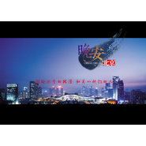

晚安北京 电影原声大碟
============================

|  |  |
| :--: | :-- |
| [ 晚安北京 电影原声大碟](https://emumo.xiami.com/album/29588510) | **艺人**: [阿鲲](../index.md) **语种**: 其他 **唱片公司**: 阿鲲音乐 **发行时间**: 2012年01月01日 **专辑类别**: 原声带, 影视音乐 **专辑风格**: 电影原声 Film Score **播放数**: 9480 **收藏数**: 71 **评论数**: 1  |

## 简介

《晚安北京》故事大背景放了城市化进程加快导致大量青年人过度集中大城市当下高涨房价和越来越紧张资源、环境等问题出现了限房、限车、“清理低端产业”等一系列“限制”政策过快生活节奏、经济压力和继续紧张生存环境使得这些以留北京为理想而苦苦奋斗青年人们开始重新思考和选择去向 …… 
 

   
正如片名一样《晚安北京》故事主旨想给那些为生活奔波“北漂”族以温暖和安慰但影片采用具有文艺气质写实风格将镜头瞄准居无定所、却依旧怀揣梦想“准北京人”以大伟和小安感情以及工作经历为主线讲述了“北漂”“北京梦”故事影片直面们真实生活现状和复杂心理展示了“北漂”大军阶段性迷茫和无奈。
 

与此同时通过故事辅线中大伟老乡李健康和房东刘姐讲述两代“北漂”不同经历际遇和生活现状折射出改革开放三十年城市发展缩影。
 

        
影片所讲述其实每个漂泊城市人心中都有“都市梦”虽然影片故事发生地北京但无论大伟还小安亦或“伪北京人”李建康上海、广州深圳或所有中小城市同样能找到们身影影片通过“北漂”故事讲述所有漂泊北京、上海、广州等所有青年人现状讲述千千万万漂泊奋斗城市中外地人都市梦。 　  

 

作为一部有关期待梦想电影片中温馨励志情感元素也成为一大亮点大伟和小安居无定所虽然无奈但也有穷困浪漫但仍然时不时临时“家”招待三五好友聚会“金钱越来越多感情越来越少”大都市大伟和小安始终没有丢掉最宝贵东西这段“共进退、同吃苦”患难感情也给寂寞都市人情感给予慰藉和信心。

## 曲目

## 评论

|  |  |  |  |
| :-- | :-- | :-- | :-- |
|  [虾米用户](https://emumo.xiami.com/u/13975209) 撸起袖子加油干 2015-04-21 14:01 赞(0) 踩(0) | 
。
 |
