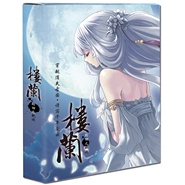

楼兰轮回之轨迹 游戏原声大碟
============================

|  |  |
| :--: | :-- |
| [ 楼兰轮回之轨迹 游戏原声大碟](https://emumo.xiami.com/album/369906) | **艺人**: [阿鲲](../index.md) **语种**: 国语 **唱片公司**: 寰宇之星 **发行时间**: 2010年02月02日 **专辑类别**: 原声带, 影视音乐 **专辑风格**: 中国风 China-Wave **播放数**: 90117 **收藏数**: 277 **评论数**: 41  |

## 简介

《楼兰》故事简介  
  
现代少年，末那，因机缘巧合回到了公元前60年的楼兰。此时的楼兰，局势动荡，外有XX虎视眈眈，内部皇室贵族各自执政。末那，刚到楼兰就因私闯禁地被官兵追捕。并在无意中救下了一位美丽的少女，开始了一段与少女一起的逃亡生活。  
  
其后，一个又一个的神秘人物，陆续出现在末那周围，让他本就颠沛流离的生活更加波折，最终因为自己的力量不足，造成了一世的悲剧。这倒底是怎样的阴谋？真相又是如何？少女的命运是否不能挽救？带着重重疑惑，末那开始了一场救赎之旅。但是更大的谜团，正在那里等待着他…… 

## 曲目

## 评论

|  |  |  |  |
| :-- | :-- | :-- | :-- |
|  [虾米用户](https://emumo.xiami.com/u/1612404) 我有时看不了你们的回复 2018-02-17 23:30 赞(0) 踩(0) | 
这张是阿鲲音乐工作室制作，说明书内有写明制作人员：阿鲲、邱翔帅、尹智、付明铭、邹頔
 |
|  [虾米用户](https://emumo.xiami.com/u/8643814) 我还没想好要写什么... 2017-10-28 00:32 赞(0) 踩(0) | 
什么都不是有点过了本篇结尾赶时间是有点烂尾（主要是没钱 寰宇也不看好），但后面出了个重制版修改了很多剧情算不错了。嘛，国内GAL就这样了。
 |
|  [虾米用户](https://emumo.xiami.com/u/355865) Let it go, l... 2015-08-13 22:34 赞(0) 踩(0) | 
请小编归属到阿鲲 ，参考：<a href="http://www.wlyxmusic.net/thread-3817-1-1.html" target="_blank" rel="nofollow noreferrer noopener">http://www.wlyxmusic.net/thread-3817-1-1.html</a>专辑名：楼兰轮回之轨迹 游戏原声大碟@beson @涗茗 @大莱
 |
| ⇒ |  [虾米用户](https://emumo.xiami.com/u/41190273) 你！到底，怎么肥四啊？！ 2015-08-14 09:38 赞(0) 踩(0) | 
已更改归属~
 |
| ⇒ |  [虾米用户](https://emumo.xiami.com/u/355865) Let it go, l... 2015-08-14 10:18 赞(0) 踩(0) | 
<q><b>爆棚的傲娇气说：</b></q>
 |
| ⇒ |  [虾米用户](https://emumo.xiami.com/u/41190273) 你！到底，怎么肥四啊？！ 2015-08-14 10:39 赞(0) 踩(0) | 
<q><b>Desperado说：</b></q>
 |
| ⇒ |  [虾米用户](https://emumo.xiami.com/u/1612404) 我有时看不了你们的回复 2015-08-25 03:27 赞(0) 踩(0) | 
啊早我几天，刚拿到碟（公司归游戏公司的话，那应该是5R工作室，寰宇是搞策划包装什么的
 |
| ⇒ |  [虾米用户](https://emumo.xiami.com/u/355865) Let it go, l... 2015-08-25 10:48 赞(0) 踩(0) | 
<q><b>管子说：</b></q>
 |
| ⇒ |  [虾米用户](https://emumo.xiami.com/u/1612404) 我有时看不了你们的回复 2015-08-26 02:37 赞(0) 踩(0) | 
<q><b>Desperado说：</b></q>
 |
| ⇒ |  [虾米用户](https://emumo.xiami.com/u/355865) Let it go, l... 2015-08-26 10:38 赞(0) 踩(0) | 
<q><b>管子说：</b></q>
 |
| ⇒ |  [虾米用户](https://emumo.xiami.com/u/1612404) 我有时看不了你们的回复 2018-02-17 23:38 赞(0) 踩(0) | 
<q><b>爆棚的傲娇气说：</b></q>
 |
|  [虾米用户](https://emumo.xiami.com/u/7289656)   2014-02-22 00:23 赞(1) 踩(0) | 
难道觉得这游戏真的很感人的只有我一个人么…………T T当年通关的时候哭了……
 |
| ⇒ |  [虾米用户](https://emumo.xiami.com/u/41033772) 。 2014-10-02 18:22 赞(0) 踩(0) | 
我也**哭了
 |
|  [虾米用户](https://emumo.xiami.com/u/53253) 爱的记忆-我心中的名字 2013-11-28 15:41 赞(0) 踩(0) | 
封面不错··
 |
|  [虾米用户](https://emumo.xiami.com/u/25022951)  2013-10-21 14:34 赞(0) 踩(0) | 
辽远的意蕴
 |
|  [虾米用户](https://emumo.xiami.com/u/9857078)  2013-09-24 23:34 赞(0) 踩(0) | 
初听主题曲就被深深的吸引了。
 |
|  [虾米用户](https://emumo.xiami.com/u/16877583) 挚爱楼兰 2013-07-06 11:37 赞(0) 踩(0) | 
不得不说啊，这音乐和游戏配起来天衣无缝
 |
|  [虾米用户](https://emumo.xiami.com/u/13604826)  2013-03-21 15:42 赞(0) 踩(0) | 
能从音乐中感悟人物的心情，从音乐中看透轮回的沧桑
 |
|  [虾米用户](https://emumo.xiami.com/u/12145631)  2012-12-28 19:41 赞(0) 踩(0) | 
哈哈哈哈
 |
|  [虾米用户](https://emumo.xiami.com/u/4721181)  2012-10-01 11:45 赞(0) 踩(0) | 
中国风.极赞
 |
|  [虾米用户](https://emumo.xiami.com/u/10460084) 愿能一生和虾米在乐海徜徉... 2012-09-27 19:35 赞(0) 踩(0) | 
这也找得到 太棒了~~
 |
|  [虾米用户](https://emumo.xiami.com/u/8643814) 我还没想好要写什么... 2012-09-17 01:09 赞(0) 踩(0) | 
我也喜欢 妹子萌就行了
 |
|  [虾米用户](https://emumo.xiami.com/u/3560442)  2012-08-06 20:19 赞(1) 踩(0) | 
喜欢就是喜欢，没有理由不行吗
 |
|  [虾米用户](https://emumo.xiami.com/u/9292125)  2012-06-24 11:06 赞(4) 踩(0) | 
这款游戏真的不怎么样，但是人设是王道级，配乐是神级，没有他们，这游戏就什么都不是
 |
|  [虾米用户](https://emumo.xiami.com/u/7119519)  2012-05-08 21:55 赞(0) 踩(0) | 
好好听~
 |
|  [虾米用户](https://emumo.xiami.com/u/1199830)  2012-03-14 16:43 赞(0) 踩(0) | 
中国风啊
 |
|  [虾米用户](https://emumo.xiami.com/u/4141336)   2012-03-09 19:14 赞(0) 踩(0) | 
听着这音乐，我又想玩网游，但我的受机。。。捶桌！！！
 |
|  [虾米用户](https://emumo.xiami.com/u/7148029) 学吉他中... 2012-03-08 22:50 赞(0) 踩(0) | 
音乐美啊
 |
|  [虾米用户](https://emumo.xiami.com/u/8315887)   2012-03-06 11:48 赞(0) 踩(0) | 
淡淡的忧桑……
 |
|  [虾米用户](https://emumo.xiami.com/u/7814063)  2012-02-02 17:21 赞(0) 踩(0) | 
好听
 |
|  [虾米用户](https://emumo.xiami.com/u/7814063)  2012-02-02 17:21 赞(0) 踩(0) | 
好听
 |
|  [虾米用户](https://emumo.xiami.com/u/7669556)  2012-01-14 22:52 赞(0) 踩(0) | 
TAT……
 |
|  [虾米用户](https://emumo.xiami.com/u/7288045)  2012-01-02 11:21 赞(1) 踩(0) | 
表示只喜欢灵歌和音乐……
 |
|  [虾米用户](https://emumo.xiami.com/u/1487486)  2011-12-28 11:56 赞(0) 踩(0) | 
游戏很烂，音乐很完美
 |
|  [虾米用户](https://emumo.xiami.com/u/6548189)  2011-11-01 13:48 赞(0) 踩(0) | 
喜欢那份感动
 |
|  [虾米用户](https://emumo.xiami.com/u/1195329)  2011-09-17 05:46 赞(0) 踩(0) | 
听曲见景
 |
|  [虾米用户](https://emumo.xiami.com/u/3164746)  2011-07-08 19:51 赞(0) 踩(0) | 
蛮糟糕窝火的游戏但音乐很美多少减轻了不适感~
 |
|  [虾米用户](https://emumo.xiami.com/u/1904896)  2011-05-24 13:02 赞(0) 踩(0) | 
好听
 |
|  [虾米用户](https://emumo.xiami.com/u/1904896)  2011-05-24 12:54 赞(0) 踩(0) | 
12
 |
|  [虾米用户](https://emumo.xiami.com/u/199381) 一日而尽尝八苦 2010-09-24 16:37 赞(0) 踩(0) | 
为什么中国的游戏音乐都是一个风格。。。。。。。
 |
|  [虾米用户](https://emumo.xiami.com/u/890146)  2010-07-25 00:03 赞(0) 踩(0) | 
这是寰宇新出的游戏？
 |
|  [虾米用户](https://emumo.xiami.com/u/1206214)  2010-07-21 16:29 赞(0) 踩(0) | 
太TM好了~~~
 |
