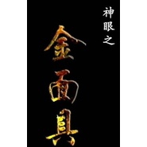

金面具 电影原声大碟
============================

|  |  |
| :--: | :-- |
| [ 金面具 电影原声大碟](https://emumo.xiami.com/album/429511057) | **艺人**: [阿鲲](../index.md) **语种**: 国语 **唱片公司**: 阿鲲音乐 **发行时间**: 2014年04月10日 **专辑类别**: 原声带, 影视音乐 **专辑风格**: 原声 Soundtrack, 电影原声 Film Score **播放数**: 4082 **收藏数**: 40 **评论数**: 2  |

## 简介

《金面具》是“神眼三部曲”中的第一部，讲述的是上世纪六十年代步法神踪(痕迹学)界高人马玉林的传奇人生故事。此次内地新派硬汉小生乌日根凭借扎实精湛的演技与自然不做作的表演风格因而加盟该剧，颠覆以往在剧中给观众朋友留下的“高大权”人物荧屏形象，颠覆出演，挑战60年代警察，在该影片饰演李建军一角，该角色贯穿全剧，为该剧增添不少色彩，是该剧最大的看点之一。

## 曲目

## 评论

|  |  |  |  |
| :-- | :-- | :-- | :-- |
|  [虾米用户](https://emumo.xiami.com/u/10811234) Love Mucic 2015-04-20 20:39 赞(0) 踩(0) | 
赞
 |
|  [虾米用户](https://emumo.xiami.com/u/7322777) ∮ 2015-04-20 17:34 赞(0) 踩(0) | 
收
 |
