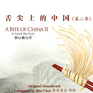

舌尖上的中国2: 民以食为天 原声音乐大碟A Bite of China 2: In Food We Trust (Original Soundtrack)
============================

|  |  |
| :--: | :-- |
| [ 舌尖上的中国2: 民以食为天 原声音乐大碟A Bite of China 2: In Food We Trust (Original Soundtrack)](https://emumo.xiami.com/album/498400083) | **艺人**: [阿鲲](../index.md) **语种**: 其他 **唱片公司**: 阿鲲音乐 **发行时间**: 2014年05月04日 **专辑类别**: 原声带, 影视音乐 **专辑风格**: 原声 Soundtrack, 电视原声 Television Music, 纪录片配乐 Documentary **播放数**: 6566773 **收藏数**: 17574 **评论数**: 1281  |

## 简介

IIIIIIIIIIIIIIIIIIIIIIIIIIIIIIIIIIIIIIIIIIIIIIIIIIIIIII 虾米音乐人·独家首播 IIIIIIIIIIIIIIIIIIIIIIIIIIIIIIIIIIIIIIIIIIIIIIIIIIIIIII  
舌尖上的中国2原声音乐订购攻略:   
虾米MP3下载<a href="http://www.xiami.com/download/pay?id=498400083&amp;type=album" target="_blank" rel="nofollow noreferrer noopener">http://www.xiami.com/download/pay?id=498400083&amp;type=album</a>   
京东商城有普通音质<a href="http://t.cn/8s8ii4L" target="_blank" rel="nofollow noreferrer noopener">http://t.cn/8s8ii4L</a>和无损音质下载<a href="http://t.cn/8sRiE9G" target="_blank" rel="nofollow noreferrer noopener">http://t.cn/8sRiE9G</a>  
舌尖上的中国1实体CD 亚马逊<a href="http://t.cn/8sEMdev" target="_blank" rel="nofollow noreferrer noopener">http://t.cn/8sEMdev</a> 京东<a href="http://item.jd.com/20064585.html" target="_blank" rel="nofollow noreferrer noopener">http://item.jd.com/20064585.html</a> 淘宝<a href="http://t.cn/8sExAKK" target="_blank" rel="nofollow noreferrer noopener">http://t.cn/8sExAKK</a>   
彩铃和高清全曲下载在<a href="http://www.migu.cn/webfront/order/showOrder.do?songId=1001485280&amp;type=color&amp;view=self&amp;loc=P2Z3Y12L1N2&amp;locno=1&amp;cid=001002A" target="_blank" rel="nofollow noreferrer noopener">http://www.migu.cn/webfront/order/showOrder.do?songId=1001485280&amp;type=color&amp;view=self&amp;loc=P2Z3Y12L1N2&amp;locno=1&amp;cid=001002A</a>   
专辑乐曲彩铃<a href="http://www.migu.cn/#/album/1001493284?loc=P1Z1Y1L1N1&amp;locno=2" target="_blank" rel="nofollow noreferrer noopener">http://www.migu.cn/#/album/1001493284?loc=P1Z1Y1L1N1&amp;locno=2</a>     
  
让数亿中国人口水和眼泪齐飞的纪录片《舌尖上的中国》第二季原声大碟由我国著名青年作曲家阿鲲谱写。很多人听着这些音乐“听饿了”，也有很多人“听哭了”:无论是第一集《脚步》结束时白马占堆仰望天空时的曲目“初”，或是听哭了很多人的片尾曲“再会（片尾音乐）”还是最经典的传承舌尖1音乐主题的“劳作的春夏秋2”，展示和制作诱人食物时响起的听饿无数人的“舞”、“唇齿之间”，或是夫妻船捕鱼的配乐“山高水远”等等...首首曲目都是感动了万千大众的经典之作。部分曲目还由悉尼爱乐乐团音乐总监执棒指挥，悉尼顶尖音乐家演奏录制。这都是听觉上的诱人美食和感人故事，你值得拥有。喜欢的朋友还可以下载在路上听。  
  
  
第一集《脚步》  
第一集快结尾时，白马占堆听雨仰望天空，还是踩菇老人的布满皱纹的脸庞，还有那句“认清明天的去向，不忘昨日的来处”让不少观众留下了泪水。小伙伴们也纷纷反应此处的配乐极其煽情。这首曲目为阿鲲亲自弹奏钢琴，辅以交响乐队的动人旋律一齐录制而成，它还有一个很有情怀的名字：“初”   四川老谭夫妇烹饪乐山豆花，渔民杨世橹捕捉跳跳鱼时等的配乐直接让很多网友“听着音乐就饿了”，这是来自于《舌尖上的中国1》原声大碟的两首曲子，名叫“厨房的交响曲(舌尖上的中国插曲)” 和“微观的世界（舌尖上的中国插曲）”你听饿了吗？ 片头有大气也有小清新的曲子也给网友们留下了很深刻的印象，这首曲子既有舌尖1的音乐主题的延续，又有新的舌尖2音乐主题。舌尖2的片头画面也是导演组根据阿鲲的片头曲节奏进行了画面的剪辑，小伙伴们都听出来/看出来了吗？: “舌尖上的中国2片头音乐(舌尖上的中国2插曲)” 很多网友说听片尾曲听着听着就哭了。这种淡淡的忧伤让人联想到第一集《脚步》里面那些令人心酸的人物情绪，虽然阿鲲老师说他是轻轻微笑并惆怅的写完了这首曲子，可能这就是一种高级的忧伤吧。电视播出时是剪辑后的，这里奉献的可是完整版噢！：再会（片尾音乐）(舌尖上的中国2插曲) 夫妻船的故事让人们看到在海上打鱼的不易，也让人看到了平凡的感情有着平凡的感动。情深意重的这首曲目使用了非常现代的鼓节奏配以古琴等乐器，让人看到的是山水，想到的情感。这首曲子是：山高水远(舌尖上的中国2插曲) 白马占堆独自攀爬40米高的大树采蜂蜜的故事给很多人都留下了很深刻的印象，惊险又紧张的音乐更是让人很多都为白马占堆捏了一把汗，这里的音乐叫做：“水与火的艺术2”(舌尖上的中国2插曲) 雷山鱼酱成熟时刻的美味晚餐也就是跟父母分别时的晚餐，苗族留守儿童的故事感动着数万城市打工族，分别时的曲子是来自《舌尖1》专辑里的“夕下（舌尖上的中国插曲）”    
  
第二集《心传》  
虽然说第二集叫做“心传”，不过其中的功夫片段可是让大家开了眼界，不管是制作挂面的肌肉男，还是刀法刀功，看得听得热血沸腾。来下载这首完全由打击乐构成的乐曲“功夫厨房”!  
  
本帮菜 李伯荣的故事给大家的印象很深刻，尤其是最后的“本帮菜厨师端坐大合影”更是拍案叫绝！不少小伙伴们表示此时的音乐也是够大气够酷，也够有内涵有深度。它还有一个传承自第一季的名字：劳动人民的平凡与伟大2 看着制作湖南的糍粑，嘴都馋了！听听此时的配乐“唇齿之间”吧，绝对让你听着听着就饿了！小伙伴们还可以把这首曲子设置为彩铃，让给你打电话的朋友都听饿听馋！  
         
纪录片播放到苏轼糕点时真是又好看又好听，这里的配乐是最最最经典的舌尖上的中国1的音乐主题，据说这首曲子当年曾经远超流行歌曲达到最热歌榜第一位哦！它就是在微博上疯转的： 劳作的春夏秋。还有一首来自舌尖1里的曲子也相当出彩哦：《原野之风》。 它配合了一段相当有重要意义的视频，大家知道它是哪里剧情的配乐吗？         
第二集收尾时呈现的是最有舌尖标志性的音乐：《时间的记忆2》，小编觉得这首曲子实在经典之至：既有开篇的小清新，又有宏大的命运感，据作曲家阿鲲介绍，这首曲子用音乐的光影明暗对比表现了伟大的生命力。

## 曲目

## 评论

|  |  |  |
| :-- | :-- | :-- |
|  [虾米用户](https://emumo.xiami.com/u/42966238) 虾米再见！我爱你！ 2020-05-04 17:32 赞(0) 踩(0) | 
听觉上的中国
 |
|  [虾米用户](https://emumo.xiami.com/u/8337431) 以乐会友 2019-09-08 00:46 赞(0) 踩(0) | 
1272
 |
|  [虾米用户](https://emumo.xiami.com/u/420608591) 道之以德，齐之以礼。 2019-05-07 21:05 赞(0) 踩(0) | 
自古以来民以食为天，中国自古以来就是一个美食国度，美食经常被我们忽略，其实我们每个人的点点滴滴都和美食息息相关从一顿饭，一杯茶都有关，可以说中式美食的品种味道都是没有哪个国家比得上的。舌尖上的中国不仅仅是一部记录片，它从一个国家到一个人再到一道美食都是经过几十年到几百年的演变有自已的风格自己的风味 ，是我们的经典与传承值得我们珍惜和尊重。
 |
|  [虾米用户](https://emumo.xiami.com/u/266399639)  2019-03-29 22:56 赞(0) 踩(0) | 
曲曲景景，历历在目
 |
|  [虾米用户](https://emumo.xiami.com/u/377965643) 我想好了要写什么。 2019-03-07 00:42 赞(0) 踩(0) | 
饿了啊～
 |
|  [虾米用户](https://emumo.xiami.com/u/53017432) 相忘于江湖 2019-02-25 21:10 赞(1) 踩(0) | 
山高水远很棒！
 |
|  [虾米用户](https://emumo.xiami.com/u/39990187)  2019-02-13 11:27 赞(1) 踩(0) | 
我竟然听着《舌尖》的音乐看《流浪地球》原著。
 |
| ⇒ |  [虾米用户](https://emumo.xiami.com/u/262173263) 有多少人灵魂相似，又有多... 2019-02-15 00:36 赞(0) 踩(0) | 
不饿吗？
 |
| ⇒ |  [虾米用户](https://emumo.xiami.com/u/39990187)  2019-02-15 09:05 赞(0) 踩(0) | 
<q><b>遗失的亚述说：</b></q>
 |
|  [虾米用户](https://emumo.xiami.com/u/379642971)  2018-12-30 10:59 赞(0) 踩(0) | 
喜欢
 |
|  [虾米用户](https://emumo.xiami.com/u/61552)   2018-11-04 10:48 赞(0) 踩(0) | 
个人认为最佳的是回味
 |
|  [虾米用户](https://emumo.xiami.com/u/58600154) 我也想像已經死掉了一樣活... 2018-11-02 15:56 赞(0) 踩(0) | 
土地 作物 人 希望 感恩
 |
|  [虾米用户](https://emumo.xiami.com/u/334560218)  2018-08-12 22:50 赞(0) 踩(0) | 
这是一份有味道的歌单
 |
|  [虾米用户](https://emumo.xiami.com/u/236020725) 勿扰…… 2018-06-01 13:07 赞(8) 踩(0) | 
【舌尖上的中国】完全看哭了，当看见小两口在吃母亲给他们带去的咸鸭蛋时，那幸福的味道胜过中了500万大奖！听到有人说过年必须吃母亲包的饺子时 又想起有一位明厨曾说过 其实天下最好的厨师就是我们的母亲，因为我们已经习惯了那股家的味道，那股味道就像乳汁一样 一直孕育着中国几千年&amp;hellip;&amp;hellip;
 |
|  [虾米用户](https://emumo.xiami.com/u/206758094) 滚回去听歌 2018-04-27 16:18 赞(0) 踩(0) | 
我们一直在寻找的其实就是 回家 的路哇！
 |
|  [虾米用户](https://emumo.xiami.com/u/264283064) bye  2018-02-10 09:50 赞(0) 踩(0) | 
△
 |
|  [虾米用户](https://emumo.xiami.com/u/1117665)  2017-10-28 00:35 赞(4) 踩(0) | 
听到这个碟子感觉中国的纪录片原创背景乐有抬头的趋势，制作部门终于开始重视原创精神了。很欣慰，继续加油。
 |
|  [虾米用户](https://emumo.xiami.com/u/8887712)   2017-10-28 00:35 赞(3) 踩(0) | 
原本以为第二部拍出来全为赚钱，现在看来水准不减，近年来最有诚意的国产作品。
 |
|  [虾米用户](https://emumo.xiami.com/u/9049824)  2017-10-28 00:19 赞(0) 踩(0) | 
称之为开饭曲也许不太合适....但我的确饿了 舌尖二季配乐~ 厨房的交响曲 劳动人民的平凡与伟大 XD
 |
|  [虾米用户](https://emumo.xiami.com/u/7663017) 不是猫中偏爱橘 2017-10-28 00:19 赞(7) 踩(0) | 
这部纪录片成功的一大原因是它的音乐很美，比起同类纪录片，《舌尖》里的音乐像是一个浪漫而悠闲的诗人，我非常喜欢。
 |
|  [虾米用户](https://emumo.xiami.com/u/9112658) 这家伙很聪明什么也没留下... 2017-10-27 23:26 赞(0) 踩(0) | 
因为有了这样的音乐，才有故事的心神体会，一部讲食物的纪录片，会随着曲子一直萦绕口水不断流。
 |
|  [虾米用户](https://emumo.xiami.com/u/2819220)  2017-10-27 23:26 赞(1) 踩(0) | 
舌尖的配乐同《舌尖》一样，给了我们一个大大的惊喜！！
 |
|  [虾米用户](https://emumo.xiami.com/u/5924774) 我还没想好要写什么... 2017-10-27 23:16 赞(2) 踩(0) | 
超越了纪录片范畴，简直就是艺术大片。
 |
|  [虾米用户](https://emumo.xiami.com/u/7252278) Rin 2017-10-27 23:16 赞(3) 踩(0) | 
虽然电视剧方面的ost制作真心无法恭维，但央视一些纪录片的OST真心美好的让人流泪。我泱泱中华能人辈出，太值得欣慰了。
 |
|  [虾米用户](https://emumo.xiami.com/u/8507304) 暂无签名~ 2017-10-27 23:16 赞(2) 踩(0) | 
听着每一首，都能想起每一集片尾或幸福或辛酸的但全都满满的淳朴的笑容，越想就越想流泪。时差党不觉得被食物们报复了，就是觉得特别特别想家。
 |
|  [虾米用户](https://emumo.xiami.com/u/13666606)  2017-10-27 23:16 赞(1) 踩(0) | 
好的纪录片必须有好的音乐配合，希望我们奋起直追，超日赶美。阿鲲终成我国一代配乐大师。
 |
|  [虾米用户](https://emumo.xiami.com/u/14863080) 暂无签名~ 2017-10-27 23:15 赞(1) 踩(0) | 
不仅是美食，平凡的感动
 |
|  [虾米用户](https://emumo.xiami.com/u/35894817)  2017-10-27 23:15 赞(1) 踩(0) | 
Zachry！你就是个黑子！在那里骗赞居心不良！万能的央视你都敢黑，谁不知道你有一百多个小号啊 下次再黑央视先看看你拍片的水平有几斤几两 你说这个话的时候就像一个纱布。 桑梓， 我一定想办法让你知道点人事儿！这不是威胁，这是通知！记住了！  大哥，好吧我现在换个姿态给你说 我求求你了不黑央视了，我之前说的你就当开玩笑。我给你道歉我给你送钱，只要你不黑央视，咱们还是可以愉快地玩耍的。
 |
|  [虾米用户](https://emumo.xiami.com/u/2838853) 摇头晃脑下场雨 2017-10-27 23:15 赞(1) 踩(0) | 
太棒了，还是民族的东西最深入人心
 |
|  [虾米用户](https://emumo.xiami.com/u/10644410) 鹤，展开一双翅膀，在彬洲... 2017-10-27 23:15 赞(1) 踩(0) | 
《舌尖上的中国》从中国平常百姓的日常生活和劳作着手，提炼出不平常的东西。感动人们的不是那诱人的食物，而是勤劳工作、用心生活，是制做食物背后艰辛的故事。
 |
|  [虾米用户](https://emumo.xiami.com/u/198036178)  2017-10-05 11:32 赞(1) 踩(0) | 
感人，加油，中国作曲家
 |
|  [虾米用户](https://emumo.xiami.com/u/254968991)  2017-07-05 17:08 赞(1) 踩(0) | 
很好听，很感人。既有西方音乐的典雅又有东方音乐的柔和。中国也有很棒的作曲家
 |
|  [虾米用户](https://emumo.xiami.com/u/7292143)  2017-06-26 11:21 赞(0) 踩(0) | 
日
 |
|  [虾米用户](https://emumo.xiami.com/u/207713353) 我还没想好要写什么... 2016-12-03 01:22 赞(1) 踩(0) | 
莫名的感动 想回去吃团圆饭 一大家子做在一起 摆龙门阵 鞭炮声 老人们的欢笑声 以及早早被母亲叫醒 喊着吃汤圆
 |
|  [虾米用户](https://emumo.xiami.com/u/40042198)  2016-06-13 23:52 赞(1) 踩(0) | 
下厨用bgm
 |
|  [虾米用户](https://emumo.xiami.com/u/79871254)  2016-04-04 00:59 赞(0) 踩(0) | 
配楽我喜
 |
|  [虾米用户](https://emumo.xiami.com/u/49125150) 一念心清净 2016-02-01 05:06 赞(0) 踩(0) | 
初和五味人生是我最喜欢的2首
 |
|  [虾米用户](https://emumo.xiami.com/u/46353928) 少年 孤独穿梭于二三次元 2016-01-10 21:45 赞(0) 踩(0) | 
一年以后，还是有那么多人听。不得不说！！太赞了！
 |
|  [虾米用户](https://emumo.xiami.com/u/31255652) 风格杂乱- 2016-01-09 13:44 赞(1) 踩(0) | 
hhhhh突然想起美元上写着in god we trust 专辑封面是in food we trust 一不小心暴露了我们民族的本性吗（误）
 |
|  [虾米用户](https://emumo.xiami.com/u/98477924)  2016-01-08 19:01 赞(0) 踩(0) | 
231354263524
 |
|  [虾米用户](https://emumo.xiami.com/u/36003230)  2016-01-07 15:01 赞(0) 踩(0) | 
舌尖上的中国,
 |
|  [虾米用户](https://emumo.xiami.com/u/10369162) 我还没想好要写什么... 2015-11-25 05:51 赞(1) 踩(0) | 
身在海外看这部纪录片最有感触, 人终究是忘不了自己的根本的, 或许家乡很小, 但它始终是我们的期盼和牵挂......
 |
|  [虾米用户](https://emumo.xiami.com/u/13983521)  2015-10-23 21:04 赞(0) 踩(0) | 
我喜欢的风格
 |
|  [虾米用户](https://emumo.xiami.com/u/45292992)  2015-10-21 15:55 赞(0) 踩(0) | 
纪录片《舌尖上的中国》第二季 原声
 |
|  [虾米用户](https://emumo.xiami.com/u/54000440)  2015-10-18 23:02 赞(0) 踩(0) | 
再会太好听了。。。虽然超短。。。就像一盘特别精致的小菜。。。
 |
|  [虾米用户](https://emumo.xiami.com/u/49752891) 黑篮，纯情罗曼史，橡皮章... 2015-09-04 15:58 赞(0) 踩(0) | 
听着真舒服，感觉置身最亲切的土地母亲的身上~
 |
|  [虾米用户](https://emumo.xiami.com/u/3524309) go on 2015-09-01 11:04 赞(0) 踩(0) | 
条件反射会饿
 |
|  [虾米用户](https://emumo.xiami.com/u/6467373)  2015-06-24 22:01 赞(1) 踩(0) | 
音乐之外，有丰满、充沛的感情。 仿佛让人坐在飞毯上旅行
 |
|  [虾米用户](https://emumo.xiami.com/u/3482548)  2015-06-23 03:30 赞(1) 踩(0) | 
音乐比片子赞多了
 |
|  [虾米用户](https://emumo.xiami.com/u/12204208) 渐行渐远 2015-06-20 14:31 赞(0) 踩(0) | 
吃货
 |
|  [虾米用户](https://emumo.xiami.com/u/15399804)  2015-06-09 19:46 赞(13) 踩(0) | 
这样的纪录片，这样的音乐，是中国人自己的精神，是中国人的骄傲
 |
|  [虾米用户](https://emumo.xiami.com/u/30374887)  2015-05-27 23:25 赞(0) 踩(0) | 
听着都能流口水。。
 |
|  [虾米用户](https://emumo.xiami.com/u/13814535)  2015-05-23 07:16 赞(2) 踩(0) | 
鲲哥，中国的BGM事业就靠你了，加油！         
 |
|  [虾米用户](https://emumo.xiami.com/u/10789896) 纯音乐 2015-05-12 22:09 赞(1) 踩(0) | 
最I喜欢的   初
 |
|  [虾米用户](https://emumo.xiami.com/u/48146891) 愿我的眼前，有一片晴空 2015-05-01 21:14 赞(1) 踩(0) | 
每次看这部纪录片，我都会想到很多，感动与自豪，永远会记住中国的味道，家长的味道
 |
|  [虾米用户](https://emumo.xiami.com/u/20455959)  2015-05-01 18:34 赞(0) 踩(0) | 
喜欢
 |
|  [虾米用户](https://emumo.xiami.com/u/49699927)  2015-04-30 10:12 赞(0) 踩(0) | 
心灵鸡汤
 |
|  [虾米用户](https://emumo.xiami.com/u/24940349)  2015-04-27 21:53 赞(0) 踩(0) | 
不同于第一季的是 第二季融入了钢琴。让人听出了的沉重 （荡气回肠）的味道。这也可能是让有的人感动要哭原因之一吧。 我个人认为空灵。
 |
|  [虾米用户](https://emumo.xiami.com/u/40753839)  2015-04-21 15:16 赞(0) 踩(0) | 
斯国一！
 |
|  [虾米用户](https://emumo.xiami.com/u/45148153) Bgm Collecto 2015-03-23 13:35 赞(0) 踩(0) | 
初~一听就会流泪想家的曲子。。。
 |
|  [虾米用户](https://emumo.xiami.com/u/12128984) 我讨厌一切不押韵的歌，感... 2015-03-08 14:10 赞(0) 踩(0) | 
非常喜欢！舌尖如果没有这些音乐，相信会逊色一半。
 |
|  [虾米用户](https://emumo.xiami.com/u/4045413) 天天笑一笑，天天心情好。 2015-03-08 10:41 赞(0) 踩(0) | 
超棒！
 |
|  [虾米用户](https://emumo.xiami.com/u/11763330)  2015-02-13 23:36 赞(0) 踩(0) | 
灰常好听
 |
|  [虾米用户](https://emumo.xiami.com/u/10994142) 睡前梦游故事 2015-02-11 21:28 赞(0) 踩(0) | 
初，听得我想家了......太赞了这个专辑！
 |
|  [虾米用户](https://emumo.xiami.com/u/7059130)  2015-02-10 17:19 赞(0) 踩(0) | 
味道
 |
|  [虾米用户](https://emumo.xiami.com/u/27046923) hi music 2015-02-08 23:23 赞(0) 踩(0) | 
如此新鲜时尚的 中国传统风格
 |
|  [虾米用户](https://emumo.xiami.com/u/7873414) 每个人皈依自己的宗教。 2015-02-06 13:24 赞(0) 踩(0) | 
听哭了，简直止不住。
 |
|  [虾米用户](https://emumo.xiami.com/u/21806599) 一生俯首拜阳明 2015-01-31 11:51 赞(0) 踩(0) | 
best
 |
|  [虾米用户](https://emumo.xiami.com/u/9728554)  2015-01-28 21:36 赞(0) 踩(0) | 
中国的美食 确实 是 举世无双！！！！！！！！！！！！！！！！！！！俺在美国真是 做梦都蹲在家门口吃 麻婆豆腐，水煮肉片！！！老火锅 ！！美国的食物真是垃圾透顶！！！！！！
 |
| ⇒ |  [虾米用户](https://emumo.xiami.com/u/9728554)  2015-02-06 14:11 赞(0) 踩(0) | 
<q><b>说：</b></q>
 |
|  [虾米用户](https://emumo.xiami.com/u/42840381) 音乐是灵魂的洗礼 2015-01-27 12:17 赞(0) 踩(0) | 
喜欢的感觉
 |
|  [虾米用户](https://emumo.xiami.com/u/465349)  2015-01-17 14:24 赞(0) 踩(0) | 
中国风。舞蹈
 |
|  [虾米用户](https://emumo.xiami.com/u/213463)  2015-01-14 15:36 赞(0) 踩(0) | 
不错的配乐，nice
 |
|  [虾米用户](https://emumo.xiami.com/u/45892036)  2015-01-11 14:33 赞(0) 踩(0) | 
谢谢阿鲲，给了我们这么好的听觉享受^O^
 |
|  [虾米用户](https://emumo.xiami.com/u/44074680)  2014-12-29 11:54 赞(1) 踩(0) | 
觉得这么好听叉有内涵的音乐是中国的音乐人做出来的，心中真是激动！希望阿鲲能有更多这么好的作品不断涌现。谢谢阿鲲。
 |
|  [虾米用户](https://emumo.xiami.com/u/32947809)  2014-12-26 23:11 赞(0) 踩(0) | 
既有中国韵又有国际范儿！还有我能说我听饿了吗！_(:_」∠)_
 |
|  [虾米用户](https://emumo.xiami.com/u/3592331)  2014-12-25 00:21 赞(0) 踩(0) | 
鲜活动人，这样的音乐才值得尊重！
 |
|  [虾米用户](https://emumo.xiami.com/u/27959547)  2014-12-13 10:03 赞(0) 踩(0) | 
美好
 |
|  [虾米用户](https://emumo.xiami.com/u/9439080)  2014-12-09 17:00 赞(0) 踩(0) | 
喜欢，收藏
 |
|  [虾米用户](https://emumo.xiami.com/u/33513492)  2014-12-03 11:33 赞(0) 踩(0) | 
我在做饭！
 |
|  [虾米用户](https://emumo.xiami.com/u/10132856)  2014-11-30 23:59 赞(0) 踩(0) | 
数中国最喜欢作曲家一定是鲲少了
 |
|  [虾米用户](https://emumo.xiami.com/u/43911155)  2014-11-28 13:02 赞(0) 踩(0) | 
从中国的土地上生长出的音乐，音乐的希望和未来。
 |
|  [虾米用户](https://emumo.xiami.com/u/42535480)  2014-11-27 17:31 赞(0) 踩(0) | 
超级喜欢，我是大吃吃吃货
 |
|  [虾米用户](https://emumo.xiami.com/u/32425446)  2014-11-18 09:45 赞(0) 踩(0) | 
喜歡
 |
|  [虾米用户](https://emumo.xiami.com/u/15725146) 最棒： 2014-11-14 22:51 赞(0) 踩(0) | 
啦啦啦
 |
|  [虾米用户](https://emumo.xiami.com/u/25019056)   2014-11-09 10:13 赞(0) 踩(0) | 
喜欢！
 |
|  [虾米用户](https://emumo.xiami.com/u/9810046) 夏が来た！ 2014-11-05 14:30 赞(0) 踩(0) | 
艺人收藏自己的专辑 噗〜
 |
|  [虾米用户](https://emumo.xiami.com/u/3540115)  2014-11-01 16:41 赞(0) 踩(0) | 
背景音乐
 |
|  [虾米用户](https://emumo.xiami.com/u/7901301)  2014-10-29 17:57 赞(0) 踩(0) | 
喜欢听时间的秘密，一边诧异和窃喜在时间下的食物变化，喜欢听初，一边观察食物与人的联系，一边会心地笑，笑得直想哭。
 |
|  [虾米用户](https://emumo.xiami.com/u/39674650)  2014-10-01 22:21 赞(0) 踩(0) | 
就是喜欢
 |
|  [虾米用户](https://emumo.xiami.com/u/4250749) ...... 2014-09-29 23:35 赞(0) 踩(0) | 
...
 |
|  [虾米用户](https://emumo.xiami.com/u/14099837)  2014-09-24 12:54 赞(1) 踩(0) | 
看纪录片的时候就觉得音乐很好听，这部纪录片能如此成功，音乐也是很重要的一个因素
 |
|  [虾米用户](https://emumo.xiami.com/u/13995286)  2014-09-17 23:38 赞(0) 踩(0) | 
民以食为天
 |
|  [虾米用户](https://emumo.xiami.com/u/41283248)  2014-09-16 10:02 赞(0) 踩(0) | 
音同影
 |
|  [虾米用户](https://emumo.xiami.com/u/14351659)   2014-08-25 22:57 赞(0) 踩(0) | 
好感动
 |
|  [虾米用户](https://emumo.xiami.com/u/40067895) 老王 2014-08-25 17:09 赞(0) 踩(0) | 
原创的乐风，想到了美食的同时，更能体验那宁静的感觉
 |
|  [虾米用户](https://emumo.xiami.com/u/355459)  2014-08-24 04:34 赞(1) 踩(0) | 
有点特色的民乐，虽然不一定是好听的那种，但毕竟开了一个好头，让中国的音乐人有更大的生存空间。
 |
|  [虾米用户](https://emumo.xiami.com/u/9943462)  2014-08-13 10:11 赞(0) 踩(0) | 
太好玩了发现了这个！
 |
|  [虾米用户](https://emumo.xiami.com/u/3400262)  2014-08-11 15:25 赞(0) 踩(0) | 
原声
 |
|  [虾米用户](https://emumo.xiami.com/u/1458906)  2014-08-09 22:39 赞(0) 踩(0) | 
待听。
 |
|  [虾米用户](https://emumo.xiami.com/u/2373126)  2014-07-30 14:32 赞(0) 踩(0) | 
阅
 |
|  [虾米用户](https://emumo.xiami.com/u/30816466)  2014-07-29 22:47 赞(0) 踩(0) | 
真心好听，浓浓的中国风味，光听音乐就会有许多画面，
 |
|  [虾米用户](https://emumo.xiami.com/u/29870880)  2014-07-28 10:09 赞(0) 踩(0) | 
经典配乐
 |
|  [虾米用户](https://emumo.xiami.com/u/31548790)  2014-07-26 22:44 赞(0) 踩(0) | 
2 hits!
 |
|  [虾米用户](https://emumo.xiami.com/u/38916360) 暂无签名~ 2014-07-18 21:25 赞(0) 踩(0) | 
好听cry
 |
|  [虾米用户](https://emumo.xiami.com/u/39119654)  2014-07-18 18:09 赞(0) 踩(0) | 
吃文化
 |
|  [虾米用户](https://emumo.xiami.com/u/3990985) 暂无签名~ 2014-07-17 11:25 赞(0) 踩(0) | 
太棒的原声了，中国音乐人新高度！
 |
|  [虾米用户](https://emumo.xiami.com/u/37711396)  2014-07-17 10:38 赞(0) 踩(0) | 
舌尖
 |
|  [虾米用户](https://emumo.xiami.com/u/38764397)  2014-07-16 00:05 赞(0) 踩(0) | 
是一种标志了 真棒
 |
|  [虾米用户](https://emumo.xiami.com/u/38843841) 暂无签名~ 2014-07-15 01:44 赞(0) 踩(0) | 
听着就饿，真捉急
 |
|  [虾米用户](https://emumo.xiami.com/u/13283110)  2014-07-12 11:24 赞(0) 踩(0) | 
中国风
 |
|  [虾米用户](https://emumo.xiami.com/u/12006870)  2014-07-11 14:41 赞(0) 踩(0) | 
轻松 愉悦
 |
|  [虾米用户](https://emumo.xiami.com/u/6985657)  2014-07-11 08:37 赞(0) 踩(0) | 
身居北方边陲，夜思三秦大地，乡愁啊。
 |
|  [虾米用户](https://emumo.xiami.com/u/32068465) 吃饱了，撑 2014-07-11 00:16 赞(0) 踩(0) | 
很有画面感。谢谢啊鲲。
 |
|  [虾米用户](https://emumo.xiami.com/u/2753469)  2014-07-09 23:15 赞(0) 踩(0) | 
经典！
 |
|  [虾米用户](https://emumo.xiami.com/u/2580584)  2014-07-09 21:19 赞(0) 踩(0) | 
这个必须顶啊！
 |
|  [虾米用户](https://emumo.xiami.com/u/9947216) …… 2014-07-09 21:00 赞(0) 踩(0) | 
终于找到了。太有亲切感。
 |
|  [虾米用户](https://emumo.xiami.com/u/9569992) X 2014-07-08 16:03 赞(0) 踩(0) | 
舌尖是的音乐 好听
 |
|  [虾米用户](https://emumo.xiami.com/u/202418) 聽 而非語 2014-07-08 13:54 赞(0) 踩(0) | 
超爱这样的轻音乐
 |
|  [虾米用户](https://emumo.xiami.com/u/5410886)  2014-07-08 11:05 赞(0) 踩(0) | 
满满的食\欲之情
 |
|  [虾米用户](https://emumo.xiami.com/u/6869669)  2014-07-07 20:51 赞(0) 踩(0) | 
舌尖原声
 |
|  [虾米用户](https://emumo.xiami.com/u/19214903)  2014-07-07 16:10 赞(0) 踩(0) | 
灵动
 |
|  [虾米用户](https://emumo.xiami.com/u/245634) 幻想乡住人 2014-07-06 22:32 赞(0) 踩(0) | 
很棒的音乐
 |
|  [虾米用户](https://emumo.xiami.com/u/24146314)  2014-07-05 15:13 赞(0) 踩(0) | 
听觉上的魅力。
 |
|  [虾米用户](https://emumo.xiami.com/u/19784657) 跟我的心，听心的乐。 2014-07-01 19:32 赞(0) 踩(0) | 
有爱的灵动音乐
 |
|  [虾米用户](https://emumo.xiami.com/u/32655708) 品尝好音乐 2014-06-30 09:16 赞(0) 踩(0) | 
最喜欢的美食节目
 |
|  [虾米用户](https://emumo.xiami.com/u/2858415) 汗水抒写春秋! 2014-06-28 02:16 赞(0) 踩(0) | 
舌尖上的苏牙雷斯
 |
|  [虾米用户](https://emumo.xiami.com/u/15431112)  2014-06-27 22:05 赞(0) 踩(0) | 
看花絮知道原来是澳大利亚管弦乐团演奏的……
 |
|  [虾米用户](https://emumo.xiami.com/u/31502848) Zz 2014-06-22 21:01 赞(0) 踩(0) | 
这居然都有!
 |
|  [虾米用户](https://emumo.xiami.com/u/20562693)  2014-06-21 19:46 赞(0) 踩(0) | 
不错嘛，一听就饿0.0
 |
|  [虾米用户](https://emumo.xiami.com/u/393224) 暂无签名~ 2014-06-21 19:44 赞(0) 踩(0) | 
很喜欢初，听着就想落泪的感觉
 |
| ⇒ |  [虾米用户](https://emumo.xiami.com/u/29989005) 我知道我有一天我会忘记你... 2014-08-08 11:17 赞(0) 踩(0) | 
是啊 每次听初就好伤感
 |
|  [虾米用户](https://emumo.xiami.com/u/8838845) 暂无签名~ 2014-06-21 17:41 赞(0) 踩(0) | 
一听就肚子饿了
 |
|  [虾米用户](https://emumo.xiami.com/u/12261103)  2014-06-18 09:02 赞(0) 踩(0) | 
在很多人热衷各种舶来餐食的当下，无疑这是唤醒我大中国美食的正能量
 |
|  [虾米用户](https://emumo.xiami.com/u/11247261)   2014-06-17 09:10 赞(0) 踩(0) | 
触动人心
 |
|  [虾米用户](https://emumo.xiami.com/u/37630853)  2014-06-15 23:59 赞(0) 踩(0) | 
喜欢
 |
|  [虾米用户](https://emumo.xiami.com/u/37542157)  2014-06-14 18:22 赞(0) 踩(0) | 
123
 |
|  [虾米用户](https://emumo.xiami.com/u/37348239)  2014-06-14 11:38 赞(0) 踩(0) | 
震撼
 |
|  [虾米用户](https://emumo.xiami.com/u/37348239)  2014-06-14 11:38 赞(0) 踩(0) | 
听着音乐想起儿时的味道
 |
|  [虾米用户](https://emumo.xiami.com/u/37561214)  2014-06-14 00:01 赞(0) 踩(0) | 
原汁原味
 |
|  [虾米用户](https://emumo.xiami.com/u/27084278)  2014-06-13 06:19 赞(0) 踩(0) | 
舌尖上的中国2原声音乐
 |
|  [虾米用户](https://emumo.xiami.com/u/30816466)  2014-06-12 00:57 赞(0) 踩(0) | 
听的我想哭了，说多了都是泪啊
 |
|  [虾米用户](https://emumo.xiami.com/u/12288448)  2014-06-11 08:51 赞(0) 踩(0) | 
爱好好
 |
|  [虾米用户](https://emumo.xiami.com/u/2522868)  2014-06-08 18:48 赞(0) 踩(0) | 
非常棒！最喜欢劳动人民的伟大2和回味（人声吟唱）
 |
|  [虾米用户](https://emumo.xiami.com/u/36776923) 倾听属于我的世界的音乐 2014-06-08 13:11 赞(0) 踩(0) | 
听“初”真的听到我喉咙发热的感觉。很有触感的音乐，每个节奏音符都触动我们的神经系统。翩翩起舞，讲述着人情世故，世间万物。平凡而不平常
 |
|  [虾米用户](https://emumo.xiami.com/u/4269628)  2014-06-08 12:57 赞(0) 踩(0) | 
代入感还是多强 明明有些就有故事！！！
 |
|  [虾米用户](https://emumo.xiami.com/u/14470881)  2014-06-08 01:45 赞(0) 踩(0) | 
配乐
 |
|  [虾米用户](https://emumo.xiami.com/u/3334275)  2014-06-07 14:18 赞(0) 踩(0) | 
很棒？？！！！！！！！！
 |
|  [虾米用户](https://emumo.xiami.com/u/37116481)  2014-06-07 11:46 赞(0) 踩(0) | 
很好听！！！！！！！！！！！！！
 |
|  [虾米用户](https://emumo.xiami.com/u/23190483)  2014-06-06 23:27 赞(0) 踩(0) | 
好好好
 |
|  [虾米用户](https://emumo.xiami.com/u/37302017)  2014-06-06 22:40 赞(0) 踩(0) | 
好听音乐入耳
 |
|  [虾米用户](https://emumo.xiami.com/u/10705993)  2014-06-05 23:10 赞(0) 踩(0) | 
终于全部更新了，其实我的最爱是劳动的春夏秋！非常适合配论文
 |
|  [虾米用户](https://emumo.xiami.com/u/13970592) 文不能测字 武不能防身 2014-06-05 15:10 赞(0) 踩(0) | 
每次一听片头曲就想到三国志的请告诉我我不是一个人_(:з」∠)_
 |
| ⇒ |  [虾米用户](https://emumo.xiami.com/u/8901381) 暂无签名~ 2015-01-14 00:35 赞(0) 踩(0) | 
不是，不过你也玩三国志啊→_→
 |
| ⇒ |  [虾米用户](https://emumo.xiami.com/u/13970592) 文不能测字 武不能防身 2015-01-14 00:43 赞(0) 踩(0) | 
<q><b>桑下说：</b></q>
 |
| ⇒ |  [虾米用户](https://emumo.xiami.com/u/8901381) 暂无签名~ 2015-01-14 00:44 赞(0) 踩(0) | 
<q><b>过载青年爱德华说：</b></q>
 |
| ⇒ |  [虾米用户](https://emumo.xiami.com/u/13970592) 文不能测字 武不能防身 2015-01-14 00:45 赞(0) 踩(0) | 
<q><b>桑下说：</b></q>
 |
| ⇒ |  [虾米用户](https://emumo.xiami.com/u/8901381) 暂无签名~ 2015-01-14 00:46 赞(0) 踩(0) | 
<q><b>过载青年爱德华说：</b></q>
 |
| ⇒ |  [虾米用户](https://emumo.xiami.com/u/13970592) 文不能测字 武不能防身 2015-01-14 00:47 赞(0) 踩(0) | 
<q><b>桑下说：</b></q>
 |
| ⇒ |  [虾米用户](https://emumo.xiami.com/u/8901381) 暂无签名~ 2015-01-14 00:49 赞(0) 踩(0) | 
<q><b>过载青年爱德华说：</b></q>
 |
| ⇒ |  [虾米用户](https://emumo.xiami.com/u/13970592) 文不能测字 武不能防身 2015-01-14 00:54 赞(0) 踩(0) | 
<q><b>桑下说：</b></q>
 |
| ⇒ |  [虾米用户](https://emumo.xiami.com/u/8901381) 暂无签名~ 2015-01-14 00:56 赞(0) 踩(0) | 
<q><b>过载青年爱德华说：</b></q>
 |
| ⇒ |  [虾米用户](https://emumo.xiami.com/u/13970592) 文不能测字 武不能防身 2015-01-14 00:58 赞(0) 踩(0) | 
<q><b>桑下说：</b></q>
 |
| ⇒ |  [虾米用户](https://emumo.xiami.com/u/8901381) 暂无签名~ 2015-01-14 01:00 赞(0) 踩(0) | 
<q><b>过载青年爱德华说：</b></q>
 |
| ⇒ |  [虾米用户](https://emumo.xiami.com/u/13970592) 文不能测字 武不能防身 2015-01-14 01:03 赞(0) 踩(0) | 
<q><b>桑下说：</b></q>
 |
| ⇒ |  [虾米用户](https://emumo.xiami.com/u/8901381) 暂无签名~ 2015-01-14 01:04 赞(0) 踩(0) | 
<q><b>过载青年爱德华说：</b></q>
 |
| ⇒ |  [虾米用户](https://emumo.xiami.com/u/13970592) 文不能测字 武不能防身 2015-01-14 01:05 赞(0) 踩(0) | 
<q><b>桑下说：</b></q>
 |
| ⇒ |  [虾米用户](https://emumo.xiami.com/u/8901381) 暂无签名~ 2015-01-14 01:05 赞(0) 踩(0) | 
<q><b>过载青年爱德华说：</b></q>
 |
| ⇒ |  [虾米用户](https://emumo.xiami.com/u/13970592) 文不能测字 武不能防身 2015-01-14 01:06 赞(0) 踩(0) | 
<q><b>桑下说：</b></q>
 |
|  [虾米用户](https://emumo.xiami.com/u/37235523)  2014-06-04 22:57 赞(0) 踩(0) | 
我喜欢
 |
|  [虾米用户](https://emumo.xiami.com/u/13097602)  2014-06-04 20:55 赞(0) 踩(0) | 
应该说是对故乡的怀念更贴切一些，生活的点滴，平时的寻常饭菜，也是解不去的回忆吧
 |
|  [虾米用户](https://emumo.xiami.com/u/973567)  2014-06-04 14:08 赞(0) 踩(0) | 
哦哦，主题和汉斯季默功夫熊猫的musincians village一样一样的
 |
| ⇒ |  [虾米用户](https://emumo.xiami.com/u/3537856) QUQ小鸟是我老婆你们你... 2014-06-04 20:31 赞(0) 踩(0) | 
就最后两个音像还一样一样的【手动斜眼
 |
| ⇒ |  [虾米用户](https://emumo.xiami.com/u/973567)  2014-06-05 09:39 赞(0) 踩(0) | 
<q><b>目鱼桑说：</b></q>
 |
| ⇒ |  [虾米用户](https://emumo.xiami.com/u/973567)  2014-06-05 09:41 赞(0) 踩(0) | 
<q><b>目鱼桑说：</b></q>
 |
| ⇒ |  [虾米用户](https://emumo.xiami.com/u/3537856) QUQ小鸟是我老婆你们你... 2014-06-07 11:02 赞(0) 踩(0) | 
<q><b>haruka说：</b></q>
 |
| ⇒ |  [虾米用户](https://emumo.xiami.com/u/973567)  2014-06-09 10:37 赞(0) 踩(0) | 
<q><b>目鱼桑说：</b></q>
 |
|  [虾米用户](https://emumo.xiami.com/u/1874585) 下次再一起去图书馆 2014-06-04 12:03 赞(0) 踩(0) | 
超爱 最近看疯了
 |
|  [虾米用户](https://emumo.xiami.com/u/37193417) 愿我们都能被这世界温柔以... 2014-06-03 20:06 赞(0) 踩(0) | 
好的音乐能为影视作品起到一个画龙点睛的作用呀！
 |
|  [虾米用户](https://emumo.xiami.com/u/8384206)  2014-06-03 10:52 赞(0) 踩(0) | 
听《初》，真的好想哭
 |
|  [虾米用户](https://emumo.xiami.com/u/6287932)  2014-06-03 00:58 赞(1) 踩(0) | 
太棒了，这部片子因为你的音乐而更出彩，中国的音乐因为你而更骄傲。
 |
|  [虾米用户](https://emumo.xiami.com/u/5800282) 无常逐一升起与熄灭。 2014-06-02 22:53 赞(1) 踩(0) | 
&amp;lt;&amp;lt;脚步&amp;gt;&amp;gt;片末音乐响起之时，那种感动无以言表，只有泪流。
 |
|  [虾米用户](https://emumo.xiami.com/u/2535171)  2014-06-02 18:31 赞(0) 踩(0) | 
意境高远，脱俗除尘，紧扣主题，出神入化，活色生香
 |
|  [虾米用户](https://emumo.xiami.com/u/870735)  2014-06-01 22:17 赞(0) 踩(0) | 
喜欢
 |
|  [虾米用户](https://emumo.xiami.com/u/15750653)  2014-06-01 17:25 赞(0) 踩(0) | 
除了家的味道，还有家的声音。
 |
|  [虾米用户](https://emumo.xiami.com/u/6154811)  2014-06-01 15:44 赞(0) 踩(0) | 
经典。
 |
|  [虾米用户](https://emumo.xiami.com/u/957261)  2014-05-31 22:53 赞(0) 踩(0) | 
最让人感动的是专辑中的第一首--“初”，每每播放感人故事的时候都有这首背景音乐，为片子增色不少，感动！
 |
|  [虾米用户](https://emumo.xiami.com/u/33980195) 大音余栗，啸而醉逐，不复... 2014-05-31 22:41 赞(0) 踩(0) | 
鸟肌啊啊啊啊啊啊啊啊啊啊作业BGM就用它了！！！！！
 |
|  [虾米用户](https://emumo.xiami.com/u/37145850)  2014-05-31 22:14 赞(0) 踩(0) | 
好听推荐
 |
|  [虾米用户](https://emumo.xiami.com/u/154840)  2014-05-31 14:57 赞(0) 踩(0) | 
很惊讶，非常棒的作品
 |
|  [虾米用户](https://emumo.xiami.com/u/154840)  2014-05-31 14:56 赞(0) 踩(0) | 
感动
 |
|  [虾米用户](https://emumo.xiami.com/u/335803) 后知后觉 2014-05-31 11:56 赞(0) 踩(0) | 
我知道你们很多人都在找这个。不用谢我，请叫我红领巾~:)
 |
|  [虾米用户](https://emumo.xiami.com/u/37127650)  2014-05-30 17:54 赞(0) 踩(0) | 
好听
 |
|  [虾米用户](https://emumo.xiami.com/u/5137966)  2014-05-29 23:36 赞(0) 踩(0) | 
好顶赞
 |
|  [虾米用户](https://emumo.xiami.com/u/11415846)  2014-05-29 19:41 赞(0) 踩(0) | 
好听
 |
|  [虾米用户](https://emumo.xiami.com/u/17528480)  2014-05-29 16:13 赞(0) 踩(0) | 
这标志性的BGM…………
 |
|  [虾米用户](https://emumo.xiami.com/u/18421079) Can you feel... 2014-05-29 08:12 赞(0) 踩(0) | 
听了有种要哭的感动
 |
|  [虾米用户](https://emumo.xiami.com/u/712346)  2014-05-28 22:27 赞(1) 踩(0) | 
无论多么山寨搞笑的舌尖，因为你的配乐而熠熠生辉。
 |
| ⇒ |  [虾米用户](https://emumo.xiami.com/u/34953099)  2014-06-01 10:39 赞(0) 踩(0) | 
何来搞笑一说？
 |
|  [虾米用户](https://emumo.xiami.com/u/4151839)  2014-05-28 13:22 赞(0) 踩(0) | 
喜欢，非常喜欢
 |
|  [虾米用户](https://emumo.xiami.com/u/2878198) Live long an... 2014-05-27 21:47 赞(0) 踩(0) | 
我只想评论三个字：很好吃！
 |
|  [虾米用户](https://emumo.xiami.com/u/5663504) 抱着老赵滚床单~~ 2014-05-27 20:29 赞(0) 踩(0) | 
看【秘境】专题的时候，才让我注意到【初】与秘境带来的自然的神秘很切合：人类从自然手中获得馈赠，在未知环境里去发掘食材最纯粹的味道  人类的智慧就在于尊重自然、善用天赐之物。 舌尖2加大的情感元素也升华了美食的基本含义，品味美食既品味人生的酸甜苦辣咸。
 |
|  [虾米用户](https://emumo.xiami.com/u/14043073)  2014-05-27 13:52 赞(0) 踩(0) | 
有种久石让的赶脚
 |
|  [虾米用户](https://emumo.xiami.com/u/37048834)  2014-05-27 00:03 赞(0) 踩(0) | 
吃货是来看食物的，我是来听音乐的
 |
|  [虾米用户](https://emumo.xiami.com/u/143066)   2014-05-26 21:47 赞(0) 踩(0) | 
感觉可以试试~
 |
|  [虾米用户](https://emumo.xiami.com/u/36787233) scenery 2014-05-26 19:37 赞(0) 踩(0) | 
关注
 |
|  [虾米用户](https://emumo.xiami.com/u/33042329) 鼎阿哥 2014-05-26 19:02 赞(0) 踩(0) | 
民族
 |
|  [虾米用户](https://emumo.xiami.com/u/3161061) 游园惊梦 2014-05-26 15:30 赞(0) 踩(0) | 
舌尖上的中国2 配乐 大赞~
 |
|  [虾米用户](https://emumo.xiami.com/u/31980301)  2014-05-26 13:49 赞(0) 踩(0) | 
这配乐太出彩了，国内这样的配乐大师太少了...
 |
|  [虾米用户](https://emumo.xiami.com/u/2973657) 暂无签名~ 2014-05-26 08:44 赞(0) 踩(0) | 
舌尖2内容虽有争议，但配乐绝逼上乘啊！必须赞！
 |
|  [虾米用户](https://emumo.xiami.com/u/37044073) 琴心剑魄今何在 2014-05-26 07:31 赞(0) 踩(0) | 
舌尖上的中国2！这还用多说吗？歌颂的是我大种花家永远的第一号金字招牌！！
 |
|  [虾米用户](https://emumo.xiami.com/u/37044073) 琴心剑魄今何在 2014-05-26 07:31 赞(0) 踩(0) | 
舌尖上的中国2！这还用多说吗？歌颂的是我大种花家永远的第一号金字招牌！！
 |
|  [虾米用户](https://emumo.xiami.com/u/7219454)  2014-05-25 21:50 赞(0) 踩(0) | 
很棒！
 |
|  [虾米用户](https://emumo.xiami.com/u/29619707)  2014-05-25 20:06 赞(0) 踩(0) | 
大家关注科技的话可以上CNET美国站。过去咱家没钱，家大人想给孩子们最好的，总会想些办法，这个办法就是“盗版”，现在孩子们长大了，家里有钱了，愿意的话，尽可能去买“正版”吧。理就是这么个理...
 |
|  [虾米用户](https://emumo.xiami.com/u/29619707)  2014-05-25 19:01 赞(0) 踩(0) | 
关于米字旗和米国的关系，关于北京，南京和东京的关系，我感觉真密切...
 |
|  [虾米用户](https://emumo.xiami.com/u/29619707)  2014-05-25 18:54 赞(0) 踩(0) | 
若是“至高无上”，亲，请打五颗星！五颗星星，来自星星的我们...
 |
|  [虾米用户](https://emumo.xiami.com/u/2156300)  2014-05-25 18:15 赞(0) 踩(0) | 
我的评价javascript:void(0);javascript:void(0);javascript:void(0);jav ascript:void(0);javascript:void(0);
 |
|  [虾米用户](https://emumo.xiami.com/u/29619707)  2014-05-25 18:03 赞(0) 踩(0) | 
关于历史真相，有心人可以去探查一下。但是，民族富强，国家繁荣，必须的是高傲的态度，比信心更强大的是自豪感...再搞个宣传，希望这次Xbox One引进工作顺利，“最美好的事物”就在这个盒子里的光盘上了...
 |
|  [虾米用户](https://emumo.xiami.com/u/29619707)  2014-05-25 16:51 赞(0) 踩(0) | 
万马奔腾的年代，你们说，那段时间，紧张不紧张，各种危机...我说的这句话，现在大家就呵呵一笑完了，都过去了..
 |
|  [虾米用户](https://emumo.xiami.com/u/459414)  2014-05-25 14:13 赞(0) 踩(0) | 
难得国内片子中有这么好的音乐，包括电影
 |
|  [虾米用户](https://emumo.xiami.com/u/2576758) 沉迷电音 2014-05-25 11:35 赞(1) 踩(0) | 
个人钟爱的那段旋律，在山高水远、回味、劳动人民的平凡与伟大2里都有，但最喜欢的还是回味里的童声吟唱，那么恬淡悠远，值得你慢慢回味
 |
|  [虾米用户](https://emumo.xiami.com/u/13401051) 宁静致远 2014-05-25 06:33 赞(0) 踩(0) | 
美呆了
 |
|  [虾米用户](https://emumo.xiami.com/u/11891252) 天助自助 2014-05-24 20:59 赞(0) 踩(0) | 
初和劳动人民的平凡与伟大秒了多少人的泪腺请告诉我T T
 |
|  [虾米用户](https://emumo.xiami.com/u/29619707)  2014-05-24 20:35 赞(0) 踩(0) | 
大片，大片，十足的大片...人间冷暖，悲喜交加；不过，我看到有人说这部片子三观不正，呵呵，老顽固，食色性也嘛。这部片子里除了极品美食还有极品妹子，跟吃的一样，这也只能干流口水了，哈哈...
 |
|  [虾米用户](https://emumo.xiami.com/u/2961906)  2014-05-24 19:38 赞(0) 踩(0) | 
舌尖上的中国
 |
|  [虾米用户](https://emumo.xiami.com/u/874036)  2014-05-24 15:02 赞(0) 踩(0) | 
咬一口中国
 |
|  [虾米用户](https://emumo.xiami.com/u/11125230)  2014-05-24 13:43 赞(0) 踩(0) | 
纯爱
 |
|  [虾米用户](https://emumo.xiami.com/u/1702448)  2014-05-23 23:21 赞(0) 踩(0) | 
觉得片头曲在音乐上很有中国特色同时又很大气的感觉
 |
|  [虾米用户](https://emumo.xiami.com/u/3586948)  2014-05-23 15:54 赞(0) 踩(0) | 
舌尖上的中国，耳膜里的音乐。
 |
|  [虾米用户](https://emumo.xiami.com/u/3896086) 不知道多年之后的心境如何 2014-05-23 10:05 赞(0) 踩(0) | 
娓娓道来
 |
|  [虾米用户](https://emumo.xiami.com/u/35784154)  2014-05-22 17:34 赞(0) 踩(0) | 
完整的交响乐组，现代中国风尚的交响乐
 |
|  [虾米用户](https://emumo.xiami.com/u/34968465)  2014-05-22 16:37 赞(0) 踩(0) | 
其中有些曲子很打动我
 |
|  [虾米用户](https://emumo.xiami.com/u/36898480)  2014-05-22 13:40 赞(0) 踩(0) | 
1
 |
|  [虾米用户](https://emumo.xiami.com/u/5880622)  2014-05-22 11:52 赞(0) 踩(0) | 
舌尖
 |
|  [虾米用户](https://emumo.xiami.com/u/36893798)  2014-05-22 11:35 赞(0) 踩(0) | 
美食不仅是味觉上的享受，更是一种心灵上倾听
 |
|  [虾米用户](https://emumo.xiami.com/u/1347463) 逗比昵称决定逗比头像 2014-05-22 09:19 赞(0) 踩(0) | 
每次看《舌尖》都想哭，都是音乐给闹的。。。
 |
| ⇒ |  [虾米用户](https://emumo.xiami.com/u/19744667)  2014-05-28 02:57 赞(0) 踩(0) | 
同感！原来不知我一人
 |
|  [虾米用户](https://emumo.xiami.com/u/5158287)  2014-05-21 20:46 赞(0) 踩(0) | 
这个音乐听着有种感动的感觉
 |
|  [虾米用户](https://emumo.xiami.com/u/4263550)  2014-05-21 20:06 赞(0) 踩(0) | 
食以载道
 |
|  [虾米用户](https://emumo.xiami.com/u/10749127)  2014-05-21 16:40 赞(0) 踩(0) | 
音乐还是很纯粹的，也有丝丝感动，愿意聆听与分享。
 |
|  [虾米用户](https://emumo.xiami.com/u/10705993)  2014-05-21 05:29 赞(0) 踩(0) | 
简直给力
 |
|  [虾米用户](https://emumo.xiami.com/u/3275867)  2014-05-20 23:41 赞(0) 踩(0) | 
第一步舌尖上的中国我们领略到的是美食，音符单纯而跳跃因为足够分量的画面让我们在视觉上足以承载，而听觉注重的是点缀、提味之用荤素搭配恰到好处。 第二部舌尖上的中国注重的是中国人的饮食情愫，在第一步出现的单纯的音符加入了和声，催生了第二部以情为主打的路线，充分享受美食同时带给人们不一样的情怀，同时让耳朵变得饱满，而使得原本简单的食材和料理变得丰富多彩。
 |
|  [虾米用户](https://emumo.xiami.com/u/19234392) 人生必须有音乐。 2014-05-20 20:48 赞(0) 踩(0) | 
纪录片的音乐总有让人心安的赶脚~
 |
|  [虾米用户](https://emumo.xiami.com/u/24521578)  2014-05-20 19:40 赞(0) 踩(0) | 
【舌尖体评论】工作了一天的人们，拖着疲惫的身体，躺在软软的沙发上，打开网页，闭上眼睛，耳边响起欢快轻灵、或舒缓悠扬的音乐，《舌尖》唯美的画面瞬间就浮现在眼前。这是阿鲲对爱吃爱音乐的人们最好的馈赠，那一刻，整个身心淹没在乐符的跳动中，一道道美食过电般地在脑海里相逢，色、香、味的共同作用，强烈地刺激着大脑和味蕾，此时此刻，我们能感受到的，那只有《舌尖》的美。
 |
|  [虾米用户](https://emumo.xiami.com/u/36830711)  2014-05-20 17:33 赞(0) 踩(0) | 
嗯，光听音乐都会觉得这片子应该还不错的感觉！
 |
|  [虾米用户](https://emumo.xiami.com/u/36829610)  2014-05-20 17:13 赞(0) 踩(0) | 
好听
 |
|  [虾米用户](https://emumo.xiami.com/u/8650265)   2014-05-20 16:03 赞(0) 踩(0) | 
传统纯音乐
 |
|  [虾米用户](https://emumo.xiami.com/u/64554)  2014-05-20 14:53 赞(0) 踩(0) | 
舌尖上的中国
 |
|  [虾米用户](https://emumo.xiami.com/u/20810052)  2014-05-20 14:26 赞(0) 踩(0) | 
赞！
 |
|  [虾米用户](https://emumo.xiami.com/u/3586948)  2014-05-20 14:10 赞(0) 踩(0) | 
淡淡的青阳子总给人向上的力量
 |
|  [虾米用户](https://emumo.xiami.com/u/5618674)   2014-05-20 13:09 赞(0) 踩(0) | 
太赞了！！！！阿鲲！！！
 |
|  [虾米用户](https://emumo.xiami.com/u/13447103)   2014-05-20 12:18 赞(0) 踩(0) | 
赞!
 |
|  [虾米用户](https://emumo.xiami.com/u/903061) 钢琴、吉他独奏控 2014-05-20 11:31 赞(0) 踩(0) | 
感情浓重
 |
|  [虾米用户](https://emumo.xiami.com/u/876114)  2014-05-20 10:29 赞(0) 踩(0) | 
中国风，有韵又味，就像一道食物，可以变幻出不同的精彩，像魔术师般展现属于事物本身的奇妙。
 |
|  [虾米用户](https://emumo.xiami.com/u/5681186)  2014-05-20 10:24 赞(0) 踩(0) | 
我喜欢
 |
|  [虾米用户](https://emumo.xiami.com/u/11887237)  2014-05-20 09:38 赞(0) 踩(0) | 
11
 |
|  [虾米用户](https://emumo.xiami.com/u/20422917) 暂无签名~ 2014-05-20 09:36 赞(0) 踩(0) | 
片头曲大爱啊
 |
|  [虾米用户](https://emumo.xiami.com/u/9087060)  2014-05-20 09:10 赞(0) 踩(0) | 
温暖人心的音乐！
 |
|  [虾米用户](https://emumo.xiami.com/u/9087060)  2014-05-20 09:09 赞(0) 踩(0) | 
温暖至心
 |
|  [虾米用户](https://emumo.xiami.com/u/7409057) 万籁有声，天地无言！ 2014-05-20 08:37 赞(0) 踩(0) | 
这哪里是吃东西，完全是家国情怀，天人感慨！
 |
| ⇒ |  [虾米用户](https://emumo.xiami.com/u/1301603) 音乐是一场快乐的酒宴。 2014-05-20 10:14 赞(0) 踩(0) | 
因为中国的家国史，就是烹调史。
 |
|  [虾米用户](https://emumo.xiami.com/u/33301522) 艾米 2014-05-20 08:32 赞(0) 踩(0) | 
百听不厌，回味无穷
 |
|  [虾米用户](https://emumo.xiami.com/u/350421)  2014-05-20 02:40 赞(0) 踩(0) | 
舒缓
 |
|  [虾米用户](https://emumo.xiami.com/u/6825686)  2014-05-20 02:00 赞(1) 踩(0) | 
有些同样的旋律演奏出不同的节奏，西洋管弦乐演奏出中国风格，太棒了
 |
|  [虾米用户](https://emumo.xiami.com/u/36807836)  2014-05-19 23:31 赞(0) 踩(0) | 
谁不喜欢吃？
 |
|  [虾米用户](https://emumo.xiami.com/u/2169472) Hey,its me 2014-05-19 23:13 赞(0) 踩(0) | 
好啊好o(*￣▽￣*)o
 |
|  [虾米用户](https://emumo.xiami.com/u/990764) 暂无签名~ 2014-05-19 23:11 赞(0) 踩(0) | 
这一个原声碟我很喜欢，希望你也喜欢
 |
|  [虾米用户](https://emumo.xiami.com/u/2038922)   2014-05-19 22:48 赞(1) 踩(0) | 
初，先在节目中听到，那种离别的感情全表现出来，再到专门找这首曲子，闭上眼听，更加清晰、更加忧伤，也像节目说的，中国有多少人都是在背井离乡闯自己一片天地？
 |
|  [虾米用户](https://emumo.xiami.com/u/11702606) 爱你所爱 2014-05-19 21:27 赞(0) 踩(0) | 
岂止是精彩，简直是精彩！
 |
|  [虾米用户](https://emumo.xiami.com/u/11463027) music 2014-05-19 16:59 赞(0) 踩(0) | 
舌尖上的中国,
 |
|  [虾米用户](https://emumo.xiami.com/u/36399657)  2014-05-19 16:21 赞(0) 踩(0) | 
有家乡的感觉和味道
 |
|  [虾米用户](https://emumo.xiami.com/u/488475)  2014-05-19 15:29 赞(1) 踩(0) | 
因为片子喜爱音乐，因为音乐更爱片子。
 |
|  [虾米用户](https://emumo.xiami.com/u/36785525) 我就是爱音乐！！！ 2014-05-19 14:48 赞(0) 踩(0) | 
超级喜欢
 |
|  [虾米用户](https://emumo.xiami.com/u/2819220)  2014-05-19 14:13 赞(0) 踩(0) | 
有三国志的代入感，，，，，
 |
|  [虾米用户](https://emumo.xiami.com/u/11097325) h3nng 2014-05-19 13:45 赞(0) 踩(0) | 
舌尖2 音乐大片~
 |
|  [虾米用户](https://emumo.xiami.com/u/31334989) 暂无签名~ 2014-05-19 13:09 赞(1) 踩(0) | 
才下舌尖，又上心头。
 |
|  [虾米用户](https://emumo.xiami.com/u/25355340)  2014-05-19 12:37 赞(0) 踩(0) | 
感动。。
 |
|  [虾米用户](https://emumo.xiami.com/u/31334989) 暂无签名~ 2014-05-19 12:15 赞(0) 踩(0) | 
才下舌尖，又上心头。
 |
|  [虾米用户](https://emumo.xiami.com/u/25355340)  2014-05-19 12:13 赞(0) 踩(0) | 
感动。。。
 |
|  [虾米用户](https://emumo.xiami.com/u/2010599)  2014-05-19 11:26 赞(0) 踩(0) | 
每一首都很好听诶~~
 |
|  [虾米用户](https://emumo.xiami.com/u/13369881)  2014-05-19 10:31 赞(0) 踩(0) | 
舌尖2音乐比美食更突出啊。
 |
|  [虾米用户](https://emumo.xiami.com/u/6991222)  2014-05-19 10:06 赞(0) 踩(0) | 
真的很好听，每首歌曲子十分打动人心。
 |
|  [虾米用户](https://emumo.xiami.com/u/2458715)  2014-05-19 09:59 赞(0) 踩(0) | 
上来，继续上来
 |
|  [虾米用户](https://emumo.xiami.com/u/33301522) 艾米 2014-05-19 09:41 赞(0) 踩(0) | 
为什么没有收集《劳动的春夏秋2》
 |
|  [虾米用户](https://emumo.xiami.com/u/18556456)  2014-05-19 06:01 赞(0) 踩(0) | 
《初》听差点落泪  听其中几小段和宫崎骏动画里的几乎一样。 是我先入为主还是听错了  其它中国味十足
 |
|  [虾米用户](https://emumo.xiami.com/u/6093546)  2014-05-19 02:12 赞(0) 踩(0) | 
每次听 初 都很想流泪
 |
|  [虾米用户](https://emumo.xiami.com/u/11860399) 以歌会友 2014-05-19 01:40 赞(0) 踩(0) | 
听着初，闭上眼睛，仿佛自己在空中飘着，感觉真好！
 |
|  [虾米用户](https://emumo.xiami.com/u/26167049)   2014-05-19 00:14 赞(1) 踩(0) | 
没看舌尖，就来听了。。听出了一点点久石让的感觉。。幸好先听了。。。不然看完电视不知道在听會听出甚么感觉=皿=
 |
|  [虾米用户](https://emumo.xiami.com/u/6538758) who cares 2014-05-18 22:10 赞(1) 踩(0) | 
擦！！！！！！！！！！！！！赞到极点！！！！！！！！！！！！！！！！！！！！！！！！！
 |
|  [虾米用户](https://emumo.xiami.com/u/2085785)  2014-05-18 21:53 赞(0) 踩(0) | 
很赞，必须支持下噶，O(∩_∩)O~
 |
|  [虾米用户](https://emumo.xiami.com/u/3635068) So, what's y... 2014-05-18 21:42 赞(0) 踩(0) | 
封面真心不错
 |
| ⇒ |  [虾米用户](https://emumo.xiami.com/u/8105268)   2014-05-19 00:30 赞(0) 踩(0) | 
这位兄弟头像是don吧？
 |
| ⇒ |  [虾米用户](https://emumo.xiami.com/u/3635068) So, what's y... 2014-05-20 01:11 赞(0) 踩(0) | 
<q><b>翎驭说：</b></q>
 |
|  [虾米用户](https://emumo.xiami.com/u/33841498)  2014-05-18 21:21 赞(0) 踩(0) | 
如果避开那些食物和吃相在大脑中的影像投射，这些音乐适合写东西的时候听！
 |
|  [虾米用户](https://emumo.xiami.com/u/33841498)  2014-05-18 21:10 赞(0) 踩(0) | 
如果没有避开食物和吃相的影响，这些音乐适合写东西的时候听！
 |
|  [虾米用户](https://emumo.xiami.com/u/5987659)  2014-05-18 20:58 赞(0) 踩(0) | 
好听！
 |
|  [虾米用户](https://emumo.xiami.com/u/16647491)  2014-05-18 20:37 赞(0) 踩(0) | 
吃貨正能量！
 |
|  [虾米用户](https://emumo.xiami.com/u/5433717)  2014-05-18 18:05 赞(0) 踩(0) | 
最喜欢《山高水远》
 |
|  [虾米用户](https://emumo.xiami.com/u/36171177)  2014-05-18 17:15 赞(0) 踩(0) | 
最喜欢“初”这个插曲。很动心。
 |
| ⇒ |  [虾米用户](https://emumo.xiami.com/u/11860399) 以歌会友 2014-05-19 01:39 赞(0) 踩(0) | 
我也很喜欢
 |
|  [虾米用户](https://emumo.xiami.com/u/36750406)  2014-05-18 16:54 赞(0) 踩(0) | 
希望尽快出完全部29首啊。。。
 |
|  [虾米用户](https://emumo.xiami.com/u/1479991)  2014-05-18 15:11 赞(0) 踩(0) | 
时而欢快 时而宏大 时而小家碧玉 时而大家闺秀
 |
|  [虾米用户](https://emumo.xiami.com/u/8803896) 秋，你留下。梅，你不行。 2014-05-18 14:38 赞(0) 踩(0) | 
终于找到全部了
 |
|  [虾米用户](https://emumo.xiami.com/u/7072637)  2014-05-18 14:27 赞(0) 踩(0) | 
竟然还有这样的专辑！好顶赞！
 |
|  [虾米用户](https://emumo.xiami.com/u/13551994) 音为爱 2014-05-18 14:17 赞(0) 踩(0) | 
舌尖上的中国,
 |
|  [虾米用户](https://emumo.xiami.com/u/411995) 给我双筷子我可以吃下地球 2014-05-18 13:51 赞(0) 踩(0) | 
听醉了
 |
|  [虾米用户](https://emumo.xiami.com/u/29619707)  2014-05-18 11:51 赞(0) 踩(0) | 
现在的歌者太过教条，专业非专业，专科非专科...弦动我心，痛彻心扉，这是悲，感同身受，才能落泪...喜该如何表达呢？何谓大，何谓小？无病呻吟...我爱我的家，我爱我的国，顶天立地的男儿汉，谁人不是？爱该如何表达？有心才有爱...
 |
| ⇒ |  [虾米用户](https://emumo.xiami.com/u/26167049)   2014-05-19 00:17 赞(0) 踩(0) | 
今天新闻说了，鱼生不能吃了。。。=    =
 |
|  [虾米用户](https://emumo.xiami.com/u/571372) 爱音乐 爱生活 2014-05-18 11:14 赞(0) 踩(0) | 
音乐写的不错，但怎么听都像外国人写中国音乐，不像是土生土长的中国人写的东西。
 |
|  [虾米用户](https://emumo.xiami.com/u/13992810)  2014-05-18 10:35 赞(0) 踩(0) | 
非常的优秀，世界级的音乐，燃起
 |
|  [虾米用户](https://emumo.xiami.com/u/11631318) 暂无签名~ 2014-05-18 08:58 赞(0) 踩(0) | 
美食的广阔富存，与音乐的恢弘大气一起造就了这久盛不衰的古老的味道！
 |
|  [虾米用户](https://emumo.xiami.com/u/3390770)  2014-05-18 08:32 赞(0) 踩(0) | 
配乐的质量相当高啊~ 赞一个
 |
|  [虾米用户](https://emumo.xiami.com/u/3389582)  2014-05-18 01:17 赞(0) 踩(0) | 
原声什么的最喜欢了，这张绝对可以和小日本PK了。
 |
|  [虾米用户](https://emumo.xiami.com/u/31135233) 这家伙懒得打字。 2014-05-18 01:15 赞(0) 踩(0) | 
炒鸡棒的啊！
 |
|  [虾米用户](https://emumo.xiami.com/u/8340451) 起风了，要努力生存。 2014-05-18 00:26 赞(0) 踩(0) | 
音乐和美食一样好
 |
|  [虾米用户](https://emumo.xiami.com/u/15479317) 金奖冷场王 音乐懒乞丐 2014-05-18 00:16 赞(1) 踩(0) | 
心尖上的回响
 |
|  [虾米用户](https://emumo.xiami.com/u/6968609) 暂无签名~ 2014-05-17 23:43 赞(0) 踩(0) | 
配乐很不错啊
 |
|  [虾米用户](https://emumo.xiami.com/u/10857026)  2014-05-17 22:39 赞(0) 踩(0) | 
配合界面的画面，和舌尖的解说词，每次都让我眼眶湿润。谁说中国没有好原声作品！！！怒赞
 |
|  [虾米用户](https://emumo.xiami.com/u/6477411)  2014-05-17 21:20 赞(0) 踩(0) | 
比一融合了更多元素
 |
|  [虾米用户](https://emumo.xiami.com/u/20010220) 热爱音乐，享受生活 2014-05-17 21:03 赞(0) 踩(0) | 
山高水远 这首好喜欢
 |
|  [虾米用户](https://emumo.xiami.com/u/8409759)  2014-05-17 20:52 赞(1) 踩(0) | 
第五集目测本季最佳，赞。不反对人文情怀，但逻辑不清轻重不分剪辑混乱煽情过重那就别怨观众不满意。虽则正片如何，但音乐却是比第一季更细腻，很喜欢。只是听音乐，就满满的温暖，那是纪录片留下的感动，食物连通记忆的感觉，凡是离开故乡离开家人后怀念与思念所拥有的感受。
 |
|  [虾米用户](https://emumo.xiami.com/u/13242344) TO BE NO.1 2014-05-17 20:49 赞(0) 踩(0) | 
简直给力！
 |
|  [虾米用户](https://emumo.xiami.com/u/5853144) 暂无签名~ 2014-05-17 20:06 赞(0) 踩(0) | 
音乐从第一季赞到第二季
 |
|  [虾米用户](https://emumo.xiami.com/u/18295864) 爱永恒，音乐无限！ 2014-05-17 18:43 赞(0) 踩(0) | 
整部碟里最喜欢第二首，片首曲，配合舌尖2的片头，太美了也许第2季里有太多美食外的东西，但我喜欢里面有些部分散发出的浓浓的乡情！
 |
|  [虾米用户](https://emumo.xiami.com/u/14939221)  2014-05-17 18:03 赞(0) 踩(0) | 
爸，你应该能听出来这是什么里面的音乐吧！我喜欢第一首，总是有浓浓的思乡情在里面，每次听都会想起你和妈！我爱你们！
 |
|  [虾米用户](https://emumo.xiami.com/u/7194204)  2014-05-17 17:38 赞(0) 踩(0) | 
他的音乐会让人鸡皮疙瘩一起，听着有种说不出的感动和温暖，为这纪录片本身增加了一股人文情怀。
 |
|  [虾米用户](https://emumo.xiami.com/u/19709629) 千秋文人侠客梦 2014-05-17 17:19 赞(0) 踩(0) | 
吃货
 |
|  [虾米用户](https://emumo.xiami.com/u/34953099)  2014-05-17 17:08 赞(0) 踩(0) | 
筷子夹面的方法不科学。。。。
 |
|  [虾米用户](https://emumo.xiami.com/u/7433263)  2014-05-17 16:08 赞(0) 踩(0) | 
全是midi，没有用真乐器，真省钱啊。。。
 |
| ⇒ |  [虾米用户](https://emumo.xiami.com/u/34953099)  2014-05-17 17:15 赞(0) 踩(0) | 
不是midi，起码不全是。<a href="http://v.youku.com/v_show/id_XNjk5OTgyOTA0.html?x&amp;amp;sharefrom=android" target="_blank" rel="nofollow noreferrer noopener">http://v.youku.com/v_show/id_XNjk5OTgyOTA0.html?x&amp;amp;sharefrom=android</a>
 |
| ⇒ |  [虾米用户](https://emumo.xiami.com/u/23360024)  2014-05-18 21:45 赞(0) 踩(0) | 
现在配乐很少有录制的吧？而且又不是midi音源。。
 |
| ⇒ |  [虾米用户](https://emumo.xiami.com/u/11395607)  2014-05-19 03:16 赞(0) 踩(0) | 
大哥，你没看过介绍吗？乐团伴奏啊
 |
| ⇒ |  [虾米用户](https://emumo.xiami.com/u/33980195) 大音余栗，啸而醉逐，不复... 2014-05-31 22:40 赞(0) 踩(0) | 
爱乐乐团录制的哦这可是……听不出midi和实录的区别么……OTL
 |
| ⇒ |  [虾米用户](https://emumo.xiami.com/u/7433263)  2014-07-15 17:52 赞(0) 踩(0) | 
<q><b>拼了#_@!!!说：</b></q>
 |
| ⇒ |  [虾米用户](https://emumo.xiami.com/u/11395607)  2014-07-17 15:54 赞(0) 踩(0) | 
<q><b>张渠说：</b></q>
 |
|  [虾米用户](https://emumo.xiami.com/u/8752762) 暂无签名~ 2014-05-17 15:01 赞(0) 踩(0) | 
好音乐，不多说！
 |
|  [虾米用户](https://emumo.xiami.com/u/4905163) 滚石不生苔 2014-05-17 13:04 赞(0) 踩(0) | 
劳动人民的平凡与伟大！！！
 |
|  [虾米用户](https://emumo.xiami.com/u/1161870)  2014-05-17 12:28 赞(0) 踩(0) | 
我只想说这个封面很像《日和》的开头。。。
 |
|  [虾米用户](https://emumo.xiami.com/u/355865) Let it go, l... 2014-05-17 12:27 赞(0) 踩(0) | 
<a href="http://emumo.xiami.com/u/30705" target="_blank" rel="nofollow" name_card="30705">@beson</a> 那个重复曲目你到底想怎样啦！
 |
| ⇒ |  [虾米用户](https://emumo.xiami.com/u/30705) 我还没想好要写什么... 2014-05-17 12:59 赞(0) 踩(0) | 
你应该问阿鲲……我们该反应的都反应了……
 |
| ⇒ |  [虾米用户](https://emumo.xiami.com/u/355865) Let it go, l... 2014-05-17 13:25 赞(0) 踩(0) | 
<q><b>beson说：</b></q>
 |
|  [虾米用户](https://emumo.xiami.com/u/467978) 静观众妙 2014-05-17 12:21 赞(0) 踩(0) | 
劳动人民的平凡与伟大2  很感人，有股神秘东方的色彩⋯
 |
| ⇒ |  [虾米用户](https://emumo.xiami.com/u/20010220) 热爱音乐，享受生活 2014-05-17 21:07 赞(0) 踩(0) | 
同感,特别是开头的一段
 |
| ⇒ |  [虾米用户](https://emumo.xiami.com/u/467978) 静观众妙 2014-05-22 16:54 赞(0) 踩(0) | 
<q><b>Monoblue说：</b></q>
 |
|  [虾米用户](https://emumo.xiami.com/u/1730236)   2014-05-17 11:57 赞(0) 踩(0) | 
很喜欢《初》这首钢琴为主弦的音乐，其他曲目充满了中国风
 |
|  [虾米用户](https://emumo.xiami.com/u/1163468)  2014-05-17 11:38 赞(0) 踩(0) | 
伴随着感动的眼泪的旋律
 |
|  [虾米用户](https://emumo.xiami.com/u/15400788) 林子大了，什么鸟都有 2014-05-17 09:00 赞(0) 踩(0) | 
但真的好棒
 |
|  [虾米用户](https://emumo.xiami.com/u/15400788) 林子大了，什么鸟都有 2014-05-17 09:00 赞(0) 踩(0) | 
厨房交响曲2没有一的好
 |
|  [虾米用户](https://emumo.xiami.com/u/2655767) 我是大吃货 2014-05-17 02:28 赞(0) 踩(0) | 
居然有人给一星，绝对要以最坏的恶意揣度你
 |
|  [虾米用户](https://emumo.xiami.com/u/12765103) I LOVE MUSIC 2014-05-16 22:16 赞(0) 踩(0) | 
很棒的配乐
 |
|  [虾米用户](https://emumo.xiami.com/u/36681140) 分享精彩 | 分享快乐 2014-05-16 21:19 赞(0) 踩(0) | 
q
 |
|  [虾米用户](https://emumo.xiami.com/u/18587057) 安静 2014-05-16 21:11 赞(0) 踩(0) | 
温暖 安静 感动
 |
|  [虾米用户](https://emumo.xiami.com/u/18587057) 安静 2014-05-16 21:10 赞(0) 踩(0) | 
温暖 感动
 |
|  [虾米用户](https://emumo.xiami.com/u/3468124) 来自生人勿近。 2014-05-16 21:05 赞(0) 踩(0) | 
那两个点弱的什么心态，手滑吗？
 |
|  [虾米用户](https://emumo.xiami.com/u/6863020)  2014-05-16 20:50 赞(0) 踩(0) | 
在这旋律之中始终能感受到一种浓浓的情感，却无法用语言形容……看到第二季的副标题才恍然大悟
 |
|  [虾米用户](https://emumo.xiami.com/u/28210219)  2014-05-16 20:45 赞(0) 踩(0) | 
简直如同条件反射，听到片头就感觉腹中空空，听到《初》便莫名落泪，感谢纪录片与音乐交融的力量
 |
|  [虾米用户](https://emumo.xiami.com/u/8065805)  2014-05-16 15:28 赞(0) 踩(0) | 
东瀛味道浓烈
 |
|  [虾米用户](https://emumo.xiami.com/u/2598210) cindy1981021 2014-05-16 15:02 赞(0) 踩(0) | 
真的好
 |
|  [虾米用户](https://emumo.xiami.com/u/2598210) cindy1981021 2014-05-16 14:56 赞(0) 踩(0) | 
真的好
 |
|  [虾米用户](https://emumo.xiami.com/u/1789729)  2014-05-16 14:54 赞(0) 踩(0) | 
满满感动——春夏最强番 希望在越来越多的中国影视作品里看到高水平的配乐！
 |
|  [虾米用户](https://emumo.xiami.com/u/125931)  2014-05-16 14:41 赞(0) 踩(0) | 
听着就想哭
 |
|  [虾米用户](https://emumo.xiami.com/u/34323665)   2014-05-16 12:26 赞(0) 踩(0) | 
好听
 |
|  [虾米用户](https://emumo.xiami.com/u/1101905)  2014-05-16 09:52 赞(0) 踩(0) | 
我也觉得和熊猫人之谜的BGM有相似的地方
 |
|  [虾米用户](https://emumo.xiami.com/u/991704) 音乐，开心时入耳，伤心时... 2014-05-16 02:36 赞(0) 踩(0) | 
饿了
 |
|  [虾米用户](https://emumo.xiami.com/u/5832341)  2014-05-15 22:24 赞(0) 踩(0) | 
感觉飘在云端！
 |
|  [虾米用户](https://emumo.xiami.com/u/36648483)  2014-05-15 22:18 赞(0) 踩(0) | 
henxihuan
 |
|  [虾米用户](https://emumo.xiami.com/u/36527261) 来来去去 2014-05-15 20:07 赞(0) 踩(0) | 
《舌尖2》，女儿看的很痴迷。喜欢其中的美食和乐曲，每每听到，都很感动。
 |
|  [虾米用户](https://emumo.xiami.com/u/1477205) Oh~Yeah 2014-05-15 17:47 赞(0) 踩(0) | 
国内比较看好的作曲家的作品
 |
|  [虾米用户](https://emumo.xiami.com/u/13666606)  2014-05-15 13:34 赞(0) 踩(0) | 
音乐品质更好，国际水平了，可以秒杀NHK纪录片，不过节目有些偏题了，就只剩音乐了
 |
|  [虾米用户](https://emumo.xiami.com/u/3088828) 虾米是用来拓荒的宇宙飞船... 2014-05-15 13:16 赞(0) 踩(0) | 
比第一部更好听，更婉转动情，催泪利器《初》《劳动人民的平凡与伟大2》，以及燃爆的《功夫厨房》《水与火的艺术2》，强推。
 |
|  [虾米用户](https://emumo.xiami.com/u/3088828) 虾米是用来拓荒的宇宙飞船... 2014-05-15 13:14 赞(0) 踩(0) | 
质量比第一部还要更好，《》
 |
|  [虾米用户](https://emumo.xiami.com/u/9026935) 路，还是那条路，只是每天... 2014-05-15 12:57 赞(1) 踩(0) | 
我只会烧龙虾，但我老婆只吃我烧的龙虾，外面的一概不吃。有一天星期六，老婆买龙虾回来让我烧，因为忙，所以烧糊了，她一天都没理我。第二天重新买龙虾回来补上，当龙虾端上桌的那一刻，老婆笑了，笑得跟蜜糖似的！O(∩_∩)O
 |
| ⇒ |  [虾米用户](https://emumo.xiami.com/u/2189074)  2014-05-19 11:16 赞(0) 踩(0) | 
每次回uk 蓝朋友都会做芹菜羊肉和辣子鸡给我 吃下去的满满都是幸福和思念
 |
|  [虾米用户](https://emumo.xiami.com/u/36597933)  2014-05-15 09:30 赞(0) 踩(0) | 
感觉《初》跟《再会》跟电影《风声》里面的插曲有许多很像的地方
 |
|  [虾米用户](https://emumo.xiami.com/u/36617928)  2014-05-15 09:15 赞(0) 踩(0) | 
听得好饿~
 |
|  [虾米用户](https://emumo.xiami.com/u/4338508)   2014-05-14 23:55 赞(0) 踩(0) | 
因为喜欢这部纪录片
 |
|  [虾米用户](https://emumo.xiami.com/u/2243220) _(:3」2)_ 2014-05-14 21:17 赞(0) 踩(0) | 
适合在写论文时当BGM在耳边循环QAQ
 |
|  [虾米用户](https://emumo.xiami.com/u/8379360) 有些人一辈子不能离开一个 2014-05-14 20:56 赞(0) 踩(0) | 
轻音乐
 |
|  [虾米用户](https://emumo.xiami.com/u/10148467)  2014-05-14 11:49 赞(0) 踩(0) | 
思乡
 |
|  [虾米用户](https://emumo.xiami.com/u/7382446)  2014-05-14 11:31 赞(0) 踩(0) | 
感动！！！
 |
|  [虾米用户](https://emumo.xiami.com/u/9704645) 铭记或遗忘让时间一如既往 2014-05-14 11:11 赞(2) 踩(0) | 
《舌尖》的成功当然首功于那些地道的美食，却也离不开这些动人的音乐。向创作者致敬！
 |
|  [虾米用户](https://emumo.xiami.com/u/11538372)  2014-05-14 10:52 赞(0) 踩(0) | 
和内容配合很好
 |
|  [虾米用户](https://emumo.xiami.com/u/19973326)  2014-05-14 10:46 赞(0) 踩(0) | 
又一张经典之作，大气，上当次，不愧是中国乐魂。
 |
|  [虾米用户](https://emumo.xiami.com/u/36553451)  2014-05-14 10:32 赞(0) 踩(0) | 
原声大碟
 |
|  [虾米用户](https://emumo.xiami.com/u/33594053) 暂无签名~ 2014-05-14 00:04 赞(2) 踩(0) | 
这音乐太棒了，把我们中国美食的味道都写出来了
 |
|  [虾米用户](https://emumo.xiami.com/u/8089857)   2014-05-13 22:10 赞(0) 踩(0) | 
然后我在听这个。
 |
|  [虾米用户](https://emumo.xiami.com/u/1634272) 音乐体现一个人的品格 2014-05-13 17:50 赞(1) 踩(0) | 
品味食物在音乐里的味道，饱了耳朵馋了胃
 |
|  [虾米用户](https://emumo.xiami.com/u/9532466) 跟着音乐  收起你的肮脏 2014-05-13 17:44 赞(3) 踩(0) | 
中国人吃饭要的不是吃什么东西，要的是人情，是交杯换盏的寒暄，是实实在在的烟火气。
 |
|  [虾米用户](https://emumo.xiami.com/u/1913732)  2014-05-13 16:38 赞(0) 踩(0) | 
香
 |
|  [虾米用户](https://emumo.xiami.com/u/7815067) 就这样听着音乐 只有音乐 2014-05-13 14:46 赞(1) 踩(0) | 
一档美食节目却集集带给我感动，冲这个也得顶一下
 |
|  [虾米用户](https://emumo.xiami.com/u/33063620) 我就是我不论好与坏 2014-05-13 14:03 赞(0) 踩(0) | 
触到心灵深处
 |
|  [虾米用户](https://emumo.xiami.com/u/2588431) H先生 2014-05-13 13:55 赞(0) 踩(0) | 
非常棒的原创音乐！更好听了！
 |
|  [虾米用户](https://emumo.xiami.com/u/5556866) We the lives 2014-05-13 12:33 赞(0) 踩(0) | 
《舌尖》还真有原声碟啊！
 |
|  [虾米用户](https://emumo.xiami.com/u/3903669)  2014-05-13 11:59 赞(1) 踩(0) | 
喜欢~~大气磅礴之势
 |
|  [虾米用户](https://emumo.xiami.com/u/737688)  2014-05-13 11:08 赞(1) 踩(0) | 
第二季在历数美食的同时融入更多人文情怀，听音乐时能感受到种种的美食与个个鲜活人生。
 |
|  [虾米用户](https://emumo.xiami.com/u/8389487) SOS团员 2014-05-13 10:17 赞(1) 踩(0) | 
竹林间的翠绿，厚土下的生机，勤劳朴实人民的家园深情，根植于土地的美味真谛，让人们知道了美食真正的含义。
 |
|  [虾米用户](https://emumo.xiami.com/u/627329)  2014-05-13 00:20 赞(0) 踩(0) | 
感觉原声相对前作有很大提升，也可能是前作原声集选曲不当的原因，总觉得一季的原声集没有几首耐听的。 二的原声虽说还未完全公布，但是已公布曲目基本上曲曲都不错，尤其是「初」。
 |
|  [虾米用户](https://emumo.xiami.com/u/36516383)  2014-05-12 15:07 赞(0) 踩(0) | 
haoting
 |
|  [虾米用户](https://emumo.xiami.com/u/2709236)  2014-05-12 13:46 赞(0) 踩(0) | 
难得画面和音乐一样美的记录片!
 |
|  [虾米用户](https://emumo.xiami.com/u/33180709)  2014-05-12 12:09 赞(0) 踩(0) | 
很现代的音乐，但是从中能听出传统中国的音符。
 |
|  [虾米用户](https://emumo.xiami.com/u/8301818) 暂无签名~ 2014-05-12 10:44 赞(0) 踩(0) | 
好棒啊 每一首都很好听
 |
|  [虾米用户](https://emumo.xiami.com/u/660388)  2014-05-12 09:42 赞(0) 踩(0) | 
饭前听一听, 不瞌睡~~
 |
|  [虾米用户](https://emumo.xiami.com/u/10951428)  2014-05-12 09:23 赞(0) 踩(0) | 
悠扬深沉
 |
|  [虾米用户](https://emumo.xiami.com/u/5703509)  2014-05-12 08:21 赞(0) 踩(0) | 
VERY 好听
 |
|  [虾米用户](https://emumo.xiami.com/u/10705993)  2014-05-12 01:22 赞(0) 踩(0) | 
更新点赞
 |
|  [虾米用户](https://emumo.xiami.com/u/33595194)  2014-05-11 23:32 赞(0) 踩(0) | 
很好。
 |
|  [虾米用户](https://emumo.xiami.com/u/8879031)  2014-05-11 23:18 赞(0) 踩(0) | 
这首好啊.
 |
|  [虾米用户](https://emumo.xiami.com/u/630382) 分类真是件浩瀚的工程 2014-05-11 22:59 赞(0) 踩(0) | 
很棒
 |
|  [虾米用户](https://emumo.xiami.com/u/6926483)  2014-05-11 22:04 赞(0) 踩(0) | 
手动点赞！听到条件反射是好吃的……
 |
|  [虾米用户](https://emumo.xiami.com/u/10620580)  2014-05-11 21:37 赞(0) 踩(0) | 
民族的世界的
 |
|  [虾米用户](https://emumo.xiami.com/u/9150007) 計画通り 2014-05-11 21:06 赞(0) 踩(0) | 
反射性分泌口水╮(╯▽╰)╭
 |
|  [虾米用户](https://emumo.xiami.com/u/36187318)  2014-05-11 20:58 赞(0) 踩(0) | 
第二季更多的是感动。音乐太美
 |
|  [虾米用户](https://emumo.xiami.com/u/32367817) 发现自己 2014-05-11 20:37 赞(0) 踩(0) | 
舌尖的音乐和文案都是大手笔呀
 |
|  [虾米用户](https://emumo.xiami.com/u/6234946) 欧日美 2014-05-11 20:07 赞(0) 踩(0) | 
初太好听了，听得泛泪光。
 |
|  [虾米用户](https://emumo.xiami.com/u/36425680)  2014-05-11 18:42 赞(0) 踩(0) | 
浓浓的乡思之情
 |
|  [虾米用户](https://emumo.xiami.com/u/47041)  2014-05-11 18:25 赞(0) 踩(0) | 
耐听
 |
|  [虾米用户](https://emumo.xiami.com/u/36043137) 你比从前宽广 2014-05-11 16:42 赞(0) 踩(0) | 
高大上
 |
|  [虾米用户](https://emumo.xiami.com/u/36474204)  2014-05-11 16:39 赞(0) 踩(0) | 
静静... ...
 |
|  [虾米用户](https://emumo.xiami.com/u/13634978) 井底之蛙 2014-05-11 16:13 赞(0) 踩(0) | 
很不错的选择！！！
 |
|  [虾米用户](https://emumo.xiami.com/u/3965665)  2014-05-11 16:05 赞(0) 踩(0) | 
!!!!!!!!
 |
|  [虾米用户](https://emumo.xiami.com/u/35911300)  2014-05-11 16:05 赞(0) 踩(0) | 
和Minecraft-Volume Beta有一拼
 |
| ⇒ |  [虾米用户](https://emumo.xiami.com/u/199703) 。 2014-05-12 19:04 赞(0) 踩(0) | 
我也超爱minecraft的原声！
 |
| ⇒ |  [虾米用户](https://emumo.xiami.com/u/35465527) 暂无签名~ 2014-05-12 20:41 赞(0) 踩(0) | 
推心／
 |
|  [虾米用户](https://emumo.xiami.com/u/35911300)  2014-05-11 16:01 赞(0) 踩(0) | 
不如C418
 |
|  [虾米用户](https://emumo.xiami.com/u/4989783) 宁负痴心某    独熬愚... 2014-05-11 15:46 赞(0) 踩(0) | 
(´•ω•`๑)第二季有点烂是一回事  音乐还是很赞的~~~
 |
|  [虾米用户](https://emumo.xiami.com/u/30949967)  2014-05-11 15:45 赞(0) 踩(0) | 
看完以后听音乐，感觉到片子的魂了。没有鼓点，没有强有力的节奏，却焕发着别样的光辉和色彩。不管这是哪里的意志或者喉舌，不管掩盖了多少东西，对于这个充满了快餐的世界，都是难得的。
 |
|  [虾米用户](https://emumo.xiami.com/u/7269818) 士多啤梨屋...... 2014-05-11 14:30 赞(0) 踩(0) | 
先看完记录片再听的歌，感动～～听到这些旋律感觉食材都在眼前飞！！！饿饿饿。。。太赞了
 |
|  [虾米用户](https://emumo.xiami.com/u/11653122)  2014-05-11 14:19 赞(0) 踩(0) | 
节奏
 |
|  [虾米用户](https://emumo.xiami.com/u/10268731)  2014-05-11 14:10 赞(0) 踩(0) | 
太棒！
 |
|  [虾米用户](https://emumo.xiami.com/u/4822611)  2014-05-11 13:59 赞(0) 踩(0) | 
比第一季做得更好一点。
 |
|  [虾米用户](https://emumo.xiami.com/u/7278341)  2014-05-11 12:44 赞(0) 踩(0) | 
让人落泪又让人坚强的音乐
 |
|  [虾米用户](https://emumo.xiami.com/u/3779545) 西北偏西 2014-05-11 12:41 赞(0) 踩(0) | 
第二季专辑封面没有第一季出彩啊
 |
|  [虾米用户](https://emumo.xiami.com/u/5034994)  2014-05-11 12:25 赞(0) 踩(0) | 
舌尖上的中国
 |
|  [虾米用户](https://emumo.xiami.com/u/7903939)  2014-05-11 12:10 赞(0) 踩(0) | 
经典
 |
|  [虾米用户](https://emumo.xiami.com/u/35643295)  2014-05-11 11:07 赞(0) 踩(0) | 
食物和故事都是最能打动人的东西 还有音乐也是如此。唯有美食和爱不可辜负
 |
|  [虾米用户](https://emumo.xiami.com/u/1824730)  2014-05-11 10:57 赞(0) 踩(0) | 
真棒
 |
|  [虾米用户](https://emumo.xiami.com/u/1824730)  2014-05-11 10:56 赞(0) 踩(0) | 
好棒
 |
|  [虾米用户](https://emumo.xiami.com/u/8778077)   2014-05-11 10:38 赞(0) 踩(0) | 
很多回忆，生活的味道
 |
|  [虾米用户](https://emumo.xiami.com/u/11912828) I have loved... 2014-05-11 09:29 赞(0) 踩(0) | 
音乐里面没有酸辣鱼的画面，有方圆万里的人们的心情
 |
|  [虾米用户](https://emumo.xiami.com/u/3637454)   2014-05-11 08:52 赞(0) 踩(0) | 
第一首太赞了!
 |
|  [虾米用户](https://emumo.xiami.com/u/14608146) 就是个蛋疼的闲人 2014-05-11 05:53 赞(1) 踩(0) | 
就是越听越饿越听越想回家
 |
| ⇒ |  [虾米用户](https://emumo.xiami.com/u/1232739)  2014-05-11 10:38 赞(0) 踩(0) | 
+1
 |
|  [虾米用户](https://emumo.xiami.com/u/9283586)  2014-05-11 04:08 赞(0) 踩(0) | 

 |
|  [虾米用户](https://emumo.xiami.com/u/2367665)  2014-05-11 00:58 赞(0) 踩(0) | 
难道就我一个人发现第4首跟第16首是完全一样的么？骗钱啊！
 |
| ⇒ |  [虾米用户](https://emumo.xiami.com/u/36469544)   2014-05-11 11:47 赞(0) 踩(0) | 
要你钱了？
 |
| ⇒ |  [虾米用户](https://emumo.xiami.com/u/2367665)  2014-05-11 11:50 赞(0) 踩(0) | 
<q><b>小小陈  说：</b></q>
 |
| ⇒ |  [虾米用户](https://emumo.xiami.com/u/36469544)   2014-05-11 12:03 赞(0) 踩(0) | 
<q><b>jameslow说：</b></q>
 |
| ⇒ |  [虾米用户](https://emumo.xiami.com/u/2367665)  2014-05-11 12:31 赞(0) 踩(0) | 
<q><b>小小陈  说：</b></q>
 |
|  [虾米用户](https://emumo.xiami.com/u/36024622)  2014-05-11 00:03 赞(0) 踩(0) | 
很有中国古典音乐的感觉，很喜欢
 |
|  [虾米用户](https://emumo.xiami.com/u/94705) 浮躁的人生 2014-05-10 23:34 赞(0) 踩(0) | 
不敢在室外有人的地方听，只怕眼泪止不住。这片子没了配乐，感染力少一大半。
 |
|  [虾米用户](https://emumo.xiami.com/u/6373227)  2014-05-10 22:56 赞(2) 踩(0) | 
看《家常》这一集的时候，那一句解说：这一生，我们都走在回家的路上。配着这个音乐，瞬间泪奔。北漂后，最想念的，是那个被称之为家的地方。
 |
|  [虾米用户](https://emumo.xiami.com/u/6647870)  2014-05-10 22:23 赞(0) 踩(0) | 
想做还是可以做到的，不输给隔壁11区的原声。支持！！！
 |
|  [虾米用户](https://emumo.xiami.com/u/33939733)  2014-05-10 22:08 赞(0) 踩(0) | 
d
 |
|  [虾米用户](https://emumo.xiami.com/u/2924595)  2014-05-10 21:52 赞(0) 踩(0) | 
中国味道
 |
|  [虾米用户](https://emumo.xiami.com/u/4130622)   2014-05-10 21:42 赞(0) 踩(0) | 
太好听的中国音乐了~~大赞！！
 |
|  [虾米用户](https://emumo.xiami.com/u/522205) 一切很美，音為有你﹏ 2014-05-10 20:15 赞(0) 踩(0) | 
写得不错，感触挺深的~
 |
|  [虾米用户](https://emumo.xiami.com/u/14025996) 阴郁中的激情 2014-05-10 20:14 赞(0) 踩(0) | 
=A=别忘了收藏
 |
|  [虾米用户](https://emumo.xiami.com/u/794813)  2014-05-10 20:07 赞(0) 踩(0) | 
hao
 |
|  [虾米用户](https://emumo.xiami.com/u/22599466) “凡惜命者，终无所成。” 2014-05-10 19:17 赞(0) 踩(0) | 
涌上心头的欢愉，归家前的喜悦。家中灶台升腾的蒸汽，母亲的身影若影若现，令人热泪盈眶。
 |
|  [虾米用户](https://emumo.xiami.com/u/5851589)  2014-05-10 16:15 赞(0) 踩(0) | 
丝丝入味，声声入心
 |
|  [虾米用户](https://emumo.xiami.com/u/1575462) Legend music 2014-05-10 15:47 赞(0) 踩(0) | 
LOV3 IT~P&amp;lt;3
 |
|  [虾米用户](https://emumo.xiami.com/u/351114)  2014-05-10 15:35 赞(0) 踩(0) | 
宁静
 |
|  [虾米用户](https://emumo.xiami.com/u/1697146)  2014-05-10 15:27 赞(0) 踩(0) | 
味觉的盛宴亦是听觉的盛宴
 |
|  [虾米用户](https://emumo.xiami.com/u/36376584)  2014-05-10 14:36 赞(0) 踩(0) | 
太赞了，听着就哭嘞~
 |
|  [虾米用户](https://emumo.xiami.com/u/5438472)  2014-05-10 13:54 赞(0) 踩(0) | 
舌尖上的中国2
 |
|  [虾米用户](https://emumo.xiami.com/u/5438472)  2014-05-10 13:53 赞(0) 踩(0) | 
喜欢
 |
|  [虾米用户](https://emumo.xiami.com/u/36147537)  2014-05-10 13:19 赞(0) 踩(0) | 
什么都不说用耳朵去感受！
 |
|  [虾米用户](https://emumo.xiami.com/u/1742972)  2014-05-10 10:45 赞(0) 踩(0) | 
good
 |
|  [虾米用户](https://emumo.xiami.com/u/2203781) all night 2014-05-10 02:25 赞(0) 踩(0) | 
第一位不是没有理由的
 |
|  [虾米用户](https://emumo.xiami.com/u/20267506) ╮(•́ω•̀)╭ 2014-05-10 01:26 赞(0) 踩(0) | 
好奇的是本周流行专辑的第一位居然是舌尖的原声大碟，点进来评论是一片好评，于是就听了。真的是，太犯规了啊！刚听完第一首，我只想到心传这两个字....默默下了整张
 |
| ⇒ |  [虾米用户](https://emumo.xiami.com/u/722837) 886 2014-05-11 19:31 赞(0) 踩(0) | 
有钱人
 |
|  [虾米用户](https://emumo.xiami.com/u/968459)  2014-05-10 00:15 赞(0) 踩(0) | 
好感人 我要哭了
 |
|  [虾米用户](https://emumo.xiami.com/u/21045615)  2014-05-09 23:08 赞(0) 踩(0) | 
beautiful
 |
|  [虾米用户](https://emumo.xiami.com/u/11583348) 这家伙很萌，什么也没有留... 2014-05-09 22:29 赞(0) 踩(0) | 
舌尖1和2的BGM都是在犯规！
 |
|  [虾米用户](https://emumo.xiami.com/u/2125026) 双兔傍地走 2014-05-09 15:02 赞(0) 踩(0) | 
舌尖，不但是吃的享受，还有耳朵~
 |
|  [虾米用户](https://emumo.xiami.com/u/1324013) 转眼就是十年了 2014-05-08 23:32 赞(0) 踩(0) | 
听着听着肚子饿了-_-||
 |
|  [虾米用户](https://emumo.xiami.com/u/10074251)  2014-05-08 22:37 赞(0) 踩(0) | 
充饥的音乐
 |
|  [虾米用户](https://emumo.xiami.com/u/36373120)  2014-05-08 20:22 赞(0) 踩(0) | 
有一首歌，歌词中好像有叫爱情哪去了这几个字。啥歌求好心人帮助
 |
|  [虾米用户](https://emumo.xiami.com/u/35673425) 我要稳稳的幸福，能用生命... 2014-05-08 19:52 赞(0) 踩(0) | 
真的还不错，喜欢！
 |
|  [虾米用户](https://emumo.xiami.com/u/34303822)  2014-05-08 16:30 赞(0) 踩(0) | 
听着听着。。哭了
 |
|  [虾米用户](https://emumo.xiami.com/u/34404089) 有容乃大 2014-05-08 16:18 赞(0) 踩(0) | 
touching me a lot...
 |
|  [虾米用户](https://emumo.xiami.com/u/36251060)  2014-05-08 15:49 赞(0) 踩(0) | 
看着不错
 |
|  [虾米用户](https://emumo.xiami.com/u/19256136)  2014-05-08 15:35 赞(0) 踩(0) | 
喜欢
 |
|  [虾米用户](https://emumo.xiami.com/u/11970559) 音乐有生命。 2014-05-08 14:36 赞(1) 踩(0) | 
<a href="http://emumo.xiami.com/u/8513562" target="_blank" rel="nofollow" name_card="8513562">@跑偏儿青年°F</a> <a href="http://emumo.xiami.com/u/7072578" target="_blank" rel="nofollow" name_card="7072578">@奈何卿。</a> <a href="http://emumo.xiami.com/u/6874472" target="_blank" rel="nofollow" name_card="6874472">@Jo</a>  我知道你们肯定和我一样，激动中忘了收藏：D  吃货并不一定天天相聚，但却时时心有灵犀。  几句话表达不尽的，就让美食与音乐代替我们回答吧。
 |
| ⇒ |  [虾米用户](https://emumo.xiami.com/u/6874472) ॐ मणिपद्मे ह... 2014-05-08 20:49 赞(0) 踩(0) | 
吃货报到！
 |
| ⇒ |  [虾米用户](https://emumo.xiami.com/u/8513562) 再见。 2014-05-08 21:00 赞(0) 踩(0) | 
美食与我们同在，，，，干杯！！！！！！！！！！！
 |
|  [虾米用户](https://emumo.xiami.com/u/9283586)  2014-05-08 13:40 赞(0) 踩(0) | 
馋
 |
|  [虾米用户](https://emumo.xiami.com/u/2812856)  2014-05-08 12:59 赞(0) 踩(0) | 
心尖上的音乐
 |
|  [虾米用户](https://emumo.xiami.com/u/8281686)  2014-05-08 11:42 赞(0) 踩(0) | 
才下舌尖，又上心头
 |
|  [虾米用户](https://emumo.xiami.com/u/36341698)  2014-05-07 22:19 赞(0) 踩(0) | 
很有家乡有味道
 |
|  [虾米用户](https://emumo.xiami.com/u/30640052) ╮（￣▽￣）╭ 2014-05-07 20:24 赞(0) 踩(0) | 
舌尖2比1的商业气氛浓郁了些，也渐渐火起来了，但最初的那份感动却淡化了。可能是要寄托在音乐中的吧。每每听着这些熟悉的音乐回忆便如同流水一般缓缓流泻。感谢阿鲲给我们带来的音乐。
 |
| ⇒ |  [虾米用户](https://emumo.xiami.com/u/8281686)  2014-05-08 11:43 赞(0) 踩(0) | 
商业气氛我没什么感觉，或者就是赞助商出现的机率高了罢了。这档纪录片还是针对年轻群体的一档纪录片，不是美食而是人文纪录片……
 |
| ⇒ |  [虾米用户](https://emumo.xiami.com/u/25697649) 隋堤三月水溶溶 2014-05-09 21:47 赞(0) 踩(0) | 
舌尖上的中国,就是传统。我们的文明的一部分就是靠着这些传统一代代传下来的。。第二季的舌尖上的中国多了很多人文的东西，看着很感人。。有些东西，是别的文明永远学不去的。。
 |
| ⇒ |  [虾米用户](https://emumo.xiami.com/u/30640052) ╮（￣▽￣）╭ 2014-05-09 21:49 赞(0) 踩(0) | 
<q><b>hootoo说：</b></q>
 |
| ⇒ |  [虾米用户](https://emumo.xiami.com/u/69411) 浪荡子 2014-05-10 12:21 赞(0) 踩(0) | 
同样感觉2里参杂的东西多了  没有1来的纯粹  多了很多人文气息
 |
|  [虾米用户](https://emumo.xiami.com/u/308774) 不说再见 2014-05-07 20:01 赞(0) 踩(0) | 
和音乐一起起伏的，还有共鸣和对生活深深的感激……
 |
|  [虾米用户](https://emumo.xiami.com/u/17615855) like rock 2014-05-07 14:52 赞(0) 踩(0) | 
good
 |
|  [虾米用户](https://emumo.xiami.com/u/13114492)  2014-05-07 14:32 赞(0) 踩(0) | 
有味道
 |
|  [虾米用户](https://emumo.xiami.com/u/2058478)   2014-05-07 13:23 赞(0) 踩(0) | 
听出感动来，赞
 |
|  [虾米用户](https://emumo.xiami.com/u/35155072) 星辰大海 2014-05-07 09:39 赞(0) 踩(0) | 
挺感动的，外加口水
 |
|  [虾米用户](https://emumo.xiami.com/u/16039295)  2014-05-07 04:05 赞(0) 踩(0) | 
感动
 |
|  [虾米用户](https://emumo.xiami.com/u/35465527) 暂无签名~ 2014-05-06 22:06 赞(0) 踩(0) | 
tk
 |
|  [虾米用户](https://emumo.xiami.com/u/25628464)  2014-05-06 21:44 赞(0) 踩(0) | 
舌尖上的中国
 |
|  [虾米用户](https://emumo.xiami.com/u/5996772)  2014-05-06 20:43 赞(1) 踩(0) | 
国产赞！
 |
|  [虾米用户](https://emumo.xiami.com/u/7136169) 现实实际可以比梦更美，梦... 2014-05-06 19:46 赞(0) 踩(0) | 
舌尖上的中国
 |
|  [虾米用户](https://emumo.xiami.com/u/36293034)  2014-05-06 17:59 赞(0) 踩(0) | 
真好听
 |
|  [虾米用户](https://emumo.xiami.com/u/33301522) 艾米 2014-05-06 17:45 赞(0) 踩(0) | 
意境深远、回味无穷
 |
|  [虾米用户](https://emumo.xiami.com/u/7740898) 有音乐就不会有世界末日 2014-05-06 14:12 赞(0) 踩(0) | 
整张专辑我觉得，这首劳动人民的平凡与伟大2应该是专辑的主题，包括片头曲的也出现了这个主题
 |
|  [虾米用户](https://emumo.xiami.com/u/36275695)  2014-05-06 13:42 赞(0) 踩(0) | 
hhh
 |
|  [虾米用户](https://emumo.xiami.com/u/2380558)  2014-05-06 10:47 赞(0) 踩(0) | 
比第一张原声添加了更多元素，如舌2内容里一样，充满了舌尖上的中国人的味道。
 |
|  [虾米用户](https://emumo.xiami.com/u/36193821)  2014-05-06 09:40 赞(0) 踩(0) | 
先入为主的喜欢
 |
|  [虾米用户](https://emumo.xiami.com/u/10158339) 我还没想好要写什么... 2014-05-06 00:46 赞(0) 踩(0) | 
他写的音乐好抓心
 |
|  [虾米用户](https://emumo.xiami.com/u/36270004)  2014-05-05 23:54 赞(0) 踩(0) | 
收藏
 |
|  [虾米用户](https://emumo.xiami.com/u/11006248)  2014-05-05 23:13 赞(0) 踩(0) | 
与中国老百姓贴的紧。
 |
|  [虾米用户](https://emumo.xiami.com/u/11006248)  2014-05-05 23:12 赞(0) 踩(0) | 
喜欢
 |
|  [虾米用户](https://emumo.xiami.com/u/3957902) 坐擁北斗 2014-05-05 23:01 赞(0) 踩(0) | 
出来了太好了
 |
|  [虾米用户](https://emumo.xiami.com/u/36227501)  2014-05-05 20:20 赞(0) 踩(0) | 
不错
 |
|  [虾米用户](https://emumo.xiami.com/u/167097) 哇哈哈，做人要开心嘛！ 2014-05-05 20:04 赞(0) 踩(0) | 
这个不能必须赞
 |
| ⇒ |  [虾米用户](https://emumo.xiami.com/u/167097) 哇哈哈，做人要开心嘛！ 2014-05-05 20:05 赞(0) 踩(0) | 
打错了，是必须赞
 |
|  [虾米用户](https://emumo.xiami.com/u/17574625)  2014-05-05 15:20 赞(0) 踩(0) | 
看片子的时候就被这旋律打动了，无尽的乡愁和美味，伴随着音乐，不断流淌出来
 |
| ⇒ |  [虾米用户](https://emumo.xiami.com/u/1612404) 我有时看不了你们的回复 2014-05-05 18:25 赞(0) 踩(0) | 
流淌出来的是口水咩~（死
 |
|  [虾米用户](https://emumo.xiami.com/u/1700002) V5_ORZZZZZ 2014-05-05 14:19 赞(0) 踩(0) | 
初
 |
| ⇒ |  [虾米用户](https://emumo.xiami.com/u/12235225)  2014-05-05 14:55 赞(0) 踩(0) | 
很赞
 |
|  [虾米用户](https://emumo.xiami.com/u/16204647)  2014-05-05 13:57 赞(0) 踩(0) | 
功夫厨房听得热血沸腾啊~~~~
 |
|  [虾米用户](https://emumo.xiami.com/u/21143113)  2014-05-05 13:30 赞(0) 踩(0) | 
Mark
 |
|  [虾米用户](https://emumo.xiami.com/u/5660719) 我爱音乐 2014-05-05 12:18 赞(0) 踩(0) | 
无论是食物还是人文 舌尖想要表达的只是一种纯粹的中国情怀，听着看着不用考量太多，静静感受便好....
 |
|  [虾米用户](https://emumo.xiami.com/u/330698)   2014-05-05 11:27 赞(0) 踩(0) | 
作为美食纪录片，听得人又饿又燃！
 |
|  [虾米用户](https://emumo.xiami.com/u/33301522) 艾米 2014-05-05 10:52 赞(0) 踩(0) | 
意境深远
 |
|  [虾米用户](https://emumo.xiami.com/u/1452345)  2014-05-05 00:42 赞(0) 踩(0) | 
对于在异乡漂泊的人，简直就是催泪弹，刚听就一会忍不住流泪。。。
 |
|  [虾米用户](https://emumo.xiami.com/u/10808851)  2014-05-05 00:21 赞(0) 踩(0) | 
未睹影音单听音乐已打动凡心
 |
|  [虾米用户](https://emumo.xiami.com/u/36224147)  2014-05-04 22:51 赞(0) 踩(0) | 
太好听
 |
|  [虾米用户](https://emumo.xiami.com/u/10484379) 一花一世界 2014-05-04 22:20 赞(0) 踩(0) | 
非常棒
 |
|  [虾米用户](https://emumo.xiami.com/u/3623852) 念念不忘.必有回想。 2014-05-04 21:08 赞(0) 踩(0) | 
听饿了吧！
 |
|  [虾米用户](https://emumo.xiami.com/u/13504363)  2014-05-04 20:52 赞(0) 踩(0) | 
舌尖
 |
|  [虾米用户](https://emumo.xiami.com/u/7800279) 白云苍狗。 2014-05-04 20:41 赞(0) 踩(0) | 
迷の感动
 |
|  [虾米用户](https://emumo.xiami.com/u/355865) Let it go, l... 2014-05-04 20:18 赞(1) 踩(0) | 
突然想起刘若英首张专辑里《少女小渔》的电影桥段，刘若英说道：The Chinese eat everything. People are always wondering whether its because they are too poor so they have to eat everything, or its because they are too rich so they know how to make everything into a great dish.
 |
|  [虾米用户](https://emumo.xiami.com/u/1630681) 世事洞明皆学问 ◕‿-｡... 2014-05-04 18:13 赞(0) 踩(0) | 
不错的音乐
 |
|  [虾米用户](https://emumo.xiami.com/u/4771495)   2014-05-04 17:48 赞(0) 踩(0) | 
真的很棒。不过听听都会饿吧。 ―●○◎- ヽ(ﾟ∀ﾟ )ﾉ
 |
|  [虾米用户](https://emumo.xiami.com/u/23948127)  2014-05-04 17:24 赞(0) 踩(0) | 
舌尖上的中国
 |
|  [虾米用户](https://emumo.xiami.com/u/5844504)  2014-05-04 16:47 赞(0) 踩(0) | 
有才！
 |
|  [虾米用户](https://emumo.xiami.com/u/36207080)  2014-05-04 15:34 赞(0) 踩(0) | 
好听
 |
|  [虾米用户](https://emumo.xiami.com/u/7337175) 什么都不知道 2014-05-04 15:26 赞(0) 踩(0) | 
听了就饿
 |
|  [虾米用户](https://emumo.xiami.com/u/660762)  2014-05-04 13:26 赞(1) 踩(0) | 
光听这个就让我想回国了
 |
|  [虾米用户](https://emumo.xiami.com/u/9276997) 不想承认二次元的二点五次... 2014-05-04 11:48 赞(0) 踩(0) | 
因为先看了记录所以听到音乐后
 |
| ⇒ |  [虾米用户](https://emumo.xiami.com/u/9276997) 不想承认二次元的二点五次... 2014-05-04 11:49 赞(0) 踩(0) | 
眼前都是食材在飞-_-||
 |
|  [虾米用户](https://emumo.xiami.com/u/3081572) 不忘初心，方得始终 2014-05-04 11:11 赞(0) 踩(0) | 
太好的音乐
 |
|  [虾米用户](https://emumo.xiami.com/u/8854264) Hypocrite. 2014-05-04 10:54 赞(0) 踩(0) | 
配乐真的是门艺术
 |
|  [虾米用户](https://emumo.xiami.com/u/36193909)  2014-05-04 10:43 赞(0) 踩(0) | 
好听
 |
|  [虾米用户](https://emumo.xiami.com/u/12980424) 温柔地对待这个世界，也温... 2014-05-04 08:26 赞(0) 踩(0) | 
片子褒贬不一，不妨碍看的感动。音乐很煽情，听的鸡皮疙瘩都起来了。在外漂泊，只想回家吃麻麻做的菜。
 |
|  [虾米用户](https://emumo.xiami.com/u/9146335)   2014-05-04 04:54 赞(2) 踩(0) | 
听的全身发麻 起一身鸡皮疙瘩。阿公是南方人 做得一手好菜 最喜欢他做的笋子还有霉豆腐！现在老人家80岁了每年夏天我回家的时候这么大热的天 他从早上一直站在厨房忙到中午 等我睡个懒觉到家里刚好吃上一顿饱含家的味道的热饭菜。爷爷奶奶是山东人 第一集演煎饼那里就是我的老家 以前每年回家爷爷都调好韭菜馅给我包饺子打肉烧饼。还会做香椿拌豆腐 臭豆腐拌菜心 猪肉白菜炖豆腐粉皮跟煎饼卷一起吃 可是我一直都不喜欢韭菜 也不喜欢难咬的煎饼。还没等我告诉他 他就得了病 瘫痪 时常糊涂。再也不能在我回家的时候给我做好吃的了 现在却好想再吃一次爷爷做的韭菜水饺还有卷煎饼。感谢我的家人用不同却又相同的味道养育了我。
 |
|  [虾米用户](https://emumo.xiami.com/u/13333634)  2014-05-03 23:39 赞(0) 踩(0) | 
很感动，很喜欢，我要细细品味，真的如同美食一般余味无穷，久久不能忘怀。
 |
|  [虾米用户](https://emumo.xiami.com/u/13909269) 我的netease id... 2014-05-03 22:52 赞(0) 踩(0) | 
终于等到了中国自己的声音……
 |
|  [虾米用户](https://emumo.xiami.com/u/27771768)  2014-05-03 22:08 赞(0) 踩(0) | 
感动 看的时候有时候真的会想流泪
 |
|  [虾米用户](https://emumo.xiami.com/u/2750725) Imagination.... 2014-05-03 21:05 赞(3) 踩(0) | 
舌尖二看得我很感动，因为内容已经不仅仅停留在美食层面，它更多去挖掘美食背后的人文思想、民族色彩、文化传统。民以食为天，人们勤劳的智慧永远会继续传承下去，让我深深被中华民族美食文化所打动！
 |
| ⇒ |  [虾米用户](https://emumo.xiami.com/u/30587730)   2014-05-04 01:03 赞(0) 踩(0) | 
赞
 |
|  [虾米用户](https://emumo.xiami.com/u/34298111) All about Fe... 2014-05-03 20:47 赞(1) 踩(0) | 
只能用“感动”来形容！
 |
|  [虾米用户](https://emumo.xiami.com/u/10230476)   2014-05-03 20:43 赞(2) 踩(0) | 
没想到主题是食物的音乐也能这么高大上
 |
|  [虾米用户](https://emumo.xiami.com/u/17785984) 听出心底的声音 2014-05-03 20:14 赞(0) 踩(0) | 
耳尖上的音乐···
 |
|  [虾米用户](https://emumo.xiami.com/u/36080539) 自由自在 2014-05-03 18:59 赞(2) 踩(0) | 
音律中满是勤劳、坚韧、温暖的感觉……触动心扉
 |
|  [虾米用户](https://emumo.xiami.com/u/17325300)  2014-05-03 18:20 赞(0) 踩(0) | 
确实不错！
 |
|  [虾米用户](https://emumo.xiami.com/u/31179176)  2014-05-03 18:20 赞(0) 踩(0) | 
舌尖2的音乐确实比1好，最喜欢第一首
 |
|  [虾米用户](https://emumo.xiami.com/u/31179176)  2014-05-03 18:19 赞(0) 踩(0) | 
说实话，我觉得虾米好像是盗版，不用花钱去买下载吧。就算不买实体盘，以后网上也必定会有资源。虽然才两块。。。
 |
|  [虾米用户](https://emumo.xiami.com/u/36164044)  2014-05-03 15:06 赞(0) 踩(0) | 
看着舌尖2被这样纯纯的音乐和淳朴的人感动了
 |
|  [虾米用户](https://emumo.xiami.com/u/32447426)  2014-05-03 15:01 赞(0) 踩(0) | 
有没有实体盘 ._.
 |
| ⇒ |  [虾米用户](https://emumo.xiami.com/u/15431112)  2014-05-03 18:05 赞(0) 踩(0) | 
有，5月16日亚马逊京东淘宝会发售
 |
|  [虾米用户](https://emumo.xiami.com/u/34902948) 加油少年！！！ 2014-05-03 14:56 赞(0) 踩(0) | 
赞！！！！
 |
|  [虾米用户](https://emumo.xiami.com/u/9049824)  2014-05-03 14:28 赞(0) 踩(0) | 
和纪录片完美配合，柔和也有力量，激荡国人的心
 |
|  [虾米用户](https://emumo.xiami.com/u/8576332)  2014-05-03 14:17 赞(0) 踩(0) | 
******
 |
|  [虾米用户](https://emumo.xiami.com/u/7598027)   2014-05-03 13:46 赞(0) 踩(0) | 
可能是中国纪录片配乐一直起不来，出了一个水平尚可的就会被过誉。
 |
| ⇒ |  [虾米用户](https://emumo.xiami.com/u/23360024)  2014-05-04 10:42 赞(0) 踩(0) | 
难道进步不值得赞誉吗？
 |
| ⇒ |  [虾米用户](https://emumo.xiami.com/u/7598027)   2014-05-04 11:36 赞(0) 踩(0) | 
<q><b>土人AL说：</b></q>
 |
| ⇒ |  [虾米用户](https://emumo.xiami.com/u/1742972)  2014-05-08 23:59 赞(0) 踩(0) | 
<q><b>行行元说：</b></q>
 |
| ⇒ |  [虾米用户](https://emumo.xiami.com/u/5637325)  2017-10-28 00:19 赞(0) 踩(0) | 
这个已经不能算是水平尚可的了，不是因为记录片，而是她带有明显的东方特色，但却有别于亚洲的其他国家的特色
 |
|  [虾米用户](https://emumo.xiami.com/u/2713193)  2014-05-03 12:47 赞(0) 踩(0) | 
经典
 |
|  [虾米用户](https://emumo.xiami.com/u/7420294)  2014-05-03 12:30 赞(0) 踩(0) | 
感觉BGM比第一部更成熟 而且都是软刀子。纪录片本身反过来
 |
|  [虾米用户](https://emumo.xiami.com/u/27758299)  2014-05-03 12:06 赞(0) 踩(0) | 
本来我是不看这节目的，今天偶然听到配音bgm,被感染了~~~舌尖上的中国2原声大碟
 |
|  [虾米用户](https://emumo.xiami.com/u/1385621)  2014-05-03 11:52 赞(0) 踩(0) | 
推荐没有理由，我们需要的民族自豪感
 |
|  [虾米用户](https://emumo.xiami.com/u/4069107) LamZik 2014-05-03 10:01 赞(0) 踩(0) | 
好的音乐如同美食般回味无穷
 |
|  [虾米用户](https://emumo.xiami.com/u/2409663)  2014-05-03 09:52 赞(0) 踩(0) | 
才下舌尖，却上心尖～
 |
|  [虾米用户](https://emumo.xiami.com/u/4390899)  2014-05-03 09:44 赞(0) 踩(0) | 
赞~(≧▽≦)/~
 |
|  [虾米用户](https://emumo.xiami.com/u/8507304) 暂无签名~ 2014-05-03 02:28 赞(0) 踩(0) | 
棒透了！一定要听！
 |
|  [虾米用户](https://emumo.xiami.com/u/6580033)  2014-05-02 23:25 赞(0) 踩(0) | 
竟然还有此等神物……
 |
|  [虾米用户](https://emumo.xiami.com/u/11214302)   2014-05-02 22:51 赞(0) 踩(0) | 
so fantastic
 |
|  [虾米用户](https://emumo.xiami.com/u/8933011) もう9年だったか… 2014-05-02 22:35 赞(1) 踩(0) | 
什么是用心的作品 一品便知 根本不需要其他的言语去描述 为了那心中的所谓【共鸣】的东西而发出感慨 气势宏大而不失柔情 感谢您的作品 希望您继续下去 我们的ost也能如此优秀 谢谢
 |
|  [虾米用户](https://emumo.xiami.com/u/11032728) 秋刀鱼 2014-05-02 22:12 赞(0) 踩(0) | 
稀饭
 |
|  [虾米用户](https://emumo.xiami.com/u/6072590) 年轻人，不要怕。 2014-05-02 22:02 赞(0) 踩(0) | 
中国很大，希望以后能看到家乡的美食。
 |
|  [虾米用户](https://emumo.xiami.com/u/33740722)  2014-05-02 21:51 赞(0) 踩(0) | 
终于给中国原声音乐长志气了。终于用自己的原声了。鲲，你太棒了！
 |
|  [虾米用户](https://emumo.xiami.com/u/22270255) 我还没想好要写什么... 2014-05-02 18:10 赞(0) 踩(0) | 
堪称经典
 |
|  [虾米用户](https://emumo.xiami.com/u/10763262)  2014-05-02 17:25 赞(0) 踩(0) | 
吃货必备不解释
 |
|  [虾米用户](https://emumo.xiami.com/u/18102476)  2014-05-02 13:05 赞(0) 踩(0) | 
时间的经典停留在舌尖上
 |
|  [虾米用户](https://emumo.xiami.com/u/1305685)  2014-05-02 10:07 赞(0) 踩(0) | 
流畅的弦乐和振奋的鼓点和食物一样能给人力量，加上悠美的旋律，确实要赞一下！
 |
|  [虾米用户](https://emumo.xiami.com/u/36107865) 暂无签名~ 2014-05-02 09:26 赞(0) 踩(0) | 
…
 |
|  [虾米用户](https://emumo.xiami.com/u/6083203)  2014-05-02 01:10 赞(0) 踩(0) | 
嘴巴的盛宴，也是耳朵的盛宴
 |
|  [虾米用户](https://emumo.xiami.com/u/1395374)   2014-05-02 00:38 赞(0) 踩(0) | 
每每看到中国大片优良的ost多是日本人出品，人们对中国的原声音乐关注度似乎不高，真希望多出良品，尤其是中国风浓重的曲子啊。
 |
|  [虾米用户](https://emumo.xiami.com/u/11669883) 努力成为一个善良的有钱人 2014-05-02 00:12 赞(0) 踩(0) | 
听着就很有食欲，用心就是不一样
 |
|  [虾米用户](https://emumo.xiami.com/u/2193115)  2014-05-01 23:55 赞(0) 踩(0) | 
功夫的视角很好看。
 |
|  [虾米用户](https://emumo.xiami.com/u/3483541)   2014-05-01 23:52 赞(0) 踩(0) | 
这配乐让我联想到一些日本的配乐，浓郁的东方色彩，鼓点很有力度。我最喜欢《功夫厨房》，打击乐真是百搭，而且很燃啊。我想如果给当年徐克的《金玉满堂》做配乐一定没有违和感，如果再有人用功夫的视角拍厨房，未尝不是一件有意思的事情。
 |
|  [虾米用户](https://emumo.xiami.com/u/640056) ☆ 2014-05-01 23:28 赞(0) 踩(0) | 
从一开始，每次看舌尖总是不由自主的热泪盈眶..上个星期的心传更是直接哭了出来....只能说是每个中华人民心理的共鸣（cry
 |
| ⇒ |  [虾米用户](https://emumo.xiami.com/u/15932121) 「表面的溫和派」 2014-05-02 01:53 赞(0) 踩(0) | 
我也是！
 |
|  [虾米用户](https://emumo.xiami.com/u/5790180)  2014-05-01 23:18 赞(0) 踩(0) | 
最爱看舌尖上的中国了~
 |
|  [虾米用户](https://emumo.xiami.com/u/23326784) 一 2014-05-01 22:16 赞(0) 踩(0) | 
很燃的传统背景配乐
 |
|  [虾米用户](https://emumo.xiami.com/u/5637325)  2014-05-01 21:29 赞(3) 踩(0) | 
我原本以为只有日本能将亚洲人的“乡愁”勾勒的入木三分，明显我错了，没想到中国纪律片的原声不仅可以做的这么美，而且这么精准地将美食中元素的关联，身在异乡的乡愁，劳动的平凡与伟大，中国人的勤劳与朴实，还有我们的自豪感全部展现出来
 |
| ⇒ |  [虾米用户](https://emumo.xiami.com/u/7663017) 不是猫中偏爱橘 2014-05-03 11:19 赞(0) 踩(0) | 
我们无法否认日本音乐的强大，但《舌尖》的音乐让人发自肺腑的感动，不仅仅是因为拿捏得恰到好处的那种家乡的风味，更在于让我们看到了中国音乐的曙光。
 |
| ⇒ |  [虾米用户](https://emumo.xiami.com/u/8576332)  2014-05-03 14:15 赞(0) 踩(0) | 
******
 |
| ⇒ |  [虾米用户](https://emumo.xiami.com/u/5637325)  2014-05-04 11:32 赞(0) 踩(0) | 
<q><b>兰舟说：</b></q>
 |
| ⇒ |  [虾米用户](https://emumo.xiami.com/u/1742972)  2014-05-08 23:58 赞(0) 踩(0) | 
<q><b>行行元说：</b></q>
 |
|  [虾米用户](https://emumo.xiami.com/u/16623695) 暂无签名~ 2014-05-01 21:16 赞(0) 踩(0) | 
好听！
 |
|  [虾米用户](https://emumo.xiami.com/u/7451229)  2014-05-01 20:14 赞(0) 踩(0) | 
国人也应有好BGM！
 |
|  [虾米用户](https://emumo.xiami.com/u/31258681)  2014-05-01 19:29 赞(0) 踩(0) | 
宁静，有韵味
 |
|  [虾米用户](https://emumo.xiami.com/u/3600690) 不再惹尘埃... 2014-05-01 16:35 赞(0) 踩(0) | 
感动感动很感动...
 |
|  [虾米用户](https://emumo.xiami.com/u/3391562)  2014-05-01 15:00 赞(0) 踩(0) | 
果断收藏
 |
|  [虾米用户](https://emumo.xiami.com/u/19377406) 好粉 2014-05-01 14:31 赞(0) 踩(0) | 
热泪盈眶～
 |
|  [虾米用户](https://emumo.xiami.com/u/36077779)  2014-05-01 14:15 赞(1) 踩(0) | 
已经无法用言语去形容
 |
|  [虾米用户](https://emumo.xiami.com/u/13436364)  2014-05-01 13:32 赞(0) 踩(0) | 
good!
 |
|  [虾米用户](https://emumo.xiami.com/u/36073577)  2014-05-01 12:31 赞(0) 踩(0) | 
赞
 |
|  [虾米用户](https://emumo.xiami.com/u/18427412) 天了噜﹁"﹁ 2014-05-01 09:12 赞(1) 踩(0) | 
听初的时候。。。特别触动。。整张专辑每一首都特别好听@吖biubiubiubiubiu @傻爺環遊記
 |
|  [虾米用户](https://emumo.xiami.com/u/1511389)  2014-05-01 08:16 赞(2) 踩(0) | 
我们的记录片从此不用再放日本人的音乐
 |
|  [虾米用户](https://emumo.xiami.com/u/10586060)  2014-05-01 00:02 赞(0) 踩(0) | 
舌尖上的中国，不只有舌尖，更有中国！
 |
|  [虾米用户](https://emumo.xiami.com/u/10618224)  2014-04-30 22:22 赞(1) 踩(0) | 
感觉第二季是以美食作为切入口，介绍了中国的传统与现状，虽然侧重还是在食物这里，但能让看的人大概知道一点关于中国的事情，至少看到现在的两集是这样
 |
|  [虾米用户](https://emumo.xiami.com/u/18061862) 我还没想好要写什么... 2014-04-30 21:02 赞(0) 踩(0) | 
萌
 |
|  [虾米用户](https://emumo.xiami.com/u/5990161)  2014-04-30 20:49 赞(0) 踩(0) | 
啧啧啧
 |
|  [虾米用户](https://emumo.xiami.com/u/1316533) 不折腾不舒服斯基 2014-04-30 20:26 赞(0) 踩(0) | 
阿鲲这个名字，初看很像网络歌手的说，所以一直没点击进来听。况且最近也没看舌尖2（家里电视已停），但每天看虾米首页推荐，还是忍不住进来听了。。然后边听边看到置顶的新郎的文字，不由盈眶，同时想说，阿鲲童鞋，你配的太好听了。。
 |
| ⇒ |  [虾米用户](https://emumo.xiami.com/u/10139704)  2017-10-28 00:36 赞(0) 踩(0) | 
看下他的作品，我觉得已经不只是童鞋了。。。
 |
|  [虾米用户](https://emumo.xiami.com/u/9714648) 人生，需要揭穿 2014-04-30 20:25 赞(0) 踩(0) | 
吃货必顶！~
 |
|  [虾米用户](https://emumo.xiami.com/u/12339365) 严重失歌症患者求治愈 2014-04-30 15:50 赞(1) 踩(0) | 
听着听着会饿……
 |
|  [虾米用户](https://emumo.xiami.com/u/9020073)  2014-04-30 14:45 赞(0) 踩(0) | 
顶级纪录片不能没有好音乐～
 |
|  [虾米用户](https://emumo.xiami.com/u/16019297) 暂无签名~ 2014-04-30 14:40 赞(0) 踩(0) | 
我好喜欢
 |
|  [虾米用户](https://emumo.xiami.com/u/7782585)  2014-04-30 14:14 赞(0) 踩(0) | 
感动得流泪满面的音乐~
 |
|  [虾米用户](https://emumo.xiami.com/u/730622) Fishrong.com 2014-04-30 14:11 赞(0) 踩(0) | 
用心就能做出顶级OST~给阿鲲点10个赞，每首都点~
 |
| ⇒ |  [虾米用户](https://emumo.xiami.com/u/35806546)  2014-04-30 20:18 赞(0) 踩(0) | 
太感谢了！
 |
| ⇒ |  [虾米用户](https://emumo.xiami.com/u/730622) Fishrong.com 2014-05-02 21:33 赞(0) 踩(0) | 
<q><b>阿鲲说：</b></q>
 |
|  [虾米用户](https://emumo.xiami.com/u/730622) Fishrong.com 2014-04-30 13:52 赞(0) 踩(0) | 
给舌尖的音乐点个赞！
 |
|  [虾米用户](https://emumo.xiami.com/u/36034338) 把自己放在音乐的世界里，... 2014-04-30 13:12 赞(0) 踩(0) | 
值得收藏的音乐
 |
|  [虾米用户](https://emumo.xiami.com/u/24253394)  2014-04-30 13:05 赞(1) 踩(0) | 
舌尖2的片头 听得太感情澎湃了，赞！
 |
|  [虾米用户](https://emumo.xiami.com/u/3308833) 音若有缘 乐与共赏 2014-04-30 12:35 赞(1) 踩(0) | 
美
 |
|  [虾米用户](https://emumo.xiami.com/u/6482563) . 2014-04-30 12:30 赞(1) 踩(0) | 
好棒!
 |
|  [虾米用户](https://emumo.xiami.com/u/5591914) 人生一定是全方位的 2014-04-30 12:18 赞(1) 踩(0) | 
第二季片头音乐听得热泪盈眶。
 |
|  [虾米用户](https://emumo.xiami.com/u/15352931)  2014-04-30 12:09 赞(0) 踩(0) | 
舌尖
 |
|  [虾米用户](https://emumo.xiami.com/u/224766)  2014-04-30 11:33 赞(0) 踩(0) | 
舌尖上的音乐
 |
|  [虾米用户](https://emumo.xiami.com/u/34298111) All about Fe... 2014-04-30 10:49 赞(0) 踩(0) | 
感动！
 |
|  [虾米用户](https://emumo.xiami.com/u/2202110) 作梦中梦 悟身外身 2014-04-30 10:48 赞(0) 踩(0) | 
为中国音乐点赞
 |
|  [虾米用户](https://emumo.xiami.com/u/9106780)  2014-04-30 10:46 赞(0) 踩(0) | 
舌尖2的主题已经从单一的美食扩展到了对故乡，乡愁的探讨，即使远隔万里，海外的游子们还是会在梦中想起儿时母亲做过的饭菜的味道，此为乡愁……
 |
|  [虾米用户](https://emumo.xiami.com/u/6245547) 世界太大，生命太短。 2014-04-30 10:30 赞(0) 踩(0) | 
舌尖上的中国
 |
|  [虾米用户](https://emumo.xiami.com/u/35994183)  2014-04-30 10:20 赞(0) 踩(0) | 
十分贴合舌尖
 |
|  [虾米用户](https://emumo.xiami.com/u/32786168) 每天多学一点点 2014-04-30 10:12 赞(0) 踩(0) | 
收藏了
 |
|  [虾米用户](https://emumo.xiami.com/u/33773879)  2014-04-30 10:11 赞(0) 踩(0) | 
迷之感动
 |
|  [虾米用户](https://emumo.xiami.com/u/2367665)  2014-04-30 10:07 赞(0) 踩(0) | 
舌尖1 <a href="http://www.jlou.net/2014/04/abiteofchinaost/" target="_blank" rel="nofollow noreferrer noopener">http://www.jlou.net/2014/04/abiteofchinaost/</a> 舌尖2 <a href="http://www.jlou.net/2014/04/abiteofchina2ost/" target="_blank" rel="nofollow noreferrer noopener">http://www.jlou.net/2014/04/abiteofchina2ost/</a>
 |
|  [虾米用户](https://emumo.xiami.com/u/3846955)  2014-04-30 08:01 赞(0) 踩(0) | 
love it
 |
|  [虾米用户](https://emumo.xiami.com/u/6160086)  2014-04-30 07:51 赞(0) 踩(0) | 
熊猫人之谜
 |
|  [虾米用户](https://emumo.xiami.com/u/11870741)  2014-04-30 00:03 赞(0) 踩(0) | 
都是经典的旋律
 |
|  [虾米用户](https://emumo.xiami.com/u/4197159) 相聚有时，后会无期 2014-04-29 23:40 赞(0) 踩(0) | 
单听这张原声音乐大碟，我怎么陷入无尽的悲伤呢？晚安~
 |
|  [虾米用户](https://emumo.xiami.com/u/762961)  2014-04-29 23:33 赞(0) 踩(0) | 
舌尖2的OST真的让人惊艳呢！
 |
|  [虾米用户](https://emumo.xiami.com/u/8810611)  2014-04-29 23:17 赞(0) 踩(0) | 
quiet
 |
|  [虾米用户](https://emumo.xiami.com/u/103603)  2014-04-29 22:59 赞(0) 踩(0) | 
30多块，想买CD碟了
 |
|  [虾米用户](https://emumo.xiami.com/u/1673322)  2014-04-29 22:37 赞(0) 踩(0) | 
音乐音乐音乐，食物倒是其次了啊，舌尖上的中国的音乐，对于整个纪录片非常重要呢
 |
|  [虾米用户](https://emumo.xiami.com/u/21079082)  2014-04-29 22:34 赞(0) 踩(0) | 
民族的，世界的
 |
|  [虾米用户](https://emumo.xiami.com/u/9123667) 肥皂时刻手中握 2014-04-29 22:18 赞(1) 踩(0) | 
真是一听就饿死了的音乐专辑
 |
|  [虾米用户](https://emumo.xiami.com/u/340108)  2014-04-29 21:50 赞(0) 踩(0) | 
******
 |
|  [虾米用户](https://emumo.xiami.com/u/5767136) 暂无签名~ 2014-04-29 21:36 赞(0) 踩(0) | 
美死了 听听想想就感动到流泪了！
 |
|  [虾米用户](https://emumo.xiami.com/u/31439281)  2014-04-29 21:12 赞(0) 踩(0) | 
初 这首太让人感动了，听着曲子，纪录片中每个人物都展现在眼前，是那么鲜活，片子的成功也有配乐的功劳
 |
|  [虾米用户](https://emumo.xiami.com/u/36017095)  2014-04-29 21:06 赞(0) 踩(0) | 
22222222
 |
|  [虾米用户](https://emumo.xiami.com/u/36017095)  2014-04-29 21:06 赞(0) 踩(0) | 
啊啊啊啊啊啊
 |
|  [虾米用户](https://emumo.xiami.com/u/36017095)  2014-04-29 21:06 赞(0) 踩(0) | 
没看过，我就想发评论啊啊
 |
|  [虾米用户](https://emumo.xiami.com/u/13070991) 一曲一世界 2014-04-29 20:20 赞(0) 踩(0) | 
因为舌尖所以爱^-^那首“初”很打动人心
 |
| ⇒ |  [虾米用户](https://emumo.xiami.com/u/3032396) 暂无签名~ 2014-04-30 06:54 赞(0) 踩(0) | 
名字不错嘛，忍冬！
 |
| ⇒ |  [虾米用户](https://emumo.xiami.com/u/13070991) 一曲一世界 2014-05-01 18:54 赞(0) 踩(0) | 
<q><b>Rock李说：</b></q>
 |
|  [虾米用户](https://emumo.xiami.com/u/8324037) 唱歌听歌欢歌 2014-04-29 19:45 赞(0) 踩(0) | 
吃货
 |
|  [虾米用户](https://emumo.xiami.com/u/9659696)  2014-04-29 19:01 赞(0) 踩(0) | 
让食物赞美生活，让生命值得回味，值得敬畏。
 |
|  [虾米用户](https://emumo.xiami.com/u/31660779) 珍惜 2014-04-29 18:47 赞(0) 踩(0) | 
盛宴依旧
 |
|  [虾米用户](https://emumo.xiami.com/u/31660779) 珍惜 2014-04-29 18:46 赞(0) 踩(0) | 
舌尖上的音乐盛宴
 |
|  [虾米用户](https://emumo.xiami.com/u/6363448)  2014-04-29 18:46 赞(0) 踩(0) | 
超灵的，超喜欢
 |
|  [虾米用户](https://emumo.xiami.com/u/2231828)  2014-04-29 17:07 赞(0) 踩(0) | 
有故事的声音
 |
|  [虾米用户](https://emumo.xiami.com/u/7740898) 有音乐就不会有世界末日 2014-04-29 16:19 赞(0) 踩(0) | 
原声的作者再也不是无名氏了
 |
|  [虾米用户](https://emumo.xiami.com/u/930091)  2014-04-29 15:25 赞(0) 踩(0) | 
纯净 深入灵魂
 |
|  [虾米用户](https://emumo.xiami.com/u/8179451) 悟悟悟什么都要悟 2014-04-29 15:12 赞(0) 踩(0) | 
舌尖上的中国，更演示出殃视的虚伪与惺惺作态，不过拍得还是可以，
 |
|  [虾米用户](https://emumo.xiami.com/u/8179451) 悟悟悟什么都要悟 2014-04-29 15:10 赞(0) 踩(0) | 
想想故土的人们，和天天大家都在喝的自来水，吃的饭，菜，住的房子，走的路，呼吸的空气，觉得殃视是在讥讽，还是在嘲笑，还是在。。。。。实在太多太多，说不完
 |
|  [虾米用户](https://emumo.xiami.com/u/8796230)  2014-04-29 14:59 赞(0) 踩(0) | 
我不是个吃货 。但我欣赏吃货 。。
 |
|  [虾米用户](https://emumo.xiami.com/u/9071478)  2014-04-29 14:06 赞(0) 踩(0) | 
细细品味音乐与美食！
 |
|  [虾米用户](https://emumo.xiami.com/u/15979826) 一切都是最好的安排 2014-04-29 13:37 赞(0) 踩(0) | 
A Bite Of China
 |
|  [虾米用户](https://emumo.xiami.com/u/15979826) 一切都是最好的安排 2014-04-29 13:36 赞(1) 踩(0) | 
要是开一场《舌尖上的中国》音乐会，全部用名族乐器演奏，那该有多棒，感觉绝对会无比震撼
 |
|  [虾米用户](https://emumo.xiami.com/u/11044601) #重型搬运工# 2014-04-29 12:52 赞(0) 踩(0) | 
看舌尖的时候有种莫名其妙的想哭？你们有没有？
 |
| ⇒ |  [虾米用户](https://emumo.xiami.com/u/11226371)  2014-04-29 13:44 赞(0) 踩(0) | 
你是真吃货啊
 |
| ⇒ |  [虾米用户](https://emumo.xiami.com/u/11044601) #重型搬运工# 2014-04-30 19:40 赞(0) 踩(0) | 
<q><b>橡 树说：</b></q>
 |
|  [虾米用户](https://emumo.xiami.com/u/6105675) 我还没想好要写什么... 2014-04-29 12:27 赞(0) 踩(0) | 
吃。穿。住。行。好一部中国的文化大片。这回算是没搞高大全 赞
 |
|  [虾米用户](https://emumo.xiami.com/u/5954333) 鲜明 2014-04-29 11:58 赞(0) 踩(0) | 
好棒啊
 |
|  [虾米用户](https://emumo.xiami.com/u/30208538)  2014-04-29 11:26 赞(0) 踩(0) | 
非常喜欢
 |
|  [虾米用户](https://emumo.xiami.com/u/11278177)   2014-04-29 11:15 赞(0) 踩(0) | 
可以吃的音乐。中国纪录片BGM崛起中！
 |
|  [虾米用户](https://emumo.xiami.com/u/3716541) 我还没想好要写什么... 2014-04-29 10:50 赞(0) 踩(0) | 
纯粹的音乐 诚意的作品 清净浮躁的心灵
 |
|  [虾米用户](https://emumo.xiami.com/u/8229910) 无法离开音乐而生存 2014-04-29 10:47 赞(0) 踩(0) | 
支持中国音乐人的原声音乐大碟，真的很棒。
 |
|  [虾米用户](https://emumo.xiami.com/u/11306457)  2014-04-29 10:30 赞(2) 踩(0) | 
偶然在成都台看到他们跑去采访 锦江区某餐厅熟油海椒的那个老师傅，听他讲那几分钟的画面拍了九遍，油倒了9大碗，辣椒熟了10斤。好感动。
 |
| ⇒ |  [虾米用户](https://emumo.xiami.com/u/9457493)  2014-04-29 12:01 赞(0) 踩(0) | 
听着就觉得幸福
 |
| ⇒ |  [虾米用户](https://emumo.xiami.com/u/11306457)  2014-04-29 14:12 赞(0) 踩(0) | 
<q><b>筱羯说：</b></q>
 |
|  [虾米用户](https://emumo.xiami.com/u/2135166) 上善若水. 无为而无不为 2014-04-29 10:21 赞(0) 踩(0) | 
经典再现，音觉味觉的完美交织。
 |
|  [虾米用户](https://emumo.xiami.com/u/11306457)  2014-04-29 10:19 赞(0) 踩(0) | 
我矫情而又如实地道出``我看哭了``舌尖上的 中国！我居然！看哭了！
 |
|  [虾米用户](https://emumo.xiami.com/u/35773852)  2014-04-29 10:06 赞(0) 踩(0) | 
纯纯的音乐 再加上美食的享受 perfect~
 |
|  [虾米用户](https://emumo.xiami.com/u/35773852)  2014-04-29 10:03 赞(0) 踩(0) | 
love
 |
|  [虾米用户](https://emumo.xiami.com/u/2704634) Live high~ 2014-04-29 09:57 赞(0) 踩(0) | 
一级棒！
 |
|  [虾米用户](https://emumo.xiami.com/u/7046903)  2014-04-29 09:57 赞(0) 踩(0) | 
准备买碟了
 |
|  [虾米用户](https://emumo.xiami.com/u/18679699)  2014-04-29 09:33 赞(0) 踩(0) | 
爱屋及乌2
 |
|  [虾米用户](https://emumo.xiami.com/u/3711799)  2014-04-29 09:25 赞(0) 踩(0) | 
看不着听着也行啊。配乐意外的很出色。
 |
|  [虾米用户](https://emumo.xiami.com/u/8216625) 九月 2014-04-29 09:00 赞(0) 踩(0) | 
美食的配乐更加让人增加食欲
 |
|  [虾米用户](https://emumo.xiami.com/u/226299)  2014-04-29 08:50 赞(0) 踩(0) | 
第二季的OST较第一季，各个方面都提升了一个档次！
 |
|  [虾米用户](https://emumo.xiami.com/u/34034423)  2014-04-29 08:43 赞(0) 踩(0) | 
情感充沛
 |
|  [虾米用户](https://emumo.xiami.com/u/35990311)  2014-04-29 07:15 赞(0) 踩(0) | 
很享受
 |
|  [虾米用户](https://emumo.xiami.com/u/3891130)  2014-04-29 00:48 赞(0) 踩(0) | 
总觉得 有一些片段有林海 城南旧事的影子
 |
|  [虾米用户](https://emumo.xiami.com/u/8664906)   2014-04-29 00:39 赞(1) 踩(0) | 
光听OST我都饿我应该是没救了_(xз」∠)_
 |
|  [虾米用户](https://emumo.xiami.com/u/397187) 多种类型性格色彩文化 2014-04-29 00:29 赞(0) 踩(0) | 
我只能说 碉堡 了
 |
|  [虾米用户](https://emumo.xiami.com/u/32576367) 暂无签名~ 2014-04-28 23:39 赞(0) 踩(0) | 
听的有一种油然而生的莫名其妙的感觉，像思念又像感动，还像回忆。。。。。
 |
|  [虾米用户](https://emumo.xiami.com/u/3020789) 这个世界，有很多感动 2014-04-28 23:36 赞(0) 踩(0) | 
起来吃韩国拉面！
 |
|  [虾米用户](https://emumo.xiami.com/u/3549174)  2014-04-28 23:27 赞(2) 踩(0) | 
衣食住行，日常生活中的点点滴滴，最原始最朴实的人的情感与文化传承，都行云流水般划过耳际，百感交集。 通过舌尖，我们看到的不止是美食，更多地是自己内心对家乡对情感的记忆。 通过音乐，我们听到的不仅是旋律，更深刻地听到内心的声音和那些想念的人们、还有记忆中的悲欢离合。 才下舌尖，又上心头。 一切一切，就发生在一日三餐之间。 感动于最平常的人和食物，镜头里的每一张鲜活的面孔，就在我们身边，也许就是我们自己。
 |
| ⇒ |  [虾米用户](https://emumo.xiami.com/u/29406125) 暂无签名~ 2014-05-03 20:07 赞(0) 踩(0) | 
好
 |
|  [虾米用户](https://emumo.xiami.com/u/34517257)  2014-04-28 23:02 赞(0) 踩(0) | 
真美❤
 |
|  [虾米用户](https://emumo.xiami.com/u/35984630) 暂无签名~ 2014-04-28 22:37 赞(0) 踩(0) | 
看了第一集感觉不错
 |
|  [虾米用户](https://emumo.xiami.com/u/143882)  2014-04-28 22:29 赞(1) 踩(0) | 
不可否认比第一季燃，制作也更加豪气有范儿。。。可是我能说我听出了淡淡的红歌范儿吗？这种恢弘的音乐人为地把质朴淡然的日常置换为伟大的民族企图心和历史厚重感。。。乍一听让人热泪盈眶，但是后知后觉回味到的，是过度美化后失掉的生活气息，音画结合，一场严谨排练的爱国教育科普剧诞生。
 |
| ⇒ |  [虾米用户](https://emumo.xiami.com/u/347708) yz 2014-04-28 23:00 赞(0) 踩(0) | 
都热泪盈眶了，就静静享受吧，别扯上那些意识形态了，现在不流行这个。
 |
| ⇒ |  [虾米用户](https://emumo.xiami.com/u/10109821)  2014-04-29 07:54 赞(0) 踩(0) | 
同感。意识形态无处不在。
 |
| ⇒ |  [虾米用户](https://emumo.xiami.com/u/3797757) 说什么好  2014-04-29 09:55 赞(0) 踩(0) | 
鸡蛋挑骨头 有病
 |
|  [虾米用户](https://emumo.xiami.com/u/11295215)  2014-04-28 21:35 赞(0) 踩(0) | 
很好听
 |
|  [虾米用户](https://emumo.xiami.com/u/11781421) 暂无签名~ 2014-04-28 21:03 赞(1) 踩(0) | 
好想念外婆做的豆瓣酱。
 |
|  [虾米用户](https://emumo.xiami.com/u/6638653) Happy ending... 2014-04-28 20:27 赞(1) 踩(0) | 
好听，莫名的感动～
 |
|  [虾米用户](https://emumo.xiami.com/u/2015958)  2014-04-28 20:17 赞(0) 踩(0) | 
赞
 |
|  [虾米用户](https://emumo.xiami.com/u/25245840)  2014-04-28 19:41 赞(0) 踩(0) | 
每个曲子都体现着自然和劳动人民的历史结晶。。。大气，浑厚，静谧，震撼！
 |
|  [虾米用户](https://emumo.xiami.com/u/19462975)   2014-04-28 19:25 赞(1) 踩(0) | 
我聽了第一首會想起外婆每年都會做的昭通醬，我都不記得昭通醬要多少製作步驟，老屋里廚房做飯的背影，外婆去世好多年了，家的味道，我永遠不會忘記
 |
| ⇒ |  [虾米用户](https://emumo.xiami.com/u/8887712)   2014-04-29 00:37 赞(0) 踩(0) | 
老乡！
 |
|  [虾米用户](https://emumo.xiami.com/u/17859930) 踏歌长行，梦想永在 2014-04-28 19:14 赞(0) 踩(0) | 
民乐的完美旋律
 |
|  [虾米用户](https://emumo.xiami.com/u/4788414) Kaleidoscope 2014-04-28 19:00 赞(0) 踩(0) | 
迷之感动。。
 |
|  [虾米用户](https://emumo.xiami.com/u/7936795) 淡泊明志宁静致远 2014-04-28 18:13 赞(0) 踩(0) | 
回味久远...
 |
|  [虾米用户](https://emumo.xiami.com/u/35967419) 魑魅魍魉 2014-04-28 18:07 赞(1) 踩(0) | 
我就是舌尖上的吃货！
 |
|  [虾米用户](https://emumo.xiami.com/u/906956)  2014-04-28 17:51 赞(0) 踩(0) | 
音乐不错，至于食物嘛，先把食品安全问题解决了再说吧！
 |
|  [虾米用户](https://emumo.xiami.com/u/10490458)  2014-04-28 17:41 赞(0) 踩(0) | 
不错！
 |
|  [虾米用户](https://emumo.xiami.com/u/8380109)   2014-04-28 17:01 赞(0) 踩(0) | 
舌尖2配乐。最喜欢的一首《初》，果然是播放量最多的！
 |
|  [虾米用户](https://emumo.xiami.com/u/1029594)  2014-04-28 16:45 赞(0) 踩(0) | 
配乐用心，点赞
 |
|  [虾米用户](https://emumo.xiami.com/u/9821820)  2014-04-28 16:03 赞(0) 踩(0) | 
舌尖上的中国2
 |
|  [虾米用户](https://emumo.xiami.com/u/8291199)  2014-04-28 15:57 赞(0) 踩(0) | 
内心很平静，思乡的感觉
 |
|  [虾米用户](https://emumo.xiami.com/u/29933355) 最近的日常是用菜大妈的渡... 2014-04-28 15:00 赞(0) 踩(0) | 
平静又激动 给32个赞
 |
|  [虾米用户](https://emumo.xiami.com/u/4170585) hehe 2014-04-28 14:55 赞(0) 踩(0) | 
听得鸡皮疙瘩要起来了！~~
 |
|  [虾米用户](https://emumo.xiami.com/u/895037)  2014-04-28 14:31 赞(0) 踩(0) | 
声声入耳！
 |
|  [虾米用户](https://emumo.xiami.com/u/10590269)  2014-04-28 14:21 赞(0) 踩(0) | 
舌尖上的饕餮盛宴，同时也是听觉上的享受
 |
|  [虾米用户](https://emumo.xiami.com/u/268035)  2014-04-28 14:12 赞(0) 踩(0) | 
食物也好，音乐也罢，我觉得“匠心”二字最难，亦最能倾诉情怀。 加油~
 |
|  [虾米用户](https://emumo.xiami.com/u/20598192) 我还没想好要写什么... 2014-04-28 14:07 赞(0) 踩(0) | 
四两拨千斤
 |
|  [虾米用户](https://emumo.xiami.com/u/2317827) 蛇以茱萸为酒 2014-04-28 13:19 赞(0) 踩(0) | 
一个字赞~~
 |
|  [虾米用户](https://emumo.xiami.com/u/31378329) 我是我的神 2014-04-28 13:13 赞(0) 踩(0) | 
舌尖对传扬中国文化具有四两拨千斤的功效，纪录片里面的民族感情温蕴是无法复制的。无论画面，解说，音乐，角度，剪辑都是非常出彩的！希望拍一部佛家纪录片，中国应当把佛教定为国教。佛教跟马列不冲突，马列完全可以当方**来耍嘛。以佛教来扩散传统文化。
 |
| ⇒ |  [虾米用户](https://emumo.xiami.com/u/704068) 醉饮千觞不知愁 2014-04-28 15:36 赞(0) 踩(0) | 
这跟佛教有一毛钱关系？
 |
| ⇒ |  [虾米用户](https://emumo.xiami.com/u/12888128)  2014-04-28 18:38 赞(0) 踩(0) | 
中国不会干涉人们参加宗教活动··你想太多了··
 |
| ⇒ |  [虾米用户](https://emumo.xiami.com/u/12888128)  2014-05-12 21:11 赞(0) 踩(0) | 
<q><b>说：</b></q>
 |
| ⇒ |  [虾米用户](https://emumo.xiami.com/u/31378329) 我是我的神 2014-05-19 16:48 赞(0) 踩(0) | 
<q><b>寻觅。未知路说：</b></q>
 |
|  [虾米用户](https://emumo.xiami.com/u/5809458)  2014-04-28 12:42 赞(0) 踩(0) | 
不管是否抄袭鬼佬的，但是我觉得好，音乐尤其出色，看的我口水和泪水差点都出来
 |
|  [虾米用户](https://emumo.xiami.com/u/11080097)   2014-04-28 12:39 赞(0) 踩(0) | 
.
 |
|  [虾米用户](https://emumo.xiami.com/u/11169149) Hoogle 2014-04-28 12:23 赞(0) 踩(0) | 
我觉得此片是cctv为数不多 可以与BBC &amp;amp; Discovery channel  媲美的纪录片。
 |
| ⇒ |  [虾米用户](https://emumo.xiami.com/u/31378329) 我是我的神 2014-04-28 13:14 赞(0) 踩(0) | 
bbc记录片得音乐还需要努力
 |
|  [虾米用户](https://emumo.xiami.com/u/5744561) 活得简单快乐，感恩！ 2014-04-28 11:56 赞(0) 踩(0) | 
很喜欢这样清新温柔又带点激情的音乐，很赞阿鲲！
 |
|  [虾米用户](https://emumo.xiami.com/u/13960370) bluefire 2014-04-28 11:09 赞(0) 踩(0) | 
超级喜欢冰与火的艺术，太震撼了。
 |
|  [虾米用户](https://emumo.xiami.com/u/32362965)   2014-04-28 11:04 赞(3) 踩(0) | 
舌尖2在配乐上的考究让人无比惊喜，画面作为主旋律，燃起的并非对美食本身的渴望，而是一股浓浓的乡愁，为大师鼓掌。忘了从哪听到这么一句话，&amp;quot;中国人的信仰，是家。&amp;quot;
 |
|  [虾米用户](https://emumo.xiami.com/u/35957428)  2014-04-28 11:02 赞(0) 踩(0) | 
大赞啊！
 |
|  [虾米用户](https://emumo.xiami.com/u/4449241) Biu Biu Biu~ 2014-04-28 11:00 赞(0) 踩(0) | 
但是听音乐就心颤了。
 |
|  [虾米用户](https://emumo.xiami.com/u/6309641) 虾米质量保障 杭杭 2014-04-28 10:50 赞(0) 踩(0) | 
音乐还是不错的
 |
|  [虾米用户](https://emumo.xiami.com/u/6309641) 虾米质量保障 杭杭 2014-04-28 10:47 赞(0) 踩(0) | 
音乐还是不错的
 |
|  [虾米用户](https://emumo.xiami.com/u/2573072)  2014-04-28 10:34 赞(0) 踩(0) | 
能听出美味的旋律
 |
|  [虾米用户](https://emumo.xiami.com/u/35955416)  2014-04-28 10:33 赞(0) 踩(0) | 
音乐真的很好听，但是感觉自然弦乐的声音偏少，电子合成器的成分偏多，所以音乐有点偏硬，还不够SOFT，希望多些真实乐器。希望我没听错，哈哈。
 |
|  [虾米用户](https://emumo.xiami.com/u/1046217)  2014-04-28 10:22 赞(0) 踩(0) | 
这算不算央视的沧海遗珠，哈哈
 |
|  [虾米用户](https://emumo.xiami.com/u/15826803) 纯纯的聆听 2014-04-28 09:56 赞(0) 踩(0) | 
当背景用，好听
 |
|  [虾米用户](https://emumo.xiami.com/u/6309641) 虾米质量保障 杭杭 2014-04-28 09:53 赞(0) 踩(0) | 
舌尖上的中国2 没有1做的那么有食欲啊，做一个专业的美食的记录片啊
 |
|  [虾米用户](https://emumo.xiami.com/u/8497880) 阳光不会普照，除非你成为... 2014-04-28 09:51 赞(0) 踩(0) | 
通过舌尖，我们看到的不止是美食，更多地是自己内心对家乡对情感的记忆。 通过音乐，我们听到的不仅是旋律，更深刻地听到内心的声音和那些想念的人们、还有记忆中的悲欢离合。 才下舌尖，又上心头。 一切一切，就发生在一日三餐之间。
 |
|  [虾米用户](https://emumo.xiami.com/u/7049595) 暂无签名~ 2014-04-28 08:51 赞(1) 踩(0) | 
真心觉得央视残存的匠心就在这里了
 |
|  [虾米用户](https://emumo.xiami.com/u/24348150) 节奏控！ 2014-04-28 07:41 赞(0) 踩(0) | 
原声大碟
 |
|  [虾米用户](https://emumo.xiami.com/u/7252278) Rin 2014-04-28 07:27 赞(1) 踩(0) | 
一听到“初”就想哭，想起那句“认清明天的去处，不忘昨日的来处”
 |
|  [虾米用户](https://emumo.xiami.com/u/12874417)   2014-04-28 07:15 赞(0) 踩(0) | 
功夫厨房好像英雄联盟匹配的歌……
 |
| ⇒ |  [虾米用户](https://emumo.xiami.com/u/53098) 世界真美，令人心碎。 2014-04-28 11:30 赞(0) 踩(0) | 
就知道玩游戏
 |
|  [虾米用户](https://emumo.xiami.com/u/5468634)  2014-04-28 06:48 赞(0) 踩(0) | 
好的视觉需要好的音乐调配，这样的盛宴才能饱足眼耳之欲。
 |
|  [虾米用户](https://emumo.xiami.com/u/8507304) 暂无签名~ 2014-04-28 06:31 赞(0) 踩(0) | 
第一首简直是美得让人忘了呼吸
 |
|  [虾米用户](https://emumo.xiami.com/u/2719680)  2014-04-28 05:08 赞(0) 踩(0) | 
一听就饿了。。。哈哈哈哈哈
 |
|  [虾米用户](https://emumo.xiami.com/u/11934199) 我死后  这个号会去向哪... 2014-04-28 01:00 赞(0) 踩(0) | 
太美了，同时又很有中国的味道
 |
|  [虾米用户](https://emumo.xiami.com/u/4441126)  2014-04-28 00:29 赞(0) 踩(0) | 

 |
|  [虾米用户](https://emumo.xiami.com/u/4351286)  2014-04-28 00:28 赞(0) 踩(0) | 
。确实很好听
 |
|  [虾米用户](https://emumo.xiami.com/u/3484373) 不同的世界 2014-04-28 00:25 赞(0) 踩(0) | 
很不错
 |
|  [虾米用户](https://emumo.xiami.com/u/12986688) baka 2014-04-28 00:12 赞(0) 踩(0) | 
（¯﹃¯）
 |
|  [虾米用户](https://emumo.xiami.com/u/22833188) 将心比心 2014-04-28 00:12 赞(0) 踩(0) | 
赞！
 |
|  [虾米用户](https://emumo.xiami.com/u/31412487)  2014-04-27 23:01 赞(0) 踩(0) | 
舌尖上的音乐
 |
|  [虾米用户](https://emumo.xiami.com/u/8074143)  2014-04-27 23:01 赞(0) 踩(0) | 
→_→……出于某些吃货的原因点了进去……
 |
|  [虾米用户](https://emumo.xiami.com/u/20254469)  2014-04-27 22:59 赞(0) 踩(0) | 
很好的旋律 配上摄影 与之融合 堪称完美的一档子节目
 |
|  [虾米用户](https://emumo.xiami.com/u/12734813) 人生不如意事十之八九 2014-04-27 22:58 赞(0) 踩(0) | 
出得真TM快……
 |
|  [虾米用户](https://emumo.xiami.com/u/3807907) Sic parvis m... 2014-04-27 22:56 赞(0) 踩(0) | 
很多人听着这些音乐“听饿了”，也有很多人“听哭了”。我觉得我是饿哭了。
 |
| ⇒ |  [虾米用户](https://emumo.xiami.com/u/11860110) 我还没想好要写什么... 2014-04-27 23:32 赞(0) 踩(0) | 
^_^！
 |
| ⇒ |  [虾米用户](https://emumo.xiami.com/u/36343774)  2014-05-07 22:54 赞(0) 踩(0) | 
手动赞
 |
|  [虾米用户](https://emumo.xiami.com/u/3549174)  2014-04-27 22:48 赞(1) 踩(0) | 
才下舌尖，又上心头
 |
|  [虾米用户](https://emumo.xiami.com/u/7890597) 我还没想好要写什么... 2014-04-27 22:38 赞(0) 踩(0) | 
听听就饿了
 |
|  [虾米用户](https://emumo.xiami.com/u/35946737)  2014-04-27 22:30 赞(0) 踩(0) | 
带感 动情
 |
|  [虾米用户](https://emumo.xiami.com/u/24048105)  2014-04-27 22:30 赞(0) 踩(0) | 
很好听！
 |
|  [虾米用户](https://emumo.xiami.com/u/32326278)  2014-04-27 22:26 赞(0) 踩(0) | 
期待！
 |
|  [虾米用户](https://emumo.xiami.com/u/9206467) 金牌辅助 2014-04-27 22:23 赞(0) 踩(0) | 
听听就饱（饿）了
 |
|  [虾米用户](https://emumo.xiami.com/u/9659696)  2014-04-27 22:22 赞(0) 踩(0) | 
很好听啊 满满的正能量！
 |
|  [虾米用户](https://emumo.xiami.com/u/32386982) 暂无签名~ 2014-04-27 21:57 赞(0) 踩(0) | 
有几首蛮适合看书的时候听的
 |
|  [虾米用户](https://emumo.xiami.com/u/3537856) QUQ小鸟是我老婆你们你... 2014-04-27 21:56 赞(1) 踩(0) | 
听着就饱了QWQ
 |
|  [虾米用户](https://emumo.xiami.com/u/586220) 爱和音乐 2014-04-27 21:51 赞(0) 踩(0) | 
#跳电台#
 |
| ⇒ |  [虾米用户](https://emumo.xiami.com/u/8311932)  2014-04-27 23:21 赞(0) 踩(0) | 
……冒个泡
 |
|  [虾米用户](https://emumo.xiami.com/u/12311449)  2014-04-27 21:50 赞(0) 踩(0) | 
《舌尖上的中国2》品味人生！
 |
|  [虾米用户](https://emumo.xiami.com/u/14685689) 我就是我 2014-04-27 21:43 赞(0) 踩(0) | 
很美
 |
|  [虾米用户](https://emumo.xiami.com/u/11877320)  2014-04-27 21:42 赞(0) 踩(0) | 
太好听了！！重要的是听着听着就饿了T^T
 |
|  [虾米用户](https://emumo.xiami.com/u/17656790)  2014-04-27 21:29 赞(0) 踩(0) | 
哎呀听饿了
 |
|  [虾米用户](https://emumo.xiami.com/u/101083) 巴拉拉小魔仙XD 2014-04-27 21:27 赞(0) 踩(0) | 
每次看得热泪盈眶！音乐配的非常赞，为影片增色非常大。
 |
|  [虾米用户](https://emumo.xiami.com/u/7084334)  2014-04-27 21:13 赞(0) 踩(0) | 
作为背景音乐很棒!
 |
|  [虾米用户](https://emumo.xiami.com/u/21935016)  2014-04-27 21:12 赞(0) 踩(0) | 
干净
 |
|  [虾米用户](https://emumo.xiami.com/u/35942152)  2014-04-27 21:04 赞(0) 踩(0) | 
民族文化精品，支持！
 |
|  [虾米用户](https://emumo.xiami.com/u/5630591)  2014-04-27 21:04 赞(0) 踩(0) | 
真的很好看，音乐也好听
 |
|  [虾米用户](https://emumo.xiami.com/u/4806334) 年龄地址随便填的 2014-04-27 21:02 赞(0) 踩(0) | 
哎呀妈呀！大吃货没有抵抗力！
 |
|  [虾米用户](https://emumo.xiami.com/u/745542) 不告而别 2014-04-27 21:01 赞(0) 踩(0) | 
赞一个，配合镜头太贴切。
 |
|  [虾米用户](https://emumo.xiami.com/u/641598)  2014-04-27 20:53 赞(0) 踩(0) | 
大师级的音乐啊！！！太棒了！更棒的是国人创作的啊！！！！！
 |
|  [虾米用户](https://emumo.xiami.com/u/6967744)  2014-04-27 20:48 赞(0) 踩(0) | 
必须收藏！好纪录片离不开好音乐，太配了。。。
 |
|  [虾米用户](https://emumo.xiami.com/u/10600235)  2014-04-27 20:45 赞(0) 踩(0) | 
0.0
 |
|  [虾米用户](https://emumo.xiami.com/u/35938975)  2014-04-27 20:30 赞(0) 踩(0) | 
美食
 |
|  [虾米用户](https://emumo.xiami.com/u/9060318) . 2014-04-27 20:24 赞(0) 踩(0) | 
=0=
 |
|  [虾米用户](https://emumo.xiami.com/u/5921829) 音乐陪伴生活 2014-04-27 20:24 赞(0) 踩(0) | 
美食，人文，好音乐。
 |
|  [虾米用户](https://emumo.xiami.com/u/4862886)  2014-04-27 20:13 赞(0) 踩(0) | 
太棒啦
 |
|  [虾米用户](https://emumo.xiami.com/u/32322471)  2014-04-27 20:01 赞(0) 踩(0) | 
赞
 |
|  [虾米用户](https://emumo.xiami.com/u/11409115)   2014-04-27 19:47 赞(0) 踩(0) | 
吃货听着都饱了（¯﹃¯）
 |
|  [虾米用户](https://emumo.xiami.com/u/8440242) be patient 2014-04-27 19:26 赞(1) 踩(0) | 
听饱了ˊ_&amp;gt;ˋ
 |
|  [虾米用户](https://emumo.xiami.com/u/33842985)  2014-04-27 19:24 赞(0) 踩(0) | 
听到就饿……
 |
|  [虾米用户](https://emumo.xiami.com/u/6968916)  2014-04-27 19:22 赞(0) 踩(0) | 
吃货们的最爱
 |
|  [虾米用户](https://emumo.xiami.com/u/4225645) 人生暫時充滿了挑戰~ 2014-04-27 19:10 赞(0) 踩(0) | 
虽然还没看，但相信一定很棒
 |
|  [虾米用户](https://emumo.xiami.com/u/9824514) 我还没想好要写什么... 2014-04-27 19:02 赞(0) 踩(0) | 
！！！
 |
|  [虾米用户](https://emumo.xiami.com/u/5920185) 失业在家貌似也只能画画. 2014-04-27 18:45 赞(0) 踩(0) | 
外婆的手艺,谁都学不来.
 |
|  [虾米用户](https://emumo.xiami.com/u/232559)  2014-04-27 18:31 赞(0) 踩(0) | 
就指着这个度过长夜了
 |
|  [虾米用户](https://emumo.xiami.com/u/7683662)  2014-04-27 18:03 赞(0) 踩(0) | 
由舌尖发出的赞歌
 |
|  [虾米用户](https://emumo.xiami.com/u/3225884)  2014-04-27 18:01 赞(0) 踩(0) | 
吃起来！
 |
|  [虾米用户](https://emumo.xiami.com/u/12475622)  2014-04-27 17:59 赞(0) 踩(0) | 
好赞！！！1！！！！！！！！很久很久没有听到如此（燃）的配乐了！！！！配上舌尖太赞了
 |
|  [虾米用户](https://emumo.xiami.com/u/12475622)  2014-04-27 17:58 赞(0) 踩(0) | 
好赞！！！！！！！！！！！！
 |
|  [虾米用户](https://emumo.xiami.com/u/4840171)   2014-04-27 17:52 赞(0) 踩(0) | 
感动，国内纪录片罕见如此用心的音乐。
 |
|  [虾米用户](https://emumo.xiami.com/u/24317980)   2014-04-27 17:47 赞(0) 踩(0) | 
BGM听着听着就饿了。。
 |
| ⇒ |  [虾米用户](https://emumo.xiami.com/u/24957994)   2014-04-27 21:28 赞(0) 踩(0) | 
听的好饿，以后自己做饭的时候就放一下…
 |
|  [虾米用户](https://emumo.xiami.com/u/4314742) 暂无签名~ 2014-04-27 17:15 赞(0) 踩(0) | 
这个钟点听，听着听着就饿了。。。
 |
|  [虾米用户](https://emumo.xiami.com/u/7126178) Aimer请嫁我 2014-04-27 17:06 赞(4) 踩(0) | 
给自己找个做饭用的bgm 是不是有点太恢宏了
 |
| ⇒ |  [虾米用户](https://emumo.xiami.com/u/5410884)  2014-04-27 18:58 赞(0) 踩(0) | 
想像一下自己做的菜跟舌尖里面一样挺好的
 |
|  [虾米用户](https://emumo.xiami.com/u/12728092) 我还没想好要写什么... 2014-04-27 16:31 赞(0) 踩(0) | 
感人
 |
|  [虾米用户](https://emumo.xiami.com/u/3887373) 念念不忘 可有回响 孑然... 2014-04-27 16:26 赞(0) 踩(0) | 
快更新啊啊啊啊
 |
|  [虾米用户](https://emumo.xiami.com/u/4206862)  2014-04-27 16:24 赞(0) 踩(0) | 
@-iiNNii-
 |
|  [虾米用户](https://emumo.xiami.com/u/8169771)  2014-04-27 16:21 赞(0) 踩(0) | 
太赞了！！！！！
 |
|  [虾米用户](https://emumo.xiami.com/u/12133298) 勤奋的伸手党 2014-04-27 15:20 赞(0) 踩(0) | 
真心的真心，听了太赞，有时候觉得国内作曲跟国外比起来不过尔尔，但是能在舌尖里听到这么棒的音乐，国人音乐真是不容小觑，大爱。太赞！太赞！太赞！
 |
| ⇒ |  [虾米用户](https://emumo.xiami.com/u/549746)  2014-04-27 16:01 赞(0) 踩(0) | 
国内终于有能和《地球故事》这样的纪录片媲美的巨作了！音乐的制作以及片子的拍摄都是值得大赞的！
 |
|  [虾米用户](https://emumo.xiami.com/u/3047685) 奋斗大学狗 2014-04-27 14:51 赞(0) 踩(0) | 
mark
 |
|  [虾米用户](https://emumo.xiami.com/u/5780621) 暂无签名~ 2014-04-27 14:30 赞(0) 踩(0) | 
多少人觉得初最好听？
 |
| ⇒ |  [虾米用户](https://emumo.xiami.com/u/9657305)  2014-04-27 15:05 赞(0) 踩(0) | 
好听，很多
 |
| ⇒ |  [虾米用户](https://emumo.xiami.com/u/484777)  2014-04-27 15:37 赞(0) 踩(0) | 
完全同意~~第一集听到差点就泪奔了
 |
|  [虾米用户](https://emumo.xiami.com/u/3047685) 奋斗大学狗 2014-04-27 14:20 赞(0) 踩(0) | 
良心。
 |
|  [虾米用户](https://emumo.xiami.com/u/11147616) evenstar 2014-04-27 14:14 赞(0) 踩(0) | 
超赞！
 |
|  [虾米用户](https://emumo.xiami.com/u/35922570)  2014-04-27 13:54 赞(0) 踩(0) | 
喜欢中国风
 |
| ⇒ |  [虾米用户](https://emumo.xiami.com/u/1185336)  2014-04-27 14:14 赞(0) 踩(0) | 
？
 |
| ⇒ |  [虾米用户](https://emumo.xiami.com/u/1185336)  2014-04-27 14:14 赞(0) 踩(0) | 
？
 |
| ⇒ |  [虾米用户](https://emumo.xiami.com/u/1185336)  2014-04-27 14:14 赞(0) 踩(0) | 
<q><b>Renny说：</b></q>
 |
|  [虾米用户](https://emumo.xiami.com/u/3175776)  2014-04-27 13:43 赞(0) 踩(0) | 
感动！
 |
|  [虾米用户](https://emumo.xiami.com/u/9612065) 长不大的死小孩 2014-04-27 13:42 赞(0) 踩(0) | 
美食和音乐都有儿时的记忆和家的味道。舌尖有了用心的配乐，才能看哭更多人。
 |
| ⇒ |  [虾米用户](https://emumo.xiami.com/u/1185336)  2014-04-27 14:14 赞(0) 踩(0) | 
偶偶去…ㄑ
 |
| ⇒ |  [虾米用户](https://emumo.xiami.com/u/1185336)  2014-04-27 14:14 赞(0) 踩(0) | 
欸:ㄡˋㄑ
 |
|  [虾米用户](https://emumo.xiami.com/u/8924511)  2014-04-27 13:40 赞(0) 踩(0) | 
令人喜悦和感动
 |
|  [虾米用户](https://emumo.xiami.com/u/12093471)  2014-04-27 13:22 赞(0) 踩(0) | 
乃们终于知道一部片子里面音乐的重要性了么！从配乐上就是一部良心片！！！！
 |
|  [虾米用户](https://emumo.xiami.com/u/3094696)  2014-04-27 13:21 赞(0) 踩(0) | 
不错
 |
|  [虾米用户](https://emumo.xiami.com/u/7443137)  2014-04-27 13:20 赞(0) 踩(0) | 
舌尖的配乐真心赞~！
 |
|  [虾米用户](https://emumo.xiami.com/u/12093471)  2014-04-27 13:20 赞(1) 踩(0) | 
有谁跟我一样听到音乐就泪水和口水齐飞么。。。
 |
|  [虾米用户](https://emumo.xiami.com/u/19878348) 我这个家伙很聪明，什么都... 2014-04-27 13:01 赞(0) 踩(0) | 
中国好配乐太少了，这个真的赞
 |
|  [虾米用户](https://emumo.xiami.com/u/1729566) 坚持 2014-04-27 12:52 赞(0) 踩(0) | 
听一首会饿，听全集就饱了～哈哈哈～
 |
|  [虾米用户](https://emumo.xiami.com/u/783168) 我还没想好要写什么... 2014-04-27 12:49 赞(0) 踩(0) | 
欲罢不能
 |
|  [虾米用户](https://emumo.xiami.com/u/5786191) 蛋黄顶在头上~ 2014-04-27 12:49 赞(0) 踩(0) | 
饿死异乡人，馋死海外党~
 |
|  [虾米用户](https://emumo.xiami.com/u/9055059) 前卫电子技术死 2014-04-27 12:46 赞(0) 踩(0) | 
QAQ非常好啊！超级感动的！为什么会这样啊！！！ 我要买CD！！
 |
|  [虾米用户](https://emumo.xiami.com/u/35613389) 帅的被人砍、丑的想整容、 2014-04-27 12:45 赞(0) 踩(0) | 
死人
 |
|  [虾米用户](https://emumo.xiami.com/u/598073)   2014-04-27 12:30 赞(0) 踩(0) | 
第二季的配乐 BGM有震撼到……第一季我还没补呢
 |
|  [虾米用户](https://emumo.xiami.com/u/610625) 暮雪朝霜，毋改英雄意气 2014-04-27 12:25 赞(0) 踩(0) | 
不做日本的久石让，不做哪里的谁谁谁。就做阿鲲自己！
 |
|  [虾米用户](https://emumo.xiami.com/u/16770428)  2014-04-27 12:22 赞(0) 踩(0) | 
大气为底，穿插灵动，好配乐
 |
|  [虾米用户](https://emumo.xiami.com/u/5042681) 六月是你的重生。 2014-04-27 12:21 赞(0) 踩(0) | 
那首劳动人民的平凡与伟大2和时机是最好听的 一首高虐 一首高燃
 |
|  [虾米用户](https://emumo.xiami.com/u/7142610)  2014-04-27 12:16 赞(0) 踩(0) | 
难得的好配乐~
 |
|  [虾米用户](https://emumo.xiami.com/u/12114564)  2014-04-27 12:07 赞(0) 踩(0) | 
酸豆角泡椒肥肠
 |
|  [虾米用户](https://emumo.xiami.com/u/12114564)  2014-04-27 12:07 赞(0) 踩(0) | 
在吃午饭
 |
|  [虾米用户](https://emumo.xiami.com/u/30803653)  2014-04-27 12:06 赞(0) 踩(0) | 
第二季的舌尖原声碟。听听就感觉饿了，也有感动。
 |
|  [虾米用户](https://emumo.xiami.com/u/1169484)  2014-04-27 11:51 赞(0) 踩(0) | 
让人流口水的音乐
 |
|  [虾米用户](https://emumo.xiami.com/u/5758758)  2014-04-27 11:49 赞(0) 踩(0) | 
赞！就一个字！必须抛5星啊！
 |
|  [虾米用户](https://emumo.xiami.com/u/652105) 去网易 2014-04-27 11:43 赞(0) 踩(0) | 
让人流口水的曲
 |
|  [虾米用户](https://emumo.xiami.com/u/32362608)  2014-04-27 11:37 赞(0) 踩(0) | 
出cd吧！
 |
|  [虾米用户](https://emumo.xiami.com/u/10341977)  2014-04-27 11:36 赞(0) 踩(0) | 
（¯﹃¯）引诱口水的音乐
 |
|  [虾米用户](https://emumo.xiami.com/u/5423213)  2014-04-27 11:34 赞(0) 踩(0) | 
正点~
 |
|  [虾米用户](https://emumo.xiami.com/u/32856032) buzzpanda一生推 2014-04-27 11:34 赞(0) 踩(0) | 
赞到没盆友，恢宏大气已不足以形容带给我的震撼
 |
|  [虾米用户](https://emumo.xiami.com/u/32856032) buzzpanda一生推 2014-04-27 11:31 赞(0) 踩(0) | 
啊啊啊啊啊这碟必须收！
 |
|  [虾米用户](https://emumo.xiami.com/u/9805421)  2014-04-27 11:26 赞(1) 踩(0) | 
阿鲲，中国的久石让！
 |
|  [虾米用户](https://emumo.xiami.com/u/26008663) 暂无签名~ 2014-04-27 10:46 赞(0) 踩(0) | 
禁不住感叹为什么每星期只有一集~
 |
|  [虾米用户](https://emumo.xiami.com/u/3920794)  2014-04-27 10:44 赞(0) 踩(0) | 
煽死人不偿命~
 |
|  [虾米用户](https://emumo.xiami.com/u/4759155) 不以物喜，不以己悲。 2014-04-27 10:40 赞(0) 踩(0) | 
BGM
 |
|  [虾米用户](https://emumo.xiami.com/u/4716101)  2014-04-27 10:26 赞(0) 踩(0) | 
舌尖的音乐和文案也是极赞的！
 |
|  [虾米用户](https://emumo.xiami.com/u/11870332) talk is chea... 2014-04-27 10:16 赞(0) 踩(0) | 
简直好莱坞架势！！！！！！！循环到不行！！！！
 |
|  [虾米用户](https://emumo.xiami.com/u/15357557) 暂无签名~ 2014-04-27 09:56 赞(0) 踩(0) | 
舌尖的成功，部分原因是他的配乐的成功。
 |
|  [虾米用户](https://emumo.xiami.com/u/5042681) 六月是你的重生。 2014-04-27 09:56 赞(0) 踩(0) | 
超级棒阿！！！有几首百听不厌！！！！
 |
|  [虾米用户](https://emumo.xiami.com/u/3791909) 他人即地狱。 2014-04-27 09:46 赞(0) 踩(0) | 
超棒
 |
|  [虾米用户](https://emumo.xiami.com/u/5675760)  2014-04-27 09:37 赞(1) 踩(0) | 
舌尖上的中国 纪录片的成功 我相信音乐的成功也占了很大一部分比重
 |
|  [虾米用户](https://emumo.xiami.com/u/10404469) 知其然，知其所以然。 2014-04-27 09:23 赞(1) 踩(0) | 
昨天睡觉前把两集都看完了，录制确实上档次了。音乐和画面融合的很好。。。
 |
|  [虾米用户](https://emumo.xiami.com/u/13447215)   2014-04-27 09:19 赞(0) 踩(0) | 
(o^^o)♪
 |
|  [虾米用户](https://emumo.xiami.com/u/16595147) 我还没想好要写什么... 2014-04-27 09:17 赞(1) 踩(0) | 
不能更赞，为什么给我久石让的错觉？
 |
|  [虾米用户](https://emumo.xiami.com/u/13737194) GEK 2014-04-27 09:00 赞(0) 踩(0) | 
视觉加听觉的享受
 |
|  [虾米用户](https://emumo.xiami.com/u/2808021)  2014-04-27 08:53 赞(0) 踩(0) | 
舌尖
 |
| ⇒ |  [虾米用户](https://emumo.xiami.com/u/35911579)  2014-04-27 08:59 赞(0) 踩(0) | 
好
 |
|  [虾米用户](https://emumo.xiami.com/u/9706615) 找寻生活之美, 音乐之灵 2014-04-27 08:48 赞(0) 踩(0) | 
很有气势的配乐 绝对是高人级别的
 |
|  [虾米用户](https://emumo.xiami.com/u/16102933) 不是所有的鱼都生活在同一... 2014-04-27 08:45 赞(0) 踩(0) | 
真心好赞
 |
|  [虾米用户](https://emumo.xiami.com/u/337880)  2014-04-27 08:43 赞(0) 踩(0) | 
收集一下ost
 |
|  [虾米用户](https://emumo.xiami.com/u/2061027)  2014-04-27 07:56 赞(0) 踩(0) | 
《舌尖上的中国 II》
 |
|  [虾米用户](https://emumo.xiami.com/u/31660779) 珍惜 2014-04-27 07:51 赞(0) 踩(0) | 
音乐——盛宴
 |
|  [虾米用户](https://emumo.xiami.com/u/431255) 开启 人类末日 护佑神光... 2014-04-27 07:07 赞(0) 踩(0) | 
顶~~
 |
|  [虾米用户](https://emumo.xiami.com/u/3829496)  2014-04-27 06:46 赞(0) 踩(0) | 
喜欢
 |
|  [虾米用户](https://emumo.xiami.com/u/28750240) 暂无签名~ 2014-04-27 06:44 赞(0) 踩(0) | 
音乐不错，讲解不错，我到觉得里面的摄影技术也很厉害，有激动过，有想学习过...
 |
|  [虾米用户](https://emumo.xiami.com/u/1316577)  2014-04-27 06:18 赞(0) 踩(0) | 
棒
 |
|  [虾米用户](https://emumo.xiami.com/u/4040832)  2014-04-27 05:33 赞(0) 踩(0) | 
余音绕梁，三日不绝
 |
|  [虾米用户](https://emumo.xiami.com/u/32392866) 跟着我听，没错！ 2014-04-27 05:17 赞(0) 踩(0) | 
确实不错
 |
|  [虾米用户](https://emumo.xiami.com/u/11563246) 阿里真是行业灾星，注资一... 2014-04-27 03:47 赞(0) 踩(0) | 
老干妈乃是每个海外党记忆最深处的回忆……不说了 还要用火锅底料煮面呢
 |
|  [虾米用户](https://emumo.xiami.com/u/2902783)  2014-04-27 03:43 赞(0) 踩(0) | 
太赞了啊
 |
|  [虾米用户](https://emumo.xiami.com/u/408177)   2014-04-27 02:11 赞(0) 踩(0) | 
可以正版下载/ 第一首《初》就是白马占堆仰望时候的BGM/ 片头片尾都好听到炸裂/ 左边不谢
 |
|  [虾米用户](https://emumo.xiami.com/u/1290529)  2014-04-27 01:59 赞(0) 踩(0) | 
求 初 的钢琴谱啊
 |
|  [虾米用户](https://emumo.xiami.com/u/13213457)  2014-04-27 01:34 赞(0) 踩(0) | 
好听死了~~~
 |
|  [虾米用户](https://emumo.xiami.com/u/13213457)  2014-04-27 01:33 赞(0) 踩(0) | 
好听死了~~~~
 |
|  [虾米用户](https://emumo.xiami.com/u/25204146)  2014-04-27 01:26 赞(0) 踩(0) | 
即使没有看过舌尖系列，仍然值得推荐
 |
|  [虾米用户](https://emumo.xiami.com/u/4297517)  2014-04-27 01:17 赞(0) 踩(0) | 
尼玛好听到爆！！我还没开始看这玩意呢！！光音乐就好解馋啊！！开文档去嘤嘤嘤
 |
|  [虾米用户](https://emumo.xiami.com/u/7151265) 清净明洁 2014-04-27 01:13 赞(1) 踩(0) | 
舌尖上的家乡味道
 |
|  [虾米用户](https://emumo.xiami.com/u/1667539) 喵喵喵 2014-04-27 01:12 赞(0) 踩(0) | 
太。好。聽。了。
 |
|  [虾米用户](https://emumo.xiami.com/u/11109152) 音乐人生 2014-04-27 00:37 赞(0) 踩(0) | 
很有感觉。
 |
|  [虾米用户](https://emumo.xiami.com/u/11109152) 音乐人生 2014-04-27 00:36 赞(0) 踩(0) | 
很喜欢，画面与音乐，还有解说的完美结合。
 |
|  [虾米用户](https://emumo.xiami.com/u/10594155) 大顺！ 2014-04-27 00:26 赞(0) 踩(0) | 
好听不解释
 |
|  [虾米用户](https://emumo.xiami.com/u/28439026) 我还没想好要写什么... 2014-04-27 00:15 赞(0) 踩(0) | 
蛮不错的！
 |
|  [虾米用户](https://emumo.xiami.com/u/4324957) 嵐饭蓝担 爱日剧日影 抓... 2014-04-27 00:07 赞(0) 踩(0) | 
功夫厨房hhhhh
 |
|  [虾米用户](https://emumo.xiami.com/u/1071843)  2014-04-27 00:06 赞(0) 踩(0) | 
因为听起来很好吃
 |
|  [虾米用户](https://emumo.xiami.com/u/4328914) 我还没想好要写什么... 2014-04-27 00:04 赞(0) 踩(0) | 
非常好听~
 |
|  [虾米用户](https://emumo.xiami.com/u/11520148)  2014-04-26 23:56 赞(0) 踩(0) | 
今天还剩三分钟不到了
 |
|  [虾米用户](https://emumo.xiami.com/u/29569139)  2014-04-26 23:44 赞(0) 踩(0) | 
片子我没看，因为我不是吃货，所以老觉得讲吃的片子没兴趣，第一季都没看。但现在被音乐给震到了，真心流碧，强烈推荐！
 |
| ⇒ |  [虾米用户](https://emumo.xiami.com/u/1179943) Harp Blues 2014-04-27 01:05 赞(0) 踩(0) | 
这个纪录片不是单纯的美食节目，人文的东西才是核心，美食是个纽带，中国文化的传承纽带。
 |
|  [虾米用户](https://emumo.xiami.com/u/2003179) 我不难过，我没有说谎。 2014-04-26 23:30 赞(0) 踩(0) | 
太棒了！！！！！！！！！！！！！！！！
 |
|  [虾米用户](https://emumo.xiami.com/u/617303)  2014-04-26 23:23 赞(0) 踩(0) | 
音乐的力量与诉说在这部纪录片里发挥到极致！
 |
|  [虾米用户](https://emumo.xiami.com/u/32320003) 我还没想好要写什么... 2014-04-26 23:20 赞(0) 踩(0) | 
好听极了
 |
|  [虾米用户](https://emumo.xiami.com/u/9341862) 暂无签名~ 2014-04-26 23:17 赞(0) 踩(0) | 
好快…
 |
|  [虾米用户](https://emumo.xiami.com/u/35904793)  2014-04-26 23:05 赞(0) 踩(0) | 
大家都在说好啊！好！
 |
|  [虾米用户](https://emumo.xiami.com/u/685729)  2014-04-26 23:02 赞(0) 踩(0) | 
棒
 |
|  [虾米用户](https://emumo.xiami.com/u/110493)  2014-04-26 22:56 赞(0) 踩(0) | 
感动！
 |
|  [虾米用户](https://emumo.xiami.com/u/1145196)  2014-04-26 22:56 赞(0) 踩(0) | 
原声大碟 这个名字真赞 我很喜欢片头曲
 |
|  [虾米用户](https://emumo.xiami.com/u/15398458) 今天我寒夜里看雪飘过。 2014-04-26 22:51 赞(0) 踩(0) | 
业界良心！！
 |
|  [虾米用户](https://emumo.xiami.com/u/31788795) OST，MORE OST 2014-04-26 22:45 赞(0) 踩(0) | 
作为纪录片。舌尖2的音乐确实不错。
 |
|  [虾米用户](https://emumo.xiami.com/u/24317533) 生活有希望* 2014-04-26 22:37 赞(0) 踩(0) | 
佳音伴美食
 |
|  [虾米用户](https://emumo.xiami.com/u/3091403)  2014-04-26 22:34 赞(0) 踩(0) | 
不仅仅是美食
 |
|  [虾米用户](https://emumo.xiami.com/u/5766570)   2014-04-26 22:34 赞(0) 踩(0) | 
令人惊喜地好听
 |
|  [虾米用户](https://emumo.xiami.com/u/4382983)  2014-04-26 22:32 赞(0) 踩(0) | 
感动的美食记忆！
 |
|  [虾米用户](https://emumo.xiami.com/u/1609946) 一即一切 2014-04-26 22:31 赞(0) 踩(0) | 
心 境不二
 |
|  [虾米用户](https://emumo.xiami.com/u/35288695)  2014-04-26 22:23 赞(0) 踩(0) | 
震 惊 了。如此扣人心弦的音乐太久不曾遇到
 |
|  [虾米用户](https://emumo.xiami.com/u/5382808) 我还没想好要写什么... 2014-04-26 22:23 赞(0) 踩(0) | 
这是巨变的中国，人和食物比任何时候走得更快，无论他们的脚步走的多么的匆忙，不管聚散和悲欢，来的多么不由自主，总有一种味道，以其都有的方式，每天三次，在舌尖上提醒着我们，认清明天的去向，不忘，昨日的来处。
 |
| ⇒ |  [虾米用户](https://emumo.xiami.com/u/35718501)  2014-04-27 10:10 赞(0) 踩(0) | 
同期声的撰稿相当感人～
 |
|  [虾米用户](https://emumo.xiami.com/u/13034175) 死ぬこと以外はかすり傷 2014-04-26 22:17 赞(0) 踩(0) | 
听着就好吃的音乐
 |
|  [虾米用户](https://emumo.xiami.com/u/895521)  2014-04-26 22:16 赞(1) 踩(0) | 
第二季的OST，尤其《心传》一集，落落有武侠之风，太棒了。
 |
|  [虾米用户](https://emumo.xiami.com/u/35806546)  2014-04-26 22:15 赞(1) 踩(0) | 
1
 |
|  [虾米用户](https://emumo.xiami.com/u/15844453) 暂无签名~ 2014-04-26 22:13 赞(1) 踩(0) | 
不得不说专辑里所有的歌都是精品
 |
|  [虾米用户](https://emumo.xiami.com/u/3687318)  2014-04-26 22:06 赞(1) 踩(0) | 
舌尖上的中国，好吃又好听，
 |
|  [虾米用户](https://emumo.xiami.com/u/29396946)  2014-04-26 22:03 赞(0) 踩(0) | 
很有用
 |
|  [虾米用户](https://emumo.xiami.com/u/9545284) 我还没想好要写什么... 2014-04-26 21:56 赞(1) 踩(0) | 
太棒了太棒了！！！这么快就有了！！！！看第一集以后狂找找不到...太好了~~~~
 |
|  [虾米用户](https://emumo.xiami.com/u/35899630)  2014-04-26 21:53 赞(0) 踩(0) | 
ddsadsadsadsad
 |
|  [虾米用户](https://emumo.xiami.com/u/962072)  2014-04-26 21:52 赞(0) 踩(0) | 
_(:з」∠)_
 |
|  [虾米用户](https://emumo.xiami.com/u/4960476)  2014-04-26 21:51 赞(0) 踩(0) | 
好听！！！
 |
|  [虾米用户](https://emumo.xiami.com/u/10435106) 听靓歌 2014-04-26 21:49 赞(0) 踩(0) | 
非常不错。
 |
|  [虾米用户](https://emumo.xiami.com/u/1225951)  2014-04-26 21:42 赞(0) 踩(0) | 
第一集给我的感动已超越了美食，世间的芸芸众生都是努力的活着，不要抱怨自己的辛苦那是你没有经历他人的磨难
 |
|  [虾米用户](https://emumo.xiami.com/u/2085516)  2014-04-26 21:38 赞(0) 踩(0) | 
太棒！
 |
|  [虾米用户](https://emumo.xiami.com/u/25410285)  2014-04-26 21:38 赞(0) 踩(0) | 
很赞的OST
 |
|  [虾米用户](https://emumo.xiami.com/u/8694659) 暂无签名~ 2014-04-26 21:29 赞(0) 踩(0) | 
春秋冬夏，碗边青花，记忆里承载舌尖味蕾上的芳华。
 |
| ⇒ |  [虾米用户](https://emumo.xiami.com/u/28372414) On The Road 2014-04-26 21:41 赞(0) 踩(0) | 
很不错的
 |
| ⇒ |  [虾米用户](https://emumo.xiami.com/u/8694659) 暂无签名~ 2014-04-26 22:13 赞(0) 踩(0) | 
<q><b>老林说：</b></q>
 |
|  [虾米用户](https://emumo.xiami.com/u/15849660) 阑珊灯火之声 2014-04-26 21:26 赞(0) 踩(0) | 
天地完全寂静
 |
|  [虾米用户](https://emumo.xiami.com/u/147751)  2014-04-26 21:23 赞(0) 踩(0) | 
Love
 |
|  [虾米用户](https://emumo.xiami.com/u/873463)  2014-04-26 21:22 赞(0) 踩(0) | 
很难得的剧集音乐。
 |
|  [虾米用户](https://emumo.xiami.com/u/32544334)  2014-04-26 21:12 赞(0) 踩(0) | 
给人空旷开阔的感觉
 |
|  [虾米用户](https://emumo.xiami.com/u/3754814) 我还没想好要写什么... 2014-04-26 21:10 赞(0) 踩(0) | 
我在想去哪儿找呢！虾米太赞了！
 |
|  [虾米用户](https://emumo.xiami.com/u/1496652) 甜，适度自虐 2014-04-26 21:10 赞(0) 踩(0) | 
劳动人民最伟大
 |
|  [虾米用户](https://emumo.xiami.com/u/23027031) 熱愛現場和挺LGBT的混... 2014-04-26 21:08 赞(0) 踩(0) | 
太厉害！！！！！！
 |
|  [虾米用户](https://emumo.xiami.com/u/6127186)  2014-04-26 20:53 赞(1) 踩(0) | 
配乐应该去帮帮中国电影
 |
|  [虾米用户](https://emumo.xiami.com/u/212898)  2014-04-26 20:46 赞(0) 踩(0) | 
鲲哥这么慷慨，我是听过音乐才去看的纪录片。。多谢了
 |
|  [虾米用户](https://emumo.xiami.com/u/6958586)   2014-04-26 20:43 赞(0) 踩(0) | 
功夫厨房太精彩了！
 |
|  [虾米用户](https://emumo.xiami.com/u/1347463) 逗比昵称决定逗比头像 2014-04-26 20:43 赞(0) 踩(0) | 
前两天看到一个帖子，说有人把《舌尖上的中国》传到youtube上了，有歪果仁点dislike，写的理由是次不到。。。
 |
|  [虾米用户](https://emumo.xiami.com/u/13719442)  2014-04-26 20:35 赞(0) 踩(0) | 
舌尖上的中国
 |
|  [虾米用户](https://emumo.xiami.com/u/17792501) 耳朵里的海，奔放的一望无... 2014-04-26 20:29 赞(0) 踩(0) | 
简直厉害
 |
|  [虾米用户](https://emumo.xiami.com/u/35896110)  2014-04-26 20:26 赞(0) 踩(0) | 
喜欢没有理由
 |
|  [虾米用户](https://emumo.xiami.com/u/4878915)  2014-04-26 20:18 赞(0) 踩(0) | 
燃啊
 |
|  [虾米用户](https://emumo.xiami.com/u/477538) 再见虾米～2021.1.... 2014-04-26 20:17 赞(0) 踩(0) | 
这张专辑听得我差点流下激动的泪水，除音乐本生动人的旋律外，还有各种独具中国风格的元素传入耳中，真的是感觉很久都没听到如此高素质的中国原创音乐了。
 |
|  [虾米用户](https://emumo.xiami.com/u/35895235)  2014-04-26 20:06 赞(0) 踩(0) | 
大气！
 |
|  [虾米用户](https://emumo.xiami.com/u/1249614)  2014-04-26 19:38 赞(0) 踩(0) | 
千年美味今犹在~
 |
|  [虾米用户](https://emumo.xiami.com/u/5046767) 静默。 2014-04-26 19:33 赞(0) 踩(0) | 
纯粹的感动
 |
|  [虾米用户](https://emumo.xiami.com/u/5195175)  2014-04-26 19:26 赞(0) 踩(0) | 
虾米上已经有舌尖2的原声了，干活走起~
 |
|  [虾米用户](https://emumo.xiami.com/u/5046767) 静默。 2014-04-26 19:24 赞(0) 踩(0) | 
纯粹的感动
 |
|  [虾米用户](https://emumo.xiami.com/u/4707536) 我很忙！ 2014-04-26 19:23 赞(0) 踩(0) | 
好听，炸酱面：）
 |
|  [虾米用户](https://emumo.xiami.com/u/10053245) 我还没想好要写什么... 2014-04-26 19:21 赞(0) 踩(0) | 
进来收藏顺便膜拜的。。。= =
 |
|  [虾米用户](https://emumo.xiami.com/u/3888462) 暂无签名~ 2014-04-26 19:17 赞(0) 踩(0) | 
大气灵动，激起耳朵的饥饿感~
 |
|  [虾米用户](https://emumo.xiami.com/u/5511496) ◜◡◝ 2014-04-26 18:51 赞(0) 踩(0) | 
呜啊
 |
|  [虾米用户](https://emumo.xiami.com/u/9501408) 崧末始嗟 2014-04-26 18:46 赞(0) 踩(0) | 
水平不错，奇才
 |
|  [虾米用户](https://emumo.xiami.com/u/8372489)  2014-04-26 18:31 赞(0) 踩(0) | 
中国 原声音乐大碟
 |
|  [虾米用户](https://emumo.xiami.com/u/34910492) 暂无签名~ 2014-04-26 18:27 赞(0) 踩(0) | 
很不错，快来听听，很棒
 |
|  [虾米用户](https://emumo.xiami.com/u/31573946)  2014-04-26 18:24 赞(0) 踩(0) | 
非常棒的配乐，推荐！
 |
|  [虾米用户](https://emumo.xiami.com/u/3701752) 暂无签名~ 2014-04-26 18:04 赞(0) 踩(0) | 
初和水与火的艺术1、2都棒死了棒死了QvQ！！那种炊烟与风物的气息、这方土地上蒸起的和乐味道、人声一瓢沸起一瓢将息的远近感，所有的画面直击过来让人是分分钟就被撂倒！！！！阿鲲的曲子真是棒透TUT！！！！！！！！
 |
| ⇒ |  [虾米用户](https://emumo.xiami.com/u/12505020) Ahy 2014-04-26 18:22 赞(0) 踩(0) | 
喜欢
 |
|  [虾米用户](https://emumo.xiami.com/u/12136332) 意大利音乐学院在读研究生 2014-04-26 17:57 赞(0) 踩(0) | 
阿鲲大师！
 |
|  [虾米用户](https://emumo.xiami.com/u/15381113) 暂无签名~ 2014-04-26 17:46 赞(0) 踩(0) | 
舌尖上的中国2,
 |
|  [虾米用户](https://emumo.xiami.com/u/668870) 草的音乐节 2014-04-26 17:44 赞(0) 踩(0) | 
#送你一首歌#
 |
|  [虾米用户](https://emumo.xiami.com/u/3739375) 倾听音乐的心情 2014-04-26 17:34 赞(0) 踩(0) | 
美的感动
 |
|  [虾米用户](https://emumo.xiami.com/u/10380069)  2014-04-26 17:30 赞(0) 踩(0) | 
舌尖上的中国超赞！
 |
|  [虾米用户](https://emumo.xiami.com/u/1832669) 感谢发布者们，感谢！ 2014-04-26 17:29 赞(2) 踩(0) | 
昨天晚上看了第二季的第一集 我的口水不知道为什么从眼睛里流了出来……
 |
|  [虾米用户](https://emumo.xiami.com/u/6934788)  2014-04-26 17:23 赞(0) 踩(0) | 
初特别好听，温暖又震撼人心
 |
|  [虾米用户](https://emumo.xiami.com/u/7102114) 暂无签名~ 2014-04-26 17:22 赞(0) 踩(0) | 
好听，很有文化味道。
 |
|  [虾米用户](https://emumo.xiami.com/u/7102114) 暂无签名~ 2014-04-26 17:22 赞(0) 踩(0) | 
好听！
 |
|  [虾米用户](https://emumo.xiami.com/u/6223866)  2014-04-26 17:21 赞(0) 踩(0) | 
怎么没有养蜂夫妻最后在车上的那一段音乐，表达一种淡淡的忧伤
 |
|  [虾米用户](https://emumo.xiami.com/u/11866799) 是那种不能一心二用三心二... 2014-04-26 17:19 赞(0) 踩(0) | 
这还用说？点大赞！
 |
|  [虾米用户](https://emumo.xiami.com/u/11866799) 是那种不能一心二用三心二... 2014-04-26 17:19 赞(0) 踩(0) | 
这还用说？点大赞！
 |
|  [虾米用户](https://emumo.xiami.com/u/33534586) •﹏• 2014-04-26 17:18 赞(0) 踩(0) | 
各种好听(&nbsp;*・ω・)
 |
|  [虾米用户](https://emumo.xiami.com/u/7992636)  2014-04-26 17:16 赞(0) 踩(0) | 
用作做作业/睡觉/撸图/走路/…各种向BGM都超合适。就是听着听着会很饿这点有些困扰:)
 |
|  [虾米用户](https://emumo.xiami.com/u/13413362) 心随乐动！ 2014-04-26 17:15 赞(0) 踩(0) | 
强推！！！
 |
|  [虾米用户](https://emumo.xiami.com/u/5597408)  2014-04-26 17:14 赞(0) 踩(0) | 
大气
 |
|  [虾米用户](https://emumo.xiami.com/u/7489540) Dream is Mov... 2014-04-26 17:11 赞(0) 踩(0) | 
中国民间美食和音乐,继续赞~
 |
|  [虾米用户](https://emumo.xiami.com/u/1335299) 来我怀里 2014-04-26 17:10 赞(0) 踩(0) | 
都大爱，但个人最爱第一季的，更单纯更纯粹
 |
|  [虾米用户](https://emumo.xiami.com/u/5532351) 大千世界音乐给你带来享受 2014-04-26 17:08 赞(0) 踩(0) | 
喜欢第二季片头音乐
 |
|  [虾米用户](https://emumo.xiami.com/u/13413362) 心随乐动！ 2014-04-26 17:07 赞(1) 踩(0) | 
支持有质量的中国原创，一听初，眼泪就要横飞喔！
 |
|  [虾米用户](https://emumo.xiami.com/u/32619759)  2014-04-26 17:01 赞(0) 踩(0) | 
非常好！
 |
|  [虾米用户](https://emumo.xiami.com/u/10404469) 知其然，知其所以然。 2014-04-26 17:01 赞(0) 踩(0) | 
赞一个，虽然好多没吃过
 |
|  [虾米用户](https://emumo.xiami.com/u/13088789) 꿈꿈... 2014-04-26 17:00 赞(0) 踩(0) | 
大气不失灵动，好像有种自然纪录片配乐的感觉，虽说讲的食物，但更像是中国文化的精灵。《舌尖》的成功配乐功不可没。
 |
|  [虾米用户](https://emumo.xiami.com/u/32619759)  2014-04-26 16:58 赞(0) 踩(0) | 
我喜欢第二季片头音乐，第一次听就迷上了。在网上找了关于终于发现了，谢谢！
 |
|  [虾米用户](https://emumo.xiami.com/u/13630371)  2014-04-26 16:52 赞(0) 踩(0) | 
@红眼镜绿衬衫
 |
|  [虾米用户](https://emumo.xiami.com/u/6646186)  2014-04-26 16:44 赞(0) 踩(0) | 
支持中国原创音乐，配合舌尖2的高质量，必须给赞
 |
|  [虾米用户](https://emumo.xiami.com/u/35885488)  2014-04-26 16:42 赞(0) 踩(0) | 
让人感动，想念家乡的音乐。
 |
|  [虾米用户](https://emumo.xiami.com/u/6715831) 我还没想好要写什么... 2014-04-26 16:35 赞(0) 踩(0) | 
赞
 |
|  [虾米用户](https://emumo.xiami.com/u/23040357)  2014-04-26 16:30 赞(0) 踩(0) | 
有点久石让的味道—又有大中华的恢宏壮大
 |
|  [虾米用户](https://emumo.xiami.com/u/646770)  2014-04-26 16:24 赞(0) 踩(0) | 
虾歌做的不错，当年舌尖1的音乐还下架了，现在2就有了，进步
 |
|  [虾米用户](https://emumo.xiami.com/u/10490861)  2014-04-26 16:22 赞(0) 踩(0) | 
赞一个
 |
|  [虾米用户](https://emumo.xiami.com/u/10490861)  2014-04-26 16:21 赞(0) 踩(0) | 
舌尖上的中国
 |
|  [虾米用户](https://emumo.xiami.com/u/8136060)   2014-04-26 16:13 赞(0) 踩(0) | 
我也是个吃货
 |
|  [虾米用户](https://emumo.xiami.com/u/10560787) Rock  Bluse 2014-04-26 16:12 赞(0) 踩(0) | 
舌尖上的中国
 |
|  [虾米用户](https://emumo.xiami.com/u/2506206) 我还没想好要写什么... 2014-04-26 16:08 赞(0) 踩(0) | 
赞一个！
 |
|  [虾米用户](https://emumo.xiami.com/u/2466542)  2014-04-26 15:58 赞(0) 踩(0) | 
年度留学生虐心节目
 |
|  [虾米用户](https://emumo.xiami.com/u/18969)  2014-04-26 15:58 赞(0) 踩(0) | 
不错的音乐~~
 |
|  [虾米用户](https://emumo.xiami.com/u/24845348)  2014-04-26 15:56 赞(0) 踩(0) | 
喜欢这种静静的音乐
 |
|  [虾米用户](https://emumo.xiami.com/u/4402838)  2014-04-26 15:51 赞(0) 踩(0) | 
国内的纪录片做的越来越好了，原音也越来越nice了，喜欢纪录片与原音控的我喜极而泣T-T
 |
| ⇒ |  [虾米用户](https://emumo.xiami.com/u/477538) 再见虾米～2021.1.... 2014-04-26 20:27 赞(0) 踩(0) | 
同感，这张的素质很高的
 |
|  [虾米用户](https://emumo.xiami.com/u/24814668)  2014-04-26 15:49 赞(0) 踩(0) | 
很棒，但是我没觉得这和美食有啥关系。。。
 |
|  [虾米用户](https://emumo.xiami.com/u/5597903)  2014-04-26 15:48 赞(0) 踩(0) | 
对舌尖2的剽窃事件非常心寒，但是ost是无罪的。
 |
|  [虾米用户](https://emumo.xiami.com/u/6622725)  2014-04-26 15:44 赞(0) 踩(0) | 
刚用手机看完！一来就发现！瞬间听起～
 |
|  [虾米用户](https://emumo.xiami.com/u/2945712) 今年目标拼凑散装绿洲 2014-04-26 15:42 赞(0) 踩(0) | 
不得不说这部纪录片的配乐很赞，大气却又灵动
 |
|  [虾米用户](https://emumo.xiami.com/u/1316632)  2014-04-26 15:30 赞(0) 踩(0) | 
原味
 |
|  [虾米用户](https://emumo.xiami.com/u/29077882)  2014-04-26 15:23 赞(0) 踩(0) | 
对比第一季的原声，第二季的原声更加磅礴大气。
 |
|  [虾米用户](https://emumo.xiami.com/u/14480478) Aimu-Lokid 2014-04-26 15:15 赞(0) 踩(0) | 
听着，饿了，口水流下来了，然后被中华民族感动了，恩，吃货民族好棒！
 |
|  [虾米用户](https://emumo.xiami.com/u/8982422)  2014-04-26 15:03 赞(0) 踩(0) | 
有生命的气息
 |
|  [虾米用户](https://emumo.xiami.com/u/7023231) 多盼能送君千里 2014-04-26 14:57 赞(0) 踩(0) | 
哦哦哦舌尖上的中国2！
 |
|  [虾米用户](https://emumo.xiami.com/u/16650581) OTAKU 2014-04-26 14:55 赞(0) 踩(0) | 
非常棒的音乐
 |
|  [虾米用户](https://emumo.xiami.com/u/3603148)  2014-04-26 14:54 赞(0) 踩(0) | 
今早看了两遍《心·传》，止不住的泪水往下流，自己知道这只是一位北漂人想家的感情流露而已吧！
 |
|  [虾米用户](https://emumo.xiami.com/u/2249408)  2014-04-26 14:49 赞(0) 踩(0) | 
赞
 |
|  [虾米用户](https://emumo.xiami.com/u/2249408)  2014-04-26 14:48 赞(0) 踩(0) | 
赞!
 |
|  [虾米用户](https://emumo.xiami.com/u/2406078)  2014-04-26 14:40 赞(0) 踩(0) | 
有种笑中泛泪，泪中带喜的感动
 |
|  [虾米用户](https://emumo.xiami.com/u/7974353) 爱是平淡生活里的英雄梦想... 2014-04-26 14:28 赞(0) 踩(0) | 
太棒！
 |
|  [虾米用户](https://emumo.xiami.com/u/30762167)  2014-04-26 14:22 赞(0) 踩(0) | 
听听，让心静下来。
 |
|  [虾米用户](https://emumo.xiami.com/u/73064) 2009-03-10加入 2014-04-26 14:22 赞(0) 踩(0) | 
舌尖上的中国原声大碟，满足耳朵的饥饿感。
 |
|  [虾米用户](https://emumo.xiami.com/u/114683)  2014-04-26 14:21 赞(0) 踩(0) | 
太棒了！
 |
|  [虾米用户](https://emumo.xiami.com/u/114683)  2014-04-26 14:21 赞(0) 踩(0) | 
太棒了！
 |
|  [虾米用户](https://emumo.xiami.com/u/23360024)  2014-04-26 14:21 赞(0) 踩(0) | 
终须有能带来文化认同感的东西了
 |
|  [虾米用户](https://emumo.xiami.com/u/3232669)  2014-04-26 14:13 赞(0) 踩(0) | 
太棒了
 |
|  [虾米用户](https://emumo.xiami.com/u/921719)  2014-04-26 14:08 赞(0) 踩(0) | 
吃货世界。。
 |
|  [虾米用户](https://emumo.xiami.com/u/7603544) 天堂山下，云卷云舒 2014-04-26 13:56 赞(0) 踩(0) | 
简直不能更赞
 |
|  [虾米用户](https://emumo.xiami.com/u/3496718) idle space 2014-04-26 13:54 赞(0) 踩(0) | 
必须收编入库
 |
|  [虾米用户](https://emumo.xiami.com/u/8414834)  2014-04-26 13:54 赞(0) 踩(0) | 
好听!!!!XD 听到就饿!!!!!
 |
|  [虾米用户](https://emumo.xiami.com/u/2904374)  2014-04-26 13:46 赞(0) 踩(0) | 
很不错的音乐！平淡中让人感到一丝温暖和感动！
 |
|  [虾米用户](https://emumo.xiami.com/u/2909951) 我还没想好要写什么... 2014-04-26 13:41 赞(0) 踩(0) | 
一级棒！！
 |
|  [虾米用户](https://emumo.xiami.com/u/3349873)  2014-04-26 13:40 赞(0) 踩(0) | 
感动得留下了泪水和口水
 |
|  [虾米用户](https://emumo.xiami.com/u/345678) 听。 2014-04-26 13:38 赞(0) 踩(0) | 
吃货dream
 |
|  [虾米用户](https://emumo.xiami.com/u/35877328)  2014-04-26 13:31 赞(0) 踩(0) | 
大爱舌尖上的中国里的《初》
 |
|  [虾米用户](https://emumo.xiami.com/u/2909951) 我还没想好要写什么... 2014-04-26 13:28 赞(0) 踩(0) | 
妈的!!!本来想减肥的今天!!!光听这个音乐就想起来这些配乐背后的面！！菜！！！饭！！火锅！！！卤味！！啊啊啊！！盐焗鸡那集！！烧鹅那集！！！救命TTUTT
 |
|  [虾米用户](https://emumo.xiami.com/u/13489190) 喜欢的拜托请靠近 2014-04-26 13:27 赞(0) 踩(0) | 
听一次 哭一次
 |
|  [虾米用户](https://emumo.xiami.com/u/3664041)  2014-04-26 13:15 赞(0) 踩(0) | 
阿鲲好给力！！！支持
 |
|  [虾米用户](https://emumo.xiami.com/u/10243610) 二次元系…… 2014-04-26 13:04 赞(0) 踩(0) | 
舌尖上的中国原声！！！太带感啦！
 |
|  [虾米用户](https://emumo.xiami.com/u/12629376) Enjoying 2014-04-26 13:01 赞(0) 踩(0) | 
听着音乐流口水么
 |
|  [虾米用户](https://emumo.xiami.com/u/15853331) Be creative. 2014-04-26 13:01 赞(0) 踩(0) | 
舌尖上的人文中国。
 |
|  [虾米用户](https://emumo.xiami.com/u/15400788) 林子大了，什么鸟都有 2014-04-26 12:50 赞(0) 踩(0) | 
想哭
 |
|  [虾米用户](https://emumo.xiami.com/u/4776585)  2014-04-26 12:46 赞(0) 踩(0) | 
音乐衬景，完美配合！
 |
|  [虾米用户](https://emumo.xiami.com/u/2637413) 松上有风飏 2014-04-26 12:42 赞(0) 踩(0) | 
赞极！
 |
|  [虾米用户](https://emumo.xiami.com/u/3008676)  2014-04-26 12:41 赞(0) 踩(0) | 
原声大赞·····
 |
|  [虾米用户](https://emumo.xiami.com/u/2024918)  2014-04-26 12:41 赞(0) 踩(0) | 
央视难得一部精品。
 |
|  [虾米用户](https://emumo.xiami.com/u/451239)  2014-04-26 12:30 赞(0) 踩(0) | 
别说老外了，里面的东西有一样你吃得到的么，大部分人都是吧
 |
| ⇒ |  [虾米用户](https://emumo.xiami.com/u/7754668)  2014-04-26 12:34 赞(0) 踩(0) | 
打错了，点心
 |
| ⇒ |  [虾米用户](https://emumo.xiami.com/u/4851384)  2014-04-26 12:56 赞(0) 踩(0) | 
嘿嘿 作为四川人 可以负责的告诉你 四川部分的美食 只要想吃每天都吃得到
 |
| ⇒ |  [虾米用户](https://emumo.xiami.com/u/7172752) 让寂寞狼狈偏安 2014-04-26 12:57 赞(0) 踩(0) | 
经常吃啊……自己去买嘛
 |
| ⇒ |  [虾米用户](https://emumo.xiami.com/u/451239)  2014-04-28 21:18 赞(0) 踩(0) | 
<q><b>乞力马扎罗的屎说：</b></q>
 |
| ⇒ |  [虾米用户](https://emumo.xiami.com/u/451239)  2014-04-28 21:18 赞(0) 踩(0) | 
<q><b>MOOMEI说：</b></q>
 |
|  [虾米用户](https://emumo.xiami.com/u/5634392) ライフ イズ ビューティ... 2014-04-26 12:28 赞(0) 踩(0) | 
赞
 |
|  [虾米用户](https://emumo.xiami.com/u/10177623)   2014-04-26 12:19 赞(0) 踩(0) | 
屌
 |
|  [虾米用户](https://emumo.xiami.com/u/224679)  2014-04-26 12:17 赞(0) 踩(0) | 
OST
 |
|  [虾米用户](https://emumo.xiami.com/u/15781906)  2014-04-26 12:15 赞(0) 踩(0) | 
舌尖上的中国2
 |
|  [虾米用户](https://emumo.xiami.com/u/9525644)   2014-04-26 12:09 赞(0) 踩(0) | 
舌尖上的中国2
 |
|  [虾米用户](https://emumo.xiami.com/u/1168659)  2014-04-26 11:59 赞(0) 踩(0) | 
比起第二季本身，音乐更棒一些
 |
|  [虾米用户](https://emumo.xiami.com/u/14597917) 花落人亡。 2014-04-26 11:47 赞(0) 踩(0) | 
莫名其妙的饿了。。。
 |
|  [虾米用户](https://emumo.xiami.com/u/5851979) 两个人在一起是什么感觉？ 2014-04-26 11:39 赞(0) 踩(0) | 
想家T.T
 |
|  [虾米用户](https://emumo.xiami.com/u/8145219) 暂无签名~ 2014-04-26 11:37 赞(0) 踩(0) | 
電視節目沒看過，配樂很精彩，中國傳統音樂韻味十足而不失大氣，屬誠意之作。
 |
|  [虾米用户](https://emumo.xiami.com/u/15298834)  2014-04-26 11:21 赞(0) 踩(0) | 
zan
 |
|  [虾米用户](https://emumo.xiami.com/u/4768524) HELLO WORLD 2014-04-26 11:18 赞(0) 踩(0) | 
太棒了！中国风，大气。有专门的CD吗
 |
|  [虾米用户](https://emumo.xiami.com/u/300413)  2014-04-26 11:14 赞(0) 踩(0) | 
恰到好处
 |
|  [虾米用户](https://emumo.xiami.com/u/10543929)  2014-04-26 11:00 赞(0) 踩(0) | 
听着真心好赞
 |
|  [虾米用户](https://emumo.xiami.com/u/4906195) Open-minded 2014-04-26 10:54 赞(0) 踩(0) | 
支持你哦~
 |
|  [虾米用户](https://emumo.xiami.com/u/3256886)  2014-04-26 10:43 赞(0) 踩(0) | 
条件反射---好饿~
 |
|  [虾米用户](https://emumo.xiami.com/u/34369268) 暂无签名~ 2014-04-26 10:19 赞(0) 踩(0) | 
，
 |
|  [虾米用户](https://emumo.xiami.com/u/28256690) 好 2014-04-26 10:06 赞(0) 踩(0) | 
哪里可以买到CD啊？想收藏啊
 |
|  [虾米用户](https://emumo.xiami.com/u/1318015)  2014-04-26 10:02 赞(0) 踩(0) | 
很不错的OST，但是作为NA的角度考虑，感觉拓展空间有点窄。不过国产里，算是上乘之作了
 |
|  [虾米用户](https://emumo.xiami.com/u/2040930)  2014-04-26 09:57 赞(0) 踩(0) | 
畅响 泱泱中华 美食之道 。。。。  感动啊
 |
|  [虾米用户](https://emumo.xiami.com/u/7824614) 我还没想好要写什么... 2014-04-26 09:56 赞(0) 踩(0) | 
好看好听！
 |
|  [虾米用户](https://emumo.xiami.com/u/407063)  2014-04-26 09:55 赞(0) 踩(0) | 
以后听到这音乐就会肚子饿吧！
 |
|  [虾米用户](https://emumo.xiami.com/u/11811199) 多少唏嘘的你在人海　 2014-04-26 09:55 赞(1) 踩(0) | 
泪点低的人啊，看第一集边吃自己做的面边哭，想起来，这吃的都是啥！看到别人夫妻情深，兄弟情深，父女温馨的，只想回去和父母吃一顿饭啊，哪怕一碗白米饭也好。即使相隔千里万里，也想回去吃上一顿热腾腾的饭。我想你们了。
 |
| ⇒ |  [虾米用户](https://emumo.xiami.com/u/23360024)  2014-04-26 14:24 赞(0) 踩(0) | 
同泪点低，一直眼眶是湿的
 |
|  [虾米用户](https://emumo.xiami.com/u/13947931) 无奈啊~ 2014-04-26 09:54 赞(0) 踩(0) | 
音乐也好赞~舌尖给了我太多惊喜了~
 |
|  [虾米用户](https://emumo.xiami.com/u/2677619)  2014-04-26 09:52 赞(0) 踩(0) | 
回忆
 |
|  [虾米用户](https://emumo.xiami.com/u/11849763)  2014-04-26 09:51 赞(0) 踩(0) | 
有没有搞错，听着听着肚子就开始叫唤个不停了TAT
 |
|  [虾米用户](https://emumo.xiami.com/u/33911315) 暂无签名~ 2014-04-26 09:47 赞(0) 踩(0) | 
好听 一部好的纪录片离不开好听的音乐！
 |
|  [虾米用户](https://emumo.xiami.com/u/2686904)  2014-04-26 09:42 赞(0) 踩(0) | 
噢噢噢噢噢噢噢噢哦哦哦第二季的音乐！
 |
|  [虾米用户](https://emumo.xiami.com/u/8145219) 暂无签名~ 2014-04-26 09:39 赞(0) 踩(0) | 
這個熱門紀錄片一期都沒有看過，音樂挺動聽，還帶了一絲憂傷。
 |
|  [虾米用户](https://emumo.xiami.com/u/6230208) 我还没想好要写什么... 2014-04-26 09:25 赞(0) 踩(0) | 
静静的听，细细的品， 满满的中国“味道”!
 |
|  [虾米用户](https://emumo.xiami.com/u/6230208) 我还没想好要写什么... 2014-04-26 09:20 赞(0) 踩(0) | 
满满的中国味道
 |
|  [虾米用户](https://emumo.xiami.com/u/6230208) 我还没想好要写什么... 2014-04-26 09:18 赞(0) 踩(0) | 
满满的中国味道，大赞!!!
 |
|  [虾米用户](https://emumo.xiami.com/u/13347787)  2014-04-26 09:15 赞(0) 踩(0) | 
那一首初是最喜欢的
 |
|  [虾米用户](https://emumo.xiami.com/u/32115611)  2014-04-26 09:14 赞(0) 踩(0) | 
熟悉的声音，熟悉的味道！
 |
|  [虾米用户](https://emumo.xiami.com/u/495958) 暂无签名~ 2014-04-26 09:09 赞(0) 踩(0) | 
音画俱佳！
 |
|  [虾米用户](https://emumo.xiami.com/u/14830057) 天意 2014-04-26 08:57 赞(0) 踩(0) | 
音质有磁力
 |
|  [虾米用户](https://emumo.xiami.com/u/5996782)  2014-04-26 08:49 赞(0) 踩(0) | 
单听其实一点都不饿。。。旋律好听
 |
|  [虾米用户](https://emumo.xiami.com/u/2989107)  2014-04-26 08:32 赞(0) 踩(0) | 
一样的好听
 |
|  [虾米用户](https://emumo.xiami.com/u/2885666) 完美只存在于你的想象之中 2014-04-26 08:30 赞(0) 踩(0) | 
终于发布了这张专辑，太喜欢《舌尖》里面的配乐了
 |
|  [虾米用户](https://emumo.xiami.com/u/14486750) 只有音乐才是我的解药 2014-04-26 08:20 赞(0) 踩(0) | 
昨天才看的 第二季 今天回味一下音乐还是对呢
 |
|  [虾米用户](https://emumo.xiami.com/u/776088) 不愿一个人 2014-04-26 08:12 赞(0) 踩(0) | 
只看到一集，CCTV播出时间是几点啊？
 |
| ⇒ |  [虾米用户](https://emumo.xiami.com/u/11026640) ye 2014-04-26 09:01 赞(0) 踩(0) | 
每周五晚上9点 中央一台 昨晚已播出第二季第二集
 |
| ⇒ |  [虾米用户](https://emumo.xiami.com/u/776088) 不愿一个人 2014-04-26 10:48 赞(0) 踩(0) | 
<q><b>uyrfcbknlm说：</b></q>
 |
| ⇒ |  [虾米用户](https://emumo.xiami.com/u/776088) 不愿一个人 2014-04-26 10:52 赞(0) 踩(0) | 
<q><b>uyrfcbknlm说：</b></q>
 |
|  [虾米用户](https://emumo.xiami.com/u/9422813)   2014-04-26 08:09 赞(0) 踩(0) | 
太棒了 中国要一直能有这么棒的原声就好了！
 |
|  [虾米用户](https://emumo.xiami.com/u/55116) 不说再见 2014-04-26 05:52 赞(0) 踩(0) | 
第二季比第一季更让我饿了
 |
|  [虾米用户](https://emumo.xiami.com/u/597763) fleeting 2014-04-26 05:13 赞(0) 踩(0) | 
好棒, 很美;)
 |
|  [虾米用户](https://emumo.xiami.com/u/6141267) 时不待我 2014-04-26 04:23 赞(0) 踩(0) | 
这么好的东西怎能不推下！
 |
|  [虾米用户](https://emumo.xiami.com/u/4011209)  2014-04-26 04:17 赞(0) 踩(0) | 
听的我条件反射流口水……
 |
|  [虾米用户](https://emumo.xiami.com/u/567620)  2014-04-26 02:26 赞(1) 踩(0) | 
不知从何说起。。。看舌尖上的中国，看得想落泪。。。没有些许对美食的喜悦，奔波千里的养蜂人，6100万留守儿童。。。只是忽然觉得，中国人真的生活的好辛苦。。。愿意粗茶淡饭，愿意帮助有更需要的人。
 |
|  [虾米用户](https://emumo.xiami.com/u/6705710)  2014-04-26 01:58 赞(0) 踩(0) | 
舌尖上的中国2
 |
|  [虾米用户](https://emumo.xiami.com/u/35570291)  2014-04-26 01:53 赞(0) 踩(0) | 
川音的作曲才子！
 |
|  [虾米用户](https://emumo.xiami.com/u/33287710) 无音乐，不生活！ 2014-04-26 01:37 赞(0) 踩(0) | 
首首入心
 |
|  [虾米用户](https://emumo.xiami.com/u/5127755) 感谢这9年的陪伴，有音乐... 2014-04-26 01:36 赞(1) 踩(0) | 
真是神一般的配乐
 |
|  [虾米用户](https://emumo.xiami.com/u/25504922) 只为钟情 2014-04-26 01:29 赞(0) 踩(0) | 
第一季音乐就很棒了，第二季还可以这么好听…《初》太美了
 |
| ⇒ |  [虾米用户](https://emumo.xiami.com/u/33287710) 无音乐，不生活！ 2014-04-26 01:39 赞(0) 踩(0) | 
你也喜欢纯音，加个好友
 |
| ⇒ |  [虾米用户](https://emumo.xiami.com/u/25504922) 只为钟情 2014-04-26 01:49 赞(0) 踩(0) | 
<q><b>地瓜酱说：</b></q>
 |
| ⇒ |  [虾米用户](https://emumo.xiami.com/u/33287710) 无音乐，不生活！ 2017-12-18 22:09 赞(0) 踩(0) | 
<q><b>莫过鱼。说：</b></q>
 |
|  [虾米用户](https://emumo.xiami.com/u/8929792)  2014-04-26 01:05 赞(0) 踩(0) | 
这么多年 终于明白了食神里那句 “只要用心，人人都是食神”。
 |
|  [虾米用户](https://emumo.xiami.com/u/7408397)  2014-04-26 01:00 赞(0) 踩(0) | 
嗷嗷嗷嗷光听这个就好饿（¯﹃¯）
 |
|  [虾米用户](https://emumo.xiami.com/u/15479317) 金奖冷场王 音乐懒乞丐 2014-04-26 00:57 赞(0) 踩(0) | 
还没看舌尖2，但是这个点又没吃的已经快要饿死了，不带设定好的具像的先把这给听了，感受完ost再去看美食
 |
|  [虾米用户](https://emumo.xiami.com/u/3728643)   2014-04-26 00:55 赞(0) 踩(0) | 
有钱了编制就大了~《初》超感动
 |
|  [虾米用户](https://emumo.xiami.com/u/24586139)  2014-04-26 00:33 赞(0) 踩(0) | 
戳泪点 =-=
 |
|  [虾米用户](https://emumo.xiami.com/u/2436005)  2014-04-26 00:30 赞(0) 踩(0) | 
心传里在最后快结束前一首音乐非常好听
 |
|  [虾米用户](https://emumo.xiami.com/u/757994) J-POP命！ 2014-04-26 00:24 赞(0) 踩(0) | 
第一季的音乐已经接近完美了~第二季想要超越难度不小~稍作修改更加接近完美即可~~~
 |
|  [虾米用户](https://emumo.xiami.com/u/8894625)  2014-04-26 00:14 赞(0) 踩(0) | 
听着歌就想着吃。
 |
|  [虾米用户](https://emumo.xiami.com/u/205735) 芒果的体型能变成黄瓜的么 2014-04-26 00:07 赞(0) 踩(0) | 
充满了吃的想象。
 |
|  [虾米用户](https://emumo.xiami.com/u/12202460) 来一碟原声带尝尝 2014-04-26 00:06 赞(0) 踩(0) | 
舌尖也有OST？
 |
|  [虾米用户](https://emumo.xiami.com/u/4245836) 你是一壶美酒我是酒鬼 2014-04-26 00:01 赞(0) 踩(0) | 
睡还是不睡，这是一个问题
 |
|  [虾米用户](https://emumo.xiami.com/u/7481652) 旋律控 2014-04-25 23:58 赞(0) 踩(0) | 
系列BGM太棒
 |
|  [虾米用户](https://emumo.xiami.com/u/35824716) 快乐每一天 2014-04-25 23:52 赞(0) 踩(0) | 
个人感觉还是挺不错的
 |
|  [虾米用户](https://emumo.xiami.com/u/23406448)  2014-04-25 23:52 赞(0) 踩(0) | 
太爱《初》了。舌尖2的配乐很有水准。支持国内作曲家阿鲲！
 |
|  [虾米用户](https://emumo.xiami.com/u/8743512)  2014-04-25 23:48 赞(2) 踩(0) | 
首先道歉一句阿鲲那个弱是我点的，因为我不小心点错了TAT 期待完整版发布。。。。。。。
 |
|  [虾米用户](https://emumo.xiami.com/u/31832) Au revoir 2014-04-25 23:46 赞(0) 踩(0) | 
啥也不说先5分
 |
|  [虾米用户](https://emumo.xiami.com/u/6745117)  2014-04-25 23:36 赞(0) 踩(0) | 
舌尖上的中国2 原声音乐大碟
 |
|  [虾米用户](https://emumo.xiami.com/u/7285406)  2014-04-25 23:28 赞(1) 踩(0) | 
未见其影，先闻其声
 |
|  [虾米用户](https://emumo.xiami.com/u/3314940)  2014-04-25 23:26 赞(0) 踩(0) | 
太喜欢第二季的音乐了！！！！碟子一定要收！！！
 |
|  [虾米用户](https://emumo.xiami.com/u/245307)  2014-04-25 23:25 赞(0) 踩(0) | 
给CCTV最恶意的纪录片点赞~(≧▽≦)/~
 |
|  [虾米用户](https://emumo.xiami.com/u/9327675) 脑残粉 2014-04-25 23:25 赞(0) 踩(0) | 
好
 |
|  [虾米用户](https://emumo.xiami.com/u/1842859)  2014-04-25 23:23 赞(0) 踩(0) | 
A bit of China
 |
|  [虾米用户](https://emumo.xiami.com/u/12363072) how u doing? 2014-04-25 23:18 赞(0) 踩(0) | 
舌尖上的中国2
 |
|  [虾米用户](https://emumo.xiami.com/u/9) 不来都得死 2014-04-25 23:17 赞(0) 踩(0) | 
聽饿了
 |
| ⇒ |  [虾米用户](https://emumo.xiami.com/u/5786191) 蛋黄顶在头上~ 2014-04-25 23:22 赞(0) 踩(0) | 
老大都听饿了~
 |
|  [虾米用户](https://emumo.xiami.com/u/34959606)  2014-04-25 23:15 赞(2) 踩(0) | 
舌尖的配乐一直很喜欢，第二季里尤其喜欢 初    听到了思念，纯钢琴旋律纯净，似有淡淡的忧思，让人有一种心酸中夹杂憧憬的感觉
 |
|  [虾米用户](https://emumo.xiami.com/u/4586185)   2014-04-25 23:15 赞(1) 踩(0) | 
思乡情
 |
|  [虾米用户](https://emumo.xiami.com/u/7740898) 有音乐就不会有世界末日 2014-04-25 23:11 赞(0) 踩(0) | 
看了舌尖2第一集还想着这能出个原声碟那是极好的，没想到还真有！
 |
|  [虾米用户](https://emumo.xiami.com/u/10492886)  2014-04-25 23:09 赞(0) 踩(0) | 
很不错的配乐
 |
|  [虾米用户](https://emumo.xiami.com/u/11739528) 好久不见 2014-04-25 23:06 赞(0) 踩(0) | 
待我准备吃的在听，吃饭必听啊，增加食欲！
 |
|  [虾米用户](https://emumo.xiami.com/u/286463) 音乐不是歌 2014-04-25 23:04 赞(1) 踩(0) | 
为数不多的好的央视纪录片，因为有了专门的配乐而更加出彩！
 |
|  [虾米用户](https://emumo.xiami.com/u/2349) 看不到星星.. 2014-04-25 22:58 赞(1) 踩(0) | 
漂亮！！！
 |
|  [虾米用户](https://emumo.xiami.com/u/4275776) 虾米音质检测督查账号 2014-04-25 22:56 赞(1) 踩(0) | 
#音质报告# 48000Hz高采样率合格320K，放心购买～
 |
|  [虾米用户](https://emumo.xiami.com/u/5706675) 在大雨尚未将人情世事布置... 2014-04-25 22:49 赞(0) 踩(0) | 
大吃货帝国 舌尖上的中国
 |
|  [虾米用户](https://emumo.xiami.com/u/2774724)  2014-04-25 22:46 赞(1) 踩(0) | 
听得眼泪都掉下来了……
 |
|  [虾米用户](https://emumo.xiami.com/u/8941270)  2014-04-25 22:45 赞(0) 踩(0) | 
真好吃！【重点错。。。
 |
|  [虾米用户](https://emumo.xiami.com/u/8063729) 暂无签名~ 2014-04-25 22:44 赞(0) 踩(0) | 
绝对值得收藏下载的精品，一首才八毛钱，去哪里能花八毛钱找到好的精神享受，不管你下不下载，我反正是下了o(∩_∩)o
 |
|  [虾米用户](https://emumo.xiami.com/u/3983037)  2014-04-25 22:36 赞(0) 踩(0) | 
舌尖上的中国
 |
|  [虾米用户](https://emumo.xiami.com/u/3983037)  2014-04-25 22:35 赞(0) 踩(0) | 
很棒，前两集看完，好几个片段印象很深，背景乐很震撼。加油！
 |
|  [虾米用户](https://emumo.xiami.com/u/2049933)  2014-04-25 22:33 赞(0) 踩(0) | 
非常赞
 |
|  [虾米用户](https://emumo.xiami.com/u/33077855) 做自己就好 2014-04-25 22:33 赞(0) 踩(0) | 
赞到不行
 |
|  [虾米用户](https://emumo.xiami.com/u/7407802)   2014-04-25 22:32 赞(1) 踩(0) | 
认清明天的去向 不忘昨日的来处
 |
|  [虾米用户](https://emumo.xiami.com/u/34894888)  2014-04-25 22:30 赞(0) 踩(0) | 
舌尖上的中国2原声音乐
 |
|  [虾米用户](https://emumo.xiami.com/u/9967305)  2014-04-25 22:29 赞(0) 踩(0) | 
《舌尖上的中国》配乐。。。
 |
|  [虾米用户](https://emumo.xiami.com/u/3868179) 不在人间 2014-04-25 22:28 赞(0) 踩(0) | 
觉得2的整体感觉比1要大气沉稳很多。 唯有华夏乐章，方可承载华夏文化。 纪录片本身追求朴实的风格，同样的配乐也追求内敛绵长，相辅相成。
 |
|  [虾米用户](https://emumo.xiami.com/u/10294905) Keep Calm & ... 2014-04-25 22:26 赞(0) 踩(0) | 
很好听。
 |
|  [虾米用户](https://emumo.xiami.com/u/1746416)  2014-04-25 22:19 赞(0) 踩(0) | 
原来好戳的这段钢琴取名叫《初》
 |
|  [虾米用户](https://emumo.xiami.com/u/632448)  2014-04-25 22:17 赞(0) 踩(0) | 
我想知道的是为什么 IOS 安卓都有客户端，wp8为什么没有？ 难道仅仅只是因为我们市场份额小？ 还是虾米网看不起诺基亚或者微软？
 |
| ⇒ |  [虾米用户](https://emumo.xiami.com/u/9024158) 听你的音乐。 2014-04-25 22:33 赞(0) 踩(0) | 
不挣钱的买卖还要花大力去做吗…没什么瞧不起的，就这么简单
 |
| ⇒ |  [虾米用户](https://emumo.xiami.com/u/18330272) 。 2014-04-25 22:47 赞(0) 踩(0) | 
呵呵，做客户端不用钱吗？你做个给我看看。
 |
| ⇒ |  [虾米用户](https://emumo.xiami.com/u/632448)  2014-04-26 01:00 赞(0) 踩(0) | 
<q><b>朱恒义说：</b></q>
 |
| ⇒ |  [虾米用户](https://emumo.xiami.com/u/632448)  2014-04-26 01:01 赞(0) 踩(0) | 
<q><b>lourisluk说：</b></q>
 |
| ⇒ |  [虾米用户](https://emumo.xiami.com/u/18330272) 。 2014-04-26 11:15 赞(0) 踩(0) | 
<q><b>碧蓝怒火说：</b></q>
 |
| ⇒ |  [虾米用户](https://emumo.xiami.com/u/632448)  2014-04-26 19:32 赞(0) 踩(0) | 
<q><b>lourisluk说：</b></q>
 |
| ⇒ |  [虾米用户](https://emumo.xiami.com/u/18330272) 。 2014-04-26 19:39 赞(0) 踩(0) | 
<q><b>碧蓝怒火说：</b></q>
 |
| ⇒ |  [虾米用户](https://emumo.xiami.com/u/632448)  2014-04-27 13:03 赞(0) 踩(0) | 
<q><b>lourisluk说：</b></q>
 |
| ⇒ |  [虾米用户](https://emumo.xiami.com/u/18330272) 。 2014-04-27 13:09 赞(0) 踩(0) | 
<q><b>碧蓝怒火说：</b></q>
 |
| ⇒ |  [虾米用户](https://emumo.xiami.com/u/632448)  2014-04-27 13:10 赞(0) 踩(0) | 
<q><b>lourisluk说：</b></q>
 |
|  [虾米用户](https://emumo.xiami.com/u/5552501)  2014-04-25 22:17 赞(0) 踩(0) | 
不错哦
 |
|  [虾米用户](https://emumo.xiami.com/u/224893) 你这是想红你造吗 2014-04-25 22:16 赞(0) 踩(0) | 
这都出原声……
 |
|  [虾米用户](https://emumo.xiami.com/u/34444241)  2014-04-25 22:15 赞(1) 踩(0) | 
好美 家乡的思念 故土的热爱 都在音乐里
 |
|  [虾米用户](https://emumo.xiami.com/u/1612276) 保持自在  容能沛足 2014-04-25 22:15 赞(0) 踩(0) | 
舌尖 舌尖 奥妙 不可言
 |
|  [虾米用户](https://emumo.xiami.com/u/32075380)  2014-04-25 22:14 赞(0) 踩(0) | 
赞
 |
|  [虾米用户](https://emumo.xiami.com/u/9785277)  2014-04-25 22:13 赞(0) 踩(0) | 
所有的配乐都是个中国人创作的！！有点不太敢相信耶，听到了一股国际配乐大师的范#听着听着就饿了。。。#
 |
|  [虾米用户](https://emumo.xiami.com/u/11040533) (•̀ᴗ•́)و ̑̑ 2014-04-25 22:12 赞(0) 踩(0) | 
这是按照顺序的么？
 |
|  [虾米用户](https://emumo.xiami.com/u/11141737)   2014-04-25 22:06 赞(0) 踩(0) | 
不仅好看连BGM都这么好听！点32个赞！
 |
|  [虾米用户](https://emumo.xiami.com/u/10060195) 起飞吧，阿逼！ 2014-04-25 21:58 赞(0) 踩(0) | 
哈哈，片头有点John Powell的感觉了嘛。。。
 |
|  [虾米用户](https://emumo.xiami.com/u/15940616)  2014-04-25 21:57 赞(0) 踩(0) | 
舌尖上的中国
 |
|  [虾米用户](https://emumo.xiami.com/u/2337577) 我还没想好要写什么... 2014-04-25 21:51 赞(0) 踩(0) | 
赞赞赞赞赞！
 |
|  [虾米用户](https://emumo.xiami.com/u/17845584)  2014-04-25 21:51 赞(0) 踩(0) | 
我只能说太赞了!
 |
|  [虾米用户](https://emumo.xiami.com/u/9785277)  2014-04-25 21:48 赞(0) 踩(0) | 
听到了一股国际一流大师的范！！
 |
|  [虾米用户](https://emumo.xiami.com/u/11000648) villa 2014-04-25 21:47 赞(0) 踩(0) | 
每一首都会给你带来不同的听觉盛宴~力挺！！
 |
|  [虾米用户](https://emumo.xiami.com/u/8736874)  2014-04-25 21:44 赞(0) 踩(0) | 
片头曲已循环三个小时..................
 |
|  [虾米用户](https://emumo.xiami.com/u/35428461)  2014-04-25 21:43 赞(0) 踩(0) | 
≥﹏≤赞
 |
|  [虾米用户](https://emumo.xiami.com/u/5949779)  2014-04-25 21:34 赞(0) 踩(0) | 
等待舌尖2的CD发布，第一时间收了它！良心满满啊！
 |
|  [虾米用户](https://emumo.xiami.com/u/11434231) 我爱故我在 2014-04-25 21:31 赞(0) 踩(0) | 
阿鲲的作品！马克
 |
|  [虾米用户](https://emumo.xiami.com/u/1287198) 我祈祷拥有一颗透明的心灵 2014-04-25 21:27 赞(1) 踩(0) | 
对对对，看清明天的方向，不忘昨日的来处，这句话最好
 |
|  [虾米用户](https://emumo.xiami.com/u/540260) hard work 2014-04-25 21:16 赞(0) 踩(0) | 
光听音乐都那么下饭！十三亿个赞不够点！
 |
|  [虾米用户](https://emumo.xiami.com/u/13764685)  2014-04-25 21:11 赞(0) 踩(0) | 
真的好好听！让人想到中华广阔的大地和丰富的物产……（流口水
 |
|  [虾米用户](https://emumo.xiami.com/u/7868687) 不听歌就长痘痘 2014-04-25 21:04 赞(1) 踩(0) | 
突然喷喷米香~~
 |
|  [虾米用户](https://emumo.xiami.com/u/3714736) 逐.星.心 2014-04-25 20:55 赞(1) 踩(0) | 
哈哈哈
 |
|  [虾米用户](https://emumo.xiami.com/u/4766080) 暂无签名~ 2014-04-25 20:55 赞(0) 踩(0) | 
不错的音乐人
 |
|  [虾米用户](https://emumo.xiami.com/u/18303569) 央吉玛脑残粉 2014-04-25 20:52 赞(1) 踩(0) | 
虾米音乐人阿鲲带着他的最新力作《舌尖上的中国》的原声配乐入驻虾米！！！！！！！！！！！！！听起来听起来！！！！！！！！！
 |
|  [虾米用户](https://emumo.xiami.com/u/1166114)  2014-04-25 20:51 赞(0) 踩(0) | 
非常欣赏！
 |
|  [虾米用户](https://emumo.xiami.com/u/31255652) 风格杂乱- 2014-04-25 20:43 赞(0) 踩(0) | 
听得泪眼朦胧。
 |
|  [虾米用户](https://emumo.xiami.com/u/6183551)  2014-04-25 20:15 赞(0) 踩(0) | 
好听
 |
|  [虾米用户](https://emumo.xiami.com/u/7154254) 他人亦已歌 2014-04-25 20:11 赞(0) 踩(0) | 
初真好听，听的有些难过
 |
|  [虾米用户](https://emumo.xiami.com/u/1265261)   2014-04-25 20:08 赞(0) 踩(0) | 
哈哈哈哈哈哈哈哈哈哈哈哈！不要饿了！
 |
|  [虾米用户](https://emumo.xiami.com/u/7721396) 我还没想好要写什么... 2014-04-25 20:08 赞(0) 踩(0) | 
good
 |
|  [虾米用户](https://emumo.xiami.com/u/13056536)   2014-04-25 20:01 赞(0) 踩(0) | 
好棒，听得有点肚子饿，各种美食划过脑海
 |
|  [虾米用户](https://emumo.xiami.com/u/9236456)  2014-04-25 20:01 赞(0) 踩(0) | 
好赞好赞！！！昨天还在听第一季的原声，就在想第二季的什么时候发呢~~~
 |
|  [虾米用户](https://emumo.xiami.com/u/2695253)   2014-04-25 19:53 赞(133) 踩(0) | 
央视恶意最满的一档节目
 |
| ⇒ |  [虾米用户](https://emumo.xiami.com/u/11906021) 扫蘑菇的小日 2017-10-27 23:15 赞(0) 踩(0) | 
简直就是报复深夜党 恶意太深。表示回回中枪太难受
 |
|  [虾米用户](https://emumo.xiami.com/u/5737268) 精神洁癖 天性疲懒 2014-04-25 19:51 赞(0) 踩(0) | 
cool！！！速度听起！为今晚第二集预热下
 |
|  [虾米用户](https://emumo.xiami.com/u/3592527)  2014-04-25 19:51 赞(0) 踩(0) | 
耳朵里的中国味道。
 |
|  [虾米用户](https://emumo.xiami.com/u/3265416) 嘿～ 2014-04-25 19:38 赞(2) 踩(0) | 
太喜欢了 听到初 想到第一集说 看清明天的方向 勿忘昨日的来处 嗯 很感动
 |
|  [虾米用户](https://emumo.xiami.com/u/7871053) 星火相传，奋飞不辍。 2014-04-25 19:08 赞(1) 踩(0) | 
这张曲子好少~
 |
| ⇒ |  [虾米用户](https://emumo.xiami.com/u/35806546)  2014-04-25 19:25 赞(0) 踩(0) | 
是不多，不过每首都是精品～：）
 |
| ⇒ |  [虾米用户](https://emumo.xiami.com/u/30705) 我还没想好要写什么... 2014-04-25 19:26 赞(0) 踩(0) | 
目前只是放出几首哦~会随着节目进程一波波推出的，正式大碟歌曲不少的~
 |
| ⇒ |  [虾米用户](https://emumo.xiami.com/u/7871053) 星火相传，奋飞不辍。 2014-04-25 19:41 赞(0) 踩(0) | 
<q><b>阿鲲说：</b></q>
 |
| ⇒ |  [虾米用户](https://emumo.xiami.com/u/3401179)  2014-04-25 19:42 赞(0) 踩(0) | 
<q><b>阿鲲说：</b></q>
 |
| ⇒ |  [虾米用户](https://emumo.xiami.com/u/7871053) 星火相传，奋飞不辍。 2014-04-25 19:42 赞(0) 踩(0) | 
<q><b>beson说：</b></q>
 |
| ⇒ |  [虾米用户](https://emumo.xiami.com/u/355865) Let it go, l... 2014-04-25 20:55 赞(0) 踩(0) | 
<q><b>beson说：</b></q>
 |
| ⇒ |  [虾米用户](https://emumo.xiami.com/u/30705) 我还没想好要写什么... 2014-04-25 21:36 赞(0) 踩(0) | 
<q><b>Desperado说：</b></q>
 |
| ⇒ |  [虾米用户](https://emumo.xiami.com/u/355865) Let it go, l... 2014-04-25 21:38 赞(0) 踩(0) | 
<q><b>beson说：</b></q>
 |
|  [虾米用户](https://emumo.xiami.com/u/231797) 活着真好 好好活着 2014-04-25 19:07 赞(0) 踩(0) | 
~
 |
|  [虾米用户](https://emumo.xiami.com/u/4926807) 你会变成这样都是我害的 2014-04-25 18:15 赞(0) 踩(0) | 
够快
 |
|  [虾米用户](https://emumo.xiami.com/u/8497880) 阳光不会普照，除非你成为... 2014-04-25 14:56 赞(0) 踩(0) | 
支持年轻的作曲家
 |
|  [虾米用户](https://emumo.xiami.com/u/35806546)  2014-04-25 14:36 赞(547) 踩(0) | 
今天会陆续发布...大家给我们一点时间，谢谢！
 |
| ⇒ |  [虾米用户](https://emumo.xiami.com/u/8497880) 阳光不会普照，除非你成为... 2014-04-25 14:57 赞(0) 踩(0) | 
阿鲲，等得脖子都变长了
 |
| ⇒ |  [虾米用户](https://emumo.xiami.com/u/3507156)  2014-04-25 15:46 赞(0) 踩(0) | 
点赞！
 |
| ⇒ |  [虾米用户](https://emumo.xiami.com/u/4926807) 你会变成这样都是我害的 2014-04-25 18:16 赞(0) 踩(0) | 
点赞！
 |
| ⇒ |  [虾米用户](https://emumo.xiami.com/u/7871053) 星火相传，奋飞不辍。 2014-04-25 18:53 赞(0) 踩(0) | 
点赞~
 |
| ⇒ |  [虾米用户](https://emumo.xiami.com/u/12306682) 我还没想好要写什么... 2014-04-25 19:01 赞(0) 踩(0) | 
非常喜欢你的音乐
 |
| ⇒ |  [虾米用户](https://emumo.xiami.com/u/3412089) 『私にも音楽わかります』 2014-04-25 19:08 赞(0) 踩(0) | 
嗯 第二季的原声什么时候上架itunes呢
 |
| ⇒ |  [虾米用户](https://emumo.xiami.com/u/5949779)  2014-04-25 21:33 赞(0) 踩(0) | 
我一直不喜欢国内的OST行业= =，即使是我感觉诚意最满的秦时明月我感觉录音质量也是堪忧的= =，不过舌尖第二季的OST真心好啊，比第一季感觉放的更开，尤其是水与火的艺术2，我第一次在国内的OST上，听到录音质量这么好的编制歌曲.....良心满满啊orz,请允许我送出我的膝盖！orz
 |
| ⇒ |  [虾米用户](https://emumo.xiami.com/u/34484056)  2014-04-25 21:36 赞(0) 踩(0) | 
******
 |
| ⇒ |  [虾米用户](https://emumo.xiami.com/u/8743512)  2014-04-25 23:44 赞(0) 踩(0) | 
啊，点赞点错了点了弱TAT，怎么办。。。。。。。。。。。。。。我觉得我是世上最蠢的点赞党TAT
 |
| ⇒ |  [虾米用户](https://emumo.xiami.com/u/7303576)  2014-04-26 15:07 赞(0) 踩(0) | 
&amp;lt;初&amp;gt;这首曲子很好听，有故事的感觉，听得时候回想起那些不在身边的亲人、朋友，谢谢你的音乐。
 |
| ⇒ |  [虾米用户](https://emumo.xiami.com/u/10594155) 大顺！ 2014-04-27 00:26 赞(0) 踩(0) | 
最喜欢《初》
 |
| ⇒ |  [虾米用户](https://emumo.xiami.com/u/7142610)  2014-04-27 12:10 赞(0) 踩(0) | 
非常棒的配乐！好赞！
 |
| ⇒ |  [虾米用户](https://emumo.xiami.com/u/10773526)  2014-04-27 14:26 赞(0) 踩(0) | 
期待。
 |
| ⇒ |  [虾米用户](https://emumo.xiami.com/u/2955100)  2014-04-27 18:38 赞(0) 踩(0) | 
超屌！
 |
| ⇒ |  [虾米用户](https://emumo.xiami.com/u/35686029) 行云流水 2014-04-27 19:58 赞(0) 踩(0) | 
让虾米来分无损的，我就收下
 |
| ⇒ |  [虾米用户](https://emumo.xiami.com/u/4365550)  2014-04-27 22:35 赞(0) 踩(0) | 
舌尖上的中国第二季片头音乐很大气而不失清新；功夫厨房很有意思；时机有些神秘的感觉，然后让我想跟着旋律舞动，唇齿之间给人轻松愉快的感觉！太好了！
 |
| ⇒ |  [虾米用户](https://emumo.xiami.com/u/3108488)  2014-05-26 18:53 赞(0) 踩(0) | 
偶像啊！音乐太好听了！
 |
| ⇒ |  [虾米用户](https://emumo.xiami.com/u/6204510)  2014-07-07 21:11 赞(0) 踩(0) | 
谢谢！真的很好！
 |
| ⇒ |  [虾米用户](https://emumo.xiami.com/u/13814535)  2015-05-23 07:18 赞(0) 踩(0) | 
鲲哥，中国的配乐事业就靠你啦
 |
| ⇒ |  [虾米用户](https://emumo.xiami.com/u/42583098) shawn 2015-09-22 02:31 赞(0) 踩(0) | 
真正的好音乐
 |
| ⇒ |  [虾米用户](https://emumo.xiami.com/u/2536022) 如果虾米也能每天写心情的... 2015-10-28 17:06 赞(0) 踩(0) | 
听到落泪
 |
| ⇒ |  [虾米用户](https://emumo.xiami.com/u/1486330)  2017-10-27 23:15 赞(0) 踩(0) | 
舌尖的音乐质朴、自然，和节目当中老百姓真实的生活，真实的人与自然的和谐关系建立了完美的匹配。舌尖的成功绝对缺少不了配乐的优异。。赞，加油.....
 |
| ⇒ |  [虾米用户](https://emumo.xiami.com/u/4365550)  2017-10-27 23:16 赞(0) 踩(0) | 
抱着试听的心态进来，却给我大大的惊喜，超极喜欢！真棒！加油！会继续关注~
 |
|  [虾米用户](https://emumo.xiami.com/u/6627452)  2014-04-25 14:21 赞(0) 踩(0) | 
舌尖2
 |
|  [虾米用户](https://emumo.xiami.com/u/2892686) 来吧伴我飞 2014-04-25 14:06 赞(0) 踩(0) | 
只有这一首。。。
 |
|  [虾米用户](https://emumo.xiami.com/u/7871053) 星火相传，奋飞不辍。 2014-04-25 13:16 赞(0) 踩(0) | 
qwq码~
 |
|  [虾米用户](https://emumo.xiami.com/u/8759181) 生非容易死非甘 2014-04-25 12:29 赞(0) 踩(0) | 
这是阿鲲带来的见面礼咯...谢谢发布!
 |
