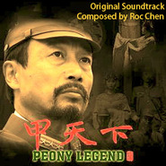

甲天下 电影原声大碟牡丹花开 / Peony Legend (Original Soundtrack)
============================

|  |  |
| :--: | :-- |
| [ 甲天下 电影原声大碟牡丹花开 / Peony Legend (Original Soundtrack)](https://emumo.xiami.com/album/500080) | **艺人**: [阿鲲](../index.md) **语种**: 其他 **唱片公司**: 阿鲲音乐 **发行时间**: 2012年03月13日 **专辑类别**: 原声带, 影视音乐 **专辑风格**: 原声 Soundtrack, 电影原声 Film Score **播放数**: 74464 **收藏数**: 163 **评论数**: 4  |

## 简介

This is the soundtrack of feature film Peony Legend. It's a music journey from Tang Dynasty, to the World War II, and finally to the 21st century. Starring lots of Chinese superstars,the film is about several people protecting a peony painting.

## 曲目

## 评论

|  |  |  |
| :-- | :-- | :-- |
|  [虾米用户](https://emumo.xiami.com/u/33042329) 鼎阿哥 2014-06-07 09:00 赞(0) 踩(0) | 
原声
 |
|  [虾米用户](https://emumo.xiami.com/u/4237946) 我还没想好要写什么... 2014-05-06 23:03 赞(1) 踩(0) | 
废话，好听呗
 |
|  [虾米用户](https://emumo.xiami.com/u/6485388) Todd 2013-02-02 11:19 赞(0) 踩(0) | 
内地来讲水准的确高。
 |
|  [虾米用户](https://emumo.xiami.com/u/5688636)  2012-12-15 14:11 赞(0) 踩(0) | 
闭上眼后~浮现各种画面~各种灵感~
 |
