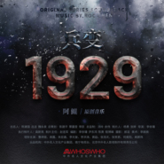

兵变1929 电视原声带
============================

|  |  |
| :--: | :-- |
| [ 兵变1929 电视原声带](https://emumo.xiami.com/album/5021103029) | **艺人**: [阿鲲](../index.md) **语种**: 纯音乐 **唱片公司**: 阿鲲音乐 **发行时间**: 2014年12月07日 **专辑类别**: 原声带, 影视音乐 **专辑风格**: 电视原声 Television Music **播放数**: 636 **收藏数**: 8 **评论数**: 1  |

## 简介

《兵变1929》是由李依璠执导，曹炳琨、高露等主演的年代战争情感剧。该剧讲述了覃家三兄弟从手足情深到反目成仇、最终携手抗敌的精彩故事。该专辑收录了阿鲲为全剧创作的音乐。

## 曲目

## 评论

|  |  |  |  |
| :-- | :-- | :-- | :-- |
|  [虾米用户](https://emumo.xiami.com/u/406909259) 音乐是生活中不可缺少的一... 2020-07-15 18:13 赞(0) 踩(0) | 
聆听
 |
