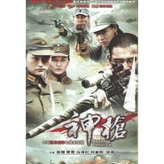

神枪 战争电视剧原声音乐
============================

|  |  |
| :--: | :-- |
| [ 神枪 战争电视剧原声音乐](https://emumo.xiami.com/album/629686270) | **艺人**: [阿鲲](../index.md) **语种**: 其他 **唱片公司**: 阿鲲音乐 **发行时间**: 2011年05月01日 **专辑类别**: 原声带, 影视音乐 **专辑风格**: 原声 Soundtrack, 电视原声 Television Music **播放数**: 37030 **收藏数**: 71 **评论数**: 3  |

## 简介

《神枪》是一部抗日战争时期狙击手题材的情感剧，由著名导演李森执导。
 

2012年12月1日登上四大卫视，每天三集连播，《神枪》以阳刚、铁血的剧情，让观众们直呼看得过瘾。

## 曲目

## 评论

|  |  |  |  |
| :-- | :-- | :-- | :-- |
|  [虾米用户](https://emumo.xiami.com/u/4701746)  2015-08-08 20:54 赞(0) 踩(0) | 
1111
 |
|  [虾米用户](https://emumo.xiami.com/u/4237946) 我还没想好要写什么... 2015-05-16 02:15 赞(0) 踩(0) | 
yfgvuyjfgvjhm
 |
|  [虾米用户](https://emumo.xiami.com/u/7322777) ∮ 2015-04-22 15:21 赞(0) 踩(0) | 
收
 |
