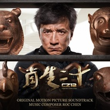

十二生肖 电影原声大碟Chinese Zodiac (Original Motion Picture Soundtrack)
============================

|  |  |
| :--: | :-- |
| [ 十二生肖 电影原声大碟Chinese Zodiac (Original Motion Picture Soundtrack)](https://emumo.xiami.com/album/75166117) | **艺人**: [阿鲲](../index.md) **语种**: 其他 **唱片公司**: 阿鲲音乐 **发行时间**: 2012年12月27日 **专辑类别**: 原声带, 影视音乐 **专辑风格**: 原声 Soundtrack, 电影原声 Film Score **播放数**: 83229 **收藏数**: 266 **评论数**: 12  |

## 简介

《十二生肖 电影原声大碟》是著名影视作曲家阿鲲继《舌尖上的中国》后的又一力作。跨越五大洲的惊险搞笑夺宝之旅，在交响音乐与尖端电子音色的完美融合中，为您带来独一无二的热血沸腾与浪漫甜美。  
  
除为《十二生肖》配乐外，您还可以在《舌尖上的中国》、陈勋奇导演的《杨门女将之军令如山》、唐季礼监制的《偏偏爱上你》、美国院线电影《Eyeborgs》、法国Ubisoft游戏《英雄无敌VI－死亡之舞》预告片等作品中听到阿鲲的音乐。迄今为止，阿鲲已完成超过200个项目的配乐工作。  
  
特别收录了影片中法国至南太平洋海岛的蒙太奇歌曲“不可阻挡”。  
  
Product Details:  
Original Release Date: December 27 2012  
Label: Roc Music Studio  
Copyright: 2012 Roc Chen  
Total Length: 39:02

## 曲目

## 评论

|  |  |  |
| :-- | :-- | :-- |
|  [虾米用户](https://emumo.xiami.com/u/355865) Let it go, l... 2017-08-16 23:15 赞(1) 踩(0) | 
对照着电影和两张原声集听了一遍，发现阿鲲老师创作的段落以电影头尾为主，很多都是比较重要的场景，而且粗略统计，有20首正片采用的配乐来自阿鲲，15首来自王宗贤。因此我认为，片尾credits字幕的写法其实不合适，阿鲲应该也是主要原创配乐者。
 |
|  [虾米用户](https://emumo.xiami.com/u/355865) Let it go, l... 2017-08-15 21:53 赞(0) 踩(0) | 
王宗贤版的配乐原声在itunes发行： <a href="https://itunes.apple.com/us/album/chinese-zodiac-cz12-original-motion-picture-soundtrack/id779427583" target="_blank" rel="nofollow noreferrer noopener">https://itunes.apple.com/us/album/chinese-zodiac-cz12-original-motion-picture-soundtrack/id779427583</a> 两个原声专辑不知道是不是有重叠曲目，待确认。如果有的话，那就是赤裸裸盗用；如果没有，那就说明是两个人合作的配乐原声，同时被电影引用。
 |
|  [虾米用户](https://emumo.xiami.com/u/1914643)  2016-02-24 00:51 赞(1) 踩(0) | 
这是王宗贤作曲的，阿鲲只是一部分额外音乐，何以成了作曲? 证据： 1电影海报下的工作人员 <a href="http://img3.douban.com/view/photo/raw/public/p1812524514.jpg" target="_blank" rel="nofollow noreferrer noopener">http://img3.douban.com/view/photo/raw/public/p1812524514.jpg</a>  2 IMDB 信息 Music by Gary Chase阿鲲 Nathan Wang王宗贤 <a href="http://www.imdb.com/title/tt1424310/fullcredits?ref_=tt_cl_sm#cast" target="_blank" rel="nofollow noreferrer noopener">http://www.imdb.com/title/tt1424310/fullcredits?ref_=tt_cl_sm#cast</a>  3王宗贤个人主页面 <a href="http://www.nathanwang.com/film.html#all" target="_blank" rel="nofollow noreferrer noopener">http://www.nathanwang.com/film.html#all</a>  4 电影片尾的字幕
 |
| ⇒ |  [虾米用户](https://emumo.xiami.com/u/355865) Let it go, l... 2017-08-16 10:32 赞(0) 踩(0) | 
王宗贤版本的原声：<a href="http://www.xiami.com/album/162126487" target="_blank" rel="nofollow noreferrer noopener">http://www.xiami.com/album/162126487</a>
 |
|  [虾米用户](https://emumo.xiami.com/u/15818223)  2015-10-10 13:27 赞(0) 踩(0) | 
统一的主旋律
 |
|  [虾米用户](https://emumo.xiami.com/u/46795439) རན་པོད་ཆེ 2015-04-19 00:10 赞(0) 踩(0) | 
配乐好
 |
|  [虾米用户](https://emumo.xiami.com/u/2373126)  2014-08-01 15:36 赞(0) 踩(0) | 
阅
 |
|  [虾米用户](https://emumo.xiami.com/u/34776668)  2014-07-10 23:58 赞(0) 踩(0) | 
好听极了，电影和音乐是如此的有吸引力
 |
|  [虾米用户](https://emumo.xiami.com/u/33042329) 鼎阿哥 2014-06-11 18:22 赞(0) 踩(0) | 
原声
 |
|  [虾米用户](https://emumo.xiami.com/u/19519496) 最愛各種BGM 2013-08-26 20:59 赞(0) 踩(0) | 
買了這張電影原聲帶，最喜歡成龍，這張音樂CD裏面最愛的一首曲子就是來到巴黎！
 |
|  [虾米用户](https://emumo.xiami.com/u/355865) Let it go, l... 2013-08-12 12:19 赞(0) 踩(0) | 
标题：Chinese Zodiac (Original Motion Picture Soundtrack) 版权方(按照中文名来写的话是)：阿鲲音乐——Roc Chen应该就是阿鲲的英文名吧。 <a href="http://emumo.xiami.com/u/2871" target="_blank" rel="nofollow" name_card="2871">@虾小编</a> <a href="http://emumo.xiami.com/u/30705" target="_blank" rel="nofollow" name_card="30705">@beson</a>
 |
| ⇒ |  [虾米用户](https://emumo.xiami.com/u/30705) 我还没想好要写什么... 2013-09-24 11:58 赞(0) 踩(0) | 
改了。Roc Chen就是他英文名没错
 |
