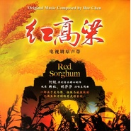

阿鲲
============================

|  |  |
| :--: | :-- |
| [ 阿鲲](https://i.xiami.com/roc) | **地区**: China 中国大陆 **风格**: 原声 Soundtrack, 电影原声 Film Score, 电视原声 Television Music, 音乐剧 Musical theatre, 国语流行 Mandarin Pop **播放数**: 47822364 **粉丝数**: 26790 **评论数**: 505  |

## 档案

阿鲲   (Roc)  ，自从业以来先后为包括 《流浪地球》 、《风味人间》、《熊出没之原始时代》、《舌尖上的中国 1&2 》、周迅版《红高粱》、《芈月传》等影片，以及《魔法门之英雄无敌 VII 》等游戏谱写音乐。 
阿鲲自幼学琴时经常喜欢踩着延音踏板不放，制造出一种朦胧的影像感。虽然经常因此被钢琴老师批评不老实按照曲谱弹奏，但这却也体现出他对 音乐富有画面感 的追求。后又因理科成绩较好考入中国电子科技大学学习工程专业，他却最终听从了内心的声音去追求他的音乐梦想：在毕业后即考入四川音乐学院作曲系深造。他有幸在工程和艺术两大领域内得以学习研究，使用工程技术辅助艺术创作，并获 工学学士 和 作曲硕士学位 。他相信，影视作品是一个团队的集体作品，因此他很 重视培养 自己与 团队协作 的能力，与团队 沟通 听取意见，以达到共赢。 
从舌尖里的《初》，到红高粱的《九儿》；从《流浪地球主题音乐》，到《开启新征程》 ...... 阿鲲的音乐中除了那些科技元素外，也有着带给我们感动的深情旋律。有粉丝们形容阿鲲的音乐像一面镜子，他们在阿鲲的音乐中触碰找到了自己的内心，认识到了在这个茫茫的宇宙中自己到底是谁。 
阿鲲为中美合拍片    Forbidden Kiss    所写的配乐受到包括著名电影监制、编剧   Barry Morrow   （代表作《雨人》）等好莱坞影人的高度赞扬， 并获 2012 年纽约市国际电影节最佳原创音乐    （    Best Original Music    ）    的提名   。 
阿鲲还著有专著  《  Adobe Audition 2.0  音频处理入门》  一书（人民邮电出版社出版），为数字音乐处理在中国的普及作出了贡献。 阿鲲还是目前中国少有的其    OST    作品登陆苹果公司     iTunes    、 Amazon     等平台的影视作曲家   。法国  Ubisoft  的《魔法门之英雄无敌》系列第 7 代也邀请阿鲲作曲，该系列已售出超过千万拷贝份，阿鲲也是参与该系列作品音乐作曲的 唯一亚洲作曲家 ，其原声大碟在美国、韩国、法国、意大利、英国等多个国家进行展示和销售，受到了广泛欢迎与好评。 
阿鲲近年在中国内地影视音乐上取得的成就也引起了好莱坞大片场的注意：梦工厂   Dreamworks   聘请了阿鲲作为功夫熊猫 3 的中国音乐顾问，并聘请他加入了 功夫熊猫 3  的电影音乐制作过程；迪斯尼   Disney   也聘请了阿鲲加入上海迪斯尼乐园   Shanghai Disneyland   的项目音乐制作过程中。 
迄今为止，阿鲲已完成超过 150 个项目的配乐工作，并仍在为用音乐影像的道路上前进。

## 专辑

| 名称 | 语种 | 唱片公司 | 发行时间 | 专辑类别 | 专辑风格 |
| :--: | :-- | :-- | :-- | :-- | :-- |
| [ 金刚川 电影原声大碟](./albums/5021768154.md) | 纯音乐 | 阿鲲音乐 | 2020年10月27日 | 原声带, 影视音乐 | 电影原声 Film Score |
| [ 放肆一搏](./albums/5021228061.md) | 纯音乐 | 阿鲲音乐 | 2020年08月05日 | EP, 单曲 | 游戏配乐 Video Game Music, 轻音乐 Easy Listening |
| [ 秋蝉 原声大碟](./albums/5021180428.md) | 纯音乐 | 阿鲲音乐 | 2020年07月30日 | 原声带, 影视音乐 | 电视原声 Television Music |
| [ 重生之名流巨星 原声大碟](./albums/5020997771.md) | 纯音乐 | 阿鲲音乐 | 2020年06月30日 | 原声带, 影视音乐 | 原声 Soundtrack |
| [ 好久不见 原声大碟](./albums/5020988081.md) | 纯音乐 | 阿鲲音乐 | 2020年06月28日 | 原声带, 影视音乐 | 原声 Soundtrack |
| [ 风味人间2 纪录片原声大碟](./albums/2108366173.md) | 纯音乐 | 阿鲲音乐 | 2020年04月26日 | 原声带, 影视音乐 | 拉美音乐 Latin American Music |
| [ Mike boy 原声大碟](./albums/2106100335.md) | 纯音乐 | 阿鲲音乐 | 2020年02月25日 | 原声带, 影视音乐 | 原声 Soundtrack |
| [ 绝代双骄 电视剧原声大碟](./albums/2106025098.md) | 国语 | 阿鲲音乐 | 2020年02月14日 | 原声带, 影视音乐 | 电视原声 Television Music |
| [ 快乐之歌](./albums/2105538889.md) | 国语 | 阿鲲音乐 | 2019年12月06日 | EP, 单曲 | 国语流行 Mandarin Pop |
| [ 幸福之歌](./albums/2105537375.md) | 国语 | 阿鲲音乐 | 2019年12月03日 | EP, 单曲 | 国语流行 Mandarin Pop |
| [ 鹤唳华亭 电视原声大碟](./albums/2105443059.md) | 纯音乐 | 阿鲲音乐 | 2019年11月18日 | 原声带, 影视音乐 | 中国风 China-Wave |
| [ 我和我的祖国-夺冠 电影原声大碟](./albums/2105322262.md) | 纯音乐 | 阿鲲音乐 | 2019年10月01日 | 原声带, 影视音乐 | 电影原声 Film Score |
| [ 小小的愿望 电影原声大碟](./albums/2105241043.md) | 国语 | 阿鲲音乐 | 2019年09月16日 | 原声带, 影视音乐 |  |
| [ 请赐我一双翅膀](./albums/2105043760.md) | 纯音乐 | 阿鲲音乐 | 2019年08月02日 | 原声带, 影视音乐 |  |
| [ 神风刀 电视剧原声大碟](./albums/2104912909.md) | 国语 | 阿鲲音乐 | 2019年06月03日 | 原声带, 影视音乐 |  |
| [ 绅探 原声大碟的音频](./albums/2104783568.md) | 国语 | 阿鲲音乐 | 2019年04月22日 | 录音室专辑 | 电影原声 Film Score |
| [ 往事](./albums/2104652195.md) | 国语 | 阿鲲音乐 | 2019年03月10日 | EP, 单曲 | 国语流行 Mandarin Pop |
| [ 皓镧传 影视剧配乐](./albums/2104603511.md) | 纯音乐 | 欢娱影视 | 2019年02月16日 | 原声带, 影视音乐 | 电视原声 Television Music |
| [ 川味 纪录片原声大碟](./albums/2104568339.md) | 纯音乐 | 阿鲲音乐 | 2019年02月09日 | 原声带, 影视音乐 | 原声 Soundtrack |
| [ 流浪地球 电影原声大碟The Wandering Earth Original Soundtrack](./albums/2104564675.md) | 纯音乐 | 阿鲲音乐 | 2019年02月08日 | 原声带, 影视音乐 | 电影原声 Film Score |
| [ 熊出没 电影原声大碟](./albums/2104564660.md) | 纯音乐 | 阿鲲音乐 | 2019年02月08日 | 原声带, 影视音乐 | 电影原声 Film Score |
| [ 人生一串 纪录片原声大碟](./albums/2104548721.md) | 纯音乐 | 阿鲲音乐 | 2019年01月29日 | 录音室专辑 | 原声 Soundtrack |
| [ 人不彪悍枉少年 电视剧原声大碟](./albums/2104548696.md) | 纯音乐 | 阿鲲音乐 | 2019年01月29日 | 录音室专辑 | 电视原声 Television Music |
| [ 将夜 电视剧原声大碟](./albums/2104173425.md) | 国语 | 阿鲲音乐 | 2018年11月03日 | 原声带, 影视音乐 | 电视原声 Television Music |
| [ 风味人间 原声大碟](./albums/2104168944.md) | 纯音乐 | 阿鲲音乐 | 2018年11月02日 | 原声带, 影视音乐 | 电影原声 Film Score |
| [ 功夫联盟 电影原声大碟](./albums/2104117263.md) | 国语 | 阿鲲音乐 | 2018年10月22日 | 录音室专辑 | 电影原声 Film Score |
| [ 龙虾刑警 电影原声大碟](./albums/2103753201.md) | 国语 | 独立发行 | 2018年06月22日 | 原声带, 影视音乐 | 原声 Soundtrack, 电影原声 Film Score |
| [ 红蔷薇 电视原声带](./albums/2103466824.md) | 纯音乐 | 阿鲲音乐 | 2018年01月04日 | 原声带, 影视音乐 | 电视原声 Television Music |
| [ 急诊科医生 电视剧原声大碟](./albums/2102924146.md) | 国语 | 阿鲲音乐 | 2017年11月13日 | 原声带, 影视音乐 | 电视原声 Television Music |
| [ 鬼吹灯之牧野诡事 原声配乐](./albums/2102810461.md) | 纯音乐 | 阿鲲音乐 | 2017年07月29日 | 原声带, 影视音乐 | 电视原声 Television Music, 原声 Soundtrack |
| [ 神秘世界历险记3 电影原声带Yugo & Lala 3 Film OST.](./albums/2100372079.md) | 国语 | 阿鲲音乐 | 2016年07月24日 | 原声带, 影视音乐 | 原声 Soundtrack, 电影原声 Film Score |
| [ 新边城浪子 电视剧原声带](./albums/2100371983.md) | 其他 | 阿鲲音乐 | 2016年07月23日 | 原声带, 影视音乐 |  |
| [ 新边城浪子 电视原声带](./albums/2100370423.md) | 国语 | 阿鲲音乐 | 2016年07月20日 | 原声带, 影视音乐 | 电视原声 Television Music, 原声 Soundtrack, 中国风 China-Wave |
| [ 致青春 电视原声带](./albums/2100372095.md) | 其他 | 阿鲲音乐 | 2016年07月20日 | 原声带, 影视音乐 | 原声 Soundtrack, 电视原声 Television Music |
| [ 解密 电视原声带](./albums/2100364377.md) | 国语 | 阿鲲音乐 | 2016年07月12日 | 原声带, 影视音乐 | 原声 Soundtrack, 电视原声 Television Music |
| [ 新萧十一郎 电视原声带](./albums/2100285572.md) | 国语 | 阿鲲音乐 | 2016年03月02日 | 原声带, 影视音乐 | 原声 Soundtrack, 电视原声 Television Music |
| [ 舌尖上的新年 原声音乐大碟A Bite Of China Celebrating Chinese New Year (Original Soundtrack)](./albums/2100254776.md) | 其他 | 阿鲲音乐 | 2016年01月06日 | 原声带, 影视音乐 | 原声 Soundtrack, 电影原声 Film Score |
| [ 伊人如梦](./albums/2100234510.md) | 国语 | 阿鲲音乐 | 2015年11月06日 | EP, 单曲 | 国语流行 Mandarin Pop, 中国风 China-Wave |
| [ 华胥引之绝爱之城 电视原声大碟](./albums/1635842350.md) | 其他 | 阿鲲音乐 | 2015年07月02日 | 原声带, 影视音乐 | 原声 Soundtrack, 电视原声 Television Music |
| [ 比翼](./albums/123711142.md) | 国语 | 阿鲲音乐 | 2015年02月12日 | EP, 单曲 | 中国风 China-Wave |
| [ 血战到底之壮丁也是兵 电视剧原声大碟](./albums/5021142651.md) | 纯音乐 | 阿鲲音乐 | 2015年02月02日 | 原声带, 影视音乐 | 原声 Soundtrack |
| [ 爱情珠宝 电视剧原声大碟](./albums/5021363445.md) | 纯音乐 | 阿鲲音乐 | 2015年01月01日 | 原声带, 影视音乐 | 电视原声 Television Music |
| [ 警察锅哥 电视剧原声大碟](./albums/5021079961.md) | 国语 | 阿鲲音乐 | 2015年01月01日 | 原声带, 影视音乐 | 原声 Soundtrack |
| [ 兵变1929 电视原声带](./albums/5021103029.md) | 纯音乐 | 阿鲲音乐 | 2014年12月07日 | 原声带, 影视音乐 | 电视原声 Television Music |
| [ 红高粱 电视原声大碟](./albums/1815699619.md) | 其他 | 阿鲲音乐 | 2014年11月18日 | 原声带, 影视音乐 | 原声 Soundtrack, 电视原声 Television Music |
| [ 兵王 电视剧原声大碟](./albums/229754759.md) | 其他 | 阿鲲音乐 | 2014年11月18日 | 原声带, 影视音乐 | 原声 Soundtrack, 电视原声 Television Music |
| [ 缘来是游戏 电影原声大碟](./albums/1929596547.md) | 其他 | 阿鲲音乐 | 2014年09月19日 | 原声带, 影视音乐 | 原声 Soundtrack, 电影原声 Film Score |
| [ 秦时明月之龙腾万里 原声大碟](./albums/407987385.md) | 其他 | 阿鲲音乐 | 2014年08月14日 | 原声带, 影视音乐 | 原声 Soundtrack, 电影原声 Film Score |
| [ 假如幸福来临 电视原声大碟](./albums/1329253918.md) | 其他 | 阿鲲音乐 | 2014年08月05日 | 原声带, 影视音乐 | 原声 Soundtrack, 电视原声 Television Music |
| [ 兰州牛肉面  纪录片原声大碟](./albums/2029511973.md) | 国语 | 阿鲲音乐 | 2014年07月28日 | 原声带, 影视音乐 | 原声 Soundtrack, 纪录片配乐 Documentary |
| [ 肖叮叮的剿匪记 电视原声带](./albums/1422438335.md) | 其他 | 阿鲲音乐 | 2014年07月22日 | 原声带, 影视音乐 | 原声 Soundtrack, 电视原声 Television Music |
| [ 舌尖上的中国 第二季原声钢琴曲](./albums/229585259.md) | 其他 | 阿鲲音乐 | 2014年07月01日 | 原声带, 影视音乐 | 原声 Soundtrack, 纪录片配乐 Documentary |
| [ 古堡之吻 电影原声大碟](./albums/1929688368.md) | 其他 | 阿鲲音乐 | 2014年05月08日 | 原声带, 影视音乐 | 原声 Soundtrack, 电影原声 Film Score |
| [ 舌尖上的中国2: 民以食为天 原声音乐大碟A Bite of China 2: In Food We Trust (Original Soundtrack)](./albums/498400083.md) | 其他 | 阿鲲音乐 | 2014年05月04日 | 原声带, 影视音乐 | 原声 Soundtrack, 电视原声 Television Music, 纪录片配乐 Documentary |
| [ 金面具 电影原声大碟](./albums/429511057.md) | 国语 | 阿鲲音乐 | 2014年04月10日 | 原声带, 影视音乐 | 原声 Soundtrack, 电影原声 Film Score |
| [ 红箭 电视剧原声带](./albums/1029688996.md) | 国语 | 阿鲲音乐 | 2014年03月12日 | 原声带, 影视音乐 | 原声 Soundtrack, 电视原声 Television Music |
| [ 脱轨时代 电影原声大碟](./albums/1629586992.md) | 其他 | 阿鲲音乐 | 2014年03月07日 | 原声带, 影视音乐 | 原声 Soundtrack, 电视原声 Television Music |
| [ 结婚的秘密 电视剧原声大碟](./albums/329510377.md) | 国语 | 阿鲲音乐 | 2014年02月27日 | 原声带, 影视音乐 | 原声 Soundtrack, 电视原声 Television Music |
| [ 聂荣臻 电视原声大碟](./albums/229513286.md) | 国语 | 阿鲲音乐 | 2013年12月11日 | 原声带, 影视音乐 | 电视原声 Television Music |
| [ 城市门 电影原声大碟](./albums/429767386.md) | 其他 | 阿鲲音乐 | 2013年11月29日 | 原声带, 影视音乐 | 原声 Soundtrack, 电影原声 Film Score |
| [ 猎仇者 电影原声大碟](./albums/529512617.md) | 其他 | 阿鲲音乐 | 2013年11月01日 | 原声带, 影视音乐 | 原声 Soundtrack, 电影原声 Film Score |
| [ 冬日惊雷 电视剧原声大碟](./albums/1029686891.md) | 其他 | 阿鲲音乐 | 2013年09月24日 | 原声带, 影视音乐 | 原声 Soundtrack, 电视原声 Television Music |
| [ 隔窗有眼 电影原声大碟](./albums/929687420.md) | 其他 | 阿鲲音乐 | 2013年08月28日 | 原声带, 影视音乐 | 原声 Soundtrack, 电视原声 Television Music |
| [ 宝贝快跑 电影原声大碟](./albums/1629754272.md) | 其他 | 阿鲲音乐 | 2013年03月08日 | 原声带, 影视音乐 | 原声 Soundtrack, 电影原声 Film Score |
| [ 十二生肖 电影原声大碟Chinese Zodiac (Original Motion Picture Soundtrack)](./albums/75166117.md) | 其他 | 阿鲲音乐 | 2012年12月27日 | 原声带, 影视音乐 | 原声 Soundtrack, 电影原声 Film Score |
| [ 凶间雪山 电影原声大碟](./albums/129595624.md) | 其他 | 阿鲲音乐 | 2012年12月21日 | 原声带, 影视音乐 | 电影原声 Film Score |
| [ 超级工程 纪录片原声大碟](./albums/729766810.md) | 其他 | 阿鲲音乐 | 2012年09月24日 | 原声带, 影视音乐 | 原声 Soundtrack, 纪录片配乐 Documentary |
| [ 舌尖上的中国 原声音乐大碟A Bite of China  (Original Soundtrack)](./albums/514384.md) | 其他 | 阿鲲音乐 | 2012年05月14日 | 原声带, 影视音乐 | 原声 Soundtrack, 电影原声 Film Score, 电视原声 Television Music, 国语流行 Mandarin Pop |
| [ 黄帝 原声音乐大碟](./albums/1829177161.md) | 其他 | 阿鲲音乐 | 2012年04月03日 | 原声带, 影视音乐 | 原声 Soundtrack |
| [ 凤凰镇 电影原声音乐](./albums/500078.md) | 其他 | 阿鲲音乐 | 2012年03月14日 | 原声带, 影视音乐 | 原声 Soundtrack, 电影原声 Film Score |
| [ 偏偏爱上你 电视原声带](./albums/500133.md) | 其他 | 阿鲲音乐 | 2012年03月13日 | 原声带, 影视音乐 | 原声 Soundtrack, 电影原声 Film Score |
| [ 甲天下 电影原声大碟牡丹花开 / Peony Legend (Original Soundtrack)](./albums/500080.md) | 其他 | 阿鲲音乐 | 2012年03月13日 | 原声带, 影视音乐 | 原声 Soundtrack, 电影原声 Film Score |
| [ 晚安北京 电影原声大碟](./albums/29588510.md) | 其他 | 阿鲲音乐 | 2012年01月01日 | 原声带, 影视音乐 | 电影原声 Film Score |
| [ 杨门女将之军令如山 原声大碟](./albums/5021285825.md) | 国语 | 阿鲲音乐 | 2011年11月18日 | 录音室专辑 | 原声 Soundtrack |
| [ 神枪 战争电视剧原声音乐](./albums/629686270.md) | 其他 | 阿鲲音乐 | 2011年05月01日 | 原声带, 影视音乐 | 原声 Soundtrack, 电视原声 Television Music |
| [ 芳香之城传奇 电影原声带Aroma City (Original Soundtrack)](./albums/453809.md) | 其他 | 阿鲲音乐 | 2011年02月20日 | 原声带, 影视音乐 | 原声 Soundtrack, 电影原声 Film Score |
| [ 楼兰轮回之轨迹 游戏原声大碟](./albums/369906.md) | 国语 | 寰宇之星 | 2010年02月02日 | 原声带, 影视音乐 | 中国风 China-Wave |
| [ 阿鲲爱情音乐作品集](./albums/1629686138.md) | 其他 | 阿鲲音乐 | 2010年01月01日 | 精选集 | 原声 Soundtrack |
| [ 大决战 游戏原声单曲Army Rage](./albums/929695931.md) | 其他 | 阿鲲音乐 | 2010年01月01日 | EP, 单曲 | 游戏配乐 Video Game Music |

## 评论

|  |  |  |
| :-- | :-- | :-- |
|  [虾米用户](https://emumo.xiami.com/u/262274284)  2020-11-03 21:44 赞(1) 踩(0) | 
看了金刚川，为中国有这么国际化水准的音乐创作家感到高兴！
 |
|  [虾米用户](https://emumo.xiami.com/u/19020288)  2020-10-23 12:56 赞(0) 踩(0) | 
鹤唳华亭知道你的名字 谢谢
 |
|  [虾米用户](https://emumo.xiami.com/u/10983386) 瘦子 朝夕奔梦 2020-06-23 22:52 赞(0) 踩(0) | 
大陆配乐未来扛鼎之人
 |
|  [虾米用户](https://emumo.xiami.com/u/426474462) 游过宇宙空间三维，再游过... 2020-06-07 13:12 赞(0) 踩(0) | 
我看过了你的介绍，厉害了，阿鲲
 |
|  [虾米用户](https://emumo.xiami.com/u/9813603) 虾米都听。 2020-05-29 20:40 赞(0) 踩(0) | 
作品不少啊
 |
|  [虾米用户](https://emumo.xiami.com/u/276944698) 不要自我设限..... 2020-04-07 01:31 赞(1) 踩(0) | 

 |
|  [虾米用户](https://emumo.xiami.com/u/2342684) 特别钟情电影配乐....... 2020-03-16 08:55 赞(0) 踩(0) | 
我来这里就是听大师们的音乐！
 |
|  [虾米用户](https://emumo.xiami.com/u/441173485)  2020-03-06 16:32 赞(2) 踩(0) | 
记得一年前学校朗诵比赛，我的任务是搞BGM，当我一筹莫展之时，我的音乐老师向我推荐了阿鲲，在阿鲲的音乐里遨游后我找到了不少合适的曲子，剪出了一个挺棒的BGM，最后成绩很好，在这里谢谢阿鲲
 |
|  [虾米用户](https://emumo.xiami.com/u/400715332) 留白 2020-02-14 09:15 赞(2) 踩(0) | 
～
 |
|  [虾米用户](https://emumo.xiami.com/u/302016689) 听音乐，看人品。 2020-01-27 00:06 赞(1) 踩(0) | 
特别喜欢  
 |
|  [虾米用户](https://emumo.xiami.com/u/435342448)  2020-01-09 14:43 赞(1) 踩(0) | 
喜欢您的鹤唳华亭配乐，很美
 |
|  [虾米用户](https://emumo.xiami.com/u/238733879)   2019-12-25 21:45 赞(1) 踩(0) | 
旋律不输日系 节奏不输欧美 可以可以
 |
|  [虾米用户](https://emumo.xiami.com/u/238733879)   2019-12-25 21:43 赞(0) 踩(0) | 
锟还是不错的
 |
|  [虾米用户](https://emumo.xiami.com/u/348337597)  2019-12-25 19:40 赞(0) 踩(0) | 
谢谢。。。你，，，请问您了解尺八么，鹤唳华庭的音乐和尺八的好近
 |
|  [虾米用户](https://emumo.xiami.com/u/120402102) never Sey ne... 2019-12-07 21:36 赞(1) 踩(0) | 
短的发布会
 |
|  [虾米用户](https://emumo.xiami.com/u/7151428) 暖暖的～～ 2019-11-22 11:40 赞(1) 踩(0) | 
 
 |
|  [虾米用户](https://emumo.xiami.com/u/8337431) 以乐会友 2019-09-01 21:35 赞(1) 踩(0) | 
国产配乐大师481
 |
|  [虾米用户](https://emumo.xiami.com/u/47689426)  2019-06-21 13:44 赞(1) 踩(0) | 
音乐和电视里的一样，但是电视里的音乐播放到一半就停止了，没意思。实际上，音乐特别好听。
 |
|  [虾米用户](https://emumo.xiami.com/u/9453842) 我还没想好要写什么... 2019-06-17 19:33 赞(1) 踩(0) | 
抄袭狗
 |
| ⇒ |  [虾米用户](https://emumo.xiami.com/u/42518064)  2019-10-30 19:19 赞(0) 踩(0) | 
你这个不好吧
 |
|  [虾米用户](https://emumo.xiami.com/u/376565175)  2019-06-09 06:23 赞(1) 踩(0) | 
80后是8几年出生的呢
 |
|  [虾米用户](https://emumo.xiami.com/u/376565175)  2019-06-09 06:22 赞(1) 踩(0) | 
好听！
 |
|  [虾米用户](https://emumo.xiami.com/u/6216135)  2019-04-15 08:49 赞(1) 踩(0) | 
音乐制作不错！
 |
|  [虾米用户](https://emumo.xiami.com/u/48357642) 变化多端，随遇而安 2019-03-24 11:06 赞(1) 踩(0) | 
AR Rahman一样的配乐大师哦
 |
| ⇒ |  [虾米用户](https://emumo.xiami.com/u/406176199)  2019-05-17 18:59 赞(0) 踩(0) | 

 |
|  [虾米用户](https://emumo.xiami.com/u/12293615)  2019-03-18 00:34 赞(1) 踩(0) | 
所以说，中国有重工业电影很重要，给各方面人才也提供了表现自己才华的舞台
 |
|  [虾米用户](https://emumo.xiami.com/u/8723763) 大脸猫爱听音乐，汪～ 2019-03-07 13:43 赞(2) 踩(0) | 
阿鲲是个伟大的作曲家
 |
|  [虾米用户](https://emumo.xiami.com/u/419320655)  2019-03-06 21:19 赞(3) 踩(0) | 
《将夜》的配乐真的超棒的！
 |
|  [虾米用户](https://emumo.xiami.com/u/374642111) 一颗崛起的新星 2019-03-03 21:58 赞(1) 踩(0) | 
阿鲲老师好！向你致敬！中国电影加油！
 |
|  [虾米用户](https://emumo.xiami.com/u/374642111) 一颗崛起的新星 2019-03-03 21:55 赞(1) 踩(0) | 
中国牛逼
 |
|  [虾米用户](https://emumo.xiami.com/u/14652349) 壹贰叁 肆伍陆 柒捌玖 2019-03-01 21:40 赞(1) 踩(0) | 
皓镧传 熊出没 舌尖中国 配樂師 路漫漫其修遠兮 漂亮   
 |
|  [虾米用户](https://emumo.xiami.com/u/13184971) (▼皿▼#)忙的一逼 2019-02-28 09:19 赞(2) 踩(0) | 
有才还有运，打哪配乐火哪，牛逼
 |
|  [虾米用户](https://emumo.xiami.com/u/35656977) 平淡的激烈。 2019-02-26 10:41 赞(1) 踩(0) | 
看到阿鲲的名字就起了鸡皮疙瘩，他的作品真的很棒。
 |
|  [虾米用户](https://emumo.xiami.com/u/41678188) 我正在构思一个伟大的签名 2019-02-20 09:44 赞(1) 踩(0) | 
希望有更多的好音乐创作出来
 |
|  [虾米用户](https://emumo.xiami.com/u/117643) 一个人在他乡，享受6点阳... 2019-02-20 07:21 赞(1) 踩(0) | 
流浪地球的主题曲都是中国人，竟然叫阿鲲。简直超过欧美
 |
|  [虾米用户](https://emumo.xiami.com/u/359582835) 我还没想好要写什么。。。 2019-02-19 22:06 赞(1) 踩(0) | 
这个人好强啊，发现宝藏了
 |
|  [虾米用户](https://emumo.xiami.com/u/12840103) d 2019-02-19 16:00 赞(1) 踩(0) | 
太棒了，媲美欧美配乐大师
 |
| ⇒ |  [虾米用户](https://emumo.xiami.com/u/238733879)   2019-12-25 21:44 赞(0) 踩(0) | 
世界级
 |
|  [虾米用户](https://emumo.xiami.com/u/403184448) 杂食不是人 2019-02-17 17:14 赞(0) 踩(0) | 
加油鸭 
 |
|  [虾米用户](https://emumo.xiami.com/u/25506637)   2019-02-15 23:58 赞(4) 踩(0) | 
通过流浪地球认识到阿鲲，很喜欢阿鲲创作的bgm，给电影在另一面注入了灵魂 
 |
|  [虾米用户](https://emumo.xiami.com/u/46236422) 我哭了，你呢 2019-02-13 00:03 赞(1) 踩(0) | 
校友 
 |
|  [虾米用户](https://emumo.xiami.com/u/2924595)  2019-02-12 20:24 赞(1) 踩(0) | 
知道《舌尖上的中国》不一定知道阿鲲，然鹅，阿鲲的配乐再次让《流浪地球》熠熠生辉~
 |
|  [虾米用户](https://emumo.xiami.com/u/2552299)  2019-02-12 19:23 赞(2) 踩(0) | 
请在超神的道路上一路驰骋！准备二刷流浪地球！
 |
|  [虾米用户](https://emumo.xiami.com/u/94502846) 若生命有光，我必虚位以待... 2019-02-11 21:35 赞(5) 踩(0) | 
中国的汉斯季默
 |
|  [虾米用户](https://emumo.xiami.com/u/157415174) F......ck 2019-02-11 20:22 赞(2) 踩(0) | 
厉害厉害
 |
|  [虾米用户](https://emumo.xiami.com/u/36981595)   2019-02-11 16:24 赞(2) 踩(0) | 
加油
 |
|  [虾米用户](https://emumo.xiami.com/u/2796166) 最爱莫文蔚..... 2019-02-11 00:19 赞(3) 踩(0) | 
加油
 |
|  [虾米用户](https://emumo.xiami.com/u/245597545)   2019-02-09 19:13 赞(3) 踩(0) | 
我想说这部电影的配乐实在太普通了些
 |
| ⇒ |  [虾米用户](https://emumo.xiami.com/u/33029320)  2019-02-11 23:38 赞(0) 踩(0) | 
自己试试再说这话
 |
|  [虾米用户](https://emumo.xiami.com/u/328769660)  2019-02-09 09:42 赞(3) 踩(0) | 
感觉发现了新大陆   好激动！
 |
|  [虾米用户](https://emumo.xiami.com/u/7172775) 有个性没签名 2019-02-08 22:51 赞(5) 踩(0) | 
流浪地球燃炸！干脆转作电音制作人算了！
 |
|  [虾米用户](https://emumo.xiami.com/u/52546218) 最近总是怀念青春 2019-02-08 15:59 赞(20) 踩(0) | 
流浪地球音乐超级赞的!
 |
|  [虾米用户](https://emumo.xiami.com/u/7882047) ↗这家伙试听了很多曲子！ 2019-02-08 15:11 赞(1) 踩(0) | 
国内大师挺多 
 |
|  [虾米用户](https://emumo.xiami.com/u/287379322)  2019-02-06 14:59 赞(1) 踩(0) | 

 |
|  [虾米用户](https://emumo.xiami.com/u/7187271) Invoke(this)... 2019-01-29 16:12 赞(31) 踩(0) | 
期待流浪地球原声+1
 |
|  [虾米用户](https://emumo.xiami.com/u/52415194) ♬♩♫♪♡ 2019-01-29 00:50 赞(3) 踩(0) | 
校友
 |
|  [虾米用户](https://emumo.xiami.com/u/35657913) 喜欢一首歌，就让更多人一... 2019-01-16 19:22 赞(4) 踩(0) | 
佩服，真真太强
 |
|  [虾米用户](https://emumo.xiami.com/u/9554040) Never knows ... 2019-01-11 12:04 赞(13) 踩(0) | 
期待流浪地球的原声！！
 |
|  [虾米用户](https://emumo.xiami.com/u/237225170) 睡眠奢侈品 2019-01-10 21:53 赞(2) 踩(0) | 
低调的男人
 |
|  [虾米用户](https://emumo.xiami.com/u/294567130)  2018-12-24 13:32 赞(5) 踩(0) | 
将夜 音乐原声太太太太棒了！把整个剧提高了N档水准 一流的配乐，一流的场景，演技有些人还行吧，台词不太灵，剧本一般，摄影不错
 |
| ⇒ |  [虾米用户](https://emumo.xiami.com/u/343976735) 我还没想好要写什么... 2019-12-01 11:00 赞(0) 踩(0) | 
如果很喜欢将夜～可以去听一听Abel Korzeniowski的罗密欧与茱丽叶得电影原声带哦～    
 |
|  [虾米用户](https://emumo.xiami.com/u/409559474)  2018-12-04 15:27 赞(7) 踩(0) | 
阿鲲，谢谢您。我不懂音乐，但我却觉得这九儿主题曲简直可以和粱祝比美。被您的红高粱电视剧的配乐给震撼了，为了这我才把那电视剧看了，六十集，一集不漏。
 |
|  [虾米用户](https://emumo.xiami.com/u/48495473) 安安静静的，听。 2018-11-21 01:09 赞(3) 踩(0) | 
神人 
 |
|  [虾米用户](https://emumo.xiami.com/u/256993005)  2018-11-17 07:42 赞(4) 踩(0) | 
已痴迷不悟  
 |
|  [虾米用户](https://emumo.xiami.com/u/16045115) 不想说再见，虾米！ 2018-11-14 23:54 赞(1) 踩(0) | 
真的很厉害
 |
|  [虾米用户](https://emumo.xiami.com/u/727575) 一个游戏美术设计师疯狂迷... 2018-09-21 07:14 赞(2) 踩(0) | 
阿鲲很国际范儿 大师你好 
 |
|  [虾米用户](https://emumo.xiami.com/u/379419106) 我还没想好要写什么... 2018-09-04 18:14 赞(1) 踩(0) | 
这人履历怎么有点奇怪&amp;hellip;&amp;hellip;
 |
|  [虾米用户](https://emumo.xiami.com/u/4724469) 风回重楼。 2018-08-30 09:24 赞(1) 踩(0) | 
一开始听很喜欢，之后越听越不耐听，一张专辑里很多都是主题曲的变调，雷同感很重。
 |
|  [虾米用户](https://emumo.xiami.com/u/356886852) 理陽 2018-06-26 15:00 赞(3) 踩(0) | 
飽含深情厚誼的靈魂音樂。博大精緻，細膩溫潤，有擔當的音樂才人。
 |
|  [虾米用户](https://emumo.xiami.com/u/366847539) 社会人 2018-06-24 19:20 赞(2) 踩(0) | 
阿鲲你们出2018的新歌了吗？
 |
|  [虾米用户](https://emumo.xiami.com/u/329201367)  2018-06-23 17:11 赞(3) 踩(0) | 
北冥有鱼，其名为鲲，鲲之大，锅炖不下，化而为鸟，其名为鹏，鹏之大，需要两个烧烤架（滑稽）
 |
| ⇒ |  [虾米用户](https://emumo.xiami.com/u/2631163) 等等等-等↗等等等-等↘ 2018-06-28 15:50 赞(0) 踩(0) | 
你平時都這麼優秀嗎？
 |
|  [虾米用户](https://emumo.xiami.com/u/285696092)  we  are  On... 2018-06-14 18:11 赞(1) 踩(0) | 
有舌尖3的吗？
 |
|  [虾米用户](https://emumo.xiami.com/u/363458544)  2018-06-10 21:45 赞(1) 踩(0) | 
一曲入心扉开启七彩斑斓，人文地理饮食起居文化底蕴。皆由此音始亦由此音终。
 |
|  [虾米用户](https://emumo.xiami.com/u/37254849)  2018-05-07 21:09 赞(5) 踩(0) | 
惭愧，一直以为舌尖是日本音乐人作曲，音乐很棒！
 |
|  [虾米用户](https://emumo.xiami.com/u/265136933)  2018-05-05 14:31 赞(3) 踩(0) | 
《舌尖上的中国》第三季觉得最好的就是保留了阿鲲的音乐&amp;hellip;&amp;hellip;很喜欢:）
 |
|  [虾米用户](https://emumo.xiami.com/u/360099575)  2018-04-25 10:58 赞(2) 踩(0) | 
阿鲲，我想在我和伙伴们创建的传统餐饮店播放舌尖上的中国全集的配乐可否。我们采用了展示操作空间的理念引起过客及食客围观，创建现实版餐饮文化宣传。
 |
|  [虾米用户](https://emumo.xiami.com/u/310237071) 工程届音乐流氓 未来金融... 2018-04-04 01:04 赞(1) 踩(0) | 
我想求意大利节奏的吉他谱
 |
|  [虾米用户](https://emumo.xiami.com/u/319227527) 我们都看错了世界，却说世... 2018-02-22 20:44 赞(5) 踩(0) | 
您的作品，初。我从中能感觉到，您对这片土地深沉的爱。更以大关怀，大慈悲，大同情，歌唱着这片土地上纯朴的人们。我仿佛看到了，一位老者拄着拐杖，在田埂上，深情凝望着远方。受教了。    
 |
|  [虾米用户](https://emumo.xiami.com/u/24992947)  2018-02-12 02:07 赞(1) 踩(0) | 
怎么没有无损的购买呢？
 |
|  [虾米用户](https://emumo.xiami.com/u/14817031) 天天天兰。 2018-02-06 23:25 赞(3) 踩(0) | 
我一直都觉得是中国的久石让 
 |
|  [虾米用户](https://emumo.xiami.com/u/319105758)   2018-01-28 10:30 赞(1) 踩(0) | 
鲲哥 ，威武，霸气
 |
|  [虾米用户](https://emumo.xiami.com/u/2085965) lost  memory... 2017-12-09 00:59 赞(2) 踩(0) | 
在大师下头留个爪印~超喜欢舌尖系列和红高粱的配乐！
 |
|  [虾米用户](https://emumo.xiami.com/u/289633358)  2017-12-05 19:50 赞(3) 踩(0) | 
如果你还能给武侠剧做配乐的话，我还继续收藏你的作品
 |
|  [虾米用户](https://emumo.xiami.com/u/9939199)  2017-11-03 15:57 赞(5) 踩(0) | 
音乐最牛人，央视很多音乐都是他的
 |
|  [虾米用户](https://emumo.xiami.com/u/190461052) 爱过你  人生已被成全 2017-11-02 09:46 赞(3) 踩(0) | 
这是我此生唯一喜欢也是最喜欢的一个人作曲家
 |
|  [虾米用户](https://emumo.xiami.com/u/13347787)  2017-10-27 23:15 赞(29) 踩(0) | 
国家有这样的音乐人是一件自豪的事，以前不知道，现在是惊喜！！
 |
|  [虾米用户](https://emumo.xiami.com/u/241950561)  2017-10-23 10:55 赞(3) 踩(0) | 
很赞的轻音乐
 |
|  [虾米用户](https://emumo.xiami.com/u/4724586) 我还没想好要写什么... 2017-10-22 13:09 赞(4) 踩(0) | 
配乐大师
 |
|  [虾米用户](https://emumo.xiami.com/u/298948030) 中國詩音樂電影创始人作曲... 2017-10-17 21:51 赞(5) 踩(0) | 
我俩好久不见了 我很喜欢你的音乐 非常棒 加油兄弟
 |
|  [虾米用户](https://emumo.xiami.com/u/121158146)  2017-10-13 22:14 赞(3) 踩(0) | 
超赞的配乐
 |
|  [虾米用户](https://emumo.xiami.com/u/322417776) ༺漫画党☆学生党☆宅家狗... 2017-10-02 09:14 赞(1) 踩(0) | 
听着我都饿。
 |
|  [虾米用户](https://emumo.xiami.com/u/35509231) 提灯天后  策马小僧 2017-09-30 19:29 赞(1) 踩(0) | 
神。
 |
|  [虾米用户](https://emumo.xiami.com/u/35509231) 提灯天后  策马小僧 2017-09-30 19:29 赞(2) 踩(0) | 
神。
 |
|  [虾米用户](https://emumo.xiami.com/u/324776691)  2017-09-14 22:36 赞(15) 踩(0) | 
听到你的作品，对民族音乐更有信心，一如当年听到谭盾的作品，
 |
|  [虾米用户](https://emumo.xiami.com/u/47545171)  2017-09-13 00:35 赞(2) 踩(0) | 
音乐透人心测
 |
|  [虾米用户](https://emumo.xiami.com/u/320126532)  2017-09-10 15:27 赞(1) 踩(0) | 
阿鲲
 |
|  [虾米用户](https://emumo.xiami.com/u/28094308) 符号堆积 2017-08-20 10:32 赞(2) 踩(0) | 
觉得他的音乐特别有情，情深至悲悯，让人感动&amp;hellip;&amp;hellip;
 |
|  [虾米用户](https://emumo.xiami.com/u/262307859)  2017-08-13 01:18 赞(1) 踩(0) | 
听到《九儿》我以为又是日本子的，谢谢你的坚持，祝贺你，有了你们，我们就不会听到好听的电视剧插曲，晚上一搜，发现是日本人，下边一大串评论全是吵架的尴尬！看好你！
 |
|  [虾米用户](https://emumo.xiami.com/u/84127440) 努力生活，不是为了改变什... 2017-08-11 10:51 赞(1) 踩(0) | 
因为舌尖而知道这位中国的配乐大师，民族的菜式世界的，加油！
 |
|  [虾米用户](https://emumo.xiami.com/u/17813822)  2017-07-07 23:12 赞(2) 踩(0) | 
很厉害的一位配乐家，随便听了几首，音乐听起来不错，但总是缺点什么，声音明显比较粗糙毛刺，乐曲有气，演奏无气势，实际听感并不差于那些好莱坞，脑补那些乐团的演奏水准，乐曲确实是一流水准，这种硬件上有硬伤又显然是被国内影视配乐成本所拖累......
 |
|  [虾米用户](https://emumo.xiami.com/u/295928074)  2017-07-06 20:43 赞(2) 踩(0) | 
阿鲲的曲风很美，有中国的古典韵味
 |
|  [虾米用户](https://emumo.xiami.com/u/15439820)  2017-06-05 11:11 赞(1) 踩(0) | 
旋律优美   有特色&amp;middot;  &amp;middot;
 |
|  [虾米用户](https://emumo.xiami.com/u/36585706)  2017-05-17 23:26 赞(2) 踩(0) | 
请原谅我孤陋寡闻，直到今天才识得民族音乐的大师一一阿鲲大神！
 |
|  [虾米用户](https://emumo.xiami.com/u/285396914)  2017-05-14 14:44 赞(1) 踩(0) | 
钩起了每一个背井离乡的人的愁肠，乡愁&amp;hellip;&amp;hellip;
 |
|  [虾米用户](https://emumo.xiami.com/u/286862809) 姬儿的宠。 2017-05-13 10:11 赞(1) 踩(0) | 
真的有才，真的，我很激动   
 |
|  [虾米用户](https://emumo.xiami.com/u/50392396)  2017-04-06 12:20 赞(1) 踩(0) | 
喜欢你的音乐。
 |
|  [虾米用户](https://emumo.xiami.com/u/283596430)  2017-04-04 21:29 赞(1) 踩(0) | 
看舌尖上的中国来的，举手
 |
|  [虾米用户](https://emumo.xiami.com/u/285804948)  2017-04-03 23:39 赞(1) 踩(0) | 
喜欢听你的歌
 |
|  [虾米用户](https://emumo.xiami.com/u/275479710)  2017-03-30 22:37 赞(2) 踩(0) | 
听着就想爸爸妈妈的厨房
 |
|  [虾米用户](https://emumo.xiami.com/u/18502661)  2017-03-30 15:48 赞(1) 踩(0) | 
舌尖
 |
|  [虾米用户](https://emumo.xiami.com/u/13731582) 森久保直子ですが… 2017-03-23 21:08 赞(4) 踩(0) | 
太棒了！阿鲲！期待你更多作品。中国大陆难得的高水准Asia New Age作品，除了原声，多推出一个个人色彩浓郁的作品吧。
 |
|  [虾米用户](https://emumo.xiami.com/u/199062333)   2017-03-07 06:51 赞(1) 踩(0) | 
可惜了付费
 |
|  [虾米用户](https://emumo.xiami.com/u/277709048)  2017-03-04 13:09 赞(2) 踩(0) | 
第一次听到太震撼了，
 |
|  [虾米用户](https://emumo.xiami.com/u/277706125)  2017-03-04 13:06 赞(1) 踩(0) | 
。。
 |
|  [虾米用户](https://emumo.xiami.com/u/275987609)  2017-02-25 12:37 赞(1) 踩(0) | 
我喜欢你的音乐   
 |
|  [虾米用户](https://emumo.xiami.com/u/13798731)  2017-02-24 18:41 赞(1) 踩(0) | 
哦也！耶耶耶
 |
|  [虾米用户](https://emumo.xiami.com/u/7355552)  2017-02-20 15:15 赞(1) 踩(0) | 
接地气，有中国元素，但不止停留在传统的东西上面。
 |
|  [虾米用户](https://emumo.xiami.com/u/198036178)  2017-02-11 12:34 赞(1) 踩(0) | 
中国音乐人，为你的国籍和你的曲子点赞
 |
|  [虾米用户](https://emumo.xiami.com/u/247803299) 时间都停了 他们都回来了... 2017-02-05 22:24 赞(0) 踩(0) | 
我就是想问一下...虾米为啥没有京剧猫的主题曲嘞……
 |
|  [虾米用户](https://emumo.xiami.com/u/50791534)  2017-02-05 12:35 赞(0) 踩(0) | 
虾米音乐里的那首父亲应该不是完整版的吧？有完整版的吗？
 |
|  [虾米用户](https://emumo.xiami.com/u/7252278) Rin 2017-02-05 04:34 赞(7) 踩(0) | 
舌尖的ost好几次把我听哭过，那时候就知道了阿鲲。作为一个喜欢并羡慕日本有那么多大师的人，真的很高兴中国有你这样的希望。
 |
|  [虾米用户](https://emumo.xiami.com/u/3174912) 呵呵，永远. 2016-12-30 11:10 赞(4) 踩(0) | 
大鱼·海棠上映前很期望你来做配乐，上映后知道音乐是吉田洁后有点遗憾，不是遗憾在音乐做的不好，只是希望中国的动画能够由中国人来做配乐，我觉得你能胜任。
 |
|  [虾米用户](https://emumo.xiami.com/u/98132996) 给岁月以文明，而不是给文... 2016-12-21 14:28 赞(1) 踩(0) | 
因为华胥引认识了阿鲲，继而发现原来有那么多好听的歌曲都出自阿鲲，期待你更多更好的作品。
 |
|  [虾米用户](https://emumo.xiami.com/u/53008228) 尝试用旋律纪念我成长的一... 2016-12-03 13:50 赞(0) 踩(0) | 
加油
 |
|  [虾米用户](https://emumo.xiami.com/u/7111610)  2016-12-02 17:31 赞(2) 踩(0) | 
九儿好听到后背发麻 爽
 |
|  [虾米用户](https://emumo.xiami.com/u/51682902) It goes:"May... 2016-10-15 10:23 赞(1) 踩(0) | 
太好听了，我觉得民族音乐全是最炫民族风那样就完了。
 |
|  [虾米用户](https://emumo.xiami.com/u/112973398) 俗人 2016-10-13 09:38 赞(1) 踩(0) | 
中国音乐的希望！！
 |
|  [虾米用户](https://emumo.xiami.com/u/186008237)  2016-10-11 20:59 赞(0) 踩(0) | 
纯音乐好棒！好听
 |
|  [虾米用户](https://emumo.xiami.com/u/2491381) 只不过是个 2016-10-05 14:44 赞(1) 踩(0) | 
终于找到组织了
 |
|  [虾米用户](https://emumo.xiami.com/u/2217088)  2016-09-05 21:18 赞(0) 踩(0) | 
配乐
 |
|  [虾米用户](https://emumo.xiami.com/u/213849756)  2016-08-16 22:11 赞(0) 踩(0) | 
声音好听啊！
 |
|  [虾米用户](https://emumo.xiami.com/u/9348945) 佛曰:今生你嫁的人，定是... 2016-08-15 19:57 赞(0) 踩(0) | 
大爱鲲大大的音乐 
 |
|  [虾米用户](https://emumo.xiami.com/u/44551171)  2016-08-01 14:38 赞(0) 踩(0) | 
我是因为致青春里的那个后背景心月成长与痛才知道您的 但是那个纯音乐真的太棒了 每次听到都会有种想流泪的感觉
 |
|  [虾米用户](https://emumo.xiami.com/u/2710484)  2016-07-24 00:38 赞(2) 踩(0) | 
阿鲲啊！为何不是你配的大鱼海棠啊？都是中国人，名字更有鲲！可惜了~
 |
|  [虾米用户](https://emumo.xiami.com/u/187413088)  2016-07-16 12:53 赞(0) 踩(0) | 
不错
 |
|  [虾米用户](https://emumo.xiami.com/u/46275623)  2016-07-13 18:02 赞(0) 踩(0) | 
求《解密》
 |
|  [虾米用户](https://emumo.xiami.com/u/38918617) 你相信我，我相信你 2016-07-08 13:28 赞(0) 踩(0) | 
<a href="http://emumo.xiami.com/u/2871" target="_blank" rel="nofollow" name_card="2871">@虾小编</a> 请收录 新原声带 解密 电视原声带 相关资料
 |
|  [虾米用户](https://emumo.xiami.com/u/42622773)  2016-05-01 09:20 赞(0) 踩(0) | 
这中国风有味
 |
|  [虾米用户](https://emumo.xiami.com/u/11390098)   2016-04-14 21:23 赞(4) 踩(0) | 
人说中国音乐无音乐？我说你只是不听而已
 |
|  [虾米用户](https://emumo.xiami.com/u/136432740) 星期天 2016-04-12 20:42 赞(1) 踩(0) | 
流行的餐饮音乐·····
 |
|  [虾米用户](https://emumo.xiami.com/u/7207304)  2016-03-31 11:54 赞(2) 踩(0) | 
太喜欢你的音乐了
 |
|  [虾米用户](https://emumo.xiami.com/u/18249687) Die young. 2016-03-25 02:02 赞(1) 踩(0) | 
原来是你让我变吃货
 |
|  [虾米用户](https://emumo.xiami.com/u/7100036) 其实喜爱梦游，比天地自由 2016-03-13 15:28 赞(2) 踩(0) | 
上课的时候听老师说起过他的朋友阿鲲老师和夫人！原来好多都听过！
 |
|  [虾米用户](https://emumo.xiami.com/u/46353928) 少年 孤独穿梭于二三次元 2016-03-12 13:12 赞(0) 踩(0) | 
太棒了，点个赞
 |
|  [虾米用户](https://emumo.xiami.com/u/7213571) 婚礼设计 2016-02-10 19:10 赞(1) 踩(0) | 
难得啊！中国音乐有望了。
 |
|  [虾米用户](https://emumo.xiami.com/u/10294790) ヽ(*·ω·)ﾉ 2016-01-29 21:10 赞(4) 踩(0) | 
原来看到阿鲲这个名字就会肚子饿，现在这么牛逼了
 |
|  [虾米用户](https://emumo.xiami.com/u/79643352) 一个人，一旦睁开眼睛看清... 2016-01-29 01:05 赞(1) 踩(0) | 
KUN !
 |
|  [虾米用户](https://emumo.xiami.com/u/43411373) 海之梦的梦之海 2016-01-25 00:01 赞(2) 踩(0) | 
美美的中国风!
 |
|  [虾米用户](https://emumo.xiami.com/u/43411373) 海之梦的梦之海 2016-01-25 00:01 赞(0) 踩(0) | 
美!
 |
|  [虾米用户](https://emumo.xiami.com/u/3840283)  2016-01-11 17:34 赞(2) 踩(0) | 
iTunes Store里有阿鲲的原声碟，希望已有的和新的作品能授权给Apple Music，通过Apple Music听到~~
 |
|  [虾米用户](https://emumo.xiami.com/u/11656199)  2016-01-11 16:02 赞(45) 踩(0) | 
大陆的作曲家除了赵季平大师、三宝就喜欢阿鲲了，当年赵季平给红高粱电影配乐，而你给电视剧版配乐。阿鲲的配乐画面感极强，就是静静的听着他的音乐，也仿佛能够看到古人或刀光剑影的血腥江湖、或恬淡逸适的田园生活、或庄严大气的王朝宫廷。他的音乐中，他的音乐中包含着管弦、民族、电子等等各种元素，他是一名优秀的作曲者，他所代表的或许应该是今后中国高质量作曲的方向吧。
 |
|  [虾米用户](https://emumo.xiami.com/u/31563170) 生活没有输赢，只有经历！ 2016-01-08 14:19 赞(0) 踩(0) | 
赞，加油
 |
|  [虾米用户](https://emumo.xiami.com/u/37279762)  2016-01-08 12:11 赞(1) 踩(0) | 
很棒的中国风配乐
 |
|  [虾米用户](https://emumo.xiami.com/u/36200260)  2016-01-08 00:11 赞(2) 踩(0) | 
听起来就很好吃  
 |
|  [虾米用户](https://emumo.xiami.com/u/1070578)  2016-01-07 17:26 赞(0) 踩(0) | 
注重情感的描绘。
 |
|  [虾米用户](https://emumo.xiami.com/u/205735) 芒果的体型能变成黄瓜的么 2016-01-06 21:35 赞(2) 踩(0) | 
一听就饿。
 |
|  [虾米用户](https://emumo.xiami.com/u/14265718) wx:osakarock... 2016-01-06 12:55 赞(0) 踩(0) | 
好喜欢阿鲲！
 |
|  [虾米用户](https://emumo.xiami.com/u/97822202)  2016-01-06 03:44 赞(0) 踩(0) | 
喜欢阿鲲的旋律
 |
|  [虾米用户](https://emumo.xiami.com/u/10338248)  2015-12-30 17:48 赞(0) 踩(0) | 
音乐背后的人
 |
|  [虾米用户](https://emumo.xiami.com/u/33189256)  2015-12-21 00:54 赞(1) 踩(0) | 
这么好的音乐，灵感怎么来的。
 |
|  [虾米用户](https://emumo.xiami.com/u/53842667)  2015-12-08 20:39 赞(0) 踩(0) | 
节律与力量。
 |
|  [虾米用户](https://emumo.xiami.com/u/7252278) Rin 2015-12-06 05:02 赞(4) 踩(0) | 
阿鲲老师，孟可老师，麦振鸿老师...你们让我感受到了中国影视界OST的希望！！谢谢你们
 |
|  [虾米用户](https://emumo.xiami.com/u/2208838) 愿我永生 2015-11-17 16:18 赞(0) 踩(0) | 
舌尖上的中国
 |
|  [虾米用户](https://emumo.xiami.com/u/1300298) 乐海拾心 2015-11-17 13:19 赞(0) 踩(0) | 
入住虾米，从此一发不可收拾。
 |
|  [虾米用户](https://emumo.xiami.com/u/7246377) 我爱你一直到月亮那里，再... 2015-11-14 19:08 赞(0) 踩(0) | 
另外不留胡子多年轻好看呀꒰⌯͒•̩̩̩́ ˑ̫ •̩̩̩̀⌯͒꒱
 |
|  [虾米用户](https://emumo.xiami.com/u/7246377) 我爱你一直到月亮那里，再... 2015-11-14 19:06 赞(0) 踩(0) | 
赞赞赞(≧▽≦)，听得我起鸡皮疙瘩
 |
|  [虾米用户](https://emumo.xiami.com/u/2201924)  2015-11-12 14:06 赞(1) 踩(0) | 
欧巴，请问舌尖1第四集讲大澳那一段的bgm是什么！！！！谢谢大师！！！！！！！！！！！！
 |
|  [虾米用户](https://emumo.xiami.com/u/17866788) 音乐是发现，更是分享 2015-11-10 21:58 赞(0) 踩(0) | 
音乐为影视服务的典范
 |
|  [虾米用户](https://emumo.xiami.com/u/49932853) Hey 2015-11-06 00:37 赞(0) 踩(0) | 
超喜欢他的音乐，首首都深入人心
 |
|  [虾米用户](https://emumo.xiami.com/u/48645811) 执着 2015-10-25 19:37 赞(0) 踩(0) | 
你在雨中行走，你从不打伞，你有自己的天空，它从不下雨。  那段岁月，无论从何种角度读你，你都完美无缺，你所缺少的部分，也早已被我用想像的节奏填满。
 |
|  [虾米用户](https://emumo.xiami.com/u/48495473) 安安静静的，听。 2015-10-18 23:44 赞(0) 踩(0) | 
阿鲲，
 |
|  [虾米用户](https://emumo.xiami.com/u/13415065) 懂情趣，有品位，会生活 2015-10-16 16:43 赞(1) 踩(0) | 
期待更多佳作，期望成为世界级大师。。。
 |
|  [虾米用户](https://emumo.xiami.com/u/47061210)  2015-10-10 13:02 赞(0) 踩(0) | 
阿鲲老师: <a href="http://v.youku.com/v_show/id_XODY2MTk1MzI0.html?from=s1.8-1-1.2" target="_blank" rel="nofollow noreferrer noopener">http://v.youku.com/v_show/id_XODY2MTk1MzI0.html?from=s1.8-1-1.2</a> 这个片子里开头的音乐0-1分:22秒是你作的不?实在太好,我到处找也找不到,阿鲲老师你知道的话给我留个言,那个小气视频楼主我再三问他,他都不肯说.
 |
| ⇒ |  [虾米用户](https://emumo.xiami.com/u/5431905) 什么都听 2015-11-09 20:51 赞(0) 踩(0) | 
是的，整个作品中出现的插曲中，《再会》，《又上心间》，《回味》均出自阿鲲之手！其中后两首取自舌尖上的中国。另外作品中还有一首插曲 《Going to School》出自大师John Williams，取自 Memoirs of a Geisha （艺妓回忆录）
 |
| ⇒ |  [虾米用户](https://emumo.xiami.com/u/47061210)  2015-11-10 09:18 赞(0) 踩(0) | 
<q><b>SimpleXu说：</b></q>
 |
|  [虾米用户](https://emumo.xiami.com/u/18674600)  2015-09-29 11:24 赞(0) 踩(0) | 
我喜歡這樣的音樂風格
 |
|  [虾米用户](https://emumo.xiami.com/u/2216887)  2015-09-19 15:47 赞(0) 踩(0) | 
最新听的华胥引的原声大碟，非常震撼！
 |
|  [虾米用户](https://emumo.xiami.com/u/2751031) 我在这里，聆听世界。 2015-09-18 13:20 赞(1) 踩(0) | 
最新音乐怎么听都有九儿插曲中的调调~   感觉没差太多？
 |
|  [虾米用户](https://emumo.xiami.com/u/55464171) 承接各种文艺演出策划，古... 2015-09-17 21:23 赞(0) 踩(0) | 
喜欢阿鲲老师的作品！
 |
|  [虾米用户](https://emumo.xiami.com/u/52533531) 人生匆匆，来不及思考。 2015-09-06 10:41 赞(0) 踩(0) | 
也是不错。
 |
|  [虾米用户](https://emumo.xiami.com/u/4221826)  2015-09-06 04:07 赞(0) 踩(0) | 

 |
|  [虾米用户](https://emumo.xiami.com/u/14845416) 鹿角轻轻一撇就斷了… 2015-09-03 01:25 赞(0) 踩(0) | 
逍遥鲲
 |
|  [虾米用户](https://emumo.xiami.com/u/1471086)  2015-09-02 16:26 赞(0) 踩(0) | 
中国风
 |
|  [虾米用户](https://emumo.xiami.com/u/50656485) 喜欢，但是要忘记？ 2015-09-01 15:38 赞(0) 踩(0) | 
能让浮躁的内心安静下来
 |
|  [虾米用户](https://emumo.xiami.com/u/21183913)  2015-08-31 16:59 赞(0) 踩(0) | 
舌尖上的中国！
 |
|  [虾米用户](https://emumo.xiami.com/u/59550946)  2015-08-31 14:12 赞(0) 踩(0) | 
古风
 |
|  [虾米用户](https://emumo.xiami.com/u/16939071)   2015-08-13 18:12 赞(0) 踩(0) | 
传神点拨
 |
|  [虾米用户](https://emumo.xiami.com/u/45731215) 如果世界上曾经有那个人出... 2015-08-06 09:53 赞(0) 踩(0) | 
好喜欢的古风    给你 送你一朵 
 |
|  [虾米用户](https://emumo.xiami.com/u/23252463)  2015-08-04 14:41 赞(1) 踩(0) | 
纯音乐大气灵性
 |
|  [虾米用户](https://emumo.xiami.com/u/50004390) hey！ 2015-08-03 00:35 赞(0) 踩(0) | 
华胥引原声好棒！
 |
|  [虾米用户](https://emumo.xiami.com/u/7160247)  2015-08-02 10:32 赞(0) 踩(0) | 
旋律优美
 |
|  [虾米用户](https://emumo.xiami.com/u/53615076) 一蓑烟雨任平生 2015-07-30 08:53 赞(0) 踩(0) | 
好听死了
 |
|  [虾米用户](https://emumo.xiami.com/u/426060)  2015-07-25 02:24 赞(0) 踩(0) | 
以后食欲不振就听你的曲子 
 |
|  [虾米用户](https://emumo.xiami.com/u/426060)  2015-07-25 02:24 赞(0) 踩(0) | 
以后食欲不振就听你的曲子 
 |
|  [虾米用户](https://emumo.xiami.com/u/4964973)  2015-07-20 09:49 赞(0) 踩(0) | 
好喜欢《华胥引》中的《十三月》，作者加油！
 |
|  [虾米用户](https://emumo.xiami.com/u/11354192) 云在青天水在瓶 2015-07-19 14:34 赞(1) 踩(0) | 
非常喜欢你在华胥引中的配乐，华胥一梦太好听啦，听之犹如置之古代的美好场景中，也悲不甚收。 阿鲲加油！中国的音乐人加油！中国的音乐加油！
 |
|  [虾米用户](https://emumo.xiami.com/u/508078) 七弦琴鳴，夢回太古。 2015-07-12 01:02 赞(4) 踩(0) | 
《华胥引》的配乐不能更赞！为中国能有阿鲲这样的配乐家感到自豪！
 |
|  [虾米用户](https://emumo.xiami.com/u/6451950)   2015-07-06 21:15 赞(2) 踩(0) | 
【华胥引】好听得不要不要的！你的音乐总是能把人带入音乐场景中！支持你！
 |
|  [虾米用户](https://emumo.xiami.com/u/12707207) 返躬内省，莫要因循 2015-06-28 22:34 赞(1) 踩(0) | 
《舌尖》大爱。听的是音乐，感受到的是温情。
 |
|  [虾米用户](https://emumo.xiami.com/u/6071880)  2015-06-10 18:17 赞(0) 踩(0) | 
噫
 |
|  [虾米用户](https://emumo.xiami.com/u/13552)  2015-06-04 08:22 赞(0) 踩(0) | 
***
 |
|  [虾米用户](https://emumo.xiami.com/u/30860236)  2015-05-16 19:20 赞(0) 踩(0) | 
总之很喜欢~
 |
|  [虾米用户](https://emumo.xiami.com/u/1035146) 真高兴 我的心还活着 2015-04-23 19:39 赞(0) 踩(0) | 
在刷屏我要报警了！！
 |
| ⇒ |  [虾米用户](https://emumo.xiami.com/u/8022395)  2015-06-01 18:35 赞(0) 踩(0) | 
233
 |
|  [虾米用户](https://emumo.xiami.com/u/7187271) Invoke(this)... 2015-04-23 16:43 赞(2) 踩(0) | 
这发碟频率……简直汉子寂寞！
 |
|  [虾米用户](https://emumo.xiami.com/u/810603) 万方安和 2015-04-23 13:59 赞(0) 踩(0) | 
鲲哥最近在发功吗
 |
| ⇒ |  [虾米用户](https://emumo.xiami.com/u/12036348) You are the ... 2015-07-17 16:07 赞(0) 踩(0) | 
haha
 |
|  [虾米用户](https://emumo.xiami.com/u/15479317) 金奖冷场王 音乐懒乞丐 2015-04-22 22:05 赞(0) 踩(0) | 
这两天刷屏好恐怖
 |
|  [虾米用户](https://emumo.xiami.com/u/560540) 勇敢的好姑娘永垂不朽 2015-04-22 15:58 赞(0) 踩(0) | 
最近是发砖高峰期吗，一直有更新啊，赞
 |
|  [虾米用户](https://emumo.xiami.com/u/3730224) 米虾 2015-04-22 01:25 赞(0) 踩(0) | 
能不能把轮回之轨迹的＜缘&amp;gt;ins发一下啊
 |
|  [虾米用户](https://emumo.xiami.com/u/43617494) 沉迷工作无法自拔…… 2015-04-21 17:52 赞(0) 踩(0) | 
今天神马情况？！
 |
|  [虾米用户](https://emumo.xiami.com/u/8128176) 好好活着 2015-04-21 11:58 赞(0) 踩(0) | 
支持
 |
|  [虾米用户](https://emumo.xiami.com/u/5627)  2015-04-17 12:57 赞(0) 踩(0) | 
原来九儿也是啊，好喜欢，从舌尖开始
 |
|  [虾米用户](https://emumo.xiami.com/u/1486330)  2015-04-17 10:52 赞(0) 踩(0) | 
喜欢新作中的“华夏的大气”。 鲲哥的曲子不乏细腻与大气，还有不少民族特色。很赞....
 |
|  [虾米用户](https://emumo.xiami.com/u/44311754) 崇拜毛泽东 2015-04-15 16:48 赞(0) 踩(0) | 
听得心里很疼
 |
|  [虾米用户](https://emumo.xiami.com/u/4858312) 兽人永不为奴(●´ω｀●... 2015-03-24 00:26 赞(0) 踩(0) | 
舌尖上的中国，配乐赞一个~~！！
 |
|  [虾米用户](https://emumo.xiami.com/u/5661544)  2015-03-21 05:17 赞(0) 踩(0) | 
特喜欢舌尖上的中国的配乐，bravo!
 |
|  [虾米用户](https://emumo.xiami.com/u/11393058)  2015-03-19 14:16 赞(0) 踩(0) | 
原创
 |
|  [虾米用户](https://emumo.xiami.com/u/7799632) 暂无签名~ 2015-02-28 17:13 赞(0) 踩(0) | 
山下康介的《和美人》，和你为舌尖做的某一个bgm很像
 |
| ⇒ |  [虾米用户](https://emumo.xiami.com/u/2631163) 等等等-等↗等等等-等↘ 2015-11-14 17:21 赞(0) 踩(0) | 
確實有點像。
 |
|  [虾米用户](https://emumo.xiami.com/u/4964973)  2015-02-18 21:49 赞(0) 踩(0) | 
听到舌尖的音乐就会想起2开头的米和面~
 |
|  [虾米用户](https://emumo.xiami.com/u/7999095) 再见 2015-02-04 11:53 赞(0) 踩(0) | 
(&amp;gt;ω&amp;lt;)
 |
|  [虾米用户](https://emumo.xiami.com/u/426060)  2015-01-23 23:28 赞(1) 踩(0) | 
一听就饿的声音~
 |
|  [虾米用户](https://emumo.xiami.com/u/12415307)   2015-01-14 00:00 赞(0) 踩(0) | 
为什么用心听后会哭？
 |
|  [虾米用户](https://emumo.xiami.com/u/1258668) Sing Jang 2015-01-11 10:08 赞(0) 踩(0) | 
干活
 |
|  [虾米用户](https://emumo.xiami.com/u/6139895) 一定要幸福~ 2015-01-10 13:03 赞(0) 踩(0) | 
乐声动人……
 |
|  [虾米用户](https://emumo.xiami.com/u/8833102) 伟❤️375882267 2014-12-25 01:15 赞(0) 踩(0) | 
这里的歌真好听                       圣诞快乐  ！！！
 |
|  [虾米用户](https://emumo.xiami.com/u/1331433) 飞啊飞 2014-12-05 20:49 赞(0) 踩(0) | 
配乐界的顶尖代表
 |
|  [虾米用户](https://emumo.xiami.com/u/4799680)  2014-12-05 00:16 赞(0) 踩(0) | 
就说怎么旋律这么熟悉，原来是舌尖的那个阿琨
 |
|  [虾米用户](https://emumo.xiami.com/u/31873884) 一休哥！休息下！休息下 2014-12-04 23:49 赞(0) 踩(0) | 
是最近才知道的，希望越做越好，加油
 |
|  [虾米用户](https://emumo.xiami.com/u/43872244) 星星之夜 2014-11-26 07:40 赞(0) 踩(0) | 
阿鲲（陈鲲），四岁起随名师学琴、多年来沁润于音乐海洋。
 |
|  [虾米用户](https://emumo.xiami.com/u/28255457) 下起雨也要勇敢前进 2014-11-24 20:33 赞(0) 踩(0) | 
太赞了 饿晕
 |
|  [虾米用户](https://emumo.xiami.com/u/26341315)  2014-11-23 17:32 赞(0) 踩(0) | 
因为看了电视剧红高梁而认识这位音乐人
 |
|  [虾米用户](https://emumo.xiami.com/u/43046952) old music 2014-11-21 19:50 赞(0) 踩(0) | 
something more： 红高粱火了，《九儿》也火了，让我们更多的人也知道了阿鲲“大叔”，呵呵...说明了什么呢？一定要给红高粱这样的电视剧写主题歌，或者说，要给郑晓龙导演的电视剧做主题曲啊，那就可以家喻户晓啦！ 不要批判我啊:)
 |
|  [虾米用户](https://emumo.xiami.com/u/43046952) old music 2014-11-21 19:37 赞(0) 踩(0) | 
我喜欢您的《九儿》！ 关键是选对了韩红演唱她，超好听！
 |
|  [虾米用户](https://emumo.xiami.com/u/2280317) 地中有山，永远 2014-11-21 18:23 赞(0) 踩(0) | 
红高粱作曲很成功，喜欢！支持阿鲲！
 |
|  [虾米用户](https://emumo.xiami.com/u/4899660) 那些抓也抓不住的 2014-11-20 22:50 赞(0) 踩(0) | 
喜欢山高水远 音乐将场景具现化了
 |
|  [虾米用户](https://emumo.xiami.com/u/640704) Fight for Lo... 2014-11-20 15:15 赞(0) 踩(0) | 
希望成为中国的Zimmer！加油！
 |
|  [虾米用户](https://emumo.xiami.com/u/810603) 万方安和 2014-11-20 14:34 赞(1) 踩(0) | 
我的收藏标签里终于有“中国”俩字了
 |
|  [虾米用户](https://emumo.xiami.com/u/5691092) 爱生活 爱音乐 爱影视 2014-11-20 12:09 赞(0) 踩(0) | 
来晚了
 |
|  [虾米用户](https://emumo.xiami.com/u/9477676)  2014-11-20 00:50 赞(1) 踩(0) | 
红高粱 好作品 能闻到泥土的清香 ！家乡的泥土味！催人落泪
 |
|  [虾米用户](https://emumo.xiami.com/u/3929685) 我还没想好要写什么... 2014-11-19 23:20 赞(0) 踩(0) | 
喜欢舌尖上的中国，喜欢红高粱
 |
|  [虾米用户](https://emumo.xiami.com/u/30265406)  2014-11-19 22:49 赞(0) 踩(0) | 
好旋律
 |
|  [虾米用户](https://emumo.xiami.com/u/22788821)  2014-11-19 22:33 赞(0) 踩(0) | 
啊鲲哥
 |
|  [虾米用户](https://emumo.xiami.com/u/2523557) Shush please... 2014-11-19 21:54 赞(0) 踩(0) | 
果然是他
 |
|  [虾米用户](https://emumo.xiami.com/u/38831597) 我还没想好要写什么... 2014-11-19 10:27 赞(0) 踩(0) | 
舌尖中国 红高粱的作曲
 |
|  [虾米用户](https://emumo.xiami.com/u/2458715)  2014-11-19 10:23 赞(0) 踩(0) | 
很有气息的音乐感觉
 |
|  [虾米用户](https://emumo.xiami.com/u/12998307) 提刀四顾 2014-11-19 08:51 赞(0) 踩(0) | 
佩服跨界的家伙们  跨界有跨界的优势，的确如此啊
 |
|  [虾米用户](https://emumo.xiami.com/u/11764736) 偏爱偏乐 2014-11-18 15:45 赞(0) 踩(0) | 
红高粱的原声带啥时候能出呀~超期待唢呐曲
 |
|  [虾米用户](https://emumo.xiami.com/u/6522135)  2014-11-18 09:15 赞(0) 踩(0) | 
《红高粱》的音乐好棒！
 |
|  [虾米用户](https://emumo.xiami.com/u/25443762)  2014-11-15 21:49 赞(0) 踩(0) | 
期待红高粱原声～
 |
|  [虾米用户](https://emumo.xiami.com/u/32625967) 暂无签名~ 2014-11-08 15:02 赞(0) 踩(0) | 
阿鲲老师对虾米这盗版音乐库有什么看法
 |
|  [虾米用户](https://emumo.xiami.com/u/4163880)  2014-11-01 23:26 赞(0) 踩(0) | 
肿么还木有上传专辑，哭QAQ
 |
|  [虾米用户](https://emumo.xiami.com/u/7957184) 拉风老年 2014-10-22 23:23 赞(2) 踩(0) | 
<a href="http://v.iqilu.com/sdws/fcjjc/2014/1022/4137998.html" target="_blank" rel="nofollow noreferrer noopener">http://v.iqilu.com/sdws/fcjjc/2014/1022/4137998.html</a> 红高粱主题曲《九儿》胡莎莎现场演唱版
 |
| ⇒ |  [虾米用户](https://emumo.xiami.com/u/7844658)  2014-11-01 10:27 赞(0) 踩(0) | 
谢谢绿导，《红高粱》那段荡气回肠唢呐曲正循环播放，开始那小节升一个音阶（外行乱说话）真是棒极了！赶脚不是一般人想得出来的，赞~\(≧▽≦)/~
 |
| ⇒ |  [虾米用户](https://emumo.xiami.com/u/43235735)  2014-11-01 14:22 赞(0) 踩(0) | 
<q><b>Azura说：</b></q>
 |
| ⇒ |  [虾米用户](https://emumo.xiami.com/u/7957184) 拉风老年 2014-11-01 23:35 赞(0) 踩(0) | 
<q><b>Azura说：</b></q>
 |
| ⇒ |  [虾米用户](https://emumo.xiami.com/u/7844658)  2014-11-02 12:14 赞(0) 踩(0) | 
<q><b>绿说：</b></q>
 |
| ⇒ |  [虾米用户](https://emumo.xiami.com/u/5151350)  2014-11-26 21:54 赞(0) 踩(0) | 
这个应该不是现场 对的嘴型而已
 |
| ⇒ |  [虾米用户](https://emumo.xiami.com/u/7844658)  2017-10-27 23:29 赞(0) 踩(0) | 
<q><b>李枭雄45说：</b></q>
 |
|  [虾米用户](https://emumo.xiami.com/u/6743107) 像下雨后的晴 2014-10-08 12:14 赞(0) 踩(0) | 
卧槽学长好
 |
|  [虾米用户](https://emumo.xiami.com/u/9055059) 前卫电子技术死 2014-10-05 23:55 赞(0) 踩(0) | 
好棒哦！支持！我很喜欢听OST
 |
|  [虾米用户](https://emumo.xiami.com/u/4096496) 让时光停留在此刻 2014-10-01 01:49 赞(0) 踩(0) | 
初
 |
|  [虾米用户](https://emumo.xiami.com/u/7957184) 拉风老年 2014-09-21 19:40 赞(2) 踩(0) | 
身边的那片田野啊 手边的枣花香 听哭了
 |
|  [虾米用户](https://emumo.xiami.com/u/32425458) 就在前行的路上，一切都会... 2014-08-31 20:23 赞(0) 踩(0) | 
好的音乐能唤醒人的灵魂
 |
|  [虾米用户](https://emumo.xiami.com/u/36576635) 冰岛游客热带地区唯一指定... 2014-08-27 20:41 赞(0) 踩(0) | 
作曲男神
 |
|  [虾米用户](https://emumo.xiami.com/u/2938084)  2014-08-26 22:07 赞(1) 踩(0) | 
上次陈导说十二生肖找了个年轻有才华的人做配乐，我一猜就是你啦
 |
|  [虾米用户](https://emumo.xiami.com/u/35062303) 一个喜欢唱歌的小女孩 2014-08-25 23:14 赞(0) 踩(0) | 
音乐是我们生活中的太阳，空气与营养，让你学会真善美，知道人间真情大爱，知道如何报答，并知道什么是知恩图报，让我学会感恩感谢...敬佩！赞赏！向您学习！
 |
|  [虾米用户](https://emumo.xiami.com/u/12382059) 在牛的肖邦，也弹奏不出我 2014-08-16 10:31 赞(0) 踩(0) | 
加油，给32+赞
 |
|  [虾米用户](https://emumo.xiami.com/u/540260) hard work 2014-08-14 12:20 赞(1) 踩(0) | 
目测以后会有很多国产电影找你来做音乐呢-。-
 |
|  [虾米用户](https://emumo.xiami.com/u/1700002) V5_ORZZZZZ 2014-08-14 11:59 赞(0) 踩(0) | 
龙腾万里
 |
|  [虾米用户](https://emumo.xiami.com/u/53565) 更多武侠音乐，请关注武聆... 2014-08-09 21:49 赞(0) 踩(0) | 
坐等龙腾万里
 |
|  [虾米用户](https://emumo.xiami.com/u/9552940) 爱梶浦爱Revo爱哥金~ 2014-08-09 13:16 赞(0) 踩(0) | 
坐等龙腾万里。
 |
|  [虾米用户](https://emumo.xiami.com/u/11323414) 不要模仿哥！ 2014-08-07 10:04 赞(0) 踩(0) | 
不错，我还是比较各种背景乐
 |
|  [虾米用户](https://emumo.xiami.com/u/7957184) 拉风老年 2014-08-05 23:26 赞(0) 踩(0) | 
红高粱也是阿鲲写的吧！真是一听就入戏！
 |
|  [虾米用户](https://emumo.xiami.com/u/13552)  2014-07-28 08:55 赞(0) 踩(0) | 
***
 |
|  [虾米用户](https://emumo.xiami.com/u/8603219)  2014-07-27 10:58 赞(0) 踩(0) | 
喜欢。
 |
|  [虾米用户](https://emumo.xiami.com/u/7302727) timber 2014-07-19 23:48 赞(0) 踩(0) | 
不错，音乐人的榜样
 |
|  [虾米用户](https://emumo.xiami.com/u/12076161) 兼容古典和嘻哈 2014-07-12 11:41 赞(1) 踩(0) | 
要是能出独立的纯音乐专辑就好了。媲美S.E.N.S
 |
|  [虾米用户](https://emumo.xiami.com/u/2282124) 西风吹雨长路遥，葬花落魄... 2014-06-30 15:32 赞(0) 踩(0) | 
中国饮食文化博大精深！
 |
|  [虾米用户](https://emumo.xiami.com/u/37743248)  2014-06-18 21:01 赞(0) 踩(0) | 
舌尖上的中国，(*^__^*) 嘻嘻……
 |
|  [虾米用户](https://emumo.xiami.com/u/37438830)  2014-06-10 22:07 赞(0) 踩(0) | 
舌尖，不解释
 |
|  [虾米用户](https://emumo.xiami.com/u/12788734) F.A.C.T 2014-06-10 07:01 赞(0) 踩(0) | 
啊～嗯嗯嗯。
 |
|  [虾米用户](https://emumo.xiami.com/u/11804776) 厨厨厨 2014-06-09 17:56 赞(0) 踩(0) | 
舌尖！
 |
|  [虾米用户](https://emumo.xiami.com/u/14693821) 且借声遁 2014-06-08 20:01 赞(0) 踩(0) | 
论配乐的重要性~
 |
|  [虾米用户](https://emumo.xiami.com/u/10024263)  2014-06-07 20:28 赞(0) 踩(0) | 
音乐直达人心
 |
|  [虾米用户](https://emumo.xiami.com/u/6531113)  2014-06-05 21:02 赞(1) 踩(0) | 
看舌尖有很大一部分都是因为你的音乐
 |
|  [虾米用户](https://emumo.xiami.com/u/6570432)  2014-06-04 13:34 赞(1) 踩(0) | 
仔细想想片子，才发现更多想哭的感动来源于你的音乐。
 |
|  [虾米用户](https://emumo.xiami.com/u/36858761)  2014-06-03 15:31 赞(0) 踩(0) | 
阿鲲
 |
|  [虾米用户](https://emumo.xiami.com/u/4854205)  2014-05-30 14:58 赞(0) 踩(0) | 
终于看到中国纪录片配乐的精彩演绎
 |
|  [虾米用户](https://emumo.xiami.com/u/9633409) 怀念你那鲜红的唇印 2014-05-29 09:38 赞(0) 踩(0) | 
高大上！
 |
|  [虾米用户](https://emumo.xiami.com/u/9956294)  2014-05-27 13:34 赞(0) 踩(0) | 
阿鲲
 |
|  [虾米用户](https://emumo.xiami.com/u/3108488)  2014-05-26 18:54 赞(0) 踩(0) | 
加油啊！很赞！
 |
|  [虾米用户](https://emumo.xiami.com/u/3958277)  2014-05-26 10:50 赞(0) 踩(0) | 
中国音乐人加油~
 |
|  [虾米用户](https://emumo.xiami.com/u/11937895)  2014-05-25 23:49 赞(0) 踩(0) | 
林海，阿鲲，中国大陆为数不多的真音乐人！
 |
|  [虾米用户](https://emumo.xiami.com/u/3945988)  2014-05-25 14:00 赞(0) 踩(0) | 
我也来赞一个哈哈哈哈哈
 |
|  [虾米用户](https://emumo.xiami.com/u/1197764)  2014-05-25 00:59 赞(1) 踩(0) | 
好有川井宪次的赶脚
 |
| ⇒ |  [虾米用户](https://emumo.xiami.com/u/28554121) 杂食系 2014-07-08 00:33 赞(0) 踩(0) | 
同意
 |
|  [虾米用户](https://emumo.xiami.com/u/13368888)  2014-05-22 13:00 赞(0) 踩(0) | 
代表中国与和平之月一比
 |
|  [虾米用户](https://emumo.xiami.com/u/33403485)  2014-05-22 10:46 赞(0) 踩(0) | 
期待
 |
|  [虾米用户](https://emumo.xiami.com/u/1121402)  2014-05-20 07:57 赞(0) 踩(0) | 
舌尖上的中国配乐
 |
|  [虾米用户](https://emumo.xiami.com/u/33789220)  2014-05-19 15:16 赞(0) 踩(0) | 
舌尖原创
 |
|  [虾米用户](https://emumo.xiami.com/u/13551994) 音为爱 2014-05-18 14:15 赞(0) 踩(0) | 
阿鲲 - 舌尖上的中国
 |
|  [虾米用户](https://emumo.xiami.com/u/8320343) 喜欢喜欢还是喜欢 2014-05-18 08:05 赞(0) 踩(0) | 
赞，很赞，非常赞！！
 |
|  [虾米用户](https://emumo.xiami.com/u/8339843)  2014-05-18 02:11 赞(0) 踩(0) | 
舌尖上的配乐
 |
|  [虾米用户](https://emumo.xiami.com/u/10547530) 生于白昼，隐与黑夜。 2014-05-17 20:46 赞(1) 踩(0) | 
就像《舌尖》所说，鲜这个字是中国人独有的，它同时标志着好味和新鲜。只有中国人才懂得它的含义。而延续数千年农耕生活，带给了中国人最传统最深厚，最有别于世界上其他地区的关于家的观念。每年一次的奔波迁徙，如倦鸟归巢。诚然，我们已经距离土地越来越远。但乡愁，人这辈子最缠绕不去的记忆。却永远都会在内心那片土地上驻扎，伫立。无论舌尖的后续被怎样评判，它已经是电视上少有的能勾起人们心中关于家乡的纪录片。而阿鲲的音乐，让这些画面，带着最动人，最朴实的声音，润雨细无声的，永远镌刻在了人们的心底。大师之称，当之无愧。
 |
|  [虾米用户](https://emumo.xiami.com/u/1137473) 我还没想好要写什么... 2014-05-17 14:28 赞(0) 踩(0) | 
舌尖上的中国，少不了耳畔的妙音
 |
|  [虾米用户](https://emumo.xiami.com/u/33578946) 原谅我今天，永远怀念家驹 2014-05-17 11:26 赞(0) 踩(0) | 
好听！！！
 |
|  [虾米用户](https://emumo.xiami.com/u/12565786)  2014-05-17 10:44 赞(0) 踩(0) | 
指尖上的味道~
 |
|  [虾米用户](https://emumo.xiami.com/u/9127114)  2014-05-16 21:22 赞(0) 踩(0) | 
民族的，世界的
 |
|  [虾米用户](https://emumo.xiami.com/u/8190584)  2014-05-16 18:37 赞(0) 踩(0) | 
对了 ，我还特别喜欢另一个记录片的音乐——《茶，一片树叶的故事》的配乐，作曲家叫丁乔，也挺不错的
 |
| ⇒ |  [虾米用户](https://emumo.xiami.com/u/12824940) Why not 2014-05-19 22:14 赞(0) 踩(0) | 
确实是，那个纪录片也制作得非常精良。但是不知道去哪里下载比较好，没有高清版...
 |
| ⇒ |  [虾米用户](https://emumo.xiami.com/u/8190584)  2014-06-03 14:05 赞(0) 踩(0) | 
<q><b>Envy-papa说：</b></q>
 |
|  [虾米用户](https://emumo.xiami.com/u/8190584)  2014-05-16 18:15 赞(1) 踩(0) | 
居然光听音乐也能泪流满面。
 |
|  [虾米用户](https://emumo.xiami.com/u/815471) 时过境迁  物是人非 2014-05-16 18:03 赞(0) 踩(0) | 
中国再多一些这样的音乐人啊！！！
 |
|  [虾米用户](https://emumo.xiami.com/u/769875) 免费体验 2014-05-16 12:12 赞(0) 踩(0) | 
中国味的原声
 |
|  [虾米用户](https://emumo.xiami.com/u/603255)  2014-05-16 11:17 赞(0) 踩(0) | 
+U
 |
|  [虾米用户](https://emumo.xiami.com/u/15386938) 没有偏见，没有怀疑，只有... 2014-05-16 10:25 赞(0) 踩(0) | 
喜欢
 |
|  [虾米用户](https://emumo.xiami.com/u/9659696)  2014-05-15 16:57 赞(0) 踩(0) | 
平凡的美
 |
|  [虾米用户](https://emumo.xiami.com/u/1634272) 音乐体现一个人的品格 2014-05-13 17:42 赞(0) 踩(0) | 
配乐和画面相得益彰
 |
|  [虾米用户](https://emumo.xiami.com/u/6599053) 造化钟神秀 2014-05-13 10:55 赞(0) 踩(0) | 
舌尖
 |
|  [虾米用户](https://emumo.xiami.com/u/24034705) Composer 2014-05-13 06:17 赞(0) 踩(0) | 
舌尖上的中国 音乐好棒
 |
|  [虾米用户](https://emumo.xiami.com/u/3035802) 爱吃不吃～ 2014-05-12 13:08 赞(1) 踩(0) | 
听了之后有种民族自尊大涨的感觉。
 |
|  [虾米用户](https://emumo.xiami.com/u/36391791) 諸惡莫作;眾善奉行! 2014-05-11 18:03 赞(0) 踩(0) | 
一聽到樂音. 腦海就浮現出畫面! 讚!
 |
|  [虾米用户](https://emumo.xiami.com/u/35890660) 我喜欢昆曲！ 2014-05-11 16:16 赞(1) 踩(0) | 
喜欢你为舌尖的配乐！
 |
|  [虾米用户](https://emumo.xiami.com/u/35890660) 我喜欢昆曲！ 2014-05-11 16:14 赞(1) 踩(0) | 
因为舌尖上的中国！
 |
|  [虾米用户](https://emumo.xiami.com/u/8229910) 无法离开音乐而生存 2014-05-11 13:46 赞(1) 踩(0) | 
支持中国的原创音乐
 |
|  [虾米用户](https://emumo.xiami.com/u/32323979)  2014-05-10 19:29 赞(1) 踩(0) | 
非常大气也非常接地气的配乐！
 |
|  [虾米用户](https://emumo.xiami.com/u/1081643)  2014-05-10 19:22 赞(1) 踩(0) | 
加油
 |
|  [虾米用户](https://emumo.xiami.com/u/2424533) 爱上钢琴提琴交融之美 2014-05-10 13:05 赞(1) 踩(0) | 
第四集钢琴版的片头曲会发布吗
 |
|  [虾米用户](https://emumo.xiami.com/u/5627)  2014-05-08 15:50 赞(1) 踩(0) | 
舌尖上的中国
 |
|  [虾米用户](https://emumo.xiami.com/u/11486736)  2014-05-07 20:51 赞(1) 踩(0) | 
音乐很有感情
 |
|  [虾米用户](https://emumo.xiami.com/u/36314172)   2014-05-07 15:06 赞(1) 踩(0) | 
非常好听，贴地气还走心。 赞！
 |
|  [虾米用户](https://emumo.xiami.com/u/36323019)  2014-05-07 14:36 赞(1) 踩(0) | 
舌尖2的BGM真心不错
 |
|  [虾米用户](https://emumo.xiami.com/u/7366120) 一切皆有可能 2014-05-06 17:12 赞(1) 踩(0) | 
比较全的大师音乐集，值得分享。
 |
|  [虾米用户](https://emumo.xiami.com/u/36280760)  2014-05-06 13:41 赞(1) 踩(0) | 
热烈奔放，恢宏大气
 |
|  [虾米用户](https://emumo.xiami.com/u/518581) 纪念华为校招2009 2014-05-04 13:23 赞(0) 踩(0) | 
宏大又不失温情
 |
|  [虾米用户](https://emumo.xiami.com/u/5964329) 这家伙很懒什么也没留下.... 2014-05-04 13:14 赞(1) 踩(0) | 
太赞了！！！很有感情的音乐作品
 |
|  [虾米用户](https://emumo.xiami.com/u/201506)  2014-05-04 11:28 赞(0) 踩(0) | 
一听到就想吃东西
 |
|  [虾米用户](https://emumo.xiami.com/u/2540717)  2014-05-04 02:49 赞(2) 踩(0) | 
初，把中国文化的最深沉又最温情化作了涓流，缠绵到心里面。音乐真的好棒，加油！
 |
|  [虾米用户](https://emumo.xiami.com/u/16745497) 我还没想好要写什么... 2014-05-03 18:40 赞(0) 踩(0) | 
~~~~
 |
|  [虾米用户](https://emumo.xiami.com/u/426060)  2014-05-03 18:21 赞(1) 踩(0) | 
一听到他的曲子，肚子就饿了～～
 |
|  [虾米用户](https://emumo.xiami.com/u/35720671) 暂无签名~ 2014-05-01 23:12 赞(4) 踩(0) | 
那种炊烟与风物的气息，一方土地上蒸起的和乐味道，人声一瓢沸起一瓢将息的远近感，所有的画面直击过来让人是分分钟就被撂倒！阿鲲的曲子真是赞透！
 |
|  [虾米用户](https://emumo.xiami.com/u/20890906)  2014-05-01 11:55 赞(0) 踩(0) | 
走心。
 |
|  [虾米用户](https://emumo.xiami.com/u/13939066) dave thoma 2014-05-01 10:09 赞(0) 踩(0) | 
没人？
 |
|  [虾米用户](https://emumo.xiami.com/u/7782585)  2014-05-01 10:08 赞(53) 踩(0) | 
他的音乐充满了中国大地的温情和沧桑，更有老百姓的朴实的干劲~
 |
|  [虾米用户](https://emumo.xiami.com/u/7235381) 其实你也挺狭隘的嘛。 2014-05-01 08:25 赞(1) 踩(0) | 
时而日本ACG，时而美国大片咚咚咚，时而北欧小众，还有好莱坞式中国风⋯⋯一张专辑里面什么风格都有啊。 喜欢山高水远的混合风格，个人感觉还挺搭的。
 |
|  [虾米用户](https://emumo.xiami.com/u/5885106) 音乐是人性最抽象却又最真... 2014-04-30 15:16 赞(0) 踩(0) | 
舌尖上的中国 音乐人！
 |
|  [虾米用户](https://emumo.xiami.com/u/787537)   2014-04-30 13:44 赞(0) 踩(0) | 
中国的音乐人哈
 |
|  [虾米用户](https://emumo.xiami.com/u/6140859)  2014-04-30 00:32 赞(2) 踩(0) | 
阿鲲，相信你能成为中国乃至世界级的作曲家，继续努力！
 |
|  [虾米用户](https://emumo.xiami.com/u/11891124) 优弦 2014-04-29 22:08 赞(0) 踩(0) | 
中国好音乐，中国好音乐大师~proud of you！！
 |
|  [虾米用户](https://emumo.xiami.com/u/2964833)  2014-04-29 17:52 赞(0) 踩(0) | 
阿奎罗 球迷？
 |
|  [虾米用户](https://emumo.xiami.com/u/7319509) 咚次嗒次 2014-04-29 17:05 赞(0) 踩(0) | 
大赞 加油~~希望有更多的好作品面世  期待+关注
 |
|  [虾米用户](https://emumo.xiami.com/u/12175680) 暂无签名~ 2014-04-29 13:24 赞(0) 踩(0) | 
hans zimmer
 |
|  [虾米用户](https://emumo.xiami.com/u/11278177)   2014-04-29 11:29 赞(0) 踩(0) | 
好得很！
 |
|  [虾米用户](https://emumo.xiami.com/u/9208824)  2014-04-29 11:03 赞(1) 踩(0) | 
这种时而粗矿 时而行云流水的音乐听起来特别舒服
 |
|  [虾米用户](https://emumo.xiami.com/u/7114951)  2014-04-29 10:45 赞(0) 踩(0) | 
不错！
 |
|  [虾米用户](https://emumo.xiami.com/u/520707)  2014-04-29 09:30 赞(1) 踩(0) | 
舌尖上的中国，音乐好赞!
 |
|  [虾米用户](https://emumo.xiami.com/u/26042760) Be the one y... 2014-04-29 08:37 赞(4) 踩(0) | 
非常棒的音乐！完全是世界一流，不逊于日美任何一位作曲家！
 |
|  [虾米用户](https://emumo.xiami.com/u/20991513)  2014-04-29 02:16 赞(0) 踩(0) | 
艺术与技术的结合体！ 这是必须的！音乐家，建筑师!
 |
|  [虾米用户](https://emumo.xiami.com/u/2523035) “賜我夢境 還賜我很快就... 2014-04-28 20:45 赞(0) 踩(0) | 
支持你~ 那首“初”很打动人
 |
|  [虾米用户](https://emumo.xiami.com/u/5392885)  2014-04-28 18:42 赞(0) 踩(0) | 
非常棒，音乐加强画面，更升华了画面，至情至深
 |
|  [虾米用户](https://emumo.xiami.com/u/1382694)  2014-04-28 13:02 赞(0) 踩(0) | 
来吧！～大气蓬勃啊
 |
|  [虾米用户](https://emumo.xiami.com/u/446135)  2014-04-28 10:37 赞(0) 踩(0) | 
喜欢！
 |
|  [虾米用户](https://emumo.xiami.com/u/3126743) ONLY. 2014-04-28 10:30 赞(0) 踩(0) | 
震撼久久不散！
 |
|  [虾米用户](https://emumo.xiami.com/u/7049595) 暂无签名~ 2014-04-28 10:00 赞(0) 踩(0) | 
啊鲲
 |
|  [虾米用户](https://emumo.xiami.com/u/8561159) 我还没想好要写什么... 2014-04-28 07:52 赞(0) 踩(0) | 
真是年轻有为！
 |
|  [虾米用户](https://emumo.xiami.com/u/1002858) 明者保身，圣者敛财，友直... 2014-04-28 06:15 赞(0) 踩(0) | 
人才
 |
|  [虾米用户](https://emumo.xiami.com/u/1145714)  2014-04-28 04:15 赞(0) 踩(0) | 
very promising!
 |
|  [虾米用户](https://emumo.xiami.com/u/21734289) 。。。。。。 2014-04-28 00:08 赞(0) 踩(0) | 
舌尖上的中国
 |
|  [虾米用户](https://emumo.xiami.com/u/8017924)  2014-04-27 23:10 赞(0) 踩(0) | 
舌尖第一季的时候已经很喜欢片头曲了，果然是大师出品。
 |
|  [虾米用户](https://emumo.xiami.com/u/24048105)  2014-04-27 22:35 赞(0) 踩(0) | 
舌尖上的中国！！
 |
|  [虾米用户](https://emumo.xiami.com/u/7084334)  2014-04-27 21:17 赞(1) 踩(0) | 
大师级的配乐,太棒了!
 |
|  [虾米用户](https://emumo.xiami.com/u/35686029) 行云流水 2014-04-27 21:09 赞(0) 踩(0) | 
咿呀咿呀
 |
|  [虾米用户](https://emumo.xiami.com/u/19783778) 暂无签名~ 2014-04-27 19:24 赞(1) 踩(0) | 
不错，我也为国家有这样的音乐人骄傲
 |
|  [虾米用户](https://emumo.xiami.com/u/2170988) 人在道中，道在人中。 2014-04-27 19:03 赞(0) 踩(0) | 
不错
 |
|  [虾米用户](https://emumo.xiami.com/u/8227467)  2014-04-27 18:23 赞(1) 踩(0) | 
舌尖上的中国的配乐者，以后做菜边放这个很有feel。
 |
|  [虾米用户](https://emumo.xiami.com/u/7126178) Aimer请嫁我 2014-04-27 17:04 赞(2) 踩(0) | 
今天刚尝试了200度油10秒钟炸虾法 呵呵 做不好一定是因为当时bgm放的不对
 |
|  [虾米用户](https://emumo.xiami.com/u/2419591) 杀杀人,,听听歌 2014-04-27 16:39 赞(0) 踩(0) | 
你头像挂了.
 |
|  [虾米用户](https://emumo.xiami.com/u/8128176) 好好活着 2014-04-27 16:22 赞(0) 踩(0) | 
鲲哥好
 |
|  [虾米用户](https://emumo.xiami.com/u/7296418)  2014-04-27 14:49 赞(0) 踩(0) | 
舌尖上的中国配乐
 |
|  [虾米用户](https://emumo.xiami.com/u/12093471)  2014-04-27 13:26 赞(0) 踩(0) | 
为中国原创音乐人点无数个赞！！！
 |
|  [虾米用户](https://emumo.xiami.com/u/743859)  2014-04-27 12:57 赞(0) 踩(0) | 
舌尖第二季编曲感觉精致了很多，赞！追新作！！
 |
|  [虾米用户](https://emumo.xiami.com/u/12018293) 唔...... 2014-04-27 12:50 赞(0) 踩(0) | 
舌尖配乐好大气，很喜欢~(*^__^*) ……
 |
|  [虾米用户](https://emumo.xiami.com/u/1729566) 坚持 2014-04-27 12:49 赞(0) 踩(0) | 
大师还是要收藏的
 |
|  [虾米用户](https://emumo.xiami.com/u/4142019) 我还没想好要写什么... 2014-04-27 10:25 赞(0) 踩(0) | 
支持鲲，期待新的乐章。
 |
|  [虾米用户](https://emumo.xiami.com/u/8583712) 上传反动、色情等照片将导... 2014-04-27 04:52 赞(0) 踩(0) | 
含泪点赞
 |
|  [虾米用户](https://emumo.xiami.com/u/11109152) 音乐人生 2014-04-27 00:34 赞(0) 踩(0) | 
不错，也期待中国多出像雅尼一样的音乐巨匠。
 |
|  [虾米用户](https://emumo.xiami.com/u/11109152) 音乐人生 2014-04-27 00:32 赞(0) 踩(0) | 
有种期待
 |
|  [虾米用户](https://emumo.xiami.com/u/17200652) 乐活人生~ 2014-04-27 00:20 赞(0) 踩(0) | 
看了第一季果断下到电脑里，期待第二季以及唯美的配乐！赞一个！
 |
|  [虾米用户](https://emumo.xiami.com/u/8442393)  2014-04-26 23:24 赞(0) 踩(0) | 
昨天刚入驻，人气就那么爆==
 |
|  [虾米用户](https://emumo.xiami.com/u/4306729) 不敢收新歌，往往是怕丢掉... 2014-04-26 21:26 赞(0) 踩(0) | 
除了喜欢无法表达更多~
 |
|  [虾米用户](https://emumo.xiami.com/u/1347463) 逗比昵称决定逗比头像 2014-04-26 20:39 赞(0) 踩(0) | 
刚吃了包麻辣豆腐，再来听这歌倍儿爽~
 |
|  [虾米用户](https://emumo.xiami.com/u/11865653) 要成为理想世界的缔造者和... 2014-04-26 19:34 赞(0) 踩(0) | 
中国的配乐师们！加油吧！！！
 |
|  [虾米用户](https://emumo.xiami.com/u/12999450)  2014-04-26 18:45 赞(0) 踩(0) | 
舌尖的配音实在太赞了  慢悠悠的旋律似是在缓缓道来我们古老华夏的美食故事
 |
|  [虾米用户](https://emumo.xiami.com/u/8384826) 再见，虾米，谢谢！ 2014-04-26 18:19 赞(0) 踩(0) | 
很赞，技术与艺术的绝佳融合
 |
|  [虾米用户](https://emumo.xiami.com/u/4298941)   2014-04-26 17:53 赞(0) 踩(0) | 
听着听着就饿了ヘ(°￢°)ノ
 |
|  [虾米用户](https://emumo.xiami.com/u/9104118)  2014-04-26 16:51 赞(2) 踩(0) | 
光听就流口水了~
 |
|  [虾米用户](https://emumo.xiami.com/u/1166114)  2014-04-26 15:01 赞(0) 踩(0) | 
<a href="http://forum.home.news.cn/detail/132016900/1.html" target="_blank" rel="nofollow noreferrer noopener">http://forum.home.news.cn/detail/132016900/1.html</a> 转贴到新华网，谢谢。好听。
 |
|  [虾米用户](https://emumo.xiami.com/u/13808) 一路走下去 2014-04-26 14:18 赞(0) 踩(0) | 
初，好听。
 |
|  [虾米用户](https://emumo.xiami.com/u/1461948)  2014-04-26 14:17 赞(0) 踩(0) | 
舌尖
 |
|  [虾米用户](https://emumo.xiami.com/u/288768)  2014-04-26 11:33 赞(0) 踩(0) | 
舌尖
 |
|  [虾米用户](https://emumo.xiami.com/u/9410026)  2014-04-26 11:29 赞(0) 踩(0) | 
舌尖2
 |
|  [虾米用户](https://emumo.xiami.com/u/2687196) 坂田銀時は私の食べ物だ 2014-04-26 11:26 赞(0) 踩(0) | 
听着心里有种莫名的感动 很喜欢
 |
|  [虾米用户](https://emumo.xiami.com/u/4906195) Open-minded 2014-04-26 11:08 赞(0) 踩(0) | 
不多的人才呀~
 |
|  [虾米用户](https://emumo.xiami.com/u/10916867)  2014-04-26 10:32 赞(0) 踩(0) | 
浸淫于自然的味道，一晌贪欢
 |
|  [虾米用户](https://emumo.xiami.com/u/1029601) 带我去远方 2014-04-26 10:08 赞(0) 踩(0) | 
你的音乐太棒了！
 |
|  [虾米用户](https://emumo.xiami.com/u/2436005)  2014-04-26 00:30 赞(0) 踩(0) | 
非常喜欢您的音乐
 |
|  [虾米用户](https://emumo.xiami.com/u/25371371) 平淡简单，接近生活 2014-04-26 00:13 赞(1) 踩(0) | 
很好很强大的样子~
 |
|  [虾米用户](https://emumo.xiami.com/u/1880584) ≫(‘♀’)≪ 2014-04-25 23:28 赞(0) 踩(0) | 
太低调了
 |
|  [虾米用户](https://emumo.xiami.com/u/8389487) SOS团员 2014-04-25 23:22 赞(0) 踩(0) | 
生机勃勃，浸透汗水的土地和竹林摇曳的清风。
 |
|  [虾米用户](https://emumo.xiami.com/u/2631163) 等等等-等↗等等等-等↘ 2014-04-25 22:37 赞(148) 踩(0) | 
北冥有魚，其名為鯤。鯤之大，不知其幾千里也。化而為鳥，其名為鵬。鵬之背，不知其幾千里也。怒而飛，其翼若垂天之云。鵬之徙於南冥也，水擊三千里，摶扶搖而上者九萬里，去以六月息者也。
 |
| ⇒ |  [虾米用户](https://emumo.xiami.com/u/10177941)  2014-11-18 20:10 赞(0) 踩(0) | 
原来是这个鲲，~\(≧▽≦)/~赞
 |
| ⇒ |  [虾米用户](https://emumo.xiami.com/u/13994454) 我还没想好要写什么... 2015-09-03 09:45 赞(0) 踩(0) | 
比地球还大
 |
| ⇒ |  [虾米用户](https://emumo.xiami.com/u/265784081)  2017-01-23 14:29 赞(0) 踩(0) | 
你看过大鱼海棠吗？
 |
| ⇒ |  [虾米用户](https://emumo.xiami.com/u/2631163) 等等等-等↗等等等-等↘ 2017-01-26 10:36 赞(0) 踩(0) | 
<q><b>金缕飞琼说：</b></q>
 |
| ⇒ |  [虾米用户](https://emumo.xiami.com/u/47689426)  2019-06-21 13:54 赞(0) 踩(0) | 
<q><b>金缕飞琼说：</b></q>
 |
|  [虾米用户](https://emumo.xiami.com/u/1597851)  2014-04-25 22:21 赞(0) 踩(0) | 
老板，上菜！
 |
|  [虾米用户](https://emumo.xiami.com/u/8272776)   2014-04-25 22:15 赞(1) 踩(0) | 
看舌尖 bgm太赞 很喜欢 生活的味道还很有趣味！！！
 |
|  [虾米用户](https://emumo.xiami.com/u/4240438) 太古道音～ 2014-04-25 21:53 赞(0) 踩(0) | 
火钳
 |
|  [虾米用户](https://emumo.xiami.com/u/3868179) 不在人间 2014-04-25 20:51 赞(3) 踩(0) | 
舌尖看哭了！！BGM功劳太大！
 |
| ⇒ |  [虾米用户](https://emumo.xiami.com/u/11811199) 多少唏嘘的你在人海　 2014-04-26 09:56 赞(0) 踩(0) | 
都是泪点低的人啊！o(︶︿︶)o 唉
 |
|  [虾米用户](https://emumo.xiami.com/u/4176882) 哒 2014-04-25 20:48 赞(1) 踩(0) | 
舌尖上的赞。
 |
|  [虾米用户](https://emumo.xiami.com/u/3592527)  2014-04-25 19:49 赞(3) 踩(0) | 
原来你入驻了啊，很意外。从舌尖第一季就特别喜欢你的配乐，真是融入了浓浓的生活味道的音乐。
 |
|  [虾米用户](https://emumo.xiami.com/u/18652620) 脚踏实地 求真务实 2014-04-25 19:36 赞(2) 踩(0) | 
牛掰，怒赞！
 |
| ⇒ |  [虾米用户](https://emumo.xiami.com/u/11811199) 多少唏嘘的你在人海　 2014-04-26 10:58 赞(0) 踩(0) | 
啊秦时明月！！！！石兰
 |
| ⇒ |  [虾米用户](https://emumo.xiami.com/u/18652620) 脚踏实地 求真务实 2014-04-26 12:22 赞(0) 踩(0) | 
<q><b>らさん说：</b></q>
 |
|  [虾米用户](https://emumo.xiami.com/u/231797) 活着真好 好好活着 2014-04-25 19:10 赞(0) 踩(0) | 
~
 |
|  [虾米用户](https://emumo.xiami.com/u/6622978)  2014-04-25 19:09 赞(0) 踩(0) | 
赞
 |
|  [虾米用户](https://emumo.xiami.com/u/35806546)  2014-04-25 10:50 赞(864) 踩(0) | 
我刚入驻了虾米音乐人，欢迎大家来我的个人主页，收听我的最新音乐
 |
| ⇒ |  [虾米用户](https://emumo.xiami.com/u/1326168)  2014-04-25 10:56 赞(0) 踩(0) | 
赞赞
 |
| ⇒ |  [虾米用户](https://emumo.xiami.com/u/2522868)  2014-04-26 10:30 赞(0) 踩(0) | 
音乐很赞！
 |
| ⇒ |  [虾米用户](https://emumo.xiami.com/u/370040)  2014-04-26 21:26 赞(0) 踩(0) | 
求出书，我想买钢琴谱。
 |
| ⇒ |  [虾米用户](https://emumo.xiami.com/u/1177532)  2014-04-26 23:35 赞(0) 踩(0) | 
同求出书和钢琴谱
 |
| ⇒ |  [虾米用户](https://emumo.xiami.com/u/1002858) 明者保身，圣者敛财，友直... 2014-04-28 06:14 赞(0) 踩(0) | 
看好你哦
 |
| ⇒ |  [虾米用户](https://emumo.xiami.com/u/4323514) 凡所有相，皆是虚妄 2014-04-29 10:07 赞(0) 踩(0) | 
老师，你是从计算机系转到制作音乐的么？！半路出家？
 |
| ⇒ |  [虾米用户](https://emumo.xiami.com/u/216808) supin37033 2014-05-02 22:17 赞(0) 踩(0) | 
很感人的音乐，谢谢你！
 |
| ⇒ |  [虾米用户](https://emumo.xiami.com/u/34025566) 音乐使人陶醉~~！ 2014-05-28 15:18 赞(0) 踩(0) | 
有感觉的音乐就是好音乐。
 |
| ⇒ |  [虾米用户](https://emumo.xiami.com/u/31137645)  2014-06-01 15:22 赞(0) 踩(0) | 
中国的主流音乐还嫩得很，你的音乐更是如此。加油努力吧
 |
| ⇒ |  [虾米用户](https://emumo.xiami.com/u/1976381)  2014-07-09 11:45 赞(0) 踩(0) | 
我发现有人在片子里盗用您的音乐用于商业....
 |
| ⇒ |  [虾米用户](https://emumo.xiami.com/u/6269663) 暂无签名~ 2014-12-19 13:12 赞(0) 踩(0) | 
加油！！！
 |
| ⇒ |  [虾米用户](https://emumo.xiami.com/u/640620)  2015-01-24 15:57 赞(0) 踩(0) | 
太棒了！非常喜欢老师的音乐
 |
| ⇒ |  [虾米用户](https://emumo.xiami.com/u/10651605) 听歌呗 2015-08-10 22:30 赞(0) 踩(0) | 
死守你，，守护你！！！嗯嗯
 |
| ⇒ |  [虾米用户](https://emumo.xiami.com/u/1924633) 我还没想好要写什么... 2016-02-01 18:01 赞(0) 踩(0) | 
特别、非常、极其喜欢你的音乐，希望能多出作品，满足我们！！！！！听不够！！！！中国音乐堪称第一人！！！！
 |
| ⇒ |  [虾米用户](https://emumo.xiami.com/u/197228027)  2016-07-28 11:31 赞(0) 踩(0) | 
88888888
 |
| ⇒ |  [虾米用户](https://emumo.xiami.com/u/240901276)  2016-11-13 08:18 赞(0) 踩(0) | 
期待！
 |
| ⇒ |  [虾米用户](https://emumo.xiami.com/u/189710455)  2017-02-12 19:26 赞(0) 踩(0) | 
[回复@ayili~~.。， .  .。，。
 |
| ⇒ |  [虾米用户](https://emumo.xiami.com/u/275987609)  2017-02-25 12:42 赞(0) 踩(0) | 
喜欢你的音乐
 |
| ⇒ |  [虾米用户](https://emumo.xiami.com/u/259941680)  2017-02-26 18:00 赞(0) 踩(0) | 
<q><b>星星说：</b></q>
 |
| ⇒ |  [虾米用户](https://emumo.xiami.com/u/51716636) 曲为斯人吟，斯人尤未知 2017-05-23 16:22 赞(0) 踩(0) | 
好音乐啊！真的能打动心灵
 |
| ⇒ |  [虾米用户](https://emumo.xiami.com/u/88620498)  2017-07-17 14:21 赞(0) 踩(0) | 
我有罪，入驻三年虾米了，我居然不知道，最喜欢午后的恬与甜，让一个常年在外的人想起了奶奶在世的小时候
 |
| ⇒ |  [虾米用户](https://emumo.xiami.com/u/254686154) 爱周星驰and窦骁 2017-08-04 20:24 赞(0) 踩(0) | 
棒棒哒
 |
| ⇒ |  [虾米用户](https://emumo.xiami.com/u/287540037)  2017-09-19 21:36 赞(0) 踩(0) | 
你的曲子很棒
 |
| ⇒ |  [虾米用户](https://emumo.xiami.com/u/287540037)  2017-09-20 19:03 赞(0) 踩(0) | 
<q><b>亮亮娃说：</b></q>
 |
| ⇒ |  [虾米用户](https://emumo.xiami.com/u/48418587)  2017-11-17 15:52 赞(0) 踩(0) | 
灰常喜欢你的音乐!!!
 |
| ⇒ |  [虾米用户](https://emumo.xiami.com/u/319105758)   2018-01-28 10:29 赞(0) 踩(0) | 
鲲哥，我是乐乐，喜欢你的音乐
 |
| ⇒ |  [虾米用户](https://emumo.xiami.com/u/289633358)  2018-09-08 21:50 赞(0) 踩(0) | 
武侠剧的音乐你还配乐吗，配的话我接着收藏
 |
| ⇒ |  [虾米用户](https://emumo.xiami.com/u/90544432) I've done, I... 2018-09-29 11:03 赞(0) 踩(0) | 
您好，阿鲲先生。我是一名魁北克大学的学生。我拍摄了一部纪录片，以致敬《舌尖上的中国》，作为我的毕业创作项目之一，是一部关于中国烹饪的作品，表达这中国人如何通过饮食传达感情，已经烹饪对于我们生活的意义... ...我选用了您的一些音乐作品作为该纪录片的背景音乐。许多场景多亏了你的作品的烘托，最终该作品在最后集体项目的展示中获得了最受大众欢迎奖。在此也对您和您的作品表示感谢。此外，在这边我只能通过这样的方式联系到您，希望能得到您对音乐使用的授权，我想将作品上传到公众网站上让大众分享此。诚挚希望收到您的回复。
 |
| ⇒ |  [虾米用户](https://emumo.xiami.com/u/57908746) bang 2018-11-15 20:03 赞(0) 踩(0) | 
期待您的更多作品
 |
| ⇒ |  [虾米用户](https://emumo.xiami.com/u/17250421) windancer 2019-01-29 10:19 赞(0) 踩(0) | 
以前听过一首,在你的作品中没有找到，那个叫阿 kun ，不知道是不是你？
 |
| ⇒ |  [虾米用户](https://emumo.xiami.com/u/12923633) 古之瀞者，逸也 2019-02-11 22:45 赞(0) 踩(0) | 
鲲神，没想到这部电影的音乐制作人就是你，高中的时候看舌尖上的中国就知道你了，那时就感觉你国家顶尖水准的音乐制作人，大学毕业后的今天，再听到流浪地球里宏大而悠扬的旋律，不可否认你你现在已经是国际水准了。给我们的影响直接撼动了Hans Zimmer的信仰。
 |
| ⇒ |  [虾米用户](https://emumo.xiami.com/u/435342448)  2020-01-09 14:51 赞(0) 踩(0) | 
请问什么时候到成都开音乐会呀？期待
 |
| ⇒ |  [虾米用户](https://emumo.xiami.com/u/9453842) 我还没想好要写什么... 2020-01-10 13:16 赞(0) 踩(0) | 
抄袭可耻
 |
| ⇒ |  [虾米用户](https://emumo.xiami.com/u/440524165) 少年不识红尘好 2020-02-15 17:00 赞(0) 踩(0) | 
喜欢你的音乐
 |
| ⇒ |  [虾米用户](https://emumo.xiami.com/u/409382395) 所以不能者，为心未澄，欲... 2020-02-24 18:03 赞(0) 踩(0) | 
<q><b>BloodyMaybe说：</b></q>
 |
| ⇒ |  [虾米用户](https://emumo.xiami.com/u/9453842) 我还没想好要写什么... 2020-02-24 22:27 赞(0) 踩(0) | 
<q><b>乾圜未央说：</b></q>
 |
| ⇒ |  [虾米用户](https://emumo.xiami.com/u/409382395) 所以不能者，为心未澄，欲... 2020-03-07 22:20 赞(0) 踩(0) | 
<q><b>BloodyMaybe说：</b></q>
 |
|  [虾米用户](https://emumo.xiami.com/u/4926807) 你会变成这样都是我害的 2014-04-25 10:35 赞(0) 踩(0) | 
欢迎
 |
|  [虾米用户](https://emumo.xiami.com/u/7871053) 星火相传，奋飞不辍。 2014-04-25 09:14 赞(0) 踩(0) | 
欢迎入驻~
 |
|  [虾米用户](https://emumo.xiami.com/u/675132)  2014-04-22 15:36 赞(0) 踩(0) | 
临安初雨不管听多少遍都觉得特别赞啊
 |
|  [虾米用户](https://emumo.xiami.com/u/24707327) 诶嘿～ 2014-04-20 11:11 赞(1) 踩(0) | 
中国风赞！
 |
|  [虾米用户](https://emumo.xiami.com/u/11134855)   2014-04-20 08:45 赞(0) 踩(0) | 
好舒服
 |
|  [虾米用户](https://emumo.xiami.com/u/7252278) Rin 2014-04-20 06:26 赞(0) 踩(0) | 
真心期待中国有更多这类的作曲家，并且能越做越好
 |
|  [虾米用户](https://emumo.xiami.com/u/804578)  2014-04-19 17:30 赞(0) 踩(0) | 
听着这个音乐 就想到节目里的美食  活生生的出现在眼前啊！
 |
|  [虾米用户](https://emumo.xiami.com/u/10946368)  2014-04-13 10:09 赞(1) 踩(0) | 
中国也有好音乐~
 |
|  [虾米用户](https://emumo.xiami.com/u/1083775)  2014-04-05 23:04 赞(0) 踩(0) | 
中国还是有好的作曲家的
 |
|  [虾米用户](https://emumo.xiami.com/u/691986) 想听就听 2014-02-03 09:07 赞(0) 踩(0) | 
因为配乐，临安初雨
 |
|  [虾米用户](https://emumo.xiami.com/u/1883402)  2013-12-30 05:43 赞(0) 踩(0) | 
谁说中国没有好作曲家啦！
 |
|  [虾米用户](https://emumo.xiami.com/u/355865) Let it go, l... 2013-09-21 16:56 赞(0) 踩(0) | 
虾米啥时候能解决舌尖上中国原声的版权啊～～唉～
 |
| ⇒ |  [虾米用户](https://emumo.xiami.com/u/7562991)  2013-11-23 20:31 赞(0) 踩(0) | 
有啦~~^_^
 |
|  [虾米用户](https://emumo.xiami.com/u/2546935)  2013-09-07 11:12 赞(0) 踩(0) | 
《舌尖上的中国》作者
 |
|  [虾米用户](https://emumo.xiami.com/u/306010) 小丑 2013-06-08 21:34 赞(0) 踩(0) | 
好素材！
 |
|  [虾米用户](https://emumo.xiami.com/u/1851561)  2013-05-15 18:09 赞(0) 踩(0) | 
A Bite of China
 |
|  [虾米用户](https://emumo.xiami.com/u/5596673) 讲道理，这么多人关注我干... 2013-05-07 09:20 赞(1) 踩(0) | 
舌尖上的中国！！相当的不错！
 |
|  [虾米用户](https://emumo.xiami.com/u/2655919)  2012-10-08 21:29 赞(1) 踩(0) | 
中国的骄傲
 |
|  [虾米用户](https://emumo.xiami.com/u/2655919)  2012-10-08 21:25 赞(244) 踩(0) | 
我也为国家有这样的音乐人骄傲~很喜欢他的音乐
 |
| ⇒ |  [虾米用户](https://emumo.xiami.com/u/189710455)  2017-02-12 19:26 赞(0) 踩(0) | 
？2.1
 |
| ⇒ |  [虾米用户](https://emumo.xiami.com/u/280018891)  2017-07-30 20:48 赞(0) 踩(0) | 
；(怒｀Д&amp;acute;怒):&amp;there4;
 |
| ⇒ |  [虾米用户](https://emumo.xiami.com/u/47689426)  2019-06-21 13:47 赞(0) 踩(0) | 
我也觉得，也许这样的音乐特别多，和这首一模一样。牛B！
 |
|  [虾米用户](https://emumo.xiami.com/u/9051650)  2012-10-03 22:00 赞(1) 踩(0) | 
就是，舌尖上的中国为什么没有，我为咱们国家有这样的音乐人才感到无比骄傲！
 |
| ⇒ |  [虾米用户](https://emumo.xiami.com/u/7562991)  2013-11-23 20:32 赞(0) 踩(0) | 
有啦~~O(∩_∩)O~
 |
|  [虾米用户](https://emumo.xiami.com/u/564304)  2012-08-27 01:19 赞(1) 踩(0) | 
舌尖上的中国
 |
|  [虾米用户](https://emumo.xiami.com/u/3720415) 我还没想好要写什么... 2012-06-25 14:33 赞(0) 踩(0) | 
为什么!~~ 把舌尖上的中国那张专辑删掉了
 |
| ⇒ |  [虾米用户](https://emumo.xiami.com/u/1712086)  2012-07-02 22:33 赞(0) 踩(0) | 
- -就是啊  突然就刪掉了
 |
| ⇒ |  [虾米用户](https://emumo.xiami.com/u/3720415) 我还没想好要写什么... 2012-07-02 22:35 赞(0) 踩(0) | 
<q><b>tooyicn说：</b></q>
 |
| ⇒ |  [虾米用户](https://emumo.xiami.com/u/7562991)  2013-11-23 20:32 赞(0) 踩(0) | 
有啦~~O(∩_∩)O~
 |
| ⇒ |  [虾米用户](https://emumo.xiami.com/u/7562991)  2013-11-23 20:32 赞(0) 踩(0) | 
<q><b>tooyicn说：</b></q>
 |
|  [虾米用户](https://emumo.xiami.com/u/313938)  2012-05-22 20:31 赞(0) 踩(0) | 
舌尖中国，舌尖中国，太完美了
 |
|  [虾米用户](https://emumo.xiami.com/u/3687318)  2012-05-22 19:30 赞(0) 踩(0) | 
吃货中国，赞一个
 |
|  [虾米用户](https://emumo.xiami.com/u/5162515) 不満は意志の衰弱である 2012-05-19 22:28 赞(0) 踩(0) | 
吃货中国~顶起~
 |
|  [虾米用户](https://emumo.xiami.com/u/1250174) 你好，时光！！ 2012-05-18 15:31 赞(0) 踩(0) | 
舌尖上的中国
 |
|  [虾米用户](https://emumo.xiami.com/u/760948)   2012-03-16 05:35 赞(0) 踩(0) | 
老同学，强烈支持下！！！
 |
|  [虾米用户](https://emumo.xiami.com/u/7342274)  2012-03-15 21:39 赞(0) 踩(0) | 
确实人才！
 |
|  [虾米用户](https://emumo.xiami.com/u/5479402) 我喜欢清澈的感觉。 2012-03-15 17:17 赞(0) 踩(0) | 
人才啊！！！
 |
