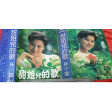

孙小云 甜姐儿的歌80年代
============================

|  |  |
| :--: | :-- |
| [ 孙小云 甜姐儿的歌80年代](https://emumo.xiami.com/album/1194701414) | **艺人**: [孙小云](../index.md) **语种**: 国语 **唱片公司**: 珠江音像 **发行时间**: 1987年01月01日 **专辑类别**: 录音室专辑 **专辑风格**: 民谣 Folk **播放数**: 41 **收藏数**: 9 **评论数**: 4  |

## 简介

孙小云首张个人专辑---《甜姐儿的歌》 
珠海音像出版社出版 
发行时间：1987年 
曲目: 
A面 . 
1 愿在梦中常见你 
2 等 情郎 
3 教我怎能忘记你 
4 你不要把泪流 
5 难得有情郎 
6 爱情直通车 
7 一夜夫妻百日恩 
B面 
1 窗前的照片 
2 永远为我笑 
3 甜姐儿的歌 
4 这都是你的错 
5 他的声音 
6 你该笑一笑 
7 羞答答怎开言

## 曲目

## 评论

|  |  |  |  |
| :-- | :-- | :-- | :-- |
|  [虾米用户](https://emumo.xiami.com/u/339447755)  2020-04-04 10:19 赞(0) 踩(0) | 
期待发布
 |
|  [虾米用户](https://emumo.xiami.com/u/8610515)   2018-06-28 00:43 赞(0) 踩(0) | 
这张专辑的名字叫甜姐儿的歌，有特色但是这里面的歌曲什么时候能够听到呢？谢谢！
 |
|  [虾米用户](https://emumo.xiami.com/u/24556605)  2018-06-24 13:52 赞(0) 踩(0) | 
喜欢艺术家孙小云的作品，不断的来听，点赞点赞点赞
 |
|  [虾米用户](https://emumo.xiami.com/u/8610515)   2018-04-29 14:33 赞(0) 踩(0) | 
这张专辑什么时候能够发布上来？我将满怀期待的等。
 |
