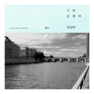

与你在塞纳
============================

|  |  |
| :--: | :-- |
| [ 与你在塞纳](https://emumo.xiami.com/album/2106029635) | **艺人**: [朱家明](../index.md) **语种**: 纯音乐 **唱片公司**: 独立发行 **发行时间**: 2020年02月14日 **专辑类别**: EP, 单曲 **专辑风格**: 器乐独奏 Solo Instrumental **播放数**: 97015 **收藏数**: 9 **评论数**: 5  |

## 简介

《与你在塞纳》是朱家明2020全新演奏专辑的首支单曲，在情人节这一天推出。  
  
作为中国指弹吉他第一人，朱家明以极具情感的旋律和独有的明氏曲风用每一首音乐作品刷新大家对原声吉他的认知。这首《与你在塞纳》创作于2019年初，朱家明首次尝试异国曲风，用尼龙弦吉他让大家在音乐开始的那一刻，就仿佛来到了浪漫的塞纳河畔，这种音乐风格，在国内可以说鲜有人尝试，就让我们在情人节这一天，一起感受朱家明带来的这首“明氏”法国香颂。

## 曲目

## 评论

|  |  |  |  |
| :-- | :-- | :-- | :-- |
|  [虾米用户](https://emumo.xiami.com/u/22353890)  2020-02-20 22:01 赞(0) 踩(0) | 
确实是异国情调
 |
|  [虾米用户](https://emumo.xiami.com/u/277287097) 只有经历了黑暗的人才知道... 2020-02-20 16:25 赞(0) 踩(0) | 
很好听
 |
|  [虾米用户](https://emumo.xiami.com/u/478527) 好想跟衣服在洗衣机里滚 2020-02-19 09:57 赞(0) 踩(0) | 
许久不见的家明
 |
|  [虾米用户](https://emumo.xiami.com/u/324203389)  有温度，无所畏 2020-02-14 21:56 赞(0) 踩(0) | 
粉丝来抢鲜
 |
