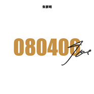
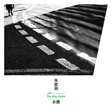
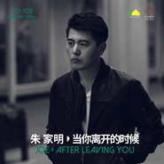

朱家明
============================

|  |  |
| :--: | :-- |
| [ 朱家明](https://i.xiami.com/joeguitar) | **播放数**: 4560497 **粉丝数**: 5829 **评论数**: 209 **地区**: China 中国大陆 **风格**: 灵魂爵士 Soul Jazz, 独立流行 Indie Pop, 华语唱作人 Chinese Singer-Songwriter  |

## 档案

朱家明，1983年出生于黑龙江省齐齐哈尔市。华语流行男歌手、音乐制作人、吉他演奏家、著名原声吉他品牌“Covenant卡弗兰特”首席合作艺术家。2011年发表原创指弹吉他专辑：《白日梦》。2014年发表专辑《白日梦II - 双面》，获得2015年华语金曲奖“年度最佳HI-FI演奏”提名。2015年发表首支单曲《当你离开的时候》，实现了从演奏家到歌手的成功转型。 
早年经历-- 
朱家明七岁接触钢琴，15岁开始自学吉他并组乐队表演，17岁就读大庆艺术学校，就读期间开始尝试创作！ 
2007年来到北京发展，曾在吉他中国担任吉他老师，2008年发表吉他曲《大作为》，2009年与台湾吉他演奏家黄家伟合作演出，2011年发表首张原创指弹吉他专辑《白日梦》。 
演艺经历 
2009 – 2010 
与日本著名吉他演奏家岸部真明、台湾演奏家黄家伟联合演出了分别于北京、上海举办的“东方琴缘”演奏会。2010年7月获得IFSGF国际指弹吉他大赛– “国际组亚军”。10月被邀请成为澳洲指弹吉他大师Tommy Emmanuel2010北京演奏会内地唯一开场嘉宾。 
2011 – 2012 
10月出任加拿大顶级原声吉他品牌“Larrivee”中国大陆地区形象代言人。2011年6月发行国内首张全创作指弹吉他唱片《白日梦》[4]  。2011年7月-12月开始为期半年的朱家明《白日梦》全国巡回演奏会，历经包括香港在内的23座城市。2011年10月《白日梦》唱片经日本著名吉他音乐传播者Pooh的引荐，在日本上架。2011年底受原声吉他品牌“Larrivee”公司以及“L.R.Baggs”拾音器公司邀请赴美国参加2012NAMM Show乐器展览会，并担任表演嘉宾。2012年4月-6月参加湖南卫视《天声一队》节目录制，同年10月新书《朱家明传统美式指弹吉他教程》出版发行。 
2013 
3月在北京创立“朱家明原声吉他中心”。4月正式签约澳洲原声吉他品牌MATON[1]  ，与Tommy Emmanuel、Michael Fix 、Joe robinson等演奏家站在同一吉他阵营。4月加入著名歌手老狼乐队，参与大小演出数十场。5月与北电才女王成成组建“左安西西”。6月参与著名音乐人小柯的音乐剧《因为爱情》担任现场音乐创作与演奏，10月开始第二张指弹吉他专辑的创作。 
2014 
1月赴美国洛杉矶MI音乐学院进修，5月参加“北京草莓音乐节”与“杭州西湖音乐节”的表演，7月第二张创作指弹吉他专辑《白日梦II - 双面》正式发行，在虾米音乐网评分9.5，主打曲《花市》除了被众多吉他乐迷盛赞外，也得到了很多圈外乐迷的喜欢。7月底录制“左安西西”首张创作专辑。8月应邀远赴意大利参加2014 Acoustic Franciacorta 音乐节，做为压轴表演的艺术家，受到当地媒体的关注。11月应歌手李荣浩邀约参加“李荣浩台北新歌演唱会”。12月助阵高晓松“青春无悔”作品音乐会。 
2015 
1月赴纽约完成“左安西西”首张专辑的后期母带工作。2月个人指弹吉他专辑《白日梦II - 双面》获得华语金曲奖“年度最佳HI-FI演奏”提名。3月“左安西西”首张创作专辑《你一直在》在大陆与台湾同步发行。3月以歌手身份签约云上音乐。4月发行个人首支单曲《当你离开的时候》。5月助阵歌手李荣浩“天生”亚洲巡回演唱会。7月举办“左安西西 - 你一直在全国巡回演唱会”。8月助阵“小娟与山谷里的居民”七夕北展演唱会。 
2016 
1月担任歌手鲁向卉个人创作专辑《鱼儿》的制作人，2月参与歌手陈粒专辑《小梦大半》的编曲与演奏，5月担任李荣浩“有理想”世界巡回演唱会吉他手。7月为歌手李琦专辑中歌曲“吵”担任编曲，10月参与张碧晨《开往早晨的午夜》专辑的吉他录制。年底开始左安西西第二张创作专辑的制作。 
2017 
1月-6月参演李荣浩“有理想”世界巡回演唱会，美加、悉尼、伦敦、新加坡、香港、台湾站。7月左安西西回归单曲《孤芳自赏》全网发布，10月左安西西全新专辑首波主打《妙》全网发布，11月左安西西全新专辑第二波主打《生日快乐》正式发布，12月专辑第三波主打《忘忘不念》正式发布，12月14日左安西西全新专辑《左安西西》在台湾发表。 
2018 
4月签约台湾阔思音乐CROS MUSIC，4月-6月朱家明”乡路“全国巡回演奏会，6月11日第三张吉他创作专辑《乡路》发布，10月16日左安西西第二张同名专辑”左安西西“大陆全网发布。11月签约著名原声吉他品牌“Covenant卡弗兰特”，成为其品牌首席合作艺术家。

## 专辑

| 名称 | 语种 | 唱片公司 | 发行时间 | 专辑类别 | 专辑风格 |
| :--: | :-- | :-- | :-- | :-- | :-- |
| [ 《NO.1》](./albums/5022387549.md) | 纯音乐 |  | 2020年06月06日 | 录音室专辑 |  |
| [ 080406](./albums/2108152088.md) | 纯音乐 | 独立发行 | 2020年03月08日 | EP, 单曲 | 流行摇滚 Pop Rock |
| [ 纳兰容若](./albums/2420314596.md) | 纯音乐 | 独立发行 | 2020年02月29日 | EP, 单曲 | 流行 Pop |
| [ 爱的奉献](./albums/2106088232.md) | 纯音乐 | 独立发行 | 2020年02月22日 | EP, 单曲 | 流行 Pop |
| [ 与你在塞纳](./albums/2106029635.md) | 纯音乐 | 独立发行 | 2020年02月14日 | EP, 单曲 | 器乐独奏 Solo Instrumental |
| [ 难兄难弟](./albums/2104896109.md) | 国语 | 勇士传奇 | 2019年05月25日 | EP, 单曲 | 国语流行 Mandarin Pop |
| [ The Way Home Live](./albums/2104602127.md) | 国语 | 独立发行 | 2019年02月17日 | 现场专辑 | 爵士流行 Jazz Pop, 浪漫主义 Romanticism |
| [ 乡路](./albums/2103745820.md) | 纯音乐 | 华宇世博 | 2018年06月11日 | 录音室专辑 | 节奏布鲁斯 R&B, 柔顺爵士 Smooth Jazz |
| [ 当你离开的时候](./albums/431574179.md) | 国语 | 云上音乐 | 2015年05月14日 | EP, 单曲 | 国语流行 Mandarin Pop |
| [ 白日梦II - 双面](./albums/7175974.md) | 国语 | 独立发行 | 2014年09月20日 | 录音室专辑 | 现代古典 Modern Classical, 器乐独奏 Solo Instrumental |
| [ 白日梦](./albums/465885.md) | 国语 | 独立发行 | 2011年09月09日 | 录音室专辑 | 拉格泰姆 Ragtime, 器乐独奏 Solo Instrumental |

## 评论

|  |  |  |  |
| :-- | :-- | :-- | :-- |
|  [虾米用户](https://emumo.xiami.com/u/1733496) 音乐是一生享受不尽的财富 2020-03-13 12:05 赞(0) 踩(0) | 
家明老师，2路车站对面儿的好邻居，还有旁边儿的晋B2008，可以出一两支新单了 
 |
|  [虾米用户](https://emumo.xiami.com/u/16019527) 向日葵是长在土里的太阳。 2019-08-21 01:50 赞(0) 踩(0) | 
好特别 竟然才发现
 |
|  [虾米用户](https://emumo.xiami.com/u/328007415) 我还没想好要写什么... 2019-08-01 17:10 赞(0) 踩(0) | 
喜欢你的音乐
 |
|  [虾米用户](https://emumo.xiami.com/u/201391232) 最快的方法是先抱抱 2019-06-19 08:07 赞(0) 踩(0) | 
彡
 |
|  [虾米用户](https://emumo.xiami.com/u/228843687) 懒惰统治人间 2019-06-04 17:11 赞(0) 踩(0) | 

 |
|  [虾米用户](https://emumo.xiami.com/u/139576680)  2019-02-01 20:02 赞(1) 踩(0) | 
很喜欢你的吉他，希望可以带给我们更多的感动。❤️你，谢谢你，让我觉得世界特别美好。
 |
|  [虾米用户](https://emumo.xiami.com/u/52555139) 来日某天再相见 2018-11-05 02:07 赞(0) 踩(0) | 
200交给我
 |
|  [虾米用户](https://emumo.xiami.com/u/5207194) life is what... 2018-07-19 17:10 赞(4) 踩(0) | 
出产太低了 而且没有继续深度研究 反而去和女生组起了俗气的组合原本很看好朱老师的 以为会成中国的押尾或者tommy 结果这么多年过去了 还在弹那些老调 有点失望 现在更看好曹思义
 |
| ⇒ |  [虾米用户](https://emumo.xiami.com/u/312012518) 月明如素愁不眠 2018-11-11 15:27 赞(0) 踩(0) | 
甚有同感
 |
|  [虾米用户](https://emumo.xiami.com/u/49691100) 是个糟人 2018-06-09 18:55 赞(0) 踩(0) | 
手艺家
 |
|  [虾米用户](https://emumo.xiami.com/u/47456900) 我还没想好要写什么... 2018-05-12 19:31 赞(1) 踩(0) | 
什么时候来北京演出啊
 |
|  [虾米用户](https://emumo.xiami.com/u/3815293) baby Jesus s... 2018-02-20 08:53 赞(0) 踩(0) | 
ʕ &amp;bull;ᴥ&amp;bull;ʔ
 |
|  [虾米用户](https://emumo.xiami.com/u/13111079) 有缘再见 2018-02-18 00:17 赞(0) 踩(0) | 
ෆ
 |
|  [虾米用户](https://emumo.xiami.com/u/2418238) weibo: @尤米口 2017-12-11 22:35 赞(0) 踩(0) | 
♡⃛
 |
|  [虾米用户](https://emumo.xiami.com/u/43292535) 过油猪大肠面一碗 2017-11-21 10:38 赞(3) 踩(0) | 
谢谢你，很偶然的机会在每日推荐里听到了你的音乐，一种久违的感动让我鼻子酸酸的，你每一次的拨弦每一句乐句的呈现强烈的拽着我回到过去，少年时因为家境贫寒看着抱着吉他的同龄孩子而自己不得成了我长大以后一直挥之不去的心酸，听着你的音乐，乐声里仿佛看到了自己羡慕的站在那里看着别人弹琴的模样，每个人可能都有一些不能碰触的疼，能在音乐找到抚慰该是多么美好的事，就如听到你的音乐时的我可以静静的为自己远去的时光轻叹一声。谢谢有你在 
 |
|  [虾米用户](https://emumo.xiami.com/u/45298985) Wechat:dqx19... 2017-11-01 17:17 赞(0) 踩(0) | 
+
 |
|  [虾米用户](https://emumo.xiami.com/u/11464098)  2017-10-31 17:45 赞(1) 踩(0) | 
新首发听了，不错不错，就是不知道还要等多少年才能等到白日梦3。
 |
| ⇒ |  [虾米用户](https://emumo.xiami.com/u/339186373) 这家伙很笨什么也没留下.... 2017-12-26 13:24 赞(0) 踩(0) | 
明年
 |
|  [虾米用户](https://emumo.xiami.com/u/35843401)  2017-10-27 23:26 赞(0) 踩(0) | 
超好听！！！简直是学习时的安神剂和能量！
 |
|  [虾米用户](https://emumo.xiami.com/u/5576267)  2017-10-27 23:02 赞(0) 踩(0) | 
我在云大看了他们的演出，还买了CD和谱子，这两天在加紧练习。真的很棒，后来回来看到资料才知道他还是我校友，师哥。呵呵。
 |
|  [虾米用户](https://emumo.xiami.com/u/5569588) 一个人的交响乐 2017-09-20 13:56 赞(0) 踩(0) | 
maton代言人？马桶居然有代言人。。。想当年在澳洲去找maton谈代理，人家都不想卖琴，从琴展主办方得知，马桶的高层在打架，都不参展。不知仁兄听说过没有 ：P
 |
|  [虾米用户](https://emumo.xiami.com/u/271441610) 久等啦，小白这就来 2017-08-19 09:53 赞(0) 踩(0) | 
好听哦，古色古香不乏今日春光
 |
|  [虾米用户](https://emumo.xiami.com/u/268340271) 我还没想好要写什么... 2017-08-15 15:52 赞(0) 踩(0) | 
棒
 |
|  [虾米用户](https://emumo.xiami.com/u/284353592)  2017-08-10 17:16 赞(0) 踩(0) | 
每首都好好听啊。。。都无心写作业了0 0
 |
|  [虾米用户](https://emumo.xiami.com/u/91224670) Oh My Deares... 2017-07-18 08:47 赞(0) 踩(0) | 
好听到千千万万遍。
 |
|  [虾米用户](https://emumo.xiami.com/u/4759307) 感谢永远有歌，把心境道破 2017-07-17 11:28 赞(0) 踩(0) | 
棒呆~
 |
|  [虾米用户](https://emumo.xiami.com/u/628571)  2017-07-13 16:47 赞(0) 踩(0) | 
肖旭出专辑了？
 |
|  [虾米用户](https://emumo.xiami.com/u/50348963) @37am 2017-07-12 21:35 赞(0) 踩(0) | 
.
 |
|  [虾米用户](https://emumo.xiami.com/u/1103806) 任何东西都只是生活的一部... 2017-07-09 21:34 赞(2) 踩(0) | 
就喜欢您的作品 
 |
|  [虾米用户](https://emumo.xiami.com/u/3815293) baby Jesus s... 2017-07-08 13:52 赞(0) 踩(0) | 
好哒知道了朱老师
 |
|  [虾米用户](https://emumo.xiami.com/u/263407765)  2017-06-29 20:52 赞(1) 踩(0) | 
好听 
 |
|  [虾米用户](https://emumo.xiami.com/u/187948483)  2017-05-31 01:48 赞(0) 踩(0) | 
棒棒哒
 |
|  [虾米用户](https://emumo.xiami.com/u/12221090) 逍遥于天地而心意自得 2017-05-19 17:43 赞(0) 踩(0) | 
赞
 |
|  [虾米用户](https://emumo.xiami.com/u/292275541) 我很开心 2017-05-12 22:33 赞(0) 踩(0) | 
在不在
 |
|  [虾米用户](https://emumo.xiami.com/u/9003931) 千淘万漉虽辛苦 2017-05-11 08:38 赞(0) 踩(0) | 
有点意思。
 |
|  [虾米用户](https://emumo.xiami.com/u/40564661) 你丫才是美工 2017-05-10 16:32 赞(0) 踩(0) | 
好喜欢，听一段就惊艳了
 |
|  [虾米用户](https://emumo.xiami.com/u/291551098) 音乐让我释怀 2017-04-29 06:52 赞(0) 踩(0) | 
达到了音乐的境界，很喜欢，每次听的都飘飘仙的～
 |
|  [虾米用户](https://emumo.xiami.com/u/45083836)  2017-04-27 14:13 赞(0) 踩(0) | 
指弹 花市
 |
|  [虾米用户](https://emumo.xiami.com/u/12381477)   2017-03-25 15:22 赞(1) 踩(0) | 
给你们推荐一下这个人。给lrh弹吉他的，但是他自己的曲子高级感真的高很多嘻嘻。
 |
|  [虾米用户](https://emumo.xiami.com/u/12852028) 国家级爱情退堂鼓专业鼓手... 2017-02-20 23:43 赞(0) 踩(0) | 
什么时候出新专辑啊？！
 |
|  [虾米用户](https://emumo.xiami.com/u/5690474)  2016-11-13 15:00 赞(1) 踩(0) | 
没好好推广这样的大师是罪过啊！
 |
|  [虾米用户](https://emumo.xiami.com/u/5739280) 虾米脑残粉，虾米一生黑 2016-10-02 11:24 赞(0) 踩(0) | 
下载居然要付费，赶紧去买了张专辑压压惊
 |
|  [虾米用户](https://emumo.xiami.com/u/228647379)  2016-09-27 14:37 赞(0) 踩(0) | 
吉他世界网那哥们
 |
|  [虾米用户](https://emumo.xiami.com/u/12143704) 抗把得 2016-08-11 18:15 赞(0) 踩(0) | 
来顶啦
 |
|  [虾米用户](https://emumo.xiami.com/u/41856456) 你要把你的脑子用在正事上 2016-06-12 18:49 赞(0) 踩(0) | 
只爱奔南
 |
|  [虾米用户](https://emumo.xiami.com/u/55295191) Write, loaf,... 2016-06-06 15:45 赞(0) 踩(0) | 
过来看看大叔qwq
 |
|  [虾米用户](https://emumo.xiami.com/u/1766152) 什么样的风光可以留住你。 2016-06-05 18:24 赞(0) 踩(0) | 
朱总…新专辑呢
 |
|  [虾米用户](https://emumo.xiami.com/u/13337996) 听 2016-05-14 09:01 赞(0) 踩(0) | 
是不是也在左安西西担任作曲编曲和吉他？
 |
| ⇒ |  [虾米用户](https://emumo.xiami.com/u/1766152) 什么样的风光可以留住你。 2016-06-05 18:25 赞(0) 踩(0) | 
是哒
 |
| ⇒ |  [虾米用户](https://emumo.xiami.com/u/40225233) 年少的心总有些轻狂 2016-06-29 23:02 赞(0) 踩(0) | 
是的
 |
|  [虾米用户](https://emumo.xiami.com/u/10552255) 私人的精神花园 2016-05-13 15:20 赞(0) 踩(0) | 
居然被感谢了 也不知道是不是本尊 粉一个
 |
|  [虾米用户](https://emumo.xiami.com/u/72666568)  2016-05-11 19:34 赞(0) 踩(0) | 
。好吧
 |
|  [虾米用户](https://emumo.xiami.com/u/50792813) 爱你 虾米 2016-05-04 11:51 赞(0) 踩(0) | 
哇
 |
|  [虾米用户](https://emumo.xiami.com/u/5621382)   2016-04-22 18:21 赞(0) 踩(0) | 
朱老师我男神 
 |
|  [虾米用户](https://emumo.xiami.com/u/35167460) La vie elle ... 2016-04-17 08:09 赞(0) 踩(0) | 
灵魂乐手 
 |
|  [虾米用户](https://emumo.xiami.com/u/46226344) 喵 2016-04-13 00:51 赞(0) 踩(0) | 
好听
 |
|  [虾米用户](https://emumo.xiami.com/u/15477519) 爱  是生命的和弦，而不... 2016-04-11 11:37 赞(0) 踩(0) | 
早已喜欢…
 |
|  [虾米用户](https://emumo.xiami.com/u/16852456) 理想是御用配乐师(/ω＼... 2016-04-09 22:54 赞(0) 踩(0) | 
好音乐无处不在
 |
|  [虾米用户](https://emumo.xiami.com/u/5556788) 我还没想好要写什么... 2016-03-14 00:33 赞(0) 踩(0) | 
好喜欢你的【谁的歌】半夜1个人想事情，一边听到起鸡皮疙瘩！一直循环了1个小时，想好听惨了！加油！
 |
|  [虾米用户](https://emumo.xiami.com/u/4486462) 不和听垃圾的人做朋友。 2016-03-07 16:20 赞(1) 踩(0) | 
哇哦！！！！！！！！！！！！！
 |
|  [虾米用户](https://emumo.xiami.com/u/22353890)  2016-03-06 10:07 赞(0) 踩(0) | 
简单的音乐就能打动人心
 |
|  [虾米用户](https://emumo.xiami.com/u/22353890)  2016-03-06 10:07 赞(0) 踩(0) | 
简单的音乐就能打动人心
 |
|  [虾米用户](https://emumo.xiami.com/u/49065457) 遍雨遍雾 2015-12-15 22:34 赞(0) 踩(0) | 
男神
 |
|  [虾米用户](https://emumo.xiami.com/u/45385073) 爱虾米期待再相遇为新：t... 2015-11-23 14:51 赞(0) 踩(0) | 
喜欢
 |
|  [虾米用户](https://emumo.xiami.com/u/1442825) 我还没想好要写什么... 2015-10-07 04:58 赞(0) 踩(0) | 
音色好正
 |
|  [虾米用户](https://emumo.xiami.com/u/8943891) 你咋那么可爱？ 2015-09-14 20:19 赞(0) 踩(0) | 
I
 |
|  [虾米用户](https://emumo.xiami.com/u/9369292)  2015-09-11 16:44 赞(0) 踩(0) | 
心静 好听
 |
|  [虾米用户](https://emumo.xiami.com/u/3425354) 不在放荡中变坏，就在沉默... 2015-08-30 12:42 赞(0) 踩(0) | 
很有味道，难得清新怀旧的感觉。
 |
|  [虾米用户](https://emumo.xiami.com/u/1476807)  2015-08-28 15:23 赞(0) 踩(0) | 
谁的歌---夏潇
 |
|  [虾米用户](https://emumo.xiami.com/u/58277458)  2015-08-27 11:56 赞(0) 踩(0) | 
好可爱的音乐人好可爱的音乐
 |
|  [虾米用户](https://emumo.xiami.com/u/4315535)   2015-08-20 12:15 赞(0) 踩(0) | 
good
 |
|  [虾米用户](https://emumo.xiami.com/u/12033868) 如何感怀，你的短发。 2015-08-14 20:23 赞(0) 踩(0) | 
老乡啊哈哈哈很喜欢棒棒棒
 |
|  [虾米用户](https://emumo.xiami.com/u/15278505) 时光如镜 恍若琉璃般暗自... 2015-08-09 09:22 赞(1) 踩(0) | 
白日梦，时下里这样难得。美的东西不能辜负 亦不能错过。喜欢这样的曲风，会一直关注。
 |
|  [虾米用户](https://emumo.xiami.com/u/51565161)  2015-06-20 18:57 赞(0) 踩(0) | 
我觉得朱家明曲子很棒啊
 |
|  [虾米用户](https://emumo.xiami.com/u/8946950) 灌不饱的耳朵 2015-06-13 20:08 赞(0) 踩(0) | 
简直在心目中和清华哥哥一样男神！
 |
|  [虾米用户](https://emumo.xiami.com/u/6232148) 在虾米坚持到最后一秒 2015-06-03 01:03 赞(0) 踩(0) | 
赶泼泼特的凌晨一点零三分 一杯咖啡加吉他 哟西~
 |
|  [虾米用户](https://emumo.xiami.com/u/15977129)  2015-05-21 07:17 赞(1) 踩(0) | 
有质感的音乐人，期待暑假巡演 
 |
|  [虾米用户](https://emumo.xiami.com/u/1625887)  2015-05-19 08:55 赞(1) 踩(0) | 
让人能够放下防备的音乐。
 |
|  [虾米用户](https://emumo.xiami.com/u/25925960)  2015-05-18 12:28 赞(1) 踩(0) | 
用那英的话来说就是：好听！
 |
|  [虾米用户](https://emumo.xiami.com/u/13167480) 哈哈 2015-05-17 08:21 赞(0) 踩(0) | 
猛一看和John Mayer好像，猛一听和他08年的时候的感觉有点像。
 |
|  [虾米用户](https://emumo.xiami.com/u/19408151) 归璞原创音乐团队曲部成员 2015-05-16 13:39 赞(0) 踩(0) | 
你这辈分好高啊！ 
 |
|  [虾米用户](https://emumo.xiami.com/u/29982798) 自由创作，自由生活！ 2015-05-15 23:09 赞(0) 踩(0) | 
好听
 |
|  [虾米用户](https://emumo.xiami.com/u/5556788) 我还没想好要写什么... 2015-05-15 21:09 赞(0) 踩(0) | 
李香兰
 |
|  [虾米用户](https://emumo.xiami.com/u/6939781) Take it easy 2015-05-15 16:30 赞(0) 踩(0) | 
感觉气不足呢？
 |
|  [虾米用户](https://emumo.xiami.com/u/155141)   2015-05-15 15:14 赞(0) 踩(0) | 
欢喜花市
 |
|  [虾米用户](https://emumo.xiami.com/u/337333) 耨木耨木 撒浪嘿 2015-05-15 10:22 赞(0) 踩(0) | 
声音不错
 |
|  [虾米用户](https://emumo.xiami.com/u/39941279) B站直播间924313，... 2015-05-15 09:42 赞(0) 踩(0) | 
以前挺喜欢指弹的 支持你！
 |
|  [虾米用户](https://emumo.xiami.com/u/18571864)  2015-05-15 04:51 赞(12) 踩(0) | 
新空气，虾米被民谣着了半边天
 |
|  [虾米用户](https://emumo.xiami.com/u/41940420) 这就是个丧尸的世界 2015-05-11 22:36 赞(0) 踩(0) | 
Hey !
 |
|  [虾米用户](https://emumo.xiami.com/u/42985758) 说好的无损呢？ 2015-05-08 06:59 赞(0) 踩(0) | 
加油，明叔。
 |
|  [虾米用户](https://emumo.xiami.com/u/4380909)  2015-05-06 18:37 赞(0) 踩(0) | 
shishi
 |
|  [虾米用户](https://emumo.xiami.com/u/3798043)  2015-05-05 21:21 赞(0) 踩(0) | 
其实..去掉那些多元的身份和元素,专注指弹可以更好的.
 |
|  [虾米用户](https://emumo.xiami.com/u/3685859)  2015-04-20 16:11 赞(0) 踩(0) | 
哈，真是惊喜
 |
|  [虾米用户](https://emumo.xiami.com/u/3685859)  2015-04-20 16:08 赞(0) 踩(0) | 
在看他的教学，过来听听
 |
|  [虾米用户](https://emumo.xiami.com/u/630100) 谢谢你出现在我的青春里 2015-04-13 16:24 赞(0) 踩(0) | 
在这个慵懒的午后，给了一份惊喜的感动。  
 |
|  [虾米用户](https://emumo.xiami.com/u/6684217)  2015-04-09 10:09 赞(0) 踩(0) | 
well
 |
|  [虾米用户](https://emumo.xiami.com/u/519)  2015-04-05 23:17 赞(0) 踩(0) | 
喜欢
 |
|  [虾米用户](https://emumo.xiami.com/u/9495284)   2015-04-04 11:52 赞(2) 踩(0) | 
李香兰好棒啊
 |
|  [虾米用户](https://emumo.xiami.com/u/44510600) 暂无签名~ 2015-04-01 16:26 赞(0) 踩(0) | 
喜欢朱家明，
 |
|  [虾米用户](https://emumo.xiami.com/u/48376646)  2015-03-24 15:04 赞(0) 踩(0) | 
技术精湛，配器精准。和声变化丰富，
 |
|  [虾米用户](https://emumo.xiami.com/u/2987825) 双耳听出希望之音 2015-03-12 12:31 赞(0) 踩(0) | 
真棒=￣ω￣=
 |
|  [虾米用户](https://emumo.xiami.com/u/574209) 喜歡音樂的攝影師 2015-03-07 02:32 赞(0) 踩(0) | 
朱家明！臉好熟，就是想不起來在哪見過
 |
| ⇒ |  [虾米用户](https://emumo.xiami.com/u/7810962)  2015-03-07 17:12 赞(0) 踩(0) | 
&amp;lt;法制进行时&amp;gt;
 |
| ⇒ |  [虾米用户](https://emumo.xiami.com/u/449261) 一只热爱音乐的人类 2015-09-28 23:31 赞(0) 踩(0) | 
<q><b>朱家明说：</b></q>
 |
|  [虾米用户](https://emumo.xiami.com/u/23308016) 我还没想好要写什么... 2015-01-30 19:12 赞(0) 踩(0) | 
国内比较厉害的美式指弹乐手。
 |
|  [虾米用户](https://emumo.xiami.com/u/45876385) 你的花，早谢了。 2015-01-22 19:55 赞(0) 踩(0) | 
加油加油，喜欢
 |
|  [虾米用户](https://emumo.xiami.com/u/46070704) 嗨你好 2015-01-15 20:51 赞(0) 踩(0) | 
guitar 对胃
 |
|  [虾米用户](https://emumo.xiami.com/u/45473844)  2015-01-15 20:02 赞(0) 踩(0) | 
灵魂爵士
 |
|  [虾米用户](https://emumo.xiami.com/u/43013880) 浅吟低唱，渐入人心 2015-01-15 14:43 赞(0) 踩(0) | 
老师好！
 |
|  [虾米用户](https://emumo.xiami.com/u/8946950) 灌不饱的耳朵 2015-01-10 19:26 赞(1) 踩(0) | 
相比提琴，我更喜欢吉他，可以恣意随性，亦不失古典之味。
 |
|  [虾米用户](https://emumo.xiami.com/u/449240) 一个人怀旧 2015-01-05 13:33 赞(0) 踩(0) | 
很安静！舒服、放松心情真好听。
 |
|  [虾米用户](https://emumo.xiami.com/u/3010077)  2015-01-01 10:56 赞(1) 踩(0) | 
行云流水，听着很舒心~~~
 |
|  [虾米用户](https://emumo.xiami.com/u/4468860)  2014-12-30 13:07 赞(0) 踩(0) | 
喜欢
 |
|  [虾米用户](https://emumo.xiami.com/u/8070377) 爱雾瑞性维欧腐漏 2014-12-25 01:24 赞(0) 踩(0) | 
好有自知之明的楼下 ↓
 |
|  [虾米用户](https://emumo.xiami.com/u/39556280) o 2014-12-23 17:58 赞(1) 踩(0) | 
哎 真棒...练到下辈子也没这么好
 |
| ⇒ |  [虾米用户](https://emumo.xiami.com/u/1006550) 束缚胜无界 2015-03-05 01:19 赞(0) 踩(0) | 
哈哈，加油
 |
|  [虾米用户](https://emumo.xiami.com/u/44741034) 未来，你好！ 2014-12-23 12:08 赞(0) 踩(0) | 
支持一下！大家应该给国内用心做音乐的音乐人鼓励与支持，毕竟现在大陆做音乐的大环境不怎么好，所以才会有那么多人去了日本发展。这个问题值得我们深思。
 |
|  [虾米用户](https://emumo.xiami.com/u/34873158) 风中的尿 2014-12-21 00:08 赞(0) 踩(0) | 
不知道现场为什么人那么少，很棒的音乐。坚持到底！
 |
|  [虾米用户](https://emumo.xiami.com/u/39235894) 响者，为乐。 2014-12-05 14:53 赞(0) 踩(0) | 
收藏，喜欢
 |
|  [虾米用户](https://emumo.xiami.com/u/44005673)  2014-11-23 20:40 赞(0) 踩(0) | 
一花一草一世界，音乐响起来一下就进入了自己的小世界里，绿意盎然
 |
|  [虾米用户](https://emumo.xiami.com/u/3685859)  2014-11-17 20:23 赞(0) 踩(0) | 
听了在路上跟来的
 |
|  [虾米用户](https://emumo.xiami.com/u/2269197) 困 2014-11-04 13:47 赞(0) 踩(0) | 
喜欢 李香兰 中山  花市  无门之门~~~
 |
|  [虾米用户](https://emumo.xiami.com/u/21997351)  2014-11-02 14:56 赞(0) 踩(0) | 
陶醉于音乐之中
 |
|  [虾米用户](https://emumo.xiami.com/u/21997351)  2014-11-02 14:56 赞(0) 踩(0) | 
陶醉于音乐之中
 |
|  [虾米用户](https://emumo.xiami.com/u/726752) 已下架 2014-11-02 13:02 赞(1) 踩(0) | 
很牛逼的赶脚，赞
 |
|  [虾米用户](https://emumo.xiami.com/u/478527) 好想跟衣服在洗衣机里滚 2014-10-29 12:21 赞(0) 踩(0) | 
从纯音之旅来的，M下
 |
|  [虾米用户](https://emumo.xiami.com/u/4794974) 爱笑爱沉默，喜欢热闹但更... 2014-10-27 00:13 赞(0) 踩(0) | 
好听！回家吉他继续
 |
|  [虾米用户](https://emumo.xiami.com/u/5783497) 生活会给你下一个故事。 2014-10-25 13:44 赞(1) 踩(0) | 
朱老师你长得给人一种清风明月的感觉。〒_〒
 |
|  [虾米用户](https://emumo.xiami.com/u/38618104) 人生短暂，不要让自己不愉... 2014-10-13 13:36 赞(18) 踩(0) | 
在办公室放，然后就边听边憋着不想去上厕所，生怕错过好曲子，哈哈哈
 |
|  [虾米用户](https://emumo.xiami.com/u/1654768) 在这黎明将至的山谷里，我... 2014-10-05 13:23 赞(0) 踩(0) | 
It hits my nerve.
 |
|  [虾米用户](https://emumo.xiami.com/u/38871177) 暂无签名~ 2014-10-02 13:43 赞(0) 踩(0) | 
好听~
 |
|  [虾米用户](https://emumo.xiami.com/u/15826803) 纯纯的聆听 2014-09-27 14:32 赞(0) 踩(0) | 
喜欢节奏感的放松的旋律，非常不错的纯音乐吉他弹奏！
 |
|  [虾米用户](https://emumo.xiami.com/u/9976908) 双重人格 2014-09-26 17:34 赞(0) 踩(0) | 
苦秋
 |
|  [虾米用户](https://emumo.xiami.com/u/7708588)  2014-09-23 10:09 赞(0) 踩(0) | 
哇塞！是朱家明老师哎！！！顶
 |
|  [虾米用户](https://emumo.xiami.com/u/8449358)  2014-09-22 23:29 赞(0) 踩(0) | 
深入内心的音乐
 |
|  [虾米用户](https://emumo.xiami.com/u/834334)  2014-09-22 21:44 赞(0) 踩(0) | 
厉害~
 |
|  [虾米用户](https://emumo.xiami.com/u/7365010) 超然 2014-09-22 21:24 赞(0) 踩(0) | 
好听
 |
|  [虾米用户](https://emumo.xiami.com/u/17157405) 当然我也没有签名 2014-09-22 18:51 赞(0) 踩(0) | 
真好听。
 |
|  [虾米用户](https://emumo.xiami.com/u/8764039)  2014-09-22 17:06 赞(1) 踩(0) | 
很喜欢李香兰。有一股揪心的压抑，让我欲罢不能。
 |
|  [虾米用户](https://emumo.xiami.com/u/36029) ½ 2014-09-21 16:27 赞(0) 踩(0) | 
很棒的指弹 情感完全流露 非常动人
 |
|  [虾米用户](https://emumo.xiami.com/u/8313493)  2014-08-29 23:55 赞(0) 踩(0) | 
00000
 |
|  [虾米用户](https://emumo.xiami.com/u/5569588) 一个人的交响乐 2014-08-05 11:15 赞(0) 踩(0) | 
这黑猫警长也太逗了吧~~
 |
|  [虾米用户](https://emumo.xiami.com/u/37153224)  2014-07-14 14:36 赞(0) 踩(0) | 
朱老师，我是弹琴的小女子。。一直很爱指弹。。在西湖音乐节第一次听到左安西西。。虽然下了暴雨。。但是感觉好听到爆了。。值了。。超喜欢你们的style～希望有机会还能现场听你的演奏。。能收我为徒么哈哈哈～～
 |
|  [虾米用户](https://emumo.xiami.com/u/1271812) WX:Likejazzm... 2014-07-10 22:15 赞(0) 踩(0) | 
音痴到此一游
 |
|  [虾米用户](https://emumo.xiami.com/u/588121) 我还没想好要写什么... 2014-07-08 15:51 赞(1) 踩(0) | 
第二章专辑 准备来了！貌似又是有关前女友的哟，看来前女友给佳明不少灵感哟  ，
 |
|  [虾米用户](https://emumo.xiami.com/u/8159374)  2014-06-23 19:56 赞(0) 踩(0) | 
北京，东京。我一直对这首曲子大爱，怎么听都有种莫名的无奈心酸！萦绕心头，挥之不去。只要开始听，就有种魔力想继续听完。朱老师加油！希望以后的每首曲子都能与之媲美。
 |
| ⇒ |  [虾米用户](https://emumo.xiami.com/u/588121) 我还没想好要写什么... 2014-07-08 15:50 赞(0) 踩(0) | 
为了这曲子 花了100文 买了家明的专辑（貌似现在绝版了） 因为买专辑送谱子
 |
|  [虾米用户](https://emumo.xiami.com/u/37379727)  2014-06-09 11:17 赞(0) 踩(0) | 
适合车上听
 |
|  [虾米用户](https://emumo.xiami.com/u/10514945) 音我而生 2014-05-27 16:32 赞(0) 踩(0) | 
大师风范！
 |
|  [虾米用户](https://emumo.xiami.com/u/36541831)  2014-05-13 09:13 赞(0) 踩(0) | 
呵呵
 |
|  [虾米用户](https://emumo.xiami.com/u/3814023) 瞎听听不比比 2014-05-01 01:22 赞(0) 踩(0) | 
才这么点粉丝太不科学了
 |
|  [虾米用户](https://emumo.xiami.com/u/111336) 十万个凭什么 2014-04-24 13:50 赞(0) 踩(0) | 
终于来了！！热烈欢迎！！
 |
|  [虾米用户](https://emumo.xiami.com/u/7810962)  2014-04-24 10:19 赞(239) 踩(0) | 
我刚入驻了虾米音乐人，欢迎大家来我的个人主页，收听我的最新音乐
 |
| ⇒ |  [虾米用户](https://emumo.xiami.com/u/6851856) 这个家伙不聪明，但还是什... 2014-04-28 22:23 赞(0) 踩(0) | 
朱老师上次在郑州没买谱子是因为妹揣钱！！其实我每次练琴都把咱俩的合照摆到桌子上自勉的！！
 |
| ⇒ |  [虾米用户](https://emumo.xiami.com/u/2793112) 声声色色纷纷无无吾吾悟悟 2014-06-08 19:09 赞(0) 踩(0) | 
老师，我可做您徒弟吗？
 |
| ⇒ |  [虾米用户](https://emumo.xiami.com/u/4335954)   2014-07-22 14:38 赞(0) 踩(0) | 
:)
 |
| ⇒ |  [虾米用户](https://emumo.xiami.com/u/9726899)  2014-10-30 13:27 赞(0) 踩(0) | 
请问什么是指弹啊，把吉他放地上当古筝那样弹？
 |
| ⇒ |  [虾米用户](https://emumo.xiami.com/u/1390041)  2014-11-01 23:04 赞(0) 踩(0) | 
你的音乐很有意思哈哈
 |
| ⇒ |  [虾米用户](https://emumo.xiami.com/u/34324497) 暂无签名~ 2014-11-23 12:24 赞(0) 踩(0) | 
<q><b>kidb123说：</b></q>
 |
| ⇒ |  [虾米用户](https://emumo.xiami.com/u/9726899)  2014-11-25 12:38 赞(0) 踩(0) | 
<q><b>灰灰酱说：</b></q>
 |
| ⇒ |  [虾米用户](https://emumo.xiami.com/u/9726899)  2014-11-25 12:39 赞(0) 踩(0) | 
<q><b>灰灰酱说：</b></q>
 |
| ⇒ |  [虾米用户](https://emumo.xiami.com/u/42575996) fingerstyle 2014-11-27 18:29 赞(0) 踩(0) | 
<q><b>灰灰酱说：</b></q>
 |
| ⇒ |  [虾米用户](https://emumo.xiami.com/u/34324497) 暂无签名~ 2014-11-27 19:01 赞(0) 踩(0) | 
<q><b>kidb123说：</b></q>
 |
| ⇒ |  [虾米用户](https://emumo.xiami.com/u/8137747)   2015-05-16 12:44 赞(0) 踩(0) | 
喜欢，加油！
 |
| ⇒ |  [虾米用户](https://emumo.xiami.com/u/54355997)  2015-08-03 11:01 赞(0) 踩(0) | 
我会超越你的
 |
| ⇒ |  [虾米用户](https://emumo.xiami.com/u/54355997)  2015-08-03 11:01 赞(0) 踩(0) | 
我会超越你的
 |
| ⇒ |  [虾米用户](https://emumo.xiami.com/u/1948315)  2015-12-21 11:11 赞(0) 踩(0) | 
好听，加油
 |
| ⇒ |  [虾米用户](https://emumo.xiami.com/u/93881364)  2015-12-25 23:32 赞(0) 踩(0) | 
又听到你的琴声了   
 |
| ⇒ |  [虾米用户](https://emumo.xiami.com/u/93881364)  2015-12-25 23:33 赞(0) 踩(0) | 
期待再次来银川啊   
 |
| ⇒ |  [虾米用户](https://emumo.xiami.com/u/50454670) 这家伙很聪明什么也 2017-11-27 23:26 赞(0) 踩(0) | 
被花市吸引了，好棒的编排，独有的味道 
 |
| ⇒ |  [虾米用户](https://emumo.xiami.com/u/324203389)  有温度，无所畏 2018-09-14 10:04 赞(0) 踩(0) | 
喜欢你的作品，特此表白。朱老师太棒了，作品不止是一首首乐曲，还是一个个故事，朱老师加油。HelenS-20180914
 |
| ⇒ |  [虾米用户](https://emumo.xiami.com/u/43354939) 及时行乐，及时止损！乐膳... 2018-11-18 02:24 赞(0) 踩(0) | 
家明老师，今晚在L7见到你了，真的超级棒哈！还请您签名了，就是您看上去有点害羞，真可爱 加油！
 |
| ⇒ |  [虾米用户](https://emumo.xiami.com/u/35532187)  2019-07-16 19:19 赞(0) 踩(0) | 
什么时候来深圳开演唱会？演出？翘首企盼中！
 |
| ⇒ |  [虾米用户](https://emumo.xiami.com/u/47808059)   2020-06-01 12:57 赞(0) 踩(0) | 
<q><b>幸福胡月说：</b></q>
 |
|  [虾米用户](https://emumo.xiami.com/u/320897) 音乐无国界，分享无境界 2014-04-23 16:26 赞(0) 踩(0) | 
少有人知的大师，大师也得宣传啊！
 |
|  [虾米用户](https://emumo.xiami.com/u/2138355) 燦爛的寂寞 2014-04-23 14:16 赞(0) 踩(0) | 
厉害
 |
|  [虾米用户](https://emumo.xiami.com/u/33039156) 等你开完会我们就回家好不... 2014-02-21 13:42 赞(0) 踩(0) | 
踏实
 |
|  [虾米用户](https://emumo.xiami.com/u/1226865) 爱音乐的人原本就该活简单 2013-11-19 06:49 赞(0) 踩(0) | 
世界名师
 |
|  [虾米用户](https://emumo.xiami.com/u/11420900) erase me 2013-09-18 02:24 赞(0) 踩(0) | 
真不错~
 |
|  [虾米用户](https://emumo.xiami.com/u/1980053)  2013-09-15 06:01 赞(1) 踩(0) | 
除了唱歌时表情很贱以外其他都不错 编曲能力超强 和弦搭配非常追求别人学不会
 |
| ⇒ |  [虾米用户](https://emumo.xiami.com/u/12317756) We 2014-01-29 23:03 赞(0) 踩(0) | 
赞同！我第一次看视频的时候就觉得这货真尼玛贱啊，后来才发现技术是介样地流弊～
 |
|  [虾米用户](https://emumo.xiami.com/u/2116362)  2013-09-10 14:48 赞(0) 踩(0) | 
朱家明
 |
|  [虾米用户](https://emumo.xiami.com/u/5037427)  2013-07-23 11:18 赞(0) 踩(0) | 
fingerstyle
 |
|  [虾米用户](https://emumo.xiami.com/u/16111134) 爱情无非自顾自的执着 2013-07-15 00:26 赞(0) 踩(0) | 
有点玩世不恭，放荡洒脱的味道。。。
 |
|  [虾米用户](https://emumo.xiami.com/u/241988)  2013-06-03 10:07 赞(0) 踩(0) | 
几乎是中国最好的指弹演奏家
 |
|  [虾米用户](https://emumo.xiami.com/u/8239126)  2013-04-13 17:11 赞(0) 踩(0) | 
細膩
 |
|  [虾米用户](https://emumo.xiami.com/u/3235848)  2013-04-07 09:02 赞(0) 踩(0) | 
0.0
 |
|  [虾米用户](https://emumo.xiami.com/u/1109457)  2013-03-28 09:38 赞(0) 踩(0) | 
指弹
 |
|  [虾米用户](https://emumo.xiami.com/u/10887285)   2013-01-27 17:01 赞(0) 踩(0) | 
很喜欢大屯路东这首曲子，已经很有Tommy的味道了
 |
|  [虾米用户](https://emumo.xiami.com/u/1010302)  2012-11-28 17:45 赞(0) 踩(0) | 
吉他吉他！
 |
|  [虾米用户](https://emumo.xiami.com/u/11441906)  2012-11-11 09:46 赞(0) 踩(0) | 
白日梦
 |
|  [虾米用户](https://emumo.xiami.com/u/6284173) 听音，遇人，行过 2012-09-27 11:05 赞(0) 踩(0) | 
很喜欢
 |
|  [虾米用户](https://emumo.xiami.com/u/7582928)  2012-09-25 12:04 赞(0) 踩(0) | 
喜欢指弹
 |
|  [虾米用户](https://emumo.xiami.com/u/2335307)  2012-09-20 21:15 赞(0) 踩(0) | 
中国指弹的引领者
 |
|  [虾米用户](https://emumo.xiami.com/u/10607299) let it be 2012-09-14 00:42 赞(0) 踩(0) | 
fingerstyleguitar
 |
|  [虾米用户](https://emumo.xiami.com/u/10187925) 上善若水 2012-08-12 20:13 赞(0) 踩(0) | 
中国的指弹，棒！
 |
|  [虾米用户](https://emumo.xiami.com/u/1284491)  2012-07-23 09:22 赞(0) 踩(0) | 
作品太少，听的不过瘾，加油！
 |
|  [虾米用户](https://emumo.xiami.com/u/3396785)  2012-07-09 09:08 赞(0) 踩(0) | 
顶！
 |
|  [虾米用户](https://emumo.xiami.com/u/6649580)  2012-06-26 19:51 赞(0) 踩(0) | 
什么时候再出专辑呀
 |
|  [虾米用户](https://emumo.xiami.com/u/5696779) 好色无胆，好酒无量，好钱... 2012-06-10 20:02 赞(0) 踩(0) | 
属于中国的指弹吉他
 |
|  [虾米用户](https://emumo.xiami.com/u/2829623) 野蛮生长，不忘初心 2012-03-31 13:32 赞(0) 踩(0) | 
加油~
 |
|  [虾米用户](https://emumo.xiami.com/u/8159374)  2012-02-24 06:59 赞(0) 踩(0) | 
实力派需要理由吗
 |
|  [虾米用户](https://emumo.xiami.com/u/8005517)  2012-02-11 21:14 赞(0) 踩(0) | 
爵士乐风
 |
|  [虾米用户](https://emumo.xiami.com/u/6331370) 我还没想好要写什么... 2012-01-26 16:26 赞(0) 踩(0) | 
中国的tommy emmanuel
 |
|  [虾米用户](https://emumo.xiami.com/u/244871)  2012-01-12 13:29 赞(0) 踩(0) | 
骄傲
 |
|  [虾米用户](https://emumo.xiami.com/u/7148043)  2011-12-08 01:41 赞(0) 踩(0) | 
hi
 |
|  [虾米用户](https://emumo.xiami.com/u/6304170)  2011-11-17 20:46 赞(0) 踩(0) | 
指弹
 |
|  [虾米用户](https://emumo.xiami.com/u/2691927) 什么 2011-11-08 00:44 赞(0) 踩(0) | 
印象中是中国目前为止第一个发行指弹专辑的人吧~
 |
|  [虾米用户](https://emumo.xiami.com/u/51431) 死ぬまで18。 2011-08-24 15:26 赞(0) 踩(0) | 
在小酒馆听他的指弹吉他，花掉身上所有的钱买了他的CD。4个男人捧着4把吉他在那里唱歌的样子实在是催人泪。很棒！
 |
