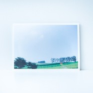

august e.p
============================

|  |  |
| :--: | :-- |
| [ august e.p](https://emumo.xiami.com/album/1971194633) | **艺人**: [[.que]](../index.md) **语种**: 日语 **唱片公司**: Schole Records **发行时间**: 2013年05月11日 **专辑类别**: EP, 单曲 **专辑风格**:  **播放数**: 102109 **收藏数**: 274 **评论数**: 28  |

## 简介

SCHOLE SHOP、タワーレコード渋谷店、新宿店限定特典e.p

## 曲目

## 评论

|  |  |  |
| :-- | :-- | :-- |
|  [虾米用户](https://emumo.xiami.com/u/233803638) 我还没想好要写什么... 2018-04-06 17:29 赞(0) 踩(0) | 
好听，清新的感觉
 |
|  [虾米用户](https://emumo.xiami.com/u/10410204) ? 2016-06-30 10:14 赞(0) 踩(0) | 
这张赛高啊！
 |
|  [虾米用户](https://emumo.xiami.com/u/5001950) Fly,Fly,Fly~ 2016-06-08 04:56 赞(0) 踩(0) | 
喜欢极了！！！！！！！
 |
|  [虾米用户](https://emumo.xiami.com/u/2695140) “她往月亮去” 2016-02-28 07:32 赞(0) 踩(0) | 
nice one
 |
|  [虾米用户](https://emumo.xiami.com/u/5915658)  2015-03-10 21:22 赞(0) 踩(0) | 
封面太心水啦 (｡◕ˇ∀ˇ◕）
 |
|  [虾米用户](https://emumo.xiami.com/u/23794844)  2014-08-09 22:20 赞(0) 踩(0) | 
喜歡walk ing
 |
|  [虾米用户](https://emumo.xiami.com/u/10337057) 独自穿行于空灵之境 2014-07-05 20:52 赞(0) 踩(0) | 
~~~
 |
|  [虾米用户](https://emumo.xiami.com/u/4445811)  2014-03-20 09:39 赞(0) 踩(0) | 
深呼吸
 |
|  [虾米用户](https://emumo.xiami.com/u/3606642)  2014-02-04 10:32 赞(0) 踩(0) | 
百听不厌
 |
|  [虾米用户](https://emumo.xiami.com/u/6238321)  2013-08-17 09:23 赞(0) 踩(0) | 
summer weekend
 |
|  [虾米用户](https://emumo.xiami.com/u/18715744)  2013-08-16 20:26 赞(0) 踩(0) | 
喜歡夏日輕鬆小品
 |
|  [虾米用户](https://emumo.xiami.com/u/10164064)  2013-08-15 13:10 赞(0) 踩(0) | 
夏の匂い、好き
 |
|  [虾米用户](https://emumo.xiami.com/u/2403528) 你们点赞，我就再听一遍，... 2013-06-23 00:38 赞(0) 踩(0) | 
真高产
 |
|  [虾米用户](https://emumo.xiami.com/u/1375269) 吾识郁 2013-06-20 11:07 赞(0) 踩(0) | 
一张属于夏天、属于海边的EP。
 |
|  [虾米用户](https://emumo.xiami.com/u/10073813) 如人饮水。 2013-06-19 13:12 赞(0) 踩(0) | 
: )
 |
|  [虾米用户](https://emumo.xiami.com/u/6515158) weibo：杯砸_aer... 2013-06-18 21:27 赞(0) 踩(0) | 
0 0
 |
|  [虾米用户](https://emumo.xiami.com/u/3725665) Moonquake清欢 2013-06-18 19:54 赞(0) 踩(0) | 
2013-6-18 19:54:28
 |
|  [虾米用户](https://emumo.xiami.com/u/3139496) 驴的想法与我无关 2013-06-18 19:12 赞(0) 踩(0) | 
5
 |
|  [虾米用户](https://emumo.xiami.com/u/4147939)  2013-06-18 17:44 赞(0) 踩(0) | 
2013-6-18 17:44:15
 |
|  [虾米用户](https://emumo.xiami.com/u/3235848)  2013-06-18 16:36 赞(0) 踩(0) | 
夏
 |
|  [虾米用户](https://emumo.xiami.com/u/5087129)   2013-06-18 16:21 赞(0) 踩(0) | 
夏天的que来也~我爱死这个男人了！
 |
|  [虾米用户](https://emumo.xiami.com/u/597569) 何必故作姿态 2013-06-18 13:16 赞(0) 踩(0) | 
太安静了...要是偏向节奏就好了..
 |
| ⇒ |  [虾米用户](https://emumo.xiami.com/u/6892945) Voltka 2013-06-18 13:17 赞(0) 踩(0) | 
适合现在这种天气听。
 |
| ⇒ |  [虾米用户](https://emumo.xiami.com/u/597569) 何必故作姿态 2013-06-18 13:20 赞(0) 踩(0) | 
<q><b>Justine说：</b></q>
 |
| ⇒ |  [虾米用户](https://emumo.xiami.com/u/6892945) Voltka 2013-06-18 13:23 赞(0) 踩(0) | 
<q><b>NightLeaVe说：</b></q>
 |
|  [虾米用户](https://emumo.xiami.com/u/5879511) 我还好吗？ 2013-06-15 18:57 赞(0) 踩(0) | 
:)
 |
|  [虾米用户](https://emumo.xiami.com/u/6892945) Voltka 2013-06-15 17:07 赞(0) 踩(0) | 
「drama」初回特典EP 自压320K CBR.
 |
|  [虾米用户](https://emumo.xiami.com/u/6892945) Voltka 2013-06-14 15:43 赞(0) 踩(0) | 
：)
 |
