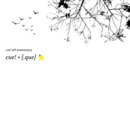

Cue!* [.Que]
============================

|  |  |
| :--: | :-- |
| [ Cue!* [.Que]](https://emumo.xiami.com/album/2100362865) | **艺人**: [[.que]](../index.md) **语种**: 日语 **唱片公司**: embrace **发行时间**: 2016年05月26日 **专辑类别**: EP, 单曲 **专辑风格**:  **播放数**: 13470 **收藏数**: 56 **评论数**: 4  |

## 简介

[.que]の地元徳島にある雑貨屋cue!さんの5周年記念CDに収録されていた楽曲が配信限定で再リリース。 リリースされた2012年当時はポストカード(3枚)とセットになっており限定99セットで販売されていました。 今回配信限定で当時の収録楽曲 + 2011年に制作された盟友One Day Diaryとの共作曲『time to go remix』を収録し、スペシャルな内容での再リリースとなります。 [.que]活動初期の楽曲が多数収録された貴重な音源集。 『time to go remix』 [.que]とOne Day DiaryのIEDA、そして映像作家の山田智和。 – 2011年 – 当時の[.que]はMTRで楽曲制作をしており、アコースティック主体の音楽を奏でていた。 [.que]の楽曲を気に入ったIEDAが原曲「time to go」をリミックス。 新しい「歌」として楽曲が公開されSNS上にて話題を呼ぶ。 MVコンテストを開催。 いくつか届けられたMVの中から山田智和氏のMVが選ばれた。 3人が出会うキッカケとなった記念すべき楽曲、映像作品。

## 曲目

## 评论

|  |  |  |
| :-- | :-- | :-- |
|  [虾米用户](https://emumo.xiami.com/u/200824124) 再见啦 2019-03-04 19:21 赞(0) 踩(0) | 
time to go
 |
|  [虾米用户](https://emumo.xiami.com/u/36057872) 网易/BC: Breat... 2017-01-30 21:02 赞(0) 踩(0) | 
~
 |
|  [虾米用户](https://emumo.xiami.com/u/5133491) 其他音乐平台用户名依旧叫... 2016-10-15 03:01 赞(0) 踩(0) | 
已阅
 |
|  [虾米用户](https://emumo.xiami.com/u/1700002) V5_ORZZZZZ 2016-07-06 08:20 赞(0) 踩(0) | 
- -又没提醒，尼玛
 |
