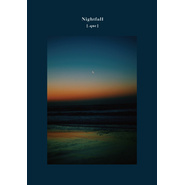

Nightfall
============================

|  |  |
| :--: | :-- |
| [ Nightfall](https://emumo.xiami.com/album/2100384218) | **艺人**: [[.que]](../index.md) **语种**: 纯音乐 **唱片公司**: embrace **发行时间**: 2016年10月12日 **专辑类别**: 录音室专辑 **专辑风格**:  **播放数**: 446021 **收藏数**: 448 **评论数**: 48  |

## 简介

夜に溶ける、儚き旋律  
夜への扉を開き、一日の終を  
[.que]の繊細で美しき世界がここに誕生

## 曲目

## 评论

|  |  |  |  |
| :-- | :-- | :-- | :-- |
|  [虾米用户](https://emumo.xiami.com/u/446666299) 不想跟宇宙和解 2021-01-19 00:13 赞(0) 踩(0) | 
老何 ❤️ 你好
 |
|  [虾米用户](https://emumo.xiami.com/u/269760923) 真正的自由是迷人的愿你我... 2020-12-23 00:17 赞(0) 踩(0) | 

 |
|  [虾米用户](https://emumo.xiami.com/u/16178749) 愿各自安好………………  2020-11-12 22:18 赞(0) 踩(0) | 

 |
|  [虾米用户](https://emumo.xiami.com/u/66823378)  2020-04-29 17:10 赞(0) 踩(0) | 

 |
|  [虾米用户](https://emumo.xiami.com/u/201391232) 谢谢虾米，你们是我。 2019-06-12 21:15 赞(0) 踩(0) | 
彡
 |
|  [虾米用户](https://emumo.xiami.com/u/16280822) 别忘却身心的和睦 2019-05-01 14:26 赞(0) 踩(0) | 

 |
|  [虾米用户](https://emumo.xiami.com/u/54576317) 音乐爱好者  2019-01-07 11:11 赞(0) 踩(0) | 

 |
|  [虾米用户](https://emumo.xiami.com/u/9154037) 到水星散心去了。 2019-01-01 19:44 赞(0) 踩(0) | 
很久才听
 |
|  [虾米用户](https://emumo.xiami.com/u/46671214) 历历见闻 切切铭记 2018-06-21 11:44 赞(0) 踩(0) | 
听了很久的一张专辑～
 |
|  [虾米用户](https://emumo.xiami.com/u/851674)  2017-01-01 09:20 赞(0) 踩(0) | 
2017新年首聽。早~
 |
|  [虾米用户](https://emumo.xiami.com/u/49075538) 爱笑 简单 清澈 温暖而... 2016-11-06 14:18 赞(0) 踩(0) | 
-
 |
|  [虾米用户](https://emumo.xiami.com/u/4744259) 喜欢萌的事物 WeCha... 2016-11-01 09:32 赞(0) 踩(0) | 
】】】】】】】】】
 |
|  [虾米用户](https://emumo.xiami.com/u/4744259) 喜欢萌的事物 WeCha... 2016-11-01 09:29 赞(0) 踩(0) | 
】】】】】
 |
|  [虾米用户](https://emumo.xiami.com/u/43714694) WeChat：96529... 2016-10-24 20:21 赞(0) 踩(0) | 
口/白
 |
|  [虾米用户](https://emumo.xiami.com/u/7022554) 谨记初心 2016-10-18 00:47 赞(0) 踩(0) | 
棒…
 |
|  [虾米用户](https://emumo.xiami.com/u/723739)  2016-10-17 15:55 赞(0) 踩(0) | 
读书之秋
 |
|  [虾米用户](https://emumo.xiami.com/u/5133491) 其他音乐平台用户名依旧叫... 2016-10-15 03:00 赞(0) 踩(0) | 
依旧
 |
|  [虾米用户](https://emumo.xiami.com/u/762181)   2016-10-14 23:55 赞(0) 踩(0) | 
⏳
 |
|  [虾米用户](https://emumo.xiami.com/u/762181)   2016-10-14 22:35 赞(0) 踩(0) | 
.
 |
|  [虾米用户](https://emumo.xiami.com/u/10811234) Love Mucic 2016-10-14 22:31 赞(1) 踩(0) | 
sink、embrace、hope、还是挺日式 中规中矩。
 |
|  [虾米用户](https://emumo.xiami.com/u/34353908) 穷写小说的。 2016-10-13 21:55 赞(0) 踩(0) | 
26
 |
|  [虾米用户](https://emumo.xiami.com/u/38788628)  2016-10-13 18:14 赞(0) 踩(0) | 
$
 |
|  [虾米用户](https://emumo.xiami.com/u/5032986) Private 2016-10-13 00:42 赞(1) 踩(0) | 
咦！！竟然错过了推送！！
 |
| ⇒ |  [虾米用户](https://emumo.xiami.com/u/36057872) 网易/BC: Breat... 2016-12-08 00:52 赞(0) 踩(0) | 
还有另一张新专，不知道有没有错过，
 |
|  [虾米用户](https://emumo.xiami.com/u/6515158) weibo：杯砸_aer... 2016-10-13 00:41 赞(0) 踩(0) | 
啊！新砖！
 |
|  [虾米用户](https://emumo.xiami.com/u/4487129)  2016-10-12 22:24 赞(0) 踩(0) | 
！！！
 |
|  [虾米用户](https://emumo.xiami.com/u/12876004) ` 2016-10-12 21:35 赞(0) 踩(0) | 
==
 |
|  [虾米用户](https://emumo.xiami.com/u/16745497) 我还没想好要写什么... 2016-10-12 19:37 赞(8) 踩(0) | 
这尼玛专辑标签：为了这些音乐要拥有一个宇宙，，也真是够了
 |
| ⇒ |  [虾米用户](https://emumo.xiami.com/u/4744259) 喜欢萌的事物 WeCha... 2016-11-01 09:30 赞(0) 踩(0) | 
就是就是，彪脸
 |
|  [虾米用户](https://emumo.xiami.com/u/1171396) 以前办不到的事情，未来也... 2016-10-12 19:27 赞(0) 踩(0) | 
0,0
 |
|  [虾米用户](https://emumo.xiami.com/u/1700002) V5_ORZZZZZ 2016-10-12 13:53 赞(0) 踩(0) | 
hope
 |
|  [虾米用户](https://emumo.xiami.com/u/13704947) 豆瓣见：无悲渊。 2016-10-12 13:48 赞(1) 踩(0) | 
这张封面好像In Time的封面。
 |
|  [虾米用户](https://emumo.xiami.com/u/4131849) 网易云：非人類兔子Agy... 2016-10-12 12:14 赞(0) 踩(0) | 
ಠ_ಠ
 |
|  [虾米用户](https://emumo.xiami.com/u/11115379) HEAR_A.I 2016-10-12 11:22 赞(0) 踩(0) | 
フルート綺麗
 |
|  [虾米用户](https://emumo.xiami.com/u/40080369) . 2016-10-12 10:53 赞(0) 踩(0) | 
叮
 |
|  [虾米用户](https://emumo.xiami.com/u/4873531) 喜欢的 西沢 ハチ n-... 2016-10-12 10:06 赞(0) 踩(0) | 
新的来啦
 |
|  [虾米用户](https://emumo.xiami.com/u/49934446) SINA WEIBO:@... 2016-10-12 09:30 赞(0) 踩(0) | 
Luv
 |
|  [虾米用户](https://emumo.xiami.com/u/36057872) 网易/BC: Breat... 2016-10-12 09:29 赞(0) 踩(0) | 
～
 |
|  [虾米用户](https://emumo.xiami.com/u/572626) 不能让好的被埋没，也不能... 2016-10-12 09:16 赞(0) 踩(0) | 
嘟嘟
 |
|  [虾米用户](https://emumo.xiami.com/u/11361192) 微博@沈撸粥 2016-10-12 09:11 赞(0) 踩(0) | 
我来啦！
 |
|  [虾米用户](https://emumo.xiami.com/u/11046721) Spotify：Unwi... 2016-10-12 09:09 赞(0) 踩(0) | 
可以可以
 |
|  [虾米用户](https://emumo.xiami.com/u/7555992) 我还没想好要写什么... 2016-10-12 09:07 赞(0) 踩(0) | 

 |
|  [虾米用户](https://emumo.xiami.com/u/8486312) always be th... 2016-10-12 09:06 赞(0) 踩(0) | 
来啦
 |
|  [虾米用户](https://emumo.xiami.com/u/765377) 世界原本就是你脑中的投影 2016-10-12 09:06 赞(0) 踩(0) | 
Coooooooooool
 |
|  [虾米用户](https://emumo.xiami.com/u/3483984) 音樂是我最後的庇護所。 2016-10-12 09:06 赞(1) 踩(0) | 
總有人用表情 是不是在佔位⋯
 |
|  [虾米用户](https://emumo.xiami.com/u/39674727) 特技是挖掘冷门乐队 2016-10-12 09:02 赞(0) 踩(0) | 
w
 |
|  [虾米用户](https://emumo.xiami.com/u/36057872) 网易/BC: Breat... 2016-09-07 09:11 赞(0) 踩(0) | 
等
 |
|  [虾米用户](https://emumo.xiami.com/u/30675055) 暂停发布音频及资料 2016-09-03 23:28 赞(0) 踩(0) | 
◇
 |
