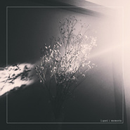

memoria
============================

|  |  |
| :--: | :-- |
| [ memoria](https://emumo.xiami.com/album/2108252893) | **艺人**: [[.que]](../index.md) **语种**: 纯音乐 **唱片公司**: embrace **发行时间**: 2019年06月26日 **专辑类别**: EP, 单曲 **专辑风格**: 爵士流行 Jazz Pop, 器乐流行 Instrumental Pop, 爵士嘻哈 Jazz Hip Hop **播放数**: 665 **收藏数**: 6 **评论数**: 1  |

## 简介

エレクトロニカ、アンビエントシーンのみならず、ロック、ポップなど様々なシーンから注目を集めるカキモトナオによるソロプロジェクト[.que]（キュー）。  
2019年4ヶ月連続リリースの第1弾配信EP。  
彼の故郷でもある徳島のムービーのために書き下ろされた「memoria」  
故郷への思いが表現された、美しさの中に力強ささえも感じさせる楽曲に仕上がっております。  
長崎県にある壱岐島のPRムービーのために書き下ろされた「orphic」ではゲストミュージシャンとしてベースに松藤裕志 （Rhycol. / Pefko）を迎え、[.que]の特徴でもあるメロディとバンドサウンドがふんだんに盛り込まれており疾走感が演出されています。  
新境地を感じさせる「sepia」ではLo-Fi Hip Hop ～ Jazzy Hip Hopを通過した[.que]なりのHip Hop調の楽曲に。  
4曲目「sunlight」ではメロディアスでシンプルなピアノを奏で、優しく射し込む"光"が表現されております。  
マスタリングにはこれまでの[.que]の作品に多数関わってきた Rallye Labelからのリリースで知られるOne Day DiaryのIEDAが担当。  
あらゆるジャンルが交錯しつつも[.que]フィルターを通すことによって4曲それぞれの個々が充分に光る作品がここに完成しました。  
  
  
All music written &amp; produced by Nao Kakimoto  
Bass by Hiroshi Matsufuji（Rhycol. / Pefko）  
Jacket by Nao Kakimoto  
Mastered by IEDA (One Day Diary)

## 曲目

## 评论

|  |  |  |
| :-- | :-- | :-- |
|  [虾米用户](https://emumo.xiami.com/u/441688579) 偷偷熬夜，已睡了 晚安～ 2020-04-09 08:52 赞(1) 踩(0) | 

 |
