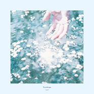

Teardrops
============================

|  |  |
| :--: | :-- |
| [ Teardrops](https://emumo.xiami.com/album/2108252899) | **艺人**: [[.que]](../index.md) **语种**: 日语 **唱片公司**: embrace **发行时间**: 2019年01月24日 **专辑类别**: EP, 单曲 **专辑风格**: 爵士流行 Jazz Pop, 电子 Electronic, 爵士嘻哈 Jazz Hip Hop **播放数**: 198 **收藏数**: 1 **评论数**: 3  |

## 简介

エレクトロニカ、アンビエントシーンのみならず、ロック、ポップなど様々なシーンから注目を集めるカキモトナオによるソロプロジェクト[.que]（キュー）。  
2019年第1弾配信シングルとして届けられる「Teardrops」は[.que]が作詞、作曲、編曲のすべてをこなし、ヴォーカルに岩田真知  
（Cuon / aquarifa）を迎えた華麗な歌。  
彼のソングライターとしての才能が光る、現代のJポップシーンへの[.que]なりの回答として珠玉の1曲に仕上がっている。  
ベースにはこれまでの[.que]の作品にも多数参加している盟友の松藤裕志（Rhycol. / Pefko）が参加。  
ミックス、マスタリングはRallye Labelからのリリースで知られるOne Day DiaryのIEDAが担当。  
アートワークにはinstagramにて世界的にも高い評価を得るフォトグラファー国分真央が担当している。  
今楽曲は3月に初のアナログとしてリリースされるコンセプトEP「Flowers」からの先行配信シングルとしてリリースされる。  
  
  
Music written by Nao Kakimoto  
  
Guitar, Piano, Programming：Nao Kakimoto  
Vocal：Machi Iwata (Cuon / aquarifa)  
Bass：Hiroshi Matsufuji (Rhycol. / Pefko)  
  
Bass Arrangement：Hiroshi Matsufuji (Rhycol. / Pefko)  
Recording：Nao Kakimoto  
Mix &amp; Mastering：IEDA (One Day Diary)  
  
Photo：Mao Kokubu  
Design：Nao Kakimoto  
Label：EMBRACE

## 曲目

## 评论

|  |  |  |
| :-- | :-- | :-- |
|  [虾米用户](https://emumo.xiami.com/u/32461398) 曾在云上浮想联翩如今也终... 2020-06-27 17:06 赞(0) 踩(0) | 
手指在水的缝隙处能很清楚地感受到花吻。
 |
|  [虾米用户](https://emumo.xiami.com/u/7872701) 多一份远见，就少一分刺激 2020-06-10 16:45 赞(0) 踩(0) | 
.
 |
|  [虾米用户](https://emumo.xiami.com/u/441688579) 偷偷熬夜，已睡了 晚安～ 2020-04-09 08:53 赞(1) 踩(0) | 

 |
