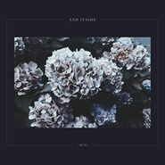
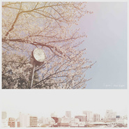
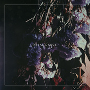
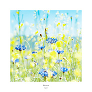
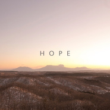
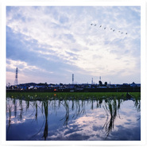
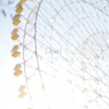
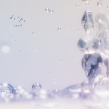
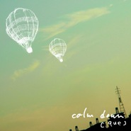

[.que]
============================

|  |  |
| :--: | :-- |
| [ [.que]](https://i.xiami.com/que) | **地区**: Japan 日本 **风格**: 氛围音乐 Ambient, 电子民谣 Folktronica, 电子 Electronic, 后摇 Post-Rock **播放数**: 3568430 **粉丝数**: 6280 **评论数**: 214  |

## 档案

[.que] / 柿本直 nao kakimoto 
音乐家nao kakimoto（Guitar / Piano / Composer）的个人solo project[.que]。 
从小开始自学吉他，2010年开始以1的名义展开真正的音乐活动。 
极具“日本”特色的想法和作曲才能，作为电子民谣的新星从活动开始时就倍受关注。同属于与小瀬村晶Akira Kosemura、中村遥Haruka Nakamura等艺人的厂牌SCHOLE旗下时，他发表的《drama》在世界范围受到了极高的关注和赞赏。 
近年来不仅专注于器乐伴奏作品，还参与到许多作词作曲编曲等工作中，充分发挥着自己的音乐才能。 
为小松菜奈 × haco.提供了歌曲《tsunaide》，与此同时还为富士通及出光等大型公司提供广告歌曲，也制作了许多用于各类场地的环境音乐。他的音乐活动范围及其广泛，各种合作也是相继而来。 
他的作品不仅限于电子民谣或是环境音乐，他的摇滚以及流行的作品也是极为受到关注的。2016年10月发表的专辑《Nightfall》和《Daylight》在他自己的厂牌embrace下发表。2017年7月，miaou等知名乐队的希腊厂牌Sound in Silence旗下发表概念专辑《Wonderland》。9月《The Beginning of the Story》、10月《Anymore feat. Wakareno Kana》、11月《Short Trip》两首单曲也已预定发表。 
与西原健一郎、re:plus、miaou、organic stereo、小瀬村晶Akira Kosemura等艺人一同参与许多海外的演出以及音乐节。 
极具特色的乐队歌曲，充满魅力的舞台表演，终于在大家的期待下，他与后摇乐队December的鼓手一起，于2017年12月在上海万代南梦宫上海文化中心－未来剧场和北京的SCHOOL学校酒吧举行。

## 专辑

| 名称 | 语种 | 唱片公司 | 发行时间 | 专辑类别 | 专辑风格 |
| :--: | :-- | :-- | :-- | :-- | :-- |
| [ Dreaming](./albums/5022584662.md) | 纯音乐 | embrace | 2021年01月20日 | 录音室专辑 |  |
| [ Reassemble](./albums/5021214799.md) | 纯音乐 | embrace | 2020年07月03日 | 录音室专辑 |  |
| [ And Inside](./albums/5021215286.md) | 纯音乐 | embrace | 2020年07月01日 | 录音室专辑 |  |
| [ Our Light](./albums/5021221723.md) | 纯音乐 | embrace | 2020年04月19日 | EP, 单曲 | 爵士流行 Jazz Pop, 电子 Electronic, 爵士嘻哈 Jazz Hip Hop |
| [ alone (feat. mabanua)](./albums/2108348002.md) | 纯音乐 | embrace | 2020年04月13日 | EP, 单曲 | 爵士流行 Jazz Pop, 电子 Electronic, 爵士嘻哈 Jazz Hip Hop |
| [ Haze](./albums/2108272239.md) | 纯音乐 | embrace | 2020年02月19日 | EP, 单曲 | 爵士流行 Jazz Pop, 电子 Electronic, 爵士嘻哈 Jazz Hip Hop |
| [ Any](./albums/5020625786.md) | 纯音乐 | embrace | 2019年11月27日 | EP, 单曲 | 爵士流行 Jazz Pop, 电子 Electronic, 爵士嘻哈 Jazz Hip Hop |
| [ petal dance](./albums/5021223674.md) | 纯音乐 | embrace | 2019年09月18日 | EP, 单曲 | 爵士流行 Jazz Pop, 电子 Electronic, 爵士嘻哈 Jazz Hip Hop |
| [ stargazer](./albums/5021214337.md) | 纯音乐 | embrace | 2019年08月21日 | EP, 单曲 | 爵士流行 Jazz Pop, 电子 Electronic, 爵士嘻哈 Jazz Hip Hop |
| [ memoria](./albums/2108252893.md) | 纯音乐 | embrace | 2019年06月26日 | EP, 单曲 | 爵士流行 Jazz Pop, 器乐流行 Instrumental Pop, 爵士嘻哈 Jazz Hip Hop |
| [ Flowers](./albums/5021663518.md) | 日语 | embrace | 2019年03月20日 | EP, 单曲 | 爵士流行 Jazz Pop, 电子 Electronic, 爵士嘻哈 Jazz Hip Hop |
| [ Teardrops](./albums/2108252899.md) | 日语 | embrace | 2019年01月24日 | EP, 单曲 | 爵士流行 Jazz Pop, 电子 Electronic, 爵士嘻哈 Jazz Hip Hop |
| [ Endless Journey](./albums/5021213818.md) | 纯音乐 | embrace | 2018年06月20日 | EP, 单曲 | 爵士流行 Jazz Pop, 电子 Electronic, 爵士嘻哈 Jazz Hip Hop |
| [ Anymore (feat. Kana Wakareno)](./albums/5021225531.md) | 纯音乐 | embrace | 2017年10月26日 | EP, 单曲 | 爵士流行 Jazz Pop, 电子 Electronic, 爵士嘻哈 Jazz Hip Hop |
| [ Wonderland](./albums/2102774339.md) | 纯音乐 | embrace | 2017年07月01日 | 录音室专辑 |  |
| [ Nightfall](./albums/2100384218.md) | 纯音乐 | embrace | 2016年10月12日 | 录音室专辑 |  |
| [ Daylight](./albums/2102406344.md) | 日语 | embrace | 2016年10月12日 | 录音室专辑 | 爵士流行 Jazz Pop, 电子 Electronic, 爵士嘻哈 Jazz Hip Hop |
| [ Cue!* [.Que]](./albums/2100362865.md) | 日语 | embrace | 2016年05月26日 | EP, 单曲 |  |
| [ Farewell / Sink](./albums/2100347324.md) | 日语 | embrace | 2016年05月12日 | EP, 单曲 |  |
| [ Hope](./albums/2100347326.md) | 日语 | embrace | 2016年04月19日 | EP, 单曲 |  |
| [ Brilliant Hopes](./albums/1521134686.md) | 纯音乐 | Schole Records | 2015年02月12日 | 录音室专辑 | 爵士流行 Jazz Pop, 器乐嘻哈 Instrumental Hip Hop |
| [ Water's Edge](./albums/410758498.md) | 日语 | Schole Records | 2014年09月15日 | 录音室专辑 | 后摇 Post-Rock |
| [ SHY BOY](./albums/274720237.md) | 日语 | Self-Released | 2013年06月13日 | EP, 单曲 |  |
| [ drama](./albums/465993017.md) | 日语 | Schole Records | 2013年05月11日 | 录音室专辑 |  |
| [ august e.p](./albums/1971194633.md) | 日语 | Schole Records | 2013年05月11日 | EP, 单曲 |  |
| [ Calling PROJECT](./albums/1363921058.md) | 日语 | Self-Released | 2013年01月16日 | EP, 单曲 |  |
| [ calm down](./albums/526757.md) | 其他 | IntroDuCing! | 2012年07月04日 | 录音室专辑 |  |
| [ drops](./albums/530249.md) | 其他 | Schole Records | 2012年06月02日 | EP, 单曲 |  |
| [ sigh](./albums/511641.md) | 其他 | [.que] | 2012年05月01日 | 录音室专辑 |  |
| [ calm down](./albums/461588.md) | 日语 | totokoko lable | 2011年08月19日 | 录音室专辑 |  |
| [ flowing scenery](./albums/476471.md) | 其他 | totokoko label | 2010年08月29日 | EP, 单曲 |  |
| [ AlsTak.](./albums/521776.md) | 日语 | 独立发行 | 2010年05月01日 | 录音室专辑 |  |

## 评论

|  |  |  |
| :-- | :-- | :-- |
|  [虾米用户](https://emumo.xiami.com/u/17850376) 上学时最美好的姿态，就是... 2020-07-31 20:10 赞(1) 踩(0) | 
宝藏音乐人
 |
|  [虾米用户](https://emumo.xiami.com/u/16709853) 摇滚金属电混 2020-05-17 11:44 赞(0) 踩(0) | 
一直很喜欢
 |
|  [虾米用户](https://emumo.xiami.com/u/66823378)  2020-04-29 17:11 赞(0) 踩(0) | 

 |
|  [虾米用户](https://emumo.xiami.com/u/7872701) 多一份远见，就少一分刺激 2020-04-28 11:31 赞(0) 踩(0) | 
Endless Journey没了吗
 |
|  [虾米用户](https://emumo.xiami.com/u/400715332) 留白 2020-03-21 08:43 赞(0) 踩(0) | 
&amp;mdash;&amp;mdash;
 |
|  [虾米用户](https://emumo.xiami.com/u/518865) 你看不见吗？ 2019-12-08 22:54 赞(0) 踩(0) | 
还会再来中国巡演吗？
 |
|  [虾米用户](https://emumo.xiami.com/u/318979310) 我还没想好要写什么... 2019-08-31 18:35 赞(0) 踩(0) | 
又寻到一个宝藏！
 |
|  [虾米用户](https://emumo.xiami.com/u/42963872) 我还没想好要写什么... 2019-07-20 18:32 赞(0) 踩(0) | 
好
 |
|  [虾米用户](https://emumo.xiami.com/u/17372274) 喜欢做梦的浪漫小阿姨～ 2019-06-10 19:54 赞(1) 踩(0) | 
什么时候来广州
 |
|  [虾米用户](https://emumo.xiami.com/u/316502674) 在最后陪着你吧，我的虾米 2019-05-18 10:16 赞(0) 踩(0) | 
还没有新歌吗_(:з」∠)_
 |
|  [虾米用户](https://emumo.xiami.com/u/44784434) 变得和我一样库 2019-05-03 13:36 赞(0) 踩(0) | 
❤️
 |
|  [虾米用户](https://emumo.xiami.com/u/6530967) 老男人而已。 2019-04-29 22:11 赞(0) 踩(0) | 
又是日本～
 |
|  [虾米用户](https://emumo.xiami.com/u/45686435) 一壺飛鳧 尋山夢鶴   ... 2019-03-11 13:37 赞(0) 踩(0) | 
✨
 |
|  [虾米用户](https://emumo.xiami.com/u/49655313) 除了再见还可以说些什么呢 2018-11-09 14:24 赞(4) 踩(0) | 
如果您還有機會來的話，請考慮考慮西安吧！
 |
|  [虾米用户](https://emumo.xiami.com/u/346492287) 虾米不要离开我！ 2018-11-01 17:23 赞(2) 踩(0) | 
又错过
 |
|  [虾米用户](https://emumo.xiami.com/u/375006275) 唯爱与音乐不可辜负 2018-10-10 10:58 赞(1) 踩(0) | 
看得见的音乐 如同彩虹一般绚烂
 |
|  [虾米用户](https://emumo.xiami.com/u/1115247) @Nebula_7293 2018-07-04 19:45 赞(1) 踩(0) | 
❤️
 |
|  [虾米用户](https://emumo.xiami.com/u/9972139) -Welcome to ... 2018-06-15 03:17 赞(1) 踩(0) | 

 |
|  [虾米用户](https://emumo.xiami.com/u/7872701) 多一份远见，就少一分刺激 2018-05-12 23:50 赞(4) 踩(0) | 
求快点发布Endless Journey，想早点听到Precious、Leap In The Air、Short Trip
 |
|  [虾米用户](https://emumo.xiami.com/u/14292751) 夕阳又要落下 2018-03-20 19:03 赞(1) 踩(0) | 
我非常喜欢，your style,i enjoy it very much
 |
|  [虾米用户](https://emumo.xiami.com/u/201391232) 最快的方法是先抱抱 2018-02-07 13:11 赞(1) 踩(0) | 
Ｇｅｔ.
 |
|  [虾米用户](https://emumo.xiami.com/u/5604492) ‪‪♬✧訂閱號：Morn... 2018-01-26 20:47 赞(1) 踩(0) | 
short trip真好听
 |
|  [虾米用户](https://emumo.xiami.com/u/180847) 只有心知道 岁月不宽宏 2018-01-25 17:49 赞(0) 踩(0) | 
  
 |
|  [虾米用户](https://emumo.xiami.com/u/325095842)  2017-12-20 01:11 赞(24) 踩(0) | 
Thank you &amp;quot;cloud nine China Tour 2017&amp;quot;  ▼[.que] setlist 01. intro 02. haruka 03. air 04. sunset 05. halfway 06. sink 07. luster 08. anew 09. short trip 10. leap in the air 11. decide 12. drops 13. flora 14. hope en：will  See you next time!! Thanks! Bad News, CHARISMA TANUKI!!
 |
| ⇒ |  [虾米用户](https://emumo.xiami.com/u/52085184)  2019-08-09 14:14 赞(0) 踩(0) | 

 |
|  [虾米用户](https://emumo.xiami.com/u/9154037) 到水星散心去了。 2017-12-18 21:53 赞(0) 踩(0) | 
冬天还好有这种暖暖的现场不然多少有点难熬。
 |
|  [虾米用户](https://emumo.xiami.com/u/590302) 猫背オッさん 2017-12-18 09:22 赞(1) 踩(0) | 
柿本直同学在对面笑时一直想告诉他「你还是剃了胡子漂亮呀」
 |
|  [虾米用户](https://emumo.xiami.com/u/1631900) . 2017-12-17 11:35 赞(2) 踩(0) | 
现场真的很棒！～ 超谦和的小哥！～
 |
|  [虾米用户](https://emumo.xiami.com/u/41924144) 心安是归处 2017-12-17 07:44 赞(0) 踩(0) | 
[.que]
 |
|  [虾米用户](https://emumo.xiami.com/u/23572171)   2017-12-17 02:58 赞(2) 踩(0) | 
北京站打卡，听完不想抱怨任何场地和票价了，只想说太值啦school居然可以这么可爱&amp;hearts;️
 |
|  [虾米用户](https://emumo.xiami.com/u/326753347)  2017-12-17 00:55 赞(0) 踩(0) | 
今晚刚听过现场 
 |
|  [虾米用户](https://emumo.xiami.com/u/7916875) (￣Д￣)ﾉ 2017-12-16 21:22 赞(0) 踩(0) | 
看了上海现场，que很可爱呢 
 |
| ⇒ |  [虾米用户](https://emumo.xiami.com/u/3496847) 夢醒了，所以心碎了。 2017-12-17 20:29 赞(0) 踩(0) | 
知道安可曲叫什么名字不？
 |
| ⇒ |  [虾米用户](https://emumo.xiami.com/u/7872701) 多一份远见，就少一分刺激 2018-01-31 12:47 赞(0) 踩(0) | 
<q><b>木頭吉娜说：</b></q>
 |
|  [虾米用户](https://emumo.xiami.com/u/3496847) 夢醒了，所以心碎了。 2017-12-16 03:09 赞(0) 踩(0) | 
有没有上海场的朋友？好想知道他和鼓手安可的那首歌是什么名字呀。。。   
 |
|  [虾米用户](https://emumo.xiami.com/u/13327353) 唯爱与妹子及音乐不可辜负 2017-12-16 01:47 赞(0) 踩(0) | 
现场归来，期待下次见！
 |
| ⇒ |  [虾米用户](https://emumo.xiami.com/u/3496847) 夢醒了，所以心碎了。 2017-12-16 03:08 赞(0) 踩(0) | 
知不知道安可那首他自己唱的是什么歌呀？
 |
|  [虾米用户](https://emumo.xiami.com/u/50452313)  2017-12-14 23:44 赞(0) 踩(0) | 
原来封面都是自己的摄影作品啊 
 |
|  [虾米用户](https://emumo.xiami.com/u/50452313)  2017-12-14 23:32 赞(0) 踩(0) | 
又是上海 ，我的兵击比赛也在上海QAQ
 |
|  [虾米用户](https://emumo.xiami.com/u/8741301) still walkin... 2017-12-14 22:31 赞(0) 踩(0) | 
哈哈私信了 不过还是去不了可惜
 |
|  [虾米用户](https://emumo.xiami.com/u/5990820)  2017-12-13 13:25 赞(0) 踩(0) | 
@MegaROMANTIC 微博正在抽现场票（16日北京school），欢迎参加。
 |
|  [虾米用户](https://emumo.xiami.com/u/325095842)  2017-12-12 16:27 赞(0) 踩(0) | 
Rehearsal for China Tour DONE!! 中国ツアーの最終リハーサルが終わりました！  Bad News Presents cloud nine China Tour 2017  出演艺人: [.que] with Shota Mizuguchi(Drums) from December Tatsuki Hamasaki from miaou  12月15日上海 万代南梦宫上海文化中心 12月16日北京 SCHOOL学校酒吧
 |
|  [虾米用户](https://emumo.xiami.com/u/325095842)  2017-12-10 15:16 赞(2) 踩(0) | 
My MV. Please check. [.que] - Hope　<a href="http://t.cn/ROzdmq2" target="_blank" rel="nofollow noreferrer noopener">http://t.cn/ROzdmq2</a> [.que] - Anymore feat. 別野加奈　<a href="http://t.cn/RlCmGEl" target="_blank" rel="nofollow noreferrer noopener">http://t.cn/RlCmGEl</a> [.que] - short trip<a href="http://t.cn/RjY9nbH" target="_blank" rel="nofollow noreferrer noopener">http://t.cn/RjY9nbH</a>  Kusatsu Onsen, JAPAN - Summer - 4K (ultra HD) / 草津温泉 <a href="http://t.cn/RWB8owf" target="_blank" rel="nofollow noreferrer noopener">http://t.cn/RWB8owf</a>  Surf Slow SAGA, Japan 4K (Ultra HD) - 佐賀市 <a href="http://t.cn/RlS6riK" target="_blank" rel="nofollow noreferrer noopener">http://t.cn/RlS6riK</a>
 |
|  [虾米用户](https://emumo.xiami.com/u/17782392)  2017-12-06 21:40 赞(0) 踩(0) | 
12月16北京的演唱会 我在纠结买不买票
 |
|  [虾米用户](https://emumo.xiami.com/u/325095842)  2017-12-05 11:50 赞(0) 踩(0) | 
My interview. Please check. 受STRAIGHTENER乐队的Atsushi Horie「ent」影响下开始的[.que]柿本直～～ <a href="http://mp.weixin.qq.com/s/O2I9UVxRxXF8LehdAvfmMg" target="_blank" rel="nofollow noreferrer noopener">http://mp.weixin.qq.com/s/O2I9UVxRxXF8LehdAvfmMg</a>  作为歌迷，和偶像同台简直太棒了！ <a href="http://mp.weixin.qq.com/s/a7X4LjpBKaGBk8Y66e-pqw" target="_blank" rel="nofollow noreferrer noopener">http://mp.weixin.qq.com/s/a7X4LjpBKaGBk8Y66e-pqw</a>
 |
|  [虾米用户](https://emumo.xiami.com/u/325095842)  2017-12-05 11:43 赞(0) 踩(0) | 
My interview. Please check. 电子民谣音乐人 [.que] | 诗意便是清醒，清醒便是生活 | 附摄影作品 <a href="https://weibo.com/ttarticle/p/show?id=2309404181330328974414" target="_blank" rel="nofollow noreferrer noopener">https://weibo.com/ttarticle/p/show?id=2309404181330328974414</a>
 |
|  [虾米用户](https://emumo.xiami.com/u/5604492) ‪‪♬✧訂閱號：Morn... 2017-11-29 07:48 赞(0) 踩(0) | 

 |
|  [虾米用户](https://emumo.xiami.com/u/2349841)  2017-11-17 21:40 赞(0) 踩(0) | 
沒有廣州深圳:(
 |
|  [虾米用户](https://emumo.xiami.com/u/7872701) 多一份远见，就少一分刺激 2017-11-08 10:34 赞(0) 踩(0) | 
两张EP《The Beginning of the Story》、《Anymore》快发布啊。。。入驻了虾米音乐人别人就不能帮上传你的歌了，心慌。。。
 |
|  [虾米用户](https://emumo.xiami.com/u/313998821)  2017-11-05 22:43 赞(0) 踩(0) | 
loving the music, perfect soundtrack to my life.
 |
|  [虾米用户](https://emumo.xiami.com/u/7872701) 多一份远见，就少一分刺激 2017-10-31 16:59 赞(0) 踩(0) | 
que给草津温泉宣传片做的配乐precious好听
 |
|  [虾米用户](https://emumo.xiami.com/u/325095842)  2017-10-14 23:14 赞(36) 踩(0) | 
中国的朋友，大家好，我是[.que]。 今天，有个消息想和大家分享。 [.que]的中国首演确定举行了,因为是我的中国首演，自身非常地期待， 演出当天，我将和December的鼓手一起，为大家呈现一场2人的现场演出。 我非常非常地期待, 请大家务必来现场享受乐趣 期待现场与大家见面！  【Bad News呈现】[.que]柿本直新专发布联手滨崎龙树（miaou） 2017中国巡演 【上海站】2017年12月15日　万代南梦宫上海文化中心 【北京站】2017年12月16日　SCHOOL学校酒吧
 |
|  [虾米用户](https://emumo.xiami.com/u/24143615) 嘘! 2017-10-01 20:01 赞(0) 踩(0) | 
来上海吧 我自带酒水 一边自饮 一边赏乐 一边沈醉
 |
| ⇒ |  [虾米用户](https://emumo.xiami.com/u/906517) 我还没想好要写什么... 2017-11-13 18:24 赞(0) 踩(0) | 
怕是你愿望实现了
 |
|  [虾米用户](https://emumo.xiami.com/u/4282950) 一种生活习惯必须每日听歌... 2017-10-01 19:25 赞(0) 踩(0) | 
没有广州...
 |
|  [虾米用户](https://emumo.xiami.com/u/100660422) 你好呀。(¦3[▓▓]虾... 2017-10-01 16:21 赞(1) 踩(0) | 
北京走起&amp;hellip;&amp;hellip;
 |
|  [虾米用户](https://emumo.xiami.com/u/32274796) 世界尽头，唯音乐相伴。 2017-10-01 14:06 赞(0) 踩(0) | 
上海走起！
 |
|  [虾米用户](https://emumo.xiami.com/u/13031080) 残存下来的我们 2017-10-01 14:00 赞(0) 踩(0) | 
上海再次向我招手2333
 |
|  [虾米用户](https://emumo.xiami.com/u/6515158) weibo：杯砸_aer... 2017-10-01 13:58 赞(1) 踩(0) | 
巡回。。。。又只有北京上海，能不能给西南一点活路给个成都站 
 |
|  [虾米用户](https://emumo.xiami.com/u/7916875) (￣Д￣)ﾉ 2017-10-01 13:35 赞(0) 踩(0) | 
哇！上海
 |
|  [虾米用户](https://emumo.xiami.com/u/41070520) 沈下 2017-10-01 13:01 赞(1) 踩(0) | 
又是北京上海 呜呜呜 去不了
 |
|  [虾米用户](https://emumo.xiami.com/u/7866777) 我是鸡腿叔叔！ 2017-10-01 12:47 赞(0) 踩(0) | 
什么！？才两个城市？！
 |
|  [虾米用户](https://emumo.xiami.com/u/12464012) 这个世界太疯狂 2017-09-27 13:51 赞(0) 踩(0) | 
每首音乐里都有好多种声音元素，但是又不会觉得嘈杂，反而觉得很清爽
 |
|  [虾米用户](https://emumo.xiami.com/u/325095842)  2017-09-26 11:28 赞(46) 踩(0) | 
我刚入驻了虾米音乐人，欢迎大家来我的个人主页，收听我的最新音乐
 |
| ⇒ |  [虾米用户](https://emumo.xiami.com/u/267972477) 寻找互相理解之人 2017-10-06 18:49 赞(0) 踩(0) | 
音乐风格我很喜欢，加油
 |
|  [虾米用户](https://emumo.xiami.com/u/9486114) 倾东海以为酒 2017-09-25 22:42 赞(0) 踩(0) | 
想见你
 |
|  [虾米用户](https://emumo.xiami.com/u/7872701) 多一份远见，就少一分刺激 2017-09-25 20:46 赞(0) 踩(0) | 
12.15 上海 12.16 北京 ​​​​ 帝都见！
 |
|  [虾米用户](https://emumo.xiami.com/u/8865162) Freedom 2017-07-31 09:43 赞(0) 踩(0) | 
从early morning入坑 后来看到.que就会觉得很好听 
 |
|  [虾米用户](https://emumo.xiami.com/u/3556002) wubba lubba 2017-07-01 17:30 赞(0) 踩(0) | 
biu
 |
|  [虾米用户](https://emumo.xiami.com/u/52056952) 人生即是到來、相遇、陪伴... 2017-05-07 17:15 赞(0) 踩(0) | 

 |
|  [虾米用户](https://emumo.xiami.com/u/10421439) 我的血肉腐烂 鲜花盛开 2017-04-14 01:08 赞(1) 踩(0) | 
感觉像透明的泡泡,轻盈的飞过不留痕迹.
 |
|  [虾米用户](https://emumo.xiami.com/u/55823645) NOTHING BETT... 2017-04-03 15:42 赞(0) 踩(0) | 

 |
|  [虾米用户](https://emumo.xiami.com/u/97747450) 我还没想好要写什么... 2017-03-30 21:30 赞(0) 踩(0) | 
9212
 |
|  [虾米用户](https://emumo.xiami.com/u/49452046) 天台，快乐。 2017-01-22 23:12 赞(2) 踩(0) | 
这个艺人的音乐有种复返自然的轻盈与灵动，感觉变幻莫测，而又充满生机。
 |
|  [虾米用户](https://emumo.xiami.com/u/1643164) 阳光淌过手心天空笑了笑！ 2016-12-26 09:27 赞(0) 踩(0) | 
喜欢~_~
 |
|  [虾米用户](https://emumo.xiami.com/u/14835159) Jazz Voicing 2016-12-23 21:21 赞(1) 踩(0) | 
自然派给我们的音乐家。
 |
|  [虾米用户](https://emumo.xiami.com/u/12038341)   2016-12-21 09:39 赞(0) 踩(0) | 
看了草津温泉的宣传片一路找过来结果并没有找到广告里的BGM......
 |
| ⇒ |  [虾米用户](https://emumo.xiami.com/u/13225786) 后面就是悬崖 2016-12-22 12:48 赞(0) 踩(0) | 
+1啊，把热门都听了一遍还是没有，也有可能听到但是滑过去了 
 |
| ⇒ |  [虾米用户](https://emumo.xiami.com/u/12038341)   2016-12-23 01:38 赞(0) 踩(0) | 
<q><b>Marko说：</b></q>
 |
| ⇒ |  [虾米用户](https://emumo.xiami.com/u/13225786) 后面就是悬崖 2016-12-23 06:43 赞(0) 踩(0) | 
<q><b>谎言之躯说：</b></q>
 |
| ⇒ |  [虾米用户](https://emumo.xiami.com/u/12038341)   2016-12-23 09:28 赞(0) 踩(0) | 
<q><b>Marko说：</b></q>
 |
| ⇒ |  [虾米用户](https://emumo.xiami.com/u/13225786) 后面就是悬崖 2016-12-23 11:03 赞(0) 踩(0) | 
<q><b>谎言之躯说：</b></q>
 |
|  [虾米用户](https://emumo.xiami.com/u/5586779) be nice,be c... 2016-12-19 14:08 赞(0) 踩(0) | 
一生推
 |
|  [虾米用户](https://emumo.xiami.com/u/1320669) ツ 2016-12-08 17:00 赞(0) 踩(0) | 
0.0
 |
|  [虾米用户](https://emumo.xiami.com/u/21821581) ´･艸･｀ 2016-11-23 15:09 赞(0) 踩(0) | 
(ΦωΦ)
 |
|  [虾米用户](https://emumo.xiami.com/u/85148548)  2016-10-25 11:30 赞(1) 踩(0) | 
wow
 |
|  [虾米用户](https://emumo.xiami.com/u/8858880)  公開処刑 ／ リリー・... 2016-10-20 16:18 赞(0) 踩(0) | 
Ç
 |
|  [虾米用户](https://emumo.xiami.com/u/5001950) Fly,Fly,Fly~ 2016-09-28 01:42 赞(0) 踩(0) | 
我的心头爱。看到是[.que]的，不用听就知道我肯定喜欢。
 |
|  [虾米用户](https://emumo.xiami.com/u/23534686) o 2016-08-27 20:43 赞(0) 踩(0) | 
iii
 |
|  [虾米用户](https://emumo.xiami.com/u/6016641) 我还没想好要写什么... 2016-06-21 20:41 赞(1) 踩(0) | 
那年夏天 窗外有条河川宽又宽 一粒人影淹没在波光涟漪中 我还没来得及多看 列车就到站了
 |
|  [虾米用户](https://emumo.xiami.com/u/31689003)  2016-06-17 08:44 赞(0) 踩(0) | 
鉴藏！
 |
|  [虾米用户](https://emumo.xiami.com/u/35704658) 克己复礼 2016-06-13 08:39 赞(0) 踩(0) | 
枢纽！
 |
|  [虾米用户](https://emumo.xiami.com/u/35704658) 克己复礼 2016-06-13 08:29 赞(0) 踩(0) | 
枢纽！
 |
|  [虾米用户](https://emumo.xiami.com/u/2526606)  2016-06-09 18:23 赞(0) 踩(0) | 
~~
 |
|  [虾米用户](https://emumo.xiami.com/u/16511667) Official：【集物... 2016-06-03 22:18 赞(0) 踩(0) | 
鉴藏！
 |
|  [虾米用户](https://emumo.xiami.com/u/8943891) 你咋那么可爱？ 2016-05-30 19:52 赞(0) 踩(0) | 
I
 |
|  [虾米用户](https://emumo.xiami.com/u/1178913) 我还没想好要写什么... 2016-04-27 06:16 赞(0) 踩(0) | 
大写的喜欢。
 |
|  [虾米用户](https://emumo.xiami.com/u/1746372) 我懷疑你懷疑我不懷好意 2016-02-25 11:56 赞(0) 踩(0) | 

 |
|  [虾米用户](https://emumo.xiami.com/u/52506830) 再见 2016-02-23 19:17 赞(0) 踩(0) | 
。
 |
|  [虾米用户](https://emumo.xiami.com/u/39229648) 东风夜放花千树 2016-02-18 00:36 赞(0) 踩(0) | 
YMO?简介全日语看不懂…就看到了高桥幸宏所以被推荐给我了？
 |
|  [虾米用户](https://emumo.xiami.com/u/106271302)  2016-02-02 15:50 赞(1) 踩(0) | 
美哭，我发誓这辈子没有听过这么美的音乐
 |
|  [虾米用户](https://emumo.xiami.com/u/40979122) ————————————... 2016-02-01 22:19 赞(0) 踩(0) | 
。
 |
|  [虾米用户](https://emumo.xiami.com/u/6515158) weibo：杯砸_aer... 2016-01-31 00:30 赞(0) 踩(0) | 
睡不著 不想睡著
 |
|  [虾米用户](https://emumo.xiami.com/u/9429409)  2016-01-30 01:10 赞(0) 踩(0) | 
听了一个通宵
 |
|  [虾米用户](https://emumo.xiami.com/u/72361016) aaaaaaaaaaa 2016-01-25 01:00 赞(0) 踩(0) | 
加油呢
 |
|  [虾米用户](https://emumo.xiami.com/u/49637572) 看到我写的评论@下我 我... 2015-12-04 11:57 赞(0) 踩(0) | 
nice
 |
|  [虾米用户](https://emumo.xiami.com/u/48436220) Oblivīate 2015-11-04 14:36 赞(1) 踩(0) | 
没结局的故事才最美阿
 |
|  [虾米用户](https://emumo.xiami.com/u/17604238) walk me to t... 2015-10-24 07:43 赞(0) 踩(0) | 
你美
 |
|  [虾米用户](https://emumo.xiami.com/u/20153438)  2015-10-07 07:52 赞(3) 踩(0) | 
爱生活，爱虾米
 |
|  [虾米用户](https://emumo.xiami.com/u/1608640) MD每次回来都一堆失效歌... 2015-09-24 23:14 赞(0) 踩(0) | 
温柔干净，听了一整天啦
 |
|  [虾米用户](https://emumo.xiami.com/u/16255463) @Revolution9... 2015-08-22 08:32 赞(1) 踩(0) | 
.
 |
|  [虾米用户](https://emumo.xiami.com/u/48621783) 微信联系 Sacred-... 2015-08-20 22:57 赞(0) 踩(0) | 
补√
 |
|  [虾米用户](https://emumo.xiami.com/u/42879874) born to lost 2015-08-17 16:36 赞(0) 踩(0) | 
✘
 |
|  [虾米用户](https://emumo.xiami.com/u/9430725) 当为神所佑 2015-07-23 14:39 赞(0) 踩(0) | 
留个名儿
 |
|  [虾米用户](https://emumo.xiami.com/u/7916875) (￣Д￣)ﾉ 2015-07-08 23:49 赞(0) 踩(0) | 
每一首都好听哇，
 |
|  [虾米用户](https://emumo.xiami.com/u/7916875) (￣Д￣)ﾉ 2015-07-08 23:38 赞(0) 踩(0) | 
 
 |
|  [虾米用户](https://emumo.xiami.com/u/32320260) kiss me 2015-06-13 20:34 赞(0) 踩(0) | 
从第十五首以后开始听都是惊喜...
 |
|  [虾米用户](https://emumo.xiami.com/u/32320260) kiss me 2015-06-13 20:32 赞(0) 踩(0) | 
halfway很美
 |
|  [虾米用户](https://emumo.xiami.com/u/28150603) 我还没想好要写什么... 2015-06-07 22:13 赞(2) 踩(0) | 
他的音乐让我勇敢
 |
|  [虾米用户](https://emumo.xiami.com/u/13781780) 生活哲学家 2015-06-03 20:58 赞(0) 踩(0) | 
小森的赶脚
 |
|  [虾米用户](https://emumo.xiami.com/u/6243608)  2015-05-31 17:38 赞(2) 踩(0) | 
读书写字，种花喂鸟。大概就是这样吧。
 |
|  [虾米用户](https://emumo.xiami.com/u/39788841)  . 2015-05-14 17:28 赞(0) 踩(0) | 
lium
 |
|  [虾米用户](https://emumo.xiami.com/u/23153203)  2015-04-04 18:50 赞(0) 踩(0) | 
氛围音乐，放飞自己的思绪时，需要它
 |
|  [虾米用户](https://emumo.xiami.com/u/9604319) Dreamer 2015-03-27 21:21 赞(0) 踩(0) | 
氛围音乐
 |
|  [虾米用户](https://emumo.xiami.com/u/42183329)  2015-03-09 04:06 赞(0) 踩(0) | 
美好活着的人儿。
 |
|  [虾米用户](https://emumo.xiami.com/u/44368575)   2015-02-09 02:51 赞(0) 踩(0) | 
。
 |
|  [虾米用户](https://emumo.xiami.com/u/15296189) 有趣即真理 2015-01-20 09:52 赞(0) 踩(0) | 
复习时候的必备音乐
 |
|  [虾米用户](https://emumo.xiami.com/u/4828269) 还在 2014-12-29 21:05 赞(0) 踩(0) | 
这mv是什么狗屁东西
 |
|  [虾米用户](https://emumo.xiami.com/u/20580348) 前定的念珠 2014-12-02 21:15 赞(0) 踩(0) | 
心为之一酥~
 |
|  [虾米用户](https://emumo.xiami.com/u/43130288) 卖螺蛳粉的王阿姨 2014-11-05 10:46 赞(0) 踩(0) | 
听你你的歌，我为什么感觉世界那么小，可是自己更加渺小，渺小到人生连生离死别都不是大事了。
 |
|  [虾米用户](https://emumo.xiami.com/u/13552)  2014-10-28 08:19 赞(0) 踩(0) | 
early morning
 |
|  [虾米用户](https://emumo.xiami.com/u/9161767)  2014-10-14 17:38 赞(0) 踩(0) | 
柿本…
 |
|  [虾米用户](https://emumo.xiami.com/u/4400366) 再也不见 2014-09-16 15:46 赞(0) 踩(0) | 
。
 |
|  [虾米用户](https://emumo.xiami.com/u/15477519) 爱  是生命的和弦，而不... 2014-09-16 12:04 赞(0) 踩(0) | 
.que 的作品好听没得说...
 |
|  [虾米用户](https://emumo.xiami.com/u/5662640) 失落 2014-09-15 17:41 赞(0) 踩(0) | 
[.que]
 |
|  [虾米用户](https://emumo.xiami.com/u/15278505) 时光如镜 恍若琉璃般暗自... 2014-09-05 10:47 赞(1) 踩(0) | 
这样的曲子把放不下的过往编成了一串串清幽的铃铛随身挂着 乘风轻响 时刻叮咛 不会忘记···········
 |
|  [虾米用户](https://emumo.xiami.com/u/11846479) ai 2014-06-25 11:32 赞(0) 踩(0) | 
念 阕  ？ 部分歌有上阕没下阕
 |
|  [虾米用户](https://emumo.xiami.com/u/13204909) 江湖旅客  |   包罗... 2014-05-05 14:42 赞(0) 踩(0) | 
生活中的点点滴滴，都化成轻柔的琴音
 |
|  [虾米用户](https://emumo.xiami.com/u/1317745) limitless 2014-04-29 20:30 赞(0) 踩(0) | 
[.que]怎么念啊。
 |
|  [虾米用户](https://emumo.xiami.com/u/145271) 凡所有相，皆是虛妄。 2014-04-11 13:09 赞(1) 踩(0) | 
隨緣
 |
|  [虾米用户](https://emumo.xiami.com/u/16774512)  2014-02-20 15:22 赞(0) 踩(0) | 
<a href="http://v.yinyuetai.com/video/662547" target="_blank" rel="nofollow noreferrer noopener">http://v.yinyuetai.com/video/662547</a>
 |
|  [虾米用户](https://emumo.xiami.com/u/9102421) 为后摇而来。 2014-01-22 11:02 赞(2) 踩(0) | 
日本啊
 |
| ⇒ |  [虾米用户](https://emumo.xiami.com/u/10284907) SSSSSSS 2014-09-14 11:32 赞(0) 踩(0) | 
真正的做音乐  关键是人才多
 |
|  [虾米用户](https://emumo.xiami.com/u/2212142) 预习 复习 2014-01-20 00:41 赞(1) 踩(0) | 
当离心烦还差一步之遥的时候
 |
|  [虾米用户](https://emumo.xiami.com/u/4195148) 热爱生活的普通人 2014-01-07 21:05 赞(0) 踩(0) | 
我想我得分享给大家
 |
|  [虾米用户](https://emumo.xiami.com/u/752707) Hola 2013-11-29 04:29 赞(1) 踩(0) | 
岛国的艺术造诣确实让人钦佩
 |
|  [虾米用户](https://emumo.xiami.com/u/10495358) 秋凉天气 2013-11-08 10:38 赞(0) 踩(0) | 
清新美丽
 |
|  [虾米用户](https://emumo.xiami.com/u/1774551)  2013-10-13 18:35 赞(0) 踩(0) | 
好奇妙的音乐
 |
|  [虾米用户](https://emumo.xiami.com/u/24158394)  2013-10-13 14:42 赞(0) 踩(0) | 
for homework
 |
|  [虾米用户](https://emumo.xiami.com/u/11014)  2013-09-04 09:14 赞(0) 踩(0) | 
后摇
 |
|  [虾米用户](https://emumo.xiami.com/u/502127) 我还没想好要写什么... 2013-08-01 12:11 赞(0) 踩(0) | 
少了点什么，但作为泥轰的instrument还是可以收的。。
 |
| ⇒ |  [虾米用户](https://emumo.xiami.com/u/5180439) hia~ 2013-11-30 12:32 赞(0) 踩(0) | 
总认为日本人有点过于表露内心了，有所觉悟，，
 |
| ⇒ |  [虾米用户](https://emumo.xiami.com/u/502127) 我还没想好要写什么... 2013-12-01 00:28 赞(0) 踩(0) | 
<q><b>cicicicici~说：</b></q>
 |
|  [虾米用户](https://emumo.xiami.com/u/14606452) 純粹的坦然 在音樂中相遇 2013-07-03 19:09 赞(0) 踩(0) | 
smooth
 |
|  [虾米用户](https://emumo.xiami.com/u/2660587)  2013-07-03 17:29 赞(0) 踩(0) | 
好喜歡
 |
|  [虾米用户](https://emumo.xiami.com/u/2370773)  2013-06-28 16:49 赞(0) 踩(0) | 
治愈系音乐
 |
|  [虾米用户](https://emumo.xiami.com/u/5072837)  2013-06-16 21:03 赞(0) 踩(0) | 
纯净
 |
|  [虾米用户](https://emumo.xiami.com/u/6116020)  2013-06-16 04:00 赞(0) 踩(0) | 
清晨的一缕阳光，一阵微风，享受片刻的安静。
 |
|  [虾米用户](https://emumo.xiami.com/u/4298921) “你要保守你心，胜过保守... 2013-06-14 19:10 赞(0) 踩(0) | 
真善美，浅层愉悦，轻度治愈系
 |
|  [虾米用户](https://emumo.xiami.com/u/2551200) 我还没想好要写什么... 2013-06-06 15:22 赞(18) 踩(0) | 
这位艺人的标签真是乱
 |
|  [虾米用户](https://emumo.xiami.com/u/9327494) http://www.x... 2013-06-05 18:05 赞(1) 踩(0) | 
drops
 |
|  [虾米用户](https://emumo.xiami.com/u/1206555) HAA 2013-05-26 22:33 赞(0) 踩(0) | 
有时候纯音乐就是治愈人心的存在啊！
 |
|  [虾米用户](https://emumo.xiami.com/u/4788228)  2013-05-24 22:42 赞(0) 踩(0) | 
纯音乐
 |
|  [虾米用户](https://emumo.xiami.com/u/12407074)  2013-05-23 21:52 赞(0) 踩(0) | 
干净的音乐 张张专辑都那么喜欢！
 |
|  [虾米用户](https://emumo.xiami.com/u/6515158) weibo：杯砸_aer... 2013-05-21 15:58 赞(1) 踩(0) | 
清凉消暑必备。
 |
|  [虾米用户](https://emumo.xiami.com/u/3039728) 你幸福吗 2013-05-16 22:53 赞(0) 踩(0) | 
rest 是头文字d里的配乐变奏吧。。。
 |
|  [虾米用户](https://emumo.xiami.com/u/13285669) 煲耳机中...... 2013-05-14 09:47 赞(1) 踩(0) | 
一见钟情
 |
|  [虾米用户](https://emumo.xiami.com/u/9744308) sea como sea 2013-05-13 22:52 赞(1) 踩(0) | 
轻快系的后摇少年，节奏和情绪都很细碎❀
 |
|  [虾米用户](https://emumo.xiami.com/u/14648446) 我是一只咸鱼 2013-05-07 13:26 赞(0) 踩(0) | 
挺不错的
 |
|  [虾米用户](https://emumo.xiami.com/u/9438622) 努力多一点，微笑多一点！ 2013-04-27 22:51 赞(0) 踩(0) | 
[.que] , 为你加赞...
 |
|  [虾米用户](https://emumo.xiami.com/u/6892945) Voltka 2013-04-15 00:21 赞(0) 踩(0) | 
少年，你还是戴帽子露背影好看。
 |
|  [虾米用户](https://emumo.xiami.com/u/13179395) 忠告等乎废话一大堆 2013-03-31 16:32 赞(0) 踩(0) | 
很多时候虾歌都介绍他的歌 但每次听了感觉都是不咋的
 |
|  [虾米用户](https://emumo.xiami.com/u/7419416)   2013-03-31 04:46 赞(0) 踩(0) | 
刚刚好
 |
|  [虾米用户](https://emumo.xiami.com/u/588121) 我还没想好要写什么... 2013-03-01 23:29 赞(0) 踩(0) | 
来过
 |
|  [虾米用户](https://emumo.xiami.com/u/2376861)  2013-02-28 21:26 赞(0) 踩(0) | 
慢～
 |
|  [虾米用户](https://emumo.xiami.com/u/990478) 「但愿人长久」 2013-02-05 09:32 赞(0) 踩(0) | 
calm down
 |
|  [虾米用户](https://emumo.xiami.com/u/5629549)  2013-02-02 00:08 赞(0) 踩(0) | 
新古典
 |
|  [虾米用户](https://emumo.xiami.com/u/701732)  2013-01-22 19:22 赞(0) 踩(0) | 
<a href="http://www.yinyuetai.com/fanclub/27529" target="_blank" rel="nofollow noreferrer noopener">http://www.yinyuetai.com/fanclub/27529</a>
 |
|  [虾米用户](https://emumo.xiami.com/u/8272077) 我在梦里行走！双脚也不会... 2013-01-13 16:13 赞(0) 踩(0) | 
0201
 |
|  [虾米用户](https://emumo.xiami.com/u/10495358) 秋凉天气 2012-12-17 09:23 赞(0) 踩(0) | 
不错
 |
|  [虾米用户](https://emumo.xiami.com/u/7118978) 我们都生活在阴沟里，但仍... 2012-12-16 22:15 赞(1) 踩(0) | 
有一把好听的吉他
 |
|  [虾米用户](https://emumo.xiami.com/u/2000722)  2012-12-10 01:55 赞(0) 踩(0) | 
allow me to day dream!
 |
|  [虾米用户](https://emumo.xiami.com/u/2000722)  2012-12-10 01:37 赞(0) 踩(0) | 
it will touch your soul!
 |
|  [虾米用户](https://emumo.xiami.com/u/8425307)  2012-11-13 11:29 赞(0) 踩(0) | 
触动
 |
|  [虾米用户](https://emumo.xiami.com/u/1962869)   2012-11-01 22:28 赞(0) 踩(0) | 
轻噪音cool！
 |
|  [虾米用户](https://emumo.xiami.com/u/9076669)  2012-10-31 14:30 赞(0) 踩(0) | 
很棒，推荐。
 |
|  [虾米用户](https://emumo.xiami.com/u/2404796)  2012-10-26 07:46 赞(0) 踩(0) | 
很好，静静的非常好听
 |
|  [虾米用户](https://emumo.xiami.com/u/1674939) 开始素食 2012-10-02 17:16 赞(0) 踩(0) | 
CG- -#
 |
|  [虾米用户](https://emumo.xiami.com/u/2403528) 你们点赞，我就再听一遍，... 2012-09-08 21:40 赞(3) 踩(0) | 
能激发灵感
 |
|  [虾米用户](https://emumo.xiami.com/u/1171396) 以前办不到的事情，未来也... 2012-09-07 14:19 赞(0) 踩(0) | 
0.0
 |
|  [虾米用户](https://emumo.xiami.com/u/1854156) Ditto  2012-09-06 16:35 赞(1) 踩(0) | 
有时候需要净化自己
 |
|  [虾米用户](https://emumo.xiami.com/u/34039) 好舍不得这里 2012-07-29 21:23 赞(0) 踩(0) | 
很特别的名字。。。
 |
|  [虾米用户](https://emumo.xiami.com/u/155947) 一期一会 2012-07-20 19:32 赞(0) 踩(0) | 
1987年8月4日生的小哥，成名要趁早
 |
|  [虾米用户](https://emumo.xiami.com/u/231797) 活着真好 好好活着 2012-07-17 16:55 赞(0) 踩(0) | 
留名~
 |
| ⇒ |  [虾米用户](https://emumo.xiami.com/u/4430245) Mare…Cullami... 2012-10-15 22:07 赞(0) 踩(0) | 
空大，有calm down的DL么？求。。。
 |
| ⇒ |  [虾米用户](https://emumo.xiami.com/u/231797) 活着真好 好好活着 2012-10-15 23:52 赞(0) 踩(0) | 
<q><b>今天也是你的橘说：</b></q>
 |
| ⇒ |  [虾米用户](https://emumo.xiami.com/u/231797) 活着真好 好好活着 2012-10-16 01:04 赞(0) 踩(0) | 
<q><b>今天也是你的橘说：</b></q>
 |
| ⇒ |  [虾米用户](https://emumo.xiami.com/u/4430245) Mare…Cullami... 2012-10-16 17:28 赞(0) 踩(0) | 
<q><b>空110529说：</b></q>
 |
|  [虾米用户](https://emumo.xiami.com/u/8093080)  2012-07-13 17:01 赞(0) 踩(0) | 
喜欢纯音乐
 |
|  [虾米用户](https://emumo.xiami.com/u/664700) 音楽と喫茶店:) 2012-05-07 08:44 赞(0) 踩(0) | 
japan 电音
 |
|  [虾米用户](https://emumo.xiami.com/u/7585227) 再见，昩。 2012-04-04 08:22 赞(56) 踩(0) | 
清晨总是在.que的音乐中醒来，阳光随着一缕清风吹进屋内，洒落在半纱之后的洗漱台，镜子中倒映出一张似曾相识的脸庞。 水杯，香皂，点心，味道……杂乱过后，会忽然在音乐中想起曾经的那个她，也许就在某个地方某个时间出现在你的眼镜里，只是无法触摸无法交流；会忽然出现曾经的颜色，蓝色，绿色，黄色，橄榄色，只是无法渲染无法喷绘。 Over，is my llife！
 |
| ⇒ |  [虾米用户](https://emumo.xiami.com/u/654083)  2012-06-25 23:22 赞(0) 踩(0) | 
同感。尤其是after calm...感觉很适合放在4 AM 后面继续播 一个是凌晨四点 整个世界都昏昏沉沉地睡了（包括夜猫） 凌晨四点时最清醒 但又不会有那么多胡思乱想…… 一个是黎明时天空发白后 开始忙碌的昼的欢愉 新的一天
 |
|  [虾米用户](https://emumo.xiami.com/u/6332661)  2012-03-28 12:48 赞(0) 踩(0) | 
清新的感觉
 |
|  [虾米用户](https://emumo.xiami.com/u/1820564) 方向比速度更重要 2012-03-20 16:22 赞(0) 踩(0) | 
喜欢啊！
 |
|  [虾米用户](https://emumo.xiami.com/u/1378672)  2012-03-09 09:04 赞(0) 踩(0) | 
清醒的早晨
 |
|  [虾米用户](https://emumo.xiami.com/u/332191) nice 2012-02-09 19:38 赞(0) 踩(0) | 
优美系闪亮大宝一枚
 |
|  [虾米用户](https://emumo.xiami.com/u/2277569) 。。 2011-12-03 11:12 赞(0) 踩(0) | 
日本
 |
|  [虾米用户](https://emumo.xiami.com/u/1325368)  2011-11-22 22:07 赞(0) 踩(0) | 
日本比较偏向清新独立风格！
 |
|  [虾米用户](https://emumo.xiami.com/u/948132) 冰岛 2011-11-11 20:27 赞(0) 踩(0) | 
好静
 |
|  [虾米用户](https://emumo.xiami.com/u/6092269)  2011-10-30 13:47 赞(0) 踩(0) | 
让人舒服的纯音乐，有点Ambient的味道。
 |
|  [虾米用户](https://emumo.xiami.com/u/3719066)   2011-10-16 10:00 赞(0) 踩(0) | 
丰富的沉默，有序的凌乱，他的歌带给我的就是这种感觉
 |
|  [虾米用户](https://emumo.xiami.com/u/1052461) @blinK4sy- 2011-09-21 01:04 赞(0) 踩(0) | 
[.que]
 |
|  [虾米用户](https://emumo.xiami.com/u/2361171) 音乐响起.又是美好的一天 2011-09-20 13:35 赞(0) 踩(0) | 
果断 掐倒!~
 |
|  [虾米用户](https://emumo.xiami.com/u/627472) 我还没想好要写什么... 2011-08-31 17:42 赞(0) 踩(0) | 
艺人头像和专封，都给人好宁静的感觉 <a href="http://soundcloud.com/qqqquuueee" target="_blank" rel="nofollow noreferrer noopener">http://soundcloud.com/qqqquuueee</a>
 |
