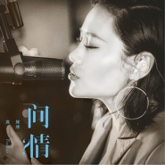

问情
============================

|  |  |
| :--: | :-- |
| [ 问情](https://emumo.xiami.com/album/2102808231) | **艺人**: [袁娅维](../index.md) **语种**: 国语 **唱片公司**: 华纳音乐 **发行时间**: 2017年08月04日 **专辑类别**: EP, 单曲 **专辑风格**: 灵魂爵士 Soul Jazz, 新灵魂乐 Neo-Soul **播放数**: 169700 **收藏数**: 79 **评论数**: 7  |

## 简介

有一些回忆  
就是逃避不了  
有一些人  
依旧无法忘却  
不能释怀的前行  
不如停下脚步  
聆听「旧时光」的真情  
歌手遗珠 颠覆改编  
引领中国neo-soul新风潮  
联手顶级乐手 打破传统 18人同期实录+MV拍摄  
  
8/4 《问情》  
华纳音乐 「灵魂新锋」  
Tia袁娅维  
带你走进她的「第二个家」 领略不一样的童年记忆  
  
「问情」这首歌曲陪伴着很多80、90后成长，也是承载着Tia童年记忆的一首歌曲。Tia坦言，小时候放学途中经常会听到这段熟悉的旋律，一开始并不知道歌词在唱什么，但是旋律留下的印象还是很深刻的，久而久之也就开始跟着哼唱起来。作为Tia听过的第一首港台歌曲，「问情」有着不可取代的位置，这也是Tia选择翻唱歌曲之中的首选。这次没有在《歌手》现场为歌迷们献上这首精心改编的曲目，是她参加节目录制以来最大的遗憾之一。节目结束后，Tia又重新对这首歌的编曲进行了几番突破创新的修改，加入了许多自己的想法，在保留歌曲韵味的同时，也暗藏了一些小惊喜。  
  
录音棚对于Tia而言，是第二个「家」般的存在。在「家」里创作和录音的Tia展现出和舞台上完全不一样的随性和童心，每一天都充满了欢乐和音乐，想让这种快乐感染到大家也是Tia的一个愿望。所以最终决定请来了完整的包含国内外顶尖的17名乐手在内的乐团在录音棚进行现场同期录制，这一次终于可以如愿带大家到自己的「家」中一起领略这段旋律带来的魅力。这个决定不仅打破了传统的录制模式，也给大家带来像在《歌手》现场聆听一样的震撼感觉。中国顶级爵士音乐厂牌JZ Music签约的华裔美籍吉他演奏家顾忠山（Lawrence Ku）及国家级交响乐团国际首席爱乐乐团弦乐团的加入，也让这支单曲增色不少。  
  
「问情」也是Tia与著名制作人陈迪、国内顶尖混音师周天澈又一次的火花碰撞。Tia在经过多次与老师们的讨论磨合之后，结合记忆中的旋律加入了中国特有乐器，西洋完美融合，成就了专属于她的中国式neo-soul。灵动大气的嗓音配合独特的编曲，在旋律与律动的交叉堆叠中，更凸显真情实感，让人欲罢不能。更值得一提的是，为了能让这支特别的单曲能够以更完美的状态展现给大家，素材更是远赴纽约交由美国知名的母带工作室Sterling Sound的工程师进行制作，为歌迷的耳朵献上一场音乐的盛宴。

## 曲目

## 评论

|  |  |  |  |
| :-- | :-- | :-- | :-- |
|  [虾米用户](https://emumo.xiami.com/u/343541556)  2018-01-11 23:12 赞(0) 踩(0) | 
小时候郑少秋和赵雅芝版本的《戏说乾隆》主题曲改编的 
 |
|  [虾米用户](https://emumo.xiami.com/u/224493370)  2017-11-13 09:33 赞(0) 踩(0) | 
欧美和港台唱法混合
 |
|  [虾米用户](https://emumo.xiami.com/u/3409754) 内心的自由。 2017-11-02 15:13 赞(0) 踩(0) | 
公车每天音乐榜节目都有这首歌推荐，很好听，果断收藏～～
 |
|  [虾米用户](https://emumo.xiami.com/u/84229330)  2017-08-06 09:54 赞(0) 踩(0) | 
太好听啦，neo-soul,爱TIA,
 |
|  [虾米用户](https://emumo.xiami.com/u/3389552) 不过是寂寞路上的装点 2017-08-06 00:17 赞(0) 踩(0) | 
婉转有力浴霸不能
 |
|  [虾米用户](https://emumo.xiami.com/u/16570408) … 2017-08-04 03:43 赞(0) 踩(0) | 
这个问情 就是我们都会唱的那个问情吧 
 |
| ⇒ |  [虾米用户](https://emumo.xiami.com/u/104224890) Only one 2017-08-04 11:54 赞(0) 踩(0) | 
应该不是的。
 |
