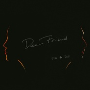

Dear Friend
============================

|  |  |
| :--: | :-- |
| [ Dear Friend](https://emumo.xiami.com/album/2102876178) | **艺人**: [袁娅维](../index.md) **语种**: 国语 **唱片公司**: 华纳音乐 **发行时间**: 2017年10月20日 **专辑类别**: EP, 单曲 **专辑风格**: 新灵魂乐 Neo-Soul, 灵魂乐 Soul **播放数**: 65348 **收藏数**: 63 **评论数**: 9  |

## 简介

有多少人愿付出一生的力气  
找寻  
那一个眼神就到老的默契  
  
袁娅维 × 邓鼓  
10/20 【Dear Friend】  
送给亲爱的「你」  
  
【灵魂新锋  
浓情演绎伤感恋曲】  
  
华纳音乐旗下“灵魂新锋”Tia袁娅维二度推出经典翻唱《Dear Friend》，作为一首旋律柔美又充满阒然怅惘情绪的经典歌曲，打动人心却不俗于滥情，恰到好处的触碰到你埋于心底的柔软。  
  
《Dear Friend》是由实力音乐人王子、邓鼓精心改编，也是Tia和国内顶尖混音师周天澈的又一次音乐火花的碰撞。男女合唱版本的《Dear Friend》，也是继Tia翻唱单曲《问情》使用18人现场同期实录之后的又一次创新尝试，干净的钢琴伴奏，在Tia内敛而细腻的嗓音与邓鼓沙哑却蕴藏爆发力的声音衬托下，展现出除自由肆意外又充满缠绵的情愫，也成就了《Dear Friend》这首经典之作翻唱史上首个男女合唱的惊喜版本。  
  
【歌手遗珠  
黑白光影映现超现实空间】  
  
一首思念的歌，一段思念的情绪，总会在某一瞬间让你不由自主的怀念起过去的恋情和远在他方的友人。  
《Dear Friend》作为《歌手》又一大遗珠，顶配的制作团队展现出了Tia对于这首歌曲的重视。关于这首歌，Tia有着自己独特的理解，开头和结尾处老唱片机的音效更为这首歌注入了浓浓的老上海怀旧元素。除了演唱和曲风上的大胆创新以外，《Dear friend》的MV中，Tia更力邀编曲人之一的邓鼓共同出镜演绎。  
  
为了更精准的贴合曲风意境，Tia亲自参与了《Dear Friend》的MV的概念创作，与新锐视觉艺术家马雷雷联手，在光影交叠如梦似幻的超现实空间里，展现了一出恋人之间欲说还休的无尽遗憾：朋友之间曾经的友情，恋人之间逝去的爱情，更重要的是各自对过去当时的自己状态的深情缅怀，随着旋律情感的叠加，缠绵的音符仿佛揭露出心底最深层的秘密，Tia空灵的嗓音为听众拉开回忆之幕，那些埋藏的愁绪，挣扎、彷徨、挽回、放手渐渐溢出，在旋律减弱之时勾起了大家无尽的思绪。

## 曲目

## 评论

|  |  |  |  |
| :-- | :-- | :-- | :-- |
|  [虾米用户](https://emumo.xiami.com/u/1235558) Music 4 Fun 2017-10-26 12:02 赞(2) 踩(0) | 
技巧大于情感，感觉编曲背离这首歌想要表达的意思了
 |
|  [虾米用户](https://emumo.xiami.com/u/2527832) 超越生命 解放自由 2017-10-21 21:00 赞(0) 踩(0) | 
邓鼓还会幕后？
 |
|  [虾米用户](https://emumo.xiami.com/u/42646953) 大嫣嫣叫杨伟妍 2017-10-20 23:54 赞(0) 踩(0) | 
打 call 很棒！
 |
|  [虾米用户](https://emumo.xiami.com/u/41190273) 你！到底，怎么肥四啊？！ 2017-10-20 17:28 赞(3) 踩(0) | 
3天后，即周一上线~
 |
| ⇒ |  [虾米用户](https://emumo.xiami.com/u/38918617) 你相信我，我相信你 2017-10-25 10:34 赞(0) 踩(0) | 
还没上线
 |
|  [虾米用户](https://emumo.xiami.com/u/9301514) 独立唱作人 2017-10-20 11:40 赞(1) 踩(0) | 
tia和鄧鼓，好聲音走出來的靈魂音樂人
 |
|  [虾米用户](https://emumo.xiami.com/u/45532958)  2017-10-20 11:36 赞(0) 踩(0) | 

 |
|  [虾米用户](https://emumo.xiami.com/u/6771649) 我还没想好要写什么... 2017-10-20 11:19 赞(1) 踩(0) | 
很SOUL的一版
 |
|  [虾米用户](https://emumo.xiami.com/u/43044429) 无中生有的恶趣味 2017-10-20 09:39 赞(0) 踩(0) | 
#
 |
