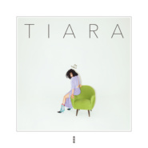

TIARA
============================

|  |  |
| :--: | :-- |
| [ TIARA](https://emumo.xiami.com/album/2103691101) | **艺人**: [袁娅维](../index.md) **语种**: 国语 **唱片公司**: 华纳音乐 **发行时间**: 2018年04月20日 **专辑类别**: 录音室专辑 **专辑风格**: 灵魂乐 Soul, 新灵魂乐 Neo-Soul **播放数**: 2424161 **收藏数**: 1804 **评论数**: 168  |

## 简介

做自己  
做更好的自己  
  
  
华语音乐新标杆 灵魂流行新天后  
万众期待 TIA 袁娅维  
2018 全新大碟 TIARA  
Soul Pop So Amazing  
超高规格国际金牌阵容强强联手  
全面进阶 重新定义 华语流行乐  
4月20日 华纳音乐 荣耀加冕  
  
  
TIARA for Myself  
每个更好的自己都值得被奖赏  
  
「“TIARA”，意为“冠冕”。  
这张专辑是给自己的礼物，  
感谢她见证了更好的自己。」  
  
在筹备新专辑《TIARA》的这四年中，TIA在万众瞩目的《歌手》节目锋芒尽现，顶级Live《开往春天的地铁》的颠覆改编让人记忆犹新！亮相现象级综艺《中国有嘻哈》成最抢手的帮唱嘉宾，被两位热门选手同时选中，破例在同一场帮唱两位选手，超实力Slay全场！献声狂卷19亿票房的现象级电影《前任3：再见前任》主题曲《说散就散》，成为2017年最热门电影金曲，也创造了中国音乐平台单月单曲点击量新的历史记录！2018年除夕夜更是首登中央电视台春节联欢晚会，享天后级礼遇献唱自己的代表作《不同凡想》！  
  
「我上这么多节目，让更多的人知道我，  
就是希望有机会做自己，  
做自己理想中最好的音乐，  
让更多人能听到、了解和喜欢上我热爱的音乐！」  
  
新专辑《TIARA》呼之欲出，应势而生。  
  
  
TIARA for You  
TIARA + Y = TIA RAY  
  
「“TIARA”的灵感源自于我的名字“TIA RAY”  
“TIARA”和“Y”才构成完整的我  
而这个“Y”就是 You  
让我想要与之分享的  
也让我变成更好的我的“你们”」  
  
TIA向来是个不善言辞的人，更多时候她会把想说的话都写进音乐中，用她最擅长的方式，分享给爱她的人。  
  
从四年前凭借首张个人专辑《T.I.A.》一鸣惊人的“Neo-Soul唱作人”，到四年后携全新专辑《TIARA》全面升级，TIA袁娅维将自己个性鲜明的Soul Music一以贯之，并最具创造性地与各音乐类型融合进阶，以国际级唱作水准，引领华语流行音乐Soul Pop新潮流，强势加冕“灵魂流行天后”。  
  
做自己，做更好的自己。  
  
TIA把她对待音乐的态度，用她热爱的音乐，分享给每一个爱她的人，正是每一个You / 你们，才完整了TIA RAY / 袁娅维。  
  
  
常石磊 - 李偲菘 - 李伟菘 - 娃娃 - 易家扬 - 杨杰 - 林倛玉 - 张畅 - 李聪   
Oak Felder - August Rigo - Jewell Fortenberry  
Fergus Chow - Derrick Sepnio - Jeff Liang   
国内外顶级音乐人深度合作 幕后功臣助力刷新华语音乐制作模式  
“神秘”音乐人重磅加持 默契演绎合唱曲 超实力碰撞静待揭晓！  
  
  
「这不是一张填上中文词的由国外音乐人制作的专辑，  
而是不分国界所有艺术家一起玩出来的音乐！」  
  
TIA袁娅维筹备四年精雕细铸的全新专辑《TIARA》将其独具个性的Soul Pop音乐首次带入华语流行乐坛，专辑集结海内外金牌音乐人深度合作共同打造。与常规华语音乐创作模式不同，大部分歌曲都是TIA与好朋友常石磊、Jewell Fortenberry、Jeff Liang、August Rigo、Fergus Chow 、Derrick Sepnio等一众海内外音乐人共同现场联合创作，将最难能可贵的当下直接碰撞的火花，最新鲜完整地记录下来，还原到每一个歌迷的耳前。这样鲜活而有生命力的音乐，也势将刷新乐迷的感官体验，树立起华语流行音乐新的标杆。  
  
  
前卫与复古的时髦结合 专辑视觉呈现Chic高级美  
好友助阵 倾心打造TIA专属格调 诠释“最自然的时尚感”  
独特视角赋予另类「TIARA」新灵魂  
  
「TIA的音乐本身就是时尚，  
而这种时尚就是她的日常。」  
  
专辑制作企划筹备期间，TIA的好友资深摄影师梁恒溢和造型师Lindsay在听过当时还是rough版本的全专歌曲后便一拍即合，决定为TIA量身打造专属于她的“最自然的时尚感”。有了这两位非常了解她的好友加盟，一系列贴有“TIARA”标签的视觉概念迅速展露雏形。在复古摩登的同时也能彰显个性态度，整张专辑所呈现在大众眼前的就是来自TIA的不经意的时尚，而她的音乐和她本人的自然流露即「时尚」。 

## 曲目

## 评论

|  |  |  |
| :-- | :-- | :-- |
|  [虾米用户](https://emumo.xiami.com/u/360774435) 音乐是我最后的堡垒 2020-11-19 23:42 赞(0) 踩(0) | 
i love her forever cheer up your song give me strength
 |
|  [虾米用户](https://emumo.xiami.com/u/11701306) 哎嘿 2020-05-20 16:31 赞(0) 踩(0) | 
多种风格，都驾驭的很好，可惜不火
 |
|  [虾米用户](https://emumo.xiami.com/u/229439946) 永远爱霉霉 2020-04-18 13:15 赞(0) 踩(0) | 
袁娅维这张专辑太棒了，试问国内跟她同阶段的还有哪位歌手能做到这种地步。
 |
|  [虾米用户](https://emumo.xiami.com/u/4469387)   2019-07-04 19:10 赞(0) 踩(0) | 
棒
 |
|  [虾米用户](https://emumo.xiami.com/u/314919250) 你是夏天的风，吹来一阵感... 2018-11-18 11:06 赞(1) 踩(0) | 
怎么又没有版权，虾米最近怎么了，这么多版权都没了，虾米你即将要失去我了
 |
|  [虾米用户](https://emumo.xiami.com/u/5973810) 我虽瞑目眉头仍热烫 2018-09-12 10:50 赞(0) 踩(0) | 
干 虾米没有华纳版权了。。。
 |
|  [虾米用户](https://emumo.xiami.com/u/7886062) 望眼欲穿 2018-09-09 11:06 赞(1) 踩(0) | 
为什么不给听了！！！
 |
|  [虾米用户](https://emumo.xiami.com/u/8500272)  2018-08-23 21:14 赞(0) 踩(0) | 
tia的质感太强了！入坑
 |
|  [虾米用户](https://emumo.xiami.com/u/7652726)   2018-08-16 15:06 赞(0) 踩(0) | 
怎么才能买下来，，，
 |
|  [虾米用户](https://emumo.xiami.com/u/333525871)  2018-07-30 09:16 赞(0) 踩(0) | 
非常走心的专辑，感谢Tia
 |
|  [虾米用户](https://emumo.xiami.com/u/33936010)   2018-07-19 16:11 赞(2) 踩(0) | 
不谦虚地说 用我家音箱能真切听出一张专辑混的是否牛逼 买了实体 不得不佩服这张的混音
 |
|  [虾米用户](https://emumo.xiami.com/u/317926737)  2018-07-08 20:15 赞(1) 踩(0) | 
很佩服她的倔强，不对市场妥协，就是要做自己喜欢的音乐。
 |
|  [虾米用户](https://emumo.xiami.com/u/23534686) o 2018-07-01 21:31 赞(0) 踩(0) | 
o
 |
|  [虾米用户](https://emumo.xiami.com/u/317926737)  2018-06-23 07:00 赞(0) 踩(0) | 
太小众一张专辑
 |
|  [虾米用户](https://emumo.xiami.com/u/12736159)  2018-06-22 22:13 赞(0) 踩(0) | 
听者享受 感受tiara的快乐
 |
|  [虾米用户](https://emumo.xiami.com/u/10893687)  2018-06-11 11:08 赞(3) 踩(0) | 
和Kehlani的合作听的我起鸡皮。。。加油啊，能打进国际的声线不多，希望TIA也可以进军美国Billboard榜！
 |
|  [虾米用户](https://emumo.xiami.com/u/44324917) 虾米硬起来 2018-06-02 19:43 赞(5) 踩(0) | 
整体还是不错的，不喜欢这张专辑的说low的，麻痹这是你平时听的风格吗，不是请不要乱喷，野鸡没事就喜欢瞎几把叫。
 |
|  [虾米用户](https://emumo.xiami.com/u/325394424)  2018-05-20 02:20 赞(2) 踩(0) | 
最后曝光的Just my luck和浪漫主义，编曲唱的都超好听。然而这两首歌没曝光之前，某些人都骂完半个月了，真讽刺，呵！
 |
|  [虾米用户](https://emumo.xiami.com/u/5530136) 60年代老Hippie 2018-05-18 16:38 赞(2) 踩(0) | 
有几首歌的打击乐器高频要衰减一下，太炸耳朵，人声缩混的有点虚，唱功没得说，当然缩混是一种艺术，每个工程师对音乐的概念不一样，这个绝对可以理解，但对于频率的处理的基本原则是耳朵长久听下来不会累。
 |
|  [虾米用户](https://emumo.xiami.com/u/3855918) 我还没想好要写什么... 2018-05-18 16:18 赞(0) 踩(0) | 
其实这张专辑真的是有点点失望的，可能是期待太久期望太高，可能是首专太完美，可能是我太怀念首专给我带来的震撼，也可能是我耳朵不行&amp;hellip;虽然tia现在唱功越来越好，全专听下来每首都不赖，有国际水准，但是又风格很杂，没啥连贯性。不过还是很开心看到她的努力和认真。纯粹个人观点不喜勿喷哈。
 |
| ⇒ |  [虾米用户](https://emumo.xiami.com/u/350434561)  2018-05-25 13:03 赞(0) 踩(0) | 
她就是想每首歌用不同的风格呈现给芽儿们
 |
|  [虾米用户](https://emumo.xiami.com/u/1420006)  2018-05-18 12:31 赞(4) 踩(0) | 
唱功炸天，每一个气息吐词有种说不出的舒坦。
 |
|  [虾米用户](https://emumo.xiami.com/u/49864287)  2018-05-18 11:34 赞(0) 踩(0) | 
电台过来
 |
|  [虾米用户](https://emumo.xiami.com/u/330800080)  2018-05-18 08:56 赞(1) 踩(0) | 
袁娅维，中国现在认真做音乐的没几个人了。喜欢你的音乐。佩服你努力的态度。加油。
 |
|  [虾米用户](https://emumo.xiami.com/u/5127755) 感谢这9年的陪伴，有音乐... 2018-05-18 00:17 赞(1) 踩(0) | 
目前华语乐坛最值得期待的女声
 |
|  [虾米用户](https://emumo.xiami.com/u/6361118) 黑洞無始終，音樂無疆界 2018-05-17 23:48 赞(4) 踩(0) | 
那些批评歌手太炫技的其实想表达的真实意思是&amp;ldquo;TMD唱得太好了可我就是不想承认&amp;rdquo;。敢用同样的标准来评价欧美大Diva们么？她们哪个不是每一首歌都在炫技？那当然了，凤凰开口唱歌，在麻雀听来可不就是炫技么？
 |
| ⇒ |  [虾米用户](https://emumo.xiami.com/u/251623037) 当我不存在吧 2018-05-31 21:11 赞(0) 踩(0) | 
是真凤凰还是染了毛的山鸡你没个bi 数么?
 |
| ⇒ |  [虾米用户](https://emumo.xiami.com/u/6361118) 黑洞無始終，音樂無疆界 2018-06-01 00:02 赞(0) 踩(0) | 
<q><b>Ra - Rn说：</b></q>
 |
|  [虾米用户](https://emumo.xiami.com/u/288297388)  2018-05-13 22:33 赞(1) 踩(0) | 
中毒了这张专辑，每天听
 |
|  [虾米用户](https://emumo.xiami.com/u/251623037) 当我不存在吧 2018-05-12 20:38 赞(3) 踩(0) | 
去年李荣浩的专辑真的恶心到我，林俊杰的专辑淡的像白开水，今年又用这样一锅大杂烩对付。 什么大牌制作，跟蹩脚的厨师炒糊的菜，就算用的海参鲍鱼，能吃么？ 就不明白陈泽杉脑子是不是坏掉了。 今年蔡依林小姐也有专辑，可别在恶心我们好吧。
 |
|  [虾米用户](https://emumo.xiami.com/u/288297388)  2018-05-11 21:05 赞(0) 踩(0) | 
真的屌
 |
|  [虾米用户](https://emumo.xiami.com/u/55399153) inly @ hrj 2018-05-11 12:02 赞(1) 踩(0) | 
lmao觉得不好听就别听呗！我们可以欣赏的要独享  ps 人家有水平才能炫技... 反正我喜欢 ❣️
 |
|  [虾米用户](https://emumo.xiami.com/u/12215136) 我还没想好要写什么... 2018-05-11 07:04 赞(2) 踩(0) | 
为什么总拿炫技说事儿？有技可炫为什么不炫藏着干嘛？
 |
| ⇒ |  [虾米用户](https://emumo.xiami.com/u/26217347) 我这家伙很懒，个人介绍也... 2018-05-17 15:33 赞(0) 踩(0) | 
音乐最重要的是表达合意，一首悲惨伤感抑郁寡欢基调灰暗的歌你用欢快的唱法或者高昂的撕心裂肺的唱法去唱你觉得合适吗？这就是某些人说的炫技，其实就是演唱过了头的意思。
 |
| ⇒ |  [虾米用户](https://emumo.xiami.com/u/12215136) 我还没想好要写什么... 2018-05-18 00:28 赞(0) 踩(0) | 
作品演绎可以按照个人理解，没有必要按照常理唱得都一样。另外有的是欢快的曲子唱悲伤的内容的歌。
 |
|  [虾米用户](https://emumo.xiami.com/u/325394424)  2018-05-11 02:31 赞(7) 踩(0) | 
看热一质疑现在虾米专栏作者的水平，根本没有鉴赏华语专辑的能力！听多几张专辑装的够不可一世的，实际武断，极其主观，愚蠢，恳请各位听一听别被带节奏。送某一位土炮一句歌词&amp;ldquo;你的谎言是我的饭后消遣，its bullshit！&amp;rdquo; 
 |
| ⇒ |  [虾米用户](https://emumo.xiami.com/u/26217347) 我这家伙很懒，个人介绍也... 2018-05-17 15:29 赞(0) 踩(0) | 
不好意思，每个人都应该有个人的判断，而不应该被评论带歪。但这不代表可以轻易否定对方对华语音乐的鉴赏能力，觉得好不好是一回事，说的有没有理客观不客观是一回事，但是人家基准的试听量放在那里，每个人都有了一定的试听量之后自然会得出不同的看法。人家并没有人身攻击，只是就专辑本身就事论事，虽然语言粗劣了些。
 |
| ⇒ |  [虾米用户](https://emumo.xiami.com/u/325394424)  2018-05-20 02:13 赞(0) 踩(0) | 
<q><b>慕祺海Perkira说：</b></q>
 |
| ⇒ |  [虾米用户](https://emumo.xiami.com/u/26217347) 我这家伙很懒，个人介绍也... 2018-05-20 11:47 赞(0) 踩(0) | 
<q><b>瞳孔与苹果说：</b></q>
 |
| ⇒ |  [虾米用户](https://emumo.xiami.com/u/104224890) Only one 2018-09-08 06:45 赞(0) 踩(0) | 
为何下架？
 |
|  [虾米用户](https://emumo.xiami.com/u/1391591)  2018-05-08 13:15 赞(0) 踩(0) | 
假声略多
 |
|  [虾米用户](https://emumo.xiami.com/u/32413850) 我还没想好要写什么... 2018-05-07 21:16 赞(2) 踩(0) | 
很喜欢这张专辑！曲风多样调子多变很&amp;hearts;转粉了~
 |
|  [虾米用户](https://emumo.xiami.com/u/8157001) 我还没想好要写什么... 2018-05-07 11:56 赞(0) 踩(0) | 
个别歌曲本身还是弱一点 但绝对是近期的精品
 |
|  [虾米用户](https://emumo.xiami.com/u/38802367)   2018-05-04 08:41 赞(0) 踩(0) | 
歌终于全了
 |
|  [虾米用户](https://emumo.xiami.com/u/37621688) 暂无签名~ 2018-05-04 07:20 赞(1) 踩(0) | 
挺好 热评一真的哈哈哈 真没觉得哪村范儿了 要怎么样才不村范儿 变成白皮肤就可以了吗？要不然下次试试把音乐放在人前面去听 专栏作者
 |
|  [虾米用户](https://emumo.xiami.com/u/17961808) Do the next ... 2018-05-04 02:17 赞(1) 踩(0) | 
要么纯英文，要么纯中文。中英夹杂真是不伦不类了。
 |
|  [虾米用户](https://emumo.xiami.com/u/7834130)  2018-05-03 23:51 赞(0) 踩(0) | 
不如一专，现在想做一张好专辑真就那么难。
 |
|  [虾米用户](https://emumo.xiami.com/u/2466270) 美妙的旋律是最好的陪伴。 2018-05-03 23:50 赞(0) 踩(0) | 
剔牙的唱功毋庸置疑！什么样的歌都轻松驾驭！
 |
|  [虾米用户](https://emumo.xiami.com/u/49959840) 无 聊 人 2018-05-03 19:00 赞(0) 踩(0) | 
❤️❤️❤️
 |
|  [虾米用户](https://emumo.xiami.com/u/12010664) The Light 2018-05-03 09:40 赞(30) 踩(0) | 
炫技？我要有这种嗓子，我TM见了人就炫！听张专辑村low范儿全部挂在嘴边，怎么能这么有优越感呢？不喜欢的话还是回去听你的欧美大歌去吧~我并不是每首歌都喜欢，但觉得还算是很良心的一张专辑，免费让你听，还在这瞎比比，不厚道吧？姐们~
 |
|  [虾米用户](https://emumo.xiami.com/u/40228404) 我还没想好要写什么... 2018-05-02 13:08 赞(3) 踩(0) | 
嘛，不能因为人家唱歌技巧多就说人家炫技吧，技巧都是服务于风格和歌曲，能这样唱也是一种本事。
 |
|  [虾米用户](https://emumo.xiami.com/u/8364606) never stop s... 2018-04-29 23:24 赞(0) 踩(0) | 
第一遍收藏的是78912
 |
|  [虾米用户](https://emumo.xiami.com/u/52202) 人间是剧场 2018-04-29 19:09 赞(1) 踩(0) | 
weishenme,bu neng xia zai dao PC?
 |
|  [虾米用户](https://emumo.xiami.com/u/32513985) subCULTure 惡... 2018-04-29 03:32 赞(0) 踩(0) | 
好險沒收錄說散就散嘻嘻
 |
|  [虾米用户](https://emumo.xiami.com/u/4487129)  2018-04-29 00:09 赞(0) 踩(0) | 
！！！
 |
|  [虾米用户](https://emumo.xiami.com/u/8854264) Hypocrite. 2018-04-28 15:47 赞(3) 踩(0) | 
看得出来tia的野心还是很大的 无论从歌曲还是唱腔 12首每首的风格和感觉都不一样 但这令人眼花缭乱的呈现也带来一个问题就是 专辑少了整体性 感觉东一榔头西一棒子的 全部听下来几乎没什么印象 虽然tia的实力毋庸置疑 团队制作也很精良 但这一点上的确差了一些
 |
|  [虾米用户](https://emumo.xiami.com/u/9463262) 暂无 2018-04-27 20:48 赞(2) 踩(0) | 
Part. 3 对了，还有一点非常好的就是专辑封面，从造型、配色到设计，是真的好看！好看！！好看！！！高级！高级！！高级！！！何为高级又时髦的撞色设计，这就是啊！年度典范！目前国语流行专辑封套No. 1。但对于这次唱片行销真的要吐槽，还搞数字版和实体版的差异这么老套，还一差就是三首曲目，真的恶心到了！   
 |
|  [虾米用户](https://emumo.xiami.com/u/9463262) 暂无 2018-04-27 20:43 赞(3) 踩(0) | 
Part. 2 我是在AM上先听完整张专辑的，最吸引我耳朵的是《远远的》和《Pink Power》，其次是《孔雀与麻雀》。《孔》的曲子写得很秒，编曲也非常高级，但比较可惜的是Tia在这首歌里声音的表现力并不好，习惯性的硬性唱法使得Tia的声音听起来不够chill且缺乏弹性。其他曲目就比较过耳即忘。反回虾米看了整专详情，发现最吸引我的那三首第一作曲人都是袁本人，可见国人声线和唱法还是更适合国产音乐人的写法，袁其实也知道她目前的能力和程度在哪。二专质量低于首专这点不用多说了，但对于一个还处在事业上升期的准二线女歌手，能交出这份作业还是应该肯定的，虽然整体略操之过急。
 |
| ⇒ |  [虾米用户](https://emumo.xiami.com/u/357388165)  2018-05-05 20:43 赞(0) 踩(0) | 
存不存在也很好听啊
 |
|  [虾米用户](https://emumo.xiami.com/u/9463262) 暂无 2018-04-27 20:40 赞(2) 踩(0) | 
Part. 1 在有兴趣写专辑短评的时候碰到蛮多次Jonathan也写了短评，对其标志性的批判式短评还是比较赞同的，对其音乐品位也是比较欣赏。但就袁这张新专，还是觉得J有些偏激了，真不觉得有那么差，我个人起码是可以打到7-7.5的。你还真就不得不承认Tia的唱法和技巧是高级的、时髦的、与国际接轨的，在国内技术流（甚至港台）新灵歌女歌手里，你还真就一时间找不到与之抗衡的。但这次华纳和Tia对其还是过于着急和自信，即使再高级，黄种人的音域和唱腔上跟黑白人种在灵魂乐里还是有一定差异性的，目前Tia的唱功明显还无法完美hold住国外hit曲的写法和铺排。
 |
|  [虾米用户](https://emumo.xiami.com/u/348998542) 我还没想好要写什么... 2018-04-27 11:30 赞(2) 踩(0) | 
我发现我用无损音质听就首首都好听得不行。。。
 |
|  [虾米用户](https://emumo.xiami.com/u/335681705) 温柔带给你自尊 2018-04-27 03:04 赞(1) 踩(0) | 
just my love，谢谢这张专辑的所有创作人
 |
|  [虾米用户](https://emumo.xiami.com/u/106284664) 一个犯二的孩纸 2018-04-25 21:19 赞(7) 踩(0) | 
会唱歌，不会做专辑&amp;hellip;&amp;hellip;
 |
| ⇒ |  [虾米用户](https://emumo.xiami.com/u/40803128)   2018-05-17 20:06 赞(0) 踩(0) | 
你会
 |
|  [虾米用户](https://emumo.xiami.com/u/82538990) 我还没想好要写什么... 2018-04-25 20:33 赞(4) 踩(0) | 
能用中文把soul唱的这么洋气，华人里也只有tia了，听不懂的就别逼逼丢人了，听你们的空空如也去
 |
|  [虾米用户](https://emumo.xiami.com/u/82538990) 我还没想好要写什么... 2018-04-25 20:32 赞(1) 踩(0) | 
虾米里怎么全是黑子？也是不懂这个世界了，这么优秀的灵魂歌者，不欣赏就不要进来啊，贱不贱
 |
|  [虾米用户](https://emumo.xiami.com/u/204363602)  2018-04-25 19:42 赞(0) 踩(0) | 
这首歌音质混了觉得有点受损的味道。。。我知道混音师的风格独特。像是欧美的乡村味
 |
|  [虾米用户](https://emumo.xiami.com/u/233790953) 或许我自己太有意思 2018-04-25 18:17 赞(2) 踩(0) | 
怎么说呢，国内大部分人还是停留在零几年的听歌口味吧，但是要发展的话肯定要不断做新尝试。即使是国内很多人&amp;ldquo;瞧不上&amp;rdquo;的韩国，也出现了不同风格不同类型的优秀的音乐人，感觉全世界都在寻求进步，所以希望国内音乐也能有一些新东西。以前评论一张专辑好与不好，大家都习惯从歌词意境、从听歌感觉来说，更像是在评论一篇故事。我期待更多乐评人可以从制作技巧、方式这些方面讲一下，多讲一些更有用、更专业的东西嘛❤不过这张专辑确实显得有点&amp;ldquo;炫技&amp;rdquo;，做音乐克制很重要 对了，大家讨论的王嘉尔合唱曲在哪啊？我现在对他好有兴趣 偶然听了他的新歌，真的有点不错哈哈
 |
| ⇒ |  [虾米用户](https://emumo.xiami.com/u/26217347) 我这家伙很懒，个人介绍也... 2018-05-17 15:04 赞(0) 踩(0) | 
国内如果真的大部分人还停留在零几年的听歌口味的话 就不会出现09年前后台湾独立音乐井喷的情况了，可以说还有不少人听歌习惯未改变，喜欢抒情，喜欢大嗓门，但绝不是口味未变。去看看豆瓣评分，很多国内抒情专辑，也就是那种很老式的出专基本没有高于6分线的，很多甚至不及格。
 |
|  [虾米用户](https://emumo.xiami.com/u/18842023) 世界都在听！ 2018-04-25 16:36 赞(1) 踩(0) | 
并没有什么感觉
 |
|  [虾米用户](https://emumo.xiami.com/u/4797893) o.k. 2018-04-25 14:02 赞(0) 踩(0) | 
soul pop？
 |
|  [虾米用户](https://emumo.xiami.com/u/116016502) 美妙生活/ 2018-04-25 08:30 赞(0) 踩(0) | 
第一首和第三首去哪了
 |
| ⇒ |  [虾米用户](https://emumo.xiami.com/u/324409) 我还没想好要写什么... 2018-04-25 13:48 赞(0) 踩(0) | 
全砖是12tracks~现在先释出9首，3首后补（吊着胃口先）
 |
|  [虾米用户](https://emumo.xiami.com/u/184305257) 孤身身处何处有净土，独立... 2018-04-25 07:35 赞(0) 踩(0) | 
失望
 |
|  [虾米用户](https://emumo.xiami.com/u/5156015) 我还没想好要写什么... 2018-04-25 07:11 赞(1) 踩(0) | 
什么玩意
 |
|  [虾米用户](https://emumo.xiami.com/u/35655398)  2018-04-25 03:08 赞(2) 踩(0) | 
除了7比较和谐，235都有节奏音效过大，把其他元素给压榨没了的感觉，而且这些音效听起来很聒噪。6也有这个倾向，不过混音混的好弥补了点。但是bridge转的不是太故意就是太随便。8常石磊自己唱可能会比较真挚点。9太复杂欣赏无能。总之，这是个有洋味却混合不到位的专辑。很难让人享受。虽然我很喜欢tia的歌声和风格。
 |
|  [虾米用户](https://emumo.xiami.com/u/229803939)  2018-04-24 20:35 赞(0) 踩(0) | 
还是台语歌好听
 |
|  [虾米用户](https://emumo.xiami.com/u/4182590) 暂无签名~ 2018-04-24 19:57 赞(0) 踩(0) | 
我觉得她终于不用唱rnb了，也是一个进步
 |
| ⇒ |  [虾米用户](https://emumo.xiami.com/u/82538990) 我还没想好要写什么... 2018-04-25 20:31 赞(0) 踩(0) | 
她从始至终也不是唱rnb的，她是soul好么？
 |
| ⇒ |  [虾米用户](https://emumo.xiami.com/u/4182590) 暂无签名~ 2018-04-25 21:01 赞(0) 踩(0) | 
<q><b>Cowboy说：</b></q>
 |
|  [虾米用户](https://emumo.xiami.com/u/2211153) 暂无签名~ 2018-04-24 19:07 赞(1) 踩(0) | 
封面很好看 
 |
|  [虾米用户](https://emumo.xiami.com/u/10077940)  2018-04-24 18:13 赞(1) 踩(0) | 
听的我好难受。。听的我自己咯痰。这个嗓子。。明明可以还不错。但是我一首都不喜欢。有种还可以的歌被唱烂了的感觉 = =
 |
|  [虾米用户](https://emumo.xiami.com/u/318047247)  2018-04-24 17:08 赞(1) 踩(0) | 
好听好听
 |
|  [虾米用户](https://emumo.xiami.com/u/853523)  2018-04-24 16:18 赞(1) 踩(0) | 
JAZZ是最放松随性自由的表达，不知道感觉剔牙小姐的JAZZ听得让人很紧张又严肃，看了歌手2018金典之夜，在Jessie J迪玛希面前，真的，华语一个能打的都没有。感觉TIA在国内被吹过头了，还是好好唱《说散就散》之类的城乡结合部大HIT吧。
 |
| ⇒ |  [虾米用户](https://emumo.xiami.com/u/26217347) 我这家伙很懒，个人介绍也... 2018-04-24 22:50 赞(0) 踩(0) | 
风格上写了soul，而且袁娅维应该很长时间都是soul ，soul是R&amp;amp;amp;B的近亲，和jazz并不是很像。要比也应该是欧美灵魂乐歌手和方大同之流吧？
 |
| ⇒ |  [虾米用户](https://emumo.xiami.com/u/335681705) 温柔带给你自尊 2018-04-27 03:02 赞(0) 踩(0) | 
巅峰会当天最能打的就是袁娅维了，而且能打是指什么能打呢？飙高音吗
 |
| ⇒ |  [虾米用户](https://emumo.xiami.com/u/4771470) 暂无签名~ 2018-05-03 19:04 赞(0) 踩(0) | 
然而国内并没有音乐素养唱功现场拼得过她的几个人了
 |
| ⇒ |  [虾米用户](https://emumo.xiami.com/u/26217347) 我这家伙很懒，个人介绍也... 2018-05-17 17:44 赞(0) 踩(0) | 
听完再次证明你不懂音乐流派，连流派划分都没搞清楚，还好意思说这些。第一这张专辑多数歌都不是jazz，而是当代节奏布鲁斯R&amp;amp;amp;B和灵魂乐soul。第二，jazz并不全部都是轻松随性自由的表达，有一部分比如酸性爵士和融合爵士，加入了大量电子乐、放克、舞曲等元素，会显得非常时髦欢快甚至大气澎湃，这些元素也不是传统jazz元素。第三.推荐你去多恶补下欧美灵魂乐和R&amp;amp;amp;B歌手，到时候你自会明白soul、R&amp;amp;amp;B、jazz风格之间的差异。
 |
| ⇒ |  [虾米用户](https://emumo.xiami.com/u/95824596)  2018-07-25 16:43 赞(0) 踩(0) | 
你的水平也就听听说散就散 崇拜一些大众明星吧
 |
|  [虾米用户](https://emumo.xiami.com/u/335709575)  2018-04-24 16:15 赞(1) 踩(0) | 
这张专辑绝了，每首歌都值得细细品味，每首歌都按不下切歌键，每首歌都是一个不同的感受。
 |
|  [虾米用户](https://emumo.xiami.com/u/472261) 别跟我讲道理 2018-04-24 15:49 赞(3) 踩(0) | 
配器丰富了，虽以neo sou做基调，天花乱坠的。袁娅维应该尝试一下，如何在嗓子上做做减法，这样听起来，很油。
 |
|  [虾米用户](https://emumo.xiami.com/u/14637601)  2018-04-24 14:45 赞(1) 踩(0) | 
第一首和第三首哪去了？
 |
|  [虾米用户](https://emumo.xiami.com/u/298258561)  2018-04-24 14:29 赞(0) 踩(0) | 
更多音色的tia(人 &amp;bull;͈ᴗ&amp;bull;͈)۶♡♡比心心
 |
|  [虾米用户](https://emumo.xiami.com/u/84583782) 怎么才能好好计划最近乱七... 2018-04-24 10:44 赞(0) 踩(0) | 
耐心听
 |
|  [虾米用户](https://emumo.xiami.com/u/10916490) 张孑仁 2018-04-24 10:23 赞(2) 踩(0) | 
歌唱的不咋地，骚气挺重
 |
|  [虾米用户](https://emumo.xiami.com/u/29919918)   2018-04-24 07:20 赞(0) 踩(0) | 
不知道为什么好多说不够好 个人挺喜欢的 希望有机会也能去听听她的现场
 |
|  [虾米用户](https://emumo.xiami.com/u/4771470) 暂无签名~ 2018-04-23 23:39 赞(4) 踩(0) | 
没有第二个热评说得那么夸张，但袁娅维出的歌大部分确实配不上她的音乐实力。有一两首有点意思，但也只是乐曲构成上有点意思，别的更深的内涵还是少了点。外行瞎说，仅代表个人意见哈。
 |
|  [虾米用户](https://emumo.xiami.com/u/310039105)  2018-04-23 23:09 赞(3) 踩(0) | 
这张专辑到底几首歌 怎么才9首 不是12首吗
 |
|  [虾米用户](https://emumo.xiami.com/u/127885890) 明明就遇到爱 2018-04-23 22:42 赞(3) 踩(0) | 
期待台湾金曲奖，她来了                             
 |
|  [虾米用户](https://emumo.xiami.com/u/197365727)  2018-04-23 22:01 赞(0) 踩(0) | 
好好听
 |
|  [虾米用户](https://emumo.xiami.com/u/260904575)  2018-04-23 21:25 赞(2) 踩(0) | 
看到有束光中Tia说的话&amp;ldquo;我花14年注解三个词：漂泊，选择和歌唱，现在来回答什么是我，是异想天开，是独立，是自由&amp;rdquo;这张专辑是她心声，是她对自己的告白。
 |
|  [虾米用户](https://emumo.xiami.com/u/33418677) Patience is ... 2018-04-23 19:11 赞(0) 踩(0) | 
什么鬼东西？
 |
|  [虾米用户](https://emumo.xiami.com/u/17767792) 我还没想好要写什么... 2018-04-23 18:39 赞(2) 踩(0) | 
觉得 好吗今天 是专辑最佳的赞我
 |
|  [虾米用户](https://emumo.xiami.com/u/314919250) 你是夏天的风，吹来一阵感... 2018-04-23 18:21 赞(1) 踩(0) | 
这样的歌曲类型在欧美会很受欢迎
 |
|  [虾米用户](https://emumo.xiami.com/u/314919250) 你是夏天的风，吹来一阵感... 2018-04-23 18:18 赞(4) 踩(0) | 
为什么有很多人觉得不好啊，我觉得都挺好听的，都很适合Tia的声线
 |
|  [虾米用户](https://emumo.xiami.com/u/358663483) 我还没想好要写什么... 2018-04-23 16:30 赞(1) 踩(0) | 
还没听先转发下
 |
|  [虾米用户](https://emumo.xiami.com/u/106284664) 一个犯二的孩纸 2018-04-23 15:36 赞(1) 踩(0) | 
离期待值还是太远了，不过这才第二张，以后还有很多进步的机会
 |
|  [虾米用户](https://emumo.xiami.com/u/106284664) 一个犯二的孩纸 2018-04-23 15:34 赞(1) 踩(0) | 
作为专辑来说还是弱了点
 |
|  [虾米用户](https://emumo.xiami.com/u/216477160) 我还没想好要写什么…… 2018-04-23 14:25 赞(1) 踩(0) | 
这很Tia，这才是她的风格，不是最多人听到的说散就散
 |
|  [虾米用户](https://emumo.xiami.com/u/347181799)  2018-04-23 12:27 赞(0) 踩(0) | 
pink power一看就很好听
 |
|  [虾米用户](https://emumo.xiami.com/u/87202172)   2018-04-23 12:26 赞(1) 踩(0) | 
这张专辑听着真累
 |
|  [虾米用户](https://emumo.xiami.com/u/15871376)  2018-04-23 10:52 赞(0) 踩(0) | 
反正觉得还不错
 |
|  [虾米用户](https://emumo.xiami.com/u/15981815) 大卫清心 2018-04-23 10:38 赞(0) 踩(0) | 
：别闹&amp;amp;自然
 |
|  [虾米用户](https://emumo.xiami.com/u/245276696)  2018-04-23 09:26 赞(0) 踩(0) | 
唉，没有想听第二遍的
 |
|  [虾米用户](https://emumo.xiami.com/u/2432540)  2018-04-23 03:58 赞(1) 踩(0) | 
只能说参差不齐吧。一遍听下来感觉有两三首还是挺特别的。
 |
|  [虾米用户](https://emumo.xiami.com/u/35426591)  2018-04-23 01:37 赞(0) 踩(0) | 
perfect
 |
|  [虾米用户](https://emumo.xiami.com/u/353722630) 一生所爱     至死不... 2018-04-23 01:26 赞(0) 踩(0) | 
存.不存在 
 |
|  [虾米用户](https://emumo.xiami.com/u/124515996)  2018-04-23 01:01 赞(0) 踩(0) | 
嘻嘻嘻
 |
|  [虾米用户](https://emumo.xiami.com/u/43594141) Fxxk yoursel... 2018-04-23 01:00 赞(1) 踩(0) | 
喜欢存不存在
 |
| ⇒ |  [虾米用户](https://emumo.xiami.com/u/122704406)   2018-04-23 18:32 赞(0) 踩(0) | 
又见到你了警察叔叔
 |
|  [虾米用户](https://emumo.xiami.com/u/318132) 抠啦 2018-04-23 00:36 赞(0) 踩(0) | 
抠啦
 |
| ⇒ |  [虾米用户](https://emumo.xiami.com/u/812392) q音网易搜央央小月，酷g... 2018-04-23 00:42 赞(0) 踩(0) | 
啦抠
 |
|  [虾米用户](https://emumo.xiami.com/u/39591989) / 2018-04-23 00:34 赞(0) 踩(0) | 
为我牙疯狂打CALL
 |
|  [虾米用户](https://emumo.xiami.com/u/7292098) 我們不斷相遇 在未來里 2018-04-23 00:31 赞(0) 踩(0) | 
M.
 |
|  [虾米用户](https://emumo.xiami.com/u/4355028) 喜欢音乐，喜欢听歌。 2018-04-23 00:25 赞(0) 踩(0) | 
先收藏！
 |
|  [虾米用户](https://emumo.xiami.com/u/8866401) 踏遍青山人未老 2018-04-23 00:19 赞(46) 踩(0) | 
新风格，新形式。新尝试，新版图。一个歌手的能力分为录音和live两种呈现，袁娅维则是两种都具备，到录音室状态，有时会有一些小小的偏差，会把live的&amp;ldquo;放&amp;rdquo;也一起录了进来，由此容易出现一种小过的录音状态。但总的这张专辑的呈现相当多元化，水准之上。很多人欣赏不了的会把自己听不懂的东西加标签说差说不好，非常短浅的眼光还要暴露自己难以抬举的文笔，希望喷黑的人能够有相应的审美水平和撰写评论水平再来给予评价，不然也是贻笑大方啊。
 |
| ⇒ |  [虾米用户](https://emumo.xiami.com/u/47924670)  2018-04-23 00:32 赞(0) 踩(0) | 
我感觉这张砖是太收着了，没有现场的灵气和激情，反而稍微油了点。
 |
| ⇒ |  [虾米用户](https://emumo.xiami.com/u/8866401) 踏遍青山人未老 2018-04-23 01:03 赞(0) 踩(0) | 
<q><b>Chromium说：</b></q>
 |
|  [虾米用户](https://emumo.xiami.com/u/325394424)  2018-04-23 00:08 赞(23) 踩(0) | 
啊啊啊啊啊啊啊啊啊啊！！虾米的TIARA来了，一专就很好听了。说欧美曲填中文词垃圾的我反手一首love can fly。这首歌可是joss stone说很喜欢的，还合唱了。音乐无国界可以吗
 |
|  [虾米用户](https://emumo.xiami.com/u/251623037) 当我不存在吧 2018-04-22 09:36 赞(3) 踩(0) | 
不明白这些曲子从哪找的，唱腔从哪学的。欧美曲填中文词真的很辣鸡。
 |
| ⇒ |  [虾米用户](https://emumo.xiami.com/u/12513555)  2018-04-24 11:25 赞(0) 踩(0) | 
同意
 |
|  [虾米用户](https://emumo.xiami.com/u/3073763) 我还没想好要写什么... 2018-04-21 19:05 赞(1) 踩(0) | 
一遍下来，就孔雀与麻雀，Pink Power，还可以
 |
| ⇒ |  [虾米用户](https://emumo.xiami.com/u/47924670)  2018-04-23 00:33 赞(0) 踩(0) | 
同感，也只是喜欢这两首。
 |
|  [虾米用户](https://emumo.xiami.com/u/313623113)  2018-04-21 18:40 赞(0) 踩(0) | 
和王嘉尔合唱的歌呐！！！！！！！Lucky Rain呐？？？？？？？？
 |
|  [虾米用户](https://emumo.xiami.com/u/4544) 我继续，你要随意 2018-04-21 08:30 赞(54) 踩(0) | 
没有一首歌是没有不切快进的，每一首歌都在炫技，每一首歌都写的很做作，每一首歌都充满了村low充洋范儿。真的和想象与期待的袁娅维相差甚远。真的是失望。和vivo代言人王嘉尔合唱的两首歌真的太low爆了吧，就算抄袭欧美hit也麻烦抄的认真和用心点。
 |
| ⇒ |  [虾米用户](https://emumo.xiami.com/u/4748180)  2018-04-21 12:58 赞(0) 踩(0) | 
同感觉这张专辑有点失望啊 还不如没出名前的专辑&amp;hellip;&amp;hellip;
 |
| ⇒ |  [虾米用户](https://emumo.xiami.com/u/39591989) / 2018-04-23 00:32 赞(0) 踩(0) | 
你也就只会听听芭乐了哈
 |
| ⇒ |  [虾米用户](https://emumo.xiami.com/u/3448399)   2018-04-23 16:22 赞(0) 踩(0) | 
辛苦你了
 |
| ⇒ |  [虾米用户](https://emumo.xiami.com/u/317529889)  2018-04-23 17:30 赞(0) 踩(0) | 
虽然你在豆瓣给窦靖童二专打1星让我很讨厌，但这个评论我是同意的
 |
| ⇒ |  [虾米用户](https://emumo.xiami.com/u/337720114) It's a real ... 2018-04-23 21:07 赞(0) 踩(0) | 
和嘉尔合唱？特地点明vivo，你到底是给Tia招黑还是给嘉尔招黑还是给vivo招黑......不想听就请安静的走开，Thanks♪(･&amp;omega;･)ﾉ
 |
| ⇒ |  [虾米用户](https://emumo.xiami.com/u/198182673) Be a slut. 2018-04-24 00:18 赞(0) 踩(0) | 
Em&amp;hellip;&amp;hellip;你是个职业黑吧
 |
| ⇒ |  [虾米用户](https://emumo.xiami.com/u/247967770) 留不住。 2018-04-25 00:11 赞(0) 踩(0) | 
你的回复让我想起了她唱(合唱)的 下个路口，!8!8!8。额...
 |
| ⇒ |  [虾米用户](https://emumo.xiami.com/u/238363085) 谢谢你的爱 2018-04-25 13:24 赞(0) 踩(0) | 
难道一直唱死去活来的情歌就是好听吗？2018就不要再回去做1998的音乐！
 |
| ⇒ |  [虾米用户](https://emumo.xiami.com/u/233790953) 或许我自己太有意思 2018-04-25 17:51 赞(0) 踩(0) | 
哈哈哈为什么还得特意提一下vivo代言人啊？
 |
| ⇒ |  [虾米用户](https://emumo.xiami.com/u/48393403) 一丁的远方有音乐 2018-04-25 23:17 赞(0) 踩(0) | 
谢谢夸奖，我们有技可炫!
 |
| ⇒ |  [虾米用户](https://emumo.xiami.com/u/95824596)  2018-04-28 03:02 赞(0) 踩(0) | 
诶我操 你这话说的 袁娅维唱歌村？中国女歌手有几个能唱过袁娅维的
 |
| ⇒ |  [虾米用户](https://emumo.xiami.com/u/113532332)  2018-04-30 15:06 赞(0) 踩(0) | 
那请你说说到底抄袭那首歌了？
 |
| ⇒ |  [虾米用户](https://emumo.xiami.com/u/113532332)  2018-05-01 17:47 赞(0) 踩(0) | 
这张专辑本来就是pop soul ，说炫技那也是tia有这个唱功，说每首歌快进也是怕你没有听消失的爱人，自己没有静下心去体会这张专辑就不要在这里咕咕嘚个不停，还有吼，没人逼你听，可以不听，
 |
| ⇒ |  [虾米用户](https://emumo.xiami.com/u/13856242)  2018-05-02 22:18 赞(0) 踩(0) | 
求大家别赞了 为啥tia新专辑的热评第一要被这样的评论占据..
 |
| ⇒ |  [虾米用户](https://emumo.xiami.com/u/336284952)  2018-05-03 10:45 赞(0) 踩(0) | 
你吊？，你有什么资格评价别人，不值得尊重的东西
 |
| ⇒ |  [虾米用户](https://emumo.xiami.com/u/2730963)  2018-05-03 21:38 赞(0) 踩(0) | 
没有一首歌是没有不切快进的 = 所有歌都不切快进 = 所有歌都听完整  你到底想说的是所有歌听完了有资格发言还是想说忍不住快进但是逻辑错了？  如果你对上方等式有质疑那一定是你自己错了
 |
| ⇒ |  [虾米用户](https://emumo.xiami.com/u/3920148)   2018-05-08 16:12 赞(0) 踩(0) | 
你找一个能抄到这个程度的，我欣赏一呗。
 |
| ⇒ |  [虾米用户](https://emumo.xiami.com/u/343040260)  2018-05-08 16:55 赞(0) 踩(0) | 
用专辑第二首歌回复你
 |
| ⇒ |  [虾米用户](https://emumo.xiami.com/u/364755369)  2018-05-08 17:13 赞(0) 踩(0) | 
你懂个屁哦
 |
| ⇒ |  [虾米用户](https://emumo.xiami.com/u/297778220)  2018-05-17 09:46 赞(0) 踩(0) | 
you  can  you  up
 |
| ⇒ |  [虾米用户](https://emumo.xiami.com/u/45859437) 团队：IN 微博：@韩佳... 2018-05-22 03:44 赞(0) 踩(0) | 
不爱听别听
 |
| ⇒ |  [虾米用户](https://emumo.xiami.com/u/376600389)  2018-06-24 00:25 赞(0) 踩(0) | 
你说的我不认同啊，我觉得很好听，
 |
| ⇒ |  [虾米用户](https://emumo.xiami.com/u/95824596)  2018-07-25 16:43 赞(0) 踩(0) | 
你可以去听听我们不一样 你会找到自我
 |
| ⇒ |  [虾米用户](https://emumo.xiami.com/u/263266019)  2018-09-03 11:35 赞(0) 踩(0) | 
虽然tia这专也没有达到我的预期 但是你一口一个vivo代言人 村口范 抄袭欧美hit这幅嘴脸也确实够恶心 就你这种都能做专栏作者 虾米音乐人是死绝了吗
 |
| ⇒ |  [虾米用户](https://emumo.xiami.com/u/402677863)  2018-09-08 06:44 赞(0) 踩(0) | 
为啥下架了？
 |
| ⇒ |  [虾米用户](https://emumo.xiami.com/u/26717920)  2019-01-21 08:22 赞(0) 踩(0) | 
你才low，最low的就是你，没人跟你抢
 |
| ⇒ |  [虾米用户](https://emumo.xiami.com/u/774261)   2019-02-05 23:29 赞(0) 踩(0) | 
理解喜好不同，如果Tia都不行，国语很多没法听了
 |
|  [虾米用户](https://emumo.xiami.com/u/289647196)  2018-04-21 00:21 赞(0) 踩(0) | 
什么时候才可以听啊
 |
|  [虾米用户](https://emumo.xiami.com/u/32231042) 没 个 性 2018-04-20 23:07 赞(0) 踩(0) | 
？？？
 |
|  [虾米用户](https://emumo.xiami.com/u/337378364)  2018-04-20 14:09 赞(0) 踩(0) | 
哈哈哈幸好今天早上下载了
 |
|  [虾米用户](https://emumo.xiami.com/u/24814862) - 2018-04-20 12:41 赞(2) 踩(0) | 
-
 |
|  [虾米用户](https://emumo.xiami.com/u/116016502) 美妙生活/ 2018-04-20 12:23 赞(0) 踩(0) | 
期待tia二专！
 |
|  [虾米用户](https://emumo.xiami.com/u/38032173) 我还没想好要写什么... 2018-04-20 10:21 赞(2) 踩(0) | 
第一条 看到人点赞 你会越来越美
 |
