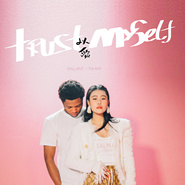

Trust Myself
============================

|  |  |
| :--: | :-- |
| [ Trust Myself](https://emumo.xiami.com/album/2105159538) | **艺人**: [袁娅维](../index.md) **语种**: 英语 **唱片公司**: 华纳音乐 **发行时间**: 2019年06月21日 **专辑类别**: EP, 单曲 **专辑风格**:  **播放数**: 36513 **收藏数**: 6 **评论数**: 2  |

## 简介

TIA × Gallant  
If I can’t trust myself with love  
Then How’m I sposed to trust somebody else with love  
相信自己 以爱还爱  
灵魂碰撞 完美和声  
华纳音乐“灵魂流行新天后TIA袁娅维”搭档“格莱美提名新贵Gallant”，完美和声，诠释爱情中的坚定信念。  
结束一段感情，往往无法立刻从当时的情绪中抽离，而曾经熟悉的一切，更让人触景伤情。不由得怀疑自己“是否还能遇到下一个挚爱”；“是否还能开始下一段感情”；“是否还有爱别人的气力”，却忘了“爱自己，相信自己”也是爱的一部分。正如歌词所说，“If I can’t trust myself with love, Then How’m I sposed to trust somebody else with love”—— 如果不再相信自己可以去爱，又如何相信别人的爱呢？《Trust Myself》，正是表述这样想法的一首作品。  
TIA虽然是和Gallant的首次合作，但当TIA和Gallant在曾孕育出《Beyoncé》（Beyoncé）、《thank u,next》(Ariana Grande)等经典作品的传奇录音棚Jungle City Studio首次会面，风格互相契合的音乐，就成为了他们之间最默契的语言。录音期间，TIA在歌曲中创造性地加入了中文 “以爱还爱”，Gallant一学就会。Gallant也会教Tia在说“Fire”的时候发音要更靠近“Fiya”，才是西海岸年轻人们最地道的发音方式。作品中，他们是对爱情坚信不疑的灵魂伴侣；工作中，他们则是对音乐默契无比的难觅知音。TIA对作品的动人诠释，也令制作人，曾为Gallant、MØ、Demi Lovato等欧美巨星制作的加拿大著名音乐人Stint赞不绝口。

## 曲目

## 评论

|  |  |  |  |
| :-- | :-- | :-- | :-- |
|  [虾米用户](https://emumo.xiami.com/u/360774435) 音乐是我最后的堡垒 2020-11-19 23:38 赞(0) 踩(0) | 
ilove her
 |
|  [虾米用户](https://emumo.xiami.com/u/13911932) 暂冇签名~ 2020-04-10 18:48 赞(0) 踩(0) | 

 |
