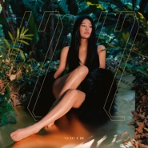

1212
============================

|  |  |
| :--: | :-- |
| [ 1212](https://emumo.xiami.com/album/2105575089) | **艺人**: [袁娅维](../index.md) **语种**: 国语 **唱片公司**: 华纳音乐 **发行时间**: 2019年12月12日 **专辑类别**: EP, 单曲 **专辑风格**: 节奏布鲁斯 R&B **播放数**: 2174 **收藏数**: 30 **评论数**: 3  |

## 简介

袁娅维TIA RAY    
1212    
&nbsp;    
“当你看到1212时，说不定你和我刚好在同一个维度，你刚好就是我的soul mate.”    
——TIA    
&nbsp;    
1212 TIA袁娅维 音乐图腾    
&nbsp;    
在符号学里，1212的数字可以代表很多信息，12月12日，12点12分，简谱音符do、re、do、re，飞往某个目的地的航班，时而代表幸运，时而成为禁忌，在不一样的文化和领域里，代表着完全不同的意义，包含着各种象征，传递着各自特有的信息。总有一些符号，对个人有特别的意义，可以以之代表。对TIA袁娅维来说，12 12，是她的音乐图腾。    
&nbsp;    
「我们目前所见所认所知的，只占宇宙的4％，暗物质占了23％，还有73％是暗能量。也就是说，我们每天都与数倍、数十倍大于肉眼可见世界、那些不可见的存在一起。还有什么比这个更浪漫，更能原谅自己的微渺吗？」    
&nbsp;    
世间万物冥冥之中自有定律，人类与之相遇，和谐共生，也不过是进入了某种互通的频率，进行着某些信息的传递与获取。有些信息，肉眼可见，有些信息，只存在于心灵感应或感官共振。一旦进入到语言无法抵达的境界，就会发现，语言，也许只是人与世界最浅薄的沟通工具。我们通过各种方式交换信息，决定了我们对世界的打开方式。所以人类发现了艺术，发现了音乐。音符、色彩、通感成为人与意境之间的灵媒，让我们跟自然万物、天籁神迹通灵。在语言的山穷水尽处，延展出别开生面。    
&nbsp;    
音乐，被公认是人类先天互通的一套“语系”。1212是TIA音乐语系里的图腾。这张专辑就是TIA想要传递给听众的信息，是她打开自己的方式，与世界沟通的方式，为了感知当中还未曾被任何语系穿透的部分。专辑里的每一首歌，都是一条来自TIA的音乐message。    
&nbsp;    
1212 Urban/Soul&nbsp;共振美学    
&nbsp;    
世界是一个和谐的矛盾统一体，它有自己的平衡，阴与阳、盈与亏、冰与火、海洋与沙漠……对峙交织，生生赓续，形成时空的壮阔。1212，一体两面，合二为一。世界和存在其间的事物，都是这种矛盾的平衡产物，相融共生。共存共灭，此消彼长，呈现出一种特有的共振美学。在TIA赴美全程参与创作和制作，历时12个月格莱美级炸裂钻石阵容精心打磨的这张专辑里，TIA袁娅维把中西音乐的表达方式完美融合在自己的频率里，同时从编曲和视觉上突出了Nature&nbsp;&amp;&nbsp;Future的共存，让我们听到的音乐和每一首歌都拥有各自的双面音乐共振美学，探讨了感情世界里的平衡感。    
《我爱》 YOU &amp; ME——我准备好去爱了；    
《呃》Complicated &amp; Simple——拒绝繁复，简单真诚；    
《不亏不欠》Love &amp; Forgive——爱过了，放下了；    
《时间不解释》Right&nbsp;&amp; Wrong——错的时间，对的你；    
《遇上爱的可是我》Less &amp; More——不多不少的爱意缱绻；    
《来》East &amp; West——东方的韵与西方的灵（soul）。    
专辑同时收录6首歌曲的伴奏，也是整合体现出一首音乐作品的一体两面。    
&nbsp;    
这次TIA袁娅维突破性地首次提出了Urban/Soul的全新音乐风格概念。把Urban和Soul这两种音乐风格结合在一起。她说音乐不该局限在原有的套路里，应该有创新和想法在里头，要为华语市场带来更多的音乐审美可选项。对她来说，Soul是自己音乐的灵魂本质，而Urban是这张专辑的血肉之身。所有声音本身就是因为振动而产生的，两种音乐风格合二为一的共振效应，让TIA袁娅维迷恋不已。为了实验自己这次的音乐设想，TIA在专辑里尝试了全新的R&amp;B、Hip-Hop、Jazz和Fusion等等领域的融合和接入，可以说这是一张很不TIA的专辑，但也是最TIA的专辑，大胆创新，引领突破，不拘一格。    
&nbsp;    
也希望你们一起，都和TIA同一频率。    
&nbsp;

## 曲目

## 评论

|  |  |  |
| :-- | :-- | :-- |
|  [虾米用户](https://emumo.xiami.com/u/360774435) 音乐是我最后的堡垒 2020-11-19 23:37 赞(0) 踩(0) | 
very good 虾米居然没有版权
 |
|  [虾米用户](https://emumo.xiami.com/u/209927892)  2020-08-26 07:39 赞(0) 踩(0) | 
国际化
 |
|  [虾米用户](https://emumo.xiami.com/u/326943759) 你好软 2020-04-04 12:20 赞(0) 踩(0) | 
amazing！
 |
