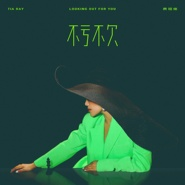

袁娅维
============================

|  |  |
| :--: | :-- |
| [ 袁娅维](https://i.xiami.com/tia) | **地区**: China 中国大陆 **风格**: 灵魂爵士 Soul Jazz, 灵魂乐 Soul, 新灵魂乐 Neo-Soul, 爵士 Jazz, 节奏布鲁斯 R&B **播放数**: 107508863 **粉丝数**: 92449 **评论数**: 663  |

## 档案

性别：女 
英文名：Tia Ray 
生 日：1984年12月12日 
出生地：湖南省怀化市洪江市安江镇 
身 高：162cm 
体 重：48kg 
星 座：射手座 
爱 好：音乐/电影/设计 
Maxim：" Live For The Day " 
流派：Jazz 
风格：Neo-Soul/R&B/Jazz/Pop/Bossa Nova 
乐队：Tha KnutZ 
粉丝名：麦芽糖 
高中毕业后，袁娅维被湖南电影学院录取，得到了学习专业表演的机会。她为了更进一步的让自己得到更多更好的机会，她决定只身一人去北京继续深造。后来，她报名参加了由北京电视台举办的流行歌场比赛。在历时一年的比赛期间，袁娅维从最初赢得本周冠军，本月冠军，到本季冠军；而后来，经过重重的努力与惊人的人气，她终于获得了最终的年度冠军！这次比赛大大的提高了Tia对自己的信心，同时也证明了她是一个具有潜力的实力派歌手。 
演唱经历 
录制《3+2夹心饼干》的广告歌 
录制《宝矿力特》的广告歌曲 
录制《金六福》广告歌曲 
与曾志伟、梁永斌一起担任深圳世界之窗综艺节目外景主持人 
北京“CD”jazz bar 驻唱 
北京“五月花”club 驻唱 
北京HYATT-red moon 驻唱 
北京WESTIN-mix jazz的驻唱 
以“无伴奏组合形式”参加北京电视台"中国人唱外国歌"比赛，获 最佳组合奖 
参与由“天中文化有限公司”录制并发行的抗“非典”歌曲《因为爱》 
以无伴奏组合形式录制单曲《你知道我爱你》，并随原创专辑《合拾》由“天中文化有限公司”同步发行 
2004年-2006年 
创建以中国民乐结合POP/R&B风格的乐队 
签约日本Unimitied唱片公司，并赴东京游学 
参加日本Unimitied唱片公司主办的日本2005年业内新年音乐会 
与潘玮柏合作录制《伊利优酸乳》的广告主题曲 
与孔令奇合作录制《coco banana club》的广告歌曲 
担任北京国际MIDI音乐节Hip-Hop表演组的演唱嘉宾 
担任北京MIDI爵士音乐节Sondia爵士小组的现场和声 
曾任歌，董燕妮、夏飞雪、Erik罗、叶熙祺，等多位内地歌手专辑的监唱及和音编唱 
曾为橙天娱乐担任其唱片部声乐老师 
曾为派格太合传媒担任其唱片部声乐老师 
为歌手江凯文录制单曲和声 
2007年-2009年 
担任谢晓东2007年单曲的和声编写及配唱 
担任胡杨林2007年单曲的和声编写及配唱 
曾任江一燕个人专辑中多首歌曲的监唱及和声录制, 并担任其声乐老师 
担任”大国文化”（Music Nation）歌手朱婧07新专辑2首歌曲的“和音编”写及“配唱” 
担任胡杨林2008年新曲的和声编写及配唱 
担任马天宇2008年全新单曲《依然在一起》的和声编写及配唱 
录制电视剧《舞台姐妹》的主题曲 
与张亚东合作为张靓颖《update》专辑歌曲《Yalta》、《Your Song》、《日落大道》的创作及demo录制 
编写及录制容祖儿专辑《怎么走》的和声 
参与胡彦斌《音乐让我说爱你》的录制 
参与胡彦斌2008年奥运歌曲《信念》的和音录制 
担任（澳洲籍）DJ- Chozie，2007年专辑《walking backwards》中《boogie sugar》、《making me high》、《funky disco love》、《next to me》4首歌曲的创作及录制 
为外籍HIP-HOP乐队“隐藏” ，创作及录制其新专辑中的《do that thang》 
担任2007年MOTO(摩托罗拉)年度亚太会议的表演嘉宾 
担任2007年11月担任于香港举办的“加拿大华人协会”的年度颁奖晚会表演嘉宾 
组建Soul/R&B乐队 “Soul Side” 
与乐队Soul Side担任2008年8月中国鼓手节嘉宾 
担任2008年MOTO(摩托罗拉)亚太会议的表演嘉宾 
担任2008年日本丰田汽车 Lexus的亚太区颁奖会议的表演嘉宾 
录制并创作2008年李宁冬季品牌SHOW的主题音乐 
参与录制2008年抗震救灾歌曲 《爱把爱传递》 
担任2008年5月 “Music Matters”在香港举办的全亚音乐会议的opening表演嘉宾 
出席2008/12/20号在“北京奥体中心”举办的张亚东作品音乐会 
演唱了其个人创作专辑《潜流》中的《big finale》、《sprite in the world》 
录制的《Sweet Things》收录于张亚东2009年《潜流》专辑中 
参与2008年《奥运会开幕式》主题曲的小样演唱 
与“常石磊”录制的2008北京奥运会开幕式《我和你》R&B版本收录于“陈其刚”奥运会开幕式作品专辑中并与2009年发行了珍藏版本 
录制纪念5.12大地震励志电影《生死时刻》的插曲《爱的默契》 
2010年-2012年 
2009年3月参与张靓颖与日本东京举办的日本首发音乐会的表演 
2009年4月 担任《百事极度》北京首发会的表演嘉宾 
2009年5月1日担任成都举行的“热播音乐节”的表演嘉宾2010年-2012年 
2011年6月19日 担任 “2011Art On Ice 冰舞上海 - 朗朗和他的冠军伙伴们”冰舞盛典的表演嘉宾 
中国好声音袁娅维(17张) 
2011年10月12日 担任长沙举行的长沙爵士音乐节的表演嘉宾 
2011年10月15日 担任上海举行的上海爵士音乐节的表演嘉宾 
2011年11月3日 你呢（Lady Antebellum need you now 中文版）--- 袁娅维 百度ting正版发布 
2011年11月18日 2011红牛新能量音乐计划巡演深圳站的表演嘉宾 
2012年1月11日 jzclub The Knutz专场 
2012年10月20日 担任上海举行的上海爵士音乐节的表演嘉宾 
2012年12月12日 袁娅维“重生”音乐会 
2012年末 参加中国好声音对战最强音 
2013年4月26日 改编叶倩文《曾经心痛》获一致好评。

## 专辑

| 名称 | 语种 | 唱片公司 | 发行时间 | 专辑类别 | 专辑风格 |
| :--: | :-- | :-- | :-- | :-- | :-- |
| [ 嘘！](./albums/5022080958.md) | 国语 | 网易云音乐 | 2020年12月01日 | EP, 单曲 |  |
| [ TME live:袁娅维"Ready For Love"线上音乐会](./albums/2106059637.md) | 国语 | 制作家 | 2020年05月27日 | 现场专辑 | 流行 Pop |
| [ 我只在乎你I Only Care about You](./albums/5020604773.md) | 国语 | 制作家 | 2020年05月15日 | EP, 单曲 |  |
| [ 1212](./albums/2105575089.md) | 国语 | 华纳音乐 | 2019年12月12日 | EP, 单曲 | 节奏布鲁斯 R&B |
| [ 为你而来For You](./albums/2105707583.md) | 国语 | 完美青春OST | 2019年12月10日 | EP, 单曲 |  |
| [ 不亏不欠](./albums/2105469783.md) | 国语 | 华纳音乐 | 2019年11月15日 | EP, 单曲 |  |
| [ 我们](./albums/2105575064.md) | 国语 | 智慧大狗, 网易云音乐, 环球唱片 | 2019年10月05日 | EP, 单曲 |  |
| [ Trust Myself](./albums/2105159538.md) | 英语 | 华纳音乐 | 2019年06月21日 | EP, 单曲 |  |
| [ 来电狂响](./albums/2104419627.md) | 国语 | 新丽传媒 | 2018年12月24日 | EP, 单曲 | 国语流行 Mandarin Pop |
| [ 左右风潮Trendsetter](./albums/2104398915.md) | 国语 | 华纳音乐 | 2018年12月16日 | EP, 单曲 | 国语流行 Mandarin Pop |
| [ Moonlight](./albums/2103901744.md) | 英语 | 华纳音乐 | 2018年08月07日 | EP, 单曲 | 流行说唱 Pop Rap, 流行 Pop |
| [ You Are My Only One](./albums/2103822305.md) | 国语 | 华纳音乐 | 2018年07月18日 | EP, 单曲 | 国语流行 Mandarin Pop |
| [ TIARA](./albums/2103691101.md) | 国语 | 华纳音乐 | 2018年04月20日 | 录音室专辑 | 灵魂乐 Soul, 新灵魂乐 Neo-Soul |
| [ 无所畏惧](./albums/2103499107.md) | 国语 | 自在天浩 | 2018年01月24日 | EP, 单曲 | 国语流行 Mandarin Pop |
| [ 有料](./albums/2103472130.md) | 国语 | 独立发行 | 2017年12月19日 | EP, 单曲 |  |
| [ 御龙将军台](./albums/2102973891.md) | 国语 | 华纳音乐 | 2017年12月14日 | EP, 单曲 |  |
| [ 说散就散](./albums/2102971699.md) | 国语 | 华纳音乐 | 2017年12月10日 | EP, 单曲 | 国语流行 Mandarin Pop |
| [ Roll](./albums/2102876169.md) | 国语 | 华纳音乐 | 2017年10月20日 | EP, 单曲 | 新灵魂乐 Neo-Soul |
| [ Dear Friend](./albums/2102876178.md) | 国语 | 华纳音乐 | 2017年10月20日 | EP, 单曲 | 新灵魂乐 Neo-Soul, 灵魂乐 Soul |
| [ 问情](./albums/2102808231.md) | 国语 | 华纳音乐 | 2017年08月04日 | EP, 单曲 | 灵魂爵士 Soul Jazz, 新灵魂乐 Neo-Soul |
| [ 流花 Love Herby](./albums/2102657400.md) | 英语 | 华纳音乐 | 2016年11月29日 | EP, 单曲 |  |
| [ 阿楚姑娘](./albums/2100316506.md) | 国语 | 华纳音乐 | 2016年03月28日 | EP, 单曲 |  |
| [ 是否](./albums/2100296960.md) | 国语 | 华纳音乐 | 2016年03月14日 | EP, 单曲 |  |
| [ 长腿叔叔](./albums/2102831778.md) | 国语 | 华纳音乐 | 2016年01月11日 | EP, 单曲 |  |
| [ 绽放Bloom](./albums/622529728.md) | 国语 | 华纳音乐 | 2015年01月05日 | EP, 单曲 |  |
| [ T.I.A.](./albums/985554959.md) | 国语 | 华纳音乐 | 2014年11月18日 | 录音室专辑 | 流行灵魂乐 Pop Soul, 新灵魂乐 Neo-Soul, 国语流行 Mandarin Pop |
| [ 点亮梦想](./albums/1509307200.md) | 国语 | 捷豹路虎 | 2014年08月28日 | EP, 单曲 | 国语流行 Mandarin Pop |
| [ 你呢](./albums/483461.md) | 国语 | 金牌大风 | 2011年11月03日 | EP, 单曲 |  |

## 评论

|  |  |  |
| :-- | :-- | :-- |
|  [虾米用户](https://emumo.xiami.com/u/358104299) 悲观的唯心存在现实解构虚... 2021-01-06 02:50 赞(0) 踩(0) | 
45349
 |
|  [虾米用户](https://emumo.xiami.com/u/332658854) 人人平安！ 2020-12-13 04:18 赞(0) 踩(0) | 
一岁一礼 一寸欢喜
 |
|  [虾米用户](https://emumo.xiami.com/u/429747326) 勇往直前 2020-12-12 11:57 赞(0) 踩(0) | 
生日快乐
 |
|  [虾米用户](https://emumo.xiami.com/u/299567427)  2020-12-12 11:42 赞(0) 踩(0) | 
生日快乐！
 |
|  [虾米用户](https://emumo.xiami.com/u/344885270)  2020-12-12 08:22 赞(1) 踩(0) | 
打卡爱豆生日，开心~
 |
|  [虾米用户](https://emumo.xiami.com/u/43065773) music and su... 2020-07-01 23:11 赞(0) 踩(0) | 
她真的超棒
 |
|  [虾米用户](https://emumo.xiami.com/u/401651241)  2020-06-19 00:22 赞(0) 踩(0) | 
她是谁？哦漏 袁娅维
 |
|  [虾米用户](https://emumo.xiami.com/u/43065773) music and su... 2020-03-30 00:38 赞(0) 踩(0) | 
还在想为啥这么优秀却不太火 原来是走了好多路... 喜欢你！
 |
|  [虾米用户](https://emumo.xiami.com/u/285538664) 勇敢去做特别的人 2020-03-29 14:08 赞(0) 踩(0) | 
相信你是那么棒，懂你的人自会欣赏你   
 |
|  [虾米用户](https://emumo.xiami.com/u/8363074)  2020-02-15 02:02 赞(1) 踩(0) | 
我想问为什么都听不了 
 |
|  [虾米用户](https://emumo.xiami.com/u/325243557)   2019-12-12 10:05 赞(1) 踩(0) | 
6年了⋯生日快樂身體健康青春常豬 
 |
|  [虾米用户](https://emumo.xiami.com/u/43037629) Tia JIE 2019-12-12 10:04 赞(0) 踩(0) | 
Tia 生日快乐！喜欢唱歌 喜欢你的歌 一起努力
 |
|  [虾米用户](https://emumo.xiami.com/u/338124077) 魑魅魍魉 2019-12-12 10:03 赞(0) 踩(0) | 
生日快乐
 |
|  [虾米用户](https://emumo.xiami.com/u/106342996) 我还没想好要写什么... 2019-12-12 10:02 赞(0) 踩(0) | 
生日快乐！！！！
 |
|  [虾米用户](https://emumo.xiami.com/u/319688150) 愿经典不被遗忘 2019-12-03 01:39 赞(0) 踩(0) | 

 |
|  [虾米用户](https://emumo.xiami.com/u/10000610) 有人造屋 有人绣花 有人... 2019-11-27 00:31 赞(0) 踩(0) | 
很早就喜欢你啦，加油鸭！
 |
|  [虾米用户](https://emumo.xiami.com/u/4790427)  2019-11-24 19:22 赞(1) 踩(0) | 
爱你，亲爱滴
 |
|  [虾米用户](https://emumo.xiami.com/u/358104299) 悲观的唯心存在现实解构虚... 2019-10-25 13:02 赞(1) 踩(0) | 
13766
 |
|  [虾米用户](https://emumo.xiami.com/u/28286172)  2019-05-24 03:11 赞(0) 踩(0) | 
都2019年5月底了，还没有天鹅之歌？！
 |
|  [虾米用户](https://emumo.xiami.com/u/116890038) 听歌就好好听 2019-05-08 01:48 赞(0) 踩(0) | 
爱剔牙！！
 |
|  [虾米用户](https://emumo.xiami.com/u/15577171) 不同的心境，不同的音乐～... 2019-05-05 19:54 赞(0) 踩(0) | 
同龄人呢～～
 |
|  [虾米用户](https://emumo.xiami.com/u/293692544) 你敢给我说话吗？我咬你 2019-04-17 05:19 赞(1) 踩(0) | 
好听
 |
|  [虾米用户](https://emumo.xiami.com/u/236205995)  2019-04-02 22:40 赞(1) 踩(0) | 
也不怎么样嘛！我蔡徐坤鹿晗吴亦凡表示没我们火 
 |
|  [虾米用户](https://emumo.xiami.com/u/411956802)  2019-03-10 22:13 赞(3) 踩(0) | 
用心做音乐的好歌手
 |
|  [虾米用户](https://emumo.xiami.com/u/244684431) 共同渡过:无需要太多: 2019-03-10 14:15 赞(2) 踩(0) | 
袁娅维。今天是个大发现。
 |
|  [虾米用户](https://emumo.xiami.com/u/352464828) 我还没想好要写什么... 2019-02-10 13:49 赞(1) 踩(0) | 
不错不错
 |
|  [虾米用户](https://emumo.xiami.com/u/58817690) mmmnnnvvvxxx 2019-02-01 15:48 赞(1) 踩(0) | 
┏┳━━━━━━━━━┓ ┃┃█████████┃ ┣┫████┏━━┓█┃ ┃┃████┃&nbsp; 真&nbsp; ┃█┃ ┣┫████┃&nbsp; 独&nbsp; ┃█┃ ┃┃████┃&nbsp; 秀&nbsp; ┃█┃ ┣┫████┃&nbsp; 传&nbsp; ┃■┃ ┃┃████┗━━┛█┃ ┣┫█████████┃ ┃┃1个赞起售  ████┃ ┗教你如何秀┻━━━━┛
 |
|  [虾米用户](https://emumo.xiami.com/u/411211110) 只愿在风口无思无虑 2019-01-07 08:21 赞(1) 踩(0) | 
说散就散找不到啊大神
 |
|  [虾米用户](https://emumo.xiami.com/u/49664054) 人生一世，草木一春；轰轰... 2019-01-05 15:16 赞(1) 踩(0) | 
图呢？？？
 |
|  [虾米用户](https://emumo.xiami.com/u/334623609)  2018-12-13 08:30 赞(1) 踩(0) | 
生日快乐，天天开心！ 
 |
|  [虾米用户](https://emumo.xiami.com/u/355089303) 我来虾米多少天了?！ 2018-12-12 12:25 赞(1) 踩(0) | 
嗨皮波斯带
 |
|  [虾米用户](https://emumo.xiami.com/u/338508078) 时光清浅，许你朝阳 2018-12-12 10:36 赞(3) 踩(0) | 
娅维姐，《说散就散》让我真正的喜欢上了你，然后《阿楚姑娘》让我爱你爱的无法自拔，哈哈。祝天天开心，事业更加有成！
 |
| ⇒ |  [虾米用户](https://emumo.xiami.com/u/10758130)  2019-09-13 11:18 赞(0) 踩(0) | 
还有《长腿叔叔》
 |
| ⇒ |  [虾米用户](https://emumo.xiami.com/u/338508078) 时光清浅，许你朝阳 2019-09-13 16:04 赞(0) 踩(0) | 
<q><b>莹说：</b></q>
 |
|  [虾米用户](https://emumo.xiami.com/u/15670731) 相信自己。 2018-12-12 10:04 赞(2) 踩(0) | 
娅维你好，happy  birthday！   
 |
|  [虾米用户](https://emumo.xiami.com/u/258160864) 张 2018-12-12 10:04 赞(1) 踩(0) | 
祝您生日快乐，心想事成，事事如意，开开心心。
 |
|  [虾米用户](https://emumo.xiami.com/u/181374316)  2018-12-12 10:01 赞(1) 踩(0) | 
生日快乐
 |
|  [虾米用户](https://emumo.xiami.com/u/321012383) 儿子一天天的长大！！！ 2018-12-12 10:00 赞(1) 踩(0) | 
祝老袁生日快乐！
 |
|  [虾米用户](https://emumo.xiami.com/u/278193) 展翅高飞，在音乐里翱翔。 2018-12-08 06:46 赞(1) 踩(0) | 
说散就散，好，祝福！
 |
|  [虾米用户](https://emumo.xiami.com/u/328067016) 近我这甜   远我者猪 ... 2018-11-16 19:38 赞(1) 踩(0) | 
像悲伤逆流成河里易瑶的妈妈
 |
|  [虾米用户](https://emumo.xiami.com/u/328067016) 近我这甜   远我者猪 ... 2018-11-16 19:37 赞(1) 踩(0) | 
咋感觉
 |
|  [虾米用户](https://emumo.xiami.com/u/266911669)  2018-11-06 16:53 赞(1) 踩(0) | 
很喜欢你的声音和你的歌
 |
|  [虾米用户](https://emumo.xiami.com/u/359334952)  2018-09-25 11:54 赞(1) 踩(0) | 
你是袁娅维?
 |
|  [虾米用户](https://emumo.xiami.com/u/354125713)  2018-09-11 21:31 赞(1) 踩(0) | 
lovely Tia
 |
|  [虾米用户](https://emumo.xiami.com/u/354125713)  2018-09-11 21:29 赞(1) 踩(0) | 
袁雅为最可爱喜欢他，一早在好歌声，我是歌手已经看中他，终于她跑出，他是一种中国新的，流行音乐女王
 |
|  [虾米用户](https://emumo.xiami.com/u/277957297) 有你就好…… 2018-09-05 09:32 赞(2) 踩(0) | 
爱上说散就散！ 谢谢你 ，唱出了这么烦人的歌！可我就是忘不了&amp;hellip;&amp;hellip;
 |
|  [虾米用户](https://emumo.xiami.com/u/377618480) 五月天。 2018-09-03 00:32 赞(1) 踩(0) | 
听完你的说散就散，我就真的说散就散了~
 |
|  [虾米用户](https://emumo.xiami.com/u/309277046) 在音乐深处与世隔绝 2018-08-26 16:15 赞(3) 踩(0) | 
人美歌靓
 |
|  [虾米用户](https://emumo.xiami.com/u/10811234) Love Mucic 2018-08-24 22:40 赞(1) 踩(0) | 
赞
 |
|  [虾米用户](https://emumo.xiami.com/u/400119353)  2018-08-18 01:27 赞(2) 踩(0) | 
马上就爱上了
 |
|  [虾米用户](https://emumo.xiami.com/u/296747958) 曾经一段感情自己，一直处... 2018-08-14 22:25 赞(2) 踩(0) | 
以后多多收听
 |
|  [虾米用户](https://emumo.xiami.com/u/296747958) 曾经一段感情自己，一直处... 2018-08-14 22:24 赞(2) 踩(0) | 
镜子里写满你，而你却不知我身边。
 |
|  [虾米用户](https://emumo.xiami.com/u/358394780)  2018-08-14 18:35 赞(2) 踩(0) | 
去听了潘玮柏上海站演唱会 听到女声那一刻惊喜了 找了人半天看到了一身黑衣的你 酷 帅 霸气 声音好听 震撼    意外之喜
 |
|  [虾米用户](https://emumo.xiami.com/u/340801388)  2018-08-12 22:48 赞(0) 踩(0) | 
一个比赛无所谓输赢 主要很开心现在喜欢看的片子都是你唱的 这很重要
 |
|  [虾米用户](https://emumo.xiami.com/u/340801388)  2018-08-12 22:47 赞(1) 踩(0) | 
看中国好声音得时候就很喜欢她
 |
|  [虾米用户](https://emumo.xiami.com/u/35062303) 一个喜欢唱歌的小女孩 2018-08-12 12:05 赞(1) 踩(0) | 
又来听歌了 就是喜欢！
 |
|  [虾米用户](https://emumo.xiami.com/u/257922088)  2018-08-09 22:07 赞(0) 踩(0) | 
我超级喜欢这首歌，手机来电铃声都是
 |
|  [虾米用户](https://emumo.xiami.com/u/51519513)  2018-08-09 17:49 赞(0) 踩(0) | 
袁娅维的代表作越来越多了，真诚而充满细腻的情感
 |
|  [虾米用户](https://emumo.xiami.com/u/378281818)  2018-08-07 20:23 赞(0) 踩(0) | 
袁娅维，非常棒
 |
|  [虾米用户](https://emumo.xiami.com/u/356399954)  2018-08-07 17:30 赞(1) 踩(0) | 
欧美唱腔太棒辣
 |
|  [虾米用户](https://emumo.xiami.com/u/10857967) 我～就是我！不喜勿進！ 2018-08-06 22:11 赞(0) 踩(0) | 
封面丧心病狂啊
 |
|  [虾米用户](https://emumo.xiami.com/u/10857967) 我～就是我！不喜勿進！ 2018-08-06 22:10 赞(1) 踩(0) | 
潘玮柏果然是给我们又一个大惊喜，这次的新单曲找她合作了
 |
|  [虾米用户](https://emumo.xiami.com/u/379407138)  2018-08-04 18:31 赞(2) 踩(0) | 
《说散就散》真的很好听！娅娅吧这歌唱的很洒脱！还有一些小伤感！就算没经历过的人听了也会有一丝在爱情中挣扎过的伤感！ 
 |
|  [虾米用户](https://emumo.xiami.com/u/328531470) 长安街那么长，从头走到尾... 2018-08-03 23:50 赞(1) 踩(0) | 
原来娅维就在我家附近出身的，老乡啊 
 |
| ⇒ |  [虾米用户](https://emumo.xiami.com/u/354125713)  2018-09-11 21:30 赞(0) 踩(0) | 
我做湖南人都觉得骄傲，因为软硬，袁娅维，也是湖南吃辣椒的。      
 |
|  [虾米用户](https://emumo.xiami.com/u/377034573) 我还没想好要写什么... 2018-08-03 14:43 赞(0) 踩(0) | 
很喜欢你的歌
 |
|  [虾米用户](https://emumo.xiami.com/u/375353058)  2018-07-29 21:26 赞(0) 踩(0) | 
啦啦啦好听   一生等你
 |
|  [虾米用户](https://emumo.xiami.com/u/379866328)  2018-07-27 22:27 赞(0) 踩(0) | 
我很喜欢你的歌。 
 |
|  [虾米用户](https://emumo.xiami.com/u/317200180)  2018-07-23 12:09 赞(0) 踩(0) | 
你好，袁娅维，
 |
|  [虾米用户](https://emumo.xiami.com/u/2355861) 做只狐狸 2018-07-19 01:08 赞(1) 踩(0) | 
真的太会唱了！喜欢。
 |
|  [虾米用户](https://emumo.xiami.com/u/21427752)  2018-07-17 18:16 赞(0) 踩(0) | 
太好听，每次听都会想起她！
 |
|  [虾米用户](https://emumo.xiami.com/u/376450080)  2018-07-13 20:06 赞(0) 踩(0) | 
好听
 |
|  [虾米用户](https://emumo.xiami.com/u/377896203) 我还没想好要写什么... 2018-07-07 21:42 赞(0) 踩(0) | 
這首歌真的越聽越喜歡
 |
|  [虾米用户](https://emumo.xiami.com/u/309731124) 啦啦啦 2018-07-05 16:15 赞(0) 踩(0) | 
很美哒
 |
|  [虾米用户](https://emumo.xiami.com/u/377652680)  2018-07-05 07:57 赞(0) 踩(0) | 
   
 |
|  [虾米用户](https://emumo.xiami.com/u/285946760)  2018-07-03 08:36 赞(0) 踩(0) | 
     
 |
|  [虾米用户](https://emumo.xiami.com/u/2407392) 爱音乐爱生活爱梦想 2018-06-27 09:31 赞(0) 踩(0) | 
歌唱的非常好，但是简介整的非常辣鸡。活动并不是越多越好，有几个经典的即可。
 |
|  [虾米用户](https://emumo.xiami.com/u/335870893)  2018-06-20 22:51 赞(0) 踩(0) | 
人美音甜，
 |
|  [虾米用户](https://emumo.xiami.com/u/42044471)  2018-06-06 18:22 赞(1) 踩(0) | 
听了心里难受
 |
|  [虾米用户](https://emumo.xiami.com/u/494142)  2018-06-06 14:23 赞(2) 踩(0) | 
生错年代的歌手，在这个娱乐至上的年代里，歌手的唱功越来越不被重视。放90年代，袁娅维无疑会成为一个成功的唱片歌手，在乐坛留下自己的位置。但目前这个时间段，我觉得她仍然只是个怀才不遇的好歌手，期待后面有爆发。个人目前华语歌手里新声代最喜欢的歌手。
 |
|  [虾米用户](https://emumo.xiami.com/u/202617181) 从来不需要想起，永远也不... 2018-06-05 22:14 赞(0) 踩(0) | 
一直喜欢你，一直关注你，一直听你的歌，伴随我有过日日夜夜！
 |
|  [虾米用户](https://emumo.xiami.com/u/282422255)  2018-05-29 21:33 赞(1) 踩(0) | 
为什么我花2元下载了，不久又不能听了，叫再续费？
 |
|  [虾米用户](https://emumo.xiami.com/u/351592450)  2018-05-29 13:10 赞(1) 踩(0) | 
我正在学唱你的歌曲呢，都要学会
 |
|  [虾米用户](https://emumo.xiami.com/u/341274121)  2018-05-28 03:00 赞(2) 踩(0) | 
因为这首歌，去看了前任，因为这首歌喜欢上了你，有故事的人看前任会哭，单曲循环说散就散的人都是感情不如意的人
 |
|  [虾米用户](https://emumo.xiami.com/u/309064929)  2018-05-27 20:45 赞(1) 踩(0) | 
说散就散 太棒了      
 |
|  [虾米用户](https://emumo.xiami.com/u/259852286)  2018-05-25 21:50 赞(1) 踩(0) | 

 |
|  [虾米用户](https://emumo.xiami.com/u/305656825) Bn1296 2018-05-23 15:12 赞(0) 踩(0) | 
别人用嘴唱，你用的是全部，包括肢体，心，情，头脑，，，，你真真是一位对音乐负责任的灵魂歌手，我没文化，不善表达，喜欢你歌的大哥哥 
 |
|  [虾米用户](https://emumo.xiami.com/u/368480368)  2018-05-22 04:20 赞(0) 踩(0) | 
With love from Australia.
 |
|  [虾米用户](https://emumo.xiami.com/u/368679238)  2018-05-18 19:04 赞(1) 踩(0) | 
祝音乐越做越好。
 |
|  [虾米用户](https://emumo.xiami.com/u/347299411)  2018-05-18 17:55 赞(1) 踩(0) | 
喜欢听，天天都在听
 |
|  [虾米用户](https://emumo.xiami.com/u/304093331)  2018-05-16 23:51 赞(0) 踩(0) | 
你好
 |
|  [虾米用户](https://emumo.xiami.com/u/7632447)  2018-05-15 23:27 赞(0) 踩(0) | 
我搜tia为毛出来的是这个人？？？？  
 |
|  [虾米用户](https://emumo.xiami.com/u/219490130) Be relax. 2018-05-14 22:57 赞(0) 踩(0) | 
Tia嗓子和唱歌风格❤️
 |
|  [虾米用户](https://emumo.xiami.com/u/356789957)  2018-05-12 15:07 赞(0) 踩(0) | 
feitin
 |
|  [虾米用户](https://emumo.xiami.com/u/361855589)  2018-05-06 16:17 赞(1) 踩(0) | 
太好听了
 |
|  [虾米用户](https://emumo.xiami.com/u/73857918) 在黎明之前 2018-05-03 00:37 赞(0) 踩(0) | 
早就知道Tia了，因为虾米还没大换血的时候，就经常给我推她的卑鄙，后来也慢慢知道她了
 |
| ⇒ |  [虾米用户](https://emumo.xiami.com/u/365836648)  2018-05-11 14:47 赞(0) 踩(0) | 
我爱你
 |
|  [虾米用户](https://emumo.xiami.com/u/359791397)  2018-04-22 19:15 赞(0) 踩(0) | 
嗯嗯
 |
|  [虾米用户](https://emumo.xiami.com/u/359791397)  2018-04-22 19:14 赞(0) 踩(0) | 
好听
 |
|  [虾米用户](https://emumo.xiami.com/u/340287905)  2018-04-20 20:31 赞(0) 踩(0) | 
喜欢你的风格
 |
|  [虾米用户](https://emumo.xiami.com/u/321980484) 我还没想好要写什么... 2018-04-19 03:29 赞(0) 踩(0) | 
有前途
 |
|  [虾米用户](https://emumo.xiami.com/u/334951275)  2018-04-17 19:05 赞(0) 踩(0) | 
听你的歌曲 抒情 放松 很好
 |
|  [虾米用户](https://emumo.xiami.com/u/358253007)  2018-04-14 23:43 赞(1) 踩(0) | 
没事
 |
|  [虾米用户](https://emumo.xiami.com/u/352379552)  2018-04-14 21:55 赞(1) 踩(0) | 
喜欢你的歌 
 |
|  [虾米用户](https://emumo.xiami.com/u/257958578)  2018-04-14 15:59 赞(3) 踩(0) | 
音线漂亮极了！
 |
|  [虾米用户](https://emumo.xiami.com/u/39867445)  2018-04-09 15:17 赞(1) 踩(0) | 
这首歌在电影院听的时候把我唱哭了
 |
|  [虾米用户](https://emumo.xiami.com/u/244990099) 虾米改变我的心情，指导我... 2018-04-08 06:22 赞(1) 踩(0) | 
加油！袁老师，永远支持您 
 |
|  [虾米用户](https://emumo.xiami.com/u/356908517)  2018-04-05 22:05 赞(3) 踩(0) | 
我花两元买这首《说散就散》怎么没有让我下载呢
 |
|  [虾米用户](https://emumo.xiami.com/u/356056400)  2018-04-05 13:41 赞(1) 踩(0) | 
永远支持你，维维姐
 |
|  [虾米用户](https://emumo.xiami.com/u/356853451)  2018-04-05 05:12 赞(0) 踩(0) | 
laguhokkien
 |
|  [虾米用户](https://emumo.xiami.com/u/355313634) 我还没想好要写什么...... 2018-04-03 20:25 赞(1) 踩(0) | 
喜欢你的声音
 |
|  [虾米用户](https://emumo.xiami.com/u/325822952)  2018-04-02 19:16 赞(0) 踩(0) | 
你的歌声特别好听
 |
|  [虾米用户](https://emumo.xiami.com/u/314268504) 不想当厨子的医生，不是个... 2018-04-02 08:43 赞(0) 踩(0) | 
第一次听的时候，把我唱哭了 
 |
|  [虾米用户](https://emumo.xiami.com/u/334935388)  2018-03-30 08:08 赞(1) 踩(0) | 
好听
 |
|  [虾米用户](https://emumo.xiami.com/u/237167304)  2018-03-27 14:06 赞(4) 踩(0) | 
从好声音一直在关注，很感谢她们那一批好声音学员和导师  ，
 |
|  [虾米用户](https://emumo.xiami.com/u/354896443)  2018-03-20 17:49 赞(0) 踩(0) | 
人的的静我我我我点SY！人冫小、了一一？
 |
|  [虾米用户](https://emumo.xiami.com/u/335681705) 温柔带给你自尊 2018-03-18 16:38 赞(0) 踩(0) | 
pink u！！
 |
|  [虾米用户](https://emumo.xiami.com/u/335681705) 温柔带给你自尊 2018-03-18 16:37 赞(1) 踩(0) | 
催新专来了 
 |
|  [虾米用户](https://emumo.xiami.com/u/333400571) 我就是我不一样的烟火 2018-03-18 14:04 赞(0) 踩(0) | 
come on！加油！嘻嘻
 |
|  [虾米用户](https://emumo.xiami.com/u/333400571) 我就是我不一样的烟火 2018-03-18 14:03 赞(1) 踩(0) | 
very good
 |
|  [虾米用户](https://emumo.xiami.com/u/202148480) Overdose。 2018-03-17 16:20 赞(2) 踩(0) | 
华语乐坛必须有她的一席之地
 |
|  [虾米用户](https://emumo.xiami.com/u/352983432) 兔子急了也咬人 2018-03-08 18:35 赞(0) 踩(0) | 
好听
 |
|  [虾米用户](https://emumo.xiami.com/u/352817357)  2018-03-07 17:08 赞(0) 踩(0) | 
唱的好
 |
|  [虾米用户](https://emumo.xiami.com/u/352998663)  2018-03-05 12:59 赞(0) 踩(0) | 
音乐好听
 |
|  [虾米用户](https://emumo.xiami.com/u/334935388)  2018-03-05 08:01 赞(0) 踩(0) | 
好听
 |
|  [虾米用户](https://emumo.xiami.com/u/327503514) 在你身边太久了，我居然忘... 2018-03-04 02:14 赞(2) 踩(0) | 
唱歌的声音很干净，也很有感情。
 |
|  [虾米用户](https://emumo.xiami.com/u/337152336) 带着好歌，寻找知音。 2018-03-03 22:53 赞(1) 踩(0) | 
华语音乐，女声灵魂乐，奥义所在。
 |
|  [虾米用户](https://emumo.xiami.com/u/352579371)  2018-02-27 21:28 赞(0) 踩(0) | 
521
 |
|  [虾米用户](https://emumo.xiami.com/u/307407589) 不忘初心. 2018-02-26 20:36 赞(0) 踩(0) | 
加油
 |
|  [虾米用户](https://emumo.xiami.com/u/335681705) 温柔带给你自尊 2018-02-25 20:59 赞(0) 踩(0) | 
前几天买了你的第一张专辑，今天收到了 
 |
|  [虾米用户](https://emumo.xiami.com/u/351991098)  2018-02-23 20:41 赞(1) 踩(0) | 
好听
 |
|  [虾米用户](https://emumo.xiami.com/u/334935388)  2018-02-17 17:10 赞(1) 踩(0) | 
好听
 |
|  [虾米用户](https://emumo.xiami.com/u/271169707) 找个爱人的啊 2018-02-09 06:51 赞(1) 踩(0) | 
好听你好棒哒
 |
|  [虾米用户](https://emumo.xiami.com/u/274267088)  2018-01-29 04:08 赞(1) 踩(0) | 
从真实开始被圈成路人粉&amp;hellip;&amp;hellip;
 |
|  [虾米用户](https://emumo.xiami.com/u/303506160) 因为我对你爱的深沉 2018-01-28 00:11 赞(1) 踩(0) | 
嘿呦
 |
|  [虾米用户](https://emumo.xiami.com/u/252096618)  2018-01-27 01:14 赞(1) 踩(0) | 
谢谢有你 
 |
|  [虾米用户](https://emumo.xiami.com/u/250480187) 喜欢你是我的自由，放弃了... 2018-01-24 22:45 赞(1) 踩(0) | 
期待您的创作，声线很好听&amp;hellip;&amp;hellip;
 |
|  [虾米用户](https://emumo.xiami.com/u/341282499)  2018-01-24 21:16 赞(0) 踩(0) | 
说散就散
 |
|  [虾米用户](https://emumo.xiami.com/u/308050571)  2018-01-24 20:38 赞(0) 踩(0) | 
爱你
 |
|  [虾米用户](https://emumo.xiami.com/u/285342803) 从今天开始爱上音乐 2018-01-24 08:25 赞(1) 踩(0) | 
在旅行中忘记
 |
|  [虾米用户](https://emumo.xiami.com/u/327539868)  2018-01-21 21:07 赞(2) 踩(0) | 
说散就散非常好听唱的好歌词也好。
 |
|  [虾米用户](https://emumo.xiami.com/u/243269640)  2018-01-19 19:38 赞(1) 踩(0) | 
催人泪下，我相信时间是最好的良药
 |
|  [虾米用户](https://emumo.xiami.com/u/210919109)  2018-01-19 03:45 赞(15) 踩(0) | 
说散就散，唱的真不错，歌也不错～～只是我越听越难过～～因为成长，我们逼不得已要习惯。。
 |
|  [虾米用户](https://emumo.xiami.com/u/344156136) 音乐是我的唯一的爱~~ 2018-01-18 21:56 赞(0) 踩(0) | 
你是我的偶像  我永远支持你
 |
|  [虾米用户](https://emumo.xiami.com/u/345316560)  2018-01-18 18:09 赞(0) 踩(0) | 
这个声音好听，歌词写得很好
 |
|  [虾米用户](https://emumo.xiami.com/u/325654004) 最纯正的音乐尽在虾米！ 2018-01-14 12:22 赞(0) 踩(0) | 
端起一杯酒细细的听...
 |
|  [虾米用户](https://emumo.xiami.com/u/344560732) 我是00后 2018-01-13 14:49 赞(1) 踩(0) | 
可以
 |
|  [虾米用户](https://emumo.xiami.com/u/340546652)  2018-01-12 14:09 赞(0) 踩(0) | 
管住
 |
|  [虾米用户](https://emumo.xiami.com/u/29907134)  2018-01-12 06:57 赞(1) 踩(0) | 
很好听的歌，声音很有味道
 |
|  [虾米用户](https://emumo.xiami.com/u/343721153)  2018-01-09 19:01 赞(0) 踩(0) | 
好好
 |
|  [虾米用户](https://emumo.xiami.com/u/321375153) 离别伤感，何曾怀旧 2018-01-09 11:38 赞(0) 踩(0) | 
某人推荐。。
 |
|  [虾米用户](https://emumo.xiami.com/u/343731192)  2018-01-08 20:44 赞(0) 踩(0) | 
第一次听你的歌，赞
 |
|  [虾米用户](https://emumo.xiami.com/u/3758407)  2018-01-06 16:07 赞(2) 踩(0) | 
真的好想听袁娅维的爵士，就想听她唱爵士，好好听，希望能坚持下去。
 |
|  [虾米用户](https://emumo.xiami.com/u/13637911) 我还没想好要写什么... 2018-01-06 00:47 赞(3) 踩(0) | 
把心里的东西唱出来，不仅要激情还要真城，
 |
|  [虾米用户](https://emumo.xiami.com/u/337434968) 希望你能穿上洁白的婚纱，... 2018-01-05 20:51 赞(39) 踩(0) | 
袁娅维的嗓音重新赋予了这首另一种诠释。每字每句唱到自己的心扉里
 |
|  [虾米用户](https://emumo.xiami.com/u/21264758)  2018-01-03 21:38 赞(2) 踩(0) | 

 |
|  [虾米用户](https://emumo.xiami.com/u/334654141)  2018-01-03 12:52 赞(3) 踩(0) | 
么么哒，希望袁女士继续给力呀！ 
 |
|  [虾米用户](https://emumo.xiami.com/u/91726932)  2018-01-03 12:29 赞(1) 踩(0) | 
不用谢 杨一帆点的
 |
|  [虾米用户](https://emumo.xiami.com/u/179311362) 每个人都有一颗命中的星星... 2017-12-31 19:29 赞(3) 踩(0) | 
开始是因为同为莲迷于是莫名其妙对你有亲切感，后来越发觉得你对音乐的坚持的创造力真的很难得。新的一年马上就要来啦，tia继续加油吧!因为和你爱着一样的人，我也会觉得很自豪啊。
 |
|  [虾米用户](https://emumo.xiami.com/u/38771334)  2017-12-28 11:06 赞(1) 踩(0) | 
。。，
 |
|  [虾米用户](https://emumo.xiami.com/u/288384414) 我还没想好要写什么... 2017-12-27 09:59 赞(2) 踩(0) | 
棒棒哒，加油
 |
|  [虾米用户](https://emumo.xiami.com/u/285197878)  2017-12-24 14:11 赞(4) 踩(0) | 
期待你这么久，终于️好的代表作了。
 |
|  [虾米用户](https://emumo.xiami.com/u/1464276) 我还没想好要写什么... 2017-12-23 14:01 赞(2) 踩(0) | 
打call
 |
|  [虾米用户](https://emumo.xiami.com/u/356536) 自由自我 2017-12-23 12:22 赞(29) 踩(0) | 
一个对音乐理解能力很强的音乐人。
 |
|  [虾米用户](https://emumo.xiami.com/u/328711842)  2017-12-23 10:17 赞(0) 踩(0) | 
[文字cool]
 |
|  [虾米用户](https://emumo.xiami.com/u/329770772) 难得有情人 2017-12-22 17:07 赞(2) 踩(0) | 
长腿叔叔
 |
|  [虾米用户](https://emumo.xiami.com/u/333925047)  2017-12-21 11:09 赞(0) 踩(0) | 
加油
 |
|  [虾米用户](https://emumo.xiami.com/u/2018677)  2017-12-17 18:42 赞(25) 踩(0) | 
这么好的歌手，真正属于自己的歌和专辑却不多。几乎都是影视歌和比赛歌，挺可惜的。希望后面多多出自己的作品，非常期待！
 |
|  [虾米用户](https://emumo.xiami.com/u/49836704)  2017-12-15 17:24 赞(1) 踩(0) | 
Tia你的歌好好听
 |
|  [虾米用户](https://emumo.xiami.com/u/326818285)  2017-12-14 16:58 赞(0) 踩(0) | 
你真的好漂亮。
 |
|  [虾米用户](https://emumo.xiami.com/u/307469022)  2017-11-26 18:14 赞(3) 踩(0) | 
谁能帮我翻译下，热2究竟在说什么？
 |
|  [虾米用户](https://emumo.xiami.com/u/333532241)  2017-11-06 10:27 赞(0) 踩(0) | 
喜欢Jazz
 |
|  [虾米用户](https://emumo.xiami.com/u/5077889) 最近、水曜日のカンパネラ... 2017-10-30 10:11 赞(2) 踩(0) | 
看中国好声音的时候最喜欢王韵壹，事隔很久以后再次看的时候发现真爱是大花姑娘(自己对袁娅维的昵称&gt;&lt;)真的很喜欢，国内的选秀所谓排名什么的真的别当真，娱乐大众罢了。
 |
|  [虾米用户](https://emumo.xiami.com/u/14145762) 世界音乐 2017-10-28 00:32 赞(1) 踩(0) | 
哈哈 太有意思了 对话不逊獨吟。‘唱功唱功’是要见功夫的，高音只是一种技巧而已，味道灵魂，音乐感觉才最重要！
 |
|  [虾米用户](https://emumo.xiami.com/u/2237955) 耳即我心 2017-10-27 23:18 赞(2) 踩(0) | 
这个音乐荒漠一样的国家，竟然把这当成是很稀罕的。 当然，Tia很赞。
 |
|  [虾米用户](https://emumo.xiami.com/u/298948030) 中國詩音樂電影创始人作曲... 2017-10-17 22:10 赞(0) 踩(0) | 
你好
 |
|  [虾米用户](https://emumo.xiami.com/u/6498630) 我还没想好要写什么... 2017-10-07 07:13 赞(3) 踩(0) | 
看完了一季中国有嘻哈，唯独被TIA圈粉了
 |
| ⇒ |  [虾米用户](https://emumo.xiami.com/u/36650966) Die luft der... 2017-11-03 19:46 赞(0) 踩(0) | 
同感
 |
|  [虾米用户](https://emumo.xiami.com/u/24814862) - 2017-09-20 14:25 赞(0) 踩(0) | 
-
 |
|  [虾米用户](https://emumo.xiami.com/u/24814862) - 2017-09-16 09:37 赞(0) 踩(0) | 
-
 |
|  [虾米用户](https://emumo.xiami.com/u/6820570) 这是语言的变调，承接醒来... 2017-09-03 22:41 赞(0) 踩(0) | 
我的天，看了袁娅维帮唱皮几万的表演，发现我居然早就关注了她   来让我再臣服一次
 |
|  [虾米用户](https://emumo.xiami.com/u/7757874)  2017-09-02 19:11 赞(1) 踩(0) | 
性感 声音美到没朋友
 |
|  [虾米用户](https://emumo.xiami.com/u/49959840) 无聊人 2017-08-18 02:26 赞(0) 踩(0) | 
喜欢啊
 |
|  [虾米用户](https://emumo.xiami.com/u/6978124)   2017-08-11 13:38 赞(2) 踩(0) | 
去网易云听Tia的最新歌，看到推荐相似艺人里面有何洁、张碧晨和郭采洁...WTF！被彻底雷到了，赶快来虾米压压惊。
 |
|  [虾米用户](https://emumo.xiami.com/u/47612014) 歌海无涯永不回头！ 2017-08-09 00:37 赞(0) 踩(0) | 
选照片的人和剔牙一定有仇，专捡丑的上&amp;hellip;&amp;hellip;
 |
|  [虾米用户](https://emumo.xiami.com/u/283695386) 爱莫忘 2017-08-04 06:53 赞(0) 踩(0) | 
长腿叔叔没上架 
 |
|  [虾米用户](https://emumo.xiami.com/u/54219545) 这家伙很聪明什么也没有留... 2017-06-28 11:15 赞(0) 踩(0) | 
首专的条目还没有改过来吗&amp;hellip;&amp;hellip;
 |
|  [虾米用户](https://emumo.xiami.com/u/305977691)  2017-06-20 10:15 赞(0) 踩(0) | 
加油喔！
 |
|  [虾米用户](https://emumo.xiami.com/u/301958672) 我还没想好要写什么... 2017-06-05 13:02 赞(0) 踩(0) | 
超喜欢听袁娅维唱歌   
 |
|  [虾米用户](https://emumo.xiami.com/u/121371278)   2017-04-10 00:57 赞(0) 踩(0) | 
只要好听我都喜欢 
 |
|  [虾米用户](https://emumo.xiami.com/u/1234957) Stay sober-m... 2017-04-09 18:08 赞(2) 踩(0) | 
听歌基本只靠好听旋律来收藏和搜寻，偶尔在车上听到很有品质的女声，搜半天搜出袁娅维，好棒啊，优秀的歌手终究是优秀，不经意间就能走进别人心里，喜欢了
 |
|  [虾米用户](https://emumo.xiami.com/u/5118264) Stop Talking... 2017-04-03 23:41 赞(1) 踩(0) | 
又错过了 想哭 ！
 |
|  [虾米用户](https://emumo.xiami.com/u/24814862) - 2017-04-02 03:05 赞(0) 踩(0) | 
-
 |
|  [虾米用户](https://emumo.xiami.com/u/282826578)  2017-03-24 23:00 赞(1) 踩(0) | 
  真美
 |
|  [虾米用户](https://emumo.xiami.com/u/270416278) 我还没想好要写什么... 2017-03-12 19:08 赞(1) 踩(0) | 
加油Tia看好你
 |
|  [虾米用户](https://emumo.xiami.com/u/1391591)  2017-03-05 13:20 赞(1) 踩(0) | 
多年前因为张亚东认识了Tia的名字，那时候搜索起来好像并没有什么结果。通过《歌手》终于找到组织了。
 |
|  [虾米用户](https://emumo.xiami.com/u/82770170) 在最美的年华，只为遇到他 2017-02-17 13:38 赞(3) 踩(0) | 
长腿叔叔呢！！
 |
|  [虾米用户](https://emumo.xiami.com/u/18691089) 我还没想好要写什么... 2017-02-15 13:34 赞(0) 踩(0) | 
为什么都听不了，我的tia 
 |
|  [虾米用户](https://emumo.xiami.com/u/13936170)   2017-02-14 09:48 赞(0) 踩(0) | 
是参加过“超级模仿秀”的袁娟吗？？？？？？？？？
 |
|  [虾米用户](https://emumo.xiami.com/u/11470007) 我还没想好要写什么... 2017-02-13 13:36 赞(1) 踩(0) | 
听了Golden完全路转粉！跑过来想要吼几声，既是气愤，也是激动收获了你这么一个好歌手！
 |
|  [虾米用户](https://emumo.xiami.com/u/1301603) 音乐是一场快乐的酒宴。 2017-02-12 17:33 赞(4) 踩(0) | 
头一位歌声中有骚灵气质但英文发音完全听不出亚洲口音的东方歌手，自然不造作，声音中有touching特质，难得；长就一副东西通吃的维密面孔，有苗头。
 |
|  [虾米用户](https://emumo.xiami.com/u/7289378)  2017-02-06 18:20 赞(0) 踩(0) | 
忘不了长发戴花的她低吟浅唱
 |
|  [虾米用户](https://emumo.xiami.com/u/38918617) 你相信我，我相信你 2017-02-02 23:32 赞(2) 踩(0) | 
首场以《阿楚姑娘》迎战的袁娅维可以说多少有些轻敌，因为此番的编曲和在她在《中国之星》上的表演不可同日而语。选择Beyoncé 的《love on top》似乎是孤注一掷的博弈：唱好了，名次提前脱离危险区，万一唱得不够理想，好歹也在这个舞台上挑战过queen bee啊~  queen bee的原作俨然是一个旁人无法企及的高度，所以改编、翻唱难度可想而知。袁娅维在原作基础上加入了自己非常擅长的灵魂乐元素，让这首金曲有了些许不一样的面目，连续的高音与起承转合，也让她的爆发力和控制力展现无遗。
 |
|  [虾米用户](https://emumo.xiami.com/u/3707881) 等你有版权了我会回来爱你... 2017-02-02 13:19 赞(1) 踩(0) | 
看了歌手 很喜欢你 只怪对手都太强 加油
 |
|  [虾米用户](https://emumo.xiami.com/u/45478460) 爱很烂❤️ 2017-01-29 15:23 赞(1) 踩(0) | 
相信早晚一天会红起来的  
 |
|  [虾米用户](https://emumo.xiami.com/u/255090413) 男神控 2017-01-25 16:47 赞(0) 踩(0) | 
喜欢你   我是歌手不是你的最高点
 |
|  [虾米用户](https://emumo.xiami.com/u/127421504) 我会陪你们走下去❤️ 2017-01-24 15:22 赞(1) 踩(0) | 
啥时候可以在虾米听阿楚姑娘啊 好想听 真不想再下个qq音乐的说
 |
|  [虾米用户](https://emumo.xiami.com/u/127037778)  2017-01-23 02:12 赞(2) 踩(0) | 
一首阿楚姑娘实力圈粉
 |
|  [虾米用户](https://emumo.xiami.com/u/3714491) 混吃等死中 2017-01-22 23:07 赞(0) 踩(0) | 
没想到你去参加歌手呢 最喜欢T.I.A时的你 那时候天天循环 加油
 |
|  [虾米用户](https://emumo.xiami.com/u/257977956)  2017-01-22 10:04 赞(1) 踩(0) | 
很喜欢这样的声线，这样的感觉
 |
|  [虾米用户](https://emumo.xiami.com/u/236517938) Ting自己觉得好听d歌 2017-01-13 18:22 赞(0) 踩(0) | 
好美的嗓音！！！
 |
|  [虾米用户](https://emumo.xiami.com/u/40400424) 我还没想好要写什么... 2017-01-08 13:48 赞(0) 踩(0) | 
要参加歌手了 要再火一次了[带墨镜笑]
 |
|  [虾米用户](https://emumo.xiami.com/u/13978900) MUSIC 4 LIFE 2016-12-11 17:23 赞(0) 踩(0) | 
Ray is what？袁？
 |
|  [虾米用户](https://emumo.xiami.com/u/4931741)  2016-10-14 17:33 赞(0) 踩(0) | 
喜欢的会喜欢，讨厌无须讨好。红不红？吃饭没钱麽？
 |
|  [虾米用户](https://emumo.xiami.com/u/45298985) Wechat:dqx19... 2016-10-01 16:36 赞(0) 踩(0) | 
+
 |
|  [虾米用户](https://emumo.xiami.com/u/79412336)   2016-05-22 13:33 赞(2) 踩(0) | 
中国最有乐感的歌手，没有之一。
 |
|  [虾米用户](https://emumo.xiami.com/u/4815902) 冬眠时间 2016-05-07 01:25 赞(0) 踩(0) | 
好声音最喜欢她啊 月亮弯弯当时真的听到我醉
 |
|  [虾米用户](https://emumo.xiami.com/u/52201510)  2016-04-27 12:16 赞(0) 踩(0) | 
卑鄙 baby 卑鄙 baby
 |
|  [虾米用户](https://emumo.xiami.com/u/28371778) 遊びをせんとや 2016-04-04 23:33 赞(1) 踩(0) | 
用心在歌唱的人，可以用灵魂去感受到。
 |
|  [虾米用户](https://emumo.xiami.com/u/48031439) 我欣赏Jazz和Soul 2016-03-20 16:45 赞(0) 踩(0) | 
Love Her Music Style.
 |
|  [虾米用户](https://emumo.xiami.com/u/2047051)  2016-02-08 13:02 赞(20) 踩(0) | 
内容已删除
 |
| ⇒ |  [虾米用户](https://emumo.xiami.com/u/138568110) OoOoOOo 2017-09-09 09:06 赞(0) 踩(0) | 
滚。二b
 |
| ⇒ |  [虾米用户](https://emumo.xiami.com/u/255988640) 日暮钟旧，梦里双流。 2017-12-03 09:26 赞(0) 踩(0) | 
很气愤，中国有中国的文化，外国有外园的文化，可能只昰你更喜欢欧美范一点，文化应该互相包容，交流。不能简单的评论好与坏
 |
|  [虾米用户](https://emumo.xiami.com/u/32094380) 我不饿但是我喜欢听  2016-01-27 16:46 赞(0) 踩(0) | 
喜欢你
 |
|  [虾米用户](https://emumo.xiami.com/u/460452)  2015-12-18 07:42 赞(0) 踩(0) | 
好歌手遇不到好歌。
 |
|  [虾米用户](https://emumo.xiami.com/u/5429478) 唯有音乐和亲情不可遗落！ 2015-12-16 10:00 赞(3) 踩(0) | 
不红真是没天理
 |
|  [虾米用户](https://emumo.xiami.com/u/1760542)  2015-12-14 20:17 赞(1) 踩(0) | 
阿楚姑娘 不能再棒 感觉你把自己唱给我们听
 |
|  [虾米用户](https://emumo.xiami.com/u/7681615) 在那做梦人的梦中 被梦见... 2015-12-13 16:46 赞(1) 踩(0) | 
安江果骄傲 有想法来怀开唱么？
 |
|  [虾米用户](https://emumo.xiami.com/u/31110738) ：） 2015-12-13 02:10 赞(1) 踩(0) | 
阿楚姑娘唱的真好啊
 |
|  [虾米用户](https://emumo.xiami.com/u/23353020) 音乐能净化灵魂 2015-12-12 23:34 赞(0) 踩(0) | 
太少了
 |
|  [虾米用户](https://emumo.xiami.com/u/3486450) 勇气和柔软，也可以共谱和... 2015-12-06 12:11 赞(0) 踩(0) | 
哦漏。。。居然只有这几首歌。。。呜呜
 |
|  [虾米用户](https://emumo.xiami.com/u/482413) 不要给我推荐棒子的歌 2015-12-01 13:57 赞(0) 踩(0) | 
多出几首歌吧，超喜欢你翻唱的crazy，很有自己的风格
 |
|  [虾米用户](https://emumo.xiami.com/u/39176959) 免费VIP木有了(〝▼皿... 2015-11-26 20:53 赞(0) 踩(0) | 
声音好听，喜欢这样的嗓音
 |
|  [虾米用户](https://emumo.xiami.com/u/39176959) 免费VIP木有了(〝▼皿... 2015-11-26 20:52 赞(0) 踩(0) | 
好听
 |
|  [虾米用户](https://emumo.xiami.com/u/60111624)  2015-11-24 19:19 赞(0) 踩(0) | 
Tia在CRA里表现的很出色哦，支持支持
 |
|  [虾米用户](https://emumo.xiami.com/u/41163024) I’m done. 2015-11-22 00:56 赞(0) 踩(0) | 
好听 但是戳不到我_(:3」∠)_
 |
|  [虾米用户](https://emumo.xiami.com/u/41163024) I’m done. 2015-11-22 00:53 赞(4) 踩(0) | 
完蛋。。我特么到今天之前一直以为是袁唯娅。。。
 |
|  [虾米用户](https://emumo.xiami.com/u/60111624)  2015-11-11 01:40 赞(2) 踩(0) | 
Ray别听他们瞎白话，有很多人喜欢你呢 ，比如我  。。非常喜欢你有张力的声音
 |
|  [虾米用户](https://emumo.xiami.com/u/12287360)   2015-11-03 05:41 赞(0) 踩(0) | 
歌少了好多啊
 |
|  [虾米用户](https://emumo.xiami.com/u/49328852)   2015-10-30 23:30 赞(2) 踩(0) | 
多多上新歌    说唱这类
 |
|  [虾米用户](https://emumo.xiami.com/u/17896327) 我还没想好要写什么... 2015-10-27 15:50 赞(0) 踩(0) | 
毫无特点 只会模仿搬运 唱的也非常一般 改变的一塌糊涂 为什么虾米会推荐
 |
| ⇒ |  [虾米用户](https://emumo.xiami.com/u/43134616) 离开一段时间 2015-11-30 22:20 赞(0) 踩(0) | 
时间会证明你不入流的品味。哦。不。你压根没这细胞
 |
|  [虾米用户](https://emumo.xiami.com/u/44184136) 说不清     道不明 ... 2015-10-17 09:47 赞(1) 踩(0) | 
昨天爵士音乐节看到姐姐了～美美哒 
 |
|  [虾米用户](https://emumo.xiami.com/u/3154974)  2015-09-13 20:21 赞(0) 踩(0) | 
唱的很不错
 |
|  [虾米用户](https://emumo.xiami.com/u/4180234) 尝尝神之怒火吧 2015-09-13 13:08 赞(1) 踩(0) | 
袁娅维  姚贝娜 最棒的好声音选手
 |
|  [虾米用户](https://emumo.xiami.com/u/3318074)  2015-09-10 17:42 赞(0) 踩(0) | 
失望，完全听不出好声音里的tia了，就像普通的流行歌手
 |
| ⇒ |  [虾米用户](https://emumo.xiami.com/u/2139009) ～.～ 2015-09-20 16:23 赞(0) 踩(0) | 
........
 |
|  [虾米用户](https://emumo.xiami.com/u/28991697)  2015-09-07 22:51 赞(0) 踩(0) | 
专辑T.I.A.呢
 |
|  [虾米用户](https://emumo.xiami.com/u/14262858)   2015-08-27 00:45 赞(3) 踩(0) | 
太可惜了，这么好的歌喉却遇不到好的创作人来发挥你的才能。唱这些乱七八糟的歌简直就是暴殄天物
 |
|  [虾米用户](https://emumo.xiami.com/u/50583189) W 2015-08-16 14:28 赞(0) 踩(0) | 
为什么新专辑没有真的好喜欢的！！
 |
|  [虾米用户](https://emumo.xiami.com/u/49544394) 每天不断上演喜剧！ 2015-08-14 01:58 赞(0) 踩(0) | 
哭！！！卑鄙！！
 |
|  [虾米用户](https://emumo.xiami.com/u/49544394) 每天不断上演喜剧！ 2015-08-14 01:58 赞(0) 踩(0) | 
哭！！！卑鄙！！
 |
|  [虾米用户](https://emumo.xiami.com/u/32987313)  2015-08-10 21:30 赞(0) 踩(0) | 
嗯，qq界面太丑惹…
 |
|  [虾米用户](https://emumo.xiami.com/u/763459) (๑•̀ㅁ•́ฅ)嗷呜 2015-07-28 11:08 赞(3) 踩(0) | 
T.I.A那张专辑为什么没有啊！！！！！！！！！！！！！！！！！！！！！！！！！啊！！！！！！！！！！！！！！！！！
 |
| ⇒ |  [虾米用户](https://emumo.xiami.com/u/9632894) 没什么大不了，我有我奥妙 2015-09-02 14:43 赞(0) 踩(0) | 
hold..
 |
|  [虾米用户](https://emumo.xiami.com/u/11455943)  2015-07-03 18:57 赞(0) 踩(0) | 
好听
 |
|  [虾米用户](https://emumo.xiami.com/u/41459074) 新专辑已发布 2015-06-19 11:36 赞(0) 踩(0) | 
不错
 |
|  [虾米用户](https://emumo.xiami.com/u/34220619)   2015-06-17 22:34 赞(1) 踩(0) | 
tia真的好会唱！！！！爱死了！！！全身鸡皮疙瘩哟！！！！
 |
|  [虾米用户](https://emumo.xiami.com/u/10631028) @YK3Y  2015-05-30 18:05 赞(0) 踩(0) | 
我太特么喜欢你了 ！
 |
|  [虾米用户](https://emumo.xiami.com/u/41593328)  2015-05-27 03:20 赞(0) 踩(0) | 
tia的autumn leaves太棒 不解释了 国内少有tia这样的爵士乐歌手 真的难得
 |
|  [虾米用户](https://emumo.xiami.com/u/1100833)  2015-05-19 22:11 赞(0) 踩(0) | 
恋无忌很好听！
 |
|  [虾米用户](https://emumo.xiami.com/u/49707758)  2015-04-30 17:03 赞(0) 踩(0) | 
校
 |
|  [虾米用户](https://emumo.xiami.com/u/49426401)  2015-04-21 01:54 赞(0) 踩(0) | 
可怜的小虾米5.0.6app模版照搬企鹅相似度85%，区别只是企鹅不会吐槽厚，到底谁比较可怜惹
 |
|  [虾米用户](https://emumo.xiami.com/u/6629718) 凉生过云 2015-04-15 00:14 赞(1) 踩(0) | 
她的歌一般般，但声音太好听了，所以我还是经常听她的歌
 |
|  [虾米用户](https://emumo.xiami.com/u/14453932) no personali... 2015-04-08 13:43 赞(0) 踩(0) | 
还不错
 |
|  [虾米用户](https://emumo.xiami.com/u/2326584)  2015-04-03 12:52 赞(1) 踩(0) | 
麻痹，你就不能出个专辑，别老整EP单曲！
 |
| ⇒ |  [虾米用户](https://emumo.xiami.com/u/17343542)  2015-04-20 15:16 赞(0) 踩(0) | 
他出了专辑 但是虾米没有版权所以不没上
 |
|  [虾米用户](https://emumo.xiami.com/u/43134616) 离开一段时间 2015-03-22 17:24 赞(0) 踩(0) | 
过来坐坐，新歌全收。
 |
|  [虾米用户](https://emumo.xiami.com/u/37735513) 面朝大海 清风自来 2015-03-19 02:31 赞(0) 踩(0) | 
你就像我亲密的朋友！
 |
|  [虾米用户](https://emumo.xiami.com/u/30360660)  2015-03-08 19:02 赞(36) 踩(0) | 
T.I.A这张专辑真的很下功夫，有味道。而且一半以上的歌都参与编曲。她是好声音出身女歌手中，音乐素养最好的一位！Neo-soul也玩的最正，像soul food，so good，beautiful inside，true love，我觉得新生代英文歌唱的最自然的一位，一下架我就买专辑了。很无解这张专辑没什么反应，只能说市场真的太畸形了，在做音乐的唱片都卖不过一些带吟唱CD的写真。tia加油吧继续作下去@袁娅维
 |
| ⇒ |  [虾米用户](https://emumo.xiami.com/u/7931859) 有些人有些事一旦你真用情... 2015-06-30 02:54 赞(0) 踩(0) | 
她早在张亚东的专辑中就有献声了！
 |
|  [虾米用户](https://emumo.xiami.com/u/11889710) 来 咱也畅谈下人生吧 2015-03-02 06:40 赞(0) 踩(0) | 
删了好多歌
 |
|  [虾米用户](https://emumo.xiami.com/u/47501164)   2015-02-22 11:10 赞(0) 踩(0) | 
你的歌我一辈子也听不腻 爱你❤
 |
|  [虾米用户](https://emumo.xiami.com/u/11871209)   2015-02-05 22:12 赞(1) 踩(0) | 
预售  <a href="http://detail.tmall.com/item.htm?spm=a220m.1000858.1000725.16.TW6hfm&amp;amp;id=43612812760&amp;amp;skuId=4611686062040200664&amp;amp;areaId=310100&amp;amp;cat_id=50022648&amp;amp;rn=33441caeba783a7dac2a043e981e394c&amp;amp;user_id=919920167&amp;amp;is_b=1" target="_blank" rel="nofollow noreferrer noopener">http://detail.tmall.com/item.htm?spm=a220m.1000858.1000725.16.TW6hfm&amp;amp;id=43612812760&amp;amp;skuId=4611686062040200664&amp;amp;areaId=310100&amp;amp;cat_id=50022648&amp;amp;rn=33441caeba783a7dac2a043e981e394c&amp;amp;user_id=919920167&amp;amp;is_b=1</a>
 |
| ⇒ |  [虾米用户](https://emumo.xiami.com/u/30360660)  2015-03-08 19:15 赞(0) 踩(0) | 
买了，星碟音像更便宜。这张值得买
 |
| ⇒ |  [虾米用户](https://emumo.xiami.com/u/50656398)  2015-08-20 05:00 赞(0) 踩(0) | 
是 贴吧的七爷吗
 |
| ⇒ |  [虾米用户](https://emumo.xiami.com/u/50656398)  2015-08-20 05:00 赞(0) 踩(0) | 
是 贴吧的七爷吗
 |
| ⇒ |  [虾米用户](https://emumo.xiami.com/u/11871209)   2015-08-20 20:02 赞(0) 踩(0) | 
<q><b>HEAVENLY说：</b></q>
 |
|  [虾米用户](https://emumo.xiami.com/u/1730251)  2015-01-26 22:29 赞(1) 踩(0) | 
虾米完了，QQ音乐那么丑的页面都垄断版权了，以后虾米只有独立音乐人了，一签公司就不要你虾米了
 |
|  [虾米用户](https://emumo.xiami.com/u/144186)  2015-01-25 23:20 赞(0) 踩(0) | 
小时推荐的
 |
|  [虾米用户](https://emumo.xiami.com/u/46445636) 就这样 2015-01-25 01:42 赞(1) 踩(0) | 
My favourate Tia!
 |
|  [虾米用户](https://emumo.xiami.com/u/36668475) 我还没想好要写什么... 2015-01-07 18:31 赞(0) 踩(0) | 

 |
|  [虾米用户](https://emumo.xiami.com/u/39235894) 响者，为乐。 2015-01-07 14:09 赞(1) 踩(0) | 
从好歌曲后就喜欢上她的风格和才艺。
 |
| ⇒ |  [虾米用户](https://emumo.xiami.com/u/30360660)  2015-03-08 19:03 赞(0) 踩(0) | 
她上好歌曲了？！
 |
|  [虾米用户](https://emumo.xiami.com/u/3863543) 用挑剔耳朵寻找沁人心脾的... 2015-01-05 23:46 赞(0) 踩(0) | 
尽管作品少，但首首精品，细细聆听，好声音不多出好作品就太可惜了，@Tia你说呢？棒棒的，加油！~~^~^
 |
|  [虾米用户](https://emumo.xiami.com/u/13042159)   2015-01-02 09:58 赞(0) 踩(0) | 
啊啊啊好想听新专
 |
|  [虾米用户](https://emumo.xiami.com/u/5161648) 没错我就是很聪明什么也没... 2014-12-31 21:09 赞(0) 踩(0) | 
新砖在哪……
 |
| ⇒ |  [虾米用户](https://emumo.xiami.com/u/178352) 只想和音乐交流的话唠 2015-01-03 13:09 赞(0) 踩(0) | 
在QQ音乐，这张在华纳发，华纳现在所有版权都卖给了QQ
 |
|  [虾米用户](https://emumo.xiami.com/u/10934765) 生活以快乐为基准 2014-12-12 22:01 赞(0) 踩(0) | 
神马情况？！where is 新专
 |
|  [虾米用户](https://emumo.xiami.com/u/2432540)  2014-12-08 18:34 赞(3) 踩(0) | 
所谓虾米音乐人的头衔名存实亡。 而且专辑从宣传到发售感觉十分随意，跟玩似的，这会儿实体CD都还没影子呢，真的，姐姐，别在内地发展了。没人。
 |
| ⇒ |  [虾米用户](https://emumo.xiami.com/u/11889710) 来 咱也畅谈下人生吧 2015-03-02 06:39 赞(0) 踩(0) | 
所以为嘛中国it人才都跑硅谷去呢
 |
|  [虾米用户](https://emumo.xiami.com/u/12076161) 兼容古典和嘻哈 2014-12-07 08:38 赞(3) 踩(0) | 
Tia你为什么把新专版权卖企鹅啊...以至于不能分享到微博T T还有，新专要是收录了你跟大同合作的Peace就好了
 |
|  [虾米用户](https://emumo.xiami.com/u/9416263)   2014-12-04 23:01 赞(0) 踩(0) | 
潜蓝色和true love是最喜欢的两首！
 |
| ⇒ |  [虾米用户](https://emumo.xiami.com/u/34384394) Hello 2015-03-01 20:35 赞(0) 踩(0) | 
想听潜蓝色啊QAQ
 |
| ⇒ |  [虾米用户](https://emumo.xiami.com/u/9416263)   2015-03-02 08:14 赞(0) 踩(0) | 
<q><b>椰圆说：</b></q>
 |
| ⇒ |  [虾米用户](https://emumo.xiami.com/u/34384394) Hello 2015-03-02 19:04 赞(0) 踩(0) | 
<q><b>Jazzy说：</b></q>
 |
|  [虾米用户](https://emumo.xiami.com/u/13491799) 喜欢音乐 2014-12-01 15:15 赞(0) 踩(0) | 
新专辑到哪去了？我都买了，过了两天准备下了，专辑没了，坑爹！！
 |
| ⇒ |  [虾米用户](https://emumo.xiami.com/u/178352) 只想和音乐交流的话唠 2015-01-03 13:09 赞(0) 踩(0) | 
在QQ音乐，这张在华纳发，华纳现在所有版权都卖给了QQ
 |
|  [虾米用户](https://emumo.xiami.com/u/14304) 不安是心理扭曲的激化 2014-12-01 11:44 赞(0) 踩(0) | 
虾米音乐版权机制完蛋了～
 |
|  [虾米用户](https://emumo.xiami.com/u/43987694) 没有音乐怎么走路 2014-11-29 15:12 赞(0) 踩(0) | 
好声音时一直觉得她会走到最后。。没想到。不过这样也不能否定tia的音乐表现。。独特的风格不可取代。。
 |
|  [虾米用户](https://emumo.xiami.com/u/7471738) 1901 2014-11-28 18:22 赞(0) 踩(0) | 
新歌。。
 |
|  [虾米用户](https://emumo.xiami.com/u/11871209)   2014-11-26 18:06 赞(0) 踩(0) | 
去QQ音乐听吧
 |
|  [虾米用户](https://emumo.xiami.com/u/6667459) 杂食动物 2014-11-25 18:20 赞(0) 踩(0) | 
还我新歌!!!
 |
|  [虾米用户](https://emumo.xiami.com/u/9496570) 暂无签名~ 2014-11-25 11:40 赞(0) 踩(0) | 
为何专辑没有了？
 |
|  [虾米用户](https://emumo.xiami.com/u/3190533) 蜂蜜厚多士 2014-11-25 07:50 赞(0) 踩(0) | 
歌呢？？
 |
|  [虾米用户](https://emumo.xiami.com/u/682102)  2014-11-20 14:47 赞(0) 踩(0) | 
声音很有R&amp;amp;B的感觉 很喜欢这种Soul的女歌手
 |
|  [虾米用户](https://emumo.xiami.com/u/32806582)  2014-11-19 02:06 赞(0) 踩(0) | 
封面太模仿coco的Do you want my love了
 |
|  [虾米用户](https://emumo.xiami.com/u/20367549)  2014-11-18 23:19 赞(0) 踩(0) | 
很喜欢你
 |
|  [虾米用户](https://emumo.xiami.com/u/6138938)  2014-11-18 22:54 赞(0) 踩(0) | 
初出茅庐,初露锋芒!当年的&amp;lt;soul boy&amp;gt;,现在的tia
 |
|  [虾米用户](https://emumo.xiami.com/u/82494) 最后一个月啦，十年虾米老... 2014-11-18 22:14 赞(0) 踩(0) | 
太棒了专辑！
 |
|  [虾米用户](https://emumo.xiami.com/u/43829004) 非同凡响 2014-11-18 12:50 赞(0) 踩(0) | 
非同凡響
 |
|  [虾米用户](https://emumo.xiami.com/u/2994013)  2014-11-15 17:39 赞(0) 踩(0) | 
这是不现腿露腚的就出不了专辑了是吧，下次直接光腚了算。好好的一歌手落入俗套。。。。
 |
| ⇒ |  [虾米用户](https://emumo.xiami.com/u/2432540)  2014-11-16 13:57 赞(0) 踩(0) | 
应该并没有想那么多啦。。。性感不一定是在卖弄嘛
 |
| ⇒ |  [虾米用户](https://emumo.xiami.com/u/6138938)  2014-11-18 22:52 赞(0) 踩(0) | 
忍不住说,什么是俗套.这么专业的海报,soul歌手的海报.
 |
|  [虾米用户](https://emumo.xiami.com/u/6667459) 杂食动物 2014-11-14 18:36 赞(0) 踩(0) | 
好期待专辑!!!几届好声音里唯一喜欢的
 |
|  [虾米用户](https://emumo.xiami.com/u/42257988)  2014-11-12 17:11 赞(0) 踩(0) | 
唱作女伶TIA袁娅维 的新作《不同凡想》即将揭开面纱！这次她将主打Neo-Soul新灵魂乐的音乐风格，多元化的编曲将她精湛的唱功发挥到极致。11/13山东11：00，四川12:00锁定城市之音#抢先听#，跟随袁娅维的步伐，以音乐的名义告别墨守成规，用年轻人独领个性的方式追逐梦想，勇敢地迈向目标！
 |
|  [虾米用户](https://emumo.xiami.com/u/43437456)  2014-11-10 15:02 赞(0) 踩(0) | 
怀化老乡
 |
|  [虾米用户](https://emumo.xiami.com/u/42644687)  2014-10-22 13:06 赞(1) 踩(0) | 
真心很喜欢袁娅维，希望唱片公司给娅维制定一张属于她的唱片，因为很喜欢她的风格，尽快出专辑吧，等着你。
 |
|  [虾米用户](https://emumo.xiami.com/u/42015744) 草堂微风燕子斜 2014-10-18 19:23 赞(2) 踩(0) | 
缺乏适合她的好作品，没有真正体现出她的特色，需要好作品呀！
 |
|  [虾米用户](https://emumo.xiami.com/u/35783) 身体给雨，灵魂给风。 2014-10-17 07:32 赞(1) 踩(0) | 
看了热评才知道，中国的电视节目在全世界热播啊~赞！
 |
|  [虾米用户](https://emumo.xiami.com/u/7780525) ٩(●˙—˙●)۶ 2014-10-08 20:31 赞(1) 踩(0) | 
那一期的好声音最喜欢就是她的声音和风格了，比赛后还是很关注她
 |
|  [虾米用户](https://emumo.xiami.com/u/10191423) 约，叔叔我们约！ 2014-10-08 09:28 赞(1) 踩(0) | 
蒙娜丽莎唱的真心屌炸天。
 |
|  [虾米用户](https://emumo.xiami.com/u/3626167) 我要生活，不只是生存。 2014-09-21 18:50 赞(2) 踩(0) | 
为什么没有soul food？
 |
|  [虾米用户](https://emumo.xiami.com/u/2750725) Imagination.... 2014-09-21 10:38 赞(2) 踩(0) | 
这是Jazz ？！这是Soul ？！
 |
| ⇒ |  [虾米用户](https://emumo.xiami.com/u/8580080) 噪音爱好者。。 2014-11-24 12:52 赞(0) 踩(0) | 
这是Neo soul，谢谢。
 |
|  [虾米用户](https://emumo.xiami.com/u/4190768)  2014-09-14 20:55 赞(2) 踩(0) | 
这也是爵士？？？
 |
|  [虾米用户](https://emumo.xiami.com/u/5482499) 太空。 2014-09-12 18:12 赞(2) 踩(0) | 
反而是比赛以后很久喜欢你
 |
|  [虾米用户](https://emumo.xiami.com/u/12358092) 幼稚鬼 2014-09-12 16:44 赞(1) 踩(0) | 
自由的灵魂
 |
|  [虾米用户](https://emumo.xiami.com/u/33832870) 在我的FAL面前都毫无意... 2014-09-11 11:11 赞(0) 踩(0) | 
《卑鄙》！有方大同的风格
 |
|  [虾米用户](https://emumo.xiami.com/u/41029308) 正在搬砖呢…… 2014-09-10 11:34 赞(0) 踩(0) | 
soul
 |
|  [虾米用户](https://emumo.xiami.com/u/11153746) 在幽静的大湖上…… 2014-09-10 00:34 赞(0) 踩(0) | 
喜欢旅行中忘记、点亮梦想，很柔美华丽很好听韵味十足。点亮梦想后半部分，酣畅却不撕裂，很舒服。独自听歌，不喜欢过于激烈的嘶喊。所以点亮梦想这种很难得。坚持自己的风格，终有成就，赞！
 |
|  [虾米用户](https://emumo.xiami.com/u/2293348)  2014-09-05 06:50 赞(0) 踩(0) | 
说好的专辑呢
 |
|  [虾米用户](https://emumo.xiami.com/u/33822185) 就慢慢的慢慢的吧 2014-09-04 20:47 赞(0) 踩(0) | 
听旅行中忘记哭了好多次。。
 |
|  [虾米用户](https://emumo.xiami.com/u/6313933) 吧啦吧啦 2014-09-03 13:10 赞(0) 踩(0) | 
快出专辑吧！！！
 |
|  [虾米用户](https://emumo.xiami.com/u/32425458) 就在前行的路上，一切都会... 2014-09-01 08:45 赞(0) 踩(0) | 
安静的情歌  喜欢
 |
|  [虾米用户](https://emumo.xiami.com/u/16077403)  2014-09-01 08:33 赞(0) 踩(0) | 
期待你的新作品
 |
|  [虾米用户](https://emumo.xiami.com/u/6929142)  2014-08-31 23:17 赞(0) 踩(0) | 
我很喜欢你，你选择了一个大牌公司，但是公司似乎没太重视你，三年了作品太少，希望有让人惊艳的原创作品出现，加油吧！！
 |
|  [虾米用户](https://emumo.xiami.com/u/28499506)  2014-08-30 09:20 赞(3) 踩(0) | 
谢谢 大伙儿 分享 你们的感受！
 |
| ⇒ |  [虾米用户](https://emumo.xiami.com/u/5759936)   2014-09-05 01:17 赞(0) 踩(0) | 
为嘛 你在歌声传奇 里面的 蒙娜丽莎的眼泪 曾经心痛 都没有啊
 |
| ⇒ |  [虾米用户](https://emumo.xiami.com/u/37897466) 民谣~ 2014-09-10 16:33 赞(0) 踩(0) | 
好想听你的新歌，旅行中忘记实在太好听…藏了好久都一直一直循环
 |
| ⇒ |  [虾米用户](https://emumo.xiami.com/u/2774419) 我还没想好要写什么... 2014-10-20 22:42 赞(0) 踩(0) | 
很喜欢你哈～
 |
|  [虾米用户](https://emumo.xiami.com/u/40222380)  2014-08-27 14:35 赞(0) 踩(0) | 
Sounds good
 |
|  [虾米用户](https://emumo.xiami.com/u/5509982) 暂无签名~ 2014-08-22 22:59 赞(0) 踩(0) | 
每一首歌都喜欢！太棒了！发专辑我买！
 |
|  [虾米用户](https://emumo.xiami.com/u/2293348)  2014-08-21 07:41 赞(0) 踩(0) | 
说好的专辑呢
 |
|  [虾米用户](https://emumo.xiami.com/u/30310153)  2014-08-19 18:22 赞(0) 踩(0) | 
看好你！
 |
|  [虾米用户](https://emumo.xiami.com/u/8451391)  2014-08-12 17:54 赞(2) 踩(0) | 
好聲音到現在已經第三期了，唯獨袁婭維是我一直到現在還念念不忘的，無論是聲音還是風格。期待更多的作品
 |
|  [虾米用户](https://emumo.xiami.com/u/2432540)  2014-08-10 21:52 赞(0) 踩(0) | 
姐，說好的專輯呢？8月10日善意提醒……
 |
|  [虾米用户](https://emumo.xiami.com/u/181482)  2014-08-08 17:22 赞(0) 踩(0) | 
好听，独特，一击即中，才是王道。不管俊丑，不管任何新闻。
 |
|  [虾米用户](https://emumo.xiami.com/u/2982493) 我思故我在 2014-07-25 00:38 赞(2) 踩(0) | 
总觉得袁娅维在《好声音》上是一位很独立特行的人，她的soul 跟Jazz直接迷醉了我。声音的适合性让我看到了原来中国也有很棒的爵士跟灵魂
 |
|  [虾米用户](https://emumo.xiami.com/u/36646226) 粉丝多也许是我有魅力吧 2014-07-01 14:06 赞(0) 踩(0) | 
旅行中忘记。。。。。。。。。这么好的歌
 |
|  [虾米用户](https://emumo.xiami.com/u/1428917) 我还没想好要写什么... 2014-06-29 03:53 赞(0) 踩(0) | 
旅行中忘记 如果是杨宗纬来唱 应该更有感觉。TIA 要出王若琳那样的专辑
 |
|  [虾米用户](https://emumo.xiami.com/u/15276934) freedom 2014-06-27 22:01 赞(0) 踩(0) | 
喜欢
 |
|  [虾米用户](https://emumo.xiami.com/u/202980)  2014-06-07 13:44 赞(0) 踩(0) | 
什么时候来成都？超期待现场
 |
|  [虾米用户](https://emumo.xiami.com/u/3915920)  2014-06-01 16:17 赞(0) 踩(0) | 
快出新砖吧
 |
|  [虾米用户](https://emumo.xiami.com/u/13899578)  2014-05-23 14:46 赞(0) 踩(0) | 
我喜欢的灵魂乐
 |
|  [虾米用户](https://emumo.xiami.com/u/1259601) 猪头不卖猪鞭要不要 2014-05-15 18:25 赞(0) 踩(0) | 
我来晚了对不起
 |
|  [虾米用户](https://emumo.xiami.com/u/17225072) 我不是思想邪恶，只是…… 2014-05-14 11:12 赞(0) 踩(0) | 
“卑鄙”很不错啊。  看好你哦
 |
|  [虾米用户](https://emumo.xiami.com/u/9502817) 暂无签名~ 2014-05-12 17:20 赞(3) 踩(0) | 
让袁娅维唱这种芭乐情歌真是浪费了。不能完整出一张fusion的专辑吗！！！！！我买！
 |
|  [虾米用户](https://emumo.xiami.com/u/3274373)   2014-05-12 10:34 赞(0) 踩(0) | 
终于出了一个能唱Jazz和R&amp;amp;B的女歌手了
 |
|  [虾米用户](https://emumo.xiami.com/u/202980)  2014-05-03 11:46 赞(0) 踩(0) | 
大爱！！
 |
|  [虾米用户](https://emumo.xiami.com/u/2432540)  2014-04-29 10:38 赞(0) 踩(0) | 
说好的四月份的新专辑呢？我做梦都梦到你发专辑了，赶紧上来看看，结果。。。
 |
|  [虾米用户](https://emumo.xiami.com/u/35880289) 方兴未艾，来日方长 2014-04-26 15:35 赞(0) 踩(0) | 
很棒
 |
|  [虾米用户](https://emumo.xiami.com/u/302251)  2014-04-22 12:04 赞(0) 踩(0) | 
超爱的声音！~
 |
|  [虾米用户](https://emumo.xiami.com/u/3886031)  2014-04-19 14:57 赞(0) 踩(0) | 
中国好声音第一集最好的声音
 |
|  [虾米用户](https://emumo.xiami.com/u/2558434)   2014-04-16 20:44 赞(0) 踩(0) | 
tia我太爱你了！！！！！！
 |
|  [虾米用户](https://emumo.xiami.com/u/6069923) 平常心 2014-04-13 20:29 赞(0) 踩(0) | 
赞个
 |
|  [虾米用户](https://emumo.xiami.com/u/34796747)  2014-04-08 10:28 赞(0) 踩(0) | 
】】】
 |
|  [虾米用户](https://emumo.xiami.com/u/11216560) nico 2014-04-03 16:57 赞(1) 踩(0) | 
没人说那首  《你呢》 么？
 |
|  [虾米用户](https://emumo.xiami.com/u/8928244) 荒草丛生，不必过问。 2014-03-27 23:26 赞(0) 踩(0) | 
袁娅维
 |
|  [虾米用户](https://emumo.xiami.com/u/1700728)  2014-03-17 10:32 赞(0) 踩(0) | 
好听
 |
|  [虾米用户](https://emumo.xiami.com/u/24352105)  2014-03-16 22:41 赞(0) 踩(0) | 
灵动
 |
|  [虾米用户](https://emumo.xiami.com/u/686435) 我还没想好要写什么... 2014-03-16 01:20 赞(0) 踩(0) | 
没想到中国有人唱爵士蛮好的
 |
|  [虾米用户](https://emumo.xiami.com/u/4962350) 我还没想好要写什么... 2014-02-28 09:05 赞(1) 踩(0) | 
不怎么听中文歌曲 国内最爱的两位女歌，袁娅维和张靓颖，同样以soul rb风格出道的袁娅维与后者不同的是以创作开始的音乐事业 而我听到视频里高亢的海豚音的你时 又被震惊了 你总是让大家有那么多的意想不到 你也是第一位拒绝签约中国好声音的歌手 你说在音乐这条路上走出名不是重要的，因为你知道自己想做什么样的音乐 像你这样不浮不躁专心坚持自己音乐风格的人太少了 欣赏你的才华更喜欢你为人处事的低调
 |
|  [虾米用户](https://emumo.xiami.com/u/25957528)  2014-02-27 19:24 赞(0) 踩(0) | 
爵士感觉
 |
|  [虾米用户](https://emumo.xiami.com/u/4992350)  2014-02-20 16:17 赞(0) 踩(0) | 
哈哈，TIA好，打个酱油
 |
|  [虾米用户](https://emumo.xiami.com/u/18421978) Rita 2014-02-20 11:53 赞(1) 踩(0) | 
NND 四首歌开什么演唱会？~
 |
| ⇒ |  [虾米用户](https://emumo.xiami.com/u/3749751) 白天是夜晚的仆从 2014-03-26 21:24 赞(0) 踩(0) | 
哈哈 可以唱别人的歌 主要是有自己的风格。 有些真能唱的 去听现场很棒的~·
 |
|  [虾米用户](https://emumo.xiami.com/u/1716437)  2014-02-15 23:50 赞(0) 踩(0) | 
好声音里最喜欢的一只，crazy，越听越有味
 |
|  [虾米用户](https://emumo.xiami.com/u/332766)  2014-02-14 16:05 赞(0) 踩(0) | 
第一季中国好声音，最喜欢的就是你！我的菜！
 |
|  [虾米用户](https://emumo.xiami.com/u/32568112) lighten 2014-02-11 16:52 赞(0) 踩(0) | 
聽起來超舒服的
 |
|  [虾米用户](https://emumo.xiami.com/u/2265447)   2014-02-11 12:05 赞(0) 踩(0) | 
生活照不性感 艺术照很性感 表情很性感 。
 |
|  [虾米用户](https://emumo.xiami.com/u/2142546) 我还没想好要写什么... 2014-02-11 08:21 赞(0) 踩(0) | 
顺子风格
 |
|  [虾米用户](https://emumo.xiami.com/u/13248314)  2014-02-10 20:28 赞(0) 踩(0) | 
快出专辑吧
 |
|  [虾米用户](https://emumo.xiami.com/u/32490903)  2014-02-08 05:04 赞(0) 踩(0) | 
好听
 |
|  [虾米用户](https://emumo.xiami.com/u/11897273)   2014-02-08 00:51 赞(0) 踩(0) | 
艹？？？老乡？？？？这么厉害。。。太久没看电视了。。。
 |
|  [虾米用户](https://emumo.xiami.com/u/927899) 耳际。 2014-02-07 14:05 赞(0) 踩(0) | 
怀化的。没多远啊。加油。中国需要这样的妹纸。
 |
|  [虾米用户](https://emumo.xiami.com/u/117096)  2014-01-28 13:21 赞(0) 踩(0) | 
比赛的时候就看好她~加油哦~
 |
|  [虾米用户](https://emumo.xiami.com/u/31215247)  2014-01-23 20:49 赞(0) 踩(0) | 
这里就像一个爵士构成的社会，充满爵士的音符，你不一定天天听到惊喜，但是总有一个地方够你天天安心的听，爵士小屋（ 130969733）欢迎您的到来。
 |
|  [虾米用户](https://emumo.xiami.com/u/13794690)  2014-01-16 12:52 赞(0) 踩(0) | 
性感，创作力强
 |
|  [虾米用户](https://emumo.xiami.com/u/2142546) 我还没想好要写什么... 2014-01-14 07:45 赞(0) 踩(0) | 
顺子的风格，不错，应该出专辑。
 |
|  [虾米用户](https://emumo.xiami.com/u/4992350)  2014-01-11 17:47 赞(0) 踩(0) | 
牛！
 |
|  [虾米用户](https://emumo.xiami.com/u/7365010) 超然 2014-01-10 23:05 赞(0) 踩(0) | 
0 0
 |
|  [虾米用户](https://emumo.xiami.com/u/572826)  2014-01-10 13:19 赞(0) 踩(0) | 
不错
 |
|  [虾米用户](https://emumo.xiami.com/u/9618828) jz 2014-01-10 06:36 赞(1) 踩(0) | 
除了照片处理的还行。其他无优。放弃吧你无天赋。
 |
|  [虾米用户](https://emumo.xiami.com/u/3332411) 海阔凭鱼跃，天空任鸟飞！ 2014-01-09 19:05 赞(0) 踩(0) | 
个人觉得亚维的感觉很好唉～
 |
|  [虾米用户](https://emumo.xiami.com/u/3391052) 公众号：HP_Studi... 2014-01-09 13:08 赞(0) 踩(0) | 
Tia袁娅维“The Project 300”演唱会1月11日北京站 <a href="http://www.damai.cn/ticket_60124.html" target="_blank" rel="nofollow noreferrer noopener">http://www.damai.cn/ticket_60124.html</a>   Tia袁娅维“The Project 300”演唱会1月17日上海站 <a href="http://www.damai.cn/ticket_60129.html" target="_blank" rel="nofollow noreferrer noopener">http://www.damai.cn/ticket_60129.html</a>
 |
|  [虾米用户](https://emumo.xiami.com/u/2643944)  2014-01-09 12:00 赞(0) 踩(0) | 
腿人袁娅维
 |
|  [虾米用户](https://emumo.xiami.com/u/28265499)  2014-01-09 10:41 赞(0) 踩(0) | 
翻唱的还不错。
 |
|  [虾米用户](https://emumo.xiami.com/u/1191054) I'm not movi... 2014-01-09 09:37 赞(0) 踩(0) | 
越听越好听。
 |
|  [虾米用户](https://emumo.xiami.com/u/50177)  2014-01-08 16:28 赞(1) 踩(0) | 
我觉得卑鄙还挺好听的啊
 |
|  [虾米用户](https://emumo.xiami.com/u/10435106) 听靓歌 2014-01-07 22:41 赞(0) 踩(0) | 
袁妹,喜欢.
 |
|  [虾米用户](https://emumo.xiami.com/u/11259253) 听靓歌 2014-01-07 15:24 赞(0) 踩(0) | 
不错，喜欢。
 |
|  [虾米用户](https://emumo.xiami.com/u/10423365) 以出世之心做入世之事 2014-01-07 14:46 赞(0) 踩(0) | 
少数国内 Soul Jazz 的国手，很有味道
 |
|  [虾米用户](https://emumo.xiami.com/u/8946950) 灌不饱的耳朵 2014-01-06 16:45 赞(1) 踩(0) | 
我总把她看成邬君梅
 |
|  [虾米用户](https://emumo.xiami.com/u/13488041) 骚动的灵魂~ 2013-12-21 14:18 赞(0) 踩(0) | 
生日快乐！！！！！！！
 |
|  [虾米用户](https://emumo.xiami.com/u/3389552) 不过是寂寞路上的装点 2013-12-14 23:35 赞(0) 踩(0) | 
我要soulfood啊！！
 |
|  [虾米用户](https://emumo.xiami.com/u/682531) 绝不能放弃。 2013-12-13 11:07 赞(0) 踩(0) | 
生！！！！！！！！！！！快！！！！！！！！！！！！！爱你Tia！！！！！！！！！！！
 |
|  [虾米用户](https://emumo.xiami.com/u/4084917) 每个人心中都拥有只属于自... 2013-12-12 22:01 赞(0) 踩(0) | 
生日快乐。
 |
|  [虾米用户](https://emumo.xiami.com/u/4027713)  2013-12-12 19:07 赞(0) 踩(0) | 
生日快乐
 |
|  [虾米用户](https://emumo.xiami.com/u/8954169) 听各种的，海纳百川 2013-12-12 17:03 赞(0) 踩(0) | 
生日快乐哟！！
 |
|  [虾米用户](https://emumo.xiami.com/u/4477715) Close to me. 2013-12-12 15:22 赞(0) 踩(0) | 
joyeux aniversaire!!!~
 |
|  [虾米用户](https://emumo.xiami.com/u/4477715) Close to me. 2013-12-12 15:22 赞(0) 踩(0) | 
happy birthday ~~
 |
|  [虾米用户](https://emumo.xiami.com/u/7402157) 你先让我躺一会 2013-12-12 13:06 赞(0) 踩(0) | 
生日快乐！
 |
|  [虾米用户](https://emumo.xiami.com/u/10934765) 生活以快乐为基准 2013-12-12 11:34 赞(0) 踩(0) | 
生快快生！
 |
|  [虾米用户](https://emumo.xiami.com/u/3183736)  2013-12-12 10:21 赞(0) 踩(0) | 
生日快乐！
 |
|  [虾米用户](https://emumo.xiami.com/u/2296447) satoshi 2013-12-12 10:08 赞(0) 踩(0) | 
这日子好，普天同庆，生日快乐！！！
 |
|  [虾米用户](https://emumo.xiami.com/u/10811015)  2013-12-12 08:52 赞(0) 踩(0) | 
生生生生了个什么？
 |
|  [虾米用户](https://emumo.xiami.com/u/7448001) 订阅号：恩赐与勇气 2013-12-12 08:06 赞(0) 踩(0) | 
生日快乐
 |
|  [虾米用户](https://emumo.xiami.com/u/3389552) 不过是寂寞路上的装点 2013-12-12 07:33 赞(0) 踩(0) | 
feliz cumpleaños
 |
|  [虾米用户](https://emumo.xiami.com/u/10212392)  2013-12-12 01:09 赞(0) 踩(0) | 
生日快乐！
 |
|  [虾米用户](https://emumo.xiami.com/u/6090413) Top it with ... 2013-12-11 09:43 赞(0) 踩(0) | 
好声音第一眼第一耳就喜欢！~
 |
|  [虾米用户](https://emumo.xiami.com/u/16303918) 没有音乐会死星人 2013-12-09 20:29 赞(0) 踩(0) | 
Neo-Soul
 |
|  [虾米用户](https://emumo.xiami.com/u/821065)  2013-12-09 09:37 赞(0) 踩(0) | 
fgfff
 |
|  [虾米用户](https://emumo.xiami.com/u/11055920) 呵呵 2013-12-08 23:59 赞(0) 踩(0) | 
实力逼人
 |
|  [虾米用户](https://emumo.xiami.com/u/3765122)  2013-12-06 09:14 赞(0) 踩(0) | 
你为何这么屌？
 |
|  [虾米用户](https://emumo.xiami.com/u/3471274) Skyler 2013-12-05 16:07 赞(0) 踩(0) | 
好好听哦，居然是怀化的，如此国际化……
 |
|  [虾米用户](https://emumo.xiami.com/u/5038327)   2013-12-05 15:28 赞(0) 踩(0) | 
曲风很特别，坚持哦！
 |
|  [虾米用户](https://emumo.xiami.com/u/29050645)  2013-12-04 23:03 赞(0) 踩(0) | 
ok
 |
|  [虾米用户](https://emumo.xiami.com/u/1915544)   2013-12-04 10:52 赞(0) 踩(0) | 
曲风很喜欢~
 |
|  [虾米用户](https://emumo.xiami.com/u/12315192) FTW 2013-12-03 18:33 赞(0) 踩(0) | 
太失望了。。。一‘出道‘ 就跟Soul Jazz说拜拜了
 |
|  [虾米用户](https://emumo.xiami.com/u/18076502) who know me？ 2013-12-02 19:46 赞(0) 踩(0) | 
完全可以走norah jones的路线 ，希望不要被市场打败，tia千万不要唱口水情歌。。。
 |
|  [虾米用户](https://emumo.xiami.com/u/4024270) 我听歌只信直觉 2013-12-02 14:31 赞(0) 踩(0) | 
因为司徒认识你 好正啊你 坚持自己想做的音乐更重要
 |
|  [虾米用户](https://emumo.xiami.com/u/22904981) 怀文制 2013-12-02 13:54 赞(0) 踩(0) | 
000
 |
|  [虾米用户](https://emumo.xiami.com/u/1941259) 一抔尘土，无甚可留。 2013-12-01 19:35 赞(0) 踩(0) | 
因为好声音喜欢她，你呢还是那么好听。
 |
|  [虾米用户](https://emumo.xiami.com/u/6661598)  2013-12-01 06:34 赞(0) 踩(0) | 
beautiful
 |
|  [虾米用户](https://emumo.xiami.com/u/6374727) 声の向こう 2013-11-30 17:47 赞(1) 踩(0) | 
所謂小眾大眾只不過是被流行盲目牽著走的人所用的辭彙罷了@@喜歡便喜歡，何來這麼多區分？
 |
|  [虾米用户](https://emumo.xiami.com/u/6144066)  2013-11-30 12:04 赞(0) 踩(0) | 
挺好听
 |
|  [虾米用户](https://emumo.xiami.com/u/251668)  2013-11-29 22:38 赞(2) 踩(0) | 
没看出来她小众在哪里，三张单曲其实都还蛮走流行抒情啊，无功无过，没啥惊喜，封面倒是越来越好看。  三张单曲其实中文词作都不错，但是不懂三支单曲为毛总要在歌里加两句英文，完全找不着点儿，要不就全英文，要不就全中文，土枪加洋炮这样的组合真心深井冰。
 |
|  [虾米用户](https://emumo.xiami.com/u/5569588) 一个人的交响乐 2013-11-29 11:24 赞(0) 踩(0) | 
《你呢》，这首歌看名字根本就没想到，原来就是这首歌啊！听了才发现，原来旋律这么熟悉。
 |
|  [虾米用户](https://emumo.xiami.com/u/11104094) 我还没想好要写什么... 2013-11-29 11:15 赞(0) 踩(0) | 
非常棒！！！本来比赛的时候还不太喜欢她来着，不过这首歌非常好啊
 |
|  [虾米用户](https://emumo.xiami.com/u/1391591)  2013-11-29 09:20 赞(0) 踩(0) | 
最初喜欢上这个声音，是在张亚东的《潜流》。
 |
|  [虾米用户](https://emumo.xiami.com/u/2589234)   2013-11-28 22:13 赞(0) 踩(0) | 
怎么打分！好喜欢她！必须打五星
 |
|  [虾米用户](https://emumo.xiami.com/u/21451972)  2013-11-28 18:26 赞(0) 踩(0) | 
great singer
 |
|  [虾米用户](https://emumo.xiami.com/u/8866401) 踏遍青山人未老 2013-11-28 16:33 赞(0) 踩(0) | 
不多说话，就是爱你。
 |
|  [虾米用户](https://emumo.xiami.com/u/2400333) 签个毛名 2013-11-28 13:39 赞(0) 踩(0) | 
哎喲，不錯哦！ -----------------周傑倫
 |
|  [虾米用户](https://emumo.xiami.com/u/5429831) ♦ 2013-11-28 12:23 赞(0) 踩(0) | 
期待蝦米出更多Tia的歌
 |
|  [虾米用户](https://emumo.xiami.com/u/7870630)  2013-11-28 11:29 赞(0) 踩(0) | 
...
 |
|  [虾米用户](https://emumo.xiami.com/u/5627117)   2013-11-28 10:17 赞(0) 踩(0) | 
Tia(袁娅维) - Sweet Thing<a href="http://www.xiami.com/song/1769458548" target="_blank" rel="nofollow noreferrer noopener">http://www.xiami.com/song/1769458548</a>
 |
|  [虾米用户](https://emumo.xiami.com/u/8307411) 回家的票号难买 2013-11-28 05:36 赞(0) 踩(0) | 
感觉还行
 |
|  [虾米用户](https://emumo.xiami.com/u/12506183)  2013-11-28 00:05 赞(0) 踩(0) | 
need you now?
 |
|  [虾米用户](https://emumo.xiami.com/u/6939781) Take it easy 2013-11-27 17:40 赞(0) 踩(0) | 
我喜欢tia，但是need you know确实原唱好听一。。些。。。
 |
|  [虾米用户](https://emumo.xiami.com/u/174378) 愿多结识一些画画的朋友 2013-11-27 14:26 赞(0) 踩(0) | 
看评论还真是两极分化呢，我没特别喜欢TIA到某种地步，但也也不至于骂成这样吧.....
 |
|  [虾米用户](https://emumo.xiami.com/u/28499506)  2013-11-27 12:14 赞(811) 踩(0) | 
我刚入驻了虾米音乐人，欢迎大家来我的个人主页，收听我的最新音乐
 |
| ⇒ |  [虾米用户](https://emumo.xiami.com/u/18282119) 我就是我，独一无二 2013-11-27 18:06 赞(0) 踩(0) | 
欢迎加入虾米音乐。
 |
| ⇒ |  [虾米用户](https://emumo.xiami.com/u/2432540)  2013-11-28 13:24 赞(0) 踩(0) | 
要坚持哦姐姐～我从第一次在张亚东的碟中听到你的歌开始注意到你～看到你在好声音出现的那个瞬间差点让我跳起来……新单曲超美！期待你慢工出细活的首专！身边朋友们都喜欢你～
 |
| ⇒ |  [虾米用户](https://emumo.xiami.com/u/5042720)  2013-11-28 14:38 赞(0) 踩(0) | 
加油，支持你！~
 |
| ⇒ |  [虾米用户](https://emumo.xiami.com/u/28600086)  2013-11-28 19:16 赞(0) 踩(0) | 
歌非常好听， 支持你！
 |
| ⇒ |  [虾米用户](https://emumo.xiami.com/u/7996188)   2013-12-08 03:09 赞(0) 踩(0) | 
Tia，很喜欢你噢，唱歌有自己的Feel，我还听过你印尼语的专辑呢，哈哈，穿越吧，我一个朋友前些天还在大望路那边看到你在车里，支持你哦，有机会要去你的音乐会，加油~
 |
| ⇒ |  [虾米用户](https://emumo.xiami.com/u/350768) 无所住生心 2014-01-14 23:20 赞(0) 踩(0) | 
TIA加油哦~
 |
| ⇒ |  [虾米用户](https://emumo.xiami.com/u/3395967)  2014-02-12 18:16 赞(0) 踩(0) | 
好滴好滴，你的歌很好听
 |
| ⇒ |  [虾米用户](https://emumo.xiami.com/u/9589635)  2014-02-15 19:32 赞(0) 踩(0) | 
真心觉得你的歌曲很有味道～～
 |
| ⇒ |  [虾米用户](https://emumo.xiami.com/u/3457985) 无 2014-02-18 23:20 赞(0) 踩(0) | 
非常好的音乐， 期待你的新作品：－）
 |
| ⇒ |  [虾米用户](https://emumo.xiami.com/u/3749751) 白天是夜晚的仆从 2014-03-26 20:24 赞(0) 踩(0) | 
不赞不是人.
 |
| ⇒ |  [虾米用户](https://emumo.xiami.com/u/6983749)  2014-04-17 00:36 赞(0) 踩(0) | 
Love Can Fly 这首融合爵士曲风是国内很少见的佳作，为何不把这歌的伴奏放出来呢？呵呵
 |
| ⇒ |  [虾米用户](https://emumo.xiami.com/u/12137225) 签名？ 2014-08-18 00:38 赞(0) 踩(0) | 
加油！很看好你！
 |
| ⇒ |  [虾米用户](https://emumo.xiami.com/u/5011100) 孤独就是自由。 2014-09-04 08:53 赞(0) 踩(0) | 
加油！非常喜欢你的音乐，虽然属于小众音乐。但是相信人们对美都是共同的
 |
| ⇒ |  [虾米用户](https://emumo.xiami.com/u/5780628) 小呀小电工 2015-07-26 12:23 赞(0) 踩(0) | 
你配吗
 |
| ⇒ |  [虾米用户](https://emumo.xiami.com/u/5549385)  当爱的力量大过于对力量... 2015-10-16 20:37 赞(0) 踩(0) | 
能听的歌太少了，为什么不上新歌！
 |
| ⇒ |  [虾米用户](https://emumo.xiami.com/u/9650717)  2015-12-03 18:02 赞(0) 踩(0) | 
超喜欢你在中国之星第二期的那首《阿楚姑娘》真棒！
 |
| ⇒ |  [虾米用户](https://emumo.xiami.com/u/58272288) 15107244914 2016-08-17 01:00 赞(0) 踩(0) | 
加油哦，好喜欢你
 |
| ⇒ |  [虾米用户](https://emumo.xiami.com/u/316801888)  2017-09-02 21:50 赞(0) 踩(0) | 
真的是，刚刚听到非同凡响的时候就感觉，哇，我一定要单循一晚上，可是找呀找都没找到，最后终于找到的时候发现您当时不是很火，但今天又突然遇见觉得好惊喜，也好开心
 |
| ⇒ |  [虾米用户](https://emumo.xiami.com/u/321895151)  2017-09-30 20:48 赞(0) 踩(0) | 
Tia请收下我的膝盖，那壮阔的音乐表现力可以带着我直抵8848米的珠穆朗玛峰也可以潜入到-11034米的马里亚纳海沟海底，充满想象的音乐表现力，峰回路转，句句勾心 
 |
| ⇒ |  [虾米用户](https://emumo.xiami.com/u/244784343)  2017-12-29 16:53 赞(0) 踩(0) | 
说散就散真的好听，听得我颤动
 |
| ⇒ |  [虾米用户](https://emumo.xiami.com/u/252753523)  2017-12-31 21:38 赞(0) 踩(0) | 
加油
 |
| ⇒ |  [虾米用户](https://emumo.xiami.com/u/193131043) 不胜欣喜 2018-01-07 09:30 赞(0) 踩(0) | 
加油
 |
| ⇒ |  [虾米用户](https://emumo.xiami.com/u/334962914)   2018-01-09 03:06 赞(0) 踩(0) | 
说散就散 单曲循环好多天，什么歌多不想听了，这么棒的声音 这么棒的唱功，这实力压倒一大片不会唱歌的所谓的歌手，这才是&amp;ldquo;实力歌手&amp;rdquo;
 |
| ⇒ |  [虾米用户](https://emumo.xiami.com/u/18014351) 我还没想好要写什么... 2018-01-11 13:34 赞(0) 踩(0) | 
上个月29号《前任3》首映之日，也是我和他分手之日，说散就散。
 |
| ⇒ |  [虾米用户](https://emumo.xiami.com/u/51575759)  2018-01-14 06:46 赞(0) 踩(0) | 
你为什么唱的这么好  
 |
| ⇒ |  [虾米用户](https://emumo.xiami.com/u/322621709)  2018-01-14 14:27 赞(0) 踩(0) | 
实力派
 |
| ⇒ |  [虾米用户](https://emumo.xiami.com/u/269401916)  2018-01-15 06:27 赞(0) 踩(0) | 
   
 |
| ⇒ |  [虾米用户](https://emumo.xiami.com/u/327421562)  2018-01-17 17:40 赞(0) 踩(0) | 
说散就散这首歌特别好听，我已经单曲重复听好几天了，好久了终于找到这么好听的一首歌，感谢你唱出了这首歌的魂，真的好听！
 |
| ⇒ |  [虾米用户](https://emumo.xiami.com/u/122408898) 2014注册 2018-01-27 02:33 赞(0) 踩(0) | 
我以为只有我单曲循环
 |
| ⇒ |  [虾米用户](https://emumo.xiami.com/u/348032521)  2018-02-07 21:41 赞(0) 踩(0) | 
好声音的时候就开始的关注和喜欢了  
 |
| ⇒ |  [虾米用户](https://emumo.xiami.com/u/337152336) 带着好歌，寻找知音。 2018-03-03 23:15 赞(0) 踩(0) | 
<q><b>♭snowwing卍说：</b></q>
 |
| ⇒ |  [虾米用户](https://emumo.xiami.com/u/355369667)  2018-03-27 13:34 赞(0) 踩(0) | 
都是一个家门，我也姓袁，不过你的歌声真的很美
 |
| ⇒ |  [虾米用户](https://emumo.xiami.com/u/38190184)  2018-04-05 15:13 赞(0) 踩(0) | 
很喜欢你的音乐。
 |
| ⇒ |  [虾米用户](https://emumo.xiami.com/u/339295702) 你猜我猜 2018-04-25 23:40 赞(0) 踩(0) | 
我很喜欢tia呀，声音太美了，低音婉转醉了，我感觉tia很性感呀，而且不明白tia这么强为什么不火，不
 |
| ⇒ |  [虾米用户](https://emumo.xiami.com/u/357738486)  2018-05-01 15:13 赞(0) 踩(0) | 
很好听  
 |
| ⇒ |  [虾米用户](https://emumo.xiami.com/u/366194727)  2018-05-12 12:37 赞(0) 踩(0) | 
好听  
 |
| ⇒ |  [虾米用户](https://emumo.xiami.com/u/374467663)  2018-06-08 23:25 赞(0) 踩(0) | 
好听好听。
 |
| ⇒ |  [虾米用户](https://emumo.xiami.com/u/376372012)  2018-06-25 02:48 赞(0) 踩(0) | 
真棒！妈妈生意做的棒，女儿唱歌更加棒!
 |
| ⇒ |  [虾米用户](https://emumo.xiami.com/u/357351425)  2018-07-02 20:51 赞(0) 踩(0) | 
↘
 |
| ⇒ |  [虾米用户](https://emumo.xiami.com/u/309731124) 啦啦啦 2018-07-05 16:15 赞(0) 踩(0) | 
<q><b>秋水伊人说：</b></q>
 |
| ⇒ |  [虾米用户](https://emumo.xiami.com/u/327502318) 这家伙很硬，硬到没话说…... 2018-07-26 14:18 赞(0) 踩(0) | 
娅维，你是我见过最性感的美女！加油
 |
| ⇒ |  [虾米用户](https://emumo.xiami.com/u/100788404) 不要听任脆弱的意志摆弄 2018-08-10 08:57 赞(0) 踩(0) | 
你是华语最好的爵士女歌手！我喜欢你
 |
| ⇒ |  [虾米用户](https://emumo.xiami.com/u/244792428)  2018-08-13 19:54 赞(0) 踩(0) | 
实力派   
 |
| ⇒ |  [虾米用户](https://emumo.xiami.com/u/15670731) 相信自己。 2018-10-15 15:21 赞(0) 踩(0) | 
喜欢
 |
| ⇒ |  [虾米用户](https://emumo.xiami.com/u/370841270) 活成自己喜欢的样子 2018-12-12 10:58 赞(0) 踩(0) | 

 |
| ⇒ |  [虾米用户](https://emumo.xiami.com/u/247437577) 直树湘琴 2018-12-12 12:50 赞(0) 踩(0) | 
<q><b>左耳装进一只鬼说：</b></q>
 |
|  [虾米用户](https://emumo.xiami.com/u/3391052) 公众号：HP_Studi... 2013-11-27 12:03 赞(0) 踩(0) | 
欢迎BOSS入驻虾米~~~我是刺猬~
 |
|  [虾米用户](https://emumo.xiami.com/u/1496482)  2013-11-11 17:35 赞(0) 踩(0) | 
这充其量算流行吧，neo soul不是随随便便就能玩的
 |
|  [虾米用户](https://emumo.xiami.com/u/14363614)  2013-11-07 20:51 赞(0) 踩(0) | 
real
 |
|  [虾米用户](https://emumo.xiami.com/u/26101058)  2013-11-05 05:52 赞(0) 踩(0) | 
袁娅维,中国好声音,Jazz,灵魂爵士,
 |
|  [虾米用户](https://emumo.xiami.com/u/676403) 卧式制作人，呕式歌手 2013-10-30 19:52 赞(0) 踩(0) | 
难听到不能忍的尾音处理
 |
|  [虾米用户](https://emumo.xiami.com/u/17031227) 随便，听听，随性，唱唱 2013-10-14 10:46 赞(0) 踩(0) | 
看到赞声一片，但是我只能说我听到这个《你呢》听得我鸡皮疙瘩掉一地，尤其是最后一句do you need me now..画面中一种深深的怨妇情绪 好好的《need you now》的歌词怎么被改成这样了。。 还是喜欢原版带有点力量的声音，男女对唱互诉相思的画面更能够打动我 改词的哥们儿你的想法实在让我难以苟同。。
 |
|  [虾米用户](https://emumo.xiami.com/u/11947210) 天生我材必有用 2013-10-10 21:57 赞(0) 踩(0) | 
喜欢她的音乐风格，一直关注
 |
|  [虾米用户](https://emumo.xiami.com/u/23695064)  2013-10-04 21:30 赞(0) 踩(0) | 
爱他的音乐风格
 |
|  [虾米用户](https://emumo.xiami.com/u/2644287) 好看的皮囊现实劈腿 有趣... 2013-09-10 12:29 赞(2) 踩(0) | 
TIA的风格太赞~~~
 |
|  [虾米用户](https://emumo.xiami.com/u/4923400) Who are you? 2013-09-06 00:38 赞(0) 踩(0) | 
原来她就是以前北京4 超级模仿秀 唱顺子的女生呀~现在变的一点儿都不认识了。。太成熟了~
 |
|  [虾米用户](https://emumo.xiami.com/u/18076502) who know me？ 2013-08-25 20:31 赞(3) 踩(0) | 
其实jazz啊soul啊还是blue啊，都不算小众吧，都是主流音乐耶，只是中国没有几个人跳出来认真做，认真做的又不出名罢了，希望tia好好唱，别被萎靡的市场弄消失了。。。
 |
|  [虾米用户](https://emumo.xiami.com/u/3068890)  2013-08-18 14:36 赞(2) 踩(0) | 
评论能不能别装逼，她这种urban R&amp;amp;B在国内本来就是小众嘛 不信你再举个栗子？ 要喷就喷那些附和”小众“的大众好不好 喷刘欢老师干嘛 人玩电子、摇滚、说唱的时候你tm还没出生呢
 |
| ⇒ |  [虾米用户](https://emumo.xiami.com/u/3665990)  2013-09-07 20:16 赞(0) 踩(0) | 
谢谢 每个时代都有每个时代的英雄
 |
|  [虾米用户](https://emumo.xiami.com/u/2795331)   2013-08-13 13:21 赞(1) 踩(0) | 
声音好美，吐字清楚，比周杰伦强太多，这个才是歌！
 |
|  [虾米用户](https://emumo.xiami.com/u/3183736)  2013-08-12 14:54 赞(0) 踩(0) | 
我喜欢Jazz，我也喜欢她的Jazz
 |
|  [虾米用户](https://emumo.xiami.com/u/3183736)  2013-08-12 14:54 赞(0) 踩(0) | 
我喜欢Jazz，我也喜欢她的Jazz
 |
|  [虾米用户](https://emumo.xiami.com/u/4100718) 我将来是要扛AK的 2013-08-04 11:30 赞(0) 踩(0) | 
本地人
 |
|  [虾米用户](https://emumo.xiami.com/u/1511192)  2013-07-30 12:25 赞(0) 踩(0) | 
节奏旋律很赞！期待大同自己翻唱这首歌，应该更有味道！
 |
|  [虾米用户](https://emumo.xiami.com/u/522205) 一切很美，音為有你﹏ 2013-07-19 15:49 赞(2) 踩(0) | 
翻唱改编的很棒，是我的菜啊 国内能唱出这种曲调和味道的女歌手没几个 看来有个会玩音乐的黑人男朋友还是有好处的 ^ ^
 |
|  [虾米用户](https://emumo.xiami.com/u/4360945) 哟 2013-07-14 16:50 赞(0) 踩(0) | 
剧情需要 PASS 的其实都很有实力
 |
|  [虾米用户](https://emumo.xiami.com/u/1108806)  2013-07-12 11:05 赞(0) 踩(0) | 
能不能别EP！大专辑啊！！
 |
|  [虾米用户](https://emumo.xiami.com/u/660968) 一起去狗带 2013-07-02 07:50 赞(0) 踩(0) | 
<a href="http://www.xiami.com/artist/97466?spm=0.0.0.0.4cqCd9&amp;amp;ref=ac-artist" target="_blank" rel="nofollow noreferrer noopener">http://www.xiami.com/artist/97466?spm=0.0.0.0.4cqCd9&amp;amp;ref=ac-artist</a> 她的乐队 <a href="http://www.xiami.com/song/1770498307?spm=0.0.0.0.t4WwFX" target="_blank" rel="nofollow noreferrer noopener">http://www.xiami.com/song/1770498307?spm=0.0.0.0.t4WwFX</a> 收录在2011红牛新能量音乐计划新能量合辑里的单曲。。=w=第一次听到就爱上了
 |
|  [虾米用户](https://emumo.xiami.com/u/7464983)   2013-06-28 11:37 赞(1) 踩(0) | 
这首歌真的好方大同。。。但，感觉Tia不大适合这首歌诶
 |
|  [虾米用户](https://emumo.xiami.com/u/959976)  2013-06-28 11:09 赞(0) 踩(0) | 
呵呵，卑鄙那首歌，我还以为在唱baby, baby.
 |
|  [虾米用户](https://emumo.xiami.com/u/959976)  2013-06-28 11:07 赞(0) 踩(0) | 
很喜欢袁娅维，选秀过后，我对她的喜爱程度，有增无减。
 |
|  [虾米用户](https://emumo.xiami.com/u/85203) 左耳听山 右耳听海 纯真... 2013-06-26 12:36 赞(0) 踩(0) | 
很不错的中国声音。
 |
|  [虾米用户](https://emumo.xiami.com/u/4797893) o.k. 2013-06-24 19:42 赞(0) 踩(0) | 
快出专辑啊啊
 |
|  [虾米用户](https://emumo.xiami.com/u/15402680) 我还没想好要写什么... 2013-06-21 16:20 赞(0) 踩(0) | 
中国好声音
 |
|  [虾米用户](https://emumo.xiami.com/u/6473382)   2013-06-19 18:59 赞(0) 踩(0) | 
这不是罗小贝么？
 |
|  [虾米用户](https://emumo.xiami.com/u/875590)  2013-06-12 20:25 赞(0) 踩(0) | 
好
 |
|  [虾米用户](https://emumo.xiami.com/u/2781286)  2013-06-06 19:59 赞(0) 踩(0) | 
^^
 |
|  [虾米用户](https://emumo.xiami.com/u/4878672)  2013-06-03 17:37 赞(1) 踩(0) | 
中国好声音最看好的学员，完爆~
 |
|  [虾米用户](https://emumo.xiami.com/u/8096482)   2013-05-30 11:06 赞(1) 踩(0) | 
前几晚看了第一届”超级星光大道“，那些评委说得才是音乐水准的。
 |
|  [虾米用户](https://emumo.xiami.com/u/8096482)   2013-05-30 11:04 赞(122) 踩(0) | 
可以这样说，如果袁娅维当初进了庾澄庆的那组，绝对不止这样一个排位。其他导师的一贯以来的音乐曲风根本不适合。
 |
| ⇒ |  [虾米用户](https://emumo.xiami.com/u/5667841) 暂无签名~ 2013-09-03 23:23 赞(0) 踩(0) | 
说的太棒了
 |
| ⇒ |  [虾米用户](https://emumo.xiami.com/u/6673780)  2013-12-03 00:25 赞(0) 踩(0) | 
国际接轨?   song ni  yi ge zhong zhi 可以吗?
 |
| ⇒ |  [虾米用户](https://emumo.xiami.com/u/8096482)   2013-12-03 09:15 赞(0) 踩(0) | 
<q><b>嘟啊嘟啊~说：</b></q>
 |
| ⇒ |  [虾米用户](https://emumo.xiami.com/u/25754467)  2013-12-17 21:13 赞(0) 踩(0) | 
恩，风格与王韵壹不同，都是很不错的Jazz的歌手，Love Can Fly如果不是因为中文歌词，听不出是一位中国的歌手
 |
| ⇒ |  [虾米用户](https://emumo.xiami.com/u/7738228)  2014-01-07 18:28 赞(0) 踩(0) | 
对，不知道她为什么会选刘欢。难道她一个音乐人不知道自己这种风格和刘欢根本没搭吗。。那届4个导师中，只有一个庾澄庆和她能扯上一点点联系的，其他三个根本不懂。可惜了，当初一直很看好她的，那届唯一一个靠谱的R&amp;amp;B歌手
 |
| ⇒ |  [虾米用户](https://emumo.xiami.com/u/5835255) 知不了己 2014-02-19 12:38 赞(0) 踩(0) | 
tia当时已经有公司了 比如还有姚贝娜 关喆这些的 名次上是不会让他们太靠前的 出来露个脸儿 目的就达到了 无所谓名次
 |
| ⇒ |  [虾米用户](https://emumo.xiami.com/u/6929142)  2014-08-31 23:17 赞(0) 踩(0) | 
进刘欢组的结果也已经很好了 ，仅次于吉克隽逸排他们组第二名，进哈林组也很难第一名
 |
| ⇒ |  [虾米用户](https://emumo.xiami.com/u/6939781) Take it easy 2014-09-05 12:00 赞(0) 踩(0) | 
Tia从刘欢老师那儿收获了很多圈内“大师”的指导和垂青，这应该是庾澄庆给不了的，所以当初选刘欢完全ok
 |
| ⇒ |  [虾米用户](https://emumo.xiami.com/u/521737)  2015-01-26 12:34 赞(0) 踩(0) | 
如果没有小野丽莎 我会觉得王若琳是很牛b
 |
| ⇒ |  [虾米用户](https://emumo.xiami.com/u/1349988)   2017-10-28 00:31 赞(0) 踩(0) | 
{你看庾澄庆的好朋友王治平的女儿王若琳}呵呵
 |
|  [虾米用户](https://emumo.xiami.com/u/8096482)   2013-05-30 11:00 赞(2) 踩(0) | 
《中国好声音》里面，最接近国际化的声音和演绎方式的，只有她了，毕竟是跟这么大牌合作过的好歌手。
 |
|  [虾米用户](https://emumo.xiami.com/u/14465788) 空空无也 2013-05-27 22:05 赞(0) 踩(0) | 
英文版更有feel
 |
|  [虾米用户](https://emumo.xiami.com/u/1713520)  2013-05-27 13:56 赞(0) 踩(0) | 
中国好声音 歌曲不错
 |
|  [虾米用户](https://emumo.xiami.com/u/3267377) 音乐无关歌词。 2013-05-26 20:38 赞(0) 踩(0) | 
为什么虾米就她这一首歌？！！！  可还是觉得原唱好一些。。英文版更有feel。
 |
|  [虾米用户](https://emumo.xiami.com/u/576211)  2013-05-24 15:55 赞(0) 踩(0) | 
袁娅维
 |
|  [虾米用户](https://emumo.xiami.com/u/2299928) N世 2013-05-24 13:55 赞(0) 踩(0) | 
不火不科学。
 |
|  [虾米用户](https://emumo.xiami.com/u/5808761) 尽可能自由 2013-05-23 18:36 赞(0) 踩(0) | 
。。这何来小众之说啊。。这不就是主流音乐也就是所谓的流行音乐么 只是前奏有点独立音乐的幌子。。只是前奏的编曲没有那么俗气而已。。
 |
|  [虾米用户](https://emumo.xiami.com/u/588121) 我还没想好要写什么... 2013-05-21 10:49 赞(0) 踩(0) | 
怎么不是 要你现在
 |
|  [虾米用户](https://emumo.xiami.com/u/12306705)  2013-05-09 23:33 赞(0) 踩(0) | 
xd
 |
|  [虾米用户](https://emumo.xiami.com/u/35783) 身体给雨，灵魂给风。 2013-05-03 16:17 赞(0) 踩(0) | 
翻唱这首歌~！好眼光，可惜了。
 |
|  [虾米用户](https://emumo.xiami.com/u/8178211) 我自是年少，韶华倾负。 2013-04-28 11:19 赞(0) 踩(0) | 
真喜欢她~
 |
|  [虾米用户](https://emumo.xiami.com/u/893127)  2013-04-21 19:38 赞(0) 踩(0) | 
嗯，好温暖的感觉~
 |
|  [虾米用户](https://emumo.xiami.com/u/13628826)  2013-04-16 02:35 赞(0) 踩(0) | 
很好听啊，不错。谁写的歌啊？
 |
|  [虾米用户](https://emumo.xiami.com/u/6497663) 再不见雷峰塔倒 2013-03-26 13:28 赞(0) 踩(0) | 
我不觉得他是刘欢口中所谓的小众风。
 |
|  [虾米用户](https://emumo.xiami.com/u/4044621) :) 2013-03-24 11:04 赞(0) 踩(0) | 
坐等tia的创作新砖，听说会有常石头和方大头的加盟，很期待～
 |
|  [虾米用户](https://emumo.xiami.com/u/9660599)  2013-03-20 20:40 赞(0) 踩(0) | 
轻松的巴萨诺瓦，时而清新优雅，时而浓烈狂野
 |
|  [虾米用户](https://emumo.xiami.com/u/1399093)  2013-02-22 18:18 赞(1) 踩(0) | 
这不是 need you now么……
 |
|  [虾米用户](https://emumo.xiami.com/u/12172263)  2013-02-16 14:35 赞(0) 踩(0) | 
好听！
 |
|  [虾米用户](https://emumo.xiami.com/u/4006620)  2013-02-16 11:45 赞(0) 踩(0) | 
爵士很好听
 |
|  [虾米用户](https://emumo.xiami.com/u/786701) 也许是那朵白云，天空才蓝... 2013-02-16 11:33 赞(0) 踩(0) | 
R&amp;amp;B不小众吧，亲！大家都喜欢R&amp;amp;B！
 |
|  [虾米用户](https://emumo.xiami.com/u/8381480) 悬崖勒马。被自己蠢哭了唉... 2013-02-08 20:12 赞(0) 踩(0) | 
晕.看到某人评论的瞒高的,结果点进来又是首翻唱歌.. 还好唱的不错. 可能我更偏向创作型歌手....
 |
| ⇒ |  [虾米用户](https://emumo.xiami.com/u/8052216) 我是老妖怪。 2013-02-27 09:50 赞(0) 踩(0) | 
Tia还确实是创作型歌手。她和乐队成员一起创作许多不错的Jazz歌曲。
 |
|  [虾米用户](https://emumo.xiami.com/u/12903701)  2013-02-05 22:16 赞(0) 踩(0) | 
还用说？
 |
|  [虾米用户](https://emumo.xiami.com/u/12787284) 初来乍到，愿闻其详 2013-01-30 20:52 赞(0) 踩(0) | 
喜欢她的异国小情调
 |
|  [虾米用户](https://emumo.xiami.com/u/556605)  2013-01-24 16:58 赞(0) 踩(0) | 
好喜欢袁娅维。
 |
|  [虾米用户](https://emumo.xiami.com/u/1504943)  2013-01-18 02:16 赞(0) 踩(0) | 
Crazy这首歌绝对赢吉克隽逸了 I truly believe so.
 |
|  [虾米用户](https://emumo.xiami.com/u/2718985) ·11· 2013-01-15 10:31 赞(0) 踩(0) | 
Tia~
 |
|  [虾米用户](https://emumo.xiami.com/u/5140124)  2013-01-15 01:26 赞(1) 踩(0) | 
实在是太喜欢那首改编过的 弯弯的月亮， 这首歌真是应该拿来决赛的。 不过不以成败论英雄！
 |
|  [虾米用户](https://emumo.xiami.com/u/1932051) CO最怕O2 2013-01-05 12:58 赞(1) 踩(0) | 
我最喜欢的。被刷掉也无所谓，不是说考第一的好学生将来就一定会有大作为。老师喜欢的永远都是乖乖牌。咱不稀罕，因为你被更多的人喜欢了。
 |
|  [虾米用户](https://emumo.xiami.com/u/12259808)  2013-01-04 21:03 赞(0) 踩(0) | 
具有潜力的实力派歌手
 |
|  [虾米用户](https://emumo.xiami.com/u/11671136) 会拍电影的李良可 2013-01-01 03:49 赞(0) 踩(0) | 
东北好声音。中国好关系！
 |
|  [虾米用户](https://emumo.xiami.com/u/8335458)  2012-12-29 20:26 赞(0) 踩(0) | 
撩人女人
 |
|  [虾米用户](https://emumo.xiami.com/u/2251590) 気分転換チョウ苦手 2012-12-29 20:07 赞(0) 踩(0) | 
need you now的翻唱？偷工减料啦。不过唱得很好
 |
|  [虾米用户](https://emumo.xiami.com/u/4421242) 跳动的世界里找你的频率 2012-12-18 18:59 赞(0) 踩(0) | 
红尘中的情愿只因那生命匆匆不遇的胶着
 |
|  [虾米用户](https://emumo.xiami.com/u/4795452) 黑色玻璃里有你想要的样子 2012-12-18 13:30 赞(0) 踩(0) | 
流行歌还能这样唱 很是不错
 |
|  [虾米用户](https://emumo.xiami.com/u/6740947)  2012-12-12 14:25 赞(0) 踩(0) | 
喜欢袁娅维！加油！期待你的专辑！！！！
 |
|  [虾米用户](https://emumo.xiami.com/u/1388363)   2012-11-28 11:50 赞(0) 踩(0) | 
爽死了
 |
|  [虾米用户](https://emumo.xiami.com/u/1393952)  2012-11-23 11:18 赞(0) 踩(0) | 
嗯，是她的范！还不错，挺好听的
 |
|  [虾米用户](https://emumo.xiami.com/u/7577357) Dumxi 2012-11-21 20:51 赞(1) 踩(0) | 
JAZZ二战前就流行于世界了
 |
|  [虾米用户](https://emumo.xiami.com/u/6117573)  2012-11-14 21:30 赞(1) 踩(0) | 
喜欢她唱的滚滚红尘，希望后期能有好的发展啊~
 |
|  [虾米用户](https://emumo.xiami.com/u/1656986) Ta-ta . H 2012-11-09 20:33 赞(1) 踩(0) | 
好声音只听她唱过月亮，现场版的东西而且又是jazz版的，不喜欢就没注意，没想到她唱pop却是这么有味道
 |
|  [虾米用户](https://emumo.xiami.com/u/2041046) 我还没想好要写什么... 2012-10-28 10:13 赞(0) 踩(0) | 
什么时候发砖
 |
|  [虾米用户](https://emumo.xiami.com/u/4808702)  2012-10-23 23:07 赞(0) 踩(0) | 
让人觉得特别舒服的声音~
 |
|  [虾米用户](https://emumo.xiami.com/u/6888819)   2012-10-23 17:29 赞(0) 踩(0) | 
我爱她。
 |
|  [虾米用户](https://emumo.xiami.com/u/2601241) 网易id：猫力先生 2012-10-23 11:22 赞(0) 踩(0) | 
说不出味什么，就是带有一个特别的慵懒声线，温柔的演绎力，中国好声音唯一挚爱。
 |
|  [虾米用户](https://emumo.xiami.com/u/7627154)   2012-10-21 09:18 赞(0) 踩(0) | 
need you now的嘛
 |
|  [虾米用户](https://emumo.xiami.com/u/8864091)  2012-10-20 13:18 赞(0) 踩(0) | 
喜欢她的歌 很好听！
 |
|  [虾米用户](https://emumo.xiami.com/u/3389552) 不过是寂寞路上的装点 2012-10-19 14:51 赞(0) 踩(0) | 
27号西湖国际音乐节Flower Music Festival去听现场。
 |
|  [虾米用户](https://emumo.xiami.com/u/6689411)  2012-10-19 11:10 赞(0) 踩(0) | 
希望她能火起來。這聲音很主流啊，讓我第一時間想到大牌歌手們了。
 |
|  [虾米用户](https://emumo.xiami.com/u/10102062) 潮湿的午后，和你的温柔。 2012-10-18 18:09 赞(0) 踩(0) | 
这个不是need  you now
 |
|  [虾米用户](https://emumo.xiami.com/u/2323712)   2012-10-18 08:52 赞(0) 踩(0) | 
很有味道的歌手，喜欢，加油
 |
|  [虾米用户](https://emumo.xiami.com/u/1928959)  2012-10-17 22:32 赞(0) 踩(0) | 
喜欢”弯弯的月亮”！啥时候放录音室版本出来啊！好期待！
 |
|  [虾米用户](https://emumo.xiami.com/u/5621693)  2012-10-13 21:54 赞(0) 踩(0) | 
滚滚红尘 soooooooooo good
 |
|  [虾米用户](https://emumo.xiami.com/u/2781218) 来者何来 去者何去 2012-10-13 18:51 赞(0) 踩(0) | 
她的新歌amazing很好听的
 |
|  [虾米用户](https://emumo.xiami.com/u/11042809)  2012-10-13 18:29 赞(0) 踩(0) | 
必须喜欢啊
 |
|  [虾米用户](https://emumo.xiami.com/u/1659396)  2012-10-13 14:00 赞(0) 踩(0) | 
超爱袁雅维
 |
|  [虾米用户](https://emumo.xiami.com/u/192837) 签名能做广告不。。。 2012-10-09 10:50 赞(0) 踩(0) | 
那首滚滚红尘是真心改得好。。。。。台上自由唱歌的状态好喜欢~~
 |
|  [虾米用户](https://emumo.xiami.com/u/7639752)  2012-10-08 18:34 赞(0) 踩(0) | 
滚滚红尘！！！！！！！！！！！！！！
 |
|  [虾米用户](https://emumo.xiami.com/u/3873002)   2012-10-07 22:26 赞(1) 踩(0) | 
改编need you now 太奇怪了。。。。
 |
|  [虾米用户](https://emumo.xiami.com/u/10764252) 过好每一天 2012-10-06 15:11 赞(1) 踩(0) | 
很看好，喜欢crazy和滚滚红尘
 |
| ⇒ |  [虾米用户](https://emumo.xiami.com/u/7639752)  2012-10-08 18:19 赞(0) 踩(0) | 
滚滚红尘！！！！！！！！！！！！！！
 |
|  [虾米用户](https://emumo.xiami.com/u/372478)  2012-10-05 21:44 赞(0) 踩(0) | 
好听的声音，很不错的感觉。。。
 |
|  [虾米用户](https://emumo.xiami.com/u/2405562)  2012-10-05 15:04 赞(0) 踩(0) | 
希望听到更多好听的作品，加油
 |
|  [虾米用户](https://emumo.xiami.com/u/10934990) 活在雨中 2012-10-05 13:39 赞(0) 踩(0) | 
没有为什么，只是因为音乐
 |
|  [虾米用户](https://emumo.xiami.com/u/202838) C'est la vie... 2012-10-05 11:56 赞(0) 踩(0) | 
好久没有喜欢一个流行乐的歌手了。。。
 |
|  [虾米用户](https://emumo.xiami.com/u/604309) 我还没想好要写什么... 2012-10-04 22:50 赞(0) 踩(0) | 
补上《crazy》和《滚滚红尘》后，终于找到最喜欢的了
 |
|  [虾米用户](https://emumo.xiami.com/u/6553997) 小西 2012-10-03 21:24 赞(0) 踩(0) | 
下次大红的时候一定顶上来
 |
|  [虾米用户](https://emumo.xiami.com/u/2432540)  2012-10-03 00:21 赞(0) 踩(0) | 
很有国际范的好歌手，不要被中国大众的口味埋没了~
 |
|  [虾米用户](https://emumo.xiami.com/u/2810122) 那不重要。 2012-10-02 15:42 赞(0) 踩(0) | 
绝了！
 |
|  [虾米用户](https://emumo.xiami.com/u/3665990)  2012-09-30 22:01 赞(310) 踩(0) | 
无语~还小众，国内这些所谓“大湿”“老湿”“砖家”“叫兽”真是可怕，音乐的发展与社会进程发展是并行的，我们伟大的祖国作为一个由\&amp;quot;封建社会\&amp;quot;直接过度到“社会主义”的国家而言，中间跨过的那两百多年的另外一种社会体制是不容忽视的，所以不要把你家没有的东西或者你不了解的东西叫“小众”，因为它真正的在世界范围内叫作“主流”。
 |
| ⇒ |  [虾米用户](https://emumo.xiami.com/u/387389)  2012-12-05 01:21 赞(0) 踩(0) | 
人家说的在中国是小众
 |
| ⇒ |  [虾米用户](https://emumo.xiami.com/u/3267377) 音乐无关歌词。 2013-05-26 20:38 赞(0) 踩(0) | 
哈哈 好喜欢你的评论
 |
| ⇒ |  [虾米用户](https://emumo.xiami.com/u/15624665) 调音师 2013-07-18 03:47 赞(0) 踩(0) | 
国情
 |
| ⇒ |  [虾米用户](https://emumo.xiami.com/u/3665990)  2013-09-07 20:19 赞(0) 踩(0) | 
<q><b>kayn说：</b></q>
 |
| ⇒ |  [虾米用户](https://emumo.xiami.com/u/2035721)  2013-10-17 20:23 赞(0) 踩(0) | 
有时候这些所谓主流真的很小家子气，还是自以为是的那种！
 |
| ⇒ |  [虾米用户](https://emumo.xiami.com/u/2446953)  2013-11-28 22:16 赞(0) 踩(0) | 
跨过？梦呓吧。什么干货都没有就自我宣布胜利，只能是精神胜利吧。
 |
| ⇒ |  [虾米用户](https://emumo.xiami.com/u/6673780)  2013-12-03 00:21 赞(0) 踩(0) | 
ye jiao min zhu
 |
| ⇒ |  [虾米用户](https://emumo.xiami.com/u/3332411) 海阔凭鱼跃，天空任鸟飞！ 2014-01-09 19:04 赞(0) 踩(0) | 
个人觉得，“封建社会”和“社会主义”只是一个名词，中国现在的体制本质上是一个综合体制的国家。  音乐和各个地区的文化发生直接关系。体制并非影响音乐的必然和全部因素。
 |
| ⇒ |  [虾米用户](https://emumo.xiami.com/u/3214734)  2014-03-11 12:39 赞(0) 踩(0) | 
对于我国是“小众” 过去大众潮流更多是传唱的rock，pop，像jazz soul 这类一般人唱不了，只能用来听的很难得到推广额。
 |
| ⇒ |  [虾米用户](https://emumo.xiami.com/u/8531805) 怀念那不勒斯的暴雨 2014-06-28 22:38 赞(0) 踩(0) | 
装得一手好逼，只怕是个没在国外生活过的屌丝
 |
| ⇒ |  [虾米用户](https://emumo.xiami.com/u/1796515)  2014-07-04 19:32 赞(0) 踩(0) | 
<q><b>百里登疯说：</b></q>
 |
| ⇒ |  [虾米用户](https://emumo.xiami.com/u/49712870) 啦啦啦 2015-12-13 15:35 赞(0) 踩(0) | 
小众只是相对大众而成立的词，只是一个客观的定位的，并无褒贬意味，至于这么激动吗？
 |
| ⇒ |  [虾米用户](https://emumo.xiami.com/u/364306082)  2018-06-17 22:02 赞(0) 踩(0) | 
  
 |
| ⇒ |  [虾米用户](https://emumo.xiami.com/u/275511532) 我在富川有个牵挂的人。 2018-08-04 14:49 赞(0) 踩(0) | 
<q><b>百里登疯说：</b></q>
 |
| ⇒ |  [虾米用户](https://emumo.xiami.com/u/424313321) 洗洗 2020-02-08 22:30 赞(0) 踩(0) | 
<q><b>钟意Baek.说：</b></q>
 |
|  [虾米用户](https://emumo.xiami.com/u/7007254) 你要的我都有啊~~ 2012-09-30 04:52 赞(0) 踩(0) | 
哇塞！这都能找到！我赛。。只能说。。哇塞。。
 |
|  [虾米用户](https://emumo.xiami.com/u/4408883)   2012-09-30 01:56 赞(0) 踩(0) | 
快出碟吧好期待“Amazing” &amp;amp; “Soul food so good”
 |
|  [虾米用户](https://emumo.xiami.com/u/2766019) 暂无签名~ 2012-09-27 19:42 赞(0) 踩(0) | 
小众音乐万岁~！
 |
|  [虾米用户](https://emumo.xiami.com/u/1008665)  2012-09-25 18:18 赞(1) 踩(0) | 
最后那首歌“crazy”绝对胜了吉克隽逸~
 |
|  [虾米用户](https://emumo.xiami.com/u/2797192)   2012-09-24 12:09 赞(0) 踩(0) | 
喜欢真的没有理由，feel
 |
|  [虾米用户](https://emumo.xiami.com/u/6215042) 欢迎关注同名音乐公众号 2012-09-24 03:40 赞(1) 踩(0) | 
做作
 |
| ⇒ |  [虾米用户](https://emumo.xiami.com/u/1938054) 明月在苏州 2012-09-24 13:41 赞(0) 踩(0) | 
大哥，不会吧？
 |
| ⇒ |  [虾米用户](https://emumo.xiami.com/u/6215042) 欢迎关注同名音乐公众号 2012-09-24 22:35 赞(0) 踩(0) | 
<q><b>小饮说：</b></q>
 |
| ⇒ |  [虾米用户](https://emumo.xiami.com/u/1938054) 明月在苏州 2012-09-25 09:03 赞(0) 踩(0) | 
<q><b>JohnnyZhu说：</b></q>
 |
| ⇒ |  [虾米用户](https://emumo.xiami.com/u/6215042) 欢迎关注同名音乐公众号 2012-09-25 09:31 赞(0) 踩(0) | 
<q><b>小饮说：</b></q>
 |
| ⇒ |  [虾米用户](https://emumo.xiami.com/u/1938054) 明月在苏州 2012-09-25 10:38 赞(0) 踩(0) | 
<q><b>JohnnyZhu说：</b></q>
 |
| ⇒ |  [虾米用户](https://emumo.xiami.com/u/6215042) 欢迎关注同名音乐公众号 2012-09-25 10:44 赞(0) 踩(0) | 
<q><b>小饮说：</b></q>
 |
|  [虾米用户](https://emumo.xiami.com/u/355865) Let it go, l... 2012-09-23 15:48 赞(0) 踩(0) | 
流派：爵士 Jazz <a href="http://www.xiami.com/music/style-detail/gid/5" target="_blank" rel="nofollow noreferrer noopener">http://www.xiami.com/music/style-detail/gid/5</a> 风格： Soul：<a href="http://www.xiami.com/music/style-detail/sid/404" target="_blank" rel="nofollow noreferrer noopener">http://www.xiami.com/music/style-detail/sid/404</a> R&amp;amp;B：<a href="http://www.xiami.com/music/style-detail/gid/10" target="_blank" rel="nofollow noreferrer noopener">http://www.xiami.com/music/style-detail/gid/10</a> Soul Jazz：<a href="http://www.xiami.com/music/style-detail/sid/189" target="_blank" rel="nofollow noreferrer noopener">http://www.xiami.com/music/style-detail/sid/189</a> Neo-Soul：<a href="http://www.xiami.com/music/style-detail/sid/431" target="_blank" rel="nofollow noreferrer noopener">http://www.xiami.com/music/style-detail/sid/431</a>  虾米加上这些应该够了。
 |
|  [虾米用户](https://emumo.xiami.com/u/7133174) 我还没想好要写什么... 2012-09-22 23:15 赞(1) 踩(0) | 
竟然被刘欢讲的那段话感动了，我们中国有自己的类型音乐！
 |
| ⇒ |  [虾米用户](https://emumo.xiami.com/u/6215042) 欢迎关注同名音乐公众号 2012-09-24 03:40 赞(0) 踩(0) | 
上面那些哪个是中国自己的类型音乐
 |
| ⇒ |  [虾米用户](https://emumo.xiami.com/u/355865) Let it go, l... 2012-09-24 11:20 赞(0) 踩(0) | 
<q><b>JohnnyZhu说：</b></q>
 |
| ⇒ |  [虾米用户](https://emumo.xiami.com/u/7133174) 我还没想好要写什么... 2012-09-24 20:25 赞(0) 踩(0) | 
<q><b>Desperado说：</b></q>
 |
| ⇒ |  [虾米用户](https://emumo.xiami.com/u/6215042) 欢迎关注同名音乐公众号 2012-09-24 22:34 赞(0) 踩(0) | 
<q><b>Desperado说：</b></q>
 |
|  [虾米用户](https://emumo.xiami.com/u/9177916) 早知道就该直接这样。 2012-09-22 00:35 赞(0) 踩(0) | 
不要被流行化商业化口水化了，我希望你会继续坚持自己最想要的那些东西。那些Neo-Soul，那些Bossa，那些Smooth Jazz!
 |
|  [虾米用户](https://emumo.xiami.com/u/2141673) 喜好一直很随便 2012-09-22 00:03 赞(0) 踩(0) | 
永远记得@Tia袁娅维 经你改编的 《弯弯的月亮》
 |
|  [虾米用户](https://emumo.xiami.com/u/1214293) 晚睡是为了听清你… 2012-09-21 22:19 赞(0) 踩(0) | 
赶快出碟子呀，Tia~~~ 喜欢你~~~
 |
|  [虾米用户](https://emumo.xiami.com/u/36029) ½ 2012-09-21 22:11 赞(0) 踩(0) | 
好声音最爱你
 |
|  [虾米用户](https://emumo.xiami.com/u/1674939) 开始素食 2012-09-19 14:53 赞(0) 踩(0) | 
CG- -#
 |
|  [虾米用户](https://emumo.xiami.com/u/10635058)  2012-09-16 12:30 赞(0) 踩(0) | 
好声音里面唱的很好，很难说，总是又打动人的地方，现在还说不清楚。多听了也许可以找到感觉
 |
|  [虾米用户](https://emumo.xiami.com/u/4992721)  2012-08-29 01:52 赞(0) 踩(0) | 
tia,喜欢的小调调。
 |
|  [虾米用户](https://emumo.xiami.com/u/7500479) 别吵，听。 2012-08-28 10:44 赞(0) 踩(0) | 
摇摆小调调
 |
|  [虾米用户](https://emumo.xiami.com/u/952574)   2012-08-17 23:00 赞(0) 踩(0) | 
声音好赞！怎么没有其他歌？
 |
|  [虾米用户](https://emumo.xiami.com/u/1150014)  2012-08-15 14:37 赞(0) 踩(0) | 
need  you now中文版
 |
|  [虾米用户](https://emumo.xiami.com/u/9521556) 小小如我……一粒尘埃 2012-07-28 17:05 赞(0) 踩(0) | 
昨天确实被你的声音吸引了
 |
|  [虾米用户](https://emumo.xiami.com/u/502127) 我还没想好要写什么... 2012-07-27 11:11 赞(0) 踩(0) | 
现场很棒~！
 |
|  [虾米用户](https://emumo.xiami.com/u/353) 强迫症确诊 2012-01-09 10:55 赞(0) 踩(0) | 
昨晚被你的Jazz现场征服了，原创不错呢，出专辑吧
 |
|  [虾米用户](https://emumo.xiami.com/u/7381080)  2012-01-07 12:48 赞(0) 踩(0) | 
喜欢，赞一个
 |
|  [虾米用户](https://emumo.xiami.com/u/7395212) 天黑。倾听 2011-12-25 12:46 赞(0) 踩(0) | 
。。音乐和特别。。好喜欢。。好喜欢。加油哦。。
 |
|  [虾米用户](https://emumo.xiami.com/u/5099215) 山林旧屋幽灵肆虐吧 2011-10-08 00:31 赞(0) 踩(0) | 
谁知道她和常石磊合作过的作品都有哪些？
 |
| ⇒ |  [虾米用户](https://emumo.xiami.com/u/3983140)  2012-08-04 01:32 赞(0) 踩(0) | 
去豆瓣裏面找
 |
|  [虾米用户](https://emumo.xiami.com/u/3792087) 我还没想好要写什么... 2011-09-13 20:27 赞(0) 踩(0) | 
难得的好声音
 |
