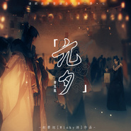

青玉案·元夕
============================

|  |  |
| :--: | :-- |
| [ 青玉案·元夕](https://emumo.xiami.com/album/2106059459) | **艺人**: [Winky诗](../index.md) **语种**: 国语 **唱片公司**: 制作家 **发行时间**: 2020年02月08日 **专辑类别**: EP, 单曲 **专辑风格**:  **播放数**: 35 **收藏数**: 1 **评论数**: 0  |

## 简介

《青玉案·元夕》请朗读并背诵全文第二季·七 
几个月前，在这个系列第二季开工之前，就已经定下来在今天——元宵佳节，一定要发布这首歌。 
这是属于这一天的一首歌，一定要在这一天发。 
这是我的执念。 
十几年前第一次看到这首词就被“凤箫声动，玉壶光转，一夜鱼龙舞”的华丽彻底俘虏，深深地记住了这句，却完全忽略了那句传世的经典——“蓦然回首，那人却在，灯火阑珊处”。 
这个系列进行到现在已经有十六首作品了。其中多数作品在填曲前都会查阅很多相关资料，读音对我而言是其次，主要是想加深自己对于词的解释与分析。 
多数情况下，查阅到的资料跟我对于诗词的理解和“感知”不会相差太多。 
这首也不例外地进行了一番查阅，只是“答案”与我对于这首词的理解颇有出入。 
据说作品的创作背景是“国势日衰，而南宋统治阶级却不思恢复，偏安江左，沉湎于歌舞享乐，以粉饰太平”。 
而我查到多数对于作品的解读是——“反衬出寄托着作者政治失意后不愿与世俗同流合污的孤高品格”、“是对自己不受重用的写照”、“体现了受冷落后不肯同流合污的高士之风” 
可是我如何读这篇作品，却无法苟同。 
仅仅就我个人而言，我在这首词中感受到的，是一个文人用最浪漫的语言记录了灯火阑珊、烟花璀璨的那个夜晚，一次难忘的“一见钟情”——热闹喧嚣的街头，有爆竹和烟火，头顶是一盏盏灯笼，一伸手就能从里面拽出来灯谜，身边有顽皮的孩子提着灯嬉闹着从身边跑过，烟火的光明灭之间映着熙熙攘攘的人群。 
到处是人声鼎沸、接踵擦肩，只是恍惚间有人擦身而过，留下了特别的香气和模糊的侧脸，一转头，却再怎么也找不到那个人。 
从逆流的人群中挤过，看着每盏灯下面的面孔——都不是她。 
在那个瞬间却突然好像收到了什么提醒一样，回头看去，才发现她在路边一个暗暗的小摊位看着自己。 
“哎呀，原来是自己走过头了” 
——那一瞬间有颗烟花绽放，照亮了彼此—— 
能用语言表达出的，只有这些。我没办法用更精确的语言去形容我对于这首词的理解。 
所以我尝试用音乐的方式，去诠释我自己对于这首词的理解。 
只是这样的方式实在与“主流”的理解大相径庭，也是犹豫再三，甚至反复推翻重写，最后才决定“见山是山”，写自己对于这首词的感知。 
当然，我绝对相信学者们不会捕风捉影，他们的言论一定是有据可查、有迹可循的。只是我自己对于这首词的理解不同，而我又没办法接受这一种理解，或是太过执着于想诠释自己对于这首词的理解。 
才有了今天这样的版本。 
对我个人而言，对于任何作品非怀恶意的理解，都是正向的个人理解，没有什么不对，也没有什么不好。即使作者活着、来了，当着我的面告诉我“你这样理解不对，我不是这么想的”，也改变不了我自己对于这首作品的理解。 
最终我选择了相信窗帘是蓝色的，选择了相信窗帘没有代表作者的抑郁和悲观。 
毕竟即使是“受人冷落”、“不被重用”，我辛弃疾还不能好好谈个恋爱吗？ 
最近一段日子来，经常能想起小时候每到元宵节的时候，街里总会有大商户放烟花，不是现在民用那种糊弄小孩子一般的啾——啪！是每一颗都能媲美日本烟火大会的那种尺寸和花色的专业级烟火。 
一直到现在，家乡这边也没有禁燃令。本来早早回来，一直盼着元宵节去街里看烟火——即使每次看完回到家都因为仰头太久而难受好半天，也还是想去。 
只是因为疫情的关系，城被封了，街上没有了行人，人们也不敢再聚集在一起。整个正月除了年三十，也再没见到烟火。 
今年元宵的烟火怕是要泡汤了。 
心里多多少少有些遗憾。 
可是没关系的，看不到烟火也没关系的。 
我希望大家能快点好起来，疫情快快结束！ 
等我们都健康了，不恐慌了，等我们又能聚在一起的时候，再看烟火也不迟。 
在这之前，请大家多多保重，一定一定要照顾好自己，勤通风洗手，能不出门就不出门，不得已要出门也一定要戴好口罩，千万不要聚餐，一定要健健康康的！ 
等有机会了，我们再一起看烟火。 
嗯。这是个约定。

## 曲目

## 评论

