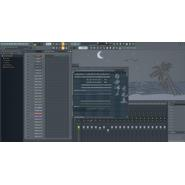
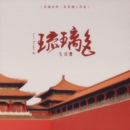
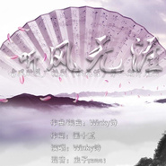
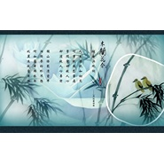
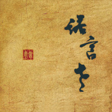

Winky诗
============================

|  |  |
| :--: | :-- |
| [ Winky诗](https://i.xiami.com/winky) | **地区**: China 中国大陆 **风格**: 古风 GuFeng Music **播放数**: 12875260 **粉丝数**: 12210 **评论数**: 390  |

## 档案

网络原创音乐人，擅长编曲及演唱，以古风为主，代表作品《菁华浮梦》《风花雪月》 《何处似樽前》第一张专辑《诺言老》 
本名：赵景旭 
生日：1991.01.17 
主要曲风：Pop、中国风、古风、和风、Bossanova、Hipa

## 专辑

| 名称 | 语种 | 唱片公司 | 发行时间 | 专辑类别 | 专辑风格 |
| :--: | :-- | :-- | :-- | :-- | :-- |
| [ 青玉案·元夕](./albums/2106059459.md) | 国语 | 制作家 | 2020年02月08日 | EP, 单曲 |  |
| [ 青玉案·元夕](./albums/2106059460.md) | 国语 | 制作家 | 2020年02月08日 |  |  |
| [ 白沙滩上月光长](./albums/5022369400.md) | 国语 |  | 2019年11月29日 | EP, 单曲 |  |
| [ 情动云荒《镜·朱颜》漫画主题曲](./albums/2104590919.md) | 国语 | 燥乐 | 2018年12月15日 | EP, 单曲 |  |
| [ 琉璃色](./albums/2102806181.md) | 国语 | 独立发行 | 2017年07月31日 | EP, 单曲 |  |
| [ 清欢怅](./albums/1485090220.md) | 国语 | 独立发行 | 2013年11月07日 | EP, 单曲 |  |
| [ 听风无涯](./albums/1872297529.md) | 国语 | 独立发行 | 2013年04月13日 | EP, 单曲 | 古风 GuFeng Music |
| [ 镇命歌·画皮](./albums/549259.md) | 国语 | 独立发行 | 2012年10月15日 | EP, 单曲 |  |
| [ 梦望断广播剧《铁剑栖凤》主题曲](./albums/1160220147.md) | 国语 | 独立发行 | 2012年03月29日 | EP, 单曲 | 古风 GuFeng Music |
| [ Winky诗精选集](./albums/487391.md) | 国语 | 爱诗班 | 2012年01月01日 | 精选集 |  |
| [ 故人叹](./albums/1910226834.md) | 国语 | 独立发行 | 2012年01月01日 | EP, 单曲 |  |
| [ 浮世·魂祭](./albums/599626363.md) | 国语 | 独立发行 | 2011年11月25日 | EP, 单曲 |  |
| [ 诺言老](./albums/462485.md) | 国语 | 爱诗班 | 2011年07月15日 | 录音室专辑 | 古风 GuFeng Music |
| [ 彼岸](./albums/1570656975.md) | 国语 | 决意同人 | 2011年07月04日 | 原声带, 影视音乐 |  |
| [ 带我飞广播剧《墨韵天成》主题曲](./albums/1560220262.md) | 国语 | 独立发行 | 2011年04月19日 | EP, 单曲 | 古风 GuFeng Music |
| [ 菁华浮梦](./albums/454947.md) | 国语 | 网络发行 | 2009年10月03日 | EP, 单曲 | 古风 GuFeng Music |

## 评论

|  |  |  |
| :-- | :-- | :-- |
|  [虾米用户](https://emumo.xiami.com/u/334623766)  2021-01-17 23:44 赞(0) 踩(0) | 
今天因你而特别
 |
|  [虾米用户](https://emumo.xiami.com/u/48683662) 坚持做一件事会怎样呢 2020-12-25 22:49 赞(0) 踩(0) | 
看评论去看了图片集，确实无言以对٩(๑^o^๑)۶
 |
|  [虾米用户](https://emumo.xiami.com/u/36518599) 我还没想好要写什么... 2020-09-12 10:50 赞(0) 踩(0) | 
古风里第一个被收藏的男的
 |
|  [虾米用户](https://emumo.xiami.com/u/354118275) 下辈子我愿做一片海 2020-08-31 00:09 赞(0) 踩(0) | 
偶然之间听到了这首《松烟入墨》，醉没于中！一直以来都是欧美音乐为调，并非崇洋媚外，极单纯的喜欢节奏！对于国内音乐还是停留在许巍之类喜好！唯独这首，闲来，咖啡与之相伴，绝美！期待你的下一单品！
 |
|  [虾米用户](https://emumo.xiami.com/u/374847765)  2020-06-17 08:20 赞(1) 踩(0) | 
mmmmma&amp;hellip;&amp;hellip;
 |
|  [虾米用户](https://emumo.xiami.com/u/37990075) 每天都在努力做个好人 2020-05-05 20:48 赞(2) 踩(0) | 
能把我们班长近两年的照片放上去不，明明现在的这么好看，不知不觉喜欢班长七年了
 |
|  [虾米用户](https://emumo.xiami.com/u/339699258)  2020-02-19 22:27 赞(0) 踩(0) | 
您的歌挺好听的，不用换头像之类的。歌好听就完事了
 |
|  [虾米用户](https://emumo.xiami.com/u/302798046) 南风知我意，吹梦到西洲 2019-11-02 14:59 赞(2) 踩(0) | 
声音很特别，第一次听这首歌就沦陷了。
 |
|  [虾米用户](https://emumo.xiami.com/u/322627443) Darkness wil... 2019-05-07 22:23 赞(1) 踩(0) | 
本来b站up主推荐我来听松烟入墨，打算粉了的，结果看到热评说比许嵩强多了？我可去您的吧！
 |
|  [虾米用户](https://emumo.xiami.com/u/2796166) 最爱莫文蔚..... 2019-04-02 01:25 赞(1) 踩(0) | 
加油！
 |
|  [虾米用户](https://emumo.xiami.com/u/263079848)  2019-03-19 23:53 赞(2) 踩(0) | 
从优酷的《这就是，原创》过来的，纯属支持古风，希望经久不衰，制作更多精美歌曲
 |
|  [虾米用户](https://emumo.xiami.com/u/130807036) 只爱那些 2019-03-16 09:35 赞(0) 踩(0) | 
离骚最爱
 |
|  [虾米用户](https://emumo.xiami.com/u/35590867)  2019-03-03 16:18 赞(1) 踩(0) | 
哇，好像听《花凋》，可是为什么这里没有 
 |
|  [虾米用户](https://emumo.xiami.com/u/16519587)  2019-02-21 01:19 赞(1) 踩(0) | 
为什么找不到你的离骚?真的好听，就是找不到气人哦
 |
|  [虾米用户](https://emumo.xiami.com/u/413360843) 别爱太满，别睡太晚 2019-01-27 09:13 赞(1) 踩(0) | 
柒班报道吖
 |
|  [虾米用户](https://emumo.xiami.com/u/11642841)  2018-12-14 17:06 赞(1) 踩(0) | 
写的曲相当好听，加油QAQ
 |
|  [虾米用户](https://emumo.xiami.com/u/293692544) 你敢给我说话吗？我咬你 2018-11-24 05:11 赞(2) 踩(0) | 
好听
 |
|  [虾米用户](https://emumo.xiami.com/u/348088707) 为你明灯三千，为你花开满... 2018-07-26 04:08 赞(2) 踩(0) | 
一首听风无涯就想娶了，怎么能这么酥酱啊啊啊啊，耽美也受不了
 |
|  [虾米用户](https://emumo.xiami.com/u/231715287)  2018-06-30 11:27 赞(4) 踩(0) | 
因为在国外进行汉语教学，无意间接触了《山鬼》，好美。
 |
|  [虾米用户](https://emumo.xiami.com/u/231715287)  2018-06-30 11:26 赞(2) 踩(0) | 
声音像杏花树下的潺潺流水 
 |
|  [虾米用户](https://emumo.xiami.com/u/250300368) 其实人家是90后 2018-06-24 13:36 赞(2) 踩(0) | 
最喜欢的古风作曲人哦&amp;hellip;实在太好听了。最爱小诗作曲小曲儿唱的的霁夜茶，作词人也很棒，给人感觉岁月静好，只听曲子不看歌词我眼前看到的就是一副红衣少年鲜衣怒马的样子。就喜欢霁夜茶跟乌篷谣那种淡雅的曲子。清欢怅小诗唱得很好听哦，梦望断更喜欢二婶赫赫那版。小诗加油，多多作曲哦，你太有才华了，感觉是古风圈里作曲最棒的，至少在我这里是最棒的。
 |
|  [虾米用户](https://emumo.xiami.com/u/289394843) 今日凌风造访. 2018-06-18 20:07 赞(1) 踩(0) | 
好棒的声音，加油
 |
|  [虾米用户](https://emumo.xiami.com/u/224672341) Sorry for ev... 2018-05-30 01:12 赞(2) 踩(0) | 
本命！！！！！！！！！！！！！！！我要不要脸的叫一句！！！老公！！！！
 |
|  [虾米用户](https://emumo.xiami.com/u/318600694)  2018-05-06 09:56 赞(15) 踩(0) | 
把评论都翻了一遍，想问五六年前在这里留言的人，现在都还在吗？很羡慕你们早早就认识了小诗啊，陪伴他这些年，见证他的进步和成长，一定会很感慨吧。可惜我最近才知道他，如果你们最开始认识的小诗是一块璞玉的话，我认知中的他已经是经历打磨非常精巧的美玉了。只是幸好我来得还不算晚，他依然是那个才华横溢的，美好纯真的年轻人。
 |
|  [虾米用户](https://emumo.xiami.com/u/306065331) 幸福开始有人选 2018-05-04 07:50 赞(2) 踩(0) | 
18年有没有新歌啊！今天5.4－过了大半年了。
 |
|  [虾米用户](https://emumo.xiami.com/u/333596057)  2018-04-29 21:48 赞(2) 踩(0) | 
声音好好听，加油，一直支持你。
 |
|  [虾米用户](https://emumo.xiami.com/u/132414666) 咋就名字变不了啊 2018-03-31 21:07 赞(2) 踩(0) | 
山鬼评论里过来的，最近用山鬼它配五禽戏，美到不行，感谢感谢
 |
| ⇒ |  [虾米用户](https://emumo.xiami.com/u/271810113) 等风来. 2018-05-05 17:41 赞(0) 踩(0) | 
真的是因为山鬼喜欢的 山鬼真的太美了啊啊啊
 |
|  [虾米用户](https://emumo.xiami.com/u/271810113) 等风来. 2018-03-25 18:56 赞(2) 踩(0) | 
山鬼山鬼真的好听qwq 耳朵怀孕
 |
|  [虾米用户](https://emumo.xiami.com/u/316502674) 在最后陪着你吧，我的虾米 2018-02-12 10:21 赞(2) 踩(0) | 
来给诗班打电话
 |
| ⇒ |  [虾米用户](https://emumo.xiami.com/u/63147166) deep house 2018-03-19 09:07 赞(0) 踩(0) | 
你这头像不是wisp x那首vibrance的封面吗
 |
| ⇒ |  [虾米用户](https://emumo.xiami.com/u/316502674) 在最后陪着你吧，我的虾米 2018-03-24 17:32 赞(0) 踩(0) | 
<q><b>Change说：</b></q>
 |
| ⇒ |  [虾米用户](https://emumo.xiami.com/u/63147166) deep house 2018-03-25 13:27 赞(0) 踩(0) | 
<q><b>柠檬味的蓝说：</b></q>
 |
|  [虾米用户](https://emumo.xiami.com/u/346633549)  2018-02-11 12:57 赞(2) 踩(0) | 
以前我的手机里只有你一个人的歌，当年几乎不听中文歌呀
 |
|  [虾米用户](https://emumo.xiami.com/u/346633549)  2018-02-11 12:55 赞(2) 踩(0) | 
男神，我喜欢你5年了
 |
|  [虾米用户](https://emumo.xiami.com/u/50491325) “那些寂寞的花朵 是春天... 2018-01-22 21:08 赞(2) 踩(0) | 
山鬼真的太美了
 |
|  [虾米用户](https://emumo.xiami.com/u/339802497)  2017-12-14 10:28 赞(1) 踩(0) | 
从最早的&amp;ldquo;某我&amp;rdquo;音乐盒，到&amp;ldquo;某狗&amp;rdquo;音乐，在到现在的虾米。从没抹掉对你音乐的喜爱！加油！ 
 |
|  [虾米用户](https://emumo.xiami.com/u/287634950)  2017-11-23 09:11 赞(2) 踩(0) | 
为班长冰天雪地三百六十度裸身跪call
 |
|  [虾米用户](https://emumo.xiami.com/u/330074379) 我愿用一切换重新来过，一... 2017-11-05 14:51 赞(3) 踩(0) | 
本来不喜欢听歌的，后来看小说的时候觉得《箐华浮梦》的词不错，就搜来听觉得好好听，然后我就完美的迷上大大的声音了，大大的声音好好听哦
 |
| ⇒ |  [虾米用户](https://emumo.xiami.com/u/309740182) 再见 2018-01-04 21:23 赞(0) 踩(0) | 
什么小说
 |
|  [虾米用户](https://emumo.xiami.com/u/330074379) 我愿用一切换重新来过，一... 2017-11-05 14:30 赞(1) 踩(0) | 
大大的声音好好听哦！爱死了(ღ˘⌣˘) ℒ♡ⓥℯ ㄚ♡ⓤ
 |
|  [虾米用户](https://emumo.xiami.com/u/44249302)   2017-10-30 09:58 赞(2) 踩(0) | 
我诗好歹也是大大微信随便给的话也给我来一个吧==
 |
|  [虾米用户](https://emumo.xiami.com/u/279144164)  2017-10-12 17:55 赞(1) 踩(0) | 
听来听去 还是你的声音听了最舒心 让人很坦然 
 |
|  [虾米用户](https://emumo.xiami.com/u/94579728)   2017-09-21 23:15 赞(0) 踩(0) | 
啊啊啊啊啊，到处都听不了无处可寻！难过
 |
|  [虾米用户](https://emumo.xiami.com/u/187036808)   2017-09-19 20:24 赞(1) 踩(0) | 
听山鬼摸索到这里 很喜欢你的歌
 |
|  [虾米用户](https://emumo.xiami.com/u/308258913)  2017-09-17 20:52 赞(0) 踩(0) | 
你创作的歌曲很好听，希望你一直创作下去     
 |
|  [虾米用户](https://emumo.xiami.com/u/321046243)  2017-08-23 19:51 赞(1) 踩(0) | 
日常表白班长
 |
| ⇒ |  [虾米用户](https://emumo.xiami.com/u/226633347) 水土豆 2017-08-28 15:35 赞(0) 踩(0) | 
喜欢山鬼
 |
|  [虾米用户](https://emumo.xiami.com/u/291047753)   2017-08-16 03:05 赞(0) 踩(0) | 
好聽到進心裡去了
 |
|  [虾米用户](https://emumo.xiami.com/u/318503553)  2017-08-10 17:20 赞(4) 踩(0) | 
为什么没有&amp;ldquo;山鬼&amp;rdquo;这首歌。
 |
|  [虾米用户](https://emumo.xiami.com/u/318486519)  2017-08-10 15:44 赞(0) 踩(0) | 
这里班长的歌好少啊
 |
|  [虾米用户](https://emumo.xiami.com/u/318486519)  2017-08-10 15:39 赞(0) 踩(0) | 
表白班长 
 |
|  [虾米用户](https://emumo.xiami.com/u/47805332)  2017-08-07 16:08 赞(0) 踩(0) | 
好听
 |
|  [虾米用户](https://emumo.xiami.com/u/313174541)  2017-07-19 05:01 赞(0) 踩(0) | 
我喜欢，嘻嘻哈哈嘻嘻嘻O(&amp;cap;_&amp;cap;)O哈哈~
 |
|  [虾米用户](https://emumo.xiami.com/u/306839592) 山有木枝木有兮，心悦君兮... 2017-07-04 20:56 赞(0) 踩(0) | 
声音好bang
 |
|  [虾米用户](https://emumo.xiami.com/u/306839592) 山有木枝木有兮，心悦君兮... 2017-07-04 20:56 赞(0) 踩(0) | 
好听
 |
|  [虾米用户](https://emumo.xiami.com/u/281996499)  2017-07-01 19:21 赞(0) 踩(0) | 
想听那首 松烟入墨
 |
|  [虾米用户](https://emumo.xiami.com/u/247696158) 为谁风露立中宵。 2017-07-01 16:59 赞(0) 踩(0) | 
才情诗人
 |
|  [虾米用户](https://emumo.xiami.com/u/261768589)   2017-05-26 23:14 赞(0) 踩(0) | 
班长，我来啦  
 |
|  [虾米用户](https://emumo.xiami.com/u/22187334)  2017-05-01 19:42 赞(1) 踩(0) | 
男神啊
 |
| ⇒ |  [虾米用户](https://emumo.xiami.com/u/286950778)  2017-05-01 20:20 赞(0) 踩(0) | 
 
 |
|  [虾米用户](https://emumo.xiami.com/u/22187334)  2017-05-01 19:42 赞(0) 踩(0) | 
男神啊
 |
|  [虾米用户](https://emumo.xiami.com/u/284169800)  2017-04-27 14:30 赞(2) 踩(0) | 
听你第一首歌叫《松烟入墨》好喜欢循环了无数遍，支持你！
 |
|  [虾米用户](https://emumo.xiami.com/u/288829948)  2017-04-23 19:42 赞(1) 踩(0) | 
听到心里了
 |
|  [虾米用户](https://emumo.xiami.com/u/122653948)  2017-04-21 01:32 赞(1) 踩(0) | 
好听好听   
 |
|  [虾米用户](https://emumo.xiami.com/u/247629557)  2017-04-08 20:34 赞(1) 踩(0) | 
有空要来光顾的！
 |
|  [虾米用户](https://emumo.xiami.com/u/278689304)  2017-04-06 00:04 赞(0) 踩(0) | 
怎么没有不开口的花
 |
|  [虾米用户](https://emumo.xiami.com/u/285389407)  2017-04-02 17:11 赞(0) 踩(0) | 
很喜欢
 |
|  [虾米用户](https://emumo.xiami.com/u/7858212)  2017-03-29 19:14 赞(1) 踩(0) | 
什么时候有山鬼啊
 |
|  [虾米用户](https://emumo.xiami.com/u/39014105)  2017-03-29 18:03 赞(0) 踩(0) | 
太少啦！想听山鬼qwq
 |
|  [虾米用户](https://emumo.xiami.com/u/282136725) 若你喜欢怪人 2017-03-21 11:13 赞(1) 踩(0) | 
班长班长，来报到！ 
 |
|  [虾米用户](https://emumo.xiami.com/u/258772546)  2017-02-13 22:13 赞(0) 踩(0) | 
超级好听诶！ 
 |
|  [虾米用户](https://emumo.xiami.com/u/257172813)   2017-01-24 09:01 赞(0) 踩(0) | 
为啥想家听不到
 |
|  [虾米用户](https://emumo.xiami.com/u/237971979) 正当我觉得不能忍受自己的... 2017-01-09 23:40 赞(2) 踩(0) | 
超喜欢山鬼的
 |
|  [虾米用户](https://emumo.xiami.com/u/16986782) 一个人、一首歌、一个世界 2017-01-08 22:16 赞(0) 踩(0) | 
班长，最近都不出现了 
 |
|  [虾米用户](https://emumo.xiami.com/u/236831891)  2016-12-15 23:26 赞(0) 踩(0) | 
很多人和我一样来求山鬼的
 |
|  [虾米用户](https://emumo.xiami.com/u/14016247) 我还没想好要写什么…… 2016-12-01 05:03 赞(1) 踩(0) | 
怎么没有山鬼？？？
 |
|  [虾米用户](https://emumo.xiami.com/u/246756422)  2016-11-17 11:41 赞(0) 踩(0) | 
班长么么哒
 |
|  [虾米用户](https://emumo.xiami.com/u/141730638)  2016-11-17 03:18 赞(0) 踩(0) | 
散文诗或是现代诗
 |
|  [虾米用户](https://emumo.xiami.com/u/243279395)  2016-11-12 00:17 赞(2) 踩(0) | 
小诗，讲真古风圈里我只服你，很少有你这种如清泉般干净的声音了，加油!
 |
|  [虾米用户](https://emumo.xiami.com/u/4265369)  2016-11-10 16:18 赞(0) 踩(0) | 
好像在鸾凤鸣的yy直播里看到过你？？？
 |
|  [虾米用户](https://emumo.xiami.com/u/234402335)  2016-10-18 11:36 赞(0) 踩(0) | 
小诗！赐我你的微信！
 |
|  [虾米用户](https://emumo.xiami.com/u/231982004) 倾覆天下我亦无生死中挣扎 2016-10-01 18:17 赞(0) 踩(0) | 
好听，支持
 |
|  [虾米用户](https://emumo.xiami.com/u/132978812) 我还没想好要写什么... 2016-09-15 14:34 赞(0) 踩(0) | 
好听。
 |
|  [虾米用户](https://emumo.xiami.com/u/187617264) 不要试图接近我 2016-08-28 22:09 赞(0) 踩(0) | 
好听
 |
|  [虾米用户](https://emumo.xiami.com/u/39503906)  2016-08-24 16:02 赞(2) 踩(0) | 
山鬼好听到哭，声音也好听，难得唱腔一点都不做作，真是古风界的一股清流！
 |
|  [虾米用户](https://emumo.xiami.com/u/207917812)  2016-08-02 00:44 赞(2) 踩(0) | 
想听望乡台，什么时候才能上线～
 |
| ⇒ |  [虾米用户](https://emumo.xiami.com/u/318486519)  2017-08-10 15:43 赞(0) 踩(0) | 
一直在五婶听的
 |
|  [虾米用户](https://emumo.xiami.com/u/16887171) 不认真我就赢了 2016-08-01 21:21 赞(2) 踩(0) | 
荔枝FM听到的你唱的【月牙湾】我认为是最好听的男版！
 |
|  [虾米用户](https://emumo.xiami.com/u/16887171) 不认真我就赢了 2016-08-01 21:18 赞(1) 踩(0) | 
喜欢你翻唱的【月牙湾】，你的微博和虾米我都关注了,ok吧！
 |
|  [虾米用户](https://emumo.xiami.com/u/181787668)  2016-06-02 20:48 赞(1) 踩(0) | 
少了好多。。
 |
|  [虾米用户](https://emumo.xiami.com/u/49771826) 愿能度一切执迷，愿冗长岁... 2016-05-28 22:16 赞(2) 踩(0) | 
山鬼呢QAQ
 |
|  [虾米用户](https://emumo.xiami.com/u/52401597) 喵~ 2016-05-22 14:13 赞(0) 踩(0) | 
山鬼
 |
|  [虾米用户](https://emumo.xiami.com/u/88220608)   2016-05-21 23:12 赞(0) 踩(0) | 
山鬼呢，放上来啊思密达
 |
|  [虾米用户](https://emumo.xiami.com/u/15952338)  2016-05-02 12:04 赞(1) 踩(0) | 
在别的地方听了菁华浮梦，找过来的，曲作的不错
 |
| ⇒ |  [虾米用户](https://emumo.xiami.com/u/226633347) 水土豆 2017-08-28 15:36 赞(0) 踩(0) | 
我也是
 |
| ⇒ |  [虾米用户](https://emumo.xiami.com/u/15952338)  2018-03-23 18:49 赞(0) 踩(0) | 
<q><b>明亦说：</b></q>
 |
|  [虾米用户](https://emumo.xiami.com/u/158640624) 。 2016-05-02 09:29 赞(0) 踩(0) | 
支持
 |
|  [虾米用户](https://emumo.xiami.com/u/98746064) 吾之幸哉，与尔何干？ 2016-05-01 17:46 赞(1) 踩(0) | 
班长 
 |
|  [虾米用户](https://emumo.xiami.com/u/34246728) 音乐是医我的药。 2016-04-08 08:14 赞(2) 踩(0) | 
求山鬼
 |
|  [虾米用户](https://emumo.xiami.com/u/16852456) 理想是御用配乐师(/ω＼... 2016-04-08 00:06 赞(0) 踩(0) | 
～赞一个
 |
|  [虾米用户](https://emumo.xiami.com/u/8739172)  2016-03-28 16:13 赞(0) 踩(0) | 
啊啊啊啊啊班长！！！！
 |
|  [虾米用户](https://emumo.xiami.com/u/3955978)  2016-02-25 22:26 赞(0) 踩(0) | 
來表白了班长你好你好&amp;gt;U&amp;lt;///
 |
|  [虾米用户](https://emumo.xiami.com/u/111685896)  2016-02-22 21:38 赞(0) 踩(0) | 
班长 
 |
| ⇒ |  [虾米用户](https://emumo.xiami.com/u/268780795)  2017-05-05 15:46 赞(0) 踩(0) | 
歌者以前是你们的班长？
 |
| ⇒ |  [虾米用户](https://emumo.xiami.com/u/290714149) 模糊地迷恋你一场，就当风... 2017-05-17 10:26 赞(0) 踩(0) | 
<q><b>洞庭说：</b></q>
 |
|  [虾米用户](https://emumo.xiami.com/u/103813746) 愿谁记得谁，最好的年岁 2016-02-22 21:31 赞(0) 踩(0) | 
特别喜欢他的声音 
 |
|  [虾米用户](https://emumo.xiami.com/u/40396112)  2016-01-24 16:37 赞(0) 踩(0) | 
嘻嘻
 |
|  [虾米用户](https://emumo.xiami.com/u/95755804)  2015-12-30 15:23 赞(0) 踩(0) | 
  
 |
|  [虾米用户](https://emumo.xiami.com/u/49732921) 我还没想好要写什么... 2015-12-25 22:48 赞(0) 踩(0) | 
我要告白了！
 |
|  [虾米用户](https://emumo.xiami.com/u/58101608)   2015-12-19 22:11 赞(1) 踩(0) | 
班长加油，一直都喜欢你！ 
 |
|  [虾米用户](https://emumo.xiami.com/u/77636008) ^_^ 2015-11-07 01:14 赞(2) 踩(0) | 
问什么虾米音乐里没有松烟入墨呢？也很不错的哦！
 |
|  [虾米用户](https://emumo.xiami.com/u/73550280) 在生命活水里畅游。 2015-11-03 23:53 赞(4) 踩(0) | 
虾米有【山鬼】这首歌吗？没找到
 |
| ⇒ |  [虾米用户](https://emumo.xiami.com/u/35517) 随缘而去乘风而来 2015-12-11 16:18 赞(0) 踩(0) | 
同想听
 |
|  [虾米用户](https://emumo.xiami.com/u/73550280) 在生命活水里畅游。 2015-11-03 23:48 赞(0) 踩(0) | 
这个年代，往心里扎根开花结果的艺人太少了，哪怕只有几首歌，用心做的音乐一定要鼓励！不骄不躁
 |
|  [虾米用户](https://emumo.xiami.com/u/78261248)  2015-11-01 01:01 赞(2) 踩(0) | 
山鬼入门呐~直接单曲循环俩星期，作为音控一枚的我怎么能错过呢~
 |
|  [虾米用户](https://emumo.xiami.com/u/56198610)  2015-10-30 23:23 赞(1) 踩(0) | 
跟着班长走！说句实话，觉得班长在这么多个古风歌手里真的是是认真的：）加油！
 |
|  [虾米用户](https://emumo.xiami.com/u/11985193) 明净公子 2015-10-21 18:15 赞(1) 踩(0) | 
那首霁夜茶实在太美！故事的韵味，演绎得太好！
 |
|  [虾米用户](https://emumo.xiami.com/u/33187056)  2015-10-21 13:51 赞(2) 踩(0) | 
爱诗班的孩子来报道～
 |
|  [虾米用户](https://emumo.xiami.com/u/48406704) 暂无签名~ 2015-10-09 20:25 赞(0) 踩(0) | 
评论里怎么有些人嘴那么污呢
 |
|  [虾米用户](https://emumo.xiami.com/u/48406704) 暂无签名~ 2015-10-09 20:25 赞(0) 踩(0) | 
班长!
 |
|  [虾米用户](https://emumo.xiami.com/u/1259619) 清浊自甚，神灵明鉴_窦唯 2015-10-07 20:37 赞(0) 踩(0) | 
有才啊
 |
|  [虾米用户](https://emumo.xiami.com/u/12288916) 拉利达拉布 2015-10-07 01:35 赞(0) 踩(0) | 
还是5sing比较好
 |
|  [虾米用户](https://emumo.xiami.com/u/52439919) 秋名山上行人稀，吃鸡还看... 2015-10-06 08:47 赞(0) 踩(0) | 
非常棒！！加油
 |
|  [虾米用户](https://emumo.xiami.com/u/68670190) 实·照·宇·青…… 2015-10-03 13:11 赞(1) 踩(0) | 
喜欢小诗的声音，喜欢他的歌，不过嘛，何必要拿别人来比较，歌手们多了，何必厚此薄彼，须知各有所长
 |
|  [虾米用户](https://emumo.xiami.com/u/53026733)  2015-10-02 23:37 赞(0) 踩(0) | 
声音好听 不矫情
 |
|  [虾米用户](https://emumo.xiami.com/u/68854216)  2015-09-23 18:12 赞(2) 踩(0) | 
因为班长过来的，男神啊！
 |
|  [虾米用户](https://emumo.xiami.com/u/10648358) 嘿の 2015-09-07 11:34 赞(0) 踩(0) | 
有男神的地方都有我。。。
 |
|  [虾米用户](https://emumo.xiami.com/u/33774548) 在虾米的评论里惊觉自己默... 2015-09-03 10:24 赞(0) 踩(0) | 
为什么我没有人关注我
 |
|  [虾米用户](https://emumo.xiami.com/u/7576566)  2015-08-26 00:14 赞(0) 踩(0) | 
故人叹啊！！！
 |
|  [虾米用户](https://emumo.xiami.com/u/54786082)  2015-08-25 10:56 赞(0) 踩(0) | 
男神！
 |
|  [虾米用户](https://emumo.xiami.com/u/55504950) 李东海女孩 2015-08-18 21:52 赞(1) 踩(0) | 
今天刚入驻虾米，过来给班长大人捧场(这里歌不全啊)，多年陪伴，不离不弃，希望班长把安兰的瓶邪系列出完
 |
|  [虾米用户](https://emumo.xiami.com/u/51504140) 我是G，0.5，女的勿扰 2015-08-11 21:48 赞(0) 踩(0) | 
点个赞
 |
|  [虾米用户](https://emumo.xiami.com/u/51504140) 我是G，0.5，女的勿扰 2015-08-11 21:48 赞(0) 踩(0) | 
小受受 
 |
|  [虾米用户](https://emumo.xiami.com/u/51504140) 我是G，0.5，女的勿扰 2015-08-11 21:48 赞(0) 踩(0) | 
小受受 
 |
|  [虾米用户](https://emumo.xiami.com/u/5668289) 暂无签名~ 2015-08-06 04:24 赞(0) 踩(0) | 
换个头像，要是有人包装就好了
 |
|  [虾米用户](https://emumo.xiami.com/u/5668289) 暂无签名~ 2015-08-06 04:24 赞(0) 踩(0) | 
换个头像，要是有人包装就好了
 |
|  [虾米用户](https://emumo.xiami.com/u/51593916)  2015-08-01 10:35 赞(0) 踩(0) | 
最爱班长
 |
|  [虾米用户](https://emumo.xiami.com/u/11641984) 天啦噜 2015-07-28 18:12 赞(1) 踩(0) | 
…曾经翻唱了班长的无数首歌…现在也淡出这个圈子啦，不过偶尔会来听听想到以前跟基友们录干音做后期的日子真的好怀念23333
 |
|  [虾米用户](https://emumo.xiami.com/u/52625277) 。终我一生，难寻太平 2015-07-15 23:49 赞(0) 踩(0) | 
。喜欢
 |
|  [虾米用户](https://emumo.xiami.com/u/2295572)  2015-07-15 16:29 赞(0) 踩(0) | 
好听！！第一次发现华语古风能这么好听！！
 |
|  [虾米用户](https://emumo.xiami.com/u/25920235) 我还没想好要写什么... 2015-07-08 13:15 赞(0) 踩(0) | 
这头像。。
 |
|  [虾米用户](https://emumo.xiami.com/u/6503715) 我是石头，不会开花。你还... 2015-07-01 17:21 赞(1) 踩(0) | 
菁华浮梦这首歌，一听就中魔了，单曲循环1个月，还做过背景音乐。声音中规中矩，很放松。
 |
|  [虾米用户](https://emumo.xiami.com/u/51845406) 尽诛宵小天策义，长枪独守... 2015-06-28 17:29 赞(0) 踩(0) | 
最喜欢班长的江南集^﹏^
 |
|  [虾米用户](https://emumo.xiami.com/u/582756) 暂无签名~ 2015-06-25 15:32 赞(0) 踩(0) | 
清欢怅这首好听的很！
 |
|  [虾米用户](https://emumo.xiami.com/u/582756) 暂无签名~ 2015-06-24 20:03 赞(0) 踩(0) | 
怎么只有二十首歌，太少了！
 |
|  [虾米用户](https://emumo.xiami.com/u/50760724)  2015-06-14 21:25 赞(0) 踩(0) | 
突然听到，然后就喜欢上了，觉得韵味很足
 |
|  [虾米用户](https://emumo.xiami.com/u/14056294)   2015-06-13 11:05 赞(0) 踩(0) | 
长的好帅奥
 |
|  [虾米用户](https://emumo.xiami.com/u/2409074)  2015-06-04 21:59 赞(2) 踩(0) | 
头像怎么如此非主流杀马特，画风不对啊，太倒胃口
 |
| ⇒ |  [虾米用户](https://emumo.xiami.com/u/48406704) 暂无签名~ 2015-10-09 20:27 赞(0) 踩(0) | 
不喜欢请出门左转 谢谢
 |
|  [虾米用户](https://emumo.xiami.com/u/451700) ㊙️ 2015-05-26 13:18 赞(0) 踩(0) | 
新歌呢~~~。。。
 |
|  [虾米用户](https://emumo.xiami.com/u/50065305) 皇图 2015-05-19 10:35 赞(0) 踩(0) | 
。喜欢箐华浮梦    
 |
|  [虾米用户](https://emumo.xiami.com/u/10648358) 嘿の 2015-05-14 16:54 赞(0) 踩(0) | 
唯美古风曲winky诗
 |
|  [虾米用户](https://emumo.xiami.com/u/33259356) 意義是三小，我只知義氣 2015-05-10 10:26 赞(2) 踩(0) | 
哈哈哈，音色真的不错的，干净。。。许嵩的声音我实在是。。不做评论
 |
|  [虾米用户](https://emumo.xiami.com/u/49629328)  2015-04-27 19:41 赞(0) 踩(0) | 
喜欢就是喜欢
 |
|  [虾米用户](https://emumo.xiami.com/u/35259621) 暂无签名~ 2015-04-25 18:11 赞(1) 踩(0) | 
偷得平生浮日闲、、听：唯安
 |
|  [虾米用户](https://emumo.xiami.com/u/33569083) 我还没想好要写什么... 2015-04-15 23:37 赞(0) 踩(0) | 
为什么这里有歌下架了QwQ
 |
|  [虾米用户](https://emumo.xiami.com/u/6077079)   2015-04-14 22:21 赞(0) 踩(0) | 
班长棒棒哒！
 |
|  [虾米用户](https://emumo.xiami.com/u/48747723)  2015-04-01 13:19 赞(0) 踩(0) | 
曲调什么的赶脚听过不过还是很喜欢&amp;gt;3&amp;lt;很温柔…
 |
|  [虾米用户](https://emumo.xiami.com/u/48747723)  2015-04-01 13:19 赞(0) 踩(0) | 
曲调什么的赶脚听过不过还是很喜欢&amp;gt;3&amp;lt;很温柔…
 |
|  [虾米用户](https://emumo.xiami.com/u/48081245) 我还没想好要写什么... 2015-04-01 00:42 赞(0) 踩(0) | 
赞
 |
|  [虾米用户](https://emumo.xiami.com/u/961315)  2015-03-27 17:39 赞(0) 踩(0) | 
喜欢小诗的声音，他的嗓音有种古代儒雅之感，十分的契合古风曲调。即不突兀，又不生硬。是在是太棒。他谱的调也十分淡雅、如流水般缠绵，在听众不知不觉中渗入心中，不由得一首首循环……不行，好喜欢
 |
|  [虾米用户](https://emumo.xiami.com/u/44130658) 暂无签名~ 2015-03-25 01:12 赞(0) 踩(0) | 
声音好心水
 |
|  [虾米用户](https://emumo.xiami.com/u/670150) 离开之后，到达之前 2015-02-12 23:55 赞(1) 踩(0) | 
其实那个戏子说调子很不错，声音有点稚嫩，词改改就很完美
 |
|  [虾米用户](https://emumo.xiami.com/u/33009374) 回忆里出现的景色，都是启... 2015-02-10 14:54 赞(0) 踩(0) | 
头像是本人吗？
 |
|  [虾米用户](https://emumo.xiami.com/u/42116175) Be the best 2015-01-27 15:38 赞(0) 踩(0) | 
求更故人叹！！
 |
| ⇒ |  [虾米用户](https://emumo.xiami.com/u/46860899)  2015-02-02 22:11 赞(0) 踩(0) | 
网易云有故人叹
 |
|  [虾米用户](https://emumo.xiami.com/u/11954778) 啥都听 2015-01-09 19:57 赞(0) 踩(0) | 
高二的时候好迷小诗的声音 转眼都快大学毕业了……当年还买了诺言老来着…
 |
|  [虾米用户](https://emumo.xiami.com/u/1634890)  2014-12-22 12:59 赞(35) 踩(0) | 
好孩子，比许山高之流强多了，顶你
 |
| ⇒ |  [虾米用户](https://emumo.xiami.com/u/49481354) 大隐隐于市 2017-01-27 18:47 赞(0) 踩(0) | 
听就听，贬低许嵩来抬高他人干嘛
 |
| ⇒ |  [虾米用户](https://emumo.xiami.com/u/244923687) 每一首歌都是一个故事，每... 2017-08-09 08:42 赞(0) 踩(0) | 
第一次觉得贬低别人捧高另一个人的感觉如此恶心。
 |
| ⇒ |  [虾米用户](https://emumo.xiami.com/u/322627443) Darkness wil... 2019-05-07 22:24 赞(0) 踩(0) | 
本来b站up主推荐我来听松烟入墨，打算粉了的，结果看到ncf非得说比许嵩强多了？我可去您的吧！你粉人的样子真像蔡徐坤の癌鲲！
 |
| ⇒ |  [虾米用户](https://emumo.xiami.com/u/265989264) 爱听不听 2019-09-10 10:31 赞(0) 踩(0) | 
？？你在讲什么
 |
| ⇒ |  [虾米用户](https://emumo.xiami.com/u/432088152)  2019-11-12 22:19 赞(0) 踩(0) | 
许嵩招您惹您了，许嵩的庐州月燕归巢，作词作曲哪里差？千百度的歌词和方文山老师的作词同选进大学课程书里面，许嵩很多年前写过的文章用来当做学生的阅读理解，是教育局不行，审查不行吗，还是您比李白杜甫白居易更才华，扯太远了，您是文笔好到中央新闻联播写手稿的，看许嵩太差了出来说句话吗？？客观来讲许嵩和小诗都是我非常喜欢的音乐人，一个搞中国风一个搞古风，都会作词作曲编曲混音等等各种专业的大众不懂的东西，都是公认的才子，怎么到您这，这么优秀的两个人就被捧一踩一了呢，您觉得这样很有优越感吗？
 |
| ⇒ |  [虾米用户](https://emumo.xiami.com/u/4290612)  2019-11-28 20:34 赞(0) 踩(0) | 
这脑子
 |
| ⇒ |  [虾米用户](https://emumo.xiami.com/u/339699258)  2020-02-19 22:25 赞(0) 踩(0) | 
我看你们对一个人恶语相向真。。。。。好好说话不行？火气大，先去运动一下呗
 |
| ⇒ |  [虾米用户](https://emumo.xiami.com/u/265989264) 爱听不听 2020-12-02 02:03 赞(0) 踩(0) | 
求你听了？
 |
|  [虾米用户](https://emumo.xiami.com/u/44345128)  2014-12-19 22:13 赞(1) 踩(0) | 
(≧ω≦)好喜欢
 |
|  [虾米用户](https://emumo.xiami.com/u/44702990) 花满江楼 2014-12-19 01:11 赞(0) 踩(0) | 
喜欢他的声音ㄟ(￣▽￣ㄟ)
 |
|  [虾米用户](https://emumo.xiami.com/u/7435428)  2014-11-28 20:46 赞(0) 踩(0) | 
我擦原来小诗这么小吗不科学！！！感觉自己好老。。。
 |
|  [虾米用户](https://emumo.xiami.com/u/1591443)  2014-11-27 01:38 赞(0) 踩(0) | 
咦 同类呢
 |
|  [虾米用户](https://emumo.xiami.com/u/2817435)  2014-11-20 23:48 赞(0) 踩(0) | 
古风
 |
|  [虾米用户](https://emumo.xiami.com/u/32264766) 我现在只想平静地听歌膜春 2014-11-16 16:34 赞(0) 踩(0) | 
坐等夜断弦
 |
|  [虾米用户](https://emumo.xiami.com/u/8608153)  2014-11-15 18:23 赞(309) 踩(0) | 
我刚入驻了虾米音乐人，欢迎大家来我的个人主页，收听我的最新音乐
 |
| ⇒ |  [虾米用户](https://emumo.xiami.com/u/143338) ~~~~~~~~~~~~ 2014-11-16 15:11 赞(0) 踩(0) | 
加油^_^
 |
| ⇒ |  [虾米用户](https://emumo.xiami.com/u/10542991) 加上音乐，才是高品质生活 2014-11-17 12:29 赞(0) 踩(0) | 
很喜欢你的菁华浮梦，期待你的更好的作品~
 |
| ⇒ |  [虾米用户](https://emumo.xiami.com/u/451700) ㊙️ 2014-12-13 02:32 赞(0) 踩(0) | 
撒花 ~  加油~
 |
| ⇒ |  [虾米用户](https://emumo.xiami.com/u/49614968)  2015-04-27 10:28 赞(0) 踩(0) | 
班长，么么哒
 |
| ⇒ |  [虾米用户](https://emumo.xiami.com/u/35557859)  2015-05-02 23:27 赞(0) 踩(0) | 
很喜欢你的声音你的歌
 |
| ⇒ |  [虾米用户](https://emumo.xiami.com/u/11877294) 求思泳思 2015-06-25 19:12 赞(0) 踩(0) | 
声线很美
 |
| ⇒ |  [虾米用户](https://emumo.xiami.com/u/93226796) 只见雪色映衣袂，抚琴月显... 2015-12-31 20:53 赞(0) 踩(0) | 
你唱古风歌好好听哦~加油希望能多出几张新专辑！
 |
| ⇒ |  [虾米用户](https://emumo.xiami.com/u/120069276) no  zuo  no ... 2016-03-04 22:05 赞(0) 踩(0) | 
无法表达我的鸡冻……完全无意发现你在虾米啊～ 好在还没卸
 |
| ⇒ |  [虾米用户](https://emumo.xiami.com/u/148986488)  2016-05-02 21:17 赞(0) 踩(0) | 
没有山鬼了？！
 |
| ⇒ |  [虾米用户](https://emumo.xiami.com/u/115902678) 懒癌难治啊！ 2016-06-07 13:58 赞(0) 踩(0) | 
我觉得你的头像要能换一个就好了，就更加完美了。
 |
| ⇒ |  [虾米用户](https://emumo.xiami.com/u/196086756) 喜欢追求寻找，我所不知道... 2016-08-06 20:03 赞(0) 踩(0) | 
我可以加你微信吗？
 |
| ⇒ |  [虾米用户](https://emumo.xiami.com/u/286950778)  2017-05-01 20:20 赞(0) 踩(0) | 
怎么注入的?
 |
| ⇒ |  [虾米用户](https://emumo.xiami.com/u/13920530) 我还没想好要写什么... 2017-05-17 12:06 赞(0) 踩(0) | 
松烟入墨能不能上啊！最爱江南调和松烟入墨了！支持你 
 |
| ⇒ |  [虾米用户](https://emumo.xiami.com/u/252376979)  2017-06-27 15:32 赞(0) 踩(0) | 
不知道什么时候回来虾米看一看。
 |
| ⇒ |  [虾米用户](https://emumo.xiami.com/u/318486519)  2017-08-10 15:39 赞(0) 踩(0) | 
班长 么么哒
 |
| ⇒ |  [虾米用户](https://emumo.xiami.com/u/125459512)  2017-09-08 16:08 赞(0) 踩(0) | 
喜欢你的用古词谱曲的歌曲，希望你可以继续这样创作下去。真的很好听
 |
| ⇒ |  [虾米用户](https://emumo.xiami.com/u/141027886) 在下还没想好要写什么… 2017-10-10 18:23 赞(0) 踩(0) | 
山鬼啊山鬼啊山鬼啊
 |
| ⇒ |  [虾米用户](https://emumo.xiami.com/u/324902031)  2017-11-12 22:47 赞(0) 踩(0) | 
好听，好听，歌词好美，声音也美，继续，不要停
 |
| ⇒ |  [虾米用户](https://emumo.xiami.com/u/309740182) 再见 2018-01-01 10:32 赞(0) 踩(0) | 
<q><b>迷你版说：</b></q>
 |
| ⇒ |  [虾米用户](https://emumo.xiami.com/u/33995595)  2018-01-03 20:24 赞(0) 踩(0) | 
为什么没有青丘这首歌呢？
 |
| ⇒ |  [虾米用户](https://emumo.xiami.com/u/319263098)  2018-01-17 13:57 赞(0) 踩(0) | 
。加油
 |
| ⇒ |  [虾米用户](https://emumo.xiami.com/u/348662852)  2018-02-25 17:16 赞(0) 踩(0) | 
怎么没有《梦见》？
 |
| ⇒ |  [虾米用户](https://emumo.xiami.com/u/120273404) 我还没想好要写什么... 2018-03-14 14:16 赞(0) 踩(0) | 
怎么没有   青丘    这首歌？
 |
| ⇒ |  [虾米用户](https://emumo.xiami.com/u/179148186)  2018-05-15 13:39 赞(0) 踩(0) | 
很喜欢你的歌
 |
| ⇒ |  [虾米用户](https://emumo.xiami.com/u/286853900) 我还没想好要写什么... 2018-06-01 17:21 赞(0) 踩(0) | 
太优秀了，加油
 |
| ⇒ |  [虾米用户](https://emumo.xiami.com/u/51765149) 我还没想好要写什么... 2018-12-20 22:53 赞(0) 踩(0) | 
很好听。生日同一天
 |
| ⇒ |  [虾米用户](https://emumo.xiami.com/u/371023377)  2020-04-23 12:38 赞(0) 踩(0) | 
图片集太辣眼睛 
 |
|  [虾米用户](https://emumo.xiami.com/u/8806811) 我还没想好要写什么... 2014-11-15 16:21 赞(2) 踩(0) | 
班长快自己换头像,好多人嫌弃╮(￣▽￣&amp;quot;)╭
 |
|  [虾米用户](https://emumo.xiami.com/u/10061385)  2014-11-13 22:07 赞(0) 踩(0) | 
欢迎班长
 |
|  [虾米用户](https://emumo.xiami.com/u/9237752) 速度系+强化攻击系情报师 2014-11-13 21:05 赞(0) 踩(0) | 
列队欢迎~
 |
|  [虾米用户](https://emumo.xiami.com/u/3868179) 不在人间 2014-11-13 20:51 赞(0) 踩(0) | 
班长来啦~~~
 |
|  [虾米用户](https://emumo.xiami.com/u/8128176) 好好活着 2014-11-13 19:38 赞(0) 踩(0) | 
欢迎
 |
|  [虾米用户](https://emumo.xiami.com/u/705643) 纯音最高 2014-11-13 18:01 赞(0) 踩(0) | 
班长终于来了&gt; &lt;
 |
|  [虾米用户](https://emumo.xiami.com/u/2836612) FEEL IT 2014-11-13 16:40 赞(0) 踩(0) | 
班长君~~~~撒花撒花~~~~
 |
|  [虾米用户](https://emumo.xiami.com/u/10438167) 虾米猜越来越不准了，江湖... 2014-11-13 15:51 赞(0) 踩(0) | 
咦，不对啊，每个入驻的音乐人不是都会自动发一句评论： “我刚入驻了虾米音乐人，欢迎大家来我的个人主页，收听我的最新音乐” 然后被大家狂点赞吗？
 |
|  [虾米用户](https://emumo.xiami.com/u/1239241) 畅游书海中 2014-11-13 14:25 赞(0) 踩(0) | 
欢迎入驻虾米！
 |
|  [虾米用户](https://emumo.xiami.com/u/6760432) 这家伙有点懒，什么也没写 2014-11-13 14:24 赞(0) 踩(0) | 
小詩入駐啦~~~快來~~<a href="http://emumo.xiami.com/u/10438167" target="_blank" rel="nofollow" name_card="10438167">@bubush</a> <a href="http://emumo.xiami.com/u/13369013" target="_blank" rel="nofollow" name_card="13369013">@夜莺</a>
 |
| ⇒ |  [虾米用户](https://emumo.xiami.com/u/13369013) 那是一只鸟 2014-11-13 15:27 赞(0) 踩(0) | 
头像误人~
 |
| ⇒ |  [虾米用户](https://emumo.xiami.com/u/6760432) 这家伙有点懒，什么也没写 2014-11-13 15:29 赞(0) 踩(0) | 
<q><b>夜莺说：</b></q>
 |
| ⇒ |  [虾米用户](https://emumo.xiami.com/u/13369013) 那是一只鸟 2014-11-13 15:36 赞(0) 踩(0) | 
<q><b>花江-等虾米回来说：</b></q>
 |
| ⇒ |  [虾米用户](https://emumo.xiami.com/u/10438167) 虾米猜越来越不准了，江湖... 2014-11-13 15:48 赞(0) 踩(0) | 
哇，虾米太给力啦～～～～～
 |
| ⇒ |  [虾米用户](https://emumo.xiami.com/u/6760432) 这家伙有点懒，什么也没写 2014-11-13 15:51 赞(0) 踩(0) | 
<q><b>bubush说：</b></q>
 |
| ⇒ |  [虾米用户](https://emumo.xiami.com/u/6760432) 这家伙有点懒，什么也没写 2014-11-13 15:52 赞(0) 踩(0) | 
<q><b>夜莺说：</b></q>
 |
| ⇒ |  [虾米用户](https://emumo.xiami.com/u/6760432) 这家伙有点懒，什么也没写 2014-11-13 16:04 赞(0) 踩(0) | 
<q><b>说：</b></q>
 |
|  [虾米用户](https://emumo.xiami.com/u/3520236)  2014-11-06 11:07 赞(0) 踩(0) | 
突然发现班长这张头像好像我同事...
 |
|  [虾米用户](https://emumo.xiami.com/u/11114570) ddd 2014-10-18 00:33 赞(0) 踩(0) | 
5sing那么多古风作曲，还是班长的感觉最好
 |
|  [虾米用户](https://emumo.xiami.com/u/16998601) 百般之味，只道好酒。 2014-10-08 21:42 赞(0) 踩(0) | 
牡丹江，你是牡丹江的\^O^/
 |
|  [虾米用户](https://emumo.xiami.com/u/16998601) 百般之味，只道好酒。 2014-10-08 21:38 赞(0) 踩(0) | 
都那么好听！！！
 |
|  [虾米用户](https://emumo.xiami.com/u/39325665)  2014-10-08 02:13 赞(0) 踩(0) | 
你的执笔呢 我就是被那首惊艳了 不过这些也很好
 |
|  [虾米用户](https://emumo.xiami.com/u/41619021) 爱音乐 2014-09-23 21:38 赞(0) 踩(0) | 
班长
 |
|  [虾米用户](https://emumo.xiami.com/u/32840428) 看一次签名一百万。 2014-09-21 00:05 赞(0) 踩(0) | 
好听
 |
|  [虾米用户](https://emumo.xiami.com/u/7736915)  2014-09-17 23:16 赞(0) 踩(0) | 
声音真不错，很适合中国风！
 |
|  [虾米用户](https://emumo.xiami.com/u/6762811)   2014-09-16 09:41 赞(0) 踩(0) | 
刚开始因为这个头像根本不想听，结果。。。
 |
|  [虾米用户](https://emumo.xiami.com/u/10823907)   2014-09-08 14:47 赞(0) 踩(0) | 
winky诗版的故人叹也好听的
 |
|  [虾米用户](https://emumo.xiami.com/u/1239565)  2014-08-26 19:09 赞(0) 踩(0) | 
有才，词好歌好曲好，不惹尘埃。头像也很萌
 |
|  [虾米用户](https://emumo.xiami.com/u/40367281)  2014-08-25 13:08 赞(0) 踩(0) | 
正中萌点？
 |
|  [虾米用户](https://emumo.xiami.com/u/39787195) 暂无签名~ 2014-08-20 12:56 赞(0) 踩(0) | 
应该有陪哭啊！怎么木有陪哭~
 |
|  [虾米用户](https://emumo.xiami.com/u/9485486) 犹记多情，曾为系归舟。 2014-08-14 08:37 赞(0) 踩(0) | 
支持班长么么哒
 |
|  [虾米用户](https://emumo.xiami.com/u/36565122) 生无可恋，埋头苦读 2014-08-13 22:05 赞(0) 踩(0) | 
头像怎么误人了，小哥小清新啊
 |
|  [虾米用户](https://emumo.xiami.com/u/22342987) 偷得浮生半日闲 2014-08-10 16:29 赞(0) 踩(0) | 
松烟入墨呢。。。
 |
|  [虾米用户](https://emumo.xiami.com/u/39655585)  2014-08-05 07:50 赞(0) 踩(0) | 
看到楼下说头像误人……哈哈！这个看脸的时代，明明唱得很好啊！
 |
|  [虾米用户](https://emumo.xiami.com/u/36565122) 生无可恋，埋头苦读 2014-07-21 22:19 赞(0) 踩(0) | 
对声音好听的小哥根本没有抵抗力诶~
 |
|  [虾米用户](https://emumo.xiami.com/u/34042334) 霜楓醉 2014-07-13 14:33 赞(0) 踩(0) | 
GOOD
 |
|  [虾米用户](https://emumo.xiami.com/u/11912903) siegecannon 2014-07-10 11:24 赞(0) 踩(0) | 
头像误人
 |
|  [虾米用户](https://emumo.xiami.com/u/38850785)  2014-07-10 10:09 赞(0) 踩(0) | 
古风
 |
|  [虾米用户](https://emumo.xiami.com/u/34616381) ^-^ 2014-07-08 17:34 赞(0) 踩(0) | 
不管古风还是流行，是我喜欢的风格~
 |
|  [虾米用户](https://emumo.xiami.com/u/2610795)  2014-07-04 11:12 赞(0) 踩(0) | 
换个头像把~！
 |
|  [虾米用户](https://emumo.xiami.com/u/38580709) 听曲。 2014-06-30 08:44 赞(0) 踩(0) | 
怎么没有《山鬼》？
 |
|  [虾米用户](https://emumo.xiami.com/u/10168417)  2014-06-29 11:57 赞(1) 踩(0) | 
有生之年人气NO.1怕是只能是《箐华浮梦》了.........唉《诺言老》也很有感觉的说
 |
|  [虾米用户](https://emumo.xiami.com/u/11829077) 风起于青萍之末 2014-06-25 10:50 赞(0) 踩(0) | 
。。。。。。。。
 |
|  [虾米用户](https://emumo.xiami.com/u/37909069) 远山长慕，寒鸦声渡 2014-06-23 15:57 赞(0) 踩(0) | 
班长大人~
 |
|  [虾米用户](https://emumo.xiami.com/u/1973697)  2014-06-11 17:10 赞(0) 踩(0) | 
好听的中国风
 |
|  [虾米用户](https://emumo.xiami.com/u/7199389)  2014-06-06 20:27 赞(0) 踩(0) | 
山鬼大爱，本命歌。
 |
|  [虾米用户](https://emumo.xiami.com/u/36991532) 我还没想好要写什么... 2014-05-24 20:55 赞(0) 踩(0) | 
班长最爱
 |
|  [虾米用户](https://emumo.xiami.com/u/35235130)  2014-05-18 23:25 赞(0) 踩(0) | 
声音很好听
 |
|  [虾米用户](https://emumo.xiami.com/u/12914273) ┭┮﹏┭┮ 2014-05-08 19:40 赞(0) 踩(0) | 
那一年菁华浮梦，只一眼铭刻了千年
 |
|  [虾米用户](https://emumo.xiami.com/u/690684) 暂无签名~ 2014-05-07 10:10 赞(0) 踩(0) | 
声音好苏……头像是硬伤wwwww
 |
|  [虾米用户](https://emumo.xiami.com/u/10438167) 虾米猜越来越不准了，江湖... 2014-04-07 05:09 赞(0) 踩(0) | 
全才啊，作曲和演唱都很棒！！
 |
|  [虾米用户](https://emumo.xiami.com/u/16661276) 要看很多书 不去很多地方 2014-03-25 20:31 赞(0) 踩(0) | 
差点因为头像不想听+1，嘛 还是蛮好的
 |
|  [虾米用户](https://emumo.xiami.com/u/24322847)  2014-03-21 15:15 赞(0) 踩(0) | 
(ゝ∀･)b 唱日文的也挺有個性的
 |
|  [虾米用户](https://emumo.xiami.com/u/4360795)  2014-03-19 22:56 赞(0) 踩(0) | 
私认为小诗写的最有感觉的一首歌是 解语红妆冷·迟语 呢 ^_^
 |
|  [虾米用户](https://emumo.xiami.com/u/16060190) xiao 2014-03-14 18:42 赞(0) 踩(0) | 
好爱自拍...
 |
|  [虾米用户](https://emumo.xiami.com/u/33718810) idhfsld 2014-03-07 23:07 赞(0) 踩(0) | 
找到班长了
 |
|  [虾米用户](https://emumo.xiami.com/u/18124398)  2014-02-01 20:10 赞(0) 踩(0) | 
~\(≧▽≦)/~小诗超赞！喜欢古风歌手~小诗么么哒！！！！！！！！！
 |
|  [虾米用户](https://emumo.xiami.com/u/4486131) 总有几条养不熟的狗 2014-01-30 13:01 赞(0) 踩(0) | 
男神
 |
|  [虾米用户](https://emumo.xiami.com/u/454506) 我还没想好要写什么... 2014-01-08 13:18 赞(0) 踩(0) | 
會沉到湖底的聲音，但是會有淺淺的漣漪
 |
|  [虾米用户](https://emumo.xiami.com/u/2502046)  2014-01-03 14:50 赞(0) 踩(0) | 
《梦望断》。山有木兮生红豆。
 |
|  [虾米用户](https://emumo.xiami.com/u/2529077) 我还没想好要写什么... 2013-12-04 22:12 赞(0) 踩(0) | 
刚一听还以为是河图，仔细辨别一下，比河图少了些妖娆，多了些厚重
 |
|  [虾米用户](https://emumo.xiami.com/u/28759776) 是否悲欢，也不过大梦一场 2013-12-01 11:46 赞(0) 踩(0) | 
很喜欢古风歌   声音赞个
 |
|  [虾米用户](https://emumo.xiami.com/u/1237653) 小楼昨夜又东风 2013-11-26 15:18 赞(0) 踩(0) | 
古风 winky诗
 |
|  [虾米用户](https://emumo.xiami.com/u/6233413)  2013-11-22 10:34 赞(0) 踩(0) | 
winky诗古风~ 沫儿推荐。
 |
|  [虾米用户](https://emumo.xiami.com/u/10811015)  2013-11-15 09:25 赞(0) 踩(0) | 
很难得的声音，最难得的是你能坚持到现在，加油有梦想的人
 |
|  [虾米用户](https://emumo.xiami.com/u/27257534) 一心一意是最温柔的力量 2013-11-13 17:34 赞(0) 踩(0) | 
简直是。。人才啊，好厉害的说
 |
|  [虾米用户](https://emumo.xiami.com/u/12012992) 暂无签名~ 2013-11-12 17:53 赞(0) 踩(0) | 
喜欢声音
 |
|  [虾米用户](https://emumo.xiami.com/u/9250268) 一提化学就心寒。。 2013-11-08 16:10 赞(0) 踩(0) | 
抠脚大汉
 |
|  [虾米用户](https://emumo.xiami.com/u/8153314)  2013-11-02 22:41 赞(0) 踩(0) | 
123
 |
|  [虾米用户](https://emumo.xiami.com/u/23844697)  2013-10-14 23:25 赞(0) 踩(0) | 
怎么没有《宣》？！！！
 |
|  [虾米用户](https://emumo.xiami.com/u/9457753) 江秋已过，再不相逢 2013-09-28 16:44 赞(0) 踩(0) | 
班长~小诗诗~ 会卖萌会打滚~ 求打包！
 |
|  [虾米用户](https://emumo.xiami.com/u/11039657) 喜欢好音乐 2013-09-17 22:22 赞(0) 踩(0) | 
大爱古风
 |
|  [虾米用户](https://emumo.xiami.com/u/20770511) 一簾煙雨濛濛伴東風離恨寒 2013-08-31 15:26 赞(1) 踩(0) | 
聽了很順耳
 |
|  [虾米用户](https://emumo.xiami.com/u/6966578)  2013-08-05 18:07 赞(0) 踩(0) | 
各种好听
 |
|  [虾米用户](https://emumo.xiami.com/u/7482095)  2013-08-02 16:37 赞(0) 踩(0) | 
喜欢
 |
|  [虾米用户](https://emumo.xiami.com/u/12993027)  2013-07-25 17:12 赞(0) 踩(0) | 
Winky诗,
 |
|  [虾米用户](https://emumo.xiami.com/u/17768629) 听一场雨，用一段时光等你 2013-07-21 07:15 赞(0) 踩(0) | 
班长君~~
 |
|  [虾米用户](https://emumo.xiami.com/u/16268549)  2013-06-23 23:40 赞(0) 踩(0) | 
爱班长
 |
|  [虾米用户](https://emumo.xiami.com/u/15946605)  2013-06-09 23:27 赞(0) 踩(0) | 
如有诺言，只愿不老
 |
|  [虾米用户](https://emumo.xiami.com/u/5056210) 人森的意义就是一颗五仁月... 2013-06-08 00:45 赞(0) 踩(0) | 
老喜欢班长了！！！
 |
|  [虾米用户](https://emumo.xiami.com/u/15869149)  2013-06-06 22:33 赞(0) 踩(0) | 
为什么一眼看上去……受→ →
 |
| ⇒ |  [虾米用户](https://emumo.xiami.com/u/16263850) 下架鸡柳的肯德基不迷人了... 2013-06-29 18:40 赞(0) 踩(0) | 
又意淫了
 |
| ⇒ |  [虾米用户](https://emumo.xiami.com/u/5120818) 你是智智智全面发展的三好... 2014-07-27 10:05 赞(0) 踩(0) | 
目测是受，还写过一首歌叫“情人节动起来”，妥妥的基情四射！
 |
|  [虾米用户](https://emumo.xiami.com/u/2182868)  2013-06-04 19:10 赞(106) 踩(0) | 
刚开始因为这个头像根本不想听，结果。。。
 |
| ⇒ |  [虾米用户](https://emumo.xiami.com/u/4348287)  2014-10-24 15:29 赞(0) 踩(0) | 
哈哈哈哈哈
 |
| ⇒ |  [虾米用户](https://emumo.xiami.com/u/48110105)  2017-11-12 18:10 赞(0) 踩(0) | 
虾米选的好多丑出头像和封图都丑出奇迹明明人家也有好看的图&amp;hellip;&amp;hellip;大概是为了拒绝颜控专心听音乐？
 |
| ⇒ |  [虾米用户](https://emumo.xiami.com/u/244748965)  2017-12-01 08:44 赞(0) 踩(0) | 
+1
 |
| ⇒ |  [虾米用户](https://emumo.xiami.com/u/300274317)  2018-05-24 19:37 赞(0) 踩(0) | 
哈哈，打脸了吧
 |
| ⇒ |  [虾米用户](https://emumo.xiami.com/u/271810113) 等风来. 2018-06-18 19:41 赞(0) 踩(0) | 
小诗那么帅怎么能不听呢qwq
 |
|  [虾米用户](https://emumo.xiami.com/u/6901738) 学园祭の葬礼 2013-05-28 20:53 赞(0) 踩(0) | 
小诗~2333333333
 |
|  [虾米用户](https://emumo.xiami.com/u/10211543) 喵呜 2013-05-18 08:07 赞(0) 踩(0) | 
棒!
 |
|  [虾米用户](https://emumo.xiami.com/u/1686889)  2013-05-16 11:10 赞(0) 踩(0) | 
c
 |
|  [虾米用户](https://emumo.xiami.com/u/10335494)  2013-05-07 12:56 赞(0) 踩(0) | 
声音很好听，作曲编曲很厉害
 |
|  [虾米用户](https://emumo.xiami.com/u/13499746)  2013-04-20 14:17 赞(0) 踩(0) | 
必须喜欢班长呐！！！
 |
|  [虾米用户](https://emumo.xiami.com/u/14004713) 则为你如花美眷，似水流年 2013-04-19 20:40 赞(0) 踩(0) | 
小诗
 |
|  [虾米用户](https://emumo.xiami.com/u/13989209)  2013-04-18 09:52 赞(0) 踩(0) | 
声音很美
 |
|  [虾米用户](https://emumo.xiami.com/u/13951122)  2013-04-14 14:03 赞(0) 踩(0) | 
喜欢小诗是声音，因为小诗才爱上了古风
 |
|  [虾米用户](https://emumo.xiami.com/u/9444007)  2013-04-13 21:55 赞(0) 踩(0) | 
声线软软的~
 |
|  [虾米用户](https://emumo.xiami.com/u/9444007)  2013-04-13 18:02 赞(0) 踩(0) | 
声线好舒服 被《如果没有你》一听倾心了TUT！！！
 |
|  [虾米用户](https://emumo.xiami.com/u/13929390)  2013-04-12 15:05 赞(0) 踩(0) | 
好听！
 |
|  [虾米用户](https://emumo.xiami.com/u/13799722)  2013-04-03 17:08 赞(0) 踩(0) | 
大爱
 |
|  [虾米用户](https://emumo.xiami.com/u/2793798) 天天向上 2013-04-02 20:45 赞(0) 踩(0) | 
他声音真的舒服耐听耶
 |
|  [虾米用户](https://emumo.xiami.com/u/883509) Less is more 2013-04-01 23:55 赞(0) 踩(0) | 
徒弟小光的菁华浮梦版本也非常不错！
 |
|  [虾米用户](https://emumo.xiami.com/u/883509) Less is more 2013-04-01 23:55 赞(0) 踩(0) | 
徒弟小光的菁华浮梦版本也非常不错！
 |
|  [虾米用户](https://emumo.xiami.com/u/883509) Less is more 2013-04-01 23:54 赞(0) 踩(0) | 
徒弟小光的菁华浮梦版本也非常不错！
 |
|  [虾米用户](https://emumo.xiami.com/u/4392444)  2013-03-23 17:18 赞(0) 踩(0) | 
轻轻缓缓、很舒服、很安静
 |
|  [虾米用户](https://emumo.xiami.com/u/13425909) 妖当 2013-03-20 13:57 赞(0) 踩(0) | 
喜欢
 |
|  [虾米用户](https://emumo.xiami.com/u/13268873) 且行且珍惜 2013-02-28 12:07 赞(1) 踩(0) | 
舒心
 |
|  [虾米用户](https://emumo.xiami.com/u/13193473) 新年快乐哒~ 2013-02-23 06:44 赞(0) 踩(0) | 
11
 |
|  [虾米用户](https://emumo.xiami.com/u/13078548)  2013-02-17 15:43 赞(0) 踩(0) | 
古风
 |
|  [虾米用户](https://emumo.xiami.com/u/3584719)  2013-02-06 03:22 赞(0) 踩(0) | 
才子啊
 |
|  [虾米用户](https://emumo.xiami.com/u/12559186)  2013-02-05 15:11 赞(0) 踩(0) | 
班长~~~
 |
|  [虾米用户](https://emumo.xiami.com/u/6684966)  2013-01-30 19:46 赞(0) 踩(0) | 
古风小调
 |
|  [虾米用户](https://emumo.xiami.com/u/9540460) 。 2013-01-25 20:21 赞(0) 踩(0) | 
声音真好听！~
 |
|  [虾米用户](https://emumo.xiami.com/u/9540460) 。 2013-01-25 20:18 赞(0) 踩(0) | 
一曲《唐崎の夜雨》打动的我~现学的日语不错嘛~长得好受，哈哈~
 |
|  [虾米用户](https://emumo.xiami.com/u/11207720) 暂无签名~ 2013-01-23 15:16 赞(0) 踩(0) | 
班长全能
 |
|  [虾米用户](https://emumo.xiami.com/u/12432775)  2013-01-14 22:22 赞(0) 踩(0) | 
喜欢
 |
|  [虾米用户](https://emumo.xiami.com/u/10268005) 。。。。。 2013-01-11 21:46 赞(0) 踩(0) | 
因为喜欢
 |
|  [虾米用户](https://emumo.xiami.com/u/10345622)  2013-01-08 22:05 赞(0) 踩(0) | 
!!
 |
|  [虾米用户](https://emumo.xiami.com/u/12316144)  2013-01-08 18:04 赞(0) 踩(0) | 
小白小白，你懂滴
 |
|  [虾米用户](https://emumo.xiami.com/u/12228760)  2013-01-02 19:34 赞(0) 踩(0) | 
喜欢他的歌呗
 |
|  [虾米用户](https://emumo.xiami.com/u/10926966)  2013-01-01 22:03 赞(0) 踩(0) | 
江南系列
 |
|  [虾米用户](https://emumo.xiami.com/u/12083865) 我还没想好要写什么... 2012-12-24 22:04 赞(0) 踩(0) | 
班长 小诗大爱啊啊啊啊啊啊啊啊啊
 |
|  [虾米用户](https://emumo.xiami.com/u/8022875) 默念你的名  依旧会从心... 2012-12-19 14:14 赞(0) 踩(0) | 
萌点很多~嗯~
 |
|  [虾米用户](https://emumo.xiami.com/u/11977487)  2012-12-17 21:14 赞(0) 踩(0) | 
小诗其人，有棱有角，听其歌，需慢慢品而得之，并不是一听就惊艳，而是细品知晓其之心意何如。——班长，不管在微博上如何自爆，都是自我保护的一种方式，我虽并不中意，但也是欣赏，继续努力吧一体机先生^^
 |
|  [虾米用户](https://emumo.xiami.com/u/4127065) 此号至逝去的懵懂青春里相... 2012-12-15 07:04 赞(0) 踩(0) | 
www~
 |
|  [虾米用户](https://emumo.xiami.com/u/10217050)  2012-12-14 18:13 赞(0) 踩(0) | 
嗓音好听。。
 |
|  [虾米用户](https://emumo.xiami.com/u/11849686)  2012-12-09 15:39 赞(0) 踩(0) | 
就是喜欢！
 |
|  [虾米用户](https://emumo.xiami.com/u/6365721) ... 2012-12-04 19:28 赞(0) 踩(0) | 
爱小诗，爱winky诗，爱赵景旭~
 |
|  [虾米用户](https://emumo.xiami.com/u/11207592) 最爱古典音乐 2012-11-20 11:03 赞(0) 踩(0) | 
唱的很好 曲风在古风曲中是算编的不错的
 |
|  [虾米用户](https://emumo.xiami.com/u/11478111) 暂无签名~ 2012-11-13 20:25 赞(0) 踩(0) | 
最爱菁华浮梦和风花雪月！！！！！！！
 |
|  [虾米用户](https://emumo.xiami.com/u/11436736) 一步一脚印 2012-11-10 22:02 赞(0) 踩(0) | 
小诗
 |
|  [虾米用户](https://emumo.xiami.com/u/11347676)  2012-11-04 14:14 赞(0) 踩(0) | 
喜欢小诗的所有歌曲~
 |
|  [虾米用户](https://emumo.xiami.com/u/11347676)  2012-11-04 14:12 赞(0) 踩(0) | 
大爱小诗的歌和小诗的声音~
 |
|  [虾米用户](https://emumo.xiami.com/u/11059864) 。。。。 2012-10-28 13:57 赞(0) 踩(0) | 
（＊⋯⋯＊）
 |
|  [虾米用户](https://emumo.xiami.com/u/11116052)  2012-10-19 17:08 赞(0) 踩(0) | 
温润如玉 清新如雨 可爱如雪
 |
|  [虾米用户](https://emumo.xiami.com/u/11080408)  2012-10-19 10:17 赞(0) 踩(0) | 
...
 |
|  [虾米用户](https://emumo.xiami.com/u/6227208) 我心中有萌猫，细嗅蔷薇。 2012-10-18 22:52 赞(0) 踩(0) | 
大爱古风~
 |
|  [虾米用户](https://emumo.xiami.com/u/231797) 活着真好 好好活着 2012-10-17 23:01 赞(0) 踩(0) | 
无意中搜到~~
 |
|  [虾米用户](https://emumo.xiami.com/u/11055620)  2012-10-14 15:46 赞(0) 踩(0) | 
因为古风的！
 |
|  [虾米用户](https://emumo.xiami.com/u/10101841) 「收起一些...」 2012-10-13 23:13 赞(0) 踩(0) | 
喜欢就是喜欢……木有为什么……刚开始喜欢上小诗是因为那首何处似樽前和花开不记年~~当时各种单曲循环的说……
 |
|  [虾米用户](https://emumo.xiami.com/u/7901935)  2012-10-12 17:41 赞(0) 踩(0) | 
我爱古风~~
 |
|  [虾米用户](https://emumo.xiami.com/u/10913856)  2012-10-03 21:23 赞(0) 踩(0) | 
很喜欢古风歌曲
 |
|  [虾米用户](https://emumo.xiami.com/u/10908684)  2012-10-03 13:48 赞(0) 踩(0) | 
现在古风好听的很少啊。真的很好听
 |
|  [虾米用户](https://emumo.xiami.com/u/7626527) 就是这样啊 2012-09-02 20:52 赞(0) 踩(0) | 
~大爱小诗~
 |
|  [虾米用户](https://emumo.xiami.com/u/10452512) 哼。。 2012-09-01 09:39 赞(0) 踩(0) | 
班长甚美
 |
|  [虾米用户](https://emumo.xiami.com/u/10382910)  2012-08-27 00:39 赞(0) 踩(0) | 
聲音很清澈 可以沉澱心靈的煩擾
 |
|  [虾米用户](https://emumo.xiami.com/u/9232854) So run littl... 2012-08-22 21:24 赞(0) 踩(0) | 
就是喜欢木理由！
 |
|  [虾米用户](https://emumo.xiami.com/u/2273295)  2012-08-19 23:30 赞(0) 踩(0) | 
（¯﹃¯）口水
 |
|  [虾米用户](https://emumo.xiami.com/u/2273295)  2012-08-19 23:30 赞(0) 踩(0) | 
小詩~~~~~美淫
 |
|  [虾米用户](https://emumo.xiami.com/u/10270891)  2012-08-18 21:36 赞(0) 踩(0) | 
哈哈哈哈哈哈哈哈哈哈哈哈哈哈哈哈哈哈哈哈
 |
|  [虾米用户](https://emumo.xiami.com/u/7960292)   2012-08-14 12:11 赞(0) 踩(0) | 
很喜欢他唱的古风歌曲，很有韵味
 |
|  [虾米用户](https://emumo.xiami.com/u/10174055) 静水流深，安之若素。 2012-08-11 19:01 赞(0) 踩(0) | 
一曲《菁华浮梦》征服了小女子。。
 |
|  [虾米用户](https://emumo.xiami.com/u/10143135) 墓有重开之日人无再少之颜 2012-08-08 23:30 赞(0) 踩(0) | 
班长的NC粉啊
 |
|  [虾米用户](https://emumo.xiami.com/u/10143135) 墓有重开之日人无再少之颜 2012-08-08 23:29 赞(0) 踩(0) | 
超喜欢班长的歌和曲的，特别是江南系列
 |
|  [虾米用户](https://emumo.xiami.com/u/9993576)  2012-08-06 13:26 赞(0) 踩(0) | 
这歌声很有意境呐~~
 |
|  [虾米用户](https://emumo.xiami.com/u/8590568)  2012-07-27 18:43 赞(0) 踩(0) | 
古风
 |
|  [虾米用户](https://emumo.xiami.com/u/7900472) Love and pea... 2012-07-17 13:43 赞(0) 踩(0) | 
……楼下都弄错了啊= =winky诗不是小w！！小w才和老妖合作过
 |
|  [虾米用户](https://emumo.xiami.com/u/3642024)   2012-07-08 20:07 赞(0) 踩(0) | 
和老妖的对不起我爱你真是惊艳······
 |
|  [虾米用户](https://emumo.xiami.com/u/9687131)  2012-07-07 21:08 赞(0) 踩(0) | 
很清新的声音，第一次听到就被吸引，柔而不媚，
 |
|  [虾米用户](https://emumo.xiami.com/u/3034108)  2012-06-11 12:38 赞(0) 踩(0) | 
声音温润好听
 |
|  [虾米用户](https://emumo.xiami.com/u/4148617)  2012-06-02 22:21 赞(0) 踩(0) | 
喜欢winky诗 的曲 词 音
 |
|  [虾米用户](https://emumo.xiami.com/u/270887) 拜啰嗦 2012-05-26 17:06 赞(0) 踩(0) | 
很契合今天下午的心情
 |
|  [虾米用户](https://emumo.xiami.com/u/270887) 拜啰嗦 2012-05-26 16:15 赞(0) 踩(0) | 
纤弱，，
 |
|  [虾米用户](https://emumo.xiami.com/u/1295133) 虾米再见，感谢一路相伴！ 2012-05-20 23:42 赞(0) 踩(0) | 
曲子很棒。
 |
|  [虾米用户](https://emumo.xiami.com/u/7664950)  2012-05-11 14:46 赞(0) 踩(0) | 
红豆词
 |
|  [虾米用户](https://emumo.xiami.com/u/7139427)  2012-05-05 00:46 赞(0) 踩(0) | 
从5sing一路追过来。那时候超喜欢小诗的东瀛风，喜欢塘崎夜雨，塔木陀等，温柔的声线，与江南、雨、花的主题遥相呼应。
 |
|  [虾米用户](https://emumo.xiami.com/u/8596448)  2012-04-11 20:03 赞(0) 踩(0) | 
声音真是受啊啊啊啊啊啊啊啊，和老妖真是天声一对。。。
 |
|  [虾米用户](https://emumo.xiami.com/u/7564527)  2012-04-08 11:10 赞(0) 踩(0) | 
古风才子
 |
|  [虾米用户](https://emumo.xiami.com/u/8669225)  2012-04-03 00:27 赞(0) 踩(0) | 
最喜欢江南调还有新出的梦望断
 |
|  [虾米用户](https://emumo.xiami.com/u/1736997)  2012-03-18 14:21 赞(0) 踩(0) | 
喜欢~
 |
|  [虾米用户](https://emumo.xiami.com/u/8298238)  2012-03-05 21:10 赞(0) 踩(0) | 
声音听起来很不错
 |
|  [虾米用户](https://emumo.xiami.com/u/513360) 谢谢虾米这么多年的陪伴…... 2012-03-04 14:43 赞(0) 踩(0) | 
·-·~
 |
|  [虾米用户](https://emumo.xiami.com/u/4300742)  2012-03-03 14:04 赞(0) 踩(0) | 
声音太清澈了，而且作曲作词全才啊。
 |
|  [虾米用户](https://emumo.xiami.com/u/8068737)  2012-02-16 16:30 赞(0) 踩(0) | 
词很美，大诗人啊
 |
|  [虾米用户](https://emumo.xiami.com/u/7894027)  2012-02-03 01:36 赞(0) 踩(0) | 
作曲很棒的说，喜欢！！！
 |
|  [虾米用户](https://emumo.xiami.com/u/7859250)  2012-01-31 14:09 赞(0) 踩(0) | 
诗班长的声音最萌啦
 |
|  [虾米用户](https://emumo.xiami.com/u/67750) 音乐就是鸟的羽毛 2012-01-19 15:39 赞(0) 踩(0) | 
做很不错的原创音乐的人
 |
|  [虾米用户](https://emumo.xiami.com/u/1423825)  2011-12-03 12:29 赞(0) 踩(0) | 
竟然这么小。
 |
