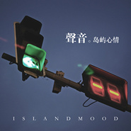

声音
============================

|  |  |
| :--: | :-- |
| [ 声音](https://emumo.xiami.com/album/1592895336) | **艺人**: [岛屿心情](../index.md) **语种**: 国语 **唱片公司**: UANG music **发行时间**: 2013年12月31日 **专辑类别**: EP, 单曲 **专辑风格**: 摇滚 Rock & Roll, 流行摇滚 Pop Rock, 独立摇滚 Indie Rock, 英伦摇滚 Britpop **播放数**: 340294 **收藏数**: 170 **评论数**: 16  |

## 简介

IIIIIIIIIIIIIIIIIIIIIIIIIIIIIIIIIIIIIIIIIIIIIIIIIIIIIIIII 虾米音乐人独家首发 IIIIIIIIIIIIIIIIIIIIIIIIIIIIIIIIIIIIIIIIIIIIIIIIIIIIIIIII  
  
岛屿心情新专辑首支单曲《声音》，现提供免费下载哟~专辑将在2014年5月份虾米首发，请大家多多关注岛屿心情乐队！  
醉生梦死的时代总是在冲击人们无助的灵魂，在痛苦与无奈后，我们的声音变的勇敢又懦弱，不是不打算批判与反抗，只是我们都别无选择。 

## 曲目

## 评论

|  |  |  |  |
| :-- | :-- | :-- | :-- |
|  [虾米用户](https://emumo.xiami.com/u/151783738)   2020-08-18 08:59 赞(0) 踩(0) | 
mimini
 |
|  [虾米用户](https://emumo.xiami.com/u/329176999) 不过原上风 2019-06-06 07:29 赞(0) 踩(0) | 
声音是我这几年最喜欢的一首歌了 但这个版本既然第一次听！
 |
|  [虾米用户](https://emumo.xiami.com/u/42963872) 我还没想好要写什么... 2018-12-14 18:34 赞(0) 踩(0) | 
-
 |
|  [虾米用户](https://emumo.xiami.com/u/39195034)   2015-08-13 01:38 赞(0) 踩(0) | 
这版好听
 |
|  [虾米用户](https://emumo.xiami.com/u/5456536) XIA MI 2015-07-26 02:28 赞(1) 踩(0) | 
哥们，给你赞个，一直喜欢你们的音乐，走下去！！！
 |
|  [虾米用户](https://emumo.xiami.com/u/26543825) 暂无签名~ 2014-11-20 09:07 赞(0) 踩(0) | 
来DALI吧
 |
|  [虾米用户](https://emumo.xiami.com/u/10311689) 我食人间烟火 2014-08-12 15:29 赞(2) 踩(0) | 
好活赖活都是自己的选择，总有一天是要死去，活着别对不起自己
 |
|  [虾米用户](https://emumo.xiami.com/u/11463043) 我的心里，永远住着一只小... 2014-08-03 22:16 赞(0) 踩(0) | 
这首歌是一首好歌
 |
|  [虾米用户](https://emumo.xiami.com/u/4091001)  2014-06-08 00:21 赞(0) 踩(0) | 
你的懦弱是这个时代的声音，无人同情，你那可悲的选择！！大爱这歌词
 |
|  [虾米用户](https://emumo.xiami.com/u/1998642)  2014-06-02 20:58 赞(0) 踩(0) | 
好听
 |
|  [虾米用户](https://emumo.xiami.com/u/9385254) FireBugs 火灾现... 2014-04-24 13:35 赞(0) 踩(0) | 
唱出了挣扎。
 |
|  [虾米用户](https://emumo.xiami.com/u/12175196)  2014-03-16 13:34 赞(0) 踩(0) | 
支持支持，希望你们乐迷越来越多！
 |
|  [虾米用户](https://emumo.xiami.com/u/355865) Let it go, l... 2014-03-15 02:15 赞(0) 踩(0) | 
不知道为什么，在现在互联网发达、音乐资源丰富的时代里，点开试听某张专辑之前，我们需要强迫症一样地找一个理由。中国好歌曲是我听这张专辑的理由，有了这个理由，接下来的收藏操作成为了必然。#矫情的要死的评论，可以无视#
 |
|  [虾米用户](https://emumo.xiami.com/u/2412358) 已被格式化。 2014-02-25 10:13 赞(0) 踩(0) | 
先赞一个
 |
|  [虾米用户](https://emumo.xiami.com/u/6336403) 我要如何才能想而不问..... 2014-02-23 22:55 赞(0) 踩(0) | 
支持西安 本土 音乐 大西安威武
 |
|  [虾米用户](https://emumo.xiami.com/u/24352975) 暂无签名~ 2014-02-21 01:55 赞(0) 踩(0) | 
.....
 |
