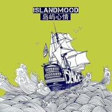

岛屿心情
============================

|  |  |
| :--: | :-- |
| [ 岛屿心情](https://emumo.xiami.com/album/465853) | **艺人**: [岛屿心情](../index.md) **语种**: 国语 **唱片公司**: 时音唱片 **发行时间**: 2011年09月25日 **专辑类别**: EP, 单曲 **专辑风格**:  **播放数**: 2003808 **收藏数**: 870 **评论数**: 73  |

## 简介

岛屿心情乐队的“风格”的确很难界定--有些模糊。四个生活十分朋克的小子对bules Indie 英式等音乐元素的运用是岛屿心情的音乐会给所有人带来一种不可预知的感觉。让你不会一直沉浸在上一首歌当中。你可以从他们身上看到音乐简单而不失细腻。古灵精怪的现场表演。会让你忘记一天的烦恼专注于台上的他们。这就是“岛屿心情”。永远真诚的微笑，永远又脏又旧的鞋。永远乱成一团的头发，永远充满故事他们。  
四年磨一剑，在尚待重新振兴的西安音乐土壤，他们执着地坚持迎来了首个录音室小碟《岛屿心情》发行。

## 曲目

## 评论

|  |  |  |  |
| :-- | :-- | :-- | :-- |
|  [虾米用户](https://emumo.xiami.com/u/9403148)  2020-08-09 02:16 赞(0) 踩(0) | 
给别人安利的时候正是陪伴了自己许久的时候
 |
|  [虾米用户](https://emumo.xiami.com/u/379162683) 我想要记住你们，我想要你... 2020-07-15 12:14 赞(0) 踩(0) | 

 |
|  [虾米用户](https://emumo.xiami.com/u/352476711) 我还没想好要写什么... 2019-06-18 12:25 赞(0) 踩(0) | 
。
 |
|  [虾米用户](https://emumo.xiami.com/u/229556103) 简单就好 2019-01-28 21:06 赞(0) 踩(0) | 
是我想要的
 |
|  [虾米用户](https://emumo.xiami.com/u/42963872) 我还没想好要写什么... 2018-12-14 18:34 赞(0) 踩(0) | 
-
 |
|  [虾米用户](https://emumo.xiami.com/u/36736925) 我还没想好要写什么... 2018-01-27 00:24 赞(0) 踩(0) | 
★
 |
|  [虾米用户](https://emumo.xiami.com/u/1157848) 我还没想好要写什么... 2017-10-30 10:16 赞(1) 踩(0) | 
西安总是变着法子给人惊喜么
 |
|  [虾米用户](https://emumo.xiami.com/u/6170741)  2017-10-30 10:15 赞(1) 踩(0) | 
号称西安本土英伦的味道，感觉还不错#西安#的朋友们听听试试看：）
 |
|  [虾米用户](https://emumo.xiami.com/u/6541362) 一个人游游荡荡 2017-10-28 00:22 赞(2) 踩(0) | 
首先赞一下封面设计！专辑整体水平较高，迟到今天才听到，惋惜！窃喜未错过，关注他们其他的专辑。
 |
|  [虾米用户](https://emumo.xiami.com/u/12230120)  2017-10-27 23:26 赞(1) 踩(0) | 
咱大西安的本土~~现场尤其好哦~~
 |
|  [虾米用户](https://emumo.xiami.com/u/99647068) you only liv... 2017-08-18 14:32 赞(3) 踩(0) | 
这张专辑听了好几年依然好听 每一首都高质量
 |
|  [虾米用户](https://emumo.xiami.com/u/192091446)  2016-09-03 22:36 赞(0) 踩(0) | 
好听的原创
 |
|  [虾米用户](https://emumo.xiami.com/u/24322865) 我还没想好要写什么... 2016-07-10 21:06 赞(0) 踩(0) | 
怎么可以买到这张专辑
 |
| ⇒ |  [虾米用户](https://emumo.xiami.com/u/175535578)  2017-03-07 16:56 赞(0) 踩(0) | 
淘宝上
 |
|  [虾米用户](https://emumo.xiami.com/u/45621221) 卸载状态。 2016-02-05 02:55 赞(0) 踩(0) | 
=
 |
|  [虾米用户](https://emumo.xiami.com/u/54564139)  2016-01-24 01:51 赞(0) 踩(0) | 
不仅喜欢苏子旭的歌，还是同乡
 |
|  [虾米用户](https://emumo.xiami.com/u/41325511) 谁没有故事？ 2016-01-03 00:29 赞(0) 踩(0) | 
真心好
 |
|  [虾米用户](https://emumo.xiami.com/u/38752332) 放 人 自 流 2015-09-28 08:06 赞(1) 踩(0) | 
很好听，难得听到不故意用力的摇滚
 |
|  [虾米用户](https://emumo.xiami.com/u/11317694) 透明的你和我 2015-04-08 01:54 赞(0) 踩(0) | 
多重标签的叠加无法安眠
 |
|  [虾米用户](https://emumo.xiami.com/u/11969859) 感谢相遇 2015-01-29 15:20 赞(1) 踩(0) | 
<a href="http://emumo.xiami.com/u/533148" target="_blank" rel="nofollow" name_card="533148">@bloodysky</a>
 |
|  [虾米用户](https://emumo.xiami.com/u/43612707) 五湖四海，美食与爱。 2014-11-28 22:38 赞(2) 踩(0) | 
支持西安本土乐队
 |
|  [虾米用户](https://emumo.xiami.com/u/33485289) 别晃我，我是可乐 2014-09-22 16:42 赞(0) 踩(0) | 
挺不错
 |
|  [虾米用户](https://emumo.xiami.com/u/9267599) 轻度自闭，fuck天秤 2014-09-14 04:49 赞(2) 踩(0) | 
我有预感岛屿要火得一塌糊涂~哈哈
 |
|  [虾米用户](https://emumo.xiami.com/u/4849100) sherry 2014-07-11 09:33 赞(0) 踩(0) | 
好听
 |
|  [虾米用户](https://emumo.xiami.com/u/9889472) 树 2014-06-21 06:03 赞(3) 踩(0) | 
当你总觉得国外的乐队好水平高的时候忽略了国内也有很多优秀和在进步的乐队，至少你听的懂，这是属于我们本土的财富，这是真正属于我们的摇滚乐！
 |
|  [虾米用户](https://emumo.xiami.com/u/25497309) hey 2014-05-03 17:45 赞(0) 踩(0) | 
爱刘博宽 爱岛屿 爱西安。
 |
|  [虾米用户](https://emumo.xiami.com/u/34449941)  2014-03-26 00:23 赞(9) 踩(0) | 
好歌曲以后开始关注刘博宽和岛屿心情，绝对的惊艳到了，8 8=8居然还不是最好的，这么和我味口的乐队，之前竟然没发现。
 |
|  [虾米用户](https://emumo.xiami.com/u/18389573) be my funera... 2014-03-22 12:06 赞(1) 踩(0) | 
喜欢 未必比国内几个大厂牌下的英摇乐队差
 |
|  [虾米用户](https://emumo.xiami.com/u/6758668)  2014-03-16 20:25 赞(0) 踩(0) | 
作品都很棒~~~~
 |
|  [虾米用户](https://emumo.xiami.com/u/4871918) 爱与和平 2014-02-25 16:07 赞(0) 踩(0) | 
大赞！身为西安人无敌骄傲！我要回我大西安！
 |
| ⇒ |  [虾米用户](https://emumo.xiami.com/u/7478006) on the road 2016-12-30 21:37 赞(0) 踩(0) | 
明晚去看他们现场。
 |
|  [虾米用户](https://emumo.xiami.com/u/17764107) 小悲伤，小忧郁，小无语 2013-09-02 21:22 赞(0) 踩(0) | 
很喜欢
 |
|  [虾米用户](https://emumo.xiami.com/u/17764107) 小悲伤，小忧郁，小无语 2013-09-02 21:21 赞(0) 踩(0) | 
摇滚，中国摇滚
 |
|  [虾米用户](https://emumo.xiami.com/u/10801811) 甲鱼甲鱼 2013-09-01 21:55 赞(0) 踩(0) | 
国内摇滚！！！不错
 |
|  [虾米用户](https://emumo.xiami.com/u/2804005) 　　　NO GODS O... 2013-06-09 03:51 赞(0) 踩(0) | 
封面!!!!!!
 |
|  [虾米用户](https://emumo.xiami.com/u/7408694)  2013-01-25 13:44 赞(0) 踩(0) | 
真欢乐。
 |
|  [虾米用户](https://emumo.xiami.com/u/384422)  2013-01-24 23:04 赞(0) 踩(0) | 
想起来四年前的冬天QAQ
 |
|  [虾米用户](https://emumo.xiami.com/u/2524722) 主是生活的目的～ 2013-01-18 16:29 赞(0) 踩(0) | 
好HAPPY~
 |
|  [虾米用户](https://emumo.xiami.com/u/10358746) 一拳打在棉花上 2013-01-17 14:04 赞(0) 踩(0) | 
五星
 |
|  [虾米用户](https://emumo.xiami.com/u/4733702)  2013-01-06 17:45 赞(0) 踩(0) | 
节奏好
 |
|  [虾米用户](https://emumo.xiami.com/u/3258228) 若即若离 2012-12-26 15:00 赞(0) 踩(0) | 
西安
 |
|  [虾米用户](https://emumo.xiami.com/u/8571859) 誓言没有美好的！只有现实 2012-12-21 15:47 赞(0) 踩(0) | 
国内EP有点意思
 |
|  [虾米用户](https://emumo.xiami.com/u/3751451)  2012-12-19 22:40 赞(0) 踩(0) | 
not bad!
 |
|  [虾米用户](https://emumo.xiami.com/u/1631012) 找歌中... 2012-12-18 14:54 赞(0) 踩(0) | 
支持我们陕西本土
 |
|  [虾米用户](https://emumo.xiami.com/u/3044120) 自愈系 2012-12-16 22:02 赞(0) 踩(0) | 
喜欢喜欢喜欢喜欢
 |
|  [虾米用户](https://emumo.xiami.com/u/6719785)   2012-12-15 23:44 赞(0) 踩(0) | 
已经离开西安了 但西安的这些乐队真的好想念
 |
|  [虾米用户](https://emumo.xiami.com/u/8307226)  2012-12-11 21:50 赞(0) 踩(0) | 
当一切结束时~~觉得很好听~
 |
|  [虾米用户](https://emumo.xiami.com/u/7395335) 只有音乐才是我的解药 2012-12-10 13:35 赞(0) 踩(0) | 
西安的本土英伦，，，，
 |
|  [虾米用户](https://emumo.xiami.com/u/5387933)   2012-12-01 05:49 赞(0) 踩(0) | 
有点英式摇滚的味道~喜欢Mission A~&amp;gt;&amp;lt;
 |
|  [虾米用户](https://emumo.xiami.com/u/1277527) 网易云：糖衣心脏 2012-11-19 11:36 赞(0) 踩(0) | 
喜欢啊
 |
|  [虾米用户](https://emumo.xiami.com/u/428038)  2012-10-03 16:00 赞(0) 踩(0) | 
听了这么多天摇滚心情第一次变得阳光般灿烂。。。
 |
|  [虾米用户](https://emumo.xiami.com/u/6531057)  2012-08-10 13:43 赞(0) 踩(0) | 
终于发现唱英式朋克的中国团了
 |
|  [虾米用户](https://emumo.xiami.com/u/2796893) 在没有水的地方想象自己是... 2012-06-22 14:48 赞(0) 踩(0) | 
听了心情好~~喜欢~~
 |
|  [虾米用户](https://emumo.xiami.com/u/6383392)   2012-06-04 22:27 赞(0) 踩(0) | 
昨天的现场很棒
 |
|  [虾米用户](https://emumo.xiami.com/u/1434546)  2012-05-25 15:39 赞(0) 踩(0) | 
摇摆啊摇摆~
 |
|  [虾米用户](https://emumo.xiami.com/u/812392) q音网易搜央央小月，酷g... 2012-05-10 19:00 赞(0) 踩(0) | 
我的夏天必听专辑
 |
|  [虾米用户](https://emumo.xiami.com/u/476259) 我还没想好要写什么... 2012-05-06 01:16 赞(0) 踩(0) | 
想起来最早听到逃跑计划的感觉  怎么说  求别红！
 |
|  [虾米用户](https://emumo.xiami.com/u/6284858)  2012-04-03 12:05 赞(0) 踩(0) | 
今年看过这个乐队的现场，真的挺不错的~在这样儿的好天儿里，听他们的英伦范儿心里挺美的~这几个小伙儿的东西的确是不错来着O(∩_∩)O哈！
 |
|  [虾米用户](https://emumo.xiami.com/u/586331) 我还没想好要写什么... 2012-01-26 16:33 赞(1) 踩(0) | 
假如我是一个病人不用思考剩下的日子没有悲伤也没有快乐常常分不清你我
 |
|  [虾米用户](https://emumo.xiami.com/u/2445118) 这个世界需要音乐！我的生... 2011-12-03 15:54 赞(0) 踩(0) | 
Enjoy the sunshine
 |
|  [虾米用户](https://emumo.xiami.com/u/6859537)  2011-12-02 16:00 赞(0) 踩(0) | 
好想回西安，吃我想念很久的各种零食，然后跟哥们们去听他们的现场！！
 |
|  [虾米用户](https://emumo.xiami.com/u/2104186)  2011-11-29 16:19 赞(0) 踩(0) | 
中国英伦...
 |
|  [虾米用户](https://emumo.xiami.com/u/4450923)  2011-11-26 20:50 赞(0) 踩(0) | 
非常像的英伦风格
 |
|  [虾米用户](https://emumo.xiami.com/u/2761026)  2011-10-17 00:40 赞(0) 踩(0) | 
自我
 |
|  [虾米用户](https://emumo.xiami.com/u/5142613) 同穴窅冥何所望 他生缘会... 2011-10-12 23:06 赞(0) 踩(0) | 
西安滴。。。。
 |
|  [虾米用户](https://emumo.xiami.com/u/547986)  2011-09-29 19:45 赞(0) 踩(0) | 
加油！嘿 嘿 嘿嘿
 |
|  [虾米用户](https://emumo.xiami.com/u/1664435)  2011-09-29 11:23 赞(0) 踩(0) | 
有一点小惊艳
 |
| ⇒ |  [虾米用户](https://emumo.xiami.com/u/2652428)  2011-09-29 16:40 赞(0) 踩(0) | 
跟着你过来的~
 |
| ⇒ |  [虾米用户](https://emumo.xiami.com/u/2059114) 时间走着自己的路，我们也... 2011-10-01 20:05 赞(0) 踩(0) | 
<q><b>focus说：</b></q>
 |
| ⇒ |  [虾米用户](https://emumo.xiami.com/u/3643056)  2011-10-06 08:55 赞(0) 踩(0) | 
EP版的？
 |
| ⇒ |  [虾米用户](https://emumo.xiami.com/u/1664435)  2011-10-06 09:01 赞(0) 踩(0) | 
<q><b>M也伟大说：</b></q>
 |
|  [虾米用户](https://emumo.xiami.com/u/2454812)  2011-09-26 22:32 赞(0) 踩(0) | 
关于未来我不知道
 |
|  [虾米用户](https://emumo.xiami.com/u/5837950)  2011-09-15 22:21 赞(0) 踩(0) | 
封面真美
 |
