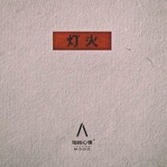
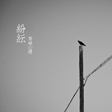

岛屿心情
============================

|  |  |
| :--: | :-- |
| [ 岛屿心情](https://i.xiami.com/daoyuxinqing) | **播放数**: 5421043 **粉丝数**: 9134 **评论数**: 280 **地区**: China 中国大陆 **风格**: 独立摇滚 Indie Rock, 英伦摇滚 Britpop, 另类摇滚 Alternative Rock  |

## 档案

成员： 
主唱、吉他：刘博宽 
吉他：史维旭 
贝司：张龙 
鼓：格桑咸俊 
经纪人：UANG music 张默涵 13701999795 15121058110 
2007年11月成立于古城西安，一支标榜自由以爱为源动力的乐队。华灯初上，撬开紧锁的摇滚之门，吉他的琴弦声嘶力竭，贝斯的怀旧低吟，鼓声的躁动，如狂风般席卷你的神经。 
每个人的心中都有一座属于自己的“岛屿”， 那里充满自由、执着、与希望。而对于岛屿心情，那座岛，更是一个神奇的存在。在那里，他们用音乐呐喊生命的意义。有对往昔的追忆；有年少轻狂的苦闷；有垮掉一代的歇斯底里；有切·格瓦拉的革命激情；这就是岛屿心情。无论是成立初期简单明快的节奏，亦或是成熟后激扬奋进的曲风。这一路，都彰显出他们杰出的音乐天分与创作才华。泰戈尔说过“世界在踌躇之心的琴弦上跑过去，奏出忧郁的乐声”而他们，在音乐中找寻自己，在音乐里融入对时代的认可与不妥协。一步步的迸出黎明的金光。 
在这短短的几年中，乐队以神一样的速度发展壮大着。2011年开始岛屿心情已经成为各大品牌及大型音乐节的宠儿，粉丝团的快速壮大也令很多业内人士摸不着头脑，为什么这支年轻的乐队能够那么快的受到大家的喜爱？原因自然只有听过岛屿心情的乐迷们心里最清楚.......

## 专辑

| 名称 | 语种 | 唱片公司 | 发行时间 | 专辑类别 | 专辑风格 |
| :--: | :-- | :-- | :-- | :-- | :-- |
| [ ？1](./albums/5020944494.md) | 国语 |  | 2019年04月14日 | 录音室专辑 |  |
| [ 灯火](./albums/2104209478.md) | 国语 | 海蝶音乐 | 2018年11月14日 | EP, 单曲 | 摇滚 Rock & Roll |
| [ 寻找](./albums/2104057112.md) | 国语 | 海蝶 | 2018年09月20日 | EP, 单曲 | 国语流行 Mandarin Pop |
| [ 纷纭](./albums/1833730737.md) | 国语 | UANG music | 2015年08月12日 | 录音室专辑 | 流行摇滚 Pop Rock |
| [ 声音](./albums/1592895336.md) | 国语 | UANG music | 2013年12月31日 | EP, 单曲 | 摇滚 Rock & Roll, 流行摇滚 Pop Rock, 独立摇滚 Indie Rock, 英伦摇滚 Britpop |
| [ 岛屿心情](./albums/465853.md) | 国语 | 时音唱片 | 2011年09月25日 | EP, 单曲 |  |

## 评论

|  |  |  |  |
| :-- | :-- | :-- | :-- |
|  [虾米用户](https://emumo.xiami.com/u/194363877)  2020-12-28 19:18 赞(1) 踩(0) | 
这主唱真的是带劲儿！国内摇滚圈唱功前十真的是没跑儿了！
 |
|  [虾米用户](https://emumo.xiami.com/u/362083809) 尘归尘 2020-11-12 08:42 赞(1) 踩(0) | 
好听死了，我死了
 |
|  [虾米用户](https://emumo.xiami.com/u/317222) Bye～ 2020-10-06 15:28 赞(1) 踩(0) | 
不浮躁，没有野心，很深沉的乐队～
 |
|  [虾米用户](https://emumo.xiami.com/u/18570238) 我还没想好要写什么... 2020-09-27 18:27 赞(2) 踩(0) | 
啥婶巡演？
 |
|  [虾米用户](https://emumo.xiami.com/u/41563980) 音痴。 2020-09-02 15:01 赞(1) 踩(0) | 
摊儿猪
 |
|  [虾米用户](https://emumo.xiami.com/u/16110042)  2020-08-19 21:56 赞(2) 踩(0) | 
感觉他们的很多歌是political fable
 |
|  [虾米用户](https://emumo.xiami.com/u/38729910)   2020-08-09 13:26 赞(2) 踩(0) | 
咋不唱玩具  应该更炸
 |
|  [虾米用户](https://emumo.xiami.com/u/25715982) 再见辣（超小声） 2020-08-09 10:31 赞(0) 踩(0) | 
哈哈哈哈不想点评
 |
|  [虾米用户](https://emumo.xiami.com/u/39855221)    昆明 汉 普布桑介 2020-08-09 04:21 赞(1) 踩(0) | 
凌晨睁一只眼闭一只眼打开乐夏只为看你 一开口时间就回到了大学宿舍. 手里拿着的是我们本地的杨林肥酒. 哈哈哈岁月不饶人 你也比开公交车的时候胖多了. 未来可期 加油
 |
|  [虾米用户](https://emumo.xiami.com/u/9310633) 我还没想好要写什么... 2020-08-09 02:09 赞(0) 踩(0) | 

 |
|  [虾米用户](https://emumo.xiami.com/u/346492287) 虾米不要离开我！ 2020-08-09 00:34 赞(0) 踩(0) | 

 |
|  [虾米用户](https://emumo.xiami.com/u/53737210) 哼哼哼 2020-07-30 16:56 赞(5) 踩(0) | 
丁太升:我知道，台湾年轻一批乐队里的一支   
 |
| ⇒ |  [虾米用户](https://emumo.xiami.com/u/321736834) 毛裤太扎 2020-08-03 14:00 赞(0) 踩(0) | 
我在b站上看到这段了，其他乐队也说不知道，也许故意的吧。
 |
|  [虾米用户](https://emumo.xiami.com/u/406324296) 我还没想好要写什么... 2020-05-08 13:52 赞(0) 踩(0) | 
有群吗，拉我
 |
|  [虾米用户](https://emumo.xiami.com/u/379162683) 我想要记住你们，我想要你... 2020-05-01 13:48 赞(0) 踩(0) | 

 |
|  [虾米用户](https://emumo.xiami.com/u/340903899) 我还没想好要写什么... 2020-04-05 17:21 赞(1) 踩(0) | 
，
 |
|  [虾米用户](https://emumo.xiami.com/u/435393120)  2020-02-12 09:58 赞(1) 踩(0) | 
嗯
 |
|  [虾米用户](https://emumo.xiami.com/u/309287338) 自我救赎 2020-02-05 20:20 赞(0) 踩(0) | 
为什么没有《影子》啊？
 |
|  [虾米用户](https://emumo.xiami.com/u/61829132)   2019-11-05 09:40 赞(0) 踩(0) | 
为什么没有《岛》？
 |
|  [虾米用户](https://emumo.xiami.com/u/62829070) 珍重 2019-09-13 01:23 赞(2) 踩(0) | 
我就想知道刘博宽现在还开公交车不?
 |
|  [虾米用户](https://emumo.xiami.com/u/4905854) 没有我的歌，如何爱你 2019-08-22 11:38 赞(0) 踩(0) | 
新专辑啥时候上呀
 |
|  [虾米用户](https://emumo.xiami.com/u/3584485)  2019-08-21 16:50 赞(1) 踩(0) | 
去参加月队的夏天 
 |
|  [虾米用户](https://emumo.xiami.com/u/52536056) (◉ω◉υ)⁼³₌₃悄咪... 2019-08-08 12:46 赞(0) 踩(0) | 
( ͡吸ᴥ ͡吸ʋ)
 |
|  [虾米用户](https://emumo.xiami.com/u/355248863) 我还没想好要写什么... 2019-07-25 14:24 赞(0) 踩(0) | 
随机听到的，很喜欢这样的风格
 |
|  [虾米用户](https://emumo.xiami.com/u/92782630)   2019-07-21 13:13 赞(1) 踩(0) | 
去乐队的夏天呀 等你们
 |
|  [虾米用户](https://emumo.xiami.com/u/3707881) 等你有版权了我会回来爱你... 2019-07-14 11:49 赞(0) 踩(0) | 
喜欢主唱的声音
 |
|  [虾米用户](https://emumo.xiami.com/u/196131140) 点击编辑 2019-06-23 21:34 赞(1) 踩(0) | 
我是第251位评论的，所以我楼下是250  
 |
|  [虾米用户](https://emumo.xiami.com/u/262020643) 这家伙很愚蠢什么也没留下... 2019-06-03 20:10 赞(0) 踩(0) | 
不够好
 |
|  [虾米用户](https://emumo.xiami.com/u/498789) 青山綠水 江湖再見 2019-05-11 18:24 赞(0) 踩(0) | 
Hey~ 5.25 武汉见！
 |
|  [虾米用户](https://emumo.xiami.com/u/9342279)  2019-04-24 15:24 赞(0) 踩(0) | 
为什么19年演出没有广州啊
 |
|  [虾米用户](https://emumo.xiami.com/u/212356465) 庸人罢了 2019-04-04 11:30 赞(1) 踩(0) | 
济南的有一起吗
 |
|  [虾米用户](https://emumo.xiami.com/u/219335160) 为音乐而亡 2019-03-14 17:11 赞(2) 踩(0) | 
5月迷笛见！！
 |
|  [虾米用户](https://emumo.xiami.com/u/307480030) 我还没想好要写什么... 2019-01-13 23:27 赞(0) 踩(0) | 
牛逼
 |
|  [虾米用户](https://emumo.xiami.com/u/44274771) 歌单才是灵魂的匹配 2019-01-07 21:02 赞(3) 踩(0) | 
2019的第一场现场给了岛屿心情209.01.06深圳b10终身难忘啊岛屿 牛逼跳哭了 笑哭了 唱哭 听哭第二天肺腑之痛啊
 |
|  [虾米用户](https://emumo.xiami.com/u/267249250) 认清生活里的苦痛，然后在... 2019-01-05 23:48 赞(3) 踩(0) | 
从别的平台发现《蝼蚁》这首歌，这个宝藏居然被我发现，很喜欢的风格，每一首都好喜欢好喜欢！！加油～
 |
|  [虾米用户](https://emumo.xiami.com/u/42963872) 我还没想好要写什么... 2018-12-14 18:33 赞(1) 踩(0) | 
-
 |
|  [虾米用户](https://emumo.xiami.com/u/107020422) 已结冰的湖面落上新鲜的雪 2018-12-02 09:34 赞(0) 踩(0) | 
昨天晚上太棒啦，很享受！
 |
|  [虾米用户](https://emumo.xiami.com/u/9229744) judge me 2018-11-17 02:35 赞(0) 踩(0) | 
现场棒到流眼泪 
 |
|  [虾米用户](https://emumo.xiami.com/u/102674228) 我还没想好要写什么... 2018-11-15 11:36 赞(0) 踩(0) | 
居然是西安的乐队
 |
|  [虾米用户](https://emumo.xiami.com/u/777675) 事物发生研究员 2018-10-19 21:23 赞(1) 踩(0) | 
快把公告栏更新了！
 |
|  [虾米用户](https://emumo.xiami.com/u/98065492) 这个人很丧，什么也不想写... 2018-10-11 17:51 赞(0) 踩(0) | 
欢迎来郑州！！！票刚出就买啦
 |
|  [虾米用户](https://emumo.xiami.com/u/15846170)   2018-09-23 03:33 赞(0) 踩(0) | 
啥时候出新专辑啊
 |
|  [虾米用户](https://emumo.xiami.com/u/137739) 一支乐队 2018-09-05 08:48 赞(0) 踩(0) | 
好样的!
 |
|  [虾米用户](https://emumo.xiami.com/u/49655313) 除了再见还可以说些什么呢 2018-08-29 04:07 赞(1) 踩(0) | 
西安土著喜欢上了西安乐队真好
 |
|  [虾米用户](https://emumo.xiami.com/u/401595144)  2018-08-14 19:00 赞(0) 踩(0) | 
嗓子真耐草
 |
|  [虾米用户](https://emumo.xiami.com/u/11979517) xj 2018-08-13 18:51 赞(0) 踩(0) | 
好有力量！
 |
|  [虾米用户](https://emumo.xiami.com/u/466627) 我还没想好要写什么... 2018-07-23 14:18 赞(0) 踩(0) | 
遗憾在糖果首专一首都没听到，不知道什么原因
 |
|  [虾米用户](https://emumo.xiami.com/u/44671454) 搬进不失眠旅馆 2018-06-17 21:31 赞(0) 踩(0) | 
在不相信爱情一类的东西之后，发现岛屿心情是真的牛逼，刘博宽是真的牛逼
 |
|  [虾米用户](https://emumo.xiami.com/u/124125762) 没有。 2018-05-14 12:46 赞(0) 踩(0) | 
真的很棒。
 |
|  [虾米用户](https://emumo.xiami.com/u/357674040)  2018-05-05 05:31 赞(0) 踩(0) | 
 
 |
|  [虾米用户](https://emumo.xiami.com/u/44671454) 搬进不失眠旅馆 2018-04-02 08:37 赞(2) 踩(0) | 
刘博宽牛逼！！
 |
|  [虾米用户](https://emumo.xiami.com/u/52708168) 广天一夜暖如血 2018-03-10 20:14 赞(0) 踩(0) | 
听到《游》路转粉！！
 |
|  [虾米用户](https://emumo.xiami.com/u/9229744) judge me 2017-12-23 00:08 赞(0) 踩(0) | 
哈啰
 |
|  [虾米用户](https://emumo.xiami.com/u/53708794) Don't stop m... 2017-12-16 19:58 赞(0) 踩(0) | 
去看你们
 |
|  [虾米用户](https://emumo.xiami.com/u/2718342) 我決定快樂起來 我今天就... 2017-12-14 22:24 赞(0) 踩(0) | 
明晚46見：）
 |
|  [虾米用户](https://emumo.xiami.com/u/12717438) love will ke... 2017-12-01 00:29 赞(0) 踩(0) | 
12.09欧拉见
 |
|  [虾米用户](https://emumo.xiami.com/u/9372715) 孤独的人听后摇。 2017-11-22 20:36 赞(1) 踩(0) | 
岛呢
 |
|  [虾米用户](https://emumo.xiami.com/u/8192862) 诗人和先知。vchat:... 2017-11-19 21:40 赞(0) 踩(0) | 
求个广州场歌单，来晚了，现场妹纸竟然比男粉多，惊呆。
 |
|  [虾米用户](https://emumo.xiami.com/u/7857624)  2017-11-17 20:44 赞(0) 踩(0) | 
武汉见
 |
|  [虾米用户](https://emumo.xiami.com/u/3853761)  2017-11-17 13:49 赞(1) 踩(0) | 
5890P-[=|+}-['0P9I8U7Y6T5R4E3W2Q1
 |
|  [虾米用户](https://emumo.xiami.com/u/13691875) 谁的感叹 偶然合拍 2017-11-11 03:06 赞(0) 踩(0) | 
起初以为是女声主唱，一直没听。相见恨晚
 |
|  [虾米用户](https://emumo.xiami.com/u/715923)   2017-11-06 11:18 赞(1) 踩(0) | 
11 24 成都见
 |
|  [虾米用户](https://emumo.xiami.com/u/306095632)  2017-10-31 16:52 赞(1) 踩(0) | 
几年前听8+8=8超级喜欢！没想到过后组了乐队，今天偶然听了另一首觉得好听，没想到找到了这首歌。我还以为是翻唱。坚持着，真好！
 |
|  [虾米用户](https://emumo.xiami.com/u/4871918) 爱与和平 2017-10-28 00:33 赞(1) 踩(0) | 
大赞！旋律超棒，主唱声音不错！真没想到，如此小乐队的专辑制作如此上乘！作为不在西安的西安人无敌骄傲！
 |
|  [虾米用户](https://emumo.xiami.com/u/8728253) 只有被愛 2017-10-28 00:02 赞(1) 踩(0) | 
最喜歡回憶之後這首歌，看似美麗的城市有著太多悲傷的故事，我覺得很適合北京
 |
| ⇒ |  [虾米用户](https://emumo.xiami.com/u/26489198)   2018-11-19 09:49 赞(0) 踩(0) | 
讲得好
 |
|  [虾米用户](https://emumo.xiami.com/u/43182804) 最孤独的人 2017-10-18 22:52 赞(0) 踩(0) | 

 |
|  [虾米用户](https://emumo.xiami.com/u/24170187)  2017-10-13 10:42 赞(0) 踩(0) | 
每首歌，都刚刚好可以打动我。谢谢。
 |
|  [虾米用户](https://emumo.xiami.com/u/180847) 只有心知道 岁月不宽宏 2017-10-09 12:14 赞(0) 踩(0) | 
广州见
 |
|  [虾米用户](https://emumo.xiami.com/u/4902402)   2017-09-20 11:08 赞(0) 踩(0) | 
发现的太晚了
 |
|  [虾米用户](https://emumo.xiami.com/u/83893196) 我还没想好要写什么... 2017-07-08 18:30 赞(0) 踩(0) | 
&amp;hellip;&amp;hellip;
 |
|  [虾米用户](https://emumo.xiami.com/u/46401978)   2017-06-29 21:14 赞(0) 踩(0) | 
可爱
 |
|  [虾米用户](https://emumo.xiami.com/u/16010395)  2017-05-22 19:07 赞(1) 踩(0) | 
（过着安定的生活 昨天你来不及 明天就会可惜 今天你要嫁给我...）你确定关 于未来 我不知道 这首 前奏不可以这样唱？？？
 |
|  [虾米用户](https://emumo.xiami.com/u/284865237) merry christ... 2017-05-05 07:23 赞(1) 踩(0) | 
歌词加把劲 其他都够
 |
|  [虾米用户](https://emumo.xiami.com/u/213903804)   2017-04-25 07:39 赞(0) 踩(0) | 
不错
 |
|  [虾米用户](https://emumo.xiami.com/u/97747450) 我还没想好要写什么... 2017-04-20 23:14 赞(1) 踩(0) | 
9503
 |
|  [虾米用户](https://emumo.xiami.com/u/30846558)   2017-04-17 17:17 赞(0) 踩(0) | 
indie rock 万岁！！！！！！！！！！！！！！！
 |
|  [虾米用户](https://emumo.xiami.com/u/33181013) 慢 2017-03-09 12:24 赞(0) 踩(0) | 

 |
|  [虾米用户](https://emumo.xiami.com/u/46008502)  2017-02-14 15:46 赞(0) 踩(0) | 
全部下架了 草 正听着呢
 |
|  [虾米用户](https://emumo.xiami.com/u/1577426)  2017-02-11 00:36 赞(0) 踩(0) | 
ok
 |
|  [虾米用户](https://emumo.xiami.com/u/29230195) Gubba nub nu... 2017-01-19 20:29 赞(0) 踩(0) | 
快十年
 |
|  [虾米用户](https://emumo.xiami.com/u/5721676) 瀑瀑是最棒的！ 2016-11-23 09:31 赞(0) 踩(0) | 
光用声音就撸去了我的心跳。
 |
|  [虾米用户](https://emumo.xiami.com/u/4174743) 昨天今天的人们没有改变 ... 2016-10-19 16:45 赞(0) 踩(0) | 
真心喜欢，一直支持祝你们唱得开心吧：）
 |
|  [虾米用户](https://emumo.xiami.com/u/123373292) Guess  what ... 2016-10-02 04:05 赞(0) 踩(0) | 
迷笛我一定去看你们！听了好久
 |
|  [虾米用户](https://emumo.xiami.com/u/5686209)   2016-09-23 17:12 赞(0) 踩(0) | 
为啥你们每首歌总让我惊喜
 |
|  [虾米用户](https://emumo.xiami.com/u/45017963) 谈爱已老  谈死太早❤ 2016-09-07 11:22 赞(0) 踩(0) | 
声音很喜欢。
 |
|  [虾米用户](https://emumo.xiami.com/u/6965583) 人體穿刺師° 2016-09-05 18:03 赞(0) 踩(0) | 
luv #
 |
|  [虾米用户](https://emumo.xiami.com/u/41142955) 嘘 2016-09-03 21:39 赞(1) 踩(0) | 
天天向上观光团
 |
|  [虾米用户](https://emumo.xiami.com/u/35251651) 人生何处不青山 2016-09-03 18:19 赞(0) 踩(0) | 
谢谢来哥
 |
|  [虾米用户](https://emumo.xiami.com/u/102545940) 睡得太晚 爱的太满 2016-09-02 17:44 赞(0) 踩(0) | 
相见恨晚
 |
|  [虾米用户](https://emumo.xiami.com/u/44140680) 旅途愉快 2016-08-08 21:36 赞(0) 踩(0) | 
⚫️
 |
|  [虾米用户](https://emumo.xiami.com/u/4795452) 黑色玻璃里有你想要的样子 2016-07-27 08:17 赞(0) 踩(0) | 
好牛逼！！！
 |
|  [虾米用户](https://emumo.xiami.com/u/46284980) 谢谢你让我成为了我 2016-07-26 19:56 赞(0) 踩(0) | 
你好你好
 |
|  [虾米用户](https://emumo.xiami.com/u/7206504) 一天两包中南海 2016-07-17 02:24 赞(2) 踩(0) | 
FUZZ和你们搞基吗？ tu凸现场棒
 |
|  [虾米用户](https://emumo.xiami.com/u/119896142)   2016-06-28 23:54 赞(0) 踩(0) | 
足够呐喊
 |
|  [虾米用户](https://emumo.xiami.com/u/9261181) 我还没想好要写什么... 2016-06-15 21:21 赞(0) 踩(0) | 
新专录音质量很高啊，签了公司吗
 |
|  [虾米用户](https://emumo.xiami.com/u/29230195) Gubba nub nu... 2016-06-07 22:36 赞(0) 踩(0) | 
..
 |
|  [虾米用户](https://emumo.xiami.com/u/36057872) 网易/BC: Breat... 2016-05-08 13:40 赞(0) 踩(0) | 
~
 |
|  [虾米用户](https://emumo.xiami.com/u/40161975) 独立音乐 my favi 2016-04-26 19:27 赞(0) 踩(0) | 
也就这样吧
 |
|  [虾米用户](https://emumo.xiami.com/u/42390597) See who give... 2016-04-10 10:52 赞(0) 踩(0) | 
期待2016
 |
|  [虾米用户](https://emumo.xiami.com/u/3552342) 孤独一人 照顾星辰 2016-04-09 12:02 赞(1) 踩(0) | 
有态度的乐队
 |
|  [虾米用户](https://emumo.xiami.com/u/39436088) Still singin... 2016-03-10 00:45 赞(0) 踩(0) | 

 |
|  [虾米用户](https://emumo.xiami.com/u/39274769) 你会不会一去不回来 2016-03-03 09:00 赞(3) 踩(0) | 
憋唱了 吻我
 |
|  [虾米用户](https://emumo.xiami.com/u/6169231)  2016-02-29 17:25 赞(1) 踩(0) | 
人美歌甜
 |
|  [虾米用户](https://emumo.xiami.com/u/26490904)  2016-02-22 23:01 赞(0) 踩(0) | 
感受我所想 我所爱  享受坚强松懈的生活
 |
|  [虾米用户](https://emumo.xiami.com/u/3815293) baby Jesus s... 2016-02-22 11:45 赞(0) 踩(0) | 
人美歌甜 
 |
|  [虾米用户](https://emumo.xiami.com/u/23039277) 心之葬礼 2016-01-20 23:22 赞(1) 踩(0) | 
好像没什么人黑，难得，很棒的乐队
 |
|  [虾米用户](https://emumo.xiami.com/u/34282803) 七里红袖，百里缎 2016-01-12 16:52 赞(0) 踩(0) | 
爱上一个乐队
 |
|  [虾米用户](https://emumo.xiami.com/u/36530332)  2016-01-12 13:43 赞(1) 踩(0) | 
加油！！！岛屿心情最牛逼
 |
|  [虾米用户](https://emumo.xiami.com/u/13701235) Devil may cr... 2016-01-05 18:35 赞(0) 踩(0) | 
加油！
 |
|  [虾米用户](https://emumo.xiami.com/u/41325511) 谁没有故事？ 2016-01-03 00:29 赞(2) 踩(0) | 
我大西安牛逼的乐队！
 |
|  [虾米用户](https://emumo.xiami.com/u/45965123) 我还没想好要写什么... 2016-01-01 14:50 赞(1) 踩(0) | 
因為迷笛
 |
|  [虾米用户](https://emumo.xiami.com/u/36203222) 生活里没有音乐 2015-12-31 20:34 赞(0) 踩(0) | 
透
 |
|  [虾米用户](https://emumo.xiami.com/u/45012581)  2015-12-30 12:27 赞(2) 踩(0) | 
听了以后我认为，当年在中国好歌曲是对的。 
 |
|  [虾米用户](https://emumo.xiami.com/u/9123809) 我还没想好要写什么... 2015-12-26 18:43 赞(1) 踩(0) | 
失落总在回忆之后天真的梦是虚幻的天空 
 |
|  [虾米用户](https://emumo.xiami.com/u/83877772)  2015-12-24 00:03 赞(1) 踩(0) | 
为我们大咸阳赞
 |
|  [虾米用户](https://emumo.xiami.com/u/46367396)   2015-12-21 14:41 赞(1) 踩(0) | 
多好的乐队，摇滚不一定就代表着嘶吼，更重要的是精神上的共鸣与解放。
 |
|  [虾米用户](https://emumo.xiami.com/u/51957189) 我还没想好要写什么... 2015-12-10 11:22 赞(1) 踩(0) | 
太难定风格了
 |
| ⇒ |  [虾米用户](https://emumo.xiami.com/u/51631029)   2015-12-30 00:43 赞(0) 踩(0) | 
摇滚
 |
|  [虾米用户](https://emumo.xiami.com/u/70846306)   2015-12-01 17:50 赞(1) 踩(0) | 
新专辑真是厉害 乐器编排的真棒    
 |
|  [虾米用户](https://emumo.xiami.com/u/30280286) 明知不会是坦途，只希望路... 2015-11-30 19:21 赞(1) 踩(0) | 
上海迷笛，西安草莓，还有光圈的现场，3年啦，一直都在！
 |
|  [虾米用户](https://emumo.xiami.com/u/2789426)  2015-11-22 05:24 赞(1) 踩(0) | 
西安乡党，嘹咋咧！
 |
|  [虾米用户](https://emumo.xiami.com/u/46910740) 从今袅袅盈盈处，谁复端端... 2015-10-31 19:38 赞(0) 踩(0) | 
Hey！八点半见！ 
 |
|  [虾米用户](https://emumo.xiami.com/u/37131579) 暂无签名~ 2015-10-18 04:40 赞(0) 踩(0) | 
听名字以为是台湾乐队 
 |
| ⇒ |  [虾米用户](https://emumo.xiami.com/u/519547) 音與樂 愛與恒 2015-11-03 12:48 赞(0) 踩(0) | 
我也这么想滴。。
 |
|  [虾米用户](https://emumo.xiami.com/u/41756149) 抛不下的垃圾虾米 2015-10-16 10:28 赞(0) 踩(0) | 
超级喜欢
 |
|  [虾米用户](https://emumo.xiami.com/u/3951581) Everything i... 2015-09-30 09:51 赞(1) 踩(0) | 
23号！成都！约！
 |
|  [虾米用户](https://emumo.xiami.com/u/35106822) nothing(我自己写... 2015-09-09 20:07 赞(3) 踩(0) | 
觉得声音有时候挺科本的
 |
|  [虾米用户](https://emumo.xiami.com/u/46947905)  2015-09-04 03:50 赞(1) 踩(0) | 
声音这歌儿太棒了。北京我一定要听现场。
 |
|  [虾米用户](https://emumo.xiami.com/u/49455654)  2015-08-27 16:28 赞(0) 踩(0) | 
不错不错
 |
|  [虾米用户](https://emumo.xiami.com/u/612877)  2015-08-14 10:27 赞(1) 踩(0) | 
哈哈哈哈，为啥要起一个这么小清新的名字～我还以为是丁可那种呢，哈哈哈。
 |
|  [虾米用户](https://emumo.xiami.com/u/33025643)  2015-08-12 14:12 赞(0) 踩(0) | 
期待什么时候来南京演出
 |
|  [虾米用户](https://emumo.xiami.com/u/973055) 人生固然有芳华，卻也不过... 2015-08-05 19:21 赞(2) 踩(0) | 
声线有时很像科本。
 |
|  [虾米用户](https://emumo.xiami.com/u/1515590) 我还没想好要写什么... 2015-08-04 16:17 赞(0) 踩(0) | 
<a href="http://www.musikid.com/project/1474" target="_blank" rel="nofollow noreferrer noopener">http://www.musikid.com/project/1474</a>  首张专辑预售中 大家快来支持
 |
|  [虾米用户](https://emumo.xiami.com/u/1179054)  2015-08-03 15:53 赞(0) 踩(0) | 
每天上一次虾米就是在等右上角的消息提示中心挂个新的数字，每次点进去就跟刮彩票一样。。。。。。等新砖的感觉好爽~~~~~
 |
|  [虾米用户](https://emumo.xiami.com/u/46043091) 合作邮箱85461134... 2015-08-02 03:08 赞(1) 踩(0) | 
UP音乐节吓坏了，上来还以为是碾核，后边演了两首Grunge一点的，Funk元素很浓，都很喜欢，可惜还没有上传。
 |
|  [虾米用户](https://emumo.xiami.com/u/1746372) 我懷疑你懷疑我不懷好意 2015-07-31 20:13 赞(1) 踩(0) | 
好怀念和合子在草地上看他们演出
 |
|  [虾米用户](https://emumo.xiami.com/u/12111524) love will te... 2015-07-31 08:36 赞(0) 踩(0) | 
好听
 |
|  [虾米用户](https://emumo.xiami.com/u/1179054)  2015-07-21 11:46 赞(0) 踩(0) | 
七月底了兄弟，请问还要等多久？！？！！？！？？
 |
|  [虾米用户](https://emumo.xiami.com/u/51637005)  2015-06-22 14:26 赞(0) 踩(0) | 
没有回忆之后？
 |
|  [虾米用户](https://emumo.xiami.com/u/194864)  2015-06-17 11:43 赞(0) 踩(0) | 
特别想去听你们的现场  期待！~
 |
|  [虾米用户](https://emumo.xiami.com/u/2418786) 做个牛逼音乐人 2015-06-15 02:45 赞(0) 踩(0) | 
能不能不要给中国乐队加上英伦风的标签，没那么多英伦风
 |
|  [虾米用户](https://emumo.xiami.com/u/15275403) you can find... 2015-06-14 00:47 赞(0) 踩(0) | 
随便听了几首，都不错，可还是没收藏
 |
|  [虾米用户](https://emumo.xiami.com/u/9665052) 我不认识你，你不认识我。 2015-06-13 20:49 赞(0) 踩(0) | 
听到《锁》的时候脑海中竟然想到了天堂乐队的《老谁小谁》《皇城根》。
 |
|  [虾米用户](https://emumo.xiami.com/u/27766706) last days of... 2015-06-13 13:11 赞(0) 踩(0) | 
~
 |
|  [虾米用户](https://emumo.xiami.com/u/50740919)  2015-06-11 22:48 赞(4) 踩(0) | 
零三年咸俊是上玄月的鼓手在咸阳西藏民族学院演出，绮乐琴行来哥，八哥 
 |
|  [虾米用户](https://emumo.xiami.com/u/50740919)  2015-06-11 22:44 赞(1) 踩(0) | 
会咸阳二厂大礼堂，八哥琴行演
 |
|  [虾米用户](https://emumo.xiami.com/u/13925188) 姜酒已然上炉，杯盏恍惚。 2015-06-07 17:57 赞(0) 踩(0) | 
超级期待新专辑！！
 |
|  [虾米用户](https://emumo.xiami.com/u/35981522)   2015-06-05 14:13 赞(0) 踩(0) | 
超级超级超级超级期待新专辑！
 |
|  [虾米用户](https://emumo.xiami.com/u/47711130) 让她降落。 2015-05-23 13:08 赞(0) 踩(0) | 
原来他是这个乐队主唱
 |
|  [虾米用户](https://emumo.xiami.com/u/1400641) never stop 2015-05-22 13:21 赞(0) 踩(0) | 
无人同情你那可悲的选择
 |
|  [虾米用户](https://emumo.xiami.com/u/21691095)  2015-05-18 12:16 赞(1) 踩(0) | 
=_=下半年就指你这个新砖活了！别玩砸了啊！
 |
|  [虾米用户](https://emumo.xiami.com/u/21691095)  2015-05-18 12:15 赞(0) 踩(0) | 
新专辑呢！
 |
|  [虾米用户](https://emumo.xiami.com/u/6179259) 丧失理智 2015-05-04 18:48 赞(0) 踩(0) | 
新砖赶紧啊！！！！
 |
|  [虾米用户](https://emumo.xiami.com/u/2176729) Somewhere I ... 2015-04-27 19:48 赞(0) 踩(0) | 
聲音，好感動！
 |
|  [虾米用户](https://emumo.xiami.com/u/22053106) 物质的短暂情人. 2015-04-26 23:40 赞(0) 踩(0) | 
8+8
 |
|  [虾米用户](https://emumo.xiami.com/u/43958905) 为生活苦苦挣扎又幸福无比... 2015-03-23 22:54 赞(1) 踩(0) | 
史哥，电源还卖不卖啊？
 |
|  [虾米用户](https://emumo.xiami.com/u/4400366) 再也不见 2015-03-16 22:39 赞(0) 踩(0) | 
～
 |
|  [虾米用户](https://emumo.xiami.com/u/11463043) 我的心里，永远住着一只小... 2015-03-15 09:37 赞(0) 踩(0) | 
没新专辑了？
 |
|  [虾米用户](https://emumo.xiami.com/u/15746044) 我还没想好要写什么... 2015-02-18 22:19 赞(1) 踩(0) | 
刘博宽？
 |
|  [虾米用户](https://emumo.xiami.com/u/45267007) 停 止 想 象. 2015-01-30 20:08 赞(0) 踩(0) | 
好喜欢～加油加油
 |
|  [虾米用户](https://emumo.xiami.com/u/2883292) 嘣嘣蹦。 2015-01-18 02:32 赞(0) 踩(0) | 
一号晚上看了现场 很棒
 |
|  [虾米用户](https://emumo.xiami.com/u/12175196)  2015-01-13 20:26 赞(1) 踩(0) | 
更喜欢蔡健雅改编的8+8的我是一个人么？
 |
|  [虾米用户](https://emumo.xiami.com/u/43054930) 爱摇滚！！！ 2015-01-12 11:29 赞(0) 踩(0) | 
很棒啊！！！！！
 |
|  [虾米用户](https://emumo.xiami.com/u/11089572)  2015-01-03 18:07 赞(0) 踩(0) | 
31一号听到的现场真棒
 |
| ⇒ |  [虾米用户](https://emumo.xiami.com/u/45703226)  2015-01-06 15:53 赞(0) 踩(0) | 
好听到哭！
 |
|  [虾米用户](https://emumo.xiami.com/u/369810) √ 2015-01-02 17:36 赞(1) 踩(0) | 
31号在迷笛听现场真是惊艳！
 |
|  [虾米用户](https://emumo.xiami.com/u/1730251)  2015-01-02 13:06 赞(0) 踩(0) | 
深圳迷笛真棒
 |
|  [虾米用户](https://emumo.xiami.com/u/39423400)  2014-12-23 23:53 赞(0) 踩(0) | 
我很喜欢你们的歌词
 |
|  [虾米用户](https://emumo.xiami.com/u/101322) 不怎么听歌了 2014-12-03 13:31 赞(0) 踩(0) | 
很像 旅行团
 |
|  [虾米用户](https://emumo.xiami.com/u/19142733) 摇滚 2014-11-30 21:08 赞(0) 踩(0) | 
岛屿的东西是真的好，可为什么？
 |
|  [虾米用户](https://emumo.xiami.com/u/28783389) 我就是 2014-11-26 10:41 赞(1) 踩(0) | 
优秀的音乐这么多，求推广啊，其实好多人都喜欢只是接触不到，特奶奶的大众媒体
 |
|  [虾米用户](https://emumo.xiami.com/u/28783389) 我就是 2014-11-26 10:39 赞(0) 踩(0) | 
好听
 |
|  [虾米用户](https://emumo.xiami.com/u/37322876) 口味杂到不行的小婊砸 2014-11-15 00:15 赞(0) 踩(0) | 
一首当一切结束时 一开嗓就忍不住找个安静的地方好好欣赏 一曲输入乐队名字  轮着听了一遍  百度岛屿心情  好棒
 |
|  [虾米用户](https://emumo.xiami.com/u/666000) 我会永远爱你，虾米的朋友... 2014-11-14 23:24 赞(0) 踩(0) | 
八年呗
 |
|  [虾米用户](https://emumo.xiami.com/u/1358103) 说到底死去的总是别人。 2014-11-10 19:41 赞(1) 踩(0) | 
我到底做了什么让你难过 我应该做出什么让你记得我。
 |
|  [虾米用户](https://emumo.xiami.com/u/36303608) 有情有义又是无米之炊，潮... 2014-11-04 18:24 赞(2) 踩(0) | 
大咸阳牛逼！
 |
|  [虾米用户](https://emumo.xiami.com/u/37190538) 暂无签名~ 2014-08-30 18:08 赞(1) 踩(0) | 
刚听了东海的现场，真爽，那个鼓手依旧那么风骚
 |
|  [虾米用户](https://emumo.xiami.com/u/21691095)  2014-08-12 13:28 赞(0) 踩(0) | 
表示西安本土最爱乐队没有之一，不过感觉新demo好少，别那么啃老本啊
 |
|  [虾米用户](https://emumo.xiami.com/u/12218580) 暂无签名~ 2014-06-23 19:11 赞(1) 踩(0) | 
中国毁歌曲啊卧槽T_T  害的北京迷笛都没看你们，到唐舞台的时候我就跟小伙伴说这乐队主唱我在好歌曲上听过，一点都不好听，然后我俩都快走出了，听见迷笛现场版的8+8  当时觉得太特么好听了回去搜原版来听百听不厌啊。
 |
| ⇒ |  [虾米用户](https://emumo.xiami.com/u/1730251)  2014-12-15 23:25 赞(0) 踩(0) | 
北京迷笛都唱了些什么歌，深圳跨年等听
 |
|  [虾米用户](https://emumo.xiami.com/u/7744474) 人生怎么能没有BGM。 2014-06-22 15:54 赞(1) 踩(0) | 
好喜欢刘博宽~
 |
|  [虾米用户](https://emumo.xiami.com/u/34236491) 关你屁事 2014-06-16 14:34 赞(1) 踩(0) | 
咸俊在这里人气好旺啊哈哈
 |
|  [虾米用户](https://emumo.xiami.com/u/37043017)   2014-05-31 15:36 赞(0) 踩(0) | 
喜欢～
 |
|  [虾米用户](https://emumo.xiami.com/u/28783389) 我就是 2014-05-27 11:05 赞(1) 踩(0) | 
恩，不错的乐队，喜欢鼓手，因为现场很牛逼
 |
|  [虾米用户](https://emumo.xiami.com/u/11463043) 我的心里，永远住着一只小... 2014-05-19 20:05 赞(0) 踩(0) | 
在草莓第一次接触到你们的作品 ，很喜欢
 |
|  [虾米用户](https://emumo.xiami.com/u/36122937) 其实一直是音乐在玩儿我。 2014-05-13 05:18 赞(1) 踩(0) | 
哈哈。看到底下的评论说，刘博宽像是在唱秦腔。我快笑死了。
 |
|  [虾米用户](https://emumo.xiami.com/u/7786009) 我还没想好要写什么... 2014-05-04 16:28 赞(0) 踩(0) | 
主唱好样
 |
|  [虾米用户](https://emumo.xiami.com/u/3320594) 矛盾综合体 2014-05-03 10:52 赞(1) 踩(0) | 
再说一句，胖鼓手昨天真的很骚啊。
 |
|  [虾米用户](https://emumo.xiami.com/u/3320594) 矛盾综合体 2014-05-03 10:50 赞(0) 踩(0) | 
8+8,前奏有木有TWDY—quiet的感觉，话说昨天那装孙子的一磕确实完爆某某舞曲天团。
 |
|  [虾米用户](https://emumo.xiami.com/u/8340220)   2014-04-28 18:50 赞(0) 踩(0) | 
加油：） 迷笛好棒 耳机里一直单曲循环
 |
|  [虾米用户](https://emumo.xiami.com/u/16551745) byebye｛wb/in... 2014-04-23 10:52 赞(3) 踩(0) | 
说什么只喜欢欧美乐队的人是因为他们从来没听过像这样优秀的国内乐队。
 |
|  [虾米用户](https://emumo.xiami.com/u/10005059) 什么什么什么 2014-04-16 12:02 赞(0) 踩(0) | 
已经被《声音》迷坏了
 |
|  [虾米用户](https://emumo.xiami.com/u/10005059) 什么什么什么 2014-04-16 12:01 赞(1) 踩(0) | 
赞~~~~司机哥哥什么时候出新歌啊~
 |
|  [虾米用户](https://emumo.xiami.com/u/35016691) 我还没想好要写什么... 2014-04-12 08:57 赞(0) 踩(0) | 
期待26号！
 |
|  [虾米用户](https://emumo.xiami.com/u/35121283)  2014-04-09 17:01 赞(0) 踩(0) | 
DSADSAD
 |
|  [虾米用户](https://emumo.xiami.com/u/11090928)  2014-04-04 16:56 赞(0) 踩(0) | 
好
 |
|  [虾米用户](https://emumo.xiami.com/u/10355494) 爱吃丸子。 2014-03-24 04:09 赞(2) 踩(0) | 
司机哥哥你的睫毛真的不是贴的么！扯领带好帅！
 |
|  [虾米用户](https://emumo.xiami.com/u/9380249) 不要来摸我 2014-03-24 03:00 赞(0) 踩(0) | 
被洗脑了，满脑子都是我做错了什么。。。
 |
|  [虾米用户](https://emumo.xiami.com/u/1963119) 全然的倾听。 2014-03-23 21:01 赞(0) 踩(0) | 
如今我只看见汗水挥洒在空气里。 不知其他人怎么解读， 反正我是点头了，很棒！
 |
|  [虾米用户](https://emumo.xiami.com/u/18389573) be my funera... 2014-03-22 12:00 赞(1) 踩(0) | 
惹 看中国好歌曲时很喜欢刘博宽呢 不过他真的是司机？ 这个乐队看样子很火呢 真心求教
 |
| ⇒ |  [虾米用户](https://emumo.xiami.com/u/32677003) 音符之中，纷纭之外 2014-03-23 03:11 赞(0) 踩(0) | 
真是公交司机
 |
| ⇒ |  [虾米用户](https://emumo.xiami.com/u/18389573) be my funera... 2014-03-23 17:18 赞(0) 踩(0) | 
<q><b>岛屿心情说：</b></q>
 |
|  [虾米用户](https://emumo.xiami.com/u/485609) 2015 2014-03-16 20:14 赞(0) 踩(0) | 
刘博宽，哥喜欢~
 |
|  [虾米用户](https://emumo.xiami.com/u/874927)  2014-03-16 19:48 赞(0) 踩(0) | 
很不错
 |
|  [虾米用户](https://emumo.xiami.com/u/721624) 我还没想好要写什么... 2014-03-15 18:46 赞(18) 踩(0) | 
人美歌甜
 |
|  [虾米用户](https://emumo.xiami.com/u/355865) Let it go, l... 2014-03-15 02:10 赞(3) 踩(0) | 
唉，看楼下的评论，只能说是独立音乐的一种拧巴。独立乐迷一方面期待独立团儿们多发好音乐，另一方面又不希望团儿们依靠主流媒体获得更多的关注。可是这样真的大丈夫么？
 |
|  [虾米用户](https://emumo.xiami.com/u/11471230) 不插电的Young 2014-03-14 23:03 赞(0) 踩(0) | 
希望多搞点巡演，这样的乐队必须支持
 |
|  [虾米用户](https://emumo.xiami.com/u/10919921) 爷瞎许的诺言 2014-02-24 22:16 赞(0) 踩(0) | 
我娘说主唱像在唱秦腔 :p
 |
| ⇒ |  [虾米用户](https://emumo.xiami.com/u/32677003) 音符之中，纷纭之外 2014-02-25 02:04 赞(0) 踩(0) | 
你娘好品味
 |
| ⇒ |  [虾米用户](https://emumo.xiami.com/u/12175196)  2014-03-16 13:29 赞(0) 踩(0) | 
<q><b>岛屿心情说：</b></q>
 |
|  [虾米用户](https://emumo.xiami.com/u/11685227) 777 2014-02-21 12:18 赞(0) 踩(0) | 
硬摇嗓唱英式啊
 |
|  [虾米用户](https://emumo.xiami.com/u/1400641) never stop 2014-02-15 12:36 赞(0) 踩(0) | 
8+8=8
 |
|  [虾米用户](https://emumo.xiami.com/u/1179054)  2014-02-13 22:43 赞(1) 踩(0) | 
因为888认识岛屿，本来就牛逼，本来就有希望，本来就是代表摇滚乐，本来就是自由之音，意料之外还是要去那种是非之地争个输赢。对了，刘博宽，你在电视上唱得比在现场差多了！
 |
|  [虾米用户](https://emumo.xiami.com/u/32677003) 音符之中，纷纭之外 2014-02-12 16:58 赞(151) 踩(0) | 
我刚入驻了虾米音乐人，欢迎大家来我的个人主页，收听我的最新音乐
 |
| ⇒ |  [虾米用户](https://emumo.xiami.com/u/10460877)  2015-06-04 16:56 赞(0) 踩(0) | 
新专辑，要巡演!天津天津！
 |
| ⇒ |  [虾米用户](https://emumo.xiami.com/u/4592709) 神爱世人 2020-03-01 21:34 赞(0) 踩(0) | 
纷纭哪里还有卖吗？
 |
| ⇒ |  [虾米用户](https://emumo.xiami.com/u/4592709) 神爱世人 2020-03-01 21:47 赞(0) 踩(0) | 
纷纭哪里还有卖吗?
 |
| ⇒ |  [虾米用户](https://emumo.xiami.com/u/444040128)  2020-07-22 15:52 赞(0) 踩(0) | 
请问《?1》在哪里可以买？
 |
|  [虾米用户](https://emumo.xiami.com/u/2288372) 我还没想好要写什么... 2014-02-08 23:31 赞(32) 踩(0) | 
司机你好=司机再见=
 |
|  [虾米用户](https://emumo.xiami.com/u/10537062) 一买补签必断签 2014-01-29 22:58 赞(0) 踩(0) | 
好歌曲上怎么听到了你们……
 |
|  [虾米用户](https://emumo.xiami.com/u/9289904) 美丽的失落者 2014-01-26 22:21 赞(3) 踩(0) | 
刘博宽给了支持岛屿心情的人一个不需要再支持他们的理由
 |
| ⇒ |  [虾米用户](https://emumo.xiami.com/u/32677003) 音符之中，纷纭之外 2014-02-21 15:52 赞(0) 踩(0) | 
哈哈，这是为什么呢
 |
| ⇒ |  [虾米用户](https://emumo.xiami.com/u/9289904) 美丽的失落者 2014-02-21 22:05 赞(0) 踩(0) | 
<q><b>岛屿心情说：</b></q>
 |
| ⇒ |  [虾米用户](https://emumo.xiami.com/u/32677003) 音符之中，纷纭之外 2014-02-22 01:59 赞(0) 踩(0) | 
<q><b>自救说：</b></q>
 |
| ⇒ |  [虾米用户](https://emumo.xiami.com/u/9289904) 美丽的失落者 2014-02-22 10:06 赞(0) 踩(0) | 
<q><b>岛屿心情说：</b></q>
 |
| ⇒ |  [虾米用户](https://emumo.xiami.com/u/32677003) 音符之中，纷纭之外 2014-02-25 02:32 赞(0) 踩(0) | 
<q><b>自救说：</b></q>
 |
| ⇒ |  [虾米用户](https://emumo.xiami.com/u/9289904) 美丽的失落者 2014-02-28 22:59 赞(0) 踩(0) | 
<q><b>岛屿心情说：</b></q>
 |
| ⇒ |  [虾米用户](https://emumo.xiami.com/u/9289904) 美丽的失落者 2014-02-28 23:03 赞(0) 踩(0) | 
<q><b>岛屿心情说：</b></q>
 |
| ⇒ |  [虾米用户](https://emumo.xiami.com/u/886551)  2014-04-03 14:38 赞(0) 踩(0) | 
<q><b>岛屿心情说：</b></q>
 |
|  [虾米用户](https://emumo.xiami.com/u/5814355) 艺术于你是快乐的 于时代... 2014-01-25 15:47 赞(0) 踩(0) | 
刘博宽不是主唱把。。。我说这歌听着怎么那么熟。原来是音乐节的时候听过
 |
| ⇒ |  [虾米用户](https://emumo.xiami.com/u/32677003) 音符之中，纷纭之外 2014-02-12 17:00 赞(0) 踩(0) | 
刘博宽就是主唱
 |
| ⇒ |  [虾米用户](https://emumo.xiami.com/u/5814355) 艺术于你是快乐的 于时代... 2014-02-14 13:22 赞(0) 踩(0) | 
<q><b>岛屿心情说：</b></q>
 |
| ⇒ |  [虾米用户](https://emumo.xiami.com/u/32677003) 音符之中，纷纭之外 2014-02-21 15:51 赞(0) 踩(0) | 
<q><b>Macadam说：</b></q>
 |
|  [虾米用户](https://emumo.xiami.com/u/6631216)  2014-01-25 10:59 赞(1) 踩(0) | 
擦 上电视了
 |
|  [虾米用户](https://emumo.xiami.com/u/6413270)   2013-12-12 14:06 赞(0) 踩(0) | 
希望重庆在见  不过要选个周末
 |
|  [虾米用户](https://emumo.xiami.com/u/6413270)   2013-12-12 14:05 赞(0) 踩(0) | 
做的很好希望在来重庆
 |
|  [虾米用户](https://emumo.xiami.com/u/29384042)  2013-12-11 23:22 赞(0) 踩(0) | 
撒时候能回到大西安见到
 |
|  [虾米用户](https://emumo.xiami.com/u/2804005) 　　　NO GODS O... 2013-11-13 11:42 赞(0) 踩(0) | 
可惜了主唱的嗓子
 |
|  [虾米用户](https://emumo.xiami.com/u/11046721) Spotify：Unwi... 2013-11-05 20:04 赞(0) 踩(0) | 
大爱！！！
 |
|  [虾米用户](https://emumo.xiami.com/u/1903624)  2013-10-12 19:05 赞(0) 踩(0) | 
挺棒的英伦
 |
|  [虾米用户](https://emumo.xiami.com/u/6617247) 我还没想好要写什么... 2013-10-08 12:14 赞(0) 踩(0) | 
这个曲风接近于哪个乐队   好熟悉的曲风
 |
|  [虾米用户](https://emumo.xiami.com/u/8981428) 风后面是风 2013-09-12 15:32 赞(0) 踩(0) | 
好棒
 |
|  [虾米用户](https://emumo.xiami.com/u/9240526) 小腿上长满猕猴桃 2013-08-18 02:23 赞(0) 踩(0) | 
记忆尘封，触手可得
 |
|  [虾米用户](https://emumo.xiami.com/u/9243695)  2013-06-24 16:54 赞(0) 踩(0) | 
岛屿心情
 |
|  [虾米用户](https://emumo.xiami.com/u/12359709) 人生苦短，及时行乐 2013-03-27 17:20 赞(0) 踩(0) | 
难得有这样的英式rock
 |
|  [虾米用户](https://emumo.xiami.com/u/1915334) 好的大王，没问题大王 2013-03-08 17:24 赞(0) 踩(0) | 
不明白超級棒的英倫怎麼就是火不起來，聽說要解散了……
 |
| ⇒ |  [虾米用户](https://emumo.xiami.com/u/5809662)  2013-04-09 19:28 赞(0) 踩(0) | 
谣传  今年说要出专辑~
 |
| ⇒ |  [虾米用户](https://emumo.xiami.com/u/9970721)  / 2013-06-05 10:31 赞(0) 踩(0) | 
没可能解散
 |
|  [虾米用户](https://emumo.xiami.com/u/12684916) 别问我是谁。请与我相恋。 2013-02-05 16:13 赞(1) 踩(0) | 
一听就被island mood吸引。这就是酷炫狂吊拽的音药嘛！
 |
|  [虾米用户](https://emumo.xiami.com/u/5388772) 不想起床~ 2013-01-07 18:28 赞(0) 踩(0) | 
牛逼
 |
|  [虾米用户](https://emumo.xiami.com/u/254224)  2013-01-04 01:59 赞(0) 踩(0) | 
惊艳的本土英伦乐队 有前途
 |
|  [虾米用户](https://emumo.xiami.com/u/12249261) 赤贫的石头. 2013-01-04 01:13 赞(0) 踩(0) | 
支持本土的~现场经常去
 |
|  [虾米用户](https://emumo.xiami.com/u/6005918) 网易云账号同名：pans... 2012-12-26 13:55 赞(0) 踩(0) | 
不错哟
 |
|  [虾米用户](https://emumo.xiami.com/u/7957572)  2012-12-21 16:01 赞(0) 踩(0) | 
不错哦
 |
|  [虾米用户](https://emumo.xiami.com/u/959976)  2012-12-21 03:07 赞(0) 踩(0) | 
Not bad.
 |
|  [虾米用户](https://emumo.xiami.com/u/11678769)  2012-12-11 11:04 赞(0) 踩(0) | 
希望你们能坚持下去 爱你们的音乐
 |
|  [虾米用户](https://emumo.xiami.com/u/9640841) 夜半 静听 遐想 入梦 ... 2012-12-03 16:31 赞(0) 踩(0) | 
大爱
 |
|  [虾米用户](https://emumo.xiami.com/u/6179259) 丧失理智 2012-11-09 12:18 赞(0) 踩(0) | 
爱你们
 |
|  [虾米用户](https://emumo.xiami.com/u/5926555)  2012-10-12 03:08 赞(1) 踩(0) | 
哈哈，兄弟们才发现你们的专辑，很怀念在咸阳跟你们一起玩的日子！专辑相当不错，加油！！我古格次多~
 |
|  [虾米用户](https://emumo.xiami.com/u/428038)  2012-10-03 15:46 赞(0) 踩(0) | 
这是一个旋律做的很好听的乐队~~摇的不温不火
 |
|  [虾米用户](https://emumo.xiami.com/u/428038)  2012-10-03 15:44 赞(0) 踩(0) | 
我表示我是破音控。。。。
 |
|  [虾米用户](https://emumo.xiami.com/u/3905241) 听说虾米要关闭了，我不愿... 2012-09-28 15:05 赞(1) 踩(0) | 
这么好的声音不唱硬摇真可惜
 |
|  [虾米用户](https://emumo.xiami.com/u/6531057)  2012-08-10 15:00 赞(0) 踩(0) | 
新发现
 |
|  [虾米用户](https://emumo.xiami.com/u/846469)  2012-06-27 19:26 赞(1) 踩(0) | 
为了国家与妈妈
 |
|  [虾米用户](https://emumo.xiami.com/u/1799379) 谁都年轻过，谁都有梦。 2012-06-23 11:23 赞(0) 踩(0) | 
昨天张李现场8+8=8，落泪。
 |
|  [虾米用户](https://emumo.xiami.com/u/8445239) 把糖都给你。 2012-06-03 23:42 赞(1) 踩(0) | 
超棒!!!
 |
|  [虾米用户](https://emumo.xiami.com/u/7145878)  2012-05-04 22:14 赞(1) 踩(0) | 
迷笛新宠！！~~~
 |
|  [虾米用户](https://emumo.xiami.com/u/91767)  2012-05-03 15:49 赞(1) 踩(0) | 
迷笛认识了他们，真是不错！
 |
|  [虾米用户](https://emumo.xiami.com/u/82191)  2012-04-29 22:54 赞(0) 踩(0) | 
今天去迷笛听了他们  很不错的乐队  现场感很好
 |
|  [虾米用户](https://emumo.xiami.com/u/478527) 好想跟衣服在洗衣机里滚 2012-04-08 14:23 赞(0) 踩(0) | 
m
 |
|  [虾米用户](https://emumo.xiami.com/u/17401) 喂 你好 ~ 2012-03-23 16:38 赞(0) 踩(0) | 
so cool a brit-pop band@岛屿心情乐队
 |
|  [虾米用户](https://emumo.xiami.com/u/4707908)  2011-11-30 21:29 赞(0) 踩(0) | 
上次巡演的时候，人还在天上飞，遗憾。
 |
|  [虾米用户](https://emumo.xiami.com/u/6859537)  2011-11-19 15:59 赞(0) 踩(0) | 
听着很有感觉
 |
|  [虾米用户](https://emumo.xiami.com/u/147946) | ू•ૅω•́)ᵎᵎᵎ 2011-11-19 00:54 赞(0) 踩(0) | 
Island Mood
 |
|  [虾米用户](https://emumo.xiami.com/u/3643056)  2011-10-27 14:56 赞(0) 踩(0) | 
明天GALA现场见！
 |
|  [虾米用户](https://emumo.xiami.com/u/4363381)  2011-10-21 13:46 赞(0) 踩(0) | 
真不错~！现场跟CD基本一样。
 |
|  [虾米用户](https://emumo.xiami.com/u/363095)  2011-10-14 23:57 赞(0) 踩(0) | 
刚去听了他们的现场 还不错
 |
|  [虾米用户](https://emumo.xiami.com/u/1179054)  2011-10-06 23:59 赞(0) 踩(0) | 
牛逼
 |
|  [虾米用户](https://emumo.xiami.com/u/229725)  2011-10-03 15:35 赞(0) 踩(0) | 
岛屿心情！！！！！！！！！！！！！！
 |
