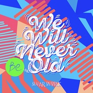

We Will Never Be Old
============================

|  |  |
| :--: | :-- |
| [ We Will Never Be Old](https://emumo.xiami.com/album/2102905948) | **艺人**: [方糖泡泡](../index.md) **语种**: 国语 **唱片公司**: 竹露荷风 **发行时间**: 2017年11月06日 **专辑类别**: EP, 单曲 **专辑风格**: 爵士说唱 Jazz Rap **播放数**: 101393 **收藏数**: 11 **评论数**: 2  |

## 简介

小时候我们都渴望长大，长大后却渴望回到小时候，回到那个无忧无虑的时光，回到懵懵懂懂的年纪，就连被教导主任罚站的画面都显得无比珍贵...但现在我们都被世界改变了，曾经想要实现过的美梦也变得越来越模糊，希望我们能够捡起勇敢，成为小时候那个想要改变世界的人。  
  
  
 

## 曲目

## 评论

|  |  |  |
| :-- | :-- | :-- |
|  [虾米用户](https://emumo.xiami.com/u/12464012) 这个世界太疯狂 2017-11-14 15:48 赞(0) 踩(0) | 
海边的卡夫卡&amp;hellip;&amp;hellip;哈
 |
|  [虾米用户](https://emumo.xiami.com/u/32125734) weibo：白菜y少女  2017-11-06 13:38 赞(0) 踩(0) | 
~~
 |
