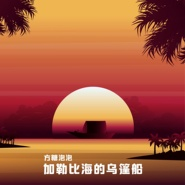
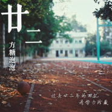
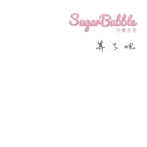
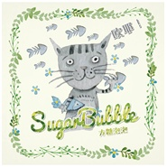
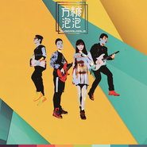

方糖泡泡
============================

|  |  |
| :--: | :-- |
| [ 方糖泡泡](https://i.xiami.com/sugarbubble) | **地区**: China 中国大陆 **风格**: 爵士流行 Jazz Pop, 独立流行 Indie Pop, 巴萨诺瓦 Bossa Nova, 独立民谣 Indie Folk, 国语流行 Mandarin Pop **播放数**: 2357625 **粉丝数**: 1434 **评论数**: 123  |

## 档案

方糖泡泡（Sugar Bubble）是一支2013年4月成立的主打清新自然曲风的indie乐队，有完整的乐队编制。从第一首原创即登陆新浪音乐人首页及热播榜至今，乐队靠着扎实的音乐功/力及高产的出歌速度成为了华语独(indie)立音乐圈中一颗迅速升起的新星。 
中文名： 方糖泡泡乐队 
外文名： Sugar Bubble 
成立日期： 2013年4月 
乐队成员主唱：泡泡（周楚炜） 
主唱是一个93年生的双鱼座软妹，学动画的她还是一个在校生。却有不可多得的声线和极其 
清新不加修饰的唱功。是方糖泡泡乐队的招牌人/物。兴趣爱好广泛，多重性格。 
键盘手/队长:馒头（徐吉成） 
馒头是一位90后的在校研究生，就读于上海音乐学院的他现在在乐队中属于一个一体机的角色：所有的词曲创作，伴奏制作，录音混音及母带处理，现场有时也会充当一下伴唱和节奏不太稳健的贝司手。是乐队的leader.作为一个科班出身的音乐人，徐吉成在大一时即斩获全国大学生电影节配乐组的最佳奖，也担任过韩国丽水世博会的作曲工作，属于圈内小有名气的新晋音乐人。因为舞台的梦想不灭，也想传播出更多清新洗耳的音乐，和泡泡组建了这支小乐队。乐队的表现也不负众望，推出的原创歌曲陆续在新浪音乐，网易云音乐，原创音乐基地(5sing)的榜单上进入热播榜TOP 10 并有榜首表现。 
吉他手：晨光（沈晨光） 
晨光是方糖泡泡的另一位吉他手，性格温和的他录制了方糖泡泡里大量歌曲的吉他音轨，是一位90年的双鱼男，也是方糖泡泡中年龄最大的成员。 
鼓手：小猪（朱家琛） 
小猪于2013年年底加入方糖泡泡乐队，是92年的双鱼男。在上海音乐学院学习打击乐，成绩也非常优秀。性格随和，是乐队最幽默搞笑的成员。 
演出经历 
2013-5-18 ：贺绿汀音乐厅《天鹅》演出 
2013-7-26：多云CLUB小范围专场 
2013-7-27：MAO Live House（上海）专场正式首演 
2013-8-13：镇江 “HIFI 音乐季” 
2013-8-27：K11 “小声音” 
2013-10-20：朱家角音乐节 
2013-11-9：红坊On Stage 作为Chris Garneau巡演上海站嘉宾演出 
2013-12-20：杭州“必休克”音乐节 
2013-12-31：上海红坊 On Stage “鸟幻双城记”跨年演出 
2014-3-14：上海696 Live“白色（indie)情(indie)人节独（indie）立民谣音乐会” 
2014-4-20：上海育音堂 “出发！十号公路”方糖泡泡专场演出 
2014-5-3：上海“草莓音乐节”校园舞台演出 
2014-5-18：杭州“氧气音乐节”开场乐队 
微博  http://weibo.com/u/3299310150 
5sing  http://5sing.kugou.com/sugarbubble

## 专辑

| 名称 | 语种 | 唱片公司 | 发行时间 | 专辑类别 | 专辑风格 |
| :--: | :-- | :-- | :-- | :-- | :-- |
| [ 水乡新韵](./albums/5022414485.md) | 国语 |  | 2019年08月21日 | 录音室专辑 |  |
| [ We Will Never Be Old](./albums/2102905948.md) | 国语 | 竹露荷风 | 2017年11月06日 | EP, 单曲 | 爵士说唱 Jazz Rap |
| [ 加勒比海的乌篷船](./albums/2102811711.md) | 国语 | 竹露荷风 | 2017年08月10日 | EP, 单曲 | 爵士流行 Jazz Pop, 独立流行 Indie Pop |
| [ 廿二](./albums/2102747234.md) | 国语 | 竹露荷风 | 2017年05月12日 | EP, 单曲 | 民谣 Folk, 流行 Pop |
| [ 杳杳](./albums/2102403282.md) | 国语 | 竹露荷风 | 2016年09月27日 | EP, 单曲 | 古风 GuFeng Music |
| [ 算了吧](./albums/2100350411.md) | 国语 | 竹露荷风 | 2016年06月03日 | EP, 单曲 | 国语流行 Mandarin Pop |
| [ 哦耶](./albums/2100314282.md) | 国语 | 竹露荷风 | 2016年04月15日 | EP, 单曲 | 国语流行 Mandarin Pop |
| [ 遗憾](./albums/2100302332.md) | 国语 | 竹露荷风 | 2016年03月10日 | EP, 单曲 | 巴萨诺瓦 Bossa Nova, 国语流行 Mandarin Pop |
| [ 给孩子们的歌](./albums/2033217639.md) | 国语 | 竹露荷风 | 2015年06月01日 | 录音室专辑 | 民谣流行 Folk Pop, 国语流行 Mandarin Pop |
| [ 外公的茶杯](./albums/1725465590.md) | 国语 | 竹露荷风 | 2015年03月04日 | EP, 单曲 | 民谣流行 Folk Pop, 国语流行 Mandarin Pop |
| [ 做我的另一半](./albums/919496691.md) | 国语 | 竹露荷风 | 2014年12月25日 | EP, 单曲 | 爵士流行 Jazz Pop, 国语流行 Mandarin Pop, 中国风 China-Wave |
| [ The Prelude](./albums/1017080075.md) | 英语 | 独立发行 | 2014年11月25日 | EP, 单曲 | 摇滚 Rock & Roll, 流行摇滚 Pop Rock, 电音流行 Electropop |
| [ 海鸥](./albums/2104671688.md) | 国语 | 竹露荷风 | 2014年11月09日 | EP, 单曲 | 国语流行 Mandarin Pop |
| [ 给月亮的一封信](./albums/1410322974.md) | 国语 | 竹露荷风 | 2014年09月10日 | EP, 单曲 | 国语流行 Mandarin Pop |
| [ 布偶](./albums/707769835.md) | 国语 | 竹露荷风 | 2014年08月11日 | EP, 单曲 | 爵士流行 Jazz Pop, 国语流行 Mandarin Pop |
| [ 那年新塍](./albums/605679718.md) | 国语 | 竹露荷风 | 2014年07月18日 | EP, 单曲 | 流行说唱 Pop Rap, 民谣流行 Folk Pop, 节奏布鲁斯 Rhythm & Blues, 国语流行 Mandarin Pop, 中国风 China-Wave |
| [ 昂令油](./albums/903427441.md) | 国语 | 独立发行 | 2014年06月20日 | EP, 单曲 | 巴萨诺瓦 Bossa Nova, 国语流行 Mandarin Pop |
| [ 洗耳朵的卡夫卡](./albums/469707763.md) | 国语 | 独立发行 | 2014年06月06日 | 录音室专辑 | 独立流行 Indie Pop |

## 评论

|  |  |  |
| :-- | :-- | :-- |
|  [虾米用户](https://emumo.xiami.com/u/13337996) 听 2020-12-19 04:18 赞(1) 踩(0) | 
乐队还在吗
 |
|  [虾米用户](https://emumo.xiami.com/u/28703391) (・・?)gun 2018-11-18 16:51 赞(1) 踩(0) | 
踩踩 記得回踩
 |
| ⇒ |  [虾米用户](https://emumo.xiami.com/u/34307392) 虾米音乐有缘再见 2020-01-23 23:52 赞(0) 踩(0) | 

 |
|  [虾米用户](https://emumo.xiami.com/u/194956718) 走成了一片殘影 2018-07-18 23:01 赞(0) 踩(0) | 
有看过你直播
 |
| ⇒ |  [虾米用户](https://emumo.xiami.com/u/194956718) 走成了一片殘影 2018-07-18 23:01 赞(0) 踩(0) | 
好久没来听了
 |
|  [虾米用户](https://emumo.xiami.com/u/5899720) 但是经历过 最温柔共振 2018-07-13 14:39 赞(0) 踩(0) | 
支持～主唱是93年的新疆妹子呢 
 |
| ⇒ |  [虾米用户](https://emumo.xiami.com/u/12728433) 蓝联机票全国谈生意 2019-04-26 21:08 赞(0) 踩(0) | 
浙江的啊
 |
|  [虾米用户](https://emumo.xiami.com/u/4748544) 这个人很懒，神马都没写.... 2018-05-11 17:23 赞(0) 踩(0) | 
很甜很网红
 |
|  [虾米用户](https://emumo.xiami.com/u/253998864)   2018-04-18 07:06 赞(0) 踩(0) | 
期待新歌
 |
|  [虾米用户](https://emumo.xiami.com/u/212848793) 热带的悲伤少女 2018-04-17 15:27 赞(0) 踩(0) | 
so so sweet
 |
|  [虾米用户](https://emumo.xiami.com/u/37169232) 用音乐取暖 2018-04-06 23:23 赞(0) 踩(0) | 
本土乐队～
 |
|  [虾米用户](https://emumo.xiami.com/u/321436985) 我还没想好要写什么... 2018-03-14 21:02 赞(0) 踩(0) | 
高中时听过的歌 希望乐队可以更棒
 |
|  [虾米用户](https://emumo.xiami.com/u/344533598)  2018-03-08 13:09 赞(0) 踩(0) | 
あなたが好きです。
 |
|  [虾米用户](https://emumo.xiami.com/u/344533598)  2018-03-08 13:08 赞(0) 踩(0) | 
加油
 |
|  [虾米用户](https://emumo.xiami.com/u/344533598)  2018-03-08 13:08 赞(0) 踩(0) | 
喜欢你
 |
|  [虾米用户](https://emumo.xiami.com/u/1316995) amberstar梦游贝... 2018-02-23 20:58 赞(2) 踩(0) | 
现在才发现这么好听的队&amp;hellip;&amp;hellip;真是失败
 |
|  [虾米用户](https://emumo.xiami.com/u/321732656) 音乐是活的 2018-01-01 19:18 赞(0) 踩(0) | 
小学时就听过你们的歌了 很好听呢
 |
|  [虾米用户](https://emumo.xiami.com/u/11481439) 我很聪明什么都没有留下… 2017-12-31 14:23 赞(0) 踩(0) | 
加油哦
 |
|  [虾米用户](https://emumo.xiami.com/u/239600600) 自己买面包 2017-12-27 20:45 赞(0) 踩(0) | 
好喜欢你们的，希望可以听到你们带来越来越好的歌 
 |
|  [虾米用户](https://emumo.xiami.com/u/325762079)   2017-11-19 15:29 赞(0) 踩(0) | 
好听@！！很喜欢！~要加油！
 |
|  [虾米用户](https://emumo.xiami.com/u/327796250)  2017-11-09 22:57 赞(0) 踩(0) | 
声音好好听，超喜欢，支持你们，希望能听到你们更多的歌
 |
|  [虾米用户](https://emumo.xiami.com/u/262326500) 过往云霄，不如你回暇相濡... 2017-11-08 12:32 赞(1) 踩(0) | 
很不错了，建议补充一下jam成分
 |
|  [虾米用户](https://emumo.xiami.com/u/10951237)  2017-10-28 22:43 赞(2) 踩(0) | 
很不错了，建议补充一下jam成分
 |
|  [虾米用户](https://emumo.xiami.com/u/13534542) 我喜歡你呀~ 2017-10-25 14:07 赞(1) 踩(0) | 
加油啦
 |
|  [虾米用户](https://emumo.xiami.com/u/31184873)  2017-09-22 10:46 赞(2) 踩(0) | 
很成熟的indie pop啊求不要解散QUQ
 |
|  [虾米用户](https://emumo.xiami.com/u/52255819) 大人中。。。 2017-09-19 22:04 赞(0) 踩(0) | 
歌都很好听(*^_^*)
 |
|  [虾米用户](https://emumo.xiami.com/u/44131600) 爱与音乐才是全部 2017-09-06 00:25 赞(0) 踩(0) | 
会一直关注下去，加油喔。
 |
|  [虾米用户](https://emumo.xiami.com/u/277257937)  2017-08-12 13:26 赞(0) 踩(0) | 
除了粉红以外目前最喜欢的
 |
|  [虾米用户](https://emumo.xiami.com/u/240427889)  2017-08-10 22:49 赞(0) 踩(0) | 
喜欢主唱。
 |
|  [虾米用户](https://emumo.xiami.com/u/93328648)   2017-08-10 16:52 赞(0) 踩(0) | 
超喜欢，这就是我一天漫无目的胡乱刷了一堆音乐之后真正想听到的音符！谢谢你们的用心！已收藏！
 |
|  [虾米用户](https://emumo.xiami.com/u/23929929) 是我是我 2017-05-14 12:17 赞(1) 踩(0) | 
哪里都关注一下 支持
 |
|  [虾米用户](https://emumo.xiami.com/u/241245235) …。 2017-03-08 11:01 赞(2) 踩(0) | 
你们的歌很好听，我会一直在这里支持你们
 |
|  [虾米用户](https://emumo.xiami.com/u/47423427)  2017-02-23 14:24 赞(0) 踩(0) | 
喜欢
 |
|  [虾米用户](https://emumo.xiami.com/u/259821434)  2017-01-07 17:45 赞(0) 踩(0) | 
谢谢你的
 |
|  [虾米用户](https://emumo.xiami.com/u/47058184) 心愉於側 2017-01-04 13:24 赞(0) 踩(0) | 
開演唱會嗎？
 |
|  [虾米用户](https://emumo.xiami.com/u/254401488)  2016-12-14 21:15 赞(0) 踩(0) | 
真的很喜欢你们，祝你们每天都开心
 |
|  [虾米用户](https://emumo.xiami.com/u/122688364) 生在愤坑，长在赤圈；挣脱 2016-11-02 23:40 赞(0) 踩(0) | 
5486
 |
|  [虾米用户](https://emumo.xiami.com/u/34452144)   2016-10-24 06:52 赞(0) 踩(0) | 
谢谢你们的歌
 |
|  [虾米用户](https://emumo.xiami.com/u/463600)  2016-10-13 03:32 赞(1) 踩(0) | 
声音好甜
 |
|  [虾米用户](https://emumo.xiami.com/u/220310344) WE ARE ONE❤ 2016-10-10 18:54 赞(1) 踩(0) | 
在一五年无意听到外公的茶杯的时候就彻底爱上了
 |
| ⇒ |  [虾米用户](https://emumo.xiami.com/u/846130) 如果是真的 就让他来吧 2017-07-22 18:46 赞(0) 踩(0) | 
爱尼玛了个臭13
 |
|  [虾米用户](https://emumo.xiami.com/u/13337996) 听 2016-09-04 23:24 赞(0) 踩(0) | 
相似乐队里面竟然没有旺福 
 |
|  [虾米用户](https://emumo.xiami.com/u/72666568)  2016-08-03 17:27 赞(0) 踩(0) | 
真好，又能遇到你们
 |
|  [虾米用户](https://emumo.xiami.com/u/13337996) 听 2016-07-20 14:07 赞(0) 踩(0) | 
请问有人知道乐队的创作都是谁完成的？作曲和编曲都超喜欢！
 |
|  [虾米用户](https://emumo.xiami.com/u/13337996) 听 2016-07-17 04:56 赞(0) 踩(0) | 
好牛逼的乐队
 |
|  [虾米用户](https://emumo.xiami.com/u/88730894)  2016-07-10 12:54 赞(0) 踩(0) | 
加油！！！好好听
 |
|  [虾米用户](https://emumo.xiami.com/u/34278552) 我还没想好要写什么... 2016-07-05 00:14 赞(0) 踩(0) | 
被圈粉
 |
|  [虾米用户](https://emumo.xiami.com/u/8226693) Musik des Ei... 2016-07-01 09:56 赞(0) 踩(0) | 
一定是爱幻想的女生，原来“外公的茶杯”也可以萌哒啊
 |
|  [虾米用户](https://emumo.xiami.com/u/35904030)  2016-06-15 01:45 赞(0) 踩(0) | 
明明可以靠颜吃饭
 |
|  [虾米用户](https://emumo.xiami.com/u/35278640) 不知如何对话时 大声放歌 2016-05-08 21:04 赞(0) 踩(0) | 
清新又不柔弱矫情 有特色
 |
|  [虾米用户](https://emumo.xiami.com/u/2207232)  2016-05-04 07:49 赞(1) 踩(0) | 
这乐队都是双鱼座的（笑哭
 |
|  [虾米用户](https://emumo.xiami.com/u/9970195) 你也可以看见光吗 2016-05-01 08:17 赞(0) 踩(0) | 
棒棒棒棒！？
 |
|  [虾米用户](https://emumo.xiami.com/u/15463976) i want to be... 2016-04-21 10:50 赞(0) 踩(0) | 
主唱声音真是腻歪 
 |
|  [虾米用户](https://emumo.xiami.com/u/56037222)  2016-04-14 11:46 赞(0) 踩(0) | 
通过echo来的！超好听的啊！加油哦！！！已经安利给舍友了哈哈哈哈哈哈！
 |
|  [虾米用户](https://emumo.xiami.com/u/72666568)  2016-04-08 13:18 赞(0) 踩(0) | 
泡泡泡泡
 |
|  [虾米用户](https://emumo.xiami.com/u/44346561)   2016-03-24 21:40 赞(0) 踩(0) | 
从echo找到了，好美的声音
 |
|  [虾米用户](https://emumo.xiami.com/u/21216985) 缓缓归 2016-03-16 17:20 赞(0) 踩(0) | 
方糖你唱腔变啦~
 |
|  [虾米用户](https://emumo.xiami.com/u/98051584) Completely A... 2016-02-08 19:39 赞(0) 踩(0) | 
！喜欢
 |
|  [虾米用户](https://emumo.xiami.com/u/6758075)  2016-01-05 11:11 赞(0) 踩(0) | 
5sing地址该改啦 <a href="http://5sing.kugou.com/sugarbubble" target="_blank" rel="nofollow noreferrer noopener">http://5sing.kugou.com/sugarbubble</a>
 |
|  [虾米用户](https://emumo.xiami.com/u/25811477)  2015-12-19 11:36 赞(0) 踩(0) | 
泡泡好棒，加油！
 |
|  [虾米用户](https://emumo.xiami.com/u/42501470) supreme cool 2015-11-08 09:01 赞(0) 踩(0) | 
超可爱
 |
|  [虾米用户](https://emumo.xiami.com/u/79801578) 歌品奇怪 脾气很坏 2015-11-06 20:04 赞(0) 踩(0) | 
❤️加油加油
 |
|  [虾米用户](https://emumo.xiami.com/u/79801578) 歌品奇怪 脾气很坏 2015-11-06 20:03 赞(0) 踩(0) | 
对你们爱不完
 |
|  [虾米用户](https://emumo.xiami.com/u/48136026) 任好坏开花结果。 2015-09-20 09:24 赞(0) 踩(0) | 
天呐好好听！无意中发现的组合！又清新又欢乐！编曲好赞 就是被前奏吸引来的！
 |
|  [虾米用户](https://emumo.xiami.com/u/8861954)  2015-09-16 20:34 赞(0) 踩(0) | 
最喜欢玻璃、长岛冰茶、晚安歌
 |
|  [虾米用户](https://emumo.xiami.com/u/54064210) 爱你永不变，或许你早已忘... 2015-09-05 08:37 赞(0) 踩(0) | 
怎么好听的歌为什么不火！
 |
|  [虾米用户](https://emumo.xiami.com/u/54064210) 爱你永不变，或许你早已忘... 2015-09-05 08:37 赞(0) 踩(0) | 
怎么好听的歌为什么不火！
 |
|  [虾米用户](https://emumo.xiami.com/u/54064210) 爱你永不变，或许你早已忘... 2015-09-05 08:37 赞(0) 踩(0) | 
怎么好听的歌为什么不火！
 |
|  [虾米用户](https://emumo.xiami.com/u/41095139)   2015-07-27 16:22 赞(0) 踩(0) | 
加油！你们很棒！
 |
|  [虾米用户](https://emumo.xiami.com/u/11206846) 感动常在 2015-05-28 18:08 赞(0) 踩(0) | 
确实挺清新
 |
|  [虾米用户](https://emumo.xiami.com/u/10191787) 我还没想好要写什么... 2015-05-27 16:15 赞(0) 踩(0) | 
从茶杯开始……O(∩_∩)O~
 |
|  [虾米用户](https://emumo.xiami.com/u/5664288)  2015-05-19 13:38 赞(0) 踩(0) | 
编曲做的很好， 配器相当出味 ，能看得出来做的比较用心 ，好听，特别说一句主唱的声音还真是细腻啊！
 |
| ⇒ |  [虾米用户](https://emumo.xiami.com/u/6155331) 头像即本人 2015-05-27 16:34 赞(0) 踩(0) | 
谢谢喜欢XD我们会努力更好的作品~
 |
|  [虾米用户](https://emumo.xiami.com/u/50093901) 我有阳光与音乐，你很不跟... 2015-05-18 09:04 赞(0) 踩(0) | 
赞一个！ 单曲循环
 |
|  [虾米用户](https://emumo.xiami.com/u/50029806)  2015-05-13 11:26 赞(0) 踩(0) | 
zuile醉了
 |
|  [虾米用户](https://emumo.xiami.com/u/49753801)  2015-05-02 18:39 赞(0) 踩(0) | 
每一首都很好听 让人很舒服的歌～完全赞啊泡泡也特别可爱
 |
| ⇒ |  [虾米用户](https://emumo.xiami.com/u/6155331) 头像即本人 2015-05-27 16:34 赞(0) 踩(0) | 
熊抱一个！
 |
|  [虾米用户](https://emumo.xiami.com/u/38947052) 一起听 2015-04-11 14:13 赞(0) 踩(0) | 
✌️！
 |
|  [虾米用户](https://emumo.xiami.com/u/48927370)  2015-04-05 22:05 赞(1) 踩(0) | 
”我终于准备放弃了“~感觉越来越上路了，歌做的~~~~
 |
|  [虾米用户](https://emumo.xiami.com/u/11481439) 我很聪明什么都没有留下… 2015-03-22 17:36 赞(0) 踩(0) | 
喜欢~
 |
|  [虾米用户](https://emumo.xiami.com/u/988634)  2015-02-11 19:52 赞(0) 踩(0) | 
刚开始是冲着名字来的，听完歌发现，突然也好想冒泡泡分享一下~感谢你们让虾米更精彩~
 |
| ⇒ |  [虾米用户](https://emumo.xiami.com/u/6155331) 头像即本人 2015-05-27 16:35 赞(0) 踩(0) | 
诶嘿嘿 也谢谢你的支持~
 |
|  [虾米用户](https://emumo.xiami.com/u/1207112)  2014-12-04 20:46 赞(0) 踩(0) | 
午后一股清新的清流
 |
|  [虾米用户](https://emumo.xiami.com/u/42854924)  2014-10-28 22:39 赞(0) 踩(0) | 
sugar bubble 不错不错~爵士soul
 |
|  [虾米用户](https://emumo.xiami.com/u/38952954)  2014-07-13 20:14 赞(0) 踩(0) | 
炜炜加油哦
 |
|  [虾米用户](https://emumo.xiami.com/u/38473503)  2014-06-26 14:35 赞(0) 踩(0) | 
！！！
 |
|  [虾米用户](https://emumo.xiami.com/u/38473503)  2014-06-26 14:33 赞(0) 踩(0) | 
赞一个 呵呵！
 |
|  [虾米用户](https://emumo.xiami.com/u/15335937) 哟呼~ 2014-06-23 19:12 赞(1) 踩(0) | 
好听。萌软但很有弹性。。。。不像鹿乃那种软到无力 - -。。。
 |
| ⇒ |  [虾米用户](https://emumo.xiami.com/u/6155331) 头像即本人 2015-05-27 16:38 赞(0) 踩(0) | 
哈哈谢谢~鹿乃我自己也喜欢~
 |
|  [虾米用户](https://emumo.xiami.com/u/3103981) 初心不忘！ 2014-06-20 08:56 赞(0) 踩(0) | 
好听哦。。就是demo都不能下载呀
 |
|  [虾米用户](https://emumo.xiami.com/u/812392) 【封面控】毛驴牌❤小众好... 2014-06-15 14:32 赞(0) 踩(0) | 
好可爱哦
 |
|  [虾米用户](https://emumo.xiami.com/u/1366353)  2014-06-14 10:14 赞(0) 踩(0) | 
已经全是90后的年代啦，让我这个90瞬间觉得自己老了(T ^ T)
 |
|  [虾米用户](https://emumo.xiami.com/u/5460916)  2014-06-13 14:28 赞(0) 踩(0) | 
啊 虾米有你们了 还记得去年红坊你们作为暖身嘉宾的舞台 加油！
 |
|  [虾米用户](https://emumo.xiami.com/u/35536127) 请叫我杰大人 2014-06-01 06:30 赞(0) 踩(0) | 
最喜欢泡泡的歌了
 |
|  [虾米用户](https://emumo.xiami.com/u/22124979)   2014-05-28 22:20 赞(0) 踩(0) | 
你们的歌每首都超好听！快点出正式的专辑吧！要坚持做音乐呀！
 |
| ⇒ |  [虾米用户](https://emumo.xiami.com/u/6155331) 头像即本人 2015-05-27 16:38 赞(0) 踩(0) | 
谢谢~一定会坚持下去的！
 |
|  [虾米用户](https://emumo.xiami.com/u/37045781) 胖子A唱歌 2014-05-26 22:46 赞(0) 踩(0) | 
泡泡我喜欢你〜
 |
|  [虾米用户](https://emumo.xiami.com/u/36873830)  2014-05-21 19:57 赞(0) 踩(0) | 
❤❤ 好听，
 |
|  [虾米用户](https://emumo.xiami.com/u/27846265) 暂无签名~ 2014-05-20 21:02 赞(0) 踩(0) | 
泡泡又萌又软，太可爱了！声音好好听！
 |
|  [虾米用户](https://emumo.xiami.com/u/13846819)  2014-05-20 16:42 赞(0) 踩(0) | 
主唱棒棒的
 |
|  [虾米用户](https://emumo.xiami.com/u/36818495)  2014-05-20 12:38 赞(0) 踩(0) | 
小清新加一点点爵士的曲风~还有主唱声音太好听啦
 |
| ⇒ |  [虾米用户](https://emumo.xiami.com/u/6155331) 头像即本人 2015-05-27 16:38 赞(0) 踩(0) | 
谢谢么么哒&amp;gt;3&amp;lt;
 |
|  [虾米用户](https://emumo.xiami.com/u/36818495)  2014-05-20 12:36 赞(0) 踩(0) | 
主唱的声音好甜美，歌曲都好下清新~ 泡泡加油~ =v=
 |
|  [虾米用户](https://emumo.xiami.com/u/36818286)  2014-05-20 12:26 赞(0) 踩(0) | 
这样的好歌，真的太少了还是独立音乐人
 |
|  [虾米用户](https://emumo.xiami.com/u/36818286)  2014-05-20 12:25 赞(0) 踩(0) | 
超级喜欢方糖泡泡！！！！！
 |
|  [虾米用户](https://emumo.xiami.com/u/12159364)   2014-05-19 15:42 赞(0) 踩(0) | 
泡泡你怎么可以唱的那么甜
 |
|  [虾米用户](https://emumo.xiami.com/u/36783640) 我只是纯粹喜欢音乐 2014-05-19 13:59 赞(0) 踩(0) | 
在氧气音乐节见到了你们，觉得挺喜欢你们这种感觉，未来一直坚持继续加油哦
 |
| ⇒ |  [虾米用户](https://emumo.xiami.com/u/27846265) 暂无签名~ 2014-05-19 16:10 赞(0) 踩(0) | 
同在氧气音乐节，喜欢他们~
 |
| ⇒ |  [虾米用户](https://emumo.xiami.com/u/36889536) 没有犯贱就没有伤害 2014-05-22 09:25 赞(0) 踩(0) | 
非常感谢~我会转达给馒头的~最近刚刚开始把重心放到虾米~以后会更加活跃的~~~~
 |
|  [虾米用户](https://emumo.xiami.com/u/10575180)  2014-05-13 16:26 赞(0) 踩(0) | 
主唱的声音很治愈
 |
|  [虾米用户](https://emumo.xiami.com/u/28470991) 暂无签名~ 2014-04-17 09:00 赞(0) 踩(0) | 
看过你们的现场，赞~
 |
|  [虾米用户](https://emumo.xiami.com/u/11958732) 我只是不说 2014-04-02 17:45 赞(0) 踩(0) | 
赞 就喜欢这种小清新的赶脚
 |
|  [虾米用户](https://emumo.xiami.com/u/3200056)  2014-02-23 06:46 赞(0) 踩(0) | 
在5sing上听到的，第一耳就感觉到不一样啊~喜欢~~
 |
|  [虾米用户](https://emumo.xiami.com/u/598650) 我是狗 2014-01-19 13:52 赞(0) 踩(0) | 
呀 出新demo了
 |
|  [虾米用户](https://emumo.xiami.com/u/489870)  2013-11-29 13:19 赞(0) 踩(0) | 
头像咋是一张插画，要不要换一张自己的头像呢？
 |
|  [虾米用户](https://emumo.xiami.com/u/489870)  2013-11-29 13:18 赞(0) 踩(0) | 
hi~方糖泡泡~
 |
|  [虾米用户](https://emumo.xiami.com/u/27006411)  2013-11-29 01:48 赞(0) 踩(0) | 
大爱
 |
|  [虾米用户](https://emumo.xiami.com/u/28160555)  2013-11-22 06:38 赞(0) 踩(0) | 
喜欢
 |
|  [虾米用户](https://emumo.xiami.com/u/7113538)  2013-08-19 09:08 赞(0) 踩(0) | 
木有歌啊。。。
 |
| ⇒ |  [虾米用户](https://emumo.xiami.com/u/6155331) 头像即本人 2013-11-07 23:26 赞(0) 踩(0) | 
已经上传咯
 |
| ⇒ |  [虾米用户](https://emumo.xiami.com/u/7113538)  2013-11-09 14:46 赞(0) 踩(0) | 
<q><b>方糖泡泡说：</b></q>
 |
| ⇒ |  [虾米用户](https://emumo.xiami.com/u/6155331) 头像即本人 2013-11-12 15:37 赞(0) 踩(0) | 
<q><b>Bryan说：</b></q>
 |
|  [虾米用户](https://emumo.xiami.com/u/18615461) 是不是月老和孟婆曾是情人 2013-08-06 22:07 赞(0) 踩(0) | 
我准备放弃了  Sugar Bubble方糖泡泡
 |
