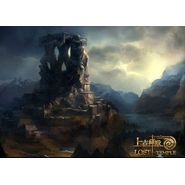

Lost Temple遗失的神殿
============================

|  |  |
| :--: | :-- |
| [ Lost Temple遗失的神殿](https://emumo.xiami.com/album/2074392710) | **艺人**: [舞指如歌](../index.md) **语种**: 国语 **唱片公司**: 独立发行 **发行时间**: 2009年08月05日 **专辑类别**: 原声带, 影视音乐 **专辑风格**: 原声 Soundtrack, 游戏配乐 Video Game Music **播放数**: 11804 **收藏数**: 53 **评论数**: 5  |

## 简介

以希腊神话题材而创作的原声音乐，浓郁的世界史诗音乐风。

## 曲目

## 评论

|  |  |  |  |
| :-- | :-- | :-- | :-- |
|  [虾米用户](https://emumo.xiami.com/u/267359202)   2020-03-11 14:25 赞(0) 踩(0) | 
那么好的专必须推！！！
 |
|  [虾米用户](https://emumo.xiami.com/u/18263830) 审美疲劳中 2014-12-14 14:41 赞(0) 踩(0) | 
残破的通天塔。
 |
|  [虾米用户](https://emumo.xiami.com/u/1820887) 与虾米共生死~~ 2014-02-21 19:09 赞(0) 踩(0) | 
牛逼！~~
 |
|  [虾米用户](https://emumo.xiami.com/u/1820887) 与虾米共生死~~ 2014-02-21 19:08 赞(0) 踩(0) | 
牛逼！
 |
|  [虾米用户](https://emumo.xiami.com/u/8093526) 从前有座山,名曰关彳山~ 2013-12-08 17:13 赞(0) 踩(0) | 
有气势！
 |
