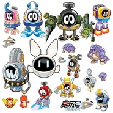
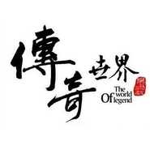

舞指如歌
============================

|  |  |
| :--: | :-- |
| [ 舞指如歌](https://i.xiami.com/csy) | **地区**: China 中国大陆 **风格**: 新世纪音乐 New Age, 原声 Soundtrack, 游戏配乐 Video Game Music, 电影原声 Film Score, 轻音乐 Easy Listening **播放数**: 12592817 **粉丝数**: 4079 **评论数**: 60  |

## 档案

舞指如歌，自由职业音乐人，热爱艺术、热爱生活的文艺者。

## 专辑

| 名称 | 语种 | 唱片公司 | 发行时间 | 专辑类别 | 专辑风格 |
| :--: | :-- | :-- | :-- | :-- | :-- |
| [ 摩尔庄园 移动版](./albums/1894768935.md) | 国语 | 独立发行 | 2014年03月14日 | 原声带, 影视音乐 | 游戏配乐 Video Game Music |
| [ 赛罗奥特曼奥特曼OL](./albums/1284228086.md) | 国语 | Taomee | 2013年09月10日 | 原声带, 影视音乐 | 游戏配乐 Video Game Music |
| [ 战神联盟](./albums/1284238531.md) | 国语 | Taomee | 2013年06月03日 | 原声带, 影视音乐 | 游戏配乐 Video Game Music |
| [ 赛尔号II&豌豆 游戏配乐](./albums/384237608.md) | 国语 | Taomee | 2012年10月01日 | 合集, 杂锦 | 游戏配乐 Video Game Music |
| [ 摩尔庄园II](./albums/684236948.md) | 国语 | Taomee | 2012年07月16日 | 原声带, 影视音乐 | 卡通配乐 Cartoon Music |
| [ Lost Temple遗失的神殿](./albums/2074392710.md) | 国语 | 独立发行 | 2009年08月05日 | 原声带, 影视音乐 | 原声 Soundtrack, 游戏配乐 Video Game Music |
| [ 传奇世界](./albums/5020845567.md) | 国语 | 独立发行 | 不详 | 原声带, 影视音乐 | 管弦乐 Orchestral, 游戏配乐 Video Game Music |
| [ 自由之战](./albums/5020848074.md) | 国语 | 独立发行 | 不详 | 原声带, 影视音乐 | 交响乐 Symphonic Music, 游戏配乐 Video Game Music |
| [ 花仙子的梦境](./albums/5020855558.md) | 国语 | 独立发行 | 不详 | 原声带, 影视音乐 | 原声 Soundtrack, 游戏配乐 Video Game Music |
| [ 黑暗之门](./albums/5020843075.md) | 国语 | 独立发行 | 不详 | 原声带, 影视音乐 | 管弦乐 Orchestral, 游戏配乐 Video Game Music |
| [ 摇滚与交响乐](./albums/5020859037.md) | 国语 | 独立发行 | 不详 | 精选集 | 摇滚 Rock & Roll, 管弦乐流行 Orchestral Pop, 原声 Soundtrack |
| [ 环球旅行](./albums/5020844561.md) | 国语 | 独立发行 | 不详 | 精选集 | 轻音乐 Easy Listening, 管弦乐流行 Orchestral Pop, 世界音乐 World Music |

## 评论

|  |  |  |
| :-- | :-- | :-- |
|  [虾米用户](https://emumo.xiami.com/u/403304282)  2020-04-27 17:51 赞(0) 踩(0) | 
摩尔庄园的music真的很喜欢额，今年也会迎来手游！(ﾉ≧&amp;nabla;≦)ﾉ ﾐ ┻━┻
 |
|  [虾米用户](https://emumo.xiami.com/u/197129222)  2019-11-14 17:34 赞(0) 踩(0) | 
求卡农那个谱
 |
|  [虾米用户](https://emumo.xiami.com/u/197129222)  2019-10-12 13:29 赞(0) 踩(0) | 
求湛蓝之夜的那个和弦
 |
|  [虾米用户](https://emumo.xiami.com/u/375456578)  2019-08-08 12:03 赞(0) 踩(0) | 
你的心灵之光好听
 |
|  [虾米用户](https://emumo.xiami.com/u/55894220) 我还没想好要写什么... 2019-06-07 11:58 赞(0) 踩(0) | 
都是我喜欢的音乐谢谢编辑
 |
|  [虾米用户](https://emumo.xiami.com/u/403804908) 热爱音乐的人 2019-05-05 22:26 赞(0) 踩(0) | 
非常好听，继续加油。
 |
|  [虾米用户](https://emumo.xiami.com/u/407670888)  2019-03-12 11:34 赞(1) 踩(0) | 
哄睡神音，偶然发现儿子听到这歌不管多闹立马安静下来一会儿就睡了  
 |
| ⇒ |  [虾米用户](https://emumo.xiami.com/u/13529836)  2019-03-29 10:37 赞(0) 踩(0) | 
哪一首歌？
 |
| ⇒ |  [虾米用户](https://emumo.xiami.com/u/407670888)  2019-03-30 06:19 赞(0) 踩(0) | 
卡农•湛海蓝之夜
 |
| ⇒ |  [虾米用户](https://emumo.xiami.com/u/377349677) 谁在遥远的夜空，等谁的一... 2020-01-06 19:41 赞(0) 踩(0) | 
<q><b>舞指如歌说：</b></q>
 |
|  [虾米用户](https://emumo.xiami.com/u/403520464)  2019-02-12 23:27 赞(0) 踩(0) | 
感觉这些都是奥特曼的歌  
 |
|  [虾米用户](https://emumo.xiami.com/u/181199530) 2019.5.3暂退 2019-01-17 21:21 赞(0) 踩(0) | 
感谢陪伴
 |
|  [虾米用户](https://emumo.xiami.com/u/335243292) 心远地自偏 2018-04-30 22:35 赞(2) 踩(0) | 
满满的回忆，线上的乐园 谢谢你
 |
|  [虾米用户](https://emumo.xiami.com/u/290642328)  2018-01-30 16:54 赞(0) 踩(0) | 
唱的什么鬼?
 |
|  [虾米用户](https://emumo.xiami.com/u/9327494) http://www.x... 2017-09-10 01:30 赞(0) 踩(0) | 
彼岸 &amp;bull; 桃源
 |
|  [虾米用户](https://emumo.xiami.com/u/155232102)  2017-04-23 13:57 赞(0) 踩(0) | 
不错
 |
|  [虾米用户](https://emumo.xiami.com/u/9003931) 千淘万漉虽辛苦 2017-03-27 21:39 赞(0) 踩(0) | 
不错
 |
|  [虾米用户](https://emumo.xiami.com/u/150426444) 尢鱼小号 2016-07-17 18:56 赞(1) 踩(0) | 
稀饭
 |
|  [虾米用户](https://emumo.xiami.com/u/47259861) 暂无签名~ 2016-07-02 01:39 赞(1) 踩(0) | 
太牛逼了，lost temple太喜欢了，果断关注，收藏所有歌曲！
 |
| ⇒ |  [虾米用户](https://emumo.xiami.com/u/312207481) 我还没想好要写什么无底呀 2017-11-30 17:48 赞(0) 踩(0) | 
赞同
 |
| ⇒ |  [虾米用户](https://emumo.xiami.com/u/13529836)  2019-03-29 10:38 赞(0) 踩(0) | 
谢谢
 |
|  [虾米用户](https://emumo.xiami.com/u/83780502) EpsonWu 2015-11-21 03:03 赞(0) 踩(0) | 
非常喜欢《Lost Temple》！！！
 |
|  [虾米用户](https://emumo.xiami.com/u/18263830) 审美疲劳中 2015-09-08 23:01 赞(0) 踩(0) | 
西幻
 |
|  [虾米用户](https://emumo.xiami.com/u/56783004)  2015-08-23 00:14 赞(3) 踩(0) | 
超希望可以有摩尔庄园里所有配乐啊 每首都爆好听
 |
| ⇒ |  [虾米用户](https://emumo.xiami.com/u/13529836)  2015-10-12 10:22 赞(0) 踩(0) | 
谢谢你的欣赏，以后有时间会陆续上传的。
 |
|  [虾米用户](https://emumo.xiami.com/u/56783004)  2015-08-23 00:14 赞(0) 踩(0) | 
超希望可以有摩尔庄园里所有配乐啊 每首都爆好听
 |
|  [虾米用户](https://emumo.xiami.com/u/56783004)  2015-08-23 00:14 赞(0) 踩(0) | 
超希望可以有摩尔庄园里所有配乐啊 每首都爆好听
 |
|  [虾米用户](https://emumo.xiami.com/u/43044321) 可以说是肥宅本宅了 2015-06-20 14:07 赞(0) 踩(0) | 
希望有更多网页版游戏的音乐呢
 |
|  [虾米用户](https://emumo.xiami.com/u/39198775) He ate my he... 2015-06-08 12:43 赞(0) 踩(0) | 
棒！ 
 |
|  [虾米用户](https://emumo.xiami.com/u/9730064) 纯音党 2015-01-06 00:17 赞(1) 踩(0) | 
因为一首卡农 而收藏你！
 |
| ⇒ |  [虾米用户](https://emumo.xiami.com/u/13529836)  2015-01-08 15:38 赞(0) 踩(0) | 
谢谢你的支持~
 |
| ⇒ |  [虾米用户](https://emumo.xiami.com/u/126687486)  2016-06-22 21:33 赞(0) 踩(0) | 
是的，清澈悦耳活泼
 |
|  [虾米用户](https://emumo.xiami.com/u/43383274)  2014-11-29 14:53 赞(0) 踩(0) | 
真好听的曲子！
 |
|  [虾米用户](https://emumo.xiami.com/u/42693123) 曾梦想仗剑走天涯。 2014-11-10 23:57 赞(0) 踩(0) | 
舞动精彩，加油!
 |
| ⇒ |  [虾米用户](https://emumo.xiami.com/u/13529836)  2014-11-13 13:17 赞(0) 踩(0) | 
谢谢
 |
|  [虾米用户](https://emumo.xiami.com/u/1972130)  2014-09-25 23:43 赞(0) 踩(0) | 
真的很喜欢你的音乐，定期过来听。渺渺星河中，一切神秘的相遇都很神奇，和您的音乐的相遇正是如此。
 |
| ⇒ |  [虾米用户](https://emumo.xiami.com/u/13529836)  2014-09-26 11:39 赞(0) 踩(0) | 
感谢你的支持，我们都是爱音乐的人。
 |
|  [虾米用户](https://emumo.xiami.com/u/9806628) 流年 2014-08-25 14:09 赞(0) 踩(0) | 
安静么？蛮好的。
 |
|  [虾米用户](https://emumo.xiami.com/u/36899595)  2014-05-22 14:10 赞(0) 踩(0) | 
少云
 |
|  [虾米用户](https://emumo.xiami.com/u/4879458) 我要发达！ 2014-05-15 15:09 赞(0) 踩(0) | 
我也要做配乐
 |
| ⇒ |  [虾米用户](https://emumo.xiami.com/u/13529836)  2014-05-16 09:46 赞(0) 踩(0) | 
看好你，加油。
 |
|  [虾米用户](https://emumo.xiami.com/u/29197411) 我还没想好要写什么... 2014-05-01 16:23 赞(0) 踩(0) | 
....................
 |
|  [虾米用户](https://emumo.xiami.com/u/4376156) 暂无签名~ 2014-04-23 13:15 赞(0) 踩(0) | 
为中国影视游戏配乐者的不断超越喝彩
 |
|  [虾米用户](https://emumo.xiami.com/u/20651598)  2014-04-22 19:03 赞(0) 踩(0) | 
影视配乐
 |
|  [虾米用户](https://emumo.xiami.com/u/5849593) 江水流春去欲尽 2014-04-15 14:41 赞(0) 踩(0) | 
欢乐时光有模拟人生主题曲的片段
 |
|  [虾米用户](https://emumo.xiami.com/u/5849593) 江水流春去欲尽 2014-04-13 18:19 赞(0) 踩(0) | 
真心不错
 |
|  [虾米用户](https://emumo.xiami.com/u/21761955) 为了心中那片十色云端加油... 2014-04-04 11:34 赞(0) 踩(0) | 
赞一个··
 |
|  [虾米用户](https://emumo.xiami.com/u/9261161) 音乐里流动 2014-04-03 08:52 赞(0) 踩(0) | 
虽然没看过摩尔庄园（其实换台有掠过），不过配乐不错
 |
|  [虾米用户](https://emumo.xiami.com/u/14357301) 原创音乐 2014-03-27 08:59 赞(0) 踩(0) | 
团队音乐主创，欢迎大家一起点评
 |
|  [虾米用户](https://emumo.xiami.com/u/1972130)  2014-03-15 19:58 赞(0) 踩(0) | 
很好听的音乐啊！是您制作的吗？很美。超级喜欢。
 |
| ⇒ |  [虾米用户](https://emumo.xiami.com/u/13529836)  2014-03-17 12:30 赞(0) 踩(0) | 
是的，谢谢你的支持。
 |
|  [虾米用户](https://emumo.xiami.com/u/1999245)  2014-02-27 23:06 赞(0) 踩(0) | 
好棒的曲子~
 |
| ⇒ |  [虾米用户](https://emumo.xiami.com/u/13529836)  2014-03-03 10:46 赞(0) 踩(0) | 
谢谢。
 |
| ⇒ |  [虾米用户](https://emumo.xiami.com/u/13812790) 音乐 2014-04-03 13:01 赞(0) 踩(0) | 
<q><b>舞指如歌说：</b></q>
 |
|  [虾米用户](https://emumo.xiami.com/u/13529836)  2014-02-21 18:34 赞(0) 踩(0) | 
哈哈，欢迎。
 |
|  [虾米用户](https://emumo.xiami.com/u/1820887) 与虾米共生死~~ 2014-02-19 19:05 赞(0) 踩(0) | 
我來了！哈哈~~
 |
|  [虾米用户](https://emumo.xiami.com/u/8093526) 从前有座山,名曰关彳山~ 2013-12-08 17:24 赞(0) 踩(0) | 
休闲音乐合集 也很好听·！
 |
|  [虾米用户](https://emumo.xiami.com/u/8093526) 从前有座山,名曰关彳山~ 2013-12-08 17:20 赞(0) 踩(0) | 
互相关注吧！
 |
|  [虾米用户](https://emumo.xiami.com/u/8093526) 从前有座山,名曰关彳山~ 2013-12-08 17:12 赞(0) 踩(0) | 
喜欢摩尔庄园歌曲！
 |
|  [虾米用户](https://emumo.xiami.com/u/28637778)  2013-11-29 10:36 赞(0) 踩(0) | 
喜欢摩尔庄园里的歌曲
 |
