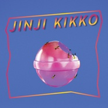

Jinji Kikko金桔希子
============================

|  |  |
| :--: | :-- |
| [ Jinji Kikko金桔希子](https://emumo.xiami.com/album/2100369677) | **艺人**: [落日飞车](../index.md) **语种**: 英语 **唱片公司**: 发现音乐, 华纳音乐 **发行时间**: 2016年03月01日 **专辑类别**: EP, 单曲 **专辑风格**: 独立摇滚 Indie Rock, 新迷幻 Neo-Psychedelia **播放数**: 3648337 **收藏数**: 3417 **评论数**: 185  |

## 简介

制作人 Yuchain Wang 
《金桔希子》是落日飛車沈寂五年後的新作品，在成員的更迭後，重新探索新的曲風，從以往六零年代的車庫搖滾晃入了七零年代的成人抒情，但仍然不改飛車輕鬆愜意，浪漫中又帶著戲謔的情境氛圍。 
金桔希子是集結過去、現在與未來的可愛女性角色,愛與曇花一現的具體想像。 三首歌都是對她而唱,勃根地紅是邀請希子隨著微風乘上飛車,凝聚愛的能量,在黃昏的魔幻時刻,就能擁有穿越時空的超能力。 第二首歌金桔,時光飛梭到了不可考的時代,這裡是人類第一個文明聚落,宮殿裡的公主金桔正在輕輕地召那喚能征服時間的戀人。 
最後一首歌金桔帶著紐藥回到未來,高度理性化的人類已沒有情緒與愛的能力,而紐藥就是讓人類重新擁有愛的能力的良方。 音樂風格受到了七零年代的白人抒情的影響,從Steely Dan, Hall &amp; Oates, Wham, The Alan Parsons Project到Bobby Caldwell都是這張EP的概念原型,也預告了未來飛車可能的音樂路線。 
via indievox 
#credit 
Produced by 王昱辰 Wang, Yuchain 
All songs and lyrics written by Tseng, Kuo Hung 
All songs arranged by Sunset Rollercoaster 
Additional arrangements by Wang, Yuchain 
Recorded by Wang, Yuchain at Rooftop Audio and Aii Studio, Taipei 
Mixed by Wang, Yu-Chain at Rooftop Audio, Taipei 
Mastered by Greg Calbi at Sterling Sound Studios, New York 
Graphic Design by 林筱敏 Lin, Showme, 徐光慧 Sylvia Hsu, 蘇聖揚 Su Sheng Yang (Finger and Toe) 
Sunset Rollercoaster comprised Tseng Kuo Hung, Chen Hung Li, Wang Shao Hsuan, Lo Tsun Lung, Chang Hao Chia 
贩售:<a href="https://www.indievox.com/disc/10324" target="_blank" rel="nofollow noreferrer noopener">https://www.indievox.com/disc/10324</a> 
<a href="http://shop.wwr.com.tw/cd/sunset-rollercoaster/jinji-kikko-ep" target="_blank" rel="nofollow noreferrer noopener">http://shop.wwr.com.tw/cd/sunset-rollercoaster/jinji-kikko-ep</a> 
<a href="https://sunset-rollercoaster.bandcamp.com/" target="_blank" rel="nofollow noreferrer noopener">https://sunset-rollercoaster.bandcamp.com/</a>

## 曲目

## 评论

|  |  |  |
| :-- | :-- | :-- |
|  [虾米用户](https://emumo.xiami.com/u/379162683) 我想要记住你们，我想要你... 2020-07-16 17:15 赞(0) 踩(0) | 

 |
|  [虾米用户](https://emumo.xiami.com/u/114750764) 后来的我们 2020-07-09 12:06 赞(0) 踩(0) | 
夏天夏天的落日
 |
|  [虾米用户](https://emumo.xiami.com/u/328007415) 我还没想好要写什么... 2020-05-19 03:07 赞(0) 踩(0) | 
做飞车上天啊
 |
|  [虾米用户](https://emumo.xiami.com/u/2739505) Doppelgänger... 2020-01-06 15:07 赞(0) 踩(0) | 
•
 |
|  [虾米用户](https://emumo.xiami.com/u/363256896) さよなら 2019-12-03 13:04 赞(1) 踩(0) | 
我第一次送人实体专辑 就是送了我的心上人一张他最爱的《Jinji kikko》
 |
|  [虾米用户](https://emumo.xiami.com/u/13934354) 人民艺术家 2019-08-24 20:47 赞(2) 踩(0) | 
版权突然回来
 |
|  [虾米用户](https://emumo.xiami.com/u/341857199)  2019-08-14 00:14 赞(2) 踩(0) | 
喜欢
 |
|  [虾米用户](https://emumo.xiami.com/u/35040873) 一团元气 2019-07-14 21:26 赞(3) 踩(0) | 
好迷，唯独最喜欢的勃艮第红没有版权
 |
|  [虾米用户](https://emumo.xiami.com/u/419522703) 等流星会等到吗 2019-05-16 00:18 赞(0) 踩(0) | 
Maybe he loves it
 |
|  [虾米用户](https://emumo.xiami.com/u/424159860) 不接受关注 2019-05-12 20:56 赞(0) 踩(0) | 
哪儿哪儿都好
 |
|  [虾米用户](https://emumo.xiami.com/u/96296322)  2019-05-12 09:46 赞(0) 踩(0) | 
.
 |
|  [虾米用户](https://emumo.xiami.com/u/203800431) 秋日限定记忆 2019-04-30 00:09 赞(3) 踩(0) | 
经典迷幻风 每一首都像封面一般 甜的像糖果一般 就好像蚂蚁在心头来回走动 麻酥酥的
 |
|  [虾米用户](https://emumo.xiami.com/u/280928244)  2019-04-29 23:14 赞(2) 踩(0) | 
谁能不爱落日飞车呢
 |
|  [虾米用户](https://emumo.xiami.com/u/120305554) 我还没想好要写什么... 2019-04-28 10:47 赞(0) 踩(0) | 
没版权了嘛
 |
| ⇒ |  [虾米用户](https://emumo.xiami.com/u/297291859)  2019-05-05 07:25 赞(0) 踩(0) | 
[回复@看签名  知吾
 |
|  [虾米用户](https://emumo.xiami.com/u/346423813) No Good 2019-04-08 09:35 赞(1) 踩(0) | 
复古又未来的浪漫
 |
|  [虾米用户](https://emumo.xiami.com/u/2373624) 我还没想好要写什么... 2019-04-03 00:35 赞(1) 踩(0) | 
大概是落日飞车最惊艳的一张了
 |
|  [虾米用户](https://emumo.xiami.com/u/76062750) 我还没想好要写什么... 2019-04-01 20:25 赞(0) 踩(0) | 
✨
 |
|  [虾米用户](https://emumo.xiami.com/u/342715042)  2019-03-22 21:28 赞(1) 踩(0) | 
jinji don't you cry.
 |
|  [虾米用户](https://emumo.xiami.com/u/96296322)  2019-03-21 03:27 赞(0) 踩(0) | 
.
 |
|  [虾米用户](https://emumo.xiami.com/u/195771423) 我还没想好要写什么... 2019-03-08 09:30 赞(1) 踩(0) | 
温柔烂漫～现场听简直不要太棒，还如传闻所说睡到了心上人～
 |
|  [虾米用户](https://emumo.xiami.com/u/51570334)  We are infi... 2019-03-06 21:10 赞(1) 踩(0) | 
很完美的一张专辑，也是日落飞车作品中我最喜欢的。
 |
|  [虾米用户](https://emumo.xiami.com/u/28299977)  2019-03-05 22:38 赞(2) 踩(0) | 
落日飞车最好听的专辑
 |
|  [虾米用户](https://emumo.xiami.com/u/346165752)  2019-03-04 12:27 赞(2) 踩(0) | 
收
 |
|  [虾米用户](https://emumo.xiami.com/u/696872)  2019-03-04 01:49 赞(2) 踩(0) | 
对虾米的版权真的有些失望哎
 |
|  [虾米用户](https://emumo.xiami.com/u/256267538) 快乐女孩本孩 2019-03-02 19:09 赞(0) 踩(0) | 
喜欢！
 |
|  [虾米用户](https://emumo.xiami.com/u/40148340) 还偷看 2019-02-24 17:18 赞(0) 踩(0) | 
喜欢那时候的他们
 |
|  [虾米用户](https://emumo.xiami.com/u/334682201)  2019-02-20 15:32 赞(0) 踩(0) | 
抖脚的快乐
 |
|  [虾米用户](https://emumo.xiami.com/u/39192754) 我还没想好要写什么... 2019-02-18 12:35 赞(0) 踩(0) | 
好
 |
|  [虾米用户](https://emumo.xiami.com/u/305782866)  2019-02-17 23:56 赞(0) 踩(0) | 
My jinji
 |
|  [虾米用户](https://emumo.xiami.com/u/378585634) 不吐为快. 2019-02-15 02:25 赞(0) 踩(0) | 
一首歌 两个人
 |
|  [虾米用户](https://emumo.xiami.com/u/2358980)   2019-02-13 17:39 赞(0) 踩(0) | 
真的太好听了
 |
|  [虾米用户](https://emumo.xiami.com/u/322401401)  2019-02-13 14:18 赞(3) 踩(0) | 
这类镶了迷幻色的歌简直让人无法自拔
 |
|  [虾米用户](https://emumo.xiami.com/u/23779390) 因乐而乐 2019-02-11 15:38 赞(1) 踩(0) | 
不知道为什么虾米让我来评分音乐专辑，我不懂乐理，甚至拉了两年蹩脚小提琴的时候都看不懂五线谱，但是落日飞车完美的符合我对美学(整体的hierarchy)的标准。几年前无意间听到落日飞车还以为乐队来自七十年代的欧美，旋律，歌词，都非常的简单快乐。萨克斯也是恰到好处，歌曲后半段的无人声伴奏给了萨克斯很好的炫技机会，可能就像万青里的小号。在洛杉矶看了他们的小型歌友会，还买了一盒磁带，得到了他们签名的海报，非常开心。可惜我终究还是个害羞的人，本来是想在散场后和萨克斯手握个手的。
 |
|  [虾米用户](https://emumo.xiami.com/u/13934354) 人民艺术家 2019-02-08 21:09 赞(0) 踩(0) | 
我爱飞车
 |
|  [虾米用户](https://emumo.xiami.com/u/302385168) 背叛是投向未知 2019-02-05 21:50 赞(0) 踩(0) | 
仿佛坐上了没有目的地的汽车，车厢内是没有目的地的旅客
 |
| ⇒ |  [虾米用户](https://emumo.xiami.com/u/297291859)  2019-05-05 07:25 赞(0) 踩(0) | 
w
 |
|  [虾米用户](https://emumo.xiami.com/u/332794260) 祝你好运 2019-01-31 23:10 赞(0) 踩(0) | 
敲可爱
 |
|  [虾米用户](https://emumo.xiami.com/u/204070409) 老地方相见 如果你发现你... 2019-01-03 10:33 赞(0) 踩(0) | 
怎么回事啊 怎么又没版权了？？怪不得我年度歌单上都没他了不科学啊我听那么多次的
 |
|  [虾米用户](https://emumo.xiami.com/u/337321652) 感恩时时 头顶美好 2018-12-19 21:32 赞(0) 踩(0) | 
一张承载美好幻想的专辑
 |
|  [虾米用户](https://emumo.xiami.com/u/376017076) 无从听起 2018-11-11 02:55 赞(0) 踩(0) | 
绝无仅有
 |
|  [虾米用户](https://emumo.xiami.com/u/6981661) 我还没想好要写什么... 2018-10-15 05:09 赞(0) 踩(0) | 
zzz
 |
|  [虾米用户](https://emumo.xiami.com/u/339191478)   2018-09-09 13:35 赞(0) 踩(0) | 
❤
 |
|  [虾米用户](https://emumo.xiami.com/u/27974448)  2018-09-05 19:14 赞(0) 踩(0) | 
可以
 |
|  [虾米用户](https://emumo.xiami.com/u/48906815) Z 2018-08-18 00:15 赞(3) 踩(0) | 
当初想着能送给她，挤在人群中拿到了签售，然唱片却一直留在了我的手上&amp;hellip;
 |
|  [虾米用户](https://emumo.xiami.com/u/327064283) 过度活跃症 2018-08-01 19:24 赞(3) 踩(0) | 
祝你听落日飞车，早日睡到心上人
 |
|  [虾米用户](https://emumo.xiami.com/u/37422149)  2018-07-10 10:53 赞(1) 踩(0) | 
～
 |
|  [虾米用户](https://emumo.xiami.com/u/38437472)   2018-06-25 00:08 赞(1) 踩(0) | 
甜度十分迷幻的摇滚
 |
|  [虾米用户](https://emumo.xiami.com/u/281266721) 记仇 善良 可恶 幼稚 ... 2018-06-13 19:03 赞(2) 踩(0) | 
今天看到一个女孩穿印着专封的t恤欸
 |
| ⇒ |  [虾米用户](https://emumo.xiami.com/u/265146310)  2018-06-24 01:52 赞(0) 踩(0) | 
想知道哪里买的
 |
| ⇒ |  [虾米用户](https://emumo.xiami.com/u/281266721) 记仇 善良 可恶 幼稚 ... 2018-06-25 00:18 赞(0) 踩(0) | 
<q><b>Hhhhhhhh说：</b></q>
 |
|  [虾米用户](https://emumo.xiami.com/u/267417226)  2018-06-07 20:22 赞(1) 踩(0) | 
******
 |
|  [虾米用户](https://emumo.xiami.com/u/8191448) 相似度多少你才会开口 2018-05-22 01:07 赞(1) 踩(0) | 
.
 |
|  [虾米用户](https://emumo.xiami.com/u/279327905) 我就是个听歌机器 2018-05-14 00:09 赞(1) 踩(0) | 
想起了地下丝绒就是好乐队
 |
|  [虾米用户](https://emumo.xiami.com/u/91054420)  2018-05-11 21:03 赞(1) 踩(0) | 
无限的梦，雾和风
 |
|  [虾米用户](https://emumo.xiami.com/u/252389042) Gimme gin an... 2018-05-08 21:24 赞(1) 踩(0) | 
太好听了 飙泪时刻
 |
|  [虾米用户](https://emumo.xiami.com/u/264283064) bye  2018-05-01 10:09 赞(1) 踩(0) | 
△
 |
|  [虾米用户](https://emumo.xiami.com/u/248418592) 某一天 她会来找我 2018-04-27 13:24 赞(1) 踩(0) | 
夏日空气弥漫了温柔的味道 我想我是恋爱了
 |
|  [虾米用户](https://emumo.xiami.com/u/230761831) rose,charm&l... 2018-04-15 23:42 赞(3) 踩(0) | 
这张专好听到你真的感觉自己热恋了一样，听着它你会感觉到空气到处弥漫着浪漫气息，让人如痴如醉，彻底沦陷。
 |
|  [虾米用户](https://emumo.xiami.com/u/201391232) 最快的方法是先抱抱 2018-03-28 12:36 赞(1) 踩(0) | 
彡
 |
|  [虾米用户](https://emumo.xiami.com/u/6586728) 暂无签名~ 2018-03-26 22:28 赞(1) 踩(0) | 
真的很牛了！虽然可能是巅峰？相信无限可能！
 |
|  [虾米用户](https://emumo.xiami.com/u/39604794)       NOCTUR... 2018-03-26 18:01 赞(1) 踩(0) | 
jinjee
 |
|  [虾米用户](https://emumo.xiami.com/u/32487443)   2018-03-20 05:45 赞(30) 踩(0) | 
虽然现在只要是个稍微有点审美的人几乎都听过落日飞车 即使已经有人开始排斥落日飞车 但是依旧承认 这张ep真的牛逼死了！！！！！！！！怎么这么好听？？？？听多久都觉得是一张很厉害的碟啊！！
 |
| ⇒ |  [虾米用户](https://emumo.xiami.com/u/52114796) 迟暮 2018-05-28 07:52 赞(0) 踩(0) | 
是啊是啊，好听的飞起
 |
|  [虾米用户](https://emumo.xiami.com/u/342957740)  2018-03-18 08:46 赞(2) 踩(0) | 
迷药。
 |
|  [虾米用户](https://emumo.xiami.com/u/287491874) 趴间：万有引力之虹 2018-03-08 20:30 赞(33) 踩(0) | 
落日飞车：简单来说，整张 EP 是一部以爱情为主题的科幻冒险故事。在&amp;ldquo;Burgundy Red&amp;rdquo;中，居住在现时的男主角因为有追求爱情的渴望，开启了穿越时空的能力，而时空隧道会在日落之时打开。当来到&amp;ldquo;My Jinji&amp;rdquo;时，男主角想追寻的真爱是古文明中的公主。最后一首歌&amp;ldquo;New Drug&amp;rdquo;则来到了未来世界，爱情成为人类得以超脱的解药。金桔希子是男主角在三个不同时间段里一直钟爱的对象，她在三首歌分别象徵了此刻、过去与未来的恋人形象，三首歌在不同的情境下都是对金桔希子歌唱。
 |
| ⇒ |  [虾米用户](https://emumo.xiami.com/u/431233352)   2019-12-15 16:19 赞(0) 踩(0) | 
很棒 寻找合适的形式去表达自己的感受和想法
 |
|  [虾米用户](https://emumo.xiami.com/u/189234605) 我还没想好要写什么... 2018-03-04 00:25 赞(1) 踩(0) | 

 |
|  [虾米用户](https://emumo.xiami.com/u/47762018) 虾米我永远爱你 2018-02-21 12:54 赞(1) 踩(0) | 
温柔浪漫到骨子里
 |
|  [虾米用户](https://emumo.xiami.com/u/17732384) 我还没想好要写什么... 2018-02-19 00:47 赞(2) 踩(0) | 
难过时就来听一听温柔的声音
 |
|  [虾米用户](https://emumo.xiami.com/u/249862442) 这家伙很聪明什么也没留下... 2018-01-28 11:57 赞(2) 踩(0) | 
3月南京
 |
|  [虾米用户](https://emumo.xiami.com/u/41309501) 虾米音乐 要一直努力呀 2018-01-26 06:59 赞(1) 踩(0) | 
朋克
 |
|  [虾米用户](https://emumo.xiami.com/u/326809369)  2018-01-25 09:30 赞(2) 踩(0) | 
烟雾弥漫蒸汽波
 |
|  [虾米用户](https://emumo.xiami.com/u/45686435) 一壺飛鳧 尋山夢鶴   ... 2018-01-23 12:44 赞(3) 踩(0) | 
04.06 相约长沙落日飞车 
 |
|  [虾米用户](https://emumo.xiami.com/u/114631718) Long way to ... 2018-01-13 02:19 赞(2) 踩(0) | 
想吃糖
 |
|  [虾米用户](https://emumo.xiami.com/u/13979613) 非常规聚集地，新潮研究所 2018-01-10 15:13 赞(1) 踩(0) | 
「落日飛車2018成人之美巡演」 ︎  ︎ 3月16 @福州 MakerLive 3月17 @厦门 RealLive 3月18 @广州 TU凸 3月21 @南京 欧拉 3月23 @郑州 7LiveHouse 3月24 @昆明 M-LAB 3月25 @深圳 后青年音乐节 3月28 @武汉 VOX 3月30 @北京 乐空间 4月01 @成都 小酒馆 4月05 @重庆 坚果 4月06 @长沙 红咖 4月07 @杭州 MAO 4月08 @上海 M-LAB  购票： <a href="http://ticket.zhengzai.tv/show/tour?tourId=5a548ab2c765a222298b460d" target="_blank" rel="nofollow noreferrer noopener">http://ticket.zhengzai.tv/show/tour?tourId=5a548ab2c765a222298b460d</a>
 |
| ⇒ |  [虾米用户](https://emumo.xiami.com/u/73042018) 我还没想好要写什么... 2018-01-15 16:27 赞(0) 踩(0) | 
演出完后，会有签售会吗？
 |
|  [虾米用户](https://emumo.xiami.com/u/20320543)  2018-01-10 13:20 赞(1) 踩(0) | 
3月又有巡演
 |
|  [虾米用户](https://emumo.xiami.com/u/9028760) 豆瓣见 spotify ... 2018-01-09 19:35 赞(1) 踩(0) | 
好听晕厥5555
 |
|  [虾米用户](https://emumo.xiami.com/u/16040833) FUCK OFF 2018-01-04 09:33 赞(2) 踩(0) | 
非常完美
 |
|  [虾米用户](https://emumo.xiami.com/u/55001972) 我金赌烂 2017-12-17 23:51 赞(1) 踩(0) | 
泰喜欢勒
 |
|  [虾米用户](https://emumo.xiami.com/u/245076983) 如果我是你的星星 2017-12-09 00:37 赞(1) 踩(0) | 
惊艳
 |
|  [虾米用户](https://emumo.xiami.com/u/49959840) 无聊人 2017-12-04 17:55 赞(1) 踩(0) | 
❤️❤️❤️
 |
|  [虾米用户](https://emumo.xiami.com/u/5127044) 卷你妹到蝦米盡頭 2017-12-01 01:04 赞(1) 踩(0) | 
好東
 |
|  [虾米用户](https://emumo.xiami.com/u/33243690) ❤️ 2017-11-24 16:22 赞(2) 踩(0) | 
温暖调调
 |
|  [虾米用户](https://emumo.xiami.com/u/72105180) weibo: surfe... 2017-11-03 23:54 赞(6) 踩(0) | 
内容已删除
 |
| ⇒ |  [虾米用户](https://emumo.xiami.com/u/9537253)   2017-11-28 04:19 赞(0) 踩(0) | 
想要加入
 |
|  [虾米用户](https://emumo.xiami.com/u/49577224) 您的沉没成本 2017-10-27 19:40 赞(2) 踩(0) | 
谁要是说这辆飞车不好听我会开车撞他
 |
| ⇒ |  [虾米用户](https://emumo.xiami.com/u/36938932) 倒霉的小伙子比洞還潮濕的... 2017-11-17 01:14 赞(0) 踩(0) | 
不好听
 |
|  [虾米用户](https://emumo.xiami.com/u/10072908) 来自好东西Radio 2017-10-27 15:18 赞(2) 踩(0) | 
听完金橘希子之后听芭莎诺娃 感觉飞车这个团真是瑰宝
 |
|  [虾米用户](https://emumo.xiami.com/u/82571358)   2017-10-25 19:02 赞(0) 踩(0) | 
真美
 |
|  [虾米用户](https://emumo.xiami.com/u/308551315) 街角里的静吧里的音乐里的... 2017-10-17 16:50 赞(1) 踩(0) | 
听着得劲
 |
|  [虾米用户](https://emumo.xiami.com/u/147361618) 再会 2017-10-17 13:00 赞(1) 踩(0) | 
无限遐想昨日你与我&amp;hellip;
 |
|  [虾米用户](https://emumo.xiami.com/u/258793927) 再转一圈吧 那些自作多情... 2017-10-17 09:09 赞(2) 踩(0) | 
1112相约深圳
 |
|  [虾米用户](https://emumo.xiami.com/u/292484097)   2017-10-16 19:40 赞(0) 踩(0) | 
超级喜欢啊
 |
|  [虾米用户](https://emumo.xiami.com/u/226163101) Be happy  2017-10-06 17:52 赞(0) 踩(0) | 
Nice
 |
|  [虾米用户](https://emumo.xiami.com/u/247358999) 在荒野上跳舞 2017-10-04 16:00 赞(0) 踩(0) | 

 |
|  [虾米用户](https://emumo.xiami.com/u/7292098) 我們不斷相遇 在未來里 2017-10-02 08:57 赞(0) 踩(0) | 
M.栾天 我和你一起吹吹风
 |
|  [虾米用户](https://emumo.xiami.com/u/134697)  2017-09-23 08:33 赞(0) 踩(0) | 
亼
 |
|  [虾米用户](https://emumo.xiami.com/u/15270473) 听到喜欢的歌 身体不跟着... 2017-09-22 01:00 赞(0) 踩(0) | 
喜欢die die die die die die
 |
|  [虾米用户](https://emumo.xiami.com/u/15270473) 听到喜欢的歌 身体不跟着... 2017-09-22 00:51 赞(0) 踩(0) | 
-
 |
|  [虾米用户](https://emumo.xiami.com/u/49959840) 无聊人 2017-09-20 17:06 赞(0) 踩(0) | 
❤️❤️❤️
 |
|  [虾米用户](https://emumo.xiami.com/u/85165792) COMING 2017-08-31 23:14 赞(0) 踩(0) | 
LIKE
 |
|  [虾米用户](https://emumo.xiami.com/u/25652676) 我还没想好要写什么... 2017-08-21 01:42 赞(0) 踩(0) | 
就是没事的时候就回想起来的旋律啊
 |
|  [虾米用户](https://emumo.xiami.com/u/301393) Dasein. 2017-08-13 10:05 赞(0) 踩(0) | 
这一张更偏dreampop了，也更喜欢
 |
|  [虾米用户](https://emumo.xiami.com/u/9154037) 到水星散心去了。 2017-08-02 14:21 赞(0) 踩(0) | 
（真是很奇怪发一条新的评论原来之前那条就会消失吗？这是什么神奇的定律
 |
|  [虾米用户](https://emumo.xiami.com/u/9154037) 到水星散心去了。 2017-08-02 14:18 赞(46) 踩(0) | 
忘记在哪里看的乐队专访了，主唱表示下一张专辑可能叫《半熟王子》，和这张的金桔希子可能是一对情侣
 |
| ⇒ |  [虾米用户](https://emumo.xiami.com/u/120435640) 我还没想好要写什么... 2018-03-17 00:41 赞(0) 踩(0) | 
这么童话吗 
 |
|  [虾米用户](https://emumo.xiami.com/u/16337726)  2017-08-02 08:50 赞(0) 踩(0) | 
)
 |
|  [虾米用户](https://emumo.xiami.com/u/45699409) 暗街燈也在想你 2017-07-23 13:57 赞(0) 踩(0) | 
日了，错过现场真的想死了
 |
|  [虾米用户](https://emumo.xiami.com/u/228915564)   2017-07-09 14:47 赞(1) 踩(0) | 
Only we own the ride tonight
 |
|  [虾米用户](https://emumo.xiami.com/u/32274796) 世界尽头，唯音乐相伴。 2017-06-29 20:35 赞(0) 踩(0) | 
じんじきっこ是啥
 |
|  [虾米用户](https://emumo.xiami.com/u/120435640) 我还没想好要写什么... 2017-06-25 02:41 赞(1) 踩(0) | 
落日飞车一生推
 |
|  [虾米用户](https://emumo.xiami.com/u/19022911) 我还没想好要写什么... 2017-06-20 01:56 赞(0) 踩(0) | 
2017年最开心的一天就是5.26去武汉看了他们的现场
 |
|  [虾米用户](https://emumo.xiami.com/u/2418238) weibo: @尤米口 2017-06-14 08:25 赞(0) 踩(0) | 
ღ
 |
|  [虾米用户](https://emumo.xiami.com/u/1076905)   2017-06-06 09:34 赞(0) 踩(0) | 
真是夏天啊~~金桔柠檬的夏天~~
 |
|  [虾米用户](https://emumo.xiami.com/u/1130904)  2017-06-02 15:23 赞(0) 踩(0) | 
很好，就是太甜了
 |
|  [虾米用户](https://emumo.xiami.com/u/46329562) If a song co... 2017-06-02 01:29 赞(0) 踩(0) | 
好好听
 |
|  [虾米用户](https://emumo.xiami.com/u/552632)  2017-05-30 12:08 赞(3) 踩(0) | 
听队名想起GTA里傍晚开着蒙地卡罗在海边兜风，没想到这张真的就变成GTA bgm了 
 |
| ⇒ |  [虾米用户](https://emumo.xiami.com/u/43026180) 穷逼VIP 2018-06-18 16:56 赞(0) 踩(0) | 
GTA5吗？我没有听到耶
 |
|  [虾米用户](https://emumo.xiami.com/u/26109705) 温柔且酷 2017-05-30 01:37 赞(1) 踩(0) | 
0529 广州Tu凸打卡 买了估计不定啥时候打开的黑胶 浪漫到心里去了
 |
| ⇒ |  [虾米用户](https://emumo.xiami.com/u/552632)  2017-05-30 11:42 赞(0) 踩(0) | 
师姐的少女心要爆炸啦
 |
| ⇒ |  [虾米用户](https://emumo.xiami.com/u/26109705) 温柔且酷 2017-05-30 15:40 赞(0) 踩(0) | 
<q><b>啃说：</b></q>
 |
|  [虾米用户](https://emumo.xiami.com/u/629030) ‮ 2017-05-25 21:33 赞(3) 踩(0) | 
緩慢降落在包覆著啤酒色糖衣的中南美洲日落
 |
|  [虾米用户](https://emumo.xiami.com/u/13825250) 欸 2017-05-25 16:20 赞(0) 踩(0) | 
听出了从chicago乐队到Ariel pink
 |
| ⇒ |  [虾米用户](https://emumo.xiami.com/u/2425272)   2017-07-01 01:12 赞(0) 踩(0) | 
你莫说真的很像chicago 的感觉&amp;hellip;&amp;hellip;
 |
|  [虾米用户](https://emumo.xiami.com/u/9942030) 我还没想好要写什么... 2017-05-25 14:19 赞(0) 踩(0) | 
有些chillwave的意味
 |
|  [虾米用户](https://emumo.xiami.com/u/8786594)  2017-05-17 10:22 赞(0) 踩(0) | 
松江有一起吗
 |
|  [虾米用户](https://emumo.xiami.com/u/9154037) 到水星散心去了。 2017-05-14 00:19 赞(0) 踩(0) | 
<a href="http://emumo.xiami.com/u/6542921" target="_blank" rel="nofollow" name_card="6542921">@GInmO</a>
 |
|  [虾米用户](https://emumo.xiami.com/u/5604492) ‪‪♬✧訂閱號：Morn... 2017-05-11 09:13 赞(0) 踩(0) | 
帅气！
 |
|  [虾米用户](https://emumo.xiami.com/u/18236235) 我还没想好要写什么... 2017-05-06 15:32 赞(0) 踩(0) | 
扭了隔壁
 |
|  [虾米用户](https://emumo.xiami.com/u/1440858)   2017-04-05 15:14 赞(13) 踩(0) | 
Some ep&amp;amp;#039;s are as valuable as a full album. If you could go back in time and smoke a joint on the beach in Bolinas in 1979, this is what it would sound like.
 |
|  [虾米用户](https://emumo.xiami.com/u/70292024)   2017-03-31 11:55 赞(1) 踩(0) | 
泛黄的温暖与感动
 |
|  [虾米用户](https://emumo.xiami.com/u/52682108) 我还没想好要写什么... 2017-03-14 21:31 赞(0) 踩(0) | 
❤️
 |
|  [虾米用户](https://emumo.xiami.com/u/9270428) ❤️ 2017-03-09 00:10 赞(0) 踩(0) | 

 |
|  [虾米用户](https://emumo.xiami.com/u/466544) 我还没想好要写什么... 2017-03-06 22:00 赞(0) 踩(0) | 
这张专辑从头到脚都太棒了！最适合将睡未睡时候听！love  it
 |
|  [虾米用户](https://emumo.xiami.com/u/1935510) 我还没想好要写什么... 2017-03-01 16:38 赞(0) 踩(0) | 
也太好听了吧
 |
|  [虾米用户](https://emumo.xiami.com/u/224835619) 我还没想好要写什么... 2017-03-01 15:57 赞(0) 踩(0) | 
～
 |
|  [虾米用户](https://emumo.xiami.com/u/33512641) call me now,... 2017-03-01 01:58 赞(2) 踩(0) | 
黑胶已拿
 |
| ⇒ |  [虾米用户](https://emumo.xiami.com/u/72105180) weibo: surfe... 2018-01-08 03:48 赞(0) 踩(0) | 
哇；这张黑胶哪里买的呀
 |
|  [虾米用户](https://emumo.xiami.com/u/422522)  2017-02-25 15:26 赞(0) 踩(0) | 
封面是六十年代的
 |
|  [虾米用户](https://emumo.xiami.com/u/18326768) I know littl... 2017-02-19 16:14 赞(0) 踩(0) | 
过于可爱！
 |
|  [虾米用户](https://emumo.xiami.com/u/175238852) ？ 2017-02-15 16:13 赞(0) 踩(0) | 
复古蹦迪
 |
|  [虾米用户](https://emumo.xiami.com/u/8094301) Bye bye wx n... 2017-02-09 10:38 赞(0) 踩(0) | 
甜
 |
|  [虾米用户](https://emumo.xiami.com/u/83893196) 我还没想好要写什么... 2017-02-03 17:44 赞(0) 踩(0) | 
喜欢jinji
 |
|  [虾米用户](https://emumo.xiami.com/u/23635743) 酸 2017-01-30 00:20 赞(1) 踩(0) | 
我漫长夏日里的消暑良剂
 |
|  [虾米用户](https://emumo.xiami.com/u/38532558) OHI 2017-01-25 04:24 赞(0) 踩(0) | 
/
 |
|  [虾米用户](https://emumo.xiami.com/u/16705621) Stay weird. 2017-01-16 23:38 赞(0) 踩(0) | 
全都喜欢
 |
|  [虾米用户](https://emumo.xiami.com/u/3949179)  2017-01-08 23:37 赞(0) 踩(0) | 
满分！
 |
|  [虾米用户](https://emumo.xiami.com/u/85148548)  2017-01-08 12:35 赞(0) 踩(0) | 
可以一直循环
 |
|  [虾米用户](https://emumo.xiami.com/u/46583488)  2016-12-30 10:10 赞(1) 踩(0) | 

 |
|  [虾米用户](https://emumo.xiami.com/u/45298985) Wechat:dqx19... 2016-12-27 21:46 赞(1) 踩(0) | 
+
 |
|  [虾米用户](https://emumo.xiami.com/u/7797443) / / 2016-12-27 17:02 赞(0) 踩(0) | 
还以为不发专了，居然又有，感动
 |
|  [虾米用户](https://emumo.xiami.com/u/3780334) 我还没想好要写什么... 2016-12-25 02:25 赞(0) 踩(0) | 
今年找到的不多的神团，真的太厉害了！
 |
|  [虾米用户](https://emumo.xiami.com/u/2215754) Bizarre love... 2016-12-10 18:45 赞(0) 踩(0) | 
进化到我不认识了！！落日飞车真的吼厉害啊！
 |
|  [虾米用户](https://emumo.xiami.com/u/502127) 我还没想好要写什么... 2016-12-08 22:18 赞(2) 踩(0) | 
这张真的可以日落在海边飞　                                                  (
 |
|  [虾米用户](https://emumo.xiami.com/u/135379) 我还没想好要写什么... 2016-12-06 00:11 赞(0) 踩(0) | 
超级棒啊真的！
 |
|  [虾米用户](https://emumo.xiami.com/u/52055826) May the Forc... 2016-11-28 02:03 赞(0) 踩(0) | 
封面可爱
 |
|  [虾米用户](https://emumo.xiami.com/u/18498581) 我还没想好要写什么... 2016-11-26 01:25 赞(1) 踩(0) | 
听第一张专辑觉得超赞 但是时隔许久 约莫着又是一个解散了的好乐队 然后今天突然听到新专 一个激灵 好开心
 |
| ⇒ |  [虾米用户](https://emumo.xiami.com/u/2215754) Bizarre love... 2016-12-10 18:46 赞(0) 踩(0) | 
我也才发现他们居然出了新砖...太好听了
 |
| ⇒ |  [虾米用户](https://emumo.xiami.com/u/18498581) 我还没想好要写什么... 2016-12-14 23:17 赞(0) 踩(0) | 
<q><b>XD说：</b></q>
 |
|  [虾米用户](https://emumo.xiami.com/u/3089567) instagram、網易... 2016-11-18 15:45 赞(0) 踩(0) | 
第二首
 |
|  [虾米用户](https://emumo.xiami.com/u/42725114) ThistheshitI... 2016-11-18 10:30 赞(0) 踩(0) | 
#金桔希子
 |
|  [虾米用户](https://emumo.xiami.com/u/42725114) ThistheshitI... 2016-11-18 10:29 赞(0) 踩(0) | 

 |
|  [虾米用户](https://emumo.xiami.com/u/50649208) † 2016-11-18 09:12 赞(0) 踩(0) | 
：
 |
|  [虾米用户](https://emumo.xiami.com/u/9513422) 虾米歌单迁徙到网易☁️:... 2016-11-17 21:06 赞(1) 踩(0) | 
❤️
 |
|  [虾米用户](https://emumo.xiami.com/u/16866672)  2016-11-15 22:44 赞(0) 踩(0) | 
终于有了
 |
|  [虾米用户](https://emumo.xiami.com/u/36057872) 网易/BC: Breat... 2016-11-13 21:18 赞(0) 踩(0) | 
~
 |
|  [虾米用户](https://emumo.xiami.com/u/7719989) 保持距離。 2016-10-25 12:41 赞(0) 踩(0) | 

 |
|  [虾米用户](https://emumo.xiami.com/u/10238328) we c h a t ：... 2016-10-21 15:34 赞(0) 踩(0) | 
嘻嘻
 |
|  [虾米用户](https://emumo.xiami.com/u/42085731) 时代的弃鹅 2016-10-08 14:32 赞(1) 踩(0) | 
现场好听疯了
 |
|  [虾米用户](https://emumo.xiami.com/u/32051445) 女孩儿的歌。 永爱虾米 2016-10-06 17:39 赞(86) 踩(0) | 
这张专辑难道不是真的很牛逼吗？
 |
| ⇒ |  [虾米用户](https://emumo.xiami.com/u/13423477) 不再 2019-02-16 22:39 赞(0) 踩(0) | 
黑膠已入手
 |
| ⇒ |  [虾米用户](https://emumo.xiami.com/u/3696108) 暂无签名~ 2019-12-30 19:43 赞(0) 踩(0) | 
很牛逼
 |
|  [虾米用户](https://emumo.xiami.com/u/40566719)  2016-10-05 00:10 赞(0) 踩(0) | 
其实我很喜欢他的英文发音..
 |
|  [虾米用户](https://emumo.xiami.com/u/217930995) jinji is und... 2016-10-03 15:55 赞(0) 踩(0) | 
jinji is sp good
 |
|  [虾米用户](https://emumo.xiami.com/u/3815293) baby Jesus s... 2016-09-26 13:30 赞(0) 踩(0) | 
相当棒啊，可以考虑一下蒸汽波了吗 
 |
|  [虾米用户](https://emumo.xiami.com/u/52308) 哈 2016-09-18 00:25 赞(0) 踩(0) | 
好无聊的感觉
 |
|  [虾米用户](https://emumo.xiami.com/u/52308) 哈 2016-09-18 00:25 赞(0) 踩(0) | 
真心和上一张不是一个档次 太失望了
 |
|  [虾米用户](https://emumo.xiami.com/u/16585180) 昨日君と飛んだよ 夢の中... 2016-09-10 01:28 赞(0) 踩(0) | 
这张有毒
 |
|  [虾米用户](https://emumo.xiami.com/u/39868476) 再见～ 2016-08-16 01:36 赞(0) 踩(0) | 

 |
|  [虾米用户](https://emumo.xiami.com/u/49511518)   2016-08-10 00:11 赞(0) 踩(0) | 

 |
|  [虾米用户](https://emumo.xiami.com/u/41000072) more care 2016-08-09 16:52 赞(0) 踩(0) | 
10分钟前入砖:D封面也很完美
 |
|  [虾米用户](https://emumo.xiami.com/u/23635743) 酸 2016-08-09 10:08 赞(0) 踩(0) | 
制作人！！！老王！！！！
 |
|  [虾米用户](https://emumo.xiami.com/u/3441287)  2016-08-06 07:34 赞(1) 踩(0) | 
这张相当好啊。
 |
|  [虾米用户](https://emumo.xiami.com/u/8226204) ≡ 2016-07-20 18:37 赞(0) 踩(0) | 
金桔小姐
 |
