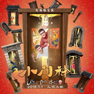

门动画电影《小门神》推广曲
============================

|  |  |
| :--: | :-- |
| [ 门动画电影《小门神》推广曲](https://emumo.xiami.com/album/2100245456) | **艺人**: [好妹妹](../index.md) **语种**: 国语 **唱片公司**: 春生工作室 **发行时间**: 2015年12月10日 **专辑类别**: EP, 单曲 **专辑风格**: 城市民谣 Urban Folk **播放数**: 890574 **收藏数**: 471 **评论数**: 79  |

## 简介

好妹妹乐队的最新单曲《门》是为电影《小门神》量身打造的推广曲。曲风清冽悠扬,配合秦昊和张小厚两人独特嗓音和完美和声。将电影中人间百态和新世纪的神界无缝连接到一起。让人们在歌声中,找寻记忆深处对中国传统文化的情愫。  
  
电影《小门神》讲述的是由于新时代人间对神界的长期忽视,导致神界经济凋敝,众神面临下岗,门神两兄弟神荼(高晓松 配音)、郁垒(白客 配音)的神仙职位也岌岌可危。不甘现状、渴望改变的郁垒对门神不再被人间重视深感焦虑,冲动下凡,偶遇了人间女孩雨儿,雨儿妈妈只身固守祖传馄饨配方,不愿改变。门神兄弟的人间历险影响到了雨儿和妈妈,神界人间,看似平行世界的两个独立存在,却有着千丝万缕的联系。是墨守陈规,还是积极改变?人间的三封印被解开后,终极怪兽出现,门神兄弟是否还能守护人间安宁? 

## 曲目

## 评论

|  |  |  |
| :-- | :-- | :-- |
|  [虾米用户](https://emumo.xiami.com/u/48777594) 半醉半醒日复日 无风无雨... 2016-03-04 21:33 赞(0) 踩(0) | 
让燕郎唱会不会更好 但是高冷的郎是不会唱这种商业性质这么浓的歌的 
 |
|  [虾米用户](https://emumo.xiami.com/u/15631684)   2016-01-17 23:27 赞(0) 踩(0) | 
喜欢这首
 |
|  [虾米用户](https://emumo.xiami.com/u/45221308) 暂无签名~ 2016-01-01 22:11 赞(0) 踩(0) | 
哈哈哈哈好听！
 |
|  [虾米用户](https://emumo.xiami.com/u/7804115) 没有音乐的日子太可怕 2015-12-26 18:52 赞(0) 踩(0) | 
好听
 |
|  [虾米用户](https://emumo.xiami.com/u/43794055) Love is blin... 2015-12-24 20:16 赞(0) 踩(0) | 
画面感太强惹   
 |
|  [虾米用户](https://emumo.xiami.com/u/4838199) 暂无签名~ 2015-12-24 09:49 赞(0) 踩(0) | 
真好听啊
 |
|  [虾米用户](https://emumo.xiami.com/u/13519254)  2015-12-23 20:37 赞(0) 踩(0) | 
属于下雨冬天的歌
 |
|  [虾米用户](https://emumo.xiami.com/u/7248454) 我还没想好要写什么... 2015-12-23 11:16 赞(0) 踩(0) | 
真不知道好妹妹有什么好的.........
 |
| ⇒ |  [虾米用户](https://emumo.xiami.com/u/11301900) 我知道你将一直陪伴，就像... 2016-01-09 00:54 赞(0) 踩(0) | 
不用纠结。想不通就不要想，听不懂就不去听，不理解就无需理解。音乐这种东西生来只是为了打动人的灵魂，你找不到它的好，无非是它不适合你。所以不用质疑也不必多言，去找与你契合的那首歌吧。
 |
| ⇒ |  [虾米用户](https://emumo.xiami.com/u/7248454) 我还没想好要写什么... 2016-01-18 14:18 赞(0) 踩(0) | 
<q><b>橘子呦说：</b></q>
 |
|  [虾米用户](https://emumo.xiami.com/u/1949522)  2015-12-21 11:49 赞(1) 踩(0) | 
好听
 |
|  [虾米用户](https://emumo.xiami.com/u/971317) 做一只追随小姐姐的节制的... 2015-12-21 08:34 赞(0) 踩(0) | 
最近越来越高调了~
 |
|  [虾米用户](https://emumo.xiami.com/u/19787926)   2015-12-18 21:53 赞(1) 踩(0) | 
好听！
 |
|  [虾米用户](https://emumo.xiami.com/u/46844775)   2015-12-18 13:28 赞(1) 踩(0) | 
上春晚！
 |
|  [虾米用户](https://emumo.xiami.com/u/4957159)  2015-12-18 00:42 赞(1) 踩(0) | 
中国风元素，轻快愉悦动感。
 |
|  [虾米用户](https://emumo.xiami.com/u/18849401)  2015-12-17 18:55 赞(1) 踩(0) | 
反正电影一定要去看了！！！！耶耶耶
 |
|  [虾米用户](https://emumo.xiami.com/u/54300361)  2015-12-15 18:40 赞(0) 踩(0) | 
一听开头音乐就喜欢上了这首歌~歌词棒，音乐的中国风热情却总觉得又夹杂着一点点寂寥
 |
|  [虾米用户](https://emumo.xiami.com/u/7872010) 我歌唱因为我还活着 2015-12-14 15:51 赞(0) 踩(0) | 
副歌很像华健的风格
 |
|  [虾米用户](https://emumo.xiami.com/u/44946960) 还是相信 华语音乐的时代... 2015-12-14 07:02 赞(2) 踩(0) | 
重复n遍了 曲词都好听 笛声一起感觉就来了  小门神和大圣归来一样 我必须n刷
 |
|  [虾米用户](https://emumo.xiami.com/u/9714288)   2015-12-13 23:02 赞(2) 踩(0) | 
支持上春晚
 |
|  [虾米用户](https://emumo.xiami.com/u/80317) 我听歌少，你可别骗我～～... 2015-12-13 20:17 赞(0) 踩(0) | 
歌的旋律不错，制作太糙了，唱的就不说了。
 |
|  [虾米用户](https://emumo.xiami.com/u/7612585) 微博:   -阿布酱- 2015-12-13 17:43 赞(0) 踩(0) | 
好听
 |
|  [虾米用户](https://emumo.xiami.com/u/8657273)  2015-12-13 17:17 赞(1) 踩(0) | 
就凭第二段的节奏，绝壁要上春晚。
 |
|  [虾米用户](https://emumo.xiami.com/u/28956288)   2015-12-13 09:47 赞(1) 踩(0) | 
好妹妹上春晚。
 |
|  [虾米用户](https://emumo.xiami.com/u/1268101)  2015-12-13 08:58 赞(3) 踩(0) | 
90年代古装电视剧片尾曲既听感，后面风格一转，我天，春晚style！
 |
|  [虾米用户](https://emumo.xiami.com/u/7872010) 我歌唱因为我还活着 2015-12-12 21:47 赞(0) 踩(0) | 
大爱，清纯的碧池
 |
|  [虾米用户](https://emumo.xiami.com/u/12811367) 花不见叶，叶不见花 2015-12-12 18:19 赞(0) 踩(0) | 
好听！
 |
|  [虾米用户](https://emumo.xiami.com/u/4400274)  2015-12-12 15:55 赞(0) 踩(0) | 
两个字：真。。。。好。。。。。听
 |
|  [虾米用户](https://emumo.xiami.com/u/7757466) 只想好好当个垃圾✓ 2015-12-12 02:48 赞(0) 踩(0) | 
➬
 |
|  [虾米用户](https://emumo.xiami.com/u/2961945) 哦耶！ 2015-12-12 02:34 赞(0) 踩(0) | 
哎呀相当好听啊。编曲的递进感相当抓耳朵。
 |
|  [虾米用户](https://emumo.xiami.com/u/17844056) 我还没想好要写什么... 2015-12-11 19:55 赞(0) 踩(0) | 
超级好听
 |
|  [虾米用户](https://emumo.xiami.com/u/35590894) 我没有理由不努力 2015-12-11 17:57 赞(0) 踩(0) | 
希望好妹妹，不忘初心(;｀O´)o
 |
|  [虾米用户](https://emumo.xiami.com/u/6743107) 像下雨后的晴 2015-12-11 16:11 赞(0) 踩(0) | 
为什么感觉这么春晚呢
 |
|  [虾米用户](https://emumo.xiami.com/u/42347) 寻找无双 2015-12-11 14:54 赞(8) 踩(0) | 
起初觉得两个大爷们唱这么娘的歌很是违和，没想到现在居然大红大紫进入了一线歌手之列……
 |
| ⇒ |  [虾米用户](https://emumo.xiami.com/u/4400274)  2015-12-12 15:54 赞(0) 踩(0) | 
看到十八线红了，是不是有种养了多年的女儿嫁人了的又欣慰又悲伤的感觉 
 |
| ⇒ |  [虾米用户](https://emumo.xiami.com/u/1949522)  2015-12-21 11:49 赞(0) 踩(0) | 
<q><b>MichaelKing说：</b></q>
 |
| ⇒ |  [虾米用户](https://emumo.xiami.com/u/98469)  2015-12-22 19:21 赞(0) 踩(0) | 
<q><b>MichaelKing说：</b></q>
 |
|  [虾米用户](https://emumo.xiami.com/u/10331571)   2015-12-11 14:34 赞(0) 踩(0) | 
好红
 |
|  [虾米用户](https://emumo.xiami.com/u/42726979) 心里住着一道彩虹。 2015-12-11 10:21 赞(0) 踩(0) | 
1月1日，人间上映
 |
|  [虾米用户](https://emumo.xiami.com/u/42726979) 心里住着一道彩虹。 2015-12-11 10:21 赞(0) 踩(0) | 
1月1日，人间上映
 |
|  [虾米用户](https://emumo.xiami.com/u/42726979) 心里住着一道彩虹。 2015-12-11 10:21 赞(0) 踩(0) | 
看了点映会的举爪！！！！
 |
|  [虾米用户](https://emumo.xiami.com/u/42725114) ThistheshitI... 2015-12-11 10:14 赞(0) 踩(0) | 

 |
|  [虾米用户](https://emumo.xiami.com/u/44946960) 还是相信 华语音乐的时代... 2015-12-11 09:55 赞(0) 踩(0) | 
好听
 |
|  [虾米用户](https://emumo.xiami.com/u/1027211) 凝视人生聆听无常感悟万物 2015-12-11 05:26 赞(1) 踩(0) | 
有点失望； 其中一句旋律太像周华健的“亲亲我的宝贝”那首
 |
|  [虾米用户](https://emumo.xiami.com/u/36793843) 我还没想好要写什么... 2015-12-11 01:25 赞(0) 踩(0) | 
口水歌 
 |
|  [虾米用户](https://emumo.xiami.com/u/36793843) 我还没想好要写什么... 2015-12-11 01:24 赞(0) 踩(0) | 
……不开心 
 |
|  [虾米用户](https://emumo.xiami.com/u/49481354) 大隐隐于市 2015-12-11 00:54 赞(0) 踩(0) | 
好妹妹
 |
|  [虾米用户](https://emumo.xiami.com/u/48907801) I say you r ... 2015-12-11 00:39 赞(0) 踩(0) | 
好妹妹越来越红
 |
|  [虾米用户](https://emumo.xiami.com/u/63054814)  2015-12-10 23:51 赞(0) 踩(0) | 
好听
 |
|  [虾米用户](https://emumo.xiami.com/u/4122610)  2015-12-10 23:08 赞(0) 踩(0) | 
这都是什么鬼。。。
 |
|  [虾米用户](https://emumo.xiami.com/u/9294572)  2015-12-10 22:45 赞(1) 踩(0) | 
上春晚的节奏
 |
|  [虾米用户](https://emumo.xiami.com/u/50594520) 寻找一个远方的自己，开创... 2015-12-10 22:15 赞(0) 踩(0) | 
改变了
 |
|  [虾米用户](https://emumo.xiami.com/u/48020379)   2015-12-10 22:04 赞(0) 踩(0) | 
哇 雨露均沾
 |
|  [虾米用户](https://emumo.xiami.com/u/39998286)   2015-12-10 21:57 赞(0) 踩(0) | 
啊 藕黑
 |
|  [虾米用户](https://emumo.xiami.com/u/40143805) 再次回归虾米，感动多于回... 2015-12-10 21:33 赞(1) 踩(0) | 
门夹了。
 |
|  [虾米用户](https://emumo.xiami.com/u/31507433) ～ 2015-12-10 20:40 赞(0) 踩(0) | 
啊  还行
 |
|  [虾米用户](https://emumo.xiami.com/u/77681044) 低调，不抵屌。 随意，不... 2015-12-10 20:25 赞(1) 踩(0) | 
妹妹越来越火了… 不！开！心！
 |
| ⇒ |  [虾米用户](https://emumo.xiami.com/u/1078667) 听歌而已哪来这么多矫情 2015-12-17 23:10 赞(0) 踩(0) | 
有什么不开心？嫉妒他们吗？还是希望自己听的永远小众别人都没听过特有优越感？
 |
|  [虾米用户](https://emumo.xiami.com/u/14265718) wx:osakarock... 2015-12-10 20:00 赞(0) 踩(0) | 
反正会一直喜欢你们啦
 |
|  [虾米用户](https://emumo.xiami.com/u/19302788) 想听得见 用耳听未必听见... 2015-12-10 19:54 赞(0) 踩(0) | 
哎呀 这个路线啊……好有小时候看的古装剧主题曲的感觉啊啊啊啊
 |
|  [虾米用户](https://emumo.xiami.com/u/2899322)  2015-12-10 18:59 赞(0) 踩(0) | 
好听惨了
 |
|  [虾米用户](https://emumo.xiami.com/u/829062) 音乐抚慰我心 2015-12-10 18:47 赞(0) 踩(0) | 
舌吻你们！ 
 |
|  [虾米用户](https://emumo.xiami.com/u/7249300) 习惯，醒脑，排解，引导，... 2015-12-10 18:44 赞(0) 踩(0) | 
虽然有种古装电视剧片尾曲既听感，但是不得不说，蛮洗脑的
 |
|  [虾米用户](https://emumo.xiami.com/u/5923091)  2015-12-10 18:13 赞(1) 踩(0) | 
秦老师这次词很有古智慧的味道，是不是看了蔡志忠的结果:-D
 |
|  [虾米用户](https://emumo.xiami.com/u/2397890) 阳光持续 2015-12-10 18:10 赞(0) 踩(0) | 
在QQ赚完钱快点放虾米啦
 |
|  [虾米用户](https://emumo.xiami.com/u/286201)  2015-12-10 16:57 赞(27) 踩(0) | 
果然是有钱砸到秦老师脑袋上写出来的歌就是不一样耶  完全秒杀新砖《西窗》里的歌好么~~~
 |
|  [虾米用户](https://emumo.xiami.com/u/11147711) Rock is love 2015-12-10 16:49 赞(1) 踩(0) | 
好听，期待他们出新专辑。
 |
| ⇒ |  [虾米用户](https://emumo.xiami.com/u/4911883) 如果你也爱Eason 2015-12-10 18:04 赞(0) 踩(0) | 
已经出了在q音独家八首16元
 |
|  [虾米用户](https://emumo.xiami.com/u/337895) 全平台同名 2015-12-10 16:34 赞(2) 踩(0) | 
会去电影院看这部电影的赞我
 |
|  [虾米用户](https://emumo.xiami.com/u/5660107) 请你不要吃我，我给你唱一... 2015-12-10 16:12 赞(11) 踩(0) | 
小妹妹
 |
|  [虾米用户](https://emumo.xiami.com/u/7603700) 我还没想好要写什么... 2015-12-10 15:47 赞(0) 踩(0) | 
why.so....
 |
|  [虾米用户](https://emumo.xiami.com/u/1477205) Oh~Yeah 2015-12-10 13:23 赞(1) 踩(0) | 
我擦！！！我觉得比《西窗》好听！果然是不要钱的才是最好的！
 |
| ⇒ |  [虾米用户](https://emumo.xiami.com/u/253075) 专注内八二十年 2015-12-10 13:25 赞(0) 踩(0) | 
我也觉得归乡和这首 门 比新专好听。。。
 |
| ⇒ |  [虾米用户](https://emumo.xiami.com/u/17626459)  2015-12-10 13:49 赞(0) 踩(0) | 
<q><b>口吐莲花说：</b></q>
 |
| ⇒ |  [虾米用户](https://emumo.xiami.com/u/253075) 专注内八二十年 2015-12-10 14:16 赞(0) 踩(0) | 
<q><b>我是大点点说：</b></q>
 |
|  [虾米用户](https://emumo.xiami.com/u/45953503)   2015-12-10 12:44 赞(0) 踩(0) | 
咋还不出呢 
 |
