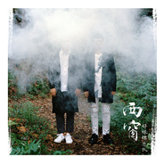

西窗Window of Memory
============================

|  |  |
| :--: | :-- |
| [ 西窗Window of Memory](https://emumo.xiami.com/album/2100252970) | **艺人**: [好妹妹](../index.md) **语种**: 国语 **唱片公司**: 春生工作室 **发行时间**: 2015年12月01日 **专辑类别**: 录音室专辑 **专辑风格**: 城市民谣 Urban Folk, 国语流行 Mandarin Pop **播放数**: 9577105 **收藏数**: 11831 **评论数**: 482  |

## 简介

好妹妹乐队全新第五张专辑《西窗》，由著名制作人刘晓光团队倾力打造，金曲奖最佳制作人荒井壮一郎参与制作。八首全新原创曲目，回归本真文艺曲风，2015年冬天最暖发声，牵上你的手，让时间把忧愁带走。  
  
《西窗》直达心底，以细腻文字搭配清新悠扬的旋律，对老时光点滴的反复回味，将岁月的沉积打磨，娓娓道来，既平心讲述又蓄势蕴涵。八首新曲清新淡雅，犹如风化万物细润人心。专辑制作无论从筹备、策划、编曲，到后期录音监制、精炼打磨，两位成员全心投入创作，耗时数月，并突破尝试多元音乐元素。  
让人怀念的旧时光，企图留住的过往。无论是沉沦还是释怀，过去的美好都是成长日记里向上的符号，孤独模糊眼眶带着伤痕历历在目，能被经历的过往都是缘分，不再重复不再抓住。沉浸在命运中，恍惚间还有些许微笑温暖心间。  
  
2015年，北京工人体育场四万人演唱会的筹备和专辑制作同步启动。录制过程也经历了乐队四万人演唱会筹备期，记录了与以往专辑录制不同的心路情绪。而新专辑《西窗》在纷扰的环境中呈现出回归本真的平和宁静，有别于以往的故事呈现，专辑新曲通过温暖舒缓的情绪营造，歌词直抵听者内心深处，淡然怀念过去的美好，释怀无法抓住的命运与缘分，让时间带走忧愁，为浮躁的城市送上宁静的陪伴。八首精选作品，是乐队送上的年末冬季最温暖的拥抱，期待与你怀念温情旧时光。  
  
《微风曲》以风化物，让最柔的风吹掉忧愁。  
《风又吹走了》吹走的是你在我心底留下的痕迹。  
《最美的忧愁》藏在记忆里，来了又去了。  
《梦》水中望月难成真，过客已别添忧愁。  
《南来的风》眷念故乡的味道与模样。  
《西窗的雨》雨滴在吟唱，年华在吟唱，孤芳依旧，离人梦。  
《八月午后》想起你的模样，害羞的你微笑好美。没有错过是对这段时光最好的肯定。  
《请你给我多一点温柔》回忆起来每一个片段都是那么美好。

## 曲目

## 评论

|  |  |  |  |
| :-- | :-- | :-- | :-- |
|  [虾米用户](https://emumo.xiami.com/u/11515590) moigoo 2021-01-07 18:03 赞(0) 踩(0) | 
最喜欢的男声。加油
 |
|  [虾米用户](https://emumo.xiami.com/u/436443495)  2020-04-01 22:50 赞(0) 踩(0) | 
每一次听都能回到那一年
 |
|  [虾米用户](https://emumo.xiami.com/u/28156014)  2019-09-03 20:57 赞(0) 踩(0) | 
有点呓语的感觉
 |
|  [虾米用户](https://emumo.xiami.com/u/356798715)  2019-07-22 07:26 赞(0) 踩(0) | 
第一次买网络专辑献给了“西窗”，当时是在酷狗音乐。
 |
|  [虾米用户](https://emumo.xiami.com/u/376296783)  2019-07-03 20:37 赞(0) 踩(0) | 
好
 |
|  [虾米用户](https://emumo.xiami.com/u/401239407)  2019-06-16 11:57 赞(0) 踩(0) | 
 
 |
|  [虾米用户](https://emumo.xiami.com/u/323641241)  2019-04-28 13:32 赞(0) 踩(0) | 
心境相通
 |
|  [虾米用户](https://emumo.xiami.com/u/39709359) 若你能走的进我的灵魂 世... 2019-04-24 14:35 赞(0) 踩(0) | 
天猫88VIP专享 虾米我来了 不过人真是少
 |
|  [虾米用户](https://emumo.xiami.com/u/308615728) 人生是一场蹉跎，愿你别错... 2019-03-25 17:03 赞(0) 踩(0) | 
10分歌曲，八分送给好妹妹乐队，两分送给喜欢孤独的我
 |
|  [虾米用户](https://emumo.xiami.com/u/229217614)   2019-02-28 18:29 赞(0) 踩(0) | 
是轻柔舒缓的让人放松又有点思考的歌，很适合悠闲的午后，阳光，清风，清茶，小憩时来听
 |
|  [虾米用户](https://emumo.xiami.com/u/32663705) 去远方 2019-02-23 12:07 赞(0) 踩(0) | 
非常喜欢这张专辑！
 |
|  [虾米用户](https://emumo.xiami.com/u/329823370)  2018-09-12 17:49 赞(0) 踩(0) | 
声音超级舒服,长相和嗓音严重不符的经典代表.
 |
|  [虾米用户](https://emumo.xiami.com/u/28493255) 404 2018-09-05 14:42 赞(0) 踩(0) | 
这张整体还是挺好听的
 |
|  [虾米用户](https://emumo.xiami.com/u/961289) 给无聊的生活来点背景音乐 2018-07-29 00:17 赞(0) 踩(0) | 
好美！
 |
|  [虾米用户](https://emumo.xiami.com/u/194151174) 音之声•乐之魂 2018-07-12 07:27 赞(0) 踩(0) | 
好好听
 |
|  [虾米用户](https://emumo.xiami.com/u/281650140)  2018-06-02 18:58 赞(0) 踩(0) | 
西窗属于沧海遗珠初听不觉得好越听越有感觉好多句子 唱到你的心里
 |
|  [虾米用户](https://emumo.xiami.com/u/45034571)  2018-03-16 08:39 赞(0) 踩(0) | 
歌还不错
 |
|  [虾米用户](https://emumo.xiami.com/u/227001417) 不到谢幕，永远不知道自己... 2018-02-24 09:05 赞(1) 踩(0) | 
好妹妹
 |
|  [虾米用户](https://emumo.xiami.com/u/350598051)  2018-02-23 13:51 赞(1) 踩(0) | 
集福送个SVIP，搞得我下载个虾米然后在这听这首歌。。。
 |
|  [虾米用户](https://emumo.xiami.com/u/348546180)  2018-02-08 12:31 赞(2) 踩(0) | 
集福送的
 |
|  [虾米用户](https://emumo.xiami.com/u/344394563) moge 2018-01-12 12:55 赞(0) 踩(0) | 
留
 |
|  [虾米用户](https://emumo.xiami.com/u/343774199)  2018-01-08 09:53 赞(0) 踩(0) | 
会员无敌
 |
|  [虾米用户](https://emumo.xiami.com/u/342968269)  2018-01-05 22:26 赞(0) 踩(0) | 
好听
 |
|  [虾米用户](https://emumo.xiami.com/u/341780384)  2018-01-04 08:04 赞(0) 踩(0) | 
心疼，蚂蚁积分两千多浪费了 然后换了虾米会员 
 |
|  [虾米用户](https://emumo.xiami.com/u/214959309)  2017-12-31 20:53 赞(1) 踩(0) | 
淘宝兑换才下载虾米，以前网易，觉得这里也不错
 |
|  [虾米用户](https://emumo.xiami.com/u/330612653)  2017-12-24 13:50 赞(1) 踩(0) | 
湄公河见证
 |
|  [虾米用户](https://emumo.xiami.com/u/44842836) 暂无签名~ 2017-11-26 10:21 赞(2) 踩(0) | 
积分换的超级会员
 |
|  [虾米用户](https://emumo.xiami.com/u/336529798)  2017-11-21 10:31 赞(1) 踩(0) | 
怎么找到
 |
|  [虾米用户](https://emumo.xiami.com/u/336529798)  2017-11-21 10:30 赞(1) 踩(0) | 
下载到哪儿了？
 |
|  [虾米用户](https://emumo.xiami.com/u/203295532)  2017-11-18 14:27 赞(1) 踩(0) | 
喜欢封面
 |
|  [虾米用户](https://emumo.xiami.com/u/23416071)  2017-11-18 02:13 赞(1) 踩(0) | 
喜欢这个专辑！
 |
|  [虾米用户](https://emumo.xiami.com/u/335641600)  2017-11-16 13:46 赞(1) 踩(0) | 
刘
 |
|  [虾米用户](https://emumo.xiami.com/u/89004246)  2017-11-15 22:49 赞(2) 踩(0) | 
留个会员脚印
 |
|  [虾米用户](https://emumo.xiami.com/u/335542067)  2017-11-15 21:56 赞(1) 踩(0) | 
。。。
 |
|  [虾米用户](https://emumo.xiami.com/u/51805483)  2017-11-06 20:33 赞(2) 踩(0) | 
我美丽年华
 |
|  [虾米用户](https://emumo.xiami.com/u/332910991)  2017-11-03 08:26 赞(0) 踩(0) | 
不错的歌我喜欢
 |
|  [虾米用户](https://emumo.xiami.com/u/63851914) 虾米 再见 2017-11-02 22:42 赞(0) 踩(0) | 
体验一把
 |
|  [虾米用户](https://emumo.xiami.com/u/971317) 做一只追随小姐姐的节制的... 2017-10-27 23:54 赞(0) 踩(0) | 
最近循环中～有钱了就是任性呀
 |
|  [虾米用户](https://emumo.xiami.com/u/48976902)  2017-10-18 10:00 赞(0) 踩(0) | 
民谣感觉 又似校园歌曲 下了 正好有会员
 |
|  [虾米用户](https://emumo.xiami.com/u/168554192) 行星饭 2017-10-17 15:47 赞(0) 踩(0) | 
微信bb3529tt
 |
|  [虾米用户](https://emumo.xiami.com/u/266193031)  2017-10-12 21:59 赞(0) 踩(0) | 
好妹妹乐队 ，歌有清新空灵感，乐队有从大山里来的感觉！
 |
|  [虾米用户](https://emumo.xiami.com/u/324312301)  2017-09-18 23:05 赞(1) 踩(0) | 
甜甜的梦，带走你的忧 
 |
|  [虾米用户](https://emumo.xiami.com/u/320084798)  2017-08-18 20:26 赞(0) 踩(0) | 
HMM中偏爱的一张专辑 
 |
|  [虾米用户](https://emumo.xiami.com/u/2741461)   2017-08-06 03:42 赞(0) 踩(0) | 
封面一看就是烧烤露营系列
 |
|  [虾米用户](https://emumo.xiami.com/u/316119975)   2017-07-30 16:08 赞(2) 踩(0) | 
本来我只想下载两首最棒的听，然后我点开评论几乎每一首里的评论都有人说是专辑最爱！于是我点了下在全部...
 |
|  [虾米用户](https://emumo.xiami.com/u/311028972)  2017-07-11 10:47 赞(0) 踩(0) | 
对这两人无法抵抗
 |
|  [虾米用户](https://emumo.xiami.com/u/304100866)  2017-07-09 23:28 赞(0) 踩(0) | 
  
 |
|  [虾米用户](https://emumo.xiami.com/u/307740054) 杂谈杂听 2017-06-28 10:54 赞(0) 踩(0) | 
会员？
 |
|  [虾米用户](https://emumo.xiami.com/u/262237613) ll 2017-06-25 18:37 赞(0) 踩(0) | 
这张专辑除了请你给我多一点温柔，其他的都喜欢 
 |
|  [虾米用户](https://emumo.xiami.com/u/286564593) 遇见        相识... 2017-06-25 10:42 赞(0) 踩(0) | 
一股清流。感觉很恬静。
 |
|  [虾米用户](https://emumo.xiami.com/u/306212340)  2017-06-24 23:37 赞(1) 踩(0) | 
大半夜的看封面还有点像恐怖片 
 |
|  [虾米用户](https://emumo.xiami.com/u/13083843)  2017-05-12 14:29 赞(0) 踩(0) | 
不错
 |
| ⇒ |  [虾米用户](https://emumo.xiami.com/u/263919030) 哒哒哒←_←路过 2017-06-21 07:20 赞(0) 踩(0) | 
喜欢卡其社的《日光倾城》
 |
|  [虾米用户](https://emumo.xiami.com/u/293981298)  2017-05-05 10:50 赞(0) 踩(0) | 

 |
|  [虾米用户](https://emumo.xiami.com/u/267815169)  2017-05-04 08:10 赞(0) 踩(0) | 
轻声吟唱！
 |
|  [虾米用户](https://emumo.xiami.com/u/41683255)   2017-05-01 11:02 赞(0) 踩(0) | 
？
 |
|  [虾米用户](https://emumo.xiami.com/u/232147566)  2017-04-30 23:51 赞(0) 踩(0) | 
好听好听   
 |
|  [虾米用户](https://emumo.xiami.com/u/290202806)  2017-04-21 08:23 赞(0) 踩(0) | 
好听
 |
|  [虾米用户](https://emumo.xiami.com/u/280793094)  2017-04-20 08:30 赞(0) 踩(0) | 
 
 |
|  [虾米用户](https://emumo.xiami.com/u/288119797)  2017-04-12 22:40 赞(0) 踩(0) | 
不错啊！
 |
|  [虾米用户](https://emumo.xiami.com/u/287114607)  2017-04-09 19:06 赞(0) 踩(0) | 
好好听呀！！！
 |
|  [虾米用户](https://emumo.xiami.com/u/266608383)  2017-04-08 09:47 赞(0) 踩(0) | 
******
 |
|  [虾米用户](https://emumo.xiami.com/u/4131849) 网易云：非人類兔子Agy... 2017-04-05 10:16 赞(0) 踩(0) | 
ಠ_ಠ
 |
|  [虾米用户](https://emumo.xiami.com/u/286106637)  2017-04-04 22:39 赞(0) 踩(0) | 
都挺好听的
 |
|  [虾米用户](https://emumo.xiami.com/u/246521459)   2017-04-04 21:14 赞(0) 踩(0) | 
       
 |
|  [虾米用户](https://emumo.xiami.com/u/246521459)   2017-04-04 21:13 赞(0) 踩(0) | 
就是爱听
 |
|  [虾米用户](https://emumo.xiami.com/u/189109551) 有太多的故事不知如何开口 2017-04-02 22:49 赞(0) 踩(0) | 
在烦躁的时候习惯性听他们的歌
 |
|  [虾米用户](https://emumo.xiami.com/u/40560180) 心之所向，素履以往。 2017-04-01 00:03 赞(0) 踩(0) | 
居然已经一年多了
 |
|  [虾米用户](https://emumo.xiami.com/u/49994144)  2017-03-30 11:15 赞(0) 踩(0) | 
不错哦
 |
|  [虾米用户](https://emumo.xiami.com/u/15043182)  2017-03-28 07:29 赞(1) 踩(0) | 
好听
 |
|  [虾米用户](https://emumo.xiami.com/u/283872041)  2017-03-27 20:44 赞(0) 踩(0) | 
好美音质，我喜欢上了虾米音乐
 |
|  [虾米用户](https://emumo.xiami.com/u/283872041)  2017-03-27 20:42 赞(1) 踩(0) | 
轻轻的，像梦境般轻柔，好美好美
 |
|  [虾米用户](https://emumo.xiami.com/u/283749320) 喜马拉雅电台签约主播 2017-03-27 10:33 赞(0) 踩(0) | 
虾米的第一首歌，希望我能爱上你
 |
|  [虾米用户](https://emumo.xiami.com/u/117540110) 梅花香苦寒来 2017-03-24 23:24 赞(0) 踩(0) | 
还可以音质挺好
 |
|  [虾米用户](https://emumo.xiami.com/u/117540110) 梅花香苦寒来 2017-03-24 23:23 赞(0) 踩(0) | 
&amp;radic;|P说话
 |
|  [虾米用户](https://emumo.xiami.com/u/282765487) 音乐夜 2017-03-23 22:00 赞(0) 踩(0) | 
回忆过去
 |
|  [虾米用户](https://emumo.xiami.com/u/282559493)  2017-03-22 23:02 赞(1) 踩(0) | 
不过两个男人的乐队为啥叫好妹妹 
 |
| ⇒ |  [虾米用户](https://emumo.xiami.com/u/226911436)  2017-05-09 10:05 赞(0) 踩(0) | 
问秦昊哈
 |
| ⇒ |  [虾米用户](https://emumo.xiami.com/u/42642211) 0.0 2017-05-25 17:44 赞(0) 踩(0) | 
因为在他们第一次以组合的形式参加一个选秀的时候，唱的歌就是《你究竟有几个好妹妹》于是组合的名字就叫好妹妹了（这个是在一次你妹电台里说的
 |
|  [虾米用户](https://emumo.xiami.com/u/282559493)  2017-03-22 23:01 赞(0) 踩(0) | 
太好听了，声音太美了
 |
|  [虾米用户](https://emumo.xiami.com/u/281633589)  2017-03-19 13:39 赞(4) 踩(0) | 
支付宝送会员 
 |
| ⇒ |  [虾米用户](https://emumo.xiami.com/u/44301506)   2017-04-01 11:17 赞(0) 踩(0) | 
怎么送呀
 |
|  [虾米用户](https://emumo.xiami.com/u/281293913)  2017-03-18 14:31 赞(0) 踩(0) | 
666
 |
|  [虾米用户](https://emumo.xiami.com/u/249839583)  2017-03-17 21:05 赞(0) 踩(0) | 
切，我今年双十一过期
 |
|  [虾米用户](https://emumo.xiami.com/u/280796364)   2017-03-16 16:29 赞(4) 踩(0) | 
一直喜欢好妹妹乐队的歌，很有那种青春的美好和无奈的感觉
 |
|  [虾米用户](https://emumo.xiami.com/u/14591053)  2017-03-16 01:43 赞(0) 踩(0) | 
没有更好的音质了？
 |
|  [虾米用户](https://emumo.xiami.com/u/278681242)   2017-03-08 11:11 赞(0) 踩(0) | 

 |
|  [虾米用户](https://emumo.xiami.com/u/30960124) 再遇经典 2017-03-05 17:15 赞(0) 踩(0) | 
虾米送会员
 |
|  [虾米用户](https://emumo.xiami.com/u/34374473)   2017-03-04 08:04 赞(1) 踩(0) | 
过了体弱多病的冬～来了欣欣向荣的春～
 |
| ⇒ |  [虾米用户](https://emumo.xiami.com/u/37702208) 如果当初……如果～ 2017-03-13 21:24 赞(0) 踩(0) | 
应该是迎来了疾病多发的春
 |
|  [虾米用户](https://emumo.xiami.com/u/276161147)  2017-03-01 10:13 赞(1) 踩(0) | 
虾米送了我三个月会员，真是开心听到我喜欢乐队的
 |
| ⇒ |  [虾米用户](https://emumo.xiami.com/u/8758326)  2017-04-25 15:15 赞(0) 踩(0) | 
怎么送的？
 |
|  [虾米用户](https://emumo.xiami.com/u/50447316) 灵魂 2017-02-16 22:46 赞(1) 踩(0) | 
封面是在装鬼吗 
 |
| ⇒ |  [虾米用户](https://emumo.xiami.com/u/172143890) 我还没想好要写什么... 2017-06-22 20:31 赞(0) 踩(0) | 
我以为只有我注意到这封面，真的是搞笑 。
 |
|  [虾米用户](https://emumo.xiami.com/u/13455230) 煎茶坐看梨门雨 2017-02-13 13:24 赞(0) 踩(0) | 
秦老湿的声音简直太赞
 |
|  [虾米用户](https://emumo.xiami.com/u/22010497)   2016-12-22 12:05 赞(3) 踩(0) | 
我买了很多张 支持。谁要 我可以分享 只给真爱
 |
| ⇒ |  [虾米用户](https://emumo.xiami.com/u/15301190)  2017-02-28 19:10 赞(0) 踩(0) | 
(^ ^)
 |
|  [虾米用户](https://emumo.xiami.com/u/106313364) 奔跑不停 2016-10-10 18:10 赞(1) 踩(0) | 
秦昊说过 这是他最喜欢的一张专辑
 |
|  [虾米用户](https://emumo.xiami.com/u/38640528) 暂无签名~ 2016-10-04 15:54 赞(2) 踩(0) | 
睡到秦昊 （哦，你们不要告诉我老公，人妻追星很辛苦的） 
 |
|  [虾米用户](https://emumo.xiami.com/u/26954482) 暂无签名~ 2016-09-22 21:24 赞(0) 踩(0) | 
我最喜欢这张专辑，每一首都很让人动情
 |
|  [虾米用户](https://emumo.xiami.com/u/2523233) 太热 2016-09-13 16:53 赞(3) 踩(0) | 
封面是准备升天吗？
 |
|  [虾米用户](https://emumo.xiami.com/u/139501908)  2016-09-01 12:16 赞(0) 踩(0) | 
浅吟低唱，唱入内心
 |
|  [虾米用户](https://emumo.xiami.com/u/85552256) 我还没想好要写什么... 2016-08-31 15:20 赞(0) 踩(0) | 
啊这张专辑好好听，好想去听现场版
 |
|  [虾米用户](https://emumo.xiami.com/u/83620080) 一个俗人 2016-08-24 22:25 赞(1) 踩(0) | 
第一次听好妹妹  感觉好赞
 |
|  [虾米用户](https://emumo.xiami.com/u/15338436) 爱音乐的孩子，永远不会变 2016-07-26 00:40 赞(0) 踩(0) | 
爱好妹妹，没理由！
 |
|  [虾米用户](https://emumo.xiami.com/u/6331619)  2016-07-15 13:05 赞(1) 踩(0) | 
特别适合这个一夜雨后清新凉爽的夏日北京
 |
|  [虾米用户](https://emumo.xiami.com/u/101191086) 你可知道你的名字解释了我... 2016-06-19 10:40 赞(1) 踩(0) | 
他们很努力，也很感谢他们的努力坚持才让我们听到这么好的歌，好妹妹加油哦！！我会一直支持你的。
 |
|  [虾米用户](https://emumo.xiami.com/u/73857918) 在黎明之前 2016-06-06 21:47 赞(0) 踩(0) | 
这张专辑让我想到很多，缅怀过去，勿忘初心 
 |
|  [虾米用户](https://emumo.xiami.com/u/93523210)   2016-05-30 21:42 赞(0) 踩(0) | 
唱功敢不敢再好一点。
 |
|  [虾米用户](https://emumo.xiami.com/u/1023065)  2016-05-30 07:44 赞(0) 踩(0) | 
好妹妹乐队
 |
|  [虾米用户](https://emumo.xiami.com/u/106812758) 所谓无底深渊，下去，也是... 2016-05-29 08:35 赞(1) 踩(0) | 
最爱西窗和往事 希望以后能看到和璧女神的同台演出 
 |
|  [虾米用户](https://emumo.xiami.com/u/48083555) 嗨，好喜欢你 2016-05-26 23:02 赞(1) 踩(0) | 
很久之前下了然后删了，现在哭死  
 |
| ⇒ |  [虾米用户](https://emumo.xiami.com/u/185088619) 他是谁 2016-06-12 00:20 赞(0) 踩(0) | 
我也是！不小心删掉
 |
|  [虾米用户](https://emumo.xiami.com/u/85763696)   2016-05-03 21:40 赞(1) 踩(0) | 
好妹妹加油啊
 |
|  [虾米用户](https://emumo.xiami.com/u/47365062) windy 2016-05-01 10:04 赞(0) 踩(0) | 
淘宝他妈的38
 |
|  [虾米用户](https://emumo.xiami.com/u/91180114) 我会记得你 然后爱别人 2016-04-27 12:46 赞(0) 踩(0) | 
m哦
 |
|  [虾米用户](https://emumo.xiami.com/u/41790549)  2016-04-13 16:13 赞(1) 踩(0) | 
相思赋予谁是最好的一首了，后面就一直是唱儿歌，盲目商业化的道路注定不会久远
 |
| ⇒ |  [虾米用户](https://emumo.xiami.com/u/150685322)  2016-05-03 23:25 赞(0) 踩(0) | 
但愿不如此
 |
|  [虾米用户](https://emumo.xiami.com/u/21216195) 我还没想好要写什么... 2016-04-11 13:45 赞(2) 踩(0) | 
一如既往的温柔。虽然我最爱的是《春生》，可能永远会是《春生》，但是《西窗》还是没有让我失望。
 |
|  [虾米用户](https://emumo.xiami.com/u/893543)  2016-04-05 15:32 赞(0) 踩(0) | 
越来越喜欢
 |
|  [虾米用户](https://emumo.xiami.com/u/48049206)   2016-03-26 22:23 赞(0) 踩(0) | 
晚安_(:з」∠)_
 |
|  [虾米用户](https://emumo.xiami.com/u/2032032) 这个世界很懒，什么也没给... 2016-03-19 22:02 赞(0) 踩(0) | 
有没有和我一样觉得封面很诡异看完觉得凉飕飕的
 |
|  [虾米用户](https://emumo.xiami.com/u/123106448) 奇葩小萌。 2016-03-15 10:02 赞(0) 踩(0) | 
你们这么惹人喜欢你爸妈知道吗… 
 |
|  [虾米用户](https://emumo.xiami.com/u/2483039) 小熊也喜欢阳光 2016-03-09 23:03 赞(2) 踩(0) | 
听着《西窗的雨》，此刻窗外下着春雨，春风不如想象中那般温柔，透着阵阵的春寒料峭，是时候晚安了
 |
|  [虾米用户](https://emumo.xiami.com/u/632797) 我还没想好要写什么... 2016-03-09 15:12 赞(1) 踩(0) | 
用淡淡的心情淡淡地听歌。
 |
|  [虾米用户](https://emumo.xiami.com/u/32398169)   2016-03-05 14:52 赞(0) 踩(0) | 
风又吹走了这首歌为什么不能下载
 |
|  [虾米用户](https://emumo.xiami.com/u/343662) 心似琉璃身如花 2016-03-01 15:02 赞(0) 踩(0) | 
诗情画意
 |
|  [虾米用户](https://emumo.xiami.com/u/1401784)  2016-02-25 14:34 赞(0) 踩(0) | 
好妹妹
 |
|  [虾米用户](https://emumo.xiami.com/u/103628640)  2016-02-22 18:03 赞(0) 踩(0) | 
最爱西窗了
 |
|  [虾米用户](https://emumo.xiami.com/u/3561218)  2016-02-13 14:28 赞(0) 踩(0) | 
TAT 第一首的前奏一出来就泪目
 |
|  [虾米用户](https://emumo.xiami.com/u/6211970) 我还没想好要写什么... 2016-02-08 14:48 赞(0) 踩(0) | 

 |
|  [虾米用户](https://emumo.xiami.com/u/6580795) 接受一切然后热爱一切 2016-02-07 10:33 赞(1) 踩(0) | 
所以，我在虾米音乐买的年V，也无怨无悔。我们的目标是睡到张小天后
 |
|  [虾米用户](https://emumo.xiami.com/u/61014896)  2016-02-02 16:25 赞(0) 踩(0) | 
还是喜欢南北和春生。
 |
|  [虾米用户](https://emumo.xiami.com/u/3347691)  2016-01-26 21:29 赞(0) 踩(0) | 
hahahaha,刚刚花了16块钱下载~真好真好~
 |
|  [虾米用户](https://emumo.xiami.com/u/77597524)  2016-01-25 16:06 赞(0) 踩(0) | 
不得不说，这张专辑出来之后真的很少听春生，南北了
 |
|  [虾米用户](https://emumo.xiami.com/u/4756920)  2016-01-24 23:45 赞(0) 踩(0) | 
说好绝不做的事情，现在做到不想放弃。
 |
|  [虾米用户](https://emumo.xiami.com/u/2455883) 所有的相遇都是久别重逢 2016-01-20 17:36 赞(0) 踩(0) | 
好听，新专辑收录了几年前秦昊在现场弹唱的《西窗的雨》，莫名感动
 |
|  [虾米用户](https://emumo.xiami.com/u/740923)  2016-01-20 15:48 赞(0) 踩(0) | 
无损的包是坏的呢
 |
|  [虾米用户](https://emumo.xiami.com/u/36734325) 信仰？你在开玩笑吗？ 2016-01-19 12:52 赞(2) 踩(0) | 
难道只有我觉得这封面好像这对基友在老家上坟照的吗？
 |
| ⇒ |  [虾米用户](https://emumo.xiami.com/u/4400274)  2016-01-23 13:20 赞(0) 踩(0) | 
哈哈哈哈哈哈～～城里孩子不会懂
 |
|  [虾米用户](https://emumo.xiami.com/u/38562293) 全部都听 2016-01-16 15:08 赞(0) 踩(0) | 
    太好听 怎么办 睡不着 
 |
|  [虾米用户](https://emumo.xiami.com/u/98518436) 热血青年 2016-01-15 01:28 赞(0) 踩(0) | 
好专辑
 |
|  [虾米用户](https://emumo.xiami.com/u/51543219) 焚心以火. 2016-01-14 23:48 赞(0) 踩(0) | 

 |
|  [虾米用户](https://emumo.xiami.com/u/12728278)   2016-01-14 22:00 赞(0) 踩(0) | 
喜欢
 |
|  [虾米用户](https://emumo.xiami.com/u/8586013) Life is an i... 2016-01-14 19:05 赞(0) 踩(0) | 
这首专辑基本上可以说每首都喜欢，我爱的好妹妹回来啦~
 |
|  [虾米用户](https://emumo.xiami.com/u/52351621)  2016-01-14 15:59 赞(0) 踩(0) | 
声线是我菜/
 |
|  [虾米用户](https://emumo.xiami.com/u/10950679) 暂无签名~ 2016-01-14 13:21 赞(0) 踩(0) | 
简单直白的歌词，温柔恬静的曲子，像溪流婉转，随风一直流进心里去。静谧的雨夜，白衬衣的少年，拨动的琴弦，低吟浅唱，自在如风。不需要繁复精细的词藻或是不停歇的转音。写意温情的小调，就是可以伴着入眠的好妹妹的味道。
 |
|  [虾米用户](https://emumo.xiami.com/u/99416938)  2016-01-14 09:47 赞(0) 踩(0) | 
安静 淡定 和他们的年龄好像真的不符！但他们做的真好！
 |
|  [虾米用户](https://emumo.xiami.com/u/99416938)  2016-01-14 09:47 赞(0) 踩(0) | 
安静 淡定 和他们的年龄好像真的不符！但他们做的真好！
 |
|  [虾米用户](https://emumo.xiami.com/u/99416938)  2016-01-14 09:37 赞(0) 踩(0) | 
不明白 他们为什么起了这个莫名其妙的乐队名称！不喜欢这个乐队的名字！但是喜欢他们的音乐！
 |
|  [虾米用户](https://emumo.xiami.com/u/10819314) 细细打磨耳朵。 2016-01-13 09:24 赞(1) 踩(0) | 
并不让人惊喜啊
 |
|  [虾米用户](https://emumo.xiami.com/u/91720758) 本品无定味 适口者珍 2016-01-13 02:43 赞(0) 踩(0) | 
明明有我粒写的歌 
 |
|  [虾米用户](https://emumo.xiami.com/u/47398421)  2016-01-13 00:17 赞(0) 踩(0) | 
有种 恬静 的味道
 |
|  [虾米用户](https://emumo.xiami.com/u/19563054) Music makes ... 2016-01-12 20:39 赞(0) 踩(0) | 
歌词是硬伤。。。
 |
|  [虾米用户](https://emumo.xiami.com/u/851468) 浮生若梦，为欢几何。 2016-01-12 20:18 赞(0) 踩(0) | 
这张就叫秦昊专辑吧？
 |
|  [虾米用户](https://emumo.xiami.com/u/20152454) pink 2016-01-12 17:49 赞(0) 踩(0) | 
喜欢乡村，喜欢恬静，暖暖的。
 |
|  [虾米用户](https://emumo.xiami.com/u/10551123)   2016-01-11 23:01 赞(0) 踩(0) | 
卿卿我我的情一多，便俗了。
 |
|  [虾米用户](https://emumo.xiami.com/u/1284105) 我还没想好要写什么... 2016-01-11 16:22 赞(0) 踩(0) | 
最美的忧愁，今天听特别应景……是不是……
 |
|  [虾米用户](https://emumo.xiami.com/u/6213248)  2016-01-10 20:47 赞(0) 踩(0) | 
QQ的16大洋 虾米的免费 都比不上京东的59实体碟的效果好
 |
|  [虾米用户](https://emumo.xiami.com/u/6400363)  2016-01-10 14:11 赞(0) 踩(0) | 
听他们的专辑会性冷淡，同意的赞我
 |
| ⇒ |  [虾米用户](https://emumo.xiami.com/u/47981102)  2016-01-25 11:04 赞(0) 踩(0) | 
太好啦!
 |
|  [虾米用户](https://emumo.xiami.com/u/45875306)  2016-01-09 18:35 赞(0) 踩(0) | 

 |
|  [虾米用户](https://emumo.xiami.com/u/13220053) 别扭别扭别扭！！！ 2016-01-09 16:42 赞(0) 踩(0) | 
好暖
 |
|  [虾米用户](https://emumo.xiami.com/u/10703) 土窑爱好者 2016-01-09 11:05 赞(0) 踩(0) | 
怎么是第五张专辑呢？  文案写的
 |
|  [虾米用户](https://emumo.xiami.com/u/52584386)  2016-01-09 09:26 赞(0) 踩(0) | 
温柔的的声音，温柔的曲子，暖到心坎里了
 |
|  [虾米用户](https://emumo.xiami.com/u/56517418)  2016-01-09 07:59 赞(1) 踩(0) | 
整部专辑充满了让你平静下来的力量，它可能不会增加你的快乐，却能化开你的不安与忧伤
 |
|  [虾米用户](https://emumo.xiami.com/u/812944)   2016-01-09 07:54 赞(1) 踩(0) | 
除了这乐队的名字，其他还蛮欣赏的
 |
|  [虾米用户](https://emumo.xiami.com/u/7005064) 随心所欲，随遇而安。 2016-01-08 23:10 赞(0) 踩(0) | 
总感觉这俩小哥在搞基
 |
| ⇒ |  [虾米用户](https://emumo.xiami.com/u/4400274)  2016-01-09 12:46 赞(0) 踩(0) | 
怎么可能，两个都是受好嘛 
 |
|  [虾米用户](https://emumo.xiami.com/u/3069378) 你从海上来 2016-01-08 21:51 赞(0) 踩(0) | 
&amp;lt;西窗的雨&amp;gt; 冬天的深夜听到这个歌，整个人都柔暖了下来。很久没有听歌听到鸡皮疙瘩都起了。
 |
|  [虾米用户](https://emumo.xiami.com/u/97843168) 人，应该诗意地栖居在大地... 2016-01-08 21:01 赞(0) 踩(0) | 
淡淡的，好听 
 |
|  [虾米用户](https://emumo.xiami.com/u/9074619)  2016-01-08 18:47 赞(0) 踩(0) | 
淡淡回忆，点点忧桑
 |
|  [虾米用户](https://emumo.xiami.com/u/6638840) 一杯茶 一首歌 一个人 2016-01-08 18:26 赞(0) 踩(0) | 
一如既往地支持好妹妹，加油！
 |
|  [虾米用户](https://emumo.xiami.com/u/67744832)  2016-01-08 15:19 赞(0) 踩(0) | 
             [18禁][文字up][文字up]
 |
|  [虾米用户](https://emumo.xiami.com/u/43818525)   2016-01-08 14:23 赞(1) 踩(0) | 
偏偏喜欢风又吹走了这首，感觉忧伤的滴出水了……封面老让我想到我们这边熏香肠
 |
|  [虾米用户](https://emumo.xiami.com/u/14864707)  2016-01-08 11:55 赞(0) 踩(0) | 
整个专辑都好忧伤，听着很难受。怎么不收录一些开心的歌
 |
|  [虾米用户](https://emumo.xiami.com/u/47459409)  2016-01-08 10:55 赞(0) 踩(0) | 
雾霾这么重，咋不戴口罩
 |
|  [虾米用户](https://emumo.xiami.com/u/14052716)  2016-01-08 09:29 赞(0) 踩(0) | 
这封面，像两个鬼！！？
 |
|  [虾米用户](https://emumo.xiami.com/u/14308450) 骗自己重复报废的死亡之路... 2016-01-08 09:20 赞(0) 踩(0) | 
不喜欢男声，程壁姐姐快来翻唱了(´-ω-`)
 |
|  [虾米用户](https://emumo.xiami.com/u/694184)  2016-01-08 01:46 赞(0) 踩(0) | 
好妹妹的新专辑还不错欸
 |
|  [虾米用户](https://emumo.xiami.com/u/1291152)  2016-01-07 20:51 赞(0) 踩(0) | 
仿佛又回归春生时那段时光
 |
|  [虾米用户](https://emumo.xiami.com/u/3623217) 我还没想好要写什么... 2016-01-07 18:55 赞(0) 踩(0) | 
编曲...配词...不走心。
 |
|  [虾米用户](https://emumo.xiami.com/u/44128161)   2016-01-07 16:30 赞(0) 踩(0) | 
西窗的雨，想当年才出来的时候就下手机里！整天整天的听啊！！！
 |
|  [虾米用户](https://emumo.xiami.com/u/478527) 好想跟衣服在洗衣机里滚 2016-01-07 15:12 赞(0) 踩(0) | 
已听
 |
|  [虾米用户](https://emumo.xiami.com/u/478527) 好想跟衣服在洗衣机里滚 2016-01-07 15:12 赞(0) 踩(0) | 
已听
 |
|  [虾米用户](https://emumo.xiami.com/u/65975356)  2016-01-07 14:12 赞(0) 踩(0) | 
太棒了！！！！！
 |
|  [虾米用户](https://emumo.xiami.com/u/7329482) 我还没想好要写什么... 2016-01-07 11:56 赞(0) 踩(0) | 
张晓厚为啥不露脸？？
 |
|  [虾米用户](https://emumo.xiami.com/u/52358777)   2016-01-07 03:56 赞(0) 踩(0) | 
为什么这么多风，小碧池
 |
|  [虾米用户](https://emumo.xiami.com/u/74278968)  2016-01-07 03:49 赞(0) 踩(0) | 
怎么做到整张专辑都好听，好听到想骂人。。。
 |
|  [虾米用户](https://emumo.xiami.com/u/2552024)  2016-01-07 00:30 赞(0) 踩(0) | 
让我变做你 最轻柔的风
 |
|  [虾米用户](https://emumo.xiami.com/u/7910542)  2016-01-06 23:18 赞(1) 踩(0) | 
Q音坑啊。
 |
|  [虾米用户](https://emumo.xiami.com/u/11129459) =_= 2016-01-06 22:08 赞(0) 踩(0) | 
一天听一首，蛮好
 |
|  [虾米用户](https://emumo.xiami.com/u/1844) 农夫 山泉 有点田 2016-01-06 21:33 赞(0) 踩(0) | 
还真是越来越……娘
 |
|  [虾米用户](https://emumo.xiami.com/u/43640601)   2016-01-06 21:29 赞(0) 踩(0) | 
我愿做你轻柔的风
 |
|  [虾米用户](https://emumo.xiami.com/u/95788562)   2016-01-06 21:12 赞(0) 踩(0) | 
最美的梦
 |
|  [虾米用户](https://emumo.xiami.com/u/95788562)   2016-01-06 21:12 赞(0) 踩(0) | 
秦碧池你这个小给给
 |
|  [虾米用户](https://emumo.xiami.com/u/96869882)  2016-01-06 18:13 赞(0) 踩(0) | 
qq音乐还在卖
 |
|  [虾米用户](https://emumo.xiami.com/u/49937748)  2016-01-06 15:53 赞(0) 踩(0) | 
好久没听虾米了，音乐播放器多了，在每个播放器逗留的时间的少了
 |
|  [虾米用户](https://emumo.xiami.com/u/7189509)  2016-01-06 15:20 赞(0) 踩(0) | 
喜欢
 |
|  [虾米用户](https://emumo.xiami.com/u/1975635)  2016-01-06 14:59 赞(0) 踩(0) | 
请你给我多一点温柔  最棒啦 可是偏偏排在最后一首了。。。前面几首听下来都比较平淡 到了最后一首突然欢快起来了  有意思
 |
|  [虾米用户](https://emumo.xiami.com/u/31719230)  2016-01-06 14:26 赞(0) 踩(0) | 
知道自己是怎么变老的吗？从某些人的第一张专辑开始关注，现在已经第五张；从某些剧的第一季开始追，追到完结十年一晃而过； 我就不说那个什么夏洛克了，一季就是三年啊混蛋！
 |
|  [虾米用户](https://emumo.xiami.com/u/5439395) 暂无签名~ 2016-01-06 13:40 赞(1) 踩(0) | 
这张专辑缺点那种让人“耳前一亮”的歌曲，有点循规蹈矩，重复之前几张专辑的风格了...个人觉得
 |
| ⇒ |  [虾米用户](https://emumo.xiami.com/u/1975635)  2016-01-06 14:58 赞(0) 踩(0) | 
请你给我多一点温柔  只有这首令人耳前一亮
 |
|  [虾米用户](https://emumo.xiami.com/u/48787541)  2016-01-06 12:30 赞(2) 踩(0) | 
不喜欢，都一个调子
 |
|  [虾米用户](https://emumo.xiami.com/u/48787541)  2016-01-06 12:29 赞(0) 踩(0) | 
歌曲都一样，没有变化不喜欢
 |
|  [虾米用户](https://emumo.xiami.com/u/7762) 困惑让人生有趣。 2016-01-06 12:05 赞(0) 踩(0) | 
第一首好听，其他不抓耳一听一过
 |
|  [虾米用户](https://emumo.xiami.com/u/97855150)  2016-01-06 10:01 赞(0) 踩(0) | 
终于等到你  
 |
|  [虾米用户](https://emumo.xiami.com/u/814203) 下午1点开始听~ 2016-01-06 10:01 赞(0) 踩(0) | 
封面为什么要挡脸？
 |
|  [虾米用户](https://emumo.xiami.com/u/47863107) 你是从诗三百篇中褰裳涉水... 2016-01-06 00:55 赞(0) 踩(0) | 
最美的忧愁
 |
|  [虾米用户](https://emumo.xiami.com/u/41190273) 你！到底，怎么肥四啊？！ 2016-01-05 23:03 赞(0) 踩(0) | 
不知该希望好妹妹继续这样保持呢？还是希望有所突破，就怕一走向突破就变味了，就越来越糟......一个矛盾的心态，这张专辑没有感受到跟以前的不同，原来的配方吧，但就那样，曲调变化不大，歌词相近，没有惊艳，就随便听听就好，没有那么多回味。
 |
| ⇒ |  [虾米用户](https://emumo.xiami.com/u/40029291) So we boat o... 2016-01-06 17:01 赞(0) 踩(0) | 
民谣本来就不要太多突破就好，平平淡淡就好
 |
|  [虾米用户](https://emumo.xiami.com/u/41105474) 别紧张，我不是什么好人 2016-01-05 20:45 赞(0) 踩(0) | 
终于等到虾米上了   就不愿意用qq音乐  
 |
|  [虾米用户](https://emumo.xiami.com/u/34308248) 暂无签名~ 2016-01-05 20:01 赞(0) 踩(0) | 
好吧，第一次会听一整张专辑一首不落下，你能知道我有多喜欢了吧。
 |
|  [虾米用户](https://emumo.xiami.com/u/34308248) 暂无签名~ 2016-01-05 19:42 赞(0) 踩(0) | 
终于出新专辑了，好听好听好听。
 |
|  [虾米用户](https://emumo.xiami.com/u/2780681) ＠(￣-￣)＠lucky... 2016-01-05 17:08 赞(0) 踩(0) | 
妈呀，这个封面好可怕。
 |
|  [虾米用户](https://emumo.xiami.com/u/12488539) 全城为我花光狠劲 2016-01-05 16:35 赞(0) 踩(0) | 
你来过你却离去了
 |
|  [虾米用户](https://emumo.xiami.com/u/32044239) 就算一辈子孤单又怎样？๑... 2016-01-05 15:20 赞(0) 踩(0) | 
小时候的感觉，民谣
 |
|  [虾米用户](https://emumo.xiami.com/u/32044239) 就算一辈子孤单又怎样？๑... 2016-01-05 15:20 赞(0) 踩(0) | 
昨日绽开的风信子和微风曲，好搭，那种心情
 |
|  [虾米用户](https://emumo.xiami.com/u/1421667)  2016-01-05 15:07 赞(1) 踩(0) | 
听完发现只有 南来的风 西窗的雨 比较耐听
 |
|  [虾米用户](https://emumo.xiami.com/u/54522565)  2016-01-05 14:53 赞(0) 踩(0) | 
有触动心的歌呀
 |
|  [虾米用户](https://emumo.xiami.com/u/6721506)  2016-01-05 14:13 赞(0) 踩(0) | 
日森系么
 |
|  [虾米用户](https://emumo.xiami.com/u/3425353)  2016-01-05 13:43 赞(0) 踩(0) | 
西窗的雨  听见就心痛了 淡淡的 很感动 ... ...     听了三天再来评价  结果发现大家都说好
 |
|  [虾米用户](https://emumo.xiami.com/u/4774650)  2016-01-05 12:52 赞(0) 踩(0) | 
昨天拿到碟，今天上午轮了一遍。风又吹走了是很想re一下午的歌，我厚实力温柔。编曲再淡一点更有好妹妹的味道，秦老师随便吹吹口哨打打手鼓就好。
 |
|  [虾米用户](https://emumo.xiami.com/u/547627) 一台漫游银河系的机器人 2016-01-05 11:27 赞(1) 踩(0) | 
``(#￣▽￣#)``黑白配，男生男生配~
 |
|  [虾米用户](https://emumo.xiami.com/u/95967118)  2016-01-05 09:15 赞(0) 踩(0) | 
很好听
 |
|  [虾米用户](https://emumo.xiami.com/u/5026326) 爱唱歌的孩子都是好孩子～ 2016-01-05 09:05 赞(0) 踩(0) | 
喜欢这声音
 |
|  [虾米用户](https://emumo.xiami.com/u/9080508) 可知道 你的光 耀了我 2016-01-05 06:01 赞(0) 踩(0) | 
ஐ 风又吹走了 喜欢前奏。西窗的雨 好柔 打湿我的心房。
 |
|  [虾米用户](https://emumo.xiami.com/u/43932046) 爱雷鬼，爱民谣，爱电音。 2016-01-05 00:16 赞(0) 踩(0) | 
老妹妹乐队，你们改动大点行不？
 |
|  [虾米用户](https://emumo.xiami.com/u/15338436) 爱音乐的孩子，永远不会变 2016-01-04 23:45 赞(0) 踩(0) | 
花16块自high了一个月~不对是32块，和喜欢的人分享了！
 |
|  [虾米用户](https://emumo.xiami.com/u/18640548) bullshit 2016-01-04 23:31 赞(0) 踩(0) | 
虾米虾米，谁是这个世界上最好的男人？
 |
|  [虾米用户](https://emumo.xiami.com/u/97511086) 我还没想好要写什么... 2016-01-04 22:23 赞(0) 踩(0) | 
第一次认真听，一边画画，一边想
 |
|  [虾米用户](https://emumo.xiami.com/u/14998602)  2016-01-04 22:06 赞(0) 踩(0) | 
初听过来歌曲结构有点散，没有以前这么好的画面感。
 |
|  [虾米用户](https://emumo.xiami.com/u/7757466) 只想好好当个垃圾✓ 2016-01-04 21:55 赞(0) 踩(0) | 
➫
 |
|  [虾米用户](https://emumo.xiami.com/u/40042915)  2016-01-04 21:48 赞(0) 踩(0) | 
循环循环循环，太喜欢好妹妹
 |
|  [虾米用户](https://emumo.xiami.com/u/14565894) 一起去远方吧~ 2016-01-04 21:35 赞(0) 踩(0) | 
词曲：秦昊 贯穿整张专辑……
 |
|  [虾米用户](https://emumo.xiami.com/u/4376156) 暂无签名~ 2016-01-04 21:22 赞(0) 踩(0) | 
清新的类校园民谣
 |
|  [虾米用户](https://emumo.xiami.com/u/49129829) 君子之道 2016-01-04 21:05 赞(0) 踩(0) | 
完全可以当睡前歌曲
 |
|  [虾米用户](https://emumo.xiami.com/u/46536765)  2016-01-04 19:31 赞(1) 踩(0) | 
在企鹅花了16块钱的飘过，就当对每一张专辑的一如既往的支持吧
 |
|  [虾米用户](https://emumo.xiami.com/u/47191452) listening 2016-01-04 16:49 赞(0) 踩(0) | 
整扇窗灌进来的大多是风，但最喜欢的还是最美的忧愁
 |
|  [虾米用户](https://emumo.xiami.com/u/413990) 恶人勿近～ 2016-01-04 15:46 赞(1) 踩(0) | 
这个封面我给满分！
 |
|  [虾米用户](https://emumo.xiami.com/u/1031) asca.lu 2016-01-04 15:34 赞(0) 踩(0) | 
网易免费下载，你这里仅虾币，呵呵呵呵呵
 |
|  [虾米用户](https://emumo.xiami.com/u/6733300) 誩 2016-01-04 15:12 赞(0) 踩(0) | 
来得这么突然，新年礼物啊  
 |
|  [虾米用户](https://emumo.xiami.com/u/35167460) La vie elle ... 2016-01-04 14:25 赞(1) 踩(0) | 
这一次专辑像雾有雨又有风  么么嗒 好温柔
 |
|  [虾米用户](https://emumo.xiami.com/u/39570947)  2016-01-04 13:46 赞(0) 踩(0) | 
如一缕清风从心头拂过，暖暖的
 |
|  [虾米用户](https://emumo.xiami.com/u/48584762)  2016-01-04 13:41 赞(0) 踩(0) | 
适合安静的时候慢慢的听听着听着就觉得莫名的好感动～
 |
|  [虾米用户](https://emumo.xiami.com/u/42157172) hiteagle 2016-01-04 13:19 赞(0) 踩(0) | 
歌词美腻，曲风清新，嗓音清澈
 |
|  [虾米用户](https://emumo.xiami.com/u/1879572) 暂无签名~ 2016-01-04 12:46 赞(0) 踩(0) | 
classic好妹妹啊
 |
|  [虾米用户](https://emumo.xiami.com/u/32065994) 暂无签名~ 2016-01-04 11:30 赞(0) 踩(0) | 
终于等到你
 |
|  [虾米用户](https://emumo.xiami.com/u/39202780) 哦 2016-01-04 10:32 赞(1) 踩(0) | 
不怎么样
 |
|  [虾米用户](https://emumo.xiami.com/u/7872010) 我歌唱因为我还活着 2016-01-04 10:20 赞(0) 踩(0) | 
梦这首歌有王筝的那种感觉诶
 |
|  [虾米用户](https://emumo.xiami.com/u/6480963)  2016-01-04 08:28 赞(0) 踩(0) | 
封面吓我一跳，山海经看多了我有点方o(╯□╰)o
 |
|  [虾米用户](https://emumo.xiami.com/u/26352870) 地 狱 天 堂 皆 在 ... 2016-01-04 01:24 赞(1) 踩(0) | 
这都多少年了，你们都说他们变了，可是我还是能在歌里找到自己的故事，找到感动。
 |
|  [虾米用户](https://emumo.xiami.com/u/55355583)   2016-01-04 01:21 赞(2) 踩(0) | 
卧槽，免费，先下载了再说！
 |
|  [虾米用户](https://emumo.xiami.com/u/94439540) 等待那个她 2016-01-04 00:13 赞(1) 踩(0) | 
我的歌曲怎么播放不了 
 |
|  [虾米用户](https://emumo.xiami.com/u/44374454) 我是认真的。 2016-01-03 23:30 赞(0) 踩(0) | 
卧槽！ 
 |
|  [虾米用户](https://emumo.xiami.com/u/50594520) 寻找一个远方的自己，开创... 2016-01-03 23:29 赞(0) 踩(0) | 
又一次感伤
 |
|  [虾米用户](https://emumo.xiami.com/u/10365636) 听歌啦啦啦~ 2016-01-03 23:25 赞(1) 踩(0) | 
好妹妹太给虾米面子了23333
 |
|  [虾米用户](https://emumo.xiami.com/u/91115764) 人心本无染，心静自然清。 2016-01-03 23:21 赞(0) 踩(0) | 
新专辑，棒！除了封面有点吓人… 
 |
|  [虾米用户](https://emumo.xiami.com/u/7603700) 我还没想好要写什么... 2016-01-03 22:54 赞(1) 踩(0) | 
北京霧霾挺厲害的。
 |
|  [虾米用户](https://emumo.xiami.com/u/10748139)  2016-01-03 22:15 赞(0) 踩(0) | 
新年受情伤，借此曲疗伤
 |
|  [虾米用户](https://emumo.xiami.com/u/40566394) 生活不是只有眼前的苟且，... 2016-01-03 22:02 赞(1) 踩(0) | 
哈哈哈哈哈，我这种没花钱的岂不是要笑死了
 |
|  [虾米用户](https://emumo.xiami.com/u/45984172) 我还没想好要写什么... 2016-01-03 21:42 赞(0) 踩(0) | 
我喜欢的人给我推荐的乐队  喜欢他一年了
 |
|  [虾米用户](https://emumo.xiami.com/u/794813)  2016-01-03 21:09 赞(0) 踩(0) | 
good
 |
|  [虾米用户](https://emumo.xiami.com/u/4208300) 微博/网易云：小田切尼  2016-01-03 20:32 赞(1) 踩(0) | 
为你们花这16也挺舒坦
 |
|  [虾米用户](https://emumo.xiami.com/u/37129602)  2016-01-03 20:07 赞(0) 踩(0) | 
听着舒服~
 |
|  [虾米用户](https://emumo.xiami.com/u/3322892) 随性 找寻 2016-01-03 19:24 赞(1) 踩(0) | 
高质量专辑。每首都好听咔
 |
|  [虾米用户](https://emumo.xiami.com/u/37977)   2016-01-03 18:44 赞(0) 踩(0) | 
封面差评
 |
|  [虾米用户](https://emumo.xiami.com/u/11103375)  2016-01-03 18:17 赞(0) 踩(0) | 
好听
 |
|  [虾米用户](https://emumo.xiami.com/u/11728346) 我还没想好要写什么... 2016-01-03 17:42 赞(0) 踩(0) | 
封面好看
 |
|  [虾米用户](https://emumo.xiami.com/u/292888)  2016-01-03 17:19 赞(1) 踩(0) | 
两口子又来秀恩爱了
 |
|  [虾米用户](https://emumo.xiami.com/u/486008) 我还没想好要写什么... 2016-01-03 16:41 赞(0) 踩(0) | 
120分不能更多了 不错的
 |
|  [虾米用户](https://emumo.xiami.com/u/49580336) 我还没想好要写什么... 2016-01-03 14:50 赞(0) 踩(0) | 
永远支持好妹妹 
 |
|  [虾米用户](https://emumo.xiami.com/u/97093780)   2016-01-03 14:33 赞(0) 踩(0) | 
好妹妹乐队还不错呦
 |
|  [虾米用户](https://emumo.xiami.com/u/6976940)  2016-01-03 14:26 赞(0) 踩(0) | 
忍着泪望着远方穷逼光速买了张碟。。。
 |
|  [虾米用户](https://emumo.xiami.com/u/9033060)  2016-01-03 14:25 赞(0) 踩(0) | 
終於上架了！！！
 |
|  [虾米用户](https://emumo.xiami.com/u/44666027) 我能。。。。 2016-01-03 13:47 赞(0) 踩(0) | 
很不错！！！！
 |
|  [虾米用户](https://emumo.xiami.com/u/97094310)  2016-01-03 13:42 赞(0) 踩(0) | 
温暖
 |
|  [虾米用户](https://emumo.xiami.com/u/16030260) —— 2016-01-03 13:08 赞(0) 踩(0) | 
默默地听，慢慢地听。
 |
|  [虾米用户](https://emumo.xiami.com/u/37277237) 自由自在 2016-01-03 12:42 赞(0) 踩(0) | 
沙发是我的
 |
|  [虾米用户](https://emumo.xiami.com/u/9365635) 一直往南方开 一直往南方... 2016-01-03 12:30 赞(1) 踩(0) | 
好吧，我还是更喜欢《南北》
 |
|  [虾米用户](https://emumo.xiami.com/u/7558165)  2016-01-03 11:44 赞(1) 踩(0) | 
在腾讯花16块，基本没听，现在可以听了，好妹妹还是在虾米听比较舒服。
 |
|  [虾米用户](https://emumo.xiami.com/u/5513730)  2016-01-03 11:27 赞(0) 踩(0) | 
好听
 |
|  [虾米用户](https://emumo.xiami.com/u/59886946)   2016-01-03 11:10 赞(2) 踩(0) | 
一觉醒来，发现好妹妹的新专辑上线了，新发的单曲也能听了。2016年的第一天上了峨眉山，看到了日出日落，看到了阳光如碎金般洒满林间，看到了向往已久的雪景。还被饭店老板娘夸赞运气好，一上山就遇到了好天气！
 |
|  [虾米用户](https://emumo.xiami.com/u/1253761)   2016-01-03 08:11 赞(1) 踩(0) | 
这封面咋这么慎的慌
 |
|  [虾米用户](https://emumo.xiami.com/u/7601371) 。。°。°。。°。°。。... 2016-01-03 00:59 赞(0) 踩(0) | 
不喜欢编曲
 |
|  [虾米用户](https://emumo.xiami.com/u/96760008)   2016-01-02 23:20 赞(0) 踩(0) | 
谁能知道这首歌刚开始吉他扫斜的节奏性
 |
|  [虾米用户](https://emumo.xiami.com/u/52354796) 来看看风景 来听听歌曲 2016-01-02 22:50 赞(0) 踩(0) | 
这是宣传雾霾的节奏么
 |
|  [虾米用户](https://emumo.xiami.com/u/96948778)  2016-01-02 22:29 赞(1) 踩(0) | 
喜欢125，一如最初的感觉，催眠也是极好[太開心]
 |
|  [虾米用户](https://emumo.xiami.com/u/2336770) あなたと過ごした青春 、... 2016-01-02 22:29 赞(0) 踩(0) | 
封面的创意让我想起以前的这张：<a href="http://www.verycd.com/topics/2751986/" target="_blank" rel="nofollow noreferrer noopener">http://www.verycd.com/topics/2751986/</a>
 |
|  [虾米用户](https://emumo.xiami.com/u/3496718) idle space 2016-01-02 22:13 赞(0) 踩(0) | 
对于民谣的不可抵抗~~
 |
|  [虾米用户](https://emumo.xiami.com/u/52161539) live in the ... 2016-01-02 20:54 赞(1) 踩(0) | 
这么温柔
 |
|  [虾米用户](https://emumo.xiami.com/u/69524702)  2016-01-02 20:48 赞(1) 踩(0) | 
之前有几天都是听着好妹妹的歌入睡的(ㅎᗨㅎ)
 |
|  [虾米用户](https://emumo.xiami.com/u/14090388)  2016-01-02 20:39 赞(0) 踩(0) | 
终于免费了
 |
|  [虾米用户](https://emumo.xiami.com/u/55330889)  2016-01-02 20:30 赞(0) 踩(0) | 
等了好久！！！在echo只听到了30s版的，现在终于完整版了(๑•ั็ω•็ั๑)
 |
|  [虾米用户](https://emumo.xiami.com/u/14090388)  2016-01-02 20:28 赞(0) 踩(0) | 
终于免费了
 |
|  [虾米用户](https://emumo.xiami.com/u/14090388)  2016-01-02 20:27 赞(0) 踩(0) | 
终于免费了
 |
|  [虾米用户](https://emumo.xiami.com/u/1663201) 来自地球 2016-01-02 20:26 赞(2) 踩(0) | 
封面什么鬼 大森林有雾霾吗
 |
|  [虾米用户](https://emumo.xiami.com/u/50759258)  2016-01-02 19:17 赞(0) 踩(0) | 
很赞～喜欢～
 |
|  [虾米用户](https://emumo.xiami.com/u/247751)  2016-01-02 17:54 赞(0) 踩(0) | 
先收藏，再听~
 |
|  [虾米用户](https://emumo.xiami.com/u/59276716) 帅气的鹰哥哥 2016-01-02 17:26 赞(0) 踩(0) | 
我给两分 声音分和第二首
 |
|  [虾米用户](https://emumo.xiami.com/u/44934328)  2016-01-02 17:01 赞(0) 踩(0) | 
  
 |
|  [虾米用户](https://emumo.xiami.com/u/44934328)  2016-01-02 17:00 赞(0) 踩(0) | 
 
 |
|  [虾米用户](https://emumo.xiami.com/u/758703) 我还没想好要写什么... 2016-01-02 16:55 赞(0) 踩(0) | 
这张比之前的耐听很多！
 |
|  [虾米用户](https://emumo.xiami.com/u/3890700) Escaping Gra... 2016-01-02 16:52 赞(0) 踩(0) | 
特别喜欢第二首！！！ 
 |
|  [虾米用户](https://emumo.xiami.com/u/1250208)   2016-01-02 16:28 赞(0) 踩(0) | 
听演唱会的时候 以为这张会是电子风 吓死了……
 |
|  [虾米用户](https://emumo.xiami.com/u/43963013) ‭ 2016-01-02 15:46 赞(0) 踩(0) | 
騰訊還收費啊
 |
|  [虾米用户](https://emumo.xiami.com/u/57108382)  2016-01-02 15:26 赞(0) 踩(0) | 
听醉了。。。。。。。
 |
|  [虾米用户](https://emumo.xiami.com/u/49961577)  2016-01-02 15:03 赞(0) 踩(0) | 
记得以前听他们的歌是我说月光那么美你说是的
 |
|  [虾米用户](https://emumo.xiami.com/u/28072029)  2016-01-02 14:56 赞(0) 踩(0) | 
好妹妹乐队的歌越来越好
 |
|  [虾米用户](https://emumo.xiami.com/u/1589051) oops 2016-01-02 13:14 赞(0) 踩(0) | 
封面是打码么？
 |
|  [虾米用户](https://emumo.xiami.com/u/36964673)  2016-01-02 13:02 赞(0) 踩(0) | 
安静好听
 |
|  [虾米用户](https://emumo.xiami.com/u/36964673)  2016-01-02 13:02 赞(0) 踩(0) | 
安静，好听
 |
|  [虾米用户](https://emumo.xiami.com/u/8468754) @ddazedconfu... 2016-01-02 12:45 赞(0) 踩(0) | 
谜之封面
 |
|  [虾米用户](https://emumo.xiami.com/u/42725114) ThistheshitI... 2016-01-02 12:43 赞(0) 踩(0) | 

 |
|  [虾米用户](https://emumo.xiami.com/u/85298178) 偏偏喜欢你 2016-01-02 12:33 赞(0) 踩(0) | 
最喜欢 再一次的再见
 |
|  [虾米用户](https://emumo.xiami.com/u/2120603)   2016-01-02 12:27 赞(1) 踩(0) | 
《归乡》那首里面也有南来的风 西窗的雨，总感觉与这砖有千丝万缕的关系，可惜整砖都没有《归乡》好听。
 |
|  [虾米用户](https://emumo.xiami.com/u/11232427) ROCK！！yeah！！ 2016-01-02 11:19 赞(1) 踩(0) | 
没那种味道了 
 |
|  [虾米用户](https://emumo.xiami.com/u/37358043)  2016-01-02 11:09 赞(0) 踩(0) | 
第四张吧？介绍写的是第五张
 |
| ⇒ |  [虾米用户](https://emumo.xiami.com/u/2120603)   2016-01-02 12:25 赞(0) 踩(0) | 
是第五张 第四张是做公益慈善的 送你一朵山茶花
 |
|  [虾米用户](https://emumo.xiami.com/u/23075681) 一只大水比 2016-01-02 10:56 赞(0) 踩(0) | 
据说是新年开放试听
 |
|  [虾米用户](https://emumo.xiami.com/u/61642244) …… 2016-01-02 10:56 赞(0) 踩(0) | 
越来越喜欢他们的声音，  
 |
|  [虾米用户](https://emumo.xiami.com/u/30666893)   2016-01-02 10:47 赞(1) 踩(0) | 
喜欢春生，南北转粉，说时依旧感觉还行，我还是很怀念南北啊 
 |
|  [虾米用户](https://emumo.xiami.com/u/30666893)   2016-01-02 10:41 赞(1) 踩(0) | 
不想给自己喜欢的好妹妹差评，但是我真的就只觉得前两首好听啊 
 |
|  [虾米用户](https://emumo.xiami.com/u/14265718) wx:osakarock... 2016-01-02 10:24 赞(0) 踩(0) | 
不知道为什么每次妹妹发新砖我总是不想点开orz明明觉得自己比谁都要爱这俩人...大概是老的那些歌听多了orz但是只要一点开一听到秦老湿的声音我就立马垮了hhhh
 |
|  [虾米用户](https://emumo.xiami.com/u/45084589) 暂无签名~ 2016-01-02 10:11 赞(0) 踩(0) | 
我想一个人静静
 |
| ⇒ |  [虾米用户](https://emumo.xiami.com/u/7308291)  2016-01-02 13:36 赞(0) 踩(0) | 
支持正版支持好妹妹没啥可懊恼的啊！！
 |
|  [虾米用户](https://emumo.xiami.com/u/45084589) 暂无签名~ 2016-01-02 10:10 赞(0) 踩(0) | 
我昨天才在qq音乐买了
 |
|  [虾米用户](https://emumo.xiami.com/u/10755105) 暂无签名~ 2016-01-02 09:55 赞(0) 踩(0) | 
终于有点象样的封面
 |
|  [虾米用户](https://emumo.xiami.com/u/5424684)             ... 2016-01-02 09:53 赞(0) 踩(0) | 
好妹妹最近这么火，微博女皇都给你俩转发了
 |
|  [虾米用户](https://emumo.xiami.com/u/26206629) 新的一年加油(๑•̀ㅂ•... 2016-01-02 09:39 赞(1) 踩(0) | 
第一次听《往事只能回味》的时候猛然抬起头就知道被迷住了。现在手机音乐列表里最多的就是好妹妹的！！大爱！！(๑•̀ㅂ•́)و✧
 |
|  [虾米用户](https://emumo.xiami.com/u/5667996) 我还没想好要写什么... 2016-01-02 09:35 赞(0) 踩(0) | 
请问8首的原因是？
 |
|  [虾米用户](https://emumo.xiami.com/u/50022892) 全世界都不如一个你 2016-01-02 09:16 赞(0) 踩(0) | 
赞
 |
|  [虾米用户](https://emumo.xiami.com/u/43061284)   2016-01-02 08:44 赞(0) 踩(0) | 
支持支持，很窝心
 |
|  [虾米用户](https://emumo.xiami.com/u/36476150) 暂无签名~ 2016-01-02 08:18 赞(0) 踩(0) | 
还好当时下的盗版
 |
|  [虾米用户](https://emumo.xiami.com/u/60332256) 我等春雷 来提醒你爱谁 2016-01-02 08:00 赞(0) 踩(0) | 
封面好评
 |
|  [虾米用户](https://emumo.xiami.com/u/9039875)  2016-01-02 05:24 赞(0) 踩(0) | 
听到第二首就爱上了
 |
|  [虾米用户](https://emumo.xiami.com/u/1801880) 别爱的太满，别睡的太晚。 2016-01-02 01:29 赞(0) 踩(0) | 
有几首的词写到心里了 秦老师全能啊~
 |
|  [虾米用户](https://emumo.xiami.com/u/50794589)  2016-01-02 01:07 赞(0) 踩(0) | 
没有以前的好听了！以前的歌只要听一次就喜欢上了
 |
|  [虾米用户](https://emumo.xiami.com/u/52013107)  2016-01-02 00:34 赞(0) 踩(0) | 

 |
|  [虾米用户](https://emumo.xiami.com/u/6344737)  2016-01-02 00:24 赞(0) 踩(0) | 
夜深人静听这歌
 |
|  [虾米用户](https://emumo.xiami.com/u/2601746)  2016-01-02 00:16 赞(0) 踩(0) | 
卸载
 |
|  [虾米用户](https://emumo.xiami.com/u/91545632)  2016-01-01 23:56 赞(0) 踩(0) | 
   
 |
|  [虾米用户](https://emumo.xiami.com/u/31456460) 风筝有风，海豚有海 2016-01-01 23:52 赞(1) 踩(0) | 
发现除了一首歌的歌词 整专的词曲是被秦昊承包的0.0
 |
|  [虾米用户](https://emumo.xiami.com/u/46144902) 檐水穿墙 再细的痒 经年... 2016-01-01 23:36 赞(0) 踩(0) | 
喜欢封面
 |
|  [虾米用户](https://emumo.xiami.com/u/1009960)  2016-01-01 23:35 赞(0) 踩(0) | 
非常棒，进步明显
 |
|  [虾米用户](https://emumo.xiami.com/u/73778246) hi 2016-01-01 23:31 赞(2) 踩(0) | 
qq音乐可以删除了红红火火
 |
|  [虾米用户](https://emumo.xiami.com/u/73778246) hi 2016-01-01 23:28 赞(0) 踩(0) | 
棒呆 再听一遍
 |
|  [虾米用户](https://emumo.xiami.com/u/3952681) My name is P... 2016-01-01 23:10 赞(0) 踩(0) | 
新年的第一天听到了新专辑，诚意满满，心意暖暖，必须给这两个风流倜傥玉树临风人见人爱花见花开车见车载的美男子无数个赞，么么哒，棒棒哒！      
 |
|  [虾米用户](https://emumo.xiami.com/u/1421667)  2016-01-01 23:07 赞(2) 踩(0) | 
一开始以为被鹅厂独家买断花了16大洋耻辱地安装然后下载完整砖后果断卸载的人赞我！
 |
|  [虾米用户](https://emumo.xiami.com/u/47720054) my days 2016-01-01 23:04 赞(0) 踩(0) | 
唉:-(花了16欸
 |
|  [虾米用户](https://emumo.xiami.com/u/3612332)   2016-01-01 23:01 赞(0) 踩(0) | 
wawu
 |
|  [虾米用户](https://emumo.xiami.com/u/30261232) 4EVER YOUNG 2016-01-01 22:57 赞(0) 踩(0) | 
卧槽这张专辑是怎么回事！！！怎么感觉不是很中意
 |
|  [虾米用户](https://emumo.xiami.com/u/5195491) Life sucks 2016-01-01 22:48 赞(0) 踩(0) | 
整张专辑我都喜欢！
 |
|  [虾米用户](https://emumo.xiami.com/u/10590307) 一分钟,或者一个小时 2016-01-01 22:47 赞(0) 踩(0) | 
在这样一个平静的夜晚，听着好妹妹的新歌，咋这么舒服呢，每首都好听～
 |
|  [虾米用户](https://emumo.xiami.com/u/15343622) 行到水穷处 坐看云起时 2016-01-01 22:29 赞(0) 踩(0) | 
好妹妹真好！
 |
|  [虾米用户](https://emumo.xiami.com/u/2604984)  2016-01-01 22:24 赞(0) 踩(0) | 
炸了
 |
|  [虾米用户](https://emumo.xiami.com/u/2000892)  2016-01-01 22:20 赞(0) 踩(0) | 
好听
 |
|  [虾米用户](https://emumo.xiami.com/u/31484574)  2016-01-01 22:18 赞(0) 踩(0) | 
101
 |
|  [虾米用户](https://emumo.xiami.com/u/2000892)  2016-01-01 22:17 赞(0) 踩(0) | 
好妹妹不能听，每一首都是自己的故事，容易泪崩！
 |
|  [虾米用户](https://emumo.xiami.com/u/90289562)   2016-01-01 22:15 赞(0) 踩(0) | 
嘻嘻
 |
|  [虾米用户](https://emumo.xiami.com/u/49100476) 胡思乱想 2016-01-01 22:15 赞(0) 踩(0) | 
第一次听，大爱
 |
|  [虾米用户](https://emumo.xiami.com/u/37023858) 纵使人生路远，少年不惧岁... 2016-01-01 21:45 赞(0) 踩(0) | 
相聚离开没有永垂不朽~~~
 |
|  [虾米用户](https://emumo.xiami.com/u/14862306)   2016-01-01 21:31 赞(3) 踩(0) | 
我为了听这张专辑，手机没内存了，删了自己100张自拍下了QQ音乐，没办法啊，谁让我喜欢啊………
 |
|  [虾米用户](https://emumo.xiami.com/u/95942226) 每个人都是通过自己的努力... 2016-01-01 21:18 赞(0) 踩(0) | 
秦老师承包了所有歌的创作？
 |
|  [虾米用户](https://emumo.xiami.com/u/26547956)  2016-01-01 21:12 赞(0) 踩(0) | 
像雾气一样的歌，湿润
 |
|  [虾米用户](https://emumo.xiami.com/u/96583742)  2016-01-01 20:53 赞(0) 踩(0) | 
好听 
 |
|  [虾米用户](https://emumo.xiami.com/u/96583742)  2016-01-01 20:52 赞(0) 踩(0) | 
好听
 |
|  [虾米用户](https://emumo.xiami.com/u/41942439) 浮生若梦 2016-01-01 20:35 赞(1) 踩(0) | 
怀念南北和春生
 |
| ⇒ |  [虾米用户](https://emumo.xiami.com/u/2000892)  2016-01-01 22:19 赞(0) 踩(0) | 
南北是我的最爱
 |
|  [虾米用户](https://emumo.xiami.com/u/3407580) 面倒くさい 2016-01-01 20:33 赞(0) 踩(0) | 
封面惊悚！特效是西游记剧组做的吗！
 |
|  [虾米用户](https://emumo.xiami.com/u/50056536)  2016-01-01 20:07 赞(0) 踩(0) | 
免费了？ 
 |
|  [虾米用户](https://emumo.xiami.com/u/47365062) windy 2016-01-01 19:52 赞(0) 踩(0) | 
好渗人，无头鬼？？
 |
|  [虾米用户](https://emumo.xiami.com/u/36607290) 为什么要去掉百分比 2016-01-01 19:46 赞(0) 踩(0) | 
我来了
 |
|  [虾米用户](https://emumo.xiami.com/u/6192619) 诗与远方 2016-01-01 19:17 赞(0) 踩(0) | 
@张天天
 |
|  [虾米用户](https://emumo.xiami.com/u/8005340) 游客是你，风景是我。 2016-01-01 18:06 赞(3) 踩(0) | 
这封面，好像有了雾霾你们就会有朦胧美一样 
 |
|  [虾米用户](https://emumo.xiami.com/u/9943648)  2016-01-01 18:05 赞(0) 踩(0) | 
像一首流动的诗
 |
|  [虾米用户](https://emumo.xiami.com/u/9943648)  2016-01-01 18:05 赞(0) 踩(0) | 
像一首流动的诗
 |
|  [虾米用户](https://emumo.xiami.com/u/86494536)   2016-01-01 18:01 赞(0) 踩(0) | 
很舒服，专辑循环
 |
|  [虾米用户](https://emumo.xiami.com/u/1467803) 置身于炎夏的乐园 2016-01-01 17:57 赞(0) 踩(0) | 
小厚
 |
|  [虾米用户](https://emumo.xiami.com/u/1674456)  2016-01-01 17:39 赞(0) 踩(0) | 
实体CD买买买
 |
|  [虾米用户](https://emumo.xiami.com/u/35410419) 我不知会遇见你，却偏偏遇... 2016-01-01 17:07 赞(0) 踩(0) | 
这封面挺吓人啊
 |
|  [虾米用户](https://emumo.xiami.com/u/13140656) 遇见最好的自己*^_^* 2016-01-01 16:49 赞(0) 踩(0) | 

 |
|  [虾米用户](https://emumo.xiami.com/u/31456460) 风筝有风，海豚有海 2016-01-01 16:48 赞(12) 踩(0) | 
复习间隙帮你们做了两个小时的动态歌词 
 |
| ⇒ |  [虾米用户](https://emumo.xiami.com/u/60051416)  2016-01-01 17:17 赞(0) 踩(0) | 
辛苦了 考试加油
 |
| ⇒ |  [虾米用户](https://emumo.xiami.com/u/31456460) 风筝有风，海豚有海 2016-01-01 23:48 赞(0) 踩(0) | 
<q><b>Jeffrey.C说：</b></q>
 |
|  [虾米用户](https://emumo.xiami.com/u/45352969)  2016-01-01 16:37 赞(0) 踩(0) | 
靠着抢听版度过了一个月到现在才听到整张专辑的肯定不止我一人，好听好听啊！一定要去听一场好妹妹的演唱会。
 |
|  [虾米用户](https://emumo.xiami.com/u/34394124) 不必相送 2016-01-01 16:32 赞(0) 踩(0) | 
16块一下子没了   
 |
|  [虾米用户](https://emumo.xiami.com/u/761847)  2016-01-01 16:11 赞(0) 踩(0) | 
w(ﾟДﾟ)w好好听！！！
 |
|  [虾米用户](https://emumo.xiami.com/u/48020379)   2016-01-01 16:06 赞(0) 踩(0) | 
曲风一致是为了保持专辑的整体性吧 
 |
|  [虾米用户](https://emumo.xiami.com/u/72859528) 生生不息 2016-01-01 15:36 赞(0) 踩(0) | 
蛮不错的  
 |
|  [虾米用户](https://emumo.xiami.com/u/7402157) 你先让我躺一会 2016-01-01 15:27 赞(0) 踩(0) | 
好大的雾霾
 |
|  [虾米用户](https://emumo.xiami.com/u/49250303) 一个闲不住的人 2016-01-01 15:19 赞(0) 踩(0) | 
虾米!爱你!
 |
|  [虾米用户](https://emumo.xiami.com/u/18238099) 低调 2016-01-01 15:15 赞(0) 踩(0) | 
终于可以卸载扣扣音乐，只用虾米了！！
 |
|  [虾米用户](https://emumo.xiami.com/u/45229) 我还没想好要写什么... 2016-01-01 14:43 赞(1) 踩(0) | 
感觉这是一张有跟没有一样的专辑……
 |
|  [虾米用户](https://emumo.xiami.com/u/47498599)   2016-01-01 13:51 赞(4) 踩(0) | 
好妹妹江郎才尽了么？几乎每首都是一个调调
 |
|  [虾米用户](https://emumo.xiami.com/u/25597075)  2016-01-01 13:45 赞(0) 踩(0) | 

 |
|  [虾米用户](https://emumo.xiami.com/u/43227145)  2016-01-01 13:29 赞(0) 踩(0) | 
新专赞到没朋友
 |
|  [虾米用户](https://emumo.xiami.com/u/50647229)  2016-01-01 13:09 赞(0) 踩(0) | 
早就买了 再来支持一次 
 |
|  [虾米用户](https://emumo.xiami.com/u/26206629) 新的一年加油(๑•̀ㅂ•... 2016-01-01 12:57 赞(0) 踩(0) | 
超好听！！
 |
|  [虾米用户](https://emumo.xiami.com/u/4151458)  2016-01-01 12:45 赞(1) 踩(0) | 
真爱粉表示16块钱不算什么   如果有演唱会门票卖可以给点优惠吗 
 |
|  [虾米用户](https://emumo.xiami.com/u/95968422) 一个用成大号的小号...... 2016-01-01 12:40 赞(0) 踩(0) | 
虾米爱你！
 |
|  [虾米用户](https://emumo.xiami.com/u/47577064) 杂食耳 2016-01-01 12:02 赞(2) 踩(0) | 
除了西窗的风，最喜欢风又吹走了，一点淡淡的江湖意味，小号亮了。八月午后里的钢琴也好。全篇听完有点腻了，觉得再没突破了么，似曾相识那些个调调
 |
|  [虾米用户](https://emumo.xiami.com/u/1882463) 我还没想好要写什么... 2016-01-01 11:54 赞(0) 踩(0) | 
终于又可以听了
 |
|  [虾米用户](https://emumo.xiami.com/u/38950970) 暂无签名~ 2016-01-01 11:53 赞(0) 踩(0) | 
好听！
 |
|  [虾米用户](https://emumo.xiami.com/u/6098035)  2016-01-01 11:53 赞(0) 踩(0) | 
[
 |
|  [虾米用户](https://emumo.xiami.com/u/9602114) 暂无签名~ 2016-01-01 11:45 赞(0) 踩(0) | 
第一女团我爱你们 
 |
|  [虾米用户](https://emumo.xiami.com/u/53237805)   2016-01-01 11:44 赞(0) 踩(0) | 
何当共剪西窗烛，共话巴山夜雨时。
 |
|  [虾米用户](https://emumo.xiami.com/u/8381204) 梦想是孤单的旅行 2016-01-01 11:41 赞(0) 踩(0) | 
花了三份钱结果啥都没中 最后还都是有了～终于能卸载qq音乐咯
 |
|  [虾米用户](https://emumo.xiami.com/u/1017492)  2016-01-01 11:38 赞(1) 踩(0) | 
封面是俩瘦子
 |
|  [虾米用户](https://emumo.xiami.com/u/44730261) 暂无签名~ 2016-01-01 11:31 赞(2) 踩(0) | 
虾米有了 qq音乐终于可以卸了 16块暗自欣喜一个月 
 |
|  [虾米用户](https://emumo.xiami.com/u/32171141) 著名自我剧场表演者 2016-01-01 11:20 赞(0) 踩(0) | 
留名
 |
|  [虾米用户](https://emumo.xiami.com/u/46123237) 啊啊啊 2016-01-01 11:19 赞(0) 踩(0) | 
噢噢噢哦哦   
 |
|  [虾米用户](https://emumo.xiami.com/u/1498042) 我还没想好要写什么... 2016-01-01 11:16 赞(0) 踩(0) | 
终于来了！！
 |
|  [虾米用户](https://emumo.xiami.com/u/286201)  2016-01-01 11:14 赞(0) 踩(0) | 
整张听下来 终于有点腻味了 难道是传说中的瓶颈期？#赶紧回去听听第一张和DEMO集好了#
 |
| ⇒ |  [虾米用户](https://emumo.xiami.com/u/47577064) 杂食耳 2016-01-01 11:57 赞(0) 踩(0) | 
对对，我也觉得是 有点腻了，觉得再没突破了么  加了点钢琴，口琴，还是那些个调调
 |
| ⇒ |  [虾米用户](https://emumo.xiami.com/u/286201)  2016-01-01 12:42 赞(0) 踩(0) | 
<q><b>水样火样说：</b></q>
 |
|  [虾米用户](https://emumo.xiami.com/u/2928117) 你好 2016-01-01 11:12 赞(1) 踩(0) | 
为什么我一直对好妹妹的音乐无感
 |
|  [虾米用户](https://emumo.xiami.com/u/819805) 我们点起火把，烧死爱情。 2016-01-01 10:58 赞(1) 踩(0) | 
花了16块，睡了这张砖 
 |
|  [虾米用户](https://emumo.xiami.com/u/23647751) Joan Joan Jo... 2016-01-01 10:57 赞(0) 踩(0) | 
赶紧的下载
 |
|  [虾米用户](https://emumo.xiami.com/u/39864361)  2016-01-01 10:49 赞(0) 踩(0) | 

 |
|  [虾米用户](https://emumo.xiami.com/u/44392331)  2016-01-01 10:48 赞(0) 踩(0) | 
我妹我妹
 |
|  [虾米用户](https://emumo.xiami.com/u/12562992) 我还没想好要写什么... 2016-01-01 10:48 赞(0) 踩(0) | 
喜欢第一首和最后一首
 |
|  [虾米用户](https://emumo.xiami.com/u/8182568) 暂无签名~ 2016-01-01 10:36 赞(0) 踩(0) | 
前排！！虽然不是很前。。。
 |
|  [虾米用户](https://emumo.xiami.com/u/6374841)  2016-01-01 10:29 赞(0) 踩(0) | 
民谣：暖！摇滚：真TM暖！金属：卧槽！真暖！……
 |
|  [虾米用户](https://emumo.xiami.com/u/4960568) 也不管情路上永恒多短暂 2016-01-01 10:23 赞(0) 踩(0) | 
虾米有了那我就不用qq了
 |
|  [虾米用户](https://emumo.xiami.com/u/12166822) 微博，公众号同名。主要听... 2016-01-01 10:14 赞(0) 踩(0) | 
难怪有点爵士的元素
 |
|  [虾米用户](https://emumo.xiami.com/u/892282)  2016-01-01 10:02 赞(0) 踩(0) | 
嗒哒
 |
|  [虾米用户](https://emumo.xiami.com/u/33896223) 去看我微博个人介绍。 2016-01-01 09:55 赞(194) 踩(0) | 
所以，我在QQ音乐和京东捐的钱，也无怨无悔。我们的目标是睡到秦昊。
 |
| ⇒ |  [虾米用户](https://emumo.xiami.com/u/2231127) Bleh 个性古怪 2016-01-01 13:01 赞(0) 踩(0) | 
秦昊爱熊欸
 |
| ⇒ |  [虾米用户](https://emumo.xiami.com/u/33896223) 去看我微博个人介绍。 2016-01-01 14:20 赞(0) 踩(0) | 
<q><b>eeemerson说：</b></q>
 |
| ⇒ |  [虾米用户](https://emumo.xiami.com/u/2231127) Bleh 个性古怪 2016-01-02 08:47 赞(0) 踩(0) | 
<q><b>未知生物说：</b></q>
 |
| ⇒ |  [虾米用户](https://emumo.xiami.com/u/1702986)  2016-01-05 19:11 赞(0) 踩(0) | 
捐多少钱能睡到？
 |
| ⇒ |  [虾米用户](https://emumo.xiami.com/u/33896223) 去看我微博个人介绍。 2016-01-05 19:28 赞(0) 踩(0) | 
<q><b>陈小四说：</b></q>
 |
| ⇒ |  [虾米用户](https://emumo.xiami.com/u/57186556)  2016-01-05 20:39 赞(0) 踩(0) | 
没错
 |
| ⇒ |  [虾米用户](https://emumo.xiami.com/u/33896223) 去看我微博个人介绍。 2016-01-05 20:40 赞(0) 踩(0) | 
<q><b>子夏说：</b></q>
 |
| ⇒ |  [虾米用户](https://emumo.xiami.com/u/87876092)  2016-01-05 22:59 赞(0) 踩(0) | 
6666
 |
| ⇒ |  [虾米用户](https://emumo.xiami.com/u/33896223) 去看我微博个人介绍。 2016-01-06 16:11 赞(0) 踩(0) | 
<q><b>且听风吟说：</b></q>
 |
| ⇒ |  [虾米用户](https://emumo.xiami.com/u/5429478) 唯有音乐和亲情不可遗落！ 2016-01-10 08:42 赞(0) 踩(0) | 
睡他的人太多，你要加油啊，哈哈哈
 |
| ⇒ |  [虾米用户](https://emumo.xiami.com/u/33896223) 去看我微博个人介绍。 2016-01-10 11:05 赞(0) 踩(0) | 
<q><b>念安娜说：</b></q>
 |
| ⇒ |  [虾米用户](https://emumo.xiami.com/u/282767237)  2017-05-01 12:02 赞(0) 踩(0) | 
6666&amp;#39;6333&amp;#39;咋
 |
| ⇒ |  [虾米用户](https://emumo.xiami.com/u/2979583)  2017-07-29 13:53 赞(0) 踩(0) | 
玻璃
 |
| ⇒ |  [虾米用户](https://emumo.xiami.com/u/328533876)  2017-10-05 10:49 赞(0) 踩(0) | 
秦昊应该是基佬吧？
 |
| ⇒ |  [虾米用户](https://emumo.xiami.com/u/336520694)  2017-11-27 12:27 赞(0) 踩(0) | 
毒了
 |
|  [虾米用户](https://emumo.xiami.com/u/4911694)   2016-01-01 09:44 赞(4) 踩(0) | 
何炅一来就有
 |
| ⇒ |  [虾米用户](https://emumo.xiami.com/u/1730251)  2016-01-01 23:45 赞(0) 踩(0) | 
腾讯只是一个月的独家，其它平台现在都有了
 |
|  [虾米用户](https://emumo.xiami.com/u/48083555) 嗨，好喜欢你 2016-01-01 09:25 赞(0) 踩(0) | 
一个字，美
 |
|  [虾米用户](https://emumo.xiami.com/u/4021177) 么么扎！ 2016-01-01 09:23 赞(0) 踩(0) | 
好听
 |
|  [虾米用户](https://emumo.xiami.com/u/9077266)  2016-01-01 09:21 赞(0) 踩(0) | 
幸好没花钱在QQ音乐购买
 |
|  [虾米用户](https://emumo.xiami.com/u/9313508) 听好妹妹的猫痴一条。 2016-01-01 09:17 赞(0) 踩(0) | 
没买专辑的妹友有福了～
 |
|  [虾米用户](https://emumo.xiami.com/u/5931043)  2016-01-01 09:09 赞(0) 踩(0) | 
好妹妹新年发糖！虽然买了数字专辑但绝不后悔，祝你们发财，出更多好作品给我们买  
 |
|  [虾米用户](https://emumo.xiami.com/u/3920923)  2016-01-01 08:47 赞(0) 踩(0) | 
虾米终于有了
 |
|  [虾米用户](https://emumo.xiami.com/u/15802162) Peace & Love 2016-01-01 08:26 赞(0) 踩(0) | 
终于可以听了
 |
|  [虾米用户](https://emumo.xiami.com/u/83578) 念念不忘 必有回响 2016-01-01 08:07 赞(0) 踩(0) | 
可以听了耶～
 |
|  [虾米用户](https://emumo.xiami.com/u/93383268) 我拥有月亮 微风和细雨 ... 2016-01-01 07:34 赞(0) 踩(0) | 
毋庸置疑，好的事情总会到来。而当它来的晚了些时候，也不失为一个惊喜。
 |
|  [虾米用户](https://emumo.xiami.com/u/34214088)   2016-01-01 02:42 赞(0) 踩(0) | 
前
 |
|  [虾米用户](https://emumo.xiami.com/u/32433294) 我还没想好要写什么... 2016-01-01 02:24 赞(0) 踩(0) | 
前排
 |
|  [虾米用户](https://emumo.xiami.com/u/23908426) 时光恩宠，只温柔地流过 2016-01-01 02:18 赞(175) 踩(0) | 
花了16块钱的赞我
 |
| ⇒ |  [虾米用户](https://emumo.xiami.com/u/281124474)  2017-03-17 20:33 赞(0) 踩(0) | 
我是淘宝会员送的
 |
| ⇒ |  [虾米用户](https://emumo.xiami.com/u/255000157)  2017-04-26 21:01 赞(0) 踩(0) | 
我是爱奇艺送的
 |
| ⇒ |  [虾米用户](https://emumo.xiami.com/u/252898425)  2017-11-02 08:54 赞(0) 踩(0) | 
我是虾米送的
 |
| ⇒ |  [虾米用户](https://emumo.xiami.com/u/28804633) 有点愁，有点倦 2017-12-30 16:22 赞(0) 踩(0) | 
我是淘宝评价送的。*^o^*
 |
| ⇒ |  [虾米用户](https://emumo.xiami.com/u/8727212) 我还是喜欢匠人情怀！ 2019-02-26 10:02 赞(0) 踩(0) | 
<q><b>等说：</b></q>
 |
|  [虾米用户](https://emumo.xiami.com/u/13956696) 子非鱼，如何知我心。 2016-01-01 01:47 赞(0) 踩(0) | 
终于
 |
|  [虾米用户](https://emumo.xiami.com/u/37918049) 没有人知道的疯子。 2016-01-01 01:25 赞(3) 踩(0) | 
终于可以把扣扣音乐卸了
 |
|  [虾米用户](https://emumo.xiami.com/u/95868034) 养鸟人 2016-01-01 01:22 赞(0) 踩(0) | 
中午来了
 |
|  [虾米用户](https://emumo.xiami.com/u/4994879)  2016-01-01 01:14 赞(1) 踩(0) | 
留名，16块钱在企鹅音乐上支持好妹妹数字正版！！
 |
|  [虾米用户](https://emumo.xiami.com/u/2789093) 浮生如梦梦如歌 2016-01-01 00:44 赞(0) 踩(0) | 
無法自拔。
 |
|  [虾米用户](https://emumo.xiami.com/u/3812916) 好久不见，我要短暂回归~ 2016-01-01 00:18 赞(0) 踩(0) | 
太喜欢啦
 |
|  [虾米用户](https://emumo.xiami.com/u/96059250) 我还没想好要写什么... 2016-01-01 00:14 赞(0) 踩(0) | 
果然，妹友还是习惯在某易聚集，这儿好少人啊
 |
|  [虾米用户](https://emumo.xiami.com/u/52154863) hi♂♡♡ 2015-12-31 18:46 赞(0) 踩(0) | 
风又吹走了，好好听ww
 |
|  [虾米用户](https://emumo.xiami.com/u/89205274)   2015-12-31 18:28 赞(0) 踩(0) | 
老公！！好好听！！！！
 |
|  [虾米用户](https://emumo.xiami.com/u/50022892) 全世界都不如一个你 2015-12-31 18:19 赞(0) 踩(0) | 
很期待
 |
|  [虾米用户](https://emumo.xiami.com/u/83578) 念念不忘 必有回响 2015-12-31 16:23 赞(0) 踩(0) | 
好想听～
 |
|  [虾米用户](https://emumo.xiami.com/u/1777121) 春暖花开，让我们四处相见... 2015-12-31 15:13 赞(70) 踩(0) | 
沙发没了！
 |
| ⇒ |  [虾米用户](https://emumo.xiami.com/u/87589628)   2015-12-31 18:53 赞(0) 踩(0) | 
  
 |
| ⇒ |  [虾米用户](https://emumo.xiami.com/u/52807005) 生活是一所全日制学校,每... 2016-01-01 08:46 赞(0) 踩(0) | 
我把qq音乐卸载了
 |
| ⇒ |  [虾米用户](https://emumo.xiami.com/u/50050479) 我永远远远守着你 win... 2016-01-01 11:22 赞(0) 踩(0) | 
小厚我爱你
 |
| ⇒ |  [虾米用户](https://emumo.xiami.com/u/21450282) 哞~ 咩~ 2016-01-04 01:49 赞(0) 踩(0) | 
小厚你还在虾米啊 
 |
| ⇒ |  [虾米用户](https://emumo.xiami.com/u/78368686)  2017-07-07 07:32 赞(0) 踩(0) | 
这假的吧
 |
|  [虾米用户](https://emumo.xiami.com/u/39022909) 暂无签名~ 2015-12-31 14:57 赞(0) 踩(0) | 
耶耶耶 前排留名
 |
|  [虾米用户](https://emumo.xiami.com/u/17626459)  2015-12-31 14:15 赞(0) 踩(0) | 
快点，等不及让大家听到免费的了。
 |
|  [虾米用户](https://emumo.xiami.com/u/17330125) 想象音乐的另一种可能 2015-12-31 13:32 赞(0) 踩(0) | 
沙发！
 |
