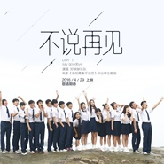

不说再见
============================

|  |  |
| :--: | :-- |
| [ 不说再见](https://emumo.xiami.com/album/2100253004) | **艺人**: [好妹妹](../index.md) **语种**: 国语 **唱片公司**: 春生工作室 **发行时间**: 2015年12月31日 **专辑类别**: EP, 单曲 **专辑风格**: 国语流行 Mandarin Pop **播放数**: 21414062 **收藏数**: 2501 **评论数**: 114  |

## 简介

根据刘同同名作品创作，姚婷婷执导的电影《谁的青春不迷茫》发布由好妹妹乐队秦昊，张小厚演唱、青茫班拍摄的毕业季主题曲《不说再见》。青涩的面孔，熟悉的画面，毕业不再伤感，告别还能再见。全新的毕业歌，送给2016年毕业的你们，以及现在还能重聚的我们。

## 曲目

## 评论

|  |  |  |
| :-- | :-- | :-- |
|  [虾米用户](https://emumo.xiami.com/u/319810159)  2020-04-27 02:57 赞(0) 踩(0) | 
那一年，我正好毕业～
 |
|  [虾米用户](https://emumo.xiami.com/u/370018279)  2019-12-31 17:36 赞(0) 踩(0) | 
2019不说再见，出去拍个月亮溜个弯再说
 |
|  [虾米用户](https://emumo.xiami.com/u/427050320)  2019-07-08 18:33 赞(0) 踩(0) | 
很好听
 |
|  [虾米用户](https://emumo.xiami.com/u/355446991)  2019-06-24 15:07 赞(0) 踩(0) | 
毕业时班主任放的歌，那是我们青春美好的时光
 |
|  [虾米用户](https://emumo.xiami.com/u/426372453) 喜欢所有的东西 2019-06-22 19:13 赞(1) 踩(0) | 
我们都要在一起   
 |
|  [虾米用户](https://emumo.xiami.com/u/406595579)  2019-03-30 13:13 赞(0) 踩(0) | 
再见了作业
 |
|  [虾米用户](https://emumo.xiami.com/u/410099648)  2018-12-07 22:23 赞(0) 踩(0) | 
爱上你，不用写诗。假如给我三天光明，我依然中意你，没有非常，只有不非常，他俩磋商了一切，最后我丢了所有，他说你不会哭，我哭了。
 |
|  [虾米用户](https://emumo.xiami.com/u/324652843)  2017-09-12 13:21 赞(1) 踩(0) | 
不说人一生都有ey
 |
|  [虾米用户](https://emumo.xiami.com/u/279393967) 过去让他过去新的这样的新... 2017-07-05 08:03 赞(2) 踩(0) | 
好听，我们小学毕业了，我还是忘记老同学
 |
|  [虾米用户](https://emumo.xiami.com/u/289736063)  2017-06-18 23:01 赞(0) 踩(0) | 
额再见了母校
 |
|  [虾米用户](https://emumo.xiami.com/u/187759103) 兄弟难当 2017-06-11 06:38 赞(1) 踩(0) | 
真好听   
 |
|  [虾米用户](https://emumo.xiami.com/u/211957672) 唱歌是唯一让我开心的事 2017-05-31 07:38 赞(1) 踩(0) | 
我很喜欢 
 |
|  [虾米用户](https://emumo.xiami.com/u/287405486)  2017-05-13 16:13 赞(1) 踩(0) | 
好听
 |
|  [虾米用户](https://emumo.xiami.com/u/16982028)  2017-05-04 17:53 赞(1) 踩(0) | 
想回到高三 
 |
|  [虾米用户](https://emumo.xiami.com/u/290541817)  2017-04-22 12:15 赞(1) 踩(0) | 
太喜欢了
 |
|  [虾米用户](https://emumo.xiami.com/u/278188474)  2017-04-04 00:23 赞(1) 踩(0) | 
每次听都能勾起心里最深处的感情，一发不可收拾，有时候刻意回避听这首歌
 |
|  [虾米用户](https://emumo.xiami.com/u/30947586) 我还没想好要写什么... 2017-03-16 20:06 赞(1) 踩(0) | 
怀念
 |
|  [虾米用户](https://emumo.xiami.com/u/276384827) 鹿晗你是我唯一，也是我的... 2017-02-26 20:58 赞(1) 踩(0) | 
我想你了
 |
|  [虾米用户](https://emumo.xiami.com/u/276384827) 鹿晗你是我唯一，也是我的... 2017-02-26 20:57 赞(1) 踩(0) | 
哭了半天
 |
|  [虾米用户](https://emumo.xiami.com/u/266280796) 曾經的一切，也只是曾經。 2017-02-13 20:40 赞(4) 踩(0) | 
好久不见，你还好吧，在见了yxq，再过几个月我就毕业了，而你也才高一，我真的爱你，不过社会不允许。。 cc永远爱着你，加油！祝福你！
 |
|  [虾米用户](https://emumo.xiami.com/u/257929804)  2017-01-06 15:33 赞(1) 踩(0) | 
真的戳中泪点
 |
|  [虾米用户](https://emumo.xiami.com/u/257922615) 一个人 2017-01-02 11:57 赞(1) 踩(0) | 

 |
|  [虾米用户](https://emumo.xiami.com/u/47442778)  2016-12-02 15:45 赞(2) 踩(0) | 
青春
 |
|  [虾米用户](https://emumo.xiami.com/u/243298587)  2016-11-05 22:41 赞(1) 踩(0) | 
挺好的
 |
|  [虾米用户](https://emumo.xiami.com/u/102229984)  2016-10-06 19:05 赞(1) 踩(0) | 
莫名戳泪点
 |
|  [虾米用户](https://emumo.xiami.com/u/226864152)  2016-09-18 19:43 赞(1) 踩(0) | 
六一我唱过 
 |
|  [虾米用户](https://emumo.xiami.com/u/49770791) 当把音乐成为氧气，就发现... 2016-07-11 01:33 赞(2) 踩(0) | 
青春不复返啊
 |
|  [虾米用户](https://emumo.xiami.com/u/170022148) 十年之约，不离不弃。初心... 2016-07-09 12:17 赞(2) 踩(0) | 
再见了，56天再见的“监狱” 
 |
|  [虾米用户](https://emumo.xiami.com/u/195300401)  2016-06-29 11:24 赞(1) 踩(0) | 
加油哦，我挺你们哦！
 |
|  [虾米用户](https://emumo.xiami.com/u/48232287)  2016-06-25 13:56 赞(1) 踩(0) | 
许飞唱的，歌词当时都没听清楚  
 |
|  [虾米用户](https://emumo.xiami.com/u/48232287)  2016-06-25 13:55 赞(1) 踩(0) | 
我喜欢这一版的
 |
|  [虾米用户](https://emumo.xiami.com/u/137606890)  2016-06-20 11:22 赞(1) 踩(0) | 
友情
 |
|  [虾米用户](https://emumo.xiami.com/u/11262067) 温柔的坚持 2016-06-19 11:46 赞(1) 踩(0) | 
再见了，小狐仙气的老同学。
 |
|  [虾米用户](https://emumo.xiami.com/u/183500548)  2016-05-30 21:20 赞(2) 踩(0) | 
爱爱
 |
|  [虾米用户](https://emumo.xiami.com/u/1023065)  2016-05-30 07:43 赞(1) 踩(0) | 
好妹妹
 |
|  [虾米用户](https://emumo.xiami.com/u/181475002)  2016-05-28 15:18 赞(2) 踩(0) | 
真不错
 |
|  [虾米用户](https://emumo.xiami.com/u/3857073)  2016-05-28 13:05 赞(3) 踩(0) | 
繼你曾是少年之後 好妹妹推出不說再見 再次和s.h.e撞歌名 兩大女子天團的對決round 2!
 |
|  [虾米用户](https://emumo.xiami.com/u/40778142) 虽千万人吾往矣 2016-05-19 13:59 赞(3) 踩(0) | 
想起一哥在好妹妹来的那一期 说的赚钱养梦 是啊 不赚钱怎么能继续下去呢
 |
|  [虾米用户](https://emumo.xiami.com/u/164682194) 本人行星饭 2016-05-13 18:32 赞(4) 踩(0) | 
六年级了，毕业了我们不说再见
 |
|  [虾米用户](https://emumo.xiami.com/u/100185180)  2016-04-08 23:35 赞(1) 踩(0) | 
许飞也唱这到底谁的歌
 |
|  [虾米用户](https://emumo.xiami.com/u/113477700) 可我已失去为你泪流满面的... 2016-04-08 03:45 赞(4) 踩(0) | 
再见了来不及说的谢谢
 |
|  [虾米用户](https://emumo.xiami.com/u/2279444) 爱在左，同情在右。 2016-04-07 08:38 赞(3) 踩(0) | 
好妹妹给我的感觉就是，趁大众审美和粉丝还在懵懂中，现在能骗到钱抓紧挖钱，到时候赚钱就不容易了
 |
|  [虾米用户](https://emumo.xiami.com/u/10379233)  2016-03-24 17:45 赞(3) 踩(0) | 
不说再见，是努力活着的不愿舍弃，终说再见，更是到了不能活下去的无奈…。
 |
|  [虾米用户](https://emumo.xiami.com/u/69272968) （aaui te ame... 2016-03-13 15:46 赞(1) 踩(0) | 

 |
|  [虾米用户](https://emumo.xiami.com/u/91818620)  2016-03-06 14:05 赞(1) 踩(0) | 
在上，班了吧
 |
|  [虾米用户](https://emumo.xiami.com/u/4769419) 我没有被你改写一生怎配有... 2016-02-21 20:07 赞(10) 踩(0) | 
虽然很多人都觉得很水，但是或许青春没有那么矫情，真的是很流水线。 当他们唱起，再见了相互嫌弃的老同学。这个歌曲是给青春的纪念。
 |
|  [虾米用户](https://emumo.xiami.com/u/112107772)  2016-02-21 18:46 赞(2) 踩(0) | 
送给我的老同学
 |
|  [虾米用户](https://emumo.xiami.com/u/113468956) 把你傲娇收回去 我比你傲... 2016-02-20 16:05 赞(2) 踩(0) | 
超好听 支持 
 |
|  [虾米用户](https://emumo.xiami.com/u/52552189) 路遥马亡 2016-02-18 13:15 赞(2) 踩(0) | 
干爹干妈的诺言
 |
|  [虾米用户](https://emumo.xiami.com/u/2334344)  2016-02-12 15:03 赞(2) 踩(0) | 
再见了相互嫌弃的老同学～
 |
|  [虾米用户](https://emumo.xiami.com/u/6403483)  2016-02-02 05:02 赞(7) 踩(0) | 
對啊 我妹妹就是獨立音樂裡的鳳凰傳奇:)
 |
|  [虾米用户](https://emumo.xiami.com/u/48168563)  2016-01-21 21:24 赞(13) 踩(0) | 
还行，不知道有什么好黑的。在我眼中好妹妹一直就是这样还能一听的流行乐队，也说不上做出过多么逆天的作品，总之偶尔听听也不错。所以这首歌的质量完全在我预期范围之内。觉得好妹妹不如以前，顶多是因为他们出名了，觉得自己的小众逼格帽子挂不住吧。
 |
|  [虾米用户](https://emumo.xiami.com/u/1524227) x 2016-01-20 22:27 赞(1) 踩(0) | 
呵呵呵呵呵
 |
|  [虾米用户](https://emumo.xiami.com/u/3111382)  2016-01-18 17:04 赞(5) 踩(0) | 
其实非常矛盾 他们不红的时候写歌比较用心 独有“好妹妹式”的味道 但是赚钱少  红了当然要唱商业歌了 不然你养活他们呀 换你也会选择赚钱先吧 你以为人人都是王菲呢
 |
|  [虾米用户](https://emumo.xiami.com/u/43600131) 如果没有音乐治疗，我可能... 2016-01-14 13:58 赞(1) 踩(0) | 
毕业对于每个人都会有不同的意义，从青涩到未来的未知惶恐与不安，更是对一起经历过的青春的不舍与希望！
 |
|  [虾米用户](https://emumo.xiami.com/u/51803534)  2016-01-13 13:53 赞(2) 踩(0) | 
嗯，看了mv感人
 |
|  [虾米用户](https://emumo.xiami.com/u/47398421)  2016-01-13 00:24 赞(1) 踩(0) | 
还 可以
 |
|  [虾米用户](https://emumo.xiami.com/u/11301900) 我知道你将一直陪伴，就像... 2016-01-09 00:59 赞(12) 踩(0) | 
没错我就知道有人会说这首歌商业流水线迎合大众，但我他妈为这首歌哭了。去他的商业味迎合市场吧，只要它能直击心底就够了。
 |
|  [虾米用户](https://emumo.xiami.com/u/19416831)  2016-01-07 18:49 赞(1) 踩(0) | 
好听
 |
|  [虾米用户](https://emumo.xiami.com/u/93849618)  2016-01-07 14:52 赞(7) 踩(0) | 
好妹妹说过，他们如果没有变化，就说明他们是为了刻意迎合大众而撒谎，他们只是做了自己想做的。不愿意听的可以走的远远的，没必要来说一句你们变了什么的。
 |
|  [虾米用户](https://emumo.xiami.com/u/16727610) 死于自杀 2016-01-07 12:33 赞(1) 踩(0) | 
再见吧好妹妹
 |
|  [虾米用户](https://emumo.xiami.com/u/1844) 农夫 山泉 有点田 2016-01-06 21:32 赞(1) 踩(0) | 
新·电影主题曲专业户
 |
|  [虾米用户](https://emumo.xiami.com/u/2313124)   2016-01-06 15:23 赞(1) 踩(0) | 
很喜欢
 |
|  [虾米用户](https://emumo.xiami.com/u/851637)  2016-01-06 07:22 赞(2) 踩(0) | 
这首歌如果再晚半年出，会更火吧
 |
|  [虾米用户](https://emumo.xiami.com/u/39302860)   2016-01-05 20:58 赞(1) 踩(0) | 

 |
|  [虾米用户](https://emumo.xiami.com/u/7757466) 只想好好当个垃圾✓ 2016-01-04 21:57 赞(1) 踩(0) | 
➫
 |
|  [虾米用户](https://emumo.xiami.com/u/16876911)  2016-01-04 13:31 赞(1) 踩(0) | 
怎么这次没人说是好妹妹模仿she了？
 |
|  [虾米用户](https://emumo.xiami.com/u/51920953)  2016-01-03 20:18 赞(5) 踩(0) | 
记得大学毕业收拾好行李离开学校的那个晚上，自己在回家的大巴上哭的很伤心。其实当时我真的不想哭，因为害怕旁边的乘客会误以为我失恋了。可是眼泪就是忍不住，一直往下流，于是只有不停地擦。相信这首歌能安慰很多毕业生
 |
|  [虾米用户](https://emumo.xiami.com/u/37918049) 没有人知道的疯子。 2016-01-03 17:50 赞(6) 踩(0) | 
什么民谣流行只要好听听了心里有感觉就可以了音乐不就是这样么
 |
|  [虾米用户](https://emumo.xiami.com/u/37918049) 没有人知道的疯子。 2016-01-03 17:49 赞(4) 踩(0) | 
看了三遍mv一遍比一遍哭得厉害 
 |
|  [虾米用户](https://emumo.xiami.com/u/7918552)   2016-01-03 14:59 赞(3) 踩(0) | 
好妹妹从小众到现在 肯定会跟以前有所不同。但是音乐是不会变的。
 |
|  [虾米用户](https://emumo.xiami.com/u/7918552)   2016-01-03 14:58 赞(1) 踩(0) | 
挺好听的！
 |
|  [虾米用户](https://emumo.xiami.com/u/93471130)  2016-01-03 11:54 赞(1) 踩(0) | 
好听！
 |
|  [虾米用户](https://emumo.xiami.com/u/33893044)  2016-01-03 00:16 赞(33) 踩(0) | 
最近好妹妹真的高产似母猪，可是质量却越来越流水线
 |
| ⇒ |  [虾米用户](https://emumo.xiami.com/u/162930562)  2016-05-20 17:51 赞(0) 踩(0) | 
  
 |
| ⇒ |  [虾米用户](https://emumo.xiami.com/u/327990758)  2018-05-27 10:02 赞(0) 踩(0) | 
呵呵呵呵呵呵&amp;hellip;&amp;hellip;
 |
|  [虾米用户](https://emumo.xiami.com/u/38850636) 我们仍未知道那天所看见的... 2016-01-01 23:28 赞(1) 踩(0) | 
看到他们又出推广曲我只能默默攒钱买电影票:(
 |
|  [虾米用户](https://emumo.xiami.com/u/78149544) 命格无双。 2016-01-01 20:13 赞(1) 踩(0) | 
加油~
 |
|  [虾米用户](https://emumo.xiami.com/u/86715922) 也无风雨也无晴 2016-01-01 19:36 赞(48) 踩(0) | 
为了拥抱那一个人笑着哭着拥抱了整个班
 |
| ⇒ |  [虾米用户](https://emumo.xiami.com/u/162930562)  2016-05-20 17:51 赞(0) 踩(0) | 
  
 |
| ⇒ |  [虾米用户](https://emumo.xiami.com/u/317015778)  2017-08-03 17:04 赞(0) 踩(0) | 
曾经的陪我闹，陪我奋斗的同桌，同学，，   你们在哪， 真的好怀念你们。。  
 |
|  [虾米用户](https://emumo.xiami.com/u/93260138)  2016-01-01 18:49 赞(2) 踩(0) | 
不管怎样都爱他们，毕竟他们是好妹妹
 |
|  [虾米用户](https://emumo.xiami.com/u/13745836) == 2016-01-01 16:32 赞(1) 踩(0) | 

 |
|  [虾米用户](https://emumo.xiami.com/u/34561844) 暂无签名~ 2016-01-01 16:05 赞(1) 踩(0) | 
每没以前有感觉
 |
|  [虾米用户](https://emumo.xiami.com/u/17859584) 撒欢 贫瘠 2016-01-01 14:21 赞(1) 踩(0) | 
 
 |
|  [虾米用户](https://emumo.xiami.com/u/38272151)   2016-01-01 10:56 赞(1) 踩(0) | 
噢耶
 |
|  [虾米用户](https://emumo.xiami.com/u/88538350)  2016-01-01 03:41 赞(2) 踩(0) | 
好妹妹最棒～
 |
|  [虾米用户](https://emumo.xiami.com/u/35311963) 恩？ 2016-01-01 03:17 赞(2) 踩(0) | 
回不去的学生时代！
 |
|  [虾米用户](https://emumo.xiami.com/u/81559528) 我还没想好要写什么... 2016-01-01 01:30 赞(1) 踩(0) | 
听一天了
 |
|  [虾米用户](https://emumo.xiami.com/u/24603467) 这家伙很傻逼什么也没留下... 2015-12-31 22:45 赞(1) 踩(0) | 

 |
|  [虾米用户](https://emumo.xiami.com/u/95821980)  2015-12-31 22:07 赞(1) 踩(0) | 
好好听， 
 |
|  [虾米用户](https://emumo.xiami.com/u/11421497) dont act lik... 2015-12-31 19:46 赞(1) 踩(0) | 
马
 |
|  [虾米用户](https://emumo.xiami.com/u/87589628)   2015-12-31 18:51 赞(1) 踩(0) | 
 看着越来越多的人喜欢、真的好开心  
 |
|  [虾米用户](https://emumo.xiami.com/u/3800222) 不愛永恆 但求現在 真實... 2015-12-31 18:24 赞(1) 踩(0) | 
不如专辑里的好听……
 |
|  [虾米用户](https://emumo.xiami.com/u/55469507) 就让无常如常 2015-12-31 18:08 赞(3) 踩(0) | 
又跟S.H.E撞歌名了 
 |
|  [虾米用户](https://emumo.xiami.com/u/4400366) 再也不见 2015-12-31 17:41 赞(1) 踩(0) | 
囍
 |
|  [虾米用户](https://emumo.xiami.com/u/4911883) 如果你也爱Eason 2015-12-31 16:19 赞(1) 踩(0) | 
最近怎么多歌 
 |
|  [虾米用户](https://emumo.xiami.com/u/2433617)  2015-12-31 16:18 赞(1) 踩(0) | 
评论这么少！
 |
|  [虾米用户](https://emumo.xiami.com/u/8114990) 哪里有彩虹告诉我 2015-12-31 16:12 赞(20) 踩(0) | 
曾经的那个好妹妹在哪…
 |
|  [虾米用户](https://emumo.xiami.com/u/286201)  2015-12-31 15:58 赞(1) 踩(0) | 
还是帮电影写写主题曲 即赚钱又好听。。。。。
 |
|  [虾米用户](https://emumo.xiami.com/u/47130370) 等着离职。 2015-12-31 15:38 赞(1) 踩(0) | 
听听歌，怀念下青春
 |
|  [虾米用户](https://emumo.xiami.com/u/96145400) 你好 2015-12-31 15:15 赞(1) 踩(0) | 
谁的青春不迷茫
 |
|  [虾米用户](https://emumo.xiami.com/u/819805) 我们点起火把，烧死爱情。 2015-12-31 15:10 赞(1) 踩(0) | 
在流行的路上越走越远
 |
| ⇒ |  [虾米用户](https://emumo.xiami.com/u/33078523) 我还没想好要写什么... 2015-12-31 16:09 赞(0) 踩(0) | 
同意 以后应该不会和民谣二字有什么关联了
 |
| ⇒ |  [虾米用户](https://emumo.xiami.com/u/1366353)  2015-12-31 16:18 赞(0) 踩(0) | 
好久不见
 |
| ⇒ |  [虾米用户](https://emumo.xiami.com/u/819805) 我们点起火把，烧死爱情。 2015-12-31 18:34 赞(0) 踩(0) | 
<q><b>YoneyisOnFire说：</b></q>
 |
| ⇒ |  [虾米用户](https://emumo.xiami.com/u/819805) 我们点起火把，烧死爱情。 2015-12-31 18:35 赞(0) 踩(0) | 
<q><b>哆啦萌梦说：</b></q>
 |
| ⇒ |  [虾米用户](https://emumo.xiami.com/u/33078523) 我还没想好要写什么... 2016-01-01 01:52 赞(0) 踩(0) | 
<q><b>douglas™说：</b></q>
 |
|  [虾米用户](https://emumo.xiami.com/u/89132260) 失眠，嗜睡，选择困难，外... 2015-12-31 14:47 赞(1) 踩(0) | 
为了拥抱那一个人，笑着哭着拥抱了整个班～2015最后一个礼物，很喜欢～ 2016我们会更好
 |
|  [虾米用户](https://emumo.xiami.com/u/47315833) 우리 사링하지 말아요 2015-12-31 14:46 赞(1) 踩(0) | 
嘿嘿
 |
|  [虾米用户](https://emumo.xiami.com/u/87438364)  2015-12-31 14:27 赞(1) 踩(0) | 
不错
 |
|  [虾米用户](https://emumo.xiami.com/u/17626459)  2015-12-31 14:15 赞(1) 踩(0) | 
啦啦啦啊啦啦啦啦
 |
|  [虾米用户](https://emumo.xiami.com/u/12310373)  2015-12-31 14:02 赞(3) 踩(0) | 
2015年，好妹妹终于走向了大众的视野~由衷的高兴！好妹妹的歌里，总能听出最贴心的温暖~
 |
|  [虾米用户](https://emumo.xiami.com/u/1032029) 我还没想好要写什么... 2015-12-31 14:01 赞(1) 踩(0) | 
好快啊，刚刚还没有这个专辑，页面一刷就有了……
 |
