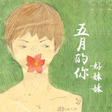

五月的你Meet in May
============================

|  |  |
| :--: | :-- |
| [ 五月的你Meet in May](https://emumo.xiami.com/album/2100345050) | **艺人**: [好妹妹](../index.md) **语种**: 国语 **唱片公司**: 发现音乐, 好靓文化 **发行时间**: 2016年05月27日 **专辑类别**: EP, 单曲 **专辑风格**: 城市民谣 Urban Folk **播放数**: 1835989 **收藏数**: 806 **评论数**: 60  |

## 简介

欧莱雅“真情互动”校园义卖助学项目主题曲《五月的你》，由好妹妹乐队全新创作，温暖发声，歌曲将欧莱雅校园公益活动比作一位年轻的女孩儿，描写她在校园公益义卖中青春自信的形象。同时，她的心愿是将更多的快乐分享给校园里的大学生朋友，分担彼此的忧愁，以源自心底的爱感染身边更多的人。  
你年轻的样子，像五月的颜色，连彩虹都羞愧地闪躲  
你满怀的快乐，像五月的种子，收藏青春的钥匙，这是一个美好的开始  
好妹妹乐队通过拟人手法，轻快悠扬的编曲设计，张小厚和秦昊暖心的声线，真挚细腻的描写出欧莱雅“真情互动”校园义卖助学项目的校园情怀，希望给大学生带来更多朋友式的鼓励支持，在温柔的五月里，让每一个普通的生命不再平凡。

## 曲目

## 评论

|  |  |  |
| :-- | :-- | :-- |
|  [虾米用户](https://emumo.xiami.com/u/102995226)  2016-08-02 15:23 赞(1) 踩(0) | 
民谣界的凤凰传奇
 |
| ⇒ |  [虾米用户](https://emumo.xiami.com/u/283817904)  2017-07-03 23:31 赞(0) 踩(0) | 
ill怕胡  1比72  w
 |
|  [虾米用户](https://emumo.xiami.com/u/27738291)  2016-07-31 08:52 赞(0) 踩(0) | 
很喜欢主唱的声音
 |
|  [虾米用户](https://emumo.xiami.com/u/32948820)  2016-07-23 12:02 赞(0) 踩(0) | 
好听
 |
|  [虾米用户](https://emumo.xiami.com/u/14462809)  2016-06-26 22:47 赞(0) 踩(0) | 
民谣界的凤凰传奇笑死
 |
|  [虾米用户](https://emumo.xiami.com/u/31737208) 我想和你虚度世界。 2016-06-14 23:34 赞(1) 踩(0) | 
好妹妹出歌频率高的出奇
 |
|  [虾米用户](https://emumo.xiami.com/u/75796204)  2016-06-14 16:36 赞(0) 踩(0) | 
just for fun
 |
|  [虾米用户](https://emumo.xiami.com/u/75796204)  2016-06-14 16:36 赞(1) 踩(0) | 
just for fun
 |
|  [虾米用户](https://emumo.xiami.com/u/183920040)  2016-06-10 23:26 赞(0) 踩(0) | 
歌曲封面又是秦昊画的吧 
 |
|  [虾米用户](https://emumo.xiami.com/u/12742923) JMY要搭上一架会爆炸的... 2016-06-05 01:48 赞(1) 踩(0) | 
宇宙最直男乐队又发单曲了惹
 |
|  [虾米用户](https://emumo.xiami.com/u/2236510)   2016-06-03 08:15 赞(0) 踩(0) | 
被现在的版权机制搞晕了
 |
|  [虾米用户](https://emumo.xiami.com/u/17283226)  2016-06-01 11:52 赞(0) 踩(0) | 
呵呵
 |
|  [虾米用户](https://emumo.xiami.com/u/6580795) 接受一切然后热爱一切 2016-06-01 03:36 赞(0) 踩(0) | 
我要张小厚对着我唱这首歌   
 |
|  [虾米用户](https://emumo.xiami.com/u/32192072) 未来的选择 2016-05-31 08:37 赞(0) 踩(0) | 

 |
|  [虾米用户](https://emumo.xiami.com/u/115491378) 我是我，是不一样的水果 2016-05-30 17:13 赞(0) 踩(0) | 
开始发现内心真正的欢喜，开始享受独处，也不怕孤独一人 ，多喝慢严舒柠
 |
|  [虾米用户](https://emumo.xiami.com/u/6412555)   2016-05-30 16:45 赞(6) 踩(0) | 
真是越来越坐实“民谣界的凤凰传奇”了
 |
| ⇒ |  [虾米用户](https://emumo.xiami.com/u/42745263)   2016-06-04 21:14 赞(0) 踩(0) | 

 |
|  [虾米用户](https://emumo.xiami.com/u/72666568)  2016-05-30 13:44 赞(0) 踩(0) | 
叮～
 |
|  [虾米用户](https://emumo.xiami.com/u/183150160) 我还没想好要写什么... 2016-05-30 12:24 赞(0) 踩(0) | 
不得不说虾米音质确实不错
 |
|  [虾米用户](https://emumo.xiami.com/u/9442458) 相濡以沫，不如相忘于江湖 2016-05-30 10:54 赞(0) 踩(0) | 
封面好迷人，小眼神·
 |
|  [虾米用户](https://emumo.xiami.com/u/25772197) 我追你变老时光流逝不停歇 2016-05-30 10:23 赞(0) 踩(0) | 
你妹！
 |
|  [虾米用户](https://emumo.xiami.com/u/49068787) 你问我全世界哪里最美 我... 2016-05-30 00:03 赞(4) 踩(0) | 
五月的你，六月的雨
 |
|  [虾米用户](https://emumo.xiami.com/u/55312830) Gonna to be 2016-05-29 21:38 赞(1) 踩(0) | 
我妹 遇见你们才是美好的开始 开始发现内心真正的欢喜，开始享受独处，也不怕孤独一人
 |
|  [虾米用户](https://emumo.xiami.com/u/41056991)  2016-05-29 18:57 赞(0) 踩(0) | 
死鬼 现在才发
 |
|  [虾米用户](https://emumo.xiami.com/u/38441508)  2016-05-29 15:20 赞(0) 踩(0) | 
五月快过去了
 |
|  [虾米用户](https://emumo.xiami.com/u/59521306)  2016-05-29 11:06 赞(0) 踩(0) | 
a xihaun
 |
|  [虾米用户](https://emumo.xiami.com/u/1363334) 若風吹來 夜涼如水 2016-05-29 08:25 赞(1) 踩(0) | 
六月都要到了我才开始听这首歌，端午节友女要飞去成都看你们演唱会了啊啊啊啊我也好想去啊，我是说去成都玩…
 |
|  [虾米用户](https://emumo.xiami.com/u/181507802) 与这个世界交手多年 你是... 2016-05-28 15:59 赞(0) 踩(0) | 
最喜欢好妹妹的伴奏
 |
|  [虾米用户](https://emumo.xiami.com/u/1467803) 置身于炎夏的乐园 2016-05-28 13:42 赞(0) 踩(0) | 
封面好撩 我喜欢~
 |
|  [虾米用户](https://emumo.xiami.com/u/24738850)  2016-05-28 13:40 赞(0) 踩(0) | 
五月末的晌午，把崽崽哄睡后，忽然感到无比轻松，就像躺在一团云朵里，一切都开朗了。
 |
|  [虾米用户](https://emumo.xiami.com/u/167333938)  2016-05-28 10:02 赞(0) 踩(0) | 
好听 
 |
|  [虾米用户](https://emumo.xiami.com/u/58501404) 我睡的很晚 2016-05-28 00:13 赞(0) 踩(0) | 
还不错
 |
|  [虾米用户](https://emumo.xiami.com/u/42796114) 我去过的每一个地方，走的... 2016-05-27 23:26 赞(0) 踩(0) | 
很温暖啊
 |
|  [虾米用户](https://emumo.xiami.com/u/42796114) 我去过的每一个地方，走的... 2016-05-27 23:25 赞(0) 踩(0) | 
一登网页版就是惊喜(*^__^*) 嘻嘻……
 |
|  [虾米用户](https://emumo.xiami.com/u/119677264) 众神创造物中只有我最易朽... 2016-05-27 23:19 赞(0) 踩(0) | 
这歌又撩的人骚动起来了。
 |
|  [虾米用户](https://emumo.xiami.com/u/13137804) 骨灰級影迷、獨立音樂聽衆... 2016-05-27 22:42 赞(15) 踩(0) | 
内容已删除
 |
| ⇒ |  [虾米用户](https://emumo.xiami.com/u/190399049)  2016-06-15 22:36 赞(0) 踩(0) | 
U ti
 |
|  [虾米用户](https://emumo.xiami.com/u/181037122)  2016-05-27 22:09 赞(1) 踩(0) | 
助家生活2.0即将发布！关注“助家生活”weixin-公-众-平-台，回复“虾米”，赢虾米年费会员！
 |
|  [虾米用户](https://emumo.xiami.com/u/1836305)   2016-05-27 21:47 赞(0) 踩(0) | 
五月好想睡觉
 |
|  [虾米用户](https://emumo.xiami.com/u/26070224) 你不要吃我，我唱好听的歌... 2016-05-27 16:29 赞(0) 踩(0) | 
五月的你 就要走了
 |
|  [虾米用户](https://emumo.xiami.com/u/43026061) 暂无签名~ 2016-05-27 15:38 赞(1) 踩(0) | 
听见手风琴的声音我就想哭。高中那会儿就是学的手风琴，到现在已经6年多没有摸过手风琴了 
 |
| ⇒ |  [虾米用户](https://emumo.xiami.com/u/2966717) shinhwa怎能不珍惜 2016-05-30 16:42 赞(0) 踩(0) | 
我也是啊，都有十年没碰过了
 |
|  [虾米用户](https://emumo.xiami.com/u/45158711) 睡不着… 2016-05-27 15:24 赞(0) 踩(0) | 
声音出来就太有画面感了！
 |
|  [虾米用户](https://emumo.xiami.com/u/6689208) 那一臉憤慨風化失去。 2016-05-27 14:05 赞(4) 踩(0) | 
天啊!不是网易云独家首发吗?
 |
| ⇒ |  [虾米用户](https://emumo.xiami.com/u/7797443) / / 2016-05-27 21:48 赞(0) 踩(0) | 
独家首发和独家是两个意思。。。
 |
| ⇒ |  [虾米用户](https://emumo.xiami.com/u/33385349) 臭板儿是个傻逼。 2016-05-30 20:11 赞(0) 踩(0) | 
<q><b>文藝復興之光说：</b></q>
 |
|  [虾米用户](https://emumo.xiami.com/u/8468754) @ddazedconfu... 2016-05-27 13:17 赞(0) 踩(0) | 
。。。
 |
|  [虾米用户](https://emumo.xiami.com/u/141022032)  2016-05-27 12:49 赞(0) 踩(0) | 
不错！171592541爱民谣
 |
|  [虾米用户](https://emumo.xiami.com/u/27537760)  2016-05-27 12:24 赞(0) 踩(0) | 
再不下又没了
 |
|  [虾米用户](https://emumo.xiami.com/u/48474411) 我还没想好要写什么... 2016-05-27 11:54 赞(0) 踩(0) | 
人家说的是农历五月
 |
|  [虾米用户](https://emumo.xiami.com/u/782757) LESS IS MORE 2016-05-27 11:06 赞(0) 踩(0) | 
来的晚一些，5月马上就过去了，但是晚来总比不来好~
 |
|  [虾米用户](https://emumo.xiami.com/u/8244559)  2016-05-27 10:35 赞(0) 踩(0) | 
******
 |
|  [虾米用户](https://emumo.xiami.com/u/45621221) 卸载状态。 2016-05-27 10:28 赞(0) 踩(0) | 
=
 |
|  [虾米用户](https://emumo.xiami.com/u/11770469)  2016-05-27 10:26 赞(0) 踩(0) | 
听什么歌啊，我只想看好妹妹和坏姐姐两个妖孽组合一起撕逼一起Orgy一起群P，那画面想想都美的不要不要的。
 |
|  [虾米用户](https://emumo.xiami.com/u/6333765) 听众家所长 2016-05-27 10:20 赞(1) 踩(0) | 
五月都要结束了，六月还会远吗
 |
|  [虾米用户](https://emumo.xiami.com/u/47577064) 杂食耳 2016-05-27 09:55 赞(0) 踩(0) | 
商业兼公益，除了1分38秒到2分10秒间奏里的口琴，全首歌没有记忆点。然，作为对金牛座的献礼给我生日的歌，我收藏一下吧：）
 |
|  [虾米用户](https://emumo.xiami.com/u/2371174)   2016-05-27 09:45 赞(0) 踩(0) | 
吓得我赶紧下载了，真怕虾米会下架
 |
|  [虾米用户](https://emumo.xiami.com/u/3851702) 爱我就给我看你的播放列表 2016-05-27 09:11 赞(1) 踩(0) | 
哈哈，赶在五月末发行了
 |
|  [虾米用户](https://emumo.xiami.com/u/35167460) La vie elle ... 2016-05-27 08:19 赞(0) 踩(0) | 
要是按季节都来一遍 也很好 
 |
|  [虾米用户](https://emumo.xiami.com/u/99722394)  2016-05-27 08:00 赞(0) 踩(0) | 
啦啦啦啦啦就是喜欢
 |
|  [虾米用户](https://emumo.xiami.com/u/40895457) 一个听着 2016-05-27 00:04 赞(0) 踩(0) | 
暖暖的好妹妹。
 |
