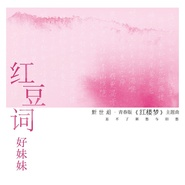

红豆词
============================

|  |  |
| :--: | :-- |
| [ 红豆词](https://emumo.xiami.com/album/2102659562) | **艺人**: [好妹妹](../index.md) **语种**: 国语 **唱片公司**: 发现音乐, 好靓文化 **发行时间**: 2016年12月05日 **专辑类别**: EP, 单曲 **专辑风格**: 民谣流行 Folk Pop **播放数**: 645465 **收藏数**: 442 **评论数**: 19  |

## 简介

好妹妹献唱青春版《红楼梦》主题曲《红豆词》 再续三百年红楼缘分  
  
好妹妹为2016年重新修订版新世相·青春版《红楼梦》演唱的主题曲全网发行上线，与以往人们熟知的电影、电视主题曲不同，这是有史以来好妹妹首次为新书创作并演唱主题曲。  
  
据悉，2016年重新修订版新世相·青春版《红楼梦》由新世相推出，主题曲《红豆词》歌词来自清代作家曹雪芹，在《红楼梦》中借贾宝玉之口诉说愁思的《红豆词》原著。由秦昊谱成新曲，刘胡轶担任制作，再续这三百年后的缘分。清丽的古典吉他和竖琴与好妹妹的独特唱腔相得益彰，新古典中国风娓娓徐来，哀而不伤。再度为书籍演唱主题曲，作为《红楼梦》的粉丝秦昊也是为这次的歌曲创作下足了功夫，把自己读《红楼梦》后的感悟都溶进了这首《红豆词》。  
  
据了解，《红豆词》作为歌曲曾有两个经典版本，1942年，刘雪庵作曲、著名歌手周小燕演唱；1987年，陈力等人为电视剧《红楼梦》演唱。与这两版相比，好妹妹创作的《红豆词》增加了些许现代城市年轻人的情感表述，它不只饱含了古典文化，更交织着现代人的爱恨情仇。  
  
以《红豆曲》为主题曲推出的新世相·青春版《红楼梦》，是《红楼梦》的最新版本，由专业团队历时3年编辑，并在近期由新世相与果麦文化联合推出。最新版本的青春版《红楼梦》中基于原著做出了一次较大的版本改动，整合了关于《红楼梦》的最新研究成果，相较此前的权威版本进行了35处改动。这也是自1970年以来，人民文学出版社出版的《红楼梦》版本后，首次出现的重大改动版本。  
  
同时，除了内容上的改动，新世相·青春版《红楼梦》采用了全新的编辑思路，努力打造一套“适合现代城市年轻人阅读的《红楼梦》”。编者团队希望传达更多新的概念元素，让读者通过全新版本感受到《红楼梦》不再只是一本被束缚在古典文学领域的“经典”著作，也能够融合更现代、更活泼的现代年轻人的生活方式，传达现代人的情绪感怀。  
  
除此之外，新世相·青春版《红楼梦》在开本、装帧、推广方式上采用了更为年轻化的方式，好妹妹创作的《红豆词》作为新世相·青春版《红楼梦》主题歌曲，也是它“青春”特征的重要表现。好妹妹作为深受城市年轻人喜爱的音乐人，他们的创作既有当下年轻人喜爱的音乐元素，又常表现出古典的美好。  
  
据悉，上一次规模化的以《红楼梦》为主题创作并演唱曲目，可以追溯到1987版《红楼梦》电视剧推出之时。当年的经典作品《枉凝眉》、《好了歌》在之后的30年中被广为流传。时至30年后的今日，读者们对于这部经典著作《红楼梦》有了更加全新的青春解读，当然也同样需要更加青春的“红楼曲”作品。

## 曲目

## 评论

|  |  |  |  |
| :-- | :-- | :-- | :-- |
|  [虾米用户](https://emumo.xiami.com/u/347593462)  2020-04-04 22:51 赞(0) 踩(0) | 
悠远恒长
 |
|  [虾米用户](https://emumo.xiami.com/u/11819466) 暂无签名~ 2017-04-16 19:04 赞(4) 踩(0) | 
好妹妹就适合这种矫揉造作的歌 哈哈哈
 |
|  [虾米用户](https://emumo.xiami.com/u/214708483) 徒有虚名 2017-02-14 10:18 赞(0) 踩(0) | 
秦老湿作曲 刘胡轶编曲 必须听啊必须听 
 |
|  [虾米用户](https://emumo.xiami.com/u/37904022) 我还没想好要写什么... 2017-02-12 01:08 赞(1) 踩(0) | 
词好抵白丑
 |
|  [虾米用户](https://emumo.xiami.com/u/15466184) Niceboy 2016-12-13 14:14 赞(2) 踩(0) | 
秦碧池高产如母猪
 |
|  [虾米用户](https://emumo.xiami.com/u/8334506) 我还没想好要写什么... 2016-12-09 19:16 赞(0) 踩(0) | 
能听了啊
 |
|  [虾米用户](https://emumo.xiami.com/u/3566207) 忍不住再走回来 回头一片... 2016-12-06 08:48 赞(0) 踩(0) | 
到底买版权了没？是因为没版权而下架，还是因为没首发权而下架？
 |
|  [虾米用户](https://emumo.xiami.com/u/11156693)  2016-12-06 07:20 赞(0) 踩(0) | 
為什麼不買！
 |
|  [虾米用户](https://emumo.xiami.com/u/246987800)  2016-12-06 01:03 赞(0) 踩(0) | 
要不是送到了会员 不会用这个辣鸡app
 |
|  [虾米用户](https://emumo.xiami.com/u/28878477) 我还没想好要写什么... 2016-12-06 00:11 赞(3) 踩(0) | 
录制的过程中，制作人刘胡轶对我们的要求也是说不要唱得太有情绪起伏 ，尽量做到克制和冷静。“克制冷静”是我们制作这首歌的两个重要关键词，希望能通过这样“无渲染”的演唱方式来传达这样克制冷静的美感。插个题外话，其实大家愿意仔细听的话，我们很多慢歌的处理方式都是各不相同的，比如录制《冬》的时候，感情就十分的投入，脑海中都是漫天大雪的画面，唱的时候浑身起鸡皮疙瘩。而录制《月》的时候，全程面带微笑，使用了比较温暖的腔调。
 |
|  [虾米用户](https://emumo.xiami.com/u/96297258)  2016-12-05 22:52 赞(2) 踩(0) | 
好想听 
 |
|  [虾米用户](https://emumo.xiami.com/u/46124531) 轻拿轻放^ 2016-12-05 19:22 赞(0) 踩(0) | 
开始还能试听，突然就不能试听了:x  还好我有缓存
 |
|  [虾米用户](https://emumo.xiami.com/u/52161539) live in the ... 2016-12-05 17:50 赞(2) 踩(0) | 
就这么穷？
 |
|  [虾米用户](https://emumo.xiami.com/u/154574958)   2016-12-05 16:57 赞(1) 踩(0) | 
关注的人有新歌还不给提醒，难用，
 |
|  [虾米用户](https://emumo.xiami.com/u/154574958)   2016-12-05 16:56 赞(1) 踩(0) | 
妈蛋，虾米版权少也就算了，还处处收钱也算了，但会员有毛用？很多歌曲在网易用会员免费，在虾米就要花钱，
 |
| ⇒ |  [虾米用户](https://emumo.xiami.com/u/38918617) 你相信我，我相信你 2016-12-05 17:35 赞(0) 踩(0) | 
哪里要花钱了 摸摸良心 xy下个无损还要会员吧~~
 |
| ⇒ |  [虾米用户](https://emumo.xiami.com/u/38918617) 你相信我，我相信你 2016-12-06 19:49 赞(0) 踩(0) | 
<q><b>说：</b></q>
 |
|  [虾米用户](https://emumo.xiami.com/u/292156) 如果我听歌可眼红 何以待... 2016-12-05 15:27 赞(6) 踩(0) | 
就不能买好版权？？？
 |
| ⇒ |  [虾米用户](https://emumo.xiami.com/u/38918617) 你相信我，我相信你 2016-12-05 17:35 赞(0) 踩(0) | 
隔壁首发 我们会有版权的~~
 |
