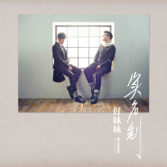

实名制Unveiled
============================

|  |  |
| :--: | :-- |
| [ 实名制Unveiled](https://emumo.xiami.com/album/2102731534) | **艺人**: [好妹妹](../index.md) **语种**: 国语 **唱片公司**: 春生工作室 **发行时间**: 2017年04月07日 **专辑类别**: 录音室专辑 **专辑风格**: 国语流行 Mandarin Pop **播放数**: 1699062 **收藏数**: 2377 **评论数**: 159  |

## 简介

好妹妹第6张创作专辑《实名制》  
专辑未发即先轰动华语音乐圈的企划标杆  
  
人与人交流成本日益廉价的时代，怎样才是本我本心诚恳地交流，《实名制》将会给你一个答案。  
由10封诚恳的信件脱胎的11首歌曲，从阅读的角度和聆听者的角度，《实名制》挖掘似乎被面具遮挡背后的脸。  
策划长达一年，制作周期四个月，以集体封闭创作方式，在八大平台直播制作过程。  
每一步的点滴，都是为了将自己最诚恳的真心交付于你。《实名制》从无到有的过程，犹如是对自己往日青涩的告别，更是对自己未来的期盼张望。  
  
2017年2月，好妹妹用全新的音乐方式和态度进化自己。第六张创作专辑《实名制》首度开启华语音乐专辑创作营直播模式，成为业内讨论的热点。同时，集体创作的形式也打破了当下音乐创作在修改空间与灵感碰撞的缺失，音乐创作营的概念也随之而来。  
  
好妹妹的音乐，常让人感受到笑着唱着，却听着听着就哭了，这种独特的情绪传递方式，也是《实名制》专辑中希望延续和表达的一种音乐惯性。  
人与人的交流需要环境。人们会带着想象去接触一个人，那个自己以为的对方。或许带着面具，或许掺和假象，困扰着你我的交流。好妹妹平时不收礼物，只收信件和大家想传阅的书，于是我们各自家里都保存着许多信。  
在信中读到各种大家想跟我们说的话，有些喃喃自述心事，有些故事曲折，有些只在表达爱慕，有些也在分享生活。看到这些信，我们想象着你是在图书馆或者火车上写的，你可能度过了有点辛苦的一天，你写下这些话的时候，耳机恰好在播我们的歌吧。这次我们决定用信件作为载体，带着真诚的心与你交流，也与自己交流。  
我是张小厚，我是秦昊。《实名制》是这张专辑的名字，期望这种方式你能感同身受。  
  
第6张全新专辑《实名制》用音乐创作营的方式，网罗乐坛顶尖乐手全力加持。两岸三位实力制作人参与共同编曲，刘胡轶、胡洋、甯子达（TW）分别从各自的角度为《实名制》护航，著名音乐家刘晓光，打击乐手祁大为加盟。鬼才词人田辰明为专辑中《无声河流》填词。华语流行音乐教父姚谦先生担当艺术顾问，帮助《实名制》成为更成熟的作品，专辑中《平常邮件》歌词也来自姚谦先生。秦昊和张小厚全心全力参与《实名制》所有制作环节，策划、写歌、编曲、制作、包装，毫不怠慢。从他两不断研究演译方式，到他俩对制作上每一个细节的谨慎，身为专辑制作人之一，秦昊和张小厚这次在专辑的把握上都有精彩表现。  
  
过去的2016年是好妹妹沉淀的一年，缺失的2016年专辑，我们用了成长脚步来弥补。“而立”看起来视乎有些老生常谈的味道。当自己跨过这条界限的时候，真的会有一股神秘力量在背后推着你，去挥手已经逝去的年华。当我站在路的这头回看，从一次次我与这个城市的过往，还有我与时间在黑夜里的并行，还有我对宝贵生命瞬间明白的感知。还有更重要的是我与你不经意的擦肩。  
主打歌《写给自己的信》“希望你的眼睛，还如此清澈见底。那些美好的秘密无言的歌曲，藏在未曾苍老的心。”是对自己的希望，也是对你我的最好祝福。  
  
放弃了长时间相处的录音棚，《实名制》音乐创作营由秦昊和张小厚带队，在幽美宁静的乌镇进行创作。十余天的时间将专辑中作词作曲到编曲部分完成。连续9天的网络直播，将这次音乐制作过程呈现给大家。数百万在线互动观看网友，收获海量好评回馈。将专辑的制作过程直白地展现给大家，也是印证着专辑名字《实名制》的诚恳，也使得《实名制》从一开始就成为华语音乐玩转互联网又一经典案例。  
  
专辑在包装设计上也是下足了功夫，以书信作为立足点，以书信往前看是一路行来的所有，充满温度和情感还有感悟，以书信往后看则是自我对未来的期许和可能还有价值的坚持。摆脱网络速食阅读速度，放慢自己回归真实质朴不遮掩地将内心真我剖白。  
  
2017年好妹妹《自在如风》全国体育场演唱会启动，现已公布4月15日洛阳站和6月10日深圳站，这年好妹妹将带着全新专辑和大家一起在现场唱起你我的《实名制》 

## 曲目

## 评论

|  |  |  |  |
| :-- | :-- | :-- | :-- |
|  [虾米用户](https://emumo.xiami.com/u/258526034) 我只有一句不后悔的成全。 2020-04-20 22:56 赞(0) 踩(0) | 
挺好听的啊，大家都只听民谣？？出了民谣又会有杠精说，好妹妹只会唱民谣吗？
 |
|  [虾米用户](https://emumo.xiami.com/u/3069378) 你从海上来 2019-12-13 19:04 赞(0) 踩(0) | 
好好的民谣不唱，唱情歌了？是商演太忙都没有时间写好歌了么。
 |
|  [虾米用户](https://emumo.xiami.com/u/356798715)  2019-07-22 07:34 赞(0) 踩(0) | 
这张专辑喜欢“欢乐时光”
 |
|  [虾米用户](https://emumo.xiami.com/u/3965501)  2019-06-07 23:28 赞(0) 踩(0) | 
曾经最迷茫的时候听《冬》，六年过去了又产生了新的迷茫，但心境毕竟不同了。所以，好妹妹的音乐再改变切也对我胃口，再怎么黑也黑不走我这样忠实却不疯狂的粉丝，所以说感情还是要细水长流 
 |
|  [虾米用户](https://emumo.xiami.com/u/49822437)  2019-02-17 00:01 赞(0) 踩(0) | 
开始走流行路线了就不会讨喜，大家喜欢的是民谣风的妹妹，还是趁早恢复从前的妹妹吧，不要变成现代版小虎队
 |
|  [虾米用户](https://emumo.xiami.com/u/13988445) 啦啦啦啦啦 2018-08-29 11:28 赞(1) 踩(0) | 
虾米用户何止是挑剔
 |
|  [虾米用户](https://emumo.xiami.com/u/47191452) listening 2018-07-05 20:28 赞(1) 踩(0) | 
好妹妹内，行在路途中的创造会不会比封闭创作更有灵感
 |
|  [虾米用户](https://emumo.xiami.com/u/12379781)  2018-06-28 15:17 赞(0) 踩(0) | 
真让人失望，省钱了，不用买CD了。
 |
|  [虾米用户](https://emumo.xiami.com/u/103162530) 我要的自由更高级 2018-01-27 06:28 赞(2) 踩(0) | 
红了之后真心变了 没有任何共鸣。好妹妹拜拜
 |
| ⇒ |  [虾米用户](https://emumo.xiami.com/u/13988445) 啦啦啦啦啦 2018-08-29 11:27 赞(0) 踩(0) | 
慢走不送
 |
|  [虾米用户](https://emumo.xiami.com/u/341844007)  2018-01-01 16:22 赞(0) 踩(0) | 
非常喜欢 
 |
|  [虾米用户](https://emumo.xiami.com/u/272349978)  2017-12-24 16:42 赞(1) 踩(0) | 
请你慢一些变老好吗，真好听
 |
|  [虾米用户](https://emumo.xiami.com/u/313254681) 你那么好，我得更努力的爱... 2017-12-21 12:30 赞(0) 踩(0) | 
哈哈哈，虾米不要钱，啦啦啦啦
 |
|  [虾米用户](https://emumo.xiami.com/u/329911866) 我还没想好要写什么... 2017-10-14 23:33 赞(2) 踩(0) | 
很棒，加油
 |
|  [虾米用户](https://emumo.xiami.com/u/3608638) 我还没想好要写什么... 2017-09-06 21:24 赞(2) 踩(0) | 
其实还是蛮好听的，只是没有了春生的惊艳
 |
|  [虾米用户](https://emumo.xiami.com/u/125312768)  2017-08-23 21:45 赞(2) 踩(0) | 
虾米用户太挑剔
 |
|  [虾米用户](https://emumo.xiami.com/u/251822751)  2017-08-05 15:50 赞(1) 踩(0) | 
超级好听
 |
|  [虾米用户](https://emumo.xiami.com/u/51852631) 实名制 2017-08-02 13:32 赞(3) 踩(0) | 
好好一张专辑。好好一份情绪。好好一段时光。
 |
|  [虾米用户](https://emumo.xiami.com/u/191907071)   2017-07-27 21:46 赞(4) 踩(0) | 
延续了过往的风格 没有《春生》《南北》那么动人心弦 但这是乐队的一种成长
 |
|  [虾米用户](https://emumo.xiami.com/u/2193835) 马老湿 2017-07-04 10:32 赞(1) 踩(0) | 
大部分作品听了无法记住，勉强及格的水平
 |
|  [虾米用户](https://emumo.xiami.com/u/5013768) 我还没想好要写什么... 2017-07-03 15:12 赞(1) 踩(0) | 
杨 的 编曲 是不是有点ambient的意思 好惊艳啊
 |
|  [虾米用户](https://emumo.xiami.com/u/224320860)  2017-07-01 13:38 赞(2) 踩(0) | 
很有感情呀，为什么那么说他们。你用一句否定来回应他们那么久的努力好嘛！！！！
 |
|  [虾米用户](https://emumo.xiami.com/u/105464) 空有痴心话洪荒 2017-06-27 18:30 赞(3) 踩(0) | 
一整张都难听，是怎么做到的。听听你们以前的歌，想想吧。
 |
| ⇒ |  [虾米用户](https://emumo.xiami.com/u/78368686)  2017-07-02 09:50 赞(0) 踩(0) | 
太片面了
 |
|  [虾米用户](https://emumo.xiami.com/u/15376790)   2017-06-21 00:59 赞(3) 踩(0) | 
妹妹本专尝试更宏大和复杂的编曲，这里面刘胡轶的编曲绝对是最大亮点了，乐曲和他们配合得还算不错。然而依然觉得没亮点的原因一是没有一首的旋律与歌词是很出挑的，都比较平平（比较之下个人很喜欢《长春》）；二是秦昊和小厚的声音，确实更适合民谣编曲以及像《相思赋予谁》这种戏曲风。而这种流行的编曲显示不出他们的独特性。
 |
|  [虾米用户](https://emumo.xiami.com/u/9690768)  2017-06-17 00:36 赞(2) 踩(0) | 
其实这样的风格可惜了秦昊的嗓音特质   秦昊的声音放慢歌抒情歌里迷人的无可救药   每一次听都好像见情人一般   可是现在的风格   秦昊的声音就变芸芸众生中的一个了
 |
|  [虾米用户](https://emumo.xiami.com/u/163096494) 签个屁 2017-06-14 11:25 赞(1) 踩(0) | 
还我钱
 |
|  [虾米用户](https://emumo.xiami.com/u/138931956)   2017-06-14 01:24 赞(2) 踩(0) | 
我怎么觉得都挺好听的
 |
|  [虾米用户](https://emumo.xiami.com/u/204862141) 愿岁月静好，时光微凉。 2017-06-12 00:51 赞(13) 踩(0) | 
总体觉得还不错，虽然没有乍一听就特别惊艳的，但适合阳光明媚的夏日午后，清清淡淡浅浅。
 |
|  [虾米用户](https://emumo.xiami.com/u/231454233)  2017-06-08 10:08 赞(3) 踩(0) | 
喜欢 写给自己的信  一直很喜欢好妹妹~听着就很温暖~不评价好坏~听出了里面的用心~喜欢~好妹妹加油~
 |
|  [虾米用户](https://emumo.xiami.com/u/205202649) 在千山万水人海中相遇 噢... 2017-06-02 19:39 赞(18) 踩(0) | 
其实真的是很用心的一张专辑 越听越有味道越听越有感触的 大爱❤
 |
|  [虾米用户](https://emumo.xiami.com/u/301004852)  2017-06-01 15:04 赞(0) 踩(0) | 
温暖力量
 |
|  [虾米用户](https://emumo.xiami.com/u/160169416) 昨夜有风造访 2017-05-29 18:28 赞(2) 踩(0) | 
想向全世界炫耀你们的好，也想藏着掖着只有自己知道
 |
|  [虾米用户](https://emumo.xiami.com/u/12731293)  2017-05-28 23:57 赞(4) 踩(0) | 
我也觉得这张专辑风格全变了，也没有之前的歌耐听了，想转变是好事但不要急转弯，翻车了就不好了。而且这张专辑大多都是小厚唱第一句，几乎都是欢快的歌，个人还是喜欢忧伤一点的，小昊开嗓更迷人，这张专辑就当买个经历吧，期待以后作品
 |
|  [虾米用户](https://emumo.xiami.com/u/299981525) 我找失落在人间的库洛牌 2017-05-28 22:15 赞(2) 踩(0) | 
这张专辑在洗粉
 |
|  [虾米用户](https://emumo.xiami.com/u/257984422)  2017-05-24 00:49 赞(1) 踩(0) | 
口水一堆
 |
|  [虾米用户](https://emumo.xiami.com/u/740763) 我还没想好要写什么... 2017-05-23 18:37 赞(1) 踩(0) | 
你们都没评价唱功，进步了啊
 |
|  [虾米用户](https://emumo.xiami.com/u/2229283) 我还没想好要写什么... 2017-05-23 17:44 赞(1) 踩(0) | 
我自己认为 很高兴认识你 是这张专辑里 最好听的
 |
|  [虾米用户](https://emumo.xiami.com/u/197906889)  2017-05-20 18:53 赞(0) 踩(0) | 
晚安不错啊。
 |
|  [虾米用户](https://emumo.xiami.com/u/2251993) 没有指纹的人。 2017-05-18 20:52 赞(1) 踩(0) | 
是说网易阴阳师吗。。
 |
|  [虾米用户](https://emumo.xiami.com/u/977310) 人生开始了新篇章 2017-05-17 23:28 赞(3) 踩(0) | 
这张专辑没有有些评论说的那么差啊。有几首还不错的。
 |
|  [虾米用户](https://emumo.xiami.com/u/247382004)  2017-05-17 22:11 赞(2) 踩(0) | 
没有以前好了，那些歌都变成口水歌的感觉。
 |
|  [虾米用户](https://emumo.xiami.com/u/297029656)  2017-05-17 16:13 赞(0) 踩(0) | 
好听到爆！！！
 |
|  [虾米用户](https://emumo.xiami.com/u/269987494) 不昧因果 2017-05-17 13:05 赞(0) 踩(0) | 
他们的风格呢？
 |
|  [虾米用户](https://emumo.xiami.com/u/269987494) 不昧因果 2017-05-17 13:03 赞(1) 踩(0) | 
不好听
 |
|  [虾米用户](https://emumo.xiami.com/u/279001766)  2017-05-16 20:36 赞(0) 踩(0) | 
实名制特好听啊
 |
|  [虾米用户](https://emumo.xiami.com/u/262707789)  2017-05-16 06:23 赞(2) 踩(0) | 
好妹妹还是那个好妹妹，他们的初心就是流行
 |
|  [虾米用户](https://emumo.xiami.com/u/259980056) 嘿;-) 2017-05-15 22:00 赞(3) 踩(0) | 
不喜欢的就离开，没有人逼你听。芸芸众生，众口难调。
 |
|  [虾米用户](https://emumo.xiami.com/u/288587817)   2017-05-15 16:43 赞(1) 踩(0) | 
确实有点失望。。。没有之前的惊艳了
 |
|  [虾米用户](https://emumo.xiami.com/u/29173397) 所有的花都开放，所有的光... 2017-05-14 17:10 赞(3) 踩(0) | 
果然云村才是我妹亲娘家
 |
|  [虾米用户](https://emumo.xiami.com/u/247381685)  2017-05-14 12:07 赞(0) 踩(0) | 
还好
 |
|  [虾米用户](https://emumo.xiami.com/u/15466184) Niceboy 2017-05-14 11:39 赞(1) 踩(0) | 
西窗开始已经没什么水花了
 |
|  [虾米用户](https://emumo.xiami.com/u/43032046) 我还没想好要写什么... 2017-05-14 00:33 赞(0) 踩(0) | 
怎么就不收费啦？
 |
|  [虾米用户](https://emumo.xiami.com/u/194176821)   2017-05-13 19:12 赞(1) 踩(0) | 
声音好温暖的感觉
 |
|  [虾米用户](https://emumo.xiami.com/u/279001766)  2017-05-13 19:06 赞(2) 踩(0) | 
希望好妹妹再做些像春生这样的专辑
 |
|  [虾米用户](https://emumo.xiami.com/u/17258419) 健鸣 2017-05-13 11:25 赞(1) 踩(0) | 
我永远喜欢胖胖张小厚，天菜
 |
| ⇒ |  [虾米用户](https://emumo.xiami.com/u/257984422)  2017-05-24 00:49 赞(0) 踩(0) | 
死gay
 |
| ⇒ |  [虾米用户](https://emumo.xiami.com/u/3847036)   2017-06-10 14:25 赞(0) 踩(0) | 
头像好帅
 |
|  [虾米用户](https://emumo.xiami.com/u/4400274)  2017-05-13 10:51 赞(3) 踩(0) | 
确实花钱第一时间听了一遍，没有特别抓耳的歌。但是，他们的歌适合慢慢听 
 |
|  [虾米用户](https://emumo.xiami.com/u/17258419) 健鸣 2017-05-12 13:01 赞(0) 踩(0) | 
太喜欢哪个胖子的气质了
 |
| ⇒ |  [虾米用户](https://emumo.xiami.com/u/262237613) ll 2017-05-12 13:43 赞(0) 踩(0) | 
你说的是小厚还是秦昊? 现在两个人都胖啊！！
 |
|  [虾米用户](https://emumo.xiami.com/u/17258419) 健鸣 2017-05-12 13:00 赞(0) 踩(0) | 
那个胖子是我的菜
 |
|  [虾米用户](https://emumo.xiami.com/u/195924582)   2017-05-12 08:07 赞(0) 踩(0) | 
.....VIP不是免费吗？
 |
|  [虾米用户](https://emumo.xiami.com/u/70579388)  2017-05-10 21:43 赞(0) 踩(0) | 
看到大家都说不好听真觉得自己的审美没出错
 |
|  [虾米用户](https://emumo.xiami.com/u/43377960)   2017-05-10 10:01 赞(1) 踩(0) | 
这张唱片保持了和之前一样的水准。敢问内地歌手有几人能够做到这样有耐听和好听旋律的唱片？花钱购买也是值得，开车、睡觉的时候听，真的太舒服。
 |
| ⇒ |  [虾米用户](https://emumo.xiami.com/u/196532613)  2017-05-10 11:57 赞(0) 踩(0) | 
你耳朵问的有问题
 |
| ⇒ |  [虾米用户](https://emumo.xiami.com/u/74217332)  2017-05-11 13:35 赞(0) 踩(0) | 
敢问好妹妹是谁？
 |
| ⇒ |  [虾米用户](https://emumo.xiami.com/u/43377960)   2017-06-15 16:39 赞(0) 踩(0) | 
<q><b>yusheng723说：</b></q>
 |
|  [虾米用户](https://emumo.xiami.com/u/48519959) 我还没想好要写什么... 2017-05-09 09:56 赞(3) 踩(0) | 
不好听就别听，别来ky了
 |
|  [虾米用户](https://emumo.xiami.com/u/2581263) music is my ... 2017-05-08 19:13 赞(2) 踩(0) | 
第一首开始就喜欢得不行  支持！感动不断
 |
|  [虾米用户](https://emumo.xiami.com/u/289589190)  2017-05-08 13:19 赞(0) 踩(0) | 
说实话真没一首惊艳
 |
|  [虾米用户](https://emumo.xiami.com/u/271153736)  2017-05-08 12:53 赞(0) 踩(0) | 
没有之前歌那么惊艳的感觉了 感觉都差不多
 |
|  [虾米用户](https://emumo.xiami.com/u/49965177)  2017-05-08 08:05 赞(2) 踩(0) | 
站《给自己的信》，讲道理好不好，这歌写的不错啊！
 |
|  [虾米用户](https://emumo.xiami.com/u/52629727) ‭ 2017-05-07 14:08 赞(0) 踩(0) | 
这就免费了 
 |
|  [虾米用户](https://emumo.xiami.com/u/15170003) 我还没想好要写什么... 2017-05-06 21:46 赞(0) 踩(0) | 
为什么虾米收费的歌，其他平台都不收费！
 |
|  [虾米用户](https://emumo.xiami.com/u/14246466)  2017-05-06 07:45 赞(1) 踩(0) | 
讨厌苹果app付款，一定要充值设定的金额，太霸道了
 |
| ⇒ |  [虾米用户](https://emumo.xiami.com/u/260392212) 我还没想好要写什么... 2017-05-10 11:26 赞(0) 踩(0) | 
绑定支付宝就可以
 |
|  [虾米用户](https://emumo.xiami.com/u/266445044)  2017-05-05 20:56 赞(1) 踩(0) | 
不好听，别花钱买啊
 |
|  [虾米用户](https://emumo.xiami.com/u/192639819) 拥抱生命的无限种可能 2017-05-05 18:26 赞(2) 踩(0) | 
喜欢秦叔的才华声音和脸！！！
 |
|  [虾米用户](https://emumo.xiami.com/u/15864902) 水里的鱼儿吐泡泡 2017-05-04 06:17 赞(1) 踩(0) | 
感觉青春不在
 |
|  [虾米用户](https://emumo.xiami.com/u/44885318) 我还没想好要写什么... 2017-05-03 15:17 赞(1) 踩(0) | 
不好听
 |
|  [虾米用户](https://emumo.xiami.com/u/15631684)   2017-05-01 18:15 赞(2) 踩(0) | 
编曲从民谣转流行了，赞 
 |
|  [虾米用户](https://emumo.xiami.com/u/29288498)  2017-04-29 22:55 赞(12) 踩(0) | 
我觉得好几首都挺好听的啊
 |
|  [虾米用户](https://emumo.xiami.com/u/44885318) 我还没想好要写什么... 2017-04-29 22:48 赞(3) 踩(0) | 
回不去的南北和春生&amp;hellip;
 |
| ⇒ |  [虾米用户](https://emumo.xiami.com/u/294963130)  2017-05-09 08:25 赞(0) 踩(0) | 
有些还是挺不错的
 |
|  [虾米用户](https://emumo.xiami.com/u/18570317)  2017-04-28 13:01 赞(2) 踩(0) | 
名声越来越响，歌曲越来越差。已找不到熟悉的旋律
 |
|  [虾米用户](https://emumo.xiami.com/u/44802813) Whoa  2017-04-28 11:15 赞(0) 踩(0) | 
为什么我觉得挺好听的，从虾米上线这两天一直在循环播放的我
 |
|  [虾米用户](https://emumo.xiami.com/u/39819168) 这家伙很聪明什么也没留下... 2017-04-26 15:06 赞(1) 踩(0) | 
没有以前
 |
|  [虾米用户](https://emumo.xiami.com/u/44235648)  2017-04-25 22:10 赞(0) 踩(0) | 
奖金
 |
|  [虾米用户](https://emumo.xiami.com/u/118093586)   2017-04-24 17:34 赞(0) 踩(0) | 
哇，新专辑
 |
|  [虾米用户](https://emumo.xiami.com/u/3745213) 杂食少女 2017-04-24 15:56 赞(2) 踩(0) | 
真的有点失望了
 |
|  [虾米用户](https://emumo.xiami.com/u/719995) 事出有音 2017-04-24 15:05 赞(2) 踩(0) | 
杨，此致长春
 |
|  [虾米用户](https://emumo.xiami.com/u/71005356)   2017-04-24 14:09 赞(0) 踩(0) | 
终于等到你
 |
|  [虾米用户](https://emumo.xiami.com/u/92862844)  2017-04-24 11:28 赞(2) 踩(0) | 
讲真，不喜欢这张专辑，失望 
 |
|  [虾米用户](https://emumo.xiami.com/u/286201)  2017-04-23 23:16 赞(2) 踩(0) | 
这张里面 毫无疑问《杨》是最惊艳的尝试 虽然此砖还是有要死不活的粪曲 但也掩盖不了我对这首的喜爱。
 |
|  [虾米用户](https://emumo.xiami.com/u/136418612)  2017-04-23 22:16 赞(4) 踩(0) | 
说时依旧之后再无好妹妹
 |
|  [虾米用户](https://emumo.xiami.com/u/250110369) time goes by 2017-04-23 21:05 赞(0) 踩(0) | 
还是喜欢的～
 |
| ⇒ |  [虾米用户](https://emumo.xiami.com/u/48171405) 我还没想好要写什么... 2017-04-23 21:25 赞(0) 踩(0) | 
有没有下载账号借我用一下
 |
|  [虾米用户](https://emumo.xiami.com/u/3475541)  2017-04-23 12:21 赞(0) 踩(0) | 
一直觉得妹妹唱腔&amp;middot;&amp;middot;像粘着鼻子在唱。
 |
|  [虾米用户](https://emumo.xiami.com/u/184407627)  2017-04-22 19:23 赞(0) 踩(0) | 
本以为会有点惊喜，期待高了些.. 
 |
|  [虾米用户](https://emumo.xiami.com/u/2961074) 听两首歌 2017-04-22 16:01 赞(3) 踩(0) | 
听了第一遍，的确流行了不少，以前小桥流水的韵味也淡了，记忆点就在《杨》这首歌。再听，联想到一些感情上的事，突然感觉特别有共鸣，旋律比第一遍听的时候也入耳了不少。可能只有共鸣的时候，你才能感受到这张专辑的妙处，如果完全从消遣的角度来听，那你可能会失望。综上所述，我们觉得这张专辑还是有不少亮点的~
 |
|  [虾米用户](https://emumo.xiami.com/u/31701666)  2017-04-22 09:14 赞(3) 踩(0) | 
不值？？20块钱一包烟钱都不够吧兄弟，这么猥琐真的好吗？？
 |
| ⇒ |  [虾米用户](https://emumo.xiami.com/u/74217332)  2017-04-22 20:20 赞(0) 踩(0) | 
好不好听都是个人感觉啦。
 |
|  [虾米用户](https://emumo.xiami.com/u/38592375)   2017-04-22 09:02 赞(0) 踩(0) | 
真的没发现有一首比以前的歌好听。。&amp;zwj;♂️
 |
|  [虾米用户](https://emumo.xiami.com/u/69944128)   2017-04-22 05:47 赞(2) 踩(0) | 
至少应该先给试听吧 试听都不给听连买的欲望都没了
 |
|  [虾米用户](https://emumo.xiami.com/u/290465917)  2017-04-22 04:02 赞(0) 踩(0) | 
不错
 |
|  [虾米用户](https://emumo.xiami.com/u/17948230)  2017-04-21 23:45 赞(0) 踩(0) | 
这个播放量~活该
 |
| ⇒ |  [虾米用户](https://emumo.xiami.com/u/31701666)  2017-04-22 09:13 赞(0) 踩(0) | 
哇你前世一定吹灭了佛灯！
 |
| ⇒ |  [虾米用户](https://emumo.xiami.com/u/17948230)  2017-04-22 20:02 赞(0) 踩(0) | 
<q><b>羊啊同嘿嘿嘿说：</b></q>
 |
|  [虾米用户](https://emumo.xiami.com/u/290437771)  2017-04-21 23:40 赞(0) 踩(0) | 
好听
 |
|  [虾米用户](https://emumo.xiami.com/u/289694136)   2017-04-21 23:20 赞(0) 踩(0) | 
？
 |
|  [虾米用户](https://emumo.xiami.com/u/224893) 你这是想红你造吗 2017-04-21 22:58 赞(3) 踩(0) | 
热评是这种画风我还是第一次见【手动笑cry】
 |
|  [虾米用户](https://emumo.xiami.com/u/84591280) 苍狗又白云   身旁有了... 2017-04-21 14:49 赞(0) 踩(0) | 
为什么现在才上线orz
 |
|  [虾米用户](https://emumo.xiami.com/u/286201)  2017-04-21 14:40 赞(0) 踩(0) | 
这张里面 毫无疑问《杨》是最惊艳的尝试 虽然此砖还是有要死不活的粪曲 但也掩盖不了我对这首的喜爱。
 |
| ⇒ |  [虾米用户](https://emumo.xiami.com/u/70766172) 我还没想好要写什么... 2017-05-05 22:14 赞(0) 踩(0) | 
你的虾米号能借我吗？
 |
| ⇒ |  [虾米用户](https://emumo.xiami.com/u/286201)  2017-05-05 23:53 赞(0) 踩(0) | 
<q><b>槑曦塵说：</b></q>
 |
|  [虾米用户](https://emumo.xiami.com/u/15911320)  2017-04-21 12:41 赞(0) 踩(0) | 
以下载
 |
|  [虾米用户](https://emumo.xiami.com/u/11789318)  2017-04-21 12:28 赞(0) 踩(0) | 
ew
 |
|  [虾米用户](https://emumo.xiami.com/u/3788485) 我还没想好要写什么... 2017-04-21 11:04 赞(1) 踩(0) | 
覺得是一張越聽越好聽的專輯
 |
|  [虾米用户](https://emumo.xiami.com/u/256726342)  2017-04-21 10:30 赞(1) 踩(0) | 
好听
 |
|  [虾米用户](https://emumo.xiami.com/u/10365048)  2017-04-21 10:06 赞(1) 踩(0) | 
以前有好听的吗
 |
|  [虾米用户](https://emumo.xiami.com/u/17650288) 什么都没写 2017-04-21 09:08 赞(2) 踩(0) | 
多年了。记得那是在南京路旁的黄河路一家小饭店，我们几个Q群里的好友和你们俩小聚，大家就这么聊着笑着 笑着聊着&amp;hellip;希望 你们越来越好吧，依然保留着最初的那份纯净的音乐
 |
|  [虾米用户](https://emumo.xiami.com/u/55201203) 多听五月天 必成好青年 2017-04-21 06:44 赞(2) 踩(0) | 
买买买把，早就买了
 |
|  [虾米用户](https://emumo.xiami.com/u/50140312) 你呀你，是自在如风的少年... 2017-04-21 06:37 赞(2) 踩(0) | 
谁说不好听便利时光就很好听啊，突然温暖起来的曲风
 |
| ⇒ |  [虾米用户](https://emumo.xiami.com/u/33201372) 你给我听好 2017-04-21 09:57 赞(0) 踩(0) | 
最喜欢我们去过许多地方[带墨镜笑]
 |
| ⇒ |  [虾米用户](https://emumo.xiami.com/u/50140312) 你呀你，是自在如风的少年... 2017-04-21 10:00 赞(0) 踩(0) | 
<q><b>张匿匿说：</b></q>
 |
|  [虾米用户](https://emumo.xiami.com/u/2352842) take myself ... 2017-04-21 02:38 赞(3) 踩(0) | 
先把抄袭的封面给改了
 |
| ⇒ |  [虾米用户](https://emumo.xiami.com/u/244706086)   2017-04-21 07:31 赞(0) 踩(0) | 
抄袭谁了
 |
| ⇒ |  [虾米用户](https://emumo.xiami.com/u/13613638) 有猫病 2017-04-21 10:26 赞(0) 踩(0) | 
<q><b>缤妹妹说：</b></q>
 |
| ⇒ |  [虾米用户](https://emumo.xiami.com/u/14265718) wx:osakarock... 2017-04-21 11:27 赞(0) 踩(0) | 
<q><b>怪阿姨王孃孃说：</b></q>
 |
| ⇒ |  [虾米用户](https://emumo.xiami.com/u/3475541)  2017-04-23 12:19 赞(0) 踩(0) | 
hahahahahahahah哈&amp;middot;&amp;middot;&amp;middot;
 |
|  [虾米用户](https://emumo.xiami.com/u/28878477) 我还没想好要写什么... 2017-04-21 00:39 赞(1) 踩(0) | 
听过了 只想说20真的不值 毕竟有的好专辑只卖8/10块 5块买的预售还算可以
 |
|  [虾米用户](https://emumo.xiami.com/u/19302788) 想听得见 用耳听未必听见... 2017-04-21 00:24 赞(0) 踩(0) | 
这张没有实体碟？
 |
|  [虾米用户](https://emumo.xiami.com/u/68818202) 想两全其美就不得安宁 2017-04-21 00:16 赞(1) 踩(0) | 
只有《杨》这首有感觉
 |
|  [虾米用户](https://emumo.xiami.com/u/33201372) 你给我听好 2017-04-21 00:12 赞(0) 踩(0) | 
虾米真的是很滞后&amp;hellip;但还是要支持的
 |
|  [虾米用户](https://emumo.xiami.com/u/42631015) 亲爱的虾米，直到世界尽头... 2017-04-21 00:11 赞(0) 踩(0) | 
第八名
 |
|  [虾米用户](https://emumo.xiami.com/u/38918617) 你相信我，我相信你 2017-04-21 00:07 赞(0) 踩(0) | 
晚了这么多 还好意思来卖钱？
 |
|  [虾米用户](https://emumo.xiami.com/u/290067963)  2017-04-20 13:20 赞(60) 踩(0) | 
讲道理，歌曲全部听过了，没发现一首比以前的歌好听的，感觉我这钱花的忒不值！
 |
| ⇒ |  [虾米用户](https://emumo.xiami.com/u/38918617) 你相信我，我相信你 2017-04-20 15:23 赞(0) 踩(0) | 
是吧  大概听了一下 还可以吧 没那么差
 |
|  [虾米用户](https://emumo.xiami.com/u/253075) 专注内八二十年 2017-04-19 19:03 赞(1) 踩(0) | 
这张真的是。。。。不好听，你们歇歇吧，别这么高产了。。。
 |
|  [虾米用户](https://emumo.xiami.com/u/278843086)  2017-04-18 19:03 赞(0) 踩(0) | 
坐等
 |
|  [虾米用户](https://emumo.xiami.com/u/240581432)  2017-04-18 08:49 赞(100) 踩(0) | 
不用期待了。我已经花钱听过了。不好听   
 |
| ⇒ |  [虾米用户](https://emumo.xiami.com/u/11789318)  2017-04-21 12:29 赞(0) 踩(0) | 
dstrfgtr
 |
| ⇒ |  [虾米用户](https://emumo.xiami.com/u/13306678)   2017-04-21 13:53 赞(0) 踩(0) | 
呵呵
 |
| ⇒ |  [虾米用户](https://emumo.xiami.com/u/48393403) 一丁的远方有音乐 2017-06-16 13:44 赞(0) 踩(0) | 
那只是你主观的认为噢
 |
| ⇒ |  [虾米用户](https://emumo.xiami.com/u/240581432)  2017-06-16 14:17 赞(0) 踩(0) | 
<q><b>苍穹之下的一丁说：</b></q>
 |
| ⇒ |  [虾米用户](https://emumo.xiami.com/u/13788310) ♛♛ 2017-12-26 23:42 赞(0) 踩(0) | 
不好听别听，没人强迫你，再见
 |
| ⇒ |  [虾米用户](https://emumo.xiami.com/u/6264025)  2017-12-28 23:15 赞(0) 踩(0) | 
<q><b>蜜宁儿说：</b></q>
 |
| ⇒ |  [虾米用户](https://emumo.xiami.com/u/6264025)  2017-12-28 23:15 赞(0) 踩(0) | 
<q><b>苍穹之下的一丁说：</b></q>
 |
|  [虾米用户](https://emumo.xiami.com/u/3712093) 一个平凡的人 2017-04-16 09:02 赞(38) 踩(0) | 
一张专辑，其他平台都有了，这里拖啊拖拖啊拖，也是醉了，既然有发布日期7号，现在都快17号了，不知道在等什么&amp;hellip; 
 |
|  [虾米用户](https://emumo.xiami.com/u/127680870)   2017-04-15 10:26 赞(1) 踩(0) | 
你们是不是彪我在 k优k优听了俩星期了都 在这里彪等个毛
 |
|  [虾米用户](https://emumo.xiami.com/u/5424684)             ... 2017-04-15 10:22 赞(0) 踩(0) | 
现在都流行空手套白狼了
 |
| ⇒ |  [虾米用户](https://emumo.xiami.com/u/5424684)             ... 2017-04-15 21:47 赞(0) 踩(0) | 
<q><b>说：</b></q>
 |
| ⇒ |  [虾米用户](https://emumo.xiami.com/u/288202373)  2017-04-16 16:18 赞(0) 踩(0) | 
<q><b>小怪兽说：</b></q>
 |
|  [虾米用户](https://emumo.xiami.com/u/104224890) Only one 2017-04-14 22:56 赞(1) 踩(0) | 
我已经全部下载了。
 |
|  [虾米用户](https://emumo.xiami.com/u/262237613) ll 2017-04-14 20:22 赞(0) 踩(0) | 
想听
 |
|  [虾米用户](https://emumo.xiami.com/u/8315552)   2017-04-14 17:05 赞(1) 踩(0) | 
Apple Music已上线
 |
|  [虾米用户](https://emumo.xiami.com/u/246869847) 你好 2017-04-13 22:29 赞(0) 踩(0) | 

 |
|  [虾米用户](https://emumo.xiami.com/u/41190273) 你！到底，怎么肥四啊？！ 2017-04-13 14:11 赞(1) 踩(0) | 
4月21日准时上线，请耐心等待。
 |
