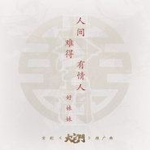

人间难得有情人
============================

|  |  |
| :--: | :-- |
| [ 人间难得有情人](https://emumo.xiami.com/album/2102751509) | **艺人**: [好妹妹](../index.md) **语种**: 国语 **唱片公司**: 春生工作室 **发行时间**: 2017年05月22日 **专辑类别**: EP, 单曲 **专辑风格**: 国语流行 Mandarin Pop **播放数**: 494182 **收藏数**: 237 **评论数**: 32  |

## 简介

好妹妹首次与京剧合作，创作京剧版《大宅门》推广曲《人间难得有情人》。第一次和京剧近距离接触，国粹的博大精深震撼着秦昊和张小厚。他们坦言很荣幸能为京剧版《大宅门》献出绵薄之力，希望他们的这个小小举动也能影响到和他们一样的年轻人能更多地关注戏剧，关注京剧。

## 曲目

## 评论

|  |  |  |
| :-- | :-- | :-- |
|  [虾米用户](https://emumo.xiami.com/u/11156693)  2017-06-28 06:24 赞(1) 踩(0) | 
終於吐出來了
 |
|  [虾米用户](https://emumo.xiami.com/u/28931842)  2017-06-20 18:14 赞(1) 踩(0) | 
胖子减分
 |
|  [虾米用户](https://emumo.xiami.com/u/41659921)  2017-05-30 22:16 赞(0) 踩(0) | 
痴心枉自化泪痕
 |
|  [虾米用户](https://emumo.xiami.com/u/278702240)  2017-05-26 17:45 赞(0) 踩(0) | 
张小厚的唱功比秦昊差了一大截，唱了这么久还是没有任何长进
 |
| ⇒ |  [虾米用户](https://emumo.xiami.com/u/271453768)  2017-06-01 00:06 赞(0) 踩(0) | 
不知道你这种屁话有什么营养，萝卜白菜各有所爱，秦昊唱的好不假，喷张小厚唱不好你来跟秦昊搭档？听歌就好好听歌，组合一共就俩人还得比这比那，闲的蛋疼也别顺嘴胡沁吗，赏你俩嘴巴子滚一边去吧。
 |
| ⇒ |  [虾米用户](https://emumo.xiami.com/u/28931842)  2017-06-20 18:15 赞(0) 踩(0) | 
<q><b>默数一二三说：</b></q>
 |
|  [虾米用户](https://emumo.xiami.com/u/44010400) 若水 2017-05-26 12:28 赞(0) 踩(0) | 
好听
 |
|  [虾米用户](https://emumo.xiami.com/u/30444067) 世间所有的相遇，都是久别... 2017-05-25 09:41 赞(0) 踩(0) | 
妈蛋。我说咋有大宅门啊，什么纪晓岚那种电视主题曲的感觉。结果还真是大宅门什么的～说明，好妹妹是成功的
 |
|  [虾米用户](https://emumo.xiami.com/u/298601816) 我是女生漂亮的女生 2017-05-24 15:42 赞(0) 踩(0) | 
啦啦啦啦啦啦啦啦啦啦啦啦
 |
|  [虾米用户](https://emumo.xiami.com/u/289104640) 怪得夸张 2017-05-23 23:53 赞(0) 踩(0) | 
加油
 |
|  [虾米用户](https://emumo.xiami.com/u/289104640) 怪得夸张 2017-05-23 23:52 赞(0) 踩(0) | 
呀哈，这首还可以窝 
 |
|  [虾米用户](https://emumo.xiami.com/u/298601816) 我是女生漂亮的女生 2017-05-23 18:02 赞(0) 踩(0) | 
于寂寞有染
 |
|  [虾米用户](https://emumo.xiami.com/u/166302128) 冷冷清清的风风火火. 2017-05-22 23:30 赞(0) 踩(0) | 
好听
 |
|  [虾米用户](https://emumo.xiami.com/u/31587909) 都行怎么都行 2017-05-22 15:44 赞(0) 踩(0) | 
开森
 |
|  [虾米用户](https://emumo.xiami.com/u/50766885) hard work 2017-05-22 13:44 赞(0) 踩(0) | 
哟
 |
|  [虾米用户](https://emumo.xiami.com/u/263855282)  2017-05-22 12:46 赞(0) 踩(0) | 
冒泡
 |
|  [虾米用户](https://emumo.xiami.com/u/49481354) 大隐隐于市 2017-05-22 12:36 赞(0) 踩(0) | 
呜呜呜
 |
|  [虾米用户](https://emumo.xiami.com/u/287289544) 一切如初，你依旧。 2017-05-22 11:53 赞(0) 踩(0) | 
好好听，好好听，好好听！
 |
|  [虾米用户](https://emumo.xiami.com/u/278443642) 我还没想好要写什么... 2017-05-22 11:29 赞(0) 踩(0) | 
哇塞，金曲捞单曲循环着，你又出新歌了！
 |
|  [虾米用户](https://emumo.xiami.com/u/280741589)   2017-05-22 11:10 赞(2) 踩(0) | 
唉  歌有点泛滥了
 |
|  [虾米用户](https://emumo.xiami.com/u/49096290) 我还没想好要写什么... 2017-05-22 10:36 赞(0) 踩(0) | 
啊啊啊啊13！
 |
|  [虾米用户](https://emumo.xiami.com/u/42065165) 我与我周旋久 宁做我 2017-05-22 10:35 赞(0) 踩(0) | 
比心
 |
|  [虾米用户](https://emumo.xiami.com/u/298277845)  2017-05-22 10:26 赞(0) 踩(0) | 
十一！
 |
|  [虾米用户](https://emumo.xiami.com/u/203875171)  2017-05-22 10:19 赞(0) 踩(0) | 
我去  居然前排
 |
|  [虾米用户](https://emumo.xiami.com/u/45749166)   2017-05-22 10:18 赞(0) 踩(0) | 
前十！
 |
|  [虾米用户](https://emumo.xiami.com/u/6196768) 我还没想好要写什么... 2017-05-22 10:07 赞(0) 踩(0) | 
哇塞
 |
|  [虾米用户](https://emumo.xiami.com/u/4189767)  2017-05-22 10:07 赞(0) 踩(0) | 
居然前五？！
 |
|  [虾米用户](https://emumo.xiami.com/u/10159084)  2017-05-22 10:07 赞(0) 踩(0) | 
前
 |
|  [虾米用户](https://emumo.xiami.com/u/240315164) 面向未來⋯⋯ 2017-05-22 10:07 赞(0) 踩(0) | 
前排
 |
|  [虾米用户](https://emumo.xiami.com/u/83605858)   2017-05-22 10:04 赞(0) 踩(0) | 
前排
 |
|  [虾米用户](https://emumo.xiami.com/u/13180337)   2017-05-22 10:03 赞(0) 踩(0) | 
？？？
 |
|  [虾米用户](https://emumo.xiami.com/u/294168746)  2017-05-22 10:01 赞(0) 踩(0) | 
听的好想哭
 |
