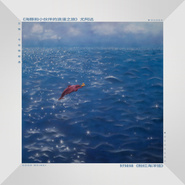

粉红海洋馆
============================

|  |  |
| :--: | :-- |
| [ 粉红海洋馆](https://emumo.xiami.com/album/5021478118) | **艺人**: [好妹妹](../index.md) **语种**: 国语 **唱片公司**:  **发行时间**: 2020年09月14日 **专辑类别**: EP, 单曲 **专辑风格**:  **播放数**: 0 **收藏数**: 2 **评论数**: 0  |

## 简介

你心中的海豚是什么样的？是蔚蓝色如海般优雅的？是灵动机智如孩童的？或许万物生长，所想即所见。 两组素未谋面的艺术家给出了相同的答案 —— 粉红色。在有此山最新上线的合辑《万物：与动物相遇》中，好妹妹和艺术家尤阿达以海豚为题眼，分别独立创作了歌曲《 粉红 海洋馆》和画作《海豚和小伙伴的浪漫之旅》。不约而同地，他们都选择用 “ 粉 ” 为海豚上色。

## 曲目

## 评论

|  |  |  |  |
| :-- | :-- | :-- | :-- |
