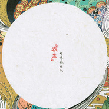

春生Spring Time
============================

|  |  |
| :--: | :-- |
| [ 春生Spring Time](https://emumo.xiami.com/album/525016) | **艺人**: [好妹妹](../index.md) **语种**: 国语 **唱片公司**: 春生工作室 **发行时间**: 2012年07月05日 **专辑类别**: 录音室专辑 **专辑风格**: 城市民谣 Urban Folk, 独立民谣 Indie Folk **播放数**: 43797900 **收藏数**: 16744 **评论数**: 1568  |

## 简介

好妹妹乐队《春生》专辑 新生代民谣乐队，2012华语乐坛最有诚意之作。  
  
日光与森林的惊鸿一遇，泛黄古词与城市民谣的碰撞纠缠。 一番俏皮嬉笑中，各种滋味婉婉道来。 无论那天的阳光是否还能让你记忆犹新，那段相思情谊始终依然。 传媒/乐评/电台DJ/音乐人一致推荐实力唱作乐队。秦昊和张小厚首度担任编曲/吉他/制作人展现其音乐创作才华！ 每首歌都是一个故事，这才是这张诚意专辑能给你带来的别样音乐 体验。每首歌都是一段成长，伴随着一句句唱词都能找到自己的影子。民谣的魅力，音乐的美妙，尽在好妹妹乐队首张创作+自选专辑 《春生》 首播主打歌《冬》写在2011年初的西安。考研的失败，友人的离别，使得秦昊有感而发，迷茫孤寂的冬夜，直击内心柔软的悲伤。 即兴创作歌曲《相思赋予谁》词来自知错老师，古风的词曲，是这张专辑中风格较为独特地一首歌。说来巧合知错老师在一个午后随手写成的歌词，据说只花了15分钟。秦昊看了一遍，就直接拿吉他开始哼旋律了，哼了一遍就把旋律写出来了。歌曲表达的是一个洗净铅华的伶人在年老时追忆青春时风光无限的生活，无处诉钟情的凄凉。这正是无限瞎想才能带来无限的可能。作为歌手勇于挑战自己才是对自己最好的交代。 关于写歌，秦昊总是有自己独到的方式、天气、朋友、地点、食物这些都成了他歌曲中的主角。这才是现在的城市旅人生活的私人日记。在专辑制作过程中，秦昊和张小厚在北京和南京之间反复地往返。《你飞到城市另一边》就是写在在专辑制作和录制的过程中。秦昊说：“这首歌是在从北京到南京的高铁上写出来的曲，因为坐车实在是太无聊了。由于曲风太过诡异，词写了一半就写不下去了，然后到南京之后把词写完，请到了姚谦老师帮我念了对白，因为想到他以前也在江美琪的《恋人心中有一首诗》中有很多念白，这首歌的歌词很难得的写得也比较像诗。”这便成了这首歌的可爱之处吧。  好妹妹乐队在摒弃商业炒作。潜心将自己最好的音乐诚意呈现。2012完全独立专辑《春生》七首原创外加一首翻唱歌曲。只为献给你，妳，还有你。  
好妹妹乐队简介： 很多人都好奇为什么两个男生的乐队会取名叫“好妹妹”，这源自他们2010年4月在无锡一起弹琴唱歌玩的时候随便翻到一首孟庭苇的“你究竟有几个好妹妹”，唱完之后两人觉得很有趣，可以组一个乐队玩玩，于是干脆就叫“好妹妹乐队”了。 浪客秦昊和张小厚俩人都不是专业搞音乐的，张小厚毕业于浙江理工大学04级建筑环境与设备工程系，经常自嘲为修空调的，浪客秦昊毕业于吉林动画学院05级卡通漫画造型专业。张小厚在辞职之前在北京做过地产评估助理，在无锡设计院做工程造价，浪客秦昊在做专辑之前在西安当过插画上色师，在杭州当过摄影师，在无锡考过研，在北京当过美术老师。他俩的共同爱好就是弹琴唱歌。成立乐队之后一直零零散散的写歌录视频和做小演出，直到2011年底的冬天，才萌发了做专辑的想法。然后用了半年的时间，辞去了原本的职业，没有跟任何公司合作，也没有专业的制作团队，完全独立的完成的这张《春生》的制作。    
 歌曲介绍：   
01冬  
词曲：浪客秦昊  
演唱：秦昊、杨玲  
  
专辑中有7首原创的歌曲和一首翻唱的歌曲，第一首也也是专辑主打曲目《冬》创作于2011年初的西安，浪客秦昊考研失败与张小厚告别之后从无锡回到西安，写下了这么一首颇有写寒意的歌。Demo中女声的部分采用了秦昊姑妈秦晓蓉的声音，而专辑中则收录了张小厚妈妈杨玲女士的声音，间奏采用了名曲《落花流水》的旋律，整首歌充满了旧时代的情怀，称得上是好妹妹的代表曲目了。    
02 原来那天的阳光  
词曲：浪客秦昊  
演唱：秦昊  张小厚  
  
第二首主打歌《原来那天的阳光》，讲述了青春时期青涩又美好的感情片段，旋律简单上口，十分有校园民谣的清新感觉，每每现场唱起，总能引发大合唱，引起大家的共鸣。    
03 相思赋予谁  
词：知错  曲：浪客秦昊  
演唱：秦昊 张小厚  
  
第三首《相思赋予谁》是一首比较特别的歌，创作只用了半小时不到，是浪客秦昊的一位要好的语文老师知错先生写的诗词，歌曲都一气合成，称得上是神来之作。    
  
04 你飞到城市另一边  
词曲：浪客秦昊  
演唱：秦昊、张小厚  
念白：姚谦  
  
第四首歌《你飞到城市另一边》，不少初次听的朋友都会吓一跳，因为主歌和副歌的风格跳跃非常大。此歌创作于从北京到南京的高铁上，是在做专辑的过程中写出来的，所以也是临时决定加到专辑中的，并邀请到著名词人姚谦参与了念白的部分。歌词中描写的“自在如风的少年”应该就是映射秦昊张小厚两位喜欢四处跑的少年吧。    
  
05 昨天的你的现在的未来  
词：知错  曲：浪客秦昊  
演唱：秦昊  
  
歌词是知错老师十年前念大学时候写的，没想到这些文字在经过十年之后依然能令人动容，浪客秦昊拿到歌词之后十分震惊，立刻拿起吉他，一气呵成的立刻写出了旋律。这首歌虽然不是专辑主打曲目，但分量却非常的重，歌词中透露的人文情怀和对时光的思索令人回味。  
  
06 关联  
词：何小P  曲：浪客秦昊  
演唱：秦昊 张小厚  
  
这首歌是好妹妹乐队在网络上和现场演出中广受好评的一首歌，由于曲子结构比较特殊，浪客秦昊放弃了填词，交给了好友何小P来写词。写完之后大家都觉得太厉害了，歌词和曲子的贴合程度达到了极致，第一句的“一瞬间”完全没办法换成别的词了！用一把吉他轻声唱起的时候，总能击中人内心最柔软的地方。    
  
07 周一的清晨还在下雨  
词曲：浪客秦昊  
演唱：秦昊 张小厚  
  
这首歌创作于多雨的杭州。是浪客秦昊在经历一段反复纠结很久的感情之后留下了产物。大家好像都会在最初分手的日子里不由自主的寻找对方留下的痕迹，衣服，辈子，甚至于味道。但是就像歌词说的，这些感情中留下的痕迹，最后都会被大雨洗去。    
  
08 青城山下白素贞  
演唱：秦昊  张小厚  
  
这首歌是好妹妹乐队的一首非常经典的翻唱曲目，在网络上传的沸沸扬扬。很多朋友小时候都很喜欢看新白娘子传奇，但是长大之后慢慢遗忘了这些陪我们渡过童年的歌曲。所以偶然听到，才会眼前一亮，然后会心的一笑吧。

## 曲目

## 评论

|  |  |  |
| :-- | :-- | :-- |
|  [虾米用户](https://emumo.xiami.com/u/410212283)  2020-10-21 06:58 赞(0) 踩(0) | 
适合怀旧情怀
 |
|  [虾米用户](https://emumo.xiami.com/u/441436602)  2020-03-15 16:09 赞(0) 踩(0) | 
回味！好听
 |
|  [虾米用户](https://emumo.xiami.com/u/21450282) 哞~ 咩~ 2020-01-29 13:30 赞(1) 踩(0) | 
有多少年没有再听过这张专辑呢 时间像起了灰尘一样
 |
|  [虾米用户](https://emumo.xiami.com/u/2570533) 且听风吟，爱已逝 2020-01-20 01:13 赞(0) 踩(0) | 
红红的太阳西边儿走
 |
|  [虾米用户](https://emumo.xiami.com/u/431222654)  2019-12-08 09:43 赞(0) 踩(0) | 
妈妈听了都说好
 |
|  [虾米用户](https://emumo.xiami.com/u/427900358)  2019-08-06 23:37 赞(0) 踩(0) | 
.
 |
|  [虾米用户](https://emumo.xiami.com/u/377678563)  2019-05-15 00:08 赞(1) 踩(0) | 
相思赋予谁唱的好！戏腔静脉回流的感觉
 |
|  [虾米用户](https://emumo.xiami.com/u/6248079) 我还没想好要写什么... 2019-04-25 23:53 赞(0) 踩(0) | 
夏天的午后 躺在木地板上发呆 砌好了茶 在等你讲故事
 |
|  [虾米用户](https://emumo.xiami.com/u/30902479)  2019-04-04 14:22 赞(0) 踩(0) | 
相思赋予谁，百听不厌
 |
|  [虾米用户](https://emumo.xiami.com/u/37706842)   2019-03-29 00:48 赞(0) 踩(0) | 
最好随动人的首专
 |
|  [虾米用户](https://emumo.xiami.com/u/253396980) 经典的书籍和音乐是让我逃... 2019-03-25 14:51 赞(1) 踩(0) | 
这才是真正的中国好声音！   
 |
|  [虾米用户](https://emumo.xiami.com/u/232158194) - 2019-03-08 00:00 赞(0) 踩(0) | 
哥哥们超棒！
 |
|  [虾米用户](https://emumo.xiami.com/u/35472660)  2019-03-05 21:40 赞(1) 踩(0) | 
好听
 |
|  [虾米用户](https://emumo.xiami.com/u/4487129)  2019-02-27 18:07 赞(0) 踩(0) | 
！！！
 |
|  [虾米用户](https://emumo.xiami.com/u/55047649)  2019-01-24 12:59 赞(1) 踩(0) | 
这个专辑让我回到了从前。时光流逝多少年，分别的人永远留在了心田。蓦然回首间，银色已隐发间。人生几多轮回，情缘流转于指间。
 |
|  [虾米用户](https://emumo.xiami.com/u/961289) 给无聊的生活来点背景音乐 2018-07-29 00:18 赞(1) 踩(0) | 
略有遗憾的完美！
 |
|  [虾米用户](https://emumo.xiami.com/u/49978901) 一个人淋雨forever 2018-07-13 02:17 赞(3) 踩(0) | 
还是喜欢这张专辑 过了这么多年 再听仍然心动
 |
|  [虾米用户](https://emumo.xiami.com/u/5877599) 我好想你们～～ 2018-02-03 20:30 赞(0) 踩(0) | 
喜欢这张专辑，还记得四年前就是靠着循环这张专辑来抚慰背教育学心理学时的躁动。
 |
|  [虾米用户](https://emumo.xiami.com/u/252083406)   2017-12-04 20:50 赞(2) 踩(0) | 
春生是放给冬季听的
 |
|  [虾米用户](https://emumo.xiami.com/u/5103772)  2017-10-30 10:19 赞(1) 踩(0) | 
一直支持昊子,喜欢这种古老又平淡的曲调.
 |
|  [虾米用户](https://emumo.xiami.com/u/5158793) Powerless. 2017-10-30 10:17 赞(1) 踩(0) | 
整张专辑循环 文艺的春天气息 抚平被压抑一冬的骚气
 |
|  [虾米用户](https://emumo.xiami.com/u/8704007) so？ 2017-10-30 10:16 赞(3) 踩(0) | 
好妹妹乐队，多么霸气的名字。声音有点像李志，算是个人偏爱。文艺中带点小资的作品。最后说一句，虾米音乐是好东西啊......
 |
|  [虾米用户](https://emumo.xiami.com/u/4245836) 你是一壶美酒我是酒鬼 2017-10-30 10:15 赞(1) 踩(0) | 
干净的歌，抚平周五下午躁动的心灵
 |
|  [虾米用户](https://emumo.xiami.com/u/9229423) 我还没想好要写什么... 2017-10-30 10:15 赞(0) 踩(0) | 
常常一首歌下来不知道高潮是哪部分 旋律也简简单单来来回回 声音像是溪水淌过石头 对这样的曲子从来没有抵抗力。
 |
|  [虾米用户](https://emumo.xiami.com/u/9262351)  2017-10-28 00:34 赞(2) 踩(0) | 
他们叫「好妹妹」专辑是「春生」「日光与森林的惊鸿一遇 泛黄古词与城市民谣的碰撞纠缠。」 嗯 像被秋雨洗礼过一样 温柔而坚决 轻软而沉淀 浅浅吟唱的好声音。「原来那天的阳光」 「冬」「青城山下白素贞」。
 |
|  [虾米用户](https://emumo.xiami.com/u/2008176)  2017-10-28 00:06 赞(4) 踩(0) | 
我这段时间很郁闷，因为在法国的乡下地方太无聊，寂寞的要疯掉了，无意中听了《青城山下白素贞》，竟然激励我在这个乡下地方继续清修下去，唉。。。太神奇了
 |
| ⇒ |  [虾米用户](https://emumo.xiami.com/u/5138860)  2018-06-29 08:41 赞(0) 踩(0) | 
Unbelievable!! It truely has the magic.
 |
|  [虾米用户](https://emumo.xiami.com/u/712925) 别扯有的没的 2017-10-27 23:41 赞(0) 踩(0) | 
以前还不是特别喜欢，最近听突然就感动了
 |
|  [虾米用户](https://emumo.xiami.com/u/9916993)  2017-10-27 23:23 赞(1) 踩(0) | 
超爱的说，介个小清新的复古风格，我不承认自己老了，但是我的确是大爱老歌，据说秦昊从来不听最新的流行歌曲，因为怕影响到自己的音乐，就是要有这种精神，做自己独立的东西，这才是做音乐，做自己，很不错，很有性格的东西。
 |
|  [虾米用户](https://emumo.xiami.com/u/2655865) 做我的音乐海盗 2017-10-27 23:03 赞(0) 踩(0) | 
日里最开心的一件事就是能听到好的故事，于是就藏了这么张专辑，在手边翻来覆去的度过了整整一个夏天。本来似乎要有点起色的生活莫名其妙的又回去了原点，再配上最近看的一本负能量《我曾爱过你，想起就心酸》。。得嘞，好好的生活算是被我自己毁的一塌糊涂，biu的一声就回去了寒武纪。晚安，您嘞。
 |
|  [虾米用户](https://emumo.xiami.com/u/50426109)  2017-10-27 22:59 赞(1) 踩(0) | 
度过再寒冷一点的冬天  一个人走过北京的长街  依稀记得自己曾是个少年  下一次又要飞到城市另一边 四季春生 四方南北 慢慢走过  那些时光 那些音符  和那两个少年
 |
|  [虾米用户](https://emumo.xiami.com/u/5864801)  2017-10-17 06:22 赞(0) 踩(0) | 
很少去听民谣，所以对于民谣没有太多的感觉，是在豆瓣上看到这张专辑有很高的打分，就来虾米听歌。歌曲很好听，比起平常听的流行歌曲，干净了很多，感觉距离歌唱者的声音是如此之近。听这张专辑的感觉就像是在傍晚雨后的家里，看一部缓慢、温柔的乡村爱情电影。
 |
|  [虾米用户](https://emumo.xiami.com/u/7569591) 天空海阔 你与我 可会变 2017-10-17 06:22 赞(0) 踩(0) | 
喜欢听民谣，最近迷上的就是他们。对，没错！
 |
|  [虾米用户](https://emumo.xiami.com/u/8812602)  2017-10-17 06:18 赞(1) 踩(0) | 
为什么喜欢民谣呢？ 就像遥远的时代送来的一斛美酒 喝一口，品尽多少个有故事的人生  喜欢民谣中透出的真诚 娓娓叙说着一角繁华与沧桑 还有占据了我们人生大半的平淡 而民谣总给平淡调和了不灭的颜色
 |
|  [虾米用户](https://emumo.xiami.com/u/5526289) 开心小甜豆 2017-10-12 14:30 赞(0) 踩(0) | 
♡
 |
|  [虾米用户](https://emumo.xiami.com/u/11634428) 你呀你是南方北上的云，我... 2017-10-04 21:21 赞(0) 踩(0) | 
可惜现在的人听不到红红的太阳西边走了，还好我当年下载了
 |
|  [虾米用户](https://emumo.xiami.com/u/279588147) 我要把虾米写成一本书。 2017-08-08 10:22 赞(0) 踩(0) | 
春生 春生
 |
|  [虾米用户](https://emumo.xiami.com/u/1255706)   2017-08-06 23:18 赞(0) 踩(0) | 
《冬》特别像彭佳慧的《旧梦》，
 |
|  [虾米用户](https://emumo.xiami.com/u/251972129)  2017-06-29 14:37 赞(0) 踩(0) | 
不错的
 |
|  [虾米用户](https://emumo.xiami.com/u/27699286)  2017-05-27 08:42 赞(4) 踩(0) | 
还是春生最好听
 |
|  [虾米用户](https://emumo.xiami.com/u/23726664) 记得也好，最好你忘掉，这... 2017-03-20 21:27 赞(0) 踩(0) | 
一整个大学的时光都有这张春生的记忆
 |
|  [虾米用户](https://emumo.xiami.com/u/21450282) 哞~ 咩~ 2017-03-10 23:19 赞(0) 踩(0) | 
听好妹妹 这一张就够了
 |
|  [虾米用户](https://emumo.xiami.com/u/5853492)  2017-03-05 03:20 赞(0) 踩(0) | 
一听难忘。
 |
|  [虾米用户](https://emumo.xiami.com/u/6615922)  2017-01-20 19:18 赞(1) 踩(0) | 
喜欢这张的都是老粉丝了！当初就是因为这张注意上好妹妹的，好多年了，再听还是这张好听
 |
|  [虾米用户](https://emumo.xiami.com/u/5896660)  2017-01-10 14:10 赞(0) 踩(0) | 
民谣启蒙老师们~
 |
|  [虾米用户](https://emumo.xiami.com/u/6820570) 这是语言的变调，承接醒来... 2016-11-17 20:32 赞(3) 踩(0) | 
优酷用户浪客秦昊您好，你还记得你的密码吗
 |
|  [虾米用户](https://emumo.xiami.com/u/82242434)  2016-08-22 15:12 赞(3) 踩(0) | 
这张质量太高，每首都可以单曲循坏一天
 |
|  [虾米用户](https://emumo.xiami.com/u/206715378) 得未曾有，心净踊跃 2016-08-19 02:20 赞(3) 踩(0) | 
大学宿舍里整夜失眠陪我到天亮的专辑。如今，大学毕业了，宿舍散场了，也再没有这样好的民谣了。
 |
|  [虾米用户](https://emumo.xiami.com/u/11856009) 偏爱迷幻电子和柔顺爵士 2016-08-06 08:46 赞(0) 踩(0) | 
神砖
 |
|  [虾米用户](https://emumo.xiami.com/u/393461) 说什么才好？ 2016-07-02 14:54 赞(0) 踩(0) | 
很棒的民谣，没想到这最近几年居然出了这样合我口味的乐队，这张专辑个人最喜欢冬
 |
|  [虾米用户](https://emumo.xiami.com/u/3456059)  2016-06-01 20:01 赞(1) 踩(0) | 
前几天好妹妹带着分*乐来我校宣讲，领票要注册要拍校园卡身份证还要问家人信息，连我这个脑残粉都觉得反感。是啊，有钱了，歌的制作也精良了，听起来满满的经费，却再也回不到春生时的纯粹了，可我爱的就是这样纯粹的好妹妹啊，一把吉他加上丰厚的情感，也比情感被花哨的制作埋没了好，sigh
 |
|  [虾米用户](https://emumo.xiami.com/u/47359760)  2016-05-24 12:24 赞(4) 踩(0) | 
听完他们发的新歌又很无奈的回到这首
 |
|  [虾米用户](https://emumo.xiami.com/u/10462919) 去和昨天和解吧 2016-05-11 07:32 赞(3) 踩(0) | 
这张是最棒的，有时候有人问我你知道好妹妹吗？我说知道，心里想我2012听他们这张制作不怎么精良的专辑的时候你们还不知道在干嘛，后来的专辑一张比一张让人提不起兴趣
 |
|  [虾米用户](https://emumo.xiami.com/u/149511008) 我还没想好要写什么... 2016-04-24 13:26 赞(0) 踩(0) | 
我妹！力荐！
 |
|  [虾米用户](https://emumo.xiami.com/u/41296880) 我还没想好要写什么... 2016-04-22 14:27 赞(0) 踩(0) | 
最爱这张 现在出的歌总感觉没以前的感觉 能有共鸣
 |
|  [虾米用户](https://emumo.xiami.com/u/52595654) 我还没想好要写什么... 2016-04-13 22:14 赞(0) 踩(0) | 
觉得这个专辑的歌都太棒 没一首都值得单曲循环
 |
|  [虾米用户](https://emumo.xiami.com/u/21216195) 我还没想好要写什么... 2016-04-11 13:48 赞(2) 踩(0) | 
听了这么久的好妹妹了，最爱的几首，无一例外，还是出自《春生》。每一首都各有特色，有记忆点，而整张专辑连起来风格又统一。 喜欢《春生》还有一个小私心。我小时候很喜欢的一篇小说的主角也叫春生。所以一听到春生，就想起小城市，青草，尘露和白色校服。
 |
|  [虾米用户](https://emumo.xiami.com/u/115654808) 一只英俊体面的兔纸。 2016-02-19 23:04 赞(0) 踩(0) | 
晚风~
 |
|  [虾米用户](https://emumo.xiami.com/u/52674477) 时光的河 2016-02-14 13:42 赞(0) 踩(0) | 
分享  好妹妹乐队 的歌曲《红红的太阳西边儿走》<a href="http://www.xiami.com/song/1771483651" target="_blank" rel="nofollow noreferrer noopener">http://www.xiami.com/song/1771483651</a>（分享自@虾米音乐）
 |
|  [虾米用户](https://emumo.xiami.com/u/113684266) 国家注册高级礼仪培训师 ... 2016-02-13 22:06 赞(0) 踩(0) | 
常历伤心，仍难铸就平常心。频添秋绪，还是逢秋悲寂寥。是有哀思终不扫。化作心泥，岁岁生荒草。
 |
|  [虾米用户](https://emumo.xiami.com/u/11054759) 偶尔逛逛 2016-02-09 22:48 赞(0) 踩(0) | 
最初是豆瓣上的好妹妹，音乐人中突然看见好妹妹，大概就是这张开始好妹妹正式开始在友邻里面火了起来，那么多张专了，还是这张最有感觉，“青城山下白素真”~
 |
|  [虾米用户](https://emumo.xiami.com/u/18487)  2016-02-04 01:44 赞(0) 踩(0) | 
这个乐队的歌很奈听很奈听❗
 |
|  [虾米用户](https://emumo.xiami.com/u/14364706) 暂无签名~ 2016-01-28 13:34 赞(0) 踩(0) | 
有故事，好听
 |
|  [虾米用户](https://emumo.xiami.com/u/54927065) 求勾搭求勾搭求勾搭嘴笨脸... 2016-01-24 22:28 赞(1) 踩(0) | 
原来那天的阳光，不知道是不是因为南北里秦老湿的背后故事，听起来格外动人。
 |
|  [虾米用户](https://emumo.xiami.com/u/50426109)  2016-01-16 16:37 赞(2) 踩(0) | 
作为脑残粉不想说丧气的话，但真心觉得这是巅峰了，以后再不会有如春生一样突如其来的感动了吧。
 |
|  [虾米用户](https://emumo.xiami.com/u/5030143)  2016-01-13 15:50 赞(1) 踩(0) | 
好妹妹。最好的第一张,以后也许再也唱不出这样的音乐了吧。
 |
|  [虾米用户](https://emumo.xiami.com/u/3941515)  2016-01-13 13:27 赞(1) 踩(0) | 
编曲诚然都很简单，但词曲和状态是真的感人。同时期的歌之后每张专辑都会放进一两首，于是分分钟碾压其余作品。是慢功才能出细活，还是状态不在了就再也找不回来了呢？说多了都是泪。
 |
|  [虾米用户](https://emumo.xiami.com/u/21450282) 哞~ 咩~ 2016-01-04 01:53 赞(0) 踩(0) | 
第一张最好 现在以后都是
 |
|  [虾米用户](https://emumo.xiami.com/u/41279387)  2016-01-03 20:53 赞(0) 踩(0) | 
这是我最最喜欢的一张专辑了~如春风如溪水，沁人心脾~
 |
|  [虾米用户](https://emumo.xiami.com/u/54302732) 就像一个多鸟的夏天 2015-12-05 10:18 赞(0) 踩(0) | 

 |
|  [虾米用户](https://emumo.xiami.com/u/971317) 做一只追随小姐姐的节制的... 2015-11-15 07:39 赞(0) 踩(0) | 
俩人没少去丽江，带回来的铃铛和鼓全都用上啦  
 |
|  [虾米用户](https://emumo.xiami.com/u/38535390) 文人情結，精神流氓 2015-09-20 23:05 赞(1) 踩(0) | 
难得一张专辑这么多优作，太动人
 |
| ⇒ |  [虾米用户](https://emumo.xiami.com/u/4400274)  2016-01-23 12:56 赞(0) 踩(0) | 
深有同感！越来越火的碧池有种我们的钻石被别人发现的感觉
 |
| ⇒ |  [虾米用户](https://emumo.xiami.com/u/4400274)  2016-01-23 12:56 赞(0) 踩(0) | 
深有同感！越来越火的碧池有种我们的钻石被别人发现的感觉
 |
|  [虾米用户](https://emumo.xiami.com/u/1886864) Where words ... 2015-08-25 17:25 赞(0) 踩(0) | 
含着泪打了五分
 |
|  [虾米用户](https://emumo.xiami.com/u/7603700) 我还没想好要写什么... 2015-08-14 14:26 赞(0) 踩(0) | 
最喜欢的一张
 |
|  [虾米用户](https://emumo.xiami.com/u/48806440) Was it a cat... 2015-07-30 23:00 赞(1) 踩(0) | 
2012年听过现场，怀念
 |
|  [虾米用户](https://emumo.xiami.com/u/22581117) 静静聆听 2015-07-30 14:17 赞(0) 踩(0) | 
好听
 |
|  [虾米用户](https://emumo.xiami.com/u/8630636)  2015-07-29 20:14 赞(0) 踩(0) | 
好听
 |
|  [虾米用户](https://emumo.xiami.com/u/11292759)  2015-07-23 13:54 赞(0) 踩(0) | 
好久以前听过相思赋予谁，现在居然还能哼起来
 |
|  [虾米用户](https://emumo.xiami.com/u/7603700) 我还没想好要写什么... 2015-07-16 23:16 赞(0) 踩(0) | 
好妹妹最好的一张  
 |
|  [虾米用户](https://emumo.xiami.com/u/44129304)  2015-07-03 22:37 赞(1) 踩(0) | 
好听～
 |
|  [虾米用户](https://emumo.xiami.com/u/8347444) 听你妹的歌 读你妹的书 2015-06-26 19:30 赞(0) 踩(0) | 
突然发现这张所有歌全都是秦老师写的
 |
|  [虾米用户](https://emumo.xiami.com/u/17481235)   2015-06-10 12:43 赞(0) 踩(0) | 
你有几个好妹妹
 |
|  [虾米用户](https://emumo.xiami.com/u/13834424) 啥也没留下 2015-05-30 11:15 赞(0) 踩(0) | 
喜欢这一张～
 |
|  [虾米用户](https://emumo.xiami.com/u/6485470)  2015-05-30 10:37 赞(0) 踩(0) | 
首首好听。不说什么
 |
|  [虾米用户](https://emumo.xiami.com/u/7017279)  2015-05-05 22:00 赞(0) 踩(0) | 
怀旧的调子，很温暖
 |
|  [虾米用户](https://emumo.xiami.com/u/472261) 别跟我讲道理 2015-04-24 02:52 赞(3) 踩(0) | 
听这张是不是证明自己是基佬
 |
|  [虾米用户](https://emumo.xiami.com/u/13779282) I miss you 2015-04-14 00:59 赞(0) 踩(0) | 
这一切 最终都和我 没关联。
 |
|  [虾米用户](https://emumo.xiami.com/u/27244323) 随缘自适 2015-04-10 08:53 赞(0) 踩(0) | 
还好吧~
 |
|  [虾米用户](https://emumo.xiami.com/u/5443127) COMING SOON 2015-04-06 16:14 赞(1) 踩(0) | 
每周末洗衣服的时候都在听《春生》
 |
|  [虾米用户](https://emumo.xiami.com/u/21450282) 哞~ 咩~ 2015-04-04 18:16 赞(2) 踩(0) | 
最好的一张,之后的砖浮躁且商业。
 |
|  [虾米用户](https://emumo.xiami.com/u/11113222) now or die 2015-04-01 10:25 赞(0) 踩(0) | 
青铜，碗砖
 |
|  [虾米用户](https://emumo.xiami.com/u/10798855) Magicians do 2015-03-21 23:12 赞(0) 踩(0) | 
搜了上一条微博的歌，觉得这乐队的作品大多好听。@会发光的橙子君 大概你会喜欢？也可能你早就知道……毕竟那么喜欢民谣。
 |
|  [虾米用户](https://emumo.xiami.com/u/45647027)  2015-03-19 17:09 赞(0) 踩(0) | 
整个专辑里面的歌都喜欢
 |
|  [虾米用户](https://emumo.xiami.com/u/4268063)  2015-03-14 15:18 赞(0) 踩(0) | 
神专！
 |
|  [虾米用户](https://emumo.xiami.com/u/9575413) 我还没想好要写什么... 2015-03-05 11:17 赞(1) 踩(0) | 
相思赋予谁xh
 |
|  [虾米用户](https://emumo.xiami.com/u/17458694)  2015-03-02 17:14 赞(0) 踩(0) | 
好听
 |
|  [虾米用户](https://emumo.xiami.com/u/478527) 好想跟衣服在洗衣机里滚 2015-03-01 16:22 赞(0) 踩(0) | 
冬
 |
|  [虾米用户](https://emumo.xiami.com/u/39670584) 生活在隔壁一条街上 2015-02-25 11:08 赞(0) 踩(0) | 
在《冬》里融化了
 |
|  [虾米用户](https://emumo.xiami.com/u/2265999) cat, tiger, ... 2015-02-25 04:48 赞(38) 踩(0) | 
好妹妹的音乐再也超越不了这张专辑，确实很好，每首歌都能单曲循环
 |
|  [虾米用户](https://emumo.xiami.com/u/10547530) 生于白昼，隐与黑夜。 2015-02-23 20:23 赞(2) 踩(0) | 
最好的专辑。没有之一。春水初生，春风轻抚，春生从此蔓延。
 |
|  [虾米用户](https://emumo.xiami.com/u/33965625)  2015-02-18 12:19 赞(0) 踩(0) | 
很少遇到一张专辑有那么多歌都好喜欢
 |
|  [虾米用户](https://emumo.xiami.com/u/15417311) 爱自己，爱那个爱自己的人 2015-02-01 02:07 赞(0) 踩(0) | 
好听
 |
|  [虾米用户](https://emumo.xiami.com/u/8346626) 悲伤地哼着愉快的小调~ 2015-01-28 09:41 赞(1) 踩(0) | 
迄今为止应该是他们最好的一张了，不知道以后能否被超越。
 |
|  [虾米用户](https://emumo.xiami.com/u/5443127) COMING SOON 2015-01-01 14:49 赞(0) 踩(0) | 
萌说她更喜欢这张
 |
|  [虾米用户](https://emumo.xiami.com/u/1218669) 我要当一只快乐的喷子！ 2014-12-25 19:14 赞(1) 踩(0) | 
已下载，另将《红太阳》这颗好妹妹的獠牙利爪人工植入本专辑末尾了（上有政策下有对策嘛~）另：《冬》の分身 <a href="http://www.xiami.com/song/1771778042?spm=a1z1s.6928797.1561534521.36.QfkSgv#wall_list" target="_blank" rel="nofollow noreferrer noopener">http://www.xiami.com/song/1771778042?spm=a1z1s.6928797.1561534521.36.QfkSgv#wall_list</a>
 |
|  [虾米用户](https://emumo.xiami.com/u/2645071)  2014-12-15 22:41 赞(0) 踩(0) | 
好听
 |
|  [虾米用户](https://emumo.xiami.com/u/127868)  2014-12-07 10:19 赞(0) 踩(0) | 
唱出了我的心声。
 |
|  [虾米用户](https://emumo.xiami.com/u/30083899)  2014-12-02 20:30 赞(0) 踩(0) | 
很清新的风格
 |
|  [虾米用户](https://emumo.xiami.com/u/44068841) 不必仰望别人，自己亦是风... 2014-12-02 16:15 赞(0) 踩(0) | 
昨天的你，可曾想到昨天的未来如现在？现在的你，可会想到现在的未来？
 |
|  [虾米用户](https://emumo.xiami.com/u/19469359)  2014-11-28 16:19 赞(0) 踩(0) | 
我现在想起你是也会想到那天的阳光
 |
|  [虾米用户](https://emumo.xiami.com/u/6886821)  2014-11-12 00:35 赞(0) 踩(0) | 
故事
 |
|  [虾米用户](https://emumo.xiami.com/u/39000470) 暂无签名~ 2014-10-31 21:07 赞(1) 踩(0) | 
超级超级舒服，实在的感觉。昨天做了手术不能动弹难受的要命，听飞到城市另一边这首歌曲异常的舒服！
 |
|  [虾米用户](https://emumo.xiami.com/u/13232936) 谁的心让月色照亮无处躲藏 2014-10-21 10:17 赞(0) 踩(0) | 
好听，老实呢好听
 |
|  [虾米用户](https://emumo.xiami.com/u/10547530) 生于白昼，隐与黑夜。 2014-10-16 23:53 赞(2) 踩(0) | 
专辑名字甚好。尚未听过，一袭婉转之气便扑面而来。汉字里过去最能代表男子的，正是生这个字。那晚生，那小生，两个上进好青年，唱一段姹紫嫣红开遍，悲欢离合的素时春生，怎就这般动人。
 |
| ⇒ |  [虾米用户](https://emumo.xiami.com/u/32101704) Lost in musi... 2014-10-30 22:21 赞(0) 踩(0) | 
说的真好
 |
| ⇒ |  [虾米用户](https://emumo.xiami.com/u/10547530) 生于白昼，隐与黑夜。 2014-10-30 23:23 赞(0) 踩(0) | 
<q><b>Horizon说：</b></q>
 |
|  [虾米用户](https://emumo.xiami.com/u/3423507) 简单，清醒，自己的步调 2014-10-13 21:57 赞(0) 踩(0) | 
就是喜欢从第一张开始一首一首听
 |
|  [虾米用户](https://emumo.xiami.com/u/6427624) 但愿人长久，尸体不腐朽~ 2014-10-08 19:19 赞(0) 踩(0) | 
清新，带点古风，都挺喜欢(*^__^*)
 |
|  [虾米用户](https://emumo.xiami.com/u/10573893) 虾米音乐最爱最爱 2014-10-04 15:55 赞(0) 踩(0) | 
近些年最好听的专辑之一
 |
|  [虾米用户](https://emumo.xiami.com/u/33841498)  2014-09-28 22:15 赞(0) 踩(0) | 
累了一天，小酌一杯红酒，听听新民谣，不用去Bar，也能体会的感受，不错。
 |
|  [虾米用户](https://emumo.xiami.com/u/36319648) 学识使人坚毅 2014-09-07 12:53 赞(0) 踩(0) | 
一种精神慢灵魂
 |
|  [虾米用户](https://emumo.xiami.com/u/31446199)  2014-09-02 12:58 赞(0) 踩(0) | 
突然意识到秦昊写冬的那年是我考上研究生的11年，那时我好恋家，好不容易熬过大学，读研简直是噩耗。
 |
| ⇒ |  [虾米用户](https://emumo.xiami.com/u/10846953)  2014-09-24 00:31 赞(0) 踩(0) | 
读研怎么是恶耗
 |
|  [虾米用户](https://emumo.xiami.com/u/6743107) 像下雨后的晴 2014-09-01 22:53 赞(0) 踩(0) | 
秋夜的小雨，当年的春生。 哪句歌词会莫名的戳中心事？ 归来的时候，是否还有青春的容颜
 |
|  [虾米用户](https://emumo.xiami.com/u/27603068) 阳光下，茶杯里的味道 2014-08-27 09:25 赞(0) 踩(0) | 
给人一种新鲜感的好妹妹
 |
|  [虾米用户](https://emumo.xiami.com/u/40158203)  2014-08-19 16:37 赞(1) 踩(0) | 
my Love song
 |
|  [虾米用户](https://emumo.xiami.com/u/740928)  2014-08-12 15:26 赞(0) 踩(0) | 
嗯，如果能有一个可以唱出这样绵绵心情的男朋友，就好了～～
 |
|  [虾米用户](https://emumo.xiami.com/u/11634428) 你呀你是南方北上的云，我... 2014-08-05 10:28 赞(0) 踩(0) | 
再过几十年，我再次听这张专辑，还是会很喜欢，还是会想起你，这是我推荐给你的第一张专辑，别人没注意到的而属于我们两个人性情的歌
 |
|  [虾米用户](https://emumo.xiami.com/u/28493255) 404 2014-07-30 11:44 赞(0) 踩(0) | 
超赞这张
 |
|  [虾米用户](https://emumo.xiami.com/u/2982286) 调调Melody 2014-07-25 19:44 赞(0) 踩(0) | 
民谣的专辑名，民谣的旋律，缓缓唱起。少年，思念，一片春生在心。
 |
|  [虾米用户](https://emumo.xiami.com/u/10728505)  2014-07-11 21:17 赞(0) 踩(0) | 
很淡淡的音色~能发呆
 |
|  [虾米用户](https://emumo.xiami.com/u/6078414)  2014-07-07 09:51 赞(1) 踩(0) | 
各种滋味婉婉道来，第一首歌都在讲述一个故事
 |
|  [虾米用户](https://emumo.xiami.com/u/4052338)  2014-07-05 11:03 赞(1) 踩(0) | 
七言律诗的柔情
 |
|  [虾米用户](https://emumo.xiami.com/u/38688352) 我还没想好要写什么... 2014-07-04 01:11 赞(0) 踩(0) | 
旋律
 |
|  [虾米用户](https://emumo.xiami.com/u/38688352) 我还没想好要写什么... 2014-07-04 01:11 赞(0) 踩(0) | 
旋律
 |
|  [虾米用户](https://emumo.xiami.com/u/571537) 感觉很重要 2014-06-28 23:02 赞(0) 踩(0) | 
安静的情感宣泄，好听！
 |
|  [虾米用户](https://emumo.xiami.com/u/5395500) 暂无签名~ 2014-06-23 19:32 赞(0) 踩(0) | 
经常能听泪我是一个人吗...
 |
| ⇒ |  [虾米用户](https://emumo.xiami.com/u/15320412)  2014-06-27 18:17 赞(0) 踩(0) | 
不是一个人 旋律就特别感伤 根本不用词 可偏偏词又写的那么好。
 |
| ⇒ |  [虾米用户](https://emumo.xiami.com/u/32672746) 固态的我坚定，液态的我随... 2014-11-19 19:17 赞(0) 踩(0) | 
不是～
 |
|  [虾米用户](https://emumo.xiami.com/u/35950803) 做个梦给你 2014-06-19 21:58 赞(0) 踩(0) | 
望求菩萨来电话，渡我素贞出凡尘。
 |
| ⇒ |  [虾米用户](https://emumo.xiami.com/u/4400274)  2016-01-23 12:59 赞(0) 踩(0) | 
哈哈哈哈哈～
 |
|  [虾米用户](https://emumo.xiami.com/u/4332331)   2014-06-19 10:43 赞(0) 踩(0) | 
感动，一遍又一遍，直击 心底的轻叩，还有5天期末，好妹妹陪我
 |
|  [虾米用户](https://emumo.xiami.com/u/3313819)  2014-06-18 20:40 赞(15) 踩(0) | 
人骚歌不骚，还有8天的期末就靠这个了！
 |
|  [虾米用户](https://emumo.xiami.com/u/37655270) FM900.COM 2014-06-16 17:46 赞(0) 踩(0) | 
看看那
 |
|  [虾米用户](https://emumo.xiami.com/u/2560652) 原虾小词@虾米歌词组 2014-06-11 18:46 赞(1) 踩(0) | 
@好妹妹乐队 请好妹妹乐队的负责人注意一下：文本歌词中的credits是有必要标注的，这是虾米歌词的标准格式，请不要删去。谢谢合作哈！
 |
|  [虾米用户](https://emumo.xiami.com/u/17490762)  2014-06-11 11:42 赞(0) 踩(0) | 
听到我好伤感:-(
 |
|  [虾米用户](https://emumo.xiami.com/u/4827542) On Planet 2014-06-10 14:56 赞(0) 踩(0) | 
每次一听都会回味很久，真的越听越有味道！
 |
|  [虾米用户](https://emumo.xiami.com/u/8668921) 暂无签名~ 2014-06-09 00:32 赞(0) 踩(0) | 
大爱民谣~
 |
|  [虾米用户](https://emumo.xiami.com/u/35334562)  2014-06-08 21:25 赞(0) 踩(0) | 
干净的民谣，歌词句句写到心里。
 |
|  [虾米用户](https://emumo.xiami.com/u/16204647)  2014-06-07 00:23 赞(0) 踩(0) | 
一时间心里涌起许多的迫不及待。
 |
|  [虾米用户](https://emumo.xiami.com/u/24648283)  2014-06-06 00:29 赞(0) 踩(0) | 
好妹妹
 |
|  [虾米用户](https://emumo.xiami.com/u/37227435)  2014-06-04 19:51 赞(0) 踩(0) | 
还是喜欢《春生》多一点
 |
|  [虾米用户](https://emumo.xiami.com/u/30649725) 十年踪迹十年心。 2014-06-04 11:52 赞(0) 踩(0) | 
室友每天都会唱他们的歌，然后我也开始喜欢，《冬》是单曲循环~
 |
|  [虾米用户](https://emumo.xiami.com/u/9293569)  2014-06-04 11:39 赞(0) 踩(0) | 
温暖
 |
|  [虾米用户](https://emumo.xiami.com/u/36647191) talk less co... 2014-06-02 16:36 赞(0) 踩(0) | 
好妹妹！！！
 |
|  [虾米用户](https://emumo.xiami.com/u/30182745) 所以我要去看你和大海 2014-05-31 23:21 赞(0) 踩(0) | 
最喜欢最喜欢最喜欢
 |
|  [虾米用户](https://emumo.xiami.com/u/9785520) which is she 2014-05-30 11:22 赞(0) 踩(0) | 
难得得好声音~~~~
 |
|  [虾米用户](https://emumo.xiami.com/u/28493255) 404 2014-05-25 23:16 赞(0) 踩(0) | 
专辑的每首歌都喜欢
 |
|  [虾米用户](https://emumo.xiami.com/u/35056584) 暂无签名~ 2014-04-27 21:35 赞(0) 踩(0) | 
胎教听~
 |
|  [虾米用户](https://emumo.xiami.com/u/9881093)  2014-04-26 23:14 赞(0) 踩(0) | 
每天都要听着入睡。
 |
|  [虾米用户](https://emumo.xiami.com/u/26282389) 我想不等天亮就出发 2014-04-26 12:06 赞(0) 踩(0) | 
暖洋洋的
 |
|  [虾米用户](https://emumo.xiami.com/u/3900004) 暂无签名~ 2014-04-22 15:52 赞(0) 踩(0) | 
很适合这个万物生长的春天
 |
|  [虾米用户](https://emumo.xiami.com/u/1239625) 我还没想好要写什么... 2014-04-21 21:19 赞(0) 踩(0) | 
纪念去年那段日子
 |
|  [虾米用户](https://emumo.xiami.com/u/1896500)   2014-04-19 18:43 赞(0) 踩(0) | 
秦老湿声线咋听很像他
 |
|  [虾米用户](https://emumo.xiami.com/u/19070821) 静谧着的那一片斑驳，叹息... 2014-04-18 21:57 赞(0) 踩(0) | 
欢爷快看
 |
|  [虾米用户](https://emumo.xiami.com/u/12830086) 我要的，你不懂… 2014-04-16 00:50 赞(0) 踩(0) | 
难得一见的好专辑！每一首都很有诚意
 |
|  [虾米用户](https://emumo.xiami.com/u/5707164)  2014-04-12 22:52 赞(0) 踩(0) | 
爱死你们啦!!!!!!!!!!!!!!!!!!!!!!!!!!!!!!!!!!!!!!!! !
 |
|  [虾米用户](https://emumo.xiami.com/u/35245754)  2014-04-12 13:15 赞(0) 踩(0) | 
xihua
 |
|  [虾米用户](https://emumo.xiami.com/u/13378173) 这个人很聪明，所以最好都... 2014-04-11 00:58 赞(0) 踩(0) | 
感觉太亲和了
 |
|  [虾米用户](https://emumo.xiami.com/u/10272236) 真正的自由是什么 2014-04-10 16:08 赞(0) 踩(0) | 
才气哈哈
 |
|  [虾米用户](https://emumo.xiami.com/u/3945147) 易 冷 2014-04-07 11:28 赞(0) 踩(0) | 
给小清新跪了
 |
|  [虾米用户](https://emumo.xiami.com/u/34269714) 低头闻香 2014-04-06 23:21 赞(0) 踩(0) | 
只要周一会下雨 我就听周一的清晨还在下雨。。
 |
|  [虾米用户](https://emumo.xiami.com/u/13918394)  2014-04-05 21:01 赞(0) 踩(0) | 
这一张真的是太太棒了！
 |
|  [虾米用户](https://emumo.xiami.com/u/5928752)  2014-04-04 11:51 赞(0) 踩(0) | 
最近单循的专辑~o(*≧▽≦)ツ
 |
|  [虾米用户](https://emumo.xiami.com/u/6373063) 为爱而  2014-04-03 11:50 赞(0) 踩(0) | 
你曾经对我那么好过，现在你要离开了，我都从没给你过什么礼物。这下，请你不要忘记我。
 |
|  [虾米用户](https://emumo.xiami.com/u/11703507)  2014-04-03 06:05 赞(0) 踩(0) | 
好妹妹，温暖你内心的好妹妹。
 |
|  [虾米用户](https://emumo.xiami.com/u/7598027)   2014-03-30 22:42 赞(0) 踩(0) | 
最喜欢的还是春生，感觉比南北要小好几岁的感觉
 |
|  [虾米用户](https://emumo.xiami.com/u/13992373)  2014-03-30 22:07 赞(0) 踩(0) | 
听歌不会注重什么歌的形式，只要喜欢，，，，记得第一次听得就是《你飞到城市的另一边》，那时候刚好快要期末考试，晚上熬夜抱佛脚一个星期听得都是好妹妹，心情相当平静啊，真庆幸自己能听到这两货的声音
 |
|  [虾米用户](https://emumo.xiami.com/u/34535677)  2014-03-29 19:35 赞(0) 踩(0) | 
感觉真的不错！支持！
 |
|  [虾米用户](https://emumo.xiami.com/u/21715764) 静如瘫痪，动如癫痫 2014-03-29 16:11 赞(0) 踩(0) | 
不知道大家是否喜欢看孙睿的小说，寒假的时候看他的《草样年华》，附和着好妹妹《一个人的北京》《原来那天的阳光》《关联》，说不出来的应景与感伤，有些情感是分性别的，而这种感受，我觉得专属这些正处在迷茫而又渴望的男同学们。。。
 |
| ⇒ |  [虾米用户](https://emumo.xiami.com/u/744131)  2014-04-01 01:24 赞(0) 踩(0) | 
草样年华 多么久远的词啊  那时候我高二。。。哈哈都忘记了故事是怎样的
 |
| ⇒ |  [虾米用户](https://emumo.xiami.com/u/744131)  2014-08-21 20:04 赞(0) 踩(0) | 
<q><b>豆腐熊猫说：</b></q>
 |
| ⇒ |  [虾米用户](https://emumo.xiami.com/u/21715764) 静如瘫痪，动如癫痫 2017-10-27 23:26 赞(0) 踩(0) | 
<q><b>沐沐说：</b></q>
 |
|  [虾米用户](https://emumo.xiami.com/u/15631684)   2014-03-28 14:49 赞(0) 踩(0) | 
首首经典。
 |
|  [虾米用户](https://emumo.xiami.com/u/9728574) 明目张胆 2014-03-27 17:02 赞(0) 踩(0) | 
xxxxxxxxx
 |
|  [虾米用户](https://emumo.xiami.com/u/3782806) 喝喝。 2014-03-27 15:24 赞(0) 踩(0) | 
那年9月初，夏日似乎才刚过，民谣在路上演唱会是好妹妹来暖场，你我坐在第一排，听《你飞到城市另一边》，闭眼再听，那曾经真的已经飞到不见。
 |
|  [虾米用户](https://emumo.xiami.com/u/4738529) 暂无签名~ 2014-03-27 10:14 赞(0) 踩(0) | 
给耳朵的春日阳光
 |
|  [虾米用户](https://emumo.xiami.com/u/2873671) 音乐杂食者 2014-03-26 16:09 赞(0) 踩(0) | 
首首经典。
 |
|  [虾米用户](https://emumo.xiami.com/u/4104185)   2014-03-25 18:05 赞(0) 踩(0) | 
清新
 |
|  [虾米用户](https://emumo.xiami.com/u/32296684)  2014-03-24 11:03 赞(0) 踩(0) | 
民谣
 |
|  [虾米用户](https://emumo.xiami.com/u/1334804) 只有一次的人生啊，要努力... 2014-03-24 10:54 赞(0) 踩(0) | 
太喜欢这张专辑
 |
|  [虾米用户](https://emumo.xiami.com/u/34297739) 我的孤独是一座花园。 2014-03-20 23:47 赞(0) 踩(0) | 
这应该不是我会喜欢的歌呀。
 |
|  [虾米用户](https://emumo.xiami.com/u/34297739) 我的孤独是一座花园。 2014-03-20 23:44 赞(0) 踩(0) | 
好清爽
 |
|  [虾米用户](https://emumo.xiami.com/u/15983640) musice 2014-03-20 14:25 赞(0) 踩(0) | 
这张专辑，听着听着，怎么总是恍惚间听到白素贞的旋律？秦昊最近一直在看白蛇？不过他声音真干净……
 |
|  [虾米用户](https://emumo.xiami.com/u/3212999)  2014-03-12 08:53 赞(0) 踩(0) | 
好妹妹乐队，简单吉他与纯净嗓音的完美结合，适合静静一个人听
 |
|  [虾米用户](https://emumo.xiami.com/u/29480609) 且听风吟 2014-03-12 03:23 赞(0) 踩(0) | 
太好听了...太好听QAQ
 |
|  [虾米用户](https://emumo.xiami.com/u/1609946) 一即一切 2014-03-11 11:35 赞(0) 踩(0) | 
心 境不二
 |
|  [虾米用户](https://emumo.xiami.com/u/7763190)   2014-03-09 14:52 赞(0) 踩(0) | 
还是喜欢青城山下白素贞
 |
|  [虾米用户](https://emumo.xiami.com/u/10271161)  2014-03-06 23:39 赞(0) 踩(0) | 
轻轻柔柔的，喜欢
 |
|  [虾米用户](https://emumo.xiami.com/u/11553394)  2014-03-06 14:41 赞(0) 踩(0) | 
嗓音温柔
 |
|  [虾米用户](https://emumo.xiami.com/u/21216195) 我还没想好要写什么... 2014-03-03 05:56 赞(0) 踩(0) | 
好温柔啊～～
 |
|  [虾米用户](https://emumo.xiami.com/u/33461055)   2014-03-02 13:39 赞(0) 踩(0) | 
感觉太好了
 |
|  [虾米用户](https://emumo.xiami.com/u/642105)  2014-02-23 23:05 赞(0) 踩(0) | 
听着舒服
 |
|  [虾米用户](https://emumo.xiami.com/u/23754052) 你听过千百首歌，真实的日... 2014-02-20 15:53 赞(0) 踩(0) | 
流行味太浓了
 |
|  [虾米用户](https://emumo.xiami.com/u/23754052) 你听过千百首歌，真实的日... 2014-02-20 15:53 赞(0) 踩(0) | 
感觉已经不算民谣了
 |
| ⇒ |  [虾米用户](https://emumo.xiami.com/u/11634428) 你呀你是南方北上的云，我... 2014-03-06 17:36 赞(0) 踩(0) | 
不要在意这些细节，要不就叫流行民谣吧
 |
|  [虾米用户](https://emumo.xiami.com/u/7693096)  2014-02-19 13:30 赞(0) 踩(0) | 
好听
 |
|  [虾米用户](https://emumo.xiami.com/u/31332233) 暂无签名~ 2014-02-11 02:00 赞(0) 踩(0) | 
你究竟有几个好妹妹
 |
|  [虾米用户](https://emumo.xiami.com/u/4876323) 文章 2014-01-25 02:33 赞(0) 踩(0) | 
ok
 |
|  [虾米用户](https://emumo.xiami.com/u/29707082)  2014-01-23 15:08 赞(0) 踩(0) | 
很喜欢 有种让人静下的感觉
 |
|  [虾米用户](https://emumo.xiami.com/u/30320178)  2014-01-19 15:25 赞(0) 踩(0) | 
经典
 |
|  [虾米用户](https://emumo.xiami.com/u/27289036) 笑口常开，爱吃甜食 2014-01-13 13:35 赞(0) 踩(0) | 
喜欢得不能复加的专辑
 |
|  [虾米用户](https://emumo.xiami.com/u/21123481)  2014-01-11 19:19 赞(0) 踩(0) | 
好听
 |
|  [虾米用户](https://emumo.xiami.com/u/2929794)  2014-01-11 17:25 赞(0) 踩(0) | 
爱到不行
 |
|  [虾米用户](https://emumo.xiami.com/u/30215409)  2014-01-05 21:02 赞(0) 踩(0) | 
清冽中带着温暖，就像北京晴朗的冬天
 |
|  [虾米用户](https://emumo.xiami.com/u/6120804)  2014-01-04 16:56 赞(0) 踩(0) | 
喜欢冬。。你飞到城市另一边。
 |
|  [虾米用户](https://emumo.xiami.com/u/10807466)  2014-01-02 23:41 赞(0) 踩(0) | 
声音好听到cry，温暖有厚度，风格又不仅仅是清新那么简单，听说终于红了，黄牛开始倒腾的他们的票了，还记得当年听他们的第一首歌应该是青城山下白素贞，听完整张专辑也就明白为什么会收录那么首歌了
 |
|  [虾米用户](https://emumo.xiami.com/u/5026326) 爱唱歌的孩子都是好孩子～ 2014-01-02 14:57 赞(0) 踩(0) | 
悠闲的午后 晒晒太阳 听听这样的声音 真舒服~
 |
|  [虾米用户](https://emumo.xiami.com/u/268272) 不以物喜 不以己悲 2013-12-31 23:21 赞(0) 踩(0) | 
喜欢呀，好听
 |
|  [虾米用户](https://emumo.xiami.com/u/268272) 不以物喜 不以己悲 2013-12-31 23:18 赞(0) 踩(0) | 
没有理由啊，喜欢呀
 |
|  [虾米用户](https://emumo.xiami.com/u/18553956)  2013-12-30 10:25 赞(0) 踩(0) | 
第一次爱上好妹妹，是因为这首《关联》，听着歌词就沉陷了，那些记录的青春，是不是有我也有你啊。。。
 |
|  [虾米用户](https://emumo.xiami.com/u/8815042) 你可知道我是谁？ 2013-12-30 01:59 赞(0) 踩(0) | 
今天才听这个乐队，有种相见恨晚的感觉，让我感动到哭的故事和声音。
 |
|  [虾米用户](https://emumo.xiami.com/u/10250050)  2013-12-28 14:14 赞(0) 踩(0) | 
一张午后愿意什么都不做，静静的听听的专辑，一张听了之后就只想好好听不想其他琐事的专辑。放空的背景音乐，发呆的净土。
 |
|  [虾米用户](https://emumo.xiami.com/u/7910542)  2013-12-25 13:48 赞(0) 踩(0) | 
很舒服 但有些小感伤
 |
|  [虾米用户](https://emumo.xiami.com/u/23703381)  2013-12-24 10:08 赞(0) 踩(0) | 
日光与森林的惊鸿一遇，泛黄古词与城市民谣的碰撞纠缠。
 |
|  [虾米用户](https://emumo.xiami.com/u/6031869)  2013-12-23 10:45 赞(0) 踩(0) | 
这个冬天，专辑循环
 |
|  [虾米用户](https://emumo.xiami.com/u/14111129)  2013-12-22 15:16 赞(0) 踩(0) | 
温柔
 |
|  [虾米用户](https://emumo.xiami.com/u/13866528) To love，to c... 2013-12-21 19:58 赞(0) 踩(0) | 
唉呀好听好听，边听边复习挺好的，页仔你肯定喜欢这种风格＠泪雨零铃LS
 |
|  [虾米用户](https://emumo.xiami.com/u/29800831) 看看我是可以的 2013-12-15 14:24 赞(0) 踩(0) | 
就很棒啊
 |
|  [虾米用户](https://emumo.xiami.com/u/11003842)  2013-12-13 21:28 赞(0) 踩(0) | 
因为喜欢呀~
 |
|  [虾米用户](https://emumo.xiami.com/u/2645068) 要减回~~ 2013-12-08 22:36 赞(0) 踩(0) | 
好喜欢
 |
|  [虾米用户](https://emumo.xiami.com/u/8337475)  2013-12-06 17:41 赞(0) 踩(0) | 
明天听听
 |
|  [虾米用户](https://emumo.xiami.com/u/5030143)  2013-11-30 10:46 赞(0) 踩(0) | 
好妹妹
 |
|  [虾米用户](https://emumo.xiami.com/u/17897852)  2013-11-27 18:43 赞(0) 踩(0) | 
春生，
 |
|  [虾米用户](https://emumo.xiami.com/u/12721988)  2013-11-27 17:03 赞(0) 踩(0) | 
好听！！！
 |
|  [虾米用户](https://emumo.xiami.com/u/3152548)  2013-11-26 14:46 赞(0) 踩(0) | 
1
 |
|  [虾米用户](https://emumo.xiami.com/u/5404941)  2013-11-18 20:18 赞(0) 踩(0) | 
原来那天的阳光
 |
|  [虾米用户](https://emumo.xiami.com/u/9722902)  2013-11-17 18:28 赞(0) 踩(0) | 
静静的  淡淡的
 |
|  [虾米用户](https://emumo.xiami.com/u/10796974)  2013-11-15 18:01 赞(0) 踩(0) | 
拒绝流行，支持民谣
 |
|  [虾米用户](https://emumo.xiami.com/u/7031017)  2013-11-11 20:32 赞(0) 踩(0) | 
第一次听《冬》怎么就有种似曾相识的感觉？
 |
|  [虾米用户](https://emumo.xiami.com/u/7042848)  2013-11-07 04:29 赞(0) 踩(0) | 
骚妹妹的专辑~~~~有没有人跟我一样爱他~~~
 |
|  [虾米用户](https://emumo.xiami.com/u/1550708)  2013-11-06 15:57 赞(0) 踩(0) | 
又有发现一个喜欢的乐队~
 |
|  [虾米用户](https://emumo.xiami.com/u/6321715)  2013-11-06 11:19 赞(0) 踩(0) | 
喜欢~
 |
|  [虾米用户](https://emumo.xiami.com/u/1342102)  2013-11-04 06:15 赞(0) 踩(0) | 
莫名让人安心。
 |
|  [虾米用户](https://emumo.xiami.com/u/12322980) 诗三百，思无邪。 2013-11-04 00:56 赞(0) 踩(0) | 
喜欢
 |
|  [虾米用户](https://emumo.xiami.com/u/13311052)  2013-10-26 23:47 赞(0) 踩(0) | 
好听罢了
 |
|  [虾米用户](https://emumo.xiami.com/u/13311052)  2013-10-26 23:47 赞(0) 踩(0) | 
慢慢听
 |
|  [虾米用户](https://emumo.xiami.com/u/13218477) 以音乐为粮食 2013-10-25 23:10 赞(0) 踩(0) | 
有种淡淡的哀愁
 |
|  [虾米用户](https://emumo.xiami.com/u/1385909) 我还没想好要写什么... 2013-10-23 23:11 赞(0) 踩(0) | 
纯净的民谣
 |
|  [虾米用户](https://emumo.xiami.com/u/2857420) 昨天晚上我梦见你 2013-10-19 13:41 赞(0) 踩(0) | 
总把春生看成畜生怎么破？！
 |
| ⇒ |  [虾米用户](https://emumo.xiami.com/u/13377164) 暂无签名~ 2014-07-30 23:33 赞(0) 踩(0) | 
(≧▽≦)
 |
|  [虾米用户](https://emumo.xiami.com/u/11389871)   2013-10-15 15:54 赞(1) 踩(0) | 
好久没有一口气把一张清汤寡水的专辑听完的冲动了。魔都今天刮起妖风，躲在图书馆听《春生》，看着窗外天上仿佛快放的流云，歌曲比午后红茶更醇厚。
 |
|  [虾米用户](https://emumo.xiami.com/u/24114180)  2013-10-11 10:07 赞(0) 踩(0) | 
喜欢
 |
|  [虾米用户](https://emumo.xiami.com/u/7768540)  2013-10-08 02:38 赞(0) 踩(0) | 
不要在意这么娘的乐队名字，超爱耶，他们的每首歌我都喜欢。
 |
|  [虾米用户](https://emumo.xiami.com/u/8588994)  2013-10-05 11:15 赞(0) 踩(0) | 
认识晚了 鞠躬
 |
|  [虾米用户](https://emumo.xiami.com/u/11427186)  2013-10-02 09:24 赞(0) 踩(0) | 
好有特点 韵味的专辑
 |
|  [虾米用户](https://emumo.xiami.com/u/7627570)  2013-09-30 19:01 赞(0) 踩(0) | 
因为听了一个《关联》的翻唱所以...这张多好啊。后来的有几首不是我吐槽真有点网络歌曲的调调（。）
 |
|  [虾米用户](https://emumo.xiami.com/u/7249772)  2013-09-29 20:44 赞(0) 踩(0) | 
真的很好，听哭了。加油！
 |
|  [虾米用户](https://emumo.xiami.com/u/22960966)  2013-09-25 13:01 赞(0) 踩(0) | 
xh
 |
|  [虾米用户](https://emumo.xiami.com/u/12255249)  2013-09-24 14:31 赞(0) 踩(0) | 
瞬间爱上
 |
|  [虾米用户](https://emumo.xiami.com/u/11151195)  2013-09-23 16:01 赞(0) 踩(0) | 
这个专辑很棒啊
 |
|  [虾米用户](https://emumo.xiami.com/u/1854156) Ditto  2013-09-19 11:09 赞(0) 踩(0) | 
清新·
 |
|  [虾米用户](https://emumo.xiami.com/u/5959662)  2013-09-18 11:57 赞(0) 踩(0) | 
因為喜歡專輯封面
 |
|  [虾米用户](https://emumo.xiami.com/u/21722980)  2013-09-13 19:46 赞(0) 踩(0) | 
感觉。
 |
|  [虾米用户](https://emumo.xiami.com/u/11699681)  2013-09-11 13:22 赞(0) 踩(0) | 
收了
 |
|  [虾米用户](https://emumo.xiami.com/u/13648971)  2013-09-10 13:45 赞(0) 踩(0) | 
超喜欢的风格
 |
|  [虾米用户](https://emumo.xiami.com/u/6970484) 呵呵 呵呵呵呵 2013-09-08 16:10 赞(0) 踩(0) | 
沁人心脾。
 |
|  [虾米用户](https://emumo.xiami.com/u/10681908) 一生为白 2013-09-02 23:06 赞(0) 踩(0) | 
独立 小调 清新 低吟 温情 民谣
 |
|  [虾米用户](https://emumo.xiami.com/u/13937972) 非常酷！ 2013-09-02 20:50 赞(0) 踩(0) | 
這個夏天喜歡的調子
 |
|  [虾米用户](https://emumo.xiami.com/u/1183305)  2013-09-02 10:49 赞(0) 踩(0) | 
民谣~~
 |
|  [虾米用户](https://emumo.xiami.com/u/3296317)  2013-08-29 16:29 赞(0) 踩(0) | 
干净的声音
 |
|  [虾米用户](https://emumo.xiami.com/u/11494852)  2013-08-29 13:21 赞(0) 踩(0) | 
好听
 |
|  [虾米用户](https://emumo.xiami.com/u/16615020)  2013-08-26 18:15 赞(0) 踩(0) | 
给人想哭的冲动
 |
|  [虾米用户](https://emumo.xiami.com/u/5796002)  2013-08-26 14:30 赞(0) 踩(0) | 
第一次听好妹妹的歌是冬，就听哭了，完全是被歌词和旋律感动哭的。
 |
|  [虾米用户](https://emumo.xiami.com/u/5519283)  2013-08-24 09:33 赞(0) 踩(0) | 
好妹妹，民谣
 |
|  [虾米用户](https://emumo.xiami.com/u/2961099)  2013-08-20 17:30 赞(0) 踩(0) | 
许多年了，没有听到这么好听的歌曲，让心跟着音符颤动！
 |
|  [虾米用户](https://emumo.xiami.com/u/15836588) 我还没想好要写什么... 2013-08-19 22:58 赞(0) 踩(0) | 
舒心
 |
|  [虾米用户](https://emumo.xiami.com/u/6861709)  2013-08-19 19:26 赞(0) 踩(0) | 
干净、温暖的声音
 |
|  [虾米用户](https://emumo.xiami.com/u/12827560) 一片白徘徊 2013-08-14 11:04 赞(0) 踩(0) | 
【没有办法的喜欢】
 |
|  [虾米用户](https://emumo.xiami.com/u/1326666)  2013-08-11 18:16 赞(0) 踩(0) | 
K歌唱了一次冬，真是神清气爽。。。原来唱起来，比听起来还要美。。。
 |
|  [虾米用户](https://emumo.xiami.com/u/9849059)  2013-08-11 11:56 赞(0) 踩(0) | 
就是这张，第三首歌不知道为什么让我想起蔡康永==。
 |
|  [虾米用户](https://emumo.xiami.com/u/18846641)  2013-08-09 14:44 赞(0) 踩(0) | 
那些难以忘怀的人啊 你们忘不掉的是转身离开的他 还是在情海里呛到的自己
 |
|  [虾米用户](https://emumo.xiami.com/u/6121881)  2013-08-04 00:18 赞(0) 踩(0) | 
有同一种调调的错觉= =
 |
|  [虾米用户](https://emumo.xiami.com/u/6970484) 呵呵 呵呵呵呵 2013-08-02 21:24 赞(0) 踩(0) | 
窝从知乎穿越过来的！！！太他妈好听了！！！！
 |
|  [虾米用户](https://emumo.xiami.com/u/9992389)  2013-07-31 12:29 赞(0) 踩(0) | 
不是很热的天儿，午休时间，遇到好音乐，真是美极了的事情。
 |
|  [虾米用户](https://emumo.xiami.com/u/2041520)  2013-07-30 16:16 赞(0) 踩(0) | 
去年冬天听到《春生》这张专辑，整个冬天都在单曲循环的是《昨天的你的现在的未来》，其实这个歌名我到现在都记不住，可是曲调和歌词那么好，好到回家的路上、上班的路上、刷微博的时候、睡前、午餐、发呆都在听。听着这首歌就觉得心里安静成一片。今年入夏开始听得更多的却是《相思赋予谁》。可能与心态有关。喜欢这个古意四溢的曲子和唱腔，喜欢戏曲式的转音，那感觉和读安妮的《素年锦时》是一样的。今年的《南北》中的《月光曲》与之相较，还是稍逊一筹。
 |
|  [虾米用户](https://emumo.xiami.com/u/566082) 人生是一场修行，我是否可... 2013-07-28 16:30 赞(0) 踩(0) | 
最近发现的好乐队 ！
 |
|  [虾米用户](https://emumo.xiami.com/u/1487266)  2013-07-27 22:44 赞(0) 踩(0) | 
好听的声音
 |
|  [虾米用户](https://emumo.xiami.com/u/16997575)  2013-07-26 22:43 赞(0) 踩(0) | 
最喜欢 冬 &amp;amp; 你飞到城市另一边 这两首~~~
 |
|  [虾米用户](https://emumo.xiami.com/u/7684008)  2013-07-25 22:33 赞(0) 踩(0) | 
小清新民谣 噗
 |
|  [虾米用户](https://emumo.xiami.com/u/16197977)  2013-07-16 16:35 赞(0) 踩(0) | 
喜欢秦碧池的声音！
 |
|  [虾米用户](https://emumo.xiami.com/u/870983) 赤道生活；） 2013-07-15 15:46 赞(0) 踩(0) | 
春生~
 |
|  [虾米用户](https://emumo.xiami.com/u/12832061) 行善沒有條件 2013-07-14 23:49 赞(0) 踩(0) | 
絕對五星級
 |
|  [虾米用户](https://emumo.xiami.com/u/37348)  2013-07-14 13:32 赞(0) 踩(0) | 
good
 |
|  [虾米用户](https://emumo.xiami.com/u/37348)  2013-07-14 13:32 赞(0) 踩(0) | 
好音乐永远也追求不完
 |
|  [虾米用户](https://emumo.xiami.com/u/37348)  2013-07-14 13:27 赞(0) 踩(0) | 
好音乐我们永远也追求不完！
 |
|  [虾米用户](https://emumo.xiami.com/u/11629652)  2013-07-12 11:54 赞(0) 踩(0) | 
日光与森林的惊鸿一遇，泛黄古词与城市民谣的碰撞纠缠。
 |
|  [虾米用户](https://emumo.xiami.com/u/1388441)  2013-07-11 17:46 赞(0) 踩(0) | 
如果你也同样有故事，你也是感情细腻的人，民谣的力量让我们思考，思考诗性的人生，带我们行走。谢谢好妹妹，带来了这两张让人感动的作品。
 |
|  [虾米用户](https://emumo.xiami.com/u/7308064) Be yourself 2013-07-05 16:24 赞(0) 踩(0) | 
算城市民谣不。。
 |
|  [虾米用户](https://emumo.xiami.com/u/7381117)  2013-07-04 21:29 赞(0) 踩(0) | 
下午躺床上听简姐姐P4随机循到的的专辑，好喜欢
 |
|  [虾米用户](https://emumo.xiami.com/u/15507044) 自在随缘 2013-07-02 18:40 赞(0) 踩(0) | 
啦啦啦啦啦啦啦啦
 |
|  [虾米用户](https://emumo.xiami.com/u/116445) 欢天喜地 2013-07-01 22:12 赞(0) 踩(0) | 
好听
 |
|  [虾米用户](https://emumo.xiami.com/u/116445) 欢天喜地 2013-07-01 22:12 赞(0) 踩(0) | 
行云流水
 |
|  [虾米用户](https://emumo.xiami.com/u/5912968)  2013-07-01 15:21 赞(0) 踩(0) | 
确实想不到《原来那天的阳光》背后的故事。。。
 |
|  [虾米用户](https://emumo.xiami.com/u/8776016)  2013-06-30 12:48 赞(0) 踩(0) | 
恩恩。喜欢上好妹妹乐队了。嘿嘿。。。看来得发现小众音乐才行啊。。
 |
|  [虾米用户](https://emumo.xiami.com/u/10641290) 我是女孩纸 2013-06-29 14:07 赞(0) 踩(0) | 
看到专辑的名字就很喜欢，作为文科妹子一枚，非常花痴建筑男
 |
|  [虾米用户](https://emumo.xiami.com/u/14477021) Live Fast Di... 2013-06-28 16:23 赞(0) 踩(0) | 
国内民谣新希望
 |
|  [虾米用户](https://emumo.xiami.com/u/6358974)  2013-06-24 15:03 赞(0) 踩(0) | 
温馨治愈系
 |
|  [虾米用户](https://emumo.xiami.com/u/16071628)  2013-06-20 16:50 赞(0) 踩(0) | 
好舒服~
 |
|  [虾米用户](https://emumo.xiami.com/u/6687531)  2013-06-16 19:07 赞(0) 踩(0) | 
煩躁的時候可以試試，peace 眼睛閉起來時，浮現出來的都是最美好的事情
 |
|  [虾米用户](https://emumo.xiami.com/u/15997028)  2013-06-15 10:58 赞(0) 踩(0) | 
每首歌都是一个青春里真诚的故事，唱出了境界，适合静静的听！
 |
|  [虾米用户](https://emumo.xiami.com/u/4391035)  2013-06-14 00:01 赞(0) 踩(0) | 
每首歌一个故事，歌，唱出境界为上。
 |
|  [虾米用户](https://emumo.xiami.com/u/6065435) 我被你的琴弦杀死了。 2013-06-13 22:21 赞(0) 踩(0) | 
秦老师OvO
 |
|  [虾米用户](https://emumo.xiami.com/u/8117940)  2013-06-08 05:06 赞(0) 踩(0) | 
无法形容第一次听到青城山下白素贞这一句时候的心情 只能说太喜欢了
 |
|  [虾米用户](https://emumo.xiami.com/u/14256303) 亲爱的~！~！ 2013-06-07 16:08 赞(0) 踩(0) | 
打错字了
 |
|  [虾米用户](https://emumo.xiami.com/u/14256303) 亲爱的~！~！ 2013-06-07 16:07 赞(0) 踩(0) | 
清晨下的白素贞挺好听的~！
 |
|  [虾米用户](https://emumo.xiami.com/u/15862188)  2013-06-06 13:14 赞(0) 踩(0) | 
喜欢好妹妹乐队~~安静舒缓
 |
|  [虾米用户](https://emumo.xiami.com/u/343386)  2013-06-04 13:28 赞(0) 踩(0) | 
很悠扬的古风~
 |
|  [虾米用户](https://emumo.xiami.com/u/870694) 我还没想好要写什么... 2013-06-02 23:10 赞(0) 踩(0) | 
都是真诚的，都是实心的
 |
|  [虾米用户](https://emumo.xiami.com/u/13731019)  2013-06-02 11:07 赞(0) 踩(0) | 
如果你的青春里还有故事！
 |
|  [虾米用户](https://emumo.xiami.com/u/10368468) 其实我有一颗摇滚的心 2013-06-01 09:57 赞(0) 踩(0) | 
喜欢民谣
 |
|  [虾米用户](https://emumo.xiami.com/u/15494405)  2013-05-31 05:40 赞(0) 踩(0) | 
小清新，纯正的小清新
 |
|  [虾米用户](https://emumo.xiami.com/u/10529909)  2013-05-30 20:48 赞(0) 踩(0) | 
好听
 |
|  [虾米用户](https://emumo.xiami.com/u/5843215)  2013-05-29 16:54 赞(0) 踩(0) | 
很特别的专辑，挺喜欢的
 |
|  [虾米用户](https://emumo.xiami.com/u/4333471)   2013-05-27 00:17 赞(0) 踩(0) | 
听完南北回来再听春生，才有更真切的回家的感觉。唉
 |
|  [虾米用户](https://emumo.xiami.com/u/8472699)  2013-05-26 22:16 赞(0) 踩(0) | 
春生
 |
|  [虾米用户](https://emumo.xiami.com/u/3768341)  2013-05-26 15:12 赞(0) 踩(0) | 
我真的爱死这张专辑了_(」∠ ､ﾝ､)_！
 |
|  [虾米用户](https://emumo.xiami.com/u/8399097)  2013-05-24 16:04 赞(0) 踩(0) | 
喜欢他们的音色
 |
|  [虾米用户](https://emumo.xiami.com/u/3059476) 我不知道我是我，所以我是... 2013-05-23 18:52 赞(0) 踩(0) | 
找了一下午的新声音，只有这个乐队一下就抓住了我的耳朵，没有复杂华丽的配器，只有简单的吉他伴奏和温暖的人声和音，值得一提的是两首古词可以演绎的如此有韵味，专辑的封面和配画也很有特色，我想这肯定是一张值得拥有的专辑
 |
|  [虾米用户](https://emumo.xiami.com/u/13980298)  2013-05-23 11:15 赞(0) 踩(0) | 
只听声音变沉沦
 |
|  [虾米用户](https://emumo.xiami.com/u/4164983) 只想有个人和我安安稳稳地 2013-05-23 03:15 赞(0) 踩(0) | 
天了噜 这张好听到爆 怪不得有些人对新专辑不满意 因为以前这张实在是太好听了噜
 |
|  [虾米用户](https://emumo.xiami.com/u/15266791)  2013-05-22 16:51 赞(0) 踩(0) | 
很喜欢、每一首都唱到心里了
 |
|  [虾米用户](https://emumo.xiami.com/u/15266791)  2013-05-22 16:41 赞(0) 踩(0) | 
很喜欢、
 |
|  [虾米用户](https://emumo.xiami.com/u/2958821)  2013-05-20 22:33 赞(0) 踩(0) | 
正在听，最近很红啊
 |
|  [虾米用户](https://emumo.xiami.com/u/6084279) King Shine E 2013-05-18 18:51 赞(0) 踩(0) | 
好妹妹
 |
|  [虾米用户](https://emumo.xiami.com/u/2421632)  2013-05-17 21:37 赞(0) 踩(0) | 
循环ing。
 |
|  [虾米用户](https://emumo.xiami.com/u/13646035) 二货人生 2013-05-15 22:46 赞(0) 踩(0) | 
青城山下白素贞······哈哈···团拜会歌曲
 |
|  [虾米用户](https://emumo.xiami.com/u/3594842)  2013-05-15 15:08 赞(0) 踩(0) | 
必须五星
 |
|  [虾米用户](https://emumo.xiami.com/u/471639) 说爱我，假的也行。 2013-05-14 09:49 赞(0) 踩(0) | 
原来这就是民谣。
 |
|  [虾米用户](https://emumo.xiami.com/u/2222099)  2013-05-14 07:20 赞(0) 踩(0) | 
Urban Folk
 |
|  [虾米用户](https://emumo.xiami.com/u/8278482)  2013-05-12 19:36 赞(0) 踩(0) | 
趁着还没有染上商业气息罢
 |
|  [虾米用户](https://emumo.xiami.com/u/6651610) 我还没想好要写什么... 2013-05-11 10:56 赞(1) 踩(0) | 
论文狗的一抹阳光~
 |
|  [虾米用户](https://emumo.xiami.com/u/1137473) 我还没想好要写什么... 2013-05-09 09:29 赞(0) 踩(0) | 
算是经典了~  首首都是优质的。
 |
|  [虾米用户](https://emumo.xiami.com/u/9260420)  2013-05-08 17:23 赞(0) 踩(0) | 
喜欢
 |
|  [虾米用户](https://emumo.xiami.com/u/14731253)  2013-05-08 16:19 赞(0) 踩(0) | 
每首歌都是经典。
 |
|  [虾米用户](https://emumo.xiami.com/u/13383270) 有热爱就不会死暂时 2013-05-08 04:35 赞(0) 踩(0) | 
愿意为之死忠的民谣
 |
|  [虾米用户](https://emumo.xiami.com/u/3385618) 仔细看，阳光也会让皮肤变... 2013-05-06 23:00 赞(0) 踩(0) | 
@angelhuang_19
 |
|  [虾米用户](https://emumo.xiami.com/u/8982655)  2013-05-06 20:40 赞(0) 踩(0) | 
特别适合今天的夜晚
 |
|  [虾米用户](https://emumo.xiami.com/u/2859021) 听歌听歌猛猛听歌！ 2013-05-06 18:44 赞(0) 踩(0) | 
难得一遇的好声音，好作品，好真挚，好纯净，好感动，好难得一遇的好。
 |
|  [虾米用户](https://emumo.xiami.com/u/3241981)  2013-05-06 14:00 赞(0) 踩(0) | 
每首都好听！！
 |
|  [虾米用户](https://emumo.xiami.com/u/14359549)  2013-05-04 13:25 赞(0) 踩(0) | 
知乎推荐
 |
|  [虾米用户](https://emumo.xiami.com/u/623542) 半晴半雨，半淡半浓 2013-05-04 09:58 赞(0) 踩(0) | 
你说，相思赋谁...
 |
|  [虾米用户](https://emumo.xiami.com/u/9726390)  2013-05-01 22:36 赞(0) 踩(0) | 
相思赋予谁比较好听。
 |
|  [虾米用户](https://emumo.xiami.com/u/6988209)  2013-05-01 17:42 赞(0) 踩(0) | 
粉了！
 |
|  [虾米用户](https://emumo.xiami.com/u/14157034)  2013-04-28 11:26 赞(0) 踩(0) | 
很清澈的音乐
 |
|  [虾米用户](https://emumo.xiami.com/u/14067149)  2013-04-25 12:45 赞(0) 踩(0) | 
好听
 |
|  [虾米用户](https://emumo.xiami.com/u/774261)   2013-04-23 19:24 赞(0) 踩(0) | 
封面好像可苦可乐的封面
 |
|  [虾米用户](https://emumo.xiami.com/u/12310070)  2013-04-23 15:55 赞(0) 踩(0) | 
哝，你听听看
 |
|  [虾米用户](https://emumo.xiami.com/u/2466752)  2013-04-22 11:41 赞(0) 踩(0) | 
下雨天，听好妹妹~
 |
|  [虾米用户](https://emumo.xiami.com/u/12247738) 静静等待落叶~~ 2013-04-21 14:34 赞(0) 踩(0) | 
干干净净的男生，稀饭~~
 |
|  [虾米用户](https://emumo.xiami.com/u/697958) 我还没想好要写什么... 2013-04-21 10:50 赞(0) 踩(0) | 
春生啊啊 啊啊啊啊啊啊啊
 |
|  [虾米用户](https://emumo.xiami.com/u/9214567)  2013-04-20 01:07 赞(0) 踩(0) | 
还没泛滥，有新鲜感
 |
|  [虾米用户](https://emumo.xiami.com/u/10988852)  2013-04-19 14:48 赞(0) 踩(0) | 
好
 |
|  [虾米用户](https://emumo.xiami.com/u/14002085)  2013-04-19 14:16 赞(0) 踩(0) | 
很好听
 |
|  [虾米用户](https://emumo.xiami.com/u/9134017)  2013-04-19 08:31 赞(0) 踩(0) | 
好听
 |
|  [虾米用户](https://emumo.xiami.com/u/13980818) be happy 2013-04-18 23:17 赞(1) 踩(0) | 
民谣中最爱好妹妹！
 |
|  [虾米用户](https://emumo.xiami.com/u/13646346)  2013-04-18 20:42 赞(0) 踩(0) | 
真好听
 |
|  [虾米用户](https://emumo.xiami.com/u/13966873)  2013-04-17 21:29 赞(0) 踩(0) | 
小清新我喜欢。
 |
|  [虾米用户](https://emumo.xiami.com/u/1188156) 山水万程，皆有好运 2013-04-16 22:44 赞(0) 踩(0) | 
一张诚意十足~越听越有味道的专辑！！
 |
|  [虾米用户](https://emumo.xiami.com/u/2858747)  2013-04-15 23:02 赞(0) 踩(0) | 
淡淡听着总会有泪涌的冲动……
 |
|  [虾米用户](https://emumo.xiami.com/u/10809726) 夜色温柔 2013-04-15 20:33 赞(0) 踩(0) | 
舒服 不知道为什么就难过了
 |
|  [虾米用户](https://emumo.xiami.com/u/5074967) 我本将心照明月，奈何明月... 2013-04-15 10:06 赞(0) 踩(0) | 
俩才子，喜欢山羊胡
 |
|  [虾米用户](https://emumo.xiami.com/u/12988930)  2013-04-14 17:59 赞(0) 踩(0) | 
些许哭腔，但能带我们回到朴实无华的青春年代。
 |
|  [虾米用户](https://emumo.xiami.com/u/13131317)  2013-04-13 00:56 赞(0) 踩(0) | 
爱
 |
|  [虾米用户](https://emumo.xiami.com/u/6860496)  2013-04-11 13:49 赞(0) 踩(0) | 
清新的城市民谣，男主销魂的声线。  春生何处暗周游，海角天涯遍始休。
 |
|  [虾米用户](https://emumo.xiami.com/u/7922109)  2013-04-11 13:35 赞(0) 踩(0) | 
夜深太适合听了。
 |
|  [虾米用户](https://emumo.xiami.com/u/6541934)  2013-04-11 11:10 赞(0) 踩(0) | 
挺适合这样的清晨当背景音乐合着阳光一起听
 |
|  [虾米用户](https://emumo.xiami.com/u/8128667)   2013-04-10 15:36 赞(0) 踩(0) | 
你飞到城市另一边
 |
|  [虾米用户](https://emumo.xiami.com/u/5505807)  2013-04-09 14:35 赞(0) 踩(0) | 
想不到大陆还有这么安静温暖的声音，喜欢~
 |
|  [虾米用户](https://emumo.xiami.com/u/13888129)  2013-04-09 12:12 赞(0) 踩(0) | 
秦老师温暖的声音
 |
|  [虾米用户](https://emumo.xiami.com/u/4797650)  2013-04-08 23:02 赞(0) 踩(0) | 
今晚不用耳机，用音箱听好妹妹的《春生》专辑，狭小的房间里回荡着略带寂寥的温暖干净的声音，欲罢不能。下次找房子还是找个单身公寓把，那样就可以开很大的音量享受我喜欢的音乐了
 |
|  [虾米用户](https://emumo.xiami.com/u/13430795) 设计虱 2013-04-07 22:59 赞(0) 踩(0) | 
冬和你飞到城市另一边简直好听爆了！！
 |
|  [虾米用户](https://emumo.xiami.com/u/7131885) 我还没想好要写什么... 2013-04-06 19:27 赞(0) 踩(0) | 
别样，让人思与好友聚
 |
|  [虾米用户](https://emumo.xiami.com/u/6529928)  2013-04-06 16:48 赞(0) 踩(0) | 
很安静的民谣，吉他的和弦，舒服的男声，稀饭！
 |
|  [虾米用户](https://emumo.xiami.com/u/5747043) 瞬间像永远，未来像从前。 2013-03-31 21:48 赞(0) 踩(0) | 
不管是声音，歌词，专辑封面，都是我的爱
 |
|  [虾米用户](https://emumo.xiami.com/u/5581151) Ridicolo 2013-03-29 20:24 赞(0) 踩(0) | 
杭州的夏天每天都在下雨，大雨洗去你的痕迹
 |
|  [虾米用户](https://emumo.xiami.com/u/13718891)  2013-03-28 21:35 赞(0) 踩(0) | 
很安静    很清
 |
|  [虾米用户](https://emumo.xiami.com/u/13712945)  2013-03-28 12:27 赞(0) 踩(0) | 
-0-
 |
|  [虾米用户](https://emumo.xiami.com/u/267408)  2013-03-27 15:23 赞(0) 踩(0) | 
就为了听这首青城山下白素贞给力
 |
|  [虾米用户](https://emumo.xiami.com/u/3115748)  2013-03-25 23:04 赞(0) 踩(0) | 
徒然曜日，春生花溪
 |
|  [虾米用户](https://emumo.xiami.com/u/13462746)  2013-03-24 08:46 赞(0) 踩(0) | 
挺好听的
 |
|  [虾米用户](https://emumo.xiami.com/u/3729728)  2013-03-23 15:14 赞(0) 踩(0) | 
青城山下白素贞
 |
|  [虾米用户](https://emumo.xiami.com/u/6136731) 爱就是在一起 吃好多顿饭 2013-03-23 08:02 赞(0) 踩(0) | 
春 生
 |
|  [虾米用户](https://emumo.xiami.com/u/7175006)  2013-03-23 00:31 赞(0) 踩(0) | 
多年以后，我会想起，看见三叔封笔这个消息的时候，我在听这个，尼玛，眼泪就要出来了。。。
 |
|  [虾米用户](https://emumo.xiami.com/u/2205450) 我还没想好要写什么... 2013-03-22 02:55 赞(0) 踩(0) | 
。
 |
|  [虾米用户](https://emumo.xiami.com/u/1200713) 暂无签名~ 2013-03-20 16:19 赞(0) 踩(0) | 
碧池你快和小厚生粗第二胎叭叭叭~~
 |
|  [虾米用户](https://emumo.xiami.com/u/9386269)  2013-03-19 21:18 赞(0) 踩(0) | 
真心好听
 |
|  [虾米用户](https://emumo.xiami.com/u/7290704)  2013-03-17 16:39 赞(0) 踩(0) | 
就简单而已啊
 |
|  [虾米用户](https://emumo.xiami.com/u/13556233)  2013-03-17 02:40 赞(0) 踩(0) | 
清新 城市民谣
 |
|  [虾米用户](https://emumo.xiami.com/u/12299540)  2013-03-15 17:50 赞(0) 踩(0) | 
小清新。
 |
|  [虾米用户](https://emumo.xiami.com/u/10152318) 还没有玩够 2013-03-13 11:45 赞(0) 踩(0) | 
积极向上
 |
|  [虾米用户](https://emumo.xiami.com/u/10693607)  2013-03-12 15:59 赞(0) 踩(0) | 
大陆难得的清新
 |
|  [虾米用户](https://emumo.xiami.com/u/2880477)  2013-03-12 08:48 赞(0) 踩(0) | 
听了以后能说不好么·！ 这样的专辑，没有专业制作团队，没有浓墨重彩的宣传，没有大唱片公司做后台…… 这个五星的评价太纯粹了，你说呢~？
 |
|  [虾米用户](https://emumo.xiami.com/u/6076789)  2013-03-11 16:50 赞(0) 踩(0) | 
一把吉他一把好嗓子一张好专辑
 |
|  [虾米用户](https://emumo.xiami.com/u/12356230)  2013-03-11 10:30 赞(0) 踩(0) | 
城市民谣
 |
|  [虾米用户](https://emumo.xiami.com/u/1420953)   2013-03-08 02:20 赞(0) 踩(0) | 
喜欢 曲子里的平静 像雨后的傍晚 湿湿的气息 蓝蓝的夜色 被最后一抹雨后的晚霞点缀 这年少藏进脑海中的景象突然被翻了出来____&amp;lt;&amp;lt;晚风&amp;gt;&amp;gt;
 |
|  [虾米用户](https://emumo.xiami.com/u/13419965) 愿你我既可以朝九晚五，又... 2013-03-07 21:01 赞(0) 踩(0) | 
喜欢这声音
 |
|  [虾米用户](https://emumo.xiami.com/u/6163577)  2013-03-06 10:29 赞(0) 踩(0) | 
好美的歌
 |
|  [虾米用户](https://emumo.xiami.com/u/2604984)  2013-03-05 20:14 赞(0) 踩(0) | 
好声音
 |
|  [虾米用户](https://emumo.xiami.com/u/13383964)  2013-03-05 09:17 赞(0) 踩(0) | 
近年 最爱的一张专辑了。 每一首歌感觉都很走心
 |
|  [虾米用户](https://emumo.xiami.com/u/2008049)  2013-03-03 00:04 赞(0) 踩(0) | 
真不错
 |
|  [虾米用户](https://emumo.xiami.com/u/9250072)  2013-03-01 12:37 赞(0) 踩(0) | 
必须要强推一下最近爱的不行的这张碟。对于声音好听的大小帅哥们我果然是一点抵抗力都没有的……
 |
|  [虾米用户](https://emumo.xiami.com/u/11367142)  2013-02-26 13:04 赞(0) 踩(0) | 
不需要理由，不解释
 |
|  [虾米用户](https://emumo.xiami.com/u/3557045) 让好事发声 2013-02-25 22:02 赞(0) 踩(0) | 
词写得真好
 |
|  [虾米用户](https://emumo.xiami.com/u/6074211)  2013-02-24 16:00 赞(0) 踩(0) | 
#电台情歌#
 |
|  [虾米用户](https://emumo.xiami.com/u/1725447)  2013-02-24 15:26 赞(0) 踩(0) | 
好听
 |
|  [虾米用户](https://emumo.xiami.com/u/9941766) 虾米宝贝再见 2013-02-21 15:56 赞(0) 踩(0) | 
好有磁性的声音。。。。浮想联翩~~~
 |
|  [虾米用户](https://emumo.xiami.com/u/1093708)  2013-02-21 13:59 赞(0) 踩(0) | 
声音真好··
 |
|  [虾米用户](https://emumo.xiami.com/u/1093708)  2013-02-21 13:55 赞(0) 踩(0) | 
声音真好。
 |
|  [虾米用户](https://emumo.xiami.com/u/2024313) 我还没想好要写什么... 2013-02-19 15:25 赞(0) 踩(0) | 
好久不听民谣了……突然一下子有了生气
 |
|  [虾米用户](https://emumo.xiami.com/u/2024313) 我还没想好要写什么... 2013-02-19 15:25 赞(0) 踩(0) | 
好久不听民谣了……突然一下子有了生气
 |
|  [虾米用户](https://emumo.xiami.com/u/2024313) 我还没想好要写什么... 2013-02-19 15:25 赞(0) 踩(0) | 
好久不听民谣了……突然一下子有了生气
 |
|  [虾米用户](https://emumo.xiami.com/u/5187517)  2013-02-18 19:21 赞(0) 踩(0) | 
哈哈哈~~好喜欢
 |
|  [虾米用户](https://emumo.xiami.com/u/4049686) keep chasing 2013-02-18 12:41 赞(0) 踩(0) | 
最近爱上民谣
 |
|  [虾米用户](https://emumo.xiami.com/u/2895570)  2013-02-18 11:12 赞(0) 踩(0) | 
温暖清新。惊鸿一瞥！
 |
|  [虾米用户](https://emumo.xiami.com/u/898482) 满天银雪梦一生 2013-02-18 02:02 赞(0) 踩(0) | 
诚意之作
 |
|  [虾米用户](https://emumo.xiami.com/u/11225220)  2013-02-16 13:48 赞(0) 踩(0) | 
必须分享，值得在播放器里循环的旋律们···
 |
|  [虾米用户](https://emumo.xiami.com/u/8559437)  2013-02-14 20:14 赞(0) 踩(0) | 
缘来是你，缘分来的好辛苦啊！在这里，你会听到，这就是你心里回响的但你叫不出来甚至想不起的歌曲集子；他所带给你的，更是你所想象不出来的味道。对于这种物件儿，我把它看做奢侈品。过节了，肚子吃了好多美食儿，也得给耳朵，给心灵，弄点儿好吃的！
 |
|  [虾米用户](https://emumo.xiami.com/u/13031021)  2013-02-13 17:35 赞(0) 踩(0) | 
声音好舒服
 |
|  [虾米用户](https://emumo.xiami.com/u/35517) 随缘而去乘风而来 2013-02-13 01:30 赞(0) 踩(0) | 
分数都给青城山下白素贞和吉他
 |
|  [虾米用户](https://emumo.xiami.com/u/12930808) 鸦言鸦语 2013-02-07 15:25 赞(0) 踩(0) | 
赞
 |
|  [虾米用户](https://emumo.xiami.com/u/189645) 我还没想好要写什么... 2013-02-06 07:21 赞(0) 踩(0) | 
太棒啦 。。。。
 |
|  [虾米用户](https://emumo.xiami.com/u/12903770)  2013-02-05 22:10 赞(0) 踩(0) | 
就喜欢着一股质朴怀旧劲儿
 |
|  [虾米用户](https://emumo.xiami.com/u/2421601)  2013-02-05 16:08 赞(0) 踩(0) | 
你的笑凝结在风里面，像白雪一样淹没我的眼
 |
|  [虾米用户](https://emumo.xiami.com/u/10107122) 造物弄人 2013-02-03 22:22 赞(0) 踩(0) | 
不能见面了.但是还存在同一片天空.同一首歌里.
 |
|  [虾米用户](https://emumo.xiami.com/u/1404437)  2013-02-03 05:00 赞(0) 踩(0) | 
青城山下，为毛老听成 来电话。。。
 |
|  [虾米用户](https://emumo.xiami.com/u/8345206) Now is Good 2013-02-03 00:19 赞(0) 踩(0) | 
很少有一张专辑的歌能够全都喜欢，《春生》很不错
 |
|  [虾米用户](https://emumo.xiami.com/u/983093)  2013-02-02 12:14 赞(0) 踩(0) | 
致青春
 |
|  [虾米用户](https://emumo.xiami.com/u/12811727)  2013-02-01 10:47 赞(0) 踩(0) | 
安静
 |
|  [虾米用户](https://emumo.xiami.com/u/12804929)  2013-01-31 20:41 赞(0) 踩(0) | 
前男友
 |
|  [虾米用户](https://emumo.xiami.com/u/5740700) 柔而不娇，坚而不厉 2013-01-31 11:59 赞(0) 踩(0) | 
伪装成文艺青年之初挺陈绮贞，放弃文艺青年以后却发现了好妹妹
 |
|  [虾米用户](https://emumo.xiami.com/u/5740700) 柔而不娇，坚而不厉 2013-01-31 11:52 赞(0) 踩(0) | 
你说相思赋予谁？我有相思在远道
 |
|  [虾米用户](https://emumo.xiami.com/u/11407969)  2013-01-30 18:31 赞(0) 踩(0) | 
(*￣︶￣)y
 |
|  [虾米用户](https://emumo.xiami.com/u/12769717)   2013-01-29 23:41 赞(0) 踩(0) | 
我最爱的一张专辑
 |
|  [虾米用户](https://emumo.xiami.com/u/12767889)  2013-01-29 20:55 赞(0) 踩(0) | 
黄梅调 很是让人喜欢
 |
|  [虾米用户](https://emumo.xiami.com/u/4313652) 一念起，萬水千山 2013-01-29 18:12 赞(0) 踩(0) | 
❤~
 |
|  [虾米用户](https://emumo.xiami.com/u/2890484)  2013-01-28 08:22 赞(0) 踩(0) | 
极好听
 |
|  [虾米用户](https://emumo.xiami.com/u/9329065) 人生如戏如歌 2013-01-27 21:36 赞(0) 踩(0) | 
好喜欢啊
 |
|  [虾米用户](https://emumo.xiami.com/u/4786759)   2013-01-27 16:00 赞(0) 踩(0) | 
好听。
 |
|  [虾米用户](https://emumo.xiami.com/u/9313720) ٩̋(๑˃́ꇴ˂̀๑) 2013-01-27 15:21 赞(0) 踩(0) | 
太喜欢这张专辑了，我要买啊啊 啊啊
 |
|  [虾米用户](https://emumo.xiami.com/u/10879870)  2013-01-27 14:04 赞(0) 踩(0) | 
声音很好听
 |
|  [虾米用户](https://emumo.xiami.com/u/1848672)  2013-01-27 12:05 赞(0) 踩(0) | 
感觉还不错！
 |
|  [虾米用户](https://emumo.xiami.com/u/3965665)  2013-01-26 20:48 赞(0) 踩(0) | 
声控－ －
 |
|  [虾米用户](https://emumo.xiami.com/u/8712643)  2013-01-26 15:49 赞(0) 踩(0) | 
日光与森林的惊鸿一遇，泛黄古词与城市民谣的碰撞纠缠。
 |
|  [虾米用户](https://emumo.xiami.com/u/4119338)  2013-01-25 21:00 赞(0) 踩(0) | 
良心作！有内涵有唱功
 |
|  [虾米用户](https://emumo.xiami.com/u/12691369) 來吧來吧。別讓我只是一堵 2013-01-25 17:58 赞(0) 踩(0) | 
秦碧池他們倆很贊的呀
 |
|  [虾米用户](https://emumo.xiami.com/u/1288503)  2013-01-25 12:57 赞(0) 踩(0) | 
深似海
 |
|  [虾米用户](https://emumo.xiami.com/u/4992854) Alwayswithme 2013-01-24 20:02 赞(0) 踩(0) | 
清新的民谣，首首精彩~~
 |
|  [虾米用户](https://emumo.xiami.com/u/11302954) 无所求时，无所不有。 2013-01-24 17:40 赞(0) 踩(0) | 
很少听到这么对feel的专辑了。。
 |
|  [虾米用户](https://emumo.xiami.com/u/2132774)   2013-01-24 15:04 赞(0) 踩(0) | 
听多了电音摇滚等等刺激耳膜的音乐，听听这样的，感觉也很不错，有一种午后躺在摇椅上晒太阳，品一杯清茶的一种悠远淡然感。虽然连大学还没有毕业，但是我最近却总是在幻想自己60岁以后的生活，甚至很向往，不是因为慵懒不想奋斗，只是觉得那种一切都看开却还能享受生活的老年状态很好。
 |
|  [虾米用户](https://emumo.xiami.com/u/11602906)  2013-01-24 12:40 赞(0) 踩(0) | 
声音我喜欢
 |
|  [虾米用户](https://emumo.xiami.com/u/7473399)  2013-01-23 18:22 赞(0) 踩(0) | 
声音很有磁性。
 |
|  [虾米用户](https://emumo.xiami.com/u/10716629)   2013-01-23 18:14 赞(0) 踩(0) | 
每次听得感触很深
 |
|  [虾米用户](https://emumo.xiami.com/u/9436285)  2013-01-22 21:25 赞(0) 踩(0) | 
泪点瞬间又低了啊  原来那天的阳光 和你不愿意想起的过往
 |
|  [虾米用户](https://emumo.xiami.com/u/12197457) 音乐征途 2013-01-22 15:52 赞(0) 踩(0) | 
hao ting
 |
|  [虾米用户](https://emumo.xiami.com/u/1699025)  2013-01-22 11:35 赞(0) 踩(0) | 
好欢乐~
 |
|  [虾米用户](https://emumo.xiami.com/u/8578003)  2013-01-21 21:36 赞(0) 踩(0) | 
真真的感情
 |
|  [虾米用户](https://emumo.xiami.com/u/12551089) 死宅腐 2013-01-21 14:56 赞(0) 踩(0) | 
舒服呢~~~
 |
|  [虾米用户](https://emumo.xiami.com/u/1004054) 暂无签名~ 2013-01-21 10:06 赞(0) 踩(0) | 
很棒 很好听
 |
|  [虾米用户](https://emumo.xiami.com/u/1069782) 人生啊 2013-01-21 09:24 赞(0) 踩(0) | 
上面的全是托么
 |
|  [虾米用户](https://emumo.xiami.com/u/176883) 凡人皆有一死 2013-01-21 05:00 赞(0) 踩(0) | 
春生
 |
|  [虾米用户](https://emumo.xiami.com/u/176883) 凡人皆有一死 2013-01-21 04:59 赞(0) 踩(0) | 
春生
 |
|  [虾米用户](https://emumo.xiami.com/u/12538988)  2013-01-20 20:49 赞(0) 踩(0) | 
这里面最吸引我的就是《青城山下白素贞》啦，自己都忍不住的时不时哼起来~~~#男声好听是真的很有魅力的噻#
 |
|  [虾米用户](https://emumo.xiami.com/u/9338656)  2013-01-20 11:51 赞(0) 踩(0) | 
原创
 |
|  [虾米用户](https://emumo.xiami.com/u/12529323)  2013-01-20 11:08 赞(0) 踩(0) | 
喜欢
 |
|  [虾米用户](https://emumo.xiami.com/u/4120875)  2013-01-20 00:44 赞(0) 踩(0) | 
有种回到很遥远的过去，一种摸不到的、怀念小时候的感觉
 |
|  [虾米用户](https://emumo.xiami.com/u/5190816)  2013-01-19 15:40 赞(0) 踩(0) | 
没理由，就是喜欢这种声音，这种调周。
 |
|  [虾米用户](https://emumo.xiami.com/u/12513779)  2013-01-19 14:22 赞(0) 踩(0) | 
喜欢
 |
|  [虾米用户](https://emumo.xiami.com/u/864814)  2013-01-19 09:48 赞(0) 踩(0) | 
坦率又真诚
 |
|  [虾米用户](https://emumo.xiami.com/u/3242929)  2013-01-18 13:15 赞(0) 踩(0) | 
好听
 |
|  [虾米用户](https://emumo.xiami.com/u/8854480)  2013-01-18 08:33 赞(0) 踩(0) | 
你啊你 是自在如风的少年 飞过了流转的时间～～～
 |
|  [虾米用户](https://emumo.xiami.com/u/6867818)  2013-01-17 22:13 赞(0) 踩(0) | 
纯净的歌声，有着动人的力量。
 |
|  [虾米用户](https://emumo.xiami.com/u/11860257)  2013-01-17 21:26 赞(0) 踩(0) | 
最后的那首真经典呢~
 |
|  [虾米用户](https://emumo.xiami.com/u/12476185)  2013-01-17 19:47 赞(0) 踩(0) | 
好难得的声音。
 |
|  [虾米用户](https://emumo.xiami.com/u/991042)  2013-01-17 18:48 赞(0) 踩(0) | 
何其骚柔。
 |
|  [虾米用户](https://emumo.xiami.com/u/103123)  2013-01-17 17:14 赞(0) 踩(0) | 
清新的浑厚~
 |
|  [虾米用户](https://emumo.xiami.com/u/11519517)  2013-01-17 13:33 赞(0) 踩(0) | 
兴冲冲
 |
|  [虾米用户](https://emumo.xiami.com/u/3438741)   2013-01-17 12:43 赞(0) 踩(0) | 
情绪稳定剂
 |
|  [虾米用户](https://emumo.xiami.com/u/2450592) 我还没想好要写什么... 2013-01-17 11:04 赞(0) 踩(0) | 
我靠！何其惊艳！
 |
|  [虾米用户](https://emumo.xiami.com/u/10988852)  2013-01-16 19:36 赞(0) 踩(0) | 
1
 |
|  [虾米用户](https://emumo.xiami.com/u/11896786)  2013-01-16 14:07 赞(0) 踩(0) | 
不为啥，感觉名字就那么的文艺，如诗般娓娓道来。。。
 |
|  [虾米用户](https://emumo.xiami.com/u/11619147) 让音乐带动生活的欲望！ 2013-01-16 11:49 赞(0) 踩(0) | 
男生~~
 |
|  [虾米用户](https://emumo.xiami.com/u/11214) 不浪费 2013-01-16 11:09 赞(0) 踩(0) | 
既然每次在虾米点了什么都会分享出来~那就干脆分享一发，2013年度最热爱专辑，虽然木有过完但是木有之一！从内到外各种热爱~主唱必须是受啊必须啊~（总觉得很面熟）／人◕ ‿‿ ◕人＼
 |
|  [虾米用户](https://emumo.xiami.com/u/1658574) 年长后喜欢的   有差！ 2013-01-15 20:26 赞(0) 踩(0) | 
安静，干净
 |
|  [虾米用户](https://emumo.xiami.com/u/1658574) 年长后喜欢的   有差！ 2013-01-15 20:25 赞(0) 踩(0) | 
听到好妹妹，睡着了，想起了以前~~~
 |
|  [虾米用户](https://emumo.xiami.com/u/4230459) 嘿 2013-01-15 19:34 赞(0) 踩(0) | 
好姐妹
 |
|  [虾米用户](https://emumo.xiami.com/u/6783709)  2013-01-15 14:13 赞(0) 踩(0) | 
望求菩萨来电话哈哈哈哈
 |
| ⇒ |  [虾米用户](https://emumo.xiami.com/u/8098655)  2013-01-16 11:25 赞(0) 踩(0) | 
哈哈，这样翻译也行啊
 |
|  [虾米用户](https://emumo.xiami.com/u/11313590)   2013-01-15 10:43 赞(0) 踩(0) | 
好！
 |
|  [虾米用户](https://emumo.xiami.com/u/11313590)   2013-01-15 10:43 赞(0) 踩(0) | 
好！
 |
|  [虾米用户](https://emumo.xiami.com/u/6342392)  2013-01-14 23:59 赞(0) 踩(0) | 
镇定剂！！！
 |
|  [虾米用户](https://emumo.xiami.com/u/8653708) 音乐是生命的光。 2013-01-14 23:43 赞(0) 踩(0) | 
好民谣,干净得不需要解释。
 |
|  [虾米用户](https://emumo.xiami.com/u/7755011) 我还没想好要写什么... 2013-01-14 21:34 赞(0) 踩(0) | 
我喜欢的就是这个味，慢慢的满满的清新情感。。
 |
|  [虾米用户](https://emumo.xiami.com/u/6988443)  2013-01-14 13:20 赞(0) 踩(0) | 
循环了好几天了，整张感觉越听越他娘的伤感
 |
|  [虾米用户](https://emumo.xiami.com/u/1226184) The best u e... 2013-01-13 23:59 赞(0) 踩(0) | 
半夜听感觉真棒~~~
 |
|  [虾米用户](https://emumo.xiami.com/u/3993745)  2013-01-13 22:04 赞(0) 踩(0) | 
内心的触动
 |
|  [虾米用户](https://emumo.xiami.com/u/10621490)  2013-01-13 17:10 赞(0) 踩(0) | 
这就是你们说的初恋的感觉吧！
 |
|  [虾米用户](https://emumo.xiami.com/u/840141)  2013-01-12 15:59 赞(0) 踩(0) | 
做作
 |
|  [虾米用户](https://emumo.xiami.com/u/10284849)  2013-01-12 15:48 赞(0) 踩(0) | 
淡淡的 树木的味道
 |
|  [虾米用户](https://emumo.xiami.com/u/12012991) 我终将怀念 2013-01-12 14:42 赞(0) 踩(0) | 
不知怎么  却是越听越喜欢
 |
|  [虾米用户](https://emumo.xiami.com/u/12298884)  2013-01-11 21:43 赞(0) 踩(0) | 
日光与森林的惊鸿一遇，泛黄古词与城市民谣的碰撞纠缠
 |
|  [虾米用户](https://emumo.xiami.com/u/12370665)  2013-01-11 21:39 赞(0) 踩(0) | 
好听
 |
|  [虾米用户](https://emumo.xiami.com/u/3952764) 慕野 2013-01-11 20:06 赞(0) 踩(0) | 
日光与树林的惊鸿一遇，泛黄古词与青春的碰撞纠缠。 纪念我即将逝去的青春——成冰
 |
|  [虾米用户](https://emumo.xiami.com/u/814734)   2013-01-11 17:57 赞(0) 踩(0) | 
舒服 老狼的感觉
 |
|  [虾米用户](https://emumo.xiami.com/u/9959633)  2013-01-11 14:03 赞(0) 踩(0) | 
现在外面下着绵绵雨，一片氤氲的雾气，这时候偶然发现了这张专辑，此情此景，这歌声自然增添了许多伤感了，喜欢
 |
|  [虾米用户](https://emumo.xiami.com/u/5989708)  2013-01-11 12:48 赞(0) 踩(0) | 
相思赋予谁－简直唱到我幻想自己重回30年代秦淮河畔弹个琵琶咏个小调的胭脂绯红的日子。
 |
|  [虾米用户](https://emumo.xiami.com/u/2470934)  2013-01-11 12:05 赞(0) 踩(0) | 
好温暖啊~ 好温暖啊~好温暖啊~
 |
|  [虾米用户](https://emumo.xiami.com/u/1963380)  2013-01-10 15:47 赞(0) 踩(0) | 
就想一直循环循环
 |
|  [虾米用户](https://emumo.xiami.com/u/3217703) 奇迹 是一种什么植物？ 2013-01-10 15:25 赞(0) 踩(0) | 
民谣  懂得就是懂得了。
 |
|  [虾米用户](https://emumo.xiami.com/u/2241067)  2013-01-10 11:15 赞(0) 踩(0) | 
带有小民谣，
 |
|  [虾米用户](https://emumo.xiami.com/u/1316533) 不折腾不舒服斯基 2013-01-10 10:52 赞(0) 踩(0) | 
无锡出来的乐队，哈哈，听一个。。支持！
 |
|  [虾米用户](https://emumo.xiami.com/u/2527832) 超越生命 解放自由 2013-01-09 19:46 赞(0) 踩(0) | 
我都多久沒聽到這麼樸實的音樂了.詞寫的真好啊~曲子也蠻上口的,編曲雖不那麼漂亮,卻起到了畫龍點睛的作用,詞曲編行雲流水多麼自然啊!二聲部的和聲真美.
 |
|  [虾米用户](https://emumo.xiami.com/u/2527832) 超越生命 解放自由 2013-01-09 19:43 赞(0) 踩(0) | 
好聽!
 |
|  [虾米用户](https://emumo.xiami.com/u/4387332)  2013-01-09 17:51 赞(0) 踩(0) | 
好美的专辑，乐队还有一个别样的名称“好妹妹”！宁静如水~~
 |
|  [虾米用户](https://emumo.xiami.com/u/5705061)   2013-01-09 15:28 赞(0) 踩(0) | 
白开水 = =
 |
|  [虾米用户](https://emumo.xiami.com/u/12328595) 怀念那些老音乐 2013-01-09 14:51 赞(0) 踩(0) | 
喜欢主唱的声音
 |
|  [虾米用户](https://emumo.xiami.com/u/12324833) 侧耳亲听 2013-01-09 10:47 赞(0) 踩(0) | 
太感动了
 |
|  [虾米用户](https://emumo.xiami.com/u/5962137)  2013-01-09 10:27 赞(0) 踩(0) | 
我去，要听哭了
 |
|  [虾米用户](https://emumo.xiami.com/u/12310070)  2013-01-09 09:13 赞(0) 踩(0) | 
等待春天
 |
|  [虾米用户](https://emumo.xiami.com/u/12322047)  2013-01-08 23:58 赞(0) 踩(0) | 
温暖
 |
|  [虾米用户](https://emumo.xiami.com/u/4460783) 你不来，我不老。 2013-01-08 19:59 赞(0) 踩(0) | 
越听越好听！
 |
|  [虾米用户](https://emumo.xiami.com/u/6565813)  2013-01-08 16:28 赞(0) 踩(0) | 
碧池、天厚大爱~
 |
|  [虾米用户](https://emumo.xiami.com/u/1550193) 夏至未至 2013-01-08 16:08 赞(0) 踩(0) | 
民谣
 |
|  [虾米用户](https://emumo.xiami.com/u/10115006) 呵呵 2013-01-07 22:24 赞(0) 踩(0) | 
列表循环的节奏走起
 |
|  [虾米用户](https://emumo.xiami.com/u/11737359)  2013-01-07 18:10 赞(0) 踩(0) | 
一看名字，以为是女生，一听竟然是男生，声音有点沧桑的感觉，很舒服。好像有点他们那个年代的情怀，你飞到城市另一边让人有点淡淡的哀愁，有十分自然舒适。
 |
|  [虾米用户](https://emumo.xiami.com/u/8193816) 这个人很屌，什么也没有留... 2013-01-07 15:22 赞(0) 踩(0) | 
2012个人年度最佳民谣。
 |
|  [虾米用户](https://emumo.xiami.com/u/11866544) 我还没想好要写什么... 2013-01-07 14:57 赞(0) 踩(0) | 
淡淡的汝
 |
|  [虾米用户](https://emumo.xiami.com/u/10578770)  2013-01-07 13:53 赞(0) 踩(0) | 
新生代民谣乐队，记载着我们的青春，犹如春天复苏的萌芽，那样漫不经心的滋长。
 |
|  [虾米用户](https://emumo.xiami.com/u/9960391) Carpe Diem 2013-01-07 09:27 赞(0) 踩(0) | 
哎呦想起腾冲了。 我要回家我要旅行我要回家我要旅行。
 |
|  [虾米用户](https://emumo.xiami.com/u/2683066) 在动物园散步才是正经事～ 2013-01-05 19:42 赞(0) 踩(0) | 
日光与森林的惊鸿一遇，泛黄古词与城市民谣的碰撞纠缠。 想不分享，想不分享，只想自己一个人安静地听，安静地听。
 |
|  [虾米用户](https://emumo.xiami.com/u/10181615) 懒。 2013-01-05 15:06 赞(0) 踩(0) | 
能让人安静，细细想事情的音乐。
 |
|  [虾米用户](https://emumo.xiami.com/u/1326837)   2013-01-03 14:34 赞(0) 踩(0) | 
中国风民谣
 |
|  [虾米用户](https://emumo.xiami.com/u/10428926)  2013-01-02 00:37 赞(0) 踩(0) | 
温暖温暖温暖
 |
|  [虾米用户](https://emumo.xiami.com/u/1572677) 所有不能将我毁灭的必使我 2012-12-31 17:48 赞(0) 踩(0) | 
《冬》唱出了我最贴切的感受。而《你飞到城市的另一边》，我记不清是第几次在走在路上的时候被副歌听的会心一笑了。
 |
|  [虾米用户](https://emumo.xiami.com/u/11949221) yeah 2012-12-29 15:39 赞(0) 踩(0) | 
秦碧池很招惹撒。
 |
|  [虾米用户](https://emumo.xiami.com/u/11949221) yeah 2012-12-29 15:35 赞(0) 踩(0) | 
碧池
 |
|  [虾米用户](https://emumo.xiami.com/u/2103090) 不要介意我以前做的傻逼歌... 2012-12-29 00:34 赞(0) 踩(0) | 
听的停不下来
 |
|  [虾米用户](https://emumo.xiami.com/u/2103090) 不要介意我以前做的傻逼歌... 2012-12-29 00:30 赞(0) 踩(0) | 
能循环听一百次听的不想做别的事- -
 |
|  [虾米用户](https://emumo.xiami.com/u/8011465)  2012-12-28 13:45 赞(0) 踩(0) | 
听着就带出了很多情绪
 |
|  [虾米用户](https://emumo.xiami.com/u/2045611)  2012-12-27 23:21 赞(0) 踩(0) | 
中音完美，低音尚佳，嗓子有质感，可以看出来确实是很用心的做这张专辑的，妹妹你每天耳边环绕的都是哦吧肛男丝带哦和欧美电音，猛的来这么一下是不是感觉回到初中时代等你初恋的感觉了？
 |
|  [虾米用户](https://emumo.xiami.com/u/2045611)  2012-12-27 23:09 赞(0) 踩(0) | 
中音完美，低音尚佳，嗓子有质感，可以看出来确实是很用心的做这张专辑的，妹妹你每天耳边环绕的都是哦吧肛男丝带哦和欧美电音，猛的来这么一下是不是感觉回到初中时代等你初恋的感觉了~~~
 |
|  [虾米用户](https://emumo.xiami.com/u/7551772)  2012-12-27 13:38 赞(0) 踩(0) | 
http://**/share/link?shareid=173922&amp;amp;uk=1310712185
 |
|  [虾米用户](https://emumo.xiami.com/u/1527842)  2012-12-27 10:29 赞(0) 踩(0) | 
太喜欢了~~
 |
|  [虾米用户](https://emumo.xiami.com/u/6365552)  2012-12-26 18:45 赞(0) 踩(0) | 
听着好舒服
 |
|  [虾米用户](https://emumo.xiami.com/u/3227803)  2012-12-26 13:58 赞(0) 踩(0) | 
喜欢而已
 |
|  [虾米用户](https://emumo.xiami.com/u/12102970) 长亭 2012-12-26 10:19 赞(0) 踩(0) | 
低调有实力，浓郁怀旧风，大爱！！！
 |
|  [虾米用户](https://emumo.xiami.com/u/644204)  2012-12-23 20:03 赞(0) 踩(0) | 
好听
 |
|  [虾米用户](https://emumo.xiami.com/u/11689303)  2012-12-23 03:20 赞(0) 踩(0) | 
干净的音乐，淡淡的声音
 |
|  [虾米用户](https://emumo.xiami.com/u/6346829) 你的一笑，万物含情 2012-12-23 01:44 赞(0) 踩(0) | 
很诚心...秦昊的声音很动容的说
 |
|  [虾米用户](https://emumo.xiami.com/u/6926402)  2012-12-23 00:24 赞(0) 踩(0) | 
日光与森林的惊鸿一遇，泛黄古词与城市民谣的碰撞纠缠。
 |
|  [虾米用户](https://emumo.xiami.com/u/1481213)  2012-12-21 23:31 赞(0) 踩(0) | 
民谣，民谣。
 |
|  [虾米用户](https://emumo.xiami.com/u/6848121)  2012-12-21 21:10 赞(0) 踩(0) | 
嗯嗯
 |
|  [虾米用户](https://emumo.xiami.com/u/65270)  2012-12-21 19:47 赞(0) 踩(0) | 
冬至，吃热腾腾的饺子，听@好妹妹乐队-浪客秦昊 的这首《冬》
 |
|  [虾米用户](https://emumo.xiami.com/u/10753333)  2012-12-20 19:04 赞(0) 踩(0) | 
舒服的声线。
 |
|  [虾米用户](https://emumo.xiami.com/u/11693999)  2012-12-20 14:08 赞(0) 踩(0) | 
@深蓝光圈力轩 很好听哎~~~
 |
|  [虾米用户](https://emumo.xiami.com/u/3555244) 梦寐以求是真爱和自由～ 2012-12-20 14:00 赞(0) 踩(0) | 
梦里遇见了秋一样的你，醒了是飘着片片红叶的现在。美死了！
 |
|  [虾米用户](https://emumo.xiami.com/u/3555244) 梦寐以求是真爱和自由～ 2012-12-20 13:47 赞(0) 踩(0) | 
推荐~
 |
|  [虾米用户](https://emumo.xiami.com/u/2850343)  2012-12-19 16:06 赞(0) 踩(0) | 
好喜欢
 |
|  [虾米用户](https://emumo.xiami.com/u/386433)  2012-12-19 00:03 赞(0) 踩(0) | 
必须分享这张专辑，我已经循环播放了好几天了。所有看到这条微博的朋友，希望你们能用心听一听，一定不会让你们后悔，我已经很久没听到过这么纯粹，干净的声音了，已经N多年没有买过一张专辑，但是我一定会买这一张《春生》，算是一种支持吧，像这种好音乐越来越少了......
 |
|  [虾米用户](https://emumo.xiami.com/u/1480517)  2012-12-18 14:10 赞(0) 踩(0) | 
日光与森林的惊鸿一遇，泛黄古词与城市民谣的碰撞纠缠。诚意之作。
 |
|  [虾米用户](https://emumo.xiami.com/u/11984815)  2012-12-18 13:02 赞(0) 踩(0) | 
干净的声音贴心的歌词充满味道的旋律~！
 |
|  [虾米用户](https://emumo.xiami.com/u/11769764)  2012-12-18 09:17 赞(0) 踩(0) | 
冬日里需要这样温暖的音乐
 |
|  [虾米用户](https://emumo.xiami.com/u/566149)  2012-12-18 00:34 赞(0) 踩(0) | 
很安静的风格
 |
|  [虾米用户](https://emumo.xiami.com/u/11370164)  2012-12-17 20:52 赞(0) 踩(0) | 
想哭
 |
|  [虾米用户](https://emumo.xiami.com/u/2574334)  2012-12-17 14:04 赞(0) 踩(0) | 
豆瓣青年要攻占全世界了
 |
|  [虾米用户](https://emumo.xiami.com/u/3004240)  2012-12-17 13:37 赞(0) 踩(0) | 
******
 |
|  [虾米用户](https://emumo.xiami.com/u/3004240)  2012-12-17 13:30 赞(0) 踩(0) | 
******
 |
|  [虾米用户](https://emumo.xiami.com/u/354969)  2012-12-17 13:15 赞(0) 踩(0) | 
简单，温暖，不浮躁
 |
|  [虾米用户](https://emumo.xiami.com/u/1138374)  2012-12-17 12:45 赞(0) 踩(0) | 
安静温暖
 |
|  [虾米用户](https://emumo.xiami.com/u/1667561) 暂无签名~ 2012-12-17 12:08 赞(0) 踩(0) | 
青春刚刚散场却又静静上演，无意中发现了你们，感受到了歌里的伤感和喜悦，那些过往的青春和未知未来我爱你们。
 |
|  [虾米用户](https://emumo.xiami.com/u/6878297)  2012-12-15 21:20 赞(0) 踩(0) | 
******
 |
|  [虾米用户](https://emumo.xiami.com/u/6878297)  2012-12-15 21:11 赞(0) 踩(0) | 
******
 |
|  [虾米用户](https://emumo.xiami.com/u/2341847) 我还没想好要写什么... 2012-12-15 19:33 赞(0) 踩(0) | 
还可以啵，一阵前列腺的酥麻游荡全身~
 |
|  [虾米用户](https://emumo.xiami.com/u/673966)  2012-12-15 15:00 赞(0) 踩(0) | 
很清澈，有才气
 |
|  [虾米用户](https://emumo.xiami.com/u/10349507) 积木音乐台 2012-12-15 10:13 赞(0) 踩(0) | 
青城山下白素贞
 |
|  [虾米用户](https://emumo.xiami.com/u/10349507) 积木音乐台 2012-12-15 10:12 赞(0) 踩(0) | 
从青山城下白素贞开始关注的。喜欢这种风格的作品
 |
|  [虾米用户](https://emumo.xiami.com/u/5667500)  2012-12-14 23:41 赞(0) 踩(0) | 
\&amp;quot;青城山下白素贞...\&amp;quot;
 |
|  [虾米用户](https://emumo.xiami.com/u/1725447)  2012-12-14 21:02 赞(0) 踩(0) | 
好听
 |
|  [虾米用户](https://emumo.xiami.com/u/5725903)  2012-12-14 16:19 赞(0) 踩(0) | 
清新的男生风格，前北漂俺很喜欢他俩的歌声。
 |
|  [虾米用户](https://emumo.xiami.com/u/11924571) 我还没想好要写什么... 2012-12-14 16:13 赞(0) 踩(0) | 
不一样的感觉
 |
|  [虾米用户](https://emumo.xiami.com/u/11924571) 我还没想好要写什么... 2012-12-14 16:10 赞(0) 踩(0) | 
听得直想哭
 |
|  [虾米用户](https://emumo.xiami.com/u/7384949)  2012-12-13 22:24 赞(0) 踩(0) | 
冬生
 |
|  [虾米用户](https://emumo.xiami.com/u/6043165)  2012-12-13 17:39 赞(0) 踩(0) | 
买一张听~
 |
|  [虾米用户](https://emumo.xiami.com/u/11911142)  2012-12-13 15:27 赞(0) 踩(0) | 
一种被包围的感觉
 |
|  [虾米用户](https://emumo.xiami.com/u/8555115)  2012-12-13 10:34 赞(0) 踩(0) | 
啊啊啊啊啊啊啊啊啊啊  太招人稀罕啦~~！！！！！
 |
|  [虾米用户](https://emumo.xiami.com/u/1175915) 呵呵 2012-12-12 17:44 赞(0) 踩(0) | 
如果非要我用一句话评价整张专辑的话 大概是 这张专辑很性感
 |
|  [虾米用户](https://emumo.xiami.com/u/2115658)   2012-12-12 13:34 赞(0) 踩(0) | 
淡淡的味道 婉转迂回的调调 冬天听有温暖的伤感
 |
|  [虾米用户](https://emumo.xiami.com/u/1415624)  2012-12-12 08:23 赞(0) 踩(0) | 
干净清爽
 |
|  [虾米用户](https://emumo.xiami.com/u/4369361) 别把我从梦中叫醒。 2012-12-12 00:18 赞(0) 踩(0) | 
恩 干净！
 |
|  [虾米用户](https://emumo.xiami.com/u/6005918) 网易云账号同名：pans... 2012-12-11 19:06 赞(0) 踩(0) | 
诗意袅袅，古韵悠悠
 |
|  [虾米用户](https://emumo.xiami.com/u/7718289)  2012-12-11 14:20 赞(0) 踩(0) | 
让我想起 了日本的Begin，三线の花 简单的乐器，清澈 明亮的 男声。。民族的唱腔
 |
|  [虾米用户](https://emumo.xiami.com/u/532305)  2012-12-11 09:36 赞(0) 踩(0) | 
不行，这张专辑太好了，泪奔专用！
 |
|  [虾米用户](https://emumo.xiami.com/u/5101626)  2012-12-08 13:59 赞(0) 踩(0) | 
发现新大陆了，干净的很
 |
|  [虾米用户](https://emumo.xiami.com/u/3738643)  2012-12-06 23:33 赞(0) 踩(0) | 
味道~
 |
|  [虾米用户](https://emumo.xiami.com/u/3738643)  2012-12-06 23:32 赞(0) 踩(0) | 
很久没有听过这么有味道的歌啦
 |
|  [虾米用户](https://emumo.xiami.com/u/7461982)  2012-12-05 13:52 赞(0) 踩(0) | 
不论是在一个阳光四溢的早晨和午后 或是在一个寒风萧肃的阴冷深冬  你遇见了 你听见了 你能说它不美好不动听嘛
 |
|  [虾米用户](https://emumo.xiami.com/u/1563859)  2012-12-03 14:09 赞(0) 踩(0) | 
几乎每一首都爱 好多年没遇到这么合心水的专辑了
 |
|  [虾米用户](https://emumo.xiami.com/u/8931229)  2012-12-02 15:39 赞(0) 踩(0) | 
2B小清新民谣，走你~
 |
|  [虾米用户](https://emumo.xiami.com/u/375630) 我好害怕 2012-12-01 22:33 赞(0) 踩(0) | 
CD放出来张小厚的声音会更明确点 很喜欢阿
 |
|  [虾米用户](https://emumo.xiami.com/u/669377)  2012-12-01 16:29 赞(0) 踩(0) | 
淡淡
 |
|  [虾米用户](https://emumo.xiami.com/u/3709390) 暂无签名~ 2012-12-01 00:56 赞(0) 踩(0) | 
春天都要醒咯！！
 |
|  [虾米用户](https://emumo.xiami.com/u/11105711) 你觉得恨却离不开 2012-12-01 00:38 赞(0) 踩(0) | 
听得心都化了
 |
|  [虾米用户](https://emumo.xiami.com/u/11056373)  2012-12-01 00:35 赞(0) 踩(0) | 
晚安   这张专辑封面赞 曲子也赞  好久听清新都听不到的感动了 久违~
 |
|  [虾米用户](https://emumo.xiami.com/u/11056373)  2012-12-01 00:29 赞(0) 踩(0) | 
晚安
 |
|  [虾米用户](https://emumo.xiami.com/u/9937025)  2012-11-30 22:33 赞(0) 踩(0) | 
有没有类似的民谣专辑可以推荐呀，很喜欢这样的风格，淡淡的，非常舒服。
 |
|  [虾米用户](https://emumo.xiami.com/u/7802187)  2012-11-30 14:55 赞(0) 踩(0) | 
喜欢
 |
|  [虾米用户](https://emumo.xiami.com/u/3111608) 一句无所谓 2012-11-29 17:12 赞(0) 踩(0) | 
开始其实不太喜欢主唱的声音...听着听着发现习惯了...
 |
|  [虾米用户](https://emumo.xiami.com/u/8310017)   2012-11-29 13:19 赞(0) 踩(0) | 
真是喜欢死他们了！！！第一次听到他们的你飞到城市的另一边就立刻去京东买了他们的专辑！超爱！！！声音很感动，词也写得好！力挺他们！
 |
|  [虾米用户](https://emumo.xiami.com/u/11708173) zola 2012-11-29 12:05 赞(0) 踩(0) | 
我是传奇中认识的，也是第一次听到的这首歌
 |
|  [虾米用户](https://emumo.xiami.com/u/8515079) 月光晒干眼泪 2012-11-28 22:15 赞(0) 踩(0) | 
再没比这更美的一见钟情
 |
|  [虾米用户](https://emumo.xiami.com/u/11699239)  2012-11-28 19:34 赞(0) 踩(0) | 
舒缓的音乐
 |
|  [虾米用户](https://emumo.xiami.com/u/11699239)  2012-11-28 19:32 赞(0) 踩(0) | 
喜欢的类型
 |
|  [虾米用户](https://emumo.xiami.com/u/11699239)  2012-11-28 18:58 赞(0) 踩(0) | 
喜欢的类型
 |
|  [虾米用户](https://emumo.xiami.com/u/11576083) 找你的位置 2012-11-28 15:31 赞(0) 踩(0) | 
爱你呦
 |
|  [虾米用户](https://emumo.xiami.com/u/7863251)  2012-11-26 20:37 赞(0) 踩(0) | 
好久没听到这么干净舒服的专辑了！伴奏简单，和声很美，明天立刻买实体专辑支持一下！
 |
|  [虾米用户](https://emumo.xiami.com/u/3021470)  2012-11-26 14:35 赞(0) 踩(0) | 
mv也有意思
 |
|  [虾米用户](https://emumo.xiami.com/u/11667295)  2012-11-26 14:06 赞(0) 踩(0) | 
贱贱的。
 |
|  [虾米用户](https://emumo.xiami.com/u/561427) 任世界崩坏离析，我有我爱 2012-11-26 10:34 赞(0) 踩(0) | 
逍遥，自在
 |
|  [虾米用户](https://emumo.xiami.com/u/172359)  2012-11-25 22:10 赞(0) 踩(0) | 
不得不说这个专辑中的几首原创歌曲还是非赞的，非常喜欢《关联》这首歌！
 |
|  [虾米用户](https://emumo.xiami.com/u/11318774)  2012-11-25 18:45 赞(0) 踩(0) | 
小清新的干净...
 |
|  [虾米用户](https://emumo.xiami.com/u/3594873) 愿曾被这世界温柔相待 2012-11-25 15:24 赞(0) 踩(0) | 
有点复古的味道。
 |
|  [虾米用户](https://emumo.xiami.com/u/11653127)  2012-11-25 15:03 赞(0) 踩(0) | 
风骚
 |
|  [虾米用户](https://emumo.xiami.com/u/7125792)  2012-11-25 14:22 赞(1) 踩(0) | 
两个男声，名叫好妹妹；纯正美丽的男声，又唱出脂粉味儿。
 |
|  [虾米用户](https://emumo.xiami.com/u/11648376)  2012-11-25 10:21 赞(0) 踩(0) | 
喜欢没什么好说的
 |
|  [虾米用户](https://emumo.xiami.com/u/4401520) 改变能改变的。 2012-11-24 21:27 赞(0) 踩(0) | 
【每首歌都是一段成长，伴随着一句句唱词都能找到自己的影子。】我要再推荐一遍……
 |
|  [虾米用户](https://emumo.xiami.com/u/10615945) 喜欢画画和自然，还有音乐 2012-11-24 19:25 赞(0) 踩(0) | 
很不错
 |
|  [虾米用户](https://emumo.xiami.com/u/9536264)  2012-11-24 16:19 赞(0) 踩(0) | 
.........在民谣泛滥的今天，这张专辑还是很难得的，比小娟和山谷里的居民要有诚意很多 ........或者说没那么矫情.....事实上，民谣不矫情真难
 |
|  [虾米用户](https://emumo.xiami.com/u/213562)  2012-11-24 11:26 赞(0) 踩(0) | 
很不错的一张专辑~~推荐！~听了很多遍！
 |
|  [虾米用户](https://emumo.xiami.com/u/633897) 克卜勒… 2012-11-24 00:35 赞(0) 踩(0) | 
真不错，想去看跨年，十分想！
 |
|  [虾米用户](https://emumo.xiami.com/u/11626959)  2012-11-23 22:50 赞(0) 踩(0) | 
主唱声音太美了~
 |
|  [虾米用户](https://emumo.xiami.com/u/1274698) 我还没想好要写什么... 2012-11-23 22:46 赞(0) 踩(0) | 
你飞到城市另一边
 |
|  [虾米用户](https://emumo.xiami.com/u/5617871) 不是candy 2012-11-23 22:41 赞(0) 踩(0) | 
抒情
 |
|  [虾米用户](https://emumo.xiami.com/u/11003793)  2012-11-23 21:39 赞(0) 踩(0) | 
怎么听怎么好
 |
|  [虾米用户](https://emumo.xiami.com/u/5001790)  2012-11-23 20:13 赞(0) 踩(0) | 
很舒服的声音~
 |
|  [虾米用户](https://emumo.xiami.com/u/604806)  2012-11-23 20:13 赞(0) 踩(0) | 
我的好妹妹啊
 |
|  [虾米用户](https://emumo.xiami.com/u/11619931)  2012-11-23 15:54 赞(0) 踩(0) | 
昨天的你现在的未来
 |
|  [虾米用户](https://emumo.xiami.com/u/2755933) 嘿 2012-11-23 15:49 赞(0) 踩(0) | 
hao
 |
|  [虾米用户](https://emumo.xiami.com/u/8194637) 飘浮 2012-11-23 12:47 赞(0) 踩(0) | 
城市民谣
 |
|  [虾米用户](https://emumo.xiami.com/u/8194637) 飘浮 2012-11-23 12:45 赞(0) 踩(0) | 
城市民谣
 |
|  [虾米用户](https://emumo.xiami.com/u/3451292)  2012-11-22 22:44 赞(0) 踩(0) | 
古色古香古韵
 |
|  [虾米用户](https://emumo.xiami.com/u/6520191)  2012-11-22 21:04 赞(0) 踩(0) | 
喜欢
 |
|  [虾米用户](https://emumo.xiami.com/u/11609352)   2012-11-22 20:44 赞(0) 踩(0) | 
治愈系，秦叔很萌
 |
|  [虾米用户](https://emumo.xiami.com/u/2010) 你先看什么，我写给你看鸭... 2012-11-22 17:28 赞(0) 踩(0) | 
相思赋予谁。
 |
|  [虾米用户](https://emumo.xiami.com/u/10634442)  2012-11-22 16:52 赞(0) 踩(0) | 
质朴纯净，听着入迷
 |
|  [虾米用户](https://emumo.xiami.com/u/8325621) xia wan er 2012-11-22 16:20 赞(0) 踩(0) | 
望求菩萨来电话，渡我素贞出凡尘
 |
|  [虾米用户](https://emumo.xiami.com/u/9975025)  2012-11-22 14:27 赞(0) 踩(0) | 
另类小清新
 |
|  [虾米用户](https://emumo.xiami.com/u/1844044)  2012-11-22 10:18 赞(0) 踩(0) | 
清新
 |
|  [虾米用户](https://emumo.xiami.com/u/1844044)  2012-11-22 10:17 赞(0) 踩(0) | 
好纯真的音乐
 |
|  [虾米用户](https://emumo.xiami.com/u/2205346)  2012-11-22 09:29 赞(0) 踩(0) | 
冬天就应该听这样的歌
 |
|  [虾米用户](https://emumo.xiami.com/u/11597374)  2012-11-22 00:05 赞(0) 踩(0) | 
稀饭。
 |
|  [虾米用户](https://emumo.xiami.com/u/10823083) 哒哒哒 2012-11-21 23:12 赞(0) 踩(0) | 
听~
 |
|  [虾米用户](https://emumo.xiami.com/u/4110995)  2012-11-21 22:00 赞(0) 踩(0) | 
你飞过了地平线，飞回我身边
 |
|  [虾米用户](https://emumo.xiami.com/u/11594071)  2012-11-21 20:08 赞(0) 踩(0) | 
春生~好听!
 |
|  [虾米用户](https://emumo.xiami.com/u/508481) 不要认为自己没有用 2012-11-21 13:59 赞(0) 踩(0) | 
尼玛，这文案写的，字体颜色还可以调的哦。
 |
|  [虾米用户](https://emumo.xiami.com/u/11577639)  2012-11-20 17:46 赞(0) 踩(0) | 
很好听
 |
|  [虾米用户](https://emumo.xiami.com/u/4822307)  2012-11-20 17:00 赞(0) 踩(0) | 
值得反复聆听的一张专辑 “为何两名野兽般的男子要取那么娘骚的名字啊”。。。？？哈哈
 |
|  [虾米用户](https://emumo.xiami.com/u/6467650)  2012-11-20 16:05 赞(0) 踩(0) | 
安静
 |
|  [虾米用户](https://emumo.xiami.com/u/798461)  2012-11-20 15:37 赞(0) 踩(0) | 
一直很对胃口的民谣风
 |
|  [虾米用户](https://emumo.xiami.com/u/798461)  2012-11-20 15:37 赞(0) 踩(0) | 
一直很对胃口的民谣风
 |
|  [虾米用户](https://emumo.xiami.com/u/5401003) 桃花变成了狐狸. 2012-11-20 13:45 赞(0) 踩(0) | 
舒服的男声，清爽自然
 |
|  [虾米用户](https://emumo.xiami.com/u/2119069)   2012-11-20 12:19 赞(0) 踩(0) | 
没有原因，就是喜欢，干净，清透，纯粹，每一首歌都勾起一段思念。。
 |
|  [虾米用户](https://emumo.xiami.com/u/1569360)  2012-11-20 11:29 赞(0) 踩(0) | 
(┳＿┳)
 |
|  [虾米用户](https://emumo.xiami.com/u/10685079) 无话可说。 2012-11-20 11:26 赞(0) 踩(0) | 
喜欢。
 |
|  [虾米用户](https://emumo.xiami.com/u/2212513) 没想到竟然第一个签名是和... 2012-11-20 11:03 赞(0) 踩(0) | 
儒雅、多情、小清新？任何词语都难以表达我对于这支奇葩乐队的感想 当圆润的男声唱出《青城》那种惊艳 当《相思》带来重重的士大夫京腔古风 不需说话，只要静静地聆听，你可以感到内心的暗流涌动
 |
|  [虾米用户](https://emumo.xiami.com/u/11416146) 蠢蠢欲动 2012-11-20 08:51 赞(0) 踩(0) | 
支持原创
 |
|  [虾米用户](https://emumo.xiami.com/u/847574)  2012-11-20 00:54 赞(0) 踩(0) | 
有种回归的感觉，没有纷杂的乐器，仿佛低吟自语，回归歌唱最原始的抒怀自吟感觉，好
 |
|  [虾米用户](https://emumo.xiami.com/u/8337431) 以乐会友 2012-11-20 00:24 赞(0) 踩(0) | 
干净吉他，清新民谣。
 |
|  [虾米用户](https://emumo.xiami.com/u/11568872) 我爱我的季小姐。 2012-11-19 23:12 赞(0) 踩(0) | 
干净的声音。
 |
|  [虾米用户](https://emumo.xiami.com/u/106427)  2012-11-19 22:18 赞(0) 踩(0) | 
春生何处暗周游，海角天涯遍始休
 |
|  [虾米用户](https://emumo.xiami.com/u/5392013)  2012-11-19 21:39 赞(0) 踩(0) | 
！！！
 |
|  [虾米用户](https://emumo.xiami.com/u/11555459)  2012-11-19 19:37 赞(0) 踩(0) | 
久违的民谣，空灵的弹诉。。
 |
|  [虾米用户](https://emumo.xiami.com/u/11555459)  2012-11-19 19:03 赞(0) 踩(0) | 
浪客秦昊的声音可以触动无数柔弱的心，让我们在夜里辗转，微笑，哭泣，怀念。。。。。
 |
|  [虾米用户](https://emumo.xiami.com/u/877336) 我还没想好要写什么... 2012-11-19 02:25 赞(0) 踩(0) | 
如此素净的一张专辑，在这浮躁的大环境里真乃一股清流啊~~
 |
|  [虾米用户](https://emumo.xiami.com/u/6970521)  2012-11-19 01:27 赞(0) 踩(0) | 
今天才发现的    严重喜欢他们的歌  @土豆Carolsu  @李旖Eva @大玺的日子
 |
|  [虾米用户](https://emumo.xiami.com/u/2709022)  2012-11-18 21:45 赞(0) 踩(0) | 
很安静，真的很好听，不聒噪
 |
|  [虾米用户](https://emumo.xiami.com/u/2056583)  2012-11-18 21:19 赞(0) 踩(0) | 
再寒冷一点    雪花飞舞的冬天 再遥远一些     而今夜雨十年灯 冬末春生
 |
|  [虾米用户](https://emumo.xiami.com/u/1509129) 暂无签名~ 2012-11-18 20:49 赞(0) 踩(0) | 
安安静静
 |
|  [虾米用户](https://emumo.xiami.com/u/7321481)  2012-11-18 20:37 赞(0) 踩(0) | 
@虾团 的确是很好听的民谣~就像冬末春初在小镇石板路上的浅吟歌唱~《春生》
 |
|  [虾米用户](https://emumo.xiami.com/u/10818358)  2012-11-18 19:59 赞(0) 踩(0) | 
爱死相思了
 |
|  [虾米用户](https://emumo.xiami.com/u/2870805)   2012-11-18 19:20 赞(0) 踩(0) | 
清新美好
 |
|  [虾米用户](https://emumo.xiami.com/u/5396827) 表里非一 2012-11-18 17:55 赞(0) 踩(0) | 
撞击心灵的素静，一张干干净净的专辑
 |
|  [虾米用户](https://emumo.xiami.com/u/484975) Are you ther 2012-11-18 17:13 赞(0) 踩(0) | 
听起来好舒服 喜欢
 |
|  [虾米用户](https://emumo.xiami.com/u/8359643)  2012-11-18 12:52 赞(0) 踩(0) | 
好美的专辑
 |
|  [虾米用户](https://emumo.xiami.com/u/8359643)  2012-11-18 12:51 赞(0) 踩(0) | 
这张专辑太美了
 |
|  [虾米用户](https://emumo.xiami.com/u/11542932) 我q2532206652 2012-11-18 11:37 赞(0) 踩(0) | 
很好听呢
 |
|  [虾米用户](https://emumo.xiami.com/u/11538918)  2012-11-18 10:12 赞(0) 踩(0) | 
听起来有那么点小心碎
 |
|  [虾米用户](https://emumo.xiami.com/u/10589824) 就来找歌的 2012-11-18 09:43 赞(0) 踩(0) | 
秦老师专辑
 |
|  [虾米用户](https://emumo.xiami.com/u/11403929)  2012-11-17 23:23 赞(0) 踩(0) | 
小众民谣的大众情怀。
 |
|  [虾米用户](https://emumo.xiami.com/u/2202095)  2012-11-17 23:23 赞(0) 踩(0) | 
好听，怀旧安静的感觉
 |
|  [虾米用户](https://emumo.xiami.com/u/7564554)  2012-11-17 19:59 赞(0) 踩(0) | 
出乎意料的好听
 |
|  [虾米用户](https://emumo.xiami.com/u/6323058) Carpe diem 2012-11-17 13:57 赞(0) 踩(0) | 
秦老湿~
 |
|  [虾米用户](https://emumo.xiami.com/u/7074822)  2012-11-17 13:17 赞(0) 踩(0) | 
这个艺人叫好妹妹？？？
 |
|  [虾米用户](https://emumo.xiami.com/u/3401734) 一定要做老板娘 2012-11-17 11:00 赞(0) 踩(0) | 
周末你好，春季还没来得及落下烦人的雨，微冷的风轻轻吹过你的脸。。。很少听民谣，这张国语的碟却值得推荐。献给所有人。。。。。。
 |
|  [虾米用户](https://emumo.xiami.com/u/365190)  2012-11-16 20:06 赞(0) 踩(0) | 
❤~
 |
|  [虾米用户](https://emumo.xiami.com/u/7650550) cooooool 2012-11-16 18:33 赞(0) 踩(0) | 
疯了~~~这么好听！！！！泪奔~~~~
 |
|  [虾米用户](https://emumo.xiami.com/u/3114567) 夜夜除非，好梦留人睡 2012-11-16 15:58 赞(0) 踩(0) | 
什么是小民谣？小清新+民谣？
 |
|  [虾米用户](https://emumo.xiami.com/u/6987111)  2012-11-16 15:45 赞(0) 踩(0) | 
曲子好 歌词不好
 |
|  [虾米用户](https://emumo.xiami.com/u/739154) 我还没想好要写什么... 2012-11-16 14:53 赞(0) 踩(0) | 
终于听到他们更多的歌了，当时被冬给感动的，大半夜反复的听了无数遍。。
 |
|  [虾米用户](https://emumo.xiami.com/u/2785243) 咩 2012-11-16 12:56 赞(0) 踩(0) | 
咩
 |
|  [虾米用户](https://emumo.xiami.com/u/3060243)  2012-11-16 11:16 赞(0) 踩(0) | 
干净、清澈、孤独、美丽
 |
|  [虾米用户](https://emumo.xiami.com/u/8694799) 暂无签名~ 2012-11-16 09:45 赞(0) 踩(0) | 
一曲青城山下白素贞征服了我的耳朵，就开始喜欢上这个小清新的民谣乐队，那首猪天下所有的有情人都是失散多年的兄妹也超级棒啊，没收录有点可惜
 |
|  [虾米用户](https://emumo.xiami.com/u/4460109)  2012-11-15 23:31 赞(0) 踩(0) | 
a
 |
|  [虾米用户](https://emumo.xiami.com/u/1855279)  2012-11-15 12:48 赞(0) 踩(0) | 
的确很有诚意
 |
|  [虾米用户](https://emumo.xiami.com/u/1241508)  2012-11-15 11:11 赞(0) 踩(0) | 
循环一早上了，干净，纯净，简单，自然，难能可贵。
 |
|  [虾米用户](https://emumo.xiami.com/u/10916533) I love music 2012-11-15 07:54 赞(0) 踩(0) | 
you
 |
|  [虾米用户](https://emumo.xiami.com/u/1798907)  2012-11-15 02:47 赞(0) 踩(0) | 
听着莫名伤感，可是就是不想停
 |
|  [虾米用户](https://emumo.xiami.com/u/478788) 我还没想好要写什么... 2012-11-14 20:45 赞(0) 踩(0) | 
月落乌啼霜满天
 |
|  [虾米用户](https://emumo.xiami.com/u/478788) 我还没想好要写什么... 2012-11-14 20:42 赞(0) 踩(0) | 
月落乌啼霜满天，曾经沧海变桑田
 |
|  [虾米用户](https://emumo.xiami.com/u/539255)  2012-11-14 13:50 赞(0) 踩(0) | 
踩中~
 |
|  [虾米用户](https://emumo.xiami.com/u/573642) 常不在线请留言 2012-11-14 11:31 赞(0) 踩(0) | 
听到了人
 |
|  [虾米用户](https://emumo.xiami.com/u/539255)  2012-11-14 11:05 赞(0) 踩(0) | 
踩中
 |
|  [虾米用户](https://emumo.xiami.com/u/1893190)  2012-11-14 10:15 赞(0) 踩(0) | 
喜欢
 |
|  [虾米用户](https://emumo.xiami.com/u/4974867)  2012-11-14 09:47 赞(0) 踩(0) | 
喜欢呀呀~~~
 |
|  [虾米用户](https://emumo.xiami.com/u/1140319)  2012-11-14 09:25 赞(0) 踩(0) | 
当我第一次听《青城山下白素贞》的时候并没有多少放在心上，11月再次听到好妹妹的声音，突然觉得这才是我所喜欢的音乐...他们翻唱老歌，有一种深刻的体会，有时候是一种玩味... 经典和玩味——而没有亵渎原唱， 不止于伤感，注入更丰富感情...
 |
|  [虾米用户](https://emumo.xiami.com/u/3470902)  2012-11-13 23:11 赞(0) 踩(0) | 
赞
 |
|  [虾米用户](https://emumo.xiami.com/u/3598504)   2012-11-13 21:40 赞(0) 踩(0) | 
好听：）
 |
|  [虾米用户](https://emumo.xiami.com/u/6895907) 一只快乐的烤咩咩。。 2012-11-13 18:42 赞(0) 踩(0) | 
首首经典！！！！！在这个浮躁无聊的时代~这么真心的音乐已经是凤毛麟角了！！
 |
|  [虾米用户](https://emumo.xiami.com/u/169510)  2012-11-13 16:31 赞(0) 踩(0) | 
干净
 |
|  [虾米用户](https://emumo.xiami.com/u/227662)  2012-11-13 16:16 赞(0) 踩(0) | 
第一眼看成了“畜生”。。。
 |
|  [虾米用户](https://emumo.xiami.com/u/11166562) 音乐听多了会头痛 2012-11-13 15:20 赞(0) 踩(0) | 
不知道为什么，听着男声唱着这样似乎缠缠绵绵的歌，特别让我有好心情，很友爱的感觉……这样一个抑郁的午后，因为这张专辑而明媚不少！
 |
|  [虾米用户](https://emumo.xiami.com/u/11171020) 爱所有人，信任少数人。 2012-11-13 12:06 赞(0) 踩(0) | 
很久没有听到这么直击心底的音乐了。
 |
|  [虾米用户](https://emumo.xiami.com/u/8984810)   2012-11-13 02:08 赞(0) 踩(0) | 
治愈
 |
|  [虾米用户](https://emumo.xiami.com/u/282646) 用音乐治疗我自己 2012-11-13 00:16 赞(0) 踩(0) | 
@远行的日光 你必定喜欢啊！
 |
|  [虾米用户](https://emumo.xiami.com/u/11465332) 斌泉 2012-11-12 23:56 赞(0) 踩(0) | 
這個專輯裏怎麽没有《一個人的北京》？很好聽的。。。。。。期待下一張專輯，加油
 |
|  [虾米用户](https://emumo.xiami.com/u/11465332) 斌泉 2012-11-12 23:54 赞(0) 踩(0) | 
無意間聽到的《冬》，就什麼是都没幹，大晚上的聽到快天亮，把他所有的歌都聽了，喜歡，喜歡，
 |
|  [虾米用户](https://emumo.xiami.com/u/7092506)  2012-11-12 15:04 赞(0) 踩(0) | 
第一张很想买的专辑
 |
|  [虾米用户](https://emumo.xiami.com/u/10381044) 阳光掉落窗台，把我叫醒 2012-11-12 12:30 赞(0) 踩(0) | 
喜欢秦昊的声音
 |
|  [虾米用户](https://emumo.xiami.com/u/2605928)  2012-11-12 12:07 赞(0) 踩(0) | 
强烈推荐，另一种调调，使人安静。真想不到自己暑假里买的一张冷门专辑如今成了虾米热门专辑了
 |
|  [虾米用户](https://emumo.xiami.com/u/2446828) 不必惊讶 ，无须欢喜 2012-11-12 11:59 赞(0) 踩(0) | 
乡亲们做了回锅肉 还有那二锅头 红红的太阳西边走  大爱这首
 |
|  [虾米用户](https://emumo.xiami.com/u/2446828) 不必惊讶 ，无须欢喜 2012-11-12 11:55 赞(0) 踩(0) | 
让人舒服的小调 管他民谣纯粹与否，哪有那么多标签
 |
|  [虾米用户](https://emumo.xiami.com/u/11454901)  2012-11-12 00:27 赞(0) 踩(0) | 
两个小可爱唱的非常棒
 |
|  [虾米用户](https://emumo.xiami.com/u/4279021)  2012-11-12 00:00 赞(0) 踩(0) | 
非常纯净的民谣。
 |
|  [虾米用户](https://emumo.xiami.com/u/1420704)  2012-11-11 22:41 赞(0) 踩(0) | 
新发现的民谣乐队，很好听~考虑淘张专辑收藏~
 |
|  [虾米用户](https://emumo.xiami.com/u/10994453) dream 2012-11-11 21:26 赞(0) 踩(0) | 
声音
 |
|  [虾米用户](https://emumo.xiami.com/u/11451925)  2012-11-11 21:17 赞(0) 踩(0) | 
民谣
 |
|  [虾米用户](https://emumo.xiami.com/u/6677703) Be true. Be ... 2012-11-11 19:52 赞(0) 踩(0) | 
听来很舒服
 |
|  [虾米用户](https://emumo.xiami.com/u/8414426)  2012-11-11 19:33 赞(0) 踩(0) | 
好妹妹，温柔了我的岁月=。=
 |
|  [虾米用户](https://emumo.xiami.com/u/3411534)  2012-11-11 17:08 赞(0) 踩(0) | 
小骚怡情
 |
|  [虾米用户](https://emumo.xiami.com/u/6611352)  2012-11-11 16:46 赞(0) 踩(0) | 
今天一天就听了5遍！！！
 |
|  [虾米用户](https://emumo.xiami.com/u/11447064) 这世上至少有一半的冷漠是... 2012-11-11 15:49 赞(0) 踩(0) | 
很棒
 |
|  [虾米用户](https://emumo.xiami.com/u/8060029)  2012-11-11 15:27 赞(0) 踩(0) | 
听不厌
 |
|  [虾米用户](https://emumo.xiami.com/u/1896784)  2012-11-11 13:14 赞(0) 踩(0) | 
哦，我听见杭州了~
 |
|  [虾米用户](https://emumo.xiami.com/u/5165700)  2012-11-11 12:51 赞(0) 踩(0) | 
好骚年
 |
|  [虾米用户](https://emumo.xiami.com/u/8193816) 这个人很屌，什么也没有留... 2012-11-10 19:49 赞(0) 踩(0) | 
棒。
 |
|  [虾米用户](https://emumo.xiami.com/u/34753) 朋友们，未来新作将继续在... 2012-11-10 13:39 赞(0) 踩(0) | 
一把吉他，一个好声音
 |
|  [虾米用户](https://emumo.xiami.com/u/4416652)  2012-11-10 12:24 赞(0) 踩(0) | 
最近的心头肉
 |
|  [虾米用户](https://emumo.xiami.com/u/8838682) 坐在海边看日落和喝菠萝啤 2012-11-10 01:01 赞(0) 踩(0) | 
欧美控在虾米上收藏的第一张国语歌专辑。
 |
|  [虾米用户](https://emumo.xiami.com/u/11424199)  2012-11-10 00:28 赞(0) 踩(0) | 
唱到心里
 |
|  [虾米用户](https://emumo.xiami.com/u/11423762)  2012-11-09 23:53 赞(0) 踩(0) | 
水上凌波，柔中带韧；梨花带雨，畅而不酣。
 |
|  [虾米用户](https://emumo.xiami.com/u/11420426)  2012-11-09 20:34 赞(0) 踩(0) | 
听了你就会喜欢的歌
 |
|  [虾米用户](https://emumo.xiami.com/u/10011143)  2012-11-09 20:27 赞(0) 踩(0) | 
好听
 |
|  [虾米用户](https://emumo.xiami.com/u/1974380)   2012-11-09 19:48 赞(0) 踩(0) | 
好听到哭！
 |
|  [虾米用户](https://emumo.xiami.com/u/57533) Stay 2012-11-09 18:27 赞(0) 踩(0) | 
有韵味，我找不到合适的形容词。
 |
|  [虾米用户](https://emumo.xiami.com/u/1268101)  2012-11-09 12:49 赞(1) 踩(0) | 
原来如此好听。相识晚了。
 |
|  [虾米用户](https://emumo.xiami.com/u/1268101)  2012-11-09 12:49 赞(1) 踩(0) | 
原来如此好听。相识晚了。
 |
|  [虾米用户](https://emumo.xiami.com/u/1445342)   2012-11-09 10:42 赞(1) 踩(0) | 
太舒服了！！！
 |
|  [虾米用户](https://emumo.xiami.com/u/1445342)   2012-11-09 10:40 赞(1) 踩(0) | 
太舒服了！！！！！！！
 |
|  [虾米用户](https://emumo.xiami.com/u/479612)  2012-11-09 10:27 赞(0) 踩(0) | 
好听啊！
 |
|  [虾米用户](https://emumo.xiami.com/u/7457886) 最昏暗的地方也变得明亮 2012-11-08 19:19 赞(1) 踩(0) | 
......我能说什么呢......嗯爱上了...一见钟情...
 |
|  [虾米用户](https://emumo.xiami.com/u/10965001)  2012-11-08 16:05 赞(0) 踩(0) | 
五星好评
 |
|  [虾米用户](https://emumo.xiami.com/u/10076216)  2012-11-08 14:25 赞(0) 踩(0) | 
“好妹妹”乐队歌确实不错，温柔清新派，很养耳。只是，两个大男人叫“好妹妹”，真心有点别扭~
 |
|  [虾米用户](https://emumo.xiami.com/u/11401812)  2012-11-08 14:00 赞(0) 踩(0) | 
我的爱~
 |
|  [虾米用户](https://emumo.xiami.com/u/8408148)  2012-11-08 12:58 赞(0) 踩(0) | 
Nov 8, 2012 Go back home
 |
|  [虾米用户](https://emumo.xiami.com/u/11396953) 喜欢马尾辫的女孩子 2012-11-08 10:45 赞(0) 踩(0) | 
喜欢
 |
|  [虾米用户](https://emumo.xiami.com/u/85504)  2012-11-07 22:12 赞(0) 踩(0) | 
世间万物 因果循环 春生既是冬日里的可风 萦绕耳边 层次分明的温柔拂面 瘦骨嶙峋的想念袭来 安
 |
|  [虾米用户](https://emumo.xiami.com/u/1732132) 天空之下 云之上 2012-11-07 21:07 赞(0) 踩(0) | 
用心的音乐
 |
|  [虾米用户](https://emumo.xiami.com/u/1914475) 生活很美好 2012-11-07 16:24 赞(0) 踩(0) | 
罗楠推荐的
 |
|  [虾米用户](https://emumo.xiami.com/u/802571)  2012-11-07 11:18 赞(0) 踩(0) | 
挺干净的声音～～不错
 |
|  [虾米用户](https://emumo.xiami.com/u/11386190)  2012-11-07 10:38 赞(0) 踩(0) | 
就是喜欢，没有理由，
 |
|  [虾米用户](https://emumo.xiami.com/u/6214901)  2012-11-07 04:47 赞(1) 踩(0) | 
太好听了！优质唱片
 |
|  [虾米用户](https://emumo.xiami.com/u/11369887)  2012-11-06 23:26 赞(0) 踩(0) | 
快来成都。。。。
 |
|  [虾米用户](https://emumo.xiami.com/u/955240)  2012-11-06 23:26 赞(0) 踩(0) | 
一级棒！
 |
|  [虾米用户](https://emumo.xiami.com/u/11369887)  2012-11-06 23:26 赞(0) 踩(0) | 
❤
 |
|  [虾米用户](https://emumo.xiami.com/u/5647119)  2012-11-06 23:01 赞(0) 踩(0) | 
听着舒服。
 |
|  [虾米用户](https://emumo.xiami.com/u/3483022)  2012-11-06 20:18 赞(0) 踩(0) | 
好听啊！
 |
|  [虾米用户](https://emumo.xiami.com/u/11361647)  2012-11-06 13:35 赞(0) 踩(0) | 
很爱
 |
|  [虾米用户](https://emumo.xiami.com/u/779339)  2012-11-06 13:07 赞(0) 踩(0) | 
固定標籤，開瀏覽器就聽到這張專輯····雖然愁愁淡淡的滄桑，但是從耳朵到心靈都好舒服.....
 |
|  [虾米用户](https://emumo.xiami.com/u/779339)  2012-11-05 23:29 赞(0) 踩(0) | 
被心醉的聲音唱到心裡去了.....會心碎.....
 |
|  [虾米用户](https://emumo.xiami.com/u/779339)  2012-11-05 23:19 赞(0) 踩(0) | 
被心醉的聲音唱到心裡去了.....會心碎.....
 |
|  [虾米用户](https://emumo.xiami.com/u/1411389)  2012-11-05 19:07 赞(0) 踩(0) | 
青城山下白素贞
 |
|  [虾米用户](https://emumo.xiami.com/u/6859632) 我还没想好要写什么... 2012-11-05 18:51 赞(0) 踩(0) | 
让我瞬间安静的一张专辑，珍藏
 |
|  [虾米用户](https://emumo.xiami.com/u/1735412)  2012-11-05 15:34 赞(0) 踩(0) | 
不错哦
 |
|  [虾米用户](https://emumo.xiami.com/u/8975976) 我还没想好要写什么... 2012-11-05 11:33 赞(0) 踩(0) | 
安静的~春生萌动，默默回忆，悸动浮现~
 |
|  [虾米用户](https://emumo.xiami.com/u/11357320)  2012-11-04 23:52 赞(0) 踩(0) | 
喜欢喜欢
 |
|  [虾米用户](https://emumo.xiami.com/u/5017300)  2012-11-04 23:33 赞(0) 踩(0) | 
噗~春生
 |
|  [虾米用户](https://emumo.xiami.com/u/11348672) 暗恋是一个人的傻笑。 2012-11-04 22:48 赞(0) 踩(0) | 
泛黄的旧时光。
 |
|  [虾米用户](https://emumo.xiami.com/u/11352527)  2012-11-04 19:29 赞(0) 踩(0) | 
听了一遍就被深深吸引了，说不上来什么原因，天天循环着听，走在路上也哼起来了，我是一个从不唱歌的人
 |
|  [虾米用户](https://emumo.xiami.com/u/4281768) ， 2012-11-04 15:33 赞(0) 踩(0) | 
安静
 |
|  [虾米用户](https://emumo.xiami.com/u/3536808)   2012-11-04 15:04 赞(1) 踩(0) | 
【下了一首发现是320K，果断按下了下载整张专辑这个奢侈的按钮】
 |
|  [虾米用户](https://emumo.xiami.com/u/11345202)  2012-11-04 11:32 赞(0) 踩(0) | 
民谣 气质 温暖
 |
|  [虾米用户](https://emumo.xiami.com/u/11341759)  2012-11-04 02:03 赞(0) 踩(0) | 
喜欢
 |
|  [虾米用户](https://emumo.xiami.com/u/517666)  2012-11-04 01:13 赞(0) 踩(0) | 
刚刚看到秦昊的《牛人传奇》访问，想说这个名字好熟悉啊，听到他唱白素贞就想起来了
 |
|  [虾米用户](https://emumo.xiami.com/u/2493929)  2012-11-04 00:06 赞(0) 踩(0) | 
好婉转的歌声，不敢想象是男孩子唱的
 |
|  [虾米用户](https://emumo.xiami.com/u/11338710)  2012-11-03 22:19 赞(0) 踩(0) | 
好听
 |
|  [虾米用户](https://emumo.xiami.com/u/6390665) 红红火火恍恍惚惚 2012-11-03 22:09 赞(0) 踩(0) | 
就这样安静却自然地戳中了心中的柔软
 |
|  [虾米用户](https://emumo.xiami.com/u/763596)   2012-11-03 16:44 赞(0) 踩(0) | 
算是听到过的一流男声
 |
|  [虾米用户](https://emumo.xiami.com/u/4976776) 生活如此 2012-11-03 16:24 赞(0) 踩(0) | 
真的很清新啊。困顿阴霾的下午因为这一丝温暖的声音阳光了起来。前几天听到那首《青城山下白素贞》就已经被吸引了。果然是已经发片的歌手咯。这盘《春生》有种莫名的朴素和诚意。那么简单却充满梦想和惬意。
 |
|  [虾米用户](https://emumo.xiami.com/u/6670698)  2012-11-03 16:02 赞(0) 踩(0) | 
喜欢这清澈的声音
 |
|  [虾米用户](https://emumo.xiami.com/u/11331262) 黑胶爵士乐 2012-11-03 15:04 赞(0) 踩(0) | 
太好听了
 |
|  [虾米用户](https://emumo.xiami.com/u/6845701)  2012-11-03 11:28 赞(0) 踩(0) | 
怎么说呢，就觉得这个乐队会越来越火的。
 |
|  [虾米用户](https://emumo.xiami.com/u/5014997) 吃货特征已经越来越明显了 2012-11-03 10:55 赞(0) 踩(0) | 
好听！
 |
|  [虾米用户](https://emumo.xiami.com/u/7209874)  2012-11-03 00:08 赞(0) 踩(0) | 
春生。。。给据说明天会有雪的帝都的童鞋。。。
 |
|  [虾米用户](https://emumo.xiami.com/u/3157203)  2012-11-02 23:04 赞(0) 踩(0) | 
能打动人心，能触动灵魂的，就是好声音，就是好音乐。
 |
|  [虾米用户](https://emumo.xiami.com/u/3157203)  2012-11-02 23:03 赞(0) 踩(0) | 
能打动人心，能触动灵魂的，就是好声音，就是好音乐。
 |
|  [虾米用户](https://emumo.xiami.com/u/3157203)  2012-11-02 23:02 赞(0) 踩(0) | 
能打动人心，能触动灵魂的，就是好声音，就是好音乐。
 |
|  [虾米用户](https://emumo.xiami.com/u/6096451)  2012-11-02 22:44 赞(0) 踩(0) | 
~很清新的男声~
 |
|  [虾米用户](https://emumo.xiami.com/u/9723995)  2012-11-02 22:26 赞(0) 踩(0) | 
浪客的专辑挺有意思
 |
|  [虾米用户](https://emumo.xiami.com/u/1337914)  2012-11-02 13:56 赞(0) 踩(0) | 
偶遇温暖好声音。
 |
|  [虾米用户](https://emumo.xiami.com/u/5625587)  2012-11-02 11:45 赞(0) 踩(0) | 
【日光与森林的惊鸿一遇，泛黄古词与城市民谣的碰撞纠缠】
 |
|  [虾米用户](https://emumo.xiami.com/u/11311154) 爱音乐 2012-11-02 09:56 赞(0) 踩(0) | 
很不错
 |
|  [虾米用户](https://emumo.xiami.com/u/8274919)  2012-11-02 08:52 赞(0) 踩(0) | 
很安静的感觉，唱得真好
 |
|  [虾米用户](https://emumo.xiami.com/u/11309887)  2012-11-02 02:35 赞(0) 踩(0) | 
有点意思，难得啊
 |
|  [虾米用户](https://emumo.xiami.com/u/5585387) 走吧，走吧。 2012-11-01 16:57 赞(0) 踩(0) | 
惊鸿。。。。。
 |
|  [虾米用户](https://emumo.xiami.com/u/6334)  2012-11-01 16:28 赞(0) 踩(0) | 
很好听的声音~喜欢
 |
|  [虾米用户](https://emumo.xiami.com/u/8855602)   2012-11-01 13:59 赞(0) 踩(0) | 
优质男声，让人舒服的民谣~
 |
|  [虾米用户](https://emumo.xiami.com/u/8905067)  2012-11-01 12:18 赞(0) 踩(0) | 
新民谣
 |
|  [虾米用户](https://emumo.xiami.com/u/7805788)  2012-10-31 22:29 赞(0) 踩(0) | 
挺好的民谣~！！！
 |
|  [虾米用户](https://emumo.xiami.com/u/9903710)  2012-10-31 22:16 赞(0) 踩(0) | 
好好
 |
|  [虾米用户](https://emumo.xiami.com/u/7123543) 我还没想好要写什么... 2012-10-31 15:42 赞(0) 踩(0) | 
默默的浅吟低唱让人长期很多人很多事
 |
|  [虾米用户](https://emumo.xiami.com/u/9131603) ponyo 2012-10-31 15:40 赞(0) 踩(0) | 
舒服
 |
|  [虾米用户](https://emumo.xiami.com/u/7131800)  2012-10-31 11:44 赞(0) 踩(0) | 
舒服
 |
|  [虾米用户](https://emumo.xiami.com/u/2748692)  2012-10-30 03:55 赞(0) 踩(0) | 
惬意 ·悠扬·
 |
|  [虾米用户](https://emumo.xiami.com/u/2748692)  2012-10-30 03:55 赞(0) 踩(0) | 
惬意 ·悠扬·
 |
|  [虾米用户](https://emumo.xiami.com/u/2748692)  2012-10-30 03:55 赞(0) 踩(0) | 
惬意 ·悠扬·
 |
|  [虾米用户](https://emumo.xiami.com/u/2748692)  2012-10-30 03:55 赞(0) 踩(0) | 
惬意 ·悠扬·
 |
|  [虾米用户](https://emumo.xiami.com/u/2748692)  2012-10-30 03:55 赞(0) 踩(0) | 
惬意 ·悠扬·
 |
|  [虾米用户](https://emumo.xiami.com/u/2748692)  2012-10-30 03:55 赞(0) 踩(0) | 
惬意 ·悠扬·
 |
|  [虾米用户](https://emumo.xiami.com/u/2748692)  2012-10-30 03:55 赞(0) 踩(0) | 
惬意 ·悠扬·
 |
|  [虾米用户](https://emumo.xiami.com/u/2748692)  2012-10-30 03:55 赞(0) 踩(0) | 
惬意 ·悠扬·
 |
|  [虾米用户](https://emumo.xiami.com/u/2748692)  2012-10-30 03:55 赞(0) 踩(0) | 
惬意 ·悠扬·
 |
|  [虾米用户](https://emumo.xiami.com/u/2748692)  2012-10-30 03:54 赞(0) 踩(0) | 
惬意 ·悠扬·
 |
|  [虾米用户](https://emumo.xiami.com/u/11258063)  2012-10-29 13:41 赞(0) 踩(0) | 
生气了，烦了，躁了，听听
 |
|  [虾米用户](https://emumo.xiami.com/u/11249563)  2012-10-28 21:07 赞(0) 踩(0) | 
浪客民谣
 |
|  [虾米用户](https://emumo.xiami.com/u/11071481)  2012-10-28 14:03 赞(0) 踩(0) | 
这张唱片 给我感觉好棒很喜欢 不知道哪儿有卖正版的？
 |
|  [虾米用户](https://emumo.xiami.com/u/3434650)  2012-10-27 22:29 赞(0) 踩(0) | 
淡淡的 声音很干净  一点都没有商业的味道 吐血推荐啊
 |
|  [虾米用户](https://emumo.xiami.com/u/3434650)  2012-10-27 22:23 赞(0) 踩(0) | 
淡淡的 声音很干净  一点都没有商业的味道 吐血推荐啊
 |
|  [虾米用户](https://emumo.xiami.com/u/11208150) 吃货的人生 2012-10-26 13:35 赞(0) 踩(0) | 
主唱嗓子真好，歌也好。
 |
|  [虾米用户](https://emumo.xiami.com/u/10828404) 你放了太多爱在我眼里眉间 2012-10-25 12:01 赞(0) 踩(0) | 
可以找到这样一个符合脾气的专辑，是多么的不容易啊！！！
 |
|  [虾米用户](https://emumo.xiami.com/u/9031479) 即便是痛苦也无法阻止我们 2012-10-24 23:49 赞(0) 踩(0) | 
红红的太阳西边走，牛羊也爬山坡
 |
|  [虾米用户](https://emumo.xiami.com/u/9031479) 即便是痛苦也无法阻止我们 2012-10-24 23:48 赞(0) 踩(0) | 
女子乐队走起
 |
|  [虾米用户](https://emumo.xiami.com/u/11178807)  2012-10-24 11:30 赞(0) 踩(0) | 
有一种安静的力量~~
 |
|  [虾米用户](https://emumo.xiami.com/u/5432118) 我还没想好要写什么... 2012-10-24 09:09 赞(0) 踩(0) | 
五星级推荐
 |
|  [虾米用户](https://emumo.xiami.com/u/10510111) 陌上花开了，你慢慢的回来 2012-10-23 22:41 赞(0) 踩(0) | 
就是这样单纯的喜欢，冬天快到了，看着残余的暖阳，听着他们的歌，觉得日子就这样流过去了
 |
|  [虾米用户](https://emumo.xiami.com/u/10482531) 喜欢好妹妹~ 2012-10-23 14:54 赞(0) 踩(0) | 
就是喜欢这调调
 |
|  [虾米用户](https://emumo.xiami.com/u/11155993)  2012-10-22 15:26 赞(0) 踩(0) | 
冬日温暖，民谣范儿，很棒！
 |
|  [虾米用户](https://emumo.xiami.com/u/9074268)  2012-10-20 23:58 赞(0) 踩(0) | 
好音乐就应该让更多人知道
 |
|  [虾米用户](https://emumo.xiami.com/u/8646571)  2012-10-20 22:00 赞(0) 踩(0) | 
听到冬，突然哭成稀巴烂。然后秦昊的声音感觉好温暖，人也好俏皮可爱的样子，然后就是很喜欢啦
 |
|  [虾米用户](https://emumo.xiami.com/u/9102161) 我还没想好要写什么... 2012-10-20 14:29 赞(0) 踩(0) | 
春生 夏长 秋收 冬藏
 |
|  [虾米用户](https://emumo.xiami.com/u/1639830) 孤独旅伴 2012-10-19 21:21 赞(0) 踩(0) | 
昨天的你的现在的未来  个人最喜欢这首 有无同好？
 |
|  [虾米用户](https://emumo.xiami.com/u/11116158) 因真理，得自由 2012-10-19 15:15 赞(0) 踩(0) | 
文艺至死
 |
|  [虾米用户](https://emumo.xiami.com/u/3660383)  2012-10-19 14:37 赞(0) 踩(0) | 
超级推荐
 |
|  [虾米用户](https://emumo.xiami.com/u/11063331) yeye 2012-10-18 19:53 赞(0) 踩(0) | 
我一直以为自己不喜欢民谣，因为我实在是有点讨厌许巍。后来我听到了林一峰，才知道，是有好听的民谣的。
 |
|  [虾米用户](https://emumo.xiami.com/u/11063331) yeye 2012-10-18 19:51 赞(0) 踩(0) | 
有些民谣真的还不错，比如林一峰。但是我为什么会那么不喜欢许巍，汪峰这些呢？他们究竟有什么不同。。。
 |
| ⇒ |  [虾米用户](https://emumo.xiami.com/u/654083)  2012-10-20 21:07 赞(0) 踩(0) | 
因为萝卜青菜各有所爱。也许你小清新，而别人相对文艺，也有一些是屌丝之类的。
 |
|  [虾米用户](https://emumo.xiami.com/u/3252322)  2012-10-18 10:18 赞(0) 踩(0) | 
喜欢
 |
|  [虾米用户](https://emumo.xiami.com/u/11094321)  2012-10-17 18:03 赞(0) 踩(0) | 
一把吉他一只鼓，好久没听到如此清新的音乐
 |
|  [虾米用户](https://emumo.xiami.com/u/5834877)  2012-10-17 14:05 赞(0) 踩(0) | 
还算 是有点意思，特别是相思赋予谁
 |
|  [虾米用户](https://emumo.xiami.com/u/8306582)  2012-10-17 13:52 赞(0) 踩(0) | 
很有感，很干净
 |
|  [虾米用户](https://emumo.xiami.com/u/11079677)  2012-10-17 12:27 赞(0) 踩(0) | 
很好听。
 |
|  [虾米用户](https://emumo.xiami.com/u/2311771) 1900 2012-10-16 22:50 赞(0) 踩(0) | 
你究竟有几个好妹妹
 |
|  [虾米用户](https://emumo.xiami.com/u/8704429)  2012-10-16 12:07 赞(0) 踩(0) | 
淡定
 |
|  [虾米用户](https://emumo.xiami.com/u/9574604) 比肩 2012-10-15 22:14 赞(0) 踩(0) | 
喜欢。
 |
|  [虾米用户](https://emumo.xiami.com/u/11071595)  2012-10-15 20:00 赞(0) 踩(0) | 
好听
 |
|  [虾米用户](https://emumo.xiami.com/u/4736783) 倉.央.嘉.錯 2012-10-15 16:50 赞(0) 踩(0) | 
好听
 |
|  [虾米用户](https://emumo.xiami.com/u/10358768)  2012-10-15 12:53 赞(0) 踩(0) | 
感动
 |
|  [虾米用户](https://emumo.xiami.com/u/7061903)  2012-10-14 21:42 赞(0) 踩(0) | 
找到你的回忆，你的伤感，你的快乐。
 |
|  [虾米用户](https://emumo.xiami.com/u/8369159)  2012-10-14 15:10 赞(0) 踩(0) | 
最后还是决定去听了。
 |
|  [虾米用户](https://emumo.xiami.com/u/6735447)  2012-10-13 23:09 赞(0) 踩(0) | 
第一首最好听但是用的声线最恶心，坐等中翻圈翻唱
 |
|  [虾米用户](https://emumo.xiami.com/u/10548431)  2012-10-13 15:43 赞(0) 踩(0) | 
好听
 |
|  [虾米用户](https://emumo.xiami.com/u/11039590)  2012-10-13 14:21 赞(0) 踩(0) | 
好听，不听后悔。。。哈哈
 |
|  [虾米用户](https://emumo.xiami.com/u/8368383)  2012-10-12 14:02 赞(0) 踩(0) | 
海牙嗨嗨哟
 |
|  [虾米用户](https://emumo.xiami.com/u/11016969)  2012-10-11 20:11 赞(0) 踩(0) | 
很爱很爱他们的歌，也去过一次现场，很有意思。
 |
|  [虾米用户](https://emumo.xiami.com/u/2147026)  2012-10-11 15:27 赞(0) 踩(0) | 
一个唱民谣的男人唱出淡淡的脂粉味儿，强烈推荐
 |
|  [虾米用户](https://emumo.xiami.com/u/9232148)  2012-10-11 00:01 赞(0) 踩(0) | 
简单，动人
 |
|  [虾米用户](https://emumo.xiami.com/u/7127174)  2012-10-09 14:28 赞(0) 踩(0) | 
好妹妹乐队，国内第一只由男子组成的女子乐队，第一只农业镀金属死亡民谣风格乐队。 太搞笑了，歌好好听
 |
|  [虾米用户](https://emumo.xiami.com/u/824308)  2012-10-09 10:01 赞(0) 踩(0) | 
现代的传统风
 |
|  [虾米用户](https://emumo.xiami.com/u/437690) 哎哟，这是什么 2012-10-08 10:03 赞(0) 踩(0) | 
几乎每一首都默默想存下
 |
|  [虾米用户](https://emumo.xiami.com/u/10972399)  2012-10-08 02:42 赞(0) 踩(0) | 
@柒柒颖 滚来滚去。我和你昨晚一样悲惨[泪][泪]
 |
|  [虾米用户](https://emumo.xiami.com/u/6734323) 雀噪 2012-10-07 20:31 赞(0) 踩(0) | 
在拖稿的压抑中听到这张专辑，抱着鸡肋的态度却被打动，鄙视自己。
 |
|  [虾米用户](https://emumo.xiami.com/u/856026) to the moon 2012-10-07 18:11 赞(0) 踩(0) | 
妹妹推薦。
 |
|  [虾米用户](https://emumo.xiami.com/u/10951295)  2012-10-06 18:37 赞(0) 踩(0) | 
好音乐
 |
|  [虾米用户](https://emumo.xiami.com/u/10951295)  2012-10-06 18:36 赞(0) 踩(0) | 
好音乐
 |
|  [虾米用户](https://emumo.xiami.com/u/9311039)  2012-10-06 11:17 赞(0) 踩(0) | 
听到《你飞到城市另一边》找到这里，好听。
 |
|  [虾米用户](https://emumo.xiami.com/u/10509206)  2012-10-05 12:06 赞(0) 踩(0) | 
希望他们能多多赚钱，下张专辑的录制质量好点……噗噗噗，歌是好歌，风格独特，称得上真正的小清新
 |
|  [虾米用户](https://emumo.xiami.com/u/302606)  2012-10-05 11:00 赞(0) 踩(0) | 
非常喜欢这种感觉的民谣~
 |
|  [虾米用户](https://emumo.xiami.com/u/10477483)  2012-10-03 19:34 赞(0) 踩(0) | 
每首都单曲过，没法儿破了
 |
|  [虾米用户](https://emumo.xiami.com/u/3482528)   2012-10-02 01:24 赞(0) 踩(0) | 
很棒的声音，刚开始朋友介绍他们给我听，因为当时有好多事情，没办法静下心来听歌，今天翻出很多他们演唱会还有专辑里的歌出来听，真像专辑介绍说的那样，是很有诚意的作品，是有很深的感情在里面，很感动，也很好听。
 |
|  [虾米用户](https://emumo.xiami.com/u/196769) sunzongrui 2012-10-01 22:43 赞(0) 踩(0) | 
哈尔滨巡演支持一下
 |
|  [虾米用户](https://emumo.xiami.com/u/10853887)  2012-09-29 19:42 赞(0) 踩(0) | 
好听的民谣
 |
|  [虾米用户](https://emumo.xiami.com/u/10843477) 如有来生，要做一棵树。 2012-09-29 00:16 赞(0) 踩(0) | 
好听，古韵
 |
|  [虾米用户](https://emumo.xiami.com/u/1277480)  2012-09-28 22:17 赞(0) 踩(0) | 
听第一首歌的第一个音的时候，就觉得我找对专辑了，这声音真不错~
 |
|  [虾米用户](https://emumo.xiami.com/u/1521250)  2012-09-28 16:14 赞(0) 踩(0) | 
喜欢
 |
|  [虾米用户](https://emumo.xiami.com/u/8029693)  2012-09-27 15:32 赞(0) 踩(0) | 
清新、舒缓！
 |
|  [虾米用户](https://emumo.xiami.com/u/10751732)  2012-09-26 22:49 赞(0) 踩(0) | 
真正的温柔，不造作
 |
|  [虾米用户](https://emumo.xiami.com/u/9850017)  2012-09-26 20:50 赞(0) 踩(0) | 
太喜欢，可惜卡拉ＯＫ还没有他们的歌去卡！
 |
|  [虾米用户](https://emumo.xiami.com/u/2513399)  2012-09-26 20:31 赞(0) 踩(0) | 
知道的有些迟~~好音乐一定要分享
 |
|  [虾米用户](https://emumo.xiami.com/u/9753966) 等着汤圆儿 2012-09-26 15:29 赞(0) 踩(0) | 
慢慢的感受
 |
|  [虾米用户](https://emumo.xiami.com/u/4040698)  2012-09-26 00:14 赞(0) 踩(0) | 
这不就是好声音一直说的民族国际化么！
 |
|  [虾米用户](https://emumo.xiami.com/u/4312654)  2012-09-23 14:45 赞(0) 踩(0) | 
******
 |
|  [虾米用户](https://emumo.xiami.com/u/8638875)  2012-09-23 13:03 赞(0) 踩(0) | 
低音舒心太治愈
 |
|  [虾米用户](https://emumo.xiami.com/u/7594787)  2012-09-23 11:41 赞(0) 踩(0) | 
很好听~~
 |
|  [虾米用户](https://emumo.xiami.com/u/8336944)   2012-09-23 11:19 赞(0) 踩(0) | 
独立
 |
|  [虾米用户](https://emumo.xiami.com/u/3754526)  2012-09-22 23:29 赞(0) 踩(0) | 
很舒服呢
 |
|  [虾米用户](https://emumo.xiami.com/u/1378954)  2012-09-22 15:44 赞(0) 踩(0) | 
好有感觉
 |
|  [虾米用户](https://emumo.xiami.com/u/858475)  2012-09-22 08:48 赞(0) 踩(0) | 
时光流逝多少年 花落人散两分别
 |
|  [虾米用户](https://emumo.xiami.com/u/3121306) 暂无签名~ 2012-09-21 16:41 赞(0) 踩(0) | 
好歌！！！！！！！！！！！！很值得听
 |
|  [虾米用户](https://emumo.xiami.com/u/6012902)  2012-09-21 13:46 赞(0) 踩(0) | 
relax.....i love it.
 |
|  [虾米用户](https://emumo.xiami.com/u/2541363) 用随心所欲的态度，过随遇... 2012-09-20 16:11 赞(0) 踩(0) | 
很有味道，很久没有听过这种类型的声音了！
 |
|  [虾米用户](https://emumo.xiami.com/u/4745260) 不眠飞行 2012-09-20 11:01 赞(0) 踩(0) | 
最近一直在听的专辑~支持好音乐~好声音~
 |
|  [虾米用户](https://emumo.xiami.com/u/3782225) 拔剑四顾心茫然 2012-09-18 21:45 赞(0) 踩(0) | 
你啊你，是自在如风的少年
 |
|  [虾米用户](https://emumo.xiami.com/u/1084058)  2012-09-18 21:09 赞(0) 踩(0) | 
介绍说是民谣, 但是我个半乐盲是分不清什么民谣,摇滚,爵士blablabla......只知道它好听, 而且听起来真舒服.
 |
|  [虾米用户](https://emumo.xiami.com/u/7753417)  2012-09-18 00:03 赞(0) 踩(0) | 
曾经的我，你可否还会想念
 |
|  [虾米用户](https://emumo.xiami.com/u/5595323)  2012-09-17 10:59 赞(0) 踩(0) | 
喜欢。
 |
|  [虾米用户](https://emumo.xiami.com/u/10378013) 精分患者 2012-09-16 10:22 赞(0) 踩(0) | 
近来听的一张极好的专辑。
 |
|  [虾米用户](https://emumo.xiami.com/u/1488573)  2012-09-16 09:49 赞(0) 踩(0) | 
音乐的调子还不错，不过声音略薄了点
 |
|  [虾米用户](https://emumo.xiami.com/u/10628978)  2012-09-15 21:37 赞(0) 踩(0) | 
这是继许巍，yoga之后的有一次沦陷啊，秦老湿。
 |
|  [虾米用户](https://emumo.xiami.com/u/8548341)  2012-09-15 14:38 赞(0) 踩(0) | 
中国内地没有代表的，那种让人一听就知道是内地歌曲的风格，当然凤凰传奇这种土的不算，有名的歌手年纪都大了，应该多一点这种能代表内地风格的歌手。
 |
|  [虾米用户](https://emumo.xiami.com/u/8548341)  2012-09-15 14:34 赞(0) 踩(0) | 
很有中国特色~很好~
 |
|  [虾米用户](https://emumo.xiami.com/u/2581771)   2012-09-14 23:39 赞(0) 踩(0) | 
喜欢
 |
|  [虾米用户](https://emumo.xiami.com/u/9205664)  2012-09-14 22:55 赞(0) 踩(0) | 
无法自拔的民谣了。。
 |
|  [虾米用户](https://emumo.xiami.com/u/2680073)  2012-09-14 16:48 赞(0) 踩(0) | 
有意思
 |
|  [虾米用户](https://emumo.xiami.com/u/2680073)  2012-09-14 16:48 赞(0) 踩(0) | 
有意思
 |
|  [虾米用户](https://emumo.xiami.com/u/7054916)  2012-09-14 13:05 赞(0) 踩(0) | 
我顶你，Tongoing
 |
|  [虾米用户](https://emumo.xiami.com/u/37168)  2012-09-13 21:46 赞(0) 踩(0) | 
喜欢这样的民谣的感觉
 |
|  [虾米用户](https://emumo.xiami.com/u/5945557)   2012-09-13 12:29 赞(0) 踩(0) | 
男声很治愈，安抚人心。
 |
|  [虾米用户](https://emumo.xiami.com/u/307477)   2012-09-13 10:13 赞(0) 踩(0) | 
文艺死了
 |
|  [虾米用户](https://emumo.xiami.com/u/1304439)  2012-09-13 09:13 赞(0) 踩(0) | 
喜欢这种。
 |
|  [虾米用户](https://emumo.xiami.com/u/8383989)  2012-09-12 21:40 赞(0) 踩(0) | 
很喜欢青城山下白素贞这首歌前面的一首再前面一首所属于专辑的最后一首。
 |
|  [虾米用户](https://emumo.xiami.com/u/6770695) 享喜乐，知冷暖。 2012-09-12 11:42 赞(0) 踩(0) | 
同意楼上的说法。这张我也很喜欢，且不管够不够民谣~
 |
|  [虾米用户](https://emumo.xiami.com/u/1842859)  2012-09-11 23:02 赞(0) 踩(0) | 
好妹妹乐队秦昊主唱，一张安静的民谣专辑
 |
|  [虾米用户](https://emumo.xiami.com/u/1530644)  2012-09-11 20:18 赞(0) 踩(0) | 
听着听着，心里紧紧地，想哭，却又不知道为什么想哭......那天的阳光，那天的月光/你呀你，是自在如风的少年/时光的逝多少有些无奈/握着的手已是昨天/冬，相思赋予谁/只剩下回忆堆叠的泛黄照片/这一切都已经和我说再见......
 |
|  [虾米用户](https://emumo.xiami.com/u/1710222)  2012-09-11 16:38 赞(0) 踩(0) | 
有几首有听头，相思付与谁挺特别。慢慢听听看
 |
|  [虾米用户](https://emumo.xiami.com/u/6234670)  2012-09-11 14:24 赞(0) 踩(0) | 
干净，好听，入心
 |
|  [虾米用户](https://emumo.xiami.com/u/3923945)  2012-09-11 14:21 赞(0) 踩(0) | 
静静的小调可以安抚下大城市中烦躁的灵魂
 |
|  [虾米用户](https://emumo.xiami.com/u/7310303)  2012-09-11 13:14 赞(0) 踩(0) | 
温柔的声音
 |
|  [虾米用户](https://emumo.xiami.com/u/7310303)  2012-09-11 12:53 赞(0) 踩(0) | 
很柔软的声音
 |
|  [虾米用户](https://emumo.xiami.com/u/1597836) 原来，一直在 2012-09-11 12:24 赞(0) 踩(0) | 
缓缓的节奏，淡淡地冥想，非常舒服
 |
|  [虾米用户](https://emumo.xiami.com/u/1363936)  2012-09-10 21:58 赞(0) 踩(0) | 
很温柔的一张专辑
 |
|  [虾米用户](https://emumo.xiami.com/u/3316952)  2012-09-10 16:57 赞(0) 踩(0) | 
第一次留言，是因为听到久违的音乐带来的感动~~~
 |
|  [虾米用户](https://emumo.xiami.com/u/1597836) 原来，一直在 2012-09-10 15:53 赞(0) 踩(0) | 
春生，好熟悉的名字
 |
|  [虾米用户](https://emumo.xiami.com/u/4712650)  2012-09-10 12:45 赞(0) 踩(0) | 
好听的男声
 |
|  [虾米用户](https://emumo.xiami.com/u/8117940)  2012-09-09 21:52 赞(0) 踩(0) | 
冬那首里面有段啦啦啦的是旧梦里面的旋律吧？这么一唱真好听.
 |
|  [虾米用户](https://emumo.xiami.com/u/3500144)   2012-09-09 21:42 赞(0) 踩(0) | 
那个让人沉醉的沙哑声音。
 |
|  [虾米用户](https://emumo.xiami.com/u/10561698)  2012-09-09 21:26 赞(0) 踩(0) | 
温暖，清新，我爱上了这种声音
 |
|  [虾米用户](https://emumo.xiami.com/u/10495258) 明天的明天 2012-09-09 19:51 赞(0) 踩(0) | 
蛮不错的
 |
|  [虾米用户](https://emumo.xiami.com/u/1346867)  2012-09-09 17:28 赞(0) 踩(0) | 
就是喜欢 你管我
 |
|  [虾米用户](https://emumo.xiami.com/u/5476657)  2012-09-09 11:57 赞(0) 踩(0) | 
秦昊
 |
|  [虾米用户](https://emumo.xiami.com/u/8434699)  2012-09-09 10:22 赞(0) 踩(0) | 
好听的男声
 |
|  [虾米用户](https://emumo.xiami.com/u/2741113) 音乐生活，宜静宜动，自乐 2012-09-09 06:13 赞(0) 踩(0) | 
干净纯粹，安静的诉说
 |
|  [虾米用户](https://emumo.xiami.com/u/1415200)  2012-09-09 01:50 赞(0) 踩(0) | 
听了一两首，感觉主唱声音很干净，背景很清澈，但觉得我很快就会厌倦，因为对这种清淡的东西，一向认为偶尔听一两首可以，听多了我就受不了，可这次居然把一张专辑听完了。真的很不错啊。
 |
|  [虾米用户](https://emumo.xiami.com/u/1304439)  2012-09-08 23:09 赞(0) 踩(0) | 
太喜欢了，特别是 青城山下的白素贞，可是成都也有青城山，这一样么？
 |
|  [虾米用户](https://emumo.xiami.com/u/4345144)  2012-09-08 21:20 赞(0) 踩(0) | 
那些优美的词调~
 |
|  [虾米用户](https://emumo.xiami.com/u/38393)  2012-09-07 17:05 赞(0) 踩(0) | 
适合安静聆听的歌
 |
|  [虾米用户](https://emumo.xiami.com/u/147499)  2012-09-07 16:16 赞(0) 踩(0) | 
也队是写诗的，鉴定完毕
 |
|  [虾米用户](https://emumo.xiami.com/u/32416)   2012-09-07 15:37 赞(0) 踩(0) | 
很舒服的感觉
 |
|  [虾米用户](https://emumo.xiami.com/u/9141084) 大脑门儿爱音乐~ 2012-09-07 12:25 赞(0) 踩(0) | 
无意中听到@好妹妹乐队-浪客秦昊 的专辑《春生》。非常朴实无华的一张专辑，主唱的唱功虽然比不上那些一线大牌，但婉转的旋律配上如诗的歌词，再加上充满男性魅力的嗓音，成就了这样一张完美的专辑，每一首歌都有独特的味道，喜欢这样安安静静的音乐，这才是中国好声音！
 |
|  [虾米用户](https://emumo.xiami.com/u/2222015)  2012-09-07 02:36 赞(0) 踩(0) | 
喜欢好妹妹，支持没理由！赞！！
 |
|  [虾米用户](https://emumo.xiami.com/u/2961945) 哦耶！ 2012-09-06 17:06 赞(0) 踩(0) | 
嗲透啦。
 |
|  [虾米用户](https://emumo.xiami.com/u/8219814)  2012-09-06 15:30 赞(0) 踩(0) | 
听了很平静
 |
|  [虾米用户](https://emumo.xiami.com/u/242900)  2012-09-06 10:47 赞(0) 踩(0) | 
这不是秦昊的乐队咩╭(╯3╰)╮ 支持你
 |
|  [虾米用户](https://emumo.xiami.com/u/10505832)  2012-09-05 22:07 赞(0) 踩(0) | 
好妹妹乐队
 |
|  [虾米用户](https://emumo.xiami.com/u/8011138)  2012-09-05 21:41 赞(0) 踩(0) | 
111
 |
|  [虾米用户](https://emumo.xiami.com/u/2066472) 扛过、撑过、拼过、奔过… 2012-09-05 20:09 赞(0) 踩(0) | 
这是我今年听过的最好的专辑之一。
 |
|  [虾米用户](https://emumo.xiami.com/u/10510111) 陌上花开了，你慢慢的回来 2012-09-05 19:38 赞(0) 踩(0) | 
稀饭
 |
|  [虾米用户](https://emumo.xiami.com/u/1523398) 我的安静和喧嚣都是赠予你 2012-09-05 19:28 赞(0) 踩(0) | 
惊鸿一瞥的遇见。
 |
|  [虾米用户](https://emumo.xiami.com/u/5516800)  2012-09-05 17:10 赞(0) 踩(0) | 
惊艳
 |
|  [虾米用户](https://emumo.xiami.com/u/5731613)  2012-09-05 11:11 赞(0) 踩(0) | 
真心的很好听
 |
|  [虾米用户](https://emumo.xiami.com/u/10488296)  2012-09-03 22:41 赞(0) 踩(0) | 
好听 大爱。。。。
 |
|  [虾米用户](https://emumo.xiami.com/u/9448100) 天启唱片执行 2012-09-02 22:32 赞(0) 踩(0) | 
喜欢就好 别的都是扯 谈
 |
|  [虾米用户](https://emumo.xiami.com/u/4342528)  2012-09-01 16:29 赞(0) 踩(0) | 
很偶然有次看电视，看见这哥们唱着‘冬’，刚刚听虾米，这些个歌儿突然蹦出来，心里一暖，点开简介，发现就是那人嘛，真好听。
 |
|  [虾米用户](https://emumo.xiami.com/u/2000832) 我还没想好要写什么... 2012-08-31 09:44 赞(0) 踩(0) | 
超爱，最近的大爱，值得无限循环
 |
|  [虾米用户](https://emumo.xiami.com/u/10434066)  2012-08-30 22:27 赞(0) 踩(0) | 
不知道能走多远
 |
|  [虾米用户](https://emumo.xiami.com/u/4906199)  2012-08-30 22:14 赞(0) 踩(0) | 
特别赞
 |
|  [虾米用户](https://emumo.xiami.com/u/4906199)  2012-08-30 22:13 赞(0) 踩(0) | 
特别赞
 |
|  [虾米用户](https://emumo.xiami.com/u/1478498) 我还没想好要写什么... 2012-08-30 18:21 赞(0) 踩(0) | 
一张非常质朴真诚的专辑，听得人心柔软。
 |
|  [虾米用户](https://emumo.xiami.com/u/8229730)  2012-08-30 17:33 赞(0) 踩(0) | 
在现今这个浮燥的时代,听着这样的歌能让人的心静下来
 |
|  [虾米用户](https://emumo.xiami.com/u/5115360)  2012-08-30 17:30 赞(0) 踩(0) | 
很舒服
 |
|  [虾米用户](https://emumo.xiami.com/u/10428593)  2012-08-30 14:51 赞(0) 踩(0) | 
很舒服 很好听
 |
|  [虾米用户](https://emumo.xiami.com/u/2890857)  2012-08-30 09:07 赞(0) 踩(0) | 
唱的很沉静，听后很沉静
 |
|  [虾米用户](https://emumo.xiami.com/u/5729150)  2012-08-29 22:55 赞(0) 踩(0) | 
这个年纪嘛.....还是觉得走心的还是民谣什么的...
 |
|  [虾米用户](https://emumo.xiami.com/u/5392292) 我还没想好要写什么... 2012-08-29 22:01 赞(0) 踩(0) | 
感觉太对了 。 才华刚刚的
 |
|  [虾米用户](https://emumo.xiami.com/u/2000832) 我还没想好要写什么... 2012-08-29 16:50 赞(0) 踩(0) | 
太惊艳了，声线风格节奏，太惊艳了~！~
 |
|  [虾米用户](https://emumo.xiami.com/u/10414522)  2012-08-29 13:31 赞(0) 踩(0) | 
很清新，很惊艳，很随性……符合我一切的美好观点……
 |
|  [虾米用户](https://emumo.xiami.com/u/685870)  2012-08-28 11:25 赞(0) 踩(0) | 
很有才华
 |
|  [虾米用户](https://emumo.xiami.com/u/2754492)  2012-08-27 00:46 赞(0) 踩(0) | 
夜深人静时听起来真的好虐啊………………莫名就想眼睛出汗
 |
|  [虾米用户](https://emumo.xiami.com/u/10376819)  2012-08-26 17:47 赞(0) 踩(0) | 
怀旧 清新
 |
|  [虾米用户](https://emumo.xiami.com/u/2902991)  2012-08-25 09:49 赞(0) 踩(0) | 
《春生》
 |
|  [虾米用户](https://emumo.xiami.com/u/7375031)  2012-08-25 09:43 赞(0) 踩(0) | 
******
 |
|  [虾米用户](https://emumo.xiami.com/u/2359982)  2012-08-24 17:38 赞(0) 踩(0) | 
共鸣
 |
|  [虾米用户](https://emumo.xiami.com/u/3939328)   2012-08-24 12:48 赞(0) 踩(0) | 
好棒！
 |
|  [虾米用户](https://emumo.xiami.com/u/2011498)  2012-08-23 09:53 赞(1) 踩(0) | 
我听到了张悬听到了陈升的感觉，赞！
 |
|  [虾米用户](https://emumo.xiami.com/u/8733954)  2012-08-22 21:35 赞(0) 踩(0) | 
我快要全部背下来了。
 |
|  [虾米用户](https://emumo.xiami.com/u/1540762)  2012-08-22 17:23 赞(0) 踩(0) | 
很有味道
 |
|  [虾米用户](https://emumo.xiami.com/u/1323412)  2012-08-22 13:55 赞(0) 踩(0) | 
我不得不说我很喜欢
 |
|  [虾米用户](https://emumo.xiami.com/u/2498991)  2012-08-22 10:56 赞(0) 踩(0) | 
good
 |
|  [虾米用户](https://emumo.xiami.com/u/10315063) 天地之大，唯我所爱 2012-08-22 01:43 赞(0) 踩(0) | 
适合在深夜一个人慢慢品味，这样声音，这样的音乐，值得收藏
 |
|  [虾米用户](https://emumo.xiami.com/u/6512758)  2012-08-21 23:10 赞(0) 踩(0) | 
“日光与森林的惊鸿一遇，泛黄古词与城市民谣的碰撞纠缠。”
 |
|  [虾米用户](https://emumo.xiami.com/u/6309139) 一起给耳朵做马杀鸡吧 2012-08-21 13:12 赞(0) 踩(0) | 
为之惊艳  感动久久。。。。
 |
|  [虾米用户](https://emumo.xiami.com/u/286944)   2012-08-21 11:15 赞(0) 踩(0) | 
巧遇《春生》，近期可以让我REPEAT的一张专辑。。。
 |
|  [虾米用户](https://emumo.xiami.com/u/1880584) ≫(‘♀’)≪ 2012-08-21 00:25 赞(0) 踩(0) | 
清晨山下白素珍
 |
|  [虾米用户](https://emumo.xiami.com/u/4254879)  2012-08-20 21:08 赞(0) 踩(0) | 
安静的力量
 |
|  [虾米用户](https://emumo.xiami.com/u/5036053)   2012-08-20 20:33 赞(0) 踩(0) | 
听了暖暖的感觉~~~
 |
|  [虾米用户](https://emumo.xiami.com/u/3389673) 音乐爱好的人 2012-08-20 09:45 赞(0) 踩(0) | 
ok
 |
|  [虾米用户](https://emumo.xiami.com/u/7440136)  2012-08-19 19:22 赞(0) 踩(0) | 
声音自带音箱的感觉。。就是越听越好听的那种。。
 |
|  [虾米用户](https://emumo.xiami.com/u/3937913)   2012-08-19 13:03 赞(0) 踩(0) | 
好听
 |
|  [虾米用户](https://emumo.xiami.com/u/9891790)  2012-08-18 22:15 赞(0) 踩(0) | 
很心安的感觉
 |
|  [虾米用户](https://emumo.xiami.com/u/3244282)  2012-08-17 20:56 赞(0) 踩(0) | 
我去听了，青岛站，看来秦昊的确有咳嗽的毛病呢，青岛的时候也是不断的咳嗽，因此不断的喝水，继而不断上厕所，然后理所当然的被张小厚取笑，张小厚比想象中更腼腆，唱歌的时候更认真
 |
|  [虾米用户](https://emumo.xiami.com/u/541356)  2012-08-16 18:47 赞(0) 踩(0) | 
要不要这么好听。。。最喜欢[周一的清晨还在下雨]，不解释。
 |
|  [虾米用户](https://emumo.xiami.com/u/855352)  2012-08-16 10:51 赞(0) 踩(0) | 
早上起来听着感觉还不错噢
 |
|  [虾米用户](https://emumo.xiami.com/u/1477158) http://weibo... 2012-08-15 22:09 赞(0) 踩(0) | 
介绍这么说的：日光与森林的惊鸿一遇，泛黄古词与城市民谣的碰撞纠缠。
 |
|  [虾米用户](https://emumo.xiami.com/u/1477158) http://weibo... 2012-08-15 22:08 赞(0) 踩(0) | 
介绍这么写：日光与森林的惊鸿一遇，泛黄古词与城市民谣的碰撞纠缠。
 |
|  [虾米用户](https://emumo.xiami.com/u/7235069)  2012-08-15 14:10 赞(0) 踩(0) | 
那年冬天，我们一起漫步的那条街
 |
|  [虾米用户](https://emumo.xiami.com/u/7674645) 暂无签名~ 2012-08-15 09:23 赞(0) 踩(0) | 
诗意，好听
 |
|  [虾米用户](https://emumo.xiami.com/u/4195744)  2012-08-14 20:50 赞(0) 踩(0) | 
青城山下白素贞 我好喜欢的
 |
|  [虾米用户](https://emumo.xiami.com/u/1536197)  2012-08-14 17:14 赞(0) 踩(0) | 
好舒服
 |
|  [虾米用户](https://emumo.xiami.com/u/1536197)  2012-08-14 17:14 赞(0) 踩(0) | 
好舒服
 |
|  [虾米用户](https://emumo.xiami.com/u/10169721)  2012-08-14 12:00 赞(0) 踩(0) | 
整张专辑都好喜欢。。
 |
|  [虾米用户](https://emumo.xiami.com/u/9698398)  2012-08-14 10:53 赞(0) 踩(0) | 
闲来无事 听听
 |
|  [虾米用户](https://emumo.xiami.com/u/6010029)  2012-08-14 09:51 赞(0) 踩(0) | 
自在如风
 |
|  [虾米用户](https://emumo.xiami.com/u/6758259)  2012-08-14 08:56 赞(0) 踩(0) | 
好听的旋律
 |
|  [虾米用户](https://emumo.xiami.com/u/8248554) 以乐会友，以乐识己。 2012-08-13 14:58 赞(0) 踩(0) | 
很感人的嗓音。
 |
|  [虾米用户](https://emumo.xiami.com/u/86763)  2012-08-12 22:25 赞(0) 踩(0) | 
看某卫视接歌词节目认识秦老师，对王菲那些老歌的熟悉实在让人惊讶，于是开始关注好妹妹。歌多数都已经很熟悉了，独立音乐不容易，又是这么风格化的作品。秦老师很有才啊，唱片封面画的真漂亮！顶一个！
 |
| ⇒ |  [虾米用户](https://emumo.xiami.com/u/1796678)  2012-08-15 06:46 赞(0) 踩(0) | 
是什么节目？想找来看看~
 |
|  [虾米用户](https://emumo.xiami.com/u/86763)  2012-08-12 22:23 赞(0) 踩(0) | 
看某卫视接歌词节目认识秦老师，对王菲那些老歌的熟悉实在让人惊讶，于是开始关注好妹妹。歌多数都已经很熟悉了，独立音乐不容易，又是这么风格化的作品。秦老师很有才啊，唱片封面画的真漂亮！顶一个！
 |
|  [虾米用户](https://emumo.xiami.com/u/10183800)  2012-08-12 15:25 赞(0) 踩(0) | 
比较喜欢这种感觉，像是冬天午后暖暖的阳光照在身上，似睡非睡的怀念过去，有着淡淡的美好，淡淡的惆怅。。。
 |
|  [虾米用户](https://emumo.xiami.com/u/1677743)  2012-08-11 10:38 赞(0) 踩(0) | 
好听
 |
|  [虾米用户](https://emumo.xiami.com/u/9385576)  2012-08-10 14:37 赞(0) 踩(0) | 
日光与森林的惊鸿一遇，泛黄古词与城市民谣的碰撞纠缠。
 |
|  [虾米用户](https://emumo.xiami.com/u/1479315)   2012-08-10 12:07 赞(0) 踩(0) | 
第一次心甘情愿入碟10+...陡然碟贩商！
 |
|  [虾米用户](https://emumo.xiami.com/u/4794398)  2012-08-10 11:38 赞(0) 踩(0) | 
听着听着就想哭了，快给我点一支烟。
 |
|  [虾米用户](https://emumo.xiami.com/u/4753816)   2012-08-08 23:33 赞(0) 踩(0) | 
嗓子不算经验，但唱片做的很用心，唱的投入，听得舒服
 |
|  [虾米用户](https://emumo.xiami.com/u/715953)  2012-08-08 21:41 赞(0) 踩(0) | 
春生
 |
|  [虾米用户](https://emumo.xiami.com/u/2977748)  2012-08-08 21:30 赞(0) 踩(0) | 
8月14号来威海咯~~~速速补习
 |
| ⇒ |  [虾米用户](https://emumo.xiami.com/u/7898718)  2012-08-14 16:33 赞(0) 踩(0) | 
威海人飘过 哈哈
 |
|  [虾米用户](https://emumo.xiami.com/u/1287957)  2012-08-08 19:43 赞(0) 踩(0) | 
好声音果然有辨识度。我一听就觉得这好妹妹怎么跟优酷浪客秦昊的声音一模一样。一查果然主唱就是他。
 |
|  [虾米用户](https://emumo.xiami.com/u/8489467)  2012-08-07 11:02 赞(0) 踩(0) | 
声音，声音，如此美妙的声音
 |
|  [虾米用户](https://emumo.xiami.com/u/6246856) 快乐快乐 2012-08-06 23:29 赞(0) 踩(0) | 
很不错的歌谣，宛如坐在乡间的石凳上吹过的一缕清风，是人心情安静舒畅
 |
|  [虾米用户](https://emumo.xiami.com/u/2102695)  2012-08-06 23:26 赞(0) 踩(0) | 
完美。
 |
|  [虾米用户](https://emumo.xiami.com/u/9942131)  2012-08-06 18:03 赞(0) 踩(0) | 
他们的声音很适合那种悠远又有点缠绵的歌，希望多出点类似  相思赋予谁  青城山下白素贞 这样的歌   多出点作品吧，拜托啦！
 |
|  [虾米用户](https://emumo.xiami.com/u/1129342) - ( ゜- ゜)つ口 2012-08-06 15:10 赞(0) 踩(0) | 
秦老湿 翻唱的歌很多都听过
 |
|  [虾米用户](https://emumo.xiami.com/u/9954737) 这世界一片光亮。 2012-08-06 14:22 赞(0) 踩(0) | 
嗓音好嗓音
 |
|  [虾米用户](https://emumo.xiami.com/u/2098644)  2012-08-06 13:09 赞(0) 踩(0) | 
温柔的男生哼唱一首慢歌~别有一番风味~
 |
|  [虾米用户](https://emumo.xiami.com/u/3370608)  2012-08-06 08:39 赞(0) 踩(0) | 
喜欢秦老湿的声音~~关注他们从秦老湿拍的自弹自唱的视频开始，现在终于看到他们出专辑了，真好！好想去听一次他们的现场
 |
|  [虾米用户](https://emumo.xiami.com/u/8583712) 上传反动、色情等照片将导... 2012-08-05 01:24 赞(0) 踩(0) | 
怎么我听着每首歌都是一样的
 |
|  [虾米用户](https://emumo.xiami.com/u/1226105) 铁马秋风塞北 2012-08-04 21:56 赞(0) 踩(0) | 
清新淡雅，悠然自在~
 |
|  [虾米用户](https://emumo.xiami.com/u/7640916)  2012-08-04 15:43 赞(0) 踩(0) | 
听歌像在听故事
 |
|  [虾米用户](https://emumo.xiami.com/u/8310519) 一期一会... 2012-08-04 01:48 赞(0) 踩(0) | 
声音太美 歌词太美 好美妹
 |
|  [虾米用户](https://emumo.xiami.com/u/9930490)  2012-08-03 18:07 赞(0) 踩(0) | 
听着听着。心慢慢就静下来了。
 |
|  [虾米用户](https://emumo.xiami.com/u/5914419) 吃天妇罗的天妇罗 2012-08-03 03:40 赞(0) 踩(0) | 
好难听的声音，真的不喜欢这声音，贱死的感觉，不喜欢
 |
|  [虾米用户](https://emumo.xiami.com/u/10068577) 听点好歌会死吗…… 2012-08-03 00:50 赞(55) 踩(0) | 
好声音，其实还有一首《红红的太阳西边走》因审查的原因没收录进专辑，真是可惜！
 |
| ⇒ |  [虾米用户](https://emumo.xiami.com/u/1670664)  2012-08-12 20:14 赞(0) 踩(0) | 
关于信。访的
 |
| ⇒ |  [虾米用户](https://emumo.xiami.com/u/556632) 我还没想好要写什么... 2012-08-25 12:16 赞(0) 踩(0) | 
秦昊微博里发了这首的无损，自己下下来加进去就OK啦
 |
| ⇒ |  [虾米用户](https://emumo.xiami.com/u/10621490)  2013-01-13 17:09 赞(0) 踩(0) | 
乡亲们做了回锅肉，还有那二锅头
 |
| ⇒ |  [虾米用户](https://emumo.xiami.com/u/1219018) 你好，我叫谢有君。估计大... 2015-08-02 16:56 赞(0) 踩(0) | 
这首词有什么吗？
 |
|  [虾米用户](https://emumo.xiami.com/u/9676508)  2012-08-03 00:03 赞(0) 踩(0) | 
春生好妹妹。
 |
|  [虾米用户](https://emumo.xiami.com/u/574209) 喜歡音樂的攝影師 2012-08-02 20:33 赞(0) 踩(0) | 
nice
 |
|  [虾米用户](https://emumo.xiami.com/u/902437) 浮生若梦 2012-08-02 12:43 赞(0) 踩(0) | 
午后背景音乐
 |
|  [虾米用户](https://emumo.xiami.com/u/9108921)  2012-08-01 23:03 赞(0) 踩(0) | 
不容易听到的好民谣
 |
|  [虾米用户](https://emumo.xiami.com/u/7529631) 官方刚刚好fgg 2012-08-01 22:28 赞(0) 踩(0) | 
曲儿不赖~~
 |
|  [虾米用户](https://emumo.xiami.com/u/1655813)  2012-08-01 21:22 赞(0) 踩(0) | 
这几天一直在听，很棒的民谣
 |
|  [虾米用户](https://emumo.xiami.com/u/10053216)  2012-08-01 21:04 赞(0) 踩(0) | 
这么多年听过的最好的民谣
 |
|  [虾米用户](https://emumo.xiami.com/u/7803903)  2012-08-01 19:37 赞(0) 踩(0) | 
时光流逝多少年，花落人散两分别，想问白云的里面，是否有你相思化作的雨点。
 |
|  [虾米用户](https://emumo.xiami.com/u/1617092) 我还没想好要写什么... 2012-08-01 13:08 赞(0) 踩(0) | 
主唱声音不喜欢,歌还不错
 |
|  [虾米用户](https://emumo.xiami.com/u/446413)  2012-08-01 08:56 赞(1) 踩(0) | 
主唱声音好做作，编曲还能再简单点儿吗
 |
|  [虾米用户](https://emumo.xiami.com/u/341625) 矛盾综合体，一枚女子 2012-07-31 23:09 赞(0) 踩(0) | 
还行吧，可惜一时间找不到与之配的心情
 |
|  [虾米用户](https://emumo.xiami.com/u/10035681)  2012-07-31 13:42 赞(0) 踩(0) | 
好听
 |
|  [虾米用户](https://emumo.xiami.com/u/235050) 我就说我是穷逼嘛~ 2012-07-30 20:02 赞(0) 踩(0) | 
其实歌都挺好的，但唯一可惜的是所有调子听起来都太雷同了……
 |
|  [虾米用户](https://emumo.xiami.com/u/5673283)  2012-07-30 15:31 赞(0) 踩(0) | 
清新民谣
 |
|  [虾米用户](https://emumo.xiami.com/u/10019827)  2012-07-30 10:12 赞(0) 踩(0) | 
所有的歌都非常喜欢
 |
|  [虾米用户](https://emumo.xiami.com/u/6871629)  2012-07-30 00:51 赞(0) 踩(0) | 
我在最疲惫的时候得到了一汪清泉。
 |
|  [虾米用户](https://emumo.xiami.com/u/6871629)  2012-07-30 00:50 赞(0) 踩(0) | 
春生的好妹妹，不用飞到城市的城市的另一边。
 |
|  [虾米用户](https://emumo.xiami.com/u/9725515) 多愿你是新浪潮。 2012-07-29 23:25 赞(0) 踩(0) | 
舒服。
 |
|  [虾米用户](https://emumo.xiami.com/u/9922481) The green cl... 2012-07-29 20:01 赞(0) 踩(0) | 
温柔如你，旋律都暖到心窝窝了
 |
|  [虾米用户](https://emumo.xiami.com/u/225694)  2012-07-29 16:30 赞(0) 踩(0) | 
反复听
 |
|  [虾米用户](https://emumo.xiami.com/u/1711848)  2012-07-29 15:22 赞(0) 踩(0) | 
@SerrinoDlozy-pIrS-reNaSn-vNgNs 很美好，长姊~今儿下午我简直是14岁小女孩儿COME BACK！手札写起来！哟西~
 |
|  [虾米用户](https://emumo.xiami.com/u/9114653)  2012-07-28 21:49 赞(0) 踩(0) | 
有纯净的音乐
 |
|  [虾米用户](https://emumo.xiami.com/u/815867)  2012-07-28 17:31 赞(0) 踩(0) | 
秦老师！
 |
|  [虾米用户](https://emumo.xiami.com/u/5445374)  2012-07-28 03:48 赞(0) 踩(0) | 
good
 |
|  [虾米用户](https://emumo.xiami.com/u/7141038)  2012-07-28 00:19 赞(0) 踩(0) | 
真心不错
 |
|  [虾米用户](https://emumo.xiami.com/u/8123681)  2012-07-27 23:08 赞(0) 踩(0) | 
【虾米可听了。】
 |
|  [虾米用户](https://emumo.xiami.com/u/4403059)  2012-07-27 15:01 赞(0) 踩(0) | 
温暖温暖温暖的声音~
 |
|  [虾米用户](https://emumo.xiami.com/u/6814847) 迷而忘返，自是归途 2012-07-27 14:44 赞(0) 踩(0) | 
日光与森林的惊鸿一遇，泛黄古词与城市民谣的碰撞纠缠。
 |
|  [虾米用户](https://emumo.xiami.com/u/9960973)  2012-07-27 14:19 赞(0) 踩(0) | 
唱的很好听
 |
|  [虾米用户](https://emumo.xiami.com/u/1254596)  2012-07-27 12:47 赞(0) 踩(0) | 
好听！
 |
|  [虾米用户](https://emumo.xiami.com/u/649453)  2012-07-27 09:32 赞(0) 踩(0) | 
非常喜欢的调调，专辑封面设计也很有感觉，秦昊加油~
 |
|  [虾米用户](https://emumo.xiami.com/u/9718604)  2012-07-27 05:29 赞(0) 踩(0) | 
亲切和温暖
 |
|  [虾米用户](https://emumo.xiami.com/u/1642918) 乘着一匹白马，去人海里安... 2012-07-27 04:45 赞(0) 踩(0) | 
现场感特别强。心底的感觉轻轻被触动。似乎所有的画面都能走进去。
 |
|  [虾米用户](https://emumo.xiami.com/u/9977037)  2012-07-27 04:04 赞(0) 踩(0) | 
好久没听过这么有感觉的专辑了…强烈推荐…
 |
|  [虾米用户](https://emumo.xiami.com/u/900780)  2012-07-26 23:04 赞(0) 踩(0) | 
补充 上海
 |
|  [虾米用户](https://emumo.xiami.com/u/900780)  2012-07-26 23:04 赞(0) 踩(0) | 
欢脱了 期待能来现场 肯定到
 |
|  [虾米用户](https://emumo.xiami.com/u/9970626)  2012-07-26 18:05 赞(0) 踩(0) | 
哦吼吼\\(^o^)/~欢脱了
 |
|  [虾米用户](https://emumo.xiami.com/u/3394894) 苦逼小青年~ 2012-07-26 17:46 赞(0) 踩(0) | 
好棒！
 |
|  [虾米用户](https://emumo.xiami.com/u/5823704)  2012-07-26 17:39 赞(0) 踩(0) | 
真的很不错，小调调~~
 |
|  [虾米用户](https://emumo.xiami.com/u/1440252) 不问耕耘，只问收获 2012-07-26 17:19 赞(0) 踩(0) | 
简单干净，不止是穿搭法则啊！
 |
|  [虾米用户](https://emumo.xiami.com/u/8476021)  2012-07-26 17:02 赞(0) 踩(0) | 
淡淡的
 |
|  [虾米用户](https://emumo.xiami.com/u/154310) 杂食动物 2012-07-26 15:49 赞(0) 踩(0) | 
棒~！
 |
|  [虾米用户](https://emumo.xiami.com/u/2064986) 春逝秋凉 2012-07-26 15:41 赞(0) 踩(0) | 
虽稚嫩，但轻松，介于民谣与独立之间的小调调~
 |
|  [虾米用户](https://emumo.xiami.com/u/7827043)  2012-07-26 15:00 赞(0) 踩(0) | 
你说相思赋予SHUI
 |
|  [虾米用户](https://emumo.xiami.com/u/8026443)  2012-07-26 14:18 赞(0) 踩(0) | 
风格柔美，很合我心。
 |
|  [虾米用户](https://emumo.xiami.com/u/4323514) 凡所有相，皆是虚妄 2012-07-26 14:04 赞(0) 踩(0) | 
国产还是不错的
 |
|  [虾米用户](https://emumo.xiami.com/u/6658125)  2012-07-26 13:04 赞(0) 踩(0) | 
就喜欢哼哼唧唧的
 |
|  [虾米用户](https://emumo.xiami.com/u/8027569)  2012-07-26 12:07 赞(0) 踩(0) | 
不错啊
 |
|  [虾米用户](https://emumo.xiami.com/u/9248474)  2012-07-26 10:59 赞(0) 踩(0) | 
日光与森林的惊鸿一瞥，泛黄古词与城市民谣的纠缠，用口琴轻拨心弦。
 |
|  [虾米用户](https://emumo.xiami.com/u/9922826)  2012-07-26 10:38 赞(0) 踩(0) | 
很清新的民谣风~夏日阵阵凉爽~
 |
|  [虾米用户](https://emumo.xiami.com/u/3766744)  2012-07-26 09:57 赞(0) 踩(0) | 
看着他们成长的，很喜欢~
 |
|  [虾米用户](https://emumo.xiami.com/u/1074541)  2012-07-26 09:45 赞(0) 踩(0) | 
主唱声音太厚了吧
 |
|  [虾米用户](https://emumo.xiami.com/u/323233)  2012-07-26 08:47 赞(0) 踩(0) | 
很细致真诚的组合 去年冬天温暖了我
 |
|  [虾米用户](https://emumo.xiami.com/u/6920851) 倾听过你的沉默 2012-07-26 08:12 赞(0) 踩(0) | 
出乎意料，挺好，舒服
 |
|  [虾米用户](https://emumo.xiami.com/u/363282)  2012-07-26 00:07 赞(0) 踩(0) | 
只有两首比较喜欢，第4和第8
 |
|  [虾米用户](https://emumo.xiami.com/u/2521429) 积日羁旅 漂泊为家 2012-07-25 23:01 赞(0) 踩(0) | 
秦老湿很不错
 |
|  [虾米用户](https://emumo.xiami.com/u/172450)  2012-07-25 22:54 赞(0) 踩(0) | 
想不通这么烂的唱功，这种水平的歌。也能得这么高的分？
 |
| ⇒ |  [虾米用户](https://emumo.xiami.com/u/9042555) 起开。 2012-07-26 23:34 赞(0) 踩(0) | 
唱功确实有点烂...但是我还是收藏了....你说我是不是脑子有问题啊啊啊啊啊啊啊啊啊啊啊
 |
|  [虾米用户](https://emumo.xiami.com/u/1511718) 我还没想好要写什么... 2012-07-25 22:38 赞(0) 踩(0) | 
很真挚恬静 拉长我们的烦躁 弹拨心底间细长的神经
 |
|  [虾米用户](https://emumo.xiami.com/u/1511718) 我还没想好要写什么... 2012-07-25 22:10 赞(0) 踩(0) | 
突然把夏日的急促烦躁拉成了慢动作，慢情绪，慢灵魂，慢享受。停下来，休息一下
 |
|  [虾米用户](https://emumo.xiami.com/u/6454463)  2012-07-25 21:54 赞(0) 踩(0) | 
专辑已经到手，听得很上瘾
 |
|  [虾米用户](https://emumo.xiami.com/u/6150616)  2012-07-25 21:45 赞(0) 踩(0) | 
支持，喜欢
 |
|  [虾米用户](https://emumo.xiami.com/u/8465036)  2012-07-25 21:43 赞(0) 踩(0) | 
原本我还以为是奇葩专辑=。=这个男人的声音好有磁性！！
 |
|  [虾米用户](https://emumo.xiami.com/u/6755301)  2012-07-25 21:19 赞(0) 踩(0) | 
赞！
 |
|  [虾米用户](https://emumo.xiami.com/u/6232148) 在虾米坚持到最后一秒 2012-07-25 20:56 赞(0) 踩(0) | 
值得一听！
 |
|  [虾米用户](https://emumo.xiami.com/u/6232148) 在虾米坚持到最后一秒 2012-07-25 20:56 赞(0) 踩(0) | 
值得一听！
 |
|  [虾米用户](https://emumo.xiami.com/u/6232148) 在虾米坚持到最后一秒 2012-07-25 20:55 赞(0) 踩(0) | 
加油哦~喜欢你们得音乐！另，我很庆幸没有错过你们！！！（因为我开始差点因为好妹妹这个名字没有点开这张专辑，深深的抱歉，嘿嘿）
 |
|  [虾米用户](https://emumo.xiami.com/u/7938802)  2012-07-25 20:44 赞(0) 踩(0) | 
今天电台里放了《冬》，就有了找到这张专辑的冲动，听得很舒服
 |
|  [虾米用户](https://emumo.xiami.com/u/6232148) 在虾米坚持到最后一秒 2012-07-25 20:41 赞(0) 踩(0) | 
刚听了一首 《冬》  清新温暖
 |
|  [虾米用户](https://emumo.xiami.com/u/48340)  2012-07-25 19:11 赞(0) 踩(0) | 
融化的声音
 |
|  [虾米用户](https://emumo.xiami.com/u/7531398) 一枚不懒惰的吃货 2012-07-25 18:54 赞(0) 踩(0) | 
等live ing...
 |
|  [虾米用户](https://emumo.xiami.com/u/2365638) 暂无签名~ 2012-07-25 18:51 赞(0) 踩(0) | 
听上去好松弛，好舒服，太爱这个声音了~
 |
|  [虾米用户](https://emumo.xiami.com/u/2128696)  2012-07-25 18:46 赞(0) 踩(0) | 
小曲儿不错听~
 |
|  [虾米用户](https://emumo.xiami.com/u/4722759)  2012-07-25 17:18 赞(0) 踩(0) | 
耳朵不要太驚豔
 |
|  [虾米用户](https://emumo.xiami.com/u/499894)  2012-07-25 14:58 赞(0) 踩(0) | 
舒服 干净的感觉  稍有点矫情
 |
|  [虾米用户](https://emumo.xiami.com/u/9952615)  2012-07-25 13:03 赞(0) 踩(0) | 
不能释手..
 |
|  [虾米用户](https://emumo.xiami.com/u/3245229) 混蛋，放开那个吕孩！！ 2012-07-25 12:58 赞(0) 踩(0) | 
很干净诶
 |
|  [虾米用户](https://emumo.xiami.com/u/8651277) 成长的烦恼 2012-07-25 12:32 赞(0) 踩(0) | 
好妹妹乐队-《春生》这两天听疯了。。。不知道为毛觉得还是这么好听~~~很安静，很舒服。
 |
|  [虾米用户](https://emumo.xiami.com/u/3266716)  2012-07-25 11:00 赞(0) 踩(0) | 
窜来窜去的感动。
 |
|  [虾米用户](https://emumo.xiami.com/u/7985791)  2012-07-25 10:04 赞(1) 踩(0) | 
听不下去~~ 这个评分忒虚
 |
|  [虾米用户](https://emumo.xiami.com/u/3077970)  2012-07-25 09:56 赞(0) 踩(0) | 
民谣也不怎么确切，借鉴或者致敬什么的段子也搞得太多，说是正式专辑又有点儿大大咧咧不修边幅。可是不愤怒也不疯癫，在文艺或者不文艺青春或者不青春中留出大片胡思乱想的余地。当年的白素贞就自倾倒多少人，一曲相思更是让我妈每天挥舞拖把时也哼哼着不停下。我主观地5分了。
 |
|  [虾米用户](https://emumo.xiami.com/u/2836959) 我还没想好要写什么... 2012-07-25 07:31 赞(0) 踩(0) | 
下着小雨的早上听着这样的歌 很美
 |
|  [虾米用户](https://emumo.xiami.com/u/5656742)  2012-07-25 07:09 赞(0) 踩(0) | 
一直都很愛秦老濕的聲音，從《女兒情》開始，很誠懇很深情很有磁性。。。這張專輯讓我想起了某年金曲獎最佳新人黃建為，一張專輯之後就消失了，太民謠，沒有市場，太可惜了，直到現在每次聽到《可風》還是覺得心情很舒暢。。。
 |
|  [虾米用户](https://emumo.xiami.com/u/1311502)  2012-07-25 01:22 赞(0) 踩(0) | 
深夜踢到宝！！！！！！
 |
|  [虾米用户](https://emumo.xiami.com/u/2203430)  2012-07-25 00:35 赞(0) 踩(0) | 
花生绵绵冰一样的声音（¯﹃¯）
 |
|  [虾米用户](https://emumo.xiami.com/u/995467) For it. 2012-07-24 23:09 赞(0) 踩(0) | 
唱起了我购买正版唱片的欲望。
 |
|  [虾米用户](https://emumo.xiami.com/u/3377424) 現役@つるぎゃ 2012-07-24 23:06 赞(0) 踩(0) | 
给我一种绮罗的感觉 很少听见这么让人宁静的男声了
 |
|  [虾米用户](https://emumo.xiami.com/u/524663)  2012-07-24 22:50 赞(0) 踩(0) | 
民谣
 |
|  [虾米用户](https://emumo.xiami.com/u/524663)  2012-07-24 22:50 赞(0) 踩(0) | 
民谣 深情动听
 |
|  [虾米用户](https://emumo.xiami.com/u/8183205)  2012-07-24 20:13 赞(0) 踩(0) | 
纯粹
 |
|  [虾米用户](https://emumo.xiami.com/u/5021137)  2012-07-24 19:49 赞(0) 踩(0) | 
哇⋯⋯
 |
|  [虾米用户](https://emumo.xiami.com/u/3685324)  2012-07-24 18:16 赞(0) 踩(0) | 
据说喜欢好妹妹的很多是基哈哈。
 |
|  [虾米用户](https://emumo.xiami.com/u/9851463) 坚持所坚持的。 2012-07-24 17:44 赞(0) 踩(0) | 
挺好的
 |
|  [虾米用户](https://emumo.xiami.com/u/121)  2012-07-24 16:26 赞(0) 踩(0) | 
舒服，但太粗浅。声音做作，没有感情。
 |
|  [虾米用户](https://emumo.xiami.com/u/121)  2012-07-24 16:24 赞(0) 踩(0) | 
实在不喜欢这故作老成的声音
 |
|  [虾米用户](https://emumo.xiami.com/u/3097880)   2012-07-24 16:07 赞(0) 踩(0) | 
@Cc申菲儿_不二  @Lance蓝斯泽岛  我觉得可好听
 |
|  [虾米用户](https://emumo.xiami.com/u/199709) 星光撒在酒杯里，喝下去，... 2012-07-24 15:42 赞(1) 踩(0) | 
汗，这值9.5分？
 |
| ⇒ |  [虾米用户](https://emumo.xiami.com/u/121)  2012-07-24 16:25 赞(0) 踩(0) | 
虾米的评分机制还有很大的改进空间
 |
| ⇒ |  [虾米用户](https://emumo.xiami.com/u/355865) Let it go, l... 2012-07-24 16:44 赞(0) 踩(0) | 
不要把豆瓣的评分习惯强加在虾米上。虾米并不是豆瓣。
 |
| ⇒ |  [虾米用户](https://emumo.xiami.com/u/199709) 星光撒在酒杯里，喝下去，... 2012-07-30 13:34 赞(0) 踩(0) | 
<q><b>Desperado说：</b></q>
 |
|  [虾米用户](https://emumo.xiami.com/u/8203267)  2012-07-24 15:39 赞(0) 踩(0) | 
对民瑶我没有丝毫抵抗力。。。大爱
 |
|  [虾米用户](https://emumo.xiami.com/u/2665045)  2012-07-24 15:08 赞(0) 踩(0) | 
还不错~
 |
|  [虾米用户](https://emumo.xiami.com/u/908450)  2012-07-24 14:27 赞(0) 踩(0) | 
因为是大神推荐的。。。
 |
|  [虾米用户](https://emumo.xiami.com/u/2704671)  2012-07-24 13:16 赞(0) 踩(0) | 
静静的民谣，被治愈的心~
 |
|  [虾米用户](https://emumo.xiami.com/u/4161502)  2012-07-24 13:12 赞(0) 踩(0) | 
你飞到城市另一边，姚谦念白，他是准备要死了吗？有气无力！！！哎～～
 |
| ⇒ |  [虾米用户](https://emumo.xiami.com/u/355865) Let it go, l... 2012-07-24 14:43 赞(0) 踩(0) | 
我也觉得，没录好，哈哈 或者也可能是，姚谦本来是想不配着背景音乐念白的。所以声音故意放低了？
 |
|  [虾米用户](https://emumo.xiami.com/u/2704671)  2012-07-24 13:07 赞(0) 踩(0) | 
喜欢主唱的声音，一点沧桑一点低沉。
 |
|  [虾米用户](https://emumo.xiami.com/u/2704671)  2012-07-24 13:06 赞(0) 踩(0) | 
很淳朴的民谣~ 听起来有种淡淡的生活乐趣~
 |
|  [虾米用户](https://emumo.xiami.com/u/9926632)  2012-07-24 12:01 赞(0) 踩(0) | 
真实的吟唱，淳朴之极
 |
|  [虾米用户](https://emumo.xiami.com/u/9937511) 别期待，别忘怀。 2012-07-24 11:54 赞(0) 踩(0) | 
民谣需要深情~
 |
|  [虾米用户](https://emumo.xiami.com/u/536453)  2012-07-24 10:39 赞(0) 踩(0) | 
好诗好词好曲！
 |
|  [虾米用户](https://emumo.xiami.com/u/963987) 逃离吧。 2012-07-24 10:19 赞(0) 踩(0) | 
其实我想说，百度搜索好妹妹的时候，第一个出来的居然是………………你们还干副业开网站么？（奸笑~~~~~）
 |
| ⇒ |  [虾米用户](https://emumo.xiami.com/u/355865) Let it go, l... 2012-07-24 12:09 赞(0) 踩(0) | 
所以还是得谷歌～ 百度该显示的结果显示不出，不该显示的显示一大堆 谷歌则刚好相反。
 |
| ⇒ |  [虾米用户](https://emumo.xiami.com/u/963987) 逃离吧。 2012-07-25 15:30 赞(0) 踩(0) | 
<q><b>Desperado说：</b></q>
 |
|  [虾米用户](https://emumo.xiami.com/u/8651277) 成长的烦恼 2012-07-24 10:02 赞(0) 踩(0) | 
尼玛~~好听
 |
|  [虾米用户](https://emumo.xiami.com/u/4376830)  2012-07-24 09:40 赞(0) 踩(0) | 
清凉
 |
|  [虾米用户](https://emumo.xiami.com/u/900780)  2012-07-24 09:02 赞(0) 踩(0) | 
哎呦   终于有专辑了 不错哦  感觉 还是喜欢现场即兴的赶脚 为啥soco真没一起来一首呢
 |
|  [虾米用户](https://emumo.xiami.com/u/6464426) 攘攘红尘槛内人 2012-07-24 08:04 赞(0) 踩(0) | 
喜欢《相思赋予谁 》，有点昆曲的感觉，听时眼前似展开了一幅泛黄的画卷。
 |
| ⇒ |  [虾米用户](https://emumo.xiami.com/u/4161502)  2012-07-24 13:13 赞(0) 踩(0) | 
可惜唱功太烂～～哈哈。
 |
|  [虾米用户](https://emumo.xiami.com/u/328807)  2012-07-24 06:40 赞(0) 踩(0) | 
一般 声音不给力 旋律不错
 |
|  [虾米用户](https://emumo.xiami.com/u/9673190) Dreams 2012-07-24 03:00 赞(0) 踩(0) | 
清新 .....
 |
|  [虾米用户](https://emumo.xiami.com/u/355865) Let it go, l... 2012-07-24 01:18 赞(0) 踩(0) | 
这张专辑算是我目前为止听过的最好听的国内独立专辑了，就这样。  多说几句——这专辑我打四星，为什么差一星？差在专辑发行时间上了。这专辑如果发行在3～4月份，春季，就完美了。 另外，好妹妹的风格很适合左宏元老师的黄梅小调，期待好妹妹和左老师的合作，如果有机会的话～
 |
|  [虾米用户](https://emumo.xiami.com/u/9042555) 起开。 2012-07-23 23:48 赞(0) 踩(0) | 
今天发现了好专辑咯~捏哈哈哈~
 |
|  [虾米用户](https://emumo.xiami.com/u/9042555) 起开。 2012-07-23 23:39 赞(0) 踩(0) | 
要是男生在干净一些我会给5心的！不要拍我
 |
|  [虾米用户](https://emumo.xiami.com/u/1506421)  2012-07-23 23:23 赞(0) 踩(0) | 
好清澈的声音
 |
|  [虾米用户](https://emumo.xiami.com/u/3873282)  2012-07-23 23:20 赞(0) 踩(0) | 
非常非常喜欢啊，听着它画画不要忒有感觉~~
 |
|  [虾米用户](https://emumo.xiami.com/u/1264323) 不要惊慌 2012-07-23 23:03 赞(0) 踩(0) | 
这词和曲妈应该会喜欢
 |
|  [虾米用户](https://emumo.xiami.com/u/1506459) stay gold 2012-07-23 22:53 赞(0) 踩(0) | 
哪是好妹妹呀，好哥哥~
 |
|  [虾米用户](https://emumo.xiami.com/u/9929923)  2012-07-23 19:12 赞(0) 踩(0) | 
喜欢这种清新自然地感觉
 |
|  [虾米用户](https://emumo.xiami.com/u/3797039)  2012-07-23 18:10 赞(0) 踩(0) | 
没有白等的说~
 |
|  [虾米用户](https://emumo.xiami.com/u/314738)  2012-07-23 17:38 赞(0) 踩(0) | 
非常好
 |
|  [虾米用户](https://emumo.xiami.com/u/4447281)  2012-07-23 17:35 赞(0) 踩(0) | 
好听~
 |
|  [虾米用户](https://emumo.xiami.com/u/503676)   2012-07-23 16:28 赞(0) 踩(0) | 
真是喜欢。8月8号成都见，好妹妹
 |
|  [虾米用户](https://emumo.xiami.com/u/873710) 全面叛逃网易云 偶尔回来... 2012-07-23 15:02 赞(0) 踩(0) | 
顶不住好妹妹后援团团长的强烈推荐~真的不错！
 |
|  [虾米用户](https://emumo.xiami.com/u/66) 六楼后座 2012-07-23 15:02 赞(0) 踩(0) | 
入伏的下午有种凉爽的感觉
 |
|  [虾米用户](https://emumo.xiami.com/u/9672615)  2012-07-23 14:58 赞(0) 踩(0) | 
支持执着者
 |
|  [虾米用户](https://emumo.xiami.com/u/9466811)  2012-07-23 14:51 赞(0) 踩(0) | 
真好
 |
|  [虾米用户](https://emumo.xiami.com/u/3377746)  2012-07-23 14:29 赞(0) 踩(0) | 
喜欢主唱的声音，词曲也很有味道，赞喔 @好妹妹乐队-浪客秦昊 @好妹妹乐队-张小厚
 |
|  [虾米用户](https://emumo.xiami.com/u/9922725) 旦复旦兮，日月光华 2012-07-23 14:28 赞(0) 踩(0) | 
大爱这张集子
 |
|  [虾米用户](https://emumo.xiami.com/u/5411899) 茫茫黑夜漫游 2012-07-23 14:22 赞(0) 踩(0) | 
秦老湿
 |
|  [虾米用户](https://emumo.xiami.com/u/184890) down' 2012-07-23 13:14 赞(0) 踩(0) | 
超级棒
 |
|  [虾米用户](https://emumo.xiami.com/u/5321689) 啊？ 2012-07-23 12:59 赞(0) 踩(0) | 
略带哭腔的脂粉味男声 却有另一番韵味
 |
|  [虾米用户](https://emumo.xiami.com/u/5178867) 三观比五官正 2012-07-23 12:28 赞(0) 踩(0) | 
一夜的雨，温润的男声
 |
|  [虾米用户](https://emumo.xiami.com/u/4447281)  2012-07-23 11:58 赞(0) 踩(0) | 
8月5号西安站，好想去现场听。。。
 |
|  [虾米用户](https://emumo.xiami.com/u/4216858)  2012-07-23 11:39 赞(0) 踩(0) | 
超级喜欢，受不了了，上次来苏州我正好去徐州出差啊，伤心啊。
 |
|  [虾米用户](https://emumo.xiami.com/u/3438995) 我还没想好要写什么... 2012-07-23 10:52 赞(0) 踩(0) | 
清新雅致的小民谣。
 |
|  [虾米用户](https://emumo.xiami.com/u/1587492) 暂无签名~ 2012-07-23 10:31 赞(0) 踩(0) | 
去年冬日去北京听好妹妹乐队的弹唱会，在一个灰暗的深蓝色调的酒吧。终于，好听的歌曲到一起，就形成了这张颇有诚意的专辑。偶然在包里翻倒一张10cmX5cm的小卡片，暗灰的北京城的空旷的街道上，他拿着吉他，一转身，孤寂感一览无余。
 |
|  [虾米用户](https://emumo.xiami.com/u/1065478) 不加蛋 2012-07-23 09:34 赞(0) 踩(0) | 
有点味道。
 |
|  [虾米用户](https://emumo.xiami.com/u/184890) down' 2012-07-23 09:23 赞(0) 踩(0) | 
没有闷骚的你！！
 |
|  [虾米用户](https://emumo.xiami.com/u/5765540) 红家·各类BGM爱好·杂... 2012-07-23 01:20 赞(0) 踩(0) | 
聽下來還蠻有感覺的~的確是誠意之作~
 |
|  [虾米用户](https://emumo.xiami.com/u/1844) 农夫 山泉 有点田 2012-07-23 00:38 赞(0) 踩(0) | 
春生何处暗周游，海角天涯遍始休。虽然整张专辑编配稚嫩DEMO感挥之不去，但做旧调调喜欢的，还有真是没法抵抗这种在中音区舒服程度极高的大叔嗓啊。
 |
|  [虾米用户](https://emumo.xiami.com/u/9918974)  2012-07-22 22:02 赞(0) 踩(0) | 
低调
 |
|  [虾米用户](https://emumo.xiami.com/u/9917485)  2012-07-22 20:36 赞(0) 踩(0) | 
最自由的小宝贝乐队
 |
|  [虾米用户](https://emumo.xiami.com/u/7291296)  2012-07-22 20:08 赞(0) 踩(0) | 
不错
 |
|  [虾米用户](https://emumo.xiami.com/u/6830282) 我还没想好要写什么... 2012-07-22 19:26 赞(0) 踩(0) | 
民谣  安静
 |
|  [虾米用户](https://emumo.xiami.com/u/4453747)  2012-07-22 17:06 赞(0) 踩(0) | 
喜欢
 |
|  [虾米用户](https://emumo.xiami.com/u/4453747)  2012-07-22 17:04 赞(0) 踩(0) | 
一直都很喜欢
 |
|  [虾米用户](https://emumo.xiami.com/u/9913552)  2012-07-22 15:31 赞(0) 踩(0) | 
好棒！我要去听现场！
 |
|  [虾米用户](https://emumo.xiami.com/u/2519120)  2012-07-22 15:25 赞(0) 踩(0) | 
^_^昨天拿到了签名和合影~~~来得瑟一下~~~~
 |
|  [虾米用户](https://emumo.xiami.com/u/7108036) 我还没想好要写什么... 2012-07-22 15:05 赞(0) 踩(0) | 
干净，清新。大学校园的感觉
 |
|  [虾米用户](https://emumo.xiami.com/u/449123)  2012-07-22 15:00 赞(0) 踩(0) | 
很舒服和自在的一张专辑。
 |
|  [虾米用户](https://emumo.xiami.com/u/3753945)  2012-07-22 14:39 赞(0) 踩(0) | 
好听
 |
|  [虾米用户](https://emumo.xiami.com/u/3914321)  2012-07-22 14:13 赞(0) 踩(0) | 
声音很舒服
 |
|  [虾米用户](https://emumo.xiami.com/u/9902279)  2012-07-22 13:49 赞(0) 踩(0) | 
干净啊！
 |
|  [虾米用户](https://emumo.xiami.com/u/4724803)   2012-07-22 12:31 赞(0) 踩(0) | 
声音一出来就好喜欢。
 |
|  [虾米用户](https://emumo.xiami.com/u/2697989)  2012-07-22 11:06 赞(0) 踩(0) | 
最爱
 |
|  [虾米用户](https://emumo.xiami.com/u/8186323) 我还没想好要写什么... 2012-07-22 10:26 赞(0) 踩(0) | 
妹纸妹纸妹纸妹纸
 |
|  [虾米用户](https://emumo.xiami.com/u/248483) 在音乐的记忆里沉溺 2012-07-22 10:16 赞(0) 踩(0) | 
喜欢这种感觉.
 |
|  [虾米用户](https://emumo.xiami.com/u/248483) 在音乐的记忆里沉溺 2012-07-22 09:50 赞(0) 踩(0) | 
暂时放下俗事,放松一下
 |
|  [虾米用户](https://emumo.xiami.com/u/3998031) 可怕的存在 2012-07-22 09:19 赞(0) 踩(0) | 
喜欢。最早是优酷里看见的。
 |
|  [虾米用户](https://emumo.xiami.com/u/860844)  2012-07-22 09:02 赞(0) 踩(0) | 
这样的歌曲，这样的歌声是否抚平了你内心的浮躁
 |
|  [虾米用户](https://emumo.xiami.com/u/9908736) 侯博 2012-07-22 08:42 赞(0) 踩(0) | 
妹子
 |
|  [虾米用户](https://emumo.xiami.com/u/583995)  2012-07-22 00:09 赞(0) 踩(0) | 
好像回到了大学时的清晨
 |
|  [虾米用户](https://emumo.xiami.com/u/6081148)  2012-07-21 23:34 赞(0) 踩(0) | 
月落乌啼霜满天，曾经沧海变桑田。春去秋来又一遍，曾经的我你可否还会想念。
 |
|  [虾米用户](https://emumo.xiami.com/u/9906366)  2012-07-21 23:13 赞(0) 踩(0) | 
好听的勒····
 |
|  [虾米用户](https://emumo.xiami.com/u/480350)  2012-07-21 23:12 赞(0) 踩(0) | 
晚上在厦门的现场，赞一个！！！
 |
|  [虾米用户](https://emumo.xiami.com/u/1523719)  2012-07-21 23:12 赞(0) 踩(0) | 
9号发布9号被删除。。。现在终于又被发布了，感动的热泪盈眶了要
 |
| ⇒ |  [虾米用户](https://emumo.xiami.com/u/355865) Let it go, l... 2012-07-22 10:23 赞(0) 踩(0) | 
嗯，虾米以后应该都是这个模式了～ 被用户发布 -&amp;gt; 官方要求暂时下架 -&amp;gt; 谈版权 -&amp;gt; 谈妥 -&amp;gt; 重新上架
 |
| ⇒ |  [虾米用户](https://emumo.xiami.com/u/1523719)  2012-07-22 15:53 赞(0) 踩(0) | 
<q><b>Desperado说：</b></q>
 |
| ⇒ |  [虾米用户](https://emumo.xiami.com/u/355865) Let it go, l... 2012-07-22 20:56 赞(0) 踩(0) | 
<q><b>小F.说：</b></q>
 |
| ⇒ |  [虾米用户](https://emumo.xiami.com/u/1523719)  2012-07-23 13:20 赞(0) 踩(0) | 
<q><b>Desperado说：</b></q>
 |
| ⇒ |  [虾米用户](https://emumo.xiami.com/u/355865) Let it go, l... 2012-07-23 13:22 赞(0) 踩(0) | 
<q><b>小F.说：</b></q>
 |
| ⇒ |  [虾米用户](https://emumo.xiami.com/u/1523719)  2012-07-23 13:42 赞(0) 踩(0) | 
<q><b>Desperado说：</b></q>
 |
|  [虾米用户](https://emumo.xiami.com/u/2976824)  2012-07-21 23:06 赞(0) 踩(0) | 
好喜欢！
 |
|  [虾米用户](https://emumo.xiami.com/u/114983)  2012-07-21 22:47 赞(0) 踩(0) | 
日光与森林的惊鸿一遇，泛黄古词与城市民谣的碰撞纠缠。
 |
|  [虾米用户](https://emumo.xiami.com/u/1716327)   2012-07-21 21:04 赞(0) 踩(0) | 
我太需要这些旋律
 |
|  [虾米用户](https://emumo.xiami.com/u/1716327)   2012-07-21 20:51 赞(0) 踩(0) | 
循环一天.
 |
|  [虾米用户](https://emumo.xiami.com/u/1383141)  2012-07-21 19:46 赞(0) 踩(0) | 
白素贞，白素贞。清脆个咧。
 |
|  [虾米用户](https://emumo.xiami.com/u/9902951) 很好的girl  2012-07-21 19:03 赞(0) 踩(0) | 
静静的哥很棒
 |
|  [虾米用户](https://emumo.xiami.com/u/7905283)  2012-07-21 19:00 赞(0) 踩(0) | 
觉得很温柔，很有爱
 |
|  [虾米用户](https://emumo.xiami.com/u/9466751) babybabybaby 2012-07-21 18:24 赞(0) 踩(0) | 
青城山下白素贞
 |
|  [虾米用户](https://emumo.xiami.com/u/3216067) 平安、喜乐 2012-07-21 18:20 赞(0) 踩(0) | 
出乎意料的好听啊~
 |
|  [虾米用户](https://emumo.xiami.com/u/120048)  2012-07-21 16:30 赞(0) 踩(0) | 
雨天的记忆
 |
|  [虾米用户](https://emumo.xiami.com/u/7996861)  2012-07-21 16:13 赞(0) 踩(0) | 
非常不错的一张
 |
|  [虾米用户](https://emumo.xiami.com/u/139567) 不得说，说不得。 2012-07-21 15:30 赞(0) 踩(0) | 
很好听
 |
|  [虾米用户](https://emumo.xiami.com/u/9899803)  2012-07-21 14:45 赞(0) 踩(0) | 
第一次听好妹妹的歌曲是在冬天，是那一首冬。戳中我的感情线，完全泪崩。
 |
|  [虾米用户](https://emumo.xiami.com/u/6791011)  2012-07-21 14:39 赞(0) 踩(0) | 
好久没听到这么动人的声音了 妙不可言
 |
|  [虾米用户](https://emumo.xiami.com/u/6636407)  2012-07-21 14:00 赞(0) 踩(0) | 
夏天里的冰矿泉和大蒲扇
 |
|  [虾米用户](https://emumo.xiami.com/u/4796708) My sorrow is... 2012-07-21 13:59 赞(0) 踩(0) | 
你可曾在城市中漫步，回味生活在时间中流过。
 |
|  [虾米用户](https://emumo.xiami.com/u/8561096)   2012-07-21 13:48 赞(0) 踩(0) | 
不好意思，下走了·~~~~~~我觉得我好罪恶啊~~~~~~~~~~~~~~~~~
 |
|  [虾米用户](https://emumo.xiami.com/u/3928029)  2012-07-21 13:30 赞(0) 踩(0) | 
诶妈~赶紧支持一下 我会到处说我和兔子练过青城山下白素贞！
 |
|  [虾米用户](https://emumo.xiami.com/u/9898362)  2012-07-21 13:22 赞(0) 踩(0) | 
很用心做音乐，很用心唱歌，很好听的声音
 |
|  [虾米用户](https://emumo.xiami.com/u/9898362)  2012-07-21 13:21 赞(0) 踩(0) | 
喜欢他们的歌
 |
|  [虾米用户](https://emumo.xiami.com/u/9490166)  2012-07-21 12:38 赞(0) 踩(0) | 
喜欢的理由是不得了。
 |
|  [虾米用户](https://emumo.xiami.com/u/1150054) 知行合一 2012-07-21 12:25 赞(0) 踩(0) | 
差点因为乐队名字错过了··！幸好专辑名字又救回来了
 |
|  [虾米用户](https://emumo.xiami.com/u/9897354)  2012-07-21 11:13 赞(0) 踩(0) | 
张懿推荐歌
 |
|  [虾米用户](https://emumo.xiami.com/u/9897204)  2012-07-21 11:02 赞(0) 踩(0) | 
你可曾在城市中漫步，回味生活在时间中流过。
 |
|  [虾米用户](https://emumo.xiami.com/u/6755511)  2012-07-21 09:54 赞(0) 踩(0) | 
声音很好听啊，作曲也非常不错。
 |
|  [虾米用户](https://emumo.xiami.com/u/8752121) Merry Christ... 2012-07-21 09:21 赞(0) 踩(0) | 
五颗星全给秦昊的声音
 |
|  [虾米用户](https://emumo.xiami.com/u/1645122) 默然相爱 寂静欢喜 2012-07-21 09:18 赞(0) 踩(0) | 
古风 民谣 好听
 |
|  [虾米用户](https://emumo.xiami.com/u/3427467) 喜欢一个倔强的女孩儿 2012-07-21 09:15 赞(0) 踩(0) | 
好妹妹。。。
 |
|  [虾米用户](https://emumo.xiami.com/u/42454) 活着就好 2012-07-21 08:52 赞(0) 踩(0) | 
好好听
 |
|  [虾米用户](https://emumo.xiami.com/u/4035732)  2012-07-21 08:19 赞(0) 踩(0) | 
古风和民谣 春生
 |
|  [虾米用户](https://emumo.xiami.com/u/1940881)   2012-07-21 01:51 赞(0) 踩(0) | 
真心很好听啊 主唱声音好听 只是乐队名字奇葩了一点
 |
|  [虾米用户](https://emumo.xiami.com/u/9090361)  2012-07-21 00:55 赞(0) 踩(0) | 
网上定购的还没到，先听了再说！
 |
|  [虾米用户](https://emumo.xiami.com/u/7486279)  2012-07-21 00:26 赞(0) 踩(0) | 
好美的民谣，才华横溢
 |
|  [虾米用户](https://emumo.xiami.com/u/7191944)  2012-07-20 23:08 赞(0) 踩(0) | 
其实我好奇封面谁做的。能给个作者的微博么？谢谢
 |
| ⇒ |  [虾米用户](https://emumo.xiami.com/u/1262701)   2012-07-21 00:16 赞(0) 踩(0) | 
@好妹妹组合-秦昊 这是他们自己设计的。
 |
| ⇒ |  [虾米用户](https://emumo.xiami.com/u/1403405) 大龄文艺女青年。 2012-07-21 15:21 赞(0) 踩(0) | 
围脖搜索浪客秦昊…专辑就是他自己画的。、
 |
| ⇒ |  [虾米用户](https://emumo.xiami.com/u/7191944)  2012-07-22 07:36 赞(0) 踩(0) | 
<q><b>未知生物说：</b></q>
 |
| ⇒ |  [虾米用户](https://emumo.xiami.com/u/7191944)  2012-07-22 07:37 赞(0) 踩(0) | 
<q><b>Yvonne、H z说：</b></q>
 |
|  [虾米用户](https://emumo.xiami.com/u/2587449)  2012-07-20 21:41 赞(0) 踩(0) | 
很有味道
 |
|  [虾米用户](https://emumo.xiami.com/u/2587449)  2012-07-20 21:26 赞(0) 踩(0) | 
很有味道
 |
|  [虾米用户](https://emumo.xiami.com/u/9891714)  2012-07-20 21:02 赞(0) 踩(0) | 
用心制作的一张专辑   感动了我
 |
|  [虾米用户](https://emumo.xiami.com/u/6191949)  2012-07-20 20:45 赞(0) 踩(0) | 
正适合我现在的心情
 |
|  [虾米用户](https://emumo.xiami.com/u/1755663)  2012-07-20 19:08 赞(0) 踩(0) | 
我日啊。。。虾米上终于你们的主页了。。。喜欢2年，盘到头了
 |
| ⇒ |  [虾米用户](https://emumo.xiami.com/u/1403405) 大龄文艺女青年。 2012-07-21 15:20 赞(0) 踩(0) | 
他们终于有一张正式的专辑了……要不也上不了虾米了。5555
 |
|  [虾米用户](https://emumo.xiami.com/u/9890149)  2012-07-20 18:57 赞(0) 踩(0) | 
很久没有这么温暖的民谣了
 |
|  [虾米用户](https://emumo.xiami.com/u/4454528)  2012-07-20 18:20 赞(0) 踩(0) | 
“相思赋予谁”循环了一晚上！赞！
 |
|  [虾米用户](https://emumo.xiami.com/u/1678708)  2012-07-20 18:14 赞(0) 踩(0) | 
用心的音乐
 |
|  [虾米用户](https://emumo.xiami.com/u/987658)  2012-07-20 17:56 赞(0) 踩(0) | 
很舒服充满诗意的一张专辑
 |
|  [虾米用户](https://emumo.xiami.com/u/8000292)  2012-07-20 16:23 赞(0) 踩(0) | 
第一首歌，第一嗓子就喜欢~果断收藏~
 |
|  [虾米用户](https://emumo.xiami.com/u/9588796)   2012-07-20 15:43 赞(0) 踩(0) | 
一听到旋律，伤感的情绪上来，只是都歌曲的尽头，会有那温暖出现，喜欢·~
 |
|  [虾米用户](https://emumo.xiami.com/u/9887001)  2012-07-20 14:40 赞(0) 踩(0) | 
好温暖啊哈哈
 |
|  [虾米用户](https://emumo.xiami.com/u/6433085)  2012-07-20 14:37 赞(0) 踩(0) | 
感受到对音乐的爱，欣赏有理想的奋斗~
 |
|  [虾米用户](https://emumo.xiami.com/u/4948581)  2012-07-20 13:59 赞(0) 踩(0) | 
花生
 |
|  [虾米用户](https://emumo.xiami.com/u/6222925)  2012-07-20 13:56 赞(0) 踩(0) | 
鸡皮疙瘩起来了~
 |
|  [虾米用户](https://emumo.xiami.com/u/1078665) 我还没想好要写什么... 2012-07-20 12:55 赞(0) 踩(0) | 
更喜欢现场的感觉。
 |
|  [虾米用户](https://emumo.xiami.com/u/8773913)  2012-07-20 12:32 赞(0) 踩(0) | 
good sis.
 |
|  [虾米用户](https://emumo.xiami.com/u/3311435) ilovexiami 2012-07-20 11:40 赞(1) 踩(0) | 
非常好！很有诚意！很好听！
 |
|  [虾米用户](https://emumo.xiami.com/u/3311435) ilovexiami 2012-07-20 11:40 赞(1) 踩(0) | 
很舒服~很好听的一张专辑~每首歌都好听~真心的不错~真给力~
 |
|  [虾米用户](https://emumo.xiami.com/u/8648489)  2012-07-20 11:23 赞(0) 踩(0) | 
普通!
 |
|  [虾米用户](https://emumo.xiami.com/u/1490784) 办法总比困难多 2012-07-20 11:00 赞(1) 踩(0) | 
再遥远一些 青春朦胧的季节
 |
|  [虾米用户](https://emumo.xiami.com/u/983981)  2012-07-20 10:34 赞(1) 踩(0) | 
声音真好听~
 |
|  [虾米用户](https://emumo.xiami.com/u/9874348)  2012-07-20 10:33 赞(1) 踩(0) | 
听的很荡漾
 |
|  [虾米用户](https://emumo.xiami.com/u/199709) 星光撒在酒杯里，喝下去，... 2012-07-20 10:32 赞(0) 踩(0) | 
另外，这个乐队那种有点贱贱的气质在这个砖里荡然无存。
 |
|  [虾米用户](https://emumo.xiami.com/u/199709) 星光撒在酒杯里，喝下去，... 2012-07-20 10:30 赞(0) 踩(0) | 
感觉是对了啊，配器编曲的单薄其实不太重要，可是人声的处理太过了（有刻意的用嗡嗡的鼻音凸显自己声音的厚重感，可是这个专辑里最不需要的就是厚重吧？）。再有点不经意的感觉就好了我觉得。可能是乐队第一砖的缘故吧，太关注了，用力太猛。
 |
|  [虾米用户](https://emumo.xiami.com/u/36223)  2012-07-20 10:26 赞(1) 踩(0) | 
低沉的声音已经够撩人啦～～再带点儿脂粉味～～让姐如何淡定～～
 |
|  [虾米用户](https://emumo.xiami.com/u/5119326) 是个80kg的大肥猪 2012-07-20 10:23 赞(0) 踩(0) | 
姑妈的声音缓和了好多~~~~~~~~没有MV里面显的突兀了。。。
 |
|  [虾米用户](https://emumo.xiami.com/u/1626999)  2012-07-20 10:20 赞(0) 踩(0) | 
《冬》配上女声之后更好听了
 |
|  [虾米用户](https://emumo.xiami.com/u/630760) 感谢11年来的陪伴，我爱... 2012-07-20 10:20 赞(0) 踩(0) | 
喜欢这样让人心静、令人遐想的调调
 |
|  [虾米用户](https://emumo.xiami.com/u/435813)   2012-07-20 10:08 赞(0) 踩(0) | 
稀饭。
 |
|  [虾米用户](https://emumo.xiami.com/u/1620616)  2012-07-20 09:45 赞(0) 踩(0) | 
喜欢这种调调~
 |
|  [虾米用户](https://emumo.xiami.com/u/1620616)  2012-07-20 09:44 赞(0) 踩(0) | 
曲风很安静，那种静静的让人很舒服的感觉~
 |
|  [虾米用户](https://emumo.xiami.com/u/1620616)  2012-07-20 09:43 赞(0) 踩(0) | 
好听，让灵魂都整个沉寂下来了
 |
|  [虾米用户](https://emumo.xiami.com/u/1415395)  2012-07-20 09:38 赞(0) 踩(0) | 
喜欢啊，感动
 |
|  [虾米用户](https://emumo.xiami.com/u/218585)  2012-07-20 09:35 赞(0) 踩(0) | 
整张专辑都还喜欢，尤其那首《冬》，单曲循环着听阿
 |
|  [虾米用户](https://emumo.xiami.com/u/5657412)  2012-07-20 09:21 赞(0) 踩(0) | 
喜欢鸡皮疙瘩突然起来的感觉，收啦~
 |
|  [虾米用户](https://emumo.xiami.com/u/2883773)  2012-07-20 08:58 赞(0) 踩(0) | 
让我浮躁的心灵瞬间平静如湖水
 |
|  [虾米用户](https://emumo.xiami.com/u/3467326)  2012-07-20 03:21 赞(0) 踩(0) | 
夜里让我平静的嗓音 沉醉 不能自拔
 |
|  [虾米用户](https://emumo.xiami.com/u/3830276)  2012-07-20 00:58 赞(0) 踩(0) | 
。
 |
|  [虾米用户](https://emumo.xiami.com/u/5417320)  2012-07-20 00:30 赞(0) 踩(0) | 
果断收了～～
 |
|  [虾米用户](https://emumo.xiami.com/u/8539883)  2012-07-20 00:29 赞(0) 踩(0) | 
很民谣~~
 |
|  [虾米用户](https://emumo.xiami.com/u/35986) 一边听一边发现 2012-07-20 00:20 赞(0) 踩(0) | 
推荐！
 |
|  [虾米用户](https://emumo.xiami.com/u/9880715)  2012-07-19 23:36 赞(0) 踩(0) | 
昨天的你的现在的未来  最喜欢这首
 |
|  [虾米用户](https://emumo.xiami.com/u/6249140)  2012-07-19 22:30 赞(0) 踩(0) | 
清新，是一张听了第一首歌就愿意听完整张专辑的好作品。
 |
|  [虾米用户](https://emumo.xiami.com/u/6943826)  2012-07-19 21:35 赞(0) 踩(0) | 
我愛你們~
 |
|  [虾米用户](https://emumo.xiami.com/u/9212)  2012-07-19 21:33 赞(0) 踩(0) | 
喜欢
 |
|  [虾米用户](https://emumo.xiami.com/u/1936466) 我要我的音乐。 2012-07-19 20:51 赞(0) 踩(0) | 
相思赋予谁
 |
|  [虾米用户](https://emumo.xiami.com/u/362332) 我叫小清新۶ 2012-07-19 20:30 赞(0) 踩(0) | 
...............7月5日
 |
|  [虾米用户](https://emumo.xiami.com/u/100052) 公号vophoenix 2012-07-19 20:19 赞(0) 踩(0) | 
等不及CD了，先来个mp3
 |
|  [虾米用户](https://emumo.xiami.com/u/985576)  2012-07-19 19:37 赞(0) 踩(0) | 
因为乐队名字而差点错过这么好的一张专辑的点我。。。。。
 |
|  [虾米用户](https://emumo.xiami.com/u/6425042)  2012-07-19 19:26 赞(0) 踩(0) | 
一直喜欢
 |
|  [虾米用户](https://emumo.xiami.com/u/2703678)   2012-07-19 18:59 赞(0) 踩(0) | 
秦昊？麦克？
 |
|  [虾米用户](https://emumo.xiami.com/u/9734294)  2012-07-19 18:49 赞(0) 踩(0) | 
这声音太好听了 《冬》循环了一整天   大爱
 |
|  [虾米用户](https://emumo.xiami.com/u/4147736) 我还没想好要写什么... 2012-07-19 18:31 赞(0) 踩(0) | 
那啥七大姑八大姨周围朋友们都帮忙转起来！！！春生啊~终于媳妇儿熬成婆了~~~各位看官，你妹来啦！
 |
|  [虾米用户](https://emumo.xiami.com/u/9034789) 梦的地方，一直都睡不醒 2012-07-19 18:31 赞(0) 踩(0) | 
恩恩，好听....
 |
|  [虾米用户](https://emumo.xiami.com/u/9348449) 不可说 2012-07-19 17:07 赞(0) 踩(0) | 
触动心弦~可以这么说么
 |
|  [虾米用户](https://emumo.xiami.com/u/5081411)  2012-07-19 16:19 赞(0) 踩(0) | 
再简单的词也是可以被唱得感染人的~ 哎总有一天要奔吉他吧听个现场!
 |
|  [虾米用户](https://emumo.xiami.com/u/3091033) 我还没想好要写什么... 2012-07-19 16:02 赞(0) 踩(0) | 
蛮好听的，喜欢~
 |
|  [虾米用户](https://emumo.xiami.com/u/119) 在我眼中已留下了深刻的残... 2012-07-19 15:52 赞(0) 踩(0) | 
这名字真别扭
 |
|  [虾米用户](https://emumo.xiami.com/u/2606092) 我还没想好要写什么... 2012-07-19 15:24 赞(0) 踩(0) | 
看到春生上了虾米...媳妇终于熬成婆.五星开路! @好妹妹乐队-浪客秦昊
 |
|  [虾米用户](https://emumo.xiami.com/u/2606092) 我还没想好要写什么... 2012-07-19 15:21 赞(0) 踩(0) | 
看到春生上了虾米...媳妇终于熬成婆.五星开路! @好妹妹乐队-浪客秦昊
 |
|  [虾米用户](https://emumo.xiami.com/u/614163)  2012-07-19 15:21 赞(0) 踩(0) | 
诶哟~虾米已经可以听了~快听起来~秦老湿我们在帝都等着您老和小厚啊~XD
 |
|  [虾米用户](https://emumo.xiami.com/u/1371059)  2012-07-19 15:17 赞(0) 踩(0) | 
碉堡了...好后悔没去搭界
 |
|  [虾米用户](https://emumo.xiami.com/u/3705520)  2012-07-19 15:14 赞(0) 踩(0) | 
温暖干净好听的声音。。。。
 |
|  [虾米用户](https://emumo.xiami.com/u/581330)  2012-07-19 14:44 赞(0) 踩(0) | 
再遥远一些，青春萌动的季节。
 |
|  [虾米用户](https://emumo.xiami.com/u/581330)  2012-07-19 14:36 赞(0) 踩(0) | 
只剩下回忆堆叠的泛黄照片。
 |
|  [虾米用户](https://emumo.xiami.com/u/581330)  2012-07-19 14:36 赞(0) 踩(0) | 
只剩下回忆堆叠的泛黄照片。
 |
|  [虾米用户](https://emumo.xiami.com/u/581330)  2012-07-19 14:35 赞(0) 踩(0) | 
只剩下回忆堆叠的泛黄照片。
 |
|  [虾米用户](https://emumo.xiami.com/u/581330)  2012-07-19 14:35 赞(0) 踩(0) | 
只剩下回忆堆叠的泛黄照片。
 |
|  [虾米用户](https://emumo.xiami.com/u/581330)  2012-07-19 14:35 赞(0) 踩(0) | 
只剩下回忆堆叠的泛黄照片。
 |
|  [虾米用户](https://emumo.xiami.com/u/2170233)  2012-07-19 14:27 赞(0) 踩(0) | 
好一个好妹妹
 |
|  [虾米用户](https://emumo.xiami.com/u/9873319)  2012-07-19 14:05 赞(0) 踩(0) | 
好声音
 |
|  [虾米用户](https://emumo.xiami.com/u/20) 自由爱恨，只因荣幸 2012-07-19 14:03 赞(0) 踩(0) | 
专辑美 人俏娇
 |
|  [虾米用户](https://emumo.xiami.com/u/341248)  2012-07-19 14:03 赞(0) 踩(0) | 
整体不错 朴素怀旧的民谣 但是感觉缺点诗意或者说灵气
 |
|  [虾米用户](https://emumo.xiami.com/u/9116195)  2012-07-19 13:59 赞(0) 踩(0) | 
日光与森林的惊鸿一遇，泛黄古词与城市民谣的碰撞纠缠。这……专辑太装B，但，装得很感人。流逝青春，伤痕累累。
 |
|  [虾米用户](https://emumo.xiami.com/u/9415781)  2012-07-19 13:38 赞(0) 踩(0) | 
清爽的folk，听起来就像是站在夏日荷畔的西湖边
 |
|  [虾米用户](https://emumo.xiami.com/u/9872887)  2012-07-19 13:36 赞(0) 踩(0) | 
清新，淡雅。
 |
|  [虾米用户](https://emumo.xiami.com/u/1150054) 知行合一 2012-07-19 13:23 赞(0) 踩(0) | 
《冬》 莫名的泪感
 |
|  [虾米用户](https://emumo.xiami.com/u/9872674)  2012-07-19 13:17 赞(0) 踩(0) | 
好听
 |
|  [虾米用户](https://emumo.xiami.com/u/4034708) 你的内心决定你容身的世界 2012-07-19 12:45 赞(0) 踩(0) | 
中国民谣就该这样有中国的韵味~~~
 |
|  [虾米用户](https://emumo.xiami.com/u/394506)  2012-07-19 12:40 赞(0) 踩(0) | 
这夏天的一抹凉。
 |
|  [虾米用户](https://emumo.xiami.com/u/4897969)   2012-07-19 12:39 赞(0) 踩(0) | 
很赞，小民谣
 |
|  [虾米用户](https://emumo.xiami.com/u/286201)  2012-07-19 12:29 赞(0) 踩(0) | 
自然是打五颗星大大的支持啊~~~~夏天听起来很凉快~
 |
|  [虾米用户](https://emumo.xiami.com/u/9872105) 不疯魔不成活。 2012-07-19 12:27 赞(0) 踩(0) | 
...
 |
|  [虾米用户](https://emumo.xiami.com/u/1362121)  2012-07-19 12:13 赞(0) 踩(0) | 
听到心柔软。
 |
|  [虾米用户](https://emumo.xiami.com/u/4451429)  2012-07-19 12:11 赞(0) 踩(0) | 
清新自然的民谣曲风~~仿佛有种身临其境拥抱大自然的感觉.
 |
|  [虾米用户](https://emumo.xiami.com/u/5104470)  2012-07-19 11:45 赞(0) 踩(0) | 
可能是因为乐队成员来自杭州，所以他们的音乐像极了西子湖畔的依依杨柳。
 |
|  [虾米用户](https://emumo.xiami.com/u/3593751)  2012-07-19 11:40 赞(0) 踩(0) | 
不错哦~很自然的感觉~娓娓道来~适合回忆歌~
 |
|  [虾米用户](https://emumo.xiami.com/u/7140556) 学着爱生活，不要被生活~ 2012-07-19 11:21 赞(1) 踩(0) | 
值得回味的专辑~有画面感民谣风格的曲子，有文化内涵啊哈~主唱浪客秦昊的声音有一点点阿牛的影子，但是又好像更饱满一点~组合名字怪怪的，特别是他们是两个大男生啊，不过还好啦，蛮温暖的~推荐专辑必听曲目冬、昨天的你的现在的未来、关联、青城山下白素贞~
 |
|  [虾米用户](https://emumo.xiami.com/u/9739922) 歌曲灵魂 2012-07-19 11:18 赞(0) 踩(0) | 
准于能下了，不容易啊！
 |
|  [虾米用户](https://emumo.xiami.com/u/7140556) 学着爱生活，不要被生活~ 2012-07-19 11:15 赞(0) 踩(0) | 
值得回味的专辑~有画面感民谣风格的曲子，有文化内涵啊哈~主唱浪客秦昊的声音有一点点阿牛的影子，但是又好像更饱满一点~组合名字怪怪的，特别是他们是两个大男生啊，不过还好啦，蛮温暖的~推荐专辑必听曲目冬、昨天的你的现在的未来、关联、青城山下白素贞~
 |
|  [虾米用户](https://emumo.xiami.com/u/5541173)  2012-07-19 11:05 赞(0) 踩(0) | 
很少能听到这么美好的专辑了：没有矫揉造作，也没有故作高深，更没有佯装天真，“好妹妹”只是用美的声音吟唱着美的歌曲，诚意满满，令人身心愉悦！
 |
|  [虾米用户](https://emumo.xiami.com/u/5541173)  2012-07-19 11:03 赞(0) 踩(0) | 
听一盘好专辑成为狂打文字时养成的习惯，今天，一个不熟悉的乐队竟然惊艳了疲惫的耳朵：优美的曲、有趣的词、醇美的男声诚意满满。一个男生乐队却取了“好妹妹”这样别扭的名字，哈哈，迷上了！纠结着期待他们能火起来~
 |
|  [虾米用户](https://emumo.xiami.com/u/648020)  2012-07-19 11:00 赞(0) 踩(0) | 
难得的民谣，这才是中国风啊，再喝一口茶，那叫一个悠闲。只是还有工作要忙。
 |
|  [虾米用户](https://emumo.xiami.com/u/9306866)  2012-07-19 10:39 赞(0) 踩(0) | 
清淡，午后
 |
|  [虾米用户](https://emumo.xiami.com/u/8434477)  2012-07-19 10:31 赞(0) 踩(0) | 
I\'m love it！
 |
|  [虾米用户](https://emumo.xiami.com/u/7987228)  2012-07-19 10:20 赞(0) 踩(0) | 
就是爱
 |
|  [虾米用户](https://emumo.xiami.com/u/6241120)  2012-07-19 10:09 赞(0) 踩(0) | 
民谣风格， 很有民族风
 |
|  [虾米用户](https://emumo.xiami.com/u/668736) 荒凉 2012-07-19 09:40 赞(0) 踩(0) | 
是我喜欢的风格。
 |
|  [虾米用户](https://emumo.xiami.com/u/8411540)   2012-07-19 09:28 赞(0) 踩(0) | 
挺好
 |
|  [虾米用户](https://emumo.xiami.com/u/4281261) 荼白 2012-07-19 09:19 赞(0) 踩(0) | 
有感觉
 |
|  [虾米用户](https://emumo.xiami.com/u/3609152)  2012-07-19 09:06 赞(0) 踩(0) | 
赞！
 |
|  [虾米用户](https://emumo.xiami.com/u/4457230)  2012-07-19 04:03 赞(0) 踩(0) | 
热泪滚滚...好样的，终于出专辑了啊
 |
|  [虾米用户](https://emumo.xiami.com/u/5603864)  2012-07-19 00:02 赞(0) 踩(0) | 
我被青城山下白素贞给雷到了~~
 |
|  [虾米用户](https://emumo.xiami.com/u/1045429)  2012-07-18 23:20 赞(1) 踩(0) | 
还不错，但是抄袭经典太多，显得缺乏创造力，借用经典的群众基础有投机取巧之嫌。 尤其对于第一首，引用《落花流水》的部分太长，和原调也并没有很大关联，夹杂着有种串烧的感觉，去掉这部分反而更完美。
 |
| ⇒ |  [虾米用户](https://emumo.xiami.com/u/3861197)  2012-07-20 12:13 赞(0) 踩(0) | 
只有经典才经得住考验，老瓶装新酒，只要好听，也未尝不是一个好的捷径。
 |
|  [虾米用户](https://emumo.xiami.com/u/37080)  2012-07-18 23:13 赞(0) 踩(0) | 
听了一整天，再推荐一次，正式的，好听死了！
 |
|  [虾米用户](https://emumo.xiami.com/u/1793319)  2012-07-18 23:07 赞(0) 踩(0) | 
青城山下白素贞……原来歌词是这样的！我一直以为是 轻轻下山白素贞……弱爆了。哇，从远在四川的青城山，不辞劳苦地追到西湖谈恋爱，做妖也不容易呐。
 |
|  [虾米用户](https://emumo.xiami.com/u/8490857)  2012-07-18 22:48 赞(0) 踩(0) | 
还蛮好听的说，虽然乐队的名字不那么讨喜。
 |
|  [虾米用户](https://emumo.xiami.com/u/44962)  2012-07-18 22:42 赞(0) 踩(0) | 
好妹妹乐队&amp;lt;春生&amp;gt;真的很久没有听到能打动我的专辑了，看来民谣还是我最爱的菜，尤其是感情细腻又怀旧的，轻易就能将我击穿。吐血推荐!!!
 |
|  [虾米用户](https://emumo.xiami.com/u/107388) 灯火棋倦，饮醉沉眠 2012-07-18 22:13 赞(0) 踩(0) | 
声音非要这么齁的感觉吗？
 |
|  [虾米用户](https://emumo.xiami.com/u/7369504) There's noth... 2012-07-18 22:12 赞(0) 踩(0) | 
夏天有蝉鸣
 |
|  [虾米用户](https://emumo.xiami.com/u/538505)  2012-07-18 22:10 赞(0) 踩(0) | 
你们怎么还不去听！
 |
|  [虾米用户](https://emumo.xiami.com/u/4035692)  2012-07-18 21:25 赞(0) 踩(0) | 
质朴的性感
 |
|  [虾米用户](https://emumo.xiami.com/u/9094239)  2012-07-18 20:44 赞(0) 踩(0) | 
缅怀灵魂深处！
 |
|  [虾米用户](https://emumo.xiami.com/u/9864078)  2012-07-18 20:21 赞(0) 踩(0) | 
春生-好妹妹乐队
 |
|  [虾米用户](https://emumo.xiami.com/u/9850017)  2012-07-18 19:16 赞(0) 踩(0) | 
冬，一个人的北京
 |
|  [虾米用户](https://emumo.xiami.com/u/7601371) 。。°。°。。°。°。。... 2012-07-18 18:53 赞(0) 踩(0) | 
快顶啊
 |
|  [虾米用户](https://emumo.xiami.com/u/412810)  2012-07-18 18:47 赞(0) 踩(0) | 
太合胃口了。。。一种质朴的性感
 |
|  [虾米用户](https://emumo.xiami.com/u/448934) 最多12个字符 2012-07-18 18:41 赞(0) 踩(0) | 
昊哥不哭！站起来……
 |
|  [虾米用户](https://emumo.xiami.com/u/3647154)  2012-07-18 18:37 赞(0) 踩(0) | 
太gay了！听的直掉鸡皮疙瘩。听着听着就硬了。。。。
 |
| ⇒ |  [虾米用户](https://emumo.xiami.com/u/7871857) 我还没想好要写什么... 2012-07-18 20:40 赞(0) 踩(0) | 
!
 |
| ⇒ |  [虾米用户](https://emumo.xiami.com/u/4834496)  2012-07-18 21:30 赞(0) 踩(0) | 
好基友之歌。
 |
|  [虾米用户](https://emumo.xiami.com/u/24824) 认真地老去 2012-07-18 18:10 赞(0) 踩(0) | 
太喜欢这张专辑了，特别适合今天这种下雨的傍晚聆听。
 |
|  [虾米用户](https://emumo.xiami.com/u/5620817)  2012-07-18 17:24 赞(1) 踩(0) | 
旋律很动听，但录音效果太差了；稚嫩的编曲还不如原本纯朴的demo来的好听；演唱方面技巧痕迹过重。
 |
|  [虾米用户](https://emumo.xiami.com/u/8288362)  2012-07-18 17:07 赞(0) 踩(0) | 
专辑名真不错
 |
|  [虾米用户](https://emumo.xiami.com/u/6787484) bitedog 2012-07-18 16:24 赞(0) 踩(0) | 
声音太迷人了。。
 |
|  [虾米用户](https://emumo.xiami.com/u/5447487)  2012-07-18 16:03 赞(0) 踩(0) | 
平实却奇妙的声音 就像男孩下巴上的胡渣 刺刺的却很性感！
 |
|  [虾米用户](https://emumo.xiami.com/u/2094565)   2012-07-18 15:42 赞(0) 踩(0) | 
虾米终于有试听了。
 |
|  [虾米用户](https://emumo.xiami.com/u/33420)   2012-07-18 14:46 赞(0) 踩(0) | 
原来好妹妹的歌介么合我胃口。。。
 |
|  [虾米用户](https://emumo.xiami.com/u/1821) 竹木刀的音乐大巴：htt... 2012-07-18 14:25 赞(0) 踩(0) | 
棒！
 |
|  [虾米用户](https://emumo.xiami.com/u/2950558)  2012-07-18 14:24 赞(0) 踩(0) | 
感觉好清新，好自然，好熟悉
 |
|  [虾米用户](https://emumo.xiami.com/u/1793319)  2012-07-18 14:03 赞(1) 踩(0) | 
主唱声音干净、爷们儿，前一点有点像额尔古纳的主唱，后一点有点像周云蓬。不过，听起来，还是显着年轻了点儿。别拿着那点儿劲儿，就真正恰到好处了。
 |
|  [虾米用户](https://emumo.xiami.com/u/9689560)  2012-07-18 13:57 赞(0) 踩(0) | 
超爱的。
 |
|  [虾米用户](https://emumo.xiami.com/u/7046271)  2012-07-18 13:39 赞(0) 踩(0) | 
我笑的了，今天打开金账户居然发现能下载了……啊！我那签名CD……我的南京行..........
 |
|  [虾米用户](https://emumo.xiami.com/u/9860126)  2012-07-18 13:35 赞(0) 踩(0) | 
哈哈哈哈
 |
|  [虾米用户](https://emumo.xiami.com/u/6293641) 我还没想好要写什么... 2012-07-18 13:20 赞(0) 踩(0) | 
你是那自在如风的少年，飞过流转的时间，把相思赋予了谁？
 |
|  [虾米用户](https://emumo.xiami.com/u/37080)  2012-07-18 13:14 赞(0) 踩(0) | 
感觉会爱上
 |
|  [虾米用户](https://emumo.xiami.com/u/2859595) 我跟你描述一个灵魂，他拥... 2012-07-18 13:02 赞(0) 踩(0) | 
唱腔异常温暖。偏爱《青城山下白素贞》
 |
|  [虾米用户](https://emumo.xiami.com/u/3304289) 卖麻豆的小火柴 2012-07-18 12:50 赞(0) 踩(0) | 
t相思赋予谁
 |
|  [虾米用户](https://emumo.xiami.com/u/550208)  2012-07-18 12:43 赞(0) 踩(0) | 
这声音天生就是要迷死人的么
 |
|  [虾米用户](https://emumo.xiami.com/u/7209987)  2012-07-18 12:41 赞(0) 踩(0) | 
好爱他们的歌
 |
|  [虾米用户](https://emumo.xiami.com/u/600705) 再见虾米 我爱你 2012-07-18 12:38 赞(0) 踩(0) | 
已经爱不释手，中了春生的毒
 |
|  [虾米用户](https://emumo.xiami.com/u/8941619)  2012-07-18 12:28 赞(0) 踩(0) | 
夏日的一丝凉风
 |
|  [虾米用户](https://emumo.xiami.com/u/8941619)  2012-07-18 12:28 赞(0) 踩(0) | 
好好听！
 |
|  [虾米用户](https://emumo.xiami.com/u/9859146)  2012-07-18 12:19 赞(0) 踩(0) | 
喜欢秦昊
 |
|  [虾米用户](https://emumo.xiami.com/u/9208246)  2012-07-18 12:12 赞(0) 踩(0) | 
一开嗓，就喜欢了
 |
|  [虾米用户](https://emumo.xiami.com/u/3727531) 完全非自由~ 2012-07-18 12:07 赞(0) 踩(0) | 
当初唱《女人花》《往事只能回味》《白素贞》的好妹妹~今天听到了他们自己的音乐。像午后茶馆里，带着清爽的抚慰，和你一同存在着，呼吸着，舒服着。。。@浪客秦昊
 |
|  [虾米用户](https://emumo.xiami.com/u/1140475)  2012-07-18 11:48 赞(0) 踩(0) | 
意外惊喜！被封面吸引进来，没有失望。听着很舒服的专辑。
 |
|  [虾米用户](https://emumo.xiami.com/u/8661135)  2012-07-18 11:32 赞(0) 踩(0) | 
等到从前的沮丧灰心都死亡，美好的希望才会慢慢生长。
 |
|  [虾米用户](https://emumo.xiami.com/u/4175347) ◕——◕ 2012-07-18 11:25 赞(0) 踩(0) | 
@siren蛋
 |
|  [虾米用户](https://emumo.xiami.com/u/2372409)  2012-07-18 11:24 赞(0) 踩(0) | 
无限遐想打成 无限瞎想了。。。
 |
|  [虾米用户](https://emumo.xiami.com/u/333488)  2012-07-18 11:13 赞(0) 踩(0) | 
情深隽永
 |
|  [虾米用户](https://emumo.xiami.com/u/5197472)  2012-07-18 11:06 赞(0) 踩(0) | 
脱俗，声音好听~
 |
|  [虾米用户](https://emumo.xiami.com/u/2956502) 我还没想好要写什么... 2012-07-18 11:00 赞(0) 踩(0) | 
非常值得一听的专辑，听第一首歌已经为之动容，会买一张CD来收藏
 |
|  [虾米用户](https://emumo.xiami.com/u/8434477)  2012-07-18 10:22 赞(0) 踩(0) | 
还不错
 |
|  [虾米用户](https://emumo.xiami.com/u/1951422)  2012-07-18 10:11 赞(0) 踩(0) | 
舒服的民谣小调
 |
|  [虾米用户](https://emumo.xiami.com/u/9052632)  2012-07-18 09:59 赞(0) 踩(0) | 
很有味道
 |
|  [虾米用户](https://emumo.xiami.com/u/2315698)  2012-07-18 09:59 赞(0) 踩(0) | 
加油，你妹。
 |
|  [虾米用户](https://emumo.xiami.com/u/9854948)  2012-07-18 09:55 赞(0) 踩(0) | 
新颖和诚意
 |
|  [虾米用户](https://emumo.xiami.com/u/399122)  2012-07-18 09:35 赞(0) 踩(0) | 
如今时代歌坛上本应存在的存在，只是一想到如果真的变成这个时代的艺人，也许会变味儿吧！？支持的很，希望永远是这个味儿。。。
 |
|  [虾米用户](https://emumo.xiami.com/u/1112337)  2012-07-18 09:34 赞(0) 踩(0) | 
清新的民谣风
 |
|  [虾米用户](https://emumo.xiami.com/u/1403405) 大龄文艺女青年。 2012-07-18 09:17 赞(0) 踩(0) | 
你飞到城市的另一边。带着梦想飞翔、
 |
|  [虾米用户](https://emumo.xiami.com/u/7096461)  2012-07-18 08:57 赞(0) 踩(0) | 
好听的
 |
|  [虾米用户](https://emumo.xiami.com/u/3999366) 口外缚斤则为听 2012-07-18 05:36 赞(0) 踩(0) | 
感觉只有冬好听。。。
 |
|  [虾米用户](https://emumo.xiami.com/u/9842228)  2012-07-18 05:21 赞(0) 踩(0) | 
喜欢这种类似民谣的声音，合着鼓声，沉浸在富有磁性略带沙哑的嗓音里
 |
|  [虾米用户](https://emumo.xiami.com/u/5005970) 爱你，爱你就爱你，爱死你... 2012-07-18 04:13 赞(1) 踩(0) | 
哟！( ^_^ )不错嘛   乐队的名字很特别，对这个乐队不是很了解，在听呢！还不错的原创校园小民谣音乐似的。总之好妹妹乐队是国内第一只由男子组成的女子乐队，第一只农业镀金属死亡民谣风格乐队。呵呵
 |
| ⇒ |  [虾米用户](https://emumo.xiami.com/u/147492) 卢瑟福斯基 2012-07-18 14:07 赞(0) 踩(0) | 
国内第一只由男子组成的女子乐队，第一只农业镀金属死亡民谣风格乐队  (─.─|||
 |
|  [虾米用户](https://emumo.xiami.com/u/3988476)   2012-07-18 01:17 赞(0) 踩(0) | 
白素贞白素贞白素贞
 |
|  [虾米用户](https://emumo.xiami.com/u/3425063) Lo bueno nun... 2012-07-18 00:37 赞(0) 踩(0) | 
终于在虾米上榜啦~
 |
|  [虾米用户](https://emumo.xiami.com/u/3425063) Lo bueno nun... 2012-07-18 00:35 赞(0) 踩(0) | 
恭喜正式发行 哈哈哈
 |
|  [虾米用户](https://emumo.xiami.com/u/9855132)  2012-07-18 00:28 赞(0) 踩(0) | 
朋友推荐来听的，声音很好听，很喜欢“冬”和“你飞到城市另一边”，如果之论旋律，我最喜欢冬，几乎是第一声就把我带进情绪了，但是个人认为副歌的第二段写得...说实话别生气啊，写得有点装逼。“月落乌啼霜满天这些是什么啊”用两句古文进来，本来好好的民谣加入不伦不类的中国风。本身这首歌前面营造的那种淡淡的思绪，小忧伤一下子就觉得变成了POP的扯蛋感觉。第一段副歌的最后一句个人很喜欢“想问白云的里面，是否有你相思化作的雨点”那种相思，细腻而遥远。真的让我回忆起很多感情，但是第二段副歌真的可以把我活生生的从那个意境里扯出来。希望如果可以的话，副歌第二段的词再考量一下吧，呵呵。
 |
|  [虾米用户](https://emumo.xiami.com/u/5428)   2012-07-18 00:26 赞(0) 踩(0) | 
期待了好久
 |
|  [虾米用户](https://emumo.xiami.com/u/746378)  2012-07-17 23:56 赞(0) 踩(0) | 
太美了
 |
|  [虾米用户](https://emumo.xiami.com/u/7041326)   2012-07-17 23:54 赞(0) 踩(0) | 
民谣风格，恍惚重回那段美好时光
 |
|  [虾米用户](https://emumo.xiami.com/u/3686576)  2012-07-17 23:25 赞(0) 踩(0) | 
你啊你，是自在如风的少年，飞在天地间，比梦还遥远，你啊你，飞过了流转的时间，归来的时候是否还有青春的容颜。让我们一起在夜里聆听这张《春生》
 |
|  [虾米用户](https://emumo.xiami.com/u/6647899)  2012-07-17 23:12 赞(0) 踩(0) | 
好好听！！~~~好妹妹乐队22号会来广州，有兴趣的亲们，一起去听现场版吧！~详情请戳这里→<a href="http://www.douban.com/event/16706892/" target="_blank" rel="nofollow noreferrer noopener">http://www.douban.com/event/16706892/</a>
 |
|  [虾米用户](https://emumo.xiami.com/u/5443487)  2012-07-17 23:11 赞(0) 踩(0) | 
唯一最喜欢
 |
|  [虾米用户](https://emumo.xiami.com/u/621755)  2012-07-17 23:09 赞(0) 踩(0) | 
有回忆。
 |
|  [虾米用户](https://emumo.xiami.com/u/2931404)  2012-07-17 22:55 赞(0) 踩(0) | 
夏日里的一阵微风 让人欲罢不能 现场更是让人感动
 |
|  [虾米用户](https://emumo.xiami.com/u/8086453) 意念赎罪 2012-07-17 22:46 赞(0) 踩(0) | 
哈哈 也算是大学同学顶下收藏有时间在听
 |
|  [虾米用户](https://emumo.xiami.com/u/9853512)  2012-07-17 22:43 赞(0) 踩(0) | 
意境
 |
|  [虾米用户](https://emumo.xiami.com/u/1209587)  2012-07-17 22:40 赞(0) 踩(0) | 
怎么可以那么喜欢呢~
 |
|  [虾米用户](https://emumo.xiami.com/u/7670829)  2012-07-17 22:40 赞(0) 踩(0) | 
各种老歌翻唱~ 很不错啊~
 |
|  [虾米用户](https://emumo.xiami.com/u/1532961)  2012-07-17 22:38 赞(0) 踩(0) | 
好听！比假中国风那堆破玩意有意思多了
 |
|  [虾米用户](https://emumo.xiami.com/u/5908310)  2012-07-17 22:28 赞(0) 踩(0) | 
同志的胜利ohyeah~
 |
|  [虾米用户](https://emumo.xiami.com/u/9853472)  2012-07-17 22:23 赞(0) 踩(0) | 
安静,清新
 |
|  [虾米用户](https://emumo.xiami.com/u/9853472)  2012-07-17 22:23 赞(0) 踩(0) | 
真的很喜欢关联这首歌
 |
|  [虾米用户](https://emumo.xiami.com/u/2842883)   2012-07-17 22:21 赞(0) 踩(0) | 
不由分说的就是喜欢安静的听你安静的唱歌
 |
|  [虾米用户](https://emumo.xiami.com/u/3511750)  2012-07-17 22:20 赞(0) 踩(0) | 
很久没试过听一张专辑发呆发一晚上，原谅我忍不住再一次推荐。我终究是在挥霍，对于那些失去的好时光、坏时光，念去去，竟无语凝噎。
 |
|  [虾米用户](https://emumo.xiami.com/u/9851367)  2012-07-17 22:19 赞(0) 踩(0) | 
期待好久...真的好久....网上邮的CD一直等不到 没办法啊 先听吧
 |
|  [虾米用户](https://emumo.xiami.com/u/2361926)  2012-07-17 22:16 赞(0) 踩(0) | 
很喜欢这样清新的风格。之前就很留意他了。
 |
|  [虾米用户](https://emumo.xiami.com/u/2322684) 黄粱一梦二十年 2012-07-17 22:10 赞(0) 踩(0) | 
春生你好 春生再见
 |
|  [虾米用户](https://emumo.xiami.com/u/1438275) 我还没想好要写什么... 2012-07-17 21:52 赞(0) 踩(0) | 
哇哈哈~~虾米连续签到就是为了这个~
 |
|  [虾米用户](https://emumo.xiami.com/u/3069378) 你从海上来 2012-07-17 21:50 赞(0) 踩(0) | 
喜欢 无需理由
 |
|  [虾米用户](https://emumo.xiami.com/u/3069378) 你从海上来 2012-07-17 21:43 赞(0) 踩(0) | 
哈哈，大爱。。月落乌啼霜满天。秦昊。
 |
|  [虾米用户](https://emumo.xiami.com/u/9852778)  2012-07-17 21:41 赞(0) 踩(0) | 
清新
 |
|  [虾米用户](https://emumo.xiami.com/u/2395051)  2012-07-17 21:39 赞(1) 踩(0) | 
本年度最好听专辑之一，感觉唱到心底最深处。
 |
|  [虾米用户](https://emumo.xiami.com/u/1383141)  2012-07-17 21:39 赞(0) 踩(0) | 
白素贞亮了。名曲啊。太带感了。
 |
|  [虾米用户](https://emumo.xiami.com/u/2148816)  2012-07-17 21:38 赞(0) 踩(0) | 
终于有了咯，听听看。
 |
|  [虾米用户](https://emumo.xiami.com/u/9852415)  2012-07-17 21:22 赞(0) 踩(0) | 
可算到了！！！
 |
|  [虾米用户](https://emumo.xiami.com/u/2905415)  2012-07-17 21:20 赞(0) 踩(0) | 
好~!听~!
 |
|  [虾米用户](https://emumo.xiami.com/u/2570157)  2012-07-17 21:20 赞(0) 踩(0) | 
先收再听
 |
|  [虾米用户](https://emumo.xiami.com/u/320649)  2012-07-17 21:19 赞(0) 踩(0) | 
与众不同
 |
|  [虾米用户](https://emumo.xiami.com/u/654083)  2012-07-17 21:15 赞(0) 踩(0) | 
春生。
 |
|  [虾米用户](https://emumo.xiami.com/u/2170070)  2012-07-17 21:07 赞(0) 踩(0) | 
感觉
 |
|  [虾米用户](https://emumo.xiami.com/u/1666108)  2012-07-17 20:53 赞(0) 踩(0) | 
终于等到了啊！！！！！！！！！
 |
|  [虾米用户](https://emumo.xiami.com/u/7920725)  2012-07-17 20:39 赞(0) 踩(0) | 
哎喲 窩好愛這個嗓子喲TAT 太棒了！！
 |
|  [虾米用户](https://emumo.xiami.com/u/18610)  2012-07-17 20:24 赞(0) 踩(0) | 
秦昊哟
 |
|  [虾米用户](https://emumo.xiami.com/u/1552200) 快樂不快樂，沒有什麽不快 2012-07-17 20:05 赞(0) 踩(0) | 
秦老湿的声音还是很爱的。最期待的是青城山下白素贞的录音室版。哈
 |
|  [虾米用户](https://emumo.xiami.com/u/1315688) 怀念这个地方显示着的家乡 2012-07-17 20:00 赞(0) 踩(0) | 
愿天下所有的恋人都是失散多年的兄妹～
 |
| ⇒ |  [虾米用户](https://emumo.xiami.com/u/5908310)  2012-07-17 20:01 赞(0) 踩(0) | 
其实我最期待的就是这首的录音室版本！！！
 |
| ⇒ |  [虾米用户](https://emumo.xiami.com/u/4834496)  2012-07-17 20:54 赞(0) 踩(0) | 
<q><b>xuyi崽说：</b></q>
 |
| ⇒ |  [虾米用户](https://emumo.xiami.com/u/1315688) 怀念这个地方显示着的家乡 2012-07-17 22:12 赞(0) 踩(0) | 
<q><b>xuyi崽说：</b></q>
 |
| ⇒ |  [虾米用户](https://emumo.xiami.com/u/5908310)  2012-07-17 22:26 赞(0) 踩(0) | 
<q><b>van说：</b></q>
 |
| ⇒ |  [虾米用户](https://emumo.xiami.com/u/4834496)  2012-07-18 21:29 赞(0) 踩(0) | 
<q><b>xuyi崽说：</b></q>
 |
|  [虾米用户](https://emumo.xiami.com/u/8074429)  2012-07-17 19:55 赞(1) 踩(0) | 
其实我并不是很喜欢秦昊的声音。总觉太哑。不透也不亮。闷着让人觉得他始终保持着咽炎发作的状态在唱歌。民谣还是要清新一点的才好。其实就像云游的歌颂者 其实更多是颂而不是歌。
 |
|  [虾米用户](https://emumo.xiami.com/u/5908310)  2012-07-17 19:46 赞(0) 踩(0) | 
只有冬算是满足了期待，有点失望啊整张，很多都是听过的歌了。觉得他们应该比这个好。
 |
|  [虾米用户](https://emumo.xiami.com/u/9851132) 竞技 2012-07-17 19:43 赞(0) 踩(0) | 
干净，纯真。
 |
|  [虾米用户](https://emumo.xiami.com/u/367289)  2012-07-17 19:42 赞(0) 踩(0) | 
温暖的声音，能够放慢时间的专辑
 |
|  [虾米用户](https://emumo.xiami.com/u/367289)  2012-07-17 19:39 赞(0) 踩(0) | 
浮躁的世界温暖清澈的声音多么可贵
 |
|  [虾米用户](https://emumo.xiami.com/u/6310147)  2012-07-17 19:32 赞(0) 踩(0) | 
不错，很好听，词也好！
 |
|  [虾米用户](https://emumo.xiami.com/u/9850741)  2012-07-17 19:12 赞(0) 踩(0) | 
蛮好听，很难找到刚听就喜欢的哥了，并且还是整张专辑质量都很高呐
 |
|  [虾米用户](https://emumo.xiami.com/u/5580230) 我还没想好要写什么... 2012-07-17 19:04 赞(0) 踩(0) | 
反反复复地听
 |
|  [虾米用户](https://emumo.xiami.com/u/5580230) 我还没想好要写什么... 2012-07-17 18:59 赞(0) 踩(0) | 
在车上，在笔记本上，反复听。
 |
|  [虾米用户](https://emumo.xiami.com/u/1947814) 暂无签名~ 2012-07-17 18:52 赞(0) 踩(0) | 
好舒服
 |
|  [虾米用户](https://emumo.xiami.com/u/7472429)  2012-07-17 18:44 赞(0) 踩(0) | 
大爱秦老师
 |
|  [虾米用户](https://emumo.xiami.com/u/3425353)  2012-07-17 18:39 赞(0) 踩(0) | 
很值得听的 很不错 很干净
 |
|  [虾米用户](https://emumo.xiami.com/u/8010127)  2012-07-17 18:39 赞(0) 踩(0) | 
大爱秦老师
 |
|  [虾米用户](https://emumo.xiami.com/u/15967) 春惊 2012-07-17 18:35 赞(0) 踩(0) | 
温暖动人
 |
|  [虾米用户](https://emumo.xiami.com/u/9849970) 随心自然 2012-07-17 18:31 赞(0) 踩(0) | 
很不错。
 |
|  [虾米用户](https://emumo.xiami.com/u/9850160)  2012-07-17 18:27 赞(0) 踩(0) | 
(・∀・)秦老湿小厚哥太棒啦~~~
 |
|  [虾米用户](https://emumo.xiami.com/u/9850001)  2012-07-17 18:24 赞(0) 踩(0) | 
超好听。。。。
 |
|  [虾米用户](https://emumo.xiami.com/u/3996168)   2012-07-17 18:22 赞(0) 踩(0) | 
太喜欢！！！！！！！！
 |
|  [虾米用户](https://emumo.xiami.com/u/7699250) 还有笑意不灭 2012-07-17 18:18 赞(0) 踩(0) | 
喜欢 相思赋予谁
 |
|  [虾米用户](https://emumo.xiami.com/u/4819854)  2012-07-17 18:02 赞(0) 踩(0) | 
小民谣
 |
|  [虾米用户](https://emumo.xiami.com/u/9720394)  2012-07-17 18:02 赞(0) 踩(0) | 
无条件溺爱好妹妹
 |
|  [虾米用户](https://emumo.xiami.com/u/9849743)  2012-07-17 17:53 赞(0) 踩(0) | 
好听啊，终于有下了
 |
|  [虾米用户](https://emumo.xiami.com/u/8244090)  2012-07-17 17:51 赞(0) 踩(0) | 
好喜欢
 |
|  [虾米用户](https://emumo.xiami.com/u/3427467) 喜欢一个倔强的女孩儿 2012-07-17 17:50 赞(0) 踩(0) | 
不错啊
 |
|  [虾米用户](https://emumo.xiami.com/u/2591839)  2012-07-17 17:45 赞(0) 踩(0) | 
我爱他！@阳虎虎
 |
|  [虾米用户](https://emumo.xiami.com/u/6220806)  2012-07-17 17:45 赞(0) 踩(0) | 
诞生就是经典，要了亲命了
 |
|  [虾米用户](https://emumo.xiami.com/u/4013388)  2012-07-17 17:44 赞(0) 踩(0) | 
不错
 |
|  [虾米用户](https://emumo.xiami.com/u/1440864)   2012-07-17 17:34 赞(0) 踩(0) | 
除了专辑的收录 被枪了的那首歌也很喜欢 很逗 很中国风 哈~ 还有晚风 最近一直在听 柔情版和现场动感版都很喜欢  PS：秦老师的现场特别特别惊艳 声音特别特别有感染力
 |
|  [虾米用户](https://emumo.xiami.com/u/1440864)   2012-07-17 17:32 赞(0) 踩(0) | 
是一张很好的专辑，独立发片，插画美艳；是一只很好的乐队，质朴纯真，现场动人。
 |
|  [虾米用户](https://emumo.xiami.com/u/2856956)   2012-07-17 17:27 赞(0) 踩(0) | 
居然登陆这里了
 |
|  [虾米用户](https://emumo.xiami.com/u/6509845)  2012-07-17 17:16 赞(0) 踩(0) | 
虾米也有了！
 |
|  [虾米用户](https://emumo.xiami.com/u/319106)  2012-07-17 16:42 赞(0) 踩(0) | 
为什么旋律都这么熟悉 这是新配的歌词吗    冬 的旋律是 可风的旋律吧   总体很清新  只是旋律  哎……
 |
|  [虾米用户](https://emumo.xiami.com/u/5939541) 暂无签名~ 2012-07-17 16:42 赞(0) 踩(0) | 
每首歌都是一个故事……
 |
|  [虾米用户](https://emumo.xiami.com/u/3021290) 次歌迷 2012-07-17 16:26 赞(0) 踩(0) | 
这就是当代的中国民谣啊???如此吃力的唱腔???如此苍白的歌词???但相信你们已经尽力了!
 |
|  [虾米用户](https://emumo.xiami.com/u/9848494)  2012-07-17 16:20 赞(0) 踩(0) | 
很清新的感觉！
 |
|  [虾米用户](https://emumo.xiami.com/u/8146928)  2012-07-17 16:11 赞(0) 踩(0) | 
民谣的魅力 小清新的声音
 |
|  [虾米用户](https://emumo.xiami.com/u/8146928)  2012-07-17 16:07 赞(0) 踩(0) | 
民谣的魅力  真棒！！
 |
|  [虾米用户](https://emumo.xiami.com/u/8434477)  2012-07-17 15:53 赞(0) 踩(0) | 
真棒！难得还有人这么认真的做音乐了
 |
|  [虾米用户](https://emumo.xiami.com/u/2871) 虾米编辑部唯一官方账号 ... 2012-07-17 15:51 赞(1) 踩(0) | 
好妹妹全国巡演进行中，想见到好妹妹就在下面几个城市哦<a href="http://site.douban.com/haomeimei/" target="_blank" rel="nofollow noreferrer noopener">http://site.douban.com/haomeimei/</a>
 |
|  [虾米用户](https://emumo.xiami.com/u/723065) 我还没想好要写什么... 2012-07-09 12:59 赞(0) 踩(0) | 
我找不出哪首第一喜欢，都第一喜欢……
 |
|  [虾米用户](https://emumo.xiami.com/u/812392) 【封面控】毛驴牌❤小众好... 2012-07-09 12:41 赞(0) 踩(0) | 
猛击！！！！！休息日听到好多新专，高唱今个儿真高兴呀！！！
 |
|  [虾米用户](https://emumo.xiami.com/u/4258287)  2012-07-09 12:21 赞(0) 踩(0) | 
终于有了，太好听了，坐等巡演签唱片！
 |
|  [虾米用户](https://emumo.xiami.com/u/461181)  2012-07-09 12:02 赞(0) 踩(0) | 
很棒啊。声音很好听。
 |
|  [虾米用户](https://emumo.xiami.com/u/3412089) 『私にも音楽わかります』 2012-07-09 11:42 赞(0) 踩(0) | 
最爱 「关联」快来个人发歌词
 |
| ⇒ |  [虾米用户](https://emumo.xiami.com/u/1440864)   2012-07-17 17:42 赞(0) 踩(0) | 
已经发了呦~
 |
|  [虾米用户](https://emumo.xiami.com/u/2517263)  2012-07-09 11:18 赞(0) 踩(0) | 
支持支持太好听了
 |
|  [虾米用户](https://emumo.xiami.com/u/1699064) 当下 2012-07-09 11:17 赞(0) 踩(0) | 
等了太久了
 |
|  [虾米用户](https://emumo.xiami.com/u/681476) 衣不如新，人不如故 2012-07-09 11:08 赞(0) 踩(0) | 
就为了《冬》这一首也得分享啊~~~
 |
|  [虾米用户](https://emumo.xiami.com/u/335138)  2012-07-09 10:41 赞(0) 踩(0) | 
倾心~~~~~~~~
 |
|  [虾米用户](https://emumo.xiami.com/u/1655221) 纳尼！！我在火星？？ 2012-07-09 10:08 赞(0) 踩(0) | 
喜欢！支持你们 =3=
 |
|  [虾米用户](https://emumo.xiami.com/u/3297715) 木头人卜卜 2012-07-08 23:16 赞(0) 踩(0) | 
今天在南京青果 亲手让他们签的CD……
 |
|  [虾米用户](https://emumo.xiami.com/u/326135)  2012-07-08 21:26 赞(0) 踩(0) | 
好慢啊！！！！！
 |
|  [虾米用户](https://emumo.xiami.com/u/354887)   2012-07-08 19:20 赞(0) 踩(0) | 
歌已到手。
 |
|  [虾米用户](https://emumo.xiami.com/u/476510)  2012-07-07 16:35 赞(0) 踩(0) | 
快点上传歌！
 |
|  [虾米用户](https://emumo.xiami.com/u/3304289) 卖麻豆的小火柴 2012-07-07 00:11 赞(0) 踩(0) | 
春生
 |
|  [虾米用户](https://emumo.xiami.com/u/3304289) 卖麻豆的小火柴 2012-07-07 00:10 赞(0) 踩(0) | 
赶紧传吧，我受不了。天天把LIVE转换格式放手机里听
 |
|  [虾米用户](https://emumo.xiami.com/u/894575)  2012-07-05 21:03 赞(0) 踩(0) | 
偶然看到朋友轉發的 他們兩人唱的 “青城山下白素貞” 很喜歡 搜索了其他歌~漸漸迷上了他們的聲音~
 |
|  [虾米用户](https://emumo.xiami.com/u/4214080)  2012-07-05 18:30 赞(0) 踩(0) | 
喜欢民谣
 |
|  [虾米用户](https://emumo.xiami.com/u/1213611)  2012-07-05 13:11 赞(0) 踩(0) | 
等待上传
 |
|  [虾米用户](https://emumo.xiami.com/u/785431) 我还没想好要写什么... 2012-07-04 23:04 赞(0) 踩(0) | 
待听
 |
|  [虾米用户](https://emumo.xiami.com/u/9692900)  2012-07-04 21:03 赞(0) 踩(0) | 
喜欢  喜欢他们的歌  喜欢他们的声音...
 |
|  [虾米用户](https://emumo.xiami.com/u/9180740)  2012-07-04 20:34 赞(0) 踩(0) | 
祝专辑大卖
 |
|  [虾米用户](https://emumo.xiami.com/u/3519254) 我还没想好要写什么... 2012-07-03 23:56 赞(0) 踩(0) | 
兴冲冲叫朋友帮忙充了支付宝跑到京东买预售，结果发现京东不支持支付宝，桑心，只好等回国买了 T T
 |
| ⇒ |  [虾米用户](https://emumo.xiami.com/u/3519254) 我还没想好要写什么... 2012-07-08 17:24 赞(0) 踩(0) | 
<q><b>Desperado说：</b></q>
 |
| ⇒ |  [虾米用户](https://emumo.xiami.com/u/355865) Let it go, l... 2017-07-31 19:01 赞(0) 踩(0) | 
京东支持货到付款～
 |
