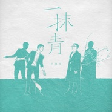
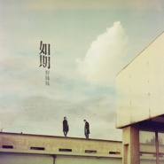
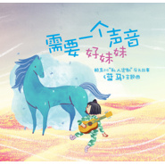
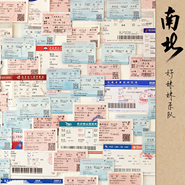
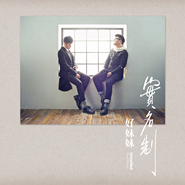
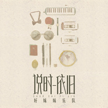
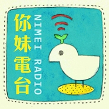
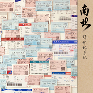
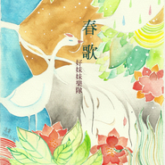

好妹妹
============================

|  |  |
| :--: | :-- |
| [ 好妹妹](https://i.xiami.com/haomeimei) | **播放数**: 331397825 **粉丝数**: 283631 **评论数**: 3323 **地区**: China 中国大陆 **风格**: 国语流行 Mandarin Pop, 民谣流行 Folk Pop, 城市民谣 Urban Folk  |

## 档案

好妹妹是由秦昊Jeff和张小厚Terry组成；  主要原创作品  《冬》、《相思赋予谁》、《关联》、《一个人的北京》、《原来那天的阳光》、《你飞到城市另一边》等    经典翻唱作品  《青城山下白素贞》《不要问我过得好不好》    工作联系： chunshenggzs@126.com

## 专辑

| 名称 | 语种 | 唱片公司 | 发行时间 | 专辑类别 | 专辑风格 |
| :--: | :-- | :-- | :-- | :-- | :-- |
| [ 漫漫人生路](./albums/5022319037.md) | 国语 | 有此山文化 | 2021年01月01日 | EP, 单曲 | 国语流行 Mandarin Pop |
| [ 粉红海洋馆](./albums/5021478118.md) | 国语 |  | 2020年09月14日 | EP, 单曲 |  |
| [ 今天我要大扫除(美的公益主题曲)](./albums/5021479059.md) | 国语 |  | 2020年07月15日 | EP, 单曲 |  |
| [ 藏在心中的英雄电影《重返618号》主题曲](./albums/5020703129.md) | 国语 | 有此山文化 | 2020年05月26日 | EP, 单曲 | 国语流行 Mandarin Pop, 电影原声 Film Score |
| [ 让我拥抱你](./albums/2108258327.md) | 国语 | 有此山文化 | 2020年03月28日 | EP, 单曲 | 国语流行 Mandarin Pop |
| [ 藏不住的微笑 (弹唱版)](./albums/2105793182.md) | 国语 | 有此山文化 | 2020年01月29日 | EP, 单曲 | 国语流行 Mandarin Pop |
| [ 一抹青](./albums/2105637013.md) | 国语 | 有此山文化 | 2019年12月27日 | EP, 单曲 | 国语流行 Mandarin Pop |
| [ 你好，生活](./albums/2105597646.md) | 国语 | 有此山文化 | 2019年12月18日 | EP, 单曲 | 国语流行 Mandarin Pop |
| [ 白云无尽时纪录片《一路有你》主题曲](./albums/2105255892.md) | 国语 | 有此山文化 | 2019年09月20日 | EP, 单曲 |  |
| [ 看云](./albums/2105160805.md) | 国语 | 有此山文化 | 2019年08月21日 | EP, 单曲 |  |
| [ 云野](./albums/2105011084.md) | 国语 | 有此山文化 | 2019年07月24日 | EP, 单曲 |  |
| [ 宅男配狗 天长地久](./albums/2104784018.md) | 国语 | 字跳网络 | 2019年04月15日 | EP, 单曲 | 国语流行 Mandarin Pop, 电影原声 Film Score |
| [ 只记今朝笑](./albums/2104427050.md) | 国语 | 有此山文化 | 2019年01月01日 | EP, 单曲 | 国语流行 Mandarin Pop |
| [ 追梦人Dream Chaser](./albums/2104113912.md) | 国语 | 有此山文化 | 2018年10月17日 | 录音室专辑 |  |
| [ 乐人·Live：好妹妹“我愿意为你轻轻歌唱”台北演唱会(live)](./albums/2103701101.md) | 国语 | 有此山文化 | 2018年05月01日 | 现场专辑 |  |
| [ 十八岁给我一个姑娘](./albums/2103634964.md) | 国语 | 尔库文化 | 2018年03月25日 | EP, 单曲 | 民谣流行 Folk Pop |
| [ 我愿意为你轻轻歌唱](./albums/2103619307.md) | 国语 | 好靓文化 | 2018年03月19日 | EP, 单曲 | 民谣流行 Folk Pop |
| [ 如期](./albums/2103502793.md) | 国语 | 春生工作室 | 2018年01月29日 | EP, 单曲 | 国语流行 Mandarin Pop |
| [ 我在未来等你](./albums/2103466492.md) | 国语 | 春生工作室 | 2018年01月03日 | EP, 单曲 | 民谣流行 Folk Pop |
| [ 新年快乐](./albums/2102976623.md) | 国语 | 春生工作室 | 2017年12月20日 | EP, 单曲 | 国语流行 Mandarin Pop |
| [ 需要一个声音](./albums/2102776276.md) | 国语 | 春生工作室 | 2017年07月03日 | EP, 单曲 | 国语流行 Mandarin Pop |
| [ 人间难得有情人](./albums/2102751509.md) | 国语 | 春生工作室 | 2017年05月22日 | EP, 单曲 | 国语流行 Mandarin Pop |
| [ 酒吞物语](./albums/2102748638.md) | 国语 | 网易游戏 | 2017年05月16日 | EP, 单曲 | 国语流行 Mandarin Pop |
| [ 南北](./albums/2108229637.md) | 其他 | 喜瑪拉雅音樂事業股份 | 2017年04月08日 | EP, 单曲 | 欧美流行 Western Pop |
| [ 实名制](./albums/2105870406.md) | 英语 | 喜瑪拉雅音樂事業股份 | 2017年04月08日 | EP, 单曲 | 欧美流行 Western Pop |
| [ 实名制Unveiled](./albums/2102731534.md) | 国语 | 春生工作室 | 2017年04月07日 | 录音室专辑 | 国语流行 Mandarin Pop |
| [ 送情郎](./albums/2102693075.md) | 国语 | 春生工作室 | 2017年02月14日 | EP, 单曲 | 民谣流行 Folk Pop |
| [ 不如听一首歌](./albums/2102674559.md) | 国语 | 春生工作室 | 2017年01月01日 | EP, 单曲 | 民谣流行 Folk Pop |
| [ 红豆词](./albums/2102659562.md) | 国语 | 发现音乐, 好靓文化 | 2016年12月05日 | EP, 单曲 | 民谣流行 Folk Pop |
| [ 多一克温暖](./albums/2102650957.md) | 国语 | 春生工作室 | 2016年11月09日 | EP, 单曲 | 民谣流行 Folk Pop |
| [ 三十八号大迪曲](./albums/2102409073.md) | 国语 | 听见时代 | 2016年10月19日 | EP, 单曲 | 国语流行 Mandarin Pop |
| [ 月](./albums/2100389568.md) | 国语 | 春生工作室 | 2016年09月13日 | EP, 单曲 | 国语流行 Mandarin Pop, 中国风 China-Wave, 民谣 Folk |
| [ 像你这样的朋友](./albums/2100350851.md) | 国语 | 春生工作室 | 2016年06月06日 | EP, 单曲 | 城市民谣 Urban Folk |
| [ 五月的你Meet in May](./albums/2100345050.md) | 国语 | 发现音乐, 好靓文化 | 2016年05月27日 | EP, 单曲 | 城市民谣 Urban Folk |
| [ 谎话情歌](./albums/2100343140.md) | 国语 | 独立发行 | 2016年05月20日 | EP, 单曲 | 城市民谣 Urban Folk |
| [ 不说再见](./albums/2100253004.md) | 国语 | 春生工作室 | 2015年12月31日 | EP, 单曲 | 国语流行 Mandarin Pop |
| [ 门动画电影《小门神》推广曲](./albums/2100245456.md) | 国语 | 春生工作室 | 2015年12月10日 | EP, 单曲 | 城市民谣 Urban Folk |
| [ 西窗Window of Memory](./albums/2100252970.md) | 国语 | 春生工作室 | 2015年12月01日 | 录音室专辑 | 城市民谣 Urban Folk, 国语流行 Mandarin Pop |
| [ 普通人](./albums/2100225758.md) | 国语 | 春生工作室 | 2015年10月22日 | EP, 单曲 | 民谣流行 Folk Pop |
| [ 归乡](./albums/2100213616.md) | 国语 | 春生工作室 | 2015年10月08日 | EP, 单曲 | 民谣流行 Folk Pop |
| [ 我也可以是流浪诗人](./albums/837441688.md) | 国语 | 春生工作室 | 2015年07月21日 | EP, 单曲 | 民谣流行 Folk Pop |
| [ 祝天下所有的情侣都是失散多年的兄妹 (2015 真·激情四射版)](./albums/123838146.md) | 国语 | 春生工作室 | 2015年02月14日 | EP, 单曲 | 国语流行 Mandarin Pop |
| [ 那年的愿望](./albums/1621411995.md) | 国语 | 春生工作室 | 2015年01月16日 | EP, 单曲 | 国语流行 Mandarin Pop |
| [ 蛇精病不会动](./albums/616553475.md) | 国语 | 春生工作室 | 2014年11月21日 | EP, 单曲 |  |
| [ 说时依旧](./albums/1810325893.md) | 国语 | 春生工作室 | 2014年09月22日 | 录音室专辑 | 国语流行 Mandarin Pop |
| [ 送你一朵山茶花Camellia for You](./albums/885964416.md) | 国语 | 春生工作室 | 2014年03月31日 | EP, 单曲 | 儿童音乐 Children's Music |
| [ 你妹电台](./albums/377420187.md) | 国语 | 春生工作室 | 2013年09月29日 | 播客 |  |
| [ 流浪春天的侧记](./albums/1180182398.md) | 国语 | 春生工作室 | 2013年09月25日 | EP, 单曲 | 民谣流行 Folk Pop |
| [ 南北](./albums/961418276.md) | 国语 | 春生工作室 | 2013年05月08日 | 录音室专辑 | 民谣流行 Folk Pop, 城市民谣 Urban Folk, 独立民谣 Indie Folk |
| [ 祝天下所有的情侣都是失散多年的兄妹](./albums/558924.md) | 国语 | 春生工作室 | 2012年11月10日 | EP, 单曲 |  |
| [ 春生Spring Time](./albums/525016.md) | 国语 | 春生工作室 | 2012年07月05日 | 录音室专辑 | 城市民谣 Urban Folk, 独立民谣 Indie Folk |
| [ 春歌 Demo选](./albums/417107.md) | 国语 | 春生工作室 | 2012年05月29日 | 精选集 |  |

## 评论

|  |  |  |  |
| :-- | :-- | :-- | :-- |
|  [虾米用户](https://emumo.xiami.com/u/317064686) 我还没想好要写什么... 2021-01-05 12:11 赞(1) 踩(0) | 
打卡
 |
|  [虾米用户](https://emumo.xiami.com/u/17176940)  2020-08-28 10:51 赞(0) 踩(0) | 
喜欢安静的听他们的歌
 |
|  [虾米用户](https://emumo.xiami.com/u/50516776) 听，那是谁的声音！ 2020-08-22 00:59 赞(0) 踩(0) | 
反正秦昊还没成名片，还是浪客时就在听他弹唱的视频了，哄哄，安利了姐姐妹妹听好妹妹，嗯，好听，很入眠，哈哈哈哈！
 |
|  [虾米用户](https://emumo.xiami.com/u/138974) 活着？ 2020-06-20 07:06 赞(0) 踩(0) | 
最近的一期播客听了开头就听不下去了 是我老了 受不了 嘎嘎闹吗    
 |
|  [虾米用户](https://emumo.xiami.com/u/340939662) 神就是爱，爱是不将肉体的... 2020-06-12 22:55 赞(0) 踩(0) | 
海的声音
 |
|  [虾米用户](https://emumo.xiami.com/u/38644191)   2020-05-26 12:22 赞(0) 踩(0) | 
谢谢好妹妹，当我决定用普通人的道德观来让自己释怀的时候，有你们帮我说出口的&amp;ldquo;祝天下所有的情侣都是失散多年的兄妹&amp;rdquo;。这么多年以来，我放不下的真的是我卑微的博爱。喜欢坦诚，虽然发现坦诚也会让自己体无完肤。没办法说出口的关心，变成了越走越远的心，还时不时回首当年。希望你们还有当年的快乐，我也有。
 |
|  [虾米用户](https://emumo.xiami.com/u/54657680) 一只努力做好自己的小虾米 2020-05-04 17:04 赞(0) 踩(0) | 
好听，舒服 
 |
|  [虾米用户](https://emumo.xiami.com/u/2796166) 最爱莫文蔚..... 2020-03-30 00:04 赞(1) 踩(0) | 
加油~~~~~
 |
|  [虾米用户](https://emumo.xiami.com/u/8034382) 一蓑烟雨任平生 2020-03-29 21:52 赞(1) 踩(0) | 
不知道为什么手机app一直闪退，不能在十周年访问下面留言。一晃听好妹妹也好多年了，已经不记得最初是谁的推荐&amp;hellip;但是记得杭州的演唱会&amp;hellip;特别感谢好妹妹的歌陪我走过了过去一段特别纠结难过的日子&amp;hellip;感谢你们非常温暖治愈的歌声
 |
|  [虾米用户](https://emumo.xiami.com/u/428970537)  2020-03-29 15:22 赞(2) 踩(0) | 
两年前很迷他们...啊好青涩啊，要害羞了！
 |
|  [虾米用户](https://emumo.xiami.com/u/441712195)  2020-03-29 14:07 赞(1) 踩(0) | 
太好听了
 |
|  [虾米用户](https://emumo.xiami.com/u/17860267)  2020-01-20 04:50 赞(0) 踩(0) | 
谢谢你们一个人的加班夜也不那么孤单
 |
|  [虾米用户](https://emumo.xiami.com/u/256520683)  2019-10-11 20:20 赞(0) 踩(0) | 
赞小伙子
 |
|  [虾米用户](https://emumo.xiami.com/u/429990242)  2019-09-21 13:00 赞(0) 踩(0) | 
你们唱的歌真好听特别是不说再见
 |
|  [虾米用户](https://emumo.xiami.com/u/429990242)  2019-09-21 12:59 赞(0) 踩(0) | 
喜欢你们
 |
|  [虾米用户](https://emumo.xiami.com/u/353944137)  2019-09-21 01:11 赞(0) 踩(0) | 
好
 |
|  [虾米用户](https://emumo.xiami.com/u/10018646) 月神侠叔叔 2019-09-01 00:37 赞(0) 踩(0) | 
好妹妹乐队什么时候改名的？现在叫好妹妹了？
 |
|  [虾米用户](https://emumo.xiami.com/u/334879317)  2019-07-31 23:48 赞(3) 踩(0) | 
这个组合名字听起来像个网站
 |
|  [虾米用户](https://emumo.xiami.com/u/268935002)  2019-07-23 13:34 赞(0) 踩(0) | 
好妹妹乐队，是一个很好的乐队！他们的风格是中国民谣。他们的歌好懂易学，易传唱，巨喜欢   
 |
|  [虾米用户](https://emumo.xiami.com/u/401646478)  2019-07-07 01:08 赞(0) 踩(0) | 
好希望他俩在一起
 |
|  [虾米用户](https://emumo.xiami.com/u/339863848)  2019-06-14 22:03 赞(0) 踩(0) | 
我只想知道今年你俩还在南京开演唱会了不！再不来我就死了！
 |
|  [虾米用户](https://emumo.xiami.com/u/140096380)  2019-05-27 11:05 赞(0) 踩(0) | 
周一解压曲
 |
|  [虾米用户](https://emumo.xiami.com/u/83960554) 95后阿姨复古抖腿趴 2019-05-18 22:27 赞(4) 踩(0) | 
应该广受gay老们的喜爱
 |
| ⇒ |  [虾米用户](https://emumo.xiami.com/u/376391800)  2020-02-12 00:16 赞(0) 踩(0) | 
调调挺好听，歌词有点gay。。。
 |
|  [虾米用户](https://emumo.xiami.com/u/338744450) 看的见我的未来 2019-05-15 21:43 赞(1) 踩(0) | 
社会青年
 |
|  [虾米用户](https://emumo.xiami.com/u/324270465) 白日放歌须纵酒 2019-05-05 19:45 赞(0) 踩(0) | 
好淫荡啊两只哥哥，我爱民谣，我爱欢乐，前些天震惊于林一峰，今天惊讶于发现妹妹——其实以前听过二位的《往事只能回味》的，欢乐过后忘了，小别胜新婚，今天的发现又惊艳了我一次
 |
|  [虾米用户](https://emumo.xiami.com/u/17820275) 朕的大清。。。 2019-04-30 15:06 赞(1) 踩(0) | 
挺好
 |
|  [虾米用户](https://emumo.xiami.com/u/9491974) 永远对自己保持真实 2019-04-29 20:46 赞(2) 踩(0) | 
哈哈哈这个介绍简直了
 |
|  [虾米用户](https://emumo.xiami.com/u/412577844) 树影下的人想睡 2019-04-25 20:43 赞(2) 踩(0) | 
这个意向人群真是够了 
 |
|  [虾米用户](https://emumo.xiami.com/u/10018646) 月神侠叔叔 2019-04-21 01:04 赞(0) 踩(0) | 
好妹妹乐队改名了？
 |
|  [虾米用户](https://emumo.xiami.com/u/7417569) 上帝是我们唯一的 神！ 2019-04-19 11:21 赞(0) 踩(0) | 
我很喜欢你们的歌，《宅男配狗，天长地久》配字见意改换为和、对都可以，用配太俗了，不文雅只是见意 
 |
|  [虾米用户](https://emumo.xiami.com/u/359888611)  2019-04-07 12:29 赞(0) 踩(0) | 
期待19的演唱会，在烟雨或月夜中的现场，哪怕有霾...心中有光
 |
|  [虾米用户](https://emumo.xiami.com/u/37706842)   2019-03-27 18:20 赞(0) 踩(0) | 
从13年开始听，最开始是青城山下白素贞，被秦老湿的嗓音和简单的弹唱所吸引，但是一直听到现在，脑子里仍能回想和哼唱的还是那一张春生，曾经写东西还将自在如风的少年入文，真的是太美的感觉。只可惜现在的专辑很难再那么情切动人了
 |
|  [虾米用户](https://emumo.xiami.com/u/420193793)  2019-03-01 21:16 赞(1) 踩(0) | 
啦啦啦，来喽。
 |
|  [虾米用户](https://emumo.xiami.com/u/42501470) supreme cool 2019-03-01 16:57 赞(0) 踩(0) | 
社会男青年 哈哈哈哈
 |
|  [虾米用户](https://emumo.xiami.com/u/312343978)  2019-01-19 21:31 赞(0) 踩(0) | 
超级好听 圈粉
 |
|  [虾米用户](https://emumo.xiami.com/u/296693830)  2019-01-12 10:55 赞(0) 踩(0) | 
希望创作出更好的作品
 |
|  [虾米用户](https://emumo.xiami.com/u/370151429)  2019-01-06 11:00 赞(0) 踩(0) | 
喜欢你们的歌，加油(ง •̀_•́)ง
 |
|  [虾米用户](https://emumo.xiami.com/u/338681671)  2018-12-15 23:29 赞(0) 踩(0) | 
我妹必火，祝新专大卖！
 |
| ⇒ |  [虾米用户](https://emumo.xiami.com/u/296693830)  2019-01-12 10:56 赞(0) 踩(0) | 
你妹的 
 |
|  [虾米用户](https://emumo.xiami.com/u/18640179)  2018-12-04 08:32 赞(1) 踩(0) | 
喜欢坐着安安静静的听好妹妹的歌~~~
 |
|  [虾米用户](https://emumo.xiami.com/u/29503833)  2018-11-13 10:39 赞(4) 踩(0) | 
这个介绍很可以笑哭 哭笑 笑出眼泪 破涕为笑 笑死 笑尿 笑cry
 |
|  [虾米用户](https://emumo.xiami.com/u/187423113) 我渺小如蜉蝣，却也是宇宙... 2018-10-27 01:32 赞(14) 踩(0) | 
好妹妹的音乐介绍为什么这么搞笑
 |
|  [虾米用户](https://emumo.xiami.com/u/403579130)  2018-10-25 21:57 赞(1) 踩(0) | 
改名了吗
 |
|  [虾米用户](https://emumo.xiami.com/u/405891645)  2018-10-25 17:46 赞(1) 踩(0) | 
喜欢就好 
 |
|  [虾米用户](https://emumo.xiami.com/u/62540836)  2018-10-12 22:40 赞(3) 踩(0) | 
看到这个乐队名字以为是那种很老派的大妈唱的歌～不小心点进来～这声音真好听 
 |
|  [虾米用户](https://emumo.xiami.com/u/39402513) 第一w首歌会是什么？ 2018-10-06 12:28 赞(1) 踩(0) | 
一部分小学生？这个简介有毒吧 
 |
|  [虾米用户](https://emumo.xiami.com/u/3291786)  2018-09-09 00:43 赞(1) 踩(0) | 
鼻音油腻的那位抢唱
 |
|  [虾米用户](https://emumo.xiami.com/u/351201421)  2018-08-26 18:45 赞(1) 踩(0) | 
两个社会青年哈哈哈
 |
|  [虾米用户](https://emumo.xiami.com/u/351201421)  2018-08-26 18:44 赞(2) 踩(0) | 
秦昊的声音好苏
 |
|  [虾米用户](https://emumo.xiami.com/u/351201421)  2018-08-26 18:44 赞(0) 踩(0) | 
喜欢
 |
|  [虾米用户](https://emumo.xiami.com/u/377366497) 当你面对生离死别，你能否... 2018-07-14 19:57 赞(0) 踩(0) | 
就爱听
 |
|  [虾米用户](https://emumo.xiami.com/u/134126396) 百年（ ）（ ） 2018-07-05 06:19 赞(3) 踩(0) | 
果然受众群体转换成无脑bo妹迷妹后，歌手创作这条路便是尽了，现在成天开演唱会也没什么好的作品大多无亮点俗套都还不如三千块制作来的质量，在转换为流行后没有更多新鲜元素加入与之前主旨不符，接的电视剧，电影原声主题曲倒是挺多，这没办法，只有赚钱这条路才是一路走到黑的
 |
| ⇒ |  [虾米用户](https://emumo.xiami.com/u/13988445) 啦啦啦啦啦 2018-08-29 11:26 赞(0) 踩(0) | 
呵呵
 |
|  [虾米用户](https://emumo.xiami.com/u/335234391)  2018-06-16 23:16 赞(3) 踩(0) | 
今天去看了你们的演唱会，等你们四十岁的时候再见！加油！
 |
| ⇒ |  [虾米用户](https://emumo.xiami.com/u/314101629)  2018-06-25 17:43 赞(0) 踩(0) | 
我也去了 
 |
|  [虾米用户](https://emumo.xiami.com/u/356531433)  2018-06-11 18:51 赞(0) 踩(0) | 
好听
 |
|  [虾米用户](https://emumo.xiami.com/u/315104758) 我的丫头，你在哪里？ 2018-05-27 10:39 赞(0) 踩(0) | 
顶
 |
|  [虾米用户](https://emumo.xiami.com/u/98001274)  2018-05-26 22:52 赞(1) 踩(0) | 
5.27 兰州晨曦
 |
|  [虾米用户](https://emumo.xiami.com/u/48449047)  2018-05-25 09:29 赞(0) 踩(0) | 
歌手简介好有趣
 |
|  [虾米用户](https://emumo.xiami.com/u/334764133)  2018-05-20 21:28 赞(0) 踩(0) | 
票已买好616我等你
 |
| ⇒ |  [虾米用户](https://emumo.xiami.com/u/264450466) 汝. 2018-05-26 11:02 赞(0) 踩(0) | 
是在青岛莱西湿地吗
 |
|  [虾米用户](https://emumo.xiami.com/u/39426392) 虾米，我爱你 2018-05-20 17:19 赞(1) 踩(0) | 
社会男青年
 |
|  [虾米用户](https://emumo.xiami.com/u/369116935)  2018-05-19 19:06 赞(1) 踩(0) | 
加油！
 |
|  [虾米用户](https://emumo.xiami.com/u/369139761)  2018-05-19 13:54 赞(0) 踩(0) | 
好听
 |
|  [虾米用户](https://emumo.xiami.com/u/263369578) 呵呵 2018-05-07 10:49 赞(0) 踩(0) | 
厉害了，不错
 |
|  [虾米用户](https://emumo.xiami.com/u/262237613) ll 2018-05-02 23:39 赞(2) 踩(0) | 
希望秦昊小厚能开开心心，做喜欢做的事！好妹妹加油！！妹友陪着你们 
 |
| ⇒ |  [虾米用户](https://emumo.xiami.com/u/365264742)  2018-05-12 01:38 赞(0) 踩(0) | 
是
 |
|  [虾米用户](https://emumo.xiami.com/u/24367584) 孤独是礼物 2018-05-02 00:45 赞(3) 踩(0) | 
你们有听到我在五台山台下大喊的我爱你吗！！！！
 |
| ⇒ |  [虾米用户](https://emumo.xiami.com/u/336898489)  2018-05-06 18:31 赞(0) 踩(0) | 
没有
 |
|  [虾米用户](https://emumo.xiami.com/u/35167460) La vie elle ... 2018-04-30 07:40 赞(1) 踩(0) | 
明晚见，wink
 |
|  [虾米用户](https://emumo.xiami.com/u/853523)  2018-04-28 15:20 赞(4) 踩(0) | 
实名制开始，每首歌都听不下去
 |
| ⇒ |  [虾米用户](https://emumo.xiami.com/u/262237613) ll 2019-07-07 23:22 赞(0) 踩(0) | 
2018年发的《自在天》、《如期》也好听啊 
 |
|  [虾米用户](https://emumo.xiami.com/u/312193029)  2018-04-23 11:25 赞(0) 踩(0) | 
演唱会票好贵啊
 |
| ⇒ |  [虾米用户](https://emumo.xiami.com/u/336898489)  2018-05-06 18:32 赞(0) 踩(0) | 
那么便宜  还贵？
 |
|  [虾米用户](https://emumo.xiami.com/u/2412328) 听歌已成生活的一部分。 2018-04-12 19:31 赞(2) 踩(0) | 
差点因为组合名字错失这么美的音乐
 |
|  [虾米用户](https://emumo.xiami.com/u/284611099)  2018-04-10 14:58 赞(1) 踩(0) | 
五一南京见啊
 |
|  [虾米用户](https://emumo.xiami.com/u/354875243)  2018-04-08 03:16 赞(0) 踩(0) | 
南无阿弥陀佛
 |
|  [虾米用户](https://emumo.xiami.com/u/413990) 恶人勿近～ 2018-03-29 12:47 赞(1) 踩(0) | 
以后你两就是我妹妹~~~~替换她们俩！
 |
|  [虾米用户](https://emumo.xiami.com/u/293692544) 你敢给我说话吗？我咬你 2018-03-17 22:27 赞(2) 踩(0) | 
好听
 |
|  [虾米用户](https://emumo.xiami.com/u/339801727) 与虾米分离在即，纵有千般... 2018-03-06 15:51 赞(1) 踩(0) | 
加油！！！
 |
|  [虾米用户](https://emumo.xiami.com/u/352521225)  2018-03-05 10:49 赞(1) 踩(0) | 
听着旋律有亲切感，朗朗上口。这个旋律是否可以加入古诗词，用来传唱。
 |
|  [虾米用户](https://emumo.xiami.com/u/7946861) 我还没想好要写什么... 2018-03-01 22:52 赞(1) 踩(0) | 
有木有好妹妹粉丝群呀
 |
|  [虾米用户](https://emumo.xiami.com/u/352313366)  2018-03-01 18:58 赞(2) 踩(0) | 
自在如风
 |
|  [虾米用户](https://emumo.xiami.com/u/3855578) 宜有千万 2018-02-24 22:15 赞(1) 踩(0) | 
好听
 |
|  [虾米用户](https://emumo.xiami.com/u/351775669) –“你说，如果我怕黑”–... 2018-02-22 12:57 赞(2) 踩(0) | 
我喜欢浪客秦昊 
 |
| ⇒ |  [虾米用户](https://emumo.xiami.com/u/7594713) trust no one 2018-03-16 20:04 赞(0) 踩(0) | 
毕竟帅逼秦
 |
|  [虾米用户](https://emumo.xiami.com/u/16006374)  2018-02-19 22:34 赞(2) 踩(0) | 
歌也变了，脸也变了&amp;hellip;
 |
|  [虾米用户](https://emumo.xiami.com/u/347891259)  2018-02-06 09:03 赞(1) 踩(0) | 
我们五月一日南京见，五月二十六日苏州见
 |
|  [虾米用户](https://emumo.xiami.com/u/321725735)  2018-02-04 19:59 赞(1) 踩(0) | 
全国巡回。西安呢？
 |
|  [虾米用户](https://emumo.xiami.com/u/269916653) 如果命运不宠你，请你别伤... 2018-02-04 09:15 赞(1) 踩(0) | 
好听
 |
|  [虾米用户](https://emumo.xiami.com/u/46347355)  2018-02-01 07:41 赞(1) 踩(0) | 
听了好妹妹，缓慢了心的跳动，飞快了念的汹涌。 
 |
|  [虾米用户](https://emumo.xiami.com/u/42633673)   2018-01-28 22:51 赞(4) 踩(0) | 
今年要听一次好妹妹的现场
 |
|  [虾米用户](https://emumo.xiami.com/u/85568296) 只有阳光而无阴影 只有欢... 2018-01-22 12:00 赞(1) 踩(0) | 
好妹妹呀
 |
|  [虾米用户](https://emumo.xiami.com/u/51804662) 认真听歌 2018-01-19 00:39 赞(4) 踩(0) | 
每次看到介绍那里说小琴和小厚是两个社会男青年，脸上就溢出老妈妈的微笑
 |
|  [虾米用户](https://emumo.xiami.com/u/75886462)  2018-01-10 20:07 赞(1) 踩(0) | 
。。。。。。。
 |
|  [虾米用户](https://emumo.xiami.com/u/328516174)  2018-01-05 11:04 赞(1) 踩(0) | 
是你曹霖霖让我听他们的歌，现在不在我身边了
 |
|  [虾米用户](https://emumo.xiami.com/u/265330570)  2018-01-04 13:06 赞(2) 踩(0) | 
什么时候才能找回13年14年的好妹妹
 |
|  [虾米用户](https://emumo.xiami.com/u/8533793) 不能企及所爱。反正也听不... 2017-12-26 02:36 赞(4) 踩(0) | 
喜欢的女孩子喜欢听你们的歌，其实我以前真的不听好妹妹，结果今天听着这么好听 
 |
| ⇒ |  [虾米用户](https://emumo.xiami.com/u/14324120)  2018-01-14 12:53 赞(0) 踩(0) | 
一样
 |
| ⇒ |  [虾米用户](https://emumo.xiami.com/u/8533793) 不能企及所爱。反正也听不... 2018-02-04 00:12 赞(0) 踩(0) | 
<q><b>Aeolus丶说：</b></q>
 |
|  [虾米用户](https://emumo.xiami.com/u/340731184) Cccccc 2017-12-22 09:51 赞(2) 踩(0) | 
666
 |
|  [虾米用户](https://emumo.xiami.com/u/19613992)  2017-12-18 22:49 赞(4) 踩(0) | 
绿野近距离看到好妹妹了！好激动！用手机拍了他们好多的照片视频，哈哈！
 |
|  [虾米用户](https://emumo.xiami.com/u/266681793)  2017-12-17 20:49 赞(13) 踩(0) | 
超喜欢【好妹妹乐队】，声音超级温柔，歌特别适合当睡前音乐。超级喜欢他们的这种风格。 
 |
|  [虾米用户](https://emumo.xiami.com/u/301748105) 天使消失的世界，恶魔存在... 2017-12-13 20:17 赞(0) 踩(0) | 
好棒     
 |
|  [虾米用户](https://emumo.xiami.com/u/3230266)  2017-12-12 14:21 赞(0) 踩(0) | 
今天忽然想起来翻唱的生别离，结果找半天找不到，是我记忆错落乱了吗
 |
|  [虾米用户](https://emumo.xiami.com/u/337083153) better me 2017-12-05 22:39 赞(2) 踩(0) | 
才刚认识不久，还以为是很久以前的什么组合，谁知道还是个广受老中青喜欢的好妹妹组合   
 |
|  [虾米用户](https://emumo.xiami.com/u/125089920) 找到北方啦 2017-12-04 14:00 赞(0) 踩(0) | 

 |
|  [虾米用户](https://emumo.xiami.com/u/9738503)   2017-11-29 01:06 赞(4) 踩(0) | 
昨天回来的路上打开收音机，突然听见这样一个轻柔的男声唱这歌。第一反应过来的还是身边的妈妈，告诉我这首歌的名字，然后跟着轻轻唱起来了。当时阳光洒进车里，我安静地听着妈妈跟着这首歌唱着，然后就中毒了，回来到现在，不知不觉就哼起了这歌。。这个版本真心不错。
 |
| ⇒ |  [虾米用户](https://emumo.xiami.com/u/2572062) 你越喜爱我越可爱 2017-12-26 14:39 赞(0) 踩(0) | 
什么歌
 |
|  [虾米用户](https://emumo.xiami.com/u/331451506) 我亦只有一个一辈子。 2017-11-27 07:36 赞(0) 踩(0) | 
心情不好的时候总是会听你们的歌，听到前奏心情就好了
 |
|  [虾米用户](https://emumo.xiami.com/u/337198653)  2017-11-25 16:27 赞(0) 踩(0) | 

 |
|  [虾米用户](https://emumo.xiami.com/u/337198653)  2017-11-25 16:26 赞(0) 踩(0) | 

 |
|  [虾米用户](https://emumo.xiami.com/u/269873670) 专业金属幕墙铝单板制造商 2017-11-17 14:50 赞(0) 踩(0) | 
忆往事之好声音，补能量之好歌曲 
 |
|  [虾米用户](https://emumo.xiami.com/u/334669937) 我不知道遇见你是对是错，... 2017-11-12 20:35 赞(0) 踩(0) | 
好听 
 |
|  [虾米用户](https://emumo.xiami.com/u/2495800)  2017-10-30 22:36 赞(1) 踩(0) | 
很棒的組合團體唷!!
 |
|  [虾米用户](https://emumo.xiami.com/u/6375001)  2017-10-30 10:22 赞(92) 踩(0) | 
广受大学生朋友，中学生朋友，一部分小学生朋友，教师，教授，文化工作者，年轻女性，中年女性，中老年女性，所有男性，小白领，小金领，小蓝领，小老板，大老板，女老板，富豪等等的喜爱。介绍真详细。
 |
|  [虾米用户](https://emumo.xiami.com/u/1092922) listen... 2017-10-30 10:19 赞(0) 踩(0) | 
看到这个档案简介的时候笑屎了哈哈啊哈！真好听
 |
|  [虾米用户](https://emumo.xiami.com/u/3114567) 夜夜除非，好梦留人睡 2017-10-30 10:16 赞(4) 踩(0) | 
不会用力过猛，只有娓娓道来。君子闲闲，岁月容与，本就是中国人独有的一种生活美学，可惜大部分内地音乐把它忘掉了。难得有这样的好音乐。上天保佑他们继续从容下去。
 |
|  [虾米用户](https://emumo.xiami.com/u/2284377)  2017-10-30 10:12 赞(1) 踩(0) | 
简单的曲调，动听的嗓音，声音里充溢着情感，讲述着他们的生活，却又打动着许许多多平凡的我们，我喜欢他们这种有灵魂的歌曲。
 |
|  [虾米用户](https://emumo.xiami.com/u/2481053)  2017-10-30 10:11 赞(1) 踩(0) | 
南北没有春生来的惊艳，平淡些许，还有些苦逼感。
 |
|  [虾米用户](https://emumo.xiami.com/u/1893415)  2017-10-30 10:09 赞(0) 踩(0) | 
6.10号湿身的草莓音乐节~~你们太没节操了哈哈哈哈！
 |
|  [虾米用户](https://emumo.xiami.com/u/7275966) 好久不见 2017-10-30 10:09 赞(0) 踩(0) | 
hahaha ~
 |
|  [虾米用户](https://emumo.xiami.com/u/11709718)  2017-10-30 10:07 赞(0) 踩(0) | 
好妹妹 好妹妹 就是在这浅唱低吟的旋律中我聆听得眼眶模糊 默泣得无声无息 无论时光怎样张牙舞爪 岁月怎样死去活来 疯狂纵情的舞步 还有那飞扬的发梢 以及你那有着阳光味道的肩膀 光阴带不走这一切 因为我一生都怀念 怀揣呵护 一生都感谢你的单纯邀约如真朋友的情谊 后来的后来的都不重要 如果这是最后
 |
|  [虾米用户](https://emumo.xiami.com/u/39778147) 暂无签名~ 2017-10-30 10:04 赞(0) 踩(0) | 
小碧池明天来长沙了哈哈
 |
|  [虾米用户](https://emumo.xiami.com/u/144341146)  2017-10-30 09:56 赞(1) 踩(0) | 
怎么说呢，就是喜欢这种风格的音乐，平缓中带有一丝明媚的忧伤！
 |
|  [虾米用户](https://emumo.xiami.com/u/287693367)  2017-10-30 09:55 赞(3) 踩(0) | 
怎么没有实名制这张专辑
 |
|  [虾米用户](https://emumo.xiami.com/u/11596104) 天一*净 2017-10-30 09:50 赞(1) 踩(0) | 
窃用林夕对陈奕迅的评价“唱歌用感情，不太用技巧”，平淡如白米饭，才能就听不腻。
 |
|  [虾米用户](https://emumo.xiami.com/u/5788043) 愿无岁月可回首，那些过去... 2017-10-28 22:01 赞(0) 踩(0) | 
加油，你们可以超越SHE的 
 |
|  [虾米用户](https://emumo.xiami.com/u/54554108)  2017-10-28 00:43 赞(18) 踩(0) | 
哈哈哈哈，今天真的好想听一听“天下所有情侣都是失散多年的兄妹”，这样才能让我们这些单身狗不被虐，不过很期待你们9月12号在工人体育场的演唱会，哈哈，大爱你们两个啊…………要去的朋友可以点击这里：<a href="http://piao.hmpiaowu.com/index_show.html?id=2883&amp;referrers=index" target="_blank" rel="nofollow noreferrer noopener">http://piao.hmpiaowu.com/index_show.html?id=2883&amp;referrers=index</a>
 |
|  [虾米用户](https://emumo.xiami.com/u/38766446) 你说，我录。 2017-10-28 00:36 赞(0) 踩(0) | 
好喜欢你们唱的往事如昨^.^好好听~一个人的北京 以及 说时依旧 也超好听~
 |
|  [虾米用户](https://emumo.xiami.com/u/55076328)  2017-10-28 00:36 赞(0) 踩(0) | 
<a href="http://tieba.baidu.com/p/4015502702" target="_blank" rel="nofollow noreferrer noopener">http://tieba.baidu.com/p/4015502702</a>好妹妹微信群
 |
| ⇒ |  [虾米用户](https://emumo.xiami.com/u/355824998) 额(⊙o⊙)… 2018-04-05 12:11 赞(0) 踩(0) | 
吧我怕各
 |
|  [虾米用户](https://emumo.xiami.com/u/8232124)  2017-10-28 00:33 赞(0) 踩(0) | 
强烈推荐！！！重口味小清新
 |
|  [虾米用户](https://emumo.xiami.com/u/28578350)  2017-10-28 00:32 赞(0) 踩(0) | 
公众微信号七点半上面有好妹妹上海站的票，280元价位的80元起拍，欢迎体验！我们的公众号采用的是竞拍的模式，希望可以让用户用自己认可的价格看到心爱的演出 :)欢迎关注搜索微信号：seven30show超酷新玩法哦！！&lt;(￣︶￣)&gt;下周一拍卖就结束啦，还在苦苦找票的筒子们赶快赶快嗒！
 |
|  [虾米用户](https://emumo.xiami.com/u/1862177)   2017-10-28 00:31 赞(1) 踩(0) | 
和菜头微信推荐，过来欣赏下
 |
|  [虾米用户](https://emumo.xiami.com/u/6667459) 杂食动物 2017-10-28 00:18 赞(0) 踩(0) | 
好吧才发现最近又刚发了专辑……新砖还是挺不错的 实在很不喜欢上张EP→_→
 |
|  [虾米用户](https://emumo.xiami.com/u/21347880) 嗯 2017-10-28 00:00 赞(0) 踩(0) | 
重庆演唱会看完了。马上要离开重庆了。祝南京演唱会圆满成功!
 |
|  [虾米用户](https://emumo.xiami.com/u/774208) 我还没想好要写什么... 2017-10-27 23:54 赞(1) 踩(0) | 
好妹妹将于10月5日于上海简单生活节演出！10月4-6日 上海世博公园 简单生活节刘若英、陈绮贞、郑秀文、张震岳、徐佳莹、朴树、李荣浩、许巍、李志、老狼、窦靖童、陈粒、王若琳、赵雷、苏慧伦、陶晶莹、关淑怡、梁博、韦礼安、Faye飞、邱比、陈珊妮 feat 蔡健雅、MATZKA feat A-Lin、魏如萱 feat 马頔、杨乃文 feat 高旗、HUSH feat 阿肆、草东没有派对、万能青年旅店、逃跑计划、好妹妹、旅行团、果味VC、Hello Nico、声音玩具……众星云集！微博：@简单生活节上海 <a href="http://weibo.com/simplelifeshanghai" target="_blank" rel="nofollow noreferrer noopener">http://weibo.com/simplelifeshanghai</a>
 |
|  [虾米用户](https://emumo.xiami.com/u/24159763) 你没听过 我没停过 2017-10-27 23:44 赞(0) 踩(0) | 
好听  一直喜欢一个人的北京
 |
|  [虾米用户](https://emumo.xiami.com/u/46754644)   2017-10-27 23:43 赞(2) 踩(0) | 
我想说 我从高中就开始喜欢你们了 我现在快大三， 从春生开始就爱你们的歌无法自拔， 每天午睡一定是听着你们的歌睡着。可是你们的新专辑和旧专辑相比虽然制作精良了许多， 可是我再也喜欢不起来了， 如果想起要弹唱的歌我依然会想弹风从海面吹过来，可是 我已经拒绝听你们的新专辑了。
 |
|  [虾米用户](https://emumo.xiami.com/u/18521724) 终须会时辰到。 2017-10-27 23:43 赞(1) 踩(0) | 
哈哈哈哈热门评论两条官方回复也是日了狗
 |
|  [虾米用户](https://emumo.xiami.com/u/259719)  2017-10-27 23:34 赞(0) 踩(0) | 
擦，秦昊，你找了个好姐姐啊~~~~不仅会演戏，还会唱歌啊！！
 |
|  [虾米用户](https://emumo.xiami.com/u/10294868)  2017-10-27 23:27 赞(0) 踩(0) | 
最近刚发现的好东西，思想健康，主唱声音成熟，像一个很有经历的男人讲故事一样，很有感！
 |
|  [虾米用户](https://emumo.xiami.com/u/9080361)  2017-10-27 23:26 赞(0) 踩(0) | 
喜欢 一个人的北京 和 达不到的爱！
 |
|  [虾米用户](https://emumo.xiami.com/u/16597413) laker 2017-10-27 23:22 赞(1) 踩(0) | 
清新闷骚 哈哈
 |
|  [虾米用户](https://emumo.xiami.com/u/4174088) ._. 2017-10-27 22:58 赞(1) 踩(0) | 
总有人认为音乐人想做的别的元素就是为了迎合你们？哦，天，别把自己当成什么高端货色了。抱歉，这是爱好，是实验，是探索。和商业化有个半毛钱关系。
 |
|  [虾米用户](https://emumo.xiami.com/u/1147662)  2017-10-17 06:24 赞(0) 踩(0) | 
推荐好妹妹乐队。清新温暖的城市民谣，旋律朗朗上口，歌词真挚感人，节奏舒缓悠扬，广受大学生朋友，中学生朋友，一部分小学生朋友，教师，教授，文化工作者，年轻女性，中年女性，中老年女性，所有男性，小白领，小金领，小蓝领，小老板，大老板，女老板，富豪等等的喜爱。
 |
|  [虾米用户](https://emumo.xiami.com/u/1147662)  2017-10-17 06:24 赞(0) 踩(0) | 
清新温暖的城市民谣，旋律朗朗上口，歌词真挚感人，节奏舒缓悠扬，广受大学生朋友，中学生朋友，一部分小学生朋友，教师，教授，文化工作者，年轻女性，中年女性，中老年女性，所有男性，小白领，小金领，小蓝领，小老板，大老板，女老板，富豪等等的喜爱。
 |
|  [虾米用户](https://emumo.xiami.com/u/5005970) 爱你，爱你就爱你，爱死你... 2017-10-17 06:18 赞(1) 踩(0) | 
嗯！这个组合唱的蛮好听的，三个和声也挺好的，在着现在的浮躁社会里，多多听一听离咱们身边很近向朋友一样的歌声，不像是离我们很远的大牌歌手那么的遥不可及。一看就觉得小清新民谣音乐，现在内地的音乐娱乐圈太需要这样的好音乐了，现在看看虾友们都在听什么音乐，我看还是欧美、日韩等等，国家吧！
 |
|  [虾米用户](https://emumo.xiami.com/u/329796375)  2017-10-15 22:15 赞(0) 踩(0) | 
一定会关注你，好妹妹
 |
|  [虾米用户](https://emumo.xiami.com/u/330011975) 生亦何欢，气亦何妨。 2017-10-13 23:09 赞(0) 踩(0) | 
喜欢你们，
 |
|  [虾米用户](https://emumo.xiami.com/u/140339904)  2017-10-12 16:03 赞(0) 踩(0) | 
喜欢
 |
|  [虾米用户](https://emumo.xiami.com/u/308468438)  2017-10-11 17:16 赞(0) 踩(0) | 
一开始看到这个名字自动联想到了民歌之类的巴拉巴拉，看他们上了一个什么综艺节目之后，开始听他们的歌，每一次心烦意乱的时候听一听，就会缓和许多，希望你们多出好歌呦，加油  
 |
|  [虾米用户](https://emumo.xiami.com/u/302542499)       歌曲 心灵的... 2017-10-06 15:26 赞(0) 踩(0) | 
相思赋予谁是一场心灵的洗礼支持你们 
 |
|  [虾米用户](https://emumo.xiami.com/u/47191452) listening 2017-09-20 13:00 赞(3) 踩(0) | 
好的音乐是朝时空性的，我不会因为好妹妹的转变而厌恶他们，也不会对他们的转变做褒或贬的评价，这些都是歌手个人的选择。我会选择在一个人的北京给我最初的感动中，继续在《南北》《春生》或者其他给我感动的音乐中找到自己喜欢的那种感觉，并且一直对这支创造过如此好的音乐的乐队保持尊重.
 |
|  [虾米用户](https://emumo.xiami.com/u/96302108) 刺猬的拥抱 2017-09-19 12:24 赞(2) 踩(0) | 
喜欢他们的矫情
 |
|  [虾米用户](https://emumo.xiami.com/u/276686789) 人生是一场错过，愿你别蹉... 2017-09-14 02:00 赞(1) 踩(0) | 
张小厚长的特像我一同学
 |
|  [虾米用户](https://emumo.xiami.com/u/322531160)  2017-09-10 09:22 赞(1) 踩(0) | 
 
 |
|  [虾米用户](https://emumo.xiami.com/u/320313382)  2017-09-09 15:02 赞(4) 踩(0) | 
两个男人老狗，取个这样的名字，恶心不恶心？
 |
| ⇒ |  [虾米用户](https://emumo.xiami.com/u/244571793) 怎么会这么喜欢你呢 2017-09-15 18:10 赞(0) 踩(0) | 
那你这样评论 觉得不恶心？
 |
| ⇒ |  [虾米用户](https://emumo.xiami.com/u/322451081) 咳咳…我是…路人甲 2017-09-15 19:32 赞(0) 踩(0) | 
因为他们第一首歌叫《你到底有多少个好妹妹》
 |
| ⇒ |  [虾米用户](https://emumo.xiami.com/u/322451081) 咳咳…我是…路人甲 2017-09-15 19:32 赞(0) 踩(0) | 
我也觉得你&amp;hellip;恶心
 |
| ⇒ |  [虾米用户](https://emumo.xiami.com/u/320313382)  2017-09-24 18:59 赞(0) 踩(0) | 
<q><b>蔚迟魅蓝说：</b></q>
 |
|  [虾米用户](https://emumo.xiami.com/u/43875708)  遣词造句 穿山过水 他... 2017-08-31 15:42 赞(3) 踩(0) | 
再见了 
 |
|  [虾米用户](https://emumo.xiami.com/u/313017012)  2017-08-31 13:37 赞(10) 踩(0) | 
当时觉得两个大男人取&amp;ldquo;好妹妹&amp;rdquo;这个名字就觉得有意思，听了他们的歌以后，感觉越来越有意思
 |
|  [虾米用户](https://emumo.xiami.com/u/122454316)  2017-08-30 19:38 赞(2) 踩(0) | 
喜欢他们带给我们这种讲故事一样的歌~
 |
|  [虾米用户](https://emumo.xiami.com/u/322420245)  2017-08-30 14:31 赞(2) 踩(0) | 
单纯的喜欢
 |
|  [虾米用户](https://emumo.xiami.com/u/262946154) 做最好的自己，啦啦啦 2017-08-22 13:16 赞(22) 踩(0) | 
不知道为什么  听到你们的歌  心里好平静 刚毕业 我想赚好多好多钱 觉得不能比别人差 每天都很累 但是听到你们的歌 我觉得自己的灵魂在这一刻是放松的 我愿意停下脚步  我愿意告诉自己 我还年轻 别让金钱蒙蔽了自由的眼睛 我想放慢自己的脚步 生活还有很多乐趣 我是风中自由的少年，我是这个喧嚣的城市的一个浪漫的诗人 我会告诉自己 只要风中自己不收敛翅膀 我就一定可以在稳稳的飞翔 。
 |
|  [虾米用户](https://emumo.xiami.com/u/318552500) 在这个角落，安安静静的听... 2017-08-22 05:40 赞(1) 踩(0) | 
这么年轻的乐队啊，大赞！收藏
 |
|  [虾米用户](https://emumo.xiami.com/u/48870746) 看烟云变化，体多味人生 2017-08-20 15:15 赞(1) 踩(0) | 
喜欢你们的声音！大爱！支持！
 |
|  [虾米用户](https://emumo.xiami.com/u/276988187)  2017-08-19 16:00 赞(0) 踩(0) | 
  
 |
|  [虾米用户](https://emumo.xiami.com/u/313642867) 这家伙很聪明什么也没留下... 2017-08-18 23:55 赞(0) 踩(0) | 
一个故事一首歌
 |
|  [虾米用户](https://emumo.xiami.com/u/318418981) 我也可以是流浪的诗人 2017-08-18 14:16 赞(1) 踩(0) | 
好妹妹我是你们的好姐姐，会一直支持你们的
 |
|  [虾米用户](https://emumo.xiami.com/u/318676771)  2017-08-18 12:33 赞(0) 踩(0) | 
好听
 |
|  [虾米用户](https://emumo.xiami.com/u/260025668) You don’t ch... 2017-08-13 15:03 赞(0) 踩(0) | 
稀饭
 |
|  [虾米用户](https://emumo.xiami.com/u/318633700)  2017-08-11 10:10 赞(0) 踩(0) | 
还行
 |
|  [虾米用户](https://emumo.xiami.com/u/318633700)  2017-08-11 10:08 赞(0) 踩(0) | 
三级
 |
|  [虾米用户](https://emumo.xiami.com/u/48675559)  2017-08-03 20:23 赞(2) 踩(0) | 
民谣里唯一能让我心静的
 |
|  [虾米用户](https://emumo.xiami.com/u/285435675)  2017-08-02 17:09 赞(0) 踩(0) | 
续朴树、许巍之后喜欢的原创歌手（乐队）
 |
|  [虾米用户](https://emumo.xiami.com/u/258498787)  2017-07-30 21:41 赞(0) 踩(0) | 
上次在金曲奖上唱的是哪两首歌，求告
 |
| ⇒ |  [虾米用户](https://emumo.xiami.com/u/262237613) ll 2017-07-31 01:40 赞(0) 踩(0) | 
我们去过许多地方，一个人的北京
 |
|  [虾米用户](https://emumo.xiami.com/u/315372846) 秦昊的小迷妹 2017-07-27 22:09 赞(0) 踩(0) | 
表白秦昊        爱你哦 
 |
|  [虾米用户](https://emumo.xiami.com/u/315367990)  2017-07-27 15:51 赞(0) 踩(0) | 
小哥哥们唱歌很治愈啊
 |
|  [虾米用户](https://emumo.xiami.com/u/216817762) 一生和你相依 2017-07-26 22:18 赞(0) 踩(0) | 
好浪
 |
|  [虾米用户](https://emumo.xiami.com/u/294622110)  2017-07-26 15:18 赞(0) 踩(0) | 
唱歌好好听  
 |
|  [虾米用户](https://emumo.xiami.com/u/125011556)  2017-07-25 17:53 赞(0) 踩(0) | 
怎么他们唱歌都是一个调调？
 |
|  [虾米用户](https://emumo.xiami.com/u/2992524)  2017-07-23 16:44 赞(0) 踩(0) | 
看了我想和你唱小厚同学怒刷的存在感来的，不错不错！
 |
|  [虾米用户](https://emumo.xiami.com/u/210743798) 纵情山水间，乐影伴棋行…... 2017-07-21 15:17 赞(0) 踩(0) | 
小小年纪，将一首经典老歌赋予全新的意境，还诠释的这么好，难能可贵！比赞！
 |
|  [虾米用户](https://emumo.xiami.com/u/50291675) 唯有爱与美食不可辜负！ 2017-07-20 21:38 赞(1) 踩(0) | 
2位小哥都很有才啊！！ 支持支持！ 
 |
|  [虾米用户](https://emumo.xiami.com/u/313664366)  2017-07-20 18:28 赞(0) 踩(0) | 

 |
|  [虾米用户](https://emumo.xiami.com/u/246666274)  2017-07-19 09:35 赞(3) 踩(0) | 
就喜欢这个调调 
 |
|  [虾米用户](https://emumo.xiami.com/u/262237613) ll 2017-07-17 17:22 赞(0) 踩(0) | 
好吧，你们不喜欢可以说出来。看到越有人黑好妹妹我越喜欢他们的  
 |
|  [虾米用户](https://emumo.xiami.com/u/285474694)   2017-07-16 17:45 赞(0) 踩(0) | 
明日之子毁了装13的你们
 |
|  [虾米用户](https://emumo.xiami.com/u/286673205)  2017-07-14 17:26 赞(2) 踩(0) | 
内容已删除
 |
| ⇒ |  [虾米用户](https://emumo.xiami.com/u/313235417)  2017-07-18 22:18 赞(0) 踩(0) | 
不喜欢可以不听，没人让你听，但，别骂人好吗，又不是唱给你听的！！！
 |
|  [虾米用户](https://emumo.xiami.com/u/302655650) 快乐是每个人的幸福 2017-07-13 10:35 赞(1) 踩(0) | 
好听
 |
|  [虾米用户](https://emumo.xiami.com/u/305766505) 这是很长，很好的一生 2017-07-11 21:57 赞(0) 踩(0) | 
表白好妹妹
 |
|  [虾米用户](https://emumo.xiami.com/u/43004224)  2017-07-11 17:40 赞(0) 踩(0) | 
老王来报道了，
 |
|  [虾米用户](https://emumo.xiami.com/u/43004224)  2017-07-11 17:39 赞(0) 踩(0) | 
什么样的他们都喜欢
 |
|  [虾米用户](https://emumo.xiami.com/u/13166491) 这家伙很聪明什么也没留下... 2017-07-09 18:48 赞(2) 踩(0) | 
歌很舒服 真实
 |
|  [虾米用户](https://emumo.xiami.com/u/5700350)  2017-07-08 22:07 赞(4) 踩(0) | 
昨天闺密还和我说她坐火车听到了一个人的北京。我会说高二时我和我闺密总唱风从海面吹过来嘛(&amp;sigma;&amp;prime;▽‵)&amp;prime;▽‵)&amp;sigma;，那个时候你们还不红，说出去没人知道你们，下载你们的歌也是不要钱的。那时候看你们唱歌做电台真的是发自内心地热爱很快乐。现在你们那么红，唱了好多主题曲，开了好多演唱会，被越来越多的人喜欢。我有点感觉像是自己珍爱的宝贝被别人抢走了一样。但我能怎么办呢(๑&amp;bull; . &amp;bull;๑)希望你们可以不忘初心，还是纯粹的自在如风的少年ヽ(*&amp;acute;з｀*)ﾉ
 |
|  [虾米用户](https://emumo.xiami.com/u/245329800) jonghyun.948 2017-07-04 23:52 赞(1) 踩(0) | 
從我想和你唱的節目中認識到你們 不過就是好奇了 為什麼要叫好妹妹？
 |
| ⇒ |  [虾米用户](https://emumo.xiami.com/u/262237613) ll 2017-07-05 00:12 赞(0) 踩(0) | 
很多人都好奇为什么两个男生的乐队会取名叫&amp;ldquo;好妹妹&amp;rdquo;，这源自2010年4月在无锡一起弹琴唱歌玩的时候随便翻到一首孟庭苇的&amp;ldquo;你究竟有几个好妹妹&amp;rdquo;，唱完之后两人觉得很有趣，可以组一个乐队玩玩，于是干脆就叫&amp;ldquo;好妹妹乐队&amp;rdquo;了。
 |
|  [虾米用户](https://emumo.xiami.com/u/49978901) 一个人淋雨forever 2017-07-04 01:12 赞(43) 踩(0) | 
没有人觉得又作又矫情吗
 |
| ⇒ |  [虾米用户](https://emumo.xiami.com/u/251953152) 不寿。 2017-07-17 10:16 赞(0) 踩(0) | 
你别听不就行了？？
 |
| ⇒ |  [虾米用户](https://emumo.xiami.com/u/251953152) 不寿。 2017-08-04 10:54 赞(0) 踩(0) | 
<q><b>说：</b></q>
 |
| ⇒ |  [虾米用户](https://emumo.xiami.com/u/318696046)  2017-08-11 15:55 赞(0) 踩(0) | 
没有
 |
| ⇒ |  [虾米用户](https://emumo.xiami.com/u/278990763)  2017-08-16 12:09 赞(0) 踩(0) | 
民谣大都是这样
 |
| ⇒ |  [虾米用户](https://emumo.xiami.com/u/314251460)  2017-08-17 11:55 赞(0) 踩(0) | 
圣女
 |
| ⇒ |  [虾米用户](https://emumo.xiami.com/u/94579728)   2017-10-01 02:05 赞(0) 踩(0) | 
没有
 |
| ⇒ |  [虾米用户](https://emumo.xiami.com/u/321558782)  2017-10-06 19:37 赞(0) 踩(0) | 
<q><b>K说：</b></q>
 |
| ⇒ |  [虾米用户](https://emumo.xiami.com/u/184627169) 哇我10后 2017-10-14 21:33 赞(0) 踩(0) | 
那你觉得歌好不好听
 |
| ⇒ |  [虾米用户](https://emumo.xiami.com/u/3289990) 谁便听 2017-10-15 01:58 赞(0) 踩(0) | 
浑身起鸡皮疙瘩。。。 有点恶心。。。
 |
| ⇒ |  [虾米用户](https://emumo.xiami.com/u/71422602) 是我为落叶而飘落。 2018-01-17 21:38 赞(0) 踩(0) | 
没有
 |
| ⇒ |  [虾米用户](https://emumo.xiami.com/u/266208988)  2018-03-08 00:05 赞(0) 踩(0) | 
没有
 |
| ⇒ |  [虾米用户](https://emumo.xiami.com/u/333314808)  2018-05-02 14:21 赞(0) 踩(0) | 
没有
 |
| ⇒ |  [虾米用户](https://emumo.xiami.com/u/255409689) 全力以赴，你会很酷✌ 2019-05-16 23:14 赞(0) 踩(0) | 
没有，谢谢
 |
| ⇒ |  [虾米用户](https://emumo.xiami.com/u/89032542)   2020-04-16 19:00 赞(0) 踩(0) | 
没错，同感
 |
| ⇒ |  [虾米用户](https://emumo.xiami.com/u/304160921)  2020-07-30 17:26 赞(0) 踩(0) | 
何出此言？
 |
|  [虾米用户](https://emumo.xiami.com/u/264733853)  2017-07-03 10:18 赞(0) 踩(0) | 
前女友最喜欢的乐队
 |
|  [虾米用户](https://emumo.xiami.com/u/97483200) 我还没想好要写什么... 2017-07-02 22:20 赞(4) 踩(0) | 
这个名字取的&amp;hellip;&amp;hellip;差点因为一个名字错过一个乐队
 |
|  [虾米用户](https://emumo.xiami.com/u/301116663)  2017-07-02 20:50 赞(1) 踩(0) | 
歌听着很舒服，很安静 
 |
|  [虾米用户](https://emumo.xiami.com/u/530490) 音乐不说谎。 2017-06-30 16:15 赞(0) 踩(0) | 
嗓音好爷们，哦哦哦哦哦，晕倒。。。
 |
|  [虾米用户](https://emumo.xiami.com/u/267842284)  2017-06-30 13:08 赞(0) 踩(0) | 
新歌的mv比较少啊，建议多多益善啊。
 |
|  [虾米用户](https://emumo.xiami.com/u/307596667)  2017-06-26 13:19 赞(0) 踩(0) | 
第一次听你的歌，感觉很舒服，很喜欢。
 |
|  [虾米用户](https://emumo.xiami.com/u/304136220) 张学友 2017-06-23 21:18 赞(0) 踩(0) | 
旋律 歌词 都喜欢
 |
|  [虾米用户](https://emumo.xiami.com/u/9063465)  2017-06-17 09:00 赞(0) 踩(0) | 
喜欢你们，听你们的歌觉得自己年轻了，哈哈哈
 |
|  [虾米用户](https://emumo.xiami.com/u/273422275)  2017-06-16 20:04 赞(1) 踩(0) | 
好妹妹
 |
|  [虾米用户](https://emumo.xiami.com/u/304111281)  2017-06-14 10:20 赞(0) 踩(0) | 
其实这张专辑我有点不太懂 @好妹妹乐队
 |
|  [虾米用户](https://emumo.xiami.com/u/37931110)  2017-06-11 09:21 赞(9) 踩(0) | 
我听了深圳演唱会，好赞，表白    
 |
| ⇒ |  [虾米用户](https://emumo.xiami.com/u/88339520)   2017-06-12 00:21 赞(0) 踩(0) | 
我也去了  
 |
|  [虾米用户](https://emumo.xiami.com/u/1173512)  2017-06-11 08:14 赞(1) 踩(0) | 
城市民谣
 |
|  [虾米用户](https://emumo.xiami.com/u/302851223)  2017-06-08 22:55 赞(3) 踩(0) | 
我反而觉得很有特色这个队名
 |
|  [虾米用户](https://emumo.xiami.com/u/194841008)   Kissing th... 2017-06-07 14:35 赞(0) 踩(0) | 
为什么要叫这个名字！！不好听
 |
|  [虾米用户](https://emumo.xiami.com/u/301919532)  2017-06-04 23:14 赞(0) 踩(0) | 
没有音乐的人生是残缺的
 |
|  [虾米用户](https://emumo.xiami.com/u/1610240) 听歌是一件很开心的事 2017-05-30 16:48 赞(3) 踩(0) | 
两个大男人起&amp;ldquo;好妹妹乐队&amp;rdquo; ，够骚 
 |
|  [虾米用户](https://emumo.xiami.com/u/87169304) 这个人有点奇怪，什么都没... 2017-05-27 10:28 赞(1) 踩(0) | 
哎嘿，第二条的赞是1314哎
 |
| ⇒ |  [虾米用户](https://emumo.xiami.com/u/119840674) 南无阿弥陀佛 2017-05-29 09:12 赞(0) 踩(0) | 
我把它变成15了
 |
| ⇒ |  [虾米用户](https://emumo.xiami.com/u/87169304) 这个人有点奇怪，什么都没... 2017-05-29 12:26 赞(0) 踩(0) | 
<q><b>烟花三月说：</b></q>
 |
| ⇒ |  [虾米用户](https://emumo.xiami.com/u/119840674) 南无阿弥陀佛 2017-06-02 20:07 赞(0) 踩(0) | 
<q><b>吞取一切说：</b></q>
 |
|  [虾米用户](https://emumo.xiami.com/u/899001)  2017-05-25 12:44 赞(0) 踩(0) | 
听不了
 |
|  [虾米用户](https://emumo.xiami.com/u/6408207)  2017-05-25 00:19 赞(2) 踩(0) | 
这俩真是母猪高产的妇女之友，出片太快 
 |
|  [虾米用户](https://emumo.xiami.com/u/37900368) 花心的塔少女 2017-05-24 21:45 赞(2) 踩(0) | 
&amp;ldquo;广受大学生朋友，中学生朋友，一部分小学生朋友，教师，教授，文化工作者，年轻女性，中年女性，中老年女性，所有男性，小白领，小金领，小蓝领，小老板，大老板，女老板，富豪等等的喜爱。&amp;rdquo;？？？？  
 |
|  [虾米用户](https://emumo.xiami.com/u/297560213)  2017-05-24 13:06 赞(0) 踩(0) | 
好色
 |
|  [虾米用户](https://emumo.xiami.com/u/37117375)  2017-05-19 19:23 赞(0) 踩(0) | 
安逸
 |
|  [虾米用户](https://emumo.xiami.com/u/101793252)   2017-05-17 11:08 赞(0) 踩(0) | 
男声就控你们俩的
 |
|  [虾米用户](https://emumo.xiami.com/u/262237613) ll 2017-05-16 16:24 赞(2) 踩(0) | 
爱你们。希望你们越来越好
 |
|  [虾米用户](https://emumo.xiami.com/u/180487432)  2017-05-13 20:17 赞(0) 踩(0) | 
意淫好妹妹 
 |
|  [虾米用户](https://emumo.xiami.com/u/245315787)  2017-05-11 13:47 赞(1) 踩(0) | 
很柔软的声音。很喜欢！
 |
|  [虾米用户](https://emumo.xiami.com/u/41317710)  2017-05-09 21:20 赞(1) 踩(0) | 
很爱很舒服的声音
 |
|  [虾米用户](https://emumo.xiami.com/u/261986545)  2017-05-07 18:20 赞(4) 踩(0) | 
张小厚，你咋越来越帅了
 |
|  [虾米用户](https://emumo.xiami.com/u/280476814)   2017-05-07 06:23 赞(3) 踩(0) | 
换个名字肯定有好多人喜欢
 |
| ⇒ |  [虾米用户](https://emumo.xiami.com/u/26997049)  2017-05-22 08:12 赞(0) 踩(0) | 
∵rp::&amp;amp;
 |
|  [虾米用户](https://emumo.xiami.com/u/293753728) 心情好 ，因为有你在我身... 2017-05-05 08:16 赞(0) 踩(0) | 
666666666 
 |
| ⇒ |  [虾米用户](https://emumo.xiami.com/u/26997049)  2017-05-22 08:11 赞(0) 踩(0) | 
::、-
 |
|  [虾米用户](https://emumo.xiami.com/u/231092028)   2017-05-05 00:59 赞(4) 踩(0) | 
换个名字肯定火
 |
|  [虾米用户](https://emumo.xiami.com/u/293692109)  2017-05-04 05:52 赞(0) 踩(0) | 
一如既往的支持！ 
 |
| ⇒ |  [虾米用户](https://emumo.xiami.com/u/26997049)  2017-05-22 08:12 赞(0) 踩(0) | 
:一
 |
|  [虾米用户](https://emumo.xiami.com/u/245942574)   2017-04-30 06:28 赞(0) 踩(0) | 
非常好听
 |
|  [虾米用户](https://emumo.xiami.com/u/292235400)  2017-04-29 10:31 赞(0) 踩(0) | 
棒棒哒
 |
|  [虾米用户](https://emumo.xiami.com/u/291847097)  2017-04-27 18:56 赞(0) 踩(0) | 
还好吗？
 |
|  [虾米用户](https://emumo.xiami.com/u/287580929)  2017-04-27 11:47 赞(0) 踩(0) | 
轻轻柔柔 
 |
| ⇒ |  [虾米用户](https://emumo.xiami.com/u/26997049)  2017-05-22 08:08 赞(0) 踩(0) | 
.;∵
 |
|  [虾米用户](https://emumo.xiami.com/u/268681867)  2017-04-25 09:39 赞(0) 踩(0) | 
rrrrr
 |
|  [虾米用户](https://emumo.xiami.com/u/290889568)   2017-04-23 16:40 赞(0) 踩(0) | 
无言里还是很美的
 |
|  [虾米用户](https://emumo.xiami.com/u/285907609)  2017-04-23 11:41 赞(2) 踩(0) | 
爱你们！
 |
|  [虾米用户](https://emumo.xiami.com/u/187854405) 想要你长久的真心 如果不... 2017-04-22 21:38 赞(1) 踩(0) | 
五月橘子洲见
 |
| ⇒ |  [虾米用户](https://emumo.xiami.com/u/26997049)  2017-05-22 08:09 赞(0) 踩(0) | 
/&amp;lsquo;
 |
|  [虾米用户](https://emumo.xiami.com/u/284320800)  2017-04-22 21:08 赞(0) 踩(0) | 
哌嗪
 |
|  [虾米用户](https://emumo.xiami.com/u/288342882)  2017-04-22 06:31 赞(0) 踩(0) | 
贼好
 |
|  [虾米用户](https://emumo.xiami.com/u/141654642) 成全别人，恶心自己 2017-04-21 12:19 赞(1) 踩(0) | 
搞艺术的文艺男青年，有多少是为了搞姑娘
 |
| ⇒ |  [虾米用户](https://emumo.xiami.com/u/41317710)  2017-05-09 21:20 赞(0) 踩(0) | 
他们不会搞姑娘哒 
 |
|  [虾米用户](https://emumo.xiami.com/u/282864)  2017-04-21 01:19 赞(1) 踩(0) | 
好妹妹，真的好
 |
|  [虾米用户](https://emumo.xiami.com/u/273575750) ⌚ 2017-04-18 14:11 赞(2) 踩(0) | 
中了好妹妹的毒 
 |
|  [虾米用户](https://emumo.xiami.com/u/191836704) 带你走过最难忘的旅行 留... 2017-04-16 21:30 赞(0) 踩(0) | 
我可是你手中那一朵鲜花❤
 |
|  [虾米用户](https://emumo.xiami.com/u/288693637) 爱音乐，一起走。 2017-04-16 18:26 赞(1) 踩(0) | 
非常喜欢好妹妹乐队啊，
 |
|  [虾米用户](https://emumo.xiami.com/u/262821469)  2017-04-15 21:54 赞(0) 踩(0) | 
喜欢
 |
|  [虾米用户](https://emumo.xiami.com/u/288873316)  2017-04-15 14:55 赞(0) 踩(0) | 
喜欢
 |
|  [虾米用户](https://emumo.xiami.com/u/24156318)  2017-04-13 16:10 赞(1) 踩(0) | 
曲风很特别
 |
|  [虾米用户](https://emumo.xiami.com/u/287916461)  2017-04-12 22:34 赞(0) 踩(0) | 
支持^O^
 |
| ⇒ |  [虾米用户](https://emumo.xiami.com/u/26997049)  2017-05-22 08:09 赞(0) 踩(0) | 
∵丶
 |
|  [虾米用户](https://emumo.xiami.com/u/287011470)  2017-04-11 02:40 赞(0) 踩(0) | 
不用谢支持你加油哦  
 |
|  [虾米用户](https://emumo.xiami.com/u/7477638)  2017-04-10 14:23 赞(0) 踩(0) | 
其实在好妹妹乐队的页面我更喜欢看相似艺人一栏。
 |
|  [虾米用户](https://emumo.xiami.com/u/104224890) Only one 2017-04-09 12:36 赞(1) 踩(0) | 
实名制还不上架？我都等好识别了。
 |
|  [虾米用户](https://emumo.xiami.com/u/19861496) 音乐带你走进另一个世界 2017-04-07 21:43 赞(4) 踩(0) | 
虾米快上架《实名制》噻 
 |
| ⇒ |  [虾米用户](https://emumo.xiami.com/u/26997049)  2017-05-22 08:09 赞(0) 踩(0) | 
\了.-∵
 |
|  [虾米用户](https://emumo.xiami.com/u/276689802)  2017-04-07 14:08 赞(0) 踩(0) | 
好听，很喜欢
 |
|  [虾米用户](https://emumo.xiami.com/u/42850129)   2017-04-06 21:22 赞(1) 踩(0) | 
6月10日自在如风深圳演唱会等你们
 |
|  [虾米用户](https://emumo.xiami.com/u/286569280)  2017-04-06 18:22 赞(0) 踩(0) | 
真好！
 |
| ⇒ |  [虾米用户](https://emumo.xiami.com/u/284320800)  2017-04-09 22:28 赞(0) 踩(0) | 
对呀！
 |
|  [虾米用户](https://emumo.xiami.com/u/257815946)  2017-04-06 07:41 赞(1) 踩(0) | 
大爱&amp;ldquo;好妹妹&amp;rdquo;，你俩最棒  
 |
| ⇒ |  [虾米用户](https://emumo.xiami.com/u/286569280)  2017-04-06 18:23 赞(0) 踩(0) | 
支持！
 |
|  [虾米用户](https://emumo.xiami.com/u/286452612)  2017-04-06 05:24 赞(0) 踩(0) | 
很好，我支持你们
 |
|  [虾米用户](https://emumo.xiami.com/u/39226365) X XX X XX XX... 2017-04-05 16:37 赞(2) 踩(0) | 
赵雷底下评论说碾压妹妹 &amp;hellip;&amp;hellip;吓得我赶紧过来听几嗓子&amp;hellip;说让我是个死gay 
 |
|  [虾米用户](https://emumo.xiami.com/u/125314666)  2017-04-04 11:56 赞(2) 踩(0) | 
歌曲很舒缓 让人安静下来
 |
|  [虾米用户](https://emumo.xiami.com/u/281831029)  2017-03-31 19:10 赞(2) 踩(0) | 
额额
 |
|  [虾米用户](https://emumo.xiami.com/u/35258655)   2017-03-29 12:26 赞(1) 踩(0) | 
歌很好听就是不能下载
 |
|  [虾米用户](https://emumo.xiami.com/u/17372053)  2017-03-29 11:21 赞(0) 踩(0) | 
大爱！！！
 |
|  [虾米用户](https://emumo.xiami.com/u/49979948) leslie 2017-03-29 00:10 赞(0) 踩(0) | 
往事只能回味
 |
|  [虾米用户](https://emumo.xiami.com/u/284051654)  2017-03-28 16:03 赞(1) 踩(0) | 
晚点遇见你，余生都是你
 |
|  [虾米用户](https://emumo.xiami.com/u/283916265)  2017-03-28 07:40 赞(0) 踩(0) | 
好听
 |
|  [虾米用户](https://emumo.xiami.com/u/267165971) 爱生活，爱音乐！ 2017-03-27 17:27 赞(1) 踩(0) | 
最爱《月》
 |
| ⇒ |  [虾米用户](https://emumo.xiami.com/u/11336395) 鱼唇的人类、 2017-03-30 23:28 赞(0) 踩(0) | 
谢安利！好听耶
 |
|  [虾米用户](https://emumo.xiami.com/u/187471885)  2017-03-25 22:41 赞(0) 踩(0) | 
就等四月来了没几天了~\(≧▽≦)/~啦啦啦演唱会我来啦
 |
|  [虾米用户](https://emumo.xiami.com/u/228090765)  2017-03-23 14:17 赞(0) 踩(0) | 
温和舒缓
 |
|  [虾米用户](https://emumo.xiami.com/u/282604685)  2017-03-23 07:55 赞(0) 踩(0) | 
厉厉害害
 |
|  [虾米用户](https://emumo.xiami.com/u/224013100)  2017-03-22 23:24 赞(0) 踩(0) | 
我永远都不会抛弃你，生生世世永不分离
 |
|  [虾米用户](https://emumo.xiami.com/u/244642304)  2017-03-22 17:34 赞(0) 踩(0) | 
3
 |
|  [虾米用户](https://emumo.xiami.com/u/95911618)  2017-03-22 12:13 赞(1) 踩(0) | 
新专辑实名制等的好苦啊 
 |
|  [虾米用户](https://emumo.xiami.com/u/263168314)  2017-03-22 10:36 赞(1) 踩(0) | 
全都是非常好看听的歌曲！！！   祝专辑大卖大火！！！
 |
|  [虾米用户](https://emumo.xiami.com/u/236885878)  2017-03-21 09:20 赞(0) 踩(0) | 
主唱声音似Eason但歌曲另有特色，赞 
 |
|  [虾米用户](https://emumo.xiami.com/u/275283911)  2017-03-20 22:22 赞(1) 踩(0) | 
很喜欢你们歌。加油   
 |
|  [虾米用户](https://emumo.xiami.com/u/279514074)  2017-03-17 11:45 赞(0) 踩(0) | 
不错的曲风
 |
|  [虾米用户](https://emumo.xiami.com/u/280470059) 哈哈哈哈哈哈哈！ 2017-03-17 09:03 赞(0) 踩(0) | 
你飞到城市另一边，飞了好远好远！
 |
|  [虾米用户](https://emumo.xiami.com/u/280942747) 风起时，想你…… 2017-03-17 06:42 赞(0) 踩(0) | 

 |
|  [虾米用户](https://emumo.xiami.com/u/280848267)  2017-03-16 20:03 赞(0) 踩(0) | 
   
 |
|  [虾米用户](https://emumo.xiami.com/u/52526488) 风铃的帽子丢了 2017-03-11 16:48 赞(0) 踩(0) | 
歌词很好听。真心不错
 |
|  [虾米用户](https://emumo.xiami.com/u/275558483)  2017-03-10 10:49 赞(0) 踩(0) | 
民谣入门中
 |
|  [虾米用户](https://emumo.xiami.com/u/37931110)  2017-03-09 15:55 赞(0) 踩(0) | 
吃不起卤蛋哈哈哈哈哈
 |
|  [虾米用户](https://emumo.xiami.com/u/37931110)  2017-03-09 15:54 赞(0) 踩(0) | 
舌吻，哈哈哈
 |
|  [虾米用户](https://emumo.xiami.com/u/268427289) 你快乐吗，我很快乐。 2017-03-09 10:57 赞(0) 踩(0) | 
 
 |
|  [虾米用户](https://emumo.xiami.com/u/46821627) 繁华一梦醒时空，百转千回... 2017-03-08 22:44 赞(0) 踩(0) | 
很喜欢你们！
 |
|  [虾米用户](https://emumo.xiami.com/u/49119787)   2017-03-08 15:36 赞(1) 踩(0) | 
从那个谁让我听的《相思赋予谁》开始就不可收拾，喜欢他们歌声的很让人舒服。时过境迁，那个谁不在，你们还在。
 |
|  [虾米用户](https://emumo.xiami.com/u/39577409) 热爱生活/热爱生命  去... 2017-03-08 13:48 赞(0) 踩(0) | 
说点不客气的 清平调真的无可超越
 |
| ⇒ |  [虾米用户](https://emumo.xiami.com/u/37931110)  2017-03-09 15:55 赞(0) 踩(0) | 
说点不客气的，相思赋予谁也是
 |
|  [虾米用户](https://emumo.xiami.com/u/275914208) Be all you c... 2017-03-04 20:04 赞(0) 踩(0) | 
来不及慢递的时光，我们认真的老去！你们的音乐是我在这个城市最温暖的安慰
 |
| ⇒ |  [虾米用户](https://emumo.xiami.com/u/275369653) 动之以情，晓之以理。人生... 2017-05-25 04:32 赞(0) 踩(0) | 
应该看到明天美好！不仅仅是安慰！！用音乐温暖每一天往后的余光不在寂寞 孤独 认真的过好每一天 ！！！
 |
|  [虾米用户](https://emumo.xiami.com/u/277295533)  2017-03-04 16:26 赞(0) 踩(0) | 
从第一次听到现在越来越喜欢
 |
|  [虾米用户](https://emumo.xiami.com/u/277582835)  2017-03-03 22:26 赞(0) 踩(0) | 
听着心里特别舒服
 |
|  [虾米用户](https://emumo.xiami.com/u/100240330)   2017-03-02 05:50 赞(0) 踩(0) | 
这档案....写的太(Qu)好（Ni)了(Ma)
 |
|  [虾米用户](https://emumo.xiami.com/u/48375705) 保 持 理 智 2017-02-28 23:52 赞(0) 踩(0) | 
每天一到这个时候，好妹妹就来了
 |
|  [虾米用户](https://emumo.xiami.com/u/262418850)  2017-02-19 13:38 赞(0) 踩(0) | 
加油
 |
|  [虾米用户](https://emumo.xiami.com/u/26027642)  2017-02-18 16:37 赞(0) 踩(0) | 

 |
|  [虾米用户](https://emumo.xiami.com/u/273422553)  2017-02-14 17:20 赞(0) 踩(0) | 
好听
 |
|  [虾米用户](https://emumo.xiami.com/u/111870876) 我，爱这生活。 2017-02-08 01:12 赞(0) 踩(0) | 
为啥新专辑在网易有在虾米没有？
 |
|  [虾米用户](https://emumo.xiami.com/u/104255954) Everything w... 2017-02-08 00:20 赞(0) 踩(0) | 
因为清平调喜欢好妹妹，顽固大金牛和纠结大双子的组合，最适合的好朋友组合，我和闺蜜奏是介样！PS：和秦先森生日一天哦，荣幸哈皮……
 |
|  [虾米用户](https://emumo.xiami.com/u/9606512)  2017-02-07 11:53 赞(1) 踩(0) | 
很好听
 |
|  [虾米用户](https://emumo.xiami.com/u/9606512)  2017-02-07 11:53 赞(0) 踩(0) | 
就是喜欢
 |
|  [虾米用户](https://emumo.xiami.com/u/96548006) 醒著做夢。 2017-02-06 22:34 赞(0) 踩(0) | 
下载不了好难过。
 |
|  [虾米用户](https://emumo.xiami.com/u/8769403) 偷吃月亮的人 2017-02-06 12:54 赞(0) 踩(0) | 
秦昊写首关于重庆的歌呗
 |
|  [虾米用户](https://emumo.xiami.com/u/269227363) 叫力源岛的其实都是我 2017-02-06 06:53 赞(0) 踩(0) | 
舌吻你们。
 |
|  [虾米用户](https://emumo.xiami.com/u/270598929)  2017-02-05 22:28 赞(1) 踩(0) | 
音乐，真的很不错 
 |
|  [虾米用户](https://emumo.xiami.com/u/266096697)  2017-01-22 11:02 赞(1) 踩(0) | 
缓缓叙述过往时光 句句流入心间
 |
|  [虾米用户](https://emumo.xiami.com/u/8053811) ~(≧▽≦)/~啦啦啦 2017-01-15 14:05 赞(0) 踩(0) | 
栀子花开的那两首歌怎么没有啊
 |
|  [虾米用户](https://emumo.xiami.com/u/8053811) ~(≧▽≦)/~啦啦啦 2017-01-13 21:11 赞(0) 踩(0) | 
一个字：暖
 |
|  [虾米用户](https://emumo.xiami.com/u/5046241)  2017-01-09 23:36 赞(2) 踩(0) | 
比较清静的民谣
 |
|  [虾米用户](https://emumo.xiami.com/u/116460166)  2017-01-08 20:39 赞(1) 踩(0) | 
喜欢他们歌里有一种纯静，然后是哼着小曲的感觉，只适合一个人默默的听，安静的时候，喜欢他们的和声。
 |
|  [虾米用户](https://emumo.xiami.com/u/3503314)  2017-01-05 12:14 赞(0) 踩(0) | 
也就这样吧～除了所谓的看不见摸不着的情怀，你能指望一些年轻的大陆民谣歌手唱出什么来？可没关系啊，他们要吸引的受众本来就是想拿情怀来粉饰一下自己的年轻人，也不指望这些年轻人真的能懂太多～
 |
|  [虾米用户](https://emumo.xiami.com/u/228549670) 麻烦不要杠我 浪费时间 ... 2017-01-03 20:18 赞(0) 踩(0) | 
含含糊糊的男声╮(‵▽′)╭??莫名想到浑厚两个字啊233
 |
|  [虾米用户](https://emumo.xiami.com/u/17702463) 我还没想好要写什么... 2017-01-03 14:23 赞(0) 踩(0) | 
把你拉黑了，并不是我不爱你了
 |
|  [虾米用户](https://emumo.xiami.com/u/259043742)  2017-01-02 22:20 赞(2) 踩(0) | 
柔情似水，浓浓80年代怀旧风
 |
|  [虾米用户](https://emumo.xiami.com/u/6820570) 这是语言的变调，承接醒来... 2016-12-31 09:35 赞(1) 踩(0) | 
刚刚看南北封面，发现秦昊2016年满30岁了   哦呦呦第13个十八岁生日快乐
 |
|  [虾米用户](https://emumo.xiami.com/u/257458221)  2016-12-27 22:15 赞(0) 踩(0) | 
就是喜欢
 |
|  [虾米用户](https://emumo.xiami.com/u/120008398) 没有最二，只有更二！╭(... 2016-12-27 21:23 赞(0) 踩(0) | 

 |
|  [虾米用户](https://emumo.xiami.com/u/155290722) 我们仙女哪管得了那么多啊 2016-12-25 11:01 赞(0) 踩(0) | 
档案是谁写的
 |
|  [虾米用户](https://emumo.xiami.com/u/8734466)  2016-12-13 14:45 赞(0) 踩(0) | 
怀旧的感觉，如梦回忆
 |
|  [虾米用户](https://emumo.xiami.com/u/253990811)  2016-12-12 23:01 赞(1) 踩(0) | 
好听
 |
| ⇒ |  [虾米用户](https://emumo.xiami.com/u/217888188)  2017-02-15 21:39 赞(0) 踩(0) | 
 
 |
|  [虾米用户](https://emumo.xiami.com/u/252163459)  2016-12-09 22:52 赞(0) 踩(0) | 
动听
 |
|  [虾米用户](https://emumo.xiami.com/u/5026326) 爱唱歌的孩子都是好孩子～ 2016-12-08 01:36 赞(1) 踩(0) | 
好喜欢好妹妹
 |
|  [虾米用户](https://emumo.xiami.com/u/8320385) 我还没想好要写什么... 2016-11-28 11:17 赞(3) 踩(0) | 
高产似母猪
 |
|  [虾米用户](https://emumo.xiami.com/u/229716687) 相对占有  绝对自由 2016-11-22 17:41 赞(1) 踩(0) | 
爱你们俩碧池 么么么～
 |
|  [虾米用户](https://emumo.xiami.com/u/124545302)  2016-11-22 14:26 赞(0) 踩(0) | 
朋友推荐
 |
|  [虾米用户](https://emumo.xiami.com/u/13986891) 要有多强大的内心，才能不 2016-11-22 11:47 赞(0) 踩(0) | 
上班听你妹，工作不无聊
 |
|  [虾米用户](https://emumo.xiami.com/u/242130459)   2016-11-19 10:09 赞(0) 踩(0) | 
真的很喜欢好妹妹乐队。很温暖的民谣☀️和那些妖艳货就是不一样
 |
|  [虾米用户](https://emumo.xiami.com/u/139064668)  2016-11-18 12:42 赞(0) 踩(0) | 
名字俗的乐队，但一路走来是心酸，努力换来难得的成功。
 |
|  [虾米用户](https://emumo.xiami.com/u/246893162)  2016-11-17 20:07 赞(0) 踩(0) | 
好妹妹搞怪又真心好听的歌从《祝天下所有的情侣都是失散多年的兄妹》起停不下来
 |
|  [虾米用户](https://emumo.xiami.com/u/246509067)  2016-11-16 16:01 赞(1) 踩(0) | 
喜欢秦昊的声音，温柔的感觉
 |
|  [虾米用户](https://emumo.xiami.com/u/28432466)   2016-11-16 11:05 赞(0) 踩(0) | 
超级好听！！！触及心灵。我31岁 
 |
|  [虾米用户](https://emumo.xiami.com/u/142875720)   2016-11-13 00:18 赞(2) 踩(0) | 
刚看完杭州场 爱你们！
 |
|  [虾米用户](https://emumo.xiami.com/u/35305830) 听自己喜欢的歌，做自己想... 2016-11-11 15:04 赞(0) 踩(0) | 
一直关注你们，一路走来见证你们的成长，加油↖(^ω^)↗
 |
|  [虾米用户](https://emumo.xiami.com/u/5690474)  2016-10-31 22:40 赞(0) 踩(0) | 
一杯热水
 |
|  [虾米用户](https://emumo.xiami.com/u/9992794)  2016-10-31 14:18 赞(0) 踩(0) | 
好好听
 |
|  [虾米用户](https://emumo.xiami.com/u/190753913) 不可能就不可能吧。我无所... 2016-10-30 18:30 赞(0) 踩(0) | 
就是很爱这两个大男人的歌声，才华，还有颜 只要是你俩唱的歌就都喜欢 无条件的那种 可能因为真的唱到心坎里了
 |
|  [虾米用户](https://emumo.xiami.com/u/240963677)  2016-10-28 15:32 赞(0) 踩(0) | 
好听
 |
|  [虾米用户](https://emumo.xiami.com/u/48994888) 探宇宙之奥秘，悟天地之事... 2016-10-28 14:20 赞(0) 踩(0) | 
好听
 |
|  [虾米用户](https://emumo.xiami.com/u/13690519)  2016-10-27 01:44 赞(0) 踩(0) | 
好好听啊好有怀旧的感觉又温暖。
 |
|  [虾米用户](https://emumo.xiami.com/u/55504962)   2016-10-25 15:07 赞(0) 踩(0) | 
大爱好妹妹！自从下了虾米就一直听你们的歌！
 |
|  [虾米用户](https://emumo.xiami.com/u/114979444) 自在如风 2016-10-24 23:38 赞(0) 踩(0) | 
即使他们现在多么大众 再听之前的专辑 听到秦老师的声音 还是会感动
 |
|  [虾米用户](https://emumo.xiami.com/u/114979444) 自在如风 2016-10-24 23:37 赞(0) 踩(0) | 
大概还能再喜欢好妹妹一万年吧
 |
|  [虾米用户](https://emumo.xiami.com/u/201954801) 如果深情被辜负，余生孤独... 2016-10-24 00:25 赞(0) 踩(0) | 
妖孽！
 |
|  [虾米用户](https://emumo.xiami.com/u/201954801) 如果深情被辜负，余生孤独... 2016-10-24 00:23 赞(1) 踩(0) | 
你们的存在就是搅乱人间的！ 
 |
|  [虾米用户](https://emumo.xiami.com/u/28271180) learn from t... 2016-10-21 18:59 赞(1) 踩(0) | 
这简介 
 |
|  [虾米用户](https://emumo.xiami.com/u/14291376) 清欢 2016-10-12 18:44 赞(2) 踩(0) | 
温柔的声音抚慰所有情绪，世界都加了暖阳滤镜
 |
|  [虾米用户](https://emumo.xiami.com/u/34230490) 听好听的歌，做一个快乐有... 2016-10-09 17:10 赞(0) 踩(0) | 
刚出来还以为是台湾省的选秀歌手，现在才知道不同凡响啊！
 |
|  [虾米用户](https://emumo.xiami.com/u/11890556)  2016-10-08 21:49 赞(1) 踩(0) | 
在上海简单生活音乐节看到他们··········觉得不应该叫“好妹妹乐队”，而是“好妹妹组合”
 |
|  [虾米用户](https://emumo.xiami.com/u/178991632)  2016-10-01 15:54 赞(0) 踩(0) | 
喜欢你们(⊙o⊙)…
 |
|  [虾米用户](https://emumo.xiami.com/u/43002084) 永恒的不再的0828 2016-09-30 18:02 赞(0) 踩(0) | 
在你的孤独虽败犹荣 看到秦昊..
 |
|  [虾米用户](https://emumo.xiami.com/u/114979444) 自在如风 2016-09-29 17:19 赞(0) 踩(0) | 
可怕 听你们的歌总想起不想记得的人 怪我在最喜欢你们的时候喜欢了他
 |
|  [虾米用户](https://emumo.xiami.com/u/229867580)  2016-09-25 14:04 赞(0) 踩(0) | 
真不错 相思赋予谁
 |
|  [虾米用户](https://emumo.xiami.com/u/158780790) 此微博发言仅代表个人观点... 2016-09-16 23:58 赞(0) 踩(0) | 
有你们真好！陪着你妹一起往前走
 |
|  [虾米用户](https://emumo.xiami.com/u/226405529)  2016-09-15 09:03 赞(0) 踩(0) | 
       
 |
|  [虾米用户](https://emumo.xiami.com/u/3778448) 小球球 2016-09-12 08:05 赞(1) 踩(0) | 
昨天很开心！
 |
|  [虾米用户](https://emumo.xiami.com/u/86061842)  2016-09-10 14:10 赞(3) 踩(0) | 
奔着好妹妹买了10.2珠海沙滩音乐节的票！期待！
 |
|  [虾米用户](https://emumo.xiami.com/u/178859784)  2016-09-04 18:15 赞(1) 踩(0) | 
支持，加油 
 |
|  [虾米用户](https://emumo.xiami.com/u/211921350)  2016-09-01 21:57 赞(0) 踩(0) | 
不错好  
 |
|  [虾米用户](https://emumo.xiami.com/u/91434770)  2016-08-28 06:01 赞(0) 踩(0) | 
最爱好妹妹
 |
|  [虾米用户](https://emumo.xiami.com/u/7077262) 喀纳斯—禾木—冰岛—阿拉... 2016-08-26 15:47 赞(0) 踩(0) | 
两个人颜值差这么多就算了，造型师化妆师是刻意营造强烈对比的？
 |
|  [虾米用户](https://emumo.xiami.com/u/119896142)   2016-08-26 01:01 赞(0) 踩(0) | 
[带墨镜笑][带墨镜笑]
 |
|  [虾米用户](https://emumo.xiami.com/u/114979444) 自在如风 2016-08-22 22:49 赞(0) 踩(0) | 
可俗可雅 无伤大雅
 |
|  [虾米用户](https://emumo.xiami.com/u/32501656) 我还没想好要写什么... 2016-08-22 21:45 赞(2) 踩(0) | 
艺人介绍写的是什么鬼hhhhh两名社会男青年
 |
|  [虾米用户](https://emumo.xiami.com/u/124491844)  2016-08-20 18:23 赞(1) 踩(0) | 
喜欢张小厚
 |
|  [虾米用户](https://emumo.xiami.com/u/890246)  2016-08-19 16:30 赞(0) 踩(0) | 
温暖，好听
 |
|  [虾米用户](https://emumo.xiami.com/u/61558516)   2016-08-18 11:45 赞(0) 踩(0) | 
快没法听了 尼玛
 |
|  [虾米用户](https://emumo.xiami.com/u/84900316)  2016-08-17 00:22 赞(0) 踩(0) | 
很棒！加油！
 |
|  [虾米用户](https://emumo.xiami.com/u/18577189) 假如再也不能见到你，祝你... 2016-08-15 08:40 赞(1) 踩(0) | 

 |
|  [虾米用户](https://emumo.xiami.com/u/90911732) 装x患者 2016-08-07 15:10 赞(62) 踩(0) | 
妈的我喜欢的都火了，不想太多人知道，又不甘他们平庸，人真他妈贱
 |
|  [虾米用户](https://emumo.xiami.com/u/48079355) 千山独行，不必相送。 2016-08-03 13:41 赞(0) 踩(0) | 
喜欢
 |
|  [虾米用户](https://emumo.xiami.com/u/109033902) 墜 落 2016-08-01 11:46 赞(0) 踩(0) | 
宋祖英有趣
 |
|  [虾米用户](https://emumo.xiami.com/u/203124838)  2016-07-27 22:17 赞(0) 踩(0) | 
听到第一句，淡淡的，非常喜欢
 |
|  [虾米用户](https://emumo.xiami.com/u/205243885)  2016-07-26 08:55 赞(0) 踩(0) | 
第一次听你们的歌曲，感觉好听， 
 |
|  [虾米用户](https://emumo.xiami.com/u/203837027)  2016-07-22 15:44 赞(0) 踩(0) | 
 
 |
|  [虾米用户](https://emumo.xiami.com/u/589005)  2016-07-22 11:51 赞(0) 踩(0) | 
大暑、空调、西瓜、柠檬、好妹妹～～ 心静就会凉凉哒！╰(*°▽°*)╯
 |
|  [虾米用户](https://emumo.xiami.com/u/15812499) 我还没想好要写什么... 2016-07-19 15:07 赞(3) 踩(0) | 
内容已删除
 |
| ⇒ |  [虾米用户](https://emumo.xiami.com/u/40166248) stonerfucker 2016-07-26 00:51 赞(0) 踩(0) | 
真主 会让这俩个基佬上火刑柱的......
 |
| ⇒ |  [虾米用户](https://emumo.xiami.com/u/206997167)  2016-07-30 20:08 赞(0) 踩(0) | 
逗，不想听可以别听，什么素质
 |
|  [虾米用户](https://emumo.xiami.com/u/40750038)  2016-07-19 00:02 赞(0) 踩(0) | 
好妹妹
 |
|  [虾米用户](https://emumo.xiami.com/u/393461) 说什么才好？ 2016-07-14 08:05 赞(1) 踩(0) | 
喜欢这样的风格
 |
|  [虾米用户](https://emumo.xiami.com/u/9723179) Will be 2016-07-13 22:34 赞(9) 踩(0) | 
想起来两三年前因为青城山下白素贞开始听好妹妹，我还记得在图书馆的晚上走回宿舍推荐给别人的时候被嘲笑我很赌气的时候说了句真的是很好听啊。一转眼他们红了，前些天听他们唱着“再见了朋友我还要远走到我还没去过的地方”觉得他们真的是，啊，混出头了，那么有底气的唱着不羁自由而不再是当年两个听着可以随便捏的傻小子了。两三年过去了，虾米变成了阿里的，越来越讲究版权了，民谣的小众红了。但却无端的怀念那个混沌的时候，当然社会在进步，人在长大，这些都是好的，只不过偶尔的怀旧会让人觉得情怀不像现在如此的廉价。
 |
| ⇒ |  [虾米用户](https://emumo.xiami.com/u/37706842)   2017-10-09 21:45 赞(0) 踩(0) | 
从青城山下白素贞开始喜欢的 ，然后被人说不好听不要外放了，后来他们比我还喜欢好妹妹 
 |
|  [虾米用户](https://emumo.xiami.com/u/200091984)  2016-07-13 03:22 赞(1) 踩(0) | 
好好听丫
 |
| ⇒ |  [虾米用户](https://emumo.xiami.com/u/205243885)  2016-07-26 08:54 赞(0) 踩(0) | 
有同感 
 |
|  [虾米用户](https://emumo.xiami.com/u/200291301)  2016-07-12 22:14 赞(0) 踩(0) | 
现场买不到票啊 
 |
|  [虾米用户](https://emumo.xiami.com/u/194861904)  2016-07-06 00:36 赞(0) 踩(0) | 
好喜欢
 |
|  [虾米用户](https://emumo.xiami.com/u/7249264)  2016-07-02 20:32 赞(0) 踩(0) | 
通过天天
 |
|  [虾米用户](https://emumo.xiami.com/u/114979444) 自在如风 2016-06-29 20:45 赞(0) 踩(0) | 
可俗可雅  无伤大雅
 |
|  [虾米用户](https://emumo.xiami.com/u/711830)  2016-06-26 00:17 赞(2) 踩(0) | 
今晚南京的现场好棒!开场也太准时了...错过了最爱的青城山下白素贞和关联==...
 |
|  [虾米用户](https://emumo.xiami.com/u/194057312)  2016-06-25 21:26 赞(0) 踩(0) | 
第一次听你们的歌，很好听，尤其爱听（往事只能回味）
 |
|  [虾米用户](https://emumo.xiami.com/u/16135450)  2016-06-23 00:28 赞(1) 踩(0) | 
1478
 |
|  [虾米用户](https://emumo.xiami.com/u/7989574)  2016-06-22 16:42 赞(4) 踩(0) | 
好妹妹现在火了，歌却没有曾经的好听了。难道只有我一个人这样认为吗？
 |
| ⇒ |  [虾米用户](https://emumo.xiami.com/u/200540322)  2016-07-13 17:43 赞(0) 踩(0) | 
没有啊，依然很好听
 |
|  [虾米用户](https://emumo.xiami.com/u/192627984)  2016-06-21 21:42 赞(3) 踩(0) | 
秦昊声音好好听 
 |
|  [虾米用户](https://emumo.xiami.com/u/192627984)  2016-06-21 21:41 赞(1) 踩(0) | 
好喜欢秦昊 
 |
|  [虾米用户](https://emumo.xiami.com/u/192627984)  2016-06-21 21:41 赞(1) 踩(0) | 
好喜欢秦昊啊 
 |
|  [虾米用户](https://emumo.xiami.com/u/11015370) 我还没想好要写什么... 2016-06-21 04:57 赞(1) 踩(0) | 
越听越好听，细水长流的音乐
 |
|  [虾米用户](https://emumo.xiami.com/u/91654932)  2016-06-19 17:24 赞(1) 踩(0) | 
就是喜欢，哪来的理由
 |
|  [虾米用户](https://emumo.xiami.com/u/15490035) Sunshine 2016-06-19 16:39 赞(1) 踩(0) | 
今天我将要离开 不想说再见
 |
|  [虾米用户](https://emumo.xiami.com/u/15490035) Sunshine 2016-06-19 16:39 赞(1) 踩(0) | 
因为要离开 听他们的歌 倍觉伤感
 |
|  [虾米用户](https://emumo.xiami.com/u/111870876) 我，爱这生活。 2016-06-19 10:51 赞(2) 踩(0) | 
昨晚，从深圳赶去广州大学城去听你们唱歌。讲真，旅途真是辛苦，想听完又想当晚回深圳是多么的不容易！我爱的你们下次能不能考虑在深圳搞一场！我把开会折腾的钱都放在门票上！
 |
|  [虾米用户](https://emumo.xiami.com/u/5542358)  2016-06-19 00:40 赞(1) 踩(0) | 
超级棒！！超级爱你
 |
|  [虾米用户](https://emumo.xiami.com/u/69066600)  2016-06-18 12:56 赞(1) 踩(0) | 
看到芒果台上《我想和你唱》你们精彩的演出，好棒！喜欢你们~希望有更多精彩的原创民谣，你们的作品！加油！往事不止回味，还有我能品味你们的音乐，你们的故事，你们的质朴纯真。顺带一说小厚可爱~秦昊，小鲜肉，我喜欢你呐，我以后找男朋友就是你的标准！
 |
|  [虾米用户](https://emumo.xiami.com/u/190185143)  2016-06-18 03:43 赞(1) 踩(0) | 
我的好妹妹
 |
|  [虾米用户](https://emumo.xiami.com/u/75697860) 我有你就好、 2016-06-15 11:03 赞(0) 踩(0) | 
这些歌曲唱得又真实又有感情 真好听 付费的我也听 我爱好妹妹乐队！感谢有你们. 每首歌每句话都唱到我心坎去 我爱你们 谢谢你们   
 |
| ⇒ |  [虾米用户](https://emumo.xiami.com/u/205243885)  2016-07-26 08:56 赞(0) 踩(0) | 
有同感 
 |
|  [虾米用户](https://emumo.xiami.com/u/21922901) 再见，再也不见了，虾米2... 2016-06-15 08:35 赞(0) 踩(0) | 
来啊来啊，听着你们的歌，哼着小区，让人看到生活的希望！为了我的家。。。继续继续加油门
 |
|  [虾米用户](https://emumo.xiami.com/u/190079341)  2016-06-15 06:59 赞(1) 踩(0) | 
 
 |
|  [虾米用户](https://emumo.xiami.com/u/7234637) 签到~ 2016-06-14 13:42 赞(2) 踩(0) | 
来深圳啊来深圳啊
 |
|  [虾米用户](https://emumo.xiami.com/u/44195552) 我对你想说的情话都在这里... 2016-06-12 21:20 赞(0) 踩(0) | 
~
 |
|  [虾米用户](https://emumo.xiami.com/u/78420940)  2016-06-12 17:58 赞(0) 踩(0) | 
每一首都是hpy，每一首都是hpy......
 |
|  [虾米用户](https://emumo.xiami.com/u/14265718) wx:osakarock... 2016-06-12 01:31 赞(1) 踩(0) | 
成都场好开心 山顶我也开心哈哈哈爱你们的第一个四年我还要再爱你们更多的四年
 |
|  [虾米用户](https://emumo.xiami.com/u/34481674)   2016-06-12 01:24 赞(1) 踩(0) | 
成都首场演唱会结束了，下场再会 我们都是自在如风的少年
 |
|  [虾米用户](https://emumo.xiami.com/u/103875132)  2016-06-11 10:33 赞(1) 踩(0) | 
很快就能见到你们啦！
 |
|  [虾米用户](https://emumo.xiami.com/u/181412108)  2016-06-10 11:19 赞(0) 踩(0) | 
清新
 |
|  [虾米用户](https://emumo.xiami.com/u/184513298)  2016-06-08 06:38 赞(1) 踩(0) | 
好妹妹乐队新出一首歌：不说再见
 |
|  [虾米用户](https://emumo.xiami.com/u/34406238)  2016-06-06 20:21 赞(1) 踩(0) | 
喜欢他们歌曲的风格 真的好好听
 |
|  [虾米用户](https://emumo.xiami.com/u/8320385) 我还没想好要写什么... 2016-06-06 18:05 赞(1) 踩(0) | 
高产似母猪
 |
|  [虾米用户](https://emumo.xiami.com/u/21473872) 听歌 写字  2016-06-06 12:43 赞(0) 踩(0) | 
最早听的晚风，今天直接听的你俩的播放列表，果断路转粉儿啊。
 |
|  [虾米用户](https://emumo.xiami.com/u/43487394)  2016-06-06 10:33 赞(2) 踩(0) | 
祝全体高三狗金榜题名   
 |
|  [虾米用户](https://emumo.xiami.com/u/375612)  2016-06-05 16:56 赞(1) 踩(0) | 
从 冬 开始，喜欢上了好妹妹
 |
|  [虾米用户](https://emumo.xiami.com/u/73857918) 在黎明之前 2016-06-02 21:14 赞(0) 踩(0) | 
评论好污～ 
 |
|  [虾米用户](https://emumo.xiami.com/u/72666568)  2016-06-02 20:18 赞(0) 踩(0) | 
不远例如不愿离去
 |
|  [虾米用户](https://emumo.xiami.com/u/805845) Petal 2016-06-02 15:25 赞(0) 踩(0) | 
哎。。。尝试听你们的音乐 但我不是很适应小厚的声音和发声的感觉 音乐还是好音乐 支持创作～ 加油
 |
|  [虾米用户](https://emumo.xiami.com/u/82862836) 80后，爱电影，爱音乐，... 2016-05-31 09:18 赞(1) 踩(0) | 
每天工作很烦很累的时候，我都会戴上耳机听他们的歌，瞬间觉得整个浮躁的心都平静了。
 |
|  [虾米用户](https://emumo.xiami.com/u/32782633) “你心中有多少温柔才不会... 2016-05-31 08:36 赞(1) 踩(0) | 
一连串的单曲付费，从没用过网易云，看来该试了。    
 |
|  [虾米用户](https://emumo.xiami.com/u/164775918)  2016-05-30 15:49 赞(0) 踩(0) | 
听你们俩的声音整个人都酥了～
 |
|  [虾米用户](https://emumo.xiami.com/u/89296896) 喜欢恬静的歌 喜欢安静的... 2016-05-29 15:22 赞(1) 踩(0) | 
声音超舒服
 |
|  [虾米用户](https://emumo.xiami.com/u/99702948)  2016-05-29 09:39 赞(0) 踩(0) | 
城市民谣
 |
|  [虾米用户](https://emumo.xiami.com/u/43640601)   2016-05-29 05:23 赞(0) 踩(0) | 
哇靠靠，太夸张了，全都是单曲付费
 |
|  [虾米用户](https://emumo.xiami.com/u/50607953)  2016-05-28 17:51 赞(0) 踩(0) | 
逗
 |
|  [虾米用户](https://emumo.xiami.com/u/11595677)  2016-05-27 21:48 赞(0) 踩(0) | 
说点什么呢？test吧
 |
|  [虾米用户](https://emumo.xiami.com/u/8468754) @ddazedconfu... 2016-05-27 13:17 赞(0) 踩(0) | 
。。。
 |
|  [虾米用户](https://emumo.xiami.com/u/84001678) 真实有用 坚定明朗 2016-05-26 20:33 赞(0) 踩(0) | 
给你宠爱
 |
|  [虾米用户](https://emumo.xiami.com/u/11152992) 远点的石头是阑珊. 2016-05-26 11:10 赞(1) 踩(0) | 
专辑封面里面的烟有点多呐- -
 |
|  [虾米用户](https://emumo.xiami.com/u/50133673)   2016-05-22 13:21 赞(0) 踩(0) | 
为什么没有演唱会的信息？
 |
|  [虾米用户](https://emumo.xiami.com/u/11770469)  2016-05-22 08:48 赞(1) 踩(0) | 
昨晚不小心误入《娜就这么说》，没想到看到这两个妖孽（当然还有三个更妖孽的，我的眼睛啊），娘到一定境界，幸好其中一位颜值较高，否则真看不下去了。我只想说：可不可以不要这么娘？都说重庆是天朝小受的天然出产地，看来真的如此，小受还OK，但请不要发展堕落成妖受好吗？
 |
| ⇒ |  [虾米用户](https://emumo.xiami.com/u/35928235) Stay wild 2016-05-27 20:48 赞(0) 踩(0) | 
嘴巴能放干净点儿吗
 |
| ⇒ |  [虾米用户](https://emumo.xiami.com/u/125612292)  2016-05-29 14:14 赞(0) 踩(0) | 
你怎么定义“娘”?你是不是觉得稍微温柔一些都是“娘”?
 |
| ⇒ |  [虾米用户](https://emumo.xiami.com/u/132161650)   2016-06-14 10:17 赞(0) 踩(0) | 
什么鬼 
 |
|  [虾米用户](https://emumo.xiami.com/u/1499349)  2016-05-22 05:00 赞(0) 踩(0) | 
要上《我想和你唱》才來聽聽這是個什麽樣的樂隊。很有臺灣民謠的感覺，如清泉。
 |
|  [虾米用户](https://emumo.xiami.com/u/43444458) 　　 2016-05-20 22:11 赞(2) 踩(0) | 
谎话情歌！！我不想为了这一首去下别的播放器啊妈蛋！
 |
| ⇒ |  [虾米用户](https://emumo.xiami.com/u/53649489)  2016-05-24 23:38 赞(0) 踩(0) | 
试听的时候缓存的，下架后一直单曲循环 
 |
|  [虾米用户](https://emumo.xiami.com/u/21450282) 哞~ 咩~ 2016-05-20 19:02 赞(0) 踩(0) | 
谎话情歌呢！
 |
|  [虾米用户](https://emumo.xiami.com/u/5512569)  2016-05-20 16:27 赞(0) 踩(0) | 
从四年前的西湖音乐节开始，路人转粉！
 |
|  [虾米用户](https://emumo.xiami.com/u/173092654)  2016-05-19 22:28 赞(0) 踩(0) | 
舒服的音乐➕一本书、心跟着净静下来
 |
|  [虾米用户](https://emumo.xiami.com/u/167325044)  2016-05-19 14:54 赞(0) 踩(0) | 
好听！
 |
|  [虾米用户](https://emumo.xiami.com/u/721393)  2016-05-19 02:25 赞(0) 踩(0) | 
听点
 |
|  [虾米用户](https://emumo.xiami.com/u/115459798)  2016-05-18 08:25 赞(0) 踩(0) | 
阿曼达，爱你
 |
|  [虾米用户](https://emumo.xiami.com/u/54753427) Hhh 2016-05-18 00:29 赞(0) 踩(0) | 
我中毒了！
 |
|  [虾米用户](https://emumo.xiami.com/u/120891408)  2016-05-17 12:48 赞(0) 踩(0) | 
喜欢，没有理由。
 |
|  [虾米用户](https://emumo.xiami.com/u/170091334) 和你 2016-05-15 12:38 赞(0) 踩(0) | 
不管什么软件，好妹妹必须一直跟随！！！么么哒
 |
|  [虾米用户](https://emumo.xiami.com/u/170091334) 和你 2016-05-15 12:20 赞(0) 踩(0) | 
没有理由
 |
|  [虾米用户](https://emumo.xiami.com/u/144355106)  2016-05-15 01:12 赞(0) 踩(0) | 
让人心静，让人回味。浮躁的城市需要民谣。
 |
|  [虾米用户](https://emumo.xiami.com/u/3699067)  2016-05-13 15:38 赞(0) 踩(0) | 
我怎么没发现这个啊 他们要来草莓啦 我去看
 |
|  [虾米用户](https://emumo.xiami.com/u/52127742) 呼。啦啦啦，啦啦啦， 2016-05-13 02:30 赞(0) 踩(0) | 
。
 |
|  [虾米用户](https://emumo.xiami.com/u/5632897)  2016-05-12 09:44 赞(0) 踩(0) | 
我怎麼以前沒收藏好妹妹啊
 |
|  [虾米用户](https://emumo.xiami.com/u/5632897)  2016-05-12 09:44 赞(0) 踩(0) | 
我怎麼以前沒收藏好妹妹啊
 |
|  [虾米用户](https://emumo.xiami.com/u/43361346)  2016-05-10 06:09 赞(0) 踩(0) | 
现实的感觉
 |
|  [虾米用户](https://emumo.xiami.com/u/162400082) 不許諾，不信諾。 2016-05-09 19:07 赞(0) 踩(0) | 
我居然中了毒
 |
|  [虾米用户](https://emumo.xiami.com/u/165342032) 我们与时间相守，做一生鸿... 2016-05-09 13:49 赞(0) 踩(0) | 
秦昊好帅♥（ﾉ´∀`），明明一张文艺小鲜肉的脸，非要留胡子。。。
 |
|  [虾米用户](https://emumo.xiami.com/u/124769224)  2016-05-07 21:43 赞(0) 踩(0) | 
温暖人心的声音
 |
|  [虾米用户](https://emumo.xiami.com/u/69829362)   2016-05-07 13:32 赞(0) 踩(0) | 
干净、温暖
 |
|  [虾米用户](https://emumo.xiami.com/u/3962072)  2016-05-07 13:14 赞(0) 踩(0) | 
淡淡的讲故事
 |
|  [虾米用户](https://emumo.xiami.com/u/85947026)   2016-05-06 23:51 赞(0) 踩(0) | 
真的很好听~
 |
|  [虾米用户](https://emumo.xiami.com/u/27537760)  2016-05-04 15:12 赞(1) 踩(0) | 
现在只要插上你们的歌，无论在哪我都能睡着，百试百灵。好想听到你们的现场呀！来北方吧，能来大连最好了！
 |
|  [虾米用户](https://emumo.xiami.com/u/50762422) 唱首歌让我爱上你 2016-05-02 14:05 赞(1) 踩(0) | 
开始着迷好妹妹是因为 他说的歌都会去听
 |
|  [虾米用户](https://emumo.xiami.com/u/158447966)  2016-05-02 00:27 赞(0) 踩(0) | 
好听
 |
|  [虾米用户](https://emumo.xiami.com/u/158447966)  2016-05-02 00:26 赞(0) 踩(0) | 
好听。好喜欢
 |
|  [虾米用户](https://emumo.xiami.com/u/10914849)  2016-04-30 20:42 赞(0) 踩(0) | 
吼吼吼
 |
|  [虾米用户](https://emumo.xiami.com/u/49254049) 部落格：www.Jerr... 2016-04-28 23:27 赞(0) 踩(0) | 
。
 |
|  [虾米用户](https://emumo.xiami.com/u/153943810)  2016-04-28 14:19 赞(0) 踩(0) | 
好听～
 |
|  [虾米用户](https://emumo.xiami.com/u/126352744) 听有故事的故事 2016-04-26 13:49 赞(0) 踩(0) | 
习惯早晨醒来点开你们的歌，听着你们的声音开始我一天的生活。
 |
|  [虾米用户](https://emumo.xiami.com/u/48721594) 离愁 2016-04-24 19:08 赞(0) 踩(0) | 
喜欢这个乐队的好像都是文字派
 |
|  [虾米用户](https://emumo.xiami.com/u/128462974)  2016-04-23 23:53 赞(1) 踩(0) | 
好听好听 
 |
|  [虾米用户](https://emumo.xiami.com/u/43156603) 请叫我何小河 2016-04-22 15:44 赞(1) 踩(0) | 
音乐天堂你俩 
 |
|  [虾米用户](https://emumo.xiami.com/u/99418806)  2016-04-22 10:32 赞(1) 踩(0) | 
到了怀旧的年纪，总是会时不时地回到过去的某个时间点。少了梦的向往，少了勇往直前的勇气，彼时那种爱的死皮赖脸的感觉。年轻，内在积聚着无所不能的力量，被岁月消磨殆尽
 |
|  [虾米用户](https://emumo.xiami.com/u/45298985) Wechat:dqx19... 2016-04-20 21:59 赞(1) 踩(0) | 
+
 |
|  [虾米用户](https://emumo.xiami.com/u/14506137)  2016-04-20 15:00 赞(1) 踩(0) | 
温柔的声音，温柔的歌，可喜欢可喜欢了
 |
|  [虾米用户](https://emumo.xiami.com/u/34313941) 面朝大海，春暖花开。 2016-04-16 22:10 赞(0) 踩(0) | 

 |
|  [虾米用户](https://emumo.xiami.com/u/39670547)  2016-04-16 15:11 赞(0) 踩(0) | 
真像相亲相爱的一对
 |
|  [虾米用户](https://emumo.xiami.com/u/49222084) 播放列表都是骗人的。 2016-04-11 01:30 赞(0) 踩(0) | 
LOL. 
 |
|  [虾米用户](https://emumo.xiami.com/u/138043074)  2016-04-09 18:35 赞(0) 踩(0) | 
你们好
 |
|  [虾米用户](https://emumo.xiami.com/u/1604131) :- 2016-04-05 11:38 赞(3) 踩(0) | 
和秦碧池握过手 可惜忘了自拍
 |
|  [虾米用户](https://emumo.xiami.com/u/78463020)  2016-04-03 21:27 赞(0) 踩(0) | 
好听的民谣
 |
|  [虾米用户](https://emumo.xiami.com/u/4412959) fresh steame... 2016-04-01 03:52 赞(0) 踩(0) | 
你们唱一下《另外的自己》呗。我想听
 |
|  [虾米用户](https://emumo.xiami.com/u/128851724)  2016-03-30 20:33 赞(0) 踩(0) | 
哈哈哈哈哈啊哈
 |
|  [虾米用户](https://emumo.xiami.com/u/2502046)  2016-03-29 20:50 赞(0) 踩(0) | 
0-0小清新民谣
 |
|  [虾米用户](https://emumo.xiami.com/u/127195674)  2016-03-26 11:06 赞(1) 踩(0) | 
舍友跑去听你们的演唱会的时候，我还奇怪，说好妹妹是谁？结果听了你们的作品，超级喜欢！加油↖(^ω^)↗ 
 |
|  [虾米用户](https://emumo.xiami.com/u/74304076)  2016-03-25 22:04 赞(1) 踩(0) | 
不就会写许多首超赞的歌吗，切
 |
|  [虾米用户](https://emumo.xiami.com/u/48211350) 已弃虾米，勿扰 2016-03-25 20:02 赞(1) 踩(0) | 
坏哥哥大乐队
 |
|  [虾米用户](https://emumo.xiami.com/u/94432224) 生而为人 我很抱歉 2016-03-25 13:32 赞(1) 踩(0) | 
秦碧池的嗓子简直天赐，唱屎都好听。
 |
| ⇒ |  [虾米用户](https://emumo.xiami.com/u/4631)  2016-04-15 16:19 赞(0) 踩(0) | 
感觉听了会怀孕
 |
|  [虾米用户](https://emumo.xiami.com/u/117659446) 传递爱心与善意 2016-03-24 22:37 赞(0) 踩(0) | 
心掏了个空
 |
|  [虾米用户](https://emumo.xiami.com/u/10141615) be yourself 2016-03-23 20:55 赞(0) 踩(0) | 
普通人竟然没有当选top10....
 |
|  [虾米用户](https://emumo.xiami.com/u/52073690) 至此，心猿归林，意马有缰 2016-03-23 15:23 赞(0) 踩(0) | 
只有争议和赞美的才是好音乐
 |
|  [虾米用户](https://emumo.xiami.com/u/58356962) 吃自己喜欢的东西 胖而短... 2016-03-22 23:23 赞(0) 踩(0) | 
你们会开演唱会吗？想去听！
 |
|  [虾米用户](https://emumo.xiami.com/u/91775642)  2016-03-19 13:29 赞(0) 踩(0) | 
whatever...
 |
|  [虾米用户](https://emumo.xiami.com/u/124486824)  2016-03-18 16:19 赞(0) 踩(0) | 
喜欢你们，加油藕，青春的气息
 |
|  [虾米用户](https://emumo.xiami.com/u/47976532) Cathy 2016-03-17 13:35 赞(0) 踩(0) | 
但是他们在翻唱的时候就是知道他们了，不过历经2/3年 大火了
 |
|  [虾米用户](https://emumo.xiami.com/u/99211896)   2016-03-16 20:57 赞(0) 踩(0) | 
好听，希望你们能继续创作好歌曲。   那些不懂的人让他们该死那就死那去吧！  爱你们  
 |
|  [虾米用户](https://emumo.xiami.com/u/40786387)  2016-03-14 06:32 赞(10) 踩(0) | 
有些人真是撒比！不喜欢就不听！哪那么多话！
 |
|  [虾米用户](https://emumo.xiami.com/u/96016472)  2016-03-13 15:44 赞(2) 踩(0) | 
这几把音乐也能火 
 |
| ⇒ |  [虾米用户](https://emumo.xiami.com/u/50214379) 你从风里来 洗净我尘埃 2016-04-19 23:39 赞(0) 踩(0) | 
那你又算个吊
 |
|  [虾米用户](https://emumo.xiami.com/u/7142825)   2016-03-12 00:19 赞(0) 踩(0) | 
电台里的俩位超级逗 喜欢的性格！
 |
|  [虾米用户](https://emumo.xiami.com/u/20316094)  2016-03-09 16:24 赞(3) 踩(0) | 
辣鸡乐队  辣鸡民谣
 |
| ⇒ |  [虾米用户](https://emumo.xiami.com/u/48211350) 已弃虾米，勿扰 2016-03-25 20:02 赞(0) 踩(0) | 
垃圾
 |
|  [虾米用户](https://emumo.xiami.com/u/227773)  2016-03-08 13:15 赞(2) 踩(0) | 
支持原创！目前收藏了《冬》和《原来那天的阳光》。 听你们的歌就很清新温馨温暖，很窝心很童年的感觉。我刚才认真看了《冬》的歌词! 不错！ 没有一定的文学功底是作不出这样的词。 还是那句，美丽的东西往往很简单。 但能做到简单美丽好听！ 不是件容易的事情。  把复杂的东西转化为简单漂亮，才是考验功底的。《冬&amp;gt;的歌词就富有诗意，简单的来不失内涵，娓娓道来，故事画面就出来了~单是歌词好没有用，要词曲都好才是真的好作品! &amp;lt;冬》做到了.不要改变自己的风格，继续努力。期待你们更多好的原创作品！
 |
|  [虾米用户](https://emumo.xiami.com/u/120668080)  2016-03-06 22:02 赞(0) 踩(0) | 
第一次听 听了 就爱上了
 |
|  [虾米用户](https://emumo.xiami.com/u/82196666) 互粉互赞 2016-03-04 02:27 赞(0) 踩(0) | 
在全民k歌里关注过你们
 |
|  [虾米用户](https://emumo.xiami.com/u/38396534)  2016-03-02 01:48 赞(0) 踩(0) | 
清新
 |
|  [虾米用户](https://emumo.xiami.com/u/47776437)  2016-02-28 08:10 赞(0) 踩(0) | 
好听
 |
|  [虾米用户](https://emumo.xiami.com/u/4412959) fresh steame... 2016-02-28 06:08 赞(8) 踩(0) | 
专门赚学生钱的乐队
 |
|  [虾米用户](https://emumo.xiami.com/u/872152)  2016-02-26 11:01 赞(0) 踩(0) | 
清澈民谣
 |
|  [虾米用户](https://emumo.xiami.com/u/40336992)  2016-02-25 23:13 赞(1) 踩(0) | 
有人推荐，听了一圈下来，真心无感- -
 |
|  [虾米用户](https://emumo.xiami.com/u/16038964)  2016-02-22 22:20 赞(0) 踩(0) | 
我草泥马什么审美
 |
|  [虾米用户](https://emumo.xiami.com/u/49316439)  2016-02-22 16:31 赞(0) 踩(0) | 
好妹妹都火了……不活了
 |
|  [虾米用户](https://emumo.xiami.com/u/88310176)  2016-02-21 15:36 赞(0) 踩(0) | 
感觉好
 |
|  [虾米用户](https://emumo.xiami.com/u/41967151) 恐青山笑我今非昨 2016-02-20 21:04 赞(0) 踩(0) | 
青城山下白素贞~
 |
|  [虾米用户](https://emumo.xiami.com/u/39674681) 暂无签名~ 2016-02-20 20:28 赞(0) 踩(0) | 
真的很好听的声音，风格也有种沁入人心的透澈（heart)（heart）
 |
|  [虾米用户](https://emumo.xiami.com/u/43963013) ‭ 2016-02-20 09:50 赞(1) 踩(0) | 
兩個基佬 聽民謠還是聽唱南方姑娘的那位
 |
|  [虾米用户](https://emumo.xiami.com/u/9790479) 注定孤独。 2016-02-19 18:51 赞(0) 踩(0) | 
我看了偶滴歌神，觉得这两人好萌啊，好舒服的气质，帅的
 |
|  [虾米用户](https://emumo.xiami.com/u/9876584) 我还没想好要写什么... 2016-02-19 01:05 赞(0) 踩(0) | 
几十岁的人让你这小弟弟唱哭！一听就哭
 |
|  [虾米用户](https://emumo.xiami.com/u/85994584)  2016-02-18 23:40 赞(1) 踩(0) | 
差点因为名字错过一个好乐队(ಡωಡ)hiahiahia
 |
|  [虾米用户](https://emumo.xiami.com/u/85994584)  2016-02-18 23:39 赞(0) 踩(0) | 
很不错(*๓´╰╯`๓)♡
 |
|  [虾米用户](https://emumo.xiami.com/u/115155826) 我和我最后的倔强~ 2016-02-18 15:57 赞(0) 踩(0) | 
有趣
 |
|  [虾米用户](https://emumo.xiami.com/u/7151585)  2016-02-18 15:36 赞(0) 踩(0) | 
这档案 把我看逗乐
 |
|  [虾米用户](https://emumo.xiami.com/u/35410089) 一朵花 2016-02-18 11:39 赞(0) 踩(0) | 
qq音乐已买！
 |
|  [虾米用户](https://emumo.xiami.com/u/100443010) 如果爱，请深爱 2016-02-17 20:14 赞(0) 踩(0) | 
不错   
 |
|  [虾米用户](https://emumo.xiami.com/u/92129458)  2016-02-16 19:43 赞(1) 踩(0) | 
差点因为组合名字错过你们
 |
|  [虾米用户](https://emumo.xiami.com/u/70274014) 我还没想好要写什么... 2016-02-15 22:05 赞(0) 踩(0) | 
支持
 |
|  [虾米用户](https://emumo.xiami.com/u/70274014) 我还没想好要写什么... 2016-02-15 22:04 赞(0) 踩(0) | 
支持
 |
|  [虾米用户](https://emumo.xiami.com/u/46985173)  2016-02-14 21:17 赞(1) 踩(0) | 
这种节日就该来听好妹妹！
 |
|  [虾米用户](https://emumo.xiami.com/u/41903332)   2016-02-12 20:16 赞(1) 踩(0) | 
喜欢还需要理由吗
 |
|  [虾米用户](https://emumo.xiami.com/u/41903332)   2016-02-12 20:16 赞(1) 踩(0) | 
支持
 |
|  [虾米用户](https://emumo.xiami.com/u/45298985) Wechat:dqx19... 2016-02-11 15:15 赞(0) 踩(0) | 
+
 |
|  [虾米用户](https://emumo.xiami.com/u/70274014) 我还没想好要写什么... 2016-02-10 11:11 赞(0) 踩(0) | 
支持
 |
|  [虾米用户](https://emumo.xiami.com/u/40166248) stonerfucker 2016-02-08 17:43 赞(2) 踩(0) | 
poo shooter   大便射手
 |
|  [虾米用户](https://emumo.xiami.com/u/75447452)  2016-02-06 00:37 赞(0) 踩(0) | 
楼下打嘴炮的虾米们嗨起来
 |
|  [虾米用户](https://emumo.xiami.com/u/75447452)  2016-02-06 00:35 赞(12) 踩(0) | 
民谣界的凤凰传奇
 |
| ⇒ |  [虾米用户](https://emumo.xiami.com/u/47720054) my days 2016-02-06 16:29 赞(0) 踩(0) | 
哈哈哈哈哈哈哈哈哈哈哈哈哈哈哈哈哈哈哈哈哈哈哈哈哈哈哈哈哈哈哈哈哈哈哈哈哈哈哈哈哈哈get
 |
|  [虾米用户](https://emumo.xiami.com/u/110455756)   2016-02-05 18:36 赞(1) 踩(0) | 
每次伤心的时候都会听你们歌
 |
|  [虾米用户](https://emumo.xiami.com/u/16179997)  2016-02-04 01:44 赞(0) 踩(0) | 
我一个摇滚狗来换换口味
 |
|  [虾米用户](https://emumo.xiami.com/u/89209370)  2016-02-02 19:35 赞(0) 踩(0) | 
都是非常安静耐听的歌～支持 加油
 |
|  [虾米用户](https://emumo.xiami.com/u/98104038)  2016-01-31 18:40 赞(0) 踩(0) | 
喜欢你们的声音，听着很舒服，支持支持你们 
 |
|  [虾米用户](https://emumo.xiami.com/u/81933)  2016-01-30 18:36 赞(0) 踩(0) | 
哈奥音乐，源于美，怪异只是取宠，秋梅无惧，求美才是音乐歌曲的根本，加油吧。
 |
|  [虾米用户](https://emumo.xiami.com/u/81933)  2016-01-30 18:31 赞(1) 踩(0) | 
求你你，不要那么嘈杂，似乎和文艺，缺水垃圾，哈么？追求老梦想了，但绝不是粗糙制作，绝不是想法脱了现实，绝不是加入了梦想就实现的。
 |
|  [虾米用户](https://emumo.xiami.com/u/12225557)  2016-01-30 13:40 赞(1) 踩(0) | 
不喜欢娘炮
 |
|  [虾米用户](https://emumo.xiami.com/u/52521480) 酷到沒辦法 2016-01-29 18:28 赞(0) 踩(0) | 
听歌 不敢去了解他们的黑点。这样也蛮好。
 |
|  [虾米用户](https://emumo.xiami.com/u/19308380)  2016-01-29 15:14 赞(0) 踩(0) | 
我个人意见觉得一般般，还是喜欢声音碎片那种的，新起的民谣歌手总少了那么一丢丢感觉
 |
|  [虾米用户](https://emumo.xiami.com/u/24653258)  2016-01-28 17:14 赞(0) 踩(0) | 

 |
|  [虾米用户](https://emumo.xiami.com/u/5109032) 看情况吧 2016-01-27 15:03 赞(0) 踩(0) | 
评论里好多喷子啊吓死人啦哈哈哈，果然网络就是嘴巴最脏的人叫的最响，这不知尊重的素质整天说人骗炮，就你这菊花人有眼看2333？
 |
|  [虾米用户](https://emumo.xiami.com/u/99240958) 啦啦啦，啦啦啦，我是卖报... 2016-01-27 14:26 赞(0) 踩(0) | 
你到底有几个好妹妹
 |
|  [虾米用户](https://emumo.xiami.com/u/45814690)  2016-01-26 22:07 赞(0) 踩(0) | 
卧槽好喜欢！！！！
 |
|  [虾米用户](https://emumo.xiami.com/u/45814690)  2016-01-26 20:33 赞(0) 踩(0) | 
吃了烊烊的安利( •̀∀•́ )
 |
|  [虾米用户](https://emumo.xiami.com/u/46123237) 啊啊啊 2016-01-26 18:49 赞(0) 踩(0) | 
嗷嗷嗷。。一百分
 |
|  [虾米用户](https://emumo.xiami.com/u/41170106) 步履不停 2016-01-25 17:03 赞(0) 踩(0) | 
就是喜欢嘛
 |
|  [虾米用户](https://emumo.xiami.com/u/103052472)  2016-01-25 14:14 赞(0) 踩(0) | 
最喜欢好妹妹
 |
|  [虾米用户](https://emumo.xiami.com/u/101794386)   2016-01-25 11:24 赞(0) 踩(0) | 
好爱你们 继续加油哟！！！
 |
|  [虾米用户](https://emumo.xiami.com/u/100555310)  2016-01-24 11:59 赞(0) 踩(0) | 
挺喜欢你们的歌的
 |
|  [虾米用户](https://emumo.xiami.com/u/9536293)   2016-01-23 12:08 赞(2) 踩(0) | 
清新温暖的城市民谣，旋律朗朗上口，歌词真挚感人，节奏舒缓悠扬，广受大学生朋友，中学生朋友，一部分小学生朋友，教师，教授，文化工作者，年轻女性，中年女性，中老年女性，所有男性，小白领，小金领，小蓝领，小老板，大老板，女老板，富豪等等的喜爱。哈哈哈哈哈哈哈哈哈哈哈哈 呵呵
 |
|  [虾米用户](https://emumo.xiami.com/u/20147189) 嘘 2016-01-22 17:34 赞(0) 踩(0) | 
档案23333333
 |
|  [虾米用户](https://emumo.xiami.com/u/973635) 杂食动物 2016-01-21 22:08 赞(0) 踩(0) | 
舌吻你们！！！！！舌吻你们！！！！！
 |
|  [虾米用户](https://emumo.xiami.com/u/46073906)  2016-01-20 03:22 赞(0) 踩(0) | 
乐队名和声线完全不搭
 |
|  [虾米用户](https://emumo.xiami.com/u/839158)  2016-01-16 21:19 赞(0) 踩(0) | 
能改个名么
 |
|  [虾米用户](https://emumo.xiami.com/u/43919063)   2016-01-14 19:23 赞(0) 踩(0) | 
我的妈呀！！好妹妹！！你们好帅呀！！我的妈呀！！！
 |
|  [虾米用户](https://emumo.xiami.com/u/99485096) 哈哈哈哈 2016-01-12 16:16 赞(0) 踩(0) | 

 |
|  [虾米用户](https://emumo.xiami.com/u/51606744)  2016-01-11 10:56 赞(0) 踩(0) | 
喜欢翻唱的
 |
|  [虾米用户](https://emumo.xiami.com/u/99106412) 民谣 2016-01-10 22:23 赞(0) 踩(0) | 
太喜欢他们的音乐。
 |
|  [虾米用户](https://emumo.xiami.com/u/8946950) 灌不饱的耳朵 2016-01-10 18:03 赞(2) 踩(0) | 
险些因为组合名字而错过一个油菜花的乐队。
 |
|  [虾米用户](https://emumo.xiami.com/u/81157084)  2016-01-10 16:09 赞(0) 踩(0) | 
hmm
 |
|  [虾米用户](https://emumo.xiami.com/u/81157084)  2016-01-10 16:09 赞(0) 踩(0) | 
hmm
 |
|  [虾米用户](https://emumo.xiami.com/u/55244155) 啦啦啦 2016-01-10 14:09 赞(0) 踩(0) | 
新专终于上了啊！！！可把QQ音乐删了！！！
 |
|  [虾米用户](https://emumo.xiami.com/u/98928794)   2016-01-10 11:42 赞(0) 踩(0) | 
好听
 |
|  [虾米用户](https://emumo.xiami.com/u/98862214) “想与你同舟共济 走过大... 2016-01-10 01:12 赞(0) 踩(0) | 
秦昊❤️小厚
 |
|  [虾米用户](https://emumo.xiami.com/u/48727567)   2016-01-09 22:34 赞(0) 踩(0) | 
李言峰喜欢的乐队
 |
|  [虾米用户](https://emumo.xiami.com/u/12947206) Not yet  2016-01-09 22:09 赞(0) 踩(0) | 
真实
 |
|  [虾米用户](https://emumo.xiami.com/u/50062861) 认为我是文艺青年请扣1；... 2016-01-09 18:27 赞(0) 踩(0) | 
秦老湿和厚厚小肉肉几时能发个《匆匆的你》正式版？这首歌真的很好听！！！
 |
|  [虾米用户](https://emumo.xiami.com/u/8088094)  2016-01-09 10:30 赞(0) 踩(0) | 
声音好。有意境 有感动
 |
|  [虾米用户](https://emumo.xiami.com/u/5424865)   2016-01-08 20:28 赞(0) 踩(0) | 
喜欢
 |
|  [虾米用户](https://emumo.xiami.com/u/88756462)  2016-01-08 19:32 赞(0) 踩(0) | 
..
 |
|  [虾米用户](https://emumo.xiami.com/u/10471420)  2016-01-07 12:10 赞(0) 踩(0) | 
这声音真他女未的温柔啊~从冬到微风曲再到西窗的雨。我的最爱 
 |
|  [虾米用户](https://emumo.xiami.com/u/53161191) 0000000 2016-01-05 16:40 赞(2) 踩(0) | 
谁的青春不迷茫！其实我们都一样！
 |
|  [虾米用户](https://emumo.xiami.com/u/18434380)  2016-01-05 08:34 赞(0) 踩(0) | 
喜欢你们的歌和风格！！！！
 |
|  [虾米用户](https://emumo.xiami.com/u/41401242)   2016-01-05 05:34 赞(1) 踩(0) | 
听好妹妹乐队的歌是种享受，喜欢你的歌从抉择开始，永远支持你们！
 |
|  [虾米用户](https://emumo.xiami.com/u/39735159)  2016-01-04 21:04 赞(0) 踩(0) | 
爱你们
 |
|  [虾米用户](https://emumo.xiami.com/u/92295140)  2016-01-04 17:56 赞(0) 踩(0) | 
民谣
 |
|  [虾米用户](https://emumo.xiami.com/u/45984172) 我还没想好要写什么... 2016-01-03 21:47 赞(0) 踩(0) | 
我喜欢的人给我推荐乐队 喜欢他一年了
 |
|  [虾米用户](https://emumo.xiami.com/u/68548)  2016-01-03 19:20 赞(10) 踩(0) | 
秦昊真的挺帅的,该怎么泡到手,在线急!!!不要问了,我是基佬.
 |
| ⇒ |  [虾米用户](https://emumo.xiami.com/u/1841030)  2016-02-05 05:42 赞(0) 踩(0) | 
秦老湿喜欢熊
 |
|  [虾米用户](https://emumo.xiami.com/u/96948800)  2016-01-02 22:33 赞(1) 踩(0) | 
会给人一种安静的力量
 |
|  [虾米用户](https://emumo.xiami.com/u/3352203) 富强民主文明和谐自由平等... 2016-01-02 20:47 赞(3) 踩(0) | 
歌名不是风就是雨要不就是各种季节。。。我妹不是有取名障碍就是偏执狂 
 |
|  [虾米用户](https://emumo.xiami.com/u/34328432) Nice to f**k... 2016-01-02 09:18 赞(0) 踩(0) | 
火了也没事儿，咱关注的是音乐本身不是 
 |
|  [虾米用户](https://emumo.xiami.com/u/39745888) 噢 一個专心听歌的人 2016-01-01 22:52 赞(11) 踩(0) | 
“这谁的歌啊，还听好听的呀”，奶奶问我。“奶奶，你喜欢啊？这是好妹妹的，我再大点声儿放给你听啊”
 |
|  [虾米用户](https://emumo.xiami.com/u/52859976)  2016-01-01 22:41 赞(0) 踩(0) | 
温温柔柔的微风
 |
|  [虾米用户](https://emumo.xiami.com/u/6820570) 这是语言的变调，承接醒来... 2016-01-01 15:45 赞(0) 踩(0) | 
哎，秦日天啊，多大啦？结婚了嘛？生子了吗？要抓紧昂！
 |
|  [虾米用户](https://emumo.xiami.com/u/12525456) 阮籍猖狂 2016-01-01 15:24 赞(1) 踩(0) | 
我妹火成酱了
 |
|  [虾米用户](https://emumo.xiami.com/u/2282124) 西风吹雨长路遥，葬花落魄... 2016-01-01 14:53 赞(0) 踩(0) | 
他们现在专门承包电影主题曲了么？？
 |
|  [虾米用户](https://emumo.xiami.com/u/4349744)  2016-01-01 12:33 赞(0) 踩(0) | 
好听,
 |
|  [虾米用户](https://emumo.xiami.com/u/726072) 此起，彼浮 2016-01-01 09:37 赞(0) 踩(0) | 
看档案介绍被逗乐~
 |
|  [虾米用户](https://emumo.xiami.com/u/6357751) 无言无语 2015-12-30 21:19 赞(4) 踩(0) | 
我觉得好妹妹是很棒的乐队，听着很柔美很暖，平和亲切，希望你们能出更多好的音乐。加油！
 |
|  [虾米用户](https://emumo.xiami.com/u/95887572) 下一世还要做个会弹琴的妹... 2015-12-30 17:29 赞(1) 踩(0) | 
两个人的声音真是好听到酥〒_〒好好听
 |
|  [虾米用户](https://emumo.xiami.com/u/2789093) 浮生如梦梦如歌 2015-12-28 15:27 赞(0) 踩(0) | 
最近总是情不自禁就哼你们的歌，哼！！！！！！！！
 |
|  [虾米用户](https://emumo.xiami.com/u/35675872)  2015-12-28 14:09 赞(0) 踩(0) | 
现在红得不要不要的。。。哎
 |
|  [虾米用户](https://emumo.xiami.com/u/50576904)   2015-12-27 11:20 赞(0) 踩(0) | 
声音挺有复古感的 ，考虑给古装剧配乐
 |
|  [虾米用户](https://emumo.xiami.com/u/94907462) 晒狗狂 2015-12-27 06:37 赞(0) 踩(0) | 
好听
 |
|  [虾米用户](https://emumo.xiami.com/u/52847575) 摇滚，民谣音乐爱好者， 2015-12-27 00:31 赞(4) 踩(0) | 
喜欢好妹妹的你们脑子里都是屎吧，
 |
| ⇒ |  [虾米用户](https://emumo.xiami.com/u/45768709)  2016-01-01 23:48 赞(0) 踩(0) | 
要吃吗？？我送你点！ 
 |
| ⇒ |  [虾米用户](https://emumo.xiami.com/u/43686590) 你看不见我的想念 2016-01-02 19:15 赞(0) 踩(0) | 
你行你上啊，不行就瞎bb，你以为你谁啊
 |
| ⇒ |  [虾米用户](https://emumo.xiami.com/u/101282972)  2016-01-20 19:02 赞(0) 踩(0) | 
<q><b>巨人冢说：</b></q>
 |
|  [虾米用户](https://emumo.xiami.com/u/52847575) 摇滚，民谣音乐爱好者， 2015-12-27 00:30 赞(2) 踩(0) | 
好妹妹，真的垃圾
 |
| ⇒ |  [虾米用户](https://emumo.xiami.com/u/18409488) 解释春风无限恨沉香亭北倚... 2016-01-03 23:40 赞(0) 踩(0) | 
你神经有问题？ low比
 |
|  [虾米用户](https://emumo.xiami.com/u/94620950)  2015-12-26 22:25 赞(0) 踩(0) | 
很美。
 |
|  [虾米用户](https://emumo.xiami.com/u/22301636)  2015-12-26 20:09 赞(0) 踩(0) | 
喜欢
 |
|  [虾米用户](https://emumo.xiami.com/u/10686421)  2015-12-26 00:33 赞(0) 踩(0) | 
good！
 |
|  [虾米用户](https://emumo.xiami.com/u/2949181) 静如处子动如脱兔 2015-12-24 13:08 赞(0) 踩(0) | 
够煽情
 |
|  [虾米用户](https://emumo.xiami.com/u/28299938) 我还没想好要写什么... 2015-12-23 19:10 赞(0) 踩(0) | 
………
 |
|  [虾米用户](https://emumo.xiami.com/u/103134)  2015-12-23 11:54 赞(1) 踩(0) | 
我是听到冬后来关注的，不知道为什么有人说，这个乐队没有好作品？
 |
|  [虾米用户](https://emumo.xiami.com/u/9096013) 謝謝遺憾 2015-12-23 10:25 赞(0) 踩(0) | 
9/20在昆明看了樂堡音樂節，路人轉黑…不是秦老師還是很好玩啦2333
 |
|  [虾米用户](https://emumo.xiami.com/u/37357071) 自在如风 2015-12-22 15:18 赞(2) 踩(0) | 
你妹已火。
 |
|  [虾米用户](https://emumo.xiami.com/u/20962358) LOVE BUZZ 2015-12-22 11:47 赞(2) 踩(0) | 
第一次听到晚风时，真的特别震撼，有一种洗净心灵的清澈！可是后来有一天听到一首歌什么蛇精病点开一看，歌手竟然是好妹妹乐队唱的，不理解为什么好妹妹也要走神曲这样的路线？可能清新的好妹妹总是要融入社会变成平凡的大姐姐吧。。。
 |
|  [虾米用户](https://emumo.xiami.com/u/1949522)  2015-12-21 16:11 赞(0) 踩(0) | 
好听！
 |
|  [虾米用户](https://emumo.xiami.com/u/50820909) 三斤白骨七斤膘 2015-12-19 17:10 赞(0) 踩(0) | 
确实舒服 那些喷子不嫌累吗 在娱乐圈混是这样的了 不知道有什么好喷的 
 |
|  [虾米用户](https://emumo.xiami.com/u/2238660) 做自己喜欢的事 2015-12-19 13:25 赞(2) 踩(0) | 
这个乐队的总能出现在眼前，听了一些歌，没一个好听的，还起这么一个烂名字。反正我是不喜欢，不知道这破乐队是谁在捧。写一堆破歌，没一首出类拔萃的，歌词也不怎么样，唱的也稀松平常。综合起来就是狗屎一样
 |
| ⇒ |  [虾米用户](https://emumo.xiami.com/u/48569510) 百花盛开，我只想要你。 2016-01-01 20:49 赞(0) 踩(0) | 
you can you up no can no bb ok？
 |
|  [虾米用户](https://emumo.xiami.com/u/30281375) 我还没想好要写什么... 2015-12-17 22:15 赞(1) 踩(0) | 
纯喜欢~~~~~~~~~
 |
|  [虾米用户](https://emumo.xiami.com/u/75876148) 你是电，你是光! 2015-12-17 18:19 赞(0) 踩(0) | 
没什么就好听~
 |
|  [虾米用户](https://emumo.xiami.com/u/75876148) 你是电，你是光! 2015-12-17 18:18 赞(0) 踩(0) | 
好妹妹~
 |
|  [虾米用户](https://emumo.xiami.com/u/45882293) 梦 是我一路的军饷 2015-12-17 10:39 赞(1) 踩(0) | 
来兰州啊 我的好妹妹
 |
|  [虾米用户](https://emumo.xiami.com/u/85935980)  2015-12-17 08:43 赞(0) 踩(0) | 
民谣
 |
|  [虾米用户](https://emumo.xiami.com/u/85935980)  2015-12-17 08:32 赞(0) 踩(0) | 
民谣
 |
|  [虾米用户](https://emumo.xiami.com/u/13572179)  2015-12-16 10:27 赞(0) 踩(0) | 
喜欢！欢迎来合肥开演唱会啊
 |
|  [虾米用户](https://emumo.xiami.com/u/45212282) 太好听啦 2015-12-15 22:56 赞(0) 踩(0) | 
哈哈哈哈！！
 |
|  [虾米用户](https://emumo.xiami.com/u/36081194) 酷狗音乐，一个有老歌的地... 2015-12-15 12:00 赞(0) 踩(0) | 
喜欢
 |
|  [虾米用户](https://emumo.xiami.com/u/1072946)  2015-12-14 17:21 赞(0) 踩(0) | 
《西窗》是和QQ音乐做联合首发的数字专辑，需付费购买后才可以试听。目前没有在其他平台上架。全平台免费试听需要等明年1月。在全平台上架之前，就算有用户在虾米发了新专辑，也会被虾米这边删除。
 |
|  [虾米用户](https://emumo.xiami.com/u/187816) 怎么说  2015-12-14 15:54 赞(0) 踩(0) | 
虽然已经买了（白眼  倒是不介意再买一遍了
 |
|  [虾米用户](https://emumo.xiami.com/u/187816) 怎么说  2015-12-14 15:52 赞(0) 踩(0) | 
西窗能不能在虾米卖啊  用qq音乐听好麻烦
 |
|  [虾米用户](https://emumo.xiami.com/u/2694422) 我还没想好要写什么... 2015-12-14 12:43 赞(0) 踩(0) | 
怎么专辑发布完没有了……
 |
| ⇒ |  [虾米用户](https://emumo.xiami.com/u/1072946)  2015-12-14 17:20 赞(0) 踩(0) | 
《西窗》是和QQ音乐做联合首发的数字专辑，需付费购买后才可以试听。目前没有在其他平台上架。全平台免费试听需要等明年1月。在全平台上架之前，就算有用户在虾米发了新专辑，也会被虾米这边删除。
 |
|  [虾米用户](https://emumo.xiami.com/u/44711135)  2015-12-14 09:28 赞(0) 踩(0) | 
作为两个男人来说声音也太软了嗷嗷嗷！好想扑倒啊(๐•̆ ·̭ •̆๐)
 |
|  [虾米用户](https://emumo.xiami.com/u/44624907)   2015-12-13 23:22 赞(1) 踩(0) | 
我可以开始喜欢你们吗？忘记那个我曾经最好的朋友那么炫耀般地优越感般地喜欢你们的事实，和她无关地，开始喜欢你们吗？
 |
|  [虾米用户](https://emumo.xiami.com/u/43963013) ‭ 2015-12-13 13:53 赞(1) 踩(0) | 
秦昊太帅了 真的是才子 词曲都是自己 唱歌也好听
 |
|  [虾米用户](https://emumo.xiami.com/u/90997254) 爱音乐，爱虾米 2015-12-12 22:52 赞(0) 踩(0) | 
好听好听 
 |
|  [虾米用户](https://emumo.xiami.com/u/43963013) ‭ 2015-12-12 13:20 赞(0) 踩(0) | 
西窗好贵要16在QQ音乐 不过我就买了三首好听的歌在那张专辑只要两块
 |
|  [虾米用户](https://emumo.xiami.com/u/3778448) 小球球 2015-12-11 16:20 赞(1) 踩(0) | 
啥东西被秒删了？
 |
| ⇒ |  [虾米用户](https://emumo.xiami.com/u/1730251)  2015-12-13 13:15 赞(0) 踩(0) | 
往事只能回味
 |
| ⇒ |  [虾米用户](https://emumo.xiami.com/u/3778448) 小球球 2015-12-14 08:25 赞(0) 踩(0) | 
<q><b>未知生物说：</b></q>
 |
|  [虾米用户](https://emumo.xiami.com/u/48907801) I say you r ... 2015-12-11 00:40 赞(0) 踩(0) | 
我也是只喜欢他俩
 |
|  [虾米用户](https://emumo.xiami.com/u/48907801) I say you r ... 2015-12-11 00:40 赞(0) 踩(0) | 
求别火
 |
| ⇒ |  [虾米用户](https://emumo.xiami.com/u/48233289) 就这样孤独地记着你，直到... 2015-12-12 23:17 赞(0) 踩(0) | 
迟了，早火的发紫了
 |
|  [虾米用户](https://emumo.xiami.com/u/43845205)   2015-12-11 00:18 赞(0) 踩(0) | 
西窗虾米没有TT
 |
|  [虾米用户](https://emumo.xiami.com/u/1789532)  2015-12-10 21:59 赞(0) 踩(0) | 
好妹妹的每首歌都听～想去现场听，什么时候有演唱会 
 |
| ⇒ |  [虾米用户](https://emumo.xiami.com/u/48233289) 就这样孤独地记着你，直到... 2015-12-12 23:18 赞(0) 踩(0) | 
工体都开过一次了
 |
| ⇒ |  [虾米用户](https://emumo.xiami.com/u/1789532)  2015-12-12 23:20 赞(0) 踩(0) | 
<q><b>挪威酸菜狗说：</b></q>
 |
|  [虾米用户](https://emumo.xiami.com/u/829062) 音乐抚慰我心 2015-12-10 18:45 赞(1) 踩(0) | 
国内乐队团体只喜欢两个，你们是心头爱，还有就是苏打绿。
 |
|  [虾米用户](https://emumo.xiami.com/u/49689245) 勿忘初心，且行且得 2015-12-10 13:52 赞(0) 踩(0) | 
一直爱你们，想去看一次你们的现场 
 |
|  [虾米用户](https://emumo.xiami.com/u/15275403) you can find... 2015-12-10 12:01 赞(0) 踩(0) | 
三年前的评论真的是……
 |
|  [虾米用户](https://emumo.xiami.com/u/8833102) 伟❤️375882267 2015-12-10 07:06 赞(0) 踩(0) | 
；2015.12.10
 |
|  [虾米用户](https://emumo.xiami.com/u/89427386)  2015-12-07 13:42 赞(0) 踩(0) | 
喜欢
 |
|  [虾米用户](https://emumo.xiami.com/u/26391343)  2015-12-05 20:56 赞(0) 踩(0) | 
我是听了 《西窗》
 |
|  [虾米用户](https://emumo.xiami.com/u/11551743) 没错，就是我 2015-12-05 02:46 赞(3) 踩(0) | 
不是不想出钱买，我就是不想下QQ音乐，虾米就够用了，你们下次能不能考虑和虾米合作啊 
 |
|  [虾米用户](https://emumo.xiami.com/u/45586491)  2015-12-04 19:25 赞(0) 踩(0) | 
西窗呢？
 |
|  [虾米用户](https://emumo.xiami.com/u/15612022)  2015-12-04 09:46 赞(0) 踩(0) | 
骗人，还以为是妹子组队
 |
|  [虾米用户](https://emumo.xiami.com/u/12889793)   2015-12-03 16:00 赞(0) 踩(0) | 
哈哈哈哈哈哈哈哈哈哈哈，玄武湖、中央门都镇不住妖气咯！
 |
|  [虾米用户](https://emumo.xiami.com/u/2440449) 大概是因为你姓陆~ 2015-12-02 11:10 赞(0) 踩(0) | 
还是想说，《西窗》八首歌，一模一样，我空耳，听不出变化
 |
|  [虾米用户](https://emumo.xiami.com/u/3544991) 你是云。 2015-12-02 10:52 赞(7) 踩(0) | 
下了个QQ音乐，购买了专辑，下载完无损新专辑，卸载了QQ音乐。
 |
| ⇒ |  [虾米用户](https://emumo.xiami.com/u/1596483)  2015-12-04 21:50 赞(0) 踩(0) | 
虾米用惯了 不想用其他的
 |
|  [虾米用户](https://emumo.xiami.com/u/13956696) 子非鱼，如何知我心。 2015-12-01 16:30 赞(12) 踩(0) | 
然而，我还是愿意等到虾米上架，也不想下载，QQ音乐 
 |
|  [虾米用户](https://emumo.xiami.com/u/853523)  2015-12-01 13:45 赞(0) 踩(0) | 
西窗呢？
 |
| ⇒ |  [虾米用户](https://emumo.xiami.com/u/17792501) 耳朵里的海，奔放的一望无... 2015-12-01 15:50 赞(0) 踩(0) | 
QQ音乐付费。。刚下 ！
 |
| ⇒ |  [虾米用户](https://emumo.xiami.com/u/853523)  2015-12-01 15:56 赞(0) 踩(0) | 
<q><b>Y说：</b></q>
 |
|  [虾米用户](https://emumo.xiami.com/u/8333798) 混搭风 2015-12-01 11:45 赞(0) 踩(0) | 
新专不是以前的喜欢的风格，哭死。
 |
|  [虾米用户](https://emumo.xiami.com/u/41105474) 别紧张，我不是什么好人 2015-12-01 10:59 赞(4) 踩(0) | 
不管，我要等虾米上线，qq音乐难用到爆 
 |
|  [虾米用户](https://emumo.xiami.com/u/44608902)   2015-12-01 01:09 赞(2) 踩(0) | 
好吧 我还是坐等一个月后虾米上架新专辑
 |
|  [虾米用户](https://emumo.xiami.com/u/6310782)  2015-11-30 18:04 赞(0) 踩(0) | 
往事只能回味
 |
|  [虾米用户](https://emumo.xiami.com/u/46768290) 此生一梦，此梦一生！ 2015-11-30 14:17 赞(3) 踩(0) | 
明天新专辑会有吗？不喜欢用qq音乐，手机一直没用qq音乐。
 |
|  [虾米用户](https://emumo.xiami.com/u/13652757) 我还没想好要写什么... 2015-11-30 02:07 赞(0) 踩(0) | 
不和虾米合作了吗??
 |
|  [虾米用户](https://emumo.xiami.com/u/18238099) 低调 2015-11-28 12:05 赞(1) 踩(0) | 
听的第一首好妹妹是《冬》，当第一句歌词从耳机里传来的时候我便爱上了好妹妹，温暖而不做作的声线让人无法自拔……咳咳，总之一朝入坑，就再也爬不出来啦！支持秦昊和小厚这俩文艺小逗比！咦，我为什么要说逗比？哈哈！爱他们的人都懂哒！
 |
|  [虾米用户](https://emumo.xiami.com/u/20476528) 脚踏实地 恣意以求 2015-11-27 12:46 赞(2) 踩(0) | 
温暖而不装逼的民谣
 |
| ⇒ |  [虾米用户](https://emumo.xiami.com/u/80497432)  2015-11-30 10:42 赞(0) 踩(0) | 
人生不装逼，那和咸鱼有什么区别233
 |
|  [虾米用户](https://emumo.xiami.com/u/65975356)  2015-11-26 19:53 赞(0) 踩(0) | 
好听
 |
|  [虾米用户](https://emumo.xiami.com/u/3968469)  2015-11-26 17:59 赞(2) 踩(0) | 
不管有什么非议，做好你们自己，坚持本心。
 |
|  [虾米用户](https://emumo.xiami.com/u/86245154) RRRac 2015-11-25 13:29 赞(0) 踩(0) | 
好听
 |
|  [虾米用户](https://emumo.xiami.com/u/26131581)  2015-11-24 15:09 赞(0) 踩(0) | 
我们喜欢的很多老歌，都在我们耳朵里活了很久，他们抚慰我们孤独的心，在思念时候让我们可以把想念蔓延。听着某些歌，就仿佛想念的人轻轻坐在自己的身旁，安静又悲伤。
 |
|  [虾米用户](https://emumo.xiami.com/u/9782746)   2015-11-23 14:48 赞(0) 踩(0) | 
我来组成评论
 |
|  [虾米用户](https://emumo.xiami.com/u/44324917) 虾米硬起来 2015-11-22 04:17 赞(0) 踩(0) | 
干
 |
|  [虾米用户](https://emumo.xiami.com/u/8220292)  2015-11-21 21:12 赞(0) 踩(0) | 
舒服
 |
|  [虾米用户](https://emumo.xiami.com/u/47720054) my days 2015-11-18 12:57 赞(0) 踩(0) | 
秦昊男朋友
 |
|  [虾米用户](https://emumo.xiami.com/u/7919664)  2015-11-18 11:52 赞(0) 踩(0) | 
喜欢！！
 |
|  [虾米用户](https://emumo.xiami.com/u/83683336)   2015-11-16 20:30 赞(1) 踩(0) | 
秦昊虽然没办法给你生猴子！但是我可以陪你一起丧、
 |
|  [虾米用户](https://emumo.xiami.com/u/50711450) 蝎子莱莱 2015-11-16 19:07 赞(0) 踩(0) | 
我在沮丧
 |
|  [虾米用户](https://emumo.xiami.com/u/73735358) 时间它杀死了所有从前 2015-11-16 18:16 赞(0) 踩(0) | 
莫名我就喜欢你
 |
|  [虾米用户](https://emumo.xiami.com/u/15916817)  2015-11-16 02:09 赞(0) 踩(0) | 
有味儿。油炸花生的香脆。
 |
|  [虾米用户](https://emumo.xiami.com/u/24668938)  2015-11-16 01:01 赞(0) 踩(0) | 
超喜欢！ 晚风！
 |
|  [虾米用户](https://emumo.xiami.com/u/5421244) 爱音乐的人不会老 2015-11-15 22:55 赞(0) 踩(0) | 
终于下架的又都回来了！yeah~
 |
|  [虾米用户](https://emumo.xiami.com/u/47694709)  2015-11-09 16:18 赞(2) 踩(0) | 
通过《日食记》知道的他们，收录了《你飞到城市另一边》《小小夜曲》《往事只能回味》三首，感觉听不够，现在彻底爱上了他们。
 |
|  [虾米用户](https://emumo.xiami.com/u/4758423)  2015-11-09 14:34 赞(6) 踩(0) | 
听了两首我就顶不住了，这种骗炮乐队是怎么生存的
 |
| ⇒ |  [虾米用户](https://emumo.xiami.com/u/34394124) 不必相送 2015-12-10 23:46 赞(0) 踩(0) | 
<q><b>说：</b></q>
 |
| ⇒ |  [虾米用户](https://emumo.xiami.com/u/19613992)  2017-10-27 23:51 赞(0) 踩(0) | 
不喜欢听就不要听，他们怎么生存？比你这吊丝过得好百倍！
 |
|  [虾米用户](https://emumo.xiami.com/u/43617494) 沉迷工作无法自拔…… 2015-11-09 00:42 赞(0) 踩(0) | 
溜得不行~
 |
|  [虾米用户](https://emumo.xiami.com/u/7456555) 暂无签名~ 2015-11-08 21:41 赞(3) 踩(0) | 
他们来我们集美草莓音乐节啦
 |
|  [虾米用户](https://emumo.xiami.com/u/2434538)   2015-11-08 16:25 赞(0) 踩(0) | 
好啊，好……
 |
|  [虾米用户](https://emumo.xiami.com/u/49101983) 巴赫是神 2015-11-08 14:08 赞(0) 踩(0) | 
俗
 |
|  [虾米用户](https://emumo.xiami.com/u/79855790)  2015-11-08 10:21 赞(0) 踩(0) | 
还没听过但是朋友们的用户体验都很好
 |
|  [虾米用户](https://emumo.xiami.com/u/10032177)   2015-11-07 22:50 赞(0) 踩(0) | 
歌不错，听着舒服
 |
|  [虾米用户](https://emumo.xiami.com/u/2233329) 下一个假期前要发奋！ 2015-11-05 22:54 赞(1) 踩(0) | 
新歌好听到哭！！早知道当年在先锋咖啡厅遇到的时候我就应该冲上去要签名   
 |
| ⇒ |  [虾米用户](https://emumo.xiami.com/u/14265718) wx:osakarock... 2015-11-20 10:36 赞(0) 踩(0) | 
喜欢了那么久我都还没能见到他们...
 |
| ⇒ |  [虾米用户](https://emumo.xiami.com/u/2233329) 下一个假期前要发奋！ 2015-11-20 11:40 赞(0) 踩(0) | 
<q><b>婴儿脂肪说：</b></q>
 |
|  [虾米用户](https://emumo.xiami.com/u/79737468)  2015-11-04 15:23 赞(0) 踩(0) | 
第一次听，眼泪不由留下来。
 |
|  [虾米用户](https://emumo.xiami.com/u/961289) 给无聊的生活来点背景音乐 2015-11-03 23:36 赞(1) 踩(0) | 
我已经得了一周不听好妹妹就会死综合症了 
 |
|  [虾米用户](https://emumo.xiami.com/u/75105902) ? 2015-11-02 19:02 赞(0) 踩(0) | 
好听
 |
|  [虾米用户](https://emumo.xiami.com/u/78436734) 这家伙很聪明 2015-11-01 19:57 赞(0) 踩(0) | 
大爱我好妹妹！不仅歌好听还很真诚！看演唱会都让我哭惨了！！  愿我SS天团火火火！！爱我昊哥哥爱我小厚！不喜欢的人请出门左拐别在这儿比比 
 |
|  [虾米用户](https://emumo.xiami.com/u/12939155)   2015-11-01 16:14 赞(1) 踩(0) | 
真心的 能 打动内心贴近内心的歌 好听的歌
 |
|  [虾米用户](https://emumo.xiami.com/u/2351903) 你可知我从此居无定所。 2015-11-01 15:41 赞(1) 踩(0) | 
两位社会男青年
 |
|  [虾米用户](https://emumo.xiami.com/u/378668)  2015-11-01 14:26 赞(1) 踩(0) | 
问一下如何拉黑艺人
 |
| ⇒ |  [虾米用户](https://emumo.xiami.com/u/74500)  2015-12-04 12:38 赞(0) 踩(0) | 
点到艺人页面，在页面右边那一列（有：XXX的粉丝-喜欢XXX的人们也喜欢-XXX的标签……那一列），底部（不是整个页面最底部），有个垃圾桶标记。
 |
|  [虾米用户](https://emumo.xiami.com/u/45126266)  2015-10-25 12:59 赞(0) 踩(0) | 
垃圾
 |
| ⇒ |  [虾米用户](https://emumo.xiami.com/u/13768612)   2015-10-29 15:11 赞(0) 踩(0) | 
不喜欢别来，出门右拐不谢
 |
|  [虾米用户](https://emumo.xiami.com/u/49734359) Never Say Go... 2015-10-24 01:10 赞(2) 踩(0) | 
什么时候来福州
 |
|  [虾米用户](https://emumo.xiami.com/u/44134673) 愿我们被世界温柔对待。 2015-10-23 20:47 赞(1) 踩(0) | 
最爱晚风
 |
|  [虾米用户](https://emumo.xiami.com/u/67960134)  2015-10-23 15:46 赞(1) 踩(0) | 
居然看到秦昊说舌吻你们！好可怕！果然我是音乐粉，接受不了这样的惊吓
 |
|  [虾米用户](https://emumo.xiami.com/u/34357899) 我不觉得自己很屌啊你也别... 2015-10-22 23:11 赞(7) 踩(0) | 
不管好妹妹是不是gay…反正gay都听好妹妹（并不   
 |
|  [虾米用户](https://emumo.xiami.com/u/43888261)  2015-10-22 11:45 赞(0) 踩(0) | 
他俩是夫夫么
 |
| ⇒ |  [虾米用户](https://emumo.xiami.com/u/4910464) W 2015-11-01 10:52 赞(0) 踩(0) | 
应该只是姐妹
 |
|  [虾米用户](https://emumo.xiami.com/u/2328748)  2015-10-19 22:59 赞(4) 踩(0) | 
两个娘炮！代表我们小学鄙视你们！垃圾！
 |
| ⇒ |  [虾米用户](https://emumo.xiami.com/u/44261182) 暂无签名~ 2015-10-25 01:20 赞(0) 踩(0) | 
我的妈请你好好听歌。人家娘不娘关你卵事况且也不娘！真正有才华的人为什么要用这么恶俗的语言去骂。
 |
|  [虾米用户](https://emumo.xiami.com/u/74444318)  2015-10-17 18:38 赞(0) 踩(0) | 
从三四年前第一次听到你们的歌就一直喜欢，一定要去现场听一次
 |
|  [虾米用户](https://emumo.xiami.com/u/74444318)  2015-10-17 18:36 赞(1) 踩(0) | 
不喜欢的人干嘛还要过来喷，真搞不懂你们的思维
 |
|  [虾米用户](https://emumo.xiami.com/u/74430526)  2015-10-17 17:26 赞(0) 踩(0) | 
好看
 |
|  [虾米用户](https://emumo.xiami.com/u/74086780) 不请旁人看偏颇。 2015-10-16 00:18 赞(0) 踩(0) | 
嗓音
 |
|  [虾米用户](https://emumo.xiami.com/u/49464483)  2015-10-13 21:05 赞(1) 踩(0) | 
俩活宝 
 |
|  [虾米用户](https://emumo.xiami.com/u/43125055)  2015-10-12 10:09 赞(0) 踩(0) | 
好妹妹乐队，确实好，但是如果去参加音乐节，面对那些不是好妹妹的乐队，我想他们整个演出是被同道中人冷过去，但又被果儿热死的！好妹妹，好锤子，为什么偏叫这名字，从名字就感觉到音乐的动机就是果儿
 |
|  [虾米用户](https://emumo.xiami.com/u/58620348)  2015-10-12 00:26 赞(0) 踩(0) | 
怎么还有这种功能～给36个赞～第一次有明星给我回消息 
 |
|  [虾米用户](https://emumo.xiami.com/u/6868081)  2015-10-11 15:00 赞(0) 踩(0) | 
总比马頔强一点
 |
| ⇒ |  [虾米用户](https://emumo.xiami.com/u/49553042)  2015-10-12 00:01 赞(0) 踩(0) | 
一点？
 |
| ⇒ |  [虾米用户](https://emumo.xiami.com/u/752597)  2015-10-13 13:39 赞(0) 踩(0) | 
烂词 俗曲 瞎唱 也就骗骗你们这些无知小清新。
 |
| ⇒ |  [虾米用户](https://emumo.xiami.com/u/9990583)  2015-11-06 22:39 赞(0) 踩(0) | 
<q><b>民院路708号说：</b></q>
 |
|  [虾米用户](https://emumo.xiami.com/u/42062430)  2015-10-11 09:58 赞(3) 踩(0) | 
垃圾
 |
|  [虾米用户](https://emumo.xiami.com/u/42062430)  2015-10-11 09:57 赞(4) 踩(0) | 
内容已删除
 |
| ⇒ |  [虾米用户](https://emumo.xiami.com/u/37376154) 新短篇 2015-10-11 12:49 赞(0) 踩(0) | 
不喜欢可以 但请你尊重他们 勿喷 毕竟谁都有选择的权利
 |
| ⇒ |  [虾米用户](https://emumo.xiami.com/u/42062430)  2015-10-11 12:58 赞(0) 踩(0) | 
<q><b>薄荷v说：</b></q>
 |
| ⇒ |  [虾米用户](https://emumo.xiami.com/u/42062430)  2015-10-11 21:57 赞(0) 踩(0) | 
<q><b>说：</b></q>
 |
| ⇒ |  [虾米用户](https://emumo.xiami.com/u/42062430)  2015-10-11 21:57 赞(0) 踩(0) | 
<q><b>说：</b></q>
 |
| ⇒ |  [虾米用户](https://emumo.xiami.com/u/42062430)  2015-10-11 21:57 赞(0) 踩(0) | 
<q><b>说：</b></q>
 |
|  [虾米用户](https://emumo.xiami.com/u/13648658)  2015-10-11 07:51 赞(0) 踩(0) | 
就是组合的名字太俗了
 |
|  [虾米用户](https://emumo.xiami.com/u/48907801) I say you r ... 2015-10-10 00:05 赞(0) 踩(0) | 
很久以前，在过早的清晨，是你们的声音陪我穿过这个城市，到达另一个全新的过度。你们的声音帮我诉说出了离开的无奈，迷茫，以及必要…我也明白，我将会飞过我父母的昨天，我祖父母所思之不及之处，当我归来时，或许…你已不在…
 |
|  [虾米用户](https://emumo.xiami.com/u/48907801) I say you r ... 2015-10-10 00:02 赞(0) 踩(0) | 
爱你们。
 |
|  [虾米用户](https://emumo.xiami.com/u/10535438) 时间如烟 如此这般 2015-10-09 13:50 赞(0) 踩(0) | 
好喜欢 (*≧▽≦)
 |
|  [虾米用户](https://emumo.xiami.com/u/35479424) 文青，不，是文氓！ 2015-10-09 03:00 赞(0) 踩(0) | 
熬夜写作业，哎哎哎哎
 |
|  [虾米用户](https://emumo.xiami.com/u/38573591) 你好，阳光！ 2015-10-07 16:09 赞(1) 踩(0) | 
好喜欢好喜欢 加油加油 
 |
|  [虾米用户](https://emumo.xiami.com/u/25830687)  2015-10-06 18:18 赞(0) 踩(0) | 
喜欢你们的歌，加油！
 |
|  [虾米用户](https://emumo.xiami.com/u/52093145) 鹿 2015-10-05 21:06 赞(0) 踩(0) | 
二娃子
 |
|  [虾米用户](https://emumo.xiami.com/u/71786416)  2015-10-05 19:18 赞(0) 踩(0) | 
送你一朵三茶花
 |
|  [虾米用户](https://emumo.xiami.com/u/46949404)  2015-10-03 18:57 赞(0) 踩(0) | 
喜欢
 |
|  [虾米用户](https://emumo.xiami.com/u/46273170)  2015-10-02 17:28 赞(0) 踩(0) | 
很喜欢
 |
|  [虾米用户](https://emumo.xiami.com/u/45355587)   2015-09-28 20:02 赞(0) 踩(0) | 
我就是你的好妹妹啊
 |
|  [虾米用户](https://emumo.xiami.com/u/43125055)  2015-09-28 03:02 赞(11) 踩(0) | 
这mb也可以叫原创乐队，从翻到抄，让我来说个新名词吧，矫情民谣风格
 |
| ⇒ |  [虾米用户](https://emumo.xiami.com/u/572434)   2015-09-28 23:36 赞(0) 踩(0) | 
好口水乐队。强烈要求虾米加入拉黑功能
 |
| ⇒ |  [虾米用户](https://emumo.xiami.com/u/43125055)  2015-09-28 23:38 赞(0) 踩(0) | 
<q><b>skeinchin说：</b></q>
 |
| ⇒ |  [虾米用户](https://emumo.xiami.com/u/572434)   2015-09-29 20:28 赞(0) 踩(0) | 
<q><b>大小的小木头的木说：</b></q>
 |
| ⇒ |  [虾米用户](https://emumo.xiami.com/u/41190273) 你！到底，怎么肥四啊？！ 2015-10-02 22:13 赞(0) 踩(0) | 
<q><b>skeinchin说：</b></q>
 |
| ⇒ |  [虾米用户](https://emumo.xiami.com/u/965806)  2015-10-12 09:56 赞(0) 踩(0) | 
矫情民谣风格矫情民谣风格矫情民谣风格矫情民谣风格!!!!!
 |
| ⇒ |  [虾米用户](https://emumo.xiami.com/u/43125055)  2015-10-12 10:04 赞(0) 踩(0) | 
<q><b>skeinchin说：</b></q>
 |
| ⇒ |  [虾米用户](https://emumo.xiami.com/u/19613992)  2015-11-12 23:48 赞(0) 踩(0) | 
说到抄，谁比得过那些港台的流行歌手
 |
| ⇒ |  [虾米用户](https://emumo.xiami.com/u/22982398) 喵 2015-11-19 05:43 赞(0) 踩(0) | 
<q><b>skeinchin说：</b></q>
 |
|  [虾米用户](https://emumo.xiami.com/u/17004853) 把我唱给你听 2015-09-27 23:21 赞(2) 踩(0) | 
去南京看了他们的表演很赞 支持你们
 |
|  [虾米用户](https://emumo.xiami.com/u/49182472)  2015-09-24 22:58 赞(0) 踩(0) | 
爱你哦哦哦
 |
|  [虾米用户](https://emumo.xiami.com/u/68793212)  2015-09-24 04:11 赞(0) 踩(0) | 
很舒服  不懂音乐  只知道感觉
 |
|  [虾米用户](https://emumo.xiami.com/u/965806)  2015-09-22 09:59 赞(4) 踩(0) | 
呵呵呵呵 听完NOVA heart还没醒。。。对面的好妹妹在那左手右手扭一扭。。本来是路人的都看不下去了！
 |
|  [虾米用户](https://emumo.xiami.com/u/752597)  2015-09-22 09:52 赞(8) 踩(0) | 
垃圾，很多人糟糕的审美因你们而更糟糕。
 |
|  [虾米用户](https://emumo.xiami.com/u/17397794)  2015-09-22 01:00 赞(0) 踩(0) | 
支持支持
 |
|  [虾米用户](https://emumo.xiami.com/u/3885031)   2015-09-20 18:59 赞(3) 踩(0) | 
其实不太清楚好妹妹是怎么火起来的，就像不清楚马di怎么火起来了一样
 |
|  [虾米用户](https://emumo.xiami.com/u/39458964) 我还没想好要写什么... 2015-09-18 23:35 赞(0) 踩(0) | 
噢  喜欢 基基哒 有攻吗
 |
|  [虾米用户](https://emumo.xiami.com/u/49608582) 网易云派来的卧底 2015-09-18 01:25 赞(0) 踩(0) | 
好想在重庆看到你们的演唱会 
 |
|  [虾米用户](https://emumo.xiami.com/u/38573591) 你好，阳光！ 2015-09-17 23:28 赞(1) 踩(0) | 
看你们好棒，是的，和电台说的一样，红的人努力且有才，向你们学习 
 |
|  [虾米用户](https://emumo.xiami.com/u/49778097) SINA：嗎啡緩釋片 2015-09-16 07:57 赞(0) 踩(0) | 
好后悔啊没买票，工体嗨吗
 |
|  [虾米用户](https://emumo.xiami.com/u/7666614) 我只是热爱自由 2015-09-16 07:33 赞(2) 踩(0) | 
卧槽还真有喜欢好妹妹的 
 |
|  [虾米用户](https://emumo.xiami.com/u/7666614) 我只是热爱自由 2015-09-16 07:33 赞(4) 踩(0) | 
卧槽还真有喜欢好妹妹的 
 |
| ⇒ |  [虾米用户](https://emumo.xiami.com/u/19613992)  2015-11-12 23:46 赞(0) 踩(0) | 
看来你是个没人喜欢的人
 |
|  [虾米用户](https://emumo.xiami.com/u/35003335)  2015-09-16 03:20 赞(2) 踩(0) | 
One More Shot（再来一发）是一支来自上海的95后新派女声金属核乐队，组建于2014年10月,就如同我们的乐队名一样没有什么思想和精神，有的只是年轻和冲动，主唱和吉他贝斯均为95后，预示着一股95后的年轻金属力量正在袭来,在经历了一系列的人员变动之后，于2月正式准备录制乐队第一张EP。主唱/Vocal:阿楼吉他/Lead Guitar:天龙贝斯/Bass:曼森鼓手/Drum:王远豆瓣小站： <a href="http://site.douban.com/onemoreshot/" target="_blank" rel="nofollow noreferrer noopener">http://site.douban.com/onemoreshot/</a>新浪微薄： <a href="http://weibo.com/onemoreshot" target="_blank" rel="nofollow noreferrer noopener">http://weibo.com/onemoreshot</a>
 |
|  [虾米用户](https://emumo.xiami.com/u/32273454) 我还没想好要写什么... 2015-09-14 19:34 赞(0) 踩(0) | 
在演唱会看到秦昊哭 自己也忍不住眼眶红了
 |
|  [虾米用户](https://emumo.xiami.com/u/21457507) 难自在，想自由 2015-09-13 21:12 赞(0) 踩(0) | 
喜欢你们的时间太短，短到还没听完你们所有的歌，短到还不能完整唱完你们的一首歌，我不算太晚，你啊你，我的自在如风的少年。
 |
|  [虾米用户](https://emumo.xiami.com/u/4817194)   2015-09-13 16:07 赞(3) 踩(0) | 
昨天你们两哭的时候真想冲上台去把秦昊两个抱住强吻
 |
|  [虾米用户](https://emumo.xiami.com/u/42673583) 顺风不浪 逆风不怂 2015-09-13 08:38 赞(1) 踩(0) | 
昨天的演唱会~爱你们~ 
 |
|  [虾米用户](https://emumo.xiami.com/u/34394124) 不必相送 2015-09-13 02:16 赞(0) 踩(0) | 
你们俩会越来越好的，越来越好。
 |
|  [虾米用户](https://emumo.xiami.com/u/45562263) 可能是最不靠谱的师兄 2015-09-13 00:38 赞(0) 踩(0) | 
大家还是要早点休息哦，虽然我现在激动的有点睡不着了呢 
 |
|  [虾米用户](https://emumo.xiami.com/u/45562263) 可能是最不靠谱的师兄 2015-09-13 00:08 赞(1) 踩(0) | 
有没有刚看演唱会回来的
 |
| ⇒ |  [虾米用户](https://emumo.xiami.com/u/46393493)   2015-09-13 00:22 赞(0) 踩(0) | 
有
 |
| ⇒ |  [虾米用户](https://emumo.xiami.com/u/4772250)  2015-09-13 00:28 赞(0) 踩(0) | 
有有有
 |
|  [虾米用户](https://emumo.xiami.com/u/15878503) 左手大海，右手冰川。 2015-09-12 23:53 赞(2) 踩(0) | 
今天的演唱会非常赞，谢谢你们，加油   
 |
|  [虾米用户](https://emumo.xiami.com/u/14998602)  2015-09-12 23:08 赞(0) 踩(0) | 
重相逢
 |
|  [虾米用户](https://emumo.xiami.com/u/14265718) wx:osakarock... 2015-09-12 22:12 赞(3) 踩(0) | 
我我我....跟别人借了会员看了最后十分钟直播...快哭了，我怎么那么喜欢你们啊 
 |
| ⇒ |  [虾米用户](https://emumo.xiami.com/u/15878503) 左手大海，右手冰川。 2015-09-12 23:54 赞(0) 踩(0) | 
网上有直播？？
 |
| ⇒ |  [虾米用户](https://emumo.xiami.com/u/14265718) wx:osakarock... 2015-09-12 23:55 赞(0) 踩(0) | 
<q><b>川乌。说：</b></q>
 |
| ⇒ |  [虾米用户](https://emumo.xiami.com/u/15878503) 左手大海，右手冰川。 2015-09-13 00:01 赞(0) 踩(0) | 
<q><b>婴儿脂肪说：</b></q>
 |
| ⇒ |  [虾米用户](https://emumo.xiami.com/u/14265718) wx:osakarock... 2015-09-13 00:27 赞(0) 踩(0) | 
<q><b>川乌。说：</b></q>
 |
|  [虾米用户](https://emumo.xiami.com/u/39577409) 热爱生活/热爱生命  去... 2015-09-11 18:00 赞(0) 踩(0) | 
明天加油
 |
|  [虾米用户](https://emumo.xiami.com/u/829062) 音乐抚慰我心 2015-09-11 08:09 赞(1) 踩(0) | 
我最喜欢两个组合，一个苏打绿，一个就是你们。在我心里，你们是无上的内地组合！
 |
|  [虾米用户](https://emumo.xiami.com/u/63048676) 婴儿肥少年 2015-09-11 00:23 赞(0) 踩(0) | 
后天见！
 |
|  [虾米用户](https://emumo.xiami.com/u/45897584) 用心听，不要说话！ 2015-09-10 23:53 赞(1) 踩(0) | 
刚和室友聊完了我整个青春，听着你的声音好像感觉也没那么心酸了，这可能就是她们说的治愈吧，但我希望这是我最后一次因为这些那些的往事才听你们的歌了，再也不听了！
 |
|  [虾米用户](https://emumo.xiami.com/u/8058721) 要爽由自己 2015-09-10 22:09 赞(0) 踩(0) | 
好像没票了。。。。
 |
|  [虾米用户](https://emumo.xiami.com/u/43323759)  2015-09-08 21:12 赞(0) 踩(0) | 
爱你们
 |
|  [虾米用户](https://emumo.xiami.com/u/2361307)  2015-09-07 23:26 赞(0) 踩(0) | 
好听的民谣~有点基?
 |
| ⇒ |  [虾米用户](https://emumo.xiami.com/u/61842720)  2015-09-08 04:34 赞(0) 踩(0) | 
好妹妹
 |
|  [虾米用户](https://emumo.xiami.com/u/15628657)  2015-09-07 09:23 赞(0) 踩(0) | 
好
 |
|  [虾米用户](https://emumo.xiami.com/u/61554994) DDDDDDDD 2015-09-06 21:19 赞(0) 踩(0) | 
偶然听到这个声音，爱上你们 
 |
|  [虾米用户](https://emumo.xiami.com/u/9555226) music liker 2015-09-06 11:51 赞(0) 踩(0) | 
一直觉得其实自己很喜欢清新民谣
 |
|  [虾米用户](https://emumo.xiami.com/u/55229658)  2015-09-05 10:42 赞(0) 踩(0) | 
什么时候来安徽？等你们哦？
 |
|  [虾米用户](https://emumo.xiami.com/u/55229658)  2015-09-05 10:42 赞(0) 踩(0) | 
什么时候来安徽？等你们哦？
 |
|  [虾米用户](https://emumo.xiami.com/u/23738171) 山有木兮木有枝..... 2015-09-05 00:35 赞(1) 踩(0) | 
9.12 工体见
 |
|  [虾米用户](https://emumo.xiami.com/u/23738171) 山有木兮木有枝..... 2015-09-05 00:34 赞(0) 踩(0) | 
9.12工体见
 |
|  [虾米用户](https://emumo.xiami.com/u/48121237) 弃坑虾米了，转战网易。 2015-09-02 18:14 赞(0) 踩(0) | 
还以为是上世纪的乐队。。。
 |
|  [虾米用户](https://emumo.xiami.com/u/48121237) 弃坑虾米了，转战网易。 2015-09-02 18:14 赞(0) 踩(0) | 
还以为是上世纪的乐队
 |
|  [虾米用户](https://emumo.xiami.com/u/14219505) 不辞而别是最洒脱的方式。 2015-09-01 15:31 赞(0) 踩(0) | 
终究会商业，终究也会喜新拂旧
 |
|  [虾米用户](https://emumo.xiami.com/u/647351) 还有梦的小警察。 2015-09-01 14:38 赞(0) 踩(0) | 
什么时候来长春啊
 |
|  [虾米用户](https://emumo.xiami.com/u/22832912)  2015-08-30 01:55 赞(1) 踩(0) | 
看了照片，二位这浓浓的基佬气息扑面而来 
 |
|  [虾米用户](https://emumo.xiami.com/u/58842212)  2015-08-29 00:53 赞(0) 踩(0) | 
太爱你们的声音
 |
|  [虾米用户](https://emumo.xiami.com/u/58842212)  2015-08-29 00:53 赞(0) 踩(0) | 
太爱你们的声音
 |
|  [虾米用户](https://emumo.xiami.com/u/51782529) 这树穿花，你还在吗 2015-08-27 09:15 赞(0) 踩(0) | 
再次冒泡
 |
|  [虾米用户](https://emumo.xiami.com/u/45620150) 请在密封的环境下保存 2015-08-26 03:13 赞(0) 踩(0) | 
真心不错
 |
|  [虾米用户](https://emumo.xiami.com/u/853523)  2015-08-25 16:35 赞(1) 踩(0) | 
收到票噜，目测到场的男生都是骚受，靴靴~~
 |
| ⇒ |  [虾米用户](https://emumo.xiami.com/u/5759936)   2015-09-01 00:45 赞(0) 踩(0) | 
有攻 谢谢 
 |
| ⇒ |  [虾米用户](https://emumo.xiami.com/u/853523)  2015-09-07 09:19 赞(0) 踩(0) | 
<q><b>赵睡ing说：</b></q>
 |
| ⇒ |  [虾米用户](https://emumo.xiami.com/u/15802162) Peace & Love 2017-10-30 09:56 赞(0) 踩(0) | 
LZ什么时候收到的，为毛木有收到，心塞
 |
|  [虾米用户](https://emumo.xiami.com/u/43088968)  2015-08-24 22:40 赞(0) 踩(0) | 
超级喜欢这个声音超级舒服
 |
|  [虾米用户](https://emumo.xiami.com/u/49829781) 噜噜噜 2015-08-23 11:02 赞(0) 踩(0) | 
你呀你，是自在如风的少年，飞在天地间比梦还遥远
 |
|  [虾米用户](https://emumo.xiami.com/u/42673583) 顺风不浪 逆风不怂 2015-08-22 09:28 赞(0) 踩(0) | 

 |
|  [虾米用户](https://emumo.xiami.com/u/50407474) 坐副驾驶的职业小DJ 2015-08-20 14:16 赞(2) 踩(0) | 
虾米昨天推荐我 祝天下所有情侣都是失散多年的兄妹 谢谢哈 然后发现很多好听的歌
 |
|  [虾米用户](https://emumo.xiami.com/u/3780075) 快活。 2015-08-20 14:04 赞(1) 踩(0) | 
今天过来听听祝天下所有的情侣都是失散多年的兄妹，应景
 |
|  [虾米用户](https://emumo.xiami.com/u/13235768)  2015-08-18 11:43 赞(0) 踩(0) | 
******
 |
|  [虾米用户](https://emumo.xiami.com/u/34889531)  2015-08-17 23:28 赞(0) 踩(0) | 
醉
 |
|  [虾米用户](https://emumo.xiami.com/u/55400488) 我还没想好要写什么... 2015-08-17 14:55 赞(0) 踩(0) | 
 
 |
|  [虾米用户](https://emumo.xiami.com/u/55400488) 我还没想好要写什么... 2015-08-17 14:55 赞(0) 踩(0) | 
 
 |
|  [虾米用户](https://emumo.xiami.com/u/7627013) 考古，深度挖掘华语音乐 2015-08-16 15:48 赞(34) 踩(0) | 
“看到秦老湿总觉得他太瘦弱、太单薄了，希望有个男人照顾他。”
 |
| ⇒ |  [虾米用户](https://emumo.xiami.com/u/266208988)  2018-03-08 00:05 赞(0) 踩(0) | 
哈哈哈哈哈哈哈哈哈他就需要我这样的男朋友
 |
|  [虾米用户](https://emumo.xiami.com/u/5934751) 无薬不嗑 2015-08-16 02:31 赞(1) 踩(0) | 
跟当年凤凰传奇一个路数
 |
|  [虾米用户](https://emumo.xiami.com/u/10004536) →_→ 2015-08-14 13:11 赞(0) 踩(0) | 
哈哈这个艺人资料！四辣一锅编辑的捏！ 
 |
|  [虾米用户](https://emumo.xiami.com/u/10004536) →_→ 2015-08-14 13:11 赞(0) 踩(0) | 
哈哈这个艺人资料！四辣一锅编辑的捏！ 
 |
|  [虾米用户](https://emumo.xiami.com/u/55167828)  2015-08-13 20:16 赞(0) 踩(0) | 
我 好 喜欢 好妹妹啊(๑´ㅂ`๑)
 |
|  [虾米用户](https://emumo.xiami.com/u/54709199)   2015-08-11 21:03 赞(0) 踩(0) | 
很爱很爱 
 |
|  [虾米用户](https://emumo.xiami.com/u/47505774)   2015-08-11 18:00 赞(2) 踩(0) | 
被深深的种草了    调调好 词好 伴奏好 居然还有辣么美的吟唱！怎么才发现这个乐队啊！摔！每首歌都好听哭了！！哭了！！哭了！！眼泪！飘啊！！！
 |
|  [虾米用户](https://emumo.xiami.com/u/47349902) 为了明年的空调wifi西... 2015-08-10 21:37 赞(2) 踩(0) | 
介绍有点水...深受年轻女性 中年女性  中老年女性....小老板 大老板的喜爱...
 |
|  [虾米用户](https://emumo.xiami.com/u/25881940)  2015-08-09 22:11 赞(0) 踩(0) | 
喜欢好妹妹乐队的温暖的声音
 |
|  [虾米用户](https://emumo.xiami.com/u/49980801) 再勇敢一点 2015-08-07 12:41 赞(0) 踩(0) | 
唱歌的人很多，唱民谣的也挺多，独独喜欢听好妹妹的歌，柔软治愈。
 |
|  [虾米用户](https://emumo.xiami.com/u/8771604)  2015-08-06 20:48 赞(0) 踩(0) | 
欣赏不了。。。。
 |
|  [虾米用户](https://emumo.xiami.com/u/54385218)  2015-08-06 14:58 赞(0) 踩(0) | 
歌声挺治愈心灵的
 |
|  [虾米用户](https://emumo.xiami.com/u/52062972) 看戏人终成戏中人 于是乎... 2015-08-04 17:10 赞(0) 踩(0) | 
 
 |
|  [虾米用户](https://emumo.xiami.com/u/49392790)   2015-08-03 23:23 赞(2) 踩(0) | 
真正的中国好味道！泱泱大国，只有这个声音，能在国人心里泛起爱的思潮。
 |
|  [虾米用户](https://emumo.xiami.com/u/13178233)  2015-08-02 20:58 赞(2) 踩(0) | 
听他们的歌总会让我想家，想小时候。
 |
|  [虾米用户](https://emumo.xiami.com/u/449354) 我还没想好要写什么... 2015-08-02 13:37 赞(6) 踩(0) | 
听了好妹妹的歌，我突然感觉这么多年的音乐真是白听了，这才是我苦苦寻觅的声音，真有我生君未生的遗憾。比起好妹妹来，国内其他一些伪民谣差远了，什么小河、周云蓬、野孩子、苏阳、万晓利、杨一、秘密后院等等之流都是垃圾，好妹妹才是神级民谣，在我的心中只有宋冬夜、马由页等等才能与他们媲美。
 |
| ⇒ |  [虾米用户](https://emumo.xiami.com/u/25977681) 你来吧 互通有无，你走吧... 2015-08-03 21:03 赞(0) 踩(0) | 
黑的好。。。
 |
| ⇒ |  [虾米用户](https://emumo.xiami.com/u/10657223)  2015-08-07 01:40 赞(0) 踩(0) | 
高级黑吗
 |
| ⇒ |  [虾米用户](https://emumo.xiami.com/u/7084337) drown 2015-08-09 22:26 赞(0) 踩(0) | 
高端黑？
 |
| ⇒ |  [虾米用户](https://emumo.xiami.com/u/7084337) drown 2015-08-09 22:26 赞(0) 踩(0) | 
高端黑？
 |
| ⇒ |  [虾米用户](https://emumo.xiami.com/u/5709078) 对于我这么喜欢听歌的人来... 2015-08-12 01:22 赞(0) 踩(0) | 
额滴神呐，你就多余听，继续苦去呗
 |
|  [虾米用户](https://emumo.xiami.com/u/52405857) 啊嘎嘎个 2015-08-01 18:36 赞(0) 踩(0) | 
分手的话和
 |
|  [虾米用户](https://emumo.xiami.com/u/49759974)  2015-08-01 11:28 赞(0) 踩(0) | 
   
 |
|  [虾米用户](https://emumo.xiami.com/u/50148998) 虾米总能找到你喜欢听的 2015-07-31 12:13 赞(1) 踩(0) | 
你说相思赋予谁
 |
|  [虾米用户](https://emumo.xiami.com/u/54048190) 这个家伙很懒 什么都没有... 2015-07-31 11:52 赞(0) 踩(0) | 

 |
|  [虾米用户](https://emumo.xiami.com/u/54048190) 这个家伙很懒 什么都没有... 2015-07-31 11:52 赞(0) 踩(0) | 

 |
|  [虾米用户](https://emumo.xiami.com/u/14548403)   2015-07-30 16:41 赞(0) 踩(0) | 
声音美好的少年  悠悠唱着岁月的悠然
 |
|  [虾米用户](https://emumo.xiami.com/u/1929787) 让一部分非洲大人富起来，... 2015-07-30 16:14 赞(1) 踩(0) | 
什么时候火的呢 都要在工体演出了，不过对这种风格还是不感冒啊，听不出感觉来
 |
|  [虾米用户](https://emumo.xiami.com/u/8191031)  2015-07-29 18:56 赞(0) 踩(0) | 
最最开始是13年~知道他们是祝天下所有的情侣都是失散多年的姐妹 在光棍节听到这首歌真是心塞  后来后来后来 最近这个夏天爱惨了他们的风格 还好 最后总能不期而遇。
 |
|  [虾米用户](https://emumo.xiami.com/u/650160) 青春醉倒在籍籍无名的怀 2015-07-29 12:39 赞(0) 踩(0) | 
听着舒服就行
 |
|  [虾米用户](https://emumo.xiami.com/u/650160) 青春醉倒在籍籍无名的怀 2015-07-29 12:38 赞(0) 踩(0) | 
就是舒服
 |
|  [虾米用户](https://emumo.xiami.com/u/53734412)  2015-07-29 08:42 赞(0) 踩(0) | 
这里面黑粉好多啊！
 |
|  [虾米用户](https://emumo.xiami.com/u/752597)  2015-07-28 10:36 赞(2) 踩(0) | 
这种烂词俗曲也就骗骗无知小清新
 |
|  [虾米用户](https://emumo.xiami.com/u/49022666) 好好珍惜身边的每一个人，... 2015-07-27 16:32 赞(0) 踩(0) | 
永远支持好妹妹
 |
|  [虾米用户](https://emumo.xiami.com/u/50342680)  2015-07-27 16:25 赞(1) 踩(0) | 
可以来杭州开演唱会骂吗   
 |
|  [虾米用户](https://emumo.xiami.com/u/207079) 吃肉也吃素@@ 2015-07-27 10:31 赞(1) 踩(0) | 
相思赋予谁
 |
|  [虾米用户](https://emumo.xiami.com/u/5700043) 嗯 2015-07-27 01:30 赞(0) 踩(0) | 
不吹不黑 其实好妹妹比李志有才华
 |
| ⇒ |  [虾米用户](https://emumo.xiami.com/u/752597)  2015-07-28 10:35 赞(0) 踩(0) | 
果然是坏品味
 |
| ⇒ |  [虾米用户](https://emumo.xiami.com/u/5700043) 嗯 2015-07-28 13:59 赞(0) 踩(0) | 
<q><b>民院路708号说：</b></q>
 |
| ⇒ |  [虾米用户](https://emumo.xiami.com/u/752597)  2015-07-28 16:43 赞(0) 踩(0) | 
<q><b>xiami已死说：</b></q>
 |
|  [虾米用户](https://emumo.xiami.com/u/2964833)  2015-07-26 18:35 赞(2) 踩(0) | 
一坨屎
 |
|  [虾米用户](https://emumo.xiami.com/u/6041135) 你妈的羊水是硫酸吗？ 2015-07-26 17:13 赞(0) 踩(0) | 
越来越喜欢你们的歌曲
 |
|  [虾米用户](https://emumo.xiami.com/u/16819520)  2015-07-26 00:17 赞(0) 踩(0) | 
《我说今晚月光那么美, 你说是的》意思就是上完人家就一走了之，说是世界那么大，我想去看看。整个一流氓。
 |
|  [虾米用户](https://emumo.xiami.com/u/53005149) 2015年9月26日 2015-07-24 16:17 赞(0) 踩(0) | 
微博的小伙伴，好久不见！！！忙碌的下午，听到这首歌 ，整个人又变好了！
 |
|  [虾米用户](https://emumo.xiami.com/u/2919481) 我还没想好要写什么... 2015-07-23 09:06 赞(0) 踩(0) | 
买了912工体的票。打算当天飞过去，第二天飞回来。还有比我更拼的吗～
 |
| ⇒ |  [虾米用户](https://emumo.xiami.com/u/51661341) 其实我也是个爱听民谣的文... 2015-08-09 18:24 赞(0) 踩(0) | 
你是真的爱的深沉
 |
| ⇒ |  [虾米用户](https://emumo.xiami.com/u/2919481) 我还没想好要写什么... 2015-08-10 00:09 赞(0) 踩(0) | 
<q><b>Dudu.Boom说：</b></q>
 |
|  [虾米用户](https://emumo.xiami.com/u/7919028)  2015-07-23 08:49 赞(0) 踩(0) | 
民谣 吉他
 |
|  [虾米用户](https://emumo.xiami.com/u/1796447) 我还没想好要写什么... 2015-07-22 13:47 赞(1) 踩(0) | 
好美腻的声音、每次听都像喝了一杯很醇浓的酒
 |
|  [虾米用户](https://emumo.xiami.com/u/3428270)  2015-07-22 12:09 赞(0) 踩(0) | 
一个孩子的心愿『人性在每一个人身上的星辉闪光都只是刹那。但正因为有了那一刹那，有些人才变得永恒或伟大。命运善嫉，这个16岁的少年一定来不及伟大。但他所选择的善意却是永恒的。』
 |
|  [虾米用户](https://emumo.xiami.com/u/43948361) 曾同行寒夜雪中 2015-07-22 09:04 赞(0) 踩(0) | 
喜欢你们，淡淡的调子
 |
|  [虾米用户](https://emumo.xiami.com/u/7757466) 只想好好当个垃圾✓ 2015-07-21 23:22 赞(0) 踩(0) | 
.
 |
|  [虾米用户](https://emumo.xiami.com/u/2511090) 飒飒凉风吹汝急 2015-07-21 22:08 赞(0) 踩(0) | 
嗓子真好，好羡慕
 |
|  [虾米用户](https://emumo.xiami.com/u/49138984) 我来到你的城市，熟悉的那... 2015-07-21 21:32 赞(0) 踩(0) | 
民谣
 |
|  [虾米用户](https://emumo.xiami.com/u/5899734) On the Road 2015-07-21 20:41 赞(0) 踩(0) | 
他们让我想起了马頔！~
 |
|  [虾米用户](https://emumo.xiami.com/u/51764013) 我还没想好要写什么... 2015-07-21 12:51 赞(0) 踩(0) | 
秦碧池 
 |
|  [虾米用户](https://emumo.xiami.com/u/3787137)  2015-07-18 19:01 赞(1) 踩(0) | 
单身狗想去听演唱会，唉
 |
| ⇒ |  [虾米用户](https://emumo.xiami.com/u/12860763)  2015-07-21 14:50 赞(0) 踩(0) | 
单身就不能去听啦，我去了三次，额还是单身
 |
| ⇒ |  [虾米用户](https://emumo.xiami.com/u/3787137)  2015-07-21 15:17 赞(0) 踩(0) | 
<q><b>圆圆说：</b></q>
 |
|  [虾米用户](https://emumo.xiami.com/u/11277074)  2015-07-18 18:05 赞(0) 踩(0) | 
soft
 |
|  [虾米用户](https://emumo.xiami.com/u/13021970) 暂无签名~ 2015-07-18 14:42 赞(0) 踩(0) | 
贱人就是矫情啊！！！！爱死你们了~
 |
|  [虾米用户](https://emumo.xiami.com/u/52389138)   2015-07-14 23:26 赞(1) 踩(0) | 
清平调味道很正。
 |
|  [虾米用户](https://emumo.xiami.com/u/46423069)   2015-07-14 19:21 赞(0) 踩(0) | 
已购9.12的票 
 |
|  [虾米用户](https://emumo.xiami.com/u/853523)  2015-07-14 10:13 赞(1) 踩(0) | 
912自在如风演唱会求组团！我有两张票！！！
 |
| ⇒ |  [虾米用户](https://emumo.xiami.com/u/10758152) 我还没想好要写什么... 2015-07-21 13:10 赞(0) 踩(0) | 
已买，真诚求组团。若有意，私信
 |
| ⇒ |  [虾米用户](https://emumo.xiami.com/u/12860763)  2015-07-21 14:51 赞(0) 踩(0) | 
<q><b>二二人二仁说：</b></q>
 |
| ⇒ |  [虾米用户](https://emumo.xiami.com/u/10758152) 我还没想好要写什么... 2015-07-22 01:26 赞(0) 踩(0) | 
<q><b>圆圆说：</b></q>
 |
|  [虾米用户](https://emumo.xiami.com/u/52512324) 长大，就是不断的告别。 2015-07-12 19:12 赞(0) 踩(0) | 
你啊你，是自在如风的少年。
 |
|  [虾米用户](https://emumo.xiami.com/u/35603596) 把我变成一个胖子吧！ 2015-07-09 16:31 赞(0) 踩(0) | 
如果这都不算暖。
 |
|  [虾米用户](https://emumo.xiami.com/u/8311618)  2015-07-09 12:02 赞(0) 踩(0) | 
s
 |
|  [虾米用户](https://emumo.xiami.com/u/43097213)  2015-07-05 01:08 赞(0) 踩(0) | 
已吐四次了………
 |
|  [虾米用户](https://emumo.xiami.com/u/3648628) 今天今天你走慢點，我還沒... 2015-07-04 01:16 赞(2) 踩(0) | 
这TM是民谣？扯！
 |
| ⇒ |  [虾米用户](https://emumo.xiami.com/u/50037775)  2015-07-04 13:32 赞(0) 踩(0) | 
不懂别在这丢人现眼
 |
| ⇒ |  [虾米用户](https://emumo.xiami.com/u/3648628) 今天今天你走慢點，我還沒... 2015-07-04 13:33 赞(0) 踩(0) | 
<q><b>姜逗包说：</b></q>
 |
| ⇒ |  [虾米用户](https://emumo.xiami.com/u/5109032) 看情况吧 2016-01-27 15:06 赞(0) 踩(0) | 
其实没有买不起冈本的情怀的都是假的，你来这里确实被骗了2333
 |
| ⇒ |  [虾米用户](https://emumo.xiami.com/u/3648628) 今天今天你走慢點，我還沒... 2016-01-27 16:53 赞(0) 踩(0) | 
<q><b>蚀铁说：</b></q>
 |
| ⇒ |  [虾米用户](https://emumo.xiami.com/u/5109032) 看情况吧 2016-01-27 19:25 赞(0) 踩(0) | 
<q><b>大可不必☁️说：</b></q>
 |
|  [虾米用户](https://emumo.xiami.com/u/36895801) 我还没想好要写什么... 2015-07-03 19:10 赞(7) 踩(0) | 
不要火不要大众不要为了发片而发片
 |
|  [虾米用户](https://emumo.xiami.com/u/10238117) 时光不染 回忆不淡 2015-07-03 14:18 赞(0) 踩(0) | 
坦诚真挚
 |
|  [虾米用户](https://emumo.xiami.com/u/36536789) 深锁广寒宫殿 2015-07-02 00:26 赞(0) 踩(0) | 
红红火火
 |
|  [虾米用户](https://emumo.xiami.com/u/51946072) 我就是爱装逼，别让我停下... 2015-07-01 18:58 赞(0) 踩(0) | 
文艺有风骚
 |
|  [虾米用户](https://emumo.xiami.com/u/12945546)  2015-07-01 16:44 赞(0) 踩(0) | 
浪漫的男人组合，很man，很有味儿
 |
|  [虾米用户](https://emumo.xiami.com/u/36927277)   2015-07-01 01:50 赞(0) 踩(0) | 
一晚上听完了好妹妹所有歌 口琴的声音 太美妙
 |
|  [虾米用户](https://emumo.xiami.com/u/6231459) 不 忘 初 心 2015-06-30 21:22 赞(2) 踩(0) | 
绝壁是基友
 |
|  [虾米用户](https://emumo.xiami.com/u/23725783)   2015-06-29 01:27 赞(0) 踩(0) | 
我说今晚月光那么美，你说是的。
 |
| ⇒ |  [虾米用户](https://emumo.xiami.com/u/51661341) 其实我也是个爱听民谣的文... 2015-08-09 18:25 赞(0) 踩(0) | 
所以，约吗？
 |
|  [虾米用户](https://emumo.xiami.com/u/11628003) 外向的孤独患者。 2015-06-28 16:23 赞(0) 踩(0) | 
秦昊是真爱…❤
 |
|  [虾米用户](https://emumo.xiami.com/u/51782529) 这树穿花，你还在吗 2015-06-28 00:23 赞(0) 踩(0) | 
(ಡωಡ) 两年前的回复了
 |
|  [虾米用户](https://emumo.xiami.com/u/106026)  2015-06-26 08:12 赞(1) 踩(0) | 
一个人或者两个人或者一群人，静静的听，动次打次的听，老少咸宜。
 |
|  [虾米用户](https://emumo.xiami.com/u/43782561) 如此清新有逼格 2015-06-26 00:52 赞(2) 踩(0) | 
婦女之友！
 |
|  [虾米用户](https://emumo.xiami.com/u/37165962) 释放自己，等自己归来 2015-06-25 23:41 赞(0) 踩(0) | 
喜欢你们都好多年了！冬一出来到现在不曾断过
 |
|  [虾米用户](https://emumo.xiami.com/u/39220823) theimportanc... 2015-06-24 22:12 赞(0) 踩(0) | 
普通人没有啊
 |
|  [虾米用户](https://emumo.xiami.com/u/42303192) 情不重，不生婆娑。 2015-06-24 22:02 赞(1) 踩(0) | 
好妹妹，这三个字差点毁了我。
 |
|  [虾米用户](https://emumo.xiami.com/u/51702668) 我妹的真爱粉 2015-06-24 21:00 赞(0) 踩(0) | 
好妹妹唱什么都好听
 |
|  [虾米用户](https://emumo.xiami.com/u/39745888) 噢 一個专心听歌的人 2015-06-24 16:51 赞(0) 踩(0) | 
我是你们的脑残粉 声音酥到不要不要的 我的真爱
 |
|  [虾米用户](https://emumo.xiami.com/u/40058369) 暂无签名~ 2015-06-23 02:07 赞(0) 踩(0) | 
       
 |
|  [虾米用户](https://emumo.xiami.com/u/35675872)  2015-06-21 11:14 赞(0) 踩(0) | 
好听~
 |
|  [虾米用户](https://emumo.xiami.com/u/270386)  2015-06-16 21:18 赞(0) 踩(0) | 
舒缓悠扬，喜欢~
 |
|  [虾米用户](https://emumo.xiami.com/u/547163)  2015-06-16 09:02 赞(1) 踩(0) | 
要当妈了，学着唱给baby听~
 |
|  [虾米用户](https://emumo.xiami.com/u/50828735) 借喜欢一首歌的方式怀念一... 2015-06-15 20:58 赞(0) 踩(0) | 
是怎么样想到“好妹妹”这样的名字的呢？
 |
| ⇒ |  [虾米用户](https://emumo.xiami.com/u/8305765) 人体ETC 2015-06-15 22:14 赞(0) 踩(0) | 
有一天，他们唱着孟庭苇的《你究竟有几个好妹妹》，突发奇想，组个组合，就叫“好妹妹”吧！
 |
|  [虾米用户](https://emumo.xiami.com/u/2374293)  2015-06-15 14:39 赞(1) 踩(0) | 
能换个cover吗！秦昊好二
 |
|  [虾米用户](https://emumo.xiami.com/u/46812462) 我很好哦～拜比 2015-06-15 08:46 赞(0) 踩(0) | 
好好听
 |
|  [虾米用户](https://emumo.xiami.com/u/14219505) 不辞而别是最洒脱的方式。 2015-06-13 17:14 赞(0) 踩(0) | 
不再是我最爱的你们，只能听说时依旧跟南北来怀念我曾经狂爱你们的那段时光缅怀。
 |
|  [虾米用户](https://emumo.xiami.com/u/46800182) 我看见我们这一代最好的头... 2015-06-12 17:52 赞(0) 踩(0) | 
要来我们学校了。可惜没抢到票。
 |
|  [虾米用户](https://emumo.xiami.com/u/40564661) 你丫才是美工 2015-06-12 14:11 赞(0) 踩(0) | 
谁写的介绍，，，，，太特么，，，逗比吗
 |
|  [虾米用户](https://emumo.xiami.com/u/50718671)  2015-06-11 23:47 赞(1) 踩(0) | 
温柔地刚刚好，像一杯大白开。
 |
|  [虾米用户](https://emumo.xiami.com/u/43905262) 给你一轮太阳和幻想 2015-06-11 18:02 赞(0) 踩(0) | 
乐队档案那里到底是谁写的哈哈哈哈哈哈
 |
| ⇒ |  [虾米用户](https://emumo.xiami.com/u/37107125) 僕の中に、誰がいるの？ 2015-06-13 01:03 赞(0) 踩(0) | 
我也看到了 黑的幽默
 |
|  [虾米用户](https://emumo.xiami.com/u/50732586)  2015-06-11 17:07 赞(1) 踩(0) | 
喜欢你们～秦大师和小厚厚
 |
|  [虾米用户](https://emumo.xiami.com/u/4482660) being 2015-06-11 09:17 赞(0) 踩(0) | 
喜欢你们！！！！
 |
|  [虾米用户](https://emumo.xiami.com/u/39563509)  2015-06-10 20:35 赞(0) 踩(0) | 
棒！
 |
|  [虾米用户](https://emumo.xiami.com/u/11596104) 天一*净 2015-06-10 19:15 赞(0) 踩(0) | 
喜欢听“好妹妹”，感情戏明显强过歌唱天赋和技巧。
 |
|  [虾米用户](https://emumo.xiami.com/u/11596104) 天一*净 2015-06-10 19:15 赞(2) 踩(0) | 
喜欢听“好妹妹”，感情戏明显强过歌唱天赋和技巧。
 |
|  [虾米用户](https://emumo.xiami.com/u/3074567) 一枚姿迷而已 2015-06-08 20:00 赞(0) 踩(0) | 
青岛特别适合这首歌诶！
 |
|  [虾米用户](https://emumo.xiami.com/u/49491412)   2015-06-07 21:12 赞(0) 踩(0) | 
温暖
 |
|  [虾米用户](https://emumo.xiami.com/u/39463592) 用优雅姿态穿梭不完美这世... 2015-06-06 15:47 赞(3) 踩(0) | 
法克，差点被名字骗了
 |
|  [虾米用户](https://emumo.xiami.com/u/50550954) 做一场梦 2015-06-06 12:34 赞(1) 踩(0) | 
我是脑残粉 赞我！
 |
|  [虾米用户](https://emumo.xiami.com/u/1671612)  2015-06-05 16:53 赞(0) 踩(0) | 
只有我一个人觉得好妹妹和李荣浩声音好像吗？
 |
|  [虾米用户](https://emumo.xiami.com/u/43865165)  2015-06-05 09:53 赞(0) 踩(0) | 
相思赋予谁
 |
|  [虾米用户](https://emumo.xiami.com/u/1679301)  2015-06-03 23:48 赞(0) 踩(0) | 
越来越不好听啊。。
 |
|  [虾米用户](https://emumo.xiami.com/u/6422940)   2015-06-02 19:07 赞(1) 踩(0) | 
唉 自从你妹电台没有更新后 好像开始瓶颈了。。。期待了好久 每次点开新歌貌似听了一遍就默默的关掉了
 |
|  [虾米用户](https://emumo.xiami.com/u/13407169)  2015-06-02 18:20 赞(0) 踩(0) | 
就是喜欢呗
 |
|  [虾米用户](https://emumo.xiami.com/u/31794696) 喜欢轻轻的音乐..... 2015-06-02 17:07 赞(7) 踩(0) | 
果然不能从名字去判断风格~一开始我也是拒绝的！
 |
|  [虾米用户](https://emumo.xiami.com/u/46220775) 买水泥找齐彬 2015-05-31 14:29 赞(0) 踩(0) | 
闷骚的赶脚
 |
|  [虾米用户](https://emumo.xiami.com/u/49826871) 你开心就好 2015-05-31 13:17 赞(6) 踩(0) | 
刚开始看到这个乐队的名字时 让我听他的歌其实我是拒绝的
 |
|  [虾米用户](https://emumo.xiami.com/u/30576888) Ecoute-moi♥️ 2015-05-30 13:00 赞(1) 踩(0) | 
治愈系的民谣风~
 |
|  [虾米用户](https://emumo.xiami.com/u/37234549) 听音乐而已 2015-05-28 14:44 赞(0) 踩(0) | 
       
 |
|  [虾米用户](https://emumo.xiami.com/u/3045077) 暂无签名~ 2015-05-28 12:47 赞(0) 踩(0) | 
想听四季就来了
 |
|  [虾米用户](https://emumo.xiami.com/u/50316996) 但盼风雨来，留你在此。 2015-05-25 14:56 赞(1) 踩(0) | 
谁妹
 |
|  [虾米用户](https://emumo.xiami.com/u/7142610)  2015-05-23 18:45 赞(4) 踩(0) | 
光看名字以为是乡村style,所以一开始是拒绝的。听了《冬》以后才知道，原来好妹妹是两个音乐骚人~
 |
|  [虾米用户](https://emumo.xiami.com/u/40718315)   2015-05-23 13:36 赞(1) 踩(0) | 
喜欢民谣
 |
|  [虾米用户](https://emumo.xiami.com/u/10603651) 人闲桂花落，夜静春山空。... 2015-05-21 15:01 赞(0) 踩(0) | 
Love you, guys
 |
|  [虾米用户](https://emumo.xiami.com/u/6945628)  2015-05-20 02:44 赞(0) 踩(0) | 
温柔的声音~
 |
|  [虾米用户](https://emumo.xiami.com/u/811096) 优美的低于生活 2015-05-19 11:17 赞(1) 踩(0) | 
我能吐槽一下简介里面的音乐风格么……真的不是高级黑么？
 |
|  [虾米用户](https://emumo.xiami.com/u/11214279) 就算没有倾国倾城的美貌，... 2015-05-17 23:35 赞(0) 踩(0) | 
清平调好听
 |
|  [虾米用户](https://emumo.xiami.com/u/2469347) 已识乾坤大，犹怜草木青 2015-05-17 20:35 赞(0) 踩(0) | 
今天来我们石油大学了，浪客生日快乐哦
 |
|  [虾米用户](https://emumo.xiami.com/u/32855669)  2015-05-17 01:01 赞(0) 踩(0) | 
哈哈 秦老湿生日快乐！ 
 |
|  [虾米用户](https://emumo.xiami.com/u/43266647)  2015-05-16 22:00 赞(1) 踩(0) | 
明天来学校，今天把歌翻出来再听听 
 |
|  [虾米用户](https://emumo.xiami.com/u/50052343)   2015-05-15 00:13 赞(4) 踩(0) | 
一听就是十八线歌手的歌 
 |
|  [虾米用户](https://emumo.xiami.com/u/7184769)   2015-05-14 21:19 赞(0) 踩(0) | 
艺人信息介绍太爆了
 |
|  [虾米用户](https://emumo.xiami.com/u/1674964) Solitude Lif... 2015-05-10 01:10 赞(0) 踩(0) | 
我会说我是看脸进来的么
 |
|  [虾米用户](https://emumo.xiami.com/u/49833779)  2015-05-07 12:16 赞(0) 踩(0) | 
很好
 |
|  [虾米用户](https://emumo.xiami.com/u/41559850) . 2015-05-05 19:53 赞(0) 踩(0) | 
清平調（——）
 |
|  [虾米用户](https://emumo.xiami.com/u/5683519)  2015-05-05 10:54 赞(0) 踩(0) | 
贴心
 |
|  [虾米用户](https://emumo.xiami.com/u/9782016) 压力转动力。 2015-05-03 21:19 赞(0) 踩(0) | 
听了你们的优放音乐节，辛苦了，抱抱 
 |
|  [虾米用户](https://emumo.xiami.com/u/49768534) 涤-修-历-淀 2015-05-02 19:46 赞(0) 踩(0) | 
翻唱也好听
 |
|  [虾米用户](https://emumo.xiami.com/u/47405692) 侥幸汇成河 2015-05-01 10:39 赞(0) 踩(0) | 
   
 |
|  [虾米用户](https://emumo.xiami.com/u/43149522) 暂无签名~ 2015-04-28 21:18 赞(0) 踩(0) | 
昊哥哥
 |
|  [虾米用户](https://emumo.xiami.com/u/49500150) 阳光、沙滩、海浪、仙人掌 2015-04-27 22:35 赞(0) 踩(0) | 
1
 |
|  [虾米用户](https://emumo.xiami.com/u/46557011)  2015-04-23 09:09 赞(0) 踩(0) | 
浪浪秦浩
 |
|  [虾米用户](https://emumo.xiami.com/u/2865615) 小小白痴。 2015-04-23 00:02 赞(0) 踩(0) | 
海风。。。
 |
|  [虾米用户](https://emumo.xiami.com/u/22474672)  2015-04-22 23:00 赞(0) 踩(0) | 
爱死你们，有机会一定去现场听你们的歌。
 |
|  [虾米用户](https://emumo.xiami.com/u/13712249)  2015-04-21 23:01 赞(1) 踩(0) | 
好原创，支持，将来必红
 |
|  [虾米用户](https://emumo.xiami.com/u/32736500) 不争炎凉 2015-04-20 19:53 赞(0) 踩(0) | 
wanfeng~
 |
|  [虾米用户](https://emumo.xiami.com/u/41105474) 别紧张，我不是什么好人 2015-04-20 12:32 赞(0) 踩(0) | 
哎呀，我又来看你们了   
 |
|  [虾米用户](https://emumo.xiami.com/u/43318744)  2015-04-19 02:05 赞(0) 踩(0) | 
我一直以为和伊能静结婚的是这个秦昊 
 |
|  [虾米用户](https://emumo.xiami.com/u/49064820)   2015-04-18 15:45 赞(0) 踩(0) | 
挺好
 |
|  [虾米用户](https://emumo.xiami.com/u/33818497)  2015-04-14 21:38 赞(0) 踩(0) | 
真的好喜欢
 |
|  [虾米用户](https://emumo.xiami.com/u/39405181)  2015-04-12 15:02 赞(1) 踩(0) | 
超喜欢张小厚和秦老师哈哈哈哈哈两个人在一起实在是太骚气了
 |
|  [虾米用户](https://emumo.xiami.com/u/4818261) 阳光终会照在你身上 2015-04-11 17:15 赞(0) 踩(0) | 
真实，温暖，很喜欢 
 |
|  [虾米用户](https://emumo.xiami.com/u/4818261) 阳光终会照在你身上 2015-04-11 17:09 赞(0) 踩(0) | 
有些歌曲中有粗话 呃呃呃……
 |
|  [虾米用户](https://emumo.xiami.com/u/5899734) On the Road 2015-04-11 16:37 赞(0) 踩(0) | 
一个坚持原创的小乐队，声音非常好听！~
 |
|  [虾米用户](https://emumo.xiami.com/u/49101063) 要想隐姓埋名，就要经常改... 2015-04-11 12:59 赞(2) 踩(0) | 
你们在电台里说好的在虾米音乐建一个电台插播歌曲的歌单呢？歌单呢？！
 |
|  [虾米用户](https://emumo.xiami.com/u/43453995)   2015-04-10 00:58 赞(0) 踩(0) | 
爱你们
 |
|  [虾米用户](https://emumo.xiami.com/u/49057374)   2015-04-09 22:53 赞(0) 踩(0) | 
无以复加的❤️你们     
 |
|  [虾米用户](https://emumo.xiami.com/u/1730251)  2015-04-09 20:00 赞(2) 踩(0) | 
觉得他们很真实，很阳光很积极向上。听他们的歌很开心、听他们的电台也很开心。爱唱歌就是爱唱歌，从来不做作，虽然不过多探讨音乐专业上的问题。很自然的十八线歌手，就这么红了
 |
|  [虾米用户](https://emumo.xiami.com/u/1188156) 山水万程，皆有好运 2015-04-09 17:42 赞(3) 踩(0) | 
介尼玛...谁写的简介....
 |
| ⇒ |  [虾米用户](https://emumo.xiami.com/u/49426366) 五音不全 2015-04-21 13:41 赞(0) 踩(0) | 
你去看看网易的简介你就不会说这个了 
 |
|  [虾米用户](https://emumo.xiami.com/u/45919985)   2015-04-09 12:02 赞(0) 踩(0) | 
喜欢
 |
|  [虾米用户](https://emumo.xiami.com/u/11443045)  2015-04-09 11:11 赞(1) 踩(0) | 
这踏马的也叫民谣？
 |
| ⇒ |  [虾米用户](https://emumo.xiami.com/u/50037775)  2015-07-04 13:32 赞(0) 踩(0) | 
你真俗
 |
|  [虾米用户](https://emumo.xiami.com/u/34111113) 一个轻飘飘的女子~ 2015-04-06 13:10 赞(0) 踩(0) | 
想知道哪里可以找到好妹妹演唱会的时间，超级想看
 |
|  [虾米用户](https://emumo.xiami.com/u/10447295) 我还没想好要写什么... 2015-04-03 23:49 赞(0) 踩(0) | 
我就是喜欢呀
 |
|  [虾米用户](https://emumo.xiami.com/u/43375435)   2015-04-03 20:24 赞(0) 踩(0) | 
棒
 |
|  [虾米用户](https://emumo.xiami.com/u/10547530) 生于白昼，隐与黑夜。 2015-04-01 00:43 赞(0) 踩(0) | 
唯有春生和南北。
 |
|  [虾米用户](https://emumo.xiami.com/u/44949733)   2015-03-30 23:05 赞(0) 踩(0) | 
gay么
 |
|  [虾米用户](https://emumo.xiami.com/u/43340167)  2015-03-28 20:52 赞(0) 踩(0) | 
无感。
 |
|  [虾米用户](https://emumo.xiami.com/u/47025124)   2015-03-27 20:31 赞(1) 踩(0) | 
2222条评论^_～
 |
|  [虾米用户](https://emumo.xiami.com/u/15489958) 无 2015-03-22 00:53 赞(1) 踩(0) | 
李志说是垃圾
 |
| ⇒ |  [虾米用户](https://emumo.xiami.com/u/1521014)  2015-04-17 17:08 赞(0) 踩(0) | 
哈哈哈
 |
|  [虾米用户](https://emumo.xiami.com/u/3328608)  2015-03-20 18:05 赞(0) 踩(0) | 
情歌有多动听，你就有多怀疑
 |
|  [虾米用户](https://emumo.xiami.com/u/39119490) 倔強少女 2015-03-19 01:37 赞(0) 踩(0) | 
虾米怎么拉黑  求指导
 |
|  [虾米用户](https://emumo.xiami.com/u/9365635) 一直往南方开 一直往南方... 2015-03-18 01:26 赞(0) 踩(0) | 
还是最喜欢南北！！！
 |
|  [虾米用户](https://emumo.xiami.com/u/8950625)  2015-03-15 15:31 赞(1) 踩(0) | 
好好的一个人，怎么就喜熊了呢
 |
|  [虾米用户](https://emumo.xiami.com/u/47025124)   2015-03-13 00:54 赞(0) 踩(0) | 
几年前在优酷上看到的翻唱小伙都这么出息了
 |
|  [虾米用户](https://emumo.xiami.com/u/44076477)   2015-03-09 17:14 赞(2) 踩(0) | 
声线非常好
 |
|  [虾米用户](https://emumo.xiami.com/u/13645139)  2015-03-09 15:34 赞(2) 踩(0) | 
就我一个人以为是女生组合 -╮(╯▽╰)╭
 |
| ⇒ |  [虾米用户](https://emumo.xiami.com/u/45647027)  2015-03-13 17:45 赞(0) 踩(0) | 
你不是一个人
 |
| ⇒ |  [虾米用户](https://emumo.xiami.com/u/10064615) 签名中…… 2015-03-22 23:23 赞(0) 踩(0) | 
你不是一个人
 |
| ⇒ |  [虾米用户](https://emumo.xiami.com/u/13645139)  2015-03-23 10:33 赞(0) 踩(0) | 
<q><b>Mr__Charm说：</b></q>
 |
| ⇒ |  [虾米用户](https://emumo.xiami.com/u/13645139)  2015-03-23 10:34 赞(0) 踩(0) | 
<q><b>罗小黑说：</b></q>
 |
| ⇒ |  [虾米用户](https://emumo.xiami.com/u/10064615) 签名中…… 2015-03-23 11:07 赞(0) 踩(0) | 
<q><b>默记说：</b></q>
 |
| ⇒ |  [虾米用户](https://emumo.xiami.com/u/13645139)  2015-03-23 11:46 赞(0) 踩(0) | 
<q><b>Mr__Charm说：</b></q>
 |
| ⇒ |  [虾米用户](https://emumo.xiami.com/u/13645139)  2015-03-23 16:35 赞(0) 踩(0) | 
<q><b>Mr__Charm说：</b></q>
 |
| ⇒ |  [虾米用户](https://emumo.xiami.com/u/10064615) 签名中…… 2017-12-18 23:04 赞(0) 踩(0) | 
<q><b>默记说：</b></q>
 |
|  [虾米用户](https://emumo.xiami.com/u/47893677)  2015-03-06 20:39 赞(1) 踩(0) | 
我喜欢听那首“小聋人”，真是够了，好像叫“小龙人”
 |
| ⇒ |  [虾米用户](https://emumo.xiami.com/u/8302587) 仰愿无人渡我意… 2015-03-07 09:28 赞(0) 踩(0) | 
哪里来的 段子手 DUANG...
 |
|  [虾米用户](https://emumo.xiami.com/u/5053100) 一万匹脱缰的马，在她脑海... 2015-03-05 07:38 赞(0) 踩(0) | 
有风的城市遇见，有缘再见。愿仕途一切日上。
 |
|  [虾米用户](https://emumo.xiami.com/u/27605768)   2015-03-03 22:12 赞(0) 踩(0) | 
声音好特别
 |
|  [虾米用户](https://emumo.xiami.com/u/47650882)  2015-02-27 14:42 赞(0) 踩(0) | 
真好听的声音~
 |
|  [虾米用户](https://emumo.xiami.com/u/37357071) 自在如风 2015-02-26 11:46 赞(0) 踩(0) | 
#小厚不胖#好好好
 |
|  [虾米用户](https://emumo.xiami.com/u/44981686) 我还没想好要写什么... 2015-02-25 13:42 赞(0) 踩(0) | 
想安静的时候就来听听秦老师的声音
 |
|  [虾米用户](https://emumo.xiami.com/u/7202950) 我还没想好要写什么... 2015-02-23 21:27 赞(0) 踩(0) | 
嘻嘻
 |
|  [虾米用户](https://emumo.xiami.com/u/10547530) 生于白昼，隐与黑夜。 2015-02-23 20:11 赞(0) 踩(0) | 
清澈的歌声。清朗的气质。还有清俊的两位主唱。如何能不萌。
 |
|  [虾米用户](https://emumo.xiami.com/u/10454792) 理想是做一个均码的姑娘 2015-02-23 15:43 赞(1) 踩(0) | 
怀疑是GAY，翻唱也特会挑，歌儿好的不行！！
 |
|  [虾米用户](https://emumo.xiami.com/u/47519856)  2015-02-23 00:23 赞(0) 踩(0) | 
傻
 |
|  [虾米用户](https://emumo.xiami.com/u/296069) 暂无签名~ 2015-02-21 20:39 赞(0) 踩(0) | 
上湖北卫视春晚了，恭喜
 |
|  [虾米用户](https://emumo.xiami.com/u/7028671)  2015-02-20 21:55 赞(1) 踩(0) | 
2014年，9月12日，与他相识，我们聊得很开心，真的很开心，后来他把这个乐队介绍给了我，他就走了，当我听到好妹妹的歌声时，就会想起他，当我想他时，也会听好妹妹的歌。以后一定要去听一次现场，希望可以见到他，帆，乐乐想你
 |
|  [虾米用户](https://emumo.xiami.com/u/47464911)  2015-02-20 18:40 赞(0) 踩(0) | 
urban folk
 |
|  [虾米用户](https://emumo.xiami.com/u/34233553)  2015-02-19 20:14 赞(0) 踩(0) | 
高三至今刻意找寻的安静
 |
|  [虾米用户](https://emumo.xiami.com/u/33818497)  2015-02-18 00:19 赞(0) 踩(0) | 
秦昊so sexy
 |
|  [虾米用户](https://emumo.xiami.com/u/45047126)   2015-02-17 09:33 赞(0) 踩(0) | 
再一次再见
 |
|  [虾米用户](https://emumo.xiami.com/u/33818497)  2015-02-15 20:24 赞(0) 踩(0) | 
愛他們
 |
|  [虾米用户](https://emumo.xiami.com/u/45876020)  2015-02-14 21:05 赞(0) 踩(0) | 

 |
|  [虾米用户](https://emumo.xiami.com/u/896146) 每首歌后面都有一个故事 2015-02-14 11:36 赞(1) 踩(0) | 
垃圾
 |
| ⇒ |  [虾米用户](https://emumo.xiami.com/u/45113244)   2015-03-02 15:17 赞(0) 踩(0) | 
你这种人这不是还活着呢么
 |
|  [虾米用户](https://emumo.xiami.com/u/896146) 每首歌后面都有一个故事 2015-02-14 11:36 赞(0) 踩(0) | 
这种哥手也能混??
 |
|  [虾米用户](https://emumo.xiami.com/u/1533433) 岁月如歌，时光如谜。涅槃... 2015-02-14 10:36 赞(0) 踩(0) | 
情人节快乐~
 |
|  [虾米用户](https://emumo.xiami.com/u/7994074) 中二病，只有爱才能医治。 2015-02-14 00:27 赞(1) 踩(0) | 
祝天下所有的情侣都是失散多年的兄妹
 |
|  [虾米用户](https://emumo.xiami.com/u/26664183)  2015-02-12 23:59 赞(0) 踩(0) | 
不错的乐队
 |
|  [虾米用户](https://emumo.xiami.com/u/7736221) 偶然的偶数 2015-02-11 22:20 赞(0) 踩(0) | 
微博老逗了…
 |
|  [虾米用户](https://emumo.xiami.com/u/43405272)  2015-02-10 14:42 赞(0) 踩(0) | 
【广受大学生朋友，中学生朋友，一部分小学生朋友，教师，教授，文化工作者，年轻女性，中年女性，中老年女性，所有男性，小白领，小金领，小蓝领，小老板，大老板，女老板，富豪等等的喜爱。】这不是废话吗？广受大众欢迎不就行了。
 |
| ⇒ |  [虾米用户](https://emumo.xiami.com/u/24846803) 一个积极向上的人。 2015-02-13 01:12 赞(0) 踩(0) | 
逗乐呢 这都看不懂哎。
 |
|  [虾米用户](https://emumo.xiami.com/u/44834068)   2015-02-10 12:55 赞(1) 踩(0) | 
弱弱的问一句，他俩是gay么，，，
 |
| ⇒ |  [虾米用户](https://emumo.xiami.com/u/1730251)  2015-02-14 14:44 赞(0) 踩(0) | 
是的
 |
| ⇒ |  [虾米用户](https://emumo.xiami.com/u/17702415) Hey 2015-03-03 00:33 赞(0) 踩(0) | 
秦是
 |
|  [虾米用户](https://emumo.xiami.com/u/40789573)  2015-02-08 15:35 赞(0) 踩(0) | 
好妹妹
 |
|  [虾米用户](https://emumo.xiami.com/u/3389552) 不过是寂寞路上的装点 2015-02-06 23:03 赞(1) 踩(0) | 
KTV素贞就让大家来了兴致..
 |
|  [虾米用户](https://emumo.xiami.com/u/9365635) 一直往南方开 一直往南方... 2015-02-06 15:21 赞(0) 踩(0) | 
这里的音乐很美~
 |
|  [虾米用户](https://emumo.xiami.com/u/42673583) 顺风不浪 逆风不怂 2015-02-05 22:53 赞(0) 踩(0) | 
❤
 |
|  [虾米用户](https://emumo.xiami.com/u/15417311) 爱自己，爱那个爱自己的人 2015-02-04 12:06 赞(0) 踩(0) | 
好听
 |
|  [虾米用户](https://emumo.xiami.com/u/46521644) 暂无签名~ 2015-02-04 01:34 赞(0) 踩(0) | 
秦老湿，本宫有礼了，妹妹现在好红啊，哼哼哼哼哼哼
 |
|  [虾米用户](https://emumo.xiami.com/u/1640372)  2015-02-01 23:01 赞(0) 踩(0) | 
渐渐地喜欢上
 |
|  [虾米用户](https://emumo.xiami.com/u/10263780) life is good 2015-02-01 22:38 赞(0) 踩(0) | 
喜欢！！歌炒鸡感人
 |
|  [虾米用户](https://emumo.xiami.com/u/15417311) 爱自己，爱那个爱自己的人 2015-02-01 01:49 赞(0) 踩(0) | 
好听
 |
|  [虾米用户](https://emumo.xiami.com/u/5667441) 在虾米认识的朋友们呢。 2015-01-31 11:57 赞(0) 踩(0) | 
看秦老师跳舞 那感觉 太酷
 |
|  [虾米用户](https://emumo.xiami.com/u/5161648) 没错我就是很聪明什么也没... 2015-01-30 14:19 赞(0) 踩(0) | 
秦老师给我生猴子
 |
|  [虾米用户](https://emumo.xiami.com/u/39521322) 我还没想好要写什么... 2015-01-30 12:05 赞(1) 踩(0) | 
老公
 |
| ⇒ |  [虾米用户](https://emumo.xiami.com/u/2440449) 大概是因为你姓陆~ 2015-01-30 14:45 赞(0) 踩(0) | 
。。。。\(&amp;quot;▔□▔)/
 |
|  [虾米用户](https://emumo.xiami.com/u/39220823) theimportanc... 2015-01-29 19:38 赞(0) 踩(0) | 
小厚❤️
 |
|  [虾米用户](https://emumo.xiami.com/u/4443433) 樹高千丈，落葉歸根。 2015-01-29 11:58 赞(0) 踩(0) | 
秦昊嫁我！
 |
|  [虾米用户](https://emumo.xiami.com/u/12225557)  2015-01-29 10:49 赞(1) 踩(0) | 
不怎么样，太娘
 |
|  [虾米用户](https://emumo.xiami.com/u/10042359)  2015-01-29 08:35 赞(1) 踩(0) | 
如果再继续这样商业化，就毁了～～保持小众吧，别为了迎合大众而改变自己。
 |
|  [虾米用户](https://emumo.xiami.com/u/36121493) 你好，陌生人。 2015-01-27 18:48 赞(0) 踩(0) | 
求“你呀你，是自在如风的少年”歌词的歌曲是什么？
 |
| ⇒ |  [虾米用户](https://emumo.xiami.com/u/23775081) 暂无签名~ 2015-01-27 19:13 赞(0) 踩(0) | 
你曾是少年
 |
| ⇒ |  [虾米用户](https://emumo.xiami.com/u/23775081) 暂无签名~ 2015-01-27 19:16 赞(0) 踩(0) | 
你飞到城市另一边
 |
| ⇒ |  [虾米用户](https://emumo.xiami.com/u/36121493) 你好，陌生人。 2015-01-27 19:17 赞(0) 踩(0) | 
<q><b>胡渣叔叔说：</b></q>
 |
| ⇒ |  [虾米用户](https://emumo.xiami.com/u/41382619) No llegues t... 2015-01-31 07:47 赞(0) 踩(0) | 
你飞到城市的另一边
 |
| ⇒ |  [虾米用户](https://emumo.xiami.com/u/38183003) Lisa's wonde... 2015-02-14 10:33 赞(0) 踩(0) | 
你飞到城市另一边~
 |
| ⇒ |  [虾米用户](https://emumo.xiami.com/u/36121493) 你好，陌生人。 2015-02-14 10:37 赞(0) 踩(0) | 
<q><b>小淸莓说：</b></q>
 |
| ⇒ |  [虾米用户](https://emumo.xiami.com/u/38183003) Lisa's wonde... 2015-02-14 10:41 赞(0) 踩(0) | 
<q><b>溯世书__说：</b></q>
 |
| ⇒ |  [虾米用户](https://emumo.xiami.com/u/10454792) 理想是做一个均码的姑娘 2015-02-23 15:44 赞(0) 踩(0) | 
你飞到城市的另一边
 |
|  [虾米用户](https://emumo.xiami.com/u/6806893)  2015-01-22 15:50 赞(2) 踩(0) | 
头像上那俩，哪个是好，哪个是妹妹？
 |
| ⇒ |  [虾米用户](https://emumo.xiami.com/u/32087210)  2015-01-29 12:53 赞(0) 踩(0) | 
两个妹妹
 |
|  [虾米用户](https://emumo.xiami.com/u/9365635) 一直往南方开 一直往南方... 2015-01-22 09:31 赞(0) 踩(0) | 
希望你们不要再商业化了
 |
|  [虾米用户](https://emumo.xiami.com/u/9365635) 一直往南方开 一直往南方... 2015-01-22 09:30 赞(1) 踩(0) | 
最喜欢的还是南北这张专辑 以前的老歌还是最有味道
 |
|  [虾米用户](https://emumo.xiami.com/u/1679301)  2015-01-22 00:43 赞(0) 踩(0) | 
过眼云烟啊
 |
|  [虾米用户](https://emumo.xiami.com/u/46300934)  2015-01-21 13:02 赞(0) 踩(0) | 
喜欢秦昊的声音
 |
|  [虾米用户](https://emumo.xiami.com/u/7970471) 新锐古典浪漫主义~~~ 2015-01-18 21:45 赞(0) 踩(0) | 
哈哈哈哈 现在有点疾走偏峰了 喜欢他们的老歌~~~
 |
|  [虾米用户](https://emumo.xiami.com/u/6795330)  2015-01-18 20:44 赞(0) 踩(0) | 
说时依旧到现在全碟循环不下百遍，特别听了现场以后，我觉得那是我最不后悔的一场演唱会。刚开始出这张砖说实在也不是太喜欢，但现在喜欢的巴不得全世界都知道我喜欢。虽然不知道别人是什么标准说越长越难听，我反正是还会再爱一万年。张小厚！我爱你！！！
 |
|  [虾米用户](https://emumo.xiami.com/u/35103783)  2015-01-18 12:05 赞(0) 踩(0) | 
******
 |
|  [虾米用户](https://emumo.xiami.com/u/9120428) 我还没想好要写什么... 2015-01-17 21:51 赞(0) 踩(0) | 
最喜欢的还是《青城山下白素贞》，好纯粹的感觉啊，想起了在杭州生活的时光。好想吃花生沙冰。。。
 |
|  [虾米用户](https://emumo.xiami.com/u/9120428) 我还没想好要写什么... 2015-01-17 21:50 赞(0) 踩(0) | 
很喜欢呀
 |
|  [虾米用户](https://emumo.xiami.com/u/15300025)  2015-01-17 10:55 赞(1) 踩(0) | 
越来越差 对不起一年前特地去看你们的演唱会 对不起喜欢你们的人 有钱就会迷失做音乐的本质
 |
| ⇒ |  [虾米用户](https://emumo.xiami.com/u/14297088) 我是VIp呢 2015-01-21 20:22 赞(0) 踩(0) | 
有同感
 |
|  [虾米用户](https://emumo.xiami.com/u/5541624) 世事一场大梦 2015-01-17 09:40 赞(0) 踩(0) | 
理查德·泰森
 |
|  [虾米用户](https://emumo.xiami.com/u/12253744) 他要这尘世中的上帝之国 2015-01-17 02:55 赞(0) 踩(0) | 
有点越来越没有我喜欢的感觉了
 |
|  [虾米用户](https://emumo.xiami.com/u/31059512)  2015-01-15 23:24 赞(1) 踩(0) | 
好喜欢的声音
 |
|  [虾米用户](https://emumo.xiami.com/u/37296676)  2015-01-12 12:02 赞(1) 踩(0) | 
有故事的声音
 |
|  [虾米用户](https://emumo.xiami.com/u/12781593)  2015-01-11 21:48 赞(0) 踩(0) | 
其实名字取的挺好的
 |
|  [虾米用户](https://emumo.xiami.com/u/5557630) 暂无签名~ 2015-01-09 22:04 赞(0) 踩(0) | 
好听！
 |
|  [虾米用户](https://emumo.xiami.com/u/7757466) 只想好好当个垃圾✓ 2015-01-03 19:52 赞(0) 踩(0) | 
✡
 |
|  [虾米用户](https://emumo.xiami.com/u/36160452) Mandy Pro 2015-01-02 00:12 赞(0) 踩(0) | 
演唱会归来！赞赞赞！
 |
|  [虾米用户](https://emumo.xiami.com/u/20978667)  2015-01-01 23:51 赞(0) 踩(0) | 
演唱会太赞了啊啊啊！在朋友圈里疯狂安利你们中！！！明年就工作了，一定想办法再回来听！话说你们在想去台北之前有么有想过拐一下香港啊T^T
 |
|  [虾米用户](https://emumo.xiami.com/u/632530)  2015-01-01 23:27 赞(1) 踩(0) | 
演唱会归来，好想嫁给秦老师！
 |
|  [虾米用户](https://emumo.xiami.com/u/45490369)  2014-12-31 14:55 赞(0) 踩(0) | 
今晚去看演唱会咯！
 |
|  [虾米用户](https://emumo.xiami.com/u/10322866) 云淡风轻 2014-12-30 16:07 赞(0) 踩(0) | 
秦昊是金牛座...
 |
| ⇒ |  [虾米用户](https://emumo.xiami.com/u/35908239)  2015-01-03 15:23 赞(0) 踩(0) | 
小厚是双子座……我不信星座了
 |
| ⇒ |  [虾米用户](https://emumo.xiami.com/u/10322866) 云淡风轻 2015-01-04 10:30 赞(0) 踩(0) | 
<q><b>来思sss说：</b></q>
 |
|  [虾米用户](https://emumo.xiami.com/u/45447614)  2014-12-30 11:13 赞(0) 踩(0) | 
好看
 |
|  [虾米用户](https://emumo.xiami.com/u/7512135)  2014-12-29 04:46 赞(0) 踩(0) | 
十八线乡村重金属也罢还是不错的
 |
|  [虾米用户](https://emumo.xiami.com/u/45115486)  2014-12-28 20:08 赞(0) 踩(0) | 
声音清澈的歌曲~想起了小时候，那时候有家有爱有快乐~
 |
|  [虾米用户](https://emumo.xiami.com/u/44997071) 什么都不是 2014-12-28 15:37 赞(0) 踩(0) | 
两只小婊砸！你们要么好好的！知道不！
 |
|  [虾米用户](https://emumo.xiami.com/u/10613431)  2014-12-28 11:28 赞(0) 踩(0) | 
声线逆天，想立即扑倒。
 |
|  [虾米用户](https://emumo.xiami.com/u/37980879)  2014-12-26 05:37 赞(0) 踩(0) | 
1
 |
|  [虾米用户](https://emumo.xiami.com/u/1533433) 岁月如歌，时光如谜。涅槃... 2014-12-25 10:38 赞(0) 踩(0) | 
☆　　╱╲*╱╲　☆╱╳+▲╱　　╲　☆╱╱　◢◣+　　╳╲╱　+◢█◣　／　　╲☆☆　◢██◣ Merry___▂▂█▂Christmas~~
 |
|  [虾米用户](https://emumo.xiami.com/u/8833102) 伟❤️375882267 2014-12-25 00:42 赞(0) 踩(0) | 
这里的歌真好听 太爱你了
 |
|  [虾米用户](https://emumo.xiami.com/u/20352128)   2014-12-24 15:59 赞(1) 踩(0) | 
清新自然的感觉 很不错
 |
|  [虾米用户](https://emumo.xiami.com/u/8919357) 花间一壶酒，月下人成双。... 2014-12-24 01:21 赞(1) 踩(0) | 
你说，这夜晚清风吹来的小清新。
 |
|  [虾米用户](https://emumo.xiami.com/u/31063445)  2014-12-22 01:01 赞(3) 踩(0) | 
秦老师是弯的，小厚是直的。嗯。
 |
| ⇒ |  [虾米用户](https://emumo.xiami.com/u/1218669) 我要当一只快乐的喷子！ 2014-12-25 18:43 赞(0) 踩(0) | 
你知道得太多了······砰~~~~
 |
| ⇒ |  [虾米用户](https://emumo.xiami.com/u/34930019) you987唱: 生活不... 2014-12-26 16:46 赞(0) 踩(0) | 
<q><b>蓝色闪电说：</b></q>
 |
| ⇒ |  [虾米用户](https://emumo.xiami.com/u/8305765) 人体ETC 2014-12-29 23:49 赞(0) 踩(0) | 
你确定小厚是直的？
 |
| ⇒ |  [虾米用户](https://emumo.xiami.com/u/31063445)  2015-01-04 02:52 赞(0) 踩(0) | 
<q><b>阿基米锤说：</b></q>
 |
| ⇒ |  [虾米用户](https://emumo.xiami.com/u/8305765) 人体ETC 2015-01-04 11:55 赞(0) 踩(0) | 
<q><b>pansydd说：</b></q>
 |
|  [虾米用户](https://emumo.xiami.com/u/17542132) 給我更多旳愛擁抱我吻我 ... 2014-12-20 21:50 赞(0) 踩(0) | 
週一清晨還在下著雨 我好想你
 |
|  [虾米用户](https://emumo.xiami.com/u/26825523)  2014-12-16 11:23 赞(0) 踩(0) | 
新mv真心惨不忍睹……
 |
|  [虾米用户](https://emumo.xiami.com/u/6984519) 暂无签名~ 2014-12-15 22:58 赞(0) 踩(0) | 
就喜歡聽好妹妹搞笑抖騷，因為那些不搞笑抖騷的歌都虐得人肝兒疼Q_Q【山茶花除外……
 |
|  [虾米用户](https://emumo.xiami.com/u/742277) ¯\_(ツ)_/¯ 2014-12-14 02:00 赞(2) 踩(0) | 
蛇精病秦日天
 |
|  [虾米用户](https://emumo.xiami.com/u/33782890) 音乐应该也是一种表达，不... 2014-12-13 14:59 赞(0) 踩(0) | 
胖了
 |
|  [虾米用户](https://emumo.xiami.com/u/3351198)  2014-12-13 13:44 赞(0) 踩(0) | 
支持你们
 |
|  [虾米用户](https://emumo.xiami.com/u/814203) 下午1点开始听~ 2014-12-13 11:09 赞(0) 踩(0) | 
87年的新生代
 |
|  [虾米用户](https://emumo.xiami.com/u/17117527)   2014-12-12 20:49 赞(2) 踩(0) | 
从南北在豆瓣上开始关注好妹妹，live house，到13年的长沙、武汉的演出我都现场看了，说实在的，最近这张专辑真心不如从前了，风格变了，歌不如从前了，不过你们变得大众了，粉丝也多了，不是从前在酒吧和live house的那两个青涩骚包了，祝福你们。也再见。
 |
|  [虾米用户](https://emumo.xiami.com/u/44713314)  2014-12-12 09:17 赞(0) 踩(0) | 
喜欢，不一样的喜欢
 |
|  [虾米用户](https://emumo.xiami.com/u/44349029)  2014-12-10 10:52 赞(0) 踩(0) | 
好妹妹乐队喜欢
 |
|  [虾米用户](https://emumo.xiami.com/u/44639460)  2014-12-10 02:07 赞(0) 踩(0) | 
为什么没有那首～不要问我过的好不好
 |
|  [虾米用户](https://emumo.xiami.com/u/44629254)  2014-12-09 20:53 赞(0) 踩(0) | 
碧池
 |
|  [虾米用户](https://emumo.xiami.com/u/9142155) 郝虾米 未知生物是敏感词 2014-12-09 14:27 赞(1) 踩(0) | 
失足少女的最爱
 |
|  [虾米用户](https://emumo.xiami.com/u/6057536) 那些走远的，也许从来就没... 2014-12-05 12:52 赞(0) 踩(0) | 
非常贴近生活，好！
 |
|  [虾米用户](https://emumo.xiami.com/u/29718066) 迷惘的一代 2014-12-05 00:53 赞(0) 踩(0) | 
喜欢{冬}，每个季节都是惊异的，是生活在跳跃，在狂欢，在凄泣。。。。。。
 |
|  [虾米用户](https://emumo.xiami.com/u/34932849)  2014-12-04 01:43 赞(1) 踩(0) | 
祝天下所有的情侣都是失散多年的兄妹：不管是莫泰如家，7天汉庭，速8假日，锦江之星，格林豪泰，桔子水晶，全都没床位~~太贱了，哇哈哈哈哈哈哈哈
 |
|  [虾米用户](https://emumo.xiami.com/u/34932849)  2014-12-04 01:41 赞(0) 踩(0) | 
哈哈哈哈~舌吻你们~~~~~~
 |
|  [虾米用户](https://emumo.xiami.com/u/644457)  2014-12-03 16:51 赞(0) 踩(0) | 
噗每次看到好妹妹心里就浮起“一对百合一对基”是怎么回事=。 =
 |
|  [虾米用户](https://emumo.xiami.com/u/38593998)  2014-12-03 10:33 赞(0) 踩(0) | 
你飞到城市的另一边，你是自在如风的少年，不要问我过得好不好，当黑夜越来越长，梦想越来越少，一下子就唱到了心里
 |
|  [虾米用户](https://emumo.xiami.com/u/2643944)  2014-12-03 04:03 赞(1) 踩(0) | 
这种乐队吃屎的时候听最舒服了！
 |
|  [虾米用户](https://emumo.xiami.com/u/7037995)  2014-12-02 20:50 赞(2) 踩(0) | 
教班里的孩子们唱了《送你一朵山茶花》和《四季》，《小小夜曲》音域跨度大了些，4岁半的孩子们唱不了。不过，还是谢谢你们。我的学生很喜欢。
 |
|  [虾米用户](https://emumo.xiami.com/u/668311) ฏ๎๎๎๎๎๎ฏ๎๎๎๎ 2014-12-01 22:14 赞(0) 踩(0) | 
再蛇精病我们就友尽~~
 |
|  [虾米用户](https://emumo.xiami.com/u/22053106) 物质的短暂情人. 2014-12-01 12:45 赞(0) 踩(0) | 
碧池！！特别是秦昊哈哈哈厚厚
 |
|  [虾米用户](https://emumo.xiami.com/u/2864872)  2014-12-01 09:12 赞(0) 踩(0) | 
讲真，更喜欢春生的你们  +1也许现在是卖节操的时代吧。。。没关系，做你们自己就好了。
 |
|  [虾米用户](https://emumo.xiami.com/u/14044953)   2014-11-30 22:44 赞(0) 踩(0) | 
我可是你手中那一朵鲜花我是不是你心里面的一点红
 |
|  [虾米用户](https://emumo.xiami.com/u/28014578) 我还没想好要写什么... 2014-11-30 22:35 赞(0) 踩(0) | 
好喜欢么么哒
 |
|  [虾米用户](https://emumo.xiami.com/u/34799914) 我还没想好要写什么... 2014-11-30 12:28 赞(2) 踩(0) | 
讲真，更喜欢春生的你们
 |
|  [虾米用户](https://emumo.xiami.com/u/8722425)  2014-11-29 13:32 赞(0) 踩(0) | 
民谣
 |
|  [虾米用户](https://emumo.xiami.com/u/17209267)  Keep 2014-11-27 23:09 赞(0) 踩(0) | 
真实 温暖 好听 两个好妹妹～
 |
|  [虾米用户](https://emumo.xiami.com/u/44157366)  2014-11-27 20:36 赞(0) 踩(0) | 
两个好妹妹，哈
 |
|  [虾米用户](https://emumo.xiami.com/u/41830548)  2014-11-26 21:19 赞(0) 踩(0) | 
偶尔在公交车上听到，温暖，好听，真心醉了！
 |
|  [虾米用户](https://emumo.xiami.com/u/30760169) Treat ppl. w... 2014-11-26 17:46 赞(0) 踩(0) | 
这艺人档案看的我也是醉了
 |
|  [虾米用户](https://emumo.xiami.com/u/11415175)  2014-11-25 18:37 赞(0) 踩(0) | 
么么大
 |
|  [虾米用户](https://emumo.xiami.com/u/7390483)   2014-11-25 09:41 赞(0) 踩(0) | 
=.=刺激蛇精
 |
|  [虾米用户](https://emumo.xiami.com/u/4193743)  2014-11-25 09:36 赞(0) 踩(0) | 
真实 温暖  好听
 |
|  [虾米用户](https://emumo.xiami.com/u/18407207)  2014-11-24 16:47 赞(0) 踩(0) | 
膝盖都跪碎了
 |
|  [虾米用户](https://emumo.xiami.com/u/33450248) 荷马和我在丹吉尔城门分手... 2014-11-23 23:09 赞(0) 踩(0) | 
小清新在左，蛇精病在右
 |
|  [虾米用户](https://emumo.xiami.com/u/6335610) 艺术性的装X 2014-11-23 20:54 赞(0) 踩(0) | 
挺好，至少是原创
 |
|  [虾米用户](https://emumo.xiami.com/u/8992666)  2014-11-23 19:58 赞(0) 踩(0) | 
还是挺喜欢你们的！
 |
|  [虾米用户](https://emumo.xiami.com/u/11660046)  2014-11-23 19:43 赞(0) 踩(0) | 
一个人的北京 好听
 |
|  [虾米用户](https://emumo.xiami.com/u/30803854)  2014-11-23 17:37 赞(0) 踩(0) | 
听到会心虚会想哭，会想起故事。
 |
|  [虾米用户](https://emumo.xiami.com/u/273917)  2014-11-23 16:54 赞(2) 踩(0) | 
蛇精病不会动……唉，有种强烈的被背叛感
 |
|  [虾米用户](https://emumo.xiami.com/u/13831197) 乐 生活 2014-11-23 09:00 赞(0) 踩(0) | 
象 阿牛。台湾味儿十足。刻意的么......
 |
|  [虾米用户](https://emumo.xiami.com/u/42878747) 暂无签名~ 2014-11-23 00:33 赞(0) 踩(0) | 
果然有来装b格高的咯哈哈哈
 |
|  [虾米用户](https://emumo.xiami.com/u/3256886)  2014-11-22 22:00 赞(0) 踩(0) | 
哗众取宠~
 |
|  [虾米用户](https://emumo.xiami.com/u/2208328)  2014-11-22 20:43 赞(0) 踩(0) | 
******
 |
| ⇒ |  [虾米用户](https://emumo.xiami.com/u/26128251) 和平与爱...... 2014-11-23 20:52 赞(0) 踩(0) | 
hehe
 |
|  [虾米用户](https://emumo.xiami.com/u/17320715)  2014-11-22 19:38 赞(0) 踩(0) | 
去年现场听“昨天的你的现在的未来”，没有想到今天会听到这种“神曲”
 |
|  [虾米用户](https://emumo.xiami.com/u/19959818) 我还没想好要写什么... 2014-11-22 18:42 赞(0) 踩(0) | 
這簡介誰寫的
 |
|  [虾米用户](https://emumo.xiami.com/u/40101397) 暂无签名~ 2014-11-22 17:48 赞(0) 踩(0) | 
比烂大街的口水歌还不如…………
 |
|  [虾米用户](https://emumo.xiami.com/u/9127105)   2014-11-22 16:32 赞(0) 踩(0) | 
一首《蛇精病》把你们的一切全毁了，原来你们也不过如此，跟筷子兄弟是一丘之貉，以后别再给自己贴民谣的标签了！
 |
| ⇒ |  [虾米用户](https://emumo.xiami.com/u/1218669) 我要当一只快乐的喷子！ 2014-12-25 18:48 赞(0) 踩(0) | 
我想说筷子兄弟和“蛇精”是玩内涵的（不解释）我想说的说完了，闪~~~~
 |
| ⇒ |  [虾米用户](https://emumo.xiami.com/u/9127105)   2015-01-31 20:19 赞(0) 踩(0) | 
<q><b>蓝色闪电说：</b></q>
 |
|  [虾米用户](https://emumo.xiami.com/u/7020391) 我还没想好要写什么... 2014-11-22 15:10 赞(0) 踩(0) | 
奥特曼打小怪兽。。
 |
|  [虾米用户](https://emumo.xiami.com/u/9142155) 郝虾米 未知生物是敏感词 2014-11-22 14:03 赞(0) 踩(0) | 
你们也好意思称作自己乐队？
 |
|  [虾米用户](https://emumo.xiami.com/u/1730251)  2014-11-22 12:29 赞(1) 踩(0) | 
一首蛇精病让文艺小清新吓尿了
 |
|  [虾米用户](https://emumo.xiami.com/u/39776749) JIANG 2014-11-21 23:11 赞(0) 踩(0) | 
神曲狂潮吗→_→
 |
|  [虾米用户](https://emumo.xiami.com/u/816823) 过去现在未来，音乐都一直... 2014-11-21 21:29 赞(0) 踩(0) | 
很普通的音乐，找不到一首喜欢的！
 |
|  [虾米用户](https://emumo.xiami.com/u/2755933) 嘿 2014-11-21 18:46 赞(0) 踩(0) | 
蛇精病这个是个啥啊！！！
 |
|  [虾米用户](https://emumo.xiami.com/u/35890298)   2014-11-21 15:18 赞(0) 踩(0) | 
昊昊妹妹 蛇精真的炸了
 |
|  [虾米用户](https://emumo.xiami.com/u/43897656) 走你 2014-11-20 09:22 赞(0) 踩(0) | 
牛
 |
|  [虾米用户](https://emumo.xiami.com/u/42673583) 顺风不浪 逆风不怂 2014-11-18 22:04 赞(0) 踩(0) | 
❤
 |
|  [虾米用户](https://emumo.xiami.com/u/8749446)  2014-11-17 22:41 赞(0) 踩(0) | 
聊天打怪看风景居家旅行必备
 |
|  [虾米用户](https://emumo.xiami.com/u/38766446) 你说，我录。 2014-11-17 13:09 赞(0) 踩(0) | 
好听~
 |
|  [虾米用户](https://emumo.xiami.com/u/13980912) 该装就装 从不犹豫 2014-11-16 19:01 赞(0) 踩(0) | 
喜欢就来
 |
|  [虾米用户](https://emumo.xiami.com/u/13980912) 该装就装 从不犹豫 2014-11-16 19:01 赞(0) 踩(0) | 
简单
 |
|  [虾米用户](https://emumo.xiami.com/u/9142155) 郝虾米 未知生物是敏感词 2014-11-16 11:09 赞(1) 踩(0) | 
失足少女的最爱
 |
|  [虾米用户](https://emumo.xiami.com/u/11753663) Agape 2014-11-16 03:51 赞(0) 踩(0) | 
还行
 |
|  [虾米用户](https://emumo.xiami.com/u/19943663) 这个仙女很懒 2014-11-15 23:30 赞(0) 踩(0) | 
2020吗
 |
|  [虾米用户](https://emumo.xiami.com/u/40670700) (๑•̀ㅂ•́)و 2014-11-15 19:43 赞(0) 踩(0) | 
演出周开始(๑•̀ㅂ•́)و
 |
|  [虾米用户](https://emumo.xiami.com/u/40285517) 我还没想好要写什么... 2014-11-15 13:22 赞(0) 踩(0) | 
爷就是稀罕，爱咋咋地
 |
| ⇒ |  [虾米用户](https://emumo.xiami.com/u/26128251) 和平与爱...... 2014-11-23 20:57 赞(0) 踩(0) | 
没救了，那就~
 |
|  [虾米用户](https://emumo.xiami.com/u/7089586)  2014-11-15 05:57 赞(0) 踩(0) | 
声音好
 |
|  [虾米用户](https://emumo.xiami.com/u/43627338) 暂无 2014-11-13 16:51 赞(0) 踩(0) | 
我是第2015个评论
 |
|  [虾米用户](https://emumo.xiami.com/u/33952374) 要么读书，要么旅行，身体... 2014-11-13 01:29 赞(0) 踩(0) | 
你啊你，是自在如风的少年，飞在天地间，比梦还遥远 ……很喜欢的一句，也适合我喜欢的人……
 |
|  [虾米用户](https://emumo.xiami.com/u/38798398)  2014-11-12 23:28 赞(0) 踩(0) | 
加油…好妹妹…多出点专辑，支持你
 |
|  [虾米用户](https://emumo.xiami.com/u/6253361)  2014-11-12 22:03 赞(0) 踩(0) | 
好听的声音
 |
|  [虾米用户](https://emumo.xiami.com/u/13954690)  2014-11-12 11:57 赞(0) 踩(0) | 
没人觉得档案介绍很有意思嘛！哈哈哈哈哈哈哈！笑点低的快笑死了！！太可爱了！！
 |
|  [虾米用户](https://emumo.xiami.com/u/39230252) Do myself~~~ 2014-11-12 09:43 赞(0) 踩(0) | 
不错哟·
 |
|  [虾米用户](https://emumo.xiami.com/u/6139895) 一定要幸福~ 2014-11-10 15:47 赞(0) 踩(0) | 
听了好开心的赶脚呀~~~贼happy的音乐涅
 |
|  [虾米用户](https://emumo.xiami.com/u/42673583) 顺风不浪 逆风不怂 2014-11-09 19:58 赞(0) 踩(0) | 
❤
 |
|  [虾米用户](https://emumo.xiami.com/u/6641156)  2014-11-09 08:39 赞(0) 踩(0) | 
冬日那一缕温暖的阳光
 |
|  [虾米用户](https://emumo.xiami.com/u/41771139)  2014-11-08 23:29 赞(0) 踩(0) | 
哇啦哇
 |
|  [虾米用户](https://emumo.xiami.com/u/2624418) 草木人生，安静过活。 2014-11-08 19:04 赞(1) 踩(0) | 
花了一个下午，写了一封信，听了一张专辑，爱上了一个生产优质民谣的乐队，在人生的多个下午里，度过了为数不多的一个有意义的下午。算不上，一听钟情，算不上，十分惊艳。但是就这么路人转粉儿了。
 |
| ⇒ |  [虾米用户](https://emumo.xiami.com/u/18400408) 嗯 梦幻的乐队 2014-12-16 09:34 赞(0) 踩(0) | 
花下时间听听我们哒  么么哒
 |
|  [虾米用户](https://emumo.xiami.com/u/6132000) 地狱空荡荡，魔鬼在人间。 2014-11-08 00:35 赞(1) 踩(0) | 
乐队换个名字吧，好歹也叫个好哥哥乐队
 |
|  [虾米用户](https://emumo.xiami.com/u/7037995)  2014-11-07 21:54 赞(0) 踩(0) | 
老白领喜欢城市小清新
 |
|  [虾米用户](https://emumo.xiami.com/u/1178206)  2014-11-07 18:42 赞(0) 踩(0) | 
第2000个评论～突然发现了这么可爱的两个人。很喜欢
 |
|  [虾米用户](https://emumo.xiami.com/u/1634445) 我听故我在 2014-11-06 16:56 赞(2) 踩(0) | 
听《今晚80后脱口秀》得知这个乐队的，一听钟情啊！！！太感动了
 |
| ⇒ |  [虾米用户](https://emumo.xiami.com/u/21793716) 走过那条老街 2014-11-07 09:51 赞(0) 踩(0) | 
我也是
 |
|  [虾米用户](https://emumo.xiami.com/u/11767231)   2014-11-06 14:12 赞(0) 踩(0) | 
城市民谣
 |
|  [虾米用户](https://emumo.xiami.com/u/1279351) 音乐是我记忆的标签 2014-11-06 02:32 赞(0) 踩(0) | 
很久以前就听过，但是突然很喜欢
 |
|  [虾米用户](https://emumo.xiami.com/u/6404740)  2014-11-05 23:05 赞(0) 踩(0) | 
喜欢内瘦的
 |
|  [虾米用户](https://emumo.xiami.com/u/12525999) On the road.... 2014-11-05 11:06 赞(0) 踩(0) | 
喜欢需要理由吗
 |
|  [虾米用户](https://emumo.xiami.com/u/3844151) mua ~ 2014-11-04 23:27 赞(0) 踩(0) | 
喜欢
 |
|  [虾米用户](https://emumo.xiami.com/u/32101704) Lost in musi... 2014-11-04 21:41 赞(0) 踩(0) | 
长的好看的人才有青春啊！！！
 |
|  [虾米用户](https://emumo.xiami.com/u/10547530) 生于白昼，隐与黑夜。 2014-11-01 23:36 赞(0) 踩(0) | 
幸福在哪里。幸福就在两个妹子的声音里。如同阳光倾倒在身上，一瞬间，落了满身的暖。请继续努力。
 |
|  [虾米用户](https://emumo.xiami.com/u/39369493)   2014-11-01 16:22 赞(0) 踩(0) | 
好妹妹乐队
 |
|  [虾米用户](https://emumo.xiami.com/u/18562939) 真是绝妙的一杀 2014-10-31 21:44 赞(0) 踩(0) | 
~\(≧▽≦)/~啦啦啦 喜欢~
 |
|  [虾米用户](https://emumo.xiami.com/u/451567) 我还没想好要写什么... 2014-10-31 17:56 赞(0) 踩(0) | 
声音超好听啊！
 |
|  [虾米用户](https://emumo.xiami.com/u/33908413)   2014-10-30 23:05 赞(0) 踩(0) | 
求「冬」吉他谱
 |
|  [虾米用户](https://emumo.xiami.com/u/33457836)   2014-10-30 13:04 赞(0) 踩(0) | 
-
 |
|  [虾米用户](https://emumo.xiami.com/u/4360945) 哟 2014-10-29 14:34 赞(1) 踩(0) | 
张北现场  我前面一个奶油小哥对着舞台高呼  我要给你生孩子。。。当时鸡皮疙瘩从脚底板窜到脑门
 |
| ⇒ |  [虾米用户](https://emumo.xiami.com/u/8502286) 心绪交给音乐 2014-10-30 14:41 赞(0) 踩(0) | 
⊙﹏⊙
 |
|  [虾米用户](https://emumo.xiami.com/u/7680788) 我的夜晚是你的白天，当我... 2014-10-29 07:22 赞(1) 踩(0) | 
我想知道是男粉丝多一点还是女粉丝多一点啊~
 |
| ⇒ |  [虾米用户](https://emumo.xiami.com/u/7680788) 我的夜晚是你的白天，当我... 2014-11-06 17:24 赞(0) 踩(0) | 
<q><b>牛牛375说：</b></q>
 |
| ⇒ |  [虾米用户](https://emumo.xiami.com/u/7680788) 我的夜晚是你的白天，当我... 2014-11-06 17:24 赞(0) 踩(0) | 
<q><b>牛牛375说：</b></q>
 |
| ⇒ |  [虾米用户](https://emumo.xiami.com/u/7680788) 我的夜晚是你的白天，当我... 2014-11-06 17:24 赞(0) 踩(0) | 
<q><b>牛牛375说：</b></q>
 |
| ⇒ |  [虾米用户](https://emumo.xiami.com/u/7680788) 我的夜晚是你的白天，当我... 2014-11-06 17:24 赞(0) 踩(0) | 
<q><b>牛牛375说：</b></q>
 |
| ⇒ |  [虾米用户](https://emumo.xiami.com/u/7680788) 我的夜晚是你的白天，当我... 2014-11-06 17:24 赞(0) 踩(0) | 
<q><b>牛牛375说：</b></q>
 |
| ⇒ |  [虾米用户](https://emumo.xiami.com/u/7680788) 我的夜晚是你的白天，当我... 2014-11-06 17:24 赞(0) 踩(0) | 
<q><b>牛牛375说：</b></q>
 |
| ⇒ |  [虾米用户](https://emumo.xiami.com/u/140047)  2017-10-28 00:10 赞(0) 踩(0) | 
女文青和娘炮吧哈哈哈
 |
|  [虾米用户](https://emumo.xiami.com/u/6438049)  2014-10-29 06:44 赞(0) 踩(0) | 
喜欢
 |
|  [虾米用户](https://emumo.xiami.com/u/6746170)  2014-10-28 11:47 赞(1) 踩(0) | 
宣布出柜
 |
|  [虾米用户](https://emumo.xiami.com/u/34697601)  2014-10-28 01:51 赞(1) 踩(0) | 
闷骚的你飞到城市的另一边。
 |
|  [虾米用户](https://emumo.xiami.com/u/1860067)   2014-10-27 16:03 赞(0) 踩(0) | 
秋天就该听好妹妹啊。
 |
|  [虾米用户](https://emumo.xiami.com/u/4412959) fresh steame... 2014-10-27 13:24 赞(0) 踩(0) | 
「那么多的人，你要去哪里。」泪飙。泪飙。泪飙。
 |
|  [虾米用户](https://emumo.xiami.com/u/20296131) 音乐把我从深渊拉起，给了... 2014-10-26 22:39 赞(0) 踩(0) | 
从此开始喜欢上国语民谣…
 |
|  [虾米用户](https://emumo.xiami.com/u/35107075) “Vi veri ven... 2014-10-26 10:45 赞(0) 踩(0) | 
超爱你们！！！加油~~希望能够一直带给我们这样美好的音乐~~~~
 |
|  [虾米用户](https://emumo.xiami.com/u/2774419) 我还没想好要写什么... 2014-10-25 07:04 赞(0) 踩(0) | 
打卡～
 |
|  [虾米用户](https://emumo.xiami.com/u/13905146)  2014-10-23 23:31 赞(0) 踩(0) | 
歌不错，组合名太傻
 |
| ⇒ |  [虾米用户](https://emumo.xiami.com/u/34915789) 暂无签名~ 2014-10-28 12:59 赞(0) 踩(0) | 
同意— —
 |
| ⇒ |  [虾米用户](https://emumo.xiami.com/u/586392)  2014-10-28 19:55 赞(0) 踩(0) | 
同意
 |
|  [虾米用户](https://emumo.xiami.com/u/42356875)  2014-10-23 20:38 赞(0) 踩(0) | 
许多人来来去去相聚又别离也有人喝醉哭泣在一个人的北京
 |
|  [虾米用户](https://emumo.xiami.com/u/6310782)  2014-10-22 18:33 赞(0) 踩(0) | 
青城山下白素贞 我们相识
 |
|  [虾米用户](https://emumo.xiami.com/u/41559850) . 2014-10-21 01:21 赞(0) 踩(0) | 
留名
 |
|  [虾米用户](https://emumo.xiami.com/u/13063189)  2014-10-20 13:31 赞(0) 踩(0) | 
艺人简介写得好好玩。。。
 |
|  [虾米用户](https://emumo.xiami.com/u/6424575)  2014-10-20 06:20 赞(2) 踩(0) | 
为什么两个男生叫好妹妹听说秦昊很帅诶——马壁的
 |
|  [虾米用户](https://emumo.xiami.com/u/426319)  2014-10-19 13:40 赞(0) 踩(0) | 
秦昊
 |
|  [虾米用户](https://emumo.xiami.com/u/42739007)  2014-10-19 12:44 赞(0) 踩(0) | 
不错
 |
|  [虾米用户](https://emumo.xiami.com/u/6529928)  2014-10-17 22:52 赞(0) 踩(0) | 
还是依旧的舒服，悦耳，支持好妹妹。
 |
|  [虾米用户](https://emumo.xiami.com/u/38540155) Simple O My ... 2014-10-17 13:41 赞(0) 踩(0) | 
听着听着就喜欢上。
 |
|  [虾米用户](https://emumo.xiami.com/u/2832181)  2014-10-17 03:57 赞(0) 踩(0) | 
温暖的逗比
 |
|  [虾米用户](https://emumo.xiami.com/u/32192031) I will alway... 2014-10-17 03:35 赞(0) 踩(0) | 
点赞…第一次听到那么好听的国语
 |
|  [虾米用户](https://emumo.xiami.com/u/35606074) 我爱单曲循环 2014-10-16 21:34 赞(0) 踩(0) | 
听的很愉快，好听～
 |
|  [虾米用户](https://emumo.xiami.com/u/6311146) 爱你，爱你，我爱你，do... 2014-10-16 14:54 赞(0) 踩(0) | 
Xihuan
 |
|  [虾米用户](https://emumo.xiami.com/u/42605601) 暂无签名~ 2014-10-16 14:54 赞(0) 踩(0) | 
iiiiiioiiiiiii
 |
|  [虾米用户](https://emumo.xiami.com/u/8362016) 我想我还是选择你 2014-10-16 07:11 赞(0) 踩(0) | 
因为那首祝情侣都是兄妹而爱上这个乐队
 |
|  [虾米用户](https://emumo.xiami.com/u/10547530) 生于白昼，隐与黑夜。 2014-10-14 23:05 赞(0) 踩(0) | 
可以触摸到的温暖。这个时代最平和而珍贵的东西。请继续走下去吧，好妹妹——打最后这句话忍不住笑了，哈哈。
 |
|  [虾米用户](https://emumo.xiami.com/u/862492)  2014-10-14 17:26 赞(0) 踩(0) | 
民谣
 |
|  [虾米用户](https://emumo.xiami.com/u/14135375) G 2014-10-14 13:24 赞(0) 踩(0) | 
11
 |
|  [虾米用户](https://emumo.xiami.com/u/42501971)  2014-10-14 10:01 赞(0) 踩(0) | 
声音棒极了！
 |
|  [虾米用户](https://emumo.xiami.com/u/4008497)  2014-10-14 09:17 赞(0) 踩(0) | 
一如既往的喜欢
 |
|  [虾米用户](https://emumo.xiami.com/u/42407285) ╮(╯▽╰)╭ 2014-10-12 00:18 赞(0) 踩(0) | 
相思赋予谁，从第一次听到现在都好喜欢！秦老湿的声音好有特色，小厚的女声也好美！~\(≧▽≦)/~
 |
|  [虾米用户](https://emumo.xiami.com/u/42407285) ╮(╯▽╰)╭ 2014-10-12 00:13 赞(0) 踩(0) | 
好喜欢好妹妹的声音，第一次听的时候就沉醉了，戴上耳机，竟无法言喻这种美好！♥
 |
|  [虾米用户](https://emumo.xiami.com/u/1730251)  2014-10-11 23:12 赞(0) 踩(0) | 
我在深圳，我喜欢好妹妹
 |
|  [虾米用户](https://emumo.xiami.com/u/2208328)  2014-10-11 23:05 赞(1) 踩(0) | 
******
 |
|  [虾米用户](https://emumo.xiami.com/u/13123808) 一个朋克 2014-10-11 14:10 赞(0) 踩(0) | 
刚刚去了他们的现场，还不错吧。。。（常州广播音乐节）
 |
|  [虾米用户](https://emumo.xiami.com/u/9975550) 我讨厌这个世界，就像讨厌... 2014-10-10 19:46 赞(0) 踩(0) | 
希望中国在多一点这种好乐队~
 |
|  [虾米用户](https://emumo.xiami.com/u/26417641)  2014-10-10 11:14 赞(0) 踩(0) | 
好听！！！
 |
|  [虾米用户](https://emumo.xiami.com/u/11507599)  2014-10-09 09:13 赞(0) 踩(0) | 
快来着唱伤感的歌 酸酸的 得我心（到外地看你
 |
|  [虾米用户](https://emumo.xiami.com/u/2337589) Cool~~~ 2014-10-07 14:58 赞(0) 踩(0) | 
我觉得秦老师的声音好性感啊，第一次听的时候有心动的感觉，掩面~~~~
 |
|  [虾米用户](https://emumo.xiami.com/u/5680283)  2014-10-07 02:03 赞(0) 踩(0) | 
下午刚听完秦老师现场，全场娘娘哒欧耶~
 |
|  [虾米用户](https://emumo.xiami.com/u/42114529)  2014-10-06 15:58 赞(0) 踩(0) | 
好喜欢。
 |
|  [虾米用户](https://emumo.xiami.com/u/30773585) 夜长梦太多 2014-10-06 01:30 赞(0) 踩(0) | 
路人粉飘过。。秦昊声线太迷人
 |
|  [虾米用户](https://emumo.xiami.com/u/39854230) 好妹妹乐队。 2014-10-04 17:04 赞(0) 踩(0) | 
我是好妹妹乐队的脑残粉
 |
|  [虾米用户](https://emumo.xiami.com/u/36649482)  2014-10-04 10:19 赞(0) 踩(0) | 
舌吻你们
 |
|  [虾米用户](https://emumo.xiami.com/u/40939637) 随意但不随便 2014-10-03 21:52 赞(0) 踩(0) | 
无理由喜欢好妹妹乐队
 |
|  [虾米用户](https://emumo.xiami.com/u/6667459) 杂食动物 2014-10-03 20:38 赞(0) 踩(0) | 
不知道是自身原因还是什么 听好妹妹现在的歌再也找不到当初听到晚风时的那种感觉了 有人和我一样吗…
 |
| ⇒ |  [虾米用户](https://emumo.xiami.com/u/1730251)  2014-10-11 23:14 赞(0) 踩(0) | 
翻唱专辑，毕竟不是自己的作品。对于听过原唱的，就感觉有新鲜。对于没听过原唱的我，同感
 |
|  [虾米用户](https://emumo.xiami.com/u/2523233) 太热 2014-10-03 19:55 赞(0) 踩(0) | 
11月16日  周日  20:00好妹妹长沙演唱会 有小伙伴？约？
 |
| ⇒ |  [虾米用户](https://emumo.xiami.com/u/12467392) 卜严峻 2014-10-03 19:59 赞(0) 踩(0) | 
我在长沙，在考虑去
 |
| ⇒ |  [虾米用户](https://emumo.xiami.com/u/32855669)  2014-10-17 00:08 赞(0) 踩(0) | 
有呀有呀！
 |
|  [虾米用户](https://emumo.xiami.com/u/39741970) 旅行文身师 2014-10-03 10:55 赞(0) 踩(0) | 
当我们抱在一起的时候我知道这样是不对的。
 |
| ⇒ |  [虾米用户](https://emumo.xiami.com/u/42407285) ╮(╯▽╰)╭ 2014-10-12 00:14 赞(0) 踩(0) | 
当我们吻在一起的时候我知道这样是或许是不好的！╮(╯▽╰)╭
 |
| ⇒ |  [虾米用户](https://emumo.xiami.com/u/1218669) 我要当一只快乐的喷子！ 2014-12-25 19:00 赞(0) 踩(0) | 
当我们gao在一起的时候我知道这样是或许是不好的！╮(╯▽╰)╭
 |
|  [虾米用户](https://emumo.xiami.com/u/12756558) 安静！ 2014-10-02 16:18 赞(0) 踩(0) | 
声音真好听，好温暖！
 |
|  [虾米用户](https://emumo.xiami.com/u/41939926)  2014-10-02 00:11 赞(0) 踩(0) | 
听了会平静。
 |
|  [虾米用户](https://emumo.xiami.com/u/13132375) 楽しもう 2014-09-30 23:59 赞(0) 踩(0) | 
期待什么时候能在专辑里听到落花流水
 |
|  [虾米用户](https://emumo.xiami.com/u/1467803) 置身于炎夏的乐园 2014-09-30 21:57 赞(0) 踩(0) | 
嗓音太温柔戳泪点
 |
|  [虾米用户](https://emumo.xiami.com/u/3878477) 上升式的坠落 2014-09-30 13:00 赞(0) 踩(0) | 
你会不会好好的等着我
 |
|  [虾米用户](https://emumo.xiami.com/u/23542205)   2014-09-30 10:17 赞(0) 踩(0) | 
温柔
 |
|  [虾米用户](https://emumo.xiami.com/u/40589793)  2014-09-29 21:08 赞(0) 踩(0) | 
点开之后就慢慢流进心底……新专辑和以往的感觉很不一样，很多我们在这个年代没听过的老歌，好妹妹的改编的每一首都是跟大家分享的陌生又熟悉的回忆。“我有三分心盛满血，还有三分心盛泪，留有四分盛光明，来日充当你心灯的光辉……”
 |
|  [虾米用户](https://emumo.xiami.com/u/522205) 一切很美，音為有你﹏ 2014-09-28 08:41 赞(0) 踩(0) | 
介绍很强大~
 |
|  [虾米用户](https://emumo.xiami.com/u/41726534)  2014-09-26 23:51 赞(0) 踩(0) | 
1
 |
|  [虾米用户](https://emumo.xiami.com/u/33706237)   2014-09-26 21:45 赞(0) 踩(0) | 
好听哭
 |
|  [虾米用户](https://emumo.xiami.com/u/37340186)  2014-09-26 16:17 赞(0) 踩(0) | 
秦昊鼻塞
 |
|  [虾米用户](https://emumo.xiami.com/u/9354589)  2014-09-26 14:50 赞(0) 踩(0) | 
西安看了现场  超HI
 |
|  [虾米用户](https://emumo.xiami.com/u/26455095)  2014-09-26 11:40 赞(0) 踩(0) | 
愿我来世，得菩提时，身如琉璃，内外明澈，净无瑕秽。
 |
|  [虾米用户](https://emumo.xiami.com/u/15969843)  2014-09-25 21:23 赞(0) 踩(0) | 
秦老师的唱功真的好棒！求电台多几次弹唱会(^３^)
 |
|  [虾米用户](https://emumo.xiami.com/u/9185112)  2014-09-25 14:16 赞(0) 踩(0) | 
声音真特么温柔，几乎没人能抵抗。
 |
|  [虾米用户](https://emumo.xiami.com/u/34376264) 月球上的人。 2014-09-25 13:58 赞(0) 踩(0) | 
清新民谣。
 |
|  [虾米用户](https://emumo.xiami.com/u/7971186)  2014-09-25 10:50 赞(0) 踩(0) | 
一直软绵绵
 |
|  [虾米用户](https://emumo.xiami.com/u/15412349) for what 2014-09-24 23:36 赞(0) 踩(0) | 
还是觉得张小厚唱的比较好
 |
|  [虾米用户](https://emumo.xiami.com/u/1019008)  2014-09-24 19:07 赞(0) 踩(0) | 
where is the 新砖？
 |
|  [虾米用户](https://emumo.xiami.com/u/40648604) 正在存歌中 2014-09-23 11:17 赞(0) 踩(0) | 
新专辑现在怎么没了！
 |
|  [虾米用户](https://emumo.xiami.com/u/12780796) 聆听…… 2014-09-23 10:07 赞(0) 踩(0) | 
新专呢？-(￢▽￢)σ
 |
|  [虾米用户](https://emumo.xiami.com/u/13048328) 暂无签名~ 2014-09-22 19:11 赞(0) 踩(0) | 
Where is the new album?
 |
|  [虾米用户](https://emumo.xiami.com/u/1568042) 不信抬头看，苍天绕过谁 2014-09-22 17:56 赞(0) 踩(0) | 
这个乐队做的不是民谣，是民乐
 |
|  [虾米用户](https://emumo.xiami.com/u/1568042) 不信抬头看，苍天绕过谁 2014-09-22 17:40 赞(0) 踩(0) | 
一支乐队，能把什么歌都唱出千年等一回的风情，醉了醉了
 |
|  [虾米用户](https://emumo.xiami.com/u/5905347)  2014-09-22 09:57 赞(0) 踩(0) | 
这个乐队的名字是谁起的？？？
 |
| ⇒ |  [虾米用户](https://emumo.xiami.com/u/40648604) 正在存歌中 2014-09-23 11:14 赞(0) 踩(0) | 
他们自己起的啊
 |
| ⇒ |  [虾米用户](https://emumo.xiami.com/u/5905347)  2014-09-24 10:01 赞(0) 踩(0) | 
<q><b>没有手指头的蓝胖子说：</b></q>
 |
| ⇒ |  [虾米用户](https://emumo.xiami.com/u/40648604) 正在存歌中 2014-11-21 23:46 赞(0) 踩(0) | 
<q><b>花见说：</b></q>
 |
|  [虾米用户](https://emumo.xiami.com/u/25467915)  2014-09-22 02:35 赞(0) 踩(0) | 
只想听秦昊唱……
 |
|  [虾米用户](https://emumo.xiami.com/u/6920634)  2014-09-20 23:57 赞(0) 踩(0) | 
好听，无需多言，一耳钟情！
 |
|  [虾米用户](https://emumo.xiami.com/u/41466979)  2014-09-20 22:39 赞(0) 踩(0) | 
喜欢秦昊的声音
 |
|  [虾米用户](https://emumo.xiami.com/u/7028671)  2014-09-20 13:01 赞(0) 踩(0) | 
因为他喜欢 我喜欢上了它
 |
|  [虾米用户](https://emumo.xiami.com/u/41406996)  2014-09-19 19:19 赞(0) 踩(0) | 
歌词入心
 |
|  [虾米用户](https://emumo.xiami.com/u/41038122)  2014-09-18 21:35 赞(0) 踩(0) | 
听着他的口哨都是一种享受。
 |
|  [虾米用户](https://emumo.xiami.com/u/37041634) 一期一会，世当珍惜。 2014-09-18 15:03 赞(0) 踩(0) | 
声音好听旋律动人 这就够了
 |
|  [虾米用户](https://emumo.xiami.com/u/41362768)  2014-09-18 14:35 赞(7) 踩(0) | 
我是肛肠科医生，二位老师有事可以找我
 |
| ⇒ |  [虾米用户](https://emumo.xiami.com/u/618911) 我还没想好要写什么... 2014-10-25 18:35 赞(0) 踩(0) | 
哈哈哈哈哈哈哈哈哈
 |
|  [虾米用户](https://emumo.xiami.com/u/41340854) 快乐女孩 2014-09-17 20:20 赞(0) 踩(0) | 
我就是你手里那朵花！
 |
|  [虾米用户](https://emumo.xiami.com/u/37399917) Yue mang 2014-09-17 18:04 赞(0) 踩(0) | 
秦老湿我也要给你生孩子
 |
|  [虾米用户](https://emumo.xiami.com/u/2267539)  2014-09-17 14:59 赞(1) 踩(0) | 
这个乐队组合名字娘炮，没想到歌也是如此地娘炮，真的是噪音污染....
 |
| ⇒ |  [虾米用户](https://emumo.xiami.com/u/37810514) 暂无签名~ 2014-09-18 21:29 赞(0) 踩(0) | 
这都是喜欢他们的人，你又何必来骂，骂给谁听
 |
| ⇒ |  [虾米用户](https://emumo.xiami.com/u/40648604) 正在存歌中 2014-09-23 11:15 赞(0) 踩(0) | 
不喜欢听可以不听，何必骂呢，又没什么意义
 |
| ⇒ |  [虾米用户](https://emumo.xiami.com/u/1730251)  2014-10-11 23:16 赞(0) 踩(0) | 
呵呵呵呵呵
 |
|  [虾米用户](https://emumo.xiami.com/u/40861186)   2014-09-17 02:19 赞(0) 踩(0) | 
哦呵呵 好喜欢好喜欢你们 跑上来表白一下 哈哈哈哈哈哈
 |
|  [虾米用户](https://emumo.xiami.com/u/40557410)   2014-09-17 00:45 赞(0) 踩(0) | 
♪(喜欢秦昊和胖小厚。弹吉他的秦老师有点帅。逗比个性很可爱！
 |
|  [虾米用户](https://emumo.xiami.com/u/39065058)   2014-09-15 00:07 赞(0) 踩(0) | 
封面的秦老湿有点帅啊～_( :3 」 )_
 |
|  [虾米用户](https://emumo.xiami.com/u/33829514) 来点indie风 2014-09-14 21:45 赞(0) 踩(0) | 
还不错的感觉~
 |
|  [虾米用户](https://emumo.xiami.com/u/4107223) aEureka! 2014-09-14 18:46 赞(0) 踩(0) | 
哈哈，好好玩的名字。声音真是好听！
 |
|  [虾米用户](https://emumo.xiami.com/u/3177400) 温和中用力起来 2014-09-14 15:29 赞(0) 踩(0) | 
挺舒缓的，合适睡前和喝酒矫情时候缓缓来一首。好吧，挺柔情的。
 |
|  [虾米用户](https://emumo.xiami.com/u/13552)  2014-09-13 19:14 赞(0) 踩(0) | 
弯弯的小河静静流淌、冬、达不到的爱、流浪春天的侧记、周末我们去海边、四季、小小夜曲、送你一朵山茶花、风从海面吹过来、你飞到城市另一边、原来那天的阳光、
 |
|  [虾米用户](https://emumo.xiami.com/u/19302788) 想听得见 用耳听未必听见... 2014-09-12 10:48 赞(0) 踩(0) | 
听过就再不会错过~~~
 |
|  [虾米用户](https://emumo.xiami.com/u/28776398) 我还没想好要写什么... 2014-09-11 19:51 赞(0) 踩(0) | 
幸好有你陪伴在我左右w。
 |
|  [虾米用户](https://emumo.xiami.com/u/37887903)  2014-09-10 12:07 赞(1) 踩(0) | 
这两位是不是同志？？？？？？？？
 |
| ⇒ |  [虾米用户](https://emumo.xiami.com/u/5055599) 我还没想好要写什么... 2014-09-10 22:13 赞(0) 踩(0) | 
都说了是好妹妹。
 |
| ⇒ |  [虾米用户](https://emumo.xiami.com/u/3177400) 温和中用力起来 2014-09-14 15:27 赞(0) 踩(0) | 
<q><b>一个葱油鸭。说：</b></q>
 |
| ⇒ |  [虾米用户](https://emumo.xiami.com/u/5055599) 我还没想好要写什么... 2014-09-15 20:36 赞(0) 踩(0) | 
<q><b>蜜桃乌龙茶真好喝说：</b></q>
 |
| ⇒ |  [虾米用户](https://emumo.xiami.com/u/3177400) 温和中用力起来 2014-09-16 04:20 赞(0) 踩(0) | 
<q><b>一个葱油鸭。说：</b></q>
 |
| ⇒ |  [虾米用户](https://emumo.xiami.com/u/16727610) 死于自杀 2014-09-18 13:18 赞(0) 踩(0) | 
不是。。。
 |
| ⇒ |  [虾米用户](https://emumo.xiami.com/u/37887903)  2014-09-18 23:21 赞(0) 踩(0) | 
<q><b>驯鹳者说：</b></q>
 |
|  [虾米用户](https://emumo.xiami.com/u/38655563)  2014-09-09 19:04 赞(0) 踩(0) | 
好听！
 |
|  [虾米用户](https://emumo.xiami.com/u/17520744) 落英不忍拭素手 2014-09-05 18:56 赞(0) 踩(0) | 
两个80后大男生的民谣。
 |
|  [虾米用户](https://emumo.xiami.com/u/226960) Beta-Bloker 2014-09-03 22:17 赞(0) 踩(0) | 
“音乐人感谢你的收藏”——虾米真是……
 |
|  [虾米用户](https://emumo.xiami.com/u/28493255) 404 2014-09-02 23:18 赞(0) 踩(0) | 
自从喜欢了好妹妹乐队三观巨变
 |
|  [虾米用户](https://emumo.xiami.com/u/9740568) 除了听歌，其他都是浮云 2014-09-01 23:49 赞(0) 踩(0) | 
好清新的男子天团，爱死啦！
 |
|  [虾米用户](https://emumo.xiami.com/u/6743107) 像下雨后的晴 2014-09-01 22:59 赞(0) 踩(0) | 
中国最娘的男子天团么么哒
 |
|  [虾米用户](https://emumo.xiami.com/u/37810514) 暂无签名~ 2014-08-31 13:47 赞(0) 踩(0) | 
但是骂人的low b就不对了
 |
|  [虾米用户](https://emumo.xiami.com/u/37810514) 暂无签名~ 2014-08-31 13:44 赞(0) 踩(0) | 
其实评论里那些批评的有的不是没道理，不过我相信他们一直在努力，也一直在尽量做到最好
 |
|  [虾米用户](https://emumo.xiami.com/u/6112653) 简单、安静~ 2014-08-29 16:22 赞(3) 踩(0) | 
出来卖的好妹妹
 |
|  [虾米用户](https://emumo.xiami.com/u/3567249) 人生已经如此的艰难. 2014-08-28 10:37 赞(0) 踩(0) | 
简直爱到醉了
 |
|  [虾米用户](https://emumo.xiami.com/u/35567203)  2014-08-27 20:41 赞(0) 踩(0) | 
你说你在那边鲜花还在开所以我要去看你和大海
 |
|  [虾米用户](https://emumo.xiami.com/u/275850)  2014-08-27 14:27 赞(0) 踩(0) | 
gay蜜
 |
|  [虾米用户](https://emumo.xiami.com/u/23114940) 跟这感觉走~~ 2014-08-27 10:16 赞(0) 踩(0) | 
好妹妹乐队
 |
|  [虾米用户](https://emumo.xiami.com/u/17345879) 音乐是光 2014-08-26 19:41 赞(0) 踩(0) | 
主唱声音好喜欢&amp;gt;_&amp;lt;
 |
|  [虾米用户](https://emumo.xiami.com/u/7807175) 我还没想好要写什么... 2014-08-26 18:16 赞(0) 踩(0) | 
什么！！我说今晚月光那么美，你说是的！！原来果真，是好基友！以下歌词：当我们吻在一起的时候／我知道这样或许是不好的／偏偏这样的天气／这样的夜里
 |
|  [虾米用户](https://emumo.xiami.com/u/3037673)   2014-08-26 16:43 赞(0) 踩(0) | 
看见张小厚调侃秦老师就觉得超high
 |
| ⇒ |  [虾米用户](https://emumo.xiami.com/u/16727610) 死于自杀 2014-09-18 13:20 赞(0) 踩(0) | 
然后就会看到秦老师啪啪的抽张小厚哈哈哈哈哈哈
 |
|  [虾米用户](https://emumo.xiami.com/u/4702425)  2014-08-25 21:46 赞(0) 踩(0) | 
喜欢！
 |
|  [虾米用户](https://emumo.xiami.com/u/40370472)  2014-08-24 22:13 赞(0) 踩(0) | 
小清新的典范
 |
|  [虾米用户](https://emumo.xiami.com/u/40166248) stonerfucker 2014-08-24 12:43 赞(0) 踩(0) | 
<a href="http://v.youku.com/v_show/id_XNzYwNjQyMTQ0.html" target="_blank" rel="nofollow noreferrer noopener">http://v.youku.com/v_show/id_XNzYwNjQyMTQ0.html</a> 大家来听听 坏哥哥乐队 啊哈哈好
 |
|  [虾米用户](https://emumo.xiami.com/u/40305960)  2014-08-23 16:14 赞(1) 踩(0) | 
淡淡的书生味道
 |
|  [虾米用户](https://emumo.xiami.com/u/40151028)  2014-08-23 12:25 赞(0) 踩(0) | 
喜欢
 |
|  [虾米用户](https://emumo.xiami.com/u/30607299) 暂无签名~ 2014-08-23 11:32 赞(0) 踩(0) | 
听他们特别特别舒服！！！！！
 |
|  [虾米用户](https://emumo.xiami.com/u/39732867)  2014-08-22 22:08 赞(0) 踩(0) | 
治愈
 |
|  [虾米用户](https://emumo.xiami.com/u/34727934)  2014-08-22 09:46 赞(0) 踩(0) | 
明天见！
 |
|  [虾米用户](https://emumo.xiami.com/u/4298287) nowhere girl 2014-08-21 09:26 赞(0) 踩(0) | 
从声音可以辨别出年纪和经历，以及精力，哈……
 |
|  [虾米用户](https://emumo.xiami.com/u/13180028)  2014-08-20 10:48 赞(0) 踩(0) | 
喜欢
 |
|  [虾米用户](https://emumo.xiami.com/u/9773543)  2014-08-19 19:58 赞(0) 踩(0) | 
最爱的内地乐队！
 |
|  [虾米用户](https://emumo.xiami.com/u/40158203)  2014-08-19 16:32 赞(0) 踩(0) | 
温暖，感动，让人感觉很舒服
 |
|  [虾米用户](https://emumo.xiami.com/u/34312182) 暂无签名~ 2014-08-18 23:13 赞(0) 踩(0) | 
喜欢
 |
|  [虾米用户](https://emumo.xiami.com/u/2439570) 女王大人～ 2014-08-18 08:12 赞(0) 踩(0) | 
专辑比不上现场的乐队
 |
|  [虾米用户](https://emumo.xiami.com/u/9781310)  2014-08-18 00:13 赞(0) 踩(0) | 
唱的都是当时的心情
 |
|  [虾米用户](https://emumo.xiami.com/u/13687657)  2014-08-17 00:25 赞(1) 踩(0) | 
好喜欢的声音~~虽然有时候听你们唱歌总觉得像在讲好基友的故事
 |
|  [虾米用户](https://emumo.xiami.com/u/31415183) 我还没想好要写什么... 2014-08-16 16:55 赞(0) 踩(0) | 
温暖，放松
 |
|  [虾米用户](https://emumo.xiami.com/u/5905347)  2014-08-16 15:46 赞(0) 踩(0) | 
声音很好听
 |
|  [虾米用户](https://emumo.xiami.com/u/29693198) So many song... 2014-08-16 03:39 赞(0) 踩(0) | 
好听的像是晴朗的天气一样~
 |
|  [虾米用户](https://emumo.xiami.com/u/37555778) 只要心中有爱就好了 2014-08-15 20:01 赞(0) 踩(0) | 
骚小厚，我要给你生猴子！
 |
|  [虾米用户](https://emumo.xiami.com/u/3217580)   2014-08-15 10:18 赞(0) 踩(0) | 
希望你们多翻一点邓丽君的歌。
 |
|  [虾米用户](https://emumo.xiami.com/u/3217580)   2014-08-15 10:14 赞(0) 踩(0) | 
喜欢到不知道该怎么表达了
 |
|  [虾米用户](https://emumo.xiami.com/u/3333020) peace is lie 2014-08-14 02:45 赞(0) 踩(0) | 
不错的。
 |
|  [虾米用户](https://emumo.xiami.com/u/2917821)  2014-08-14 00:39 赞(0) 踩(0) | 
主唱的声音比较悠扬
 |
|  [虾米用户](https://emumo.xiami.com/u/34241853) keep persona... 2014-08-13 18:05 赞(0) 踩(0) | 
不能喜歡更多
 |
|  [虾米用户](https://emumo.xiami.com/u/12816297)  2014-08-12 16:12 赞(0) 踩(0) | 
聽到會哭什麼的呀
 |
|  [虾米用户](https://emumo.xiami.com/u/5802799) 张大可 2014-08-10 11:04 赞(0) 踩(0) | 
清新
 |
|  [虾米用户](https://emumo.xiami.com/u/329158)  2014-08-10 09:11 赞(0) 踩(0) | 
相思赋予谁打动我了。找到了小时候能静下来看红楼梦的那个年代的纯真与朴实。
 |
|  [虾米用户](https://emumo.xiami.com/u/3860504) 我是个矫情的二逼。 2014-08-06 17:11 赞(0) 踩(0) | 
天。手机随机播放到关联。听到秦老湿的声音还是好感概。抱歉，有一年没听你们的歌了。我绝对不是因为有了雪总就忘了你们。。
 |
|  [虾米用户](https://emumo.xiami.com/u/33556921) T.I.E 2014-08-06 06:19 赞(0) 踩(0) | 
我們的歡樂作品，歡迎點評，希望你喜歡<a href="http://i.xiami.com/misspretty?spm=a1z1s.6659513.0.0.puFYrA" target="_blank" rel="nofollow noreferrer noopener">http://i.xiami.com/misspretty?spm=a1z1s.6659513.0.0.puFYrA</a>
 |
|  [虾米用户](https://emumo.xiami.com/u/10476626)  2014-08-05 12:35 赞(0) 踩(0) | 
浪！
 |
|  [虾米用户](https://emumo.xiami.com/u/39700095)  2014-08-05 08:54 赞(0) 踩(0) | 
听你们的歌是种享受，再接再励哦
 |
|  [虾米用户](https://emumo.xiami.com/u/26994013)  2014-08-04 22:28 赞(0) 踩(0) | 
哈哈，真有这样的歌~
 |
|  [虾米用户](https://emumo.xiami.com/u/1679904) 暂无签名~ 2014-08-04 22:22 赞(0) 踩(0) | 
两只美丽的碧池。
 |
|  [虾米用户](https://emumo.xiami.com/u/16223153)  2014-08-04 21:23 赞(0) 踩(0) | 
这是男的唱的吗？噁心至极
 |
|  [虾米用户](https://emumo.xiami.com/u/5585670)  2014-08-03 18:59 赞(0) 踩(0) | 
声音太磁性
 |
|  [虾米用户](https://emumo.xiami.com/u/31733171) 暂无签名~ 2014-08-02 23:25 赞(1) 踩(0) | 
张小厚我要给你生孩子
 |
| ⇒ |  [虾米用户](https://emumo.xiami.com/u/5759936)   2014-08-05 11:29 赞(0) 踩(0) | 
他俩都是gay
 |
|  [虾米用户](https://emumo.xiami.com/u/6638261) 已下架。。。。20200... 2014-08-02 23:17 赞(0) 踩(0) | 
清澈
 |
|  [虾米用户](https://emumo.xiami.com/u/201667)  2014-08-02 21:02 赞(0) 踩(0) | 
超爱晚风
 |
|  [虾米用户](https://emumo.xiami.com/u/1927321) 我还没想好要写什么... 2014-08-01 17:06 赞(0) 踩(0) | 
越听越喜欢，保持下去哟
 |
|  [虾米用户](https://emumo.xiami.com/u/10637) 音乐唱作人 2014-07-31 22:13 赞(0) 踩(0) | 
火！赞！
 |
|  [虾米用户](https://emumo.xiami.com/u/17707790) 暂无签名~ 2014-07-31 20:05 赞(0) 踩(0) | 
喜欢这个感觉
 |
|  [虾米用户](https://emumo.xiami.com/u/6062002) 清新的流氓 2014-07-31 10:02 赞(0) 踩(0) | 
咱碧池逼格哪能低？！
 |
|  [虾米用户](https://emumo.xiami.com/u/3227639)  2014-07-31 09:19 赞(0) 踩(0) | 
好好听
 |
|  [虾米用户](https://emumo.xiami.com/u/38752124) 暂无签名~ 2014-07-30 19:51 赞(0) 踩(0) | 
相见恨晚
 |
|  [虾米用户](https://emumo.xiami.com/u/17064189) 我还没想好要写什么... 2014-07-30 19:27 赞(0) 踩(0) | 
爱死他们啦
 |
|  [虾米用户](https://emumo.xiami.com/u/28493255) 404 2014-07-30 13:43 赞(0) 踩(0) | 
好妹妹真的火了
 |
|  [虾米用户](https://emumo.xiami.com/u/10191002)  2014-07-30 00:37 赞(0) 踩(0) | 
好听
 |
|  [虾米用户](https://emumo.xiami.com/u/61245)  2014-07-29 23:04 赞(0) 踩(0) | 
我居然现在才开始听《南北》专辑……
 |
|  [虾米用户](https://emumo.xiami.com/u/23345611) 欧美控,欢迎勾搭交流 2014-07-29 10:42 赞(0) 踩(0) | 
和声
 |
|  [虾米用户](https://emumo.xiami.com/u/37067059) 心之所愿，无事不成。 2014-07-28 20:45 赞(0) 踩(0) | 
清新的声音，小曲常常让人心静又欢喜。
 |
|  [虾米用户](https://emumo.xiami.com/u/33510460) 只剩一对耳朵 2014-07-28 02:07 赞(0) 踩(0) | 
以后可能会在一块演出了
 |
|  [虾米用户](https://emumo.xiami.com/u/2470471)  2014-07-27 20:41 赞(0) 踩(0) | 
有点像唱当我再爱你的时候那人的声音。
 |
|  [虾米用户](https://emumo.xiami.com/u/6088237) ｗｗｗｗｗｗｗ 2014-07-27 13:20 赞(0) 踩(0) | 
最爱这种声音
 |
|  [虾米用户](https://emumo.xiami.com/u/17064189) 我还没想好要写什么... 2014-07-27 09:30 赞(0) 踩(0) | 
最爱秦碧池！
 |
|  [虾米用户](https://emumo.xiami.com/u/32097520) 【】 2014-07-26 13:55 赞(0) 踩(0) | 
封面简直不能忍 80年代舞厅基佬
 |
|  [虾米用户](https://emumo.xiami.com/u/3357329) Chesse Satur... 2014-07-25 14:56 赞(0) 踩(0) | 
封面那张照片的秦老师有点狰狞啊！
 |
|  [虾米用户](https://emumo.xiami.com/u/548733)  2014-07-24 14:50 赞(0) 踩(0) | 
在天天向上那期看了，两个都有点娘
 |
|  [虾米用户](https://emumo.xiami.com/u/8951310) 私は、ここにいるよ。 2014-07-24 10:58 赞(0) 踩(0) | 
青城山下白素贞简直赞\(≧▽≦)/还有冬
 |
|  [虾米用户](https://emumo.xiami.com/u/1529812) 不会怂，就是干 2014-07-24 08:16 赞(0) 踩(0) | 
再一次再一次！！！~
 |
|  [虾米用户](https://emumo.xiami.com/u/37963167)  2014-07-23 15:05 赞(0) 踩(0) | 
简单
 |
| ⇒ |  [虾米用户](https://emumo.xiami.com/u/35366406) 我还没想好要写什么... 2014-07-23 21:31 赞(0) 踩(0) | 
愛死了秦老濕！！
 |
|  [虾米用户](https://emumo.xiami.com/u/3470790)  2014-07-22 16:10 赞(0) 踩(0) | 
挺不错的声音
 |
|  [虾米用户](https://emumo.xiami.com/u/39115460) 心的脚步 2014-07-22 14:15 赞(0) 踩(0) | 
棒
 |
| ⇒ |  [虾米用户](https://emumo.xiami.com/u/39115460) 心的脚步 2014-07-22 14:16 赞(0) 踩(0) | 
心中的微暖
 |
|  [虾米用户](https://emumo.xiami.com/u/134405) 爱音乐 2014-07-21 17:29 赞(0) 踩(0) | 
耳朵里的空调，太喜欢啦
 |
|  [虾米用户](https://emumo.xiami.com/u/34281721)   2014-07-21 13:43 赞(0) 踩(0) | 
好喜欢！转圈~~转圈~~~~
 |
|  [虾米用户](https://emumo.xiami.com/u/1218669) 我要当一只快乐的喷子！ 2014-07-20 21:17 赞(0) 踩(0) | 
收藏注解：卖腐小清新民谣二人组。（我当你妹夫好不？）
 |
|  [虾米用户](https://emumo.xiami.com/u/39160681)  2014-07-20 00:21 赞(0) 踩(0) | 
兔兔推荐的~喜欢
 |
|  [虾米用户](https://emumo.xiami.com/u/35327245)  2014-07-19 12:38 赞(0) 踩(0) | 
这的很不错啊，要坚持走下去啊
 |
|  [虾米用户](https://emumo.xiami.com/u/5107293)  2014-07-19 07:35 赞(0) 踩(0) | 
听着歌就好，you can you up.no can no bb！！
 |
|  [虾米用户](https://emumo.xiami.com/u/10748139)  2014-07-19 04:01 赞(0) 踩(0) | 
卖萌的小乐队啊。。。不需情绪激动。。只需要安安静静懒洋洋的听。。
 |
|  [虾米用户](https://emumo.xiami.com/u/8323832)  2014-07-18 14:46 赞(0) 踩(0) | 
好听
 |
|  [虾米用户](https://emumo.xiami.com/u/4490465) OAC 2014-07-17 17:26 赞(0) 踩(0) | 
你是我的好呀好妹妹，怎么爱你都不嫌多，红红的...
 |
| ⇒ |  [虾米用户](https://emumo.xiami.com/u/1218669) 我要当一只快乐的喷子！ 2014-07-20 21:17 赞(0) 踩(0) | 
好苹果？？？？   0.0
 |
|  [虾米用户](https://emumo.xiami.com/u/5634666) like it？ 2014-07-17 15:20 赞(0) 踩(0) | 
7.21号诶，正好我森日内，这么巧个。
 |
|  [虾米用户](https://emumo.xiami.com/u/39067626)  2014-07-17 00:21 赞(0) 踩(0) | 
现在是咋回事
 |
|  [虾米用户](https://emumo.xiami.com/u/38914868)  2014-07-16 16:16 赞(0) 踩(0) | 
春生一整张都听不了阿。。。为什么阿。。。
 |
|  [虾米用户](https://emumo.xiami.com/u/3469153) 我还没想好要写什么... 2014-07-16 04:48 赞(0) 踩(0) | 
有没有亲哥哥乐队？：P
 |
|  [虾米用户](https://emumo.xiami.com/u/6859134) 暂无签名~ 2014-07-15 09:48 赞(0) 踩(0) | 
现在才发现这乐队为毛那么多人喜欢
 |
|  [虾米用户](https://emumo.xiami.com/u/32310372)  2014-07-14 19:36 赞(0) 踩(0) | 
很好听
 |
|  [虾米用户](https://emumo.xiami.com/u/38961507)  2014-07-13 23:04 赞(0) 踩(0) | 
超赞！为了听电台特意下了虾米
 |
|  [虾米用户](https://emumo.xiami.com/u/20814319) 但愿总有阳光照进回忆 2014-07-13 18:25 赞(0) 踩(0) | 
喜欢需要为什么么？
 |
|  [虾米用户](https://emumo.xiami.com/u/3039855)  2014-07-12 11:10 赞(0) 踩(0) | 
温暖的声音
 |
|  [虾米用户](https://emumo.xiami.com/u/8662300) 白 2014-07-10 15:16 赞(0) 踩(0) | 
娘炮。
 |
|  [虾米用户](https://emumo.xiami.com/u/24062970) 听音乐~有感而画~ 2014-07-07 16:08 赞(0) 踩(0) | 
真实~自然~
 |
|  [虾米用户](https://emumo.xiami.com/u/35206575)  2014-07-07 12:05 赞(0) 踩(0) | 
上天天向上了啊
 |
|  [虾米用户](https://emumo.xiami.com/u/32383515) 我还没想好要写什么... 2014-07-06 21:27 赞(0) 踩(0) | 
有过年轻记忆
 |
|  [虾米用户](https://emumo.xiami.com/u/34614676) whenever you... 2014-07-04 20:00 赞(0) 踩(0) | 
不错的乐队，感觉很真诚地做音乐
 |
|  [虾米用户](https://emumo.xiami.com/u/6408044) 是个笨蛋。 2014-07-04 09:23 赞(0) 踩(0) | 
小妹妹乐队233333
 |
| ⇒ |  [虾米用户](https://emumo.xiami.com/u/7572176) 哈哈哈哈 2014-07-12 10:57 赞(0) 踩(0) | 
Jk
 |
|  [虾米用户](https://emumo.xiami.com/u/5929297)  2014-07-02 18:53 赞(0) 踩(0) | 
认真听下来，这个乐队的歌真心不错！
 |
| ⇒ |  [虾米用户](https://emumo.xiami.com/u/7572176) 哈哈哈哈 2014-07-12 10:56 赞(0) 踩(0) | 
双方ftriv过程r
 |
|  [虾米用户](https://emumo.xiami.com/u/9899357)  2014-07-01 13:20 赞(0) 踩(0) | 
清新
 |
|  [虾米用户](https://emumo.xiami.com/u/9988498) FFFFFFFFF！！ 2014-06-30 16:04 赞(0) 踩(0) | 
一生推啦啦啦~~~~~
 |
|  [虾米用户](https://emumo.xiami.com/u/862984) 面朝阳光，奋力奔跑 2014-06-30 12:58 赞(0) 踩(0) | 
轻声的吟唱，内心深情的表达
 |
|  [虾米用户](https://emumo.xiami.com/u/38571082)  2014-06-29 20:46 赞(0) 踩(0) | 
就行喜欢
 |
|  [虾米用户](https://emumo.xiami.com/u/1089806)  2014-06-27 22:47 赞(0) 踩(0) | 
好妹妹
 |
|  [虾米用户](https://emumo.xiami.com/u/38451504)  2014-06-26 14:24 赞(0) 踩(0) | 
一直都喜欢小厚
 |
|  [虾米用户](https://emumo.xiami.com/u/35141664) 我就是我，不一样的花朵！ 2014-06-26 00:57 赞(0) 踩(0) | 
hhhhhhhhhhhhhhhhhhhhhhhhhhhh
 |
|  [虾米用户](https://emumo.xiami.com/u/38445388)  2014-06-25 19:05 赞(0) 踩(0) | 
地气王子
 |
|  [虾米用户](https://emumo.xiami.com/u/299617) 浮云一别后，流水十年间 2014-06-24 20:28 赞(0) 踩(0) | 
惊奇的发现，我被乐队介绍里那段“广受.....的喜爱”中的“.....&amp;quot;包括了？好吧，这也算幸福的躺枪吧？
 |
|  [虾米用户](https://emumo.xiami.com/u/29936967) 时间呀 请你慢一些 2014-06-24 12:31 赞(0) 踩(0) | 
言之无物的不是民谣
 |
|  [虾米用户](https://emumo.xiami.com/u/37939877)  2014-06-24 12:07 赞(0) 踩(0) | 
暖入人心
 |
|  [虾米用户](https://emumo.xiami.com/u/37453063)  2014-06-23 20:01 赞(0) 踩(0) | 
骚骚哒
 |
|  [虾米用户](https://emumo.xiami.com/u/8265168)  2014-06-23 16:49 赞(0) 踩(0) | 
南京
 |
|  [虾米用户](https://emumo.xiami.com/u/9396628)  2014-06-23 12:44 赞(0) 踩(0) | 
好心情就要听这样悠闲的歌！
 |
|  [虾米用户](https://emumo.xiami.com/u/12156801) 宅字头上一把刀 2014-06-21 18:35 赞(0) 踩(0) | 
最爱浪客
 |
|  [虾米用户](https://emumo.xiami.com/u/9961596) 变的是我渐逝的身影，不变... 2014-06-21 16:03 赞(0) 踩(0) | 
能够安静地听的民谣，不错
 |
|  [虾米用户](https://emumo.xiami.com/u/24647912)  2014-06-21 15:31 赞(0) 踩(0) | 
我在想以后有了车，车上会放他们的CD。
 |
| ⇒ |  [虾米用户](https://emumo.xiami.com/u/9961596) 变的是我渐逝的身影，不变... 2014-06-21 16:02 赞(0) 踩(0) | 
握爪！我也这么想
 |
|  [虾米用户](https://emumo.xiami.com/u/13339125) 啦啦啦 2014-06-21 08:59 赞(0) 踩(0) | 
两人风格都很明确。尤其是秦昊，听前奏可以听出他的曲，听第一句可以知道他写的词。简而言之，曲子温柔复古、歌词简单真挚。
 |
|  [虾米用户](https://emumo.xiami.com/u/32409037)  2014-06-20 13:34 赞(0) 踩(0) | 
最爱浪客秦昊和张小厚
 |
|  [虾米用户](https://emumo.xiami.com/u/32409037)  2014-06-20 13:34 赞(0) 踩(0) | 
最爱浪客秦昊和张小厚
 |
|  [虾米用户](https://emumo.xiami.com/u/13296557) 这家伙很聪明什么也没留下... 2014-06-19 19:56 赞(0) 踩(0) | 
青城山下白素贞，认识了好妹妹，你飞到城市另一边，喜欢上好妹妹，晚风，爱上好妹妹，陈述完毕。
 |
|  [虾米用户](https://emumo.xiami.com/u/7412852) 我还没想好要写什么... 2014-06-19 17:00 赞(0) 踩(0) | 
小碧池~
 |
|  [虾米用户](https://emumo.xiami.com/u/37668693) 夕阳拉长了我的影子 2014-06-17 10:02 赞(0) 踩(0) | 
因为他们是好妹妹乐队
 |
|  [虾米用户](https://emumo.xiami.com/u/37376154) 新短篇 2014-06-15 20:23 赞(0) 踩(0) | 
好喜欢好妹妹的感觉，认识乐队因为文艺风象，好喜欢专辑的封面，很治愈，很舒服~~~!!!!
 |
|  [虾米用户](https://emumo.xiami.com/u/2105779) 暂无签名~ 2014-06-14 21:09 赞(0) 踩(0) | 
他俩是我同事的高中同学，居然就是泗阳人
 |
|  [虾米用户](https://emumo.xiami.com/u/15560254) So be a madm... 2014-06-14 10:48 赞(1) 踩(0) | 
风从海面吹过来，感觉自己萌萌哒~
 |
|  [虾米用户](https://emumo.xiami.com/u/33049211)  2014-06-13 22:47 赞(0) 踩(0) | 
风从海面吹过来。。就要毕业了呢
 |
|  [虾米用户](https://emumo.xiami.com/u/37529456)  2014-06-13 11:39 赞(0) 踩(0) | 
喜欢你们的音乐
 |
|  [虾米用户](https://emumo.xiami.com/u/9012642)  2014-06-13 11:35 赞(0) 踩(0) | 
被《冬》开始的旋律和声线征服
 |
|  [虾米用户](https://emumo.xiami.com/u/7424381) 去则留，存则忘 2014-06-12 23:30 赞(0) 踩(0) | 
好妹妹就是接地气～
 |
|  [虾米用户](https://emumo.xiami.com/u/36376609)   2014-06-12 02:36 赞(5) 踩(0) | 
内容已删除
 |
| ⇒ |  [虾米用户](https://emumo.xiami.com/u/3068890)  2014-06-12 14:18 赞(0) 踩(0) | 
赞
 |
| ⇒ |  [虾米用户](https://emumo.xiami.com/u/26381576) 我情愿消灭了一切执念，冰... 2014-06-13 11:31 赞(0) 踩(0) | 
呵呵。
 |
| ⇒ |  [虾米用户](https://emumo.xiami.com/u/3927025) 一年又过去一半了 2014-06-13 15:45 赞(0) 踩(0) | 
形容的贴切啊
 |
| ⇒ |  [虾米用户](https://emumo.xiami.com/u/19606022) 唯美和风控 2014-07-17 06:55 赞(0) 踩(0) | 
呵呵。。骂得真给力啊！！
 |
| ⇒ |  [虾米用户](https://emumo.xiami.com/u/19462503) 内部装修中…… 2014-07-21 14:46 赞(0) 踩(0) | 
为什么我不爱嘞
 |
| ⇒ |  [虾米用户](https://emumo.xiami.com/u/35912738) 暂无签名~ 2017-10-27 23:09 赞(0) 踩(0) | 
听民谣也装逼？简直了
 |
|  [虾米用户](https://emumo.xiami.com/u/17490762)  2014-06-11 11:34 赞(0) 踩(0) | 
听的我想哭
 |
|  [虾米用户](https://emumo.xiami.com/u/5746148) 暂无签名~ 2014-06-11 09:53 赞(0) 踩(0) | 
很喜欢他们的声音，简单纯净。
 |
|  [虾米用户](https://emumo.xiami.com/u/6062002) 清新的流氓 2014-06-11 00:05 赞(0) 踩(0) | 
碧池2333卖腐的你们
 |
|  [虾米用户](https://emumo.xiami.com/u/18377380) 我还没想好要写什么... 2014-06-10 23:50 赞(0) 踩(0) | 
噢碧池
 |
|  [虾米用户](https://emumo.xiami.com/u/18355644)  2014-06-09 19:40 赞(0) 踩(0) | 
003.......
 |
|  [虾米用户](https://emumo.xiami.com/u/37372006)  2014-06-09 00:15 赞(0) 踩(0) | 
just like
 |
|  [虾米用户](https://emumo.xiami.com/u/9749063)  2014-06-08 22:30 赞(2) 踩(0) | 
只听排行榜的你们错过了《一个人的北京》..
 |
|  [虾米用户](https://emumo.xiami.com/u/26381576) 我情愿消灭了一切执念，冰... 2014-06-07 22:50 赞(0) 踩(0) | 
好听的声音。吻一个。
 |
|  [虾米用户](https://emumo.xiami.com/u/5683443)  2014-06-07 22:02 赞(0) 踩(0) | 
好好好
 |
|  [虾米用户](https://emumo.xiami.com/u/9362834)  2014-06-06 21:16 赞(0) 踩(0) | 
纯粹
 |
|  [虾米用户](https://emumo.xiami.com/u/5230909)  2014-06-06 20:04 赞(3) 踩(0) | 
徐良 汪苏泷你们以为你们组了个组合我就认不出你们了?
 |
|  [虾米用户](https://emumo.xiami.com/u/37130982) Electronicer 2014-06-06 02:43 赞(1) 踩(0) | 
唉，唱K水平，民谣创作不够优秀，之前看过小受（原谅我不知道他名字）的边弹吉他翻唱视频，差不多每首都有弹错和弦。。。还有鼻塞的音色，这个有辨识度。要不是因为你是XX和身后的团队估计火不起来。
 |
| ⇒ |  [虾米用户](https://emumo.xiami.com/u/26381576) 我情愿消灭了一切执念，冰... 2014-06-13 11:32 赞(0) 踩(0) | 
额。
 |
|  [虾米用户](https://emumo.xiami.com/u/8172180)  2014-06-05 23:36 赞(0) 踩(0) | 
初夏温柔晚风？好听~
 |
|  [虾米用户](https://emumo.xiami.com/u/1705416) 眼浅。 2014-06-05 14:48 赞(0) 踩(0) | 
这两天听了不少，听歌词，都在听你你我我的种种os。
 |
|  [虾米用户](https://emumo.xiami.com/u/4869044) 朋友们再见啦：），祝你们... 2014-06-05 14:24 赞(0) 踩(0) | 
不是说那个秦浩是gay吗，到底是不是
 |
|  [虾米用户](https://emumo.xiami.com/u/7920609)  2014-06-04 15:12 赞(0) 踩(0) | 
清新 自然
 |
|  [虾米用户](https://emumo.xiami.com/u/9658890)  2014-06-04 13:04 赞(0) 踩(0) | 
不错哟
 |
|  [虾米用户](https://emumo.xiami.com/u/37181110)  2014-06-03 11:15 赞(0) 踩(0) | 
喜欢他们的曲风，沉浸在暖暖的回忆里
 |
|  [虾米用户](https://emumo.xiami.com/u/37175698)  2014-06-02 21:44 赞(0) 踩(0) | 
好想QJ他们！！
 |
|  [虾米用户](https://emumo.xiami.com/u/35772807)  2014-06-02 13:01 赞(0) 踩(0) | 
喜欢好妹妹
 |
|  [虾米用户](https://emumo.xiami.com/u/37159997)  2014-06-01 20:57 赞(1) 踩(0) | 
快更新你妹电台！！
 |
|  [虾米用户](https://emumo.xiami.com/u/19684664)  2014-06-01 20:37 赞(0) 踩(0) | 
治愈~
 |
|  [虾米用户](https://emumo.xiami.com/u/11827251) 老子是个白撸胖 2014-05-31 09:07 赞(1) 踩(0) | 
快更新电台！快点！！
 |
|  [虾米用户](https://emumo.xiami.com/u/7053305) ☻ 2014-05-30 20:01 赞(1) 踩(0) | 
真该去中国好声音这样啥都圆满了
 |
|  [虾米用户](https://emumo.xiami.com/u/8186730) 爱死你了~ 2014-05-30 10:53 赞(1) 踩(0) | 
清新好听喜欢~~
 |
|  [虾米用户](https://emumo.xiami.com/u/11628896) 我还没想好要写什么... 2014-05-30 09:44 赞(0) 踩(0) | 
假！！！
 |
|  [虾米用户](https://emumo.xiami.com/u/34572220) 暂无签名~ 2014-05-29 22:15 赞(0) 踩(0) | 
嗯
 |
|  [虾米用户](https://emumo.xiami.com/u/36647191) talk less co... 2014-05-29 20:34 赞(0) 踩(0) | 
爱好妹妹不是没有理由的 ~
 |
|  [虾米用户](https://emumo.xiami.com/u/5576540)  2014-05-29 16:38 赞(0) 踩(0) | 
不喜欢 阴柔的男人
 |
| ⇒ |  [虾米用户](https://emumo.xiami.com/u/1882463) 我还没想好要写什么... 2014-09-28 00:56 赞(0) 踩(0) | 
你的头像也很阴柔啊。
 |
|  [虾米用户](https://emumo.xiami.com/u/2575111)  2014-05-29 12:07 赞(0) 踩(0) | 
翻唱很有味道
 |
|  [虾米用户](https://emumo.xiami.com/u/35153328)  2014-05-29 03:26 赞(1) 踩(0) | 
基佬乐队
 |
|  [虾米用户](https://emumo.xiami.com/u/28493255) 404 2014-05-29 00:03 赞(0) 踩(0) | 
喜欢一个人的北京 冬
 |
|  [虾米用户](https://emumo.xiami.com/u/2964833)  2014-05-27 15:09 赞(3) 踩(0) | 
好垃圾乐队
 |
| ⇒ |  [虾米用户](https://emumo.xiami.com/u/10086960) adieu 2014-06-05 14:13 赞(0) 踩(0) | 
好傻比乐队
 |
| ⇒ |  [虾米用户](https://emumo.xiami.com/u/19606022) 唯美和风控 2014-07-17 09:02 赞(0) 踩(0) | 
好恶心乐队
 |
|  [虾米用户](https://emumo.xiami.com/u/3403942)  2014-05-27 11:51 赞(0) 踩(0) | 
偶尔听一下很好，但是听多了容易被 HOLD 到，又厚又顿的声音使得整个人都抑郁了。秦昊嗓音太顿了，每次听都感觉下一句高音要上不去了，每句都是唱到自己的上限了。。。
 |
|  [虾米用户](https://emumo.xiami.com/u/37070928)  2014-05-27 02:19 赞(0) 踩(0) | 
好.
 |
|  [虾米用户](https://emumo.xiami.com/u/36649793) 音乐  造物者的光荣 2014-05-26 15:58 赞(0) 踩(0) | 
听起来很温暖  城市化的民谣
 |
|  [虾米用户](https://emumo.xiami.com/u/975953) enchanted 2014-05-26 13:14 赞(0) 踩(0) | 
给力推荐由两个男生组成的好妹妹乐队，清新舒服的民谣风。
 |
|  [虾米用户](https://emumo.xiami.com/u/5157732)  2014-05-25 20:07 赞(0) 踩(0) | 
好听
 |
|  [虾米用户](https://emumo.xiami.com/u/1017266) 寻找好听的背景音乐 2014-05-25 18:39 赞(0) 踩(0) | 
触及心灵的歌声
 |
|  [虾米用户](https://emumo.xiami.com/u/34356580)  2014-05-25 13:08 赞(0) 踩(0) | 
爱生活，爱好妹妹…
 |
|  [虾米用户](https://emumo.xiami.com/u/7892448)  2014-05-25 11:47 赞(0) 踩(0) | 
不错~
 |
|  [虾米用户](https://emumo.xiami.com/u/9245982) 北堂 2014-05-25 10:28 赞(0) 踩(0) | 
不管做什么都可以听你妹
 |
|  [虾米用户](https://emumo.xiami.com/u/9361107)   2014-05-25 00:39 赞(0) 踩(0) | 
其实一开始刚听你们歌时，我把“好妹妹”看成“好姐妹”了，我就去QQ音乐搜“好姐妹乐队”然后居然还搜到了你们的歌…过了好久才发现原来是好妹妹。不会只有我一个人这么那啥吧
 |
|  [虾米用户](https://emumo.xiami.com/u/5178064)   2014-05-24 16:42 赞(0) 踩(0) | 
昊昊有点紧张啊
 |
|  [虾米用户](https://emumo.xiami.com/u/33679207) 夜尽天明 2014-05-24 15:50 赞(0) 踩(0) | 
音乐节有你们必去
 |
|  [虾米用户](https://emumo.xiami.com/u/1620732)  2014-05-24 12:19 赞(0) 踩(0) | 
我的男神啊~
 |
|  [虾米用户](https://emumo.xiami.com/u/16057318)  2014-05-24 10:46 赞(0) 踩(0) | 
没理由不喜欢
 |
|  [虾米用户](https://emumo.xiami.com/u/26609464)  2014-05-24 09:18 赞(0) 踩(0) | 
。
 |
|  [虾米用户](https://emumo.xiami.com/u/4163880)  2014-05-23 21:03 赞(0) 踩(0) | 
好妹妹上天天向上啦！！！！哈哈哈哈^_^就是看起来好紧张，略僵硬啊= =
 |
|  [虾米用户](https://emumo.xiami.com/u/36868066) 暂无签名~ 2014-05-21 17:46 赞(0) 踩(0) | 
风从海面吹过来开始喜欢上秦昊和张小厚   感觉静下来的时候听他们的歌像是在听故事
 |
|  [虾米用户](https://emumo.xiami.com/u/14081711)  2014-05-20 22:14 赞(0) 踩(0) | 
清新的声音，随意的旋律
 |
|  [虾米用户](https://emumo.xiami.com/u/32103008) 民谣狗  纯乐狗 电子狗 2014-05-20 20:28 赞(0) 踩(0) | 
爱你一万年
 |
|  [虾米用户](https://emumo.xiami.com/u/33424641) 春天就可以一起看绿叶掩映... 2014-05-19 21:33 赞(0) 踩(0) | 
我只喜欢 周一的清晨还在下雨☁️
 |
|  [虾米用户](https://emumo.xiami.com/u/3819948) 一直善良，就会幸福。 2014-05-19 17:18 赞(0) 踩(0) | 
重新认识久违了的音乐，从认识他们开始~
 |
|  [虾米用户](https://emumo.xiami.com/u/2041087) 请叫我土星二叔 2014-05-18 23:41 赞(0) 踩(0) | 
neng能用唱的形式么，，感觉 好像是在念歌词。。
 |
| ⇒ |  [虾米用户](https://emumo.xiami.com/u/355865) Let it go, l... 2014-05-19 11:51 赞(0) 踩(0) | 
听一下相思赋予谁吧……
 |
|  [虾米用户](https://emumo.xiami.com/u/36737007) He travels f... 2014-05-18 11:24 赞(0) 踩(0) | 
已中毒。。。每天刷题必听 上学途中必听 睡前必听。。。
 |
|  [虾米用户](https://emumo.xiami.com/u/7772180)  2014-05-17 23:45 赞(0) 踩(0) | 
我记得我那个时候在北京，你们还在南锣鼓的吉他吧唱歌，我是闻着歌声走进去的，那个时候你们唱的是青城上下白素贞，听了之后再也不想出去，秦老湿还经常自嘲自己是乡村重金属- -，然后后来几天晚上一直都会从酒店奔到吉他吧，听你们唱歌，然后听着你们的自嘲，还有闷骚的你，还有好多歌，好开森，才去了四天吉他吧，然后就要离开北京了，回家之后疯狂的在网上找你们的歌，QQ音乐神马的翻遍！！（那个时候不知道虾米，貌似那个时候虾米也没有QAQ），然后难过了好久，只能看看youku上面别人传的视频下载到mp3里面听~ 什么时候秦老湿还有小厚能到台州来呢，我要给你生孩子！！！！！
 |
| ⇒ |  [虾米用户](https://emumo.xiami.com/u/299617) 浮云一别后，流水十年间 2014-06-24 20:32 赞(0) 踩(0) | 
哈哈哈哈哈.....我估计他俩是有基情的，妹纸你一定要蛋定面对啊！哈哈哈
 |
|  [虾米用户](https://emumo.xiami.com/u/32385638)  2014-05-17 22:01 赞(1) 踩(0) | 
干净 喜欢你们，也喜欢她
 |
|  [虾米用户](https://emumo.xiami.com/u/9434493) 用生命热爱后摇 2014-05-17 19:35 赞(0) 踩(0) | 
自在如风的少年简直好听 之前有听过 今天随机给随出来了 真的是好听 咋就这么好听我是你们的粉丝了 太好听了
 |
|  [虾米用户](https://emumo.xiami.com/u/27859851) 我们一起云淡风轻细水长流 2014-05-16 20:32 赞(0) 踩(0) | 
新出的歌手难得有我喜欢的，主要是秦昊太“贱”了
 |
|  [虾米用户](https://emumo.xiami.com/u/9442458) 相濡以沫，不如相忘于江湖 2014-05-16 14:09 赞(0) 踩(0) | 
超赞的~
 |
|  [虾米用户](https://emumo.xiami.com/u/1680330)  2014-05-15 05:44 赞(0) 踩(0) | 
真好听
 |
|  [虾米用户](https://emumo.xiami.com/u/34742334)   2014-05-14 21:20 赞(0) 踩(0) | 
秦老湿我要给你生孩子
 |
|  [虾米用户](https://emumo.xiami.com/u/36605019) 一颗跳动的心 2014-05-14 21:03 赞(0) 踩(0) | 
好听支持
 |
|  [虾米用户](https://emumo.xiami.com/u/26065744)  2014-05-14 17:23 赞(0) 踩(0) | 
好听
 |
|  [虾米用户](https://emumo.xiami.com/u/15479897) 穿越满天星，只为寻找你 2014-05-12 22:22 赞(0) 踩(0) | 
好听
 |
|  [虾米用户](https://emumo.xiami.com/u/33763861) 唱首歌给你听吧 2014-05-12 14:38 赞(0) 踩(0) | 
闷骚的你啊你
 |
|  [虾米用户](https://emumo.xiami.com/u/4259145)  2014-05-12 02:06 赞(0) 踩(0) | 
亲爱的听乃们的歌就像是青春，然后我坐在学校的湖边等风吹过来。就要毕业了呢，好难过
 |
|  [虾米用户](https://emumo.xiami.com/u/36460686) 暂无签名 2014-05-12 00:47 赞(0) 踩(0) | 
民谣
 |
|  [虾米用户](https://emumo.xiami.com/u/9249505)  2014-05-10 19:25 赞(0) 踩(0) | 
今天一个人在办公室加班，无意间发现你们的音乐，我捡到宝了。。。。嘻嘻！喜欢*100次！
 |
|  [虾米用户](https://emumo.xiami.com/u/5012188)  2014-05-09 23:16 赞(0) 踩(0) | 
求18号宁波站的票两张啊！！两天没上微博今早一刷才发现竟然售罄了！！已经难过一整天了
 |
|  [虾米用户](https://emumo.xiami.com/u/1162207)  2014-05-09 18:46 赞(0) 踩(0) | 
现场好赞～就喜欢这样闷骚的蓝子。
 |
|  [虾米用户](https://emumo.xiami.com/u/31099139)  2014-05-09 10:16 赞(0) 踩(0) | 
喜欢自然小清新 不做作
 |
|  [虾米用户](https://emumo.xiami.com/u/34615562) 喜欢民谣 2014-05-08 21:57 赞(0) 踩(0) | 
喜欢中国风的男音
 |
|  [虾米用户](https://emumo.xiami.com/u/3113725)  2014-05-08 21:19 赞(0) 踩(0) | 
静静的好好的、听歌词听音乐、
 |
|  [虾米用户](https://emumo.xiami.com/u/11448289) 青春是一场盛大的狂欢。 2014-05-07 22:53 赞(0) 踩(0) | 
带我重新认识了中国民谣。
 |
|  [虾米用户](https://emumo.xiami.com/u/34247179)  2014-05-07 21:31 赞(0) 踩(0) | 
好妹妹。
 |
|  [虾米用户](https://emumo.xiami.com/u/35042228) 0ui,Je sais. 2014-05-06 23:37 赞(0) 踩(0) | 
风从夏天吹过来
 |
|  [虾米用户](https://emumo.xiami.com/u/34731929) 中国好妹妹。 2014-05-06 10:07 赞(0) 踩(0) | 
我们就这样。一起老去。我陪你们。
 |
|  [虾米用户](https://emumo.xiami.com/u/1072946)  2014-05-05 01:12 赞(1) 踩(0) | 
“无可救药的爱上张小厚”是一种病。我得了这种病，然后一点都不想去看医生。
 |
| ⇒ |  [虾米用户](https://emumo.xiami.com/u/35531573)  2014-05-08 12:16 赞(0) 踩(0) | 
我是秦昊T T
 |
|  [虾米用户](https://emumo.xiami.com/u/34269705) 好好照顾自己。 2014-05-04 18:40 赞(0) 踩(0) | 
歌美声音美！太爱了！
 |
|  [虾米用户](https://emumo.xiami.com/u/3746453) 谢谢虾米温暖的你们：） 2014-05-04 09:37 赞(0) 踩(0) | 
封面那张图不是一般的大啊
 |
|  [虾米用户](https://emumo.xiami.com/u/13512058) 没个性 2014-05-03 19:49 赞(0) 踩(0) | 
演唱会！演唱会！演唱会！o(*≧▽≦)ツ
 |
|  [虾米用户](https://emumo.xiami.com/u/13512058) 没个性 2014-05-03 19:49 赞(0) 踩(0) | 
现场好嗨呀~~~o(*^▽^*)o
 |
|  [虾米用户](https://emumo.xiami.com/u/12163511)  2014-05-03 11:01 赞(0) 踩(0) | 
好听，声音还有磁性，旋律好好
 |
|  [虾米用户](https://emumo.xiami.com/u/1938137)  2014-05-02 23:47 赞(0) 踩(0) | 
民谣
 |
|  [虾米用户](https://emumo.xiami.com/u/11099657)  2014-05-01 18:40 赞(1) 踩(0) | 
你妹电台里 真是骚气不断~~好哥哥你俩真是基情四射~
 |
|  [虾米用户](https://emumo.xiami.com/u/10834181) 粽子 2014-05-01 11:58 赞(0) 踩(0) | 
还好
 |
|  [虾米用户](https://emumo.xiami.com/u/14031476) 2014即将到来，踢走霉... 2014-05-01 11:53 赞(1) 踩(0) | 
唯一喜欢的大陆的一个组合
 |
|  [虾米用户](https://emumo.xiami.com/u/17857) 民谣摇滚 唯爱真爱 2014-04-30 10:41 赞(0) 踩(0) | 
音乐好听
 |
|  [虾米用户](https://emumo.xiami.com/u/11211943) troublecindy 2014-04-29 22:12 赞(2) 踩(0) | 
伪文艺的音乐白痴都会爱
 |
|  [虾米用户](https://emumo.xiami.com/u/154835)  2014-04-29 09:34 赞(2) 踩(0) | 
我三岁的女儿已经学会了[送你一朵山茶花]~！
 |
|  [虾米用户](https://emumo.xiami.com/u/35976196) 体验未知的美妙。 2014-04-28 19:53 赞(0) 踩(0) | 
。
 |
|  [虾米用户](https://emumo.xiami.com/u/27233027) 就是喜欢 2014-04-28 10:36 赞(0) 踩(0) | 
喜欢
 |
|  [虾米用户](https://emumo.xiami.com/u/5749555)  2014-04-27 13:33 赞(1) 踩(0) | 
怒买全部热门歌曲= =
 |
|  [虾米用户](https://emumo.xiami.com/u/26282389) 我想不等天亮就出发 2014-04-26 12:06 赞(0) 踩(0) | 
暖暖的男声
 |
|  [虾米用户](https://emumo.xiami.com/u/11884860)  2014-04-26 11:22 赞(0) 踩(0) | 
清醒干净的音乐情怀~！
 |
|  [虾米用户](https://emumo.xiami.com/u/34758344)  2014-04-25 14:11 赞(6) 踩(0) | 
我在美国教书，美国学生在学唱“送你一朵山茶花”， 他们都很喜欢！
 |
| ⇒ |  [虾米用户](https://emumo.xiami.com/u/1653286) Leave me alo... 2014-05-01 12:08 赞(0) 踩(0) | 
Zh six z rMlm
 |
|  [虾米用户](https://emumo.xiami.com/u/1857427) 我还没想好要写什么... 2014-04-25 13:04 赞(0) 踩(0) | 
有些骚气的小清新
 |
|  [虾米用户](https://emumo.xiami.com/u/3706355) 啊啊啊 2014-04-25 09:11 赞(0) 踩(0) | 
喜欢
 |
|  [虾米用户](https://emumo.xiami.com/u/34834439) 没有你的首尔市荒凉的沙漠 2014-04-24 15:10 赞(0) 踩(0) | 
因为开心
 |
|  [虾米用户](https://emumo.xiami.com/u/6402679) If u can fig... 2014-04-24 13:20 赞(0) 踩(0) | 
没有道理。
 |
|  [虾米用户](https://emumo.xiami.com/u/35184857)  2014-04-23 21:57 赞(0) 踩(0) | 
童真
 |
|  [虾米用户](https://emumo.xiami.com/u/32357727) 毒 2014-04-23 21:42 赞(0) 踩(0) | 
意愿
 |
|  [虾米用户](https://emumo.xiami.com/u/3879281) 睡觉+犯困=一天 2014-04-23 14:16 赞(0) 踩(0) | 
屌丝是独立于男性的，所以这个妹妹也深受屌丝喜爱。法式热吻回应！
 |
|  [虾米用户](https://emumo.xiami.com/u/3900004) 暂无签名~ 2014-04-22 15:39 赞(0) 踩(0) | 
一个影响我很多的朋友推荐的，后来听你妹电台，慢慢喜欢的，都是80后，年纪相仿，很多事情有类似的经历，喜欢，两个贫嘴男。。
 |
|  [虾米用户](https://emumo.xiami.com/u/20174471)  2014-04-22 02:36 赞(0) 踩(0) | 
好爱好妹妹
 |
|  [虾米用户](https://emumo.xiami.com/u/29197411) 我还没想好要写什么... 2014-04-20 11:55 赞(0) 踩(0) | 
简介作死
 |
|  [虾米用户](https://emumo.xiami.com/u/3774325)  2014-04-20 01:14 赞(0) 踩(0) | 
逗比~
 |
|  [虾米用户](https://emumo.xiami.com/u/467667) 爱音乐的孩子都是好孩子 2014-04-20 00:33 赞(0) 踩(0) | 
好听
 |
|  [虾米用户](https://emumo.xiami.com/u/2497587) “你心中一定有浓雾的湖泊... 2014-04-19 23:53 赞(0) 踩(0) | 
送你一朵山茶花，好听好听好听，舒服的旋律还有舒服的声音~~~
 |
|  [虾米用户](https://emumo.xiami.com/u/13212459) 无音不乐活。 2014-04-19 11:49 赞(0) 踩(0) | 
老少皆宜
 |
|  [虾米用户](https://emumo.xiami.com/u/9301514) 独立唱作人 2014-04-19 09:32 赞(0) 踩(0) | 
秦老湿确实不错，民谣气质。
 |
|  [虾米用户](https://emumo.xiami.com/u/19877911) 暂无签名~ 2014-04-19 08:03 赞(0) 踩(0) | 
要是名字好一点，一定会爆红的乐队
 |
|  [虾米用户](https://emumo.xiami.com/u/104457) 中年抖腿大师 2014-04-18 22:42 赞(0) 踩(0) | 
突然发现这头像上秦昊是在行金属礼啊
 |
| ⇒ |  [虾米用户](https://emumo.xiami.com/u/4418554) Punk forever... 2014-04-19 16:27 赞(0) 踩(0) | 
这个手势是我爱你的意思。。金属礼拇指收起来的
 |
|  [虾米用户](https://emumo.xiami.com/u/8965751) 我还没想好要写什么... 2014-04-18 17:24 赞(1) 踩(0) | 
都喜欢吗？为什么看着名字就想抽人，为什么？
 |
|  [虾米用户](https://emumo.xiami.com/u/4759285)  2014-04-17 09:30 赞(0) 踩(0) | 
单纯又清澈
 |
|  [虾米用户](https://emumo.xiami.com/u/18094283) 限量版的每个人 珍惜自己 2014-04-16 23:37 赞(0) 踩(0) | 
...
 |
|  [虾米用户](https://emumo.xiami.com/u/18123291)  2014-04-16 21:14 赞(0) 踩(0) | 
喜欢两个碧池呢～
 |
|  [虾米用户](https://emumo.xiami.com/u/12200240) 暂无签名~ 2014-04-16 00:31 赞(0) 踩(0) | 
舒服
 |
|  [虾米用户](https://emumo.xiami.com/u/6862967) 我还没想好要写什么... 2014-04-15 21:53 赞(0) 踩(0) | 
校园
 |
|  [虾米用户](https://emumo.xiami.com/u/12383852)   2014-04-15 09:46 赞(0) 踩(0) | 
感觉像大乔小乔！
 |
|  [虾米用户](https://emumo.xiami.com/u/10481834) 我纯洁的一刻胜过你一生的... 2014-04-13 22:38 赞(0) 踩(0) | 
新世纪儿歌
 |
|  [虾米用户](https://emumo.xiami.com/u/1688493) 他不爱我 2014-04-13 10:48 赞(0) 踩(0) | 
好听噻
 |
|  [虾米用户](https://emumo.xiami.com/u/3377098)  2014-04-12 23:20 赞(0) 踩(0) | 
流浪時的溫暖
 |
|  [虾米用户](https://emumo.xiami.com/u/35265667)  2014-04-12 19:22 赞(0) 踩(0) | 
喜歡他們的嗓音和編曲
 |
|  [虾米用户](https://emumo.xiami.com/u/4831104)  2014-04-12 10:30 赞(0) 踩(0) | 
好好听~
 |
|  [虾米用户](https://emumo.xiami.com/u/2198490)  2014-04-12 09:36 赞(0) 踩(0) | 
音乐不错，声音喜欢！
 |
|  [虾米用户](https://emumo.xiami.com/u/6651684)  2014-04-11 23:28 赞(0) 踩(0) | 
清澈，干净的声音，就像雨后破土而出的嫩芽一样，清新，自然；像徐徐的风，像夏季里清凉的小雨，两位大哥，我太爱你们了！！
 |
|  [虾米用户](https://emumo.xiami.com/u/35216261) 我会像马达一样找你。 2014-04-11 21:07 赞(0) 踩(0) | 
好妹妹啊好妹妹。
 |
|  [虾米用户](https://emumo.xiami.com/u/30145676)  2014-04-11 17:17 赞(0) 踩(0) | 
喜欢
 |
|  [虾米用户](https://emumo.xiami.com/u/10405851) felicidad 2014-04-11 14:50 赞(0) 踩(0) | 
新专辑觉得买了要送给4岁的小妹，真心觉得现在的小孩子都没有儿歌可以听，每次在街上听到熊孩子唱爱情买卖，唱鸟叔的歌除了有些内伤外加滑稽，觉得孩子童年缺失了好多我们小时候的欢乐。
 |
|  [虾米用户](https://emumo.xiami.com/u/3076618) ins: 1225bg ... 2014-04-11 02:31 赞(0) 踩(0) | 
期待秦老湿推出一张台湾校园民谣还有一些老歌的翻唱专辑~
 |
|  [虾米用户](https://emumo.xiami.com/u/216634) 音乐是关于时间的艺术 2014-04-11 00:21 赞(0) 踩(0) | 
很难得的民谣乐队，力荐~！！
 |
|  [虾米用户](https://emumo.xiami.com/u/7267)   2014-04-10 22:26 赞(0) 踩(0) | 
2014
 |
|  [虾米用户](https://emumo.xiami.com/u/3547911)   2014-04-10 20:44 赞(0) 踩(0) | 
听着舒服
 |
|  [虾米用户](https://emumo.xiami.com/u/8863721) 乐虫 2014-04-10 19:59 赞(0) 踩(0) | 
感觉很干净的声音，很想摇起来
 |
|  [虾米用户](https://emumo.xiami.com/u/35132905)  2014-04-09 21:11 赞(0) 踩(0) | 
喜欢你们，喜欢《周末去看海》，加油，继续！
 |
|  [虾米用户](https://emumo.xiami.com/u/3505105)  2014-04-08 23:23 赞(0) 踩(0) | 
姐姐来了
 |
|  [虾米用户](https://emumo.xiami.com/u/34560367)  2014-04-08 20:16 赞(0) 踩(0) | 
碧池
 |
|  [虾米用户](https://emumo.xiami.com/u/4800254) 音乐不分贵贱 2014-04-08 03:18 赞(0) 踩(0) | 
懒懒的调调迫不及待想快进到今夏回国回老家拍蒲扇棚下吃西瓜乘凉一大家子聊天看星星早睡早起
 |
|  [虾米用户](https://emumo.xiami.com/u/8124362)  2014-04-07 10:41 赞(3) 踩(0) | 
好基佬乐队。。。。。。。。
 |
|  [虾米用户](https://emumo.xiami.com/u/34319784)  2014-04-07 10:14 赞(0) 踩(0) | 
好妹妹乐队
 |
|  [虾米用户](https://emumo.xiami.com/u/35000923)  2014-04-06 22:03 赞(0) 踩(0) | 
haoting
 |
|  [虾米用户](https://emumo.xiami.com/u/11611036) 喵呜~ 2014-04-05 20:14 赞(2) 踩(0) | 
第一次听到《青城山下白素贞》之后就喜欢你们的风格了！很清新！！治愈啊~！
 |
|  [虾米用户](https://emumo.xiami.com/u/3195507)  2014-04-04 16:44 赞(0) 踩(0) | 
很自然的风格
 |
|  [虾米用户](https://emumo.xiami.com/u/23610981)  2014-04-04 11:20 赞(0) 踩(0) | 
舒服，民谣就是治失眠。
 |
|  [虾米用户](https://emumo.xiami.com/u/33605265) 随风飞 2014-04-03 21:35 赞(0) 踩(0) | 
无意听你的歌不错
 |
|  [虾米用户](https://emumo.xiami.com/u/2829623) 野蛮生长，不忘初心 2014-04-03 19:50 赞(0) 踩(0) | 
什么时候会出专辑呢，希望《春生》的水准回归！
 |
|  [虾米用户](https://emumo.xiami.com/u/34859010) cml 2014-04-03 19:09 赞(0) 踩(0) | 
有意思，贴近
 |
|  [虾米用户](https://emumo.xiami.com/u/977310) 人生开始了新篇章 2014-04-03 13:20 赞(0) 踩(0) | 
喜欢~~
 |
|  [虾米用户](https://emumo.xiami.com/u/32828657)  2014-04-03 11:22 赞(0) 踩(0) | 
动听的童谣音乐
 |
|  [虾米用户](https://emumo.xiami.com/u/33811132) I do believe 2014-04-02 20:40 赞(0) 踩(0) | 
简单 安静
 |
|  [虾米用户](https://emumo.xiami.com/u/8429441)  2014-04-02 11:57 赞(0) 踩(0) | 
好
 |
|  [虾米用户](https://emumo.xiami.com/u/6272474) 我爱你爱我的你 2014-04-01 23:09 赞(0) 踩(0) | 
他们的歌听起来很舒服，
 |
|  [虾米用户](https://emumo.xiami.com/u/1613927)  2014-04-01 15:25 赞(0) 踩(0) | 
小小夜曲开头那段女声是谁啊？
 |
|  [虾米用户](https://emumo.xiami.com/u/13731099) 天空一无所有为何给我安慰 2014-04-01 15:04 赞(0) 踩(0) | 
自然
 |
|  [虾米用户](https://emumo.xiami.com/u/11389836) 有事留言 2014-04-01 12:31 赞(0) 踩(0) | 
这种第一次听。感觉很好听~
 |
|  [虾米用户](https://emumo.xiami.com/u/8008000)  2014-04-01 11:45 赞(0) 踩(0) | 
哈哈哈哈哈哈哈哈宋祖德哈哈哈哈哈哈
 |
|  [虾米用户](https://emumo.xiami.com/u/20821539)  2014-03-31 22:04 赞(0) 踩(0) | 
好基佬乐队~
 |
|  [虾米用户](https://emumo.xiami.com/u/34716107)  2014-03-31 21:40 赞(0) 踩(0) | 
我喜欢~~
 |
|  [虾米用户](https://emumo.xiami.com/u/32663834) 过客不匆 2014-03-31 17:04 赞(0) 踩(0) | 
因为心动，所以心动
 |
|  [虾米用户](https://emumo.xiami.com/u/10413740) 鸳鸳相抱何时了 2014-03-31 15:08 赞(0) 踩(0) | 
喜欢美腻的秦老师~热爱锥子脸的张小胖
 |
| ⇒ |  [虾米用户](https://emumo.xiami.com/u/653)  2014-03-31 15:35 赞(0) 踩(0) | 
小厚的新外号是：锤脸小厚，哈哈哈
 |
|  [虾米用户](https://emumo.xiami.com/u/34707885)  2014-03-31 11:46 赞(0) 踩(0) | 
喜欢就是喜欢
 |
|  [虾米用户](https://emumo.xiami.com/u/13509763)  2014-03-31 11:36 赞(0) 踩(0) | 
秦老师你的不要脸呢，去哪里了了，你腼腆个P啊
 |
|  [虾米用户](https://emumo.xiami.com/u/34705406)  2014-03-31 10:48 赞(0) 踩(0) | 
为秦叔和小厚这对畸形机油爱谊来的~ o(*≧▽≦)ツ~
 |
|  [虾米用户](https://emumo.xiami.com/u/73) 等风景都看透 谁陪我看细... 2014-03-31 10:47 赞(0) 踩(0) | 
专题好好看！点赞！@歪酱
 |
|  [虾米用户](https://emumo.xiami.com/u/34704741) 最喜欢好妹妹 2014-03-31 10:33 赞(0) 踩(0) | 
就是喜欢
 |
|  [虾米用户](https://emumo.xiami.com/u/4418307) ⚈้̤͡ ˌ̫̮ ⚈้̤... 2014-03-30 19:07 赞(0) 踩(0) | 
因为老刀听好妹妹的歌//W\\
 |
|  [虾米用户](https://emumo.xiami.com/u/5876535) 平淡的生活不能把我们击倒 2014-03-30 15:15 赞(0) 踩(0) | 
歌儿也好听，调儿也清爽，词儿也有意思——就是这乐队名儿……………………俩老爷们叫这个名字你们脑子里在想什么！！！（╯°□°）╯︵ ┻━┻
 |
|  [虾米用户](https://emumo.xiami.com/u/4303896) 我还没想好要写什么... 2014-03-30 09:30 赞(0) 踩(0) | 
interesting！很舒服的声音和音乐~~
 |
|  [虾米用户](https://emumo.xiami.com/u/26925261) 啊呜~ 2014-03-30 00:16 赞(0) 踩(0) | 
嘿嘿，心情很好怎么办？
 |
|  [虾米用户](https://emumo.xiami.com/u/3994487)  2014-03-29 21:52 赞(0) 踩(0) | 
两个调皮的大男孩，不错
 |
|  [虾米用户](https://emumo.xiami.com/u/9677161)  2014-03-29 20:56 赞(0) 踩(0) | 
不错，
 |
|  [虾米用户](https://emumo.xiami.com/u/4570743)  2014-03-28 16:23 赞(0) 踩(0) | 
清新温暖的城市民谣，旋律朗朗上口，歌词真挚感人，节奏舒缓悠扬，广受大学生朋友，中学生朋友，一部分小学生朋友，教师，教授，文化工作者，年轻女性，中年女性，中老年女性，所有男性，小白领，小金领，小蓝领，小老板，大老板，女老板，富豪等等的喜爱。
 |
|  [虾米用户](https://emumo.xiami.com/u/31043537)  2014-03-28 13:04 赞(0) 踩(0) | 
听起来很贴心，曲风很欢快
 |
|  [虾米用户](https://emumo.xiami.com/u/1920972)  2014-03-28 11:12 赞(0) 踩(0) | 
有時幾句最簡單的歌詞能唱到最傷心的地方，可是曲調總是那麼輕鬆靈動，有時幾句最簡單的歌詞卻又那麼溫暖治愈，聽到前奏都會笑出聲來。
 |
|  [虾米用户](https://emumo.xiami.com/u/29798455)  2014-03-27 19:59 赞(0) 踩(0) | 
好妹妹乐队
 |
|  [虾米用户](https://emumo.xiami.com/u/23574973)  2014-03-27 16:45 赞(0) 踩(0) | 
最爱好妹妹
 |
|  [虾米用户](https://emumo.xiami.com/u/34487836) ineedu 2014-03-27 13:01 赞(0) 踩(0) | 
秦昊的声音
 |
|  [虾米用户](https://emumo.xiami.com/u/3782806) 喝喝。 2014-03-27 12:45 赞(3) 踩(0) | 
干净基佬组合。
 |
|  [虾米用户](https://emumo.xiami.com/u/33341526)  2014-03-27 12:14 赞(0) 踩(0) | 
都是单身，祝天下所有的情侣都是失散多年的兄妹  唱出我们的心声啊！！
 |
|  [虾米用户](https://emumo.xiami.com/u/9883853) 爱leslie,爱生活 2014-03-27 11:23 赞(0) 踩(0) | 
就是喜欢
 |
|  [虾米用户](https://emumo.xiami.com/u/34305300)  2014-03-27 10:28 赞(0) 踩(0) | 
清新
 |
|  [虾米用户](https://emumo.xiami.com/u/34463893)  2014-03-26 15:57 赞(0) 踩(0) | 
喜欢这种民谣
 |
|  [虾米用户](https://emumo.xiami.com/u/165547)  2014-03-26 14:29 赞(0) 踩(0) | 
哈哈哈哈 好喜感
 |
|  [虾米用户](https://emumo.xiami.com/u/34152946)  2014-03-25 13:46 赞(0) 踩(0) | 
青春，带着点伤感
 |
|  [虾米用户](https://emumo.xiami.com/u/2941755) 我期待所有事情都能豁然开... 2014-03-23 21:58 赞(0) 踩(0) | 
蛮不错的民谣
 |
|  [虾米用户](https://emumo.xiami.com/u/10740974)   2014-03-23 10:14 赞(1) 踩(0) | 
大家听过黄小桢的december night么....和周一的清晨还在下雨几乎一样啊T T
 |
|  [虾米用户](https://emumo.xiami.com/u/508481) 不要认为自己没有用 2014-03-22 13:49 赞(0) 踩(0) | 
祝幸福
 |
|  [虾米用户](https://emumo.xiami.com/u/7452972)  2014-03-21 13:49 赞(0) 踩(0) | 
深情，诚意，难得民谣
 |
|  [虾米用户](https://emumo.xiami.com/u/14420608)  2014-03-21 13:23 赞(0) 踩(0) | 
干净，清新，安眠
 |
|  [虾米用户](https://emumo.xiami.com/u/3256886)  2014-03-20 21:19 赞(1) 踩(0) | 
最多受小学生喜爱 不能再多了~
 |
|  [虾米用户](https://emumo.xiami.com/u/8585257) 感受音乐带给这个世界的爱... 2014-03-20 19:15 赞(0) 踩(0) | 
随便点开听听的，没什么。
 |
|  [虾米用户](https://emumo.xiami.com/u/383679)  2014-03-20 15:41 赞(0) 踩(0) | 
喜欢民谣
 |
|  [虾米用户](https://emumo.xiami.com/u/12116236)  2014-03-20 12:55 赞(0) 踩(0) | 
让人沉静下来，很喜欢这种民谣调
 |
|  [虾米用户](https://emumo.xiami.com/u/5182201)  2014-03-20 12:30 赞(0) 踩(0) | 
就是这么清新
 |
|  [虾米用户](https://emumo.xiami.com/u/8739752) 暂无签名~ 2014-03-20 10:34 赞(0) 踩(0) | 
啦啦啦安静又温暖
 |
|  [虾米用户](https://emumo.xiami.com/u/2170294)  2014-03-20 10:33 赞(0) 踩(0) | 
温暖的声音。。
 |
|  [虾米用户](https://emumo.xiami.com/u/10045517)  2014-03-20 00:19 赞(0) 踩(0) | 
温暖
 |
|  [虾米用户](https://emumo.xiami.com/u/21835575)  2014-03-18 09:27 赞(0) 踩(0) | 
从青城山下到一个人的北京
 |
|  [虾米用户](https://emumo.xiami.com/u/23075681) 一只大水比 2014-03-15 17:52 赞(0) 踩(0) | 
唱到人心里的歌
 |
|  [虾米用户](https://emumo.xiami.com/u/332002)  2014-03-15 15:35 赞(0) 踩(0) | 
纯美自然
 |
|  [虾米用户](https://emumo.xiami.com/u/21216195) 我还没想好要写什么... 2014-03-14 14:36 赞(0) 踩(0) | 
温暖可人，朗朗上口。
 |
|  [虾米用户](https://emumo.xiami.com/u/13874087)  2014-03-14 04:41 赞(1) 踩(0) | 
听你们的歌绝对会提升逼格。
 |
|  [虾米用户](https://emumo.xiami.com/u/9353783) 心有猛虎，细嗅蔷薇。 2014-03-13 22:38 赞(0) 踩(0) | 
你说今夜月光很美，我说是的
 |
|  [虾米用户](https://emumo.xiami.com/u/11551743) 没错，就是我 2014-03-13 22:35 赞(0) 踩(0) | 
我只想问孩子是谁的！！！！
 |
|  [虾米用户](https://emumo.xiami.com/u/8806811) 我还没想好要写什么... 2014-03-13 19:17 赞(0) 踩(0) | 
重点不是应该在后面的野菊花么
 |
|  [虾米用户](https://emumo.xiami.com/u/33432432)  2014-03-13 18:18 赞(0) 踩(0) | 
特别静  喜欢
 |
|  [虾米用户](https://emumo.xiami.com/u/32701586) 小确幸~ 2014-03-13 10:58 赞(0) 踩(0) | 
好妹妹喜欢好妹妹~
 |
|  [虾米用户](https://emumo.xiami.com/u/13432687) 青春是战争 2014-03-12 23:53 赞(0) 踩(0) | 
因为某个人而听说这个名字 因为豆瓣电台偶然听到第一首歌 很抓耳 到后来有演唱会 所以开心的去看 一个人也觉得很舒心
 |
|  [虾米用户](https://emumo.xiami.com/u/5151260) 爱在摇滚的岁月 2014-03-12 15:59 赞(0) 踩(0) | 
你究竟有几个好妹妹
 |
|  [虾米用户](https://emumo.xiami.com/u/1186850)  2014-03-12 10:12 赞(0) 踩(0) | 
复古民谣。
 |
|  [虾米用户](https://emumo.xiami.com/u/5755)  2014-03-12 09:43 赞(0) 踩(0) | 
啊！我的菜，快到哥的碗里来~~
 |
|  [虾米用户](https://emumo.xiami.com/u/2254900)  2014-03-11 23:10 赞(0) 踩(0) | 
《送你一朵**》真好听，情不自禁地就哼唱了。真不错的歌~喜欢
 |
|  [虾米用户](https://emumo.xiami.com/u/7972530)   2014-03-11 21:39 赞(1) 踩(0) | 
你妹啊送你一朵**怎么这么好听，我耳朵要怀孕了。一直单曲循环啊。
 |
|  [虾米用户](https://emumo.xiami.com/u/33907588)  2014-03-11 19:33 赞(0) 踩(0) | 
小暖暖
 |
|  [虾米用户](https://emumo.xiami.com/u/33347134)  2014-03-11 19:27 赞(0) 踩(0) | 
很不错，声音、谱曲都很nice
 |
|  [虾米用户](https://emumo.xiami.com/u/3868179) 不在人间 2014-03-11 19:27 赞(0) 踩(0) | 
送你们一朵野菊花WWWWWWWWW
 |
|  [虾米用户](https://emumo.xiami.com/u/21551001)  2014-03-11 13:38 赞(0) 踩(0) | 
嗓音有一种特别的性感~
 |
|  [虾米用户](https://emumo.xiami.com/u/10126009)  2014-03-11 12:51 赞(0) 踩(0) | 
Simp-le always the best!
 |
|  [虾米用户](https://emumo.xiami.com/u/6740808) 我还没想好要写什么... 2014-03-11 12:39 赞(0) 踩(0) | 
哈哈哈 送你一朵野菊花
 |
|  [虾米用户](https://emumo.xiami.com/u/33887949)   2014-03-11 12:05 赞(0) 踩(0) | 
其实我也觉得他俩是一对..............！
 |
|  [虾米用户](https://emumo.xiami.com/u/4277042) 不是非要飘扬。 2014-03-11 12:04 赞(0) 踩(0) | 
基友合唱团
 |
|  [虾米用户](https://emumo.xiami.com/u/5070360) 安•月亮 2014-03-11 11:37 赞(0) 踩(0) | 
我一直觉得他们两个是一对 是我的错觉吗！~哈哈哈哈哈哈哈哈
 |
|  [虾米用户](https://emumo.xiami.com/u/33461006)  2014-03-10 17:46 赞(0) 踩(0) | 
就是喜欢呀。
 |
|  [虾米用户](https://emumo.xiami.com/u/12393238)  2014-03-09 17:26 赞(0) 踩(0) | 
喜欢~~
 |
|  [虾米用户](https://emumo.xiami.com/u/33666420) 哈哈哈 2014-03-08 21:22 赞(0) 踩(0) | 
喜欢就喜欢，哪来这么多为什么。
 |
|  [虾米用户](https://emumo.xiami.com/u/819805) 我们点起火把，烧死爱情。 2014-03-08 12:09 赞(0) 踩(0) | 
送你一朵山 茶 花
 |
|  [虾米用户](https://emumo.xiami.com/u/11332568) 感谢你，感动我 2014-03-08 12:03 赞(0) 踩(0) | 
太可爱了
 |
|  [虾米用户](https://emumo.xiami.com/u/17431811) 典型处女座。 2014-03-07 20:46 赞(0) 踩(0) | 
喜欢
 |
|  [虾米用户](https://emumo.xiami.com/u/9424474)  2014-03-06 20:58 赞(0) 踩(0) | 
上班听你妹 效率会加倍
 |
|  [虾米用户](https://emumo.xiami.com/u/32381434) 动画明星，代表作VR动画... 2014-03-06 17:13 赞(0) 踩(0) | 
好听
 |
|  [虾米用户](https://emumo.xiami.com/u/33649049)  2014-03-06 15:42 赞(0) 踩(0) | 
3.15好妹妹乐队，吴极，吴佳琳唱出三封音乐情书：一封抚慰人们躁动、孤寂心灵的情书；一封灵巧、朴素、博爱的情书；一封诙谐、幽默、清新的情书。三封情书带来无与伦比的音乐享受，让爱与音乐一同萦绕于世界之巅。时间：2014年3月15日19:30地点：上海市浦东新区芳甸路1188号喜玛拉雅中心3楼大观舞台（近樱花路）
 |
| ⇒ |  [虾米用户](https://emumo.xiami.com/u/721313)  2014-03-06 15:45 赞(0) 踩(0) | 
大麦网上面有售票啊！就是这个演唱会！
 |
|  [虾米用户](https://emumo.xiami.com/u/16841927) 我还没想好要写什么... 2014-03-05 10:42 赞(1) 踩(0) | 
小清新 小文艺~~小胖儿一开始给我的感觉~~
 |
|  [虾米用户](https://emumo.xiami.com/u/33506638)  2014-03-03 12:31 赞(0) 踩(0) | 
喜欢这样的风格
 |
|  [虾米用户](https://emumo.xiami.com/u/6034565)  2014-03-03 11:49 赞(0) 踩(0) | 
喜欢
 |
| ⇒ |  [虾米用户](https://emumo.xiami.com/u/721313)  2014-03-06 16:05 赞(0) 踩(0) | 
他们3月15日有演唱会啊！在上海市浦东新区芳甸路1188号喜玛拉雅中心3楼大观舞台（近樱花路）大家快去呗！
 |
|  [虾米用户](https://emumo.xiami.com/u/971647) 这家伙很xx什么也没留下 2014-03-02 19:30 赞(0) 踩(0) | 
我才不会说认识你们这一年爱上的是你们的微博而不是歌曲哈哈哈啊哈哈
 |
|  [虾米用户](https://emumo.xiami.com/u/12254650)  2014-03-01 09:46 赞(0) 踩(0) | 
好听
 |
|  [虾米用户](https://emumo.xiami.com/u/2527832) 超越生命 解放自由 2014-02-28 21:53 赞(0) 踩(0) | 
以前來過,覺得這裡不屬於我,現在有種落葉歸根的感覺,我又回來了
 |
| ⇒ |  [虾米用户](https://emumo.xiami.com/u/721313)  2014-03-06 16:21 赞(0) 踩(0) | 
他们3月15日有演唱会啊！在上海市浦东新区芳甸路1188号喜玛拉雅中心3楼大观舞台（近樱花路）大家快去呗！
 |
|  [虾米用户](https://emumo.xiami.com/u/5962356) ≧﹏≦ 2014-02-27 16:23 赞(0) 踩(0) | 
很好听，很安静
 |
|  [虾米用户](https://emumo.xiami.com/u/12021597)  2014-02-26 20:57 赞(0) 踩(0) | 
你飞到城市的另一边
 |
|  [虾米用户](https://emumo.xiami.com/u/287195) 哟 哟 虾米新功能 2014-02-23 22:07 赞(0) 踩(0) | 
好温柔的嗓
 |
|  [虾米用户](https://emumo.xiami.com/u/2327443)  2014-02-22 15:25 赞(0) 踩(0) | 
欢快
 |
|  [虾米用户](https://emumo.xiami.com/u/288664) hello小鱼 2014-02-21 10:16 赞(0) 踩(0) | 
能触动心灵的歌 旋律 歌词 调调都喜欢。。
 |
|  [虾米用户](https://emumo.xiami.com/u/2209757) I ♥yogurt 2014-02-21 05:29 赞(0) 踩(0) | 
... ...你啊你~是自在如风的少~年... ...
 |
|  [虾米用户](https://emumo.xiami.com/u/11811778)  2014-02-18 16:05 赞(0) 踩(0) | 
Urban folk
 |
|  [虾米用户](https://emumo.xiami.com/u/2121253) 想把我唱给你听 2014-02-18 15:24 赞(0) 踩(0) | 
自在如风的少年
 |
|  [虾米用户](https://emumo.xiami.com/u/8617598) 我还没想好要写什么... 2014-02-17 17:59 赞(1) 踩(0) | 
最开始听了《春生》，还以为是小清新民谣什么的，一听你妹电台，形象都毁了好吗？！
 |
|  [虾米用户](https://emumo.xiami.com/u/32882355)  2014-02-17 15:44 赞(0) 踩(0) | 
因为是民谣
 |
|  [虾米用户](https://emumo.xiami.com/u/3602675) 改变 2014-02-17 00:10 赞(0) 踩(0) | 
eee
 |
|  [虾米用户](https://emumo.xiami.com/u/10916037)  2014-02-16 18:34 赞(0) 踩(0) | 
舌吻你们，爱死你们的歌！！
 |
|  [虾米用户](https://emumo.xiami.com/u/32811087)   2014-02-15 21:00 赞(0) 踩(0) | 
淡淡的，没有忧伤
 |
|  [虾米用户](https://emumo.xiami.com/u/9677986)  2014-02-15 10:38 赞(0) 踩(0) | 
&amp;quot;祝天下所有的情侣都是失散多年的兄妹&amp;quot;  哈哈
 |
|  [虾米用户](https://emumo.xiami.com/u/12688285)  2014-02-14 10:58 赞(0) 踩(0) | 
以为是低俗油腻的中年大叔~结果是俩文艺青年~~~声音好听，歌词幽默蔫坏……
 |
|  [虾米用户](https://emumo.xiami.com/u/22733797) 嗯哼 2014-02-14 10:40 赞(0) 踩(0) | 
词赞
 |
|  [虾米用户](https://emumo.xiami.com/u/1468893)  2014-02-14 10:37 赞(0) 踩(0) | 
干净
 |
|  [虾米用户](https://emumo.xiami.com/u/10028614) nullius in v... 2014-02-13 00:02 赞(0) 踩(0) | 
《祝天下所有的情侣都是失散多年的兄妹》好邪恶的歌曲  好妹妹们的诅咒
 |
|  [虾米用户](https://emumo.xiami.com/u/9401148)  2014-02-11 11:15 赞(0) 踩(0) | 
共鸣
 |
|  [虾米用户](https://emumo.xiami.com/u/5765540) 红家·各类BGM爱好·杂... 2014-02-10 20:14 赞(0) 踩(0) | 
不收藏對不住某人~呵呵~
 |
|  [虾米用户](https://emumo.xiami.com/u/355158)  2014-02-09 15:05 赞(0) 踩(0) | 
新发现的民谣好声音
 |
|  [虾米用户](https://emumo.xiami.com/u/11169835) 蒹葭苍苍，白露为霜 2014-02-05 10:32 赞(0) 踩(0) | 
舒服的声音
 |
|  [虾米用户](https://emumo.xiami.com/u/2521744) 我好像一条狗 2014-02-04 20:56 赞(0) 踩(0) | 
民谣
 |
|  [虾米用户](https://emumo.xiami.com/u/2637605) 最爱冬天 2014-02-04 18:13 赞(0) 踩(0) | 
手机装了个虾米，把你们的所有歌曲都下载在里面，每天都是无限循环啊，大爱，给你们32个赞哦，很是有80后的那种小情怀啊，期待你们的新歌
 |
|  [虾米用户](https://emumo.xiami.com/u/9976908) 双重人格 2014-01-29 00:06 赞(0) 踩(0) | 
我到外地去看你强大的感同身受的感觉、不过 那种失去后的感觉、
 |
|  [虾米用户](https://emumo.xiami.com/u/1777121) 春暖花开，让我们四处相见... 2014-01-24 16:51 赞(8) 踩(0) | 
宝贝们，新年快乐！春节快到啦~
 |
| ⇒ |  [虾米用户](https://emumo.xiami.com/u/4854189)  2014-01-24 23:38 赞(0) 踩(0) | 
摸摸大！！！
 |
| ⇒ |  [虾米用户](https://emumo.xiami.com/u/7234637) 签到~ 2014-02-04 22:16 赞(0) 踩(0) | 
小胖子 新年快乐！！继续吃香喝辣~
 |
| ⇒ |  [虾米用户](https://emumo.xiami.com/u/11395610) 暂无签名~ 2014-02-07 09:44 赞(0) 踩(0) | 
舌吻你们
 |
|  [虾米用户](https://emumo.xiami.com/u/15928652)  2014-01-24 14:02 赞(0) 踩(0) | 
声音很温暖
 |
|  [虾米用户](https://emumo.xiami.com/u/8957831)   2014-01-23 19:09 赞(0) 踩(0) | 
秦老师的声音听了好酥胡
 |
|  [虾米用户](https://emumo.xiami.com/u/107479) 别闹。 2014-01-23 14:29 赞(0) 踩(0) | 
老诗！什么时候出新砖哪~
 |
|  [虾米用户](https://emumo.xiami.com/u/10338960) 为霹雳而来。。。 2014-01-22 16:30 赞(0) 踩(0) | 
大爱秦老湿~~~~
 |
|  [虾米用户](https://emumo.xiami.com/u/9125993)  2014-01-20 23:06 赞(0) 踩(0) | 
:）
 |
|  [虾米用户](https://emumo.xiami.com/u/30320178)  2014-01-19 15:27 赞(0) 踩(0) | 
咿呀咿呀哦
 |
|  [虾米用户](https://emumo.xiami.com/u/30320178)  2014-01-19 15:07 赞(0) 踩(0) | 
咿呀咿呀哦
 |
|  [虾米用户](https://emumo.xiami.com/u/7879541)  2014-01-19 13:44 赞(0) 踩(0) | 
轻松，随意
 |
|  [虾米用户](https://emumo.xiami.com/u/1587492) 暂无签名~ 2014-01-18 08:51 赞(0) 踩(0) | 
蓝溪酒吧。冬。2011年。第一次见到你们~那时候还没有那么挤得慌。
 |
|  [虾米用户](https://emumo.xiami.com/u/2152213)  2014-01-17 18:49 赞(0) 踩(0) | 
这照片......老夫老妻啊
 |
|  [虾米用户](https://emumo.xiami.com/u/7521506) 沉睡在安静的世界 2014-01-17 17:44 赞(0) 踩(0) | 
白素贞的铃音回头率过高
 |
|  [虾米用户](https://emumo.xiami.com/u/384453) 要装成一副很厉害的样子 2014-01-16 01:26 赞(2) 踩(0) | 
广受大学生朋友，中学生朋友，一部分小学生朋友，教师，教授，文化工作者，年轻女性，中年女性，中老年女性，所有男性，小白领，小金领，小蓝领，小老板，大老板，女老板，富豪等等的喜爱
 |
|  [虾米用户](https://emumo.xiami.com/u/31611640)  2014-01-14 10:49 赞(0) 踩(0) | 
喜欢你们。。。
 |
|  [虾米用户](https://emumo.xiami.com/u/12305482)  2014-01-13 23:43 赞(0) 踩(0) | 
湿吻 摸摸大
 |
|  [虾米用户](https://emumo.xiami.com/u/4017240)  2014-01-13 23:26 赞(0) 踩(0) | 
很平庸啊
 |
|  [虾米用户](https://emumo.xiami.com/u/7893764) 我还没想好要写什么... 2014-01-13 02:15 赞(0) 踩(0) | 
就是喜欢
 |
|  [虾米用户](https://emumo.xiami.com/u/927899) 耳际。 2014-01-12 15:13 赞(0) 踩(0) | 
昊哥，表白。。。。。
 |
|  [虾米用户](https://emumo.xiami.com/u/8256079)  2014-01-09 21:40 赞(0) 踩(0) | 
8979789798798
 |
|  [虾米用户](https://emumo.xiami.com/u/2311294)  2014-01-09 21:26 赞(0) 踩(0) | 
一个人的北京
 |
|  [虾米用户](https://emumo.xiami.com/u/24716807)  2014-01-09 21:08 赞(0) 踩(0) | 
最近大爱。
 |
|  [虾米用户](https://emumo.xiami.com/u/16804223)   2014-01-08 22:33 赞(0) 踩(0) | 
唱进心中的歌谣。
 |
|  [虾米用户](https://emumo.xiami.com/u/31099861)  2014-01-08 14:32 赞(0) 踩(0) | 
我感觉我中毒了
 |
|  [虾米用户](https://emumo.xiami.com/u/31206045) Music will s... 2014-01-06 20:28 赞(0) 踩(0) | 
风格挺单一的 偶尔听一点清新的民谣也不错 想去听现场
 |
|  [虾米用户](https://emumo.xiami.com/u/7884128)  2014-01-06 18:03 赞(0) 踩(0) | 
!!!!!!!!!!!!
 |
|  [虾米用户](https://emumo.xiami.com/u/9871459)  2014-01-06 15:46 赞(0) 踩(0) | 
渡我素贞出凡尘
 |
|  [虾米用户](https://emumo.xiami.com/u/25939689)  2014-01-06 15:29 赞(0) 踩(0) | 
完蛋了，沦陷于浪客。。。。。。
 |
|  [虾米用户](https://emumo.xiami.com/u/30774619)  2014-01-06 14:04 赞(0) 踩(0) | 
喜欢
 |
|  [虾米用户](https://emumo.xiami.com/u/2624690) live your li... 2014-01-04 23:23 赞(0) 踩(0) | 
特别喜欢！好基友~
 |
|  [虾米用户](https://emumo.xiami.com/u/31099861)  2014-01-04 21:53 赞(0) 踩(0) | 
就是喜欢
 |
|  [虾米用户](https://emumo.xiami.com/u/30445354) 这么近 那么远 2014-01-04 20:52 赞(0) 踩(0) | 
可爱的两个男子
 |
|  [虾米用户](https://emumo.xiami.com/u/1397302)  2014-01-04 18:24 赞(0) 踩(0) | 
春春~
 |
|  [虾米用户](https://emumo.xiami.com/u/31052224)  2014-01-04 01:01 赞(0) 踩(0) | 
秦骚骚你真骚！
 |
|  [虾米用户](https://emumo.xiami.com/u/31034133) 你在南方的艳阳里大雪纷飞 2014-01-03 20:04 赞(1) 踩(0) | 
秦碧池……
 |
|  [虾米用户](https://emumo.xiami.com/u/5066977) 吊儿郎当 2014-01-02 14:11 赞(0) 踩(0) | 
愿我来世，得菩提时，身如琉璃，内外明澈，净无瑕秽。
 |
|  [虾米用户](https://emumo.xiami.com/u/15354265)  2014-01-02 10:08 赞(0) 踩(0) | 
就喜欢这样的调调。
 |
|  [虾米用户](https://emumo.xiami.com/u/10806227) 呱 2014-01-01 14:37 赞(0) 踩(0) | 
温暖 舒服 秦碧池
 |
|  [虾米用户](https://emumo.xiami.com/u/3789013) as i am！ 2013-12-30 20:17 赞(0) 踩(0) | 
春生
 |
|  [虾米用户](https://emumo.xiami.com/u/3552885) 大叔叔你好！！ 2013-12-30 11:27 赞(0) 踩(0) | 
社會是苦澀的，用清晰幽默的手法歌唱很舒服
 |
|  [虾米用户](https://emumo.xiami.com/u/7447452) 暂无签名~ 2013-12-29 20:48 赞(0) 踩(0) | 
yeah 没有理由
 |
|  [虾米用户](https://emumo.xiami.com/u/3043372) 当下 2013-12-29 06:41 赞(0) 踩(0) | 
最爱听青城山下白素贞，声音很好听！
 |
|  [虾米用户](https://emumo.xiami.com/u/13492887)  2013-12-28 23:43 赞(0) 踩(0) | 
就是喜欢啊
 |
|  [虾米用户](https://emumo.xiami.com/u/4545818)  2013-12-28 21:05 赞(0) 踩(0) | 
啊啊啊啊啊啊啊啊啊啊啊啊啊啊啊啊啊啊！！！居然看到秦浩和小厚的回复！！！！！！！！！！！！！爱你们！！！！请看到我的手！
 |
|  [虾米用户](https://emumo.xiami.com/u/11732729) 听歌就好像在发现自我 2013-12-28 17:04 赞(0) 踩(0) | 
第一次听到好妹妹的歌是晚风，我正在弯着腰画房屋建筑学的课程设计图，然后就停不下来的单曲循环。后来，就到了不听睡不着觉的程度。喜欢这个声音，喜欢这些歌词，在大大的世界里温暖着小小的我。
 |
|  [虾米用户](https://emumo.xiami.com/u/10578883) You Are 2013-12-24 09:31 赞(0) 踩(0) | 
有爱的贱人们
 |
|  [虾米用户](https://emumo.xiami.com/u/30128720)  2013-12-24 00:39 赞(0) 踩(0) | 
好妹妹
 |
|  [虾米用户](https://emumo.xiami.com/u/7074861)   2013-12-23 13:50 赞(0) 踩(0) | 
声音好听
 |
|  [虾米用户](https://emumo.xiami.com/u/12564846)   2013-12-23 08:22 赞(0) 踩(0) | 
好看的秦老师
 |
|  [虾米用户](https://emumo.xiami.com/u/819805) 我们点起火把，烧死爱情。 2013-12-22 14:01 赞(2) 踩(0) | 
昨晚是今年看的第二场好妹妹现场。依然是那么棒。春生的每首都唱了。。简直泪奔的节奏。今天还难以自拔地沉浸在昨晚满是星光点点的氛围中。。
 |
| ⇒ |  [虾米用户](https://emumo.xiami.com/u/12343934) 我还没想好要写什么... 2013-12-23 20:29 赞(0) 踩(0) | 
收获了满满的感动...和开心。还有对抗严冬的温暖。
 |
| ⇒ |  [虾米用户](https://emumo.xiami.com/u/819805) 我们点起火把，烧死爱情。 2013-12-26 15:07 赞(0) 踩(0) | 
<q><b>Miss夜瞳说：</b></q>
 |
|  [虾米用户](https://emumo.xiami.com/u/30267336)  2013-12-22 11:09 赞(0) 踩(0) | 
就是喜欢
 |
|  [虾米用户](https://emumo.xiami.com/u/29179550)  2013-12-22 08:08 赞(0) 踩(0) | 
没想到男人也可以有这么温暖的歌声~
 |
|  [虾米用户](https://emumo.xiami.com/u/2857420) 昨天晚上我梦见你 2013-12-21 23:44 赞(1) 踩(0) | 
刚看完你们在星海音乐厅的live，是今年看过最棒的live，谢谢你们的音乐，谢谢你们的话语，谢谢今夜所有的感动，会一直记得。
 |
| ⇒ |  [虾米用户](https://emumo.xiami.com/u/819805) 我们点起火把，烧死爱情。 2013-12-22 13:58 赞(0) 踩(0) | 
俺也在现场。今天还沉浸在昨晚的氛围中TT
 |
| ⇒ |  [虾米用户](https://emumo.xiami.com/u/2857420) 昨天晚上我梦见你 2013-12-22 20:18 赞(0) 踩(0) | 
<q><b>douglas™说：</b></q>
 |
| ⇒ |  [虾米用户](https://emumo.xiami.com/u/11966132)  2013-12-23 09:10 赞(0) 踩(0) | 
<q><b>茶茶的茶说：</b></q>
 |
| ⇒ |  [虾米用户](https://emumo.xiami.com/u/2857420) 昨天晚上我梦见你 2013-12-23 15:53 赞(0) 踩(0) | 
<q><b>(○´･д･)ﾉ说：</b></q>
 |
| ⇒ |  [虾米用户](https://emumo.xiami.com/u/819805) 我们点起火把，烧死爱情。 2013-12-26 15:06 赞(0) 踩(0) | 
<q><b>(○´･д･)ﾉ说：</b></q>
 |
|  [虾米用户](https://emumo.xiami.com/u/24213035)  2013-12-21 00:22 赞(0) 踩(0) | 
喜欢慢悠悠的调调
 |
|  [虾米用户](https://emumo.xiami.com/u/260593)  2013-12-20 20:29 赞(0) 踩(0) | 
好听
 |
|  [虾米用户](https://emumo.xiami.com/u/2666958) 做最好的自己 2013-12-19 18:59 赞(0) 踩(0) | 
2333333，看到音乐风格的介绍，笑die了。。朋友推荐的，来听听~~
 |
|  [虾米用户](https://emumo.xiami.com/u/710716)  2013-12-19 14:51 赞(0) 踩(0) | 
温暖加治愈~大爱~
 |
|  [虾米用户](https://emumo.xiami.com/u/29820805)  2013-12-18 14:17 赞(0) 踩(0) | 
我可以说今天考试的时候脑子里一直在单曲循环么。。。。
 |
|  [虾米用户](https://emumo.xiami.com/u/9488454)   2013-12-17 18:30 赞(0) 踩(0) | 
每首歌我都想收藏！！！
 |
|  [虾米用户](https://emumo.xiami.com/u/12482701) 向着软萌之路进发（好像没... 2013-12-17 16:37 赞(0) 踩(0) | 
重口味小清新
 |
|  [虾米用户](https://emumo.xiami.com/u/20518501) 一朵阴晴渐变的云 2013-12-17 12:09 赞(0) 踩(0) | 
秦昊，好喜欢你啊！！
 |
|  [虾米用户](https://emumo.xiami.com/u/6536041)  2013-12-17 11:19 赞(0) 踩(0) | 
听到了放松的歌
 |
|  [虾米用户](https://emumo.xiami.com/u/13900221)  2013-12-16 20:52 赞(0) 踩(0) | 
好妹妹
 |
|  [虾米用户](https://emumo.xiami.com/u/2646752)  2013-12-16 13:08 赞(0) 踩(0) | 
《论声控对秦昊声音的sao，想gan》
 |
|  [虾米用户](https://emumo.xiami.com/u/1072946)  2013-12-15 16:08 赞(0) 踩(0) | 
其实，你知道的。我从一开始就一直把乐队的名字看成“好姐妹”。后来，我才看清楚是“好妹妹”。基本不听国语，不过国语的话还是这种清新风听着舒服。支持一下。
 |
|  [虾米用户](https://emumo.xiami.com/u/3338815) shrugged 2013-12-15 12:15 赞(1) 踩(0) | 
《论起好名字的重要性以及一个不怎么样的名字在与内容产生差异性颠覆的时候所带来的额外收益》
 |
|  [虾米用户](https://emumo.xiami.com/u/29055373) 他人给混乱以秩序 我给秩... 2013-12-14 20:16 赞(0) 踩(0) | 
@十年一刻王可可
 |
|  [虾米用户](https://emumo.xiami.com/u/3411524) 矛盾型无为青年。 2013-12-14 13:40 赞(0) 踩(0) | 
xh
 |
|  [虾米用户](https://emumo.xiami.com/u/7298871) 拥抱 2013-12-14 11:13 赞(0) 踩(0) | 
清新，自然~~
 |
|  [虾米用户](https://emumo.xiami.com/u/3613956)  2013-12-13 20:47 赞(0) 踩(0) | 
最美娘声
 |
|  [虾米用户](https://emumo.xiami.com/u/3842675)  2013-12-13 20:42 赞(0) 踩(0) | 
自然，清新，恬静
 |
|  [虾米用户](https://emumo.xiami.com/u/12356730)  2013-12-13 20:00 赞(0) 踩(0) | 
有的温馨
 |
|  [虾米用户](https://emumo.xiami.com/u/11574796) Innerpeace 2013-12-12 19:19 赞(0) 踩(0) | 
部分不错
 |
|  [虾米用户](https://emumo.xiami.com/u/26246185)  2013-12-12 14:16 赞(0) 踩(0) | 
就好听
 |
|  [虾米用户](https://emumo.xiami.com/u/1663692)  2013-12-11 22:16 赞(0) 踩(0) | 
就是喜欢
 |
|  [虾米用户](https://emumo.xiami.com/u/29354012) 卟噜噜 2013-12-11 10:55 赞(0) 踩(0) | 
温暖
 |
|  [虾米用户](https://emumo.xiami.com/u/9256030)  2013-12-10 21:46 赞(0) 踩(0) | 
真的是个不错的艺人。
 |
|  [虾米用户](https://emumo.xiami.com/u/8724416)  2013-12-10 09:54 赞(0) 踩(0) | 
温柔温暖
 |
|  [虾米用户](https://emumo.xiami.com/u/13937861) 我还没想好要写什么... 2013-12-09 15:46 赞(0) 踩(0) | 
我爱民谣
 |
|  [虾米用户](https://emumo.xiami.com/u/25680407) 活在当下，快乐已然 2013-12-08 23:22 赞(0) 踩(0) | 
强烈推荐啊！好听
 |
|  [虾米用户](https://emumo.xiami.com/u/3489504) 人的内心不种鲜花就长杂草... 2013-12-08 17:37 赞(0) 踩(0) | 
同样受菜头推荐而来～～～
 |
|  [虾米用户](https://emumo.xiami.com/u/766167)  2013-12-08 14:41 赞(1) 踩(0) | 
不错。（同是菜头那来的
 |
|  [虾米用户](https://emumo.xiami.com/u/5167765)  2013-12-08 08:58 赞(0) 踩(0) | 
求来amoy！！！！
 |
|  [虾米用户](https://emumo.xiami.com/u/2904772)  2013-12-08 07:57 赞(0) 踩(0) | 
也是因为和菜头过来的
 |
|  [虾米用户](https://emumo.xiami.com/u/1052461) @blinK4sy- 2013-12-07 17:54 赞(0) 踩(0) | 
矫情.
 |
|  [虾米用户](https://emumo.xiami.com/u/21506738)  2013-12-07 10:46 赞(0) 踩(0) | 
北上的列车
 |
|  [虾米用户](https://emumo.xiami.com/u/369175) you were a c... 2013-12-07 00:57 赞(0) 踩(0) | 
差点因为这个乐队名字而错过了
 |
|  [虾米用户](https://emumo.xiami.com/u/26855762) 花落墨寒温酒暖。 2013-12-06 15:42 赞(0) 踩(0) | 
这个乐队名字真要命啊……会被人怀疑我的品位的啊摔！不过真的很好听~于是就觉得这是幽默感好么幽默感！我就喜欢了怎么地吧【你到底在别扭什么啊喂
 |
|  [虾米用户](https://emumo.xiami.com/u/28626016)   2013-12-05 13:35 赞(0) 踩(0) | 
因为是好妹妹！
 |
|  [虾米用户](https://emumo.xiami.com/u/14805275)  2013-12-05 13:05 赞(0) 踩(0) | 
期待
 |
|  [虾米用户](https://emumo.xiami.com/u/28508839) 不同音乐不同心情不同回忆 2013-12-05 11:30 赞(0) 踩(0) | 
星期一就没有晴天的时候
 |
|  [虾米用户](https://emumo.xiami.com/u/874623)  2013-12-05 11:19 赞(0) 踩(0) | 
人间的大喜大悲不过是歌声中的淡淡悠悠
 |
|  [虾米用户](https://emumo.xiami.com/u/1688247)  2013-12-04 10:29 赞(1) 踩(0) | 
清新的曲风，舒展的声音，能在紧凑的生活中带来一阵惬意。
 |
|  [虾米用户](https://emumo.xiami.com/u/13688578) 我还没想好要写什么... 2013-12-02 21:25 赞(0) 踩(0) | 
MM
 |
|  [虾米用户](https://emumo.xiami.com/u/176883) 凡人皆有一死 2013-12-02 03:48 赞(0) 踩(0) | 
绝对不能错过的民谣，你不知道自己错过了什么
 |
|  [虾米用户](https://emumo.xiami.com/u/9127105)   2013-12-01 20:50 赞(0) 踩(0) | 
民谣
 |
|  [虾米用户](https://emumo.xiami.com/u/8517672) 恩 这里是签名吗 咳咳！ 2013-12-01 18:30 赞(0) 踩(0) | 
这名字不敢相信 太亮了
 |
|  [虾米用户](https://emumo.xiami.com/u/7613414)  2013-12-01 15:55 赞(0) 踩(0) | 
一开口便已融化
 |
|  [虾米用户](https://emumo.xiami.com/u/26246185)  2013-11-30 09:57 赞(0) 踩(0) | 
干净的声音，很喜欢
 |
|  [虾米用户](https://emumo.xiami.com/u/28419650) 1+4=14 2013-11-29 09:02 赞(0) 踩(0) | 
你为何这么屌
 |
|  [虾米用户](https://emumo.xiami.com/u/1166815)  2013-11-28 22:32 赞(0) 踩(0) | 
舒服
 |
|  [虾米用户](https://emumo.xiami.com/u/1851561)  2013-11-27 21:35 赞(1) 踩(0) | 
哎呀 怎么还不粗新电台啊啊啊啊啊
 |
|  [虾米用户](https://emumo.xiami.com/u/2769339) Work hard. P... 2013-11-27 17:35 赞(0) 踩(0) | 
最后我们没有在一起
 |
|  [虾米用户](https://emumo.xiami.com/u/3600320)  2013-11-27 15:31 赞(0) 踩(0) | 
大叔的嗓音哦~
 |
|  [虾米用户](https://emumo.xiami.com/u/14441947)   2013-11-27 15:16 赞(0) 踩(0) | 
觉得秦昊很好的样子，哈哈~
 |
|  [虾米用户](https://emumo.xiami.com/u/27490798) 我还没想好要写什么... 2013-11-27 12:16 赞(0) 踩(0) | 
很喜欢
 |
|  [虾米用户](https://emumo.xiami.com/u/6834322)   2013-11-27 06:48 赞(0) 踩(0) | 
脑残粉还何须理由？
 |
|  [虾米用户](https://emumo.xiami.com/u/6846710) 我还没想好要写什么... 2013-11-26 11:32 赞(1) 踩(0) | 
声线细腻，实则是无底线大叔
 |
|  [虾米用户](https://emumo.xiami.com/u/205735) 芒果的体型能变成黄瓜的么 2013-11-26 11:21 赞(0) 踩(0) | 
17号来深圳，鼓掌，撒花~。会不会唱红红的太阳西边儿走~~。。。
 |
|  [虾米用户](https://emumo.xiami.com/u/3045102) 听听音乐，思考人生 2013-11-24 13:21 赞(0) 踩(0) | 
有趣又温暖的声音...
 |
|  [虾米用户](https://emumo.xiami.com/u/3245852)  2013-11-22 15:04 赞(0) 踩(0) | 
让人平静 的歌
 |
|  [虾米用户](https://emumo.xiami.com/u/11416610) 我就笑笑不说话~~ 2013-11-21 08:59 赞(0) 踩(0) | 
嗓子不错，头一回听~~
 |
|  [虾米用户](https://emumo.xiami.com/u/8644380) 好き        嫌い 2013-11-20 15:14 赞(0) 踩(0) | 
33333个粉丝。。。我要不要粉丝一下...
 |
|  [虾米用户](https://emumo.xiami.com/u/12253744) 他要这尘世中的上帝之国 2013-11-20 12:15 赞(0) 踩(0) | 
清新，民谣
 |
|  [虾米用户](https://emumo.xiami.com/u/25225966) 一期一会 2013-11-20 09:20 赞(0) 踩(0) | 
在夜里安静地听着
 |
|  [虾米用户](https://emumo.xiami.com/u/27999899)  2013-11-19 21:00 赞(0) 踩(0) | 
好听
 |
|  [虾米用户](https://emumo.xiami.com/u/2029296)  2013-11-19 11:12 赞(0) 踩(0) | 
不错
 |
|  [虾米用户](https://emumo.xiami.com/u/93335) 执大象，天下往 2013-11-19 10:57 赞(0) 踩(0) | 
喜欢
 |
|  [虾米用户](https://emumo.xiami.com/u/14066006) 君子豹变，其文蔚也 2013-11-19 10:19 赞(0) 踩(0) | 
就是喜欢
 |
|  [虾米用户](https://emumo.xiami.com/u/23217232)  2013-11-18 19:01 赞(0) 踩(0) | 
喜欢静静的民谣，放下太多的杂念，静听
 |
|  [虾米用户](https://emumo.xiami.com/u/5978476) 我还没想好要写什么... 2013-11-18 16:28 赞(0) 踩(0) | 
偶然听别人的歌会有很多感慨， 一时间心里涌起许多的迫不及待。  有这一句戳中心脏的声音就够了。
 |
|  [虾米用户](https://emumo.xiami.com/u/525152)  2013-11-17 21:39 赞(0) 踩(0) | 
我到外地去看你
 |
|  [虾米用户](https://emumo.xiami.com/u/622755)   2013-11-17 15:02 赞(0) 踩(0) | 
名字略逼人  T T  不是因为 KTV 有妹子点了  差点就错过这个乐队了  ·  ~
 |
|  [虾米用户](https://emumo.xiami.com/u/622755)   2013-11-17 15:01 赞(1) 踩(0) | 
名字略逼人 差点因为名字错过这个乐队·
 |
|  [虾米用户](https://emumo.xiami.com/u/4443009)  2013-11-17 13:33 赞(0) 踩(0) | 
喜欢就是喜欢
 |
|  [虾米用户](https://emumo.xiami.com/u/3923285) 我还没想好要写什么... 2013-11-16 17:53 赞(0) 踩(0) | 
你飞到城市另一边~
 |
|  [虾米用户](https://emumo.xiami.com/u/18718508) 我不知道 2013-11-14 18:45 赞(0) 踩(0) | 
真妹妹
 |
|  [虾米用户](https://emumo.xiami.com/u/27528277) 兔子你掉毛么 2013-11-14 16:35 赞(0) 踩(0) | 
哈哈 来舌吻。
 |
|  [虾米用户](https://emumo.xiami.com/u/27495994) 生如夏花之绚烂。 2013-11-14 15:13 赞(0) 踩(0) | 
喜欢没道理
 |
|  [虾米用户](https://emumo.xiami.com/u/630518) blur sky 2013-11-14 00:36 赞(0) 踩(0) | 
好爱你们～··加油～～
 |
|  [虾米用户](https://emumo.xiami.com/u/630518) blur sky 2013-11-13 23:35 赞(0) 踩(0) | 
喜欢妹妹还要有理由么？
 |
|  [虾米用户](https://emumo.xiami.com/u/27294105)  2013-11-13 18:17 赞(0) 踩(0) | 
秦昊。秦昊
 |
|  [虾米用户](https://emumo.xiami.com/u/27128554)  2013-11-13 11:20 赞(0) 踩(0) | 
倾心已久。
 |
|  [虾米用户](https://emumo.xiami.com/u/13124018)  2013-11-11 16:40 赞(0) 踩(0) | 
1
 |
|  [虾米用户](https://emumo.xiami.com/u/1895303) 我还没想好要写什么... 2013-11-10 11:03 赞(0) 踩(0) | 
欢乐
 |
|  [虾米用户](https://emumo.xiami.com/u/304964)   2013-11-09 16:34 赞(0) 踩(0) | 
遗憾现在才听到
 |
|  [虾米用户](https://emumo.xiami.com/u/6321715)  2013-11-08 15:56 赞(0) 踩(0) | 
超爱~
 |
|  [虾米用户](https://emumo.xiami.com/u/2282124) 西风吹雨长路遥，葬花落魄... 2013-11-06 23:05 赞(0) 踩(0) | 
赶紧出新专辑啊，等不及了，效率太低。
 |
|  [虾米用户](https://emumo.xiami.com/u/23968288) 春有百花夏有月，秋有凉风... 2013-11-05 10:52 赞(0) 踩(0) | 
你妹的电台！18线艺人大爱~~
 |
|  [虾米用户](https://emumo.xiami.com/u/8791886) 此时此刻 2013-11-04 21:37 赞(0) 踩(0) | 
每一首歌好超级棒
 |
|  [虾米用户](https://emumo.xiami.com/u/6916787)  2013-11-04 21:34 赞(0) 踩(0) | 
有青春  的回忆
 |
|  [虾米用户](https://emumo.xiami.com/u/7760914) 我还没想好要写什么... 2013-11-02 14:58 赞(0) 踩(0) | 
o(*￣▽￣*)o
 |
|  [虾米用户](https://emumo.xiami.com/u/22945221) 说闹觉余 2013-11-02 14:15 赞(0) 踩(0) | 
喜爱民谣~
 |
|  [虾米用户](https://emumo.xiami.com/u/3411639)  2013-11-02 02:05 赞(0) 踩(0) | 
干净 清新 温暖
 |
|  [虾米用户](https://emumo.xiami.com/u/2231451) 从来只是投射 2013-11-01 18:58 赞(0) 踩(0) | 
了解更多会更爱，绝无仅有的文艺好青年。
 |
|  [虾米用户](https://emumo.xiami.com/u/25805038) 暂无签名~ 2013-10-31 20:14 赞(0) 踩(0) | 
就是喜欢 啊
 |
|  [虾米用户](https://emumo.xiami.com/u/632797) 我还没想好要写什么... 2013-10-31 12:47 赞(0) 踩(0) | 
清新温暖
 |
|  [虾米用户](https://emumo.xiami.com/u/3448615)  2013-10-29 09:50 赞(0) 踩(0) | 
很清新，淡淡的感动
 |
|  [虾米用户](https://emumo.xiami.com/u/6911596) 哈利不是波特 2013-10-28 00:40 赞(1) 踩(0) | 
大二那年，与死党们逃课跨越大半个长春去老张光阴咖啡厅听他们的现场音乐会。大雪纷飞，歌声绵绵~ 他们的歌，最适合怀念那样的时光。
 |
|  [虾米用户](https://emumo.xiami.com/u/24904589) love music 2013-10-27 22:45 赞(0) 踩(0) | 
很棒，很真实，很舒服的嗓音和乐风
 |
|  [虾米用户](https://emumo.xiami.com/u/3235534)   2013-10-27 11:42 赞(0) 踩(0) | 
好民谣
 |
|  [虾米用户](https://emumo.xiami.com/u/25395876) 我还没想好要写什么... 2013-10-26 14:45 赞(0) 踩(0) | 
唱到心里去
 |
|  [虾米用户](https://emumo.xiami.com/u/25350278)  2013-10-25 18:47 赞(0) 踩(0) | 
好啊
 |
|  [虾米用户](https://emumo.xiami.com/u/18244752)  2013-10-24 17:35 赞(0) 踩(0) | 
好妹妹乐队2013南来北往巡回演唱会主办方：【聚橙网】，演出专题：<a href="http://www.juooo.com/zhuanti/2013hmm/" target="_blank" rel="nofollow noreferrer noopener">http://www.juooo.com/zhuanti/2013hmm/</a> ，**：400-185-8666 !
 |
|  [虾米用户](https://emumo.xiami.com/u/4094221) 音乐是生命的灵魂 2013-10-23 16:33 赞(0) 踩(0) | 
喜欢这样的声音，干净，温暖。
 |
|  [虾米用户](https://emumo.xiami.com/u/4446332) 写论文中…… 2013-10-23 10:53 赞(0) 踩(0) | 
被主唱的声音打动
 |
|  [虾米用户](https://emumo.xiami.com/u/3475541)  2013-10-22 12:45 赞(0) 踩(0) | 
蛮喜欢·听了很久··，但是没人感觉这唱腔，好像是被捏着鼻子唱出来的感觉么？？？？？？？？
 |
|  [虾米用户](https://emumo.xiami.com/u/13929241)  2013-10-22 12:24 赞(0) 踩(0) | 
这么贱的歌，唱的却如此温情
 |
|  [虾米用户](https://emumo.xiami.com/u/15998870) 看我跳起来一拳砸破你的膝 2013-10-21 17:38 赞(0) 踩(0) | 
舒服的歌
 |
|  [虾米用户](https://emumo.xiami.com/u/19943138) 南方逗逼 2013-10-21 08:55 赞(0) 踩(0) | 
你拥有多少温柔才能从不轻言伤心
 |
|  [虾米用户](https://emumo.xiami.com/u/24131967)  2013-10-19 22:52 赞(0) 踩(0) | 
因为所以
 |
|  [虾米用户](https://emumo.xiami.com/u/4867723) 庆幸在短暂的人生中曾在这... 2013-10-19 10:57 赞(0) 踩(0) | 
有那么点儿意思~
 |
|  [虾米用户](https://emumo.xiami.com/u/11910526)  2013-10-18 11:08 赞(0) 踩(0) | 
好听，你说收不收？
 |
|  [虾米用户](https://emumo.xiami.com/u/13388648) Smouldering. 2013-10-17 14:59 赞(0) 踩(0) | 
原来小清新，不用装。
 |
|  [虾米用户](https://emumo.xiami.com/u/24655216) 小卖部董事长 2013-10-16 21:21 赞(0) 踩(0) | 
碧池与小厚
 |
|  [虾米用户](https://emumo.xiami.com/u/16369622)  2013-10-15 21:41 赞(0) 踩(0) | 
秒杀没理由
 |
|  [虾米用户](https://emumo.xiami.com/u/19031497)  2013-10-15 18:43 赞(1) 踩(0) | 
这么贱的乐队，真是相见恨晚。
 |
|  [虾米用户](https://emumo.xiami.com/u/16341857)  2013-10-15 11:20 赞(0) 踩(0) | 
好！
 |
|  [虾米用户](https://emumo.xiami.com/u/24491549)  2013-10-14 20:21 赞(0) 踩(0) | 
喜欢这两个大男生
 |
|  [虾米用户](https://emumo.xiami.com/u/4243015) 伽蓝湛寂 2013-10-13 09:09 赞(1) 踩(0) | 
最喜欢《相思赋予谁》
 |
|  [虾米用户](https://emumo.xiami.com/u/1396655)  2013-10-12 15:36 赞(0) 踩(0) | 
最近的单曲循环 好妹妹乐队 强推～
 |
|  [虾米用户](https://emumo.xiami.com/u/10333110)  2013-10-11 08:54 赞(0) 踩(0) | 
音乐风格好妹妹自己写的吧？！哈哈哈哈！
 |
|  [虾米用户](https://emumo.xiami.com/u/178244)  2013-10-10 19:56 赞(1) 踩(0) | 
******
 |
|  [虾米用户](https://emumo.xiami.com/u/13216088) 我唇上挂着一个像潘 2013-10-09 14:21 赞(0) 踩(0) | 
我喜欢
 |
|  [虾米用户](https://emumo.xiami.com/u/6941196) 我还没想好要写什么... 2013-10-08 21:33 赞(0) 踩(0) | 
在电台里听到你们翻唱的歌都好喜欢，希望新专辑里有~
 |
|  [虾米用户](https://emumo.xiami.com/u/12382260)  2013-10-08 18:40 赞(0) 踩(0) | 
那些年 我们一起捡过的肥皂
 |
|  [虾米用户](https://emumo.xiami.com/u/23900362)  2013-10-08 16:50 赞(1) 踩(0) | 
发现好妹妹的《冬》和彭佳慧的《旧梦》的哼歌部分一样！！！！
 |
| ⇒ |  [虾米用户](https://emumo.xiami.com/u/9026246)  2013-11-24 03:25 赞(0) 踩(0) | 
还真是。。。
 |
| ⇒ |  [虾米用户](https://emumo.xiami.com/u/2616268)  2014-03-05 21:23 赞(0) 踩(0) | 
用的就是那段吧
 |
|  [虾米用户](https://emumo.xiami.com/u/10091699)  2013-10-07 21:37 赞(0) 踩(0) | 
开场总感觉有点那啥啊，太贱了
 |
|  [虾米用户](https://emumo.xiami.com/u/3041085) 我还没想好要写什么... 2013-10-07 18:58 赞(0) 踩(0) | 
啊啊啊啊啊啊啊啊啊啊啊啊啊啊啊啊啊啊啊啊啊啊啊啊啊啊阿啊啊啊啊阿啊啊啊啊啊啊啊啊啊啊啊啊啊啊啊啊啊啊啊啊啊啊啊啊啊啊啊啊啊啊啊啊啊啊啊
 |
|  [虾米用户](https://emumo.xiami.com/u/8058421)  2013-10-07 12:25 赞(0) 踩(0) | 
勺颠颠
 |
|  [虾米用户](https://emumo.xiami.com/u/7201849)   2013-10-07 11:22 赞(0) 踩(0) | 
哈哈，之前的那个什么失散多年的兄妹也挺贱的
 |
|  [虾米用户](https://emumo.xiami.com/u/5783598) 我还没想好要写什么... 2013-10-06 21:49 赞(0) 踩(0) | 
为什么叫好妹妹啊~~~~~~~~~~~
 |
|  [虾米用户](https://emumo.xiami.com/u/2233281) 暂无签名~ 2013-10-06 20:07 赞(0) 踩(0) | 
好可怕的点播量.......
 |
|  [虾米用户](https://emumo.xiami.com/u/6757247)   2013-10-06 20:03 赞(0) 踩(0) | 
听了电台之后，节操一瞬间就被捡起来了呢。
 |
|  [虾米用户](https://emumo.xiami.com/u/9108216)  2013-10-05 21:39 赞(0) 踩(0) | 
不错，得继续推新啊
 |
|  [虾米用户](https://emumo.xiami.com/u/4421949)  2013-10-03 23:47 赞(0) 踩(0) | 
以前对民谣什么的不感冒……听了晚风就被吸引了！
 |
|  [虾米用户](https://emumo.xiami.com/u/22347413)  2013-10-03 23:40 赞(0) 踩(0) | 
音乐风格很喜欢，很安静舒服
 |
|  [虾米用户](https://emumo.xiami.com/u/23542434)  2013-10-03 19:22 赞(0) 踩(0) | 
因为冯乔
 |
|  [虾米用户](https://emumo.xiami.com/u/7627157)  2013-10-03 17:51 赞(0) 踩(0) | 
今天才发现你妹  好喜欢  很轻松很大笑  爱你们
 |
|  [虾米用户](https://emumo.xiami.com/u/7075346)  2013-10-03 12:32 赞(0) 踩(0) | 
第一、声一见钟情！第二声脑残粉！舌吻不解释！
 |
|  [虾米用户](https://emumo.xiami.com/u/192227)  2013-10-03 09:39 赞(0) 踩(0) | 
脑残粉不解释
 |
|  [虾米用户](https://emumo.xiami.com/u/1851561)  2013-10-02 00:47 赞(1) 踩(0) | 
快出新电台！！！！！
 |
|  [虾米用户](https://emumo.xiami.com/u/9125098)  2013-10-02 00:23 赞(0) 踩(0) | 
about real life details
 |
|  [虾米用户](https://emumo.xiami.com/u/13095400)  2013-10-01 20:45 赞(0) 踩(0) | 
欢乐无边，O(∩_∩)O~
 |
|  [虾米用户](https://emumo.xiami.com/u/2321880)  2013-10-01 18:02 赞(0) 踩(0) | 
祝天下所有的情侣都是失散多年的兄妹祝今天晚上的电影院和餐馆 全都没座位祝天下所有的情侣都是失散多年的兄妹不管是莫泰如家7天汉庭速8假日锦江之心格林豪泰桔子水晶全都没床位过你们的情人节吧 一枝红杏出墙来过你们的情人节吧 意外怀孕怎么办
 |
|  [虾米用户](https://emumo.xiami.com/u/4135626)  2013-10-01 17:04 赞(0) 踩(0) | 
真实
 |
|  [虾米用户](https://emumo.xiami.com/u/6752621)  2013-10-01 07:16 赞(0) 踩(0) | 
和好妹妹一起起床~~哈~~啦啦啦 明媚~~
 |
|  [虾米用户](https://emumo.xiami.com/u/23424738) 死等，\(^o^)/~ 2013-10-01 02:42 赞(0) 踩(0) | 
是温柔忧桑的回忆，哈
 |
|  [虾米用户](https://emumo.xiami.com/u/1851561)  2013-10-01 00:26 赞(1) 踩(0) | 
哟 听到泗阳了 哈哈哈 胖胖暴露了哟哟
 |
|  [虾米用户](https://emumo.xiami.com/u/1546360) 就是如此清新脱俗 2013-09-30 22:35 赞(1) 踩(0) | 
你究竟有几个  好妹妹..
 |
|  [虾米用户](https://emumo.xiami.com/u/13020350) ☀️ 2013-09-30 15:58 赞(0) 踩(0) | 
无法抗拒，，
 |
|  [虾米用户](https://emumo.xiami.com/u/2277335)  2013-09-30 14:56 赞(0) 踩(0) | 
太浪漫情怀了
 |
|  [虾米用户](https://emumo.xiami.com/u/3263613)  2013-09-30 14:31 赞(0) 踩(0) | 
喜欢这俩碧池！
 |
| ⇒ |  [虾米用户](https://emumo.xiami.com/u/5827360)  2017-10-30 10:15 赞(0) 踩(0) | 
碧池。。。哈哈哈哈
 |
|  [虾米用户](https://emumo.xiami.com/u/6818394)  2013-09-30 11:44 赞(0) 踩(0) | 
好听
 |
|  [虾米用户](https://emumo.xiami.com/u/2834616)  2013-09-30 08:42 赞(0) 踩(0) | 
快 &amp;lt;乐&amp;gt; &amp;lt;开&amp;gt; 心 释 &amp;lt;怀&amp;gt;
 |
|  [虾米用户](https://emumo.xiami.com/u/2834616)  2013-09-30 08:06 赞(0) 踩(0) | 
两个主持风格虽都是随性的，但还是有不同。 觉得张是成熟的大男孩，秦是调皮的邻家男孩。 很是新颖的电台，喜欢~
 |
|  [虾米用户](https://emumo.xiami.com/u/4244439) 坚信 富有 精神 物质 2013-09-29 22:44 赞(0) 踩(0) | 
上班听你妹，效率会加倍 - -&amp;#039;&amp;#039;
 |
|  [虾米用户](https://emumo.xiami.com/u/726463)   2013-09-29 21:00 赞(0) 踩(0) | 
妹子！！！你快来听！！老纸的真爱出现了！！
 |
|  [虾米用户](https://emumo.xiami.com/u/12514925)  2013-09-29 19:39 赞(0) 踩(0) | 
很可爱~
 |
|  [虾米用户](https://emumo.xiami.com/u/12514925)  2013-09-29 19:36 赞(0) 踩(0) | 
第一次听到你们的歌是优酷上的《祝天下所有的情侣都是失散多年的兄妹》~然后翻到《野百合也有春天》，觉得很好听，之后的歌也很好听~~支持你们！
 |
|  [虾米用户](https://emumo.xiami.com/u/1851561)  2013-09-29 13:48 赞(0) 踩(0) | 
国庆哪也不去 在家听你妹 。。。哈哈哈啊哈哈哈
 |
|  [虾米用户](https://emumo.xiami.com/u/16646590) 沉默的帮凶 2013-09-27 09:57 赞(0) 踩(0) | 
有意思的组合~
 |
|  [虾米用户](https://emumo.xiami.com/u/16185082)  2013-09-26 22:04 赞(0) 踩(0) | 
听着有一种沐浴在晚风中，不禁放慢了脚步，心情平静而温暖的感觉。
 |
|  [虾米用户](https://emumo.xiami.com/u/2564766)  2013-09-25 22:34 赞(0) 踩(0) | 
因为 闷骚的你 秦昊
 |
|  [虾米用户](https://emumo.xiami.com/u/11516802) 11 2013-09-24 16:14 赞(0) 踩(0) | 
什么时候来广州啊啊啊啊啊啊啊啊啊啊啊啊啊啊啊啊啊啊啊啊啊啊啊啊啊啊啊啊啊啊啊啊啊啊啊啊啊啊啊啊啊啊啊啊啊啊啊啊啊啊啊啊啊啊啊啊啊啊啊啊啊啊啊啊啊啊啊啊
 |
|  [虾米用户](https://emumo.xiami.com/u/9014528) 我还没想好要写什么... 2013-09-24 09:06 赞(0) 踩(0) | 
就是很喜欢，听着好轻松，心情沉重时能治愈我。
 |
|  [虾米用户](https://emumo.xiami.com/u/7511683)  2013-09-21 14:00 赞(0) 踩(0) | 
什么时候来福建啊
 |
|  [虾米用户](https://emumo.xiami.com/u/6327931)  2013-09-20 00:10 赞(0) 踩(0) | 
听着你们的音乐 总能安静下来 刚过去的八月十五 除了吃饭一直在播好妹妹的音乐和你妹电台 很开心 加油 期待你们更多作品
 |
|  [虾米用户](https://emumo.xiami.com/u/5886059) 愿我如星 君如月 2013-09-18 19:29 赞(0) 踩(0) | 
总能从中间找到自己的故事。真美好的旋律。真美好的歌词。
 |
|  [虾米用户](https://emumo.xiami.com/u/12685451)  2013-09-15 22:50 赞(0) 踩(0) | 
特别温暖醇厚的声音，似乎回到了更纯真的年代。
 |
|  [虾米用户](https://emumo.xiami.com/u/8280686) sunday 2013-09-15 21:48 赞(0) 踩(0) | 
清新，文艺的民谣风格。。
 |
|  [虾米用户](https://emumo.xiami.com/u/3703121)  2013-09-14 20:27 赞(0) 踩(0) | 
清新，淡雅，文艺的声音，适合疗伤及平静的思考，也许真是平平淡淡才是真啊！
 |
|  [虾米用户](https://emumo.xiami.com/u/4280583)  2013-09-12 20:52 赞(0) 踩(0) | 
瞬间酥软。。
 |
|  [虾米用户](https://emumo.xiami.com/u/11556458)  2013-09-12 16:53 赞(0) 踩(0) | 
就是好喜欢~\(≧▽≦)/~啦啦啦
 |
|  [虾米用户](https://emumo.xiami.com/u/10499385) 自律 2013-09-11 13:45 赞(0) 踩(0) | 
有安慰感
 |
|  [虾米用户](https://emumo.xiami.com/u/7733960)  2013-09-09 21:52 赞(0) 踩(0) | 
搞不懂为什么这支乐队如此了解我想听什么样的音乐……
 |
|  [虾米用户](https://emumo.xiami.com/u/21539400)  2013-09-09 14:47 赞(0) 踩(0) | 
好姐妹，小清新
 |
|  [虾米用户](https://emumo.xiami.com/u/136018)  2013-09-07 12:59 赞(0) 踩(0) | 
城市民谣
 |
|  [虾米用户](https://emumo.xiami.com/u/2198269) 是大厨- 2013-09-06 19:52 赞(0) 踩(0) | 
大爱！！！！
 |
|  [虾米用户](https://emumo.xiami.com/u/2198269) 是大厨- 2013-09-06 19:40 赞(0) 踩(0) | 
《这么多人，你们要去哪里》
 |
|  [虾米用户](https://emumo.xiami.com/u/3929303)   2013-09-05 18:44 赞(0) 踩(0) | 
相思赋予你，但也仅是相思
 |
|  [虾米用户](https://emumo.xiami.com/u/20445562)  2013-09-04 22:49 赞(0) 踩(0) | 
好听呗
 |
|  [虾米用户](https://emumo.xiami.com/u/7768540)  2013-09-04 20:04 赞(1) 踩(0) | 
我是不是又老了，按道理我这个年纪应该喜欢汪什么聋，许什么高的...
 |
|  [虾米用户](https://emumo.xiami.com/u/675670) 我不会再来这里 2013-09-03 22:36 赞(0) 踩(0) | 
风从海面吹过来
 |
|  [虾米用户](https://emumo.xiami.com/u/347473) 闭站前好友打捞计划正式启... 2013-09-03 22:12 赞(0) 踩(0) | 
广受大学生朋友，中学生朋友，一部分小学生朋友，教师，教授，文化工作者，年轻女性，中年女性，中老年女性，所有男性，小白领，小金领，小蓝领，小老板，大老板，女老板，富豪等等的喜爱。【好有才的介绍！】
 |
|  [虾米用户](https://emumo.xiami.com/u/3007832) 我还没想好要写什么... 2013-09-03 15:28 赞(0) 踩(0) | 
单曲循环。
 |
|  [虾米用户](https://emumo.xiami.com/u/5183337)  2013-09-01 22:15 赞(0) 踩(0) | 
文艺男青年
 |
|  [虾米用户](https://emumo.xiami.com/u/16034404) 灰色的世界，彩色的音乐~ 2013-09-01 09:23 赞(1) 踩(0) | 
这介绍……碉堡了“”“广受大学生朋友，中学生朋友，一部分小学生朋友，教师，教授，文化工作者，年轻女性，中年女性，中老年女性，所有男性，小白领，小金领，小蓝领，小老板，大老板，女老板，富豪等等的喜爱…………”“”
 |
|  [虾米用户](https://emumo.xiami.com/u/15825455)  2013-08-31 20:48 赞(0) 踩(0) | 
民谣, 清新
 |
|  [虾米用户](https://emumo.xiami.com/u/5820087)  2013-08-31 12:25 赞(0) 踩(0) | 
d
 |
|  [虾米用户](https://emumo.xiami.com/u/12747173)  2013-08-31 11:31 赞(0) 踩(0) | 
听起来很舒服
 |
|  [虾米用户](https://emumo.xiami.com/u/437963)  2013-08-30 21:12 赞(0) 踩(0) | 
电车上听到白素贞那首，入耳难忘~
 |
|  [虾米用户](https://emumo.xiami.com/u/3775411)  2013-08-29 19:17 赞(0) 踩(0) | 
好妹妹乐队
 |
|  [虾米用户](https://emumo.xiami.com/u/18614842) 倾听 2013-08-27 17:49 赞(0) 踩(0) | 
3
 |
|  [虾米用户](https://emumo.xiami.com/u/2578755) 会不会，有一天 2013-08-27 14:26 赞(0) 踩(0) | 
听了-风从海面吹过来觉得挺好听的，这组合名字真逗。。再一次机会听到祝天下情侣都是兄妹的时候。。。哈哈哈哈！！
 |
|  [虾米用户](https://emumo.xiami.com/u/18443068)  2013-08-26 23:02 赞(0) 踩(0) | 
很经典的声音，但不过时，听着很舒服，特别适合休息和……睡觉
 |
|  [虾米用户](https://emumo.xiami.com/u/2288372) 我还没想好要写什么... 2013-08-26 20:21 赞(0) 踩(0) | 
好妹妹又出来卖啦！这标语当时笑尿= =
 |
|  [虾米用户](https://emumo.xiami.com/u/4325689)  2013-08-24 12:19 赞(0) 踩(0) | 
两个风骚的小男人啊！哈哈哈
 |
|  [虾米用户](https://emumo.xiami.com/u/9122) 降伏自己 2013-08-23 11:00 赞(0) 踩(0) | 
第一次对民谣这种曲风有那么舒服的认识
 |
|  [虾米用户](https://emumo.xiami.com/u/13234016)  2013-08-23 09:59 赞(0) 踩(0) | 
真实
 |
|  [虾米用户](https://emumo.xiami.com/u/9239734) 小语 2013-08-23 08:22 赞(0) 踩(0) | 
慵懒随心，声音很动听。
 |
|  [虾米用户](https://emumo.xiami.com/u/8723763) 大脸猫爱听音乐，汪～ 2013-08-22 14:45 赞(0) 踩(0) | 
超好超好，想不到这破名字差点错过~~~~~~~~~~~~~~~~~~~~~~~~~~
 |
|  [虾米用户](https://emumo.xiami.com/u/18506826)  2013-08-21 22:35 赞(0) 踩(0) | 
治愈系
 |
|  [虾米用户](https://emumo.xiami.com/u/19896720)  2013-08-21 18:50 赞(0) 踩(0) | 
声音好听
 |
|  [虾米用户](https://emumo.xiami.com/u/4370319)  2013-08-21 18:16 赞(0) 踩(0) | 
秦老湿！！！！
 |
|  [虾米用户](https://emumo.xiami.com/u/19787529)  2013-08-21 11:25 赞(0) 踩(0) | 
..
 |
|  [虾米用户](https://emumo.xiami.com/u/1777121) 春暖花开，让我们四处相见... 2013-08-21 01:32 赞(2) 踩(0) | 
我终于找回我的这个账号了！！！！！！！
 |
| ⇒ |  [虾米用户](https://emumo.xiami.com/u/2479610) 我还没想好要写什么... 2013-08-21 11:38 赞(0) 踩(0) | 
哦也！
 |
|  [虾米用户](https://emumo.xiami.com/u/9766027)  2013-08-20 23:42 赞(0) 踩(0) | 
好妹妹好合我口味呦
 |
|  [虾米用户](https://emumo.xiami.com/u/1990718) 坚信自己的决定 2013-08-19 09:21 赞(0) 踩(0) | 
很喜欢的调调
 |
|  [虾米用户](https://emumo.xiami.com/u/8740359)  2013-08-18 23:22 赞(0) 踩(0) | 
最近突然一下子看到好多次这个乐队，就像几个星期前周围一下子好多人开始听夜的钢琴曲一样，这个有着洗剪吹名字的乐队却有着如此文艺的民谣风格，让我也不禁伪文艺了一把。
 |
|  [虾米用户](https://emumo.xiami.com/u/12684916) 别问我是谁。请与我相恋。 2013-08-18 22:19 赞(0) 踩(0) | 
喜欢喜欢喜欢！！！！！！！！！！！！！
 |
|  [虾米用户](https://emumo.xiami.com/u/313142)  2013-08-18 19:32 赞(0) 踩(0) | 
好听
 |
|  [虾米用户](https://emumo.xiami.com/u/9804356) 我还没想好要写什么... 2013-08-18 13:51 赞(0) 踩(0) | 
就是喜欢！
 |
|  [虾米用户](https://emumo.xiami.com/u/8014551) 不要怕。 2013-08-18 11:38 赞(0) 踩(0) | 
超猥琐
 |
|  [虾米用户](https://emumo.xiami.com/u/4472905) 如果我忘记了 你帮我记得 2013-08-18 09:41 赞(0) 踩(0) | 
快点来东北啦！！！！！！！！！！！！！！
 |
|  [虾米用户](https://emumo.xiami.com/u/5967112)  2013-08-17 19:47 赞(0) 踩(0) | 
居然很好听orz。。。。#论乐队名字重要性#
 |
|  [虾米用户](https://emumo.xiami.com/u/789205)  2013-08-15 23:34 赞(0) 踩(0) | 
超喜欢~
 |
|  [虾米用户](https://emumo.xiami.com/u/3991156) 呆 2013-08-15 21:20 赞(0) 踩(0) | 
好喜欢
 |
|  [虾米用户](https://emumo.xiami.com/u/2128199)  2013-08-15 11:15 赞(0) 踩(0) | 
沁人心脾
 |
|  [虾米用户](https://emumo.xiami.com/u/3483174) 版权流民 2013-08-14 16:12 赞(0) 踩(0) | 
不管是莫泰如家7天汉庭速8假日锦江之心...
 |
|  [虾米用户](https://emumo.xiami.com/u/17968752) Ainiun 2013-08-14 12:00 赞(0) 踩(0) | 
简单
 |
|  [虾米用户](https://emumo.xiami.com/u/2960843)  2013-08-14 10:20 赞(0) 踩(0) | 
很舒服
 |
|  [虾米用户](https://emumo.xiami.com/u/5038065)   2013-08-13 23:29 赞(1) 踩(0) | 
发首老歌应应景。
 |
|  [虾米用户](https://emumo.xiami.com/u/5066343) 我还没想好要写什么... 2013-08-13 00:47 赞(0) 踩(0) | 
＂你说相思赋予谁＂
 |
|  [虾米用户](https://emumo.xiami.com/u/11228346)  2013-08-12 16:27 赞(0) 踩(0) | 
温柔的男声，我挺喜欢
 |
|  [虾米用户](https://emumo.xiami.com/u/7872311) 年轮转了圈，我们离得远。 2013-08-12 16:13 赞(0) 踩(0) | 
眼泪静静地流淌 。
 |
|  [虾米用户](https://emumo.xiami.com/u/7872311) 年轮转了圈，我们离得远。 2013-08-12 16:13 赞(0) 踩(0) | 
眼泪静静地流淌 。
 |
|  [虾米用户](https://emumo.xiami.com/u/558394) 最后的最后，我们都将回归... 2013-08-12 13:56 赞(0) 踩(0) | 
好久不听民谣
 |
|  [虾米用户](https://emumo.xiami.com/u/558394) 最后的最后，我们都将回归... 2013-08-12 13:56 赞(0) 踩(0) | 
好久不听民谣
 |
|  [虾米用户](https://emumo.xiami.com/u/18154432)  2013-08-12 11:43 赞(0) 踩(0) | 
校园
 |
|  [虾米用户](https://emumo.xiami.com/u/18154432)  2013-08-12 11:43 赞(0) 踩(0) | 
校园
 |
|  [虾米用户](https://emumo.xiami.com/u/7529663)  2013-08-10 11:44 赞(0) 踩(0) | 
静
 |
|  [虾米用户](https://emumo.xiami.com/u/7529663)  2013-08-10 11:44 赞(0) 踩(0) | 
静
 |
|  [虾米用户](https://emumo.xiami.com/u/2646139) 不气馁有召唤爱自由 2013-08-08 23:36 赞(0) 踩(0) | 
Gd sister 点赞！
 |
|  [虾米用户](https://emumo.xiami.com/u/1140319)  2013-08-08 22:46 赞(0) 踩(0) | 
什么时候来广州呀@2013，想念你们呀
 |
|  [虾米用户](https://emumo.xiami.com/u/18715901) 我爱你樊梦 2013-08-08 12:16 赞(0) 踩(0) | 
音乐风格很温暖
 |
|  [虾米用户](https://emumo.xiami.com/u/9777922) 金属米 2013-08-08 11:36 赞(0) 踩(0) | 
不错 好听
 |
|  [虾米用户](https://emumo.xiami.com/u/18281896) 是人类 2013-08-07 16:35 赞(0) 踩(0) | 
没有不喜欢的 我爱秦老师！！！
 |
|  [虾米用户](https://emumo.xiami.com/u/3856497) 我还没想好要写什么... 2013-08-05 10:19 赞(0) 踩(0) | 
就是喜欢！
 |
|  [虾米用户](https://emumo.xiami.com/u/7179615) 暂无签名~ 2013-08-04 11:03 赞(0) 踩(0) | 
清新  美好
 |
|  [虾米用户](https://emumo.xiami.com/u/16328892)  2013-08-03 20:34 赞(0) 踩(0) | 
好听，纯净的声音，可爱的大男孩
 |
|  [虾米用户](https://emumo.xiami.com/u/1939430)  2013-08-03 10:56 赞(0) 踩(0) | 
音乐风格清新温暖的城市民谣，旋律朗朗上口，歌词真挚感人，节奏舒缓悠扬，广受大学生朋友，中学生朋友，一部分小学生朋友，教师，教授，文化工作者，年轻女性，中年女性，中老年女性，所有男性，小白领，小金领，小蓝领，小老板，大老板，女老板，富豪等等的喜爱。
 |
|  [虾米用户](https://emumo.xiami.com/u/18418733) 。逃避 2013-08-02 22:39 赞(0) 踩(0) | 
前几分钟我一直在听幸福大街，周云蓬，生涩苦难对于人生的深思。我真的喘不过气。然后听到了，风从海面上吹过来。嗯，好多了，谢谢
 |
|  [虾米用户](https://emumo.xiami.com/u/18420062)  2013-08-02 22:25 赞(0) 踩(0) | 
我是秦叔高冷的脑残粉
 |
|  [虾米用户](https://emumo.xiami.com/u/18420062)  2013-08-02 22:19 赞(0) 踩(0) | 
最爱秦叔
 |
|  [虾米用户](https://emumo.xiami.com/u/9689537)   2013-08-01 20:16 赞(0) 踩(0) | 
暖心的声音
 |
|  [虾米用户](https://emumo.xiami.com/u/12461346) 随心所欲 2013-08-01 11:15 赞(0) 踩(0) | 
soft, comfortable
 |
|  [虾米用户](https://emumo.xiami.com/u/18312513) 初来乍到。 2013-08-01 01:21 赞(0) 踩(0) | 
就是这个范儿。
 |
|  [虾米用户](https://emumo.xiami.com/u/3332801)  2013-07-31 23:18 赞(0) 踩(0) | 
尼玛我居然一直没收录好妹妹？
 |
|  [虾米用户](https://emumo.xiami.com/u/4794974) 爱笑爱沉默，喜欢热闹但更... 2013-07-31 22:03 赞(0) 踩(0) | 
一直很喜欢~
 |
|  [虾米用户](https://emumo.xiami.com/u/2579178) 和你慢慢悠悠过这辈子 2013-07-30 20:58 赞(0) 踩(0) | 
你有几个好妹妹
 |
|  [虾米用户](https://emumo.xiami.com/u/3891496)  2013-07-29 15:45 赞(0) 踩(0) | 
我想知道这个秦昊是春风沉醉的夜晚里的那个伐
 |
| ⇒ |  [虾米用户](https://emumo.xiami.com/u/5725752)  2013-08-01 09:52 赞(0) 踩(0) | 
不是
 |
|  [虾米用户](https://emumo.xiami.com/u/2000892)  2013-07-28 15:48 赞(0) 踩(0) | 
南北专辑的每一首歌都是我的最爱。
 |
|  [虾米用户](https://emumo.xiami.com/u/3871867)  2013-07-28 14:54 赞(0) 踩(0) | 
喜欢死你们！！！！
 |
|  [虾米用户](https://emumo.xiami.com/u/199757)  2013-07-28 05:51 赞(0) 踩(0) | 
一个人的北京 (Original Demo)大赞！
 |
|  [虾米用户](https://emumo.xiami.com/u/18089421)  2013-07-27 18:37 赞(0) 踩(0) | 
城市里的心绪都在歌里
 |
|  [虾米用户](https://emumo.xiami.com/u/12159609)  2013-07-27 16:00 赞(0) 踩(0) | 
春生啊
 |
|  [虾米用户](https://emumo.xiami.com/u/13750722) 我还没想好要写什么... 2013-07-26 23:17 赞(0) 踩(0) | 
我爱张小厚
 |
|  [虾米用户](https://emumo.xiami.com/u/13571430) 人后一片海，独自上岸！ 2013-07-26 14:25 赞(0) 踩(0) | 
.
 |
|  [虾米用户](https://emumo.xiami.com/u/1086911) 这世间所有的盐 2013-07-25 13:04 赞(0) 踩(0) | 
小民谣
 |
|  [虾米用户](https://emumo.xiami.com/u/3075636)  2013-07-25 13:02 赞(0) 踩(0) | 
快快上传《飞机》和《流浪春天的侧记》吧！好好听，但是发现上传不了～～
 |
|  [虾米用户](https://emumo.xiami.com/u/9535459)  2013-07-24 12:25 赞(0) 踩(0) | 
开心
 |
|  [虾米用户](https://emumo.xiami.com/u/700270)  2013-07-24 10:06 赞(0) 踩(0) | 
果然已经过了年龄
 |
|  [虾米用户](https://emumo.xiami.com/u/4131400)  2013-07-23 16:12 赞(0) 踩(0) | 
好喜欢
 |
|  [虾米用户](https://emumo.xiami.com/u/13732858)  2013-07-23 11:22 赞(0) 踩(0) | 
比起那些重金属 和 电子音乐 这些歌听着更舒服
 |
|  [虾米用户](https://emumo.xiami.com/u/11214) 不浪费 2013-07-22 11:52 赞(0) 踩(0) | 
周六晚上真是一个美好夜晚！
 |
|  [虾米用户](https://emumo.xiami.com/u/13322231)  2013-07-22 10:07 赞(0) 踩(0) | 
温暖民谣风
 |
|  [虾米用户](https://emumo.xiami.com/u/5744034)   2013-07-21 13:07 赞(0) 踩(0) | 
对你们音乐的爱已经无以复加！！
 |
|  [虾米用户](https://emumo.xiami.com/u/17414354) 我梦寐以求 是真爱和自由 2013-07-20 21:16 赞(0) 踩(0) | 
好妹妹啊好妹妹
 |
|  [虾米用户](https://emumo.xiami.com/u/9815104)  2013-07-20 10:51 赞(0) 踩(0) | 
闷骚的秦叔 -.-
 |
|  [虾米用户](https://emumo.xiami.com/u/15986703)  2013-07-20 10:37 赞(0) 踩(0) | 
喜欢他们的风格
 |
|  [虾米用户](https://emumo.xiami.com/u/3600501) 我还没想好要写什么... 2013-07-20 10:09 赞(0) 踩(0) | 
无意中听了他们的我到外地去看你 是我第一次放下书 认真的听 听他们唱歌 给我小虎队的感觉
 |
|  [虾米用户](https://emumo.xiami.com/u/5505696)  2013-07-19 14:34 赞(0) 踩(0) | 
只有简单的吉他伴奏和温暖的人声，且听且吟，安静听。
 |
|  [虾米用户](https://emumo.xiami.com/u/9798381) =w= 2013-07-18 23:03 赞(0) 踩(0) | 
哦擦擦擦直接秒杀我了...!!!!
 |
|  [虾米用户](https://emumo.xiami.com/u/1091653)  2013-07-17 21:00 赞(0) 踩(0) | 
已被秦昊秒杀，花痴ing
 |
|  [虾米用户](https://emumo.xiami.com/u/17273703) manman 2013-07-16 13:07 赞(0) 踩(0) | 
干净
 |
|  [虾米用户](https://emumo.xiami.com/u/442895)  2013-07-16 11:19 赞(0) 踩(0) | 
啥时候能有纸飞机
 |
|  [虾米用户](https://emumo.xiami.com/u/2449039)  2013-07-16 05:39 赞(0) 踩(0) | 
喜欢秦昊的声音！
 |
|  [虾米用户](https://emumo.xiami.com/u/13943165) 暂无签名~ 2013-07-15 13:14 赞(0) 踩(0) | 
我不太喜欢你们的声音啊，滑溜溜的，我喜欢粗糙一点儿的。
 |
|  [虾米用户](https://emumo.xiami.com/u/3950377)   2013-07-14 20:07 赞(0) 踩(0) | 
最近新欢~虽然有人吐槽说主唱【声音里永远有一块浓痰】而且我觉得很贴切哈哈哈哈！但我还是好喜欢一个人的北京和原来那天的阳光！
 |
|  [虾米用户](https://emumo.xiami.com/u/17283462) 至死都是十四岁 2013-07-14 16:33 赞(0) 踩(0) | 
摸摸大
 |
|  [虾米用户](https://emumo.xiami.com/u/6674200) 每个劫数时间会善后。 2013-07-14 14:44 赞(2) 踩(0) | 
你们在一起了吗？！！
 |
|  [虾米用户](https://emumo.xiami.com/u/4347971) … 2013-07-13 18:24 赞(0) 踩(0) | 
有才
 |
|  [虾米用户](https://emumo.xiami.com/u/3092045)  2013-07-13 17:14 赞(0) 踩(0) | 
声音美
 |
|  [虾米用户](https://emumo.xiami.com/u/16997146)  2013-07-12 21:39 赞(0) 踩(0) | 
失恋那一年听到 你飞到城市另一边 留了好多眼泪
 |
|  [虾米用户](https://emumo.xiami.com/u/9552769) 嬉皮笑脸 面对人生的难 2013-07-12 18:38 赞(0) 踩(0) | 
就喜欢这种声音，听了很有安全感。
 |
|  [虾米用户](https://emumo.xiami.com/u/3534789)   2013-07-12 15:51 赞(0) 踩(0) | 
随便听一下咯～
 |
|  [虾米用户](https://emumo.xiami.com/u/2064842)  2013-07-12 11:19 赞(0) 踩(0) | 
不骄不躁，且吟且行，走入人的心底，我看好你们！
 |
|  [虾米用户](https://emumo.xiami.com/u/16094450)  2013-07-12 10:58 赞(0) 踩(0) | 
就是他！
 |
|  [虾米用户](https://emumo.xiami.com/u/8256736)  2013-07-12 10:55 赞(0) 踩(0) | 
热泪满眶
 |
|  [虾米用户](https://emumo.xiami.com/u/1598705)  2013-07-12 09:21 赞(0) 踩(0) | 
好干净的声音和旋律。嘿
 |
|  [虾米用户](https://emumo.xiami.com/u/12089601)  2013-07-12 09:00 赞(0) 踩(0) | 
轻情
 |
|  [虾米用户](https://emumo.xiami.com/u/15763874) -=-=-...... 2013-07-12 08:42 赞(0) 踩(0) | 
oy
 |
|  [虾米用户](https://emumo.xiami.com/u/1388441)  2013-07-11 17:41 赞(0) 踩(0) | 
我也要舌吻恁俩~~~~
 |
|  [虾米用户](https://emumo.xiami.com/u/16201325)  2013-07-11 14:12 赞(0) 踩(0) | 
简单，温暖，朴素
 |
|  [虾米用户](https://emumo.xiami.com/u/10317131)  2013-07-09 20:32 赞(0) 踩(0) | 
很舒服！！！
 |
|  [虾米用户](https://emumo.xiami.com/u/9043643)  2013-07-09 17:36 赞(0) 踩(0) | 
攻受基友——
 |
|  [虾米用户](https://emumo.xiami.com/u/3088751) 我爱生活 2013-07-08 15:05 赞(0) 踩(0) | 
舒服
 |
|  [虾米用户](https://emumo.xiami.com/u/1408771)  2013-07-08 12:09 赞(0) 踩(0) | 
好基友
 |
|  [虾米用户](https://emumo.xiami.com/u/6715835) 但愿人长久 2013-07-08 10:54 赞(0) 踩(0) | 
就是随便收藏一个
 |
|  [虾米用户](https://emumo.xiami.com/u/16931786) 超爱音乐啦！ 2013-07-07 15:33 赞(0) 踩(0) | 
我喜欢张小厚的才气！
 |
|  [虾米用户](https://emumo.xiami.com/u/13657338) 暂无签名~ 2013-07-07 10:55 赞(0) 踩(0) | 
两个人一把吉他对我来说生活有这样的音乐就足了
 |
|  [虾米用户](https://emumo.xiami.com/u/6311664)  2013-07-06 14:15 赞(1) 踩(0) | 
这歌真是不错啊
 |
|  [虾米用户](https://emumo.xiami.com/u/4342052)  2013-07-06 12:46 赞(0) 踩(0) | 
voice
 |
|  [虾米用户](https://emumo.xiami.com/u/10560868)  2013-07-05 23:49 赞(0) 踩(0) | 
听着歌,总是会想起记忆里凝聚小时候无限欢乐的地方,宁谧平和
 |
|  [虾米用户](https://emumo.xiami.com/u/13851101) 我就是我，是颜色不一样的 2013-07-05 10:20 赞(0) 踩(0) | 
很喜欢这种风格
 |
|  [虾米用户](https://emumo.xiami.com/u/16787101)  2013-07-04 12:16 赞(0) 踩(0) | 
歌曲好安静
 |
|  [虾米用户](https://emumo.xiami.com/u/2184629)  2013-07-04 10:28 赞(1) 踩(0) | 
关注你们很久了，温暖
 |
|  [虾米用户](https://emumo.xiami.com/u/6398840)  2013-07-04 04:54 赞(0) 踩(0) | 
喜欢人，
 |
|  [虾米用户](https://emumo.xiami.com/u/14117555)  2013-07-01 17:29 赞(1) 踩(0) | 
相思赋予谁
 |
|  [虾米用户](https://emumo.xiami.com/u/1582167)  2013-06-30 23:22 赞(1) 踩(0) | 
♥很醇厚的声音，多愁善感的调调，没有喧嚣，歌的那个世界很似小时的家乡
 |
|  [虾米用户](https://emumo.xiami.com/u/15287429)  2013-06-30 00:25 赞(0) 踩(0) | 
全都好喜欢
 |
|  [虾米用户](https://emumo.xiami.com/u/6363632)  2013-06-29 11:26 赞(0) 踩(0) | 
最爱最爱！！！
 |
|  [虾米用户](https://emumo.xiami.com/u/16517261)  2013-06-28 21:04 赞(0) 踩(0) | 
一个人的北京&amp;gt;&amp;lt;
 |
|  [虾米用户](https://emumo.xiami.com/u/8710136) 冷也是你，热也是你，盖到... 2013-06-28 13:19 赞(0) 踩(0) | 
娃米带的~~~正儿八经小清新
 |
|  [虾米用户](https://emumo.xiami.com/u/833478) 心中有猛虎，细嗅蔷薇 2013-06-27 23:12 赞(0) 踩(0) | 
很温暖的声音，谢谢好妹妹！
 |
|  [虾米用户](https://emumo.xiami.com/u/252450) 复行数十步，豁然开朗。 2013-06-27 19:58 赞(0) 踩(0) | 
不想再收到你们的骚扰邮件，于是取消。
 |
|  [虾米用户](https://emumo.xiami.com/u/15239306) 追梦赤子心 2013-06-27 17:58 赞(0) 踩(0) | 
喜欢《我到外地去看你》，本人有过相同的经历，异地恋、无奈分手，歌词写的很生活，曲唱的很安静
 |
|  [虾米用户](https://emumo.xiami.com/u/5770861)  2013-06-27 17:03 赞(0) 踩(0) | 
能别老发宣传站内信吗亲，再发就不爱你们了呢。么么哒。
 |
| ⇒ |  [虾米用户](https://emumo.xiami.com/u/9291974)  2013-07-02 00:14 赞(0) 踩(0) | 
哈哈~  +1
 |
|  [虾米用户](https://emumo.xiami.com/u/9214929) 我还没想好要写什么... 2013-06-26 13:18 赞(0) 踩(0) | 
啥时候来杭州啊啊啊啊啊？求回复！！！！！！！！！！！
 |
|  [虾米用户](https://emumo.xiami.com/u/4407734) 我还没想好要写什么... 2013-06-25 23:47 赞(0) 踩(0) | 
很喜欢你们的歌
 |
|  [虾米用户](https://emumo.xiami.com/u/16364781)  2013-06-25 22:54 赞(0) 踩(0) | 
温暖
 |
|  [虾米用户](https://emumo.xiami.com/u/16369780) 随心所欲 2013-06-25 22:13 赞(0) 踩(0) | 
他们的歌声能让我的心情平静下来
 |
|  [虾米用户](https://emumo.xiami.com/u/8365558)  2013-06-25 22:01 赞(0) 踩(0) | 
第一次听好妹妹的歌是 关联 直到现在 这也是我最喜欢的歌 大概是因为刚分手 居然听哭了
 |
|  [虾米用户](https://emumo.xiami.com/u/10828527) 一路民谣 2013-06-25 21:42 赞(0) 踩(0) | 
城市民谣
 |
|  [虾米用户](https://emumo.xiami.com/u/9286123) atta 2013-06-25 21:28 赞(0) 踩(0) | 
21
 |
|  [虾米用户](https://emumo.xiami.com/u/490372)   2013-06-24 21:19 赞(0) 踩(0) | 
什么时候来上海啊
 |
|  [虾米用户](https://emumo.xiami.com/u/10816599)  2013-06-24 19:26 赞(0) 踩(0) | 
小清新，古典民谣风格。有内涵的歌曲。
 |
|  [虾米用户](https://emumo.xiami.com/u/233514)  2013-06-24 15:18 赞(0) 踩(0) | 
温暖， 简单
 |
|  [虾米用户](https://emumo.xiami.com/u/1172290)  2013-06-23 13:52 赞(0) 踩(0) | 
这乐队名字霸气侧露啊，可惜是俩爷们～
 |
|  [虾米用户](https://emumo.xiami.com/u/5055255)  2013-06-23 12:50 赞(0) 踩(0) | 
非常喜欢你们的歌，继续加油，支持
 |
|  [虾米用户](https://emumo.xiami.com/u/16015545)  2013-06-22 16:43 赞(0) 踩(0) | 
特别特别喜欢喜欢
 |
|  [虾米用户](https://emumo.xiami.com/u/16157518) 我。 2013-06-22 09:38 赞(0) 踩(0) | 
就是喜欢这样的。
 |
|  [虾米用户](https://emumo.xiami.com/u/5596315) 我喜欢你啊你聋啦？！ 2013-06-21 23:18 赞(0) 踩(0) | 
就。。。喜欢啊~
 |
|  [虾米用户](https://emumo.xiami.com/u/16021961)  2013-06-21 18:04 赞(0) 踩(0) | 
很喜欢~~~~
 |
|  [虾米用户](https://emumo.xiami.com/u/2143936) love me litt... 2013-06-21 09:42 赞(0) 踩(0) | 
上海呢亲？
 |
|  [虾米用户](https://emumo.xiami.com/u/16111523)  2013-06-20 13:14 赞(0) 踩(0) | 
什么时候能再到外地来看我们呀
 |
|  [虾米用户](https://emumo.xiami.com/u/3748114)  2013-06-20 10:38 赞(0) 踩(0) | 
纯，静
 |
|  [虾米用户](https://emumo.xiami.com/u/11583642) 小鱼儿 2013-06-20 08:33 赞(0) 踩(0) | 
嚯嚯嚯
 |
|  [虾米用户](https://emumo.xiami.com/u/16043512)  2013-06-19 20:47 赞(0) 踩(0) | 
喜欢秦叔和厚厚温柔又性感的声音，喜欢两个人的幽默可爱，而且羡慕他们得才华和勇气。
 |
|  [虾米用户](https://emumo.xiami.com/u/1493207)  2013-06-19 20:06 赞(0) 踩(0) | 
很喜欢很喜欢好妹妹的歌！！一直想有机会去听现场，可是不知道大家都在哪里游荡，不知道在什么地方会看到公告，继续努力寻找！好妹妹，加油！！
 |
|  [虾米用户](https://emumo.xiami.com/u/4171475) 我还没想好要写什么... 2013-06-19 19:38 赞(0) 踩(0) | 
喜欢你们的FU
 |
|  [虾米用户](https://emumo.xiami.com/u/16074900) 唱歌吧跳舞吧 2013-06-19 18:23 赞(0) 踩(0) | 
男神听过的~~听了之后觉得很凉快啊~~~~~
 |
|  [虾米用户](https://emumo.xiami.com/u/3697513)  2013-06-19 15:21 赞(0) 踩(0) | 
南北专辑 别总在南方巡演压 快点来北方吧 大连等你们
 |
|  [虾米用户](https://emumo.xiami.com/u/6787653)  2013-06-19 11:15 赞(0) 踩(0) | 
TUT秦老师
 |
|  [虾米用户](https://emumo.xiami.com/u/11766512) 愿爱无忧。 2013-06-19 03:03 赞(0) 踩(0) | 
希望有一天能听到现场版。和他一起。能不能有些美好的结局。
 |
|  [虾米用户](https://emumo.xiami.com/u/3696090)  2013-06-18 17:24 赞(0) 踩(0) | 
好妹子啥时候来魔都啊！！！
 |
|  [虾米用户](https://emumo.xiami.com/u/11497596)  2013-06-18 11:10 赞(0) 踩(0) | 
第一次听到秦昊的音乐开始就一直很喜欢。
 |
|  [虾米用户](https://emumo.xiami.com/u/2729582)  2013-06-18 03:00 赞(0) 踩(0) | 
好温暖，适合午后和深夜党
 |
|  [虾米用户](https://emumo.xiami.com/u/9208361)   2013-06-17 21:11 赞(0) 踩(0) | 
我他的憨厚和冬天的阳光
 |
|  [虾米用户](https://emumo.xiami.com/u/9208361)   2013-06-17 20:50 赞(0) 踩(0) | 
什么时候来趟昆明呀
 |
|  [虾米用户](https://emumo.xiami.com/u/11099470) 生活 你苦涩了我们这群傻 2013-06-17 00:08 赞(0) 踩(0) | 
总有一天我会离开你
 |
|  [虾米用户](https://emumo.xiami.com/u/15897297)  2013-06-16 15:28 赞(0) 踩(0) | 
七月的杭州民谣之旅~好想快点知道行程！
 |
|  [虾米用户](https://emumo.xiami.com/u/1627439)  2013-06-16 09:48 赞(0) 踩(0) | 
能够安静地听下来
 |
|  [虾米用户](https://emumo.xiami.com/u/4981607) 这人很聪明，什么也没留下 2013-06-15 21:10 赞(0) 踩(0) | 
骚昊！
 |
|  [虾米用户](https://emumo.xiami.com/u/2116377)   2013-06-15 18:22 赞(0) 踩(0) | 
青城山下白素贞~爱死你了
 |
|  [虾米用户](https://emumo.xiami.com/u/3830175)  2013-06-15 01:43 赞(0) 踩(0) | 
我是多久没有流眼泪 让我睁着眼睛也看不到世界 确实时不时被感动一把才知道自己还是一个有感情的人。
 |
|  [虾米用户](https://emumo.xiami.com/u/16029287)  2013-06-14 22:16 赞(0) 踩(0) | 
好听
 |
|  [虾米用户](https://emumo.xiami.com/u/7755011) 我还没想好要写什么... 2013-06-13 15:41 赞(0) 踩(0) | 
超红的民谣
 |
|  [虾米用户](https://emumo.xiami.com/u/3130819)  2013-06-13 12:52 赞(0) 踩(0) | 
之前晚风的欢快版不见了~~~~~~
 |
|  [虾米用户](https://emumo.xiami.com/u/7142947)  2013-06-12 21:38 赞(0) 踩(0) | 
7月巡演请把杭州加进去TT
 |
| ⇒ |  [虾米用户](https://emumo.xiami.com/u/86) 我一直假装自己是个机器人... 2013-06-13 13:44 赞(0) 踩(0) | 
必须得有哈时间还在确认中
 |
| ⇒ |  [虾米用户](https://emumo.xiami.com/u/7142947)  2013-06-14 20:50 赞(0) 踩(0) | 
<q><b>虾仔说：</b></q>
 |
|  [虾米用户](https://emumo.xiami.com/u/1400088)  2013-06-12 21:02 赞(0) 踩(0) | 
没有闷骚的你
 |
|  [虾米用户](https://emumo.xiami.com/u/4109341)  2013-06-12 15:55 赞(0) 踩(0) | 
温和
 |
|  [虾米用户](https://emumo.xiami.com/u/10470550) i m blind。。。 2013-06-12 14:43 赞(0) 踩(0) | 
一不小心就会员了诶
 |
|  [虾米用户](https://emumo.xiami.com/u/5036018)  2013-06-12 13:20 赞(0) 踩(0) | 
碧池与抠脚大汉
 |
|  [虾米用户](https://emumo.xiami.com/u/14537844) 吹泡泡一级 2013-06-11 22:46 赞(0) 踩(0) | 
回忆
 |
|  [虾米用户](https://emumo.xiami.com/u/1384709) 浑浑噩噩，忽雷破梦 2013-06-11 13:57 赞(0) 踩(0) | 
nice
 |
|  [虾米用户](https://emumo.xiami.com/u/6857057)  2013-06-11 13:14 赞(0) 踩(0) | 
夏天的午后。
 |
