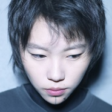
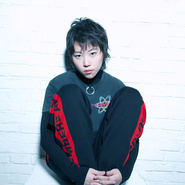
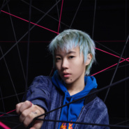
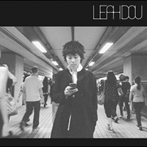
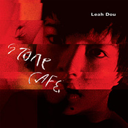

窦靖童
============================

|  |  |
| :--: | :-- |
| [ 窦靖童](https://i.xiami.com/leahdou) | **地区**: China 中国大陆 **风格**: 华语唱作人 Chinese Singer-Songwriter, 独立流行 Indie Pop **播放数**: 30227557 **粉丝数**: 88357 **评论数**: 1923  |

## 档案

我是窦靖童 leah dou

## 专辑

| 名称 | 语种 | 唱片公司 | 发行时间 | 专辑类别 | 专辑风格 |
| :--: | :-- | :-- | :-- | :-- | :-- |
| [ GSG MIXTAPE](./albums/2103263409.md) | 英语 | Grey Waters Ltd. | 2020年11月27日 | 录音室专辑 | 根源唱作人 Singer-Songwriter |
| [ Island Love](./albums/2103907662.md) | 英语 | KC DIGITAL LIMITED | 2018年08月11日 | EP, 单曲 | 独立流行 Indie Pop, 迷幻流行 Psychedelic Pop |
| [ Kids Only](./albums/2102859529.md) | 英语 | Grey Waters Ltd. | 2017年09月19日 | 录音室专辑 | 独立流行 Indie Pop, 当代唱作人 Contemporary Singer-Songwriter |
| [ See You Again](./albums/2102822120.md) | 英语 | 完美青春OST | 2017年08月30日 | EP, 单曲 | 独立流行 Indie Pop |
| [ (It'S Not a Crime) It's Just What We Do](./albums/2100385795.md) | 英语 | Grey Waters Ltd. | 2016年09月02日 | EP, 单曲 | 流行 Pop |
| [ My Days](./albums/2100258802.md) | 英语 |  | 2016年04月27日 | EP, 单曲 | 独立流行 Indie Pop, 电音流行 Electropop |
| [ Stone Café](./albums/1080603269.md) | 英语 | Grey Waters Ltd. | 2016年04月22日 | 录音室专辑 | 独立流行 Indie Pop, 当代唱作人 Contemporary Singer-Songwriter |
| [ With You](./albums/567287.md) | 英语 | 独立发行 | 2012年12月28日 | EP, 单曲 | 独立流行 Indie Pop |

## 评论

|  |  |  |
| :-- | :-- | :-- |
|  [虾米用户](https://emumo.xiami.com/u/12721358)   2021-01-06 09:31 赞(0) 踩(0) | 
愿美好与你同在~
 |
|  [虾米用户](https://emumo.xiami.com/u/324070891) 这么多的神仙里 最爱黄家... 2021-01-03 15:57 赞(0) 踩(0) | 
保持安静 寿星许愿
 |
|  [虾米用户](https://emumo.xiami.com/u/288632945) 吾神克鲁苏 2021-01-03 10:47 赞(0) 踩(0) | 
生日快乐
 |
|  [虾米用户](https://emumo.xiami.com/u/236718440)  2021-01-03 10:10 赞(0) 踩(0) | 
生日快乐乐乐乐童童~喜欢你呦~
 |
|  [虾米用户](https://emumo.xiami.com/u/85172224)  2021-01-03 10:08 赞(0) 踩(0) | 
生日快乐 童童
 |
|  [虾米用户](https://emumo.xiami.com/u/214208363) 打手槍直至流眼淚 2021-01-03 10:07 赞(0) 踩(0) | 

 |
|  [虾米用户](https://emumo.xiami.com/u/50190023) 我还没想好要写什么... 2021-01-03 10:04 赞(0) 踩(0) | 
我爱你妈
 |
|  [虾米用户](https://emumo.xiami.com/u/20671774) ^_^ 2021-01-03 10:03 赞(0) 踩(0) | 
生日快乐
 |
|  [虾米用户](https://emumo.xiami.com/u/58979292) 我还没想好要写什么... 2021-01-03 10:01 赞(0) 踩(0) | 
桶童 生日快樂~
 |
|  [虾米用户](https://emumo.xiami.com/u/377254982)  2020-12-09 14:44 赞(0) 踩(0) | 
好久开演唱会啊，期待
 |
|  [虾米用户](https://emumo.xiami.com/u/32963045) 〇 2020-11-27 22:23 赞(0) 踩(0) | 
GSGGSGGSGGSGSGSGSG
 |
|  [虾米用户](https://emumo.xiami.com/u/379912005) 感谢虾米，永远记得。 2020-10-26 05:45 赞(0) 踩(0) | 
一
 |
|  [虾米用户](https://emumo.xiami.com/u/80595630) 我还没想好要写什么... 2020-09-01 23:20 赞(0) 踩(0) | 
童童！！！爱你！！( ̀⌄ ́)
 |
|  [虾米用户](https://emumo.xiami.com/u/50891519) ♠︎ 2020-04-28 15:34 赞(2) 踩(0) | 
能把版权都买一下吗虾米？
 |
|  [虾米用户](https://emumo.xiami.com/u/379912005) 感谢虾米，永远记得。 2020-04-08 06:13 赞(0) 踩(0) | 

 |
|  [虾米用户](https://emumo.xiami.com/u/358104299) 悲观的唯心存在现实解构虚... 2020-03-07 10:31 赞(1) 踩(0) | 
14836
 |
|  [虾米用户](https://emumo.xiami.com/u/245445974) 我们都爱过，但都没有结果... 2020-02-18 06:22 赞(1) 踩(0) | 
希望你能晚点成仙儿 
 |
|  [虾米用户](https://emumo.xiami.com/u/69836094) 「终极手残」 2020-02-14 18:53 赞(0) 踩(0) | 
真是个小可爱 
 |
|  [虾米用户](https://emumo.xiami.com/u/330173379) 我还没想好要写什么...... 2020-02-02 22:43 赞(0) 踩(0) | 
想见你
 |
|  [虾米用户](https://emumo.xiami.com/u/235592002) 生而无乐 为死求欢 2020-01-09 20:54 赞(0) 踩(0) | 
理想型
 |
|  [虾米用户](https://emumo.xiami.com/u/282084184)  2020-01-04 00:58 赞(1) 踩(0) | 
happy birthday my dear
 |
|  [虾米用户](https://emumo.xiami.com/u/354543418) 阿弥陀佛 2020-01-03 18:05 赞(0) 踩(0) | 
happy birthday
 |
|  [虾米用户](https://emumo.xiami.com/u/99009196) 钟情乐手与作家 2020-01-03 12:40 赞(0) 踩(0) | 
你好童童，今天是你生日哦，祝愿你开开心心没烦恼:D
 |
|  [虾米用户](https://emumo.xiami.com/u/403899314) 多喝点 2020-01-03 11:38 赞(0) 踩(0) | 
xixi
 |
|  [虾米用户](https://emumo.xiami.com/u/257908344) 我还没想好要写什么... 2020-01-03 10:10 赞(0) 踩(0) | 
宝贝生日快乐
 |
|  [虾米用户](https://emumo.xiami.com/u/68819208) 我还没想好要写什么... 2020-01-03 10:03 赞(0) 踩(0) | 
欢迎来到虾米 
 |
| ⇒ |  [虾米用户](https://emumo.xiami.com/u/429518204)  2020-01-19 22:27 赞(0) 踩(0) | 
******
 |
|  [虾米用户](https://emumo.xiami.com/u/34280593) 我还没想好要写什么... 2020-01-03 10:01 赞(0) 踩(0) | 
老公生日快乐 我是Vanessa！
 |
|  [虾米用户](https://emumo.xiami.com/u/89211192) whatever 2020-01-03 10:01 赞(0) 踩(0) | 
老公！生日快乐
 |
|  [虾米用户](https://emumo.xiami.com/u/45262542)   2020-01-03 10:01 赞(0) 踩(0) | 
被你们母女俩吃的死死的
 |
|  [虾米用户](https://emumo.xiami.com/u/314483310) 唯音乐对我始终忠诚。 2019-12-08 13:34 赞(6) 踩(0) | 
名字意思是……窦唯和王靖雯的孩童嘛？
 |
|  [虾米用户](https://emumo.xiami.com/u/87627528)  2019-11-13 10:51 赞(0) 踩(0) | 
Cool
 |
|  [虾米用户](https://emumo.xiami.com/u/425626859)  2019-10-09 01:14 赞(0) 踩(0) | 
好听
 |
|  [虾米用户](https://emumo.xiami.com/u/5884804)   2019-08-22 02:07 赞(0) 踩(0) | 
naevus到底在那一边？
 |
|  [虾米用户](https://emumo.xiami.com/u/427887423)  2019-08-02 05:44 赞(1) 踩(0) | 
唱点中文歌吗 声音这么好 唱完让姐姐们也能跟着唱啊 
 |
|  [虾米用户](https://emumo.xiami.com/u/206291885) 加哪个？ 2019-07-28 12:26 赞(0) 踩(0) | 
瘦就是好看
 |
|  [虾米用户](https://emumo.xiami.com/u/34182751) 再见了朋友们 我们网易云... 2019-06-15 22:29 赞(0) 踩(0) | 
，
 |
|  [虾米用户](https://emumo.xiami.com/u/426007910)  2019-06-14 23:52 赞(0) 踩(0) | 
我就很喜欢童童你们别酸了
 |
|  [虾米用户](https://emumo.xiami.com/u/402760915) 网易虾米，共同爱好者 2019-05-31 19:00 赞(0) 踩(0) | 
我只有她的一首英文歌
 |
|  [虾米用户](https://emumo.xiami.com/u/339436568)  2019-05-03 01:16 赞(0) 踩(0) | 
******
 |
|  [虾米用户](https://emumo.xiami.com/u/357606144) 点击辑编 2019-04-15 09:00 赞(0) 踩(0) | 
啵啵
 |
|  [虾米用户](https://emumo.xiami.com/u/18056127) 我当然相信你就是其中最正... 2019-03-22 23:01 赞(6) 踩(0) | 
父母会影响一部分，长大过程中有了自己的思想，自己发掘、建立，变得独立，更清楚明确，找到自己，这就是意义。 父母会给一部分的光环，路也多，随便怎么走都会比普通人顺利，但是人生都由自己来把握，她独立、年轻、优秀、谦虚、走心，都值得学习。
 |
|  [虾米用户](https://emumo.xiami.com/u/222564299)   2019-03-17 18:48 赞(0) 踩(0) | 
放眼望去一片灰
 |
|  [虾米用户](https://emumo.xiami.com/u/415903210)  2019-03-09 12:18 赞(0) 踩(0) | 
童童我爱你
 |
|  [虾米用户](https://emumo.xiami.com/u/39537303)   2019-03-01 23:29 赞(0) 踩(0) | 
这个图片集……
 |
|  [虾米用户](https://emumo.xiami.com/u/66344192)  2019-01-24 00:07 赞(0) 踩(0) | 
超级尤物
 |
|  [虾米用户](https://emumo.xiami.com/u/377390042) 我还没想好要写什么... 2019-01-04 11:32 赞(0) 踩(0) | 
迟到的：生日快乐！
 |
|  [虾米用户](https://emumo.xiami.com/u/377390042) 我还没想好要写什么... 2019-01-04 11:31 赞(0) 踩(0) | 
喜欢你嗷
 |
|  [虾米用户](https://emumo.xiami.com/u/192836355)  2019-01-04 05:49 赞(0) 踩(0) | 
生日快乐
 |
|  [虾米用户](https://emumo.xiami.com/u/102369282) 安静的存在，不想被发现 2019-01-03 23:14 赞(0) 踩(0) | 
生日快乐鸭
 |
|  [虾米用户](https://emumo.xiami.com/u/328591844) I'll save my... 2019-01-03 20:33 赞(0) 踩(0) | 
默默说一句  生日快乐鸭啦啦啦啦啦啦啦啦啦啦啦啦
 |
|  [虾米用户](https://emumo.xiami.com/u/6846060)  2019-01-03 17:39 赞(0) 踩(0) | 
特别羡慕你的自由自在
 |
|  [虾米用户](https://emumo.xiami.com/u/321505003) 感情的事没有不可以 2019-01-03 15:05 赞(0) 踩(0) | 
生日快乐！超爱你妈咪，也好喜欢你！
 |
|  [虾米用户](https://emumo.xiami.com/u/56049617) 我还没想好要写什么... 2019-01-03 14:58 赞(0) 踩(0) | 
生日快乐童童！
 |
|  [虾米用户](https://emumo.xiami.com/u/68059442) 欲望不止 2019-01-03 13:19 赞(0) 踩(0) | 
生日快乐(´▽｀)ノ♪
 |
|  [虾米用户](https://emumo.xiami.com/u/42983224) 快叫爸爸 2019-01-03 12:17 赞(0) 踩(0) | 
生日快乐
 |
|  [虾米用户](https://emumo.xiami.com/u/28204293) 我还没想好要写什么... 2019-01-03 11:30 赞(0) 踩(0) | 
生日快乐
 |
|  [虾米用户](https://emumo.xiami.com/u/54809796) 雨会下 也会停 2019-01-03 10:43 赞(0) 踩(0) | 
生日快乐 
 |
|  [虾米用户](https://emumo.xiami.com/u/18134180)   2019-01-03 10:29 赞(0) 踩(0) | 
Yo hbd
 |
|  [虾米用户](https://emumo.xiami.com/u/258160864) 张 2019-01-03 10:27 赞(0) 踩(0) | 
生日快乐，祝愿拿出更多的好听音乐让我们听。有些黑粉别乱说话，污蔑人
 |
|  [虾米用户](https://emumo.xiami.com/u/3338788) 世界就是我们的实验品 2019-01-03 10:26 赞(0) 踩(0) | 
生快。世界还等着你去把玩。
 |
|  [虾米用户](https://emumo.xiami.com/u/26079807) 暂无签名~ 2019-01-03 10:23 赞(0) 踩(0) | 
迎来新同志
 |
|  [虾米用户](https://emumo.xiami.com/u/295048201)  2019-01-03 10:21 赞(0) 踩(0) | 
22岁生日快乐一切顺遂~Leah
 |
|  [虾米用户](https://emumo.xiami.com/u/323047428) 我还没想好要写什么... 2019-01-03 10:19 赞(0) 踩(0) | 
生日快乐
 |
|  [虾米用户](https://emumo.xiami.com/u/149473) 我还没想好要写什么... 2019-01-03 10:18 赞(0) 踩(0) | 
生日快乐啊 童童 喜欢你的歌 最喜欢see you again 是2018年虾米播放次数最高的 继续加油
 |
|  [虾米用户](https://emumo.xiami.com/u/28204293) 我还没想好要写什么... 2019-01-03 10:12 赞(0) 踩(0) | 
童童生日快乐
 |
|  [虾米用户](https://emumo.xiami.com/u/354543418) 阿弥陀佛 2019-01-03 10:06 赞(0) 踩(0) | 
happy birthday
 |
|  [虾米用户](https://emumo.xiami.com/u/51681976) 泥巴 2019-01-03 10:05 赞(0) 踩(0) | 
童童❤️‍❤️‍‍❤️‍‍㊗️生日快乐（找了好多表情包啊
 |
|  [虾米用户](https://emumo.xiami.com/u/212664343) Play it fuck... 2019-01-03 10:04 赞(0) 踩(0) | 
生日快乐
 |
|  [虾米用户](https://emumo.xiami.com/u/8824785)  2019-01-03 10:02 赞(0) 踩(0) | 
刚刚看了2018的虾米，明显听得少了。童童成为2019的Top ㊗️生日快乐
 |
|  [虾米用户](https://emumo.xiami.com/u/90309654)   2019-01-03 10:02 赞(0) 踩(0) | 
生日快乐
 |
|  [虾米用户](https://emumo.xiami.com/u/180398058) lover 2019-01-03 10:02 赞(0) 踩(0) | 
我想知道童童抽不抽烟
 |
|  [虾米用户](https://emumo.xiami.com/u/16931089)   2019-01-03 10:02 赞(0) 踩(0) | 
童童生日快乐！
 |
|  [虾米用户](https://emumo.xiami.com/u/51681976) 泥巴 2019-01-03 10:02 赞(0) 踩(0) | 
我是虾米音乐第一条？！
 |
|  [虾米用户](https://emumo.xiami.com/u/33071402) I do not car... 2019-01-02 13:17 赞(0) 踩(0) | 
头像真好看
 |
|  [虾米用户](https://emumo.xiami.com/u/169034406) 这家伙很聪明什么也没留下... 2018-12-27 09:29 赞(0) 踩(0) | 
有几首歌没有版权……好伤心
 |
|  [虾米用户](https://emumo.xiami.com/u/410867799)  2018-12-20 23:15 赞(0) 踩(0) | 
一如既往支持你
 |
|  [虾米用户](https://emumo.xiami.com/u/13735496) 青瓜過大海。 2018-12-17 01:52 赞(0) 踩(0) | 
新歌 long day’s journey into night 是不是目前就虾米还没上 
 |
|  [虾米用户](https://emumo.xiami.com/u/374968637) 听音乐这事儿当然看心情啦 2018-12-16 13:08 赞(0) 踩(0) | 
五年前的那个评论，，真爱了，，
 |
|  [虾米用户](https://emumo.xiami.com/u/13735496) 青瓜過大海。 2018-12-12 08:48 赞(0) 踩(0) | 
版权全被QQ 音乐买走了 
 |
|  [虾米用户](https://emumo.xiami.com/u/55094882) ｉｄ９１ｏｍｏ＞Ｉ  2018-12-11 21:12 赞(0) 踩(0) | 

 |
|  [虾米用户](https://emumo.xiami.com/u/121910914) 我想好好睡个觉 2018-12-09 09:30 赞(0) 踩(0) | 
i
 |
|  [虾米用户](https://emumo.xiami.com/u/43492923) 行到水穷我才开始害怕，夕... 2018-12-07 22:40 赞(0) 踩(0) | 
▽
 |
|  [虾米用户](https://emumo.xiami.com/u/331211892) 我还没想好要写什么... 2018-12-02 19:58 赞(0) 踩(0) | 
版权，兄弟
 |
|  [虾米用户](https://emumo.xiami.com/u/2201475)   2018-11-20 15:49 赞(0) 踩(0) | 
❤️❤️❤️❤️❤️
 |
|  [虾米用户](https://emumo.xiami.com/u/31440002) 哈哈哈 加油啊  2018-11-10 22:28 赞(0) 踩(0) | 
很舒服的女声
 |
|  [虾米用户](https://emumo.xiami.com/u/342542054) 三指男孩 2018-11-05 11:21 赞(0) 踩(0) | 
嗨，童童
 |
|  [虾米用户](https://emumo.xiami.com/u/52034644) 身体会跳舞 2018-11-05 11:04 赞(1) 踩(0) | 
我妈唯一记得的歌星：你妈和你
 |
|  [虾米用户](https://emumo.xiami.com/u/46807254) 我好想好要写什么... 2018-10-19 23:32 赞(0) 踩(0) | 
留
 |
|  [虾米用户](https://emumo.xiami.com/u/405976020)  2018-10-16 15:58 赞(0) 踩(0) | 
加油，支持你的音樂路，與你爸媽無關，純粹喜歡你的音樂 
 |
|  [虾米用户](https://emumo.xiami.com/u/405748406)  2018-10-08 23:14 赞(0) 踩(0) | 
五年才追你到这里 
 |
|  [虾米用户](https://emumo.xiami.com/u/9830429) 我还没想好要写什么... 2018-10-06 12:29 赞(0) 踩(0) | 
你怎么瘦下来的啊？这么美
 |
|  [虾米用户](https://emumo.xiami.com/u/57905202)  2018-09-17 08:19 赞(0) 踩(0) | 
什么时候有童童版权啊
 |
|  [虾米用户](https://emumo.xiami.com/u/288167757) La musica è ... 2018-09-15 20:41 赞(0) 踩(0) | 
童童在虾米多发一点歌曲吧～ 在你的童式迷幻里走不出来了， &amp;hellip;&amp;hellip;
 |
|  [虾米用户](https://emumo.xiami.com/u/363898569)  2018-09-11 14:29 赞(1) 踩(0) | 
因为喜欢窦唯，而喜欢窦靖童
 |
|  [虾米用户](https://emumo.xiami.com/u/337580895)  2018-08-22 04:11 赞(0) 踩(0) | 
这个好听 虽说不知道唱的什么但好听  来点中文别
 |
|  [虾米用户](https://emumo.xiami.com/u/245002818) 我还没想好要写什么... 2018-08-21 21:40 赞(2) 踩(0) | 
妳的父亲真是大師
 |
|  [虾米用户](https://emumo.xiami.com/u/282084184)  2018-08-18 11:43 赞(0) 踩(0) | 
爱童童，爱音乐
 |
|  [虾米用户](https://emumo.xiami.com/u/268255720) 我还没想好要写什么... 2018-08-14 13:08 赞(2) 踩(0) | 
呵呵了
 |
|  [虾米用户](https://emumo.xiami.com/u/215359363)  2018-08-13 16:25 赞(3) 踩(0) | 
风格很像窦唯
 |
|  [虾米用户](https://emumo.xiami.com/u/43816145) 品味是一个无底洞 2018-08-11 00:31 赞(2) 踩(0) | 
图片集，她下把的痣，为啥有的在左有的在右。。强迫症犯了。。。。
 |
| ⇒ |  [虾米用户](https://emumo.xiami.com/u/334269435)  2018-10-05 15:19 赞(0) 踩(0) | 
你拍照用前镜头后镜头拍拍看就知道了
 |
| ⇒ |  [虾米用户](https://emumo.xiami.com/u/43816145) 品味是一个无底洞 2018-10-05 15:20 赞(0) 踩(0) | 
<q><b>黄昏时看日出说：</b></q>
 |
| ⇒ |  [虾米用户](https://emumo.xiami.com/u/43816145) 品味是一个无底洞 2018-10-05 15:20 赞(0) 踩(0) | 
<q><b>黄昏时看日出说：</b></q>
 |
| ⇒ |  [虾米用户](https://emumo.xiami.com/u/334269435)  2018-10-05 15:21 赞(0) 踩(0) | 
<q><b>D说：</b></q>
 |
|  [虾米用户](https://emumo.xiami.com/u/63154410) 不爱走路爱跳舞 2018-08-05 14:12 赞(1) 踩(0) | 
爱你
 |
|  [虾米用户](https://emumo.xiami.com/u/36425079) ᠡᠷᠬᠡ ᠴᠢᠯᠦᠭᠡ 2018-08-04 13:23 赞(6) 踩(0) | 
她有浅蓝色的情绪、羚羊的乖戾和黑色的保护、粉色的窝心。
 |
|  [虾米用户](https://emumo.xiami.com/u/13230469) 我是湾湾湾 2018-08-02 20:46 赞(1) 踩(0) | 
[带墨镜笑][带墨镜笑]
 |
|  [虾米用户](https://emumo.xiami.com/u/45240314) “你是我仅有的梦” 2018-07-21 13:47 赞(0) 踩(0) | 
我们会客观评价的，努力吧。
 |
|  [虾米用户](https://emumo.xiami.com/u/9025629) 不敢触碰的手。 2018-07-20 23:04 赞(1) 踩(0) | 
But whotf been uploaded all the pics yo is the shit sincerely njk
 |
|  [虾米用户](https://emumo.xiami.com/u/332205756)  2018-07-17 07:21 赞(0) 踩(0) | 
喝你的毒汤还很甜 
 |
|  [虾米用户](https://emumo.xiami.com/u/355930802) 你问我要去向何方 我指着... 2018-07-12 22:21 赞(0) 踩(0) | 
看完我不是药神 里面的小黄毛章宇让我想起童童 对这款无抵抗力
 |
|  [虾米用户](https://emumo.xiami.com/u/339191478)   2018-07-12 09:33 赞(0) 踩(0) | 
❤
 |
|  [虾米用户](https://emumo.xiami.com/u/377002801)  2018-06-28 09:56 赞(0) 踩(0) | 
怎么试听不了呢？
 |
|  [虾米用户](https://emumo.xiami.com/u/201391232) 最快的方法是先抱抱 2018-06-15 17:14 赞(1) 踩(0) | 
彡
 |
|  [虾米用户](https://emumo.xiami.com/u/326243081) 我还没想好要写什么... 2018-05-17 15:46 赞(1) 踩(0) | 
0.0 日语或英语，乃是不喜欢中文吗，好期待中文歌
 |
|  [虾米用户](https://emumo.xiami.com/u/339191478)   2018-05-06 09:17 赞(0) 踩(0) | 
:-)
 |
|  [虾米用户](https://emumo.xiami.com/u/353905535)  2018-05-05 00:38 赞(0) 踩(0) | 
版权啊版权
 |
|  [虾米用户](https://emumo.xiami.com/u/43838497) 陈奕迅神经研究所 2018-05-01 13:06 赞(0) 踩(0) | 
上海草莓节见
 |
|  [虾米用户](https://emumo.xiami.com/u/71178106) 塵世や 酒、風呂を抜け ... 2018-04-24 23:44 赞(1) 踩(0) | 
♡
 |
|  [虾米用户](https://emumo.xiami.com/u/3855918) 我还没想好要写什么... 2018-04-24 17:22 赞(2) 踩(0) | 
拜托虾米赶紧买版权吧！
 |
|  [虾米用户](https://emumo.xiami.com/u/13729120) 高光 2018-04-18 18:54 赞(3) 踩(0) | 
抛掉对窦靖童所有的喜爱，就单纯的从kids only 这张专来说，真的很腻害了！属于那种随机猜你喜欢听到前奏立马打开手机看是什么歌的那种。听童的歌五六年，进步真的是看得见的。笔芯  所以，虾米什么时候买这张专的版权呢？？
 |
|  [虾米用户](https://emumo.xiami.com/u/358325616)  2018-04-17 00:44 赞(0) 踩(0) | 
童～～～ 
 |
|  [虾米用户](https://emumo.xiami.com/u/349851013)  2018-04-11 09:08 赞(2) 踩(0) | 
个人风格，别老提她家人，好好听歌
 |
|  [虾米用户](https://emumo.xiami.com/u/355706954) 这个人很懒，什么都没有写 2018-03-25 23:17 赞(0) 踩(0) | 
要细细品位哦
 |
|  [虾米用户](https://emumo.xiami.com/u/32522630) Mediocre at ... 2018-03-16 10:28 赞(0) 踩(0) | 
好喜欢窦靖童，求虾米买版权
 |
|  [虾米用户](https://emumo.xiami.com/u/290995911) 这家伙很聪明 什么也没留... 2018-02-20 19:33 赞(2) 踩(0) | 
春晚微博太可爱了哈哈哈哈哈
 |
|  [虾米用户](https://emumo.xiami.com/u/233382720)  2018-02-17 12:56 赞(0) 踩(0) | 
哇噻，好听到爆，就是我喜欢的风格  
 |
|  [虾米用户](https://emumo.xiami.com/u/277843823) Daydreams...... 2018-02-14 13:31 赞(0) 踩(0) | 
童童我真的爱死你了 微博都是为你注册的
 |
|  [虾米用户](https://emumo.xiami.com/u/1999664) 喜当爹mk2 2018-02-10 17:20 赞(0) 踩(0) | 
不得不承认，我之前是对窦靖童有偏见，但是真的听了她的歌，我只能说确实很棒
 |
|  [虾米用户](https://emumo.xiami.com/u/68547536)  2018-02-03 09:32 赞(0) 踩(0) | 
Coolgirl
 |
|  [虾米用户](https://emumo.xiami.com/u/337318573)   2018-01-29 21:07 赞(0) 踩(0) | 
❤️
 |
|  [虾米用户](https://emumo.xiami.com/u/277843823) Daydreams...... 2018-01-27 21:30 赞(2) 踩(0) | 
KO的版权呢 虾米我对你很不满意 差评
 |
|  [虾米用户](https://emumo.xiami.com/u/48940974)  2018-01-17 10:56 赞(2) 踩(0) | 
声音接了爸又接了妈，一脸T样帅出天际，可以可以
 |
|  [虾米用户](https://emumo.xiami.com/u/149426824)  2018-01-16 18:46 赞(0) 踩(0) | 
王靖文闺女
 |
|  [虾米用户](https://emumo.xiami.com/u/204070409) 老地方相见 如果你发现你... 2018-01-16 14:45 赞(3) 踩(0) | 
虾米爸爸快买kids only吧求您了
 |
|  [虾米用户](https://emumo.xiami.com/u/277843823) Daydreams...... 2018-01-16 12:53 赞(0) 踩(0) | 
感觉她超酷超帅完了之后喜欢笑 特可爱
 |
|  [虾米用户](https://emumo.xiami.com/u/211699755)  2018-01-09 05:30 赞(0) 踩(0) | 
Wu真好听   
 |
|  [虾米用户](https://emumo.xiami.com/u/54537050) 我还没想好要写什么... 2018-01-06 13:15 赞(0) 踩(0) | 
☁️
 |
|  [虾米用户](https://emumo.xiami.com/u/127486502) 土嗨 can't cal... 2018-01-06 00:59 赞(2) 踩(0) | 
快让虾米换换相册图哟
 |
|  [虾米用户](https://emumo.xiami.com/u/342791612)  2018-01-05 22:12 赞(0) 踩(0) | 
喜欢童童
 |
|  [虾米用户](https://emumo.xiami.com/u/88097330) 是非审之于心，毁誉听之于... 2018-01-05 11:42 赞(0) 踩(0) | 
听着听着误以为在听王菲唱英文歌
 |
|  [虾米用户](https://emumo.xiami.com/u/330400402)  2018-01-03 04:49 赞(0) 踩(0) | 
生日快乐！
 |
|  [虾米用户](https://emumo.xiami.com/u/306236376) ᝰ 2018-01-02 13:32 赞(3) 踩(0) | 
因为童童喜欢她爸妈 
 |
|  [虾米用户](https://emumo.xiami.com/u/30223298)  2018-01-02 11:45 赞(3) 踩(0) | 
特别羡慕这一家子人，爸爸妈妈都是上了神坛的人，女儿也有了自己的成就，一个为音乐而生的一家人，没有炒作，没有虚假，一家人个个才华横溢，专心做音乐，全凭硬件甩娱乐圈媒体流言蜚语几万里，所以真正牛逼的人，是不需要解释和炒作的，群众，历史会给定义。。。
 |
|  [虾米用户](https://emumo.xiami.com/u/2724370) 王权没有永恒，你将何去何... 2017-12-31 21:01 赞(2) 踩(0) | 
刚看到在崇礼现场的表演，摘下帽子那一瞬间我就知道我必须粉这个妹子 
 |
|  [虾米用户](https://emumo.xiami.com/u/6633711) 我还没想好要写什么... 2017-12-30 23:43 赞(0) 踩(0) | 
每次看到热搜都以为版权get到了，泪流。
 |
|  [虾米用户](https://emumo.xiami.com/u/5809776)  2017-12-24 23:27 赞(0) 踩(0) | 
被短发的样子俘获了，太帅了。演唱会与王菲合唱也非常感人，母女两这样的生命真得很精彩。
 |
|  [虾米用户](https://emumo.xiami.com/u/20494336) 不将就原则 2017-12-24 21:30 赞(0) 踩(0) | 
想听may rain！！！
 |
|  [虾米用户](https://emumo.xiami.com/u/82831190) 不良于闻 2017-12-22 18:37 赞(0) 踩(0) | 
Leah下巴的痣让我想到苹果...两个我都爱死了  
 |
|  [虾米用户](https://emumo.xiami.com/u/648020)  2017-12-21 20:27 赞(0) 踩(0) | 
小虾米，新专辑没抢到版权呀！
 |
|  [虾米用户](https://emumo.xiami.com/u/8043004) 再见虾米我永远的爱 2017-12-19 12:34 赞(0) 踩(0) | 
我只喜欢好声音，不管她爸她妈是谁耳朵决定思维
 |
|  [虾米用户](https://emumo.xiami.com/u/337871774)  2017-12-17 02:27 赞(0) 踩(0) | 
窦靖童叫谢霆锋爸爸嘛
 |
|  [虾米用户](https://emumo.xiami.com/u/43486707) 我们脚踏实地为你延续理想 2017-12-16 11:35 赞(0) 踩(0) | 
？
 |
|  [虾米用户](https://emumo.xiami.com/u/8930811) feel real no... 2017-12-16 05:50 赞(0) 踩(0) | 
音乐做的很前卫 能感受到你丰富的精神世界
 |
|  [虾米用户](https://emumo.xiami.com/u/293142259) 若我還是不回來 就把我靈... 2017-12-12 00:39 赞(4) 踩(0) | 
人家接受採訪都說了對她音樂上影響最多的是姑姑，影響超過父母。你說你們一個個總拿她跟她父母比什麼呢，三個人三個風格，有哪像啊？？
 |
|  [虾米用户](https://emumo.xiami.com/u/91200618) 这是催动我的魔咒吗。 2017-11-30 22:33 赞(0) 踩(0) | 
爱你。
 |
|  [虾米用户](https://emumo.xiami.com/u/336742159)  2017-11-28 05:51 赞(0) 踩(0) | 
酷酷的感觉
 |
|  [虾米用户](https://emumo.xiami.com/u/549204) 我还没想好要写什么... 2017-11-17 19:03 赞(1) 踩(0) | 
没有听过她唱国语&amp;hellip;
 |
|  [虾米用户](https://emumo.xiami.com/u/324805326) 酒乃是穿肠毒药_ 2017-11-17 17:14 赞(0) 踩(0) | 
这个女孩     话多不甜字恨我喜欢什么音乐也许有些人不懂
 |
|  [虾米用户](https://emumo.xiami.com/u/306669308) 忘 2017-11-15 20:49 赞(0) 踩(0) | 
我觉得这女孩很酷
 |
|  [虾米用户](https://emumo.xiami.com/u/334350865)  2017-11-13 00:35 赞(7) 踩(0) | 
祖传粉
 |
| ⇒ |  [虾米用户](https://emumo.xiami.com/u/345814881)  2018-03-13 14:16 赞(0) 踩(0) | 
几岁啦?
 |
|  [虾米用户](https://emumo.xiami.com/u/5577839) ☯☯☯ 2017-11-10 11:32 赞(2) 踩(0) | 
听着你妈的歌长大 像是互相守护
 |
|  [虾米用户](https://emumo.xiami.com/u/1262033) Music is a u... 2017-11-06 20:47 赞(1) 踩(0) | 
她这种老干部画风真的好心水啊233
 |
|  [虾米用户](https://emumo.xiami.com/u/83569582)   2017-11-03 21:25 赞(0) 踩(0) | 
每次听她的歌都害怕 还听不懂 虽然不是很喜欢她的风格 但是声音挺好听的 
 |
|  [虾米用户](https://emumo.xiami.com/u/82041468)  2017-10-30 10:21 赞(1) 踩(0) | 
唱的什么鬼东西，听都听不懂，不过长的还可以，我微信nbawlimu聊聊可好啊，美女！
 |
|  [虾米用户](https://emumo.xiami.com/u/30211104) 每首歌都是新的 2017-10-29 19:22 赞(1) 踩(0) | 
找不到自己的风格 想改变自己 活出自己所爱与向往的样子 我从你的歌声与你本身找到了勇气
 |
|  [虾米用户](https://emumo.xiami.com/u/69148576) 勇敢 2017-10-28 20:32 赞(0) 踩(0) | 
童童老公太可爱了 
 |
|  [虾米用户](https://emumo.xiami.com/u/292149061)   2017-10-28 18:08 赞(3) 踩(0) | 
童童出中文歌了（wu），封面是她表弟。                   啊哈哈哈
 |
|  [虾米用户](https://emumo.xiami.com/u/91993380) 精神鸦片 2017-10-28 00:04 赞(81) 踩(0) | 
童童老公这个相册简直证明了找对自己风格是一件多么重要的事！
 |
| ⇒ |  [虾米用户](https://emumo.xiami.com/u/410047369) 酷爱夏天 希望能一直生活... 2019-01-03 10:04 赞(0) 踩(0) | 
真相了...哈哈哈哈哈哈哈哈哈哈哈恍恍惚惚
 |
|  [虾米用户](https://emumo.xiami.com/u/25242583)   2017-10-27 23:53 赞(2) 踩(0) | 
一开始听以为是Rosie Thomas等众国外独立歌手，原来还是有点来头
 |
|  [虾米用户](https://emumo.xiami.com/u/8854264) Hypocrite. 2017-10-27 23:43 赞(1) 踩(0) | 
为毛虾米有了mv却不上歌？今天crime循环了一整天呢 
 |
|  [虾米用户](https://emumo.xiami.com/u/8854264) Hypocrite. 2017-10-27 23:43 赞(1) 踩(0) | 
照片简直都是黑历史啊哈哈哈好可爱 嗯一个小t进化史吗 
 |
|  [虾米用户](https://emumo.xiami.com/u/102632764)  2017-10-27 23:40 赞(4) 踩(0) | 
不是因喜欢她爹她妈，儿爱屋及乌，对比当下那些平庸的音乐小鲜肉们，我不得不爱
 |
|  [虾米用户](https://emumo.xiami.com/u/34220619)   2017-10-27 23:39 赞(2) 踩(0) | 
2015年10月4日凌晨三点喜欢上你，错过了北京理想音乐节之后。
 |
|  [虾米用户](https://emumo.xiami.com/u/4839398)  2017-10-27 23:34 赞(0) 踩(0) | 
靖儿将来要多和爹爹学习沾点灵仙之气~哈
 |
|  [虾米用户](https://emumo.xiami.com/u/10849904)  2017-10-27 23:31 赞(0) 踩(0) | 
在这里说喜欢她父母的请去他们各自的平台，在这里童童仅仅是童童
 |
|  [虾米用户](https://emumo.xiami.com/u/11986487) 文艺造作二奶范 2017-10-27 23:10 赞(2) 踩(0) | 
的确如楼下坏熊猫所说：“声音是王菲的，才气是窦唯的。发音也很洋气。'  窦唯一直是我很爱的音乐人，但听窦靖童我是抛开了对她爹妈的喜爱，很惊艳，期待她后续的作品。
 |
|  [虾米用户](https://emumo.xiami.com/u/3635179) 豆瓣儿：果冻飞艇__ 2017-10-27 22:57 赞(1) 踩(0) | 
快被你掰弯了！加入做你果儿的队列里哈哈哈
 |
|  [虾米用户](https://emumo.xiami.com/u/322197054)  2017-10-26 18:00 赞(0) 踩(0) | 
有实力有天赋家教好人好人美
 |
|  [虾米用户](https://emumo.xiami.com/u/322197054)  2017-10-26 17:59 赞(0) 踩(0) | 
实力强         
 |
|  [虾米用户](https://emumo.xiami.com/u/322197054)  2017-10-26 17:59 赞(1) 踩(0) | 
基因真强大
 |
|  [虾米用户](https://emumo.xiami.com/u/329013713) 我还没想好要写什么... 2017-10-24 23:30 赞(0) 踩(0) | 
爱你
 |
|  [虾米用户](https://emumo.xiami.com/u/20593705) 我还没想好要写什么... 2017-10-21 18:06 赞(1) 踩(0) | 
超喜欢～
 |
|  [虾米用户](https://emumo.xiami.com/u/277452891) 音乐人 2017-10-19 18:10 赞(0) 踩(0) | 
 好
 |
|  [虾米用户](https://emumo.xiami.com/u/144897762)  2017-10-16 00:46 赞(0) 踩(0) | 
看这档案我就关注了
 |
|  [虾米用户](https://emumo.xiami.com/u/83242180) 生活就是做出选择，一旦你... 2017-10-12 10:50 赞(0) 踩(0) | 
爱你、支持你 
 |
|  [虾米用户](https://emumo.xiami.com/u/17146554) weibo：@L1RRO... 2017-10-10 12:03 赞(0) 踩(0) | 
me
 |
|  [虾米用户](https://emumo.xiami.com/u/288836525) 一切问题只是时间问题，一... 2017-10-07 17:48 赞(0) 踩(0) | 
酷
 |
|  [虾米用户](https://emumo.xiami.com/u/30991915)   2017-10-03 15:42 赞(0) 踩(0) | 
喜欢
 |
|  [虾米用户](https://emumo.xiami.com/u/26140268) Hate the dam... 2017-10-02 10:46 赞(2) 踩(0) | 
童童你不仅有出类拔萃的音乐才华、还有很好的英文修养，所以才能写出很棒的歌词。以前爱你是因为你是我最爱的菲的女儿，现在爱你因为你是你。
 |
|  [虾米用户](https://emumo.xiami.com/u/297500)  2017-09-30 07:07 赞(0) 踩(0) | 
这个封面很好看
 |
|  [虾米用户](https://emumo.xiami.com/u/43056442) 不知不觉入驻虾米已经有6... 2017-09-28 10:57 赞(0) 踩(0) | 
爱你老公～
 |
|  [虾米用户](https://emumo.xiami.com/u/210380590) 无欲无求. 2017-09-23 22:34 赞(0) 踩(0) | 
好听
 |
|  [虾米用户](https://emumo.xiami.com/u/6081586) 不停止休息的耳膜  聋掉... 2017-09-20 22:47 赞(0) 踩(0) | 
能更新一下相册吗！
 |
|  [虾米用户](https://emumo.xiami.com/u/44365787)  2017-09-20 13:44 赞(3) 踩(0) | 
都三十好几的人了，我以为我今后将不会再为了任何人而心动了，谁知世事难料今天居然会被一个二十出头的窦姓神秘女子给迷的神魂颠倒，忘乎所以。
 |
|  [虾米用户](https://emumo.xiami.com/u/325912666)  2017-09-20 10:52 赞(0) 踩(0) | 
照片都是黑照哈哈哈哈
 |
|  [虾米用户](https://emumo.xiami.com/u/254294187) 别以为，真的无所谓 2017-09-20 06:49 赞(3) 踩(0) | 
唯一的一点，就是没妈咪爹地好看，想当年王菲演唱会那造型那身材那脸蛋，又酷又仙又美，窦唯年轻时也帅绝人寰。。不过不影响听你的歌，相信以后会越来越棒！
 |
|  [虾米用户](https://emumo.xiami.com/u/60933484)  2017-09-19 13:04 赞(1) 踩(0) | 
kids only anthem里有好长一声消音哈哈
 |
|  [虾米用户](https://emumo.xiami.com/u/5939381) 我还没想好要写什么... 2017-09-19 08:58 赞(0) 踩(0) | 
还有一小时零三分钟
 |
|  [虾米用户](https://emumo.xiami.com/u/47269312) 我还没想好要写什么... 2017-09-19 06:46 赞(0) 踩(0) | 
听说今天发新专？几点上线？
 |
|  [虾米用户](https://emumo.xiami.com/u/88722174) 我还没想好要写什么... 2017-09-18 16:06 赞(0) 踩(0) | 
喜欢
 |
|  [虾米用户](https://emumo.xiami.com/u/60933484)  2017-09-18 12:02 赞(1) 踩(0) | 
明天kids only~
 |
|  [虾米用户](https://emumo.xiami.com/u/12764426) 我还没想好要写什么... 2017-09-17 23:50 赞(0) 踩(0) | 
二专前的第二天，标记下
 |
|  [虾米用户](https://emumo.xiami.com/u/48898343) 生命已经过期 2017-09-17 12:37 赞(1) 踩(0) | 
二专kids only后天就要发了，期待 
 |
|  [虾米用户](https://emumo.xiami.com/u/55295191) Write, loaf,... 2017-09-09 01:10 赞(0) 踩(0) | 
想起了很多东西，想起了女孩子的脸和你的声音，你说的&amp;ldquo;blue flamingo&amp;rdquo;
 |
|  [虾米用户](https://emumo.xiami.com/u/47762018) 虾米我永远爱你 2017-09-08 11:41 赞(0) 踩(0) | 

 |
|  [虾米用户](https://emumo.xiami.com/u/84967250) 虚无而已 2017-09-07 12:40 赞(0) 踩(0) | 
求虾米更新童童主页照片  
 |
| ⇒ |  [虾米用户](https://emumo.xiami.com/u/48898343) 生命已经过期 2017-09-19 09:19 赞(0) 踩(0) | 
这个可以用户自己上传
 |
|  [虾米用户](https://emumo.xiami.com/u/1932622)  2017-09-06 22:25 赞(0) 踩(0) | 
好爱头像这张图，心情一下子就好起来了。
 |
|  [虾米用户](https://emumo.xiami.com/u/42110583) 愷悦靈雲 2017-09-06 00:06 赞(0) 踩(0) | 
舒心❤️
 |
|  [虾米用户](https://emumo.xiami.com/u/30900092)  2017-09-05 21:11 赞(1) 踩(0) | 
偶然虾米首页推了童童，好奇听了一下就瞬间粉了，之前听的多为jazz-hiphop, 少量欧美日式民谣，听到童童就非常相见恨晚，zici！！！
 |
|  [虾米用户](https://emumo.xiami.com/u/1544493)  2017-09-05 13:14 赞(2) 踩(0) | 
她的音乐都有一股迷幻的感觉
 |
|  [虾米用户](https://emumo.xiami.com/u/317829645) 这家伙很聪明什么也没留下... 2017-09-04 05:54 赞(1) 踩(0) | 
呵呵
 |
|  [虾米用户](https://emumo.xiami.com/u/317320857)  2017-09-03 20:58 赞(1) 踩(0) | 
童童我爱你阿！   
 |
|  [虾米用户](https://emumo.xiami.com/u/303506160) 因为我对你爱的深沉 2017-09-03 16:02 赞(1) 踩(0) | 
嘿呦
 |
|  [虾米用户](https://emumo.xiami.com/u/262326500) 过往云霄，不如你回暇相濡... 2017-09-03 12:58 赞(1) 踩(0) | 
666
 |
|  [虾米用户](https://emumo.xiami.com/u/317320857)  2017-09-02 22:31 赞(1) 踩(0) | 
童童你缺女朋友吗？??   
 |
|  [虾米用户](https://emumo.xiami.com/u/262326500) 过往云霄，不如你回暇相濡... 2017-09-02 13:28 赞(1) 踩(0) | 
666
 |
|  [虾米用户](https://emumo.xiami.com/u/262326500) 过往云霄，不如你回暇相濡... 2017-09-01 18:47 赞(1) 踩(0) | 
666
 |
|  [虾米用户](https://emumo.xiami.com/u/52034644) 身体会跳舞 2017-09-01 00:43 赞(1) 踩(0) | 
好喜欢你妈妈 我一口气买完了她所有港版和日版的专辑 也希望你开心 ❤️
 |
|  [虾米用户](https://emumo.xiami.com/u/52034644) 身体会跳舞 2017-09-01 00:41 赞(1) 踩(0) | 
很可以
 |
|  [虾米用户](https://emumo.xiami.com/u/322464425)  2017-08-30 19:15 赞(2) 踩(0) | 
音乐里see you again 
 |
|  [虾米用户](https://emumo.xiami.com/u/278850937) 人前谈生活，可生存都还是... 2017-08-20 23:19 赞(4) 踩(0) | 
童童音乐随你老爹
 |
|  [虾米用户](https://emumo.xiami.com/u/24333983) 我的愿望是找到跟我同样听... 2017-08-20 13:21 赞(0) 踩(0) | 
还是比较喜欢窦靖童主张自己，我跟她同岁，，，不过目前我是工作五六年了，，，，，也想进娱乐圈看见，不过我本人也是太自我，，这一点，，，很羡慕窦靖童........请加油..
 |
|  [虾米用户](https://emumo.xiami.com/u/50520284) 他比烟花灿烂 2017-08-17 00:47 赞(0) 踩(0) | 
童殿~童殿~童帅~童帅~童少~童少~筒童~筒童！！哈哈哈哈哈
 |
|  [虾米用户](https://emumo.xiami.com/u/222909983)  2017-08-15 13:43 赞(1) 踩(0) | 
想问一下她怎么减下来的
 |
| ⇒ |  [虾米用户](https://emumo.xiami.com/u/50520284) 他比烟花灿烂 2017-08-17 00:46 赞(0) 踩(0) | 
抽条儿~~哈哈哈
 |
| ⇒ |  [虾米用户](https://emumo.xiami.com/u/292523064)   2017-08-30 08:34 赞(0) 踩(0) | 
有段时间工作到忘记吃饭，然后狂瘦（心疼（这是她采访说的
 |
| ⇒ |  [虾米用户](https://emumo.xiami.com/u/322464425)  2017-08-30 19:14 赞(0) 踩(0) | 
瞧瞧菲姐的身材就知道了
 |
|  [虾米用户](https://emumo.xiami.com/u/169123664) 你的碗。 2017-08-09 10:50 赞(0) 踩(0) | 
love u baby～
 |
|  [虾米用户](https://emumo.xiami.com/u/310086029)  2017-08-03 22:31 赞(1) 踩(0) | 
蓝色火烈鸟，一听中招。喜欢你。
 |
|  [虾米用户](https://emumo.xiami.com/u/9902531) 浪漫指南 2017-08-02 15:04 赞(4) 踩(0) | 
爱你全家
 |
|  [虾米用户](https://emumo.xiami.com/u/200001577)  2017-08-02 03:32 赞(1) 踩(0) | 
我是因为快本才粉上的窦靖童，不知道有没有童童的好歌推荐
 |
|  [虾米用户](https://emumo.xiami.com/u/292149061)   2017-07-30 19:29 赞(54) 踩(0) | 
看了童童快本的节目,太可爱了！童童唱中文歌真的真的真的好好听！
 |
| ⇒ |  [虾米用户](https://emumo.xiami.com/u/264129338)  2017-07-30 19:46 赞(0) 踩(0) | 
同意！！！
 |
| ⇒ |  [虾米用户](https://emumo.xiami.com/u/292149061)   2017-07-30 19:56 赞(0) 踩(0) | 
<q><b>山鲁佐德说：</b></q>
 |
| ⇒ |  [虾米用户](https://emumo.xiami.com/u/264129338)  2017-07-31 20:48 赞(0) 踩(0) | 
<q><b>i i i说：</b></q>
 |
| ⇒ |  [虾米用户](https://emumo.xiami.com/u/292149061)   2017-07-31 20:48 赞(0) 踩(0) | 
<q><b>山鲁佐德说：</b></q>
 |
| ⇒ |  [虾米用户](https://emumo.xiami.com/u/292149061)   2017-07-31 20:49 赞(0) 踩(0) | 
<q><b>山鲁佐德说：</b></q>
 |
| ⇒ |  [虾米用户](https://emumo.xiami.com/u/264129338)  2017-08-15 22:11 赞(0) 踩(0) | 
<q><b>i i i说：</b></q>
 |
| ⇒ |  [虾米用户](https://emumo.xiami.com/u/292149061)   2017-08-16 18:20 赞(0) 踩(0) | 
<q><b>山鲁佐德说：</b></q>
 |
| ⇒ |  [虾米用户](https://emumo.xiami.com/u/264129338)  2017-10-01 16:02 赞(0) 踩(0) | 
<q><b>i i i说：</b></q>
 |
| ⇒ |  [虾米用户](https://emumo.xiami.com/u/292149061)   2017-10-01 16:16 赞(0) 踩(0) | 
<q><b>山鲁佐德说：</b></q>
 |
| ⇒ |  [虾米用户](https://emumo.xiami.com/u/264129338)  2017-10-01 16:21 赞(0) 踩(0) | 
<q><b>i i i说：</b></q>
 |
|  [虾米用户](https://emumo.xiami.com/u/311794227)  2017-07-30 16:47 赞(2) 踩(0) | 
好听好听
 |
|  [虾米用户](https://emumo.xiami.com/u/4362247) 我还没想好要写什么... 2017-07-24 01:36 赞(7) 踩(0) | 
相册前40张都是谁他妈po的图，站出来保证不打死他
 |
| ⇒ |  [虾米用户](https://emumo.xiami.com/u/191925772)  2017-07-24 11:27 赞(0) 踩(0) | 
哈哈哈，因为你这句话我去看了相册
 |
| ⇒ |  [虾米用户](https://emumo.xiami.com/u/4362247) 我还没想好要写什么... 2017-07-27 00:22 赞(0) 踩(0) | 
<q><b>松鸡杀手说：</b></q>
 |
| ⇒ |  [虾米用户](https://emumo.xiami.com/u/191925772)  2017-07-27 01:52 赞(0) 踩(0) | 
<q><b>小白能说：</b></q>
 |
|  [虾米用户](https://emumo.xiami.com/u/236020725) 勿扰…… 2017-07-20 16:11 赞(0) 踩(0) | 
只爱王菲
 |
|  [虾米用户](https://emumo.xiami.com/u/289016337)  2017-07-14 22:24 赞(0) 踩(0) | 
爱死你了  
 |
|  [虾米用户](https://emumo.xiami.com/u/3668945)  2017-07-13 01:36 赞(46) 踩(0) | 
没有喜欢王菲但是喜欢窦靖童，文化差异吧，我觉得窦靖童很酷
 |
|  [虾米用户](https://emumo.xiami.com/u/61956152)  2017-07-11 14:42 赞(4) 踩(0) | 
童童你下巴那颗痣能让我摸一摸吗 
 |
|  [虾米用户](https://emumo.xiami.com/u/31493406) 我还没想好要写什么... 2017-06-30 08:16 赞(4) 踩(0) | 
这上面全是你的黑照啊
 |
|  [虾米用户](https://emumo.xiami.com/u/308001706)  2017-06-28 23:42 赞(4) 踩(0) | 
忠实的菲迷，因她的刻意隐匿而遗憾，万分欣喜和感激的是:等到了长大的你，才华出众，气质独特，你不是她的复制，你是新的传奇！
 |
|  [虾米用户](https://emumo.xiami.com/u/5103195)   2017-06-24 19:50 赞(3) 踩(0) | 
还不发专辑 
 |
|  [虾米用户](https://emumo.xiami.com/u/60933484)  2017-06-23 14:22 赞(1) 踩(0) | 
非常有魅力
 |
|  [虾米用户](https://emumo.xiami.com/u/35503919)  2017-06-23 10:32 赞(0) 踩(0) | 
努力听了很久，就简单讲，真的记不住，也不想再听了。
 |
|  [虾米用户](https://emumo.xiami.com/u/296789826) 耄耋 2017-06-17 16:42 赞(0) 踩(0) | 
好喜欢听！
 |
|  [虾米用户](https://emumo.xiami.com/u/52649573) 迷人 2017-06-12 15:24 赞(0) 踩(0) | 
喜欢王菲和你
 |
|  [虾米用户](https://emumo.xiami.com/u/301961289) 我还没想好要写什么... 2017-06-11 22:17 赞(0) 踩(0) | 
好喜欢童童的音乐
 |
|  [虾米用户](https://emumo.xiami.com/u/28698656) Old Fashione... 2017-06-04 05:07 赞(0) 踩(0) | 
觉得 你就是世界上另一个我～
 |
|  [虾米用户](https://emumo.xiami.com/u/1640386)  2017-05-26 17:34 赞(0) 踩(0) | 
童童的封面背景也太乖了吧 ！！！
 |
|  [虾米用户](https://emumo.xiami.com/u/99532794)   2017-05-26 14:09 赞(0) 踩(0) | 
期待童童的探索
 |
|  [虾米用户](https://emumo.xiami.com/u/208169986)   2017-05-19 23:20 赞(0) 踩(0) | 
最近再听窦靖童爸比的音乐，超赞
 |
|  [虾米用户](https://emumo.xiami.com/u/50804788)  2017-05-08 17:18 赞(0) 踩(0) | 
爱你！
 |
|  [虾米用户](https://emumo.xiami.com/u/280402342) sm家族粉 2017-05-06 00:56 赞(0) 踩(0) | 
爱你
 |
|  [虾米用户](https://emumo.xiami.com/u/3389775) 语虚何以言之 2017-05-05 23:10 赞(0) 踩(0) | 
3
 |
|  [虾米用户](https://emumo.xiami.com/u/6487484)   2017-05-02 13:37 赞(2) 踩(0) | 
因着不了解窦唯和不喜欢王菲的某些行事风格而不看好窦靖童，一听惊艳了 哎呀，我会不会被围攻 
 |
|  [虾米用户](https://emumo.xiami.com/u/16933484)  2017-04-27 13:43 赞(3) 踩(0) | 
想听你爸和你来一曲
 |
| ⇒ |  [虾米用户](https://emumo.xiami.com/u/289736774)   2017-05-07 22:57 赞(0) 踩(0) | 
哪呢
 |
| ⇒ |  [虾米用户](https://emumo.xiami.com/u/5496438) 凡尘俗事，改变了你我！ 2017-06-24 00:19 赞(0) 踩(0) | 
听她现在的这张，你还感受不到？又或者你想让他爹发声？但愿有这一天 
 |
|  [虾米用户](https://emumo.xiami.com/u/291702042)   2017-04-27 01:51 赞(1) 踩(0) | 
哇塞！
 |
|  [虾米用户](https://emumo.xiami.com/u/290772774)  2017-04-23 09:03 赞(1) 踩(0) | 
童童我爱你
 |
|  [虾米用户](https://emumo.xiami.com/u/287793656)  2017-04-15 16:16 赞(0) 踩(0) | 
无法自拔，救我
 |
|  [虾米用户](https://emumo.xiami.com/u/288623581)  2017-04-14 16:25 赞(1) 踩(0) | 
希望你下一任女朋友是我
 |
|  [虾米用户](https://emumo.xiami.com/u/275140985) 果然抒情歌是我喜欢的 2017-04-14 11:00 赞(0) 踩(0) | 
喜欢你的曲风
 |
|  [虾米用户](https://emumo.xiami.com/u/113111514) 我喜欢我的品位 2017-04-13 21:16 赞(0) 踩(0) | 
这里的歌太少了
 |
|  [虾米用户](https://emumo.xiami.com/u/8013073)   2017-04-11 23:18 赞(0) 踩(0) | 
帅的
 |
|  [虾米用户](https://emumo.xiami.com/u/6291636) 我还没想好要写什么... 2017-04-11 19:10 赞(0) 踩(0) | 
看了歌手档案，就TM我是窦靖童这么简单啊，也是，无需标签，生如夏花啊哈哈   
 |
|  [虾米用户](https://emumo.xiami.com/u/285009576)  2017-04-08 19:00 赞(0) 踩(0) | 
好听，我喜欢的风格   
 |
|  [虾米用户](https://emumo.xiami.com/u/286168151)  2017-04-07 12:56 赞(1) 踩(0) | 
喜欢
 |
|  [虾米用户](https://emumo.xiami.com/u/276603919) 听的是心情 2017-04-05 23:31 赞(1) 踩(0) | 
英文歌听不懂啊！
 |
| ⇒ |  [虾米用户](https://emumo.xiami.com/u/285009576)  2017-04-08 19:02 赞(0) 踩(0) | 
听多了就会 懂的，你要相信自己  
 |
|  [虾米用户](https://emumo.xiami.com/u/46471898)  2017-04-03 13:19 赞(2) 踩(0) | 
爱王菲也爱你
 |
|  [虾米用户](https://emumo.xiami.com/u/15304443) 我还没想好要写什么... 2017-04-03 02:33 赞(2) 踩(0) | 
得空帮我问候你妈，太想她了 
 |
|  [虾米用户](https://emumo.xiami.com/u/227784075) 我名叫咬咬是只小鳄鱼 2017-04-01 20:56 赞(1) 踩(0) | 
nicr
 |
|  [虾米用户](https://emumo.xiami.com/u/10263780) life is good 2017-03-31 00:08 赞(2) 踩(0) | 
爱你爹 爱你
 |
|  [虾米用户](https://emumo.xiami.com/u/245304136) 永远爱您 2017-03-27 23:34 赞(3) 踩(0) | 
哇
 |
|  [虾米用户](https://emumo.xiami.com/u/42122752) 痛饮狂歌空度日 2017-03-27 15:17 赞(1) 踩(0) | 
老公 午安
 |
|  [虾米用户](https://emumo.xiami.com/u/283225190)   2017-03-25 14:37 赞(2) 踩(0) | 
几年前就听过童童的歌，很喜欢！天资➕自己的风格，不输给菲姐！
 |
|  [虾米用户](https://emumo.xiami.com/u/283016812)  2017-03-24 20:26 赞(1) 踩(0) | 
～喜欢～加油～（＾&amp;omega;＾）
 |
|  [虾米用户](https://emumo.xiami.com/u/7225022) 听听歌拍拍照. 2017-03-24 02:17 赞(1) 踩(0) | 
我觉得童童有希望超越菲姐了！
 |
|  [虾米用户](https://emumo.xiami.com/u/64903738) 求而不得，往往不求而得 2017-03-23 22:46 赞(1) 踩(0) | 
爱你
 |
|  [虾米用户](https://emumo.xiami.com/u/48296554)  2017-03-23 12:55 赞(1) 踩(0) | 
很喜欢你的歌！才女
 |
|  [虾米用户](https://emumo.xiami.com/u/33768694) 音乐，孤独的伴侣 2017-03-17 23:17 赞(1) 踩(0) | 
喜歡她的聲音~
 |
|  [虾米用户](https://emumo.xiami.com/u/280706854)  2017-03-16 09:56 赞(0) 踩(0) | 

 |
|  [虾米用户](https://emumo.xiami.com/u/103623512) 深渊 2017-03-11 19:16 赞(1) 踩(0) | 
妈呀好喜欢
 |
|  [虾米用户](https://emumo.xiami.com/u/276254432)  2017-03-11 10:05 赞(1) 踩(0) | 
童童加油！流形音乐界的未来一定属于你！
 |
|  [虾米用户](https://emumo.xiami.com/u/9113599) 在最后审判中 仅有眼泪可... 2017-03-10 20:28 赞(0) 踩(0) | 
我虾米真是越来越争气了 艺人相册里的照片一定都是真爱粉的
 |
|  [虾米用户](https://emumo.xiami.com/u/261652641)  2017-02-26 10:22 赞(0) 踩(0) | 
喜欢
 |
|  [虾米用户](https://emumo.xiami.com/u/3480112) 我还没想好要写什么... 2017-02-21 14:28 赞(0) 踩(0) | 
哪里可以听到整张
 |
|  [虾米用户](https://emumo.xiami.com/u/160592828)  2017-02-11 03:22 赞(4) 踩(0) | 
又是一个窦仙儿！
 |
|  [虾米用户](https://emumo.xiami.com/u/55106534) 何必为部分生活哭泣 2017-02-06 20:19 赞(0) 踩(0) | 
哪里能听童殿啊 看视频快累死了
 |
| ⇒ |  [虾米用户](https://emumo.xiami.com/u/73919486) 一只刷屏汪(:3[___... 2017-03-08 07:50 赞(0) 踩(0) | 
我百度云有，自己搞得也是之前看视频累死，就自己做了一份MP3
 |
|  [虾米用户](https://emumo.xiami.com/u/43992724) 从这个生日改变！ 2017-02-01 22:49 赞(0) 踩(0) | 
脆！
 |
|  [虾米用户](https://emumo.xiami.com/u/6759454) life is colo... 2017-02-01 02:31 赞(0) 踩(0) | 

 |
|  [虾米用户](https://emumo.xiami.com/u/38916360) 暂无签名~ 2017-01-31 19:16 赞(0) 踩(0) | 
爱你爱你爱你
 |
|  [虾米用户](https://emumo.xiami.com/u/264283064) bye  2017-01-30 21:37 赞(0) 踩(0) | 
△
 |
|  [虾米用户](https://emumo.xiami.com/u/81843300) 张国荣 2017-01-30 13:44 赞(0) 踩(0) | 
童童老公！
 |
|  [虾米用户](https://emumo.xiami.com/u/269227363) 叫力源岛的其实都是我 2017-01-30 12:03 赞(0) 踩(0) | 
前些日子想去听你在洛杉矶的演唱会，发现早没票了。现在都很难过。 stone café 超级棒！
 |
|  [虾米用户](https://emumo.xiami.com/u/188644438) 我还没想好要写什么... 2017-01-24 02:50 赞(0) 踩(0) | 
❤️
 |
|  [虾米用户](https://emumo.xiami.com/u/34244812)   2017-01-23 22:57 赞(0) 踩(0) | 
加油～我愛
 |
|  [虾米用户](https://emumo.xiami.com/u/266862282)  2017-01-23 21:52 赞(1) 踩(0) | 
曲风喜欢
 |
|  [虾米用户](https://emumo.xiami.com/u/31655223) where are yo... 2017-01-21 23:11 赞(0) 踩(0) | 
期待新歌 想你 
 |
|  [虾米用户](https://emumo.xiami.com/u/52184680)  2017-01-20 10:39 赞(0) 踩(0) | 
 
 |
|  [虾米用户](https://emumo.xiami.com/u/264489251)  2017-01-20 09:37 赞(0) 踩(0) | 
好乖
 |
|  [虾米用户](https://emumo.xiami.com/u/262623498)  2017-01-17 16:06 赞(2) 踩(0) | 
唱的好喜欢啊
 |
|  [虾米用户](https://emumo.xiami.com/u/119809486)  2017-01-10 11:02 赞(0) 踩(0) | 
超喜欢你。。
 |
|  [虾米用户](https://emumo.xiami.com/u/71118116) 一只极速蜗牛 2017-01-07 00:11 赞(0) 踩(0) | 
你只是你自己 加油love TM who who who哈哈哈哈哈哈哈
 |
|  [虾米用户](https://emumo.xiami.com/u/8934592)   2017-01-06 19:44 赞(1) 踩(0) | 
桶童我爱你啊啊啊啊
 |
|  [虾米用户](https://emumo.xiami.com/u/170211738) 上帝在开始爱着了 2017-01-06 17:48 赞(0) 踩(0) | 
爱爱爱
 |
|  [虾米用户](https://emumo.xiami.com/u/251727463)  2017-01-06 08:28 赞(0) 踩(0) | 
没有听你唱过中文歌。。
 |
| ⇒ |  [虾米用户](https://emumo.xiami.com/u/136853824) 一人我饮汁醉 2017-01-10 21:30 赞(0) 踩(0) | 
唱过林宥嘉的浪费 虽然是一小段但意外好听
 |
|  [虾米用户](https://emumo.xiami.com/u/50388648) 我还没想好要写什么... 2017-01-05 12:51 赞(0) 踩(0) | 
最后一首好好听
 |
|  [虾米用户](https://emumo.xiami.com/u/55864758) 这里只有我一个人 2017-01-05 08:48 赞(0) 踩(0) | 
感觉要开始追星 哈哈哈
 |
|  [虾米用户](https://emumo.xiami.com/u/55864758) 这里只有我一个人 2017-01-05 08:48 赞(0) 踩(0) | 
爱你爱你爱你 *＾3＾）/～☆希望能听你的演唱会！！！！
 |
|  [虾米用户](https://emumo.xiami.com/u/168504494)   2017-01-04 22:56 赞(0) 踩(0) | 
天天都是童童童童童童童童
 |
|  [虾米用户](https://emumo.xiami.com/u/258857384)   2017-01-03 16:59 赞(0) 踩(0) | 
啥也不说、就是喜欢你、越了解越喜欢
 |
|  [虾米用户](https://emumo.xiami.com/u/49723639) 你会想我在深夜吗？ 2017-01-02 10:21 赞(0) 踩(0) | 

 |
|  [虾米用户](https://emumo.xiami.com/u/197689412)  2017-01-01 13:58 赞(0) 踩(0) | 
我喜欢最特殊的你。不是因为你的。。。只是因为你。有才。
 |
|  [虾米用户](https://emumo.xiami.com/u/24333983) 我的愿望是找到跟我同样听... 2017-01-01 04:03 赞(2) 踩(0) | 
粉她是因为她综合了我所有喜欢的歌手的特点......
 |
|  [虾米用户](https://emumo.xiami.com/u/24333983) 我的愿望是找到跟我同样听... 2017-01-01 03:57 赞(0) 踩(0) | 
声音更像Devics
 |
|  [虾米用户](https://emumo.xiami.com/u/24333983) 我的愿望是找到跟我同样听... 2017-01-01 03:54 赞(0) 踩(0) | 
感觉一定听过Elysian Fields的歌
 |
|  [虾米用户](https://emumo.xiami.com/u/9025675) 开关少女─THE MOD... 2016-12-31 20:35 赞(0) 踩(0) | 
我很自私，希望你是双性恋……
 |
|  [虾米用户](https://emumo.xiami.com/u/242852505)  2016-12-31 16:04 赞(0) 踩(0) | 
声音很赞，音乐很有feel,转粉 
 |
|  [虾米用户](https://emumo.xiami.com/u/5850979)  2016-12-31 13:27 赞(1) 踩(0) | 
演唱会童殿母女互动真可爱
 |
|  [虾米用户](https://emumo.xiami.com/u/50520284) 他比烟花灿烂 2016-12-31 12:15 赞(1) 踩(0) | 
看完就弯了也不知是被你还是被你妈咪掰的
 |
|  [虾米用户](https://emumo.xiami.com/u/250469967)  2016-12-31 09:46 赞(0) 踩(0) | 
加油吧
 |
|  [虾米用户](https://emumo.xiami.com/u/156056836) 我还没想好要写什么... 2016-12-29 01:18 赞(0) 踩(0) | 
¿
 |
|  [虾米用户](https://emumo.xiami.com/u/41905900) 浮生若梦 2016-12-14 22:11 赞(0) 踩(0) | 
喜欢你没有道理、小胡子可爱
 |
|  [虾米用户](https://emumo.xiami.com/u/253816479)  2016-12-12 08:45 赞(0) 踩(0) | 
很爱很爱你
 |
|  [虾米用户](https://emumo.xiami.com/u/253680354)  2016-12-11 17:56 赞(0) 踩(0) | 
爱你
 |
|  [虾米用户](https://emumo.xiami.com/u/91492318)   2016-12-08 14:53 赞(0) 踩(0) | 
还是瘦一点能看
 |
|  [虾米用户](https://emumo.xiami.com/u/183838208)  2016-12-06 20:34 赞(0) 踩(0) | 
怎么买专辑勒〒_〒
 |
|  [虾米用户](https://emumo.xiami.com/u/47077289)   2016-11-30 13:48 赞(4) 踩(0) | 
作为一个拉拉，在第一次听她唱的时候，就毫不犹豫的粉了 
 |
|  [虾米用户](https://emumo.xiami.com/u/187312070)  2016-11-27 20:39 赞(3) 踩(0) | 
你只是窦靖童，不因为爸妈！你就是你！窦靖童
 |
|  [虾米用户](https://emumo.xiami.com/u/42457016) 小型歡愉 2016-11-24 16:47 赞(3) 踩(0) | 
点进封面我笑了
 |
|  [虾米用户](https://emumo.xiami.com/u/32144021)   2016-11-24 14:27 赞(0) 踩(0) | 
喜欢你！特别喜欢你
 |
|  [虾米用户](https://emumo.xiami.com/u/247342943)  2016-11-19 10:41 赞(0) 踩(0) | 
爱你❤
 |
|  [虾米用户](https://emumo.xiami.com/u/8758083) Black 2016-11-14 09:57 赞(1) 踩(0) | 
我刚听
 |
|  [虾米用户](https://emumo.xiami.com/u/38916360) 暂无签名~ 2016-11-12 22:56 赞(0) 踩(0) | 
爱你，爱你
 |
|  [虾米用户](https://emumo.xiami.com/u/63088798) 旅行者 2016-11-06 23:38 赞(0) 踩(0) | 
虾米音乐好多好歌曲都不能下载，真想卸载了
 |
| ⇒ |  [虾米用户](https://emumo.xiami.com/u/187312070)  2016-11-27 20:41 赞(0) 踩(0) | 
你下过酷狗么，虽然能听，但不能下载的更多
 |
|  [虾米用户](https://emumo.xiami.com/u/9902531) 浪漫指南 2016-11-06 03:51 赞(0) 踩(0) | 
我喜欢你
 |
|  [虾米用户](https://emumo.xiami.com/u/45845637) 我还没想好要写什么... 2016-11-06 00:46 赞(1) 踩(0) | 
更喜欢童童早期的风格 好像是从crime开始走迷幻电子风吧 很酷 但还是有些小私心吧 想念专辑封面的粉色火烈鸟~
 |
|  [虾米用户](https://emumo.xiami.com/u/49739806) 我需要成为一个坚强的人 2016-11-02 02:01 赞(1) 踩(0) | 
啊没人能说下她那颗痣到底在左边还是右边？ 
 |
| ⇒ |  [虾米用户](https://emumo.xiami.com/u/738805)   2016-11-15 00:58 赞(0) 踩(0) | 
我也好奇. 看照片一会左一会右
 |
| ⇒ |  [虾米用户](https://emumo.xiami.com/u/49739806) 我需要成为一个坚强的人 2016-11-15 01:15 赞(0) 踩(0) | 
<q><b>王嗷嗷说：</b></q>
 |
|  [虾米用户](https://emumo.xiami.com/u/3044149)  2016-10-30 23:02 赞(2) 踩(0) | 
七月与安生的英文翻译 居然是soul mate
 |
|  [虾米用户](https://emumo.xiami.com/u/216784802) 好的音乐最重要的是真实，... 2016-10-30 14:53 赞(0) 踩(0) | 
开头两首听完，感觉mazzy star了，呵呵，后面更像，好吧，你喜欢的……能不能再飘一点
 |
|  [虾米用户](https://emumo.xiami.com/u/2701423)  2016-10-25 13:46 赞(0) 踩(0) | 
神童
 |
|  [虾米用户](https://emumo.xiami.com/u/12861815) 这家伙很聪明什么也没留下... 2016-10-19 18:42 赞(0) 踩(0) | 
英文棒
 |
|  [虾米用户](https://emumo.xiami.com/u/211552017) 但祈祷着你的心是欢乐的 2016-10-13 00:27 赞(0) 踩(0) | 
我的老公
 |
|  [虾米用户](https://emumo.xiami.com/u/190652363) 谢谢你留给我，一颗星星，... 2016-10-12 23:08 赞(1) 踩(0) | 
天呐，竟然挺好听！不敢再听，好怕被这个少女掰弯。。
 |
|  [虾米用户](https://emumo.xiami.com/u/10225786) 过去再一次酷似未来～ 2016-10-05 21:35 赞(0) 踩(0) | 
音乐的部分做得都很好，唱的部分稍弱～
 |
|  [虾米用户](https://emumo.xiami.com/u/50520284) 他比烟花灿烂 2016-10-05 12:15 赞(0) 踩(0) | 
我想想是什么时候开始关注你的 好像那时你还长发 合照里总有Hilary 哈哈 真快啊时间
 |
|  [虾米用户](https://emumo.xiami.com/u/1318616)   2016-10-05 08:37 赞(0) 踩(0) | 
昨天在简单生活的你好棒好棒 喜欢上你啦
 |
|  [虾米用户](https://emumo.xiami.com/u/233188297)  2016-10-04 14:37 赞(2) 踩(0) | 
高三时接触你的歌，看了你的mv。这种风格，我喜欢的调 
 |
|  [虾米用户](https://emumo.xiami.com/u/49265597) 我还没想好要写什么... 2016-10-01 12:17 赞(0) 踩(0) | 

 |
|  [虾米用户](https://emumo.xiami.com/u/84967250) 虚无而已 2016-10-01 11:12 赞(0) 踩(0) | 
。粉
 |
|  [虾米用户](https://emumo.xiami.com/u/7609471)  2016-09-28 08:55 赞(12) 踩(0) | 
小众路线，独立个性。比起上一辈，在音乐品味上无疑会更上一层。优良的基因加上专业的后天培养，以此来说的话倒确实是一种进化。不过要做到上一辈的万人空巷、万众传唱是没戏了。可这也没什么，开心就好，毕竟音乐本身并不是社会的音乐，音乐的究极追求也没必要是口口相传——那是职业需求。
 |
|  [虾米用户](https://emumo.xiami.com/u/7742146)  2016-09-20 12:12 赞(0) 踩(0) | 
年轻
 |
|  [虾米用户](https://emumo.xiami.com/u/8424657) 海岸线 2016-09-17 02:23 赞(0) 踩(0) | 
来顶一个
 |
|  [虾米用户](https://emumo.xiami.com/u/15441183) 读书不多又想得太多 2016-09-16 14:37 赞(2) 踩(0) | 
喜欢my days这首歌 并且觉得你很cool 加油
 |
|  [虾米用户](https://emumo.xiami.com/u/222595531)   2016-09-15 13:49 赞(0) 踩(0) | 
可怕
 |
|  [虾米用户](https://emumo.xiami.com/u/158076658)  2016-09-14 19:53 赞(0) 踩(0) | 
好听
 |
|  [虾米用户](https://emumo.xiami.com/u/88596532) 用心去倾听每一首歌，你得... 2016-09-10 19:09 赞(0) 踩(0) | 
弱弱的问一句，这孩子是男生还是女孩啊，我看不出来，好心人告诉我呗
 |
| ⇒ |  [虾米用户](https://emumo.xiami.com/u/4334438) 贫穷而倔强 2016-09-23 07:49 赞(0) 踩(0) | 
是个女娃啦 
 |
|  [虾米用户](https://emumo.xiami.com/u/224790372)   2016-09-10 12:58 赞(2) 踩(0) | 
王菲 窦唯 窦靖童都喜欢
 |
|  [虾米用户](https://emumo.xiami.com/u/71756630)  2016-09-08 09:29 赞(0) 踩(0) | 
好
 |
|  [虾米用户](https://emumo.xiami.com/u/50787035) 中二症晚期 患者 2016-09-07 20:58 赞(2) 踩(0) | 
能说窦靖童长得丑吗？
 |
| ⇒ |  [虾米用户](https://emumo.xiami.com/u/174431700) 好きです 2016-10-06 10:46 赞(0) 踩(0) | 
能别酸吗
 |
| ⇒ |  [虾米用户](https://emumo.xiami.com/u/50787035) 中二症晚期 患者 2016-10-06 22:54 赞(0) 踩(0) | 
<q><b>BitterSweet说：</b></q>
 |
| ⇒ |  [虾米用户](https://emumo.xiami.com/u/174431700) 好きです 2016-10-06 23:23 赞(0) 踩(0) | 
<q><b>细啦selah说：</b></q>
 |
|  [虾米用户](https://emumo.xiami.com/u/35311963) 恩？ 2016-09-04 16:24 赞(0) 踩(0) | 
就是来表白童童 。
 |
|  [虾米用户](https://emumo.xiami.com/u/102373040)  2016-09-03 20:18 赞(1) 踩(0) | 
你爸的音乐让我们洗刷着心灵
 |
|  [虾米用户](https://emumo.xiami.com/u/32448108)  2016-09-03 14:49 赞(4) 踩(0) | 
唱你妈的歌
 |
|  [虾米用户](https://emumo.xiami.com/u/25398465) 夜夜梦魂牵绕……未能眠… 2016-09-03 08:16 赞(1) 踩(0) | 
窦靖童,LeahDou,女声,独立,华语,王菲,
 |
|  [虾米用户](https://emumo.xiami.com/u/48133390) 未定义 2016-09-02 23:29 赞(0) 踩(0) | 
示爱
 |
|  [虾米用户](https://emumo.xiami.com/u/11082118) wake up dead 2016-09-02 22:13 赞(1) 踩(0) | 
三秒路转粉
 |
| ⇒ |  [虾米用户](https://emumo.xiami.com/u/67886588)  2016-10-03 11:58 赞(0) 踩(0) | 
me too.
 |
|  [虾米用户](https://emumo.xiami.com/u/101012958)   2016-09-02 22:03 赞(1) 踩(0) | 
真心棒极了
 |
|  [虾米用户](https://emumo.xiami.com/u/6883358) 没有理想的人不伤心 2016-09-02 13:36 赞(3) 踩(0) | 
我觉得我弯了
 |
|  [虾米用户](https://emumo.xiami.com/u/774208) 我还没想好要写什么... 2016-08-24 11:45 赞(4) 踩(0) | 
窦靖童将于10月4日于上海简单生活节演出！  10月4-6日 上海世博公园 简单生活节  陈绮贞、张震岳、徐佳莹、李荣浩、许巍、李志、老狼、窦靖童、陈粒、王若琳、赵雷、苏慧伦、陶晶莹、关淑怡、梁博、韦礼安、Faye飞、邱比、陈珊妮 feat 蔡健雅、MATZKA feat A-Lin、魏如萱 feat 马頔、杨乃文 feat 高旗、HUSH feat 阿肆、草东没有派对、万能青年旅店、逃跑计划、好妹妹、旅行团、果味VC、谢震廷、Hello Nico、声音玩具……众星云集！  微博：@简单生活节上海 <a href="http://weibo.com/simplelifeshanghai" target="_blank" rel="nofollow noreferrer noopener">http://weibo.com/simplelifeshanghai</a>
 |
|  [虾米用户](https://emumo.xiami.com/u/111319108)   2016-08-20 11:13 赞(4) 踩(0) | 
声音很棒！一下子就抓耳，期待以后的音乐啊❤️
 |
|  [虾米用户](https://emumo.xiami.com/u/214790687)  2016-08-20 08:51 赞(0) 踩(0) | 
 
 |
|  [虾米用户](https://emumo.xiami.com/u/47369751) 大米大米！ 2016-08-17 01:41 赞(0) 踩(0) | 
中国人，唱不好，英文，的
 |
| ⇒ |  [虾米用户](https://emumo.xiami.com/u/166830970)  2016-09-03 11:43 赞(0) 踩(0) | 
她很早就待在外国，在外国音乐学院学习了吧
 |
|  [虾米用户](https://emumo.xiami.com/u/50584946) 说话像在吐泡泡的人 2016-08-09 12:58 赞(2) 踩(0) | 
我觉得王家卫需要你，《river run》很有他早期影片的feel。
 |
| ⇒ |  [虾米用户](https://emumo.xiami.com/u/101540978)   2016-08-18 17:12 赞(0) 踩(0) | 

 |
|  [虾米用户](https://emumo.xiami.com/u/12760165)  2016-08-08 21:31 赞(1) 踩(0) | 
窦靖童好可爱。要不就是很有sense。都很迷人。喜欢那可爱的笑容。谢谢音乐那么好。
 |
|  [虾米用户](https://emumo.xiami.com/u/70689162) 一个神经病 2016-08-08 13:10 赞(0) 踩(0) | 
love the new mv 
 |
|  [虾米用户](https://emumo.xiami.com/u/170795812)   2016-08-06 12:19 赞(0) 踩(0) | 
王菲观光团+1
 |
|  [虾米用户](https://emumo.xiami.com/u/204786659)  2016-08-05 23:35 赞(0) 踩(0) | 
像窦唯
 |
|  [虾米用户](https://emumo.xiami.com/u/205755653)  2016-08-05 21:58 赞(2) 踩(0) | 
为何may rain听不了 
 |
|  [虾米用户](https://emumo.xiami.com/u/36762527)  2016-08-05 21:19 赞(6) 踩(0) | 
刚刚看了bitter sweet的mv，我一定要说一句，窦靖童一定要去演电影啊！真的！你在mv里的表演很有艺术感，眼神触动人心。
 |
|  [虾米用户](https://emumo.xiami.com/u/52292017)  2016-08-05 19:55 赞(4) 踩(0) | 
抛开爸妈童童都是很有天赋的创作人 歌手 
 |
|  [虾米用户](https://emumo.xiami.com/u/5280401)  2016-08-01 09:27 赞(0) 踩(0) | 
窦
 |
|  [虾米用户](https://emumo.xiami.com/u/39806273)  2016-07-31 17:33 赞(1) 踩(0) | 
我爱你爹
 |
|  [虾米用户](https://emumo.xiami.com/u/79866326) FU*K 0FF 2016-07-23 20:44 赞(0) 踩(0) | 
做梦梦见你
 |
|  [虾米用户](https://emumo.xiami.com/u/102833630)   2016-07-20 20:16 赞(1) 踩(0) | 
粉你爸，你妈，你。
 |
|  [虾米用户](https://emumo.xiami.com/u/18355465) ～ 2016-07-19 13:53 赞(0) 踩(0) | 
 最爱童童！
 |
|  [虾米用户](https://emumo.xiami.com/u/2564496) If i have to... 2016-07-14 10:08 赞(0) 踩(0) | 
like ur music！
 |
|  [虾米用户](https://emumo.xiami.com/u/46077812)   2016-07-13 20:41 赞(0) 踩(0) | 
我爱你
 |
|  [虾米用户](https://emumo.xiami.com/u/847311)  2016-07-06 15:25 赞(1) 踩(0) | 
好几首曲子感觉像神游舞曲
 |
|  [虾米用户](https://emumo.xiami.com/u/32244206) 暂无签名~ 2016-07-02 16:24 赞(4) 踩(0) | 
被她圈粉
 |
|  [虾米用户](https://emumo.xiami.com/u/195989230)  2016-07-01 10:19 赞(3) 踩(0) | 
看好你
 |
|  [虾米用户](https://emumo.xiami.com/u/42402315) 我还没想好要写什么... 2016-06-27 17:53 赞(8) 踩(0) | 
不光颜值高身材好，音乐方面更是做出自己独有的特色，同时还能包揽作词作曲，真的很厉害很厉害。Leah是心目中最喜爱的内地歌手，没有之一 ～ 现在已经是Leah的huge fan了
 |
|  [虾米用户](https://emumo.xiami.com/u/18521921) 碰触音乐，感触生活 2016-06-27 17:14 赞(2) 踩(0) | 
唱的好好听～～好有才华～
 |
|  [虾米用户](https://emumo.xiami.com/u/28215618) 年华都是无效信 2016-06-27 17:01 赞(0) 踩(0) | 
小王菲。
 |
|  [虾米用户](https://emumo.xiami.com/u/194104959) 哇偶 2016-06-25 23:31 赞(2) 踩(0) | 
档案也是干净利落的风格
 |
|  [虾米用户](https://emumo.xiami.com/u/59371266) 我还没想好要写什么... 2016-06-25 12:32 赞(4) 踩(0) | 
短发很适合你
 |
|  [虾米用户](https://emumo.xiami.com/u/13065110) ShinlyBright 2016-06-25 08:57 赞(0) 踩(0) | 
不多不少的刚好
 |
|  [虾米用户](https://emumo.xiami.com/u/69148576) 勇敢 2016-06-24 18:13 赞(59) 踩(0) | 
有人问窦靖童的音乐天赋是王菲的还是窦唯的，我的答案是:是窦靖童的。
 |
| ⇒ |  [虾米用户](https://emumo.xiami.com/u/306606246) 不喜全世界 2019-01-11 01:45 赞(0) 踩(0) | 
好的
 |
|  [虾米用户](https://emumo.xiami.com/u/37127137) 勇敢的去忘记。 2016-06-21 13:27 赞(2) 踩(0) | 
童童的音乐很好听。
 |
|  [虾米用户](https://emumo.xiami.com/u/127078150)  2016-06-18 23:32 赞(0) 踩(0) | 
真的太像王菲   好惊喜   封面超美
 |
|  [虾米用户](https://emumo.xiami.com/u/168076366)  2016-06-16 17:46 赞(0) 踩(0) | 
b
 |
|  [虾米用户](https://emumo.xiami.com/u/26851546)  2016-06-10 19:05 赞(2) 踩(0) | 
真的要唱好中文歌的话，我觉得她应该多体验一下中国的文化和感情。怎么说呢，才华想法童童都不缺，但是音乐有违和感。
 |
|  [虾米用户](https://emumo.xiami.com/u/54373639) 腦海有風 發膚無損 2016-06-10 14:56 赞(1) 踩(0) | 
相似艺人第一个居然是公主
 |
|  [虾米用户](https://emumo.xiami.com/u/54373639) 腦海有風 發膚無損 2016-06-10 14:56 赞(0) 踩(0) | 
封面好看啊啊啊
 |
|  [虾米用户](https://emumo.xiami.com/u/7511897) Struggle  fo... 2016-06-10 11:49 赞(1) 踩(0) | 
因为王菲关注童童～遗传了菲姐的嗓音了，乍一听还以为是菲姐在唱歌
 |
|  [虾米用户](https://emumo.xiami.com/u/63734670)  2016-06-07 22:43 赞(2) 踩(0) | 
想要may rain 怎么都下架了
 |
|  [虾米用户](https://emumo.xiami.com/u/75315192) 苏了我的一辈子 2016-06-07 14:50 赞(1) 踩(0) | 
老公 我爱你 ～
 |
|  [虾米用户](https://emumo.xiami.com/u/10029784)   2016-06-05 15:17 赞(3) 踩(0) | 
偶然被虾米电台推送了一首brothers，现已被童童圈粉
 |
|  [虾米用户](https://emumo.xiami.com/u/34311860)  2016-06-03 12:29 赞(0) 踩(0) | 
好听哦～
 |
|  [虾米用户](https://emumo.xiami.com/u/7951391) 尘土 2016-05-30 17:35 赞(0) 踩(0) | 
你出生的那天就注定了会有今天，我也坚信，果然
 |
|  [虾米用户](https://emumo.xiami.com/u/5440695) 9年，虾米&虾弭酱。 2016-05-30 15:19 赞(1) 踩(0) | 
灵魂自由好难得
 |
|  [虾米用户](https://emumo.xiami.com/u/134975402)  2016-05-29 14:49 赞(1) 踩(0) | 
童童你真是太酷了！太好听了！
 |
|  [虾米用户](https://emumo.xiami.com/u/169244300) 一个个只2不傻的胖闺女。 2016-05-28 20:23 赞(0) 踩(0) | 
大赞，with you和brother我稀饭 
 |
|  [虾米用户](https://emumo.xiami.com/u/40881751) 我还没想好要写什么... 2016-05-27 12:05 赞(0) 踩(0) | 
=v=为什么stone cafe只有river run能听QAQ <a href="http://emumo.xiami.com/u/10553600" target="_blank" rel="nofollow" name_card="10553600">@窦靖童</a>
 |
|  [虾米用户](https://emumo.xiami.com/u/10302889) 听歌 看书 别说话 2016-05-27 07:31 赞(0) 踩(0) | 
May Rain 这个歌的旋律总是回绕耳际，还是有点魔力的，不错 挺好听，歌手你加油！
 |
|  [虾米用户](https://emumo.xiami.com/u/16840140)  2016-05-26 12:17 赞(0) 踩(0) | 
我就想知道有多少人在评论底下喊老公的
 |
|  [虾米用户](https://emumo.xiami.com/u/69167666) 这个人很聪明什么都没写 2016-05-26 00:38 赞(0) 踩(0) | 
很不错！
 |
|  [虾米用户](https://emumo.xiami.com/u/25987775)   2016-05-24 18:52 赞(0) 踩(0) | 
好听
 |
|  [虾米用户](https://emumo.xiami.com/u/77651360) 悄悄地来就该悄悄地走 2016-05-24 01:18 赞(1) 踩(0) | 
第一次听到你一首单曲的时候被惊艳了，后来就开始注意了起来。  加油吧↖(^ω^)↗
 |
|  [虾米用户](https://emumo.xiami.com/u/129188556) 好 2016-05-23 22:57 赞(2) 踩(0) | 
世袭粉
 |
|  [虾米用户](https://emumo.xiami.com/u/11917054) 『常年卧底医院并乔装成医... 2016-05-23 11:14 赞(0) 踩(0) | 
『get√U』
 |
|  [虾米用户](https://emumo.xiami.com/u/45791910) you badbad 2016-05-23 02:10 赞(0) 踩(0) | 
一首歌粉上一个人
 |
|  [虾米用户](https://emumo.xiami.com/u/127131130)   2016-05-22 20:58 赞(0) 踩(0) | 
有点喜欢
 |
|  [虾米用户](https://emumo.xiami.com/u/95643356)   2016-05-22 20:38 赞(0) 踩(0) | 
So cool
 |
|  [虾米用户](https://emumo.xiami.com/u/8280050)   2016-05-22 19:07 赞(0) 踩(0) | 
hey, 有幸今天见到了你，十分欢喜！
 |
|  [虾米用户](https://emumo.xiami.com/u/86647708)   2016-05-21 00:15 赞(0) 踩(0) | 
不唱中文歌的么
 |
|  [虾米用户](https://emumo.xiami.com/u/45933425) 暂无签名~ 2016-05-18 09:52 赞(0) 踩(0) | 
童童封面图sooooo美
 |
|  [虾米用户](https://emumo.xiami.com/u/14311683) 我还没想好要写什么... 2016-05-17 21:04 赞(0) 踩(0) | 
挺像你爸，但是和你爸同期的，我更喜欢高旗！
 |
|  [虾米用户](https://emumo.xiami.com/u/42100089) 能安静听个歌就很好 2016-05-16 21:58 赞(0) 踩(0) | 
不觉得长得丑啊
 |
|  [虾米用户](https://emumo.xiami.com/u/29334503) 我还没想好要写什么... 2016-05-14 22:12 赞(1) 踩(0) | 
虾米一定要抢回来这位啊！纯净声音不可多得
 |
| ⇒ |  [虾米用户](https://emumo.xiami.com/u/355865) Let it go, l... 2016-05-19 22:29 赞(0) 踩(0) | 
已上架
 |
| ⇒ |  [虾米用户](https://emumo.xiami.com/u/29334503) 我还没想好要写什么... 2016-05-19 23:59 赞(0) 踩(0) | 
<q><b>Desperado说：</b></q>
 |
|  [虾米用户](https://emumo.xiami.com/u/148403854)   2016-05-13 14:35 赞(2) 踩(0) | 
窦唯没白活
 |
|  [虾米用户](https://emumo.xiami.com/u/45442674)  2016-05-13 06:41 赞(1) 踩(0) | 
我是爱听歌的，缺意外发现虾米是窦靖童照片最全的地方。要转型了吗？
 |
|  [虾米用户](https://emumo.xiami.com/u/18357626)  2016-05-12 10:25 赞(1) 踩(0) | 
声音清澈干净
 |
|  [虾米用户](https://emumo.xiami.com/u/26166944) 游走在社会边缘的神秘者 2016-05-11 20:53 赞(0) 踩(0) | 
so cool so swag girl,想问有多少妹子追过？
 |
|  [虾米用户](https://emumo.xiami.com/u/37671178)  2016-05-11 10:47 赞(0) 踩(0) | 
如果你不唱英文歌了我就不爱你了
 |
|  [虾米用户](https://emumo.xiami.com/u/165256094) 三观正到连自己都觉得假… 2016-05-09 10:33 赞(0) 踩(0) | 
不能言说的美
 |
|  [虾米用户](https://emumo.xiami.com/u/26579731) 这家伙很聪明什么也没留下... 2016-05-07 11:35 赞(0) 踩(0) | 
虽然你长的丑 但歌唱的耐人寻味呐
 |
|  [虾米用户](https://emumo.xiami.com/u/4332232)  2016-05-07 06:48 赞(0) 踩(0) | 
啊 唱你妈的歌
 |
|  [虾米用户](https://emumo.xiami.com/u/34882875)   2016-05-06 23:33 赞(0) 踩(0) | 
内容已删除
 |
| ⇒ |  [虾米用户](https://emumo.xiami.com/u/355865) Let it go, l... 2016-05-19 22:29 赞(0) 踩(0) | 
已上
 |
|  [虾米用户](https://emumo.xiami.com/u/38086631) 版权就和自由一样，永远属... 2016-05-06 11:28 赞(1) 踩(0) | 
我爱你爹，也爱你妈
 |
|  [虾米用户](https://emumo.xiami.com/u/35996404)  2016-05-05 16:19 赞(1) 踩(0) | 
差！为什么只有两首！
 |
| ⇒ |  [虾米用户](https://emumo.xiami.com/u/355865) Let it go, l... 2016-05-19 22:30 赞(0) 踩(0) | 
已上
 |
|  [虾米用户](https://emumo.xiami.com/u/10480563)  2016-05-04 22:02 赞(1) 踩(0) | 
&amp;lt; Stone Café &amp;gt; iTunes AAC DL:<a href="http://weibo.com/2341424464/Du0S70f2i?type=comment#_rnd1462370448598" target="_blank" rel="nofollow noreferrer noopener">http://weibo.com/2341424464/Du0S70f2i?type=comment#_rnd1462370448598</a>
 |
|  [虾米用户](https://emumo.xiami.com/u/43231756)   2016-05-04 15:15 赞(1) 踩(0) | 
没有继承到你爹性感的伦敦腔
 |
|  [虾米用户](https://emumo.xiami.com/u/15477519) 爱  是生命的和弦，而不... 2016-05-04 08:45 赞(2) 踩(0) | 
虾米何时上童童新专...
 |
| ⇒ |  [虾米用户](https://emumo.xiami.com/u/355865) Let it go, l... 2016-05-19 22:30 赞(0) 踩(0) | 
已上
 |
|  [虾米用户](https://emumo.xiami.com/u/40516135) 如果不是我，就不要去爱。 2016-05-04 08:14 赞(3) 踩(0) | 
虾米你是不想干了吧
 |
| ⇒ |  [虾米用户](https://emumo.xiami.com/u/355865) Let it go, l... 2016-05-19 22:30 赞(0) 踩(0) | 
已上
 |
| ⇒ |  [虾米用户](https://emumo.xiami.com/u/40516135) 如果不是我，就不要去爱。 2016-05-19 22:31 赞(0) 踩(0) | 
<q><b>Desperado说：</b></q>
 |
|  [虾米用户](https://emumo.xiami.com/u/101131962)  2016-05-03 21:51 赞(2) 踩(0) | 
may rain 没有 
 |
| ⇒ |  [虾米用户](https://emumo.xiami.com/u/355865) Let it go, l... 2016-05-19 22:30 赞(0) 踩(0) | 
已上
 |
|  [虾米用户](https://emumo.xiami.com/u/50427611)  Alferdpacke... 2016-05-03 20:41 赞(0) 踩(0) | 
虾米的信仰不太够了～～～
 |
|  [虾米用户](https://emumo.xiami.com/u/131667184)  2016-05-03 13:37 赞(0) 踩(0) | 
一句妹没懂，不过声音不错 
 |
|  [虾米用户](https://emumo.xiami.com/u/159506236)  2016-05-02 22:27 赞(0) 踩(0) | 
我童最棒 
 |
|  [虾米用户](https://emumo.xiami.com/u/4264517) 人生短短几十载，做有趣的... 2016-05-01 17:53 赞(0) 踩(0) | 
唱中文不好吗？国人真有几人听？难道还是想打入海外市场？这定位失败
 |
|  [虾米用户](https://emumo.xiami.com/u/36845031) 这个家伙很高冷什么都没留... 2016-05-01 00:05 赞(0) 踩(0) | 
已经在网易云下了
 |
|  [虾米用户](https://emumo.xiami.com/u/6215042) 欢迎关注同名音乐公众号 2016-04-30 12:23 赞(3) 踩(0) | 
为什么大家都看好窦靖童，而感觉相似的 Sean Lennon 却不行了？  <a href="https://www.zhihu.com/question/43392307/answer/98180808" target="_blank" rel="nofollow noreferrer noopener">https://www.zhihu.com/question/43392307/answer/98180808</a>
 |
|  [虾米用户](https://emumo.xiami.com/u/6271851) 没啥好看的 2016-04-30 10:52 赞(1) 踩(0) | 
已入新专和EP支持
 |
|  [虾米用户](https://emumo.xiami.com/u/5755)  2016-04-29 19:56 赞(13) 踩(0) | 
虾米快死了吧。stone cofe都还没
 |
| ⇒ |  [虾米用户](https://emumo.xiami.com/u/355865) Let it go, l... 2016-05-19 22:30 赞(0) 踩(0) | 
已上
 |
| ⇒ |  [虾米用户](https://emumo.xiami.com/u/429518204)  2020-01-19 22:27 赞(0) 踩(0) | 
******
 |
|  [虾米用户](https://emumo.xiami.com/u/43251263)  2016-04-29 16:50 赞(0) 踩(0) | 
非常好听 
 |
|  [虾米用户](https://emumo.xiami.com/u/3256585)  2016-04-28 20:06 赞(0) 踩(0) | 
么么哒爱你~
 |
|  [虾米用户](https://emumo.xiami.com/u/6809711) 欢喜 2016-04-28 17:31 赞(0) 踩(0) | 
❤️
 |
|  [虾米用户](https://emumo.xiami.com/u/9866282) 我还没想好要写什么... 2016-04-28 04:57 赞(0) 踩(0) | 
刚刚路过听了这首熟悉的歌 好好听 谢谢
 |
|  [虾米用户](https://emumo.xiami.com/u/868086) I AM WHAT I ... 2016-04-27 11:33 赞(4) 踩(0) | 
stone cafe居然還沒有
 |
|  [虾米用户](https://emumo.xiami.com/u/8128365) 耳听原创/眼看音乐 2016-04-26 22:06 赞(0) 踩(0) | 
  
 |
|  [虾米用户](https://emumo.xiami.com/u/70689162) 一个神经病 2016-04-26 13:01 赞(8) 踩(0) | 
再不新专真心想卸载了……
 |
|  [虾米用户](https://emumo.xiami.com/u/33385349) 臭板儿是个傻逼。 2016-04-26 10:29 赞(2) 踩(0) | 
虾米都是内种听都没听过街头卖野药的。
 |
|  [虾米用户](https://emumo.xiami.com/u/25462163)   2016-04-26 04:39 赞(0) 踩(0) | 
怎么又下架了 
 |
| ⇒ |  [虾米用户](https://emumo.xiami.com/u/355865) Let it go, l... 2016-05-19 22:31 赞(0) 踩(0) | 
已上
 |
|  [虾米用户](https://emumo.xiami.com/u/5901907) 虾米拜拜 2016-04-26 00:01 赞(0) 踩(0) | 
stone café快上啊…
 |
| ⇒ |  [虾米用户](https://emumo.xiami.com/u/355865) Let it go, l... 2016-05-19 22:31 赞(0) 踩(0) | 
已上
 |
|  [虾米用户](https://emumo.xiami.com/u/5114543)  w/ u 2016-04-25 23:29 赞(0) 踩(0) | 
虾米快上新专辑呀
 |
| ⇒ |  [虾米用户](https://emumo.xiami.com/u/355865) Let it go, l... 2016-05-19 22:31 赞(0) 踩(0) | 
已上
 |
|  [虾米用户](https://emumo.xiami.com/u/119059128)  2016-04-25 14:16 赞(0) 踩(0) | 
超棒   
 |
|  [虾米用户](https://emumo.xiami.com/u/50153716) fearless 2016-04-25 13:56 赞(0) 踩(0) | 
有没有粉丝群
 |
|  [虾米用户](https://emumo.xiami.com/u/331118) 我还没想好要写什么... 2016-04-25 11:20 赞(2) 踩(0) | 
新专辑呢
 |
| ⇒ |  [虾米用户](https://emumo.xiami.com/u/355865) Let it go, l... 2016-05-19 22:31 赞(0) 踩(0) | 
已上
 |
|  [虾米用户](https://emumo.xiami.com/u/10797173)  2016-04-25 11:18 赞(0) 踩(0) | 
听起好像早期的田原，但你进步空间还有很大很大！加油！不为谁！我不是你父母的歌迷 加油！
 |
|  [虾米用户](https://emumo.xiami.com/u/11147525) 呵呵 2016-04-24 21:13 赞(0) 踩(0) | 
我喜欢虾米，但是窦靖童的新专辑在QQ音乐独家了  哎~
 |
| ⇒ |  [虾米用户](https://emumo.xiami.com/u/45436992) 暂无签名~ 2016-04-25 22:49 赞(0) 踩(0) | 
新砖网易云也有 就是虾米没有。。
 |
| ⇒ |  [虾米用户](https://emumo.xiami.com/u/355865) Let it go, l... 2016-05-04 21:49 赞(0) 踩(0) | 
<q><b>nemo说：</b></q>
 |
| ⇒ |  [虾米用户](https://emumo.xiami.com/u/355865) Let it go, l... 2016-05-19 22:31 赞(0) 踩(0) | 
已上
 |
|  [虾米用户](https://emumo.xiami.com/u/96048288)   2016-04-24 13:11 赞(0) 踩(0) | 
新专辑呢……
 |
| ⇒ |  [虾米用户](https://emumo.xiami.com/u/355865) Let it go, l... 2016-05-19 22:31 赞(0) 踩(0) | 
已上
 |
|  [虾米用户](https://emumo.xiami.com/u/27697515) 沉湎 在自我里 2016-04-23 21:32 赞(0) 踩(0) | 
没有新砖耶
 |
| ⇒ |  [虾米用户](https://emumo.xiami.com/u/355865) Let it go, l... 2016-05-19 22:31 赞(0) 踩(0) | 
已上
 |
|  [虾米用户](https://emumo.xiami.com/u/26166944) 游走在社会边缘的神秘者 2016-04-23 21:25 赞(0) 踩(0) | 
呵呵挺个性一玩潮妞儿
 |
|  [虾米用户](https://emumo.xiami.com/u/84571136) 唯有音乐不离不弃 2016-04-23 20:52 赞(2) 踩(0) | 
Leah Dou – Stone Café
 |
|  [虾米用户](https://emumo.xiami.com/u/48729026)  2016-04-22 21:19 赞(1) 踩(0) | 
无意间听到窦靖童的歌，一下就被她的声音吸引住了！
 |
|  [虾米用户](https://emumo.xiami.com/u/3815293) baby Jesus s... 2016-04-22 13:34 赞(0) 踩(0) | 
求新砖
 |
|  [虾米用户](https://emumo.xiami.com/u/2288372) 我还没想好要写什么... 2016-04-22 12:49 赞(0) 踩(0) | 
求新砖= =
 |
| ⇒ |  [虾米用户](https://emumo.xiami.com/u/355865) Let it go, l... 2016-05-19 22:32 赞(0) 踩(0) | 
已上
 |
|  [虾米用户](https://emumo.xiami.com/u/15782661)  2016-04-22 08:59 赞(2) 踩(0) | 
新专辑呢？怎么每次都比网易慢啊
 |
| ⇒ |  [虾米用户](https://emumo.xiami.com/u/355865) Let it go, l... 2016-05-19 22:32 赞(0) 踩(0) | 
已上
 |
|  [虾米用户](https://emumo.xiami.com/u/55184844) 9rnu 2016-04-22 01:10 赞(9) 踩(0) | 
窦靖童首张专辑正版iTunes AAC音频下载：<a href="http://t.cn/RqCQoar" target="_blank" rel="nofollow noreferrer noopener">http://t.cn/RqCQoar</a> （PS: 网盘密码看我的签名!）
 |
|  [虾米用户](https://emumo.xiami.com/u/4838658) 我还没想好要写什么... 2016-04-22 01:06 赞(0) 踩(0) | 
新专辑呢？！
 |
|  [虾米用户](https://emumo.xiami.com/u/12803358) 我还没想好要写什么... 2016-04-22 00:21 赞(0) 踩(0) | 
新专辑呢？？？？？
 |
| ⇒ |  [虾米用户](https://emumo.xiami.com/u/355865) Let it go, l... 2016-05-19 22:32 赞(0) 踩(0) | 
已上
 |
|  [虾米用户](https://emumo.xiami.com/u/89963462)   2016-04-21 17:10 赞(0) 踩(0) | 
mayrain呢
 |
|  [虾米用户](https://emumo.xiami.com/u/1495407) 爱永远消失 寂寞封锁我心 2016-04-21 10:14 赞(0) 踩(0) | 
小王菲，加油，期待多多作品
 |
|  [虾米用户](https://emumo.xiami.com/u/5040803) 怪逼探测器 2016-04-20 21:31 赞(53) 踩(0) | 
比她娘另类一点 比她爹主流一点 挺好的
 |
|  [虾米用户](https://emumo.xiami.com/u/8402567) 再见 2016-04-20 10:27 赞(4) 踩(0) | 
爸是爸，妈是妈，她是她
 |
|  [虾米用户](https://emumo.xiami.com/u/355865) Let it go, l... 2016-04-19 11:33 赞(2) 踩(0) | 
整张专辑发布后合并到：<a href="http://www.xiami.com/album/1080603269" target="_blank" rel="nofollow noreferrer noopener">http://www.xiami.com/album/1080603269</a> 单曲合并： <a href="http://www.xiami.com/album/2100176481" target="_blank" rel="nofollow noreferrer noopener">http://www.xiami.com/album/2100176481</a> [音质更新后合并] -&amp;gt; #1 <a href="http://www.xiami.com/album/2100245818" target="_blank" rel="nofollow noreferrer noopener">http://www.xiami.com/album/2100245818</a> -&amp;gt; #8
 |
| ⇒ |  [虾米用户](https://emumo.xiami.com/u/18282119) 我就是我，独一无二 2016-04-22 08:34 赞(0) 踩(0) | 
资料没了。
 |
| ⇒ |  [虾米用户](https://emumo.xiami.com/u/355865) Let it go, l... 2016-05-19 22:32 赞(0) 踩(0) | 
<q><b>______说：</b></q>
 |
| ⇒ |  [虾米用户](https://emumo.xiami.com/u/18282119) 我就是我，独一无二 2016-05-20 07:52 赞(0) 踩(0) | 
<q><b>Desperado说：</b></q>
 |
|  [虾米用户](https://emumo.xiami.com/u/5942996) 我还没想好要写什么... 2016-04-19 07:51 赞(2) 踩(0) | 
跟GD一个属性的  爱死你了
 |
|  [虾米用户](https://emumo.xiami.com/u/45159793)   2016-04-18 22:44 赞(0) 踩(0) | 

 |
|  [虾米用户](https://emumo.xiami.com/u/113895494) 考完了 2016-04-16 22:02 赞(4) 踩(0) | 
一直用网易云，还以为这首歌一直只有mv呢……各种喜欢的歌版权都在不同app里，换来换去好幸苦
 |
| ⇒ |  [虾米用户](https://emumo.xiami.com/u/355865) Let it go, l... 2016-05-19 22:32 赞(0) 踩(0) | 
已上
 |
|  [虾米用户](https://emumo.xiami.com/u/16852456) 理想是御用配乐师(/ω＼... 2016-04-15 23:40 赞(0) 踩(0) | 
性感
 |
|  [虾米用户](https://emumo.xiami.com/u/1145614) I'm 2016-04-15 19:20 赞(0) 踩(0) | 
我天！新歌呢
 |
|  [虾米用户](https://emumo.xiami.com/u/35904030)  2016-04-15 13:07 赞(1) 踩(0) | 
突然觉得长得像张悬
 |
|  [虾米用户](https://emumo.xiami.com/u/1072946)  2016-04-15 11:44 赞(8) 踩(0) | 
我在隔壁循环《May rain》中
 |
|  [虾米用户](https://emumo.xiami.com/u/3758430) 。 2016-04-15 07:14 赞(3) 踩(0) | 
新歌还没上，虾米慢了啊！
 |
|  [虾米用户](https://emumo.xiami.com/u/7857624)  2016-04-15 06:46 赞(2) 踩(0) | 
隔壁的may rain都上了
 |
|  [虾米用户](https://emumo.xiami.com/u/14815259)   2016-04-09 17:01 赞(3) 踩(0) | 
炒鸡cool的女生，又有自己的想法，声音继承了天后，台风又是窦唯的样子~
 |
|  [虾米用户](https://emumo.xiami.com/u/130272540)  2016-04-07 23:49 赞(0) 踩(0) | 
有其母必有其女，可以的。
 |
|  [虾米用户](https://emumo.xiami.com/u/10537792)  2016-04-05 01:14 赞(0) 踩(0) | 
好听
 |
|  [虾米用户](https://emumo.xiami.com/u/15782661)  2016-04-04 23:31 赞(1) 踩(0) | 
坐等新专辑，就算付费也愿意
 |
| ⇒ |  [虾米用户](https://emumo.xiami.com/u/355865) Let it go, l... 2016-05-19 22:32 赞(0) 踩(0) | 
已上
 |
|  [虾米用户](https://emumo.xiami.com/u/41663319) 我还没想好要写什么... 2016-04-04 17:04 赞(1) 踩(0) | 
22号《stone cafe》等着呢
 |
| ⇒ |  [虾米用户](https://emumo.xiami.com/u/41010196) life suck 2016-04-28 14:11 赞(0) 踩(0) | 
让你失望了
 |
|  [虾米用户](https://emumo.xiami.com/u/128790940)  2016-03-30 19:51 赞(0) 踩(0) | 
爱爱爱爱爱爱爱爱爱爱
 |
|  [虾米用户](https://emumo.xiami.com/u/10613293) 走天涯，你不会是一个人。 2016-03-30 17:07 赞(2) 踩(0) | 
只因她是窦靖童。
 |
|  [虾米用户](https://emumo.xiami.com/u/25762253) 改天和你说…… 2016-03-24 15:25 赞(1) 踩(0) | 
喜欢，加油！
 |
|  [虾米用户](https://emumo.xiami.com/u/46970481)  2016-03-22 01:42 赞(0) 踩(0) | 
怎么哪儿都没有chimes 
 |
|  [虾米用户](https://emumo.xiami.com/u/34089759) 带上思考帽 2016-03-21 07:47 赞(1) 踩(0) | 
感觉出的好快，
 |
|  [虾米用户](https://emumo.xiami.com/u/120714534)   2016-03-18 22:46 赞(2) 踩(0) | 
还是那种空灵的声线
 |
|  [虾米用户](https://emumo.xiami.com/u/45834165)  2016-03-17 02:07 赞(3) 踩(0) | 
声音真不错 唱的很带感 很喜欢你 不为别的就是喜欢你的音乐 希望以后发行更多歌曲 加油哦 
 |
|  [虾米用户](https://emumo.xiami.com/u/9463987)  2016-03-14 23:51 赞(7) 踩(0) | 
起步就很特别的气场，不落俗套，加油呀！以前听菲姐的歌，以后听你的，哈哈！
 |
|  [虾米用户](https://emumo.xiami.com/u/8946950) 灌不饱的耳朵 2016-03-14 21:37 赞(7) 踩(0) | 
娱乐圈音乐基因遗传的最好的一个，我要做你的头号粉丝。
 |
|  [虾米用户](https://emumo.xiami.com/u/5109315) ୧( "̮ )୨✧ 2016-03-13 16:06 赞(1) 踩(0) | 
灵气有的。童童加油！可是流着我最喜欢的男人的血呐。：）
 |
|  [虾米用户](https://emumo.xiami.com/u/37160517) 我不是女神啦 2016-03-12 21:14 赞(0) 踩(0) | 
我觉得窦像铃木一彻  捂脸~
 |
|  [虾米用户](https://emumo.xiami.com/u/43164249)   2016-03-11 16:13 赞(0) 踩(0) | 
向妈妈问好！ 
 |
|  [虾米用户](https://emumo.xiami.com/u/88649016)  2016-03-11 15:30 赞(0) 踩(0) | 
喜欢
 |
|  [虾米用户](https://emumo.xiami.com/u/3854430) 是一个隐蔽的青年 2016-03-06 01:13 赞(0) 踩(0) | 
( ⁼̴̀ .̫ ⁼̴́ )✧
 |
|  [虾米用户](https://emumo.xiami.com/u/45134882) 生活别过分的童话化 2016-03-04 00:59 赞(10) 踩(0) | 
只有窦靖童的老婆才可以赞这条评论
 |
|  [虾米用户](https://emumo.xiami.com/u/9067690)  2016-03-03 21:28 赞(0) 踩(0) | 
爹媽都是精靈人兒，這孩子卻這麼醜，
 |
| ⇒ |  [虾米用户](https://emumo.xiami.com/u/130272540)  2016-04-07 23:53 赞(0) 踩(0) | 
一看你就是没生过孩子的人儿
 |
| ⇒ |  [虾米用户](https://emumo.xiami.com/u/18543808)   2016-04-09 20:34 赞(0) 踩(0) | 
只是从你的审美看来
 |
|  [虾米用户](https://emumo.xiami.com/u/73857918) 在黎明之前 2016-02-28 16:08 赞(0) 踩(0) | 
她的介绍就几个字 
 |
|  [虾米用户](https://emumo.xiami.com/u/6544597) 在别人的歌声里流自己的泪... 2016-02-26 10:07 赞(1) 踩(0) | 
华语女声最爱你妈，你声音跟你妈很像，你爹我也喜欢。看好你哟！希望你比你妈更牛！
 |
|  [虾米用户](https://emumo.xiami.com/u/15631684)   2016-02-25 21:53 赞(3) 踩(0) | 
就喜欢这一家子没那么多废话，用音乐说话的风格。请继续做你自己的音乐，加油。
 |
|  [虾米用户](https://emumo.xiami.com/u/8059715) hear me 2016-02-25 14:20 赞(0) 踩(0) | 
不小心落入凡间的天使
 |
|  [虾米用户](https://emumo.xiami.com/u/109861696)   2016-02-23 21:29 赞(0) 踩(0) | 
特别喜欢她的声音
 |
|  [虾米用户](https://emumo.xiami.com/u/54554952) 你永远欠我的 2016-02-22 09:00 赞(1) 踩(0) | 

 |
|  [虾米用户](https://emumo.xiami.com/u/84296922)   2016-02-20 18:23 赞(1) 踩(0) | 
虾米这缺两首。 小清新的《On the beach》 迷幻《Chimes》，这首特棒
 |
|  [虾米用户](https://emumo.xiami.com/u/93199964)  2016-02-19 09:15 赞(0) 踩(0) | 
不错哦
 |
|  [虾米用户](https://emumo.xiami.com/u/7220633)  2016-02-17 17:58 赞(1) 踩(0) | 
My Days挺好听。
 |
|  [虾米用户](https://emumo.xiami.com/u/20305362)  2016-02-16 01:16 赞(2) 踩(0) | 
你很特别。
 |
|  [虾米用户](https://emumo.xiami.com/u/88059856)  2016-02-16 01:14 赞(0) 踩(0) | 
晚安 童童
 |
|  [虾米用户](https://emumo.xiami.com/u/37160517) 我不是女神啦 2016-02-12 17:06 赞(6) 踩(0) | 
先看窦长发微胖的童年   再换镜头到现在她和水原希子的照片   嗯  励志得我仿佛看见了人生的朝阳
 |
|  [虾米用户](https://emumo.xiami.com/u/111243338)  2016-02-07 11:10 赞(2) 踩(0) | 
不喜欢看什么新闻也，也不喜欢看绯闻，某个时候不小心一瞥看到了有关你的娱乐，实话实说觉得你也就很一般，只不过是明星的孩子露个脸就这样红了而已，【但是今天因为好奇心搜索了你的歌一听，真的很棒，很好听，是那种给人很随意很舒服的感觉，与你个人给人的感觉一样，加油吧！做好你自己，让现在还不接受你的他们用你独特的能力感化它吧！】
 |
| ⇒ |  [虾米用户](https://emumo.xiami.com/u/32346466)   2016-02-10 20:51 赞(0) 踩(0) | 
巴拉拉 魔仙变！
 |
|  [虾米用户](https://emumo.xiami.com/u/41969263) 面向现实。 2016-02-05 10:40 赞(0) 踩(0) | 

 |
|  [虾米用户](https://emumo.xiami.com/u/50333013)  2016-02-05 04:28 赞(0) 踩(0) | 
她的歌开头部分都挺好听的
 |
| ⇒ |  [虾米用户](https://emumo.xiami.com/u/36216663)  2016-02-06 23:34 赞(0) 踩(0) | 
后面呢
 |
|  [虾米用户](https://emumo.xiami.com/u/36086016) 潮汐色 2016-01-31 06:42 赞(0) 踩(0) | 
窦氏迷幻
 |
|  [虾米用户](https://emumo.xiami.com/u/45559556) 你想不想，你有多想。 2016-01-30 09:00 赞(0) 踩(0) | 
棒！
 |
|  [虾米用户](https://emumo.xiami.com/u/36157452) 这家伙很聪明什么也没留下... 2016-01-29 01:17 赞(0) 踩(0) | 
老公！
 |
|  [虾米用户](https://emumo.xiami.com/u/103639920) 生活有点酷 2016-01-28 18:39 赞(3) 踩(0) | 
真棒！喜欢你，不是因为你姓什么，更不是因为你外公的女儿是谁，而是喜欢你的灵性和不羁。想看着你一路走下去，玩出些什么好看的花火。
 |
|  [虾米用户](https://emumo.xiami.com/u/11644619)   2016-01-26 01:23 赞(1) 踩(0) | 
声音听到了王菲的感觉，还有她本身声线的惊喜，这孩子以后绝对会火，忍不住来评论一发！
 |
|  [虾米用户](https://emumo.xiami.com/u/103076620)  2016-01-25 17:04 赞(0) 踩(0) | 
女神的声线
 |
|  [虾米用户](https://emumo.xiami.com/u/12940852) 现在即是未来 2016-01-24 23:07 赞(0) 踩(0) | 
好喜欢 my days 这首歌， 已中毒
 |
|  [虾米用户](https://emumo.xiami.com/u/51935884) ギりギりeye~ギりギり... 2016-01-24 17:45 赞(1) 踩(0) | 
试问哪一个女孩子听了窦靖童的歌且看了她的现场的人不想当她的果儿！
 |
|  [虾米用户](https://emumo.xiami.com/u/15814099)  2016-01-22 17:11 赞(1) 踩(0) | 
啥时来首中文歌呗？
 |
|  [虾米用户](https://emumo.xiami.com/u/7780550) 不一样的烟火 2016-01-22 13:36 赞(0) 踩(0) | 
童童，在微信上给你听的那首独奏曲我已经发行专辑了，那个开门红黑金唱片里，应该比那个好很多
 |
|  [虾米用户](https://emumo.xiami.com/u/47019875) 思之极处 2016-01-21 15:15 赞(1) 踩(0) | 
超爱。童童加油！
 |
|  [虾米用户](https://emumo.xiami.com/u/9323864)  2016-01-21 12:02 赞(0) 踩(0) | 
长发真心不好看 短发真帅真起范 不知多少妹子又弯了 大爱独立音乐 最喜欢brother
 |
|  [虾米用户](https://emumo.xiami.com/u/12115445) 爱音乐爱虾米。 2016-01-21 02:53 赞(2) 踩(0) | 
一直看成窦倩童
 |
|  [虾米用户](https://emumo.xiami.com/u/1022304) 我还没想好要写什么... 2016-01-21 02:42 赞(2) 踩(0) | 
遗传了老爹的脸，也遗传了老爹和老妈的天赋，更继承了老爹老妈对音乐的态度！好样的！
 |
|  [虾米用户](https://emumo.xiami.com/u/2301554)  2016-01-20 12:38 赞(0) 踩(0) | 
新专辑到底什么时候发？
 |
| ⇒ |  [虾米用户](https://emumo.xiami.com/u/18543808)   2016-04-09 20:35 赞(0) 踩(0) | 
4月22台湾发行
 |
|  [虾米用户](https://emumo.xiami.com/u/87709488) 有些随风，有些入梦，有些... 2016-01-19 23:06 赞(0) 踩(0) | 
比起brother还是更喜欢这首
 |
|  [虾米用户](https://emumo.xiami.com/u/12191049) 假装很酷 反正不会回复的 2016-01-19 03:21 赞(8) 踩(0) | 
继承个毛。她的歌风格跟爸妈都不像，走的是国外流行的dream pop，根本就是国外呆久了受影响的关系好吗→_→
 |
|  [虾米用户](https://emumo.xiami.com/u/2724806) 拥抱你 2016-01-19 00:38 赞(0) 踩(0) | 
喜欢你
 |
|  [虾米用户](https://emumo.xiami.com/u/853919)   2016-01-18 16:52 赞(1) 踩(0) | 
也会爱新生代偶像
 |
|  [虾米用户](https://emumo.xiami.com/u/36310915)   2016-01-17 21:47 赞(0) 踩(0) | 
爱上了
 |
|  [虾米用户](https://emumo.xiami.com/u/83104800)  2016-01-17 20:10 赞(0) 踩(0) | 
好好加油！真的看好你！
 |
|  [虾米用户](https://emumo.xiami.com/u/36773110) 无以为继的靡靡之音 2016-01-17 02:09 赞(0) 踩(0) | 
帅t一个
 |
|  [虾米用户](https://emumo.xiami.com/u/47895221) 我多愛妳，但不隨妳而怎麼 2016-01-16 23:05 赞(1) 踩(0) | 
真的棒，帥，喜歡
 |
|  [虾米用户](https://emumo.xiami.com/u/8943891) 你咋那么可爱？ 2016-01-16 15:22 赞(0) 踩(0) | 

 |
|  [虾米用户](https://emumo.xiami.com/u/49640493) 网易云SAINTDONT... 2016-01-16 11:54 赞(0) 踩(0) | 
1
 |
|  [虾米用户](https://emumo.xiami.com/u/16813711) 我还没想好要写什么... 2016-01-16 09:49 赞(1) 踩(0) | 
短发很适合你
 |
|  [虾米用户](https://emumo.xiami.com/u/324600) 心怀理想，踏实践行！ 2016-01-16 00:32 赞(1) 踩(0) | 
只能感叹基因的强大，继承了王菲的才华
 |
| ⇒ |  [虾米用户](https://emumo.xiami.com/u/50691277)  2016-01-19 22:46 赞(0) 踩(0) | 
他爹也很牛，音乐更单纯
 |
|  [虾米用户](https://emumo.xiami.com/u/17388128)  2016-01-15 23:36 赞(0) 踩(0) | 
突然觉得你很不错哦！以前没有注意过你，很好听，加油。
 |
|  [虾米用户](https://emumo.xiami.com/u/5839515) 暂无签名~ 2016-01-15 22:54 赞(0) 踩(0) | 
爱上了。   
 |
|  [虾米用户](https://emumo.xiami.com/u/52542269) 有一个很想实现的目标。 2016-01-15 22:01 赞(0) 踩(0) | 
·····到底是男是女······总试听量800W+！！！没听说过····
 |
| ⇒ |  [虾米用户](https://emumo.xiami.com/u/18543808)   2016-04-09 20:34 赞(0) 踩(0) | 
重要么
 |
| ⇒ |  [虾米用户](https://emumo.xiami.com/u/52542269) 有一个很想实现的目标。 2016-04-10 11:34 赞(0) 踩(0) | 
<q><b>我可以说：</b></q>
 |
|  [虾米用户](https://emumo.xiami.com/u/45710890) 音乐虫子 2016-01-15 14:26 赞(0) 踩(0) | 
听得好舒服，好放松
 |
|  [虾米用户](https://emumo.xiami.com/u/100238718)  2016-01-15 10:17 赞(0) 踩(0) | 
好听诶
 |
|  [虾米用户](https://emumo.xiami.com/u/10850905) 音乐是为了更好的活着！ 2016-01-15 10:12 赞(10) 踩(0) | 
听了两遍，很不错的说。最喜欢《My Days》 还看了下评论，感觉现在的很多人都有一种很强的嫉妒心理，还有只用眼看事情。 基因好他们嫉妒，人家通过后天努力让基因发挥的更好，他们还是嫉妒， 一句话：就是见不得别人好。
 |
|  [虾米用户](https://emumo.xiami.com/u/1298295)  2016-01-15 08:54 赞(0) 踩(0) | 
意外的好听。。。
 |
|  [虾米用户](https://emumo.xiami.com/u/12745237) 黑眼圈 2016-01-15 00:36 赞(1) 踩(0) | 
每一次听你的歌都觉得又要爱上你了
 |
|  [虾米用户](https://emumo.xiami.com/u/52867082) 我的世界！唯有音乐香烟不... 2016-01-14 22:34 赞(1) 踩(0) | 
说实话她要不是窦唯的女儿我是不会听的
 |
|  [虾米用户](https://emumo.xiami.com/u/33715389) treasure wha... 2016-01-14 22:09 赞(2) 踩(0) | 
声音太美好
 |
|  [虾米用户](https://emumo.xiami.com/u/33715389) treasure wha... 2016-01-14 22:08 赞(0) 踩(0) | 
基因.
 |
|  [虾米用户](https://emumo.xiami.com/u/27929421) FOREVER KOBE... 2016-01-14 21:08 赞(1) 踩(0) | 
新的一年大家加油哦~！
 |
|  [虾米用户](https://emumo.xiami.com/u/100095750)  2016-01-14 18:57 赞(1) 踩(0) | 
爱你爹，爱你妈，现在也爱你
 |
|  [虾米用户](https://emumo.xiami.com/u/76898286) 我是超超超级无敌美少女！... 2016-01-14 18:43 赞(0) 踩(0) | 
好喜欢这种风格
 |
|  [虾米用户](https://emumo.xiami.com/u/509421) 迷失在城市 2016-01-14 15:31 赞(1) 踩(0) | 
一首歌听了好几遍 声音愣是没记住，忒没特点了吧
 |
|  [虾米用户](https://emumo.xiami.com/u/9155929)  2016-01-14 15:17 赞(0) 踩(0) | 
快来快来，我已经弯了
 |
|  [虾米用户](https://emumo.xiami.com/u/90556894) 我还没想好要写什么... 2016-01-14 09:49 赞(1) 踩(0) | 
 
 |
|  [虾米用户](https://emumo.xiami.com/u/7375546) 敌视现实 虚构远方 2016-01-14 08:51 赞(2) 踩(0) | 
几年喜欢他爸的音乐 现在喜欢他的音乐 全当是爱屋及乌了
 |
|  [虾米用户](https://emumo.xiami.com/u/49825769)  2016-01-14 01:30 赞(1) 踩(0) | 
    
 |
|  [虾米用户](https://emumo.xiami.com/u/32187440) 古典小清新摇滚金属核都听... 2016-01-14 01:30 赞(1) 踩(0) | 
自从clockenflap回来后开启全脑残模式눈_눈
 |
|  [虾米用户](https://emumo.xiami.com/u/49825769)  2016-01-14 01:30 赞(1) 踩(0) | 
真的很棒。
 |
|  [虾米用户](https://emumo.xiami.com/u/17752021) 相见不如不见 2016-01-13 23:54 赞(1) 踩(0) | 
爱童童
 |
|  [虾米用户](https://emumo.xiami.com/u/45875306)  2016-01-13 23:47 赞(1) 踩(0) | 

 |
|  [虾米用户](https://emumo.xiami.com/u/15425747) 我还没想好要写什么... 2016-01-13 23:24 赞(1) 踩(0) | 

 |
|  [虾米用户](https://emumo.xiami.com/u/9568660)  2016-01-13 22:24 赞(3) 踩(0) | 
完美继承天后的嗓音，又有独特的中音音质，未来可期！
 |
|  [虾米用户](https://emumo.xiami.com/u/9451472) ( ⊙ o ⊙ ) 2016-01-13 21:25 赞(2) 踩(0) | 
Blue Flamingo 很赞
 |
|  [虾米用户](https://emumo.xiami.com/u/42705187)  2016-01-13 21:07 赞(1) 踩(0) | 
新歌新歌，呦呦呦呦( •̀∀•́ )
 |
|  [虾米用户](https://emumo.xiami.com/u/39022010) 暂无签名~ 2016-01-13 20:28 赞(0) 踩(0) | 
天啊 我要弯了 
 |
|  [虾米用户](https://emumo.xiami.com/u/726752) 已下架 2016-01-13 20:18 赞(0) 踩(0) | 
My Days 不错，孤独又自由
 |
|  [虾米用户](https://emumo.xiami.com/u/5427857) 你就不要想起我。 2016-01-13 20:14 赞(0) 踩(0) | 
很棒的feel
 |
|  [虾米用户](https://emumo.xiami.com/u/12058916) 自由的心 2016-01-13 19:56 赞(1) 踩(0) | 
童童 Leah 我爱你 与你父母无关 你很棒 。
 |
|  [虾米用户](https://emumo.xiami.com/u/16179555)  2016-01-13 19:48 赞(1) 踩(0) | 
作词作曲演唱真心不错
 |
|  [虾米用户](https://emumo.xiami.com/u/81442016)  FREEDOM 2016-01-13 17:30 赞(0) 踩(0) | 
好喜欢你
 |
|  [虾米用户](https://emumo.xiami.com/u/68099370) 做一个干净又洒脱的人，往... 2016-01-13 15:50 赞(0) 踩(0) | 
好帅！！！！
 |
|  [虾米用户](https://emumo.xiami.com/u/2888100)  2016-01-13 14:49 赞(1) 踩(0) | 
如果没有厉害的老爹老妈也许不影响你的天分，但是有了厉害的老爹老妈毕竟火的快啊！
 |
|  [虾米用户](https://emumo.xiami.com/u/1164135)  2016-01-13 13:52 赞(0) 踩(0) | 
童童加油
 |
|  [虾米用户](https://emumo.xiami.com/u/25895511) 262727529 2016-01-13 13:46 赞(3) 踩(0) | 
怎么总有人说声音像王菲 到底哪儿像？不知道咋听的 窦靖童是粗的 王菲是细的 音色和唱法根本不像啊。。。就因为是母女 非要往一块扯 不牵强么？
 |
|  [虾米用户](https://emumo.xiami.com/u/3686677) Z-MUSIC王梓 2016-01-13 13:03 赞(0) 踩(0) | 
嘿~！跟你爹一样的秃脑门儿~！歌唱的不赖，做的也不错~
 |
|  [虾米用户](https://emumo.xiami.com/u/583786)  2016-01-13 12:28 赞(8) 踩(0) | 
真纳闷了，这么喜欢窦唯王菲直接去听他们的歌去啊？窦唯比窦靖童长得更像窦唯，比窦靖童唱得更像窦唯，王菲同理。何必跑来听这个似是而非的人然后指指点点呢。
 |
|  [虾米用户](https://emumo.xiami.com/u/45015627) 民谣与爵士不能舍弃 2016-01-07 18:02 赞(3) 踩(0) | 
窦靖童 喜欢你的风格 一直好好走下去  
 |
|  [虾米用户](https://emumo.xiami.com/u/77350956)  2016-01-06 22:34 赞(2) 踩(0) | 
喜欢这种曲风，童童加油
 |
|  [虾米用户](https://emumo.xiami.com/u/20004723) 暂无签名~ 2016-01-03 20:35 赞(0) 踩(0) | 
喜欢你！
 |
|  [虾米用户](https://emumo.xiami.com/u/45845637) 我还没想好要写什么... 2015-12-30 13:45 赞(0) 踩(0) | 
My days只有我不能听了吗
 |
|  [虾米用户](https://emumo.xiami.com/u/50536080)   2015-12-28 22:08 赞(0) 踩(0) | 
喜欢。着魔。
 |
|  [虾米用户](https://emumo.xiami.com/u/44700201)  2015-12-28 21:48 赞(0) 踩(0) | 
曲风太赞！
 |
|  [虾米用户](https://emumo.xiami.com/u/46693645) 不要学啃泥迪亚装酷在巷口... 2015-12-28 14:02 赞(1) 踩(0) | 
爱你好多情敌
 |
|  [虾米用户](https://emumo.xiami.com/u/93621340) 如果苦笑比眼泪更真 但愿... 2015-12-22 13:42 赞(0) 踩(0) | 
爱你
 |
|  [虾米用户](https://emumo.xiami.com/u/37001970) 暂无签名~ 2015-12-20 11:03 赞(4) 踩(0) | 
帅得我要被掰弯了
 |
|  [虾米用户](https://emumo.xiami.com/u/48798391) to fit in，to... 2015-12-18 22:21 赞(1) 踩(0) | 
好清新的嗓音，风格很明媚
 |
|  [虾米用户](https://emumo.xiami.com/u/32673792)   2015-12-18 21:54 赞(0) 踩(0) | 
不得不说好有才 作品不多 首首我都觉得还蛮好听的
 |
|  [虾米用户](https://emumo.xiami.com/u/45702795)  2015-12-18 10:27 赞(1) 踩(0) | 
童童好棒
 |
|  [虾米用户](https://emumo.xiami.com/u/35116189) 我还没想好要写什么... 2015-12-17 22:52 赞(0) 踩(0) | 
may rain
 |
|  [虾米用户](https://emumo.xiami.com/u/47720054) my days 2015-12-17 18:04 赞(1) 踩(0) | 
娶我
 |
|  [虾米用户](https://emumo.xiami.com/u/15309747) 时间不逝 圆圈不圆 2015-12-16 23:16 赞(2) 踩(0) | 
我想扣了那粒痣
 |
|  [虾米用户](https://emumo.xiami.com/u/681153) 我还没想好要写什么... 2015-12-15 14:04 赞(4) 踩(0) | 
虽然歌曲和包装风格打着深深王菲的烙印 是殊荣也是牢笼 要走自己的路哦 看好你小才女   
 |
|  [虾米用户](https://emumo.xiami.com/u/26166944) 游走在社会边缘的神秘者 2015-12-14 00:57 赞(1) 踩(0) | 
虾米推荐，喜欢hiphop的人真欣赏不来这类型
 |
|  [虾米用户](https://emumo.xiami.com/u/2165418) 阿弥陀佛(呵呵) 2015-12-13 23:05 赞(1) 踩(0) | 
很喜欢她的声音   曲风也能接受
 |
|  [虾米用户](https://emumo.xiami.com/u/91333648) 背叛等于天诛地灭 2015-12-13 22:53 赞(2) 踩(0) | 
听你爸爸的歌曲长大的！狼披！花裤衩！
 |
|  [虾米用户](https://emumo.xiami.com/u/186310) 离别之际，感谢有你。留下... 2015-12-13 22:04 赞(1) 踩(0) | 
真好，真有味道，年纪轻轻，就能自己写出味道
 |
|  [虾米用户](https://emumo.xiami.com/u/91297616)  2015-12-13 20:55 赞(0) 踩(0) | 
放空了灵魂…
 |
|  [虾米用户](https://emumo.xiami.com/u/41332134) 暂无签名~ 2015-12-13 16:38 赞(0) 踩(0) | 
弯了
 |
|  [虾米用户](https://emumo.xiami.com/u/30691704)  2015-12-13 16:15 赞(4) 踩(0) | 
第一次付费听了她的歌，好喜欢 
 |
|  [虾米用户](https://emumo.xiami.com/u/42787334)  2015-12-13 15:41 赞(0) 踩(0) | 
好听~~~
 |
|  [虾米用户](https://emumo.xiami.com/u/48798826)  2015-12-13 14:32 赞(0) 踩(0) | 
你的风格是我的菜～
 |
|  [虾米用户](https://emumo.xiami.com/u/48798826)  2015-12-13 14:32 赞(0) 踩(0) | 
好听
 |
|  [虾米用户](https://emumo.xiami.com/u/36082798)  2015-12-13 02:36 赞(2) 踩(0) | 
才过来听，英文好好呀，但是第一首感觉是王菲的风格，嗓音也很像，感觉是王菲的延续，也许这个不是什么好事，但是我内心是比较的莫名感动
 |
|  [虾米用户](https://emumo.xiami.com/u/52842927) 封面吓到你没有 2015-12-13 00:28 赞(2) 踩(0) | 
那颗痣到底是在左边还是右边的！
 |
| ⇒ |  [虾米用户](https://emumo.xiami.com/u/3365171)  2015-12-13 09:29 赞(0) 踩(0) | 
<q><b>愚民说：</b></q>
 |
| ⇒ |  [虾米用户](https://emumo.xiami.com/u/47720054) my days 2015-12-17 18:05 赞(0) 踩(0) | 
是點的…
 |
| ⇒ |  [虾米用户](https://emumo.xiami.com/u/64783368) 每一段旋律都是人生，每一... 2015-12-17 23:49 赞(0) 踩(0) | 
<q><b>空中秋千说：</b></q>
 |
| ⇒ |  [虾米用户](https://emumo.xiami.com/u/64783368) 每一段旋律都是人生，每一... 2017-10-28 00:39 赞(0) 踩(0) | 
哈哈 刚才也去看了相册，傻傻分不清，应该是假的吧，装饰？  城里人真会玩
 |
|  [虾米用户](https://emumo.xiami.com/u/49713502)   2015-12-13 00:08 赞(2) 踩(0) | 
曲风声音都有点像王若琳啊
 |
|  [虾米用户](https://emumo.xiami.com/u/13694903) 暂无签名~ 2015-12-12 19:48 赞(3) 踩(0) | 
曲风太懒，太拖泥带水，完全就是没有才能装个性的难听
 |
|  [虾米用户](https://emumo.xiami.com/u/34891485) 滴水，， 2015-12-12 16:32 赞(0) 踩(0) | 
好听
 |
|  [虾米用户](https://emumo.xiami.com/u/3635179) 豆瓣儿：果冻飞艇__ 2015-12-12 14:37 赞(0) 踩(0) | 
river run 好听~
 |
|  [虾米用户](https://emumo.xiami.com/u/5942996) 我还没想好要写什么... 2015-12-12 14:04 赞(0) 踩(0) | 
歌曲风格日趋成熟
 |
|  [虾米用户](https://emumo.xiami.com/u/18119100) 微博@大萌郦 2015-12-12 07:26 赞(1) 踩(0) | 
窦靖童  我爱你 
 |
|  [虾米用户](https://emumo.xiami.com/u/49435634) 来来来，给你看个宝贝。 2015-12-11 23:13 赞(2) 踩(0) | 
档案：我是窦靖童，完了完了，要弯了
 |
|  [虾米用户](https://emumo.xiami.com/u/90693722)  2015-12-11 23:11 赞(0) 踩(0) | 
感谢你终于来了
 |
|  [虾米用户](https://emumo.xiami.com/u/819804) SHER 2015-12-11 22:53 赞(0) 踩(0) | 
终于等来了！   
 |
|  [虾米用户](https://emumo.xiami.com/u/88354048) 栗子与鼠 2015-12-11 21:48 赞(0) 踩(0) | 
还不赖，很柔很清亮的嗓音。
 |
|  [虾米用户](https://emumo.xiami.com/u/5942996) 我还没想好要写什么... 2015-12-11 21:43 赞(0) 踩(0) | 
大发！！！
 |
|  [虾米用户](https://emumo.xiami.com/u/2164681)  2015-12-11 21:29 赞(3) 踩(0) | 
终于觉得现在歌坛有点希望惹。。
 |
|  [虾米用户](https://emumo.xiami.com/u/44308171)  2015-12-11 18:52 赞(2) 踩(0) | 
首次购买数字版，物超所值！
 |
|  [虾米用户](https://emumo.xiami.com/u/3311905)  2015-12-11 18:28 赞(4) 踩(0) | 
老豆成仙了，只好移情到你这儿了。
 |
|  [虾米用户](https://emumo.xiami.com/u/9089490) ☀你是我最确定的答案..... 2015-12-11 16:55 赞(1) 踩(0) | 
新歌咧 
 |
|  [虾米用户](https://emumo.xiami.com/u/6530967) 老男人而已。 2015-12-11 13:48 赞(0) 踩(0) | 
很好听
 |
|  [虾米用户](https://emumo.xiami.com/u/16869006)   2015-12-11 13:15 赞(3) 踩(0) | 
充分证明了帅气可以完全不用颜来撑
 |
|  [虾米用户](https://emumo.xiami.com/u/36255358) 杂食动物一枚 2015-12-11 13:03 赞(0) 踩(0) | 
看来我喜欢窦家这边是没错的
 |
|  [虾米用户](https://emumo.xiami.com/u/44845052) SHENZHEN-BAR... 2015-12-11 12:58 赞(0) 踩(0) | 
听了新歌 已经迫不及待听新专了❤️
 |
|  [虾米用户](https://emumo.xiami.com/u/3486336) Life is purp... 2015-12-11 11:34 赞(0) 踩(0) | 
很棒的声音，对音乐有态度
 |
|  [虾米用户](https://emumo.xiami.com/u/17806314) 以梦为马 以己为光 2015-12-11 10:26 赞(0) 踩(0) | 
_(:з」∠)_
 |
|  [虾米用户](https://emumo.xiami.com/u/2745814)   2015-12-11 08:52 赞(0) 踩(0) | 
坐等river run
 |
|  [虾米用户](https://emumo.xiami.com/u/10509556) 他 2015-12-11 02:58 赞(0) 踩(0) | 
目测很多脑残粉
 |
|  [虾米用户](https://emumo.xiami.com/u/40379612) 永远的虾米音乐 2015-12-11 01:49 赞(0) 踩(0) | 
染了头发  
 |
|  [虾米用户](https://emumo.xiami.com/u/4014569)   2015-12-11 00:08 赞(2) 踩(0) | 
下巴的痣到底在左在右啊
 |
| ⇒ |  [虾米用户](https://emumo.xiami.com/u/45845637) 我还没想好要写什么... 2015-12-11 13:12 赞(0) 踩(0) | 
看心情
 |
|  [虾米用户](https://emumo.xiami.com/u/13048549) 回应大地的召唤 2015-12-10 19:17 赞(0) 踩(0) | 
打破四个一
 |
|  [虾米用户](https://emumo.xiami.com/u/59254366) 天各一方难见面 2015-12-10 19:03 赞(0) 踩(0) | 
到底是女的还是男的
 |
|  [虾米用户](https://emumo.xiami.com/u/4334438) 贫穷而倔强 2015-12-10 17:42 赞(0) 踩(0) | 
闪亮的新星 
 |
|  [虾米用户](https://emumo.xiami.com/u/46834356) 幻觉以及对幻觉的迷恋 2015-12-10 17:28 赞(1) 踩(0) | 
一出来就好多情敌 心好痛
 |
|  [虾米用户](https://emumo.xiami.com/u/51973772)   2015-12-10 16:52 赞(0) 踩(0) | 
感觉大家对她期望太高 以后的路会很难走 压力山大
 |
|  [虾米用户](https://emumo.xiami.com/u/4360945) 哟 2015-12-10 15:06 赞(0) 踩(0) | 
推广视频后面尴尬的沉默了一秒   突然觉得这个顶着粉色头发的姑娘可爱到爆炸
 |
|  [虾米用户](https://emumo.xiami.com/u/50372545) 青柠酒的甚或 2015-12-10 14:12 赞(0) 踩(0) | 
加油吧，孩子
 |
|  [虾米用户](https://emumo.xiami.com/u/50325774) 你这话我可就不爱听了 2015-12-09 00:28 赞(0) 踩(0) | 
要发新歌
 |
|  [虾米用户](https://emumo.xiami.com/u/54217397) 给自己加个简介吧，这样看... 2015-12-06 22:35 赞(0) 踩(0) | 
都很好，只是，她只唱英文？
 |
| ⇒ |  [虾米用户](https://emumo.xiami.com/u/4334438) 贫穷而倔强 2015-12-10 17:43 赞(0) 踩(0) | 
感觉她唱中文就会被抓去和王菲比吧…
 |
| ⇒ |  [虾米用户](https://emumo.xiami.com/u/13208460) 容易悲傷。 2015-12-12 13:02 赞(0) 踩(0) | 
<q><b>秀才说：</b></q>
 |
|  [虾米用户](https://emumo.xiami.com/u/15790832) xixihehehaha 2015-12-06 10:30 赞(0) 踩(0) | 
周末从早听到晚
 |
|  [虾米用户](https://emumo.xiami.com/u/39065058)   2015-12-05 13:52 赞(2) 踩(0) | 
音乐节后多了好多情敌 
 |
|  [虾米用户](https://emumo.xiami.com/u/1411517) 我还没想好要写什么... 2015-12-05 00:14 赞(1) 踩(0) | 
爱你全家
 |
|  [虾米用户](https://emumo.xiami.com/u/43426810) 菜园果园动物园 你是什么... 2015-12-04 20:33 赞(0) 踩(0) | 
好喜欢她
 |
|  [虾米用户](https://emumo.xiami.com/u/50549349) 我还没想好要写什么... 2015-12-04 17:46 赞(0) 踩(0) | 
声音太好听了
 |
|  [虾米用户](https://emumo.xiami.com/u/50316619) 真的确实还没想好…… 2015-12-02 13:28 赞(0) 踩(0) | 
希望你在新声代做出自己，自己就是音乐，音乐就是自己
 |
|  [虾米用户](https://emumo.xiami.com/u/5371403) 無論怎樣，再見了。 2015-12-02 09:45 赞(0) 踩(0) | 
前置和后置相机拍照会左右倒置，所以痣会换位置很正常吧 
 |
|  [虾米用户](https://emumo.xiami.com/u/364007)  2015-11-30 01:42 赞(0) 踩(0) | 
不是她的粉丝，也不是她爸妈的粉。今天第一次听她的歌，觉得声音不错，曲子也不错。听说才15,6岁，继续加油！以后肯定棒棒的 
 |
|  [虾米用户](https://emumo.xiami.com/u/2086012) 我还没想好要写什么... 2015-11-29 15:59 赞(0) 踩(0) | 
昨天在第一排看的她 正翻了！
 |
|  [虾米用户](https://emumo.xiami.com/u/16029001) 暂无签名~ 2015-11-29 11:37 赞(0) 踩(0) | 
上野树里你好
 |
|  [虾米用户](https://emumo.xiami.com/u/40406479) Begin again 2015-11-25 01:32 赞(3) 踩(0) | 
看到她就想出柜 
 |
|  [虾米用户](https://emumo.xiami.com/u/85063452)  2015-11-25 00:58 赞(0) 踩(0) | 
很有个性的唱腔，透着慵懒和随意还有一股坚韧的味道……喜欢
 |
|  [虾米用户](https://emumo.xiami.com/u/36519251) 嘴上说交心  其实想交配 2015-11-23 11:30 赞(1) 踩(0) | 
痣来回变位置呀…
 |
|  [虾米用户](https://emumo.xiami.com/u/68349418) 关我屁事啊 2015-11-23 00:07 赞(2) 踩(0) | 
你居然没关注你妈
 |
|  [虾米用户](https://emumo.xiami.com/u/85080860)  2015-11-21 14:54 赞(0) 踩(0) | 
声音干净细腻能看出感情细腻简单
 |
|  [虾米用户](https://emumo.xiami.com/u/85080860)  2015-11-21 14:53 赞(0) 踩(0) | 
非常好听 声音有菲菲的影子，会超越菲菲的，看起来也很干净简单，可爱
 |
|  [虾米用户](https://emumo.xiami.com/u/4930744)  2015-11-21 14:25 赞(0) 踩(0) | 
好像被你圈粉了 我能娶你吗
 |
|  [虾米用户](https://emumo.xiami.com/u/43895425) 我还没想好要写什么... 2015-11-19 09:00 赞(0) 踩(0) | 
嫁
 |
|  [虾米用户](https://emumo.xiami.com/u/1187446) Color my lif... 2015-11-17 12:02 赞(2) 踩(0) | 
想听chimes
 |
|  [虾米用户](https://emumo.xiami.com/u/47720054) my days 2015-11-15 16:38 赞(1) 踩(0) | 
娶我。。
 |
| ⇒ |  [虾米用户](https://emumo.xiami.com/u/31387910) 喔嘈 2015-12-10 23:00 赞(0) 踩(0) | 
操你
 |
|  [虾米用户](https://emumo.xiami.com/u/41525932)   2015-11-14 23:56 赞(1) 踩(0) | 
歌声也带着一身明媚
 |
|  [虾米用户](https://emumo.xiami.com/u/15203334) 暂无签名~ 2015-11-13 16:23 赞(0) 踩(0) | 
看好你哦
 |
|  [虾米用户](https://emumo.xiami.com/u/28945540) Dont look ba... 2015-11-10 00:02 赞(1) 踩(0) | 
短发的样子很像日本的14-5岁的小男孩
 |
|  [虾米用户](https://emumo.xiami.com/u/74914622)   2015-11-08 21:57 赞(0) 踩(0) | 
太爱了❤️❤️❤️
 |
|  [虾米用户](https://emumo.xiami.com/u/74914622)   2015-11-08 21:57 赞(0) 踩(0) | 
三首不够
 |
|  [虾米用户](https://emumo.xiami.com/u/74914622)   2015-11-08 21:57 赞(0) 踩(0) | 
听my days到哭
 |
|  [虾米用户](https://emumo.xiami.com/u/44324917) 虾米硬起来 2015-11-06 12:56 赞(0) 踩(0) | 
打破1069
 |
|  [虾米用户](https://emumo.xiami.com/u/35167460) La vie elle ... 2015-11-05 17:00 赞(1) 踩(0) | 
今天我把你的歌推荐给我喜欢的人了 开场白是“你有没有听过窦靖童的歌？” 他说“没哎” 很高兴 喜欢你 很高兴 我是第一个告诉他关于你的人   希望他也很喜欢
 |
|  [虾米用户](https://emumo.xiami.com/u/11243607) ( •̀∀•́ ) 2015-11-05 16:44 赞(1) 踩(0) | 
前来表白童童 真帅吖 
 |
|  [虾米用户](https://emumo.xiami.com/u/48024157) 每一刻都应该是美好的。 2015-11-05 09:48 赞(1) 踩(0) | 
只有三首T^T不够不够不够
 |
|  [虾米用户](https://emumo.xiami.com/u/600368) 群众的眼睛是雪亮的=喷子 2015-11-04 22:17 赞(0) 踩(0) | 
cool tempo
 |
|  [虾米用户](https://emumo.xiami.com/u/38729910)   2015-11-04 16:49 赞(0) 踩(0) | 

 |
|  [虾米用户](https://emumo.xiami.com/u/7994519) +++++ 2015-11-04 12:46 赞(0) 踩(0) | 
+++++
 |
|  [虾米用户](https://emumo.xiami.com/u/11948808) 暂无签名~ 2015-11-04 11:54 赞(3) 踩(0) | 
太好听，一秒就喜欢上她的歌～
 |
|  [虾米用户](https://emumo.xiami.com/u/7289378)  2015-11-04 10:49 赞(0) 踩(0) | 
我最爱他爹，也爱他妈，然而征服我的是她的小嗓子，以及那唱迷幻摇滚的天赋。对了，还有那帅帅的“男友力”，果然是照顾女神麻麻锻炼出来的嘛~
 |
|  [虾米用户](https://emumo.xiami.com/u/7289378)  2015-11-04 10:49 赞(0) 踩(0) | 
我最爱他爹，也爱他妈，然而征服我的是她的小嗓子，以及那唱迷幻摇滚的天赋。对了，还有那帅帅的“男友力”，果然是照顾女神麻麻锻炼出来的嘛~
 |
|  [虾米用户](https://emumo.xiami.com/u/5179893)   2015-11-03 17:04 赞(0) 踩(0) | 
好喜欢你！！期待你的以后~~
 |
|  [虾米用户](https://emumo.xiami.com/u/18210437)   2015-11-02 02:14 赞(0) 踩(0) | 
这才叫真正的星二代！
 |
|  [虾米用户](https://emumo.xiami.com/u/47365062) windy 2015-11-01 12:57 赞(0) 踩(0) | 
这么多了
 |
|  [虾米用户](https://emumo.xiami.com/u/55488226) 希望每年有一次旅行。✈️ 2015-11-01 12:44 赞(0) 踩(0) | 
变弯了
 |
|  [虾米用户](https://emumo.xiami.com/u/16718814) BE HAPPY ! 2015-11-01 11:15 赞(0) 踩(0) | 
曲风有点像早期的蔡健雅，音色略输
 |
|  [虾米用户](https://emumo.xiami.com/u/43992256) 爱自己是终生浪漫的开始 2015-10-31 20:35 赞(0) 踩(0) | 
昨天梦到你了
 |
|  [虾米用户](https://emumo.xiami.com/u/5126813)   2015-10-31 20:32 赞(0) 踩(0) | 
声音好青春 青春啊……
 |
|  [虾米用户](https://emumo.xiami.com/u/19395142) 不努力就去死 2015-10-28 23:55 赞(1) 踩(0) | 
弯了
 |
|  [虾米用户](https://emumo.xiami.com/u/45096487)  2015-10-27 15:01 赞(0) 踩(0) | 

 |
|  [虾米用户](https://emumo.xiami.com/u/45845637) 我还没想好要写什么... 2015-10-25 00:01 赞(0) 踩(0) | 
好喜欢啊好喜欢啊好喜欢啊
 |
|  [虾米用户](https://emumo.xiami.com/u/70710872) Music…Love &... 2015-10-24 04:18 赞(1) 踩(0) | 
chimes，虽然不想提你的背景，但真的很有爸爸的风格，个人感觉超越妈妈了
 |
|  [虾米用户](https://emumo.xiami.com/u/75903816) 不问归途 只望来路 2015-10-24 02:17 赞(0) 踩(0) | 
台风太赞！下一代天后 
 |
|  [虾米用户](https://emumo.xiami.com/u/37135072) I want my dr... 2015-10-23 00:42 赞(0) 踩(0) | 
美哭简直
 |
|  [虾米用户](https://emumo.xiami.com/u/558689) 冰冷的热烈 2015-10-23 00:07 赞(0) 踩(0) | 
帅炸一脸血！
 |
|  [虾米用户](https://emumo.xiami.com/u/9717528) 但行好事 莫问前程 2015-10-22 23:58 赞(2) 踩(0) | 
多做点Indie rock 吧 现在的POP味太浓了
 |
|  [虾米用户](https://emumo.xiami.com/u/58216258)  2015-10-21 16:59 赞(0) 踩(0) | 
加油BB！我爱你！
 |
|  [虾米用户](https://emumo.xiami.com/u/74083298)  2015-10-20 22:28 赞(0) 踩(0) | 
en……
 |
|  [虾米用户](https://emumo.xiami.com/u/74083298)  2015-10-20 22:25 赞(0) 踩(0) | 
说点什么？
 |
|  [虾米用户](https://emumo.xiami.com/u/40466106) 我还没想好要写什么... 2015-10-20 21:08 赞(0) 踩(0) | 
Charming and got my desire.Kill it
 |
|  [虾米用户](https://emumo.xiami.com/u/13404838) call me cake 2015-10-18 22:52 赞(0) 踩(0) | 
好
 |
|  [虾米用户](https://emumo.xiami.com/u/1326837)   2015-10-18 17:57 赞(0) 踩(0) | 
她的痣到底是长左边还是右边？
 |
|  [虾米用户](https://emumo.xiami.com/u/34353908) 穷写小说的。 2015-10-18 13:37 赞(2) 踩(0) | 
一爱爱一家。
 |
|  [虾米用户](https://emumo.xiami.com/u/2548013)  2015-10-17 22:48 赞(0) 踩(0) | 
要不要这么好听
 |
|  [虾米用户](https://emumo.xiami.com/u/2548013)  2015-10-17 22:48 赞(0) 踩(0) | 
特别棒，加油
 |
|  [虾米用户](https://emumo.xiami.com/u/50713083) 状态不对，好好学习 2015-10-17 18:39 赞(0) 踩(0) | 
已弯
 |
|  [虾米用户](https://emumo.xiami.com/u/59793638)   2015-10-17 01:17 赞(1) 踩(0) | 
开口很惊艳
 |
|  [虾米用户](https://emumo.xiami.com/u/71334316) Я тебя помню 2015-10-16 23:31 赞(0) 踩(0) | 
帅死了
 |
|  [虾米用户](https://emumo.xiami.com/u/32229313) 我还没想好要写什么... 2015-10-16 20:48 赞(0) 踩(0) | 
弯了
 |
|  [虾米用户](https://emumo.xiami.com/u/50266664) 我还没想好要写什么... 2015-10-16 19:08 赞(0) 踩(0) | 
老婆老婆
 |
|  [虾米用户](https://emumo.xiami.com/u/2198715)  2015-10-16 18:11 赞(0) 踩(0) | 
一粉粉一家
 |
|  [虾米用户](https://emumo.xiami.com/u/9682662)   2015-10-16 07:32 赞(2) 踩(0) | 
妈的嗓音，爸的长相
 |
|  [虾米用户](https://emumo.xiami.com/u/34831779)   2015-10-16 01:03 赞(0) 踩(0) | 
帅气
 |
|  [虾米用户](https://emumo.xiami.com/u/15767068) 生生不息 2015-10-15 22:49 赞(3) 踩(0) | 
妹妹 别这样 真的搬弯了我这可怎么是好。。。
 |
| ⇒ |  [虾米用户](https://emumo.xiami.com/u/38522850)  2015-10-16 10:09 赞(0) 踩(0) | 
你怎么搬弯- -
 |
| ⇒ |  [虾米用户](https://emumo.xiami.com/u/15767068) 生生不息 2015-10-16 15:14 赞(0) 踩(0) | 
<q><b>zhy150082344说：</b></q>
 |
| ⇒ |  [虾米用户](https://emumo.xiami.com/u/38522850)  2015-10-16 23:46 赞(0) 踩(0) | 
<q><b>苹果晚安说：</b></q>
 |
|  [虾米用户](https://emumo.xiami.com/u/26992706)   2015-10-15 14:31 赞(0) 踩(0) | 
迷人
 |
|  [虾米用户](https://emumo.xiami.com/u/44703113) Never fail t... 2015-10-14 09:41 赞(2) 踩(0) | 
听你妈的歌长大，希望听你的歌变老，哈哈哈~~
 |
|  [虾米用户](https://emumo.xiami.com/u/47937889)   2015-10-14 08:57 赞(0) 踩(0) | 
太好听了
 |
|  [虾米用户](https://emumo.xiami.com/u/11822411)  2015-10-13 22:35 赞(0) 踩(0) | 
看到了你，我都想变弯了
 |
|  [虾米用户](https://emumo.xiami.com/u/52696611) 就这样逃跑吧 2015-10-13 18:02 赞(0) 踩(0) | 
女声
 |
|  [虾米用户](https://emumo.xiami.com/u/4729837)   2015-10-13 11:09 赞(4) 踩(0) | 
油的一塌糊涂  以后曲风会改变吧
 |
|  [虾米用户](https://emumo.xiami.com/u/7939977)  2015-10-13 01:41 赞(2) 踩(0) | 
很棒 很有自己的個性 參加多點音樂節 會玩的很開心的
 |
|  [虾米用户](https://emumo.xiami.com/u/3682353)  2015-10-12 23:08 赞(1) 踩(0) | 
好听
 |
|  [虾米用户](https://emumo.xiami.com/u/72207028)   2015-10-12 19:19 赞(1) 踩(0) | 
喜欢你的创作，耳目一新的感觉
 |
|  [虾米用户](https://emumo.xiami.com/u/69868306)  2015-10-12 19:04 赞(2) 踩(0) | 
像王菲重生了
 |
|  [虾米用户](https://emumo.xiami.com/u/49826126) 一笔雕凿的朋克青年。 2015-10-11 19:36 赞(3) 踩(0) | 
突然一下就好喜欢这个女孩，太帅了…
 |
|  [虾米用户](https://emumo.xiami.com/u/46779139) kindtimes 2015-10-11 08:53 赞(2) 踩(0) | 
童童加油 
 |
|  [虾米用户](https://emumo.xiami.com/u/46779139) kindtimes 2015-10-11 08:53 赞(1) 踩(0) | 
加油
 |
|  [虾米用户](https://emumo.xiami.com/u/43963235) 没有故事的人听故事 2015-10-11 00:35 赞(1) 踩(0) | 
基因
 |
|  [虾米用户](https://emumo.xiami.com/u/73067474)   2015-10-10 23:24 赞(1) 踩(0) | 
  
 |
|  [虾米用户](https://emumo.xiami.com/u/1736735)   2015-10-10 20:05 赞(1) 踩(0) | 
越来越帅
 |
|  [虾米用户](https://emumo.xiami.com/u/18525117)   2015-10-10 09:41 赞(3) 踩(0) | 
已弯
 |
|  [虾米用户](https://emumo.xiami.com/u/18525117)   2015-10-10 09:40 赞(1) 踩(0) | 
单纯就是喜欢你
 |
|  [虾米用户](https://emumo.xiami.com/u/52464957) always somew... 2015-10-10 09:21 赞(2) 踩(0) | 
好听
 |
|  [虾米用户](https://emumo.xiami.com/u/50520284) 他比烟花灿烂 2015-10-10 01:10 赞(1) 踩(0) | 
无法表达多喜欢你～
 |
|  [虾米用户](https://emumo.xiami.com/u/494705) 虾米是一种情怀 2015-10-09 19:34 赞(1) 踩(0) | 
喜欢你这样随性的姑娘
 |
|  [虾米用户](https://emumo.xiami.com/u/9185112)  2015-10-09 14:35 赞(1) 踩(0) | 
愿你能够一直坚持随心做自己。
 |
|  [虾米用户](https://emumo.xiami.com/u/2140851) 心向遠 2015-10-09 13:36 赞(2) 踩(0) | 
我是来表白的嘤嘤
 |
|  [虾米用户](https://emumo.xiami.com/u/34269874)  2015-10-09 10:33 赞(1) 踩(0) | 
封面有点像妈妈
 |
|  [虾米用户](https://emumo.xiami.com/u/3924661) Ins:@jiaxi_w... 2015-10-09 08:31 赞(1) 踩(0) | 
不够听啊啊啊！求出精选集买买买！
 |
|  [虾米用户](https://emumo.xiami.com/u/43536599) 追求自己喜欢的，任何东西... 2015-10-09 03:00 赞(4) 踩(0) | 
那天和你差50公分面对面、看到你很可爱、骑摩托车注意点、希望那个白头盔带给你好运、
 |
|  [虾米用户](https://emumo.xiami.com/u/10245220) 四流 2015-10-08 21:06 赞(1) 踩(0) | 
短发好评！！！！！
 |
|  [虾米用户](https://emumo.xiami.com/u/55394828) 你觉得呢 2015-10-08 16:48 赞(8) 踩(0) | 
又酷又羞涩，珍贵又温柔
 |
|  [虾米用户](https://emumo.xiami.com/u/42879874) born to lost 2015-10-08 14:23 赞(1) 踩(0) | 
love❤
 |
|  [虾米用户](https://emumo.xiami.com/u/5586109) 我还没想好要写什么... 2015-10-07 23:54 赞(2) 踩(0) | 
喜欢你，独立勇敢的小姑娘
 |
|  [虾米用户](https://emumo.xiami.com/u/23635743) 酸 2015-10-07 22:59 赞(3) 踩(0) | 
长得越来越像张悬是怎么回事
 |
|  [虾米用户](https://emumo.xiami.com/u/15441258) 这个人很能吃，什么也没留... 2015-10-07 20:38 赞(1) 踩(0) | 
封面图帅哭
 |
|  [虾米用户](https://emumo.xiami.com/u/70507002)  2015-10-07 15:59 赞(1) 踩(0) | 
封面图是学爹做地铁图吗？歌很棒有可信。如果是自己创作的已经非常棒了。
 |
|  [虾米用户](https://emumo.xiami.com/u/35619820) 暂无签名~ 2015-10-07 12:12 赞(0) 踩(0) | 
凑个热闹
 |
|  [虾米用户](https://emumo.xiami.com/u/49354577)  2015-10-07 12:07 赞(0) 踩(0) | 
沉迷了！
 |
|  [虾米用户](https://emumo.xiami.com/u/12239597)   2015-10-07 11:05 赞(2) 踩(0) | 
又酷又温柔，满足了我对男人的一切幻想
 |
|  [虾米用户](https://emumo.xiami.com/u/2360903)  2015-10-07 09:28 赞(3) 踩(0) | 
未来华语歌坛就靠你拯救了！加油哦！ 
 |
|  [虾米用户](https://emumo.xiami.com/u/46402662)  2015-10-07 00:33 赞(1) 踩(0) | 
后天吧、别辜负了爱你的人和你爱的人 
 |
|  [虾米用户](https://emumo.xiami.com/u/50888597)  2015-10-06 23:56 赞(1) 踩(0) | 
好听
 |
|  [虾米用户](https://emumo.xiami.com/u/47692744) for 17; 2015-10-06 23:21 赞(0) 踩(0) | 
洗脑
 |
|  [虾米用户](https://emumo.xiami.com/u/1406374)  2015-10-06 23:04 赞(0) 踩(0) | 
期待能听到你完整的专辑
 |
|  [虾米用户](https://emumo.xiami.com/u/48456163)   2015-10-06 22:25 赞(0) 踩(0) | 
笑起来很温柔*^_^*
 |
|  [虾米用户](https://emumo.xiami.com/u/1453136) hi, there 2015-10-06 21:12 赞(2) 踩(0) | 
看理想音乐节的演出，太有范了！日后必成大器！
 |
|  [虾米用户](https://emumo.xiami.com/u/60932546) 单曲循环 2015-10-06 20:00 赞(1) 踩(0) | 
好听的
 |
|  [虾米用户](https://emumo.xiami.com/u/15902921)  2015-10-06 01:46 赞(1) 踩(0) | 

 |
|  [虾米用户](https://emumo.xiami.com/u/10937856)   2015-10-06 01:11 赞(1) 踩(0) | 
喜欢
 |
|  [虾米用户](https://emumo.xiami.com/u/25811517)   2015-10-06 00:25 赞(1) 踩(0) | 
好听 听你的歌瞬间有幸福的感觉
 |
|  [虾米用户](https://emumo.xiami.com/u/54589463)   2015-10-05 23:51 赞(2) 踩(0) | 
卧槽，居然有那么一点好听 
 |
|  [虾米用户](https://emumo.xiami.com/u/50707785) 三峡好人 2015-10-05 23:06 赞(1) 踩(0) | 
不会呀 长发短发我都喜欢 
 |
|  [虾米用户](https://emumo.xiami.com/u/51804144)  2015-10-05 22:42 赞(1) 踩(0) | 
遗传她妈，歌曲很有风格，功底还有点欠缺，毕竟年纪还小，有潜力 
 |
|  [虾米用户](https://emumo.xiami.com/u/54368002) 剪影的你轮廓太好看 2015-10-05 22:39 赞(1) 踩(0) | 
Ok~不过毕竟不大 没有王菲的举重若轻王菲的以声带情 总之还是很有潜力的
 |
|  [虾米用户](https://emumo.xiami.com/u/49826871) 你开心就好 2015-10-05 22:05 赞(2) 踩(0) | 
是谁说的照片都是黑历史 我信了   
 |
|  [虾米用户](https://emumo.xiami.com/u/71938256) 行走的力量，一直在路上。 2015-10-05 21:06 赞(0) 踩(0) | 
好听
 |
|  [虾米用户](https://emumo.xiami.com/u/51690777) 解忧 2015-10-05 15:58 赞(0) 踩(0) | 
还可以 不算很赞
 |
|  [虾米用户](https://emumo.xiami.com/u/44324917) 虾米硬起来 2015-10-05 14:53 赞(0) 踩(0) | 

 |
|  [虾米用户](https://emumo.xiami.com/u/9022095) Freestyle 2015-10-05 12:32 赞(2) 踩(0) | 
每首都太有风格了 I LIKE IT LIKT IT
 |
|  [虾米用户](https://emumo.xiami.com/u/42936863)   2015-10-05 02:14 赞(1) 踩(0) | 
照片都是谁放的  出来 保证打死你
 |
|  [虾米用户](https://emumo.xiami.com/u/117323) QQ/网易/咪咕ID：O... 2015-10-05 01:43 赞(0) 踩(0) | 
照片是谁放的...全是黑历史啊....
 |
|  [虾米用户](https://emumo.xiami.com/u/57181374) 脱圈不脱饭，茶蛋珉唯。 2015-10-05 01:19 赞(0) 踩(0) | 
好听可爱！
 |
|  [虾米用户](https://emumo.xiami.com/u/14352485)   2015-10-05 01:15 赞(0) 踩(0) | 
喜欢这种风格的歌  
 |
|  [虾米用户](https://emumo.xiami.com/u/1180227) Keep walking... 2015-10-05 00:41 赞(0) 踩(0) | 
很喜欢你的歌！期待更多作品！
 |
|  [虾米用户](https://emumo.xiami.com/u/48440848)   2015-10-04 23:10 赞(1) 踩(0) | 
爱你
 |
|  [虾米用户](https://emumo.xiami.com/u/47968499)  2015-10-04 22:45 赞(0) 踩(0) | 
我不行了 第一次评论要做个脑残粉了 my days发行的时候就喜欢你啊 天哪不想那么多人知道你啊
 |
|  [虾米用户](https://emumo.xiami.com/u/45738088) 空想家 2015-10-04 22:25 赞(0) 踩(0) | 
然而中文歌才是最屌的 
 |
|  [虾米用户](https://emumo.xiami.com/u/34220619)   2015-10-04 21:54 赞(0) 踩(0) | 
连档案介绍都简单到喜欢
 |
|  [虾米用户](https://emumo.xiami.com/u/46965992) 活在当下 2015-10-04 21:44 赞(0) 踩(0) | 
我爱你童
 |
|  [虾米用户](https://emumo.xiami.com/u/50881844) Green 2015-10-04 20:47 赞(0) 踩(0) | 
卧槽有点好听
 |
|  [虾米用户](https://emumo.xiami.com/u/50113969) 倒不如回到从前的自由 2015-10-04 20:19 赞(0) 踩(0) | 
加油喔
 |
|  [虾米用户](https://emumo.xiami.com/u/12193445) 一朵死去的花。 2015-10-04 20:18 赞(0) 踩(0) | 
好听。
 |
|  [虾米用户](https://emumo.xiami.com/u/50352512)  2015-10-04 19:47 赞(0) 踩(0) | 
刚才 才听到你的歌 立马就喜欢上你了 希望出更多的歌曲
 |
|  [虾米用户](https://emumo.xiami.com/u/39898949)  2015-10-04 19:04 赞(0) 踩(0) | 
怎么说呢，看了my days的mv，能体会到她的心情，似曾相识。
 |
|  [虾米用户](https://emumo.xiami.com/u/27991198) 黑.白.灰. 2015-10-04 17:11 赞(0) 踩(0) | 
好喜欢你
 |
|  [虾米用户](https://emumo.xiami.com/u/3592527)  2015-10-04 15:39 赞(0) 踩(0) | 
我承认我嫉妒她，不说基因，并不见得音乐多好，比她做的好、努力的大把，只是没这么强势的背景。
 |
|  [虾米用户](https://emumo.xiami.com/u/50312598) ✞ 2015-10-04 14:54 赞(0) 踩(0) | 
我是窦靖童 leah dou
 |
|  [虾米用户](https://emumo.xiami.com/u/26491283)   2015-10-04 13:55 赞(0) 踩(0) | 
QQ音樂都比你這麼多歌....有沒有搞錯...
 |
|  [虾米用户](https://emumo.xiami.com/u/36384456) 顺其自燃 2015-10-04 13:51 赞(0) 踩(0) | 
你究竟有几个好爸爸！
 |
|  [虾米用户](https://emumo.xiami.com/u/3149178)  2015-10-04 13:41 赞(0) 踩(0) | 
才华横溢
 |
|  [虾米用户](https://emumo.xiami.com/u/1440376)  2015-10-04 13:28 赞(0) 踩(0) | 
孩子 命挺好 要珍惜！
 |
|  [虾米用户](https://emumo.xiami.com/u/52791796) 没有梦想，都是咸鱼 2015-10-04 12:48 赞(0) 踩(0) | 
风格上，绝对是国际范儿！
 |
|  [虾米用户](https://emumo.xiami.com/u/46335501) 健康的颓废生活。 2015-10-04 11:52 赞(0) 踩(0) | 
英文比你爸说的好，但你可以试着写点中文歌吧？
 |
|  [虾米用户](https://emumo.xiami.com/u/49816031)   2015-10-04 11:42 赞(0) 踩(0) | 
我觉得你好酷！！加油～
 |
|  [虾米用户](https://emumo.xiami.com/u/14512426)   2015-10-04 09:55 赞(0) 踩(0) | 
啥时候能更新一下歌单 不止三首歌了早已 （音乐节的live也是阔以的
 |
|  [虾米用户](https://emumo.xiami.com/u/43534745)  2015-10-04 03:09 赞(0) 踩(0) | 
嘿今天第一次听你的音乐，没有父母的光环你也是最棒的，很多人没发现音乐现在在进步，不错太棒了，很喜欢！我是一名上海after party Dj，我会让更多人知道你的音乐天赋和品位！真期望能跟你合作！
 |
|  [虾米用户](https://emumo.xiami.com/u/71476308)  2015-10-03 23:04 赞(0) 踩(0) | 
好听
 |
|  [虾米用户](https://emumo.xiami.com/u/32405529) 我还没想好要写什么... 2015-10-03 22:16 赞(0) 踩(0) | 
帅气
 |
|  [虾米用户](https://emumo.xiami.com/u/54363827) Konggeer  2015-10-03 21:00 赞(2) 踩(0) | 
我就想问一下她的痣为什么有时候在左边有时候在右边
 |
| ⇒ |  [虾米用户](https://emumo.xiami.com/u/14489704) 啧 2015-10-03 22:28 赞(0) 踩(0) | 
因为有的时候是自拍有的时候是别人拍她
 |
|  [虾米用户](https://emumo.xiami.com/u/37140962) 孤独热闹共享 2015-10-03 20:57 赞(0) 踩(0) | 
好听
 |
|  [虾米用户](https://emumo.xiami.com/u/11384224) 諾贝尔孤独奖得主 2015-10-03 18:10 赞(2) 踩(0) | 
想为你变直
 |
|  [虾米用户](https://emumo.xiami.com/u/6161120) I need . 2015-10-03 17:16 赞(0) 踩(0) | 
好听 国际，真实。
 |
|  [虾米用户](https://emumo.xiami.com/u/9091968) 远山笑你滚滚去 2015-10-03 14:38 赞(0) 踩(0) | 
太有个性了
 |
|  [虾米用户](https://emumo.xiami.com/u/32539305)   2015-10-03 13:23 赞(1) 踩(0) | 
现场qiao级棒啊啊啊啊啊啊
 |
|  [虾米用户](https://emumo.xiami.com/u/6675776)  2015-10-03 13:19 赞(1) 踩(0) | 
帅
 |
|  [虾米用户](https://emumo.xiami.com/u/21778238) mikrio还只是个孩子 2015-10-03 10:14 赞(1) 踩(0) | 
你爹帅多了~
 |
|  [虾米用户](https://emumo.xiami.com/u/38743446) 我还没想好要写什么... 2015-10-03 09:58 赞(0) 踩(0) | 
童童我爱你
 |
|  [虾米用户](https://emumo.xiami.com/u/9981468) it will past 2015-10-03 09:54 赞(1) 踩(0) | 
她的痣怎么一会在左边一会在右边？
 |
|  [虾米用户](https://emumo.xiami.com/u/36010647) onlyone 2015-10-03 06:28 赞(1) 踩(0) | 
May rain May rain May rain
 |
|  [虾米用户](https://emumo.xiami.com/u/34879828) 虾米再见。 2015-10-02 23:35 赞(0) 踩(0) | 
想听chiems
 |
|  [虾米用户](https://emumo.xiami.com/u/13216582) 内心深处是个无可救药的浪... 2015-09-30 13:03 赞(3) 踩(0) | 
粉你爹，粉你妈，看来还得粉你
 |
| ⇒ |  [虾米用户](https://emumo.xiami.com/u/12320155) 画画的人 2015-10-03 15:04 赞(0) 踩(0) | 
哈哈哈 我也是~~
 |
|  [虾米用户](https://emumo.xiami.com/u/44008091) 再见明天 2015-09-29 00:46 赞(0) 踩(0) | 

 |
|  [虾米用户](https://emumo.xiami.com/u/3680176) 有时简单的往往是持久的。 2015-09-28 20:08 赞(0) 踩(0) | 
900
 |
|  [虾米用户](https://emumo.xiami.com/u/43960444) 个性签名 2015-09-28 00:08 赞(0) 踩(0) | 
火钳刘明！！
 |
|  [虾米用户](https://emumo.xiami.com/u/43049444) 卖乐器的搬运工 2015-09-27 10:06 赞(2) 踩(0) | 
跟窦唯年轻挺像
 |
|  [虾米用户](https://emumo.xiami.com/u/171003) 耳朵是心灵的阳台 2015-09-26 10:58 赞(0) 踩(0) | 
曲风很国际
 |
|  [虾米用户](https://emumo.xiami.com/u/41986308) 凡事只能靠自己。 2015-09-23 23:35 赞(0) 踩(0) | 
chimes在哪
 |
|  [虾米用户](https://emumo.xiami.com/u/35003335)  2015-09-22 01:27 赞(0) 踩(0) | 
One More Shot（再来一发）是一支来自上海的95后新派女声金属核乐队，组建于2014年10月,就如同我们的乐队名一样没有什么思想和精神，有的只是年轻和冲动，主唱和吉他贝斯均为95后，预示着一股95后的年轻金属力量正在袭来,在经历了一系列的人员变动之后，于2月正式准备录制乐队第一张EP。  主唱/Vocal:阿楼 吉他/Lead Guitar:天龙 贝斯/Bass:曼森 鼓手/Drum:王远      豆瓣小站： <a href="http://site.douban.com/onemoreshot/" target="_blank" rel="nofollow noreferrer noopener">http://site.douban.com/onemoreshot/</a>  新浪微薄： <a href="http://weibo.com/onemoreshot" target="_blank" rel="nofollow noreferrer noopener">http://weibo.com/onemoreshot</a>
 |
| ⇒ |  [虾米用户](https://emumo.xiami.com/u/50685160)   2015-09-27 02:12 赞(0) 踩(0) | 
曼森？
 |
|  [虾米用户](https://emumo.xiami.com/u/45454628)  2015-09-19 23:07 赞(0) 踩(0) | 
今天歌单推荐的就是你的歌～我都好多天没刷虾米了
 |
|  [虾米用户](https://emumo.xiami.com/u/50707785) 三峡好人 2015-09-19 21:42 赞(0) 踩(0) | 
你的第一场演出去不了了 本来都和那边朋友联系好的 但是…哎  加油
 |
|  [虾米用户](https://emumo.xiami.com/u/111193) 微信号toogo1 2015-09-19 21:28 赞(0) 踩(0) | 
!  窦靖童2013-10-01 11:41 回复 赞(1108) 弱(17) 举报   我刚注册了虾米。    Leex  Leex(暂无签名~)2013-10-01 17:09 回复 赞(440) 弱(30)   我爱你爹，也爱你妈，能不爱你嘛~~~    maigo  maigo2013-10-01 16:03 回复 赞(223) 弱(12)   别总提人家基因，基因再好也得后天努力，这么年轻路还很长，加油哦~！
 |
|  [虾米用户](https://emumo.xiami.com/u/49065457) 遍雨遍雾 2015-09-17 20:24 赞(0) 踩(0) | 
你真棒
 |
|  [虾米用户](https://emumo.xiami.com/u/17003941) 我还没想好要写什么... 2015-09-16 14:31 赞(0) 踩(0) | 
最爱现在的封面。
 |
|  [虾米用户](https://emumo.xiami.com/u/48798826)  2015-09-15 13:47 赞(0) 踩(0) | 
nice
 |
|  [虾米用户](https://emumo.xiami.com/u/12764426) 我还没想好要写什么... 2015-09-13 19:29 赞(0) 踩(0) | 
快发专辑吧，快快哈亚库
 |
|  [虾米用户](https://emumo.xiami.com/u/47455767)   2015-09-12 12:00 赞(0) 踩(0) | 
luv me like you do
 |
|  [虾米用户](https://emumo.xiami.com/u/14365044)   2015-09-12 11:59 赞(0) 踩(0) | 
…
 |
|  [虾米用户](https://emumo.xiami.com/u/43827972) My fucking s... 2015-09-10 21:43 赞(1) 踩(0) | 
想你
 |
|  [虾米用户](https://emumo.xiami.com/u/50707785) 三峡好人 2015-09-10 20:53 赞(4) 踩(0) | 
童童今年出歌  拜托虾米买到版权  
 |
|  [虾米用户](https://emumo.xiami.com/u/4980688)   2015-09-09 08:55 赞(1) 踩(0) | 
好爱你啊小孩～嘻嘻
 |
|  [虾米用户](https://emumo.xiami.com/u/58638450) 这家伙很懒，什么也没留下... 2015-08-30 22:46 赞(0) 踩(0) | 
建议翻唱雅蠛蝶伤我心！
 |
|  [虾米用户](https://emumo.xiami.com/u/3787407) 梦想家 2015-08-29 23:35 赞(0) 踩(0) | 
喜欢你穿黑色哈哈哈哈哈
 |
|  [虾米用户](https://emumo.xiami.com/u/45589527)   2015-08-27 14:25 赞(0) 踩(0) | 
不多说。。我就等着那首bitter sweet
 |
|  [虾米用户](https://emumo.xiami.com/u/25923000)  2015-08-26 20:45 赞(1) 踩(0) | 
chimes在哪里？？？？
 |
|  [虾米用户](https://emumo.xiami.com/u/29636770) 我还没想好要写什么... 2015-08-24 20:26 赞(0) 踩(0) | 
听那首后摇喜欢你的，音乐很成熟，nice！
 |
|  [虾米用户](https://emumo.xiami.com/u/50707785) 三峡好人 2015-08-23 23:41 赞(0) 踩(0) | 
听你的歌入睡 给我力量！ 
 |
|  [虾米用户](https://emumo.xiami.com/u/1260285) 万法归一 2015-08-22 14:29 赞(0) 踩(0) | 
走自己的路，父母是父母，自己的才是真的
 |
|  [虾米用户](https://emumo.xiami.com/u/50707785) 三峡好人 2015-08-21 22:54 赞(0) 踩(0) | 
卸了微博就想你了 
 |
|  [虾米用户](https://emumo.xiami.com/u/37334254) Voracity / ✝... 2015-08-20 05:42 赞(0) 踩(0) | 

 |
|  [虾米用户](https://emumo.xiami.com/u/45589527)   2015-08-19 10:56 赞(0) 踩(0) | 
童日本演出最后一首bittersweet有ajico的味道
 |
|  [虾米用户](https://emumo.xiami.com/u/42954792)  2015-08-16 08:23 赞(0) 踩(0) | 
与王菲，还有很大的距离。喜爱菲的歌，童的还可以，但谈不上喜欢。
 |
|  [虾米用户](https://emumo.xiami.com/u/1929631)   2015-08-15 23:24 赞(0) 踩(0) | 
比我想象中好点，就爹妈而言还差点
 |
|  [虾米用户](https://emumo.xiami.com/u/32516178)   2015-08-15 23:12 赞(0) 踩(0) | 
参加中国好声音好了，多棒
 |
| ⇒ |  [虾米用户](https://emumo.xiami.com/u/55184844) 9rnu 2015-09-08 02:42 赞(0) 踩(0) | 
参加好声音？没必要吧，她自带光环
 |
|  [虾米用户](https://emumo.xiami.com/u/36281161) 哈哈 2015-08-15 00:19 赞(2) 踩(0) | 
为什么这么帅？！
 |
|  [虾米用户](https://emumo.xiami.com/u/44527067) 你们的歌声照亮我星球 2015-08-14 14:23 赞(0) 踩(0) | 
好听
 |
|  [虾米用户](https://emumo.xiami.com/u/3216908) 热爱热爱的。 2015-08-14 11:35 赞(2) 踩(0) | 
声音好听，优质歌二代。
 |
| ⇒ |  [虾米用户](https://emumo.xiami.com/u/3216908) 热爱热爱的。 2015-08-15 19:35 赞(0) 踩(0) | 
同感 
 |
|  [虾米用户](https://emumo.xiami.com/u/2542135)  2015-08-14 08:59 赞(2) 踩(0) | 
******
 |
| ⇒ |  [虾米用户](https://emumo.xiami.com/u/45589527)   2015-08-19 10:54 赞(0) 踩(0) | 
对
 |
|  [虾米用户](https://emumo.xiami.com/u/1015514) 我还没想好要写什么... 2015-08-12 17:23 赞(0) 踩(0) | 
会持续关注
 |
|  [虾米用户](https://emumo.xiami.com/u/33818110) 热爱死亡。 2015-08-12 11:32 赞(3) 踩(0) | 
她爸妈都无感，独喜童 
 |
|  [虾米用户](https://emumo.xiami.com/u/2604984)  2015-08-11 14:26 赞(1) 踩(0) | 
很好听，辨识度上差点，相信未来会有更大上升空间。
 |
|  [虾米用户](https://emumo.xiami.com/u/12188603)   2015-08-10 21:28 赞(1) 踩(0) | 
love you
 |
|  [虾米用户](https://emumo.xiami.com/u/41993241) 不玩了。ins：rile... 2015-08-10 21:13 赞(0) 踩(0) | 
看了现场的视频 超帅 已被掰弯
 |
|  [虾米用户](https://emumo.xiami.com/u/34549530) pissing life 2015-08-09 20:58 赞(0) 踩(0) | 
帅帅的。屌屌的。(❤ ω ❤)
 |
|  [虾米用户](https://emumo.xiami.com/u/11336567) ✞耶稣爱你 2015-08-08 15:23 赞(0) 踩(0) | 
还有几首呢
 |
|  [虾米用户](https://emumo.xiami.com/u/30870548) 搓手 2015-08-08 10:45 赞(0) 踩(0) | 
你跟你爹妈一样酷
 |
|  [虾米用户](https://emumo.xiami.com/u/5665713)  2015-08-08 10:31 赞(0) 踩(0) | 
好听,太棒了,更象窦唯
 |
|  [虾米用户](https://emumo.xiami.com/u/11648464) ~ 2015-08-07 22:01 赞(0) 踩(0) | 
My day
 |
|  [虾米用户](https://emumo.xiami.com/u/53208077)  2015-08-07 14:30 赞(0) 踩(0) | 
很喜欢 
 |
|  [虾米用户](https://emumo.xiami.com/u/37350361) 谋杀的气体升上天空，是声... 2015-08-07 01:28 赞(1) 踩(0) | 
加油！同龄人！你有你的出彩是你父母也学不来的！你是天后和仙儿的女儿！或许以后有一天我能找回你父亲那个时代的光辉的时候，不说了。到时候台上见
 |
|  [虾米用户](https://emumo.xiami.com/u/42814860) 暂无签名~ 2015-08-05 09:11 赞(0) 踩(0) | 
我爱你
 |
|  [虾米用户](https://emumo.xiami.com/u/40250429)  2015-08-04 12:38 赞(0) 踩(0) | 
没有妈妈唱的好听。加油！ 
 |
|  [虾米用户](https://emumo.xiami.com/u/50765706) 一个人，上学去 2015-08-01 10:22 赞(0) 踩(0) | 
短发太帅
 |
|  [虾米用户](https://emumo.xiami.com/u/54009156)   2015-07-30 23:45 赞(0) 踩(0) | 
虾米歌太少了
 |
|  [虾米用户](https://emumo.xiami.com/u/52270739) 好好听歌 2015-07-26 15:04 赞(0) 踩(0) | 
special
 |
|  [虾米用户](https://emumo.xiami.com/u/42796332) H e l l o ! ... 2015-07-22 23:58 赞(3) 踩(0) | 
虾米你吃了?
 |
|  [虾米用户](https://emumo.xiami.com/u/42796332) H e l l o ! ... 2015-07-22 23:58 赞(1) 踩(0) | 
其它歌
 |
|  [虾米用户](https://emumo.xiami.com/u/46128112) 一个假泰国人  2015-07-21 22:54 赞(0) 踩(0) | 
฿
 |
|  [虾米用户](https://emumo.xiami.com/u/52382355)  2015-07-16 10:07 赞(1) 踩(0) | 
王菲真的是女皇你真的是天神
 |
|  [虾米用户](https://emumo.xiami.com/u/52382355)  2015-07-16 10:07 赞(0) 踩(0) | 
王菲真的是女皇你真的是天神
 |
|  [虾米用户](https://emumo.xiami.com/u/38187696) 爱独立音乐爱到死 2015-07-16 08:55 赞(0) 踩(0) | 
嘿嘿，爱你的声音和风格，就是我想要的那种感觉！！会一直一直听下去的，童童加油！！！
 |
|  [虾米用户](https://emumo.xiami.com/u/38640339) 我想好写什么了…… 2015-07-15 23:14 赞(0) 踩(0) | 

 |
|  [虾米用户](https://emumo.xiami.com/u/18314357) 肆叁贰 2015-07-12 15:19 赞(0) 踩(0) | 
你母女两唱歌真好听
 |
|  [虾米用户](https://emumo.xiami.com/u/50069703)   2015-07-09 11:52 赞(0) 踩(0) | 
弯了
 |
|  [虾米用户](https://emumo.xiami.com/u/12965645) i just can't... 2015-07-08 17:45 赞(0) 踩(0) | 
其实最爱那首on the beach 曲调真的棒 不会出单曲么
 |
|  [虾米用户](https://emumo.xiami.com/u/41547553) 灵魂总是要贪 片刻灿烂 2015-07-06 16:46 赞(0) 踩(0) | 
虾米她的歌都没全上 超级好听的
 |
|  [虾米用户](https://emumo.xiami.com/u/49934446) SINA WEIBO:@... 2015-07-06 11:52 赞(0) 踩(0) | 
爱上你了该怎么办 谁能告诉我
 |
|  [虾米用户](https://emumo.xiami.com/u/49850419) 送奶专业户 2015-06-29 00:34 赞(1) 踩(0) | 
太厉害辣
 |
|  [虾米用户](https://emumo.xiami.com/u/40088655) 暂无签名~ 2015-06-25 23:53 赞(0) 踩(0) | 
求中文歌 振興cpop
 |
|  [虾米用户](https://emumo.xiami.com/u/8854264) Hypocrite. 2015-06-25 18:10 赞(0) 踩(0) | 
嘛哒才发现单词拼错了。。
 |
|  [虾米用户](https://emumo.xiami.com/u/581402)  2015-06-24 00:38 赞(1) 踩(0) | 
完全就是个少女杀手。
 |
|  [虾米用户](https://emumo.xiami.com/u/581402)  2015-06-24 00:35 赞(2) 踩(0) | 
My day实在太好听，帅到爆炸啊。。。。。。。。。。原来被掰弯的不止我一个我也就放心了
 |
|  [虾米用户](https://emumo.xiami.com/u/41993241) 不玩了。ins：rile... 2015-06-19 16:25 赞(0) 踩(0) | 
chimes的mv让我预感 她要出轨了
 |
|  [虾米用户](https://emumo.xiami.com/u/41993241) 不玩了。ins：rile... 2015-06-19 16:15 赞(0) 踩(0) | 
妈呀越来越喜欢
 |
|  [虾米用户](https://emumo.xiami.com/u/36057872) 网易/BC: Breat... 2015-06-18 09:47 赞(0) 踩(0) | 
excited
 |
|  [虾米用户](https://emumo.xiami.com/u/49129829) 君子之道 2015-06-17 19:52 赞(0) 踩(0) | 
好棒！
 |
|  [虾米用户](https://emumo.xiami.com/u/5110616) Trance and S... 2015-06-17 01:07 赞(0) 踩(0) | 
莫奈的影子
 |
|  [虾米用户](https://emumo.xiami.com/u/50825406)  2015-06-15 10:21 赞(0) 踩(0) | 
稀饭
 |
|  [虾米用户](https://emumo.xiami.com/u/50817205)  2015-06-15 09:23 赞(1) 踩(0) | 
很棒的姑娘。
 |
|  [虾米用户](https://emumo.xiami.com/u/50560566) 保持愉快 2015-06-14 23:33 赞(0) 踩(0) | 
好听！
 |
|  [虾米用户](https://emumo.xiami.com/u/10849904)  2015-06-12 16:58 赞(0) 踩(0) | 
新专辑里有之前的这几首吗？还是蛮期待有新歌哒，加油！
 |
|  [虾米用户](https://emumo.xiami.com/u/47981375)  2015-06-11 19:05 赞(0) 踩(0) | 
be your fans
 |
|  [虾米用户](https://emumo.xiami.com/u/45385073) 爱虾米期待再相遇为新：t... 2015-06-11 12:51 赞(1) 踩(0) | 
为什么照片上好几张那个痣位置不一样
 |
| ⇒ |  [虾米用户](https://emumo.xiami.com/u/32665379)  2015-08-08 21:13 赞(0) 踩(0) | 
要是痣在右边就是自拍～ 左边就是别人帮她拍
 |
| ⇒ |  [虾米用户](https://emumo.xiami.com/u/45385073) 爱虾米期待再相遇为新：t... 2015-08-08 21:18 赞(0) 踩(0) | 
<q><b>Levi Blues。说：</b></q>
 |
|  [虾米用户](https://emumo.xiami.com/u/41791312)  2015-06-11 08:42 赞(0) 踩(0) | 
好听
 |
|  [虾米用户](https://emumo.xiami.com/u/19526014)   2015-06-10 18:16 赞(1) 踩(0) | 
祝福你 在你不知道的地方
 |
|  [虾米用户](https://emumo.xiami.com/u/9342174) How？ 2015-06-10 07:01 赞(0) 踩(0) | 
：)
 |
|  [虾米用户](https://emumo.xiami.com/u/3817709) 电视柜音乐人 2015-06-10 00:14 赞(0) 踩(0) | 
听完4首歌变成 big fans! 加油啊小子
 |
|  [虾米用户](https://emumo.xiami.com/u/529590)   2015-06-09 22:58 赞(0) 踩(0) | 
你就是你 
 |
|  [虾米用户](https://emumo.xiami.com/u/15957274)   2015-06-09 22:38 赞(0) 踩(0) | 
都想和你做朋友
 |
|  [虾米用户](https://emumo.xiami.com/u/49670891) 爱生活爱自由 2015-06-09 12:17 赞(0) 踩(0) | 
超喜欢你的歌，继续加油啊！ 
 |
|  [虾米用户](https://emumo.xiami.com/u/10889354) Gangsta 2015-06-08 22:38 赞(0) 踩(0) | 
感觉要为你弯
 |
|  [虾米用户](https://emumo.xiami.com/u/10889354) Gangsta 2015-06-08 22:36 赞(0) 踩(0) | 
太喜欢了
 |
|  [虾米用户](https://emumo.xiami.com/u/19526014)   2015-06-08 17:33 赞(0) 踩(0) | 
chimes！
 |
|  [虾米用户](https://emumo.xiami.com/u/50403736) 2006年《时代周刊》年... 2015-06-08 06:34 赞(1) 踩(0) | 
不要学你爹不出声啊！！急死听众啦！！！
 |
|  [虾米用户](https://emumo.xiami.com/u/42796332) H e l l o ! ... 2015-06-07 08:54 赞(1) 踩(0) | 
我童麽麽哒
 |
|  [虾米用户](https://emumo.xiami.com/u/17702463) 我还没想好要写什么... 2015-06-06 19:32 赞(2) 踩(0) | 
一个把自己爹妈排死在沙滩上的女人
 |
|  [虾米用户](https://emumo.xiami.com/u/43358920) 别来无恙 2015-06-02 20:25 赞(1) 踩(0) | 
我要听歌
 |
|  [虾米用户](https://emumo.xiami.com/u/38830850) 喫茶去 2015-06-02 14:07 赞(2) 踩(0) | 
真好听, 祝越来越好.
 |
|  [虾米用户](https://emumo.xiami.com/u/872001) 豆瓣：Costan，大家... 2015-06-02 13:59 赞(2) 踩(0) | 
上新歌！   
 |
|  [虾米用户](https://emumo.xiami.com/u/38671852) 我还没想好要写什么... 2015-06-02 13:41 赞(3) 踩(0) | 
你不知道你有多优秀。
 |
|  [虾米用户](https://emumo.xiami.com/u/4063805) 我还没想好要写什么... 2015-06-02 12:17 赞(0) 踩(0) | 
还不上新歌
 |
|  [虾米用户](https://emumo.xiami.com/u/32144021)   2015-05-31 20:56 赞(1) 踩(0) | 
不爱你爸、不爱你爸！但是超级爱你 
 |
|  [虾米用户](https://emumo.xiami.com/u/23954010)  2015-05-31 20:56 赞(0) 踩(0) | 
上新歌呀！！！chimes！
 |
|  [虾米用户](https://emumo.xiami.com/u/8191582) 聽聽歌嘛 2015-05-31 13:50 赞(0) 踩(0) | 
什么时候有新歌呀 
 |
|  [虾米用户](https://emumo.xiami.com/u/30267891) 失踪 2015-05-30 21:25 赞(1) 踩(0) | 
真好听
 |
|  [虾米用户](https://emumo.xiami.com/u/30267891) 失踪 2015-05-30 21:25 赞(0) 踩(0) | 
祝越来越好
 |
|  [虾米用户](https://emumo.xiami.com/u/36342322) 走路不停 2015-05-29 11:36 赞(0) 踩(0) | 
人潮人海中的梦中人
 |
|  [虾米用户](https://emumo.xiami.com/u/673573) 我有的只有现在。 2015-05-24 19:52 赞(1) 踩(0) | 
要为了你弯了。
 |
|  [虾米用户](https://emumo.xiami.com/u/26015686) 干杯 再来一份五分熟的愤... 2015-05-24 10:38 赞(22) 踩(0) | 
求My day和Chimes 
 |
|  [虾米用户](https://emumo.xiami.com/u/43523623) 黏黏的舌头  发出金色的... 2015-05-24 09:40 赞(0) 踩(0) | 
那个时是 欲望号街车  我喜欢你
 |
|  [虾米用户](https://emumo.xiami.com/u/13704947) 豆瓣见：无悲渊。 2015-05-24 09:20 赞(11) 踩(0) | 
这一家子人真是要了亲命。
 |
|  [虾米用户](https://emumo.xiami.com/u/32117816) 嘘 2015-05-23 20:50 赞(6) 踩(0) | 
hello Leah Dou,我想和你做朋友
 |
|  [虾米用户](https://emumo.xiami.com/u/45931445) 爱王菲♥ 2015-05-23 08:13 赞(1) 踩(0) | 
有才      新偶像
 |
|  [虾米用户](https://emumo.xiami.com/u/14019177) 家住欢城 2015-05-22 13:29 赞(0) 踩(0) | 
我还要说一句啊好嘴碎，做音乐自己开心就好，加油↖(^ω^)↗
 |
|  [虾米用户](https://emumo.xiami.com/u/14019177) 家住欢城 2015-05-22 13:16 赞(9) 踩(0) | 
小时爱阿菲，少年听窦唯，如今快工作的人了爱上了他们的孩子。表示心甘情愿掉进这一家子的坑了也不打算爬起来了就酱吧╮(╯▽╰)╭
 |
|  [虾米用户](https://emumo.xiami.com/u/12557421)  2015-05-22 12:10 赞(1) 踩(0) | 
看完My Days真的真的弯了 随性的不羁又透着纯真的欢快 而且扮相非常有型像Shane有！没！有！
 |
|  [虾米用户](https://emumo.xiami.com/u/32314395) 干嘛 看什么看 2015-05-22 08:37 赞(3) 踩(0) | 
太喜欢，看完my day mv 已弯
 |
|  [虾米用户](https://emumo.xiami.com/u/10957814) 博洛尼亚 艺术管理 We... 2015-05-21 23:56 赞(1) 踩(0) | 
新歌新歌！！！！
 |
|  [虾米用户](https://emumo.xiami.com/u/46841670)  2015-05-21 14:35 赞(0) 踩(0) | 
很有个性的女孩  爱
 |
|  [虾米用户](https://emumo.xiami.com/u/376769) 活着的，最寂寞 2015-05-20 17:17 赞(0) 踩(0) | 
典型的星二代，精心的包装，巧妙地藏拙，高明的策划，星途一片光明~
 |
|  [虾米用户](https://emumo.xiami.com/u/5143703) 有一个公举号：sisyp... 2015-05-20 13:51 赞(12) 踩(0) | 
新歌棒呆了啊 什么时候能把my days和Chimes放上来要不每次听都要点视频
 |
|  [虾米用户](https://emumo.xiami.com/u/19729247)   2015-05-20 13:02 赞(0) 踩(0) | 
❤️
 |
|  [虾米用户](https://emumo.xiami.com/u/44431548) 艺名：约瑟翰·庞麦靈 2015-05-20 07:06 赞(0) 踩(0) | 
新歌快来！
 |
|  [虾米用户](https://emumo.xiami.com/u/43318744)  2015-05-20 01:16 赞(0) 踩(0) | 
刚刚听了新歌“chimes”，太赞了！
 |
|  [虾米用户](https://emumo.xiami.com/u/7671343) 很远很近，心不死， 2015-05-18 18:52 赞(0) 踩(0) | 
my days 快点有，，
 |
|  [虾米用户](https://emumo.xiami.com/u/43062969) 大一金属狗。 2015-05-16 09:10 赞(0) 踩(0) | 
我爱你爸，我爱你
 |
|  [虾米用户](https://emumo.xiami.com/u/18419022) 人生如此    拿酒来 2015-05-15 22:59 赞(1) 踩(0) | 
希望有my day
 |
|  [虾米用户](https://emumo.xiami.com/u/11997791)   2015-05-08 20:11 赞(0) 踩(0) | 
太棒了
 |
|  [虾米用户](https://emumo.xiami.com/u/49817220) 有颗闪亮的星星。依然记得 2015-05-04 19:11 赞(0) 踩(0) | 
这名字不错。
 |
|  [虾米用户](https://emumo.xiami.com/u/48140254)  2015-05-02 19:55 赞(2) 踩(0) | 
刚刚意识到窦靖童的名字，是取了窦唯王靖雯的名字哦
 |
|  [虾米用户](https://emumo.xiami.com/u/48140254)  2015-05-02 19:48 赞(2) 踩(0) | 
真好，爱你爸，爱你
 |
|  [虾米用户](https://emumo.xiami.com/u/14312605) 一只处女座的天蝎。 2015-05-01 17:54 赞(0) 踩(0) | 
我弯了
 |
|  [虾米用户](https://emumo.xiami.com/u/4380909)  2015-04-30 09:30 赞(0) 踩(0) | 
试试
 |
|  [虾米用户](https://emumo.xiami.com/u/3057085) 虾米你好，我是来听歌的。 2015-04-26 18:37 赞(4) 踩(0) | 
my days呢
 |
|  [虾米用户](https://emumo.xiami.com/u/33071402) I do not car... 2015-04-26 12:33 赞(1) 踩(0) | 
痣的位置取决于照片是他拍还是开前置的自拍而已
 |
|  [虾米用户](https://emumo.xiami.com/u/38502474) What would J... 2015-04-22 15:13 赞(1) 踩(0) | 
喜欢
 |
|  [虾米用户](https://emumo.xiami.com/u/5020716) 想象另一种可能。 2015-04-21 19:19 赞(0) 踩(0) | 
还是爱你爹
 |
|  [虾米用户](https://emumo.xiami.com/u/43318744)  2015-04-19 02:06 赞(0) 踩(0) | 
My Day 呢？QQ音乐都有虾米没有？
 |
|  [虾米用户](https://emumo.xiami.com/u/39362470)   2015-04-16 09:12 赞(0) 踩(0) | 
新歌捏
 |
|  [虾米用户](https://emumo.xiami.com/u/2753189)  2015-04-11 23:54 赞(0) 踩(0) | 
把你所有的歌都放上来吧哈尼！
 |
|  [虾米用户](https://emumo.xiami.com/u/8407472) 我还没想好要写什么... 2015-04-10 13:59 赞(0) 踩(0) | 
为啥还是只有这两首歌
 |
| ⇒ |  [虾米用户](https://emumo.xiami.com/u/18282119) 我就是我，独一无二 2015-04-11 12:12 赞(0) 踩(0) | 
她还在学习呢，哪有时间出那么多歌。
 |
|  [虾米用户](https://emumo.xiami.com/u/6386998)   2015-04-08 01:12 赞(0) 踩(0) | 
爱她本身
 |
|  [虾米用户](https://emumo.xiami.com/u/6386998)   2015-04-08 01:11 赞(1) 踩(0) | 
能不能别提她妈。
 |
|  [虾米用户](https://emumo.xiami.com/u/17003941) 我还没想好要写什么... 2015-04-08 00:30 赞(0) 踩(0) | 
她的痣到底在左还是在右 
 |
| ⇒ |  [虾米用户](https://emumo.xiami.com/u/38850842) 湖水见到大山 大山很喜欢 2015-04-12 10:36 赞(0) 踩(0) | 
亲爱的，自拍和被拍时痣是在不同方向的 
 |
| ⇒ |  [虾米用户](https://emumo.xiami.com/u/17003941) 我还没想好要写什么... 2015-04-12 11:29 赞(0) 踩(0) | 
<q><b>黑色梦中dw说：</b></q>
 |
|  [虾米用户](https://emumo.xiami.com/u/13093228) 女人变态点有什么错！ 2015-04-05 21:16 赞(0) 踩(0) | 
窦靖童！！
 |
|  [虾米用户](https://emumo.xiami.com/u/26015686) 干杯 再来一份五分熟的愤... 2015-04-03 19:28 赞(2) 踩(0) | 
跪求My Day！
 |
|  [虾米用户](https://emumo.xiami.com/u/39362470)   2015-04-02 09:33 赞(0) 踩(0) | 
开演唱让你妈做嘉宾可好
 |
|  [虾米用户](https://emumo.xiami.com/u/8686700) 暂无签名~ 2015-04-01 01:15 赞(0) 踩(0) | 
多说无益唱歌吧 
 |
|  [虾米用户](https://emumo.xiami.com/u/45573700)  2015-03-31 23:06 赞(0) 踩(0) | 
希望多出几首新歌，不够听，太爱了
 |
|  [虾米用户](https://emumo.xiami.com/u/45573700)  2015-03-31 23:02 赞(0) 踩(0) | 
音乐很棒，在杂志上看了介绍来听的，天籁之音
 |
|  [虾米用户](https://emumo.xiami.com/u/5789422)   2015-03-29 20:03 赞(0) 踩(0) | 
碉堡的爸妈
 |
|  [虾米用户](https://emumo.xiami.com/u/35821487) 这个人很懒 什么也没留下 2015-03-29 15:12 赞(0) 踩(0) | 
my day呢！my day呢！！
 |
|  [虾米用户](https://emumo.xiami.com/u/43486707) 我们脚踏实地为你延续理想 2015-03-29 00:51 赞(0) 踩(0) | 
前途无量啊
 |
|  [虾米用户](https://emumo.xiami.com/u/10949020)   2015-03-28 13:35 赞(0) 踩(0) | 
竟然没有my day
 |
|  [虾米用户](https://emumo.xiami.com/u/9682662)   2015-03-28 06:21 赞(1) 踩(0) | 
在西藏，再努力也烧不开一壶水，说明环境很重要;骑自行车，再努力也追不上宝马，说明公平很重要…所以有时候，我们不得志不是因为我们不努力，而是因为环境和规则不利于我们……
 |
| ⇒ |  [虾米用户](https://emumo.xiami.com/u/16119370) 腹中少食口中少言 2015-03-31 14:41 赞(0) 踩(0) | 
嗯
 |
| ⇒ |  [虾米用户](https://emumo.xiami.com/u/16119370) 腹中少食口中少言 2015-03-31 14:41 赞(0) 踩(0) | 
嗯
 |
|  [虾米用户](https://emumo.xiami.com/u/28291455) 2019不自闭 2015-03-27 17:21 赞(3) 踩(0) | 
我想看到你和你爸合作
 |
|  [虾米用户](https://emumo.xiami.com/u/27891247)  2015-03-26 14:28 赞(0) 踩(0) | 
歌呢 虾小米！
 |
|  [虾米用户](https://emumo.xiami.com/u/31390138)  2015-03-24 16:58 赞(1) 踩(0) | 
不及你爹十分之一
 |
| ⇒ |  [虾米用户](https://emumo.xiami.com/u/48884242) 永结无情游，相期邈云汉。 2015-04-05 08:24 赞(0) 踩(0) | 
同感。
 |
| ⇒ |  [虾米用户](https://emumo.xiami.com/u/10849904)  2017-10-27 23:31 赞(0) 踩(0) | 
她爹多大，她才多大，她爹在她这个年纪未必像她有才，喜欢她爹的请去相应平台
 |
|  [虾米用户](https://emumo.xiami.com/u/34430987)  2015-03-24 11:55 赞(0) 踩(0) | 
童童。
 |
|  [虾米用户](https://emumo.xiami.com/u/579022)  2015-03-15 11:30 赞(0) 踩(0) | 
我爱你爹，也爱你妈，能不爱你嘛~~~
 |
| ⇒ |  [虾米用户](https://emumo.xiami.com/u/13529784)   2015-03-23 23:48 赞(0) 踩(0) | 
我爱你亲爹，也爱你亲妈，能不爱你嘛～～～
 |
|  [虾米用户](https://emumo.xiami.com/u/1638840) 我还没想好要写什么... 2015-03-14 10:54 赞(0) 踩(0) | 
很好听，希望能继续听到新作品^^
 |
|  [虾米用户](https://emumo.xiami.com/u/12791772) Lay my head ... 2015-03-09 22:17 赞(0) 踩(0) | 
想听my days
 |
|  [虾米用户](https://emumo.xiami.com/u/42796332) H e l l o ! ... 2015-03-07 22:34 赞(0) 踩(0) | 
好喜欢好喜欢
 |
|  [虾米用户](https://emumo.xiami.com/u/40028126)   2015-02-28 04:05 赞(0) 踩(0) | 
抛去一切外围的东西，单纯说音乐，真棒！
 |
|  [虾米用户](https://emumo.xiami.com/u/32387304) 暂无签名~ 2015-02-27 00:20 赞(0) 踩(0) | 
幾好啊  加油!!!聲音真是唔錯囉
 |
|  [虾米用户](https://emumo.xiami.com/u/11039974) 没有任何一种品格可以高枕... 2015-02-26 16:05 赞(0) 踩(0) | 
快点上my days
 |
|  [虾米用户](https://emumo.xiami.com/u/46779139) kindtimes 2015-02-25 22:33 赞(0) 踩(0) | 
 
 |
|  [虾米用户](https://emumo.xiami.com/u/36010647) onlyone 2015-02-25 17:15 赞(0) 踩(0) | 
my days
 |
|  [虾米用户](https://emumo.xiami.com/u/11216414) 我还有好多梦,怎么能放弃 2015-02-12 18:10 赞(0) 踩(0) | 
轻轻的
 |
|  [虾米用户](https://emumo.xiami.com/u/43379487) 暂无签名~ 2015-02-11 16:11 赞(0) 踩(0) | 
基因这个东西。。。
 |
|  [虾米用户](https://emumo.xiami.com/u/4335954)   2015-02-09 01:30 赞(0) 踩(0) | 
我也喜欢她！！！！绝对绝对要喜欢！！
 |
|  [虾米用户](https://emumo.xiami.com/u/19526014)   2015-02-04 23:02 赞(1) 踩(0) | 
爱上她了
 |
|  [虾米用户](https://emumo.xiami.com/u/45872057)  2015-02-04 01:38 赞(0) 踩(0) | 
欣赏
 |
|  [虾米用户](https://emumo.xiami.com/u/7631720) 我还没想好要写什么... 2015-02-03 23:45 赞(0) 踩(0) | 
随他爸爸的基因，王菲只是领路人
 |
|  [虾米用户](https://emumo.xiami.com/u/43319932)  2015-02-03 18:19 赞(1) 踩(0) | 
再多放点歌吧 两首不够听…
 |
|  [虾米用户](https://emumo.xiami.com/u/38872724) 要摇滚，要人生。 2015-01-31 21:46 赞(0) 踩(0) | 
基因太高没法比，尤其是摇滚基因。
 |
|  [虾米用户](https://emumo.xiami.com/u/7260037)  2015-01-29 16:40 赞(0) 踩(0) | 
喜欢喜欢喜欢
 |
|  [虾米用户](https://emumo.xiami.com/u/27633213)  2015-01-27 21:58 赞(0) 踩(0) | 
很有特点，比小野丽莎节奏快点
 |
|  [虾米用户](https://emumo.xiami.com/u/275850)  2015-01-27 14:47 赞(1) 踩(0) | 
反正我喜欢她，哪怕不顶这母亲的光环依然很酷。这个年纪的女孩本来的样子。专黑王老师20年的我都这样说了诚意满满。不错的
 |
|  [虾米用户](https://emumo.xiami.com/u/46531932)  2015-01-27 12:15 赞(0) 踩(0) | 
很喜欢她的声线~
 |
|  [虾米用户](https://emumo.xiami.com/u/9866282) 我还没想好要写什么... 2015-01-26 10:36 赞(0) 踩(0) | 
期待新作品！！
 |
|  [虾米用户](https://emumo.xiami.com/u/6770356) 93015627 2015-01-21 11:41 赞(2) 踩(0) | 
窦唯：“帮我从国外带点奶粉。”窦靖童：“那你以后别再烧别人汽车了… ”窦唯：“绝对不会了，也不碰摇滚了，最近一直在做迷幻电子风…”李亚鹏抢过电话直接就挂了…躲在一旁的谢霆锋：“童童，还是和我一起做流行吧，好赚钱…”网友和歌迷：“她明显走的是indie路线啊…”
 |
| ⇒ |  [虾米用户](https://emumo.xiami.com/u/23442913) 总有一天他们会从山上下来 2015-02-10 01:00 赞(0) 踩(0) | 
踏马的 有病吧
 |
| ⇒ |  [虾米用户](https://emumo.xiami.com/u/6770356) 93015627 2015-02-11 08:58 赞(0) 踩(0) | 
<q><b>赵雅卓说：</b></q>
 |
| ⇒ |  [虾米用户](https://emumo.xiami.com/u/6770356) 93015627 2015-02-11 08:58 赞(0) 踩(0) | 
<q><b>赵雅卓说：</b></q>
 |
| ⇒ |  [虾米用户](https://emumo.xiami.com/u/6770356) 93015627 2015-02-11 08:58 赞(0) 踩(0) | 
<q><b>赵雅卓说：</b></q>
 |
| ⇒ |  [虾米用户](https://emumo.xiami.com/u/6770356) 93015627 2015-02-11 08:58 赞(0) 踩(0) | 
<q><b>赵雅卓说：</b></q>
 |
|  [虾米用户](https://emumo.xiami.com/u/11436881)  2015-01-18 22:33 赞(0) 踩(0) | 
歌曲就像窦姐这样，单曲，叫好又叫座
 |
|  [虾米用户](https://emumo.xiami.com/u/1169834) 侧耳倾听 2015-01-13 16:10 赞(0) 踩(0) | 
怎么没有my days
 |
|  [虾米用户](https://emumo.xiami.com/u/39968630) Harder,bette... 2015-01-11 16:09 赞(0) 踩(0) | 
感觉挺好的
 |
|  [虾米用户](https://emumo.xiami.com/u/21216195) 我还没想好要写什么... 2015-01-07 06:03 赞(0) 踩(0) | 
生下来就是明星，有喜有悲吧！不过还好音乐是个靠实力说话的领域，加油！！
 |
|  [虾米用户](https://emumo.xiami.com/u/30592879) 一只祭祀用的蛋 2015-01-05 22:53 赞(0) 踩(0) | 
不是来听歌的感觉滚蛋
 |
|  [虾米用户](https://emumo.xiami.com/u/6449797) 鱼歌吹吹 2015-01-04 07:52 赞(0) 踩(0) | 
18岁！嗲音！好听！
 |
|  [虾米用户](https://emumo.xiami.com/u/36646226) 粉丝多也许是我有魅力吧 2015-01-03 22:23 赞(9) 踩(0) | 
估计国内再也没有比窦靖童更牛掰的人了 一个同母异父的妹妹 一个同父异母的妹妹 两个异父异母的弟弟 一个亲妈 一个亲爹 一个后妈 俩后爹 未来不知道。。  ❤
 |
| ⇒ |  [虾米用户](https://emumo.xiami.com/u/43832646)  2015-01-17 20:57 赞(0) 踩(0) | 
晕乎，太乱
 |
| ⇒ |  [虾米用户](https://emumo.xiami.com/u/1115259) 暂无签名~ 2015-03-28 12:52 赞(0) 踩(0) | 
大家闺秀 
 |
|  [虾米用户](https://emumo.xiami.com/u/42851769)   2014-12-29 00:03 赞(0) 踩(0) | 
青出于蓝胜于蓝
 |
|  [虾米用户](https://emumo.xiami.com/u/39100324)   2014-12-20 01:03 赞(0) 踩(0) | 
喜欢
 |
|  [虾米用户](https://emumo.xiami.com/u/32229994)  2014-12-19 08:36 赞(0) 踩(0) | 
祝幸福
 |
|  [虾米用户](https://emumo.xiami.com/u/32229994)  2014-12-19 08:36 赞(0) 踩(0) | 
这个喜欢
 |
|  [虾米用户](https://emumo.xiami.com/u/1302468)  2014-12-09 21:34 赞(0) 踩(0) | 
看好这姑娘
 |
|  [虾米用户](https://emumo.xiami.com/u/9630592)  2014-12-08 11:16 赞(0) 踩(0) | 
支持
 |
|  [虾米用户](https://emumo.xiami.com/u/11654955) 你有着多少温柔 才能从不... 2014-11-28 11:40 赞(0) 踩(0) | 
喜欢。
 |
|  [虾米用户](https://emumo.xiami.com/u/43894143) i  2014-11-26 23:04 赞(1) 踩(0) | 
My days 怎么搜不到？！！
 |
|  [虾米用户](https://emumo.xiami.com/u/39816876) 全世界不缺你一个 2014-11-25 19:49 赞(0) 踩(0) | 
只有两首歌都这么
 |
|  [虾米用户](https://emumo.xiami.com/u/651803)  2014-11-21 19:20 赞(0) 踩(0) | 
窦靖童,优质女声,
 |
|  [虾米用户](https://emumo.xiami.com/u/38637459)   2014-11-18 16:00 赞(0) 踩(0) | 
爱你
 |
|  [虾米用户](https://emumo.xiami.com/u/43510183)  2014-11-12 20:08 赞(0) 踩(0) | 
不愧是王菲和窦唯的孩子呀！！音乐小天才
 |
|  [虾米用户](https://emumo.xiami.com/u/36306246) 彩色是生活，黑白是态度 2014-11-07 09:58 赞(0) 踩(0) | 
Blue Flamingo真的好听，好喜欢它的调调
 |
|  [虾米用户](https://emumo.xiami.com/u/2360903)  2014-11-05 21:31 赞(0) 踩(0) | 
努力吧，少女。未来就看你了。
 |
|  [虾米用户](https://emumo.xiami.com/u/1505804) 平安喜乐 2014-11-05 15:57 赞(0) 踩(0) | 
童童
 |
|  [虾米用户](https://emumo.xiami.com/u/8943891) 你咋那么可爱？ 2014-11-04 07:08 赞(0) 踩(0) | 

 |
|  [虾米用户](https://emumo.xiami.com/u/8943891) 你咋那么可爱？ 2014-11-04 07:08 赞(0) 踩(0) | 

 |
|  [虾米用户](https://emumo.xiami.com/u/8943891) 你咋那么可爱？ 2014-11-04 07:08 赞(0) 踩(0) | 

 |
|  [虾米用户](https://emumo.xiami.com/u/8943891) 你咋那么可爱？ 2014-11-04 07:08 赞(0) 踩(0) | 

 |
|  [虾米用户](https://emumo.xiami.com/u/42832170) 暂无签名~ 2014-11-01 09:04 赞(0) 踩(0) | 
真不错。
 |
|  [虾米用户](https://emumo.xiami.com/u/20149999)   2014-11-01 07:56 赞(0) 踩(0) | 
May days 多米可听
 |
|  [虾米用户](https://emumo.xiami.com/u/13968190) 别挡住我的阳光。 2014-10-31 23:49 赞(0) 踩(0) | 
我才你们一家人。
 |
|  [虾米用户](https://emumo.xiami.com/u/4366220)  2014-10-24 22:45 赞(0) 踩(0) | 
新作在这里：<a href="http://music.douban.com/subject/26158820/" target="_blank" rel="nofollow noreferrer noopener">http://music.douban.com/subject/26158820/</a>
 |
|  [虾米用户](https://emumo.xiami.com/u/5742061) 想要的都拥有，得不到的都... 2014-10-23 10:33 赞(0) 踩(0) | 
my days 求歌源
 |
|  [虾米用户](https://emumo.xiami.com/u/32094380) 我不饿但是我喜欢听  2014-10-23 09:37 赞(0) 踩(0) | 
很棒哦 喜欢童童
 |
|  [虾米用户](https://emumo.xiami.com/u/3030599)  2014-10-22 10:48 赞(0) 踩(0) | 
曲和声线都喜欢，很牛的孩子啊。
 |
|  [虾米用户](https://emumo.xiami.com/u/42277812)  2014-10-09 20:56 赞(0) 踩(0) | 
大爱你的音乐，期待你更多的新作 luv ya！
 |
|  [虾米用户](https://emumo.xiami.com/u/2523557) Shush please... 2014-10-08 23:28 赞(0) 踩(0) | 
很可爱啊
 |
|  [虾米用户](https://emumo.xiami.com/u/2980614)  2014-10-08 23:05 赞(0) 踩(0) | 
好酷~
 |
|  [虾米用户](https://emumo.xiami.com/u/42212669)  2014-10-08 20:39 赞(0) 踩(0) | 
may days。。
 |
|  [虾米用户](https://emumo.xiami.com/u/716193)   2014-10-07 20:11 赞(0) 踩(0) | 
为什么没有my days 0 0
 |
|  [虾米用户](https://emumo.xiami.com/u/42134131)  2014-10-06 23:45 赞(0) 踩(0) | 
快上on the beach 好麻
 |
|  [虾米用户](https://emumo.xiami.com/u/41370599)   2014-10-02 08:09 赞(0) 踩(0) | 
毕竟是王菲的女儿
 |
|  [虾米用户](https://emumo.xiami.com/u/37802303) Fly me to th... 2014-10-01 00:17 赞(0) 踩(0) | 
超棒的嗓子 超棒的原创^_^
 |
|  [虾米用户](https://emumo.xiami.com/u/4092687) 快要二十岁 有点慌 2014-09-30 21:56 赞(0) 踩(0) | 
嘿嘿，加油
 |
|  [虾米用户](https://emumo.xiami.com/u/37898940) † 2014-09-30 09:30 赞(0) 踩(0) | 
为什么没mydays啊
 |
|  [虾米用户](https://emumo.xiami.com/u/14465788) 空空无也 2014-09-27 17:05 赞(0) 踩(0) | 
有My Days就好了
 |
|  [虾米用户](https://emumo.xiami.com/u/13522375)  2014-09-26 19:32 赞(0) 踩(0) | 
看了MyDay的MV 醉了
 |
|  [虾米用户](https://emumo.xiami.com/u/30681270)   2014-09-25 14:36 赞(1) 踩(0) | 
这一家人都太会抓人心了(;´༎ຶД༎ຶ`)
 |
|  [虾米用户](https://emumo.xiami.com/u/39426770) 我还没想好要写什么... 2014-09-25 11:50 赞(0) 踩(0) | 
声线很赞！
 |
|  [虾米用户](https://emumo.xiami.com/u/764163)  2014-09-25 10:14 赞(0) 踩(0) | 
喜欢你！
 |
|  [虾米用户](https://emumo.xiami.com/u/1373824) 花开之时花开 2014-09-25 07:43 赞(0) 踩(0) | 
我靠 为什么可以这么好听
 |
|  [虾米用户](https://emumo.xiami.com/u/36726242) 安好。 2014-09-24 17:28 赞(0) 踩(0) | 
加油
 |
|  [虾米用户](https://emumo.xiami.com/u/41583111)  2014-09-24 16:24 赞(0) 踩(0) | 
加油喔，要强大起来
 |
|  [虾米用户](https://emumo.xiami.com/u/33922533) 你怎么舍得我难过 2014-09-23 05:40 赞(1) 踩(0) | 
加油！我是你爸，你妈，还有你…是你们的粉丝！
 |
|  [虾米用户](https://emumo.xiami.com/u/4404606)  2014-09-21 00:29 赞(1) 踩(0) | 
为毛有点像大山？
 |
| ⇒ |  [虾米用户](https://emumo.xiami.com/u/40755964) songwriter. 2014-09-29 21:10 赞(0) 踩(0) | 
她可比大山早出道
 |
|  [虾米用户](https://emumo.xiami.com/u/36666122) 还是你最好 2014-09-15 08:58 赞(0) 踩(0) | 
自然，真实，喜欢这样得你！
 |
|  [虾米用户](https://emumo.xiami.com/u/12192248)  2014-09-09 16:08 赞(1) 踩(0) | 
早晚的女神
 |
|  [虾米用户](https://emumo.xiami.com/u/23453800) 吾所爱汝者 乃古今天下第... 2014-09-09 10:27 赞(0) 踩(0) | 
关注太多所以有时候需要忘记所有 爱你
 |
|  [虾米用户](https://emumo.xiami.com/u/40043216)  2014-09-07 07:02 赞(1) 踩(0) | 
最喜欢my days 。。。
 |
|  [虾米用户](https://emumo.xiami.com/u/3961475)   2014-09-06 18:10 赞(1) 踩(0) | 
最新的翻唱好听哭了。。。
 |
|  [虾米用户](https://emumo.xiami.com/u/10763425)  2014-09-02 12:40 赞(1) 踩(0) | 
棒！四首歌都很棒
 |
|  [虾米用户](https://emumo.xiami.com/u/30452168) 夢 2014-09-01 16:56 赞(2) 踩(0) | 
声音和气质真不错 哈哈 英文名&amp;#039;你丫逗&amp;#039; +1
 |
|  [虾米用户](https://emumo.xiami.com/u/11648464) ~ 2014-09-01 11:18 赞(0) 踩(0) | 
My days : <a href="http://v.youku.com/v_show/id_XNjk3Mjc2MDE2.html" target="_blank" rel="nofollow noreferrer noopener">http://v.youku.com/v_show/id_XNjk3Mjc2MDE2.html</a>
 |
|  [虾米用户](https://emumo.xiami.com/u/11648464) ~ 2014-09-01 11:07 赞(0) 踩(0) | 
想听 My Day
 |
|  [虾米用户](https://emumo.xiami.com/u/29993973)  2014-08-29 19:32 赞(0) 踩(0) | 
好听的很随意
 |
|  [虾米用户](https://emumo.xiami.com/u/12861815) 这家伙很聪明什么也没留下... 2014-08-27 22:50 赞(0) 踩(0) | 
英文比菲姐超的正宗
 |
|  [虾米用户](https://emumo.xiami.com/u/28564974) 我还没想好要写什么... 2014-08-25 23:50 赞(0) 踩(0) | 
爱你
 |
|  [虾米用户](https://emumo.xiami.com/u/39971211) Uc 2014-08-23 01:31 赞(0) 踩(0) | 
基因强大！！！！窦唯和王菲的结合体，声音很棒！！！！
 |
|  [虾米用户](https://emumo.xiami.com/u/18040811) fickle and s... 2014-08-22 20:32 赞(0) 踩(0) | 
My days 在哪里 好心塞
 |
|  [虾米用户](https://emumo.xiami.com/u/39841590)  2014-08-16 09:37 赞(0) 踩(0) | 
好好听 是喜欢的声音~
 |
|  [虾米用户](https://emumo.xiami.com/u/1869182)  2014-08-08 11:41 赞(0) 踩(0) | 
你好漂亮
 |
|  [虾米用户](https://emumo.xiami.com/u/1558468) 乐饱饱 2014-08-08 08:05 赞(2) 踩(0) | 
应该说音质比菲姐的粗一些，更有磁性，虽然歌曲都是中低音为主，但能听出较好的高音潜质。英语太地道，西方味道十足，音乐造诣绝对会在妈妈之上，但在商业上不可能跟赶及你妈妈，劝你不要走这条路，不走大众路线，希望能坚持最纯粹的音乐追求，从事别的职业，想玩票就玩，才能出真正让自己满意的精品！
 |
|  [虾米用户](https://emumo.xiami.com/u/10081149) 无 2014-08-02 15:47 赞(0) 踩(0) | 
为什么就两首
 |
|  [虾米用户](https://emumo.xiami.com/u/39565850) love X8 2014-08-01 22:23 赞(0) 踩(0) | 
就想给她练手
 |
|  [虾米用户](https://emumo.xiami.com/u/6741423)  2014-07-21 11:44 赞(0) 踩(0) | 
这几天都被她的歌洗脑
 |
|  [虾米用户](https://emumo.xiami.com/u/12764426) 我还没想好要写什么... 2014-07-18 09:10 赞(0) 踩(0) | 
求My Days和Ebon Hoax，已被她的风格感动哭
 |
|  [虾米用户](https://emumo.xiami.com/u/4461490) 烟酒伤身，情歌伤心 2014-07-16 11:07 赞(0) 踩(0) | 
不赞同因为基因好造就她就优秀这种说法，有好基因又瞎造的人多了去。 优秀的结果大多是她自己的选择和付出，不应因为父母光环巨大就总要拿出来说，她是独立的个体。
 |
| ⇒ |  [虾米用户](https://emumo.xiami.com/u/1559930)  2014-07-17 11:32 赞(0) 踩(0) | 
天赋同样重要，有天赋加上努力是事半功倍，声线和音感更多是天生的。不过当然是有了后天努力让她在这个年纪就光芒突出~
 |
|  [虾米用户](https://emumo.xiami.com/u/3069128)  2014-07-04 10:07 赞(0) 踩(0) | 
怎么没有My days 非常赞 开车单曲循环必备
 |
|  [虾米用户](https://emumo.xiami.com/u/38662809)  2014-07-03 02:12 赞(0) 踩(0) | 
我就喜欢这样的人，这样的音乐、、期待新作！
 |
|  [虾米用户](https://emumo.xiami.com/u/8543906) 死气沉沉 2014-06-30 04:01 赞(2) 踩(0) | 
才女 不愧是窦唯的女儿
 |
|  [虾米用户](https://emumo.xiami.com/u/38250359) 我还没想好要写什么... 2014-06-28 15:09 赞(0) 踩(0) | 
my days……
 |
|  [虾米用户](https://emumo.xiami.com/u/13616923) beat it up 2014-06-27 12:57 赞(0) 踩(0) | 
yep ur music works great
 |
|  [虾米用户](https://emumo.xiami.com/u/36891442) 我还没想好要写什么... 2014-06-26 15:07 赞(0) 踩(0) | 
怎么没on the beach
 |
|  [虾米用户](https://emumo.xiami.com/u/21205875)  2014-06-14 11:35 赞(2) 踩(0) | 
你这么有才，你爸知道吗？
 |
| ⇒ |  [虾米用户](https://emumo.xiami.com/u/4154583) 我还没想好要写什么... 2014-09-18 09:04 赞(0) 踩(0) | 
你这么有才，你爸知道吗？+1
 |
| ⇒ |  [虾米用户](https://emumo.xiami.com/u/3030599)  2014-10-22 11:00 赞(0) 踩(0) | 
必须知道^^
 |
|  [虾米用户](https://emumo.xiami.com/u/14209661) 暂无签名~ 2014-06-13 11:26 赞(0) 踩(0) | 
my days
 |
|  [虾米用户](https://emumo.xiami.com/u/16591729)  2014-06-11 14:20 赞(0) 踩(0) | 
清新自然的音乐和声音，很灵动的感觉 喜欢
 |
|  [虾米用户](https://emumo.xiami.com/u/28478094) 岛主是个多情的人 2014-06-10 19:42 赞(0) 踩(0) | 
基因就是好~~
 |
|  [虾米用户](https://emumo.xiami.com/u/9535910) 两只狗 2014-06-07 10:05 赞(0) 踩(0) | 
恩恩~
 |
|  [虾米用户](https://emumo.xiami.com/u/6207477)  2014-06-05 21:47 赞(0) 踩(0) | 
很舒服
 |
|  [虾米用户](https://emumo.xiami.com/u/2243193)  2014-06-05 17:17 赞(0) 踩(0) | 
my days啊
 |
|  [虾米用户](https://emumo.xiami.com/u/7914033)  2014-06-05 14:13 赞(0) 踩(0) | 
My days.......
 |
|  [虾米用户](https://emumo.xiami.com/u/2243193)  2014-06-04 17:54 赞(0) 踩(0) | 
怎么没有my days ~~~
 |
|  [虾米用户](https://emumo.xiami.com/u/31429403)  2014-06-01 19:42 赞(0) 踩(0) | 
她女友很美
 |
|  [虾米用户](https://emumo.xiami.com/u/25175944)  2014-06-01 11:37 赞(0) 踩(0) | 
封面都那么feel
 |
|  [虾米用户](https://emumo.xiami.com/u/11206846) 感动常在 2014-05-31 15:43 赞(0) 踩(0) | 
这么叼
 |
|  [虾米用户](https://emumo.xiami.com/u/1736735)   2014-05-30 15:14 赞(0) 踩(0) | 
加油
 |
|  [虾米用户](https://emumo.xiami.com/u/2657593) 成为一个技工，然后连轴转 2014-05-28 23:24 赞(0) 踩(0) | 
因为她老爸——窦唯而关注，因为她的才华与特立独行而喜欢！
 |
|  [虾米用户](https://emumo.xiami.com/u/375604)  2014-05-26 18:45 赞(0) 踩(0) | 
这孩子唱歌张不开嘴听的我难受。。曲子不错
 |
|  [虾米用户](https://emumo.xiami.com/u/37026539) 精  神  洁  癖 2014-05-26 13:11 赞(0) 踩(0) | 
拉拉
 |
|  [虾米用户](https://emumo.xiami.com/u/29468932)   2014-05-24 17:29 赞(0) 踩(0) | 
my days没在这上嘛？
 |
| ⇒ |  [虾米用户](https://emumo.xiami.com/u/2657593) 成为一个技工，然后连轴转 2014-05-28 23:25 赞(0) 踩(0) | 
同疑惑，好想听《my days》！
 |
|  [虾米用户](https://emumo.xiami.com/u/15456634)  2014-05-24 11:25 赞(0) 踩(0) | 
my days 童 好爱你！
 |
|  [虾米用户](https://emumo.xiami.com/u/34933543) 我本楚狂人 2014-05-24 10:49 赞(0) 踩(0) | 
真是好听的一家
 |
|  [虾米用户](https://emumo.xiami.com/u/15981280)  2014-05-21 20:31 赞(0) 踩(0) | 
爱你全家
 |
|  [虾米用户](https://emumo.xiami.com/u/36010647) onlyone 2014-05-18 20:44 赞(0) 踩(0) | 
被my days掰弯  感觉还不错
 |
|  [虾米用户](https://emumo.xiami.com/u/36213191)  2014-05-16 17:15 赞(0) 踩(0) | 
童童快上My Days！
 |
|  [虾米用户](https://emumo.xiami.com/u/26156919)   2014-05-15 15:31 赞(0) 踩(0) | 
我宝唱的歌奏是好听
 |
|  [虾米用户](https://emumo.xiami.com/u/36494862)  2014-05-15 13:18 赞(0) 踩(0) | 
喜欢这种感觉
 |
|  [虾米用户](https://emumo.xiami.com/u/2857420) 昨天晚上我梦见你 2014-05-14 22:43 赞(1) 踩(0) | 
做我女盆友吧！
 |
|  [虾米用户](https://emumo.xiami.com/u/2129288) love u 2014-05-14 10:19 赞(1) 踩(0) | 
等了好久的my days呢?
 |
|  [虾米用户](https://emumo.xiami.com/u/36502472)  2014-05-12 23:45 赞(2) 踩(0) | 
为什么没有my days！
 |
|  [虾米用户](https://emumo.xiami.com/u/36504752)   2014-05-12 09:25 赞(0) 踩(0) | 
my days 快快快哦
 |
|  [虾米用户](https://emumo.xiami.com/u/12695642) 我的爱是一片云 2014-05-11 15:54 赞(0) 踩(0) | 
求my days
 |
|  [虾米用户](https://emumo.xiami.com/u/36308898)  2014-05-10 00:29 赞(4) 踩(0) | 
王菲和窦唯最好的作品，没有之一！
 |
|  [虾米用户](https://emumo.xiami.com/u/2608518) 忙碌并快乐着。 2014-05-09 22:45 赞(0) 踩(0) | 
真的是音乐世家，高水准
 |
|  [虾米用户](https://emumo.xiami.com/u/34989386)  2014-05-09 22:21 赞(0) 踩(0) | 
不错哟
 |
|  [虾米用户](https://emumo.xiami.com/u/3246148)  2014-05-07 03:20 赞(1) 踩(0) | 
她最好听的歌是《on the beach》 可惜这里没有  另外为什么唱的都是英文歌啊 希望不要找外国男友
 |
| ⇒ |  [虾米用户](https://emumo.xiami.com/u/11656456) 自然，纯净，变化无穷 2014-05-07 06:07 赞(0) 踩(0) | 
人家找的是外国女友……
 |
| ⇒ |  [虾米用户](https://emumo.xiami.com/u/3246148)  2014-05-07 12:44 赞(0) 踩(0) | 
<q><b>carolyin说：</b></q>
 |
|  [虾米用户](https://emumo.xiami.com/u/16338413)   2014-05-06 22:34 赞(0) 踩(0) | 
my days 百度云有
 |
|  [虾米用户](https://emumo.xiami.com/u/1946649)  2014-05-04 19:26 赞(1) 踩(0) | 
my days 只是mv，除非发ep，不然虾米是不会有的
 |
|  [虾米用户](https://emumo.xiami.com/u/31053188)  2014-05-04 03:12 赞(0) 踩(0) | 
My day!!!!!!!!!!
 |
|  [虾米用户](https://emumo.xiami.com/u/1342560)  2014-05-03 10:21 赞(0) 踩(0) | 
音乐的基因
 |
|  [虾米用户](https://emumo.xiami.com/u/8666032)  2014-05-02 16:09 赞(0) 踩(0) | 
my days 撒时候上架！
 |
|  [虾米用户](https://emumo.xiami.com/u/10851272) 我还没想好要写什么... 2014-05-02 12:26 赞(0) 踩(0) | 
童童，啥时候有my days阿？
 |
|  [虾米用户](https://emumo.xiami.com/u/5621337) AnailyZhao 2014-05-02 11:56 赞(0) 踩(0) | 
姑娘长得像我的王小姐
 |
|  [虾米用户](https://emumo.xiami.com/u/7268131)   2014-04-30 21:13 赞(0) 踩(0) | 
my days什么时候能有mp3版本呀
 |
|  [虾米用户](https://emumo.xiami.com/u/9413493)  2014-04-30 01:18 赞(2) 踩(0) | 
他们全家哪天集体出张专辑吧
 |
|  [虾米用户](https://emumo.xiami.com/u/7616503) 暂无签名~ 2014-04-27 20:05 赞(0) 踩(0) | 
内容已删除
 |
| ⇒ |  [虾米用户](https://emumo.xiami.com/u/3564226) 我想想.. 2014-04-28 01:00 赞(0) 踩(0) | 
你这么吊，她妈造么。。。
 |
| ⇒ |  [虾米用户](https://emumo.xiami.com/u/7616503) 暂无签名~ 2014-04-28 12:10 赞(0) 踩(0) | 
<q><b>Sunny说：</b></q>
 |
| ⇒ |  [虾米用户](https://emumo.xiami.com/u/34406331)   2014-05-11 12:48 赞(0) 踩(0) | 
哈哈，我现在偶像就是窦靖童窦唯王菲
 |
|  [虾米用户](https://emumo.xiami.com/u/3949677) HippieForLif... 2014-04-26 13:33 赞(0) 踩(0) | 
好棒.. 制作也很棒...  王菲的音色 窦唯的灵魂..
 |
|  [虾米用户](https://emumo.xiami.com/u/2892686) 来吧伴我飞 2014-04-25 12:14 赞(0) 踩(0) | 
是不是mydays只发布了MV啊，EP怎么不发出来？？？
 |
|  [虾米用户](https://emumo.xiami.com/u/714633)  2014-04-24 16:31 赞(3) 踩(0) | 
什么时候上传 My Days 呵？已经在循环模式中♻️
 |
|  [虾米用户](https://emumo.xiami.com/u/6876817) 今天三十四度低溫 2014-04-24 13:41 赞(11) 踩(0) | 
有多少人被My Days MV里的竇靖童掰彎了
 |
| ⇒ |  [虾米用户](https://emumo.xiami.com/u/31571190)    2014-04-30 20:57 赞(0) 踩(0) | 
羞羞举手。
 |
| ⇒ |  [虾米用户](https://emumo.xiami.com/u/581402)  2015-06-22 17:43 赞(0) 踩(0) | 
前来自首。。。
 |
|  [虾米用户](https://emumo.xiami.com/u/5044438) 今天白嘟出雙人曲了嗎？ 2014-04-24 13:00 赞(0) 踩(0) | 
求妹纸上传my days啊！！！！！！！！！！！！！！！！！！！！ ！！[○･｀Д´･○]
 |
|  [虾米用户](https://emumo.xiami.com/u/3364099) 风吹疯了一些人 2014-04-23 15:48 赞(0) 踩(0) | 
传新歌吧  亲  等这么久
 |
|  [虾米用户](https://emumo.xiami.com/u/3612738)  2014-04-22 15:18 赞(2) 踩(0) | 
赶紧上My Days吧
 |
|  [虾米用户](https://emumo.xiami.com/u/4744259) 喜欢萌的事物 WeCha... 2014-04-20 20:57 赞(3) 踩(0) | 
My Days My Days My Days My Days My Days My Days My Days My Days My Days My Days My Days My Days My Days My Days My Days My Days My Days My Days My Days My Days My Days My Days My Days My Days
 |
|  [虾米用户](https://emumo.xiami.com/u/660968) 一起去狗带 2014-04-19 19:58 赞(0) 踩(0) | 
偷偷丢个连接 mydaysSC试听~ <a href="https://soundcloud.com/withered-flower/leah-dou-01my-dayshttp" target="_blank" rel="nofollow noreferrer noopener">https://soundcloud.com/withered-flower/leah-dou-01my-dayshttp</a>
 |
|  [虾米用户](https://emumo.xiami.com/u/35556801)  2014-04-18 21:58 赞(0) 踩(0) | 
确实好听…………
 |
|  [虾米用户](https://emumo.xiami.com/u/92425)   2014-04-18 16:04 赞(1) 踩(0) | 
may day 很棒  初露锋芒哈 ！这才是窦唯和王菲的娃
 |
|  [虾米用户](https://emumo.xiami.com/u/34960251) ～ 2014-04-18 12:34 赞(0) 踩(0) | 
waiting for you
 |
|  [虾米用户](https://emumo.xiami.com/u/3365900)  2014-04-18 09:14 赞(0) 踩(0) | 
令人舒服的嗓音，看她my day的乱短发超帅。
 |
|  [虾米用户](https://emumo.xiami.com/u/2367161)  2014-04-18 02:16 赞(0) 踩(0) | 
哇哇哇，是在US吗？
 |
|  [虾米用户](https://emumo.xiami.com/u/2504316) 暂无签名~ 2014-04-18 01:38 赞(1) 踩(0) | 
My days写得有多好，你自己知道吗？哈哈哈哈⋯⋯
 |
|  [虾米用户](https://emumo.xiami.com/u/64029)  2014-04-17 21:59 赞(0) 踩(0) | 
好喜欢My Days和你
 |
|  [虾米用户](https://emumo.xiami.com/u/20) 自由爱恨，只因荣幸 2014-04-17 13:48 赞(0) 踩(0) | 
啥时候能有《My Days》咧~
 |
| ⇒ |  [虾米用户](https://emumo.xiami.com/u/1355706)   2014-04-17 17:51 赞(0) 踩(0) | 
她不回复。。我也没辙。。。
 |
| ⇒ |  [虾米用户](https://emumo.xiami.com/u/20) 自由爱恨，只因荣幸 2014-04-17 23:00 赞(0) 踩(0) | 
<q><b>Zong说：</b></q>
 |
|  [虾米用户](https://emumo.xiami.com/u/19476042) 节操压得我喘不过气。 2014-04-17 11:00 赞(2) 踩(0) | 
她把我掰弯了。。。
 |
| ⇒ |  [虾米用户](https://emumo.xiami.com/u/6869784) 豐平川日落 2014-04-17 21:24 赞(0) 踩(0) | 
哈哈哈，帅炸了！
 |
|  [虾米用户](https://emumo.xiami.com/u/32779685) 没事听听歌 2014-04-17 00:10 赞(0) 踩(0) | 
越听越惬意
 |
|  [虾米用户](https://emumo.xiami.com/u/1474888) 红酥手绿啤酒 2014-04-16 11:51 赞(0) 踩(0) | 
求上My Days！~~/(ㄒoㄒ)/~~
 |
|  [虾米用户](https://emumo.xiami.com/u/3802318)   2014-04-16 11:48 赞(1) 踩(0) | 
My day赶紧上吧，虾米我各种满意就是更新的速度能跟上节奏吗
 |
|  [虾米用户](https://emumo.xiami.com/u/3594432) 我还没想好要写什么... 2014-04-15 23:10 赞(1) 踩(0) | 
森么时候才有my days!!!!!!
 |
|  [虾米用户](https://emumo.xiami.com/u/12919246) Never knows ... 2014-04-15 22:29 赞(0) 踩(0) | 
超帅的tomboy
 |
|  [虾米用户](https://emumo.xiami.com/u/35310783)  2014-04-15 21:58 赞(0) 踩(0) | 
我童的歌越听越好听
 |
|  [虾米用户](https://emumo.xiami.com/u/34860685) 世界大，生命长 2014-04-15 19:22 赞(0) 踩(0) | 
my days 速速上呗！爱她的干净的声音
 |
|  [虾米用户](https://emumo.xiami.com/u/4412191)  2014-04-15 15:09 赞(0) 踩(0) | 
新歌还会更来么  貌似除了my days还有啊
 |
|  [虾米用户](https://emumo.xiami.com/u/2987526) no Romeo 2014-04-15 13:17 赞(0) 踩(0) | 
声音赞！！！！！清爽！
 |
|  [虾米用户](https://emumo.xiami.com/u/13950195) 不想当厨子的裁缝不是好大... 2014-04-15 12:07 赞(1) 踩(0) | 
上my days啊！
 |
|  [虾米用户](https://emumo.xiami.com/u/1339759)  2014-04-15 09:20 赞(0) 踩(0) | 
听你唱歌总让我想到在加州的生活。如沐春风。
 |
|  [虾米用户](https://emumo.xiami.com/u/35389148)  2014-04-15 00:38 赞(1) 踩(0) | 
第一次听到你的歌，超好听，在把myDays上传吧，也超好听。
 |
|  [虾米用户](https://emumo.xiami.com/u/11894617) BYE BYE XIAM... 2014-04-14 19:34 赞(0) 踩(0) | 
so good！！！
 |
|  [虾米用户](https://emumo.xiami.com/u/8616346)  2014-04-14 17:30 赞(0) 踩(0) | 
窦唯
 |
|  [虾米用户](https://emumo.xiami.com/u/21153221) 旅行本就是一个人的事情 2014-04-14 17:10 赞(0) 踩(0) | 
很喜欢的声音。
 |
|  [虾米用户](https://emumo.xiami.com/u/9922457)  2014-04-14 16:02 赞(0) 踩(0) | 
my days 在哪里
 |
|  [虾米用户](https://emumo.xiami.com/u/11484911)  2014-04-14 14:15 赞(0) 踩(0) | 
大爱你~~my days <a href="http://v.youku.com/v_show/id_XNjk3Mjc2MDE2.html?spm=a1z1s.6632057.0.0.uZ3a4j" target="_blank" rel="nofollow noreferrer noopener">http://v.youku.com/v_show/id_XNjk3Mjc2MDE2.html?spm=a1z1s.6632057.0.0.uZ3a4j</a>
 |
|  [虾米用户](https://emumo.xiami.com/u/298047)   2014-04-14 13:46 赞(0) 踩(0) | 
秒弯。。
 |
|  [虾米用户](https://emumo.xiami.com/u/22978)  2014-04-14 11:18 赞(0) 踩(0) | 
My Days 真的很棒 可MV里我只看到五个字：总是一个人  画面为啥是灰色的 大概是我想多了
 |
|  [虾米用户](https://emumo.xiami.com/u/34309412) 能吃爱吃不挑食 2014-04-14 10:30 赞(0) 踩(0) | 
刚看了MV,超有feel，歌也一如既往的好听!
 |
|  [虾米用户](https://emumo.xiami.com/u/6788033) 全世界的宠爱 2014-04-14 09:58 赞(1) 踩(0) | 
秒弯~~~~~~~~~~~~~~~~~~~~~~~~~~~~
 |
|  [虾米用户](https://emumo.xiami.com/u/2322312)  2014-04-14 09:45 赞(0) 踩(0) | 
个个都刷my days 虾米跟窦靖童说下上架到这里来吧，我现在每天都在循环这首歌，上瘾了
 |
|  [虾米用户](https://emumo.xiami.com/u/13989117)  2014-04-14 08:34 赞(1) 踩(0) | 
呜呜每天都要单曲循环几遍才能睡觉 求my days上线啊呜呜呜 喜欢你想和你谈恋爱！
 |
|  [虾米用户](https://emumo.xiami.com/u/6927670) 僵尸只吃脑子,所以亲爱的... 2014-04-14 02:53 赞(0) 踩(0) | 
u r best
 |
|  [虾米用户](https://emumo.xiami.com/u/12833523) 春日宴,绿酒一杯歌一遍 2014-04-13 22:31 赞(1) 踩(0) | 
Leah,和我约会吧!!!!!!
 |
|  [虾米用户](https://emumo.xiami.com/u/5143703) 有一个公举号：sisyp... 2014-04-13 18:48 赞(4) 踩(0) | 
新单MV看的秒弯。。。 姐姐我想和你谈恋爱。。。  新单《My Days》 <a href="http://v.youku.com/v_show/id_XNjk3Mjc2MDE2.html" target="_blank" rel="nofollow noreferrer noopener">http://v.youku.com/v_show/id_XNjk3Mjc2MDE2.html</a>
 |
|  [虾米用户](https://emumo.xiami.com/u/11336567) ✞耶稣爱你 2014-04-13 18:42 赞(0) 踩(0) | 
my days 呢
 |
|  [虾米用户](https://emumo.xiami.com/u/8616346)  2014-04-13 17:40 赞(0) 踩(0) | 
昨晚上做梦都梦到这首歌了，mv里的你特别灵动。
 |
|  [虾米用户](https://emumo.xiami.com/u/8616346)  2014-04-13 17:40 赞(0) 踩(0) | 
快把my days 放上来啊~~~~~
 |
|  [虾米用户](https://emumo.xiami.com/u/4251181) 对自己喜欢的事就要任性，... 2014-04-13 16:58 赞(1) 踩(0) | 
还不放my days上来！
 |
|  [虾米用户](https://emumo.xiami.com/u/1539258) 阿仔 2014-04-13 16:57 赞(0) 踩(0) | 
不管她妈她爸到底是谁 她声音是真的好听！
 |
| ⇒ |  [虾米用户](https://emumo.xiami.com/u/2857420) 昨天晚上我梦见你 2014-04-16 14:39 赞(0) 踩(0) | 
我也觉得！
 |
|  [虾米用户](https://emumo.xiami.com/u/31061407)  2014-04-13 16:43 赞(0) 踩(0) | 
my days    !!!!
 |
|  [虾米用户](https://emumo.xiami.com/u/33976607)  2014-04-13 16:38 赞(0) 踩(0) | 
my days快快快
 |
|  [虾米用户](https://emumo.xiami.com/u/3653158)  2014-04-13 15:57 赞(0) 踩(0) | 
新单赶紧传上来
 |
|  [虾米用户](https://emumo.xiami.com/u/199210) 祈福蝦米不要倒閉⋯ 2014-04-13 14:23 赞(0) 踩(0) | 
best wishes
 |
|  [虾米用户](https://emumo.xiami.com/u/1314011) BbBbBbMua 2014-04-13 13:10 赞(0) 踩(0) | 
虾米咋没有my days，小调儿赞到爆！！！
 |
|  [虾米用户](https://emumo.xiami.com/u/6869784) 豐平川日落 2014-04-13 12:44 赞(0) 踩(0) | 
被新歌秒到不行
 |
|  [虾米用户](https://emumo.xiami.com/u/58435)  2014-04-13 11:28 赞(0) 踩(0) | 
加油！
 |
|  [虾米用户](https://emumo.xiami.com/u/35291094)  2014-04-13 09:59 赞(0) 踩(0) | 
想听my days快点上啊
 |
|  [虾米用户](https://emumo.xiami.com/u/4090508)  2014-04-13 08:13 赞(0) 踩(0) | 
嗯嗯。good
 |
|  [虾米用户](https://emumo.xiami.com/u/9142155) 郝虾米 未知生物是敏感词 2014-04-12 21:51 赞(0) 踩(0) | 
新歌被洗脑 什么时候能放在虾米上？ 我不想听还得翻视频
 |
|  [虾米用户](https://emumo.xiami.com/u/14906334)  2014-04-12 21:33 赞(0) 踩(0) | 
你爹妈我都喜欢~~~你也很不错~~~以后就看你的了
 |
|  [虾米用户](https://emumo.xiami.com/u/4901431)   2014-04-12 20:34 赞(1) 踩(0) | 
my days太赞了！！！！太酷！
 |
|  [虾米用户](https://emumo.xiami.com/u/14517530)  2014-04-12 20:15 赞(0) 踩(0) | 
好听
 |
|  [虾米用户](https://emumo.xiami.com/u/13816507)  2014-04-12 15:22 赞(0) 踩(0) | 
too cool
 |
|  [虾米用户](https://emumo.xiami.com/u/13610036) 千言万语终成空 2014-04-12 14:13 赞(0) 踩(0) | 
my days!!!!!!
 |
|  [虾米用户](https://emumo.xiami.com/u/7011034)  2014-04-12 13:41 赞(1) 踩(0) | 
新单曲my days里的造型酷毙啦！
 |
|  [虾米用户](https://emumo.xiami.com/u/3091841) 收集封面 2014-04-12 08:40 赞(0) 踩(0) | 
<a href="http://v.youku.com/v_show/id_XNjk3Mjc2MDE2.html" target="_blank" rel="nofollow noreferrer noopener">http://v.youku.com/v_show/id_XNjk3Mjc2MDE2.html</a>
 |
|  [虾米用户](https://emumo.xiami.com/u/307761) Rover 2014-04-11 23:03 赞(6) 踩(0) | 
忍住笑的样子/ 拍手的样子/ 起跑外八字的样子/挑眉毛的样子/夹丢娃娃的样子......
 |
|  [虾米用户](https://emumo.xiami.com/u/6144851) 不务正业~ 2014-04-11 21:28 赞(0) 踩(0) | 
刚刚看到mydays了，也好棒
 |
|  [虾米用户](https://emumo.xiami.com/u/773755)  2014-04-11 21:17 赞(0) 踩(0) | 
新歌呢
 |
|  [虾米用户](https://emumo.xiami.com/u/9181319)  2014-04-11 21:08 赞(0) 踩(0) | 
确实有天赋
 |
|  [虾米用户](https://emumo.xiami.com/u/3060659)  2014-04-11 19:17 赞(0) 踩(0) | 
特别
 |
|  [虾米用户](https://emumo.xiami.com/u/10913405)  2014-04-11 15:51 赞(2) 踩(0) | 
******
 |
|  [虾米用户](https://emumo.xiami.com/u/7673572)  2014-04-11 13:47 赞(0) 踩(0) | 
my days怎么还没……
 |
| ⇒ |  [虾米用户](https://emumo.xiami.com/u/1247234) Silhouette。 2014-04-11 21:12 赞(0) 踩(0) | 
已经有MV<a href="http://v.youku.com/v_show/id_XNjk3Mjc2MDE2.html" target="_blank" rel="nofollow noreferrer noopener">http://v.youku.com/v_show/id_XNjk3Mjc2MDE2.html</a>
 |
|  [虾米用户](https://emumo.xiami.com/u/2615992) shoot the co... 2014-04-11 12:29 赞(6) 踩(0) | 
新歌 My days  <a href="http://v.youku.com/v_show/id_XNjk3Mjc2MDE2.html" target="_blank" rel="nofollow noreferrer noopener">http://v.youku.com/v_show/id_XNjk3Mjc2MDE2.html</a>
 |
|  [虾米用户](https://emumo.xiami.com/u/1639094)  2014-04-08 15:18 赞(0) 踩(0) | 
喜欢童童宝贝
 |
|  [虾米用户](https://emumo.xiami.com/u/34804873)  2014-04-02 14:20 赞(0) 踩(0) | 
好听 需要理由吗？
 |
|  [虾米用户](https://emumo.xiami.com/u/3504286) 我的花花世界 2014-03-28 19:10 赞(1) 踩(0) | 
向这一家三口致敬
 |
|  [虾米用户](https://emumo.xiami.com/u/489759)   2014-03-27 14:38 赞(0) 踩(0) | 
这就是替代品的感觉
 |
|  [虾米用户](https://emumo.xiami.com/u/25559306) PigeonHeart 2014-03-16 10:19 赞(0) 踩(0) | 
我表示很喜欢仅此而已~
 |
|  [虾米用户](https://emumo.xiami.com/u/34033982) 啦啦啦啦啦啦~~ 2014-03-14 12:55 赞(0) 踩(0) | 
大爱。
 |
|  [虾米用户](https://emumo.xiami.com/u/12764426) 我还没想好要写什么... 2014-03-09 11:17 赞(1) 踩(0) | 
真心赞
 |
|  [虾米用户](https://emumo.xiami.com/u/33789713)  2014-03-09 10:31 赞(1) 踩(0) | 
有才华的女孩儿
 |
|  [虾米用户](https://emumo.xiami.com/u/6791386) 我似流云天自游~ 2014-03-08 02:19 赞(1) 踩(0) | 
~~~
 |
|  [虾米用户](https://emumo.xiami.com/u/10817122)  2014-02-25 09:41 赞(1) 踩(0) | 
喜欢上了你的声音，好听，爱你，一半因为你的声音，一半因为你那一对天马行空般行事的父母。多多写歌，慢慢出歌，不着急。刹那芳菲总被春过也，祝开心
 |
|  [虾米用户](https://emumo.xiami.com/u/32761016) Music Madhou 2014-02-14 16:58 赞(1) 踩(0) | 
没有听过，准备欣赏
 |
|  [虾米用户](https://emumo.xiami.com/u/2641396)  2014-02-13 11:32 赞(1) 踩(0) | 
快出歌啊啊啊啊啊啊啊
 |
|  [虾米用户](https://emumo.xiami.com/u/13080214) fly me to …… 2014-02-13 09:56 赞(1) 踩(0) | 
真不错
 |
|  [虾米用户](https://emumo.xiami.com/u/5752134)  2014-02-03 14:21 赞(1) 踩(0) | 
有个性的独立少女歌手，吉他弹奏得很不错，节奏感上如同泰勒-斯威夫特的乡村音乐。
 |
|  [虾米用户](https://emumo.xiami.com/u/3131845) ⚡ 2014-01-27 23:59 赞(1) 踩(0) | 
好 有才华！！！
 |
|  [虾米用户](https://emumo.xiami.com/u/10882933) 我还没想好要写什么... 2014-01-21 10:48 赞(1) 踩(0) | 
nice
 |
|  [虾米用户](https://emumo.xiami.com/u/145753) 音乐要一直和生活相随…… 2014-01-20 15:43 赞(1) 踩(0) | 
有点意思。。。
 |
|  [虾米用户](https://emumo.xiami.com/u/9512478)  2014-01-17 22:59 赞(1) 踩(0) | 
还是看这个吧。
 |
|  [虾米用户](https://emumo.xiami.com/u/4360457) 人崧死在娶花妻 2014-01-17 22:01 赞(1) 踩(0) | 
英文歌听不到歌词 怎么办。
 |
|  [虾米用户](https://emumo.xiami.com/u/27490798) 我还没想好要写什么... 2014-01-17 08:44 赞(1) 踩(0) | 
好吧 知道她的背景后我被震惊了= = 但是就算没有那样的背景 这样的声音 也够了
 |
|  [虾米用户](https://emumo.xiami.com/u/27792253)  2014-01-14 21:13 赞(1) 踩(0) | 
不错
 |
|  [虾米用户](https://emumo.xiami.com/u/12848371) 我还没想好要写什么... 2014-01-06 21:16 赞(1) 踩(0) | 
我看到了希望
 |
|  [虾米用户](https://emumo.xiami.com/u/527843)  2014-01-06 03:30 赞(1) 踩(0) | 
这是跟宇多田光一个节奏啊！！！摩羯女的才华
 |
|  [虾米用户](https://emumo.xiami.com/u/7151084) 能不能让我为了自己而活？ 2014-01-05 20:11 赞(1) 踩(0) | 
懒洋洋的感觉我喜欢
 |
|  [虾米用户](https://emumo.xiami.com/u/5190836)  2014-01-03 16:19 赞(1) 踩(0) | 
赞赞~~
 |
|  [虾米用户](https://emumo.xiami.com/u/22760485) Someone else 2014-01-01 23:02 赞(1) 踩(0) | 
菲
 |
|  [虾米用户](https://emumo.xiami.com/u/3597209) 网易云: 人该有故乡的善... 2013-12-28 09:01 赞(0) 踩(0) | 
评论真欢乐
 |
|  [虾米用户](https://emumo.xiami.com/u/3704062)  2013-12-27 18:31 赞(0) 踩(0) | 
喜欢深邃
 |
|  [虾米用户](https://emumo.xiami.com/u/30348326)  2013-12-23 17:30 赞(0) 踩(0) | 
特立独行。很有想法。王菲家女
 |
|  [虾米用户](https://emumo.xiami.com/u/492360) 失恋不是自杀的借口 继续... 2013-12-23 00:56 赞(0) 踩(0) | 
多元文化的产物
 |
|  [虾米用户](https://emumo.xiami.com/u/1382862) 这个家伙很蠢什么也没留下 2013-12-21 23:59 赞(0) 踩(0) | 
歌好听声音也好听、前途无量
 |
|  [虾米用户](https://emumo.xiami.com/u/29399193)  2013-12-18 12:38 赞(0) 踩(0) | 
like this feel
 |
|  [虾米用户](https://emumo.xiami.com/u/10319812) simple life. 2013-12-16 17:27 赞(0) 踩(0) | 
窦靖童
 |
|  [虾米用户](https://emumo.xiami.com/u/7132953) 暂无签名~ 2013-12-15 19:30 赞(0) 踩(0) | 
耳朵一亮啊
 |
|  [虾米用户](https://emumo.xiami.com/u/29683637)  2013-12-14 08:47 赞(0) 踩(0) | 
虽说小童的音乐还略显稚嫩  但依稀能感觉到窦唯的影子   加油吧
 |
|  [虾米用户](https://emumo.xiami.com/u/13328482)  2013-12-14 00:22 赞(0) 踩(0) | 
...
 |
|  [虾米用户](https://emumo.xiami.com/u/13088984)  2013-12-12 21:53 赞(1) 踩(0) | 
看到一个评论说窦靖童=都精通（谐音）
 |
| ⇒ |  [虾米用户](https://emumo.xiami.com/u/284231)  2014-01-20 13:58 赞(0) 踩(0) | 
哈哈
 |
|  [虾米用户](https://emumo.xiami.com/u/12853899) 地狱天堂尽在人间！！！ 2013-12-11 14:55 赞(1) 踩(0) | 
窦唯的女儿真棒！！！
 |
|  [虾米用户](https://emumo.xiami.com/u/16303918) 没有音乐会死星人 2013-12-09 22:07 赞(0) 踩(0) | 
dou
 |
|  [虾米用户](https://emumo.xiami.com/u/1189018)  2013-12-09 19:29 赞(0) 踩(0) | 
一听就是天生吃这碗饭的。很喜欢童童的on the beach，不知道为何虾米没有。
 |
|  [虾米用户](https://emumo.xiami.com/u/3765017)  2013-12-09 15:56 赞(0) 踩(0) | 
就是喜欢
 |
|  [虾米用户](https://emumo.xiami.com/u/29216827) 想要有趣 2013-12-08 15:12 赞(0) 踩(0) | 
no reason
 |
|  [虾米用户](https://emumo.xiami.com/u/4145786) 晚上肯定送你回家 2013-12-07 23:52 赞(0) 踩(0) | 
四中的小学妹！！！
 |
|  [虾米用户](https://emumo.xiami.com/u/10637337) 我还没想好要写什么... 2013-12-07 22:26 赞(0) 踩(0) | 
很有才华~
 |
|  [虾米用户](https://emumo.xiami.com/u/5001897)  2013-12-06 02:19 赞(0) 踩(0) | 
不错，娃儿有前途！哈哈哈 小我十岁的娃儿
 |
|  [虾米用户](https://emumo.xiami.com/u/5900184)  2013-12-04 15:26 赞(0) 踩(0) | 
加油吧，希望你能走自己喜欢的路，过自己喜欢的生活！
 |
|  [虾米用户](https://emumo.xiami.com/u/3645108)  2013-12-03 12:07 赞(0) 踩(0) | 
加油！好听
 |
|  [虾米用户](https://emumo.xiami.com/u/42206)  2013-12-02 23:14 赞(2) 踩(0) | 
比唯哥差多了
 |
|  [虾米用户](https://emumo.xiami.com/u/28490615)  2013-11-29 00:01 赞(0) 踩(0) | 
Voice
 |
|  [虾米用户](https://emumo.xiami.com/u/877007) 圓舞。 2013-11-28 21:01 赞(0) 踩(0) | 
这声音还没特色？ 就算把菲姐女儿的光环拿掉，我也觉得不错啊！
 |
|  [虾米用户](https://emumo.xiami.com/u/6167649)  2013-11-27 23:09 赞(0) 踩(0) | 
好听啊
 |
|  [虾米用户](https://emumo.xiami.com/u/6167649)  2013-11-27 23:06 赞(0) 踩(0) | 
好听，舒服。能再多出点吗？？？
 |
|  [虾米用户](https://emumo.xiami.com/u/28519073)  2013-11-27 17:55 赞(1) 踩(0) | 
普通,普通, 加油吧!
 |
|  [虾米用户](https://emumo.xiami.com/u/23468983) 暂无签名~ 2013-11-26 23:47 赞(0) 踩(0) | 
很喜欢你的声音，很温暖。
 |
|  [虾米用户](https://emumo.xiami.com/u/3316708)   2013-11-26 12:35 赞(1) 踩(0) | 
爱你，
 |
|  [虾米用户](https://emumo.xiami.com/u/774036) 我曾经露宿过dust_2... 2013-11-26 02:38 赞(2) 踩(0) | 
不是窦唯王菲的女儿/才不会听 小清新无特色，国内国外同类型比她优秀的多如毛发 鉴于年龄这么小，如果是没有帮助下的作曲，有这水平也算是很优秀了 所以，加油吧
 |
|  [虾米用户](https://emumo.xiami.com/u/4277042) 不是非要飘扬。 2013-11-25 20:36 赞(2) 踩(0) | 
说句实话·····编曲还是毫无新意，很普通很普通的歌手，这种文艺范的姑娘····各种艺术学院一抓一大把···要不是你爸妈·······说实话···没人会关注你。 ···音乐毕竟是个靠天赋的东西。 玩玩就算了。弄2首就行了。
 |
|  [虾米用户](https://emumo.xiami.com/u/27995437) 粮老鼠 2013-11-25 02:17 赞(0) 踩(0) | 
喜欢你妈~~~~~~还有你爸
 |
|  [虾米用户](https://emumo.xiami.com/u/38066)  2013-11-25 01:24 赞(0) 踩(0) | 
可爱，清新有想法的窦靖童
 |
|  [虾米用户](https://emumo.xiami.com/u/28158608)  2013-11-22 01:21 赞(0) 踩(0) | 
个性
 |
|  [虾米用户](https://emumo.xiami.com/u/10290851)  2013-11-21 18:54 赞(0) 踩(0) | 
很棒，加油！
 |
|  [虾米用户](https://emumo.xiami.com/u/580560)  2013-11-19 15:24 赞(0) 踩(0) | 
有个性。这不仅仅是基因。
 |
|  [虾米用户](https://emumo.xiami.com/u/1226865) 爱音乐的人原本就该活简单 2013-11-19 07:31 赞(0) 踩(0) | 
窦唯王菲女儿
 |
|  [虾米用户](https://emumo.xiami.com/u/14700214) 音乐里有你想要的一切！ 2013-11-18 22:50 赞(0) 踩(0) | 
加油！窦大仙的大小姐果然不一般
 |
|  [虾米用户](https://emumo.xiami.com/u/7415023)  2013-11-18 14:47 赞(0) 踩(0) | 
未来的发展值得期待
 |
|  [虾米用户](https://emumo.xiami.com/u/9861024)  2013-11-16 20:56 赞(0) 踩(0) | 
没想到，很喜欢~
 |
|  [虾米用户](https://emumo.xiami.com/u/11324869) 心灵造就美 2013-11-16 20:01 赞(1) 踩(0) | 
声音是王菲的，才气是窦唯的。发音也很洋气
 |
|  [虾米用户](https://emumo.xiami.com/u/15298898) 声音控 2013-11-16 00:08 赞(0) 踩(0) | 
声音很好听 歌曲也很舒服呐
 |
|  [虾米用户](https://emumo.xiami.com/u/26693217)  2013-11-12 10:14 赞(0) 踩(0) | 
zzzzzzzzzz
 |
|  [虾米用户](https://emumo.xiami.com/u/12968756) 暂无签名~ 2013-11-12 01:27 赞(0) 踩(0) | 
不说什么，棒极！
 |
|  [虾米用户](https://emumo.xiami.com/u/1226831) 这个舞池即将结束营业，关... 2013-11-08 09:00 赞(2) 踩(0) | 
那些说人家基因好才怎么怎么样的人，其实你们的爸妈也都给你留下了某种优秀的基因。可惜你们还都是平庸之辈，过着庸庸碌碌的生活，只会抱怨父母没给自己留点儿好基因
 |
|  [虾米用户](https://emumo.xiami.com/u/521859)   2013-11-07 10:59 赞(0) 踩(0) | 
我想听中文歌，不太喜欢听英文歌 。。。
 |
|  [虾米用户](https://emumo.xiami.com/u/7339320)   2013-11-06 12:59 赞(0) 踩(0) | 
照片很喜欢 歌也很棒 小妮子 期待你
 |
|  [虾米用户](https://emumo.xiami.com/u/3960987)  2013-11-05 17:53 赞(0) 踩(0) | 
喜欢。
 |
|  [虾米用户](https://emumo.xiami.com/u/1700728)  2013-11-05 11:43 赞(2) 踩(0) | 
专辑封面我喜欢
 |
|  [虾米用户](https://emumo.xiami.com/u/2418609)  2013-11-03 15:09 赞(0) 踩(0) | 
buchuo
 |
|  [虾米用户](https://emumo.xiami.com/u/9953094) 一切都好好的！ 2013-11-02 10:24 赞(0) 踩(0) | 
声音很大牌，加油
 |
|  [虾米用户](https://emumo.xiami.com/u/5637325)  2013-11-01 20:04 赞(1) 踩(0) | 
比起声音更喜欢她的伴奏
 |
|  [虾米用户](https://emumo.xiami.com/u/25844703)  2013-11-01 13:07 赞(0) 踩(0) | 
不错 很好听  注定是唱歌的哦
 |
|  [虾米用户](https://emumo.xiami.com/u/25743245) 请各位大神多多关照！ 2013-10-31 09:40 赞(0) 踩(0) | 
好听，厉害！
 |
|  [虾米用户](https://emumo.xiami.com/u/2985337)  2013-10-30 18:14 赞(0) 踩(0) | 
声音好像王菲a!!!
 |
|  [虾米用户](https://emumo.xiami.com/u/859298)  2013-10-30 07:26 赞(0) 踩(0) | 
窦女
 |
|  [虾米用户](https://emumo.xiami.com/u/23889549)  2013-10-29 17:42 赞(0) 踩(0) | 
一开始听到有点小惊艳 果然是王菲的女儿~
 |
|  [虾米用户](https://emumo.xiami.com/u/1618810) 毙 2013-10-29 13:54 赞(0) 踩(0) | 
因为窦神+1 王菲也还算喜欢 挺你
 |
|  [虾米用户](https://emumo.xiami.com/u/2753401) 我们甘愿醉倒在时光里 2013-10-28 22:29 赞(0) 踩(0) | 
窦二代。
 |
|  [虾米用户](https://emumo.xiami.com/u/2468310) 我还没想好要写什么... 2013-10-28 20:09 赞(0) 踩(0) | 
I love you！！
 |
|  [虾米用户](https://emumo.xiami.com/u/6250550)  2013-10-28 13:35 赞(0) 踩(0) | 
啥也不说，就冲窦唯。希望努力，哪天冲你自己
 |
|  [虾米用户](https://emumo.xiami.com/u/2286332)  2013-10-27 22:58 赞(1) 踩(0) | 
因为窦神。。。发现还不错，欧美风格太重的感觉
 |
|  [虾米用户](https://emumo.xiami.com/u/2187057) 在动听的音乐中徜徉 2013-10-27 13:40 赞(0) 踩(0) | 
身体流淌着父母的音乐天赋
 |
|  [虾米用户](https://emumo.xiami.com/u/2682576) 从前的日子变得慢，车马邮... 2013-10-27 12:37 赞(0) 踩(0) | 
M
 |
|  [虾米用户](https://emumo.xiami.com/u/25452439)  2013-10-26 23:36 赞(0) 踩(0) | 
声音听起来挺舒服
 |
|  [虾米用户](https://emumo.xiami.com/u/4033233)  2013-10-26 14:04 赞(0) 踩(0) | 
12
 |
|  [虾米用户](https://emumo.xiami.com/u/2143833)  2013-10-26 09:11 赞(0) 踩(0) | 
继承 王菲和窦唯 的音乐天赋....
 |
|  [虾米用户](https://emumo.xiami.com/u/7523070)  2013-10-25 16:18 赞(0) 踩(0) | 
很好听，很舒服的声音啊！支持一下喽！
 |
|  [虾米用户](https://emumo.xiami.com/u/1041156)  2013-10-25 14:43 赞(0) 踩(0) | 
刚看到名字，我点进来是想吐槽这歌手名字真像是王菲和窦唯家的孩子，没想到，还真是！关注一个，看过10年你怎么发展罗，先顶一个
 |
|  [虾米用户](https://emumo.xiami.com/u/16618609)  2013-10-25 11:49 赞(0) 踩(0) | 
窦唯的才气，王菲的嗓音，被这个小丫头完美的继承
 |
|  [虾米用户](https://emumo.xiami.com/u/2932993)  2013-10-24 11:04 赞(0) 踩(0) | 
童童，做自己喜欢的事，唱自己喜欢的歌，挺你！
 |
|  [虾米用户](https://emumo.xiami.com/u/2868300) 某年 2013-10-22 22:49 赞(0) 踩(0) | 
dfff
 |
|  [虾米用户](https://emumo.xiami.com/u/695520)  2013-10-22 17:57 赞(0) 踩(0) | 
relaxed and naughty
 |
|  [虾米用户](https://emumo.xiami.com/u/25077465) Winnie 2013-10-22 09:50 赞(0) 踩(0) | 
Love faye and leah!
 |
|  [虾米用户](https://emumo.xiami.com/u/2532167)   2013-10-22 09:00 赞(0) 踩(0) | 
挺好的 加油
 |
|  [虾米用户](https://emumo.xiami.com/u/6135089) 有跟我相似的人咩? 2013-10-21 22:16 赞(0) 踩(0) | 
我不知道她背景噢~~光听音乐挺不错哦~~
 |
|  [虾米用户](https://emumo.xiami.com/u/11630075)  2013-10-21 05:07 赞(0) 踩(0) | 
天哪，唱歌最好听的一家子
 |
|  [虾米用户](https://emumo.xiami.com/u/3172388)  2013-10-20 10:45 赞(1) 踩(0) | 
天后和孩子连长相都要被夸张成大美女么？ 当年窦唯真是太倒霉了。
 |
|  [虾米用户](https://emumo.xiami.com/u/691880) BGM on! 2013-10-19 23:09 赞(1) 踩(0) | 
才知道这是王菲的丫头啊，首页上挂好久今天才知道
 |
|  [虾米用户](https://emumo.xiami.com/u/10429044)  2013-10-19 22:15 赞(0) 踩(0) | 
喜欢~
 |
|  [虾米用户](https://emumo.xiami.com/u/6008193) 暂无签名~ 2013-10-19 16:58 赞(0) 踩(0) | 
很有自己的音乐风格，喜欢！
 |
|  [虾米用户](https://emumo.xiami.com/u/22083250)  2013-10-19 11:50 赞(0) 踩(0) | 
独特的唱腔，王菲般的飘逸
 |
|  [虾米用户](https://emumo.xiami.com/u/2119952) 爱音乐的人不会老 2013-10-19 11:13 赞(0) 踩(0) | 
听到了窦唯的鼓点和王菲的声线
 |
|  [虾米用户](https://emumo.xiami.com/u/14389941)  2013-10-18 21:30 赞(0) 踩(0) | 
爱你妈更爱你爸
 |
|  [虾米用户](https://emumo.xiami.com/u/1598274) 我来自月球！！ 2013-10-17 02:04 赞(0) 踩(0) | 
很棒的作品，遗传是基因，天赋重要，也要她努力才行，支持！！！
 |
|  [虾米用户](https://emumo.xiami.com/u/23077882)  2013-10-16 23:18 赞(0) 踩(0) | 
就是因为这个名字，我开始听她的歌，是王菲的影子，还是能够冲开影子，成就另一个自己呢，很好奇~！
 |
|  [虾米用户](https://emumo.xiami.com/u/7706981) 人生若只如初见 2013-10-16 15:57 赞(0) 踩(0) | 
歌挺不错的 支持一下
 |
|  [虾米用户](https://emumo.xiami.com/u/11146520) 家庭妇女 2013-10-15 20:40 赞(0) 踩(0) | 
很棒，以后有作品的话一定还要po上来
 |
|  [虾米用户](https://emumo.xiami.com/u/24560429)  2013-10-15 17:55 赞(0) 踩(0) | 
我想知道这是谁的作品！
 |
|  [虾米用户](https://emumo.xiami.com/u/2634575)  2013-10-15 11:48 赞(0) 踩(0) | 
我爱你妈很久了，必须来关注一下你，果然没让我失望，加油！
 |
|  [虾米用户](https://emumo.xiami.com/u/7240531) 她没在 2013-10-14 21:32 赞(0) 踩(0) | 
音乐才二代！可惜声线没爹妈亮点大
 |
|  [虾米用户](https://emumo.xiami.com/u/9941766) 虾米宝贝再见 2013-10-14 19:23 赞(0) 踩(0) | 
爹妈基因好啊。。。
 |
|  [虾米用户](https://emumo.xiami.com/u/12295339)  2013-10-14 17:43 赞(0) 踩(0) | 
调调起的很高啊
 |
|  [虾米用户](https://emumo.xiami.com/u/16267487) Unicorn ♞ 2013-10-14 16:05 赞(0) 踩(0) | 
暂且不说她妈妈 他爸爸是窦唯这就足够了！！！！
 |
|  [虾米用户](https://emumo.xiami.com/u/453451) 我还没想好要写什么... 2013-10-14 15:53 赞(0) 踩(0) | 
艾玛~听得鸡皮疙瘩~~太惊艳了~虽然有点王若琳的赶脚~不过音色清亮很多啊
 |
|  [虾米用户](https://emumo.xiami.com/u/771987)  2013-10-14 15:38 赞(0) 踩(0) | 
Blue Flamingo真心意外的惊喜...独立的你原来是如此的优秀。
 |
|  [虾米用户](https://emumo.xiami.com/u/4312139) 为所爱之物，奉献一万小时... 2013-10-14 08:53 赞(0) 踩(0) | 
妹纸嗓子超棒的~
 |
|  [虾米用户](https://emumo.xiami.com/u/4089567)  2013-10-14 00:02 赞(0) 踩(0) | 
看看
 |
|  [虾米用户](https://emumo.xiami.com/u/8337431) 以乐会友 2013-10-13 19:47 赞(0) 踩(0) | 
独立清新女声 1009489,3445,319
 |
|  [虾米用户](https://emumo.xiami.com/u/5500167) 我还没想好要写什么... 2013-10-13 16:54 赞(0) 踩(0) | 
加油姑娘
 |
|  [虾米用户](https://emumo.xiami.com/u/2279070) 永别了，虾米~~2020... 2013-10-13 02:34 赞(1) 踩(0) | 
借东风，东风破
 |
|  [虾米用户](https://emumo.xiami.com/u/5765132)  2013-10-12 22:16 赞(0) 踩(0) | 
。。。
 |
|  [虾米用户](https://emumo.xiami.com/u/7520816)  2013-10-12 22:13 赞(0) 踩(0) | 
喜欢，希望你成为世界级的
 |
|  [虾米用户](https://emumo.xiami.com/u/7604231)  2013-10-12 21:03 赞(0) 踩(0) | 
Awesome!
 |
|  [虾米用户](https://emumo.xiami.com/u/16421181) 迷恋无法适可而止 2013-10-12 17:20 赞(0) 踩(0) | 
在评论里不断提爹妈的什么心态
 |
| ⇒ |  [虾米用户](https://emumo.xiami.com/u/9142726)  2013-10-16 11:36 赞(0) 踩(0) | 
星二代被提爹妈有什么不正常？
 |
|  [虾米用户](https://emumo.xiami.com/u/408249)  2013-10-12 14:56 赞(0) 踩(0) | 
会不会很叼？慢慢慢些。。。
 |
|  [虾米用户](https://emumo.xiami.com/u/10674325) 急性失语症 2013-10-12 13:52 赞(0) 踩(0) | 
没失望。
 |
|  [虾米用户](https://emumo.xiami.com/u/9285544)  2013-10-11 16:12 赞(0) 踩(0) | 
继承了她妈咪的嗓音，但好像骨子里又好像是她daddy的味道，her mother must be so proud of her.
 |
|  [虾米用户](https://emumo.xiami.com/u/1798435)  2013-10-11 10:23 赞(1) 踩(0) | 
音乐感觉很好同龄人里来说。可惜以主观意识来欣赏她音乐的人太多了= =
 |
|  [虾米用户](https://emumo.xiami.com/u/5011100) 孤独就是自由。 2013-10-11 09:01 赞(0) 踩(0) | 
窦靖童
 |
|  [虾米用户](https://emumo.xiami.com/u/6435325)  2013-10-11 00:41 赞(0) 踩(0) | 
喜欢这声音
 |
|  [虾米用户](https://emumo.xiami.com/u/2997616) for rock！ 2013-10-10 21:58 赞(1) 踩(0) | 
曲风有点像范晓萱喔。照片看起来都很素净，很接地气的感觉。
 |
|  [虾米用户](https://emumo.xiami.com/u/1346705)  2013-10-10 14:49 赞(0) 踩(0) | 
确实有音乐天赋，遗传就是遗传无法！果断收藏
 |
|  [虾米用户](https://emumo.xiami.com/u/14207552)   2013-10-10 14:03 赞(0) 踩(0) | 
清新的嗓音我爱
 |
|  [虾米用户](https://emumo.xiami.com/u/2625575) SAUCE CAT英短&... 2013-10-10 12:18 赞(0) 踩(0) | 
认可你的才能，认可你的唱功，但就是无法喜欢你，你母亲也是，认可她的唱功，但也是无法喜欢
 |
|  [虾米用户](https://emumo.xiami.com/u/3400432)  2013-10-10 12:06 赞(3) 踩(0) | 
歌儿没啥~声音也就那样~脸蛋也很一般~没有爹妈估计就没人理~好在这是个拼爹的年代
 |
| ⇒ |  [虾米用户](https://emumo.xiami.com/u/3172388)  2013-11-06 01:07 赞(0) 踩(0) | 
我也这么觉得。比她优秀的独立歌手多了，她就是靠父母的名气，大家有什么不好承认的呀。
 |
| ⇒ |  [虾米用户](https://emumo.xiami.com/u/38707047)  2014-08-21 05:00 赞(0) 踩(0) | 
<q><b>つぼみ说：</b></q>
 |
|  [虾米用户](https://emumo.xiami.com/u/24104785) 音乐是我的氧气 2013-10-10 11:55 赞(0) 踩(0) | 
清澈的灵魂
 |
|  [虾米用户](https://emumo.xiami.com/u/13418312)  2013-10-10 11:55 赞(0) 踩(0) | 
特别
 |
|  [虾米用户](https://emumo.xiami.com/u/4336387)  2013-10-10 08:35 赞(0) 踩(0) | 
长得太像窦唯了，音乐明显受她妈影响
 |
|  [虾米用户](https://emumo.xiami.com/u/22444155)  2013-10-10 03:11 赞(0) 踩(0) | 
明显的taylor swift style.
 |
|  [虾米用户](https://emumo.xiami.com/u/3560597)  2013-10-09 23:18 赞(0) 踩(0) | 
有点窦儿的感觉
 |
|  [虾米用户](https://emumo.xiami.com/u/9520985) 搬家了 2013-10-09 21:58 赞(0) 踩(0) | 
其实以为窦唯她姑娘搞摇滚
 |
|  [虾米用户](https://emumo.xiami.com/u/9938627) 音乐在 我在 2013-10-09 21:55 赞(0) 踩(0) | 
迷上这个声音了
 |
|  [虾米用户](https://emumo.xiami.com/u/858053)  2013-10-09 18:36 赞(0) 踩(0) | 
很好很好
 |
|  [虾米用户](https://emumo.xiami.com/u/2431688)  2013-10-09 16:23 赞(0) 踩(0) | 
我喜欢她的声音
 |
|  [虾米用户](https://emumo.xiami.com/u/5366260)  2013-10-09 16:02 赞(2) 踩(0) | 
爸爸爱你·····
 |
| ⇒ |  [虾米用户](https://emumo.xiami.com/u/265671) 滚吧，生活！ 2013-10-12 12:55 赞(0) 踩(0) | 
哈哈哈哈
 |
|  [虾米用户](https://emumo.xiami.com/u/24052280)  2013-10-09 15:59 赞(0) 踩(0) | 
基因好的也不一定成事，成事在人！童，不错滴，加油！
 |
|  [虾米用户](https://emumo.xiami.com/u/2039235) 他不爱你，你的糖就不甜了 2013-10-09 13:12 赞(0) 踩(0) | 
高音的唱腔有点点王菲的味儿，，，音乐不错
 |
|  [虾米用户](https://emumo.xiami.com/u/1849871)  2013-10-09 12:08 赞(0) 踩(0) | 
窦靖童的聲音咋聽上去有點像範曉萱，玩的音樂風格也是我大愛的爵士，這樣的創作獨立音樂人一直是我的心頭所愛，堅持做自己，不管你喜不喜歡她們都一直努力堅持。。。。。。
 |
|  [虾米用户](https://emumo.xiami.com/u/1849871)  2013-10-09 12:00 赞(0) 踩(0) | 
窦靖童的声音咋听上去像范晓萱，玩的风格也一样，都是我大爱的爵士，像她们这样的原创独立音乐人，一直是我的心头所爱，坚持做自己，不谄媚，你喜不喜欢她们都在那里努力。。。。。。
 |
|  [虾米用户](https://emumo.xiami.com/u/7007254) 你要的我都有啊~~ 2013-10-09 09:07 赞(0) 踩(0) | 
其实我是看着他爸的面子来的！
 |
| ⇒ |  [虾米用户](https://emumo.xiami.com/u/608496)  2013-10-09 09:12 赞(0) 踩(0) | 
我也是，不过确实还蛮可以！
 |
| ⇒ |  [虾米用户](https://emumo.xiami.com/u/7007254) 你要的我都有啊~~ 2013-10-09 09:15 赞(0) 踩(0) | 
<q><b>嚴重浪漫说：</b></q>
 |
|  [虾米用户](https://emumo.xiami.com/u/310098) 泡面爱好者 2013-10-08 23:10 赞(0) 踩(0) | 
基因好！加油QUQ
 |
|  [虾米用户](https://emumo.xiami.com/u/23326)   2013-10-08 17:49 赞(0) 踩(0) | 
她叫窦靖童
 |
|  [虾米用户](https://emumo.xiami.com/u/11756778)  2013-10-08 16:31 赞(0) 踩(0) | 
声音超棒！！
 |
|  [虾米用户](https://emumo.xiami.com/u/23219183)  2013-10-08 15:03 赞(0) 踩(0) | 
声音好，音乐好，唱的也好~不错
 |
|  [虾米用户](https://emumo.xiami.com/u/18754517)  2013-10-08 14:36 赞(0) 踩(0) | 
自然，随意
 |
|  [虾米用户](https://emumo.xiami.com/u/4830094)  2013-10-08 13:55 赞(0) 踩(0) | 
到底还是好料子啊 天籁声音！
 |
|  [虾米用户](https://emumo.xiami.com/u/22309948)  2013-10-08 13:48 赞(0) 踩(0) | 
哇晒！加油！！
 |
|  [虾米用户](https://emumo.xiami.com/u/8601290) 远在远方的风，比远方更远 2013-10-08 13:24 赞(0) 踩(0) | 
来听好听的歌咯
 |
|  [虾米用户](https://emumo.xiami.com/u/2631207)  2013-10-08 09:19 赞(0) 踩(0) | 
到底还是要走爹妈的路。听起来松弛清亮，还行吧。
 |
|  [虾米用户](https://emumo.xiami.com/u/9264143) 不能到老了才去做 2013-10-08 07:01 赞(0) 踩(0) | 
味道很正的说，不拿父母说事。
 |
|  [虾米用户](https://emumo.xiami.com/u/9264143) 不能到老了才去做 2013-10-08 06:59 赞(0) 踩(0) | 
出乎意料的好。叹！难道真的是爹妈基因问题么
 |
|  [虾米用户](https://emumo.xiami.com/u/6276944)  噗 2013-10-07 18:23 赞(3) 踩(0) | 
我很喜欢你爹的风格
 |
| ⇒ |  [虾米用户](https://emumo.xiami.com/u/367581) 蒸馒头的时候，热气腾腾 2013-10-08 17:14 赞(0) 踩(0) | 
确实，喜欢她爹比喜欢他妈多一点儿
 |
|  [虾米用户](https://emumo.xiami.com/u/13662537)  2013-10-07 15:27 赞(0) 踩(0) | 
不错，挺好听的
 |
|  [虾米用户](https://emumo.xiami.com/u/3936282) 要死一起死 2013-10-07 12:46 赞(0) 踩(0) | 
你快拜你老爸为师吧。。。。
 |
|  [虾米用户](https://emumo.xiami.com/u/1394088) 世间智障合集 2013-10-07 09:46 赞(1) 踩(0) | 
欸？为什么被分到日本里面了？
 |
|  [虾米用户](https://emumo.xiami.com/u/9198993)  2013-10-07 09:20 赞(0) 踩(0) | 
On The Beach,Blue Flamingo,With You 这几首都还不错，赞！
 |
|  [虾米用户](https://emumo.xiami.com/u/1447905) ? 2013-10-06 23:06 赞(1) 踩(0) | 
敢不敢出多点歌？
 |
|  [虾米用户](https://emumo.xiami.com/u/3267377) 音乐无关歌词。 2013-10-06 21:34 赞(1) 踩(0) | 
歌声听完就没什么印象了。。这辨识度 还得修炼
 |
|  [虾米用户](https://emumo.xiami.com/u/10120999)  2013-10-06 19:33 赞(0) 踩(0) | 
前途无量
 |
|  [虾米用户](https://emumo.xiami.com/u/2418786) 做个牛逼音乐人 2013-10-06 18:58 赞(0) 踩(0) | 
香蕉人么？
 |
|  [虾米用户](https://emumo.xiami.com/u/6081586) 不停止休息的耳膜  聋掉... 2013-10-06 18:23 赞(2) 踩(0) | 
很看好你啊   写点中文歌吧！
 |
|  [虾米用户](https://emumo.xiami.com/u/1911134)  2013-10-06 16:21 赞(1) 踩(0) | 
这个长相有点弱..
 |
|  [虾米用户](https://emumo.xiami.com/u/23786855)  2013-10-06 11:17 赞(0) 踩(0) | 
love forever
 |
|  [虾米用户](https://emumo.xiami.com/u/14478515) immortal 2013-10-06 10:48 赞(0) 踩(0) | 
支持！
 |
|  [虾米用户](https://emumo.xiami.com/u/1931086) 正义，或许会迟到，但永远... 2013-10-06 09:08 赞(0) 踩(0) | 
很有治愈系的音乐，非常好听。
 |
|  [虾米用户](https://emumo.xiami.com/u/3076788)  2013-10-05 22:51 赞(0) 踩(0) | 
好赞！！要多出新歌啊！！！！！！
 |
|  [虾米用户](https://emumo.xiami.com/u/1555539) 我还没想好要写什么... 2013-10-05 21:13 赞(0) 踩(0) | 
能再多出几首新歌吗？音乐的风格我挺喜欢的
 |
|  [虾米用户](https://emumo.xiami.com/u/22285800) 永远爱music-man 2013-10-05 21:12 赞(0) 踩(0) | 
有才
 |
|  [虾米用户](https://emumo.xiami.com/u/2291765) 无音乐吾宁死。 2013-10-05 21:04 赞(1) 踩(0) | 
真庆幸当初他们在一起，更庆幸他们制造了你！
 |
|  [虾米用户](https://emumo.xiami.com/u/5495112)  2013-10-05 20:14 赞(0) 踩(0) | 
很好的洒脱随性快乐~青春~一切都很棒
 |
|  [虾米用户](https://emumo.xiami.com/u/598650) 我是狗 2013-10-05 19:45 赞(1) 踩(0) | 
照片上的痣忽左忽右 迷の可怕
 |
|  [虾米用户](https://emumo.xiami.com/u/1182212) · 2013-10-05 16:46 赞(1) 踩(0) | 
希望你不要受父母的阴影庇护，走出自己的一片蓝天
 |
|  [虾米用户](https://emumo.xiami.com/u/1056573)  2013-10-05 16:32 赞(0) 踩(0) | 
疑惑是谁...........点进来瞧瞧 :) 纯粹就是喜欢这样的音乐吗 期待更多的post
 |
|  [虾米用户](https://emumo.xiami.com/u/3005393)  2013-10-05 16:09 赞(0) 踩(0) | 
挺好的听啊 编曲挺到位 制作的时候可以再细腻一些
 |
|  [虾米用户](https://emumo.xiami.com/u/5722216) 哦耶式！ 2013-10-05 12:50 赞(0) 踩(0) | 
喜欢
 |
|  [虾米用户](https://emumo.xiami.com/u/1929283)   2013-10-05 12:48 赞(0) 踩(0) | 
come on guy
 |
|  [虾米用户](https://emumo.xiami.com/u/23730032)  2013-10-05 12:42 赞(0) 踩(0) | 
怎么玩啊
 |
|  [虾米用户](https://emumo.xiami.com/u/18268178) joker 2013-10-05 11:37 赞(0) 踩(0) | 
关注
 |
|  [虾米用户](https://emumo.xiami.com/u/4996602) 矮油~ 2013-10-05 09:55 赞(0) 踩(0) | 
从小就有一把口耐滴声音~
 |
|  [虾米用户](https://emumo.xiami.com/u/938054) 身未动，耳已醉 2013-10-05 08:41 赞(5) 踩(0) | 
窦靖童只有发展民谣、爵士、蓝调才可能有所作为，要不然，老爸老妈的头衔肯定压死她。整日处于被对比的生活中。
 |
|  [虾米用户](https://emumo.xiami.com/u/8381480) 悬崖勒马。被自己蠢哭了唉... 2013-10-04 23:38 赞(0) 踩(0) | 
虽然不能说看着你长大的。。。但你真的长这么大啦，都出专辑了。我能不老吗？我真的老了吧。。。继续加油，童童。
 |
|  [虾米用户](https://emumo.xiami.com/u/8725824) 我还没想好要写什么... 2013-10-04 23:30 赞(0) 踩(0) | 
我很喜欢你妈！
 |
|  [虾米用户](https://emumo.xiami.com/u/3655662) Life is just... 2013-10-04 21:25 赞(0) 踩(0) | 
绝对期待更多的作品
 |
|  [虾米用户](https://emumo.xiami.com/u/23693791)  2013-10-04 21:20 赞(0) 踩(0) | 
歌挺好听
 |
|  [虾米用户](https://emumo.xiami.com/u/12401359) 我还没想好要写什么... 2013-10-04 21:10 赞(0) 踩(0) | 
沙发
 |
|  [虾米用户](https://emumo.xiami.com/u/3453375)  2013-10-04 20:49 赞(0) 踩(0) | 
很厉害的样子！
 |
|  [虾米用户](https://emumo.xiami.com/u/5539405) 吾有大患及吾有身…… 2013-10-04 20:02 赞(0) 踩(0) | 
加油！
 |
|  [虾米用户](https://emumo.xiami.com/u/1561952)  2013-10-04 19:43 赞(0) 踩(0) | 
希望她走民谣、爵士风格，前途无限
 |
|  [虾米用户](https://emumo.xiami.com/u/156999)  2013-10-04 18:22 赞(0) 踩(0) | 
像是在很随意的哼哼 感觉舒服
 |
|  [虾米用户](https://emumo.xiami.com/u/10095266)  2013-10-04 18:18 赞(0) 踩(0) | 
曲子不错，歌声感觉是异世界的。。。。到底是曲子迁就女声还是女声想极力的去迎合曲。。悲剧的组合。。。好滑稽。。。。
 |
|  [虾米用户](https://emumo.xiami.com/u/11898306) …… 2013-10-04 18:06 赞(0) 踩(0) | 
我实在受不了这种咬字~~真心怪异
 |
|  [虾米用户](https://emumo.xiami.com/u/2875419) 我还没想好要写什么... 2013-10-04 17:38 赞(0) 踩(0) | 
到底多大的人啊。。好成熟 声音赞+++10086
 |
|  [虾米用户](https://emumo.xiami.com/u/5815393) 落单续 2013-10-04 17:14 赞(0) 踩(0) | 
很不错，今天刚刚听了
 |
|  [虾米用户](https://emumo.xiami.com/u/2383934)  2013-10-04 15:53 赞(0) 踩(0) | 
归国子女在国内宣传还是接接地气比较好吧  (&amp;quot;▔□▔)  不过她确实好厉害
 |
|  [虾米用户](https://emumo.xiami.com/u/2686864)  2013-10-04 15:51 赞(0) 踩(0) | 
兩隻歌都很不錯！加油！
 |
|  [虾米用户](https://emumo.xiami.com/u/5721676) 瀑瀑是最棒的！ 2013-10-04 14:52 赞(0) 踩(0) | 
声音好就够舒服了
 |
|  [虾米用户](https://emumo.xiami.com/u/9470249) 和你在一起 2013-10-04 14:52 赞(0) 踩(0) | 
专注窦唯的宝贝
 |
|  [虾米用户](https://emumo.xiami.com/u/5091801) 反正 活着 也没意义 2013-10-04 13:43 赞(0) 踩(0) | 
二代你好。
 |
|  [虾米用户](https://emumo.xiami.com/u/4753560)  2013-10-04 11:20 赞(1) 踩(0) | 
很喜欢,但下次能不能唱首英文歌啊~
 |
| ⇒ |  [虾米用户](https://emumo.xiami.com/u/2875419) 我还没想好要写什么... 2013-10-04 17:35 赞(0) 踩(0) | 
这种慵懒的感觉好不错的啊
 |
| ⇒ |  [虾米用户](https://emumo.xiami.com/u/4753560)  2013-10-05 10:19 赞(0) 踩(0) | 
<q><b>ToBe_Youself说：</b></q>
 |
|  [虾米用户](https://emumo.xiami.com/u/13429441)  2013-10-04 10:02 赞(0) 踩(0) | 
喜欢这种风格的歌曲，而且你的声音很好听，特别早上起来~听了心情很好~
 |
|  [虾米用户](https://emumo.xiami.com/u/983096) 凝眸处，碧海青天。 2013-10-04 07:04 赞(0) 踩(0) | 
blue flamingo很有smooth jazz的味道，很喜欢。
 |
|  [虾米用户](https://emumo.xiami.com/u/7791366)  2013-10-04 00:02 赞(0) 踩(0) | 
童童加油~很喜欢你的声音~希望你有更好的作品问世呀~
 |
|  [虾米用户](https://emumo.xiami.com/u/1613691) 致良知 2013-10-03 22:40 赞(0) 踩(0) | 
支持 加油~
 |
|  [虾米用户](https://emumo.xiami.com/u/4271551) 用心听歌是一种境界。 2013-10-03 22:38 赞(0) 踩(0) | 
支持靖童，好声音好音乐~
 |
|  [虾米用户](https://emumo.xiami.com/u/12912682) A World Else... 2013-10-03 22:07 赞(0) 踩(0) | 
还不错
 |
|  [虾米用户](https://emumo.xiami.com/u/7070828) 熔铁。 2013-10-03 21:40 赞(0) 踩(0) | 
下次布鲁斯+弗拉明戈吧
 |
|  [虾米用户](https://emumo.xiami.com/u/4998436) 人总是选择性忘记痛苦 2013-10-03 20:56 赞(0) 踩(0) | 
On The Beach没有吗~_~
 |
| ⇒ |  [虾米用户](https://emumo.xiami.com/u/23468983) 暂无签名~ 2013-10-03 21:18 赞(0) 踩(0) | 
是啊，为什么没有那首歌，那首也好听。
 |
|  [虾米用户](https://emumo.xiami.com/u/3335364) 幻想中的乐观 是我内向的... 2013-10-03 20:51 赞(0) 踩(0) | 
很有味道的声音
 |
|  [虾米用户](https://emumo.xiami.com/u/3603479)  2013-10-03 20:35 赞(0) 踩(0) | 
这丫头嗓音觉得是结合了她爸妈的特点呀，比她老妈的声线更合我心，爵士拉丁的感觉也不错~~~但就怕最终会被盛名所累导致无法长久，千万别磨灭了这把子天赋哎！
 |
|  [虾米用户](https://emumo.xiami.com/u/7199631)  2013-10-03 20:07 赞(0) 踩(0) | 
童童加油   支持你嘿嘿~~！
 |
|  [虾米用户](https://emumo.xiami.com/u/3427121) 时光带走你，时光吞噬我。 2013-10-03 19:56 赞(3) 踩(0) | 
为什么标签里会出现李亚鹏？？？不应该是窦唯吗？吗？吗？吗？
 |
| ⇒ |  [虾米用户](https://emumo.xiami.com/u/709310) 吃茶去 2013-10-03 23:24 赞(0) 踩(0) | 
<q><b>心心说：</b></q>
 |
| ⇒ |  [虾米用户](https://emumo.xiami.com/u/23468983) 暂无签名~ 2017-10-30 10:15 赞(0) 踩(0) | 
亲爹窦唯不在首页标签，得点更多标签才有窦唯，这个我在前面也纳闷问了，不理解为什么标签有前后爹李亚鹏，虾米不是分享音乐的，商人李亚鹏懂个毛线音乐，就一二流演员改三流商人了，再说现在和王菲都离婚了，连后爹都不是了。只能说虾米小编有一个888的心。
 |
|  [虾米用户](https://emumo.xiami.com/u/11631318) 暂无签名~ 2013-10-03 17:59 赞(0) 踩(0) | 
就像楼下的网友说的，我也爱你爹，我也爱你妈，单这次无关他两，我爱你的歌声，加油！
 |
|  [虾米用户](https://emumo.xiami.com/u/23598446)  2013-10-03 17:50 赞(0) 踩(0) | 
我看好你！
 |
|  [虾米用户](https://emumo.xiami.com/u/16445480) 寂静 2013-10-03 15:42 赞(0) 踩(0) | 
加油
 |
|  [虾米用户](https://emumo.xiami.com/u/541691)  2013-10-03 14:28 赞(0) 踩(0) | 
可以静静的听一个下午，你是你，和别人不一样，你就是你，好听。
 |
|  [虾米用户](https://emumo.xiami.com/u/13088984)  2013-10-03 13:30 赞(0) 踩(0) | 
个人觉得童童今年的原创作品Blue Flamingo比去年的with you 原创作品成熟多了，希望能继续加油。
 |
|  [虾米用户](https://emumo.xiami.com/u/4762574)   2013-10-03 13:16 赞(0) 踩(0) | 
不错啦，有感觉~
 |
|  [虾米用户](https://emumo.xiami.com/u/1143401)  2013-10-03 12:03 赞(0) 踩(0) | 
不知道你喜不喜欢你爹地窦唯老师的音乐，特别希望你能唱一下《无地自容》。。。
 |
|  [虾米用户](https://emumo.xiami.com/u/12682873) 当里个当~ 2013-10-03 11:18 赞(0) 踩(0) | 
活生生听了一个上午。
 |
|  [虾米用户](https://emumo.xiami.com/u/1701462) Safrina 2013-10-03 10:45 赞(0) 踩(0) | 
惊喜！
 |
|  [虾米用户](https://emumo.xiami.com/u/16857390)  2013-10-03 10:28 赞(5) 踩(0) | 
窦唯是大师 大师是命运才能炼就的，王菲就太糟糕了 顶多也就是个装清高的俗人罢了 有名利说不了什么，至于这歌 我听到的是故弄玄虚和骨子里的优越感 千万抛基因优势于脑后 真实体会生命才可能做真正的音乐 就像她爸。。。
 |
|  [虾米用户](https://emumo.xiami.com/u/10397574)  2013-10-03 10:16 赞(1) 踩(0) | 
上次那首on the beach更好听！！！！
 |
|  [虾米用户](https://emumo.xiami.com/u/3669948)  2013-10-03 01:08 赞(0) 踩(0) | 
喜欢就喜欢
 |
|  [虾米用户](https://emumo.xiami.com/u/21228183) 喜欢的音乐就要听一整天 2013-10-02 23:53 赞(0) 踩(0) | 
这个姑娘还年轻 以后发展的路还长着 期待...
 |
| ⇒ |  [虾米用户](https://emumo.xiami.com/u/23569186)  2013-10-03 03:25 赞(0) 踩(0) | 
<a href="http://i.xiami.com/" target="_blank" rel="nofollow noreferrer noopener">http://i.xiami.com/</a>
 |
|  [虾米用户](https://emumo.xiami.com/u/23498113) 清平乐 2013-10-02 23:05 赞(0) 踩(0) | 
还不错哦。努力努力~
 |
|  [虾米用户](https://emumo.xiami.com/u/6120846) 我还没想好要写什么... 2013-10-02 22:49 赞(1) 踩(0) | 
长得真像她爹
 |
|  [虾米用户](https://emumo.xiami.com/u/6580357)  2013-10-02 22:35 赞(0) 踩(0) | 
喜欢
 |
|  [虾米用户](https://emumo.xiami.com/u/23399883)  2013-10-02 21:53 赞(0) 踩(0) | 
喜欢
 |
|  [虾米用户](https://emumo.xiami.com/u/884678)  2013-10-02 21:37 赞(0) 踩(0) | 
声音好，音乐好，唱的也好~不错
 |
|  [虾米用户](https://emumo.xiami.com/u/3126487)  2013-10-02 21:30 赞(0) 踩(0) | 
就是喜歡
 |
|  [虾米用户](https://emumo.xiami.com/u/5807749)  2013-10-02 21:27 赞(0) 踩(0) | 
真棒！。
 |
|  [虾米用户](https://emumo.xiami.com/u/4868340) 找 2013-10-02 21:22 赞(0) 踩(0) | 
有多少人因为新浪进驻虾米的
 |
|  [虾米用户](https://emumo.xiami.com/u/16009493)  2013-10-02 21:06 赞(0) 踩(0) | 
名人之后。
 |
|  [虾米用户](https://emumo.xiami.com/u/9628593)  2013-10-02 21:05 赞(0) 踩(0) | 
战斗力果然高
 |
|  [虾米用户](https://emumo.xiami.com/u/1851561)  2013-10-02 20:54 赞(1) 踩(0) | 
<a href="https://soundcloud.com/leahleah-3" target="_blank" rel="nofollow noreferrer noopener">https://soundcloud.com/leahleah-3</a> 哈哈哈！！！！！！ 大家快去支持下 大爱童童！！！！我有follow!!!
 |
|  [虾米用户](https://emumo.xiami.com/u/4783589)  2013-10-02 20:50 赞(0) 踩(0) | 
名人之后
 |
|  [虾米用户](https://emumo.xiami.com/u/1641014) いま、ここに 2013-10-02 20:48 赞(0) 踩(0) | 
才华横溢！关注一下~
 |
|  [虾米用户](https://emumo.xiami.com/u/1851561)  2013-10-02 20:40 赞(0) 踩(0) | 
哇唔 超级不错的呢
 |
|  [虾米用户](https://emumo.xiami.com/u/721351)  2013-10-02 19:52 赞(0) 踩(0) | 
听窦靖童是因为窦唯……希望她能继承窦唯的才气和王菲的嗓子！
 |
| ⇒ |  [虾米用户](https://emumo.xiami.com/u/1167211)  2013-11-18 15:41 赞(0) 踩(0) | 
就继承窦唯的才气和嗓子吧！
 |
|  [虾米用户](https://emumo.xiami.com/u/9342084) 素其位而行 2013-10-02 19:48 赞(0) 踩(0) | 
童童真棒啊
 |
|  [虾米用户](https://emumo.xiami.com/u/1150682)  2013-10-02 19:29 赞(0) 踩(0) | 
曲风偏bossnova~
 |
|  [虾米用户](https://emumo.xiami.com/u/1072946)  2013-10-02 19:11 赞(0) 踩(0) | 
窦靖童的虾米共收藏了5位艺人，包括rihanna，one direction等，但是没有收藏她的妈咪。嘻嘻嘻。<a href="http://i.xiami.com/leahdou/lib" target="_blank" rel="nofollow noreferrer noopener">http://i.xiami.com/leahdou/lib</a>
 |
| ⇒ |  [虾米用户](https://emumo.xiami.com/u/489958)  2013-10-02 19:51 赞(0) 踩(0) | 
这不是连她爹也没有么...
 |
|  [虾米用户](https://emumo.xiami.com/u/2322682) 再见虾米，感谢那些年的陪... 2013-10-02 18:56 赞(0) 踩(0) | 
好听就够了
 |
|  [虾米用户](https://emumo.xiami.com/u/7496234) 尿尿喷的不高 2013-10-02 18:21 赞(1) 踩(0) | 
这特么是啥基因..........................
 |
|  [虾米用户](https://emumo.xiami.com/u/9301514) 独立唱作人 2013-10-02 15:50 赞(0) 踩(0) | 
不愧是窦唯的孩子
 |
|  [虾米用户](https://emumo.xiami.com/u/5596673) 讲道理，这么多人关注我干... 2013-10-02 14:33 赞(0) 踩(0) | 
我就觉得长得像窦唯
 |
|  [虾米用户](https://emumo.xiami.com/u/2830748) 虽苦还望莫作 2013-10-02 14:32 赞(0) 踩(0) | 
6mi*1
 |
|  [虾米用户](https://emumo.xiami.com/u/5181233)  2013-10-02 14:11 赞(3) 踩(0) | 
难道没有人发现⑥米一首?一般都是0.8米一首。
 |
| ⇒ |  [虾米用户](https://emumo.xiami.com/u/1072946)  2013-10-02 19:06 赞(0) 踩(0) | 
看到了，不过itunes上一首歌都是0.99刀，换算完取整6元也是合理价啦。只是的确比其他音乐人的贵些。人家妈妈是天后嘛，而且就当支持一下年轻音乐人吧。她挺努力的。
 |
| ⇒ |  [虾米用户](https://emumo.xiami.com/u/2036774)   2013-10-02 19:40 赞(0) 踩(0) | 
<q><b>不可乐斯基说：</b></q>
 |
| ⇒ |  [虾米用户](https://emumo.xiami.com/u/1072946)  2013-10-02 20:31 赞(0) 踩(0) | 
<q><b>楚说：</b></q>
 |
| ⇒ |  [虾米用户](https://emumo.xiami.com/u/2036774)   2013-10-21 16:53 赞(0) 踩(0) | 
<q><b>不可乐斯基说：</b></q>
 |
| ⇒ |  [虾米用户](https://emumo.xiami.com/u/5181233)  2017-10-30 10:15 赞(0) 踩(0) | 
<q><b>不可乐斯基说：</b></q>
 |
| ⇒ |  [虾米用户](https://emumo.xiami.com/u/1072946)  2017-10-30 10:15 赞(0) 踩(0) | 
<q><b>yeleiyu说：</b></q>
 |
|  [虾米用户](https://emumo.xiami.com/u/13561173)   2013-10-02 13:26 赞(0) 踩(0) | 
太赞！
 |
|  [虾米用户](https://emumo.xiami.com/u/10877869)   2013-10-02 13:10 赞(0) 踩(0) | 
唱的挺好
 |
|  [虾米用户](https://emumo.xiami.com/u/23468983) 暂无签名~ 2013-10-02 12:26 赞(0) 踩(0) | 
真是有才华的新声代。
 |
|  [虾米用户](https://emumo.xiami.com/u/2487302)  2013-10-02 12:14 赞(0) 踩(0) | 
更喜欢with you
 |
|  [虾米用户](https://emumo.xiami.com/u/10192162) ☮420☮ 2013-10-02 11:55 赞(0) 踩(0) | 
leah dou
 |
|  [虾米用户](https://emumo.xiami.com/u/5505303)  2013-10-02 11:38 赞(0) 踩(0) | 
备注里只有王菲? 现在都知道她是王菲的女儿又有多少人知道他是窦唯的女儿?!
 |
|  [虾米用户](https://emumo.xiami.com/u/2523233) 太热 2013-10-02 11:25 赞(0) 踩(0) | 
不随意恶评扼杀小朋友……么么哒。。
 |
|  [虾米用户](https://emumo.xiami.com/u/1142016) Straight, no... 2013-10-02 11:22 赞(2) 踩(0) | 
可惜艺人不能评分，否则我给她五星。起初听的时候不知道是王菲的女儿，但是觉得这样的独立歌手很惊艳。查了background之后，依然觉得很惊艳。为大陆有这样的年轻之星鼓掌！希望她能成长吧！
 |
|  [虾米用户](https://emumo.xiami.com/u/9210023) 我还没想好要写什么... 2013-10-02 10:50 赞(0) 踩(0) | 
喜欢。纯粹的喜欢你，与其他无关。
 |
|  [虾米用户](https://emumo.xiami.com/u/14727860)   2013-10-02 10:44 赞(1) 踩(0) | 
一会儿窦唯 一会儿王菲 更是窦靖童 这种感觉真神奇
 |
|  [虾米用户](https://emumo.xiami.com/u/7099065)  2013-10-02 10:37 赞(0) 踩(0) | 
好喜欢你的歌
 |
|  [虾米用户](https://emumo.xiami.com/u/19677322) DYNAMITE 2013-10-02 10:27 赞(1) 踩(0) | 
好像已经有独立音乐人的气质出来了~~加油！
 |
|  [虾米用户](https://emumo.xiami.com/u/3790261)  2013-10-02 09:41 赞(0) 踩(0) | 
舒服
 |
|  [虾米用户](https://emumo.xiami.com/u/13035619) 轮滑 2013-10-02 09:39 赞(0) 踩(0) | 
不错，加油！
 |
|  [虾米用户](https://emumo.xiami.com/u/9535412)  2013-10-02 09:34 赞(0) 踩(0) | 
才发布就这么多人转发！厉害
 |
|  [虾米用户](https://emumo.xiami.com/u/9535412)  2013-10-02 09:33 赞(0) 踩(0) | 
唱得不错哦
 |
|  [虾米用户](https://emumo.xiami.com/u/7221615)  2013-10-02 09:06 赞(0) 踩(0) | 
挺好听的，支持。
 |
|  [虾米用户](https://emumo.xiami.com/u/6058458)  2013-10-02 08:58 赞(0) 踩(0) | 
因为窦唯来的。
 |
|  [虾米用户](https://emumo.xiami.com/u/5019575)  2013-10-02 08:47 赞(0) 踩(0) | 
Very Jazzy... I like it. I is super awesome!!!!
 |
|  [虾米用户](https://emumo.xiami.com/u/12764426) 我还没想好要写什么... 2013-10-02 08:24 赞(0) 踩(0) | 
看好你哦~~~
 |
|  [虾米用户](https://emumo.xiami.com/u/5095637) 身安为富 心安为贵 2013-10-02 07:58 赞(0) 踩(0) | 
勇敢坚强学会快乐 很喜欢你的歌
 |
|  [虾米用户](https://emumo.xiami.com/u/3330549)  2013-10-02 07:47 赞(0) 踩(0) | 
很惊喜，就算没有父母的光环依然可以很闪耀
 |
|  [虾米用户](https://emumo.xiami.com/u/4239337) 我还没想好要写什么... 2013-10-02 07:44 赞(0) 踩(0) | 
虾米又疯了。。。
 |
|  [虾米用户](https://emumo.xiami.com/u/23453800) 吾所爱汝者 乃古今天下第... 2013-10-02 07:01 赞(0) 踩(0) | 
为了leah开的虾米
 |
|  [虾米用户](https://emumo.xiami.com/u/1967984)  2013-10-02 06:13 赞(0) 踩(0) | 
真的好喜欢这妹子啊
 |
|  [虾米用户](https://emumo.xiami.com/u/11496597)  2013-10-02 05:14 赞(0) 踩(0) | 
正如是..我爱她的爹地，更爱她的妈咪，能不喜爱她么。
 |
|  [虾米用户](https://emumo.xiami.com/u/657145)  2013-10-02 05:06 赞(0) 踩(0) | 
不错不错
 |
|  [虾米用户](https://emumo.xiami.com/u/199246) 无我 无用 2013-10-02 02:37 赞(0) 踩(0) | 
这风格还真是中和了父母的曲风。 OSSA NOVA 拉丁冷爵士 期待什么时候出中文单曲
 |
|  [虾米用户](https://emumo.xiami.com/u/5799335) 无业游民 2013-10-02 02:13 赞(0) 踩(0) | 
完全是西洋味道嘛
 |
|  [虾米用户](https://emumo.xiami.com/u/9672768)  2013-10-02 02:10 赞(0) 踩(0) | 
好好听啊妹子加油！！
 |
|  [虾米用户](https://emumo.xiami.com/u/4109773)  2013-10-02 01:12 赞(0) 踩(0) | 
这~~~~！不错，天赋+厉害~
 |
|  [虾米用户](https://emumo.xiami.com/u/1170637) 没有思想，不想表达，拒绝... 2013-10-02 01:03 赞(0) 踩(0) | 
遥想当年大窦唯。
 |
|  [虾米用户](https://emumo.xiami.com/u/12949105)  2013-10-02 00:37 赞(0) 踩(0) | 
怒转脑残粉
 |
|  [虾米用户](https://emumo.xiami.com/u/10386273) 摇啊摇 2013-10-02 00:25 赞(0) 踩(0) | 
挺不错啊
 |
|  [虾米用户](https://emumo.xiami.com/u/7237462) 百无聊赖。 2013-10-02 00:23 赞(0) 踩(0) | 
两首歌都喜欢哦。记得你微博以前还曾发布过一首歌，也很好听。
 |
|  [虾米用户](https://emumo.xiami.com/u/18397052) ian 2013-10-01 23:52 赞(0) 踩(0) | 
继续下去
 |
|  [虾米用户](https://emumo.xiami.com/u/4868079)   2013-10-01 23:17 赞(0) 踩(0) | 
很好的声线啊
 |
|  [虾米用户](https://emumo.xiami.com/u/7155181) 生活是感官的合辑 2013-10-01 23:13 赞(0) 踩(0) | 
窦唯。
 |
|  [虾米用户](https://emumo.xiami.com/u/6392902) 我还没想好要写什么... 2013-10-01 23:06 赞(0) 踩(0) | 
果断粉之。。。中国好基因
 |
|  [虾米用户](https://emumo.xiami.com/u/748659) 有所爱，有所追求... 2013-10-01 22:50 赞(0) 踩(0) | 
爱你爹妈，所以.....爱你呗
 |
|  [虾米用户](https://emumo.xiami.com/u/1153116)  2013-10-01 22:08 赞(0) 踩(0) | 
******
 |
|  [虾米用户](https://emumo.xiami.com/u/8180146)  2013-10-01 21:53 赞(0) 踩(0) | 
声音像王菲呢~
 |
|  [虾米用户](https://emumo.xiami.com/u/126267)   2013-10-01 21:51 赞(0) 踩(0) | 
加油呦`
 |
|  [虾米用户](https://emumo.xiami.com/u/15927705)   2013-10-01 21:46 赞(0) 踩(0) | 
靖童加油，期待更多佳作。
 |
|  [虾米用户](https://emumo.xiami.com/u/2704671)  2013-10-01 21:32 赞(0) 踩(0) | 
喜欢你的声音，喜欢你唱的这两首歌的风格。词曲都是你一人作的吗？
 |
|  [虾米用户](https://emumo.xiami.com/u/13117060) 从零开始 2013-10-01 21:03 赞(0) 踩(0) | 
突然不知道怎么就点了你的歌。很好听。
 |
|  [虾米用户](https://emumo.xiami.com/u/356)  2013-10-01 21:02 赞(0) 踩(0) | 
很ok.
 |
|  [虾米用户](https://emumo.xiami.com/u/719425) ； 2013-10-01 21:01 赞(0) 踩(0) | 
我瞬间想起蔡健雅呢
 |
| ⇒ |  [虾米用户](https://emumo.xiami.com/u/17692775) 签名是什么？可以吃么？ 2013-10-01 21:51 赞(0) 踩(0) | 
me too
 |
|  [虾米用户](https://emumo.xiami.com/u/23481140)  2013-10-01 20:58 赞(0) 踩(0) | 
好听，可我的英文不好~~就听曲儿了~~
 |
|  [虾米用户](https://emumo.xiami.com/u/2887063) 閑 庭 除 鶴 跡 2013-10-01 20:40 赞(0) 踩(0) | 
從「with you」開始聽妳的聲音 希望今後也能一路with you。
 |
|  [虾米用户](https://emumo.xiami.com/u/11418410)  2013-10-01 20:33 赞(1) 踩(0) | 
不错，弗莱明戈不错呦，更像王菲不像窦唯
 |
|  [虾米用户](https://emumo.xiami.com/u/3901761) 懵懂顽童，游手好闲 2013-10-01 20:07 赞(0) 踩(0) | 
withyou 显唱功！
 |
|  [虾米用户](https://emumo.xiami.com/u/4096178) 让摇滚的声音响彻整个夜晚... 2013-10-01 20:04 赞(0) 踩(0) | 
加油。
 |
|  [虾米用户](https://emumo.xiami.com/u/336769) 有美皆备，无乐不臻。 2013-10-01 19:47 赞(0) 踩(0) | 
好听
 |
|  [虾米用户](https://emumo.xiami.com/u/7764352) MetalHead 2013-10-01 19:46 赞(0) 踩(0) | 
这是一个好的开始，请继续努力。谢谢你爸爸。
 |
|  [虾米用户](https://emumo.xiami.com/u/11129459) =_= 2013-10-01 19:35 赞(0) 踩(0) | 
说象王若琳的都啥心态捏？？？
 |
|  [虾米用户](https://emumo.xiami.com/u/380249) 没煮过苍蝇的汤我不喝 2013-10-01 19:22 赞(0) 踩(0) | 
我期待
 |
|  [虾米用户](https://emumo.xiami.com/u/3886117) 会有那么一天 2013-10-01 19:18 赞(0) 踩(0) | 
唱的真是好。。童。支持你
 |
|  [虾米用户](https://emumo.xiami.com/u/1589142)  2013-10-01 19:08 赞(0) 踩(0) | 
真的很不错，继续加油！
 |
|  [虾米用户](https://emumo.xiami.com/u/8566739) 今晚打边炉啊 2013-10-01 19:05 赞(0) 踩(0) | 
很好听。
 |
|  [虾米用户](https://emumo.xiami.com/u/23472142)  2013-10-01 19:03 赞(0) 踩(0) | 
歌曲听起来好舒服
 |
|  [虾米用户](https://emumo.xiami.com/u/146732)  2013-10-01 18:57 赞(0) 踩(0) | 
童童加油  喜欢有点小清新有点小慵懒的感觉啊。。
 |
|  [虾米用户](https://emumo.xiami.com/u/22170548) Music makes ... 2013-10-01 18:48 赞(1) 踩(0) | 
童童加油~~ 支持你~  呵呵 BTW 新专辑の封面 很赞~ 梦幻、带着童真~
 |
|  [虾米用户](https://emumo.xiami.com/u/7726997)  2013-10-01 18:38 赞(1) 踩(0) | 
窦靖童加油！！！
 |
|  [虾米用户](https://emumo.xiami.com/u/10707496) 我还没想好要写什么... 2013-10-01 18:09 赞(0) 踩(0) | 
有点王若琳的感觉
 |
|  [虾米用户](https://emumo.xiami.com/u/23467759) 音乐弥漫在生活的缝隙里 2013-10-01 17:51 赞(1) 踩(0) | 
不错，天份
 |
|  [虾米用户](https://emumo.xiami.com/u/1515914) 没签过名(˶‾᷄ ⁻̫ ... 2013-10-01 17:47 赞(1) 踩(0) | 
支持！ 不错
 |
|  [虾米用户](https://emumo.xiami.com/u/637178) 你脑袋有问题。 2013-10-01 17:39 赞(0) 踩(0) | 
实话实说 真的很棒 加油喔 :)
 |
|  [虾米用户](https://emumo.xiami.com/u/7716224) 我等你 2013-10-01 17:38 赞(1) 踩(0) | 
只希望不要成为一个俗不可耐的流行歌手
 |
|  [虾米用户](https://emumo.xiami.com/u/2124831) 暂无签名~ 2013-10-01 17:09 赞(1261) 踩(0) | 
我爱你爹，也爱你妈，能不爱你嘛~~~
 |
| ⇒ |  [虾米用户](https://emumo.xiami.com/u/7451483) 远离颠倒梦想，究竟涅槃 2013-10-01 21:45 赞(0) 踩(0) | 
哈哈哈哈，
 |
| ⇒ |  [虾米用户](https://emumo.xiami.com/u/1329826)  2013-10-02 09:43 赞(0) 踩(0) | 
哈哈哈哈哈
 |
| ⇒ |  [虾米用户](https://emumo.xiami.com/u/9233289)   2013-10-02 18:46 赞(0) 踩(0) | 
同感哇！
 |
| ⇒ |  [虾米用户](https://emumo.xiami.com/u/11676120) 请给我好运和力量 2013-10-12 11:24 赞(0) 踩(0) | 
哈哈
 |
| ⇒ |  [虾米用户](https://emumo.xiami.com/u/11777850) 喜欢音乐 2013-10-26 21:21 赞(0) 踩(0) | 
喜欢就喜欢扯别人父母干什么？？？
 |
| ⇒ |  [虾米用户](https://emumo.xiami.com/u/1497370)  2014-01-22 10:47 赞(0) 踩(0) | 
我想笑
 |
| ⇒ |  [虾米用户](https://emumo.xiami.com/u/6958676)  2014-07-01 04:43 赞(0) 踩(0) | 
hhhhh
 |
| ⇒ |  [虾米用户](https://emumo.xiami.com/u/5995638) 暂无签名~ 2015-11-01 02:29 赞(0) 踩(0) | 
一语双关
 |
| ⇒ |  [虾米用户](https://emumo.xiami.com/u/704068) 醉饮千觞不知愁 2016-09-03 01:02 赞(0) 踩(0) | 
狗屁逻辑，就冲这句话，你真是侮辱她的爹妈了，脑残粉！
 |
| ⇒ |  [虾米用户](https://emumo.xiami.com/u/253816479)  2016-12-12 08:45 赞(0) 踩(0) | 
爱你❤
 |
| ⇒ |  [虾米用户](https://emumo.xiami.com/u/258681717) 时光永流逝，时光也永驻 2017-01-01 19:11 赞(0) 踩(0) | 
经典
 |
| ⇒ |  [虾米用户](https://emumo.xiami.com/u/5638317) 暂无签名~ 2017-04-11 10:19 赞(0) 踩(0) | 
哈哈哈哈哈哈哈哈哈哈哈哈哈哈哈哈哈哈哈哈哈哈
 |
| ⇒ |  [虾米用户](https://emumo.xiami.com/u/3792208) Blitz 2017-05-28 23:28 赞(0) 踩(0) | 
o
 |
| ⇒ |  [虾米用户](https://emumo.xiami.com/u/40207923) 我还没想好要写什么... 2017-08-11 07:55 赞(0) 踩(0) | 
哈哈，你这张破嘴超可耐了 
 |
| ⇒ |  [虾米用户](https://emumo.xiami.com/u/244338211) 些 2017-09-16 09:01 赞(0) 踩(0) | 
，.
 |
| ⇒ |  [虾米用户](https://emumo.xiami.com/u/3211822) 再见， 2017-10-13 14:13 赞(0) 踩(0) | 
哈哈哈哈哈哈哈哈
 |
| ⇒ |  [虾米用户](https://emumo.xiami.com/u/3969526)  2017-11-17 06:19 赞(0) 踩(0) | 
哈哈哈哈哈哈哈哈
 |
| ⇒ |  [虾米用户](https://emumo.xiami.com/u/120574822) 我还没想好要写什么... 2017-12-15 00:17 赞(0) 踩(0) | 
你直接说我爱你全家！
 |
| ⇒ |  [虾米用户](https://emumo.xiami.com/u/290995911) 这家伙很聪明 什么也没留... 2018-02-20 19:31 赞(0) 踩(0) | 
哈哈哈哈春晚微博空降
 |
| ⇒ |  [虾米用户](https://emumo.xiami.com/u/57905202)  2018-03-10 20:52 赞(0) 踩(0) | 
哈哈哈
 |
| ⇒ |  [虾米用户](https://emumo.xiami.com/u/272288730) 我还没想好要写什么... 2018-04-27 00:13 赞(0) 踩(0) | 
你还想要自行车
 |
| ⇒ |  [虾米用户](https://emumo.xiami.com/u/23469324) 我还没想好要写什么... 2019-03-29 18:51 赞(0) 踩(0) | 
我靠哈哈哈哈哈哈哈哈哈哈哈哈哈哈哈哈
 |
| ⇒ |  [虾米用户](https://emumo.xiami.com/u/289970635) 我还没想好要写什么... 2020-01-12 06:37 赞(0) 踩(0) | 
你这个评论真是帅呆了！俺跟你一样的感觉
 |
|  [虾米用户](https://emumo.xiami.com/u/23463765)  2013-10-01 16:50 赞(1) 踩(0) | 
加油！
 |
|  [虾米用户](https://emumo.xiami.com/u/12285052)  2013-10-01 16:45 赞(1) 踩(0) | 
乡村布鲁斯？爵士布鲁斯？不管怎样，在这种大环境下玩这种音乐值得赞扬，希望能坚持
 |
|  [虾米用户](https://emumo.xiami.com/u/16703117) 不是蕾丝边 2013-10-01 16:44 赞(0) 踩(0) | 
经不住想：如果她真的继承了父母的音乐基因那该是怎样的猛人一个
 |
|  [虾米用户](https://emumo.xiami.com/u/874332) 虾米要关站，再见各位！ 2013-10-01 16:42 赞(1) 踩(0) | 
拉维香卡女儿是诺拉琼斯，窦唯有个女儿叫窦靖童。
 |
|  [虾米用户](https://emumo.xiami.com/u/15467049) 世界大，生命长 2013-10-01 16:29 赞(0) 踩(0) | 
好棒，这么年轻就开始有自己的风格了，期待更多新歌
 |
|  [虾米用户](https://emumo.xiami.com/u/3498099) @感动王菲十大菲迷 2013-10-01 16:27 赞(0) 踩(0) | 
喜欢~加油~
 |
|  [虾米用户](https://emumo.xiami.com/u/15899654)  2013-10-01 16:25 赞(0) 踩(0) | 
Pink is good. Pink is swell. But I got my eyes on my blue flamingo.ig上的歌随便拿几首都好听得只想repeat！
 |
|  [虾米用户](https://emumo.xiami.com/u/4733623) 我还没想好要写什么... 2013-10-01 16:16 赞(1) 踩(0) | 
哈哈，又有谁看不惯弱了一遍？是不是缺爱，嫉妒啊？
 |
|  [虾米用户](https://emumo.xiami.com/u/2527832) 超越生命 解放自由 2013-10-01 16:12 赞(0) 踩(0) | 
首頁推薦果然好貨!
 |
|  [虾米用户](https://emumo.xiami.com/u/1557321)  2013-10-01 16:10 赞(0) 踩(0) | 
基因好！
 |
|  [虾米用户](https://emumo.xiami.com/u/458667) 我还没想好要写什么... 2013-10-01 16:03 赞(651) 踩(0) | 
别总提人家基因，基因再好也得后天努力，这么年轻路还很长，加油哦~！
 |
| ⇒ |  [虾米用户](https://emumo.xiami.com/u/448934) 最多12个字符 2013-10-01 20:59 赞(0) 踩(0) | 
基因好又不丢人，成绩好坏自有明断
 |
| ⇒ |  [虾米用户](https://emumo.xiami.com/u/3246148)  2014-05-06 15:28 赞(0) 踩(0) | 
基因算什么 父母的背景比什么都重要
 |
| ⇒ |  [虾米用户](https://emumo.xiami.com/u/44152310) nothing…… 2015-12-10 10:13 赞(0) 踩(0) | 
我也觉得，天赋只是一方面。
 |
| ⇒ |  [虾米用户](https://emumo.xiami.com/u/62945492)   2016-10-29 19:28 赞(0) 踩(0) | 
同意同意。基因再好也要靠后天的努力。
 |
| ⇒ |  [虾米用户](https://emumo.xiami.com/u/282716636)  2017-03-23 22:37 赞(0) 踩(0) | 
迷幻风，加油窦靖童
 |
| ⇒ |  [虾米用户](https://emumo.xiami.com/u/342803229) pretty me～ 2018-01-08 20:09 赞(0) 踩(0) | 
嗷
 |
|  [虾米用户](https://emumo.xiami.com/u/86) 我一直假装自己是个机器人... 2013-10-01 16:00 赞(1) 踩(0) | 
窦靖童全新单曲虾米音乐人独家首发
 |
|  [虾米用户](https://emumo.xiami.com/u/10627050) sodagreen 2013-10-01 15:57 赞(0) 踩(0) | 
终于上虾米啦
 |
|  [虾米用户](https://emumo.xiami.com/u/13275790) 爱音乐，陶冶情操 2013-10-01 15:52 赞(0) 踩(0) | 
不错不错！
 |
|  [虾米用户](https://emumo.xiami.com/u/4406978)  2013-10-01 15:49 赞(0) 踩(0) | 
真的不错，基因好！
 |
|  [虾米用户](https://emumo.xiami.com/u/11927422) 爱摄影，爱音乐，,爱户外... 2013-10-01 15:36 赞(0) 踩(0) | 
新生力量
 |
|  [虾米用户](https://emumo.xiami.com/u/23455667) 自大的乐观主义者 2013-10-01 15:27 赞(0) 踩(0) | 
so  beautiful
 |
|  [虾米用户](https://emumo.xiami.com/u/20487547) 懒癌晚期 2013-10-01 15:25 赞(0) 踩(0) | 
声音好棒
 |
|  [虾米用户](https://emumo.xiami.com/u/1009616)  2013-10-01 15:20 赞(0) 踩(0) | 
噢~
 |
|  [虾米用户](https://emumo.xiami.com/u/15245451)  2013-10-01 15:09 赞(0) 踩(0) | 
大爱，挚爱………………唯爱
 |
|  [虾米用户](https://emumo.xiami.com/u/6033235)   2013-10-01 15:04 赞(0) 踩(0) | 
dat voice!
 |
|  [虾米用户](https://emumo.xiami.com/u/447565) 兴奋郁闷互转模式中 2013-10-01 14:52 赞(0) 踩(0) | 
0 0
 |
|  [虾米用户](https://emumo.xiami.com/u/23442537)  2013-10-01 14:52 赞(0) 踩(0) | 
还这么年轻，就这么好~~~希望不断地有新歌~
 |
|  [虾米用户](https://emumo.xiami.com/u/33830) 啊啊啊啊啊啊啊啊 2013-10-01 14:45 赞(0) 踩(0) | 
赞！
 |
|  [虾米用户](https://emumo.xiami.com/u/14976639) 积极的虚无 2013-10-01 14:40 赞(0) 踩(0) | 
美，
 |
|  [虾米用户](https://emumo.xiami.com/u/2273566) 不良中年 2013-10-01 14:38 赞(0) 踩(0) | 
wow~~~窦靖童发EP了。
 |
|  [虾米用户](https://emumo.xiami.com/u/3799672)  2013-10-01 14:19 赞(0) 踩(0) | 
父母亦是上天的恩赐。你是 窦靖童。
 |
|  [虾米用户](https://emumo.xiami.com/u/14848312) 祖峰 2013-10-01 14:08 赞(0) 踩(0) | 
欢迎踏入音乐之旅！这里带给你一生得愉悦！
 |
|  [虾米用户](https://emumo.xiami.com/u/19327050)  2013-10-01 14:07 赞(0) 踩(0) | 
人美。期待歌能多些。
 |
|  [虾米用户](https://emumo.xiami.com/u/14375740)  2013-10-01 13:50 赞(0) 踩(0) | 
不错哦
 |
|  [虾米用户](https://emumo.xiami.com/u/2403528) 你们点赞，我就再听一遍，... 2013-10-01 13:44 赞(0) 踩(0) | 
尖尖角哦
 |
|  [虾米用户](https://emumo.xiami.com/u/3110981) :з」∠ 2013-10-01 13:29 赞(0) 踩(0) | 
还不错~
 |
|  [虾米用户](https://emumo.xiami.com/u/3581084)   2013-10-01 13:28 赞(0) 踩(0) | 
wow~
 |
|  [虾米用户](https://emumo.xiami.com/u/1966180)   2013-10-01 13:27 赞(0) 踩(0) | 
从此Leah脑残粉
 |
|  [虾米用户](https://emumo.xiami.com/u/8232332)   2013-10-01 13:18 赞(0) 踩(0) | 
稀饭 支持！
 |
|  [虾米用户](https://emumo.xiami.com/u/3033990) 痛苦无尽 剔除享乐 律位... 2013-10-01 13:15 赞(0) 踩(0) | 
留名，支持童童的原创
 |
|  [虾米用户](https://emumo.xiami.com/u/3517690)  2013-10-01 13:14 赞(0) 踩(0) | 
amazing
 |
|  [虾米用户](https://emumo.xiami.com/u/4134996)  2013-10-01 13:11 赞(0) 踩(0) | 
哇哦
 |
|  [虾米用户](https://emumo.xiami.com/u/132982) 忍耐，坚守；向往，自由。 2013-10-01 13:10 赞(0) 踩(0) | 
来听童童唱歌~
 |
|  [虾米用户](https://emumo.xiami.com/u/13941088)  2013-10-01 13:06 赞(0) 踩(0) | 
Leah
 |
|  [虾米用户](https://emumo.xiami.com/u/2003179) 我不难过，我没有说谎。 2013-10-01 12:54 赞(0) 踩(0) | 
不错啊。
 |
|  [虾米用户](https://emumo.xiami.com/u/7387192) 青春年少，我有梦想。 2013-10-01 12:44 赞(0) 踩(0) | 
很喜欢你的音乐
 |
|  [虾米用户](https://emumo.xiami.com/u/1896605) ////// 2013-10-01 12:42 赞(0) 踩(0) | 
喜翻。
 |
|  [虾米用户](https://emumo.xiami.com/u/1366353)  2013-10-01 12:38 赞(0) 踩(0) | 
速度抢。
 |
|  [虾米用户](https://emumo.xiami.com/u/4105260)  2013-10-01 12:25 赞(0) 踩(0) | 
喜欢阿菲 喜欢窦唯 喜欢童童 喜欢这搞音乐的一家人
 |
|  [虾米用户](https://emumo.xiami.com/u/5891791)  2013-10-01 12:25 赞(0) 踩(0) | 
加油哦~~
 |
|  [虾米用户](https://emumo.xiami.com/u/23444675)  2013-10-01 12:24 赞(0) 踩(0) | 
不知道为什么~~~感觉蛮喜欢的样子
 |
|  [虾米用户](https://emumo.xiami.com/u/723372)  2013-10-01 11:55 赞(0) 踩(0) | 
关注了，独立音乐人
 |
|  [虾米用户](https://emumo.xiami.com/u/23442537)  2013-10-01 11:53 赞(0) 踩(0) | 
没有为什么啊，就是喜欢。
 |
|  [虾米用户](https://emumo.xiami.com/u/1946649)  2013-10-01 11:50 赞(0) 踩(0) | 
竟然是音乐人
 |
|  [虾米用户](https://emumo.xiami.com/u/1946649)  2013-10-01 11:50 赞(0) 踩(0) | 
omg
 |
|  [虾米用户](https://emumo.xiami.com/u/2916759)  2013-10-01 11:49 赞(0) 踩(0) | 
嘿嘿，我是尚雯婕的粉丝，偶然听到你的歌，很好听啊，性格也喜欢。以后会关注你的成长！
 |
|  [虾米用户](https://emumo.xiami.com/u/13025970)  2013-10-01 11:47 赞(0) 踩(0) | 
静听
 |
|  [虾米用户](https://emumo.xiami.com/u/9229669) 我还没想好要写什么... 2013-10-01 11:47 赞(0) 踩(0) | 
~~~~~wait
 |
|  [虾米用户](https://emumo.xiami.com/u/4889277)  2013-10-01 11:46 赞(0) 踩(0) | 
期待哈~
 |
|  [虾米用户](https://emumo.xiami.com/u/2916759)  2013-10-01 11:45 赞(0) 踩(0) | 
哈哈，等童童的新歌。
 |
|  [虾米用户](https://emumo.xiami.com/u/15324560)  2013-10-01 11:43 赞(0) 踩(0) | 
新声音，best wishes!!
 |
|  [虾米用户](https://emumo.xiami.com/u/1505804) 平安喜乐 2013-10-01 11:42 赞(0) 踩(0) | 
哈哈 童童
 |
|  [虾米用户](https://emumo.xiami.com/u/10553600)  2013-10-01 11:41 赞(3431) 踩(0) | 
我刚注册了虾米。
 |
| ⇒ |  [虾米用户](https://emumo.xiami.com/u/7579211) 我还没想好要写什么... 2013-10-01 12:11 赞(0) 踩(0) | 
耶~~~
 |
| ⇒ |  [虾米用户](https://emumo.xiami.com/u/6451532) 沧海桑田 2013-10-01 16:05 赞(0) 踩(0) | 
很好听的原创哦 新人前途一片光明 加油！靖童
 |
| ⇒ |  [虾米用户](https://emumo.xiami.com/u/10793309)  2013-10-01 16:59 赞(0) 踩(0) | 
加油啊！！
 |
| ⇒ |  [虾米用户](https://emumo.xiami.com/u/1063979)  2013-10-01 17:07 赞(0) 踩(0) | 
期待！！！有什么好作品都上来吧
 |
| ⇒ |  [虾米用户](https://emumo.xiami.com/u/7562991)  2013-10-01 23:32 赞(0) 踩(0) | 
幸会，幸会。 ~~愿你是一缕传奇的希望之光，让生活更多彩~~
 |
| ⇒ |  [虾米用户](https://emumo.xiami.com/u/6851704)  2013-10-02 00:31 赞(0) 踩(0) | 
声音很喜欢，继续加油哦~~ 期待更多的好歌~~
 |
| ⇒ |  [虾米用户](https://emumo.xiami.com/u/4716125) 盛开的小葵 2013-10-02 08:15 赞(0) 踩(0) | 
welcome!!!
 |
| ⇒ |  [虾米用户](https://emumo.xiami.com/u/1597851)  2013-10-02 09:38 赞(0) 踩(0) | 
欢迎欢迎
 |
| ⇒ |  [虾米用户](https://emumo.xiami.com/u/23468983) 暂无签名~ 2013-10-02 12:15 赞(0) 踩(0) | 
真是好惊喜你的Blue Flamingo，哈哈，加油。
 |
| ⇒ |  [虾米用户](https://emumo.xiami.com/u/9576825)  2013-10-02 14:10 赞(0) 踩(0) | 
******
 |
| ⇒ |  [虾米用户](https://emumo.xiami.com/u/1536353)  2013-10-02 20:46 赞(0) 踩(0) | 
hahaha 欢迎
 |
| ⇒ |  [虾米用户](https://emumo.xiami.com/u/757148)  2013-10-04 11:32 赞(0) 踩(0) | 
真快
 |
| ⇒ |  [虾米用户](https://emumo.xiami.com/u/637148) 一个吉他老师 2013-10-04 22:46 赞(0) 踩(0) | 
很喜欢你的音乐
 |
| ⇒ |  [虾米用户](https://emumo.xiami.com/u/2606955) 没什么好说的 2013-10-05 20:38 赞(0) 踩(0) | 
喜欢  With You
 |
| ⇒ |  [虾米用户](https://emumo.xiami.com/u/1192824) （づ￣3￣）づ╭❤～ 2013-10-06 20:04 赞(0) 踩(0) | 
Leah 期待你的唱作，什么时候来个Live演出吧，期待~
 |
| ⇒ |  [虾米用户](https://emumo.xiami.com/u/1622472)  2013-10-06 22:51 赞(0) 踩(0) | 
爵士唱的不错啊，以为你会唱小红莓之类的歌曲呢...
 |
| ⇒ |  [虾米用户](https://emumo.xiami.com/u/2125886)  2013-10-07 19:04 赞(0) 踩(0) | 
将门虎女啊，当年你怎么就不多个兄弟呢，这样摇滚也有着落了。
 |
| ⇒ |  [虾米用户](https://emumo.xiami.com/u/4013332) 了了 2013-10-08 15:47 赞(0) 踩(0) | 
keep real~~like you.
 |
| ⇒ |  [虾米用户](https://emumo.xiami.com/u/1662091)  2013-10-08 17:25 赞(0) 踩(0) | 
我也姓窦
 |
| ⇒ |  [虾米用户](https://emumo.xiami.com/u/515852)  2013-10-09 13:31 赞(0) 踩(0) | 
真不错。
 |
| ⇒ |  [虾米用户](https://emumo.xiami.com/u/397458)  2013-10-11 07:44 赞(0) 踩(0) | 
走自己的路，加油！
 |
| ⇒ |  [虾米用户](https://emumo.xiami.com/u/6320999)  2013-10-12 21:10 赞(0) 踩(0) | 
加油！
 |
| ⇒ |  [虾米用户](https://emumo.xiami.com/u/10250663)  2013-10-24 17:10 赞(0) 踩(0) | 
加油
 |
| ⇒ |  [虾米用户](https://emumo.xiami.com/u/3244222) 暂无签名~ 2013-11-04 00:36 赞(0) 踩(0) | 
嘿
 |
| ⇒ |  [虾米用户](https://emumo.xiami.com/u/1168177) 阴暗音乐公众号石丢猫 2013-11-11 19:41 赞(0) 踩(0) | 
这条单纯的留言居然也有八个人点弱，真是林子大什么鸟都有啊
 |
| ⇒ |  [虾米用户](https://emumo.xiami.com/u/13898201) 爱音乐爱生活 2014-01-07 19:04 赞(0) 踩(0) | 
欢迎~~~~喜欢你的歌
 |
| ⇒ |  [虾米用户](https://emumo.xiami.com/u/672449) 爱护耳朵 2014-01-14 23:02 赞(0) 踩(0) | 
hello
 |
| ⇒ |  [虾米用户](https://emumo.xiami.com/u/4744259) 喜欢萌的事物 WeCha... 2014-04-20 20:56 赞(0) 踩(0) | 
苦等MY DAYS！！！！！！！！！！！！！！！！
 |
| ⇒ |  [虾米用户](https://emumo.xiami.com/u/2757327) 是不是该谢谢你提醒我 2014-04-21 19:40 赞(0) 踩(0) | 
新歌挺好
 |
| ⇒ |  [虾米用户](https://emumo.xiami.com/u/7616503) 暂无签名~ 2014-04-27 20:03 赞(0) 踩(0) | 
窦靖童，你他妈的我爱死你了！！！！！！！！！！！！！
 |
| ⇒ |  [虾米用户](https://emumo.xiami.com/u/34851710) 挽狂澜于既倒扶大厦之将倾 2014-05-05 02:21 赞(0) 踩(0) | 
你的QQ是多少？
 |
| ⇒ |  [虾米用户](https://emumo.xiami.com/u/40736438) 虔诚仰望着云开  永远慈... 2014-12-17 12:44 赞(0) 踩(0) | 
好听
 |
| ⇒ |  [虾米用户](https://emumo.xiami.com/u/11039974) 没有任何一种品格可以高枕... 2015-02-26 16:06 赞(0) 踩(0) | 
my days  怎么没有
 |
| ⇒ |  [虾米用户](https://emumo.xiami.com/u/39263523) ar4 2015-02-26 23:50 赞(0) 踩(0) | 
好喜欢你的歌声 ~~ 也好喜欢你写的歌啊啊啊 ~~~ 期待更多 ~~~~ &amp;gt;&amp;lt;
 |
| ⇒ |  [虾米用户](https://emumo.xiami.com/u/39263523) ar4 2015-02-27 00:04 赞(0) 踩(0) | 
<q><b>我叫 刘之一说：</b></q>
 |
| ⇒ |  [虾米用户](https://emumo.xiami.com/u/46685900) 暂无签名~ 2015-03-29 09:30 赞(0) 踩(0) | 
  
 |
| ⇒ |  [虾米用户](https://emumo.xiami.com/u/7142863)   2015-06-27 22:43 赞(0) 踩(0) | 
  
 |
| ⇒ |  [虾米用户](https://emumo.xiami.com/u/50069703)   2015-07-09 11:52 赞(0) 踩(0) | 
完了弯了
 |
| ⇒ |  [虾米用户](https://emumo.xiami.com/u/50707785) 三峡好人 2015-08-17 15:32 赞(0) 踩(0) | 
注册了也不玩 真是的 爱死你了 
 |
| ⇒ |  [虾米用户](https://emumo.xiami.com/u/2135178) 哼哼唧唧。 2015-08-19 02:24 赞(0) 踩(0) | 
主要你爸妈我都很爱，希望你更出色。
 |
| ⇒ |  [虾米用户](https://emumo.xiami.com/u/50707785) 三峡好人 2015-09-10 20:55 赞(0) 踩(0) | 
2013-10-01 两年前啊  
 |
| ⇒ |  [虾米用户](https://emumo.xiami.com/u/35427930) 跳个冰棍儿 2015-09-13 21:20 赞(0) 踩(0) | 
童童你的歌都不完整！
 |
| ⇒ |  [虾米用户](https://emumo.xiami.com/u/50707785) 三峡好人 2015-09-16 21:59 赞(0) 踩(0) | 
晚安
 |
| ⇒ |  [虾米用户](https://emumo.xiami.com/u/52075097) 少女心似玻璃海 2015-09-19 22:08 赞(0) 踩(0) | 
晚安
 |
| ⇒ |  [虾米用户](https://emumo.xiami.com/u/45649780) 我来自云南 2015-09-22 23:06 赞(0) 踩(0) | 
加油
 |
| ⇒ |  [虾米用户](https://emumo.xiami.com/u/48663090) 黄➕蓝 2015-09-25 19:52 赞(0) 踩(0) | 
好的 哈哈哈 么么哒
 |
| ⇒ |  [虾米用户](https://emumo.xiami.com/u/70964490) 在离你最近的地方想你… 2015-10-02 12:25 赞(0) 踩(0) | 
不再意别人说你的父母带给了你什么…重要的是你对音乐的态度 与坚持  喜欢你，加油
 |
| ⇒ |  [虾米用户](https://emumo.xiami.com/u/44863240) 我还没想好要写什么... 2015-10-03 17:27 赞(0) 踩(0) | 
你很特别
 |
| ⇒ |  [虾米用户](https://emumo.xiami.com/u/49804190) iopener 2015-10-04 03:49 赞(0) 踩(0) | 
微信zhungxichen1900，lets play post rock！
 |
| ⇒ |  [虾米用户](https://emumo.xiami.com/u/18682650)   2015-10-04 10:44 赞(0) 踩(0) | 
my days很棒 
 |
| ⇒ |  [虾米用户](https://emumo.xiami.com/u/8929713)  2015-10-04 21:46 赞(0) 踩(0) | 
爱！
 |
| ⇒ |  [虾米用户](https://emumo.xiami.com/u/23466017)  2015-10-05 09:27 赞(0) 踩(0) | 
期待你的专辑，期待中文歌。
 |
| ⇒ |  [虾米用户](https://emumo.xiami.com/u/13252690)   2015-10-06 22:43 赞(0) 踩(0) | 
x
 |
| ⇒ |  [虾米用户](https://emumo.xiami.com/u/13273781)   2015-10-07 14:29 赞(0) 踩(0) | 
吼吼～让老马给VIP24K纯金会员
 |
| ⇒ |  [虾米用户](https://emumo.xiami.com/u/73110020) 我还没想好要写什么... 2015-10-11 13:25 赞(0) 踩(0) | 
做自己 happy
 |
| ⇒ |  [虾米用户](https://emumo.xiami.com/u/52655423) 一生热爱，再难回头。 2015-10-12 15:23 赞(0) 踩(0) | 
我爱你
 |
| ⇒ |  [虾米用户](https://emumo.xiami.com/u/549204) 我还没想好要写什么... 2015-10-12 20:59 赞(0) 踩(0) | 
我爱你爹
 |
| ⇒ |  [虾米用户](https://emumo.xiami.com/u/58903782) 纳尼 2015-10-14 19:48 赞(0) 踩(0) | 
加油哦 13年开始关注你的歌了 很有天赋 你妹妹很可爱 很可爱
 |
| ⇒ |  [虾米用户](https://emumo.xiami.com/u/50073662)   2015-10-16 23:34 赞(0) 踩(0) | 
支持你 很有音乐才华
 |
| ⇒ |  [虾米用户](https://emumo.xiami.com/u/19172924)  2015-10-17 09:26 赞(0) 踩(0) | 

 |
| ⇒ |  [虾米用户](https://emumo.xiami.com/u/49056376) 103130 2015-10-17 16:44 赞(0) 踩(0) | 
真是你啊？
 |
| ⇒ |  [虾米用户](https://emumo.xiami.com/u/14827800)  2015-10-19 04:12 赞(0) 踩(0) | 
听你的歌 说实话喜欢你的曲风和声音多于王菲
 |
| ⇒ |  [虾米用户](https://emumo.xiami.com/u/2443233)  2015-10-19 21:06 赞(0) 踩(0) | 
为什没有中文歌。。。。。。。
 |
| ⇒ |  [虾米用户](https://emumo.xiami.com/u/34182315)  2015-10-20 10:27 赞(0) 踩(0) | 
有空多多分享你的歌曲，可好。
 |
| ⇒ |  [虾米用户](https://emumo.xiami.com/u/79875104) 画着你画不出你的骨骼 2015-11-05 00:52 赞(0) 踩(0) | 

 |
| ⇒ |  [虾米用户](https://emumo.xiami.com/u/8454320) She started ... 2015-11-05 13:34 赞(0) 踩(0) | 
童童，爱你(ฅ&amp;gt;ω&amp;lt;*ฅ)
 |
| ⇒ |  [虾米用户](https://emumo.xiami.com/u/46596560)  2015-11-08 12:06 赞(0) 踩(0) | 
喜欢你的歌
 |
| ⇒ |  [虾米用户](https://emumo.xiami.com/u/45109490) 我需要引导方向 2015-11-13 17:23 赞(0) 踩(0) | 
窦仙女
 |
| ⇒ |  [虾米用户](https://emumo.xiami.com/u/854029) 你好，地球！ 2015-11-14 06:13 赞(0) 踩(0) | 
爱你全家！么么哒！
 |
| ⇒ |  [虾米用户](https://emumo.xiami.com/u/38511411)   2015-12-08 23:03 赞(0) 踩(0) | 
hi 虾米欢迎你
 |
| ⇒ |  [虾米用户](https://emumo.xiami.com/u/50511977) soulmates ne... 2015-12-10 19:07 赞(0) 踩(0) | 
[文字cool][文字cool][文字up]来自第1111条对你的喜欢 
 |
| ⇒ |  [虾米用户](https://emumo.xiami.com/u/10409757) 爱所有真正的音乐 垃圾流... 2015-12-10 22:48 赞(0) 踩(0) | 
看到你 想起了窦唯 想起了我的青春！
 |
| ⇒ |  [虾米用户](https://emumo.xiami.com/u/53009343)  2015-12-11 23:43 赞(0) 踩(0) | 
我喜欢你老爸的音乐态度，虽然我只是道听途说
 |
| ⇒ |  [虾米用户](https://emumo.xiami.com/u/34075759) 乱花渐欲迷人眼 2015-12-14 00:00 赞(0) 踩(0) | 
你太6了
 |
| ⇒ |  [虾米用户](https://emumo.xiami.com/u/34075759) 乱花渐欲迷人眼 2015-12-14 00:01 赞(0) 踩(0) | 
让我觉得是英文版的王成成
 |
| ⇒ |  [虾米用户](https://emumo.xiami.com/u/90700598) 与高三热恋中的射手 2015-12-14 23:18 赞(0) 踩(0) | 
爱你！
 |
| ⇒ |  [虾米用户](https://emumo.xiami.com/u/2435686)   2015-12-15 17:00 赞(0) 踩(0) | 
歌曲太棒惹
 |
| ⇒ |  [虾米用户](https://emumo.xiami.com/u/32230560) 爱画画爱听歌爱收藏爱宝宝 2015-12-23 20:55 赞(0) 踩(0) | 
这么小就这么有才  
 |
| ⇒ |  [虾米用户](https://emumo.xiami.com/u/9193228)  2016-01-14 07:40 赞(0) 踩(0) | 
加油童童！喜欢你！
 |
| ⇒ |  [虾米用户](https://emumo.xiami.com/u/80604884) Lucky-diana 2016-01-14 10:29 赞(0) 踩(0) | 
童童，因为你是菲的女儿，就进来听听。非常好，我喜欢。 你演唱的风格不同于菲，但有她的”音影“，你演唱的风格是我喜欢的，不浮躁，幼稚中隐显着成熟。 希望你更努力！
 |
| ⇒ |  [虾米用户](https://emumo.xiami.com/u/809554) 暂无签名~ 2016-01-20 19:24 赞(0) 踩(0) | 
真的很棒
 |
| ⇒ |  [虾米用户](https://emumo.xiami.com/u/805707) 神奇的声音 2016-01-30 21:57 赞(0) 踩(0) | 
好听
 |
| ⇒ |  [虾米用户](https://emumo.xiami.com/u/40166250) 讨厌。 2016-02-11 21:07 赞(0) 踩(0) | 
特别特别喜欢你的《With You》  
 |
| ⇒ |  [虾米用户](https://emumo.xiami.com/u/1763185) 暂无签名~ 2016-02-21 07:04 赞(0) 踩(0) | 
喜欢你  
 |
| ⇒ |  [虾米用户](https://emumo.xiami.com/u/82041468)  2016-03-12 14:42 赞(0) 踩(0) | 
<q><b>别叫大叔叫师傅说：</b></q>
 |
| ⇒ |  [虾米用户](https://emumo.xiami.com/u/6281639)  2016-04-09 08:19 赞(0) 踩(0) | 
看好你,将来超越老爸老妈.
 |
| ⇒ |  [虾米用户](https://emumo.xiami.com/u/138347206)  2016-04-10 00:39 赞(0) 踩(0) | 
未来属于你，这你是知道的，扮演自己这个角色是如此的真实，支持，加油
 |
| ⇒ |  [虾米用户](https://emumo.xiami.com/u/1072946)  2016-04-22 09:59 赞(0) 踩(0) | 
童童快回来虾米发专辑啦~
 |
| ⇒ |  [虾米用户](https://emumo.xiami.com/u/15290058)  2016-05-09 22:12 赞(0) 踩(0) | 
So cool to have you here! Love ur new album, awesome!!!
 |
| ⇒ |  [虾米用户](https://emumo.xiami.com/u/44709862) 暂无签名~ 2016-05-20 00:19 赞(0) 踩(0) | 
我爱你
 |
| ⇒ |  [虾米用户](https://emumo.xiami.com/u/170857764)  2016-05-23 21:18 赞(0) 踩(0) | 
有个性，稀饭！支持
 |
| ⇒ |  [虾米用户](https://emumo.xiami.com/u/57036168)   2016-05-23 22:51 赞(0) 踩(0) | 
会不会唱中文歌呢？期待~ 
 |
| ⇒ |  [虾米用户](https://emumo.xiami.com/u/179744476)  2016-05-26 10:21 赞(0) 踩(0) | 
酷酷的
 |
| ⇒ |  [虾米用户](https://emumo.xiami.com/u/104084594) 我还没想好要写什么... 2016-05-31 18:38 赞(0) 踩(0) | 
加油！ 
 |
| ⇒ |  [虾米用户](https://emumo.xiami.com/u/91153880) nothing 2016-06-04 10:39 赞(0) 踩(0) | 
把你顶起来是为了啊特你的吗 
 |
| ⇒ |  [虾米用户](https://emumo.xiami.com/u/19817384) Anti-parents... 2016-06-06 04:24 赞(0) 踩(0) | 
从以前看到窦靖童长头发的样子 到如今 小姑娘长大啦 加油
 |
| ⇒ |  [虾米用户](https://emumo.xiami.com/u/171894620) 靜心 2016-07-24 13:08 赞(0) 踩(0) | 
最近一直在听brother,另外may rain听不了
 |
| ⇒ |  [虾米用户](https://emumo.xiami.com/u/138993)  2016-08-06 16:42 赞(0) 踩(0) | 
老公好棒！
 |
| ⇒ |  [虾米用户](https://emumo.xiami.com/u/198522815)  2016-08-28 16:58 赞(0) 踩(0) | 
真好
 |
| ⇒ |  [虾米用户](https://emumo.xiami.com/u/69096648) 说吃就走 2016-10-15 08:14 赞(0) 踩(0) | 
我喜欢你
 |
| ⇒ |  [虾米用户](https://emumo.xiami.com/u/124896396) 喜欢就吻 2016-10-28 11:52 赞(0) 踩(0) | 
I love u
 |
| ⇒ |  [虾米用户](https://emumo.xiami.com/u/50335155)  2016-10-30 23:59 赞(0) 踩(0) | 
迷死我了小姐姐
 |
| ⇒ |  [虾米用户](https://emumo.xiami.com/u/176646360)  2016-11-01 13:39 赞(0) 踩(0) | 
喜欢  
 |
| ⇒ |  [虾米用户](https://emumo.xiami.com/u/37151588)   2016-12-05 10:49 赞(0) 踩(0) | 
喜欢你只因为你的好音乐 
 |
| ⇒ |  [虾米用户](https://emumo.xiami.com/u/210283985) 我还没想好要写什么... 2016-12-16 17:36 赞(0) 踩(0) | 
哈哈哈hi just be yourself
 |
| ⇒ |  [虾米用户](https://emumo.xiami.com/u/252054409) numb  stars 2016-12-17 21:26 赞(0) 踩(0) | 
66声音66的，斑马？
 |
| ⇒ |  [虾米用户](https://emumo.xiami.com/u/102274666) 硬核小画家正在努力生成中... 2016-12-30 21:55 赞(0) 踩(0) | 
感觉在点无需多言
 |
| ⇒ |  [虾米用户](https://emumo.xiami.com/u/36760144) 越过山丘，才发现无人守候... 2017-01-03 15:24 赞(0) 踩(0) | 
童童，生日快乐！爱你❤
 |
| ⇒ |  [虾米用户](https://emumo.xiami.com/u/256809116)  2017-01-03 20:33 赞(0) 踩(0) | 
喜欢你～
 |
| ⇒ |  [虾米用户](https://emumo.xiami.com/u/50916192)  2017-01-07 20:13 赞(0) 踩(0) | 
童童你是逗逼么  
 |
| ⇒ |  [虾米用户](https://emumo.xiami.com/u/243665511)  2017-01-16 18:02 赞(0) 踩(0) | 
喜欢你
 |
| ⇒ |  [虾米用户](https://emumo.xiami.com/u/192836355)  2017-01-19 20:34 赞(0) 踩(0) | 
喜欢你，听你唱歌好有你爹年轻时的感觉，最开始喜欢你，当然有你爹娘的原因，我是他们两个的粉。你有最多的祖传粉丝，但我相信每个认真听了你唱歌的人，都会由衷的喜欢你，你有别人羡慕的天赋，乐感，但更重要的是你认真努力，唱歌让你快乐放松，你的快乐会传染。你的优秀告诉我们1+1大于2！！！！你的爱窦，爱你！！！！祝快乐........
 |
| ⇒ |  [虾米用户](https://emumo.xiami.com/u/81843300) 张国荣 2017-01-30 13:45 赞(0) 踩(0) | 
超爱你
 |
| ⇒ |  [虾米用户](https://emumo.xiami.com/u/29077) 与其苟延残喘 不如从容燃... 2017-03-23 11:39 赞(0) 踩(0) | 
没有徒有其表 没有浪得虚名 对得起自己的名字 
 |
| ⇒ |  [虾米用户](https://emumo.xiami.com/u/258486167)  2017-03-28 00:19 赞(0) 踩(0) | 
太喜欢你了，希望你越来越好
 |
| ⇒ |  [虾米用户](https://emumo.xiami.com/u/37752669) 摇滚✌ 2017-04-17 17:47 赞(0) 踩(0) | 

 |
| ⇒ |  [虾米用户](https://emumo.xiami.com/u/292762510)  2017-04-30 21:38 赞(0) 踩(0) | 
哈哈哈这是你亲自发的吗 还是系统自动
 |
| ⇒ |  [虾米用户](https://emumo.xiami.com/u/307476105)   2017-06-25 22:12 赞(0) 踩(0) | 
啥时候再回来聊聊天
 |
| ⇒ |  [虾米用户](https://emumo.xiami.com/u/229204014)  2017-06-26 22:08 赞(0) 踩(0) | 

 |
| ⇒ |  [虾米用户](https://emumo.xiami.com/u/308087970)  2017-06-28 16:23 赞(0) 踩(0) | 
好的，我也刚注册了虾米
 |
| ⇒ |  [虾米用户](https://emumo.xiami.com/u/47368194) Love Girls 2017-08-07 10:12 赞(0) 踩(0) | 

 |
| ⇒ |  [虾米用户](https://emumo.xiami.com/u/226413364)  2017-08-07 12:36 赞(0) 踩(0) | 
好好好
 |
| ⇒ |  [虾米用户](https://emumo.xiami.com/u/226413364)  2017-08-07 12:36 赞(0) 踩(0) | 
童童姐唱歌真好听
 |
| ⇒ |  [虾米用户](https://emumo.xiami.com/u/299320583)   2017-08-31 18:34 赞(0) 踩(0) | 
童童你缺女朋友吗哈哈哈哈哈哈
 |
| ⇒ |  [虾米用户](https://emumo.xiami.com/u/317320857)  2017-09-03 20:58 赞(0) 踩(0) | 
童童我爱你！！！   
 |
| ⇒ |  [虾米用户](https://emumo.xiami.com/u/3168905) 再见我的理想，如果..如... 2017-09-16 21:15 赞(0) 踩(0) | 
加油！ 为你的歌点赞！它们都很好听！
 |
| ⇒ |  [虾米用户](https://emumo.xiami.com/u/51467917)  2017-09-30 01:02 赞(0) 踩(0) | 
非常喜欢你的歌！在七月与安生听见了你的声音就找过来了！
 |
| ⇒ |  [虾米用户](https://emumo.xiami.com/u/329977986)  2017-10-13 20:55 赞(0) 踩(0) | 
四年前，那时候我才13岁啊
 |
| ⇒ |  [虾米用户](https://emumo.xiami.com/u/48125627)   2017-10-28 00:44 赞(0) 踩(0) | 
<q><b>帅哥说：</b></q>
 |
| ⇒ |  [虾米用户](https://emumo.xiami.com/u/42565604)  2017-10-28 12:33 赞(0) 踩(0) | 
四年后才看到的我 
 |
| ⇒ |  [虾米用户](https://emumo.xiami.com/u/82041468)  2017-10-30 10:21 赞(0) 踩(0) | 
唱的什么鬼东西，听都听不懂，不过长的还可以，我微信nbawlimu聊聊可好啊，美女！
 |
| ⇒ |  [虾米用户](https://emumo.xiami.com/u/82041468)  2017-10-30 10:21 赞(0) 踩(0) | 
唱的什么鬼东西，听都听不懂，不过长的还可以，我微信nbawlimu聊聊可好啊，美女！
 |
| ⇒ |  [虾米用户](https://emumo.xiami.com/u/82041468)  2017-10-30 10:21 赞(0) 踩(0) | 
唱的什么鬼东西，听都听不懂，不过长的还可以，我微信nbawlimu聊聊可好啊，美女！
 |
| ⇒ |  [虾米用户](https://emumo.xiami.com/u/280756979)  2017-11-10 01:55 赞(0) 踩(0) | 
四年前啊
 |
| ⇒ |  [虾米用户](https://emumo.xiami.com/u/289324997)  2017-11-25 00:34 赞(0) 踩(0) | 
不可否认，你妈妈的影响力，给了你很多流量，关注度，希望你能更努力做出色的音乐。
 |
| ⇒ |  [虾米用户](https://emumo.xiami.com/u/330400402)  2017-11-26 20:17 赞(0) 踩(0) | 
<q><b>琪琪爱画画1865216说：</b></q>
 |
| ⇒ |  [虾米用户](https://emumo.xiami.com/u/18676145)  2017-11-29 15:07 赞(0) 踩(0) | 
我也注册了虾米，这说明什么，爱你呀，傻瓜。
 |
| ⇒ |  [虾米用户](https://emumo.xiami.com/u/321505384) 清风明月. 2017-12-09 14:33 赞(0) 踩(0) | 
欢迎哦
 |
| ⇒ |  [虾米用户](https://emumo.xiami.com/u/267358247)  2017-12-11 00:07 赞(0) 踩(0) | 
<q><b>帅哥说：</b></q>
 |
| ⇒ |  [虾米用户](https://emumo.xiami.com/u/340273771)  2017-12-17 00:45 赞(0) 踩(0) | 
四年前。我15岁呢
 |
| ⇒ |  [虾米用户](https://emumo.xiami.com/u/2291765) 无音乐吾宁死。 2018-01-08 09:33 赞(0) 踩(0) | 
欢迎童童
 |
| ⇒ |  [虾米用户](https://emumo.xiami.com/u/342803229) pretty me～ 2018-01-08 20:09 赞(0) 踩(0) | 
超爱你
 |
| ⇒ |  [虾米用户](https://emumo.xiami.com/u/355706954) 这个人很懒，什么都没有写 2018-03-25 23:16 赞(0) 踩(0) | 
我的妈
 |
| ⇒ |  [虾米用户](https://emumo.xiami.com/u/355706954) 这个人很懒，什么都没有写 2018-03-25 23:16 赞(0) 踩(0) | 
<q><b>Leo_Chan说：</b></q>
 |
| ⇒ |  [虾米用户](https://emumo.xiami.com/u/7170833) 我还没想好要写什么... 2018-06-11 02:06 赞(0) 踩(0) | 
然而你现在用Spotify？？？
 |
| ⇒ |  [虾米用户](https://emumo.xiami.com/u/90309654)   2019-01-03 10:02 赞(0) 踩(0) | 
生日快乐
 |
| ⇒ |  [虾米用户](https://emumo.xiami.com/u/209475438) 以诚相待，以善为务。 2019-01-03 11:11 赞(0) 踩(0) | 
喜欢你的歌，喜欢窦唯的性格，听他的歌，喜欢窦家的人和歌，新年快乐。
 |
| ⇒ |  [虾米用户](https://emumo.xiami.com/u/281627336)  2019-02-21 10:03 赞(0) 踩(0) | 
我喜欢的人取了我喜欢的英文名
 |
| ⇒ |  [虾米用户](https://emumo.xiami.com/u/4176064) 我不担心.因为一切折磨都... 2019-04-17 14:08 赞(0) 踩(0) | 
五年前.哇塞.童本人吗.
 |
| ⇒ |  [虾米用户](https://emumo.xiami.com/u/320288876) 沉... 2019-05-24 23:48 赞(0) 踩(0) | 
我可以叫你老婆吗老婆我爱你
 |
| ⇒ |  [虾米用户](https://emumo.xiami.com/u/284793177)  2019-08-21 11:49 赞(0) 踩(0) | 
为什么音乐专辑这么少呢？
 |
| ⇒ |  [虾米用户](https://emumo.xiami.com/u/219870060) 我永远爱虾米。 2019-10-13 19:20 赞(0) 踩(0) | 
<q><b>理想聽眾说：</b></q>
 |
| ⇒ |  [虾米用户](https://emumo.xiami.com/u/330173379) 我还没想好要写什么...... 2020-02-02 22:43 赞(0) 踩(0) | 
现在都是多大的宝宝
 |
| ⇒ |  [虾米用户](https://emumo.xiami.com/u/330173379) 我还没想好要写什么...... 2020-02-02 22:52 赞(0) 踩(0) | 
第几年了孩子也大了
 |
| ⇒ |  [虾米用户](https://emumo.xiami.com/u/444261095)  2020-07-25 00:27 赞(0) 踩(0) | 
woo
 |
|  [虾米用户](https://emumo.xiami.com/u/7562991)  2013-07-28 17:06 赞(0) 踩(0) | 
幸会，幸会。 ~~愿你是一缕传奇的希望之光，让生活更多彩~~
 |
| ⇒ |  [虾米用户](https://emumo.xiami.com/u/5587018)  2013-10-01 17:14 赞(0) 踩(0) | 
大叔，居然在这里看到你了。。
 |
