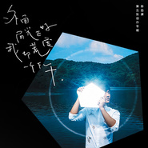

外面阳光正好 我却荒废一个下午
============================

|  |  |
| :--: | :-- |
| [ 外面阳光正好 我却荒废一个下午](https://emumo.xiami.com/album/2100372402) | **艺人**: [陈劭康](../index.md) **语种**: 国语 **唱片公司**: 百慕文化 **发行时间**: 2016年07月26日 **专辑类别**: 录音室专辑 **专辑风格**:  **播放数**: 137304 **收藏数**: 127 **评论数**: 19  |

## 简介

 
 

陈劭康Komic 2016全词曲创作专辑
 

《外面阳光正好我却荒废一个下午》
 

 
 

八年潜心词曲创作，
 

十首暖意文艺小品，
 

来自南方的温柔声线，
 

唱某个角落的荒废青春。
 

 
 

&nbsp;&nbsp; &nbsp;《外面阳光正好 我却荒废一个下午》是以一个失败者的角度，探讨生命存在的意义。每个人都在社会中力争上游，追名逐利，而忽视了身边最普通最平凡的美好。十首歌曲，希望唱出平凡社会人的心声，返璞归真，找回最单纯、最简单的自己。
 

&nbsp;&nbsp;&nbsp;专辑由陈劭康KOMIC创办的音乐厂牌“糠米音乐”独立制作，包办全部词曲创作及演唱，吉他编曲的部分则与在吉他演奏圈极富盛名的李健宇合作，十首歌曲全部由吉他伴奏Acoustic的形式，用最简单的形式衬托陈劭康KOMIC清澈淳朴的声音。专辑的风格也跳脱出以往陈劭康KOMIC的阳光活泼，展现了更多对社会关怀、深沉思考的另一面。
 

&nbsp;&nbsp;&nbsp;另外，《外面阳光正好 我却荒废一个下午》同步推出了实体专辑，在拍摄创意发想、包装设计上陈劭康KOMIC更是投入不少精力。专辑由糠米音乐独立制作，由百慕文化全网发行。
 

 

## 曲目

## 评论

|  |  |  |
| :-- | :-- | :-- |
|  [虾米用户](https://emumo.xiami.com/u/430159199)  2019-10-14 23:31 赞(0) 踩(0) | 
平静的夜晚，暖暖的弦乐，遇见另一个在和你轻轻诉说心情
 |
|  [虾米用户](https://emumo.xiami.com/u/9423208) 勿忘初心…… 2017-05-21 23:17 赞(0) 踩(0) | 
康康，加油！ 这是一张非常棒的专辑 
 |
|  [虾米用户](https://emumo.xiami.com/u/454506) 我还没想好要写什么... 2016-09-10 03:48 赞(1) 踩(0) | 
聽到我好喜歡的吳听徹的細膩感 支撐
 |
|  [虾米用户](https://emumo.xiami.com/u/2268483)  2016-08-04 22:16 赞(0) 踩(0) | 
声音好听，歌词不错
 |
|  [虾米用户](https://emumo.xiami.com/u/9236928)  2016-08-04 22:03 赞(0) 踩(0) | 
这个声音我喜欢啊。。。。
 |
|  [虾米用户](https://emumo.xiami.com/u/3815293) baby Jesus s... 2016-08-03 00:25 赞(0) 踩(0) | 
第一首无亮点，其他再慢慢听
 |
|  [虾米用户](https://emumo.xiami.com/u/3227043)  2016-08-02 15:26 赞(1) 踩(0) | 
我就知道下面这里会有小p哈哈哈哈
 |
|  [虾米用户](https://emumo.xiami.com/u/292888)  2016-08-02 10:42 赞(0) 踩(0) | 
灵感是葛优躺吗？
 |
| ⇒ |  [虾米用户](https://emumo.xiami.com/u/1418053) 我可努力啦！ 2016-08-08 01:37 赞(0) 踩(0) | 
哈哈哈哈哈哈
 |
|  [虾米用户](https://emumo.xiami.com/u/207887979)  2016-08-01 23:36 赞(0) 踩(0) | 
安静的歌！很美
 |
|  [虾米用户](https://emumo.xiami.com/u/8244559)  2016-07-27 14:13 赞(1) 踩(0) | 
******
 |
|  [虾米用户](https://emumo.xiami.com/u/1882463) 我还没想好要写什么... 2016-07-27 12:32 赞(3) 踩(0) | 
之前听蒸汽认识他，真的是个不错的创作歌手
 |
|  [虾米用户](https://emumo.xiami.com/u/12878826) 谢谢陪伴 再见哦！ 2016-07-27 11:03 赞(0) 踩(0) | 
 
 |
|  [虾米用户](https://emumo.xiami.com/u/3815293) baby Jesus s... 2016-07-27 01:26 赞(0) 踩(0) | 
看到小p，决定听一听
 |
| ⇒ |  [虾米用户](https://emumo.xiami.com/u/1418053) 我可努力啦！ 2016-08-08 01:38 赞(0) 踩(0) | 
我好好奇你是誰喔
 |
| ⇒ |  [虾米用户](https://emumo.xiami.com/u/3815293) baby Jesus s... 2016-08-08 09:41 赞(0) 踩(0) | 
<q><b>何小P说：</b></q>
 |
| ⇒ |  [虾米用户](https://emumo.xiami.com/u/1418053) 我可努力啦！ 2016-08-09 04:14 赞(0) 踩(0) | 
<q><b>鹿余肆说：</b></q>
 |
|  [虾米用户](https://emumo.xiami.com/u/1418053) 我可努力啦！ 2016-07-26 15:20 赞(2) 踩(0) | 
被封為「最」，是因為真的很難得才能聽到一位大陸言之有物的音樂人作品！而康康寫了一整張坦誠又動人的生活告白！可貴！
 |
|  [虾米用户](https://emumo.xiami.com/u/1418053) 我可努力啦！ 2016-07-26 15:18 赞(2) 踩(0) | 
最近聽到最好聽最值得買的唱片！
 |
