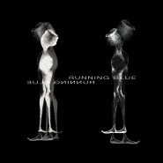

Running Blue
============================

|  |  |
| :--: | :-- |
| [ Running Blue](https://emumo.xiami.com/album/2103622697) | **艺人**: [Running Blue](../index.md) **语种**: 英语 **唱片公司**: Space Circle **发行时间**: 2018年03月21日 **专辑类别**: 录音室专辑 **专辑风格**: 迷幻流行 Psychedelic Pop, 梦幻流行 Dream Pop, 电子 Electronic **播放数**: 279125 **收藏数**: 398 **评论数**: 54  |

## 简介

 
 

Running Blue首张同名专辑“Running Blue”，呈现了乐队多年的音乐轨迹。风格多样，包含了
 

梦幻流行、迷幻流行、独立电子、神游舞曲、独立摇滚、缓拍等。
 

Running Blue’s first album “Running Blue”,it presents the music trajectory of the band for many years. The style is diverse, inclusive: Dream pop、Psychedelic Pop、Electronic、Trip Hop、Indie Rock、Downtempo and so on。
 

 

## 曲目

## 评论

|  |  |  |
| :-- | :-- | :-- |
|  [虾米用户](https://emumo.xiami.com/u/78124118) 不可以荒废自己 2019-10-20 13:42 赞(0) 踩(0) | 
神仙宝贝专
 |
|  [虾米用户](https://emumo.xiami.com/u/7292098) 我們不斷相遇 在未來里 2019-10-19 09:29 赞(0) 踩(0) | 
留
 |
|  [虾米用户](https://emumo.xiami.com/u/6981661) 我还没想好要写什么... 2019-08-20 03:17 赞(0) 踩(0) | 
kkk
 |
|  [虾米用户](https://emumo.xiami.com/u/43648786) 安静的知了 2019-08-09 23:08 赞(0) 踩(0) | 

 |
|  [虾米用户](https://emumo.xiami.com/u/346087991) 医路漫漫 音乐为伴 2019-07-24 10:32 赞(0) 踩(0) | 
看了半天封面才想起来还没开始听
 |
|  [虾米用户](https://emumo.xiami.com/u/36938932) 倒霉的小伙子比洞還潮濕的... 2019-07-08 01:59 赞(0) 踩(0) | 

 |
|  [虾米用户](https://emumo.xiami.com/u/30800139) 我在低俗与高雅间活的很尴... 2019-06-25 15:54 赞(0) 踩(0) | 
。
 |
|  [虾米用户](https://emumo.xiami.com/u/73001890)  2019-04-18 09:32 赞(0) 踩(0) | 
这是什么神仙组合，太棒了。 
 |
|  [虾米用户](https://emumo.xiami.com/u/2154872) 新浪潮/后朋克  2019-04-17 23:43 赞(2) 踩(0) | 
中国不是没有优秀的音乐人 太多了 反而我觉得是没有优秀的耳朵和听众。
 |
|  [虾米用户](https://emumo.xiami.com/u/344018512) 我还没想好要写什么... 2019-04-16 15:29 赞(0) 踩(0) | 
D
 |
|  [虾米用户](https://emumo.xiami.com/u/4131849) 网易云：非人類兔子Agy... 2019-04-16 15:27 赞(0) 踩(0) | 
慢慢听
 |
|  [虾米用户](https://emumo.xiami.com/u/10524743) 此刻时光不回眸.... 2019-03-25 12:38 赞(1) 踩(0) | 
签名黑胶到手 
 |
| ⇒ |  [虾米用户](https://emumo.xiami.com/u/188661) 我还没想好要写什么... 2020-05-21 17:36 赞(0) 踩(0) | 
黑胶哪里买？
 |
| ⇒ |  [虾米用户](https://emumo.xiami.com/u/10524743) 此刻时光不回眸.... 2020-06-03 01:24 赞(0) 踩(0) | 
<q><b>噗噜噗噜说：</b></q>
 |
|  [虾米用户](https://emumo.xiami.com/u/126565880) 我还没想好要写什么... 2019-03-08 00:25 赞(0) 踩(0) | 
已买
 |
|  [虾米用户](https://emumo.xiami.com/u/951418) 一切过往，皆为序章。 2019-02-21 02:31 赞(0) 踩(0) | 

 |
|  [虾米用户](https://emumo.xiami.com/u/23107559)  2019-02-16 02:58 赞(0) 踩(0) | 

 |
|  [虾米用户](https://emumo.xiami.com/u/11472475) 我还没想好要写什么... 2018-12-30 00:28 赞(0) 踩(0) | 
黑胶已拿到手！
 |
|  [虾米用户](https://emumo.xiami.com/u/215911403) もも 2018-12-29 14:42 赞(0) 踩(0) | 
愛
 |
|  [虾米用户](https://emumo.xiami.com/u/8798908) Don’t stop t... 2018-11-20 18:45 赞(0) 踩(0) | 
耳朵一亮
 |
|  [虾米用户](https://emumo.xiami.com/u/4383336) 个人网站：www.pxy... 2018-11-05 00:06 赞(0) 踩(0) | 
—  2018最佳唱片【Album 110】—
 |
|  [虾米用户](https://emumo.xiami.com/u/7343217)   2018-10-01 18:13 赞(0) 踩(0) | 
确认过了，确实trip
 |
|  [虾米用户](https://emumo.xiami.com/u/215911403) もも 2018-04-29 03:32 赞(0) 踩(0) | 
mark
 |
|  [虾米用户](https://emumo.xiami.com/u/162792732) SASA 2018-04-18 18:40 赞(0) 踩(0) | 

 |
|  [虾米用户](https://emumo.xiami.com/u/201391232) 谢谢虾米，你们是我。 2018-04-16 19:58 赞(0) 踩(0) | 
彡
 |
|  [虾米用户](https://emumo.xiami.com/u/7714008) A good man d... 2018-04-15 21:18 赞(0) 踩(0) | 
黑胶可以有
 |
|  [虾米用户](https://emumo.xiami.com/u/2946271)  2018-04-11 02:05 赞(1) 踩(0) | 
好！比portish head梦幻
 |
|  [虾米用户](https://emumo.xiami.com/u/14637601)  2018-04-10 13:58 赞(0) 踩(0) | 
没有无损 不购买了，好音乐更需要好音质！
 |
| ⇒ |  [虾米用户](https://emumo.xiami.com/u/15018095) 听歌曲儿 什么都听 歌单... 2018-04-12 18:34 赞(0) 踩(0) | 
马上出黑胶哦 欢迎关注官方微信和微博
 |
|  [虾米用户](https://emumo.xiami.com/u/15018095) 听歌曲儿 什么都听 歌单... 2018-04-08 22:58 赞(1) 踩(0) | 
精致 唯美 浪漫
 |
|  [虾米用户](https://emumo.xiami.com/u/193722223) beautiful li... 2018-04-08 16:43 赞(0) 踩(0) | 

 |
|  [虾米用户](https://emumo.xiami.com/u/9972139) -Welcome to ... 2018-04-08 16:12 赞(2) 踩(0) | 
接下来就期待巡演了
 |
|  [虾米用户](https://emumo.xiami.com/u/3444046) X 2018-04-08 13:25 赞(0) 踩(0) | 
Yeah!
 |
|  [虾米用户](https://emumo.xiami.com/u/16255463)   2018-04-08 13:07 赞(1) 踩(0) | 
Finally!!!
 |
|  [虾米用户](https://emumo.xiami.com/u/41583929)   2018-04-08 12:57 赞(0) 踩(0) | 
从2014年听到Honey 便深深喜欢上这个调调 一直到今天依然爱着这首歌 每一首深爱着歌的背后都有一段不可忘却的过去 整张专辑也是很棒 未来的日子里 我会继续爱着你 ❤️
 |
|  [虾米用户](https://emumo.xiami.com/u/13603829) 喜欢就行 2018-04-08 12:41 赞(0) 踩(0) | 
～
 |
|  [虾米用户](https://emumo.xiami.com/u/43805130) 网易:SIonsoNOk... 2018-04-08 12:31 赞(1) 踩(0) | 

 |
|  [虾米用户](https://emumo.xiami.com/u/118129640) 一个废物 2018-04-08 12:23 赞(0) 踩(0) | 

 |
|  [虾米用户](https://emumo.xiami.com/u/41583929)   2018-04-08 12:20 赞(0) 踩(0) | 
终于来了 
 |
|  [虾米用户](https://emumo.xiami.com/u/13555511) 听蛙 2018-04-08 11:56 赞(0) 踩(0) | 
♡
 |
|  [虾米用户](https://emumo.xiami.com/u/300080648)  2018-04-08 11:55 赞(1) 踩(0) | 
呼吸..
 |
|  [虾米用户](https://emumo.xiami.com/u/6741767)  2018-04-08 11:53 赞(0) 踩(0) | 

 |
|  [虾米用户](https://emumo.xiami.com/u/27402557) The Slaughte... 2018-04-08 11:52 赞(0) 踩(0) | 

 |
|  [虾米用户](https://emumo.xiami.com/u/34960665) Music like f... 2018-04-08 11:49 赞(0) 踩(0) | 
第一首歌听了快五年
 |
|  [虾米用户](https://emumo.xiami.com/u/48898343) 生命已经过期 2018-04-02 16:07 赞(0) 踩(0) | 

 |
|  [虾米用户](https://emumo.xiami.com/u/4282037)   2018-03-30 00:20 赞(0) 踩(0) | 
温柔且孤独。完美
 |
|  [虾米用户](https://emumo.xiami.com/u/85165792) COMING 2018-03-26 16:19 赞(0) 踩(0) | 
.
 |
|  [虾米用户](https://emumo.xiami.com/u/9972139) -Welcome to ... 2018-03-21 22:36 赞(0) 踩(0) | 

 |
|  [虾米用户](https://emumo.xiami.com/u/59301256) 我还没想好要写什么... 2018-03-21 12:14 赞(1) 踩(0) | 
甜心
 |
|  [虾米用户](https://emumo.xiami.com/u/4047285) Sønn av Mørk... 2018-03-21 08:46 赞(0) 踩(0) | 
vakker.
 |
|  [虾米用户](https://emumo.xiami.com/u/36057872) 网易/BC: Breat... 2018-03-21 00:11 赞(0) 踩(0) | 
期待全专
 |
| ⇒ |  [虾米用户](https://emumo.xiami.com/u/1681248) Everything w... 2018-04-08 13:28 赞(0) 踩(0) | 
全砖来咯
 |
|  [虾米用户](https://emumo.xiami.com/u/304400922) 我还没想好要写什么... 2018-03-21 00:05 赞(0) 踩(0) | 
now i want listen
 |
|  [虾米用户](https://emumo.xiami.com/u/4015583) 永遠的蝦米 2018-03-21 00:02 赞(1) 踩(0) | 

 |
