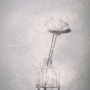

The Dreams
============================

|  |  |
| :--: | :-- |
| [ The Dreams](https://emumo.xiami.com/album/2104764193) | **艺人**: [Running Blue](../index.md) **语种**: 英语 **唱片公司**: Space Circle **发行时间**: 2019年04月16日 **专辑类别**: EP, 单曲 **专辑风格**: 梦幻流行 Dream Pop, 电子 Electronic, 迷幻流行 Psychedelic Pop **播放数**: 658526 **收藏数**: 126 **评论数**: 44  |

## 简介

梦想，难以名状。它们只存活于很少一部分人身上，只存在于人生中极短的一段时光。然而即便有人看到了那条路上的风景，也很难与他人共享。电子流行二人组Running Blue用最新单曲「The Dreams」表达了对于“逝去”的怅然若失之感。  
  
优美旋律、呼吸般的节奏和飘渺人声，如同潮水渗透身体，将你带到回忆中最美好的部分，然后轻轻唤醒你。「The Dreams」描绘出短暂绚烂的夏夜之梦，虚幻但并不悲观，醒来时分也能让你感到一丝梦的余温。

## 曲目

## 评论

|  |  |  |
| :-- | :-- | :-- |
|  [虾米用户](https://emumo.xiami.com/u/115195750) smoke on the... 2020-10-29 11:07 赞(0) 踩(0) | 
演出吗有
 |
|  [虾米用户](https://emumo.xiami.com/u/427384237) 我还没想好要写什么... 2020-10-24 18:19 赞(0) 踩(0) | 
➕
 |
|  [虾米用户](https://emumo.xiami.com/u/435398623)  2020-08-13 23:38 赞(0) 踩(0) | 
your rhythm touched my heart, and the rest of my tonight's time  will be yours: I will keep this rolling till down arrive. thank you for the beauty in this sound and relaxation.
 |
|  [虾米用户](https://emumo.xiami.com/u/363283375)  2020-08-09 02:55 赞(0) 踩(0) | 
太棒了，很精致，不会轻易的听腻，每次听都会发现新的细节
 |
|  [虾米用户](https://emumo.xiami.com/u/8781111) ⚡ 2020-07-12 01:16 赞(0) 踩(0) | 
挺美！
 |
|  [虾米用户](https://emumo.xiami.com/u/73740960)  2020-06-16 21:22 赞(0) 踩(0) | 
焦虑缓冲剂
 |
|  [虾米用户](https://emumo.xiami.com/u/355288494)  2020-05-25 21:04 赞(0) 踩(0) | 
真好听！一次美妙的享受
 |
|  [虾米用户](https://emumo.xiami.com/u/426852495)  2020-04-14 18:04 赞(0) 踩(0) | 
⊙﹏⊙
 |
|  [虾米用户](https://emumo.xiami.com/u/274740625) 竹子 2020-04-01 01:56 赞(0) 踩(0) | 
跟我的往事双生
 |
|  [虾米用户](https://emumo.xiami.com/u/9944242) 食色性也  2020-02-28 19:23 赞(0) 踩(0) | 
收
 |
|  [虾米用户](https://emumo.xiami.com/u/4487129)  2020-02-07 21:46 赞(0) 踩(0) | 
！！！
 |
|  [虾米用户](https://emumo.xiami.com/u/38607732) 我还没想好要写什么... 2020-01-26 12:34 赞(0) 踩(0) | 
原来是国内的乐队，深深被他们的音乐迷住，太棒了
 |
| ⇒ |  [虾米用户](https://emumo.xiami.com/u/435398623)  2020-08-13 23:31 赞(0) 踩(0) | 
are you sure?
 |
|  [虾米用户](https://emumo.xiami.com/u/320037552) 听了个寂寞.... 2020-01-02 23:22 赞(0) 踩(0) | 
单曲循环听了三天，灵魂飞行沉迷其中…… 歌词写得太美太真实！女声非常迷幻，大爱！
 |
|  [虾米用户](https://emumo.xiami.com/u/25679008) 抓紧时间听音乐 2019-08-17 11:08 赞(1) 踩(0) | 
梦中飘渺的声音，相当治愈。
 |
|  [虾米用户](https://emumo.xiami.com/u/66823378)  2019-07-17 23:02 赞(0) 踩(0) | 

 |
|  [虾米用户](https://emumo.xiami.com/u/30800139) 我在低俗与高雅间活的很尴... 2019-06-25 15:51 赞(0) 踩(0) | 
。
 |
|  [虾米用户](https://emumo.xiami.com/u/353395594) Clownpei 2019-04-23 01:02 赞(0) 踩(0) | 
Connected two hearts through 5700kms. Thx Running Blue.
 |
|  [虾米用户](https://emumo.xiami.com/u/11472475) 我还没想好要写什么... 2019-04-22 00:33 赞(0) 踩(0) | 
很不错的一首歌曲。
 |
|  [虾米用户](https://emumo.xiami.com/u/4015583) 永遠的蝦米 2019-04-20 15:38 赞(1) 踩(0) | 

 |
|  [虾米用户](https://emumo.xiami.com/u/10002164) 其实我想好写什么了我就是... 2019-04-19 14:05 赞(0) 踩(0) | 
国内音乐之光！哈哈哈哈哈
 |
|  [虾米用户](https://emumo.xiami.com/u/5960906) hateu 2019-04-18 20:36 赞(1) 踩(0) | 
舒服
 |
|  [虾米用户](https://emumo.xiami.com/u/112868404) 这么多年一直陪伴在身边的... 2019-04-18 12:29 赞(0) 踩(0) | 
孤独，伤感！会让你想起你最爱的人。。。。
 |
|  [虾米用户](https://emumo.xiami.com/u/73001890)  2019-04-18 10:54 赞(1) 踩(0) | 
国内有这种组合，简直惊艳。 仿佛坠入无尽的梦里。
 |
|  [虾米用户](https://emumo.xiami.com/u/378252368) 我还没想好要写什么... 2019-04-18 03:09 赞(0) 踩(0) | 
喜欢！
 |
|  [虾米用户](https://emumo.xiami.com/u/93262908) W&X  2019-04-18 00:31 赞(1) 踩(0) | 
非常非常非常棒
 |
|  [虾米用户](https://emumo.xiami.com/u/9526821)  2019-04-17 18:06 赞(0) 踩(0) | 
我觉得好听才花钱买的.
 |
|  [虾米用户](https://emumo.xiami.com/u/410866210) 鲸鱼马戏团正义！ 2019-04-17 17:22 赞(0) 踩(0) | 
很喜欢Running Blue.
 |
|  [虾米用户](https://emumo.xiami.com/u/15477519) 爱  是生命的和弦，而不... 2019-04-17 12:42 赞(6) 踩(0) | 
依然那么美妙动听…
 |
|  [虾米用户](https://emumo.xiami.com/u/11472475) 我还没想好要写什么... 2019-04-17 00:21 赞(0) 踩(0) | 
这张会出黑胶吗、想买你第二张黑胶，麻烦给个回复！
 |
|  [虾米用户](https://emumo.xiami.com/u/344018512) 我还没想好要写什么... 2019-04-16 15:28 赞(0) 踩(0) | 
D
 |
|  [虾米用户](https://emumo.xiami.com/u/277512940) 躬身入局 2019-04-16 13:48 赞(1) 踩(0) | 
有共鸣的好专辑！
 |
|  [虾米用户](https://emumo.xiami.com/u/13549294)   2019-04-16 13:27 赞(0) 踩(0) | 
好听！！
 |
|  [虾米用户](https://emumo.xiami.com/u/49765922)  2019-04-16 12:44 赞(0) 踩(0) | 

 |
|  [虾米用户](https://emumo.xiami.com/u/344018512) 我还没想好要写什么... 2019-04-16 09:10 赞(1) 踩(0) | 
D
 |
|  [虾米用户](https://emumo.xiami.com/u/1259073) 线段 2019-04-16 07:34 赞(0) 踩(0) | 
入梦了
 |
|  [虾米用户](https://emumo.xiami.com/u/45600728) 时光就变成了烟 2019-04-16 03:09 赞(0) 踩(0) | 
19年巡演是什么时候…
 |
|  [虾米用户](https://emumo.xiami.com/u/261090991) 你  就是我的病 2019-04-16 01:37 赞(0) 踩(0) | 
推荐！
 |
|  [虾米用户](https://emumo.xiami.com/u/23535893)  2019-04-15 23:07 赞(0) 踩(0) | 
听了新曲，真的觉得我最近收藏的歌都是屎 好久没有被这样打动了
 |
|  [虾米用户](https://emumo.xiami.com/u/331329928)  2019-04-15 22:36 赞(0) 踩(0) | 
梦醒时分
 |
|  [虾米用户](https://emumo.xiami.com/u/31531934) 恋の道に近道はない 2019-04-15 22:24 赞(0) 踩(0) | 
get
 |
|  [虾米用户](https://emumo.xiami.com/u/266461620) 这家伙挺懒，虾米里什么都... 2019-04-15 22:06 赞(0) 踩(0) | 
梦一场
 |
|  [虾米用户](https://emumo.xiami.com/u/45686435) 爱虾米！期待我们再见的那... 2019-04-15 22:02 赞(0) 踩(0) | 
夢が
 |
|  [虾米用户](https://emumo.xiami.com/u/51642514) 因虾米即将停止服务，且本... 2019-04-15 22:01 赞(0) 踩(0) | 
老味道
 |
