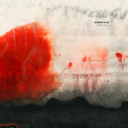

Golden Sea
============================

|  |  |
| :--: | :-- |
| [ Golden Sea](https://emumo.xiami.com/album/5021352021) | **艺人**: [Running Blue](../index.md) **语种**: 英语 **唱片公司**: Space Circle **发行时间**: 2020年08月26日 **专辑类别**: EP, 单曲 **专辑风格**: 迷幻流行 Psychedelic Pop **播放数**: 167511 **收藏数**: 45 **评论数**: 19  |

## 简介

 金色的岁月、金色的心灵如同金色的海洋一般闪耀、永恒。

 每个人心中都有一片金色的海洋，一个属于自我的纯净之地。

 任岁月流逝，那里依然平和、不朽。

 

## 曲目

## 评论

|  |  |  |
| :-- | :-- | :-- |
|  [虾米用户](https://emumo.xiami.com/u/316509349) 梦是不死的欲望 2020-12-01 21:59 赞(0) 踩(0) | 
付不了
 |
|  [虾米用户](https://emumo.xiami.com/u/10170789) 最後一天 网易：Gimm... 2020-09-04 22:16 赞(0) 踩(0) | 
❤️
 |
|  [虾米用户](https://emumo.xiami.com/u/11472475) 我还没想好要写什么... 2020-09-01 15:44 赞(1) 踩(0) | 
一贯的风格，但是这首单曲并没有给我很惊艳的感觉。情绪表达的虽然挺出色的，但是希望能给我更加惊艳的听觉
 |
|  [虾米用户](https://emumo.xiami.com/u/9858055) . 2020-08-31 01:30 赞(3) 踩(0) | 
已买   
 |
|  [虾米用户](https://emumo.xiami.com/u/15848406) 我还没想好要写什么... 2020-08-27 16:49 赞(0) 踩(0) | 

 |
|  [虾米用户](https://emumo.xiami.com/u/42963872) 我还没想好要写什么... 2020-08-27 15:26 赞(0) 踩(0) | 
～
 |
|  [虾米用户](https://emumo.xiami.com/u/344018512) 我还没想好要写什么... 2020-08-27 14:17 赞(0) 踩(0) | 
D
 |
|  [虾米用户](https://emumo.xiami.com/u/307081947) Let it be… 2020-08-27 12:41 赞(0) 踩(0) | 
依旧好听！迷幻的梦境！
 |
|  [虾米用户](https://emumo.xiami.com/u/358995000) 散场本是常态 尽兴而归就... 2020-08-27 08:37 赞(3) 踩(0) | 
☽
 |
|  [虾米用户](https://emumo.xiami.com/u/93262908) W&X  2020-08-27 07:47 赞(1) 踩(0) | 
感谢创作如此美好的音乐
 |
|  [虾米用户](https://emumo.xiami.com/u/37795160)  2020-08-27 00:00 赞(0) 踩(0) | 
挺好的。希望多出好音乐。
 |
|  [虾米用户](https://emumo.xiami.com/u/4849372) 「无暇失恋」. 2020-08-26 23:52 赞(1) 踩(0) | 
吉光片羽 遥夜寄梦. 失语温柔.
 |
|  [虾米用户](https://emumo.xiami.com/u/31531934) 恋の道に近道はない 2020-08-26 23:43 赞(0) 踩(0) | 

 |
|  [虾米用户](https://emumo.xiami.com/u/201391232) 谢谢虾米，你们是我。 2020-08-26 23:37 赞(0) 踩(0) | 
❤️
 |
|  [虾米用户](https://emumo.xiami.com/u/375676211) 我还没想好要写什么... 2020-08-26 23:12 赞(0) 踩(0) | 
来了
 |
|  [虾米用户](https://emumo.xiami.com/u/355288494)  2020-08-26 23:01 赞(1) 踩(0) | 
这个音乐人太了不起了，特喜欢听她创作的音乐，太好听了～
 |
|  [虾米用户](https://emumo.xiami.com/u/8070377) 爱雾瑞性维欧腐漏 2020-08-26 14:26 赞(2) 踩(0) | 
很完整的作品 整体感很强 流畅流畅流畅 厉害厉害厉害
 |
|  [虾米用户](https://emumo.xiami.com/u/11472475) 我还没想好要写什么... 2020-08-26 13:26 赞(0) 踩(0) | 
不错
 |
|  [虾米用户](https://emumo.xiami.com/u/346089809) 讓 我來 當  你的  ... 2020-08-26 12:32 赞(0) 踩(0) | 
一贯的风格
 |
