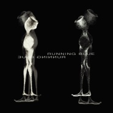
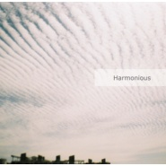
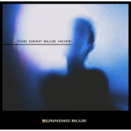
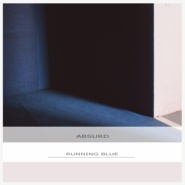
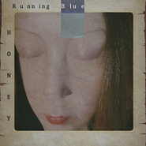
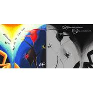

Running Blue
============================

|  |  |
| :--: | :-- |
| [ Running Blue](https://i.xiami.com/blue) | **播放数**: 3273306 **粉丝数**: 5305 **评论数**: 253 **地区**: China 中国大陆 **风格**: 档案：  |

## 档案

风格：Indietronica，Psychedelic Pop 
乐队高能高产的创作效率，不仅体现在数量上，同时每首歌都有不同的亮点和令人惊喜的细节体现。唯美精致的旋律与低沉暗涌的律动，吉他与合成器的亦原声亦失真的相互辉映，主唱极具个人气质的演唱和迷幻的歌词，都带给听众每每直达人心的共鸣。 
成员：两乎， 殷浩 
两位成员均来自于上海。 
两乎作为Running Blue的核心，包办了乐队大部分作品创作，音乐创作之外更在声音、绘画、多媒体等当代艺术领域独树一帜； 
殷浩于90年代开始投身独立音乐，组建历经多只极具特点的乐队，作为JUNKYARD、另一种光亮等风格各异的乐队主唱或核心成员， 06年解散并退出所有的乐队，潜心专注电子音乐的制作。制作和混音方面的超前理念且极具特点，曾受邀与格莱美知名制作人Hector Castillo深度合作。 
演出： 
Running Blue的音乐维度极为宽广，在不同领域的合作深度亦让人赞赏乐队精致的多面化。不仅经常受邀作为如：Blue Foundation、Perfume Genius、Postiljonend等国外来华的知名乐队的邀请嘉宾出演，也经常在诸如JZ音乐节等大型演出嘉年华上出现身影。也有在当代艺术领域有过诸如卡巴科夫：理想之城之理想音乐会 这样完全艺术性质的不同音乐意识形态的精彩呈现。

## 专辑

| 名称 | 语种 | 唱片公司 | 发行时间 | 专辑类别 | 专辑风格 |
| :--: | :-- | :-- | :-- | :-- | :-- |
| [ Golden Sea](./albums/5021352021.md) | 英语 | Space Circle | 2020年08月26日 | EP, 单曲 | 迷幻流行 Psychedelic Pop |
| [ Silence](./albums/2105161847.md) | 英语 | Space Circle | 2019年08月30日 | EP, 单曲 | 独立电子乐 Indietronica, 电子 Electronic, 艺术流行 Art Pop |
| [ The Dreams](./albums/2104764193.md) | 英语 | Space Circle | 2019年04月16日 | EP, 单曲 | 梦幻流行 Dream Pop, 电子 Electronic, 迷幻流行 Psychedelic Pop |
| [ Running Blue](./albums/2103622697.md) | 英语 | Space Circle | 2018年03月21日 | 录音室专辑 | 迷幻流行 Psychedelic Pop, 梦幻流行 Dream Pop, 电子 Electronic |
| [ Harmonious](./albums/2102403034.md) | 英语 | 独立发行 | 2016年09月26日 | EP, 单曲 |  |
| [ Frozen](./albums/2100365664.md) | 英语 | 独立发行 | 2016年07月11日 | EP, 单曲 |  |
| [ The Deep Blue Hope](./albums/2100361951.md) | 英语 | 独立发行 | 2016年07月03日 | EP, 单曲 |  |
| [ 悶](./albums/2100361987.md) | 英语 | 独立发行 | 2016年07月03日 | EP, 单曲 | 艺术流行 Art Pop, 电音流行 Electropop, 迷幻流行 Psychedelic Pop |
| [ Lost](./albums/2100361981.md) | 英语 | 独立发行 | 2016年07月03日 | EP, 单曲 |  |
| [ Absurd](./albums/2100361970.md) | 英语 | 独立发行 | 2016年07月03日 | EP, 单曲 |  |
| [ RASS](./albums/2100361958.md) | 英语 | 独立发行 | 2016年07月03日 | EP, 单曲 |  |
| [ Anything](./albums/2100354275.md) | 英语 | 独立发行 | 2016年06月14日 | EP, 单曲 |  |
| [ Honey](./albums/2100352802.md) | 英语 | 独立发行 | 2016年06月11日 | EP, 单曲 |  |
| [ All Of US Can See](./albums/470592.md) | 国语 |  | 2010年01月01日 | EP, 单曲 |  |

## 评论

|  |  |  |  |
| :-- | :-- | :-- | :-- |
|  [虾米用户](https://emumo.xiami.com/u/446227591) 游泳池小便的人 2021-01-27 22:48 赞(0) 踩(0) | 
呜呜
 |
|  [虾米用户](https://emumo.xiami.com/u/117443374) 散发温柔 2021-01-24 23:08 赞(0) 踩(0) | 
发现了宝藏
 |
|  [虾米用户](https://emumo.xiami.com/u/252923075) 不做就不做，闲云野鹤也不... 2021-01-22 11:13 赞(0) 踩(0) | 
啊啊感谢虾米，还好发现了不然转平台之后就可能发现不了 
 |
|  [虾米用户](https://emumo.xiami.com/u/49334418) ～ 2021-01-02 11:16 赞(0) 踩(0) | 
～
 |
|  [虾米用户](https://emumo.xiami.com/u/12181015) 朝闻佳音，夕可死矣。 2020-11-24 18:48 赞(0) 踩(0) | 
国产之光
 |
|  [虾米用户](https://emumo.xiami.com/u/180847) 只有心知道 岁月不宽宏 2020-11-18 09:55 赞(0) 踩(0) | 
，
 |
|  [虾米用户](https://emumo.xiami.com/u/15928974) 去看海 2020-10-04 21:02 赞(1) 踩(0) | 
看到中国内地，我只觉得牛逼！！！！
 |
|  [虾米用户](https://emumo.xiami.com/u/143157) 我还没想好要写什么... 2020-10-01 10:54 赞(1) 踩(0) | 
下载了这么久，一直以为是外国乐队。失敬失敬
 |
|  [虾米用户](https://emumo.xiami.com/u/5109027)  2020-09-26 11:22 赞(0) 踩(0) | 
惊呆了 以为是外国的
 |
|  [虾米用户](https://emumo.xiami.com/u/6775979) 我还没想好要写什么... 2020-09-25 00:24 赞(0) 踩(0) | 
这家的cover审美在线
 |
|  [虾米用户](https://emumo.xiami.com/u/343737395) heres my key 2020-09-21 05:40 赞(0) 踩(0) | 

 |
|  [虾米用户](https://emumo.xiami.com/u/110088060) 作为报答、我吔给泥放点、... 2020-09-16 00:43 赞(0) 踩(0) | 
累死个人喇
 |
|  [虾米用户](https://emumo.xiami.com/u/10170789) ig：gim_x  网易... 2020-09-04 22:15 赞(0) 踩(0) | 
愛
 |
|  [虾米用户](https://emumo.xiami.com/u/273729608) 取暖. 2020-09-04 06:56 赞(0) 踩(0) | 
惊呆了，竟然是上海人
 |
|  [虾米用户](https://emumo.xiami.com/u/159516870) 童言无忌，年龄吹去。 2020-09-03 13:17 赞(0) 踩(0) | 
宝藏
 |
|  [虾米用户](https://emumo.xiami.com/u/121702052) 超脱 2020-08-27 00:34 赞(0) 踩(0) | 
  太棒了
 |
|  [虾米用户](https://emumo.xiami.com/u/8070377) 爱雾瑞性维欧腐漏 2020-08-26 14:24 赞(1) 踩(0) | 

 |
|  [虾米用户](https://emumo.xiami.com/u/9478491) 舌尖紋了瑪利亞 2020-08-24 00:04 赞(1) 踩(0) | 

 |
|  [虾米用户](https://emumo.xiami.com/u/188661) 我还没想好要写什么... 2020-08-08 09:52 赞(1) 踩(0) | 
求一个黑胶
 |
| ⇒ |  [虾米用户](https://emumo.xiami.com/u/11472475) 我还没想好要写什么... 2020-08-14 00:18 赞(0) 踩(0) | 
微店还有最后四张，可以要求签名，谢谢支持
 |
|  [虾米用户](https://emumo.xiami.com/u/515489) 我还没想好要写什么... 2020-08-07 00:28 赞(2) 踩(0) | 
一焦虑我就回来听了ㅠㅠ
 |
|  [虾米用户](https://emumo.xiami.com/u/42405531) 再见虾米 2020-07-24 12:44 赞(0) 踩(0) | 
牛批
 |
|  [虾米用户](https://emumo.xiami.com/u/432171538)  2020-07-05 19:48 赞(0) 踩(0) | 
好听
 |
|  [虾米用户](https://emumo.xiami.com/u/356763773) 我还没想好要写什么... 2020-06-22 00:15 赞(1) 踩(0) | 
~
 |
|  [虾米用户](https://emumo.xiami.com/u/46406743)   2020-06-18 14:21 赞(2) 踩(0) | 
什么时候还有巡演呀 好想看
 |
|  [虾米用户](https://emumo.xiami.com/u/440388097) 我还没想好要写什么... 2020-06-15 08:49 赞(0) 踩(0) | 
我爱死你们了
 |
|  [虾米用户](https://emumo.xiami.com/u/73740960)  2020-06-02 16:55 赞(1) 踩(0) | 

 |
|  [虾米用户](https://emumo.xiami.com/u/344018512) 我还没想好要写什么... 2020-05-17 10:24 赞(2) 踩(0) | 
D
 |
|  [虾米用户](https://emumo.xiami.com/u/16022481) 我还没想好要写什么... 2020-05-11 00:47 赞(1) 踩(0) | 
Made in China！
 |
|  [虾米用户](https://emumo.xiami.com/u/73740960)  2020-05-01 18:04 赞(0) 踩(0) | 
( &amp;bull;͈ᴗ⁃͈)ᓂ- - -♡
 |
|  [虾米用户](https://emumo.xiami.com/u/421578063) fox god 2020-04-24 17:22 赞(1) 踩(0) | 
(&amp;sigma;&amp;prime;▽‵)&amp;prime;▽‵)&amp;sigma;
 |
|  [虾米用户](https://emumo.xiami.com/u/188661) 我还没想好要写什么... 2020-04-19 18:45 赞(1) 踩(0) | 
主创有微博啥的吗？想关注已经是迷妹了&amp;hellip;&amp;hellip;想看现场
 |
|  [虾米用户](https://emumo.xiami.com/u/188661) 我还没想好要写什么... 2020-04-19 18:44 赞(0) 踩(0) | 
太好听了！感动爆哭
 |
|  [虾米用户](https://emumo.xiami.com/u/21859692) 被 世 界 遗 忘 在 ... 2020-04-05 23:13 赞(2) 踩(0) | 
太好听了吧！神仙音乐！国内之光！❤️❤️❤️高级高级高级
 |
|  [虾米用户](https://emumo.xiami.com/u/73740960)  2020-04-05 08:26 赞(1) 踩(0) | 
棒
 |
|  [虾米用户](https://emumo.xiami.com/u/376297990) 北晴芜，南明媚,世间宜人 2020-03-16 10:38 赞(1) 踩(0) | 
什么是音乐？（战术后仰
 |
|  [虾米用户](https://emumo.xiami.com/u/72871012) 英文名billy中文名逼... 2020-03-09 19:45 赞(2) 踩(0) | 
妈呀中国本土的呀！这么好听
 |
|  [虾米用户](https://emumo.xiami.com/u/423584677)  2020-03-03 14:18 赞(1) 踩(0) | 
请大家不要那么大惊小怪，我们国内优秀的乐队其实真的非常多，并且我相信总有一天他们会被越来越多的人知道，因为时代在前进
 |
|  [虾米用户](https://emumo.xiami.com/u/2355861) 做只狐狸 2020-03-01 02:06 赞(0) 踩(0) | 
心动了
 |
|  [虾米用户](https://emumo.xiami.com/u/8550608) 我还没想好要写什么... 2020-02-27 13:07 赞(0) 踩(0) | 
...。
 |
|  [虾米用户](https://emumo.xiami.com/u/1406361) 我还没想好要写什么... 2020-02-16 20:38 赞(0) 踩(0) | 
爱了爱了
 |
|  [虾米用户](https://emumo.xiami.com/u/9360414) 我比一只昆虫小 2020-02-10 18:01 赞(1) 踩(0) | 
惊了 这是国内的乐队啊啊
 |
|  [虾米用户](https://emumo.xiami.com/u/7222694) 我还没想好要写什么... 2020-02-01 21:44 赞(1) 踩(0) | 
美好，恬静，还是中国的，心底里爱了
 |
|  [虾米用户](https://emumo.xiami.com/u/13667738) Hang Him To ... 2020-01-24 21:23 赞(0) 踩(0) | 
牛逼
 |
|  [虾米用户](https://emumo.xiami.com/u/44072991) 没有什么能好过一个微笑！ 2020-01-09 13:29 赞(0) 踩(0) | 
刚把得！奈斯！
 |
|  [虾米用户](https://emumo.xiami.com/u/15205002) ？ 2020-01-08 02:21 赞(0) 踩(0) | 
封面好看就一定好听
 |
|  [虾米用户](https://emumo.xiami.com/u/81407882) 我还没想好要写什么... 2019-12-29 21:15 赞(1) 踩(0) | 
像欧洲队
 |
|  [虾米用户](https://emumo.xiami.com/u/425657867) 再见一万遍，我的朋友。 2019-12-09 17:08 赞(0) 踩(0) | 

 |
|  [虾米用户](https://emumo.xiami.com/u/5387399)  2019-12-07 02:33 赞(0) 踩(0) | 

 |
|  [虾米用户](https://emumo.xiami.com/u/3442087) Dust To Dust 2019-11-28 12:52 赞(0) 踩(0) | 
看介绍才知道是大陆的，超惊讶
 |
|  [虾米用户](https://emumo.xiami.com/u/34182751) 再见了朋友们 我们网易云... 2019-11-25 01:23 赞(0) 踩(0) | 
？
 |
|  [虾米用户](https://emumo.xiami.com/u/318842833) 我还没想好要写什么... 2019-11-12 18:39 赞(0) 踩(0) | 
爱惹 乐队主唱好帅
 |
|  [虾米用户](https://emumo.xiami.com/u/49356081) 有缘再相逢 wyy：食冰... 2019-11-11 15:38 赞(0) 踩(0) | 
某宝上只有黑胶，想等一个cd专辑 
 |
|  [虾米用户](https://emumo.xiami.com/u/265267645) 渐衫遇吾涟 2019-11-11 09:14 赞(0) 踩(0) | 
honey 
 |
|  [虾米用户](https://emumo.xiami.com/u/8848289) 暂无签名~ 2019-11-05 20:59 赞(1) 踩(0) | 
求巡演，深圳呼唤你们
 |
|  [虾米用户](https://emumo.xiami.com/u/316509349) 梦是不死的欲望 2019-10-22 10:39 赞(0) 踩(0) | 
中国！
 |
|  [虾米用户](https://emumo.xiami.com/u/55094882) ｉｄ９１ｏｍｏ＞Ｉ  2019-10-20 02:16 赞(0) 踩(0) | 
⚆ ⚆!
 |
|  [虾米用户](https://emumo.xiami.com/u/34135009) 美就可以 别的不管 2019-10-15 19:12 赞(1) 踩(0) | 
爱你爱你加油
 |
|  [虾米用户](https://emumo.xiami.com/u/34135009) 美就可以 别的不管 2019-10-15 19:12 赞(1) 踩(0) | 
我靠国产的
 |
|  [虾米用户](https://emumo.xiami.com/u/251993192)  2019-10-10 07:58 赞(3) 踩(0) | 
吓我一跳  一看是国内乐队  国内啥时候有这么好的乐队了？
 |
|  [虾米用户](https://emumo.xiami.com/u/216989688)   2019-09-20 14:52 赞(3) 踩(0) | 
我就艹了 中国有这么好的乐队
 |
|  [虾米用户](https://emumo.xiami.com/u/428527161) 好好学 2019-09-16 16:52 赞(0) 踩(0) | 
如果想学制作这种类型的音乐，从哪里开始学比较好呢。
 |
|  [虾米用户](https://emumo.xiami.com/u/258349995) 深渊由我驱使 2019-09-14 09:52 赞(1) 踩(0) | 
昆明在等你们！
 |
|  [虾米用户](https://emumo.xiami.com/u/40037677) 下个世纪见 2019-09-05 03:23 赞(0) 踩(0) | 
舒服
 |
|  [虾米用户](https://emumo.xiami.com/u/11672820)  2019-09-03 12:34 赞(0) 踩(0) | 
瞬间圈粉，国货精品。
 |
|  [虾米用户](https://emumo.xiami.com/u/215379991) 簽名不重要重要的是你聽什... 2019-08-27 11:16 赞(0) 踩(0) | 
ﻌﻌﻌ❤︎
 |
|  [虾米用户](https://emumo.xiami.com/u/358995000) 散场本是常态 尽兴而归就... 2019-08-22 01:28 赞(2) 踩(0) | 
想不到
 |
|  [虾米用户](https://emumo.xiami.com/u/215847755) 还有整理不完的歌单读一半... 2019-07-28 02:16 赞(0) 踩(0) | 
可以在spotify上发布吗？
 |
|  [虾米用户](https://emumo.xiami.com/u/50184423) 我习于冷，志于成冰 2019-07-21 10:59 赞(0) 踩(0) | 
成都，等你们
 |
|  [虾米用户](https://emumo.xiami.com/u/742851) 笑看各路小众狗 2019-07-18 16:26 赞(1) 踩(0) | 
希望能发行CD唱片
 |
|  [虾米用户](https://emumo.xiami.com/u/66823378)  2019-07-17 23:03 赞(0) 踩(0) | 

 |
|  [虾米用户](https://emumo.xiami.com/u/52056952) 人生即是到來、相遇、陪伴... 2019-07-16 18:40 赞(0) 踩(0) | 
(๑・ω-)～♥”
 |
|  [虾米用户](https://emumo.xiami.com/u/351134673) 音乐美化生活 2019-07-15 07:51 赞(1) 踩(0) | 
很好的组合创新呀，喜欢听。
 |
|  [虾米用户](https://emumo.xiami.com/u/340903899) 我还没想好要写什么... 2019-07-14 04:23 赞(0) 踩(0) | 
，
 |
|  [虾米用户](https://emumo.xiami.com/u/49993261)  2019-07-07 18:06 赞(0) 踩(0) | 
中文迷幻可以有
 |
|  [虾米用户](https://emumo.xiami.com/u/4814726) SEE MORE  2019-07-06 21:00 赞(0) 踩(0) | 
很棒！继续做好音乐，感谢 
 |
|  [虾米用户](https://emumo.xiami.com/u/1271371) Life's too s... 2019-07-04 22:36 赞(1) 踩(0) | 
既然是中国乐队。那我可以大胆地问一下，什么时候来重庆开演唱会啊？
 |
|  [虾米用户](https://emumo.xiami.com/u/328652) 平行世界的时间旅行者 2019-06-30 17:38 赞(0) 踩(0) | 
居然是中国乐队…很激动也很意外。honey很喜欢。持续关注。
 |
|  [虾米用户](https://emumo.xiami.com/u/335763493) 不戴墨镜  2019-06-28 14:39 赞(1) 踩(0) | 
like
 |
|  [虾米用户](https://emumo.xiami.com/u/11991672) 我还没想好要写什么... 2019-06-24 21:26 赞(1) 踩(0) | 
在上海 等着你们下场演出哦
 |
|  [虾米用户](https://emumo.xiami.com/u/410944984) 像个小女孩努力踮起脚尖想... 2019-06-12 23:32 赞(0) 踩(0) | 

 |
|  [虾米用户](https://emumo.xiami.com/u/332498160)  You'll Love... 2019-05-28 01:25 赞(0) 踩(0) | 
终于找到这里来了
 |
|  [虾米用户](https://emumo.xiami.com/u/3583995) 一個人的戰爭 2019-05-21 01:47 赞(0) 踩(0) | 
.
 |
|  [虾米用户](https://emumo.xiami.com/u/379630197) 继续爱 继续信 2019-05-16 16:31 赞(1) 踩(0) | 
发现这么棒的原创音乐，感谢虾米
 |
|  [虾米用户](https://emumo.xiami.com/u/178747290) 你会像马达那样找我吗？ 2019-05-02 22:42 赞(1) 踩(0) | 
主唱真好看
 |
|  [虾米用户](https://emumo.xiami.com/u/50631952)   2019-04-28 21:45 赞(1) 踩(0) | 
女主唱很漂亮啊
 |
|  [虾米用户](https://emumo.xiami.com/u/50631952)   2019-04-28 21:45 赞(0) 踩(0) | 
不错
 |
|  [虾米用户](https://emumo.xiami.com/u/403339903)  2019-04-19 13:11 赞(0) 踩(0) | 
是你
 |
|  [虾米用户](https://emumo.xiami.com/u/2154872) 新浪潮/后朋克  2019-04-17 23:45 赞(3) 踩(0) | 
中国音乐未来之光
 |
|  [虾米用户](https://emumo.xiami.com/u/42963872) 我还没想好要写什么... 2019-04-17 11:36 赞(0) 踩(0) | 
️
 |
|  [虾米用户](https://emumo.xiami.com/u/4131849) 网易云：非人類兔子Agy... 2019-04-16 20:44 赞(1) 踩(0) | 
我擦，照片前幾張還以為是黃立行呢
 |
|  [虾米用户](https://emumo.xiami.com/u/8070377) 爱雾瑞性维欧腐漏 2019-04-16 08:44 赞(3) 踩(0) | 

 |
|  [虾米用户](https://emumo.xiami.com/u/1208794)  2019-04-08 20:59 赞(0) 踩(0) | 
不错哦
 |
|  [虾米用户](https://emumo.xiami.com/u/7273291)  2019-04-06 11:13 赞(0) 踩(0) | 
Fall
 |
|  [虾米用户](https://emumo.xiami.com/u/576232) 再简单一些… 2019-04-02 19:13 赞(1) 踩(0) | 
遇见是多么幸运！
 |
|  [虾米用户](https://emumo.xiami.com/u/9401203)  2019-03-01 22:23 赞(69) 踩(0) | 
听着honey过来 惊呆了 竟然是中国内地
 |
| ⇒ |  [虾米用户](https://emumo.xiami.com/u/1662555) 哦 2019-03-07 20:04 赞(0) 踩(0) | 
我也是同样的反应
 |
| ⇒ |  [虾米用户](https://emumo.xiami.com/u/292788142)   2019-11-21 02:08 赞(0) 踩(0) | 
<q><b>velvet说：</b></q>
 |
| ⇒ |  [虾米用户](https://emumo.xiami.com/u/33884475)  2020-01-06 10:36 赞(0) 踩(0) | 
我也是震惊于这一点
 |
| ⇒ |  [虾米用户](https://emumo.xiami.com/u/4741112)   2020-03-19 23:16 赞(0) 踩(0) | 
刚发现有中文歌名  一看介绍惊呆了！！！！
 |
|  [虾米用户](https://emumo.xiami.com/u/1760256)  2019-02-26 13:53 赞(0) 踩(0) | 
推荐听到的，没想到是中国乐队，真让人惊喜，大爱！
 |
|  [虾米用户](https://emumo.xiami.com/u/50507303) 新情绪疗法 2019-02-12 21:38 赞(0) 踩(0) | 
棒棒棒
 |
|  [虾米用户](https://emumo.xiami.com/u/309707928) 乐极忘形 2019-02-06 21:36 赞(0) 踩(0) | 
稀有物种，赞！原创不易，原创得那么好听更不易，加油～ 
 |
|  [虾米用户](https://emumo.xiami.com/u/288013826) 请大家一起养小虾米帮助听... 2019-01-04 18:11 赞(0) 踩(0) | 
♡
 |
|  [虾米用户](https://emumo.xiami.com/u/47570236)  　⠀ 2019-01-04 01:40 赞(0) 踩(0) | 

 |
|  [虾米用户](https://emumo.xiami.com/u/320037552) 听了个寂寞.... 2018-12-31 14:58 赞(0) 踩(0) | 
太喜欢这迷幻曲风了！  
 |
|  [虾米用户](https://emumo.xiami.com/u/51989815) 心满意足地去生活。 2018-12-23 10:17 赞(0) 踩(0) | 
好听，可以搞点儿中文迷幻啊，我觉得每种语言都有他的韵律！
 |
|  [虾米用户](https://emumo.xiami.com/u/143157) 我还没想好要写什么... 2018-12-15 09:49 赞(2) 踩(0) | 
花五块钱收获一首好歌
 |
|  [虾米用户](https://emumo.xiami.com/u/1126164)  2018-12-09 18:19 赞(1) 踩(0) | 
好听好听！
 |
|  [虾米用户](https://emumo.xiami.com/u/52415194) ♬♩♫♪♡ 2018-12-03 23:59 赞(0) 踩(0) | 
Back again 
 |
|  [虾米用户](https://emumo.xiami.com/u/709310) 吃茶去 2018-12-02 23:03 赞(0) 踩(0) | 
感谢蚊子推荐
 |
|  [虾米用户](https://emumo.xiami.com/u/409613768) 草长莺飞和杨柳依依。 2018-12-01 16:45 赞(0) 踩(0) | 

 |
|  [虾米用户](https://emumo.xiami.com/u/816626) Nothing spec... 2018-11-30 11:41 赞(0) 踩(0) | 
好棒棒
 |
|  [虾米用户](https://emumo.xiami.com/u/271567979)   2018-11-29 18:45 赞(1) 踩(0) | 
无法相信！ made in China！
 |
|  [虾米用户](https://emumo.xiami.com/u/47744094) 我还没想好要写什么... 2018-11-13 22:32 赞(3) 踩(0) | 
我的妈我今天才知道是国内乐队
 |
| ⇒ |  [虾米用户](https://emumo.xiami.com/u/703408) 如果身边有个歌曲爱好一样... 2018-11-30 11:28 赞(0) 踩(0) | 
我才刚知道。。
 |
|  [虾米用户](https://emumo.xiami.com/u/292484097)   2018-10-29 23:32 赞(0) 踩(0) | 
postiljonen巡演要去暖场吗？
 |
|  [虾米用户](https://emumo.xiami.com/u/379662566)  2018-10-26 23:28 赞(0) 踩(0) | 
终于听到华人唱迷幻了
 |
|  [虾米用户](https://emumo.xiami.com/u/42936819) 网易云搜索恶法lex i... 2018-10-22 22:35 赞(0) 踩(0) | 
太喜欢了
 |
|  [虾米用户](https://emumo.xiami.com/u/339191478)   2018-10-11 13:12 赞(0) 踩(0) | 
❤
 |
|  [虾米用户](https://emumo.xiami.com/u/7343217)   2018-10-01 17:18 赞(0) 踩(0) | 
其实这很trip hop
 |
|  [虾米用户](https://emumo.xiami.com/u/2763753) The best is ... 2018-10-01 10:06 赞(0) 踩(0) | 
马住～
 |
|  [虾米用户](https://emumo.xiami.com/u/40950427) 专心听歌 2018-09-19 00:31 赞(1) 踩(0) | 
9.21
 |
| ⇒ |  [虾米用户](https://emumo.xiami.com/u/271166) punk 2018-09-21 21:51 赞(0) 踩(0) | 
好
 |
|  [虾米用户](https://emumo.xiami.com/u/6081586) 不停止休息的耳膜  聋掉... 2018-09-08 22:23 赞(0) 踩(0) | 
实力
 |
|  [虾米用户](https://emumo.xiami.com/u/4222269) 我还没想好要写什么... 2018-09-06 13:01 赞(0) 踩(0) | 

 |
|  [虾米用户](https://emumo.xiami.com/u/252015722) 要再见了 2018-09-04 21:55 赞(0) 踩(0) | 
♡
 |
|  [虾米用户](https://emumo.xiami.com/u/12498457) “ 知音难寻。” 2018-08-29 12:11 赞(0) 踩(0) | 
有没有深圳的朋友一起去看广州那场啊啊啊啊！？
 |
| ⇒ |  [虾米用户](https://emumo.xiami.com/u/12498457) “ 知音难寻。” 2018-08-29 12:11 赞(0) 踩(0) | 
一起好吗&amp;zwj;♀️
 |
| ⇒ |  [虾米用户](https://emumo.xiami.com/u/45652374) Love you mor... 2018-08-30 16:27 赞(0) 踩(0) | 
<q><b>Ash说：</b></q>
 |
|  [虾米用户](https://emumo.xiami.com/u/36967057) 我还没想好要写什么... 2018-08-05 12:31 赞(0) 踩(0) | 
有点想去广州的现场
 |
|  [虾米用户](https://emumo.xiami.com/u/75497994) Om ar ra ba ... 2018-08-04 22:46 赞(0) 踩(0) | 
︽︽ ︽︽
 |
|  [虾米用户](https://emumo.xiami.com/u/18236235) 我还没想好要写什么... 2018-08-03 17:23 赞(0) 踩(0) | 
∿
 |
|  [虾米用户](https://emumo.xiami.com/u/9584304) Bonjour 2018-08-01 03:43 赞(0) 踩(0) | 
Nice~
 |
|  [虾米用户](https://emumo.xiami.com/u/34498017) 还有别的办法吗。 2018-07-29 22:00 赞(1) 踩(0) | 
竟然是国内的！
 |
|  [虾米用户](https://emumo.xiami.com/u/4098694) ɪ ғᴇᴇʟ ᴘᴀɪɴғ... 2018-07-27 01:00 赞(0) 踩(0) | 
想看现场
 |
|  [虾米用户](https://emumo.xiami.com/u/45949283) 音乐不只是为了享受。 2018-07-25 14:39 赞(0) 踩(0) | 
！
 |
|  [虾米用户](https://emumo.xiami.com/u/267185602) 高高拎起 輕輕放低 2018-07-24 19:11 赞(0) 踩(0) | 
啊啊广州撞了动物园钉子户
 |
|  [虾米用户](https://emumo.xiami.com/u/29994644)  2018-07-22 05:58 赞(2) 踩(0) | 
介绍说到 极地双子星和suede都推荐的 又怎么错过巡演？睡不着的我慌得马上买票祈求能睡回去
 |
|  [虾米用户](https://emumo.xiami.com/u/25815015) 我还没想好要写什么... 2018-07-21 14:25 赞(0) 踩(0) | 
不来武汉T T，why？？？？！！！！
 |
|  [虾米用户](https://emumo.xiami.com/u/13316536) 当心哟，珍宝的地位已然丧... 2018-07-20 13:11 赞(0) 踩(0) | 
牛逼！
 |
|  [虾米用户](https://emumo.xiami.com/u/265687) 流动的血液是发条，跳动的... 2018-07-12 07:26 赞(2) 踩(0) | 
惊奇艺术含量那么高的乐队是我们国内的，国语也可以很艺术,希望能够听到你们创作的国语歌曲。
 |
| ⇒ |  [虾米用户](https://emumo.xiami.com/u/13756249) 猎户座是冬季星空最亮眼的... 2018-10-05 14:24 赞(0) 踩(0) | 
不可以
 |
|  [虾米用户](https://emumo.xiami.com/u/2925107) 我还没想好要写什么... 2018-07-06 20:09 赞(0) 踩(0) | 
如获珍宝
 |
|  [虾米用户](https://emumo.xiami.com/u/285049473) 剛拿起酒杯想和你碰杯 才... 2018-06-30 22:23 赞(1) 踩(0) | 
~
 |
|  [虾米用户](https://emumo.xiami.com/u/13740776)   2018-06-22 22:51 赞(0) 踩(0) | 
/
 |
|  [虾米用户](https://emumo.xiami.com/u/7343217)   2018-06-08 17:53 赞(0) 踩(0) | 
live！live！live！
 |
| ⇒ |  [虾米用户](https://emumo.xiami.com/u/4902592)  2018-06-13 22:22 赞(0) 踩(0) | 
where?when?
 |
| ⇒ |  [虾米用户](https://emumo.xiami.com/u/7343217)   2018-06-13 23:13 赞(0) 踩(0) | 
<q><b>树谣遥说：</b></q>
 |
|  [虾米用户](https://emumo.xiami.com/u/2165528)   2018-05-22 11:01 赞(1) 踩(0) | 
小甜甜哦
 |
| ⇒ |  [虾米用户](https://emumo.xiami.com/u/1959541) 听音乐很幸福 2018-05-22 21:38 赞(0) 踩(0) | 
哈哈，第一次在虾米上碰到你！
 |
|  [虾米用户](https://emumo.xiami.com/u/356452352)  2018-05-21 14:02 赞(1) 踩(0) | 
don't be mad
 |
|  [虾米用户](https://emumo.xiami.com/u/34879828) 虾米再见。 2018-05-16 00:17 赞(0) 踩(0) | 
想像不到
 |
|  [虾米用户](https://emumo.xiami.com/u/330077169)  2018-05-10 16:27 赞(0) 踩(0) | 
******
 |
|  [虾米用户](https://emumo.xiami.com/u/15477519) 爱  是生命的和弦，而不... 2018-05-05 10:46 赞(3) 踩(0) | 
很欣赏，不错呢&amp;hellip;
 |
|  [虾米用户](https://emumo.xiami.com/u/3364486) 暂无签名~ 2018-05-03 22:24 赞(3) 踩(0) | 
竟然是中国的！！支持！！
 |
|  [虾米用户](https://emumo.xiami.com/u/50184423) 我习于冷，志于成冰 2018-04-26 22:41 赞(0) 踩(0) | 
妙不可言
 |
|  [虾米用户](https://emumo.xiami.com/u/1618810) 毙 2018-04-21 13:33 赞(1) 踩(0) | 
偷偷围观下店长
 |
|  [虾米用户](https://emumo.xiami.com/u/24609217)  2018-04-17 10:07 赞(0) 踩(0) | 
4.14的现场太吵了，演出效果比起唱片来说差了一大截
 |
|  [虾米用户](https://emumo.xiami.com/u/327630355) Nice to eat ... 2018-04-09 07:02 赞(0) 踩(0) | 

 |
|  [虾米用户](https://emumo.xiami.com/u/201391232) 最快的方法是先抱抱 2018-04-03 22:04 赞(0) 踩(0) | 
彡
 |
|  [虾米用户](https://emumo.xiami.com/u/10028400) 我还没想好要写什么... 2018-03-30 09:09 赞(0) 踩(0) | 
美
 |
|  [虾米用户](https://emumo.xiami.com/u/12386772) JC / ᴰᴱˢᴵᴳᴺᴱ... 2018-03-28 10:05 赞(0) 踩(0) | 
4月14想听HONEY❤的LIVE
 |
| ⇒ |  [虾米用户](https://emumo.xiami.com/u/200486491) 我还没想好要写什么... 2018-04-03 20:59 赞(0) 踩(0) | 
哪里有？？？
 |
| ⇒ |  [虾米用户](https://emumo.xiami.com/u/12386772) JC / ᴰᴱˢᴵᴳᴺᴱ... 2018-04-03 23:28 赞(0) 踩(0) | 
<q><b>……说：</b></q>
 |
|  [虾米用户](https://emumo.xiami.com/u/39537303)   2018-03-25 22:46 赞(0) 踩(0) | 
太惊喜了
 |
|  [虾米用户](https://emumo.xiami.com/u/9972139) -Welcome to ... 2018-03-21 22:34 赞(0) 踩(0) | 

 |
|  [虾米用户](https://emumo.xiami.com/u/300080648)  2018-03-21 12:38 赞(1) 踩(0) | 
秘密
 |
|  [虾米用户](https://emumo.xiami.com/u/50575725) 锋利的人 2018-03-20 10:59 赞(0) 踩(0) | 
牛逼
 |
|  [虾米用户](https://emumo.xiami.com/u/20177386) 感谢一切美好的遇见❤️ 2018-03-19 19:21 赞(0) 踩(0) | 

 |
|  [虾米用户](https://emumo.xiami.com/u/2615992) shoot the co... 2018-03-17 16:12 赞(1) 踩(0) | 
雌雄莫辨的声线
 |
|  [虾米用户](https://emumo.xiami.com/u/114458052) 吞下无意义想法 2018-03-14 22:51 赞(0) 踩(0) | 
喜欢
 |
|  [虾米用户](https://emumo.xiami.com/u/8070377) 爱雾瑞性维欧腐漏 2018-03-10 10:25 赞(1) 踩(0) | 
还蛮好听
 |
|  [虾米用户](https://emumo.xiami.com/u/39471166)  young  dope... 2018-03-09 22:41 赞(1) 踩(0) | 
能一边看书一边听呢
 |
|  [虾米用户](https://emumo.xiami.com/u/5991296)  2018-03-09 01:17 赞(0) 踩(0) | 
好好聽
 |
|  [虾米用户](https://emumo.xiami.com/u/277448110)   2018-03-07 21:36 赞(0) 踩(0) | 
听进去的就融进去了w慵懒的至幻的女生和合成器，能使人沉下去的音乐不多啦❤️
 |
|  [虾米用户](https://emumo.xiami.com/u/7297745) 珍愛 2018-03-07 21:10 赞(0) 踩(0) | 
哇
 |
|  [虾米用户](https://emumo.xiami.com/u/85165792) COMING 2018-03-01 17:54 赞(0) 踩(0) | 
.
 |
|  [虾米用户](https://emumo.xiami.com/u/285049473) 剛拿起酒杯想和你碰杯 才... 2018-02-28 16:15 赞(0) 踩(0) | 
表白！
 |
|  [虾米用户](https://emumo.xiami.com/u/4274466) 把酒黄昏后  醉卧水云间 2018-02-28 13:58 赞(0) 踩(0) | 
喜欢的举手
 |
|  [虾米用户](https://emumo.xiami.com/u/3907012)  2018-02-28 09:29 赞(0) 踩(0) | 
棒
 |
|  [虾米用户](https://emumo.xiami.com/u/50093825) 。 2018-02-27 00:57 赞(0) 踩(0) | 
: )
 |
|  [虾米用户](https://emumo.xiami.com/u/32695431) 你他娘的就是一只狗 2018-02-18 15:19 赞(0) 踩(0) | 
&amp;hearts;
 |
|  [虾米用户](https://emumo.xiami.com/u/59367130) 天地不仁 以万物为刍狗 2018-02-17 00:26 赞(0) 踩(0) | 
◆
 |
|  [虾米用户](https://emumo.xiami.com/u/18584625) 单念dàn ：拜托 ） 2018-02-14 02:57 赞(0) 踩(0) | 
中了honey的毒
 |
|  [虾米用户](https://emumo.xiami.com/u/10376272) 闲人 2018-02-09 13:41 赞(0) 踩(0) | 
封面设计都很喜欢
 |
|  [虾米用户](https://emumo.xiami.com/u/292484097)   2018-01-29 22:01 赞(1) 踩(0) | 
听的时候觉得有海风
 |
|  [虾米用户](https://emumo.xiami.com/u/5584287)  2018-01-29 14:06 赞(0) 踩(0) | 
好听
 |
|  [虾米用户](https://emumo.xiami.com/u/250148003) chivalry was... 2018-01-26 20:19 赞(0) 踩(0) | 
喜欢
 |
|  [虾米用户](https://emumo.xiami.com/u/6965583) 人體穿刺師° 2018-01-19 02:32 赞(1) 踩(0) | 
喜歡
 |
|  [虾米用户](https://emumo.xiami.com/u/23862178) keep the fai... 2018-01-17 03:57 赞(0) 踩(0) | 

 |
|  [虾米用户](https://emumo.xiami.com/u/49691100) 是个糟人 2018-01-17 01:31 赞(0) 踩(0) | 
好
 |
|  [虾米用户](https://emumo.xiami.com/u/2857216) 就像水底沉默的珊瑚 2018-01-14 23:32 赞(1) 踩(0) | 
今天还活着的 最大收获。上次有这种感觉，是听到岩浆公海牛的时候。这种美好的惊喜感与刮刮乐中奖、收到喜欢的人的回复以及平安夜下雪是并列的。
 |
|  [虾米用户](https://emumo.xiami.com/u/16047370)  2018-01-12 16:46 赞(2) 踩(0) | 
我是你的粉丝，好像听到你心底的孤独，想象你是潇洒又浪漫的外表！
 |
|  [虾米用户](https://emumo.xiami.com/u/10427083)  2018-01-07 16:36 赞(0) 踩(0) | 
好听哦
 |
|  [虾米用户](https://emumo.xiami.com/u/48468510) … 2018-01-03 11:29 赞(0) 踩(0) | 
超好听
 |
|  [虾米用户](https://emumo.xiami.com/u/1065560) ‮‮ 2018-01-02 13:43 赞(0) 踩(0) | 
不错哦
 |
|  [虾米用户](https://emumo.xiami.com/u/17146554) weibo：@L1RRO... 2017-12-30 22:29 赞(1) 踩(0) | 
喜欢
 |
|  [虾米用户](https://emumo.xiami.com/u/18628182) 虽然也没怎么照顾虾仔，但... 2017-12-29 13:07 赞(1) 踩(0) | 
看名字就知道国产
 |
|  [虾米用户](https://emumo.xiami.com/u/9513422) 虾米歌单迁徙到网易☁️:... 2017-12-20 01:38 赞(0) 踩(0) | 
Luv
 |
|  [虾米用户](https://emumo.xiami.com/u/50852063)  2017-12-13 01:37 赞(0) 踩(0) | 
******
 |
|  [虾米用户](https://emumo.xiami.com/u/124999710) 电子音乐人 2017-12-12 23:08 赞(0) 踩(0) | 
留
 |
|  [虾米用户](https://emumo.xiami.com/u/7478679) 别打开我 2017-11-20 23:31 赞(0) 踩(0) | 
想看
 |
|  [虾米用户](https://emumo.xiami.com/u/25815015) 我还没想好要写什么... 2017-11-16 17:44 赞(0) 踩(0) | 
这位朋友会巡演么
 |
|  [虾米用户](https://emumo.xiami.com/u/43805130) 网易:SIonsoNOk... 2017-11-16 08:24 赞(0) 踩(0) | 

 |
|  [虾米用户](https://emumo.xiami.com/u/25815015) 我还没想好要写什么... 2017-11-15 16:26 赞(0) 踩(0) | 
哇国内的
 |
|  [虾米用户](https://emumo.xiami.com/u/9028760) 豆瓣见 spotify ... 2017-11-03 15:56 赞(0) 踩(0) | 
mark
 |
|  [虾米用户](https://emumo.xiami.com/u/50702694) 后颈滚烫 2017-10-22 12:58 赞(0) 踩(0) | 
_
 |
|  [虾米用户](https://emumo.xiami.com/u/42725114) ThistheshitI... 2017-10-21 18:04 赞(0) 踩(0) | 

 |
|  [虾米用户](https://emumo.xiami.com/u/892809)  2017-10-20 03:40 赞(1) 踩(0) | 
好冷 好好听 好艺术
 |
|  [虾米用户](https://emumo.xiami.com/u/36057872) 网易/BC: Breat... 2017-10-11 04:20 赞(1) 踩(0) | 
好听
 |
|  [虾米用户](https://emumo.xiami.com/u/16255463) @Revolution9... 2017-10-08 05:26 赞(0) 踩(0) | 
好
 |
|  [虾米用户](https://emumo.xiami.com/u/30541214) 只能听见自己的心跳 2017-09-25 10:16 赞(0) 踩(0) | 

 |
|  [虾米用户](https://emumo.xiami.com/u/2418238) weibo: @尤米口 2017-09-21 16:38 赞(0) 踩(0) | 
♡⃛
 |
|  [虾米用户](https://emumo.xiami.com/u/162792732) SASA 2017-09-20 08:47 赞(0) 踩(0) | 

 |
|  [虾米用户](https://emumo.xiami.com/u/42457016) 小型歡愉 2017-09-10 09:18 赞(3) 踩(0) | 
新晋挚爱
 |
|  [虾米用户](https://emumo.xiami.com/u/118129640) 一个废物 2017-09-07 01:47 赞(0) 踩(0) | 
大爱
 |
|  [虾米用户](https://emumo.xiami.com/u/17691156) あなたに出会えて よかっ... 2017-08-30 06:47 赞(0) 踩(0) | 

 |
|  [虾米用户](https://emumo.xiami.com/u/6925948) 我还没想好要写什么... 2017-08-22 23:18 赞(0) 踩(0) | 
(&amp;acute;･_･`)
 |
|  [虾米用户](https://emumo.xiami.com/u/23535893)  2017-08-08 11:15 赞(37) 踩(0) | 
这个乐队的音乐感觉蓝蓝的凉凉的，像游泳池水下的阳光。
 |
| ⇒ |  [虾米用户](https://emumo.xiami.com/u/215847755) 还有整理不完的歌单读一半... 2019-07-28 02:17 赞(0) 踩(0) | 
十分贴切
 |
|  [虾米用户](https://emumo.xiami.com/u/70292024)   2017-07-13 18:43 赞(0) 踩(0) | 
.
 |
|  [虾米用户](https://emumo.xiami.com/u/50677231) 听力受损 2017-07-13 17:01 赞(1) 踩(0) | 

 |
|  [虾米用户](https://emumo.xiami.com/u/53238754)   2017-06-13 21:06 赞(0) 踩(0) | 
想听现场
 |
|  [虾米用户](https://emumo.xiami.com/u/39821398) 乘凉 2017-06-06 11:20 赞(0) 踩(0) | 
好想听现场呀！
 |
|  [虾米用户](https://emumo.xiami.com/u/1090147)  2017-06-05 10:07 赞(0) 踩(0) | 
上海独立音乐的骄傲
 |
|  [虾米用户](https://emumo.xiami.com/u/45832055) zeal for XXX 2017-05-26 10:44 赞(0) 踩(0) | 
好听的
 |
|  [虾米用户](https://emumo.xiami.com/u/52594606) 最擅长的事:吃 睡 自毁 2017-05-21 11:08 赞(0) 踩(0) | 
aww
 |
|  [虾米用户](https://emumo.xiami.com/u/49845996) 我还没想好要写什么... 2017-05-17 15:43 赞(0) 踩(0) | 
&amp;hearts;️
 |
|  [虾米用户](https://emumo.xiami.com/u/225342169) 随性 2017-05-17 10:33 赞(0) 踩(0) | 

 |
|  [虾米用户](https://emumo.xiami.com/u/1394276)   2017-04-25 09:31 赞(0) 踩(0) | 
怎么才能再听到what the fun？
 |
| ⇒ |  [虾米用户](https://emumo.xiami.com/u/25266410) 金色的岁月、金色的心灵,... 2017-04-30 01:15 赞(0) 踩(0) | 
感谢你的关注，What Fun 在重新制作中，若发布会第一时间通知到你，谢谢你！
 |
|  [虾米用户](https://emumo.xiami.com/u/6728540) 我要去到更远的地方 2017-04-24 17:08 赞(0) 踩(0) | 
不错
 |
|  [虾米用户](https://emumo.xiami.com/u/49934446) SINA WEIBO:@... 2017-04-24 14:21 赞(27) 踩(0) | 
感谢世界上最孤独的人推荐给我听
 |
| ⇒ |  [虾米用户](https://emumo.xiami.com/u/43914259) Jamaica's ti... 2017-04-25 20:01 赞(0) 踩(0) | 
一起抽支烟吧
 |
| ⇒ |  [虾米用户](https://emumo.xiami.com/u/49934446) SINA WEIBO:@... 2017-04-25 20:01 赞(0) 踩(0) | 
<q><b>Jvsracey。说：</b></q>
 |
|  [虾米用户](https://emumo.xiami.com/u/5093359) 。 2017-04-24 13:26 赞(1) 踩(0) | 
/
 |
|  [虾米用户](https://emumo.xiami.com/u/43656951) . 2017-02-13 19:42 赞(0) 踩(0) | 
吃
 |
|  [虾米用户](https://emumo.xiami.com/u/2946271)  2016-12-22 01:21 赞(1) 踩(0) | 
几年前看过在xp的演出，十分惊艳的triphop 希望多演一些现场
 |
|  [虾米用户](https://emumo.xiami.com/u/1710522) 我还没想好要写什么... 2016-12-01 23:26 赞(0) 踩(0) | 

 |
|  [虾米用户](https://emumo.xiami.com/u/742851) 笑看各路小众狗 2016-10-19 19:53 赞(0) 踩(0) | 
太棒了！请加油，希望能有唱片发售
 |
|  [虾米用户](https://emumo.xiami.com/u/7994519) +++++ 2016-08-30 14:46 赞(0) 踩(0) | 
2013
 |
|  [虾米用户](https://emumo.xiami.com/u/45298985) Wechat:dqx19... 2016-07-14 14:53 赞(0) 踩(0) | 
+
 |
|  [虾米用户](https://emumo.xiami.com/u/25266410) 金色的岁月、金色的心灵,... 2016-07-03 18:25 赞(4) 踩(0) | 
虾米主页
 |
|  [虾米用户](https://emumo.xiami.com/u/48559247) Live like a ... 2016-04-01 04:31 赞(1) 踩(0) | 
歌呢！     
 |
|  [虾米用户](https://emumo.xiami.com/u/30800139) 我在低俗与高雅间活的很尴... 2015-12-31 16:47 赞(0) 踩(0) | 
歌呢
 |
|  [虾米用户](https://emumo.xiami.com/u/39709334)  2015-01-02 22:50 赞(0) 踩(0) | 
很棒很纯碎的Trip-hop
 |
|  [虾米用户](https://emumo.xiami.com/u/9520985) 搬家了 2014-11-04 10:27 赞(0) 踩(0) | 
哪里可以买到碟？
 |
|  [虾米用户](https://emumo.xiami.com/u/17004841) 战士 /B站:猴子bbn... 2014-08-31 22:11 赞(0) 踩(0) | 
歌怎么没啦？ 妈的一直用豆瓣听 好痛苦
 |
|  [虾米用户](https://emumo.xiami.com/u/2328413)  2014-06-01 02:58 赞(0) 踩(0) | 
真好
 |
|  [虾米用户](https://emumo.xiami.com/u/1336910) 我的一生在没有2014. 2014-03-05 13:45 赞(0) 踩(0) | 
非常棒
 |
|  [虾米用户](https://emumo.xiami.com/u/3169477)  2013-11-15 17:50 赞(0) 踩(0) | 
&amp;lt;3
 |
|  [虾米用户](https://emumo.xiami.com/u/37329) 不懂就瞎听 2012-10-10 12:14 赞(0) 踩(0) | 
很有portishhead的感觉
 |
